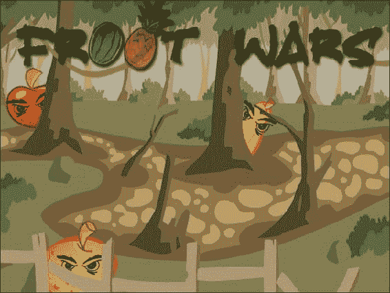
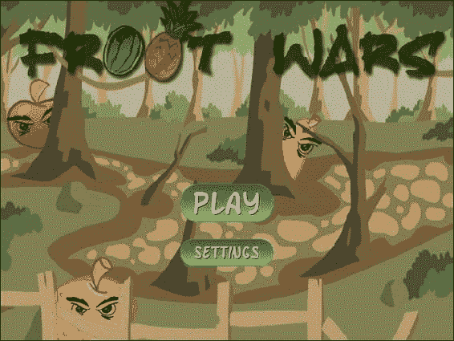
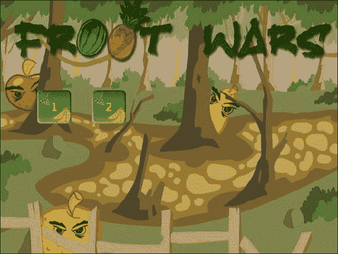
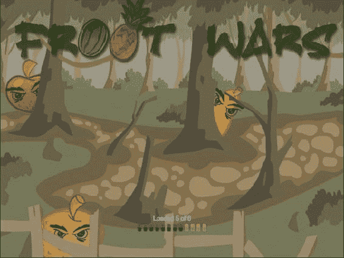
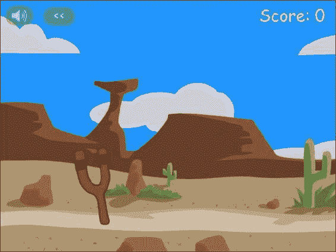
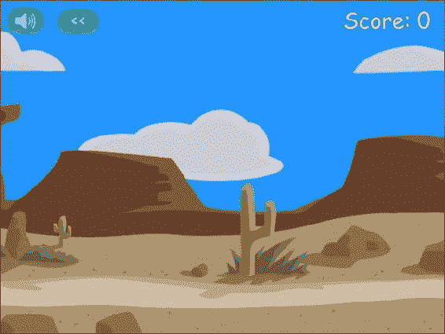

# 二、创造一个基本的游戏世界

支持游戏的智能手机和手持设备的出现，重新激起了人们对简单益智和基于物理的游戏的兴趣，这些游戏可以在短时间内玩。这些游戏大多概念简单，关卡小，简单易学。这种类型中最受欢迎和最著名的游戏之一是愤怒的小鸟(由 Rovio Entertainment 开发)，这是一款益智/策略游戏，玩家使用弹弓向敌人的猪射击小鸟。尽管前提相当简单，但这款游戏已经在全球超过 10 亿台设备上下载和安装。游戏使用物理引擎来逼真地模拟游戏世界中物体的抛掷、碰撞和破碎。

在接下来的三章中，我们将构建我们自己的基于物理学的益智游戏，拥有完整的可玩关卡。我们的游戏，弗鲁特战争，会有水果做主角，垃圾食品做敌人，关卡内还有一些易碎的结构。

我们将实现您在自己的游戏中需要的所有基本组件——闪屏、加载屏幕和预加载器、菜单屏幕、视差滚动、声音、使用 Box2D 物理引擎的真实物理以及记分牌。一旦你有了这个基本框架，你应该能够在你自己的益智游戏中重用这些想法。

所以让我们开始吧。

基本 HTML 布局

我们需要做的第一件事是创建基本的游戏布局。这将由几层组成:

*   *闪屏*:游戏页面加载时显示
*   *游戏开始屏幕*:允许玩家开始游戏或修改设置的菜单
*   *加载/进度屏幕*:每当游戏加载素材(如图像和声音文件)时显示
*   *游戏画布*:实际游戏层
*   *记分牌*:游戏画布上的一个覆盖物，显示一些按钮和分数
*   *结束画面:*每一关结束时显示的画面

这些层中的每一层都将是一个 div 元素或一个 canvas 元素，我们将根据需要显示或隐藏它们。我们将使用 jQuery([`jquery.com/`](http://jquery.com/))来帮助我们完成这些操作任务。代码将被放置在图像和 JavaScript 代码的单独文件夹中。

创建闪屏和主菜单

我们从一个类似于第一章的框架 HTML 文件开始，并为我们的容器添加标记，如清单 2-1 所示。

***清单 2-1。*** 【基本骨架】(index.html)加上图层

```html
<!DOCTYPE html>
<html>
    <head>
        <meta http-equiv= "Content-type" content= "text/html; charset= utf-8">
        <title > Froot Wars</title>
        <script src= "js/jquery.min.js" type= "text/javascript" charset= "utf-8"> </script>
        <script src= "js/game.js" type= "text/javascript" charset= "utf-8"> </script>
        <link rel= "stylesheet" href= "styles.css" type= "text/css" media= "screen" charset= "utf-8">
    </head>
    <body>
        <div id= "gamecontainer">
            <canvas id= "gamecanvas" width= "640" height= "480" class= "gamelayer">
            </canvas>

            <div id= "scorescreen" class= "gamelayer">
                
                
                <span id= "score" > Score: 0</span>
            </div>

            <div id= "gamestartscreen" class= "gamelayer">
                 <br>
                
            </div>

            <div id= "levelselectscreen" class= "gamelayer">
            </div>

            <div id= "loadingscreen" class= "gamelayer">
                <div id= "loadingmessage"> </div>

            </div>

            <div id= "endingscreen" class= "gamelayer">
                <div>
                    <p id= "endingmessage" > The Level Is Over Message</p>
                    <p id= "playcurrentlevel">  Replay Current Level</p>

                    <p id= "playnextlevel">  Play Next Level </p>
                    <p id= "showLevelScreen">  Return to Level Screen</p>
                </div>
            </div>
        </div>
    </body>
</html>
```

如你所见，我们定义了一个主 gamecontainer div 元素，它包含了每个游戏层 : gamestartscreen、levelselectscreen、loadingscreen、scorescreen、endingscreen，最后是 gamecanvas。

此外，我们还将在一个名为 styles.css 的外部文件中为这些层添加 CSS 样式，我们将从为游戏容器和开始菜单屏幕添加样式开始，如清单 2-2 所示。

***清单 2-2。*** 容器和开始屏幕的 CSS 样式(styles.css)

```html
#gamecontainer {
    width:640px;
    height:480px;
    background: url(img/splashscreen.png);
    border: 1px solid black;
}
.gamelayer {
    width:640px;
    height:480px;
    position:absolute;
    display:none;
}
/* Game Starting Menu Screen */
#gamestartscreen {
    padding-top:250px;
    text-align:center;
}
#gamestartscreen img {
    margin:10px;
    cursor:pointer;
}
```

到目前为止，我们已经在这个 CSS 样式表中完成了以下工作:

*   用 640 像素乘 480 像素的尺寸定义我们的游戏容器和所有游戏层。
*   确保所有游戏层都使用绝对定位(它们被放置在彼此之上)来定位，这样我们就可以根据需要显示/隐藏和叠加层。默认情况下，这些层都是隐藏的。
*   将我们的游戏闪屏图像设置为主容器背景，这样当页面加载时玩家首先看到的就是它。
*   为我们的游戏开始屏幕(开始菜单)添加一些样式，该屏幕有开始新游戏和更改游戏设置等选项。

 **注意**所有的图片和源代码都可以在 Apress 网站的源代码/下载区获得([www.apress.com](http://www.apress.com))。如果你想继续，你可以将所有的素材文件复制到一个新的文件夹中，然后自己构建游戏。

如果我们在浏览器中打开我们到目前为止创建的 HTML 文件，我们会看到游戏闪屏被黑色边框包围，如图 2-1 所示。



图 2-1。游戏启动画面

我们需要添加一些 JavaScript 代码来开始显示主菜单、加载屏幕和游戏。为了保持代码的整洁和易于维护，我们将把所有游戏相关的 JavaScript 代码保存在一个单独的文件(js/game.js)中。

我们从定义一个包含大部分游戏代码的游戏对象开始。我们首先需要一个 init()函数，它将在浏览器加载 HTML 文档后被调用。

***清单 2-3。*** 一个基本的游戏对象(js/game.js)

```html
var game = {
    // Start initializing objects, preloading assets and display start screen
    init: function(){

        // Hide all game layers and display the start screen
        $('.gamelayer').hide();
        $('#gamestartscreen').show();

        //Get handler for game canvas and context
        game.canvas = $('#gamecanvas')[0];
        game.context = game.canvas.getContext('2d');
    },
}
```

清单 2-3 中的代码用 init()函数定义了一个名为 game 的 JavaScript 对象。现在，这个 init()函数只是隐藏所有游戏层，并使用 jQuery hide()和 show()函数显示游戏开始屏幕。它还保存了指向游戏画布和上下文的指针，因此我们可以使用 game.context 和 game.canvas 更容易地引用它们。

在确认页面已经完全加载之前试图操作 image 和 div 元素将导致不可预知的行为(包括 JavaScript 错误)。通过在 game.js 的顶部添加一小段 JavaScript 代码，我们可以在窗口加载后安全地调用这个 game.init()方法(如清单 2-4 所示)。

***清单 2-4。*** 调用 game.init()方法安全地使用 load()事件

```html
$(window).load(function() {
    game.init();
});
```

当我们运行我们的 HTML 代码时，浏览器最初显示闪屏，然后在闪屏顶部显示游戏开始屏幕，如图图 2-2 所示。



图 2-2。游戏开始画面和菜单选项

级别选择

到目前为止，我们一直在等待游戏 HTML 文件完全加载，然后显示一个带有两个选项的主菜单。当用户点击播放按钮时，理想情况下，我们会显示一个级别选择屏幕，显示可用级别的列表。

在我们这样做之前，我们需要创建一个对象来处理级别。这个对象将包含级别数据和一些用于处理级别初始化的简单函数。我们将在 game.js 中创建这个 levels 对象，并将它放在 game 对象之后，如清单 2-5 所示。

***清单 2-5。*** 简单关卡对象与关卡数据和功能

```html
var levels = {
    // Level data
    data:[
        {   // First level
            foreground:'desert-foreground',
            background:'clouds-background',
            entities:[]
        },
        {   // Second level
            foreground:'desert-foreground',
            background:'clouds-background',
            entities:[]
        }
    ],
    // Initialize level selection screen
    init:function(){
        var html = "";
        for (var i = 0; i < levels.data.length; i++) {
            var level = levels.data[i];
            html + = ' < input type = "button" value = "' + (i + 1) + '" > ';
        };
        $('#levelselectscreen').html(html);
        // Set the button click event handlers to load level
        $('#levelselectscreen input').click(function(){
            levels.load(this.value-1);
            $('#levelselectscreen').hide();
        });
    },

    // Load all data and images for a specific level
    load:function(number){
    }
}
```

levels 对象有一个数据数组，其中包含每个级别的信息。目前，我们存储的唯一级别信息是背景和前景图像。然而，我们会在每个关卡中加入英雄角色、反派角色和可破坏实体的信息。这将允许我们通过向数组中添加新的项目来非常快速地添加新的级别。

levels 对象包含的下一个东西是 init()函数，它遍历级别数据并为每个级别动态生成按钮。级别按钮 click 事件处理程序被设置为调用每个级别的 load()方法，然后隐藏级别选择屏幕。

我们将从 game.init()方法内部调用 levels.init()来生成关卡选择屏幕按钮。game.init()方法现在看起来如清单 2-6 所示。

***清单 2-6。*** 初始化关卡来自 game.init()

```html
init: function(){
    // Initialize objects
    levels.init();

    // Hide all game layers and display the start screen
    $('.gamelayer').hide();
    $('#gamestartscreen').show();

    //Get handler for game canvas and context
    game.canvas = $('#gamecanvas')[0];
    game.context = game.canvas.getContext('2d');
},
```

我们还需要为 styles.css 中的按钮添加一些 CSS 样式，如清单 2-7 所示。

***清单 2-7。*** 级别选择屏幕的 CSS 样式

```html
/* Level Selection Screen */
#levelselectscreen {
    padding-top:150px;
    padding-left:50px;
}
#levelselectscreen input {
    margin:20px;
    cursor:pointer;
    background:url(img/level.png) no-repeat;
    color:yellow;
    font-size: 20px;
    width:64px;
    height:64px;
    border:0;
}
```

我们需要做的下一件事是在游戏对象内部创建一个简单的 game.showLevelScreen()方法，它隐藏主菜单屏幕并显示等级选择屏幕，如清单 2-8 所示。

***清单 2-8。*** 游戏对象内部的 showLevelScreen 方法

```html
showLevelScreen:function(){
    $('.gamelayer').hide();
    $('#levelselectscreen').show('slow');
},
```

该方法首先隐藏所有其他游戏层，然后显示 levelselectscreen 层，使用慢速动画。

我们需要做的最后一件事是当用户单击播放按钮时调用 game.showLevelScreen()方法。我们通过从播放图像的 onclick 事件中调用方法来实现这一点:

```html

```

现在，当我们启动游戏并点击播放按钮时，游戏会检测关卡的数量，隐藏主菜单，并显示每个关卡的按钮，如图图 2-3 所示。



图 2-3。级别选择屏幕

目前，我们只显示了几个级别。然而，随着我们添加更多的级别，代码将自动检测级别并添加正确数量的按钮(由于 CSS，格式正确)。当用户单击这些按钮时，浏览器将调用我们尚未实现的 levels.load()按钮。

加载图像

在我们实现关卡本身之前，我们需要放置图像加载器和加载屏幕。这将允许我们以编程方式加载一个关卡的图像，并在所有资源加载完毕后开始游戏。

我们将设计一个简单的加载屏幕，其中包含一个动画 GIF 和一个进度条图像，上面的一些文本显示了到目前为止加载的图像数量。首先，我们需要将清单 2-9 中的 CSS 添加到 styles.css 中。

***清单 2-9。*** CSS 为加载屏幕

```html
/* Loading Screen */
#loadingscreen {
    background:rgba(100,100,100,0.3);
}

#loadingmessage {
    margin-top:400px;
    text-align:center;
    height:48px;
    color:white;
    background:url(img/loader.gif) no-repeat center;
    font:12px Arial;
}
```

这个 CSS 在游戏背景上添加了暗淡的灰色，让用户知道游戏当前正在处理一些东西，还没有准备好接收任何用户输入。它还以白色文本显示加载消息。

下一步是基于第一章中的代码创建一个 JavaScript 素材加载器。加载器将实际加载素材，然后更新 loadingscreen div.element。我们将在 game.js 中定义一个加载器对象，如清单 2-10 所示。

***清单 2-10。*** 图像/声音资源加载器

```html
var loader = {
    loaded:true,
    loadedCount:0, // Assets that have been loaded so far
    totalCount:0, // Total number of assets that need to be loaded

         init:function(){
        // check for sound support
        var mp3Support,oggSupport;
        var audio = document.createElement('audio');
        if (audio.canPlayType) {
               // Currently canPlayType() returns: "", "maybe" or "probably"
              mp3Support = "" != audio.canPlayType('audio/mpeg');
              oggSupport = "" != audio.canPlayType('audio/ogg; codecs = "vorbis"');
        } else {
            //The audio tag is not supported
            mp3Support = false;
            oggSupport = false;
        }

        // Check for ogg, then mp3, and finally set soundFileExtn to undefined
        loader.soundFileExtn = oggSupport?".ogg":mp3Support?".mp3":undefined;
    },

    loadImage:function(url){
        this.totalCount++;
        this.loaded = false;
        $('#loadingscreen').show();
        var image = new Image();
        image.src = url;
        image.onload = loader.itemLoaded;
        return image;
    },
    soundFileExtn:".ogg",
    loadSound:function(url){
        this.totalCount++;
        this.loaded = false;
        $('#loadingscreen').show();
        var audio = new Audio();
        audio.src = url + loader.soundFileExtn;
        audio.addEventListener("canplaythrough", loader.itemLoaded, false);
        return audio;
    },
    itemLoaded:function(){
        loader.loadedCount++;
        $('#loadingmessage').html('Loaded ' + loader.loadedCount + ' of ' + loader.totalCount);
        if (loader.loadedCount === loader.totalCount){
            // Loader has loaded completely..
            loader.loaded = true;
            // Hide the loading screen
            $('#loadingscreen').hide();
            //and call the loader.onload method if it exists
            if(loader.onload){
                loader.onload();
                loader.onload = undefined;
            }
        }
    }
}
```

清单 2-10 中的素材加载器拥有我们在第一章中讨论过的相同元素，但是它是以一种更加模块化的方式构建的。它有以下组件:

*   init()方法检测支持的音频文件格式并保存它。
*   加载图像和音频文件的两种方法—loadImage()和 loadSound()。这两种方法都会增加 totalCount 变量，并在调用时显示加载屏幕。
*   每次素材完成加载时调用的 itemLoaded()方法。此方法更新加载的计数和加载消息。一旦加载了所有的素材，加载屏幕就会隐藏，并调用一个可选的 loader.onload()方法(如果定义了的话)。这让我们可以分配一个回调函数，以便在图像加载后调用。

 **注意**使用回调方法可以让我们在图像加载时等待，并在所有图像加载完毕后开始游戏。

在可以使用加载程序之前，我们需要从 game.init()内部调用 loader.init()方法，以便在游戏初始化时加载程序被初始化。game.init()方法现在看起来如清单 2-11 所示。

***清单 2-11。*** 从 game.init() 初始化加载程序

```html
init: function(){
    // Initialize objects
    levels.init();
    loader.init();

    // Hide all game layers and display the start screen
    $('.gamelayer').hide();
    $('#gamestartscreen').show();

    //Get handler for game canvas and context
    game.canvas = $('#gamecanvas')[0];
    game.context = game.canvas.getContext('2d');
},
```

我们将通过调用两个加载方法之一来使用加载器—loadImage()或 loadSound() 。当这些加载方法中的任何一个被调用时，屏幕将显示如图图 2-4 所示的加载屏幕，直到所有的图像和声音被加载。



图 2-4。加载屏幕

 **注意**通过为每个 div 设置不同的背景属性样式，你可以为每个屏幕选择不同的图像。

装载水平

现在我们已经有了一个图像加载器，我们可以开始加载关卡了。现在，让我们通过在 levels 对象中定义 load()方法来加载游戏背景、前景和弹弓图像，如清单 2-12 所示。

***清单 2-12。*** 基本骨架为加载()方法内的关卡对象

```html
// Load all data and images for a specific level
  load:function(number){

      // declare a new currentLevel object
      game.currentLevel = {number:number,hero:[]};
      game.score= 0;
      $('#score').html('Score: ' + game.score);
      var level = levels.data[number];

      //load the background, foreground, and slingshot images
      game.currentLevel.backgroundImage = loader.loadImage("img/" + level.background + ".png");
      game.currentLevel.foregroundImage = loader.loadImage("img/" + level.foreground + ".png");
      game.slingshotImage = loader.loadImage("img/slingshot.png");
      game.slingshotFrontImage = loader.loadImage("img/slingshot-front.png");

      //Call game.start() once the assets have loaded
      if(loader.loaded){
          game.start()
      } else {
          loader.onload = game.start;
      }
  }
```

load()函数创建一个 currentLevel 对象来存储加载的级别数据。到目前为止，我们只加载了三个图像。我们最终将使用这种方法来加载构建游戏所需的英雄、反派和积木。

最后要注意的是，一旦图像被加载，我们就调用 game.start()方法，要么立即调用它，要么设置 onload 回调。这个 start()方法是实际游戏将被绘制的地方。

制作游戏动画

正如在第一章中所讨论的，为了使我们的游戏动画化，我们将使用 requestAnimationFrame 每秒多次调用我们的绘图和动画代码。在我们可以使用 requestAnimationFrame 之前，我们需要将第一章中的 requestAnimation polyfill 函数放在 game.js 的顶部，这样我们就可以在我们的游戏代码中使用它，如清单 2-13 中的所示。

***清单 2-13。*** 请求动画帧聚合填充

```html
// Set up requestAnimationFrame and cancelAnimationFrame for use in the game code
(function() {
    var lastTime = 0;
    var vendors = ['ms', 'moz', 'webkit', 'o'];
    for(var x = 0; x < vendors.length && !window.requestAnimationFrame; ++x) {
        window.requestAnimationFrame = window[vendors[x] + 'RequestAnimationFrame'];
        window.cancelAnimationFrame =
          window[vendors[x] + 'CancelAnimationFrame'] || window[vendors[x] + 'CancelRequestAnimationFrame'];
    }

    if (!window.requestAnimationFrame)
        window.requestAnimationFrame = function(callback, element) {
            var currTime = new Date().getTime();
            var timeToCall = Math.max(0, 16 - (currTime - lastTime));
            var id = window.setTimeout(function() { callback(currTime + timeToCall); },
              timeToCall);
            lastTime = currTime + timeToCall;
            return id;
        };
    if (!window.cancelAnimationFrame)
        window.cancelAnimationFrame = function(id) {
            clearTimeout(id);
        };
}());
```

接下来，我们使用 game.start()方法来设置动画循环，然后在 game.animate()方法中绘制关卡。代码如清单 2-14 所示。

***清单 2-14。*** 游戏对象内部的 start()和 animate()函数

```html
// Game mode
mode:"intro",
// X & Y Coordinates of the slingshot
slingshotX:140,
slingshotY:280,
start:function(){
    $('.gamelayer').hide();
    // Display the game canvas and score
    $('#gamecanvas').show();
    $('#scorescreen').show();

    game.mode = "intro";
    game.offsetLeft = 0;
    game.ended = false;
    game.animationFrame = window.requestAnimationFrame(game.animate,game.canvas);
},
handlePanning:function(){
    game.offsetLeft++; // Temporary placeholder – keep panning to the right
},
animate:function(){
    // Animate the background
   game.handlePanning();

   // Animate the characters

    //  Draw the background with parallax scrolling

game.context.drawImage(game.currentLevel.backgroundImage,game.offsetLeft/4,0,640,480,0,0,640,480);

game.context.drawImage(game.currentLevel.foregroundImage,game.offsetLeft,0,640,480,0,0,640,480);

    // Draw the slingshot

    game.context.drawImage(game.slingshotImage,game.slingshotX-game.offsetLeft,game.slingshotY);
    game.context.drawImage(game.slingshotFrontImage,game.slingshotX-game.offsetLeft,game.slingshotY);

      if (!game.ended){
        game.animationFrame = window.requestAnimationFrame(game.animate,game.canvas);
    }
}
```

同样，前面的代码包含两个方法，game.start()和 game.animate()。start()方法执行以下操作:

*   初始化一些我们在游戏中需要的变量——offset left 和 mode。offsetLeft 将用于围绕整个关卡平移游戏视图，mode 将用于存储游戏的当前状态(intro，wait for firing，fireing，fired)。
*   隐藏所有其他层并显示画布层和乐谱层，乐谱层是屏幕顶部的一个窄条，包含。
*   使用 window.requestAnimationFrame 设置游戏动画间隔以调用 animate()函数。

更大的方法 animate()将完成游戏中所有的动画和绘图。该方法从临时占位符开始，用于动画背景和字符。我们将在稍后实现这些。然后，我们使用 offsetLeft 变量来偏移图像的 x 轴，从而绘制背景和前景图像。最后，我们检查是否设置了 game.ended 标志，如果没有，使用 requestAnimationFrame 再次调用 animate()。我们可以稍后使用 game.ended 标志来决定何时停止动画循环。

需要注意的一点是，背景图像和前景图像相对于向左滚动的速度不同:背景图像移动的距离仅为前景图像移动距离的四分之一。这两层移动速度的差异会给我们一种错觉，当我们开始在关卡周围移动时，云离我们更远了。

最后，我们在前景中画出弹弓。

 **注意**视差滚动是一种通过移动背景图像比前景图像慢来创造深度错觉的技术。这项技术利用了这样一个事实，即远处的物体看起来总是比近处的物体移动得慢。

在我们尝试这段代码之前，我们需要在 styles.css 中添加一些 CSS 样式来实现我们的乐谱屏幕面板，如清单 2-15 所示。

***清单 2-15。*** CSS 为乐谱屏幕面板

```html
/* Score Screen */
#scorescreen  {
    height:60px;
    font: 32px Comic Sans MS;
    text-shadow: 0 0 2px #000;
    color:white;
}

#scorescreen img{
    opacity:0.6;
    top:10px;
    position:relative;
    padding-left:10px;
    cursor:pointer;
}

#scorescreen #score {
    position:absolute;
    top:5px;
    right:20px;
}
```

与其他层不同，scorescreen 层只是我们游戏顶部的一个窄带。我们还增加了一些透明度，以确保图像(用于停止音乐和重新开始关卡)不会干扰游戏的其他部分。

当我们运行这段代码并尝试开始一个关卡时，我们应该会看到一个在右上角带有分数栏的基础关卡，如图图 2-5 所示。



图 2-5。一个基本水平与分数

我们粗略的平移实现目前会导致屏幕慢慢向右平移，直到图像不再可见。不要担心，我们将很快致力于更好的实现。

正如你所看到的，背景中的云比前景移动得慢。我们可能会添加更多的层，并以不同的速度移动它们，以建立更多的效果，但这两个图像很好地说明了这种效果。

现在我们已经有了一个基本的关卡，我们将添加处理鼠标输入的能力，并实现游戏状态的平移。

处理鼠标输入

JavaScript 有几个事件可以用来捕获鼠标输入——mousedown、mouseup 和 mousemove。为了简单起见，我们将使用 jQuery 在 game.js 中创建一个单独的鼠标对象来处理所有的鼠标事件，如清单 2-16 所示。

***清单 2-16。*** 处理鼠标事件

```html
var mouse = {
    x:0,
    y:0,
    down:false,
    init:function(){
        $('#gamecanvas').mousemove(mouse.mousemovehandler);
        $('#gamecanvas').mousedown(mouse.mousedownhandler);
        $('#gamecanvas').mouseup(mouse.mouseuphandler);
        $('#gamecanvas').mouseout(mouse.mouseuphandler);
    },
    mousemovehandler:function(ev){
        var offset = $('#gamecanvas').offset();
        mouse.x = ev.pageX - offset.left;
        mouse.y = ev.pageY - offset.top;
        if (mouse.down) {
            mouse.dragging = true;
        }
    },
    mousedownhandler:function(ev){
        mouse.down = true;
        mouse.downX = mouse.x;
        mouse.downY = mouse.y;
        ev.originalEvent.preventDefault();
    },
    mouseuphandler:function(ev){
        mouse.down = false;
        mouse.dragging = false;
    }
}
```

这个鼠标对象有一个 init()方法，该方法为鼠标移动、按下或释放鼠标按钮以及鼠标离开画布区域设置事件处理程序。下面是我们使用的三种处理程序方法:

*   mousemovehandler():使用 jQuery 的 offset()方法和事件对象的 pageX 和 pageY 属性计算鼠标相对于画布左上角的 x 和 y 坐标，并存储它们。它还检查鼠标移动时鼠标按钮是否被按下，如果是，则将拖动变量设置为 true。
*   mousedownhandler():将 mouse.down 变量设置为 true，并存储按下鼠标按钮的位置。此外，它还包含一行额外的代码，用于防止单击按钮的默认浏览器行为。
*   mouseuphandler():将向下和拖动变量设置为 false。如果鼠标离开画布区域，我们调用这个相同的方法。

现在我们已经有了这些方法，我们可以根据需要添加更多的代码来与游戏元素进行交互。我们还可以从游戏中的任何地方访问 mouse.x、mouse.y、mouse.dragging 和 mouse.down 属性。和之前所有的 init()方法一样，我们从 game.init()调用这个方法，所以它现在看起来如清单 2-17 所示。

***清单 2-17。*** 从 game.init()初始化鼠标

```html
init: function(){
    // Initialize objects
    levels.init();
    loader.init();
    mouse.init();

    // Hide all game layers and display the start screen
    $('.gamelayer').hide();
    $('#gamestartscreen').show();

    //Get handler for game canvas and context
    game.canvas = $('#gamecanvas')[0];
    game.context = game.canvas.getContext('2d');
},
```

有了这些功能，现在让我们实现一些基本的游戏状态和平移。

定义我们的游戏状态

还记得我们之前在创建 game.start()时简单提到的 game.mode 变量吗？好吧，这就是它出现的原因。我们将在这个变量中存储游戏的当前状态。我们期望游戏经历的一些模式或状态如下:

*   介绍:关卡已经载入，游戏将会在关卡周围移动一次，向玩家展示关卡中的所有东西。
*   加载下一个英雄:游戏检查是否有另一个英雄加载到弹弓上，如果有，加载这个英雄。如果我们用完了英雄或者所有的反派都被消灭了，关卡就结束了。
*   等待开火:游戏回到弹弓区域，等待玩家发射“英雄”此时，我们正在等待用户点击英雄。用户也可以选择用鼠标拖动画布屏幕来在该级别周围平移。
*   开火:这发生在用户点击英雄之后，释放鼠标按钮之前。此时，我们正在等待用户拖动鼠标来决定射击英雄的角度和高度。
*   触发:这发生在用户释放鼠标按钮之后。此时，我们启动 hero，让物理引擎处理一切，而用户只是观看。游戏将平移，以便用户可以尽可能地遵循英雄的路径。

我们可以根据需要实现更多的状态。关于这些不同的状态，需要注意的一点是，一次只能有一种状态，从一种状态转换到另一种状态有明确的条件，以及在每种状态下可能发生的情况。这种构造在计算机科学中被普遍称为*有限状态机* 。我们将使用这些状态为我们的平移代码创建一些简单的条件，如清单 2-18 所示。所有这些代码都放在 start()方法之后的游戏对象中。

***清单 2-18。*** 使用游戏模式实现平移

```html
// Maximum panning speed per frame in pixels
maxSpeed:3,
// Minimum and Maximum panning offset
minOffset:0,
maxOffset:300,
// Current panning offset
offsetLeft:0,
// The game score
score:0,

//Pan the screen to center on newCenter
panTo:function(newCenter){
    if (Math.abs(newCenter-game.offsetLeft-game.canvas.width/4) > 0
        && game.offsetLeft < = game.maxOffset && game.offsetLeft > = game.minOffset){

        var deltaX = Math.round((newCenter-game.offsetLeft-game.canvas.width/4)/2);
        if (deltaX && Math.abs(deltaX) > game.maxSpeed){
            deltaX = game.maxSpeed*Math.abs(deltaX)/(deltaX);
        }
        game.offsetLeft + = deltaX;
    } else {
        return true;
    }
    if (game.offsetLeft < game.minOffset){
        game.offsetLeft = game.minOffset;
        return true;
    } else if (game.offsetLeft > game.maxOffset){
        game.offsetLeft = game.maxOffset;
        return true;
    }
    return false;
},
handlePanning:function(){
    if(game.mode=="intro"){
        if(game.panTo(700)){
            game.mode = "load-next-hero";
        }
    }
    if(game.mode=="wait-for-firing"){
        if (mouse.dragging){
            game.panTo(mouse.x + game.offsetLeft)
        } else {
            game.panTo(game.slingshotX);
        }
    }
    if (game.mode=="load-next-hero"){
        // TODO:
        // Check if any villains are alive, if not, end the level (success)
        // Check if there are any more heroes left to load, if not end the level (failure)
        // Load the hero and set mode to wait-for-firing
        game.mode = "wait-for-firing";
    }
    if(game.mode == "firing"){
        game.panTo(game.slingshotX);
    }
    if (game.mode == "fired"){
        // TODO:
        // Pan to wherever the hero currently is
    }
},
```

我们首先创建一个名为 panTo() 的方法，该方法缓慢地将屏幕平移到给定的 x 坐标，如果坐标在屏幕的中心附近，或者如果屏幕已经平移到最左边或最右边，则返回 true。它还使用 maxSpeed 来限制平移速度，以便平移不会变得太快。我们还改进了 handlePanning()方法，因此它实现了我们之前描述的一些游戏状态。我们还没有实现 load-current-hero、firing 和 fired 状态。

如果我们运行目前的代码，我们会看到当关卡开始时，屏幕向右移动，直到到达最右边，panTo()返回 true(见图 2-6 )。然后游戏模式从“开始”变为“等待开火”,屏幕慢慢回到开始位置，等待用户输入。我们也可以拖动鼠标到屏幕的左边或右边来查看关卡。



图 2-6。最终结果:在关卡周围平移

摘要

在这一章中，我们开始为我们的游戏开发基本框架。

我们从定义和实现闪屏和游戏菜单开始。然后我们创建了一个简单的关卡系统和一个素材加载器来动态加载每个关卡使用的图像。我们设置了游戏画布和动画循环，并实现了视差滚动，以产生深度错觉。我们使用游戏状态来简化我们的游戏流程，并以一种有趣的方式在我们的关卡中移动。最后，我们捕获并使用鼠标事件来让用户在关卡周围平移。

在这一点上，我们有一个基本的游戏世界，我们可以与之互动，所以我们准备添加各种游戏实体和游戏物理。

在下一章中，我们将学习 Box2D 物理引擎的基础知识，并用它来为我们的游戏建立物理模型。我们将学习如何使用来自物理引擎的数据来激活我们的角色。然后，我们将把这个引擎与我们现有的框架集成起来，这样游戏实体就可以在我们的游戏世界中逼真地移动，之后我们就可以真正开始玩游戏了。