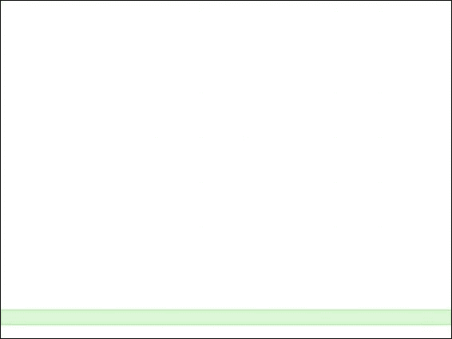
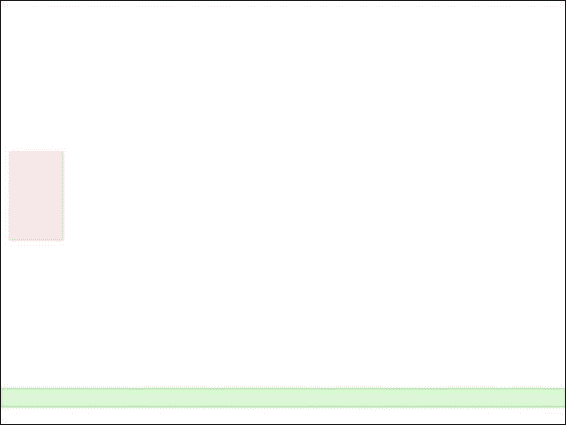
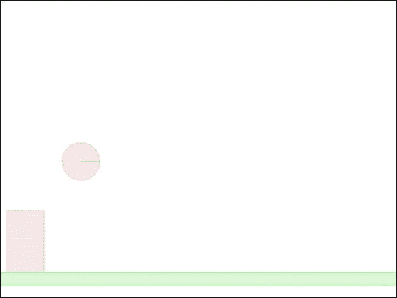
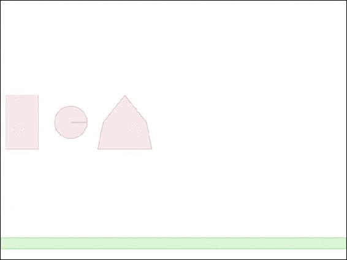
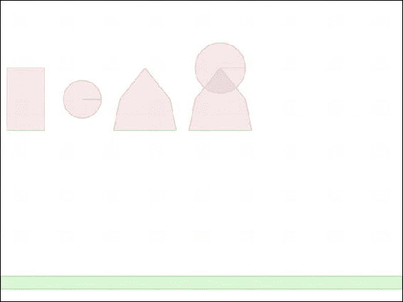
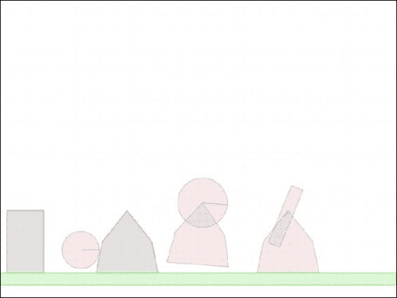
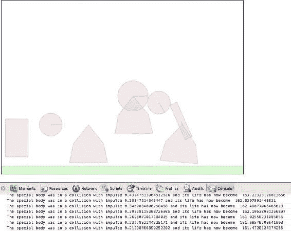
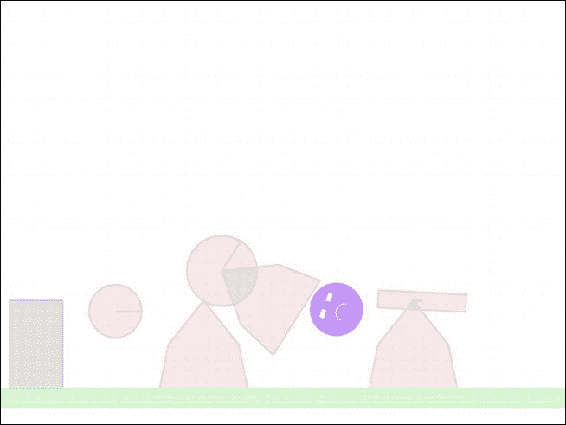

# 三、物理引擎基础知识

物理引擎是一个程序，它通过为游戏中的所有对象交互和碰撞创建数学模型来提供游戏世界的近似模拟。它考虑了重力、弹性、摩擦和碰撞物体之间的动量守恒，从而使物体以可信的方式运动。对于我们的游戏，我们将使用一个现有的非常流行的物理引擎，叫做 Box2D。

Box2D 引擎是一个免费的开源物理引擎，最初由 Erin Catto 用 C++编写。它已经被用在很多流行的基于物理的游戏中，包括*蜡笔物理豪华版*、*罗兰多*和*愤怒的小鸟*。该引擎后来被移植到其他几种语言，包括 Java、ActionScript、C#和 JavaScript。我们将使用 Box2D 的 JavaScript 端口，称为 Box2dWeb。你可以在 http://code.google.com/p/box2dweb/[找到最新的 Box2dWeb 源代码和文档。](http://code.google.com/p/box2dweb/)

在我们开始将引擎集成到我们自己的游戏中之前，让我们回顾一下使用 Box2D 创建和模拟世界的一些基本组件。

Box2D 基础知识

Box2D 使用一些基本对象来定义和模拟游戏世界。这些物体中最重要的如下:

*   *世界*:包含所有世界对象并模拟游戏物理的主 Box2D 对象。
*   *身体*:可能由一个或多个形状组成的刚体，通过固定装置附着在身体上。
*   *形状*:一个二维形状，如圆形或多边形，它们是 Box2D 中使用的基本形状。
*   *Fixture* :用于将一个图形附加到一个物体上进行碰撞检测。夹具保存附加的非几何数据，如摩擦、碰撞和过滤器。
*   *关节*:用于以不同的方式将两个物体约束在一起。例如，旋转关节约束两个实体共享一个公共点，同时它们可以围绕该点自由旋转。

在我们的游戏中使用 Box2D 时，首先需要定义游戏世界。然后，我们使用夹具添加几何体及其相应的形状。一旦这样做了，我们就在这个世界里走来走去，让 Box2D 移动身体。最后，我们在每一步之后画出身体。大部分繁重的工作由 Box2D 世界对象来完成。

现在，当我们使用 Box2D 创建一个简单的世界时，让我们更详细地看看这些步骤。

设置 Box2D

我们将从一个简单的 HTML 文件开始，就像前面的章节一样(box2d.html)。我们需要做的第一件事是在 HTML 文件的 head 部分包含对 Box2dWeb 库(Box2dWeb-2.1.a.3.min.js)的引用(参见清单 3-1 )。

***清单 3-1。*** 基本 HTML5 文件为 Box2D(box2d.html)

```html
<!DOCTYPE html>
<html>
    <head>
        <meta http-equiv="Content-type" content="text/html; charset=utf-8">
        <title>Box2d Test</title>
        <script src="Box2dWeb-2.1.a.3.min.js" type="text/javascript" charset="utf-8"></script>
        <script src="box2d.js" type="text/javascript" charset="utf-8"></script>
    </head>
    <body onload="init();">
        <canvas id="canvas" width="640" height="480" style="border:1px solid black;">Your browser does not support HTML5 Canvas</canvas>
    </body>
</html>
```

正如你在清单 3-1 中看到的，box2d.html 文件只包含一个我们将要绘制的画布元素。我们引用两个 JavaScript 文件:Box2dWeb 库文件和第二个文件，我们将使用它来存储所有的 JavaScript 代码(box2d.js)。一旦 HTML 文件被完全加载，它将调用一个 init()函数，我们将用它来初始化 Box2D 世界并开始制作动画。

引用 Box2dWeb JavaScript 文件可以让我们在 JavaScript 代码中访问 Box2D 对象。这个对象包含了我们需要的所有对象，包括世界(Box2D。Dynamics.b2World)和车身(Box2D。Dynamics.b2Body)。

将常用的对象定义为变量是很方便的，这样在引用它们的时候可以节省一些打字的工作量。我们将在 JavaScript 文件(box2d.js)中做的第一件事是声明这些变量(见清单 3-2)。

***清单 3-2。*** 将常用对象定义为变量

```html
// Declare all the commonly used objects as variables for convenience
var b2Vec2 = Box2D.Common.Math.b2Vec2;
var b2BodyDef = Box2D.Dynamics.b2BodyDef;
var b2Body = Box2D.Dynamics.b2Body;
var b2FixtureDef = Box2D.Dynamics.b2FixtureDef;
var b2Fixture = Box2D.Dynamics.b2Fixture;
var b2World = Box2D.Dynamics.b2World;
var b2PolygonShape = Box2D.Collision.Shapes.b2PolygonShape;
var b2CircleShape = Box2D.Collision.Shapes.b2CircleShape;
var b2DebugDraw = Box2D.Dynamics.b2DebugDraw;
var b2RevoluteJointDef = Box2D.Dynamics.Joints.b2RevoluteJointDef;
```

一旦我们将这些变量定义为快捷方式，我们就可以访问 Box2D。Dynamics.b2World，方法是使用 b2World 变量。现在，让我们开始定义我们的世界。

定义世界

盒子 2D。Dynamics.b2World 对象是 Box2D 的心脏。它包含了添加和删除对象的方法，以增量方式模拟物理的方法，甚至还有一个在画布上绘制世界的选项。在开始使用 Box2D 之前，我们需要创建 b2World 对象。我们在 JavaScript 文件(box2d.js)中创建的 init()函数中实现了这一点，如清单 3-3 所示。

***清单 3-3。*** 创建 B2 世界对象

```html
var world;
var scale = 30; //30 pixels on our canvas correspond to 1 meter in the Box2d world
function init(){
    // Set up the Box2d world that will do most of the physics calculation
    var gravity = new b2Vec2(0,9.8); //declare gravity as 9.8 m/s² downward
    var allowSleep = true; //Allow objects that are at rest to fall asleep and be excluded from calculations
    world = new b2World(gravity,allowSleep);
}
```

init()函数首先定义 b2World，并向其构造函数传递以下两个参数:

*   gravity: 使用一个 b2Vec2 对象定义为一个向量，它有两个参数，x 和 y 分量。我们把世界重力设定为向下方向每平方秒 9.8 米。设置自定义重力的能力让我们可以模拟具有不同重力场的环境，例如月球或重力非常低或非常高的幻想世界。我们也可以将 gravity 设置为 0，只对不需要重力的游戏(基于空间的游戏或赛车游戏之类的自上而下视图游戏)使用 Box2D 的碰撞检测功能。
*   b2World 使用 allowSleep: 来决定在模拟计算中是否包括静止的对象。允许将静止的对象排除在计算之外可以减少不必要的计算，从而有助于提高性能。即使一个物体在睡觉，如果有运动的物体与之碰撞，它也会醒来。

我们在代码中做的另一件事是定义一个 scale 变量，我们将使用它在 Box2D 单位(米)和游戏单位(像素)之间进行转换。

 **注** Box2D 所有计算都使用公制。它最适用于 0.1 米到 10 米大的物体。因为我们在画布上绘图时使用像素，所以我们需要在像素和米之间进行转换。常用的比例是 30 像素比 1 米。

现在我们有了一个基本的世界，我们需要开始给它添加身体。我们将创建的第一个实体是我们世界底部的静态地板。

添加我们的第一个身体:地板

在 Box2D 中创建任何几何体包括以下步骤:

1.  在 b2BodyDef 对象中声明一个体定义。b2BodyDef 对象包含诸如主体位置(x 和 y 坐标)和主体类型(静态或动态)的细节。静态物体不受重力和与其他物体碰撞的影响。
2.  在 b2FixtureDef 对象中声明一个 fixture 定义。这用于将形状附加到几何体上。夹具定义还包含附加信息，如密度、摩擦系数和附着形状的恢复系数。
3.  设置夹具定义的形状。Box2D 中使用的两种形状是多边形(b2PolygonShape)和圆形(b2CircleShape)。
4.  将 Body 定义对象传递给世界的 createBody()方法，并获取一个 body 对象。
5.  将 fixture 定义传递给 body 对象的 createFixture()方法，并将形状附加到 body。

现在我们知道了这些基本步骤，我们将创建我们在这个世界里的第一个身体:地板。我们将通过在前面创建的 init()函数的正下方创建一个 createFloor()方法来实现这一点。这显示在清单 3-4 中。

***清单 3-4。*** 创建楼层

```html
function createFloor(){
    //A body definition holds all the data needed to construct a rigid body.
    var bodyDef = new b2BodyDef;
    bodyDef.type = b2Body.b2_staticBody;
    bodyDef.position.x = 640/2/scale;
    bodyDef.position.y = 450/scale;

    // A fixture is used to attach a shape to a body for collision detection.
    // A fixture definition is used to create a fixture.
    var fixtureDef = new b2FixtureDef;
    fixtureDef.density = 1.0;
    fixtureDef.friction = 0.5;
    fixtureDef.restitution = 0.2;

    fixtureDef.shape = new b2PolygonShape;
    fixtureDef.shape.SetAsBox(320/scale,10/scale); //640 pixels wide and 20 pixels tall

    var body = world.CreateBody(bodyDef);
    var fixture = body.CreateFixture(fixtureDef);
}
```

我们做的第一件事是定义一个 bodyDef 对象。我们将其类型设置为 static (b2Body.b2_staticBody ),因为我们希望我们的地板保持在同一位置，不受重力或与其他物体碰撞的影响。然后，我们将身体的位置设置在画布底部附近(x = 320 像素，y = 450 像素),并使用 scale 变量将 Box2D 的像素转换为米。

 **注意**与画布不同，矩形的位置基于左上角，Box2D 主体的位置基于对象的原点。对于使用 SetAsBox()创建的盒子，原点位于盒子的中心。

接下来我们要做的是定义 fixture 定义(fixtureDef)。夹具定义包含密度、摩擦系数以及其附着形状的恢复系数等值。密度用于计算身体的重量，摩擦系数用于确保身体真实地滑动，恢复用于使身体弹跳。

 **注意**恢复系数越高，物体变得越“有弹性”。接近 0 的值意味着物体不会反弹，并将在碰撞中失去大部分动量(称为非弹性碰撞)。接近 1 的值意味着物体保留了大部分动量，并会像它来时一样快地反弹回来(称为弹性碰撞)。

然后，我们将夹具的形状设置为 B2 多边形对象。b2PolygonShape 对象有一个名为 SetAsBox()的辅助方法，该方法将多边形设置为一个以父体原点为中心的长方体。SetAsBox()方法将盒子的半宽和半高(范围)作为参数。同样，我们使用 scale 变量来定义一个 640 像素宽、20 像素高的方框。

最后，我们通过将 bodyDef 传递给 world 来创建身体。CreateBody()并通过将 fixtureDef 传递给 Body 来创建 fixture。CreateFixture()。

我们需要做的另一件事是从我们之前声明的 init()函数内部调用这个新创建的方法，以便在调用 init()函数时创建这个主体。init()函数现在看起来像清单 3-5 中的。

***清单 3-5。*** 从 init()调用 createFloor()

```html
function init(){
    // Set up the box2d World that will do most of the physics calculation
    var gravity = new b2Vec2(0,9.8); //declare gravity as 9.8 m/s² downward
    var allowSleep = true; //Allow objects that are at rest to fall asleep and be excluded from calculations
    world = new b2World(gravity,allowSleep);

    createFloor();
}
```

现在我们已经为世界添加了第一个身体，我们需要学习如何绘制世界，以便我们可以看到我们迄今为止所创造的东西。

绘制世界:设置调试图形

Box2D 主要用于处理物理计算的引擎，而我们自己处理绘制世界上所有的物体。然而，Box2D 世界对象为我们提供了一个简单的 DrawDebugData()方法，我们可以用它在给定的画布上绘制世界。

DrawDebugData()方法绘制了世界内部物体的一个非常简单的表示，最适合用来帮助我们在创建世界时可视化世界。

在使用 DrawDebugData()之前，我们需要通过定义一个 b2DebugDraw()对象并将其传递给世界来设置调试绘图。SetDebugDraw()方法。我们在一个 setupDebugDraw()方法中这样做，我们将把它放在 box2d.js 中的 createFloor()方法之下(见清单 3-6 )。

***清单 3-6。*** 设置调试图纸

```html
var context;
function setupDebugDraw(){
    context = document.getElementById('canvas').getContext('2d');

    var debugDraw = new b2DebugDraw();

    // Use this canvas context for drawing the debugging screen
    debugDraw.SetSprite(context);
    // Set the scale
    debugDraw.SetDrawScale(scale);
    // Fill boxes with an alpha transparency of 0.3
    debugDraw.SetFillAlpha(0.3);
    // Draw lines with a thickness of 1
    debugDraw.SetLineThickness(1.0);
    // Display all shapes and joints
    debugDraw.SetFlags(b2DebugDraw.e_shapeBit | b2DebugDraw.e_jointBit);

    // Start using debug draw in our world
    world.SetDebugDraw(debugDraw);
}
```

我们首先定义画布上下文的句柄。然后，我们创建一个新的 b2DebugDraw 对象，并使用它的 set 方法设置一些属性:

*   SetSprite():用于为绘图提供画布上下文。
*   SetDrawScale():用于设置 Box2D 单位和像素之间转换的比例。
*   SetFillAlpha()和 SetLineThickness():用于设置绘制样式。
*   SetFlags():用于选择要绘制哪些 Box2D 实体。我们选择了用于绘制所有形状和关节的标志，并使用逻辑 or 操作符来组合这两个标志。我们可以让 Box2D 绘制的一些其他实体是质心(e_centerOfMassBit)和轴对齐的边界框(e_aabbBit)。

最后，我们将 debugDraw 对象传递给世界。SetDebugDraw()方法。创建函数后，我们需要从 init()函数内部调用它。init()函数现在看起来像清单 3-7 中的。

***清单 3-7。*** 从 init()调用 setupDebugDraw()

```html
function init(){
    // Set up the box2d World that will do most of the physics calculation
    var gravity = new b2Vec2(0,9.8); //declare gravity as 9.8 m/s² downward
    var allowSleep = true; //Allow objects that are at rest to fall asleep and be excluded from calculations
    world = new b2World(gravity,allowSleep);

    createFloor();

    setupDebugDraw();
}
```

现在调试图已经设置好了，我们可以使用这个世界了。DrawDebugData()方法将 Box2D 世界的当前状态绘制到画布上。

让世界充满活力

使用 Box2D 制作世界动画包括以下步骤，我们在动画循环中重复这些步骤:

1.  告诉 Box2D 以一个小的时间步长(通常为 1/60 秒)运行模拟。我们通过利用世界来做到这一点。Step()函数。
2.  使用任意一个世界，在新的位置绘制所有的物体。DrawDebugData()或我们自己的绘图函数。
3.  清除我们使用世界施加的任何力。ClearForces()。

我们可以在自己的 animate()函数中实现这些步骤，这个函数是在 init()之后的 box2d.js 中创建的，如清单 3-8 所示。

***清单 3-8。*** 设置一个 Box2D 动画循环

```html
var timeStep = 1/60;

//As per the Box2d manual, the suggested iteration count for Box2D is 8 for velocity and 3 for position.
var velocityIterations = 8;
var positionIterations = 3;

function animate(){
    world.Step(timeStep,velocityIterations,positionIterations);
    world.ClearForces();

    world.DrawDebugData();

    setTimeout(animate, timeStep);

}
```

我们首先调用 world.step()并向其传递三个参数:时间步长、速度迭代和位置迭代。

Box2D 使用一种叫做*积分器*的计算算法。积分器在离散的时间点模拟物理方程。时间步长是我们希望 Box2D 模拟的时间量。我们将这个值设置为 1/60 秒。

除了积分器，Box2D 还使用了一个更大的代码，叫做*约束解算器*。约束求解器解决模拟中的所有约束，一次一个。为了得到一个好的解决方案，我们需要多次迭代所有的约束。约束求解器中有两个阶段:速度阶段和位置阶段。每个阶段都有自己的迭代次数，我们将这两个值分别设置为 8 和 3。

 **注意**一般来说，游戏的物理引擎在至少 60Hz 或 1/60 秒的时间步长下工作良好。根据 Erin Catto 的原始 C++ * Box2D v2.2.0 用户手册*(可在[`box2d.org/manual.pdf`](http://box2d.org/manual.pdf)获得)，最好保持时间步长不变，不要随着帧速率而变化，因为可变的时间步长会产生可变的结果，这使得调试变得困难。

同样根据 Box2d C++手册，Box2d 的建议迭代次数是速度 8 次，位置 3 次。您可以根据自己的喜好调整这些数字，但请记住，这需要在速度和准确性之间进行权衡。使用较少的迭代次数可以提高性能，但精度会受到影响。同样，使用更多迭代会降低性能，但会提高模拟的质量。

在逐步完成模拟后，我们调用 world。ClearForces()清除应用于实体的任何力。我们称之为世界。DrawDebugData()在画布上绘制世界。

最后，我们使用 setTimeout()在下一个时间步超时后再次调用动画循环。我们现在使用 setTimeout()，因为使用 Box2d 更简单。Step()函数具有恒定的帧速率。在下一章中，我们将看看如何使用 requestAnimationFrame()和一个可变的帧速率来将 Box2D 集成到我们的游戏中。

现在动画循环已经完成，我们可以通过调用 init()函数中的这些新方法来查看我们到目前为止已经创建的世界。更新后的 init()函数现在看起来像清单 3-9 中的。

***清单 3-9。*** 更新了 init()函数

```html
function init(){
    // Set up the box2d World that will do most of the physics calculation
    var gravity = new b2Vec2(0,9.8); //declare gravity as 9.8 m/s² downward
    var allowSleep = true; //Allow objects that are at rest to fall asleep and be excluded from calculations
    world = new b2World(gravity,allowSleep);

    createFloor();

    setupDebugDraw();
    animate();
}
```

当我们在浏览器中打开 box2d.html 时，我们应该会看到我们的世界被绘制成地板，如图图 3-1 所示。



图 3-1。我们的第一款 Box2D 车身:地板

这看起来还不太像。地板是一个静止的物体，漂浮在画布的底部。然而，现在我们已经设置好了创建我们的基本世界并将其显示在屏幕上的一切，我们可以开始向我们的世界添加更多的 Box2D 元素。

更多 Box2D 元素

Box2D 允许我们向我们的世界添加不同类型的元素，包括以下内容:

*   矩形、圆形或多边形的简单几何体
*   组合多种形状的复杂几何体
*   连接多个实体的关节，如旋转关节
*   联系允许我们处理冲突事件的侦听器

现在，我们将依次更详细地了解这些元素。

创建矩形体

我们可以创建一个矩形体，就像创建地板一样——通过定义一个 b2PolygonShape 并使用它的 SetAsBox()方法。我们将在一个名为 createRectangularBody()的新方法中完成这项工作，我们将把它添加到 box2d.js 中(参见清单 3-10 )。

***清单 3-10。*** 创建一个矩形体

```html
function createRectangularBody(){
    var bodyDef = new b2BodyDef;
    bodyDef.type = b2Body.b2_dynamicBody;
    bodyDef.position.x = 40/scale;

    bodyDef.position.y = 100/scale;
    var fixtureDef = new b2FixtureDef;
    fixtureDef.density = 1.0;
    fixtureDef.friction = 0.5;
    fixtureDef.restitution = 0.3;

    fixtureDef.shape = new b2PolygonShape;
    fixtureDef.shape.SetAsBox(30/scale,50/scale);

    var body = world.CreateBody(bodyDef);
    var fixture = body.CreateFixture(fixtureDef);
}
```

我们创建一个 body 定义，并将其放置在画布顶部附近，x = 40 像素，y = 100 像素。这次的一个区别是，我们将 body 类型定义为 dynamic (b2Body.b2_dynamicBody)。这意味着身体会受到重力和碰撞的影响。然后，我们用一个多边形定义夹具，这个多边形被设置为一个 60 像素宽、100 像素高的盒子。最后，我们将身体加入我们的世界。

我们需要在 init()函数中添加一个对 createRectangularBody()的调用，以便在页面加载时调用它。init()函数现在看起来像清单 3-11 中的。

***清单 3-11。*** 从 init()调用 createRectangularBody()

```html
function init(){
    // Set up the box2d World that will do most of the physics calculation
    var gravity = new b2Vec2(0,9.8); //declare gravity as 9.8 m/s² downward
    var allowSleep = true; //Allow objects that are at rest to fall asleep and be excluded from calculations
    world = new b2World(gravity,allowSleep);

    createFloor();
    // Create some bodies with simple shapes
    createRectangularBody();

    setupDebugDraw();
    animate();
}
```

当我们在浏览器中运行代码时，我们应该会看到我们刚刚创建的新主体，如图 3-2 所示。



图 3-2。我们的第一个动态物体:一个跳动的矩形

由于这个物体是动态的，它会因为重力而向下坠落，直到撞到地板，然后从地板上弹开。每次弹跳后，身体上升到一个较低的高度，直到最后落在地板上。如果我们愿意，我们可以改变恢复系数来决定物体的弹性。

 **注意**一旦身体静止，Box2D 会改变身体的颜色，使其变暗。这就是 Box2D 告诉我们物体被认为处于睡眠状态的方式。如果另一个物体与它碰撞，Box2D 将唤醒一个物体。

创建圆形几何体

我们将创建的下一个几何体是一个简单的圆形几何体。我们可以通过将 shape 属性设置为 b2CircleShape 对象来定义圆形。我们将在一个名为 createCircularBody()的新方法中这样做，我们将把它添加到 box2d.js 中，如清单 3-12 所示。

***清单 3-12。*** 创建圆形

```html
function createCircularBody(){
    var bodyDef = new b2BodyDef;
    bodyDef.type = b2Body.b2_dynamicBody;
    bodyDef.position.x = 130/scale;
    bodyDef.position.y = 100/scale;

    var fixtureDef = new b2FixtureDef;
    fixtureDef.density = 1.0;
    fixtureDef.friction = 0.5;
    fixtureDef.restitution = 0.7;

    fixtureDef.shape = new b2CircleShape(30/scale);

    var body = world.CreateBody(bodyDef);
    var fixture = body.CreateFixture(fixtureDef);
}
```

b2CircleShape 构造函数接受一个参数，即圆的半径。代码的其余部分(定义几何体、定义夹具和创建几何体)与矩形几何体的代码非常相似。

我们所做的一个更改是将恢复值增加到 0.7，这比我们之前用于矩形几何体的值要高得多。我们需要从 init()函数内部调用 createCircularBody()。init()函数现在看起来像清单 3-13 中的。

***清单 3-13。*** 从 init()调用 createCircularBody()

```html
function init(){
    // Set up the box2d World that will do most of the physics calculation
    var gravity = new b2Vec2(0,9.8); //declare gravity as 9.8 m/s² downward
    var allowSleep = true; //Allow objects that are at rest to fall asleep and be excluded from calculations
    world = new b2World(gravity,allowSleep);

    createFloor();
    // Create some bodies with simple shapes
    createRectangularBody();
    createCircularBody();

    setupDebugDraw();
    animate();
}
```

一旦我们这样做并运行代码，我们应该看到我们刚刚创建的新的圆形物体(如图 3-3 所示)。



图 3-3。更有弹性的圆形车身

你会注意到，圆形物体比矩形物体弹跳得高得多，并且需要更长的时间才能静止下来。这是因为较大的恢复系数。当你创建自己的游戏时，你可以尝试这些值，直到它们适合你的游戏。

创建多边形几何体

我们将创建的最后一个简单形状是多边形。Box2D 允许我们通过定义每个点的坐标来创建任何我们想要的多边形。唯一的限制是多边形必须是凸多边形。

要创建一个多边形，我们首先需要用它的每个点的坐标创建一个 b2Vec2 对象的数组，然后我们需要把这个数组传递给这个形状。SetAsArray()方法。我们将在一个名为 createSimplePolygonBody()的新方法中做这件事，我们将把它添加到 box2d.js 中(见清单 3-14 )。

***清单 3-14。*** 用点定义多边形形状

```html
function createSimplePolygonBody(){
    var bodyDef = new b2BodyDef;
    bodyDef.type = b2Body.b2_dynamicBody;
    bodyDef.position.x = 230/scale;
    bodyDef.position.y = 50/scale;

    var fixtureDef = new b2FixtureDef;
    fixtureDef.density = 1.0;
    fixtureDef.friction = 0.5;
    fixtureDef.restitution = 0.2;
    fixtureDef.shape = new b2PolygonShape;
    // Create an array of b2Vec2 points in clockwise direction
    var points = [
        new b2Vec2(0,0),
        new b2Vec2(40/scale,50/scale),
        new b2Vec2(50/scale,100/scale),
        new b2Vec2(-50/scale,100/scale),
        new b2Vec2(-40/scale,50/scale),
    ];
    // Use SetAsArray to define the shape using the points array
    fixtureDef.shape.SetAsArray(points,points.length);

    var body = world.CreateBody(bodyDef);

    var fixture = body.CreateFixture(fixtureDef);
}
```

我们定义了一个点数组，其中包含了 b2Vec2 对象中每个多边形点的坐标。以下是一些需要注意的事项:

*   所有坐标都是相对于物体原点的。第一个点(0，0)从几何体的原点开始，并将放置在几何体位置(230，50)。
*   我们不需要封闭多边形。Box2D 将为我们处理这些。
*   所有点必须以顺时针方向定义。

 **提示**如果我们以逆时针方向定义坐标，Box2D 将无法正确处理碰撞。如果你发现物体互相穿过，检查你是否已经定义了顺时针方向的点。

然后，我们调用 SetAsArray()方法，并向它传递两个参数:points 数组和点数。代码的其余部分与我们之前讨论的形状保持一致。

现在我们需要从 init()函数中调用 createSimplePolygonBody()。init()函数现在看起来像清单 3-15 中的。

***清单 3-15。*** 从 init()调用 createSimplePolygonBody()

```html
function init(){
    // Set up the box2d World that will do most of the physics calculation
    var gravity = new b2Vec2(0,9.8); //declare gravity as 9.8 m/s² downward
    var allowSleep = true; //Allow objects that are at rest to fall asleep and be excluded from calculations
    world = new b2World(gravity,allowSleep);

    createFloor();
    // Create some bodies with simple shapes
    createRectangularBody();
    createCircularBody();
    createSimplePolygonBody();

    setupDebugDraw();
    animate();
}
```

如果我们运行这段代码，我们应该会看到新的多边形物体(见图 3-4 )。



图 3-4。多边形物体

我们现在已经创建了三个简单的实体，具有不同的形状和属性。这些简单的形状通常足以在我们的游戏中建模各种各样的对象(水果、轮胎、板条箱等等)。然而，有时这些形状是不够的。有时候，我们需要创建更复杂的对象来组合多个形状。

创建具有多种形状的复杂几何体

到目前为止，我们一直在创造具有单一形状的简单物体。然而，如前所述，Box2D 允许我们创建包含多种形状的几何体。

要创建一个复杂的形状，我们需要做的就是将多个固定装置(每个都有自己的形状)连接到同一个物体上。让我们试着把我们刚刚学过的两种形状组合成一个整体:一个圆形和一个多边形。我们将在一个名为 createComplexPolygonBody()的新方法中完成这项工作，我们将把它添加到 box2d.js 中(见清单 3-16 )。

***清单 3-16。*** 创建具有两种形状的几何体

```html
function createComplexBody(){
    var bodyDef = new b2BodyDef;
    bodyDef.type = b2Body.b2_dynamicBody;
    bodyDef.position.x = 350/scale;
    bodyDef.position.y = 50/scale;
    var body = world.CreateBody(bodyDef);

    //Create first fixture and attach a circular shape to the body
    var fixtureDef = new b2FixtureDef;
    fixtureDef.density = 1.0;
    fixtureDef.friction = 0.5;
    fixtureDef.restitution = 0.7;
    fixtureDef.shape = new b2CircleShape(40/scale);
    body.CreateFixture(fixtureDef);

    // Create second fixture and attach a polygon shape to the body
    fixtureDef.shape = new b2PolygonShape;
    var points = [
        new b2Vec2(0,0),
        new b2Vec2(40/scale,50/scale),
        new b2Vec2(50/scale,100/scale),
        new b2Vec2(-50/scale,100/scale),
        new b2Vec2(-40/scale,50/scale),
    ];
    fixtureDef.shape.SetAsArray(points,points.length);

    body.CreateFixture(fixtureDef);
}
```

我们首先创建一个几何体，然后创建两个不同的装置，第一个用于圆形，第二个用于多边形。然后，我们使用 CreateFixture()方法将这两个设备连接到主体。Box2D 会自动创建一个包含这两种形状的刚体。

既然我们已经创建了 createComplexBody()，我们需要从 init()函数内部调用它。init()函数现在看起来像清单 3-17 中的。

***清单 3-17。*** 从 init()调用 createComplexBody()

```html
function init(){
    // Set up the box2d World that will do most of the physics calculation
    var gravity = new b2Vec2(0,9.8); //declare gravity as 9.8 m/s² downward
    var allowSleep = true; //Allow objects that are at rest to fall asleep and be excluded from calculations
    world = new b2World(gravity,allowSleep);

    createFloor();

    // Create some bodies with simple shapes
    createRectangularBody();
    createCircularBody();
    createSimplePolygonBody();

    // Create a body combining two shapes
    createComplexBody();

    setupDebugDraw();
    animate();
}
```

当我们运行这段代码时，我们应该会看到新的复合体，如图 3-5 所示。



图 3-5。具有两种形状的复合体

你会注意到这两个形状就像一个整体。这是因为 Box2D 将这些多种形状视为单个刚体。这种组合形状的能力允许我们模拟任何我们想要的对象，比如树和桌子。

它还允许我们避开创建凹多边形的限制，因为任何凹多边形都可以分解成多个凸多边形。

用关节连接物体

现在我们知道了如何在 Box2D 中创建不同类型的实体，我们将简要地看一下如何创建关节。

关节用于将身体约束到世界或约束到彼此。Box2D 支持许多不同类型的关节，包括滑轮、齿轮、距离、旋转和焊接关节。

其中一些关节限制运动(例如，距离关节和焊接关节)，而其他关节允许有趣的运动类型(例如，滑轮关节和旋转关节)。一些关节甚至提供可以用于以特定速度驱动关节的马达。我们将看看 Box2D 提供的一个更简单的关节:旋转关节。

旋转关节迫使两个实体共享一个公共锚点，通常称为铰接点。这意味着物体在这一点上相互连接，并且可以围绕这一点旋转。

我们可以通过定义一个 b2RevoluteJointDef 对象来创建一个旋转关节，然后将其传递给世界。CreateJoint()方法。这在我们添加到 box2d.js 中的 createRevoluteJoint()方法中进行了说明(参见清单 3-18 )。

***清单 3-18。*** 创建旋转关节

```html
function createRevoluteJoint(){
    //Define the first body
    var bodyDef1 = new b2BodyDef;
    bodyDef1.type = b2Body.b2_dynamicBody;
    bodyDef1.position.x = 480/scale;
    bodyDef1.position.y = 50/scale;
    var body1 = world.CreateBody(bodyDef1);

    //Create first fixture and attach a rectangular shape to the body
    var fixtureDef1 = new b2FixtureDef;
    fixtureDef1.density = 1.0;
    fixtureDef1.friction = 0.5;
    fixtureDef1.restitution = 0.5;
    fixtureDef1.shape = new b2PolygonShape;
    fixtureDef1.shape.SetAsBox(50/scale,10/scale);

    body1.CreateFixture(fixtureDef1);

    // Define the second body
    var bodyDef2 = new b2BodyDef;
    bodyDef2.type = b2Body.b2_dynamicBody;
    bodyDef2.position.x = 470/scale;
    bodyDef2.position.y = 50/scale;
    var body2 = world.CreateBody(bodyDef2);

    //Create second fixture and attach a polygon shape to the body
    var fixtureDef2 = new b2FixtureDef;
    fixtureDef2.density = 1.0;
    fixtureDef2.friction = 0.5;
    fixtureDef2.restitution = 0.5;
    fixtureDef2.shape = new b2PolygonShape;
    var points = [
        new b2Vec2(0,0),
        new b2Vec2(40/scale,50/scale),
        new b2Vec2(50/scale,100/scale),
        new b2Vec2(-50/scale,100/scale),
        new b2Vec2(-40/scale,50/scale),
    ];
    fixtureDef2.shape.SetAsArray(points,points.length);
    body2.CreateFixture(fixtureDef2);

    // Create a joint between body1 and body2
    var jointDef = new b2RevoluteJointDef;
    var jointCenter = new b2Vec2(470/scale,50/scale);

    jointDef.Initialize(body1, body2, jointCenter);
    world.CreateJoint(jointDef);
}
```

在这段代码中，我们首先定义了两个物体，一个矩形(body1)和一个多边形(body2)，它们相互叠放，然后我们将它们添加到世界中。

然后，我们创建一个 b2RevolutionJointDef 对象，并通过向 initialize()方法传递三个参数来初始化它:两个身体(身体 1 和身体 2)和关节中心，关节中心是关节旋转所围绕的点。

最后，我们称之为世界。CreateJoint()将关节添加到世界中。

我们需要从 init()函数中调用 createRevoluteJoint()。init()函数现在看起来像清单 3-19 中的。

***清单 3-19。*** 从 init()调用 createRevoluteJoint()

```html
function init(){
    // Set up the box2d World that will do most of the physics calculation
    var gravity = new b2Vec2(0,9.8); //declare gravity as 9.8 m/s² downward
    var allowSleep = true; //Allow objects that are at rest to fall asleep and be excluded from calculations
    world = new b2World(gravity,allowSleep);

    createFloor();

    // Create some bodies with simple shapes
    createRectangularBody();
    createCircularBody();
    createSimplePolygonBody();

    // Create a body combining two shapes
    createComplexBody();

    // Join two bodies using a revolute joint
    createRevoluteJoint();

    setupDebugDraw();
    animate();
}
```

当我们运行我们的代码时，我们应该看到我们的旋转关节在工作。你可以在图 3-6 中看到这一点。



图 3-6。运转中的旋转关节

正如你所看到的，矩形物体围绕它的定位点旋转，就像风车叶片一样。这与我们之前创建的复杂几何体非常不同，在复杂几何体中，形状就像一个单独的几何体。

Box2D 中的每个关节都可以以不同的方式组合，以创建有趣的运动和效果，如滑轮、布娃娃和钟摆。你可以在 Box2D 参考 API 中读到更多关于这些其他类型的关节，你可以在[`www.box2dflash.org/docs/2.1a/reference/`](http://www.box2dflash.org/docs/2.1a/reference/)找到。注意，这是针对我们的 JavaScript 版本所基于的 Box2D 的 Flash 版本。在为 JavaScript 版本开发时，我们仍然可以参考这个 Flash 版本中的方法签名和文档，因为 Box2D 的 JavaScript 版本是通过直接转换 Flash 版本开发的，两者之间的方法签名保持相同。

跟踪碰撞和损坏

在前面的几个例子中，你可能注意到了一件事，一些物体相互碰撞，来回弹跳。如果能够记录这些碰撞和它们造成的冲击量，并模拟身体受损，那就太好了。

在我们追踪一个物体的损坏之前，我们需要能够将一个生命或健康与它联系起来。Box2D 为我们提供了一些方法，允许我们为任何实体、夹具或关节设置自定义属性。我们可以通过调用 SetUserData()方法将任何 JavaScript 对象指定为主体的自定义属性，并在以后通过调用 GetUserData()方法检索该属性。

让我们创造另一个身体，它有自己的健康，不像以前的任何身体。我们将在一个名为 createSpecialBody()的方法中完成这项工作，我们将把这个方法添加到 box2d.js 中(参见清单 3-20 )。

***清单 3-20。*** 创造出具有自身属性的特殊机体

```html
var specialBody;
function createSpecialBody(){
    var bodyDef = new b2BodyDef;
    bodyDef.type = b2Body.b2_dynamicBody;
    bodyDef.position.x = 450/scale;
    bodyDef.position.y = 0/scale;

    specialBody = world.CreateBody(bodyDef);
    specialBody.SetUserData({name:"special",life:250})

    //Create a fixture to attach a circular shape to the body
    var fixtureDef = new b2FixtureDef;
    fixtureDef.density = 1.0;
    fixtureDef.friction = 0.5;
    fixtureDef.restitution = 0.5;

    fixtureDef.shape = new b2CircleShape(30/scale);

    var fixture = specialBody.CreateFixture(fixtureDef);
}
```

创建这个物体的代码类似于我们前面看到的创建圆形物体的代码。唯一的区别是，一旦创建了主体，我们就调用它的 SetUserData()方法，并向它传递一个带有两个自定义属性 name 和 life 的对象参数。

我们可以给这个对象添加任意多的属性。另外，请注意，我们将对主体的引用保存在一个名为 specialBody 的变量中，该变量是在函数外部定义的。这样，我们可以在函数之外引用这个物体。

如果我们从 init()函数中调用 createSpecialBody()，我们不会看到任何异常—只是另一个跳动的圆。我们仍然希望能够追踪发生在这个物体上的碰撞。这就是联系听众的用武之地。

联系听众

Box2D 为我们提供了名为 contact listeners 的对象，让我们为几个与联系人相关的事件定义事件处理程序。为此，我们必须首先定义一个 b2ContactListener 对象，并覆盖一个或多个我们想要监视的事件。b2ContactListener 有四个我们可以根据需要使用的事件:

*   BeginContact():当两个 fixtures 开始接触时调用。
*   EndContact():当两个设备停止接触时调用。
*   PostSolve():让我们在求解器完成后检查一个联系人。这对检查脉冲很有用。
*   PreSolve():让我们在接触到达求解器之前检查它。

一旦我们覆盖了我们需要的方法，我们就需要向外界传递联系侦听器。SetContactListener()方法。由于我们想要跟踪碰撞造成的损害，我们将监听 PostSolve()事件，该事件为我们提供了碰撞期间传递的冲量(参见清单 3-21 )。

***清单 3-21。*** 实现联络监听

```html
function listenForContact(){
    var listener = new Box2D.Dynamics.b2ContactListener;
    listener.PostSolve = function(contact,impulse){
        var body1 = contact.GetFixtureA().GetBody();
        var body2 = contact.GetFixtureB().GetBody();

        // If either of the bodies is the special body, reduce its life
        if (body1 == specialBody || body2 == specialBody){
            var impulseAlongNormal = impulse.normalImpulses[0];
            specialBody.GetUserData().life -= impulseAlongNormal;
            console.log("The special body was in a collision with impulse", impulseAlongNormal,"and its life has now become ",specialBody.GetUserData().life);
        }
    };
    world.SetContactListener(listener);
}
```

如您所见，我们创建了一个 b2ContactListener 对象，并用我们自己的处理程序覆盖了它的 PostSolve()方法。PostSolve()方法为我们提供了两个参数:contact，它包含碰撞中涉及的夹具的详细信息，以及 impulse，它包含碰撞期间的法向和切向脉冲。

在 PostSolve()中，我们首先提取碰撞中涉及的两个物体，并检查我们的特殊物体是否是其中之一。如果是，我们提取两个身体之间沿着法线的冲量，从身体中减去生命点。我们还将这个事件记录到控制台，以便跟踪每个冲突。

显然，这是一种相当简单的处理对象损坏的方式，但是它做了我们需要它做的事情。碰撞中的冲力越大，碰撞次数越高，身体失去健康的速度就越快。

 **注意**在 Box2D 世界中发生的每一次碰撞都会调用 PostSolve()方法，不管碰撞有多小。甚至当一个物体在另一个物体上滚动时，它也会被调用。要知道这个方法会被调用很多。

接下来，我们从 init()调用 createSimpleBody()和 listenForContact()。init()函数现在看起来像清单 3-22 中的。

***清单 3-22。*** 从 init()调用 createSpecialBody()和 listenForContact()

```html
function init(){
    // Set up the box2d World that will do most of the physics calculation
    var gravity = new b2Vec2(0,9.8); //declare gravity as 9.8 m/s² downward
    var allowSleep = true; //Allow objects that are at rest to fall asleep and be excluded from calculations
    world = new b2World(gravity,allowSleep);

    createFloor();
    // Create some bodies with simple shapes
    createRectangularBody();
    createCircularBody();
    createSimplePolygonBody();

    // Create a body combining two shapes
    createComplexBody();

    // Join two bodies using a revolute joint
    createRevoluteJoint();
    // Create a body with special user data
    createSpecialBody();

    // Create contact listeners and track events
    listenForContact();

    setupDebugDraw();
    animate();
}
```

如果我们现在运行我们的代码，我们应该会看到这个圆圈来回跳动，每次碰撞后浏览器控制台都会显示一条消息，告诉我们身体的健康下降了多少，如图 3-7 所示。



图 3-7。观看与联系人监听器的冲突

能够追踪我们特殊身体的生命固然很好，但如果我们能在它耗尽生命时做点什么就更好了。

现在我们可以访问 specialBody 和 life 属性，我们可以在每次迭代后检查身体寿命是否达到 0，如果是，则使用 world 将其从世界中删除。DestroyBody()方法。最容易进行这种检查的地方是 animate()方法。animate()函数现在看起来像清单 3-23 中的。

***清单 3-23。*** 毁灭身体

```html
function animate(){
    world.Step(timeStep,velocityIterations,positionIterations);
    world.ClearForces();

    world.DrawDebugData();

    //Kill Special Body if Dead
    if (specialBody && specialBody.GetUserData().life<=0){
        world.DestroyBody(specialBody);
        specialBody = undefined;
        console.log("The special body was destroyed");
    }

    setTimeout(animate, timeStep);
}
```

一旦我们打完电话。Step()并绘制世界，我们检查 specialBody 是否还被定义，它的寿命是否已经到了 0。一旦生命确实达到 0，我们使用 DestroyBody()从世界中移除身体，然后将 specialBody 设置为 undefined。

这一次当我们运行代码时，这个特殊的身体随着它的寿命下降而来回跳动，直到它最终消失。一条消息出现在控制台上，告诉我们尸体被销毁了。

 **注意**我们可以使用类似的原理，通过遍历对象数组来跟踪游戏中的所有物体和元素。我们摧毁一具尸体的地方是我们在游戏中添加爆炸声音或视觉效果并可能更新分数的完美地方。

画我们自己的角色

到目前为止，我们已经玩了很多 Box2D 特性。然而，我们只使用了默认的 DrawDebugData()方法。虽然这种方法在测试代码的时候很好，但是我们真的不能写出一个像这样令人惊奇的游戏。我们需要知道如何使用我们在第一章中学习的所有绘制方法来绘制我们自己的角色。

每个 b2Body 对象都有两个方法，GetPosition()和 GetAngle()，它们为我们提供 Box2D 世界中物体的坐标和旋转。使用我们在本章中定义的 scale 变量和我们在第一章中探索的 canvas translate()和 rotate()方法，我们可以在 Box2D 为我们计算的位置上绘制我们的角色或精灵。

为了说明这一点，我们可以在一个 drawSpecialBody()方法中绘制一个特殊的主体，我们将把它添加到 box2d.js 中(见清单 3-24 )。

***清单 3-24。*** 描绘自己的性格

```html
function drawSpecialBody(){
    // Get body position and angle
    var position = specialBody.GetPosition();
    var angle = specialBody.GetAngle();

    // Translate and rotate axis to body position and angle
    context.translate(position.x*scale,position.y*scale);
    context.rotate(angle);

    // Draw a filled circular face
    context.fillStyle = "rgb(200,150,250);";
    context.beginPath();
    context.arc(0,0,30,0,2*Math.PI,false);
    context.fill();

    // Draw two rectangular eyes
    context.fillStyle = "rgb(255,255,255);";
    context.fillRect(-15,-15,10,5);
    context.fillRect(5,-15,10,5);

    // Draw an upward or downward arc for a smile depending on life
    context.strokeStyle = "rgb(255,255,255);";
    context.beginPath();
    if (specialBody.GetUserData().life>100){
        context.arc(0,0,10,Math.PI,2*Math.PI,true);
    } else {
        context.arc(0,10,10,Math.PI,2*Math.PI,false);
    }
    context.stroke();

    // Translate and rotate axis back to original position and angle
    context.rotate(-angle);
    context.translate(-position.x*scale,-position.y*scale);
}
```

我们首先将画布平移到身体的位置，并将画布旋转到身体的角度。这与我们在第一章中看到的代码非常相似。

然后，我们绘制一个完整的圆形的脸，两只长方形的眼睛，和一个微笑，使用弧线。只是为了好玩，当肉体生命降到 100 以下的时候，我们把笑容换成了一张悲伤的脸。

最后，我们撤销旋转和平移。

在我们看到这个方法运行之前，我们需要从 animate()内部调用它。完成的 animate()方法现在看起来像清单 3-25 中的。

***清单 3-25。*** 【禀完了】方法

```html
function animate(){
    world.Step(timeStep,velocityIterations,positionIterations);
    world.ClearForces();

    world.DrawDebugData();

    // Custom Drawing
    if (specialBody){
        drawSpecialBody();
    }

    //Kill Special Body if Dead
    if (specialBody && specialBody.GetUserData().life<=0){
        world.DestroyBody(specialBody);
        specialBody = undefined;
        console.log("The special body was destroyed");
    }

    setTimeout(animate, timeStep);
}
```

我们在这里所做的是检查 specialBody 是否仍被定义，如果是，则调用 drawSpecialBody()。一旦身体死亡，特殊的身体将变得不确定，我们将停止试图画它。您会注意到，我们是在 DrawDebugData()完成之后进行绘制的，所以我们最终会在调试绘图的顶部进行绘制。

当我们运行这个完成的代码时，我们看到新版本的 specialBody 带有一个笑脸，过一会儿它会变得悲伤，然后最终消失(见图 3-8 )。



图 3-8。描绘我们自己的性格

我们刚刚使用 Box2D 引擎制作了我们自己角色的动画。这可能看起来不多，但我们现在已经拥有了使用 Box2D 构建游戏所需的所有构件。

当你创建自己的游戏时，你将不仅仅是在玩盒子和圆圈。你将仍然使用简单的形状，这些形状在外观上与你的游戏元素相似，这样它们看起来会逼真地移动。但是，您将自己绘制所有字符，而不是使用 debug drawing。

摘要

在本章中，我们参加了 Box2D 引擎的速成班。我们在 Box2D 中创建了一个世界，并在其中绘制了不同种类的物体。我们制作了简单的圆形和矩形、多边形以及组合了多种形状的复杂物体，并使用关节来组合形状。

我们通过让 Box2D 处理物理计算并使用 DrawDebugData()绘制世界来逼真地制作世界动画。我们使用联系监听器来跟踪碰撞，并慢慢地破坏和摧毁世界上的物体。最后我们画出了自己被 Box2D 感动的角色。

我们涵盖了我们将在游戏中使用的 Box2D 的大部分元素。如果你想更深入地研究 Box2D API，你可以看看在[`www.box2dflash.org/docs/`](http://www.box2dflash.org/docs/)的 API 参考。您还可以在同一网站上阅读 Box2D 指南。

在下一章中，我们将结合我们目前所学的一切，将 Box2D 整合到我们的游戏中。我们将创建一个框架来处理 Box2D 中的游戏实体的创建。然后我们将使用图像和精灵在我们在第二章中构建的视差滚动背景上绘制我们的角色。之后，我们将花一些时间通过添加音效来完善我们的游戏，然后将所有东西连接在一起，创建一个完整的基于物理的益智游戏。