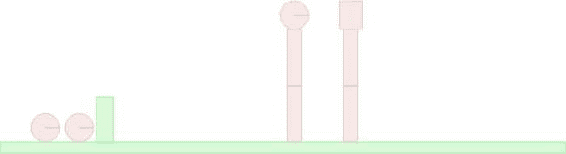
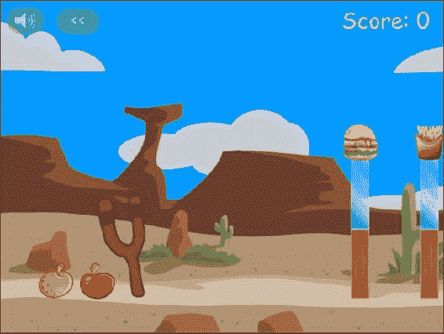
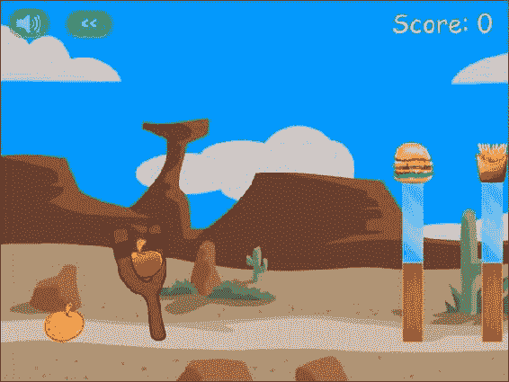
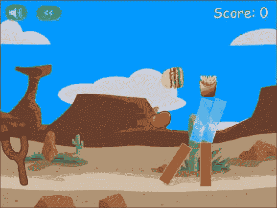
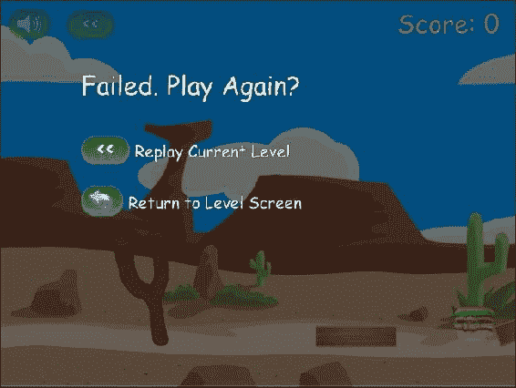
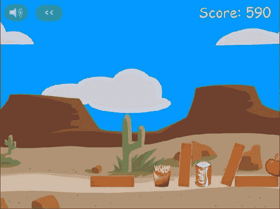
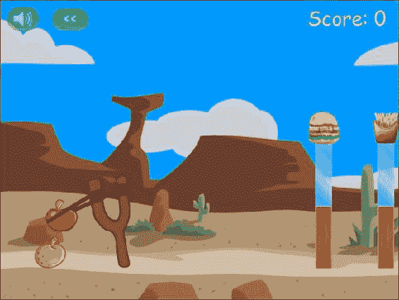
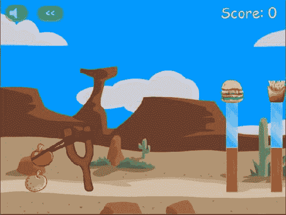

# 四、集成物理引擎

在第二章中，我们为我们的游戏《弗鲁特战争》开发了基本框架，在第三章中，我们看了如何在 Box2D 中模拟一个游戏世界。现在是时候把所有的碎片放在一起完成我们的游戏了。

在本章中，我们将从第二章结束时我们停止的地方继续。我们将在关卡中添加实体，使用 Box2D 来模拟这些实体，然后在游戏中制作这些实体的动画。我们将使用这些实体来创建几个工作级别，我们将添加鼠标交互性，以便我们可以玩游戏。一旦我们有了一个可用的游戏，我们将添加声音、背景音乐和一些其他的收尾工作来结束我们的游戏。

现在让我们开始吧。我们将使用第二章中的代码作为起点。

定义实体

到目前为止，我们的游戏关卡包含背景和前景图像的数据以及实体的空数组。这个实体数组最终将包含我们游戏中的所有实体:英雄、恶棍、地面和用于创建环境的积木。然后，我们将使用这个数组要求 Box2D 创建相应的 Box2D 形状。

典型的实体看起来像清单 4-1 中的例子。

***清单 4-1。*** 典型实体

```html
{type:"block", name:"wood", x:520,y:375,angle:90},
{type:"villain", name:"burger",x:520,y:200,calories:590},
```

type 属性可以包含像“英雄”、“恶棍”、“地面”和“街区”这样的值。我们将使用该属性来决定在创建和绘制操作期间如何处理实体。

x、y 和 angle 属性用于设置实体的起始位置和方向。我们还可以在实体中存储其他自定义属性(如卡路里，这是消灭一个恶棍所获得的分数)。

name 属性告诉我们使用哪个精灵来绘制实体。我们将用于实体的所有图像都存储在图像/实体文件夹中。

name 属性也将用于引用实体定义。这些定义将包括设备数据，如密度和恢复，可破坏对象的健康数据，以及在英雄和恶棍的情况下，甚至形状的细节。典型的实体定义看起来像清单 4-2 中的例子。

***清单 4-2。*** 典型实体定义

```html
"burger":{
    shape:"circle",
    fullHealth:40,
    radius:25,
    density:1,
    friction:0.5,
    restitution:0.4,
},
"wood":{
    fullHealth:500,
    density:0.7,
    friction:0.4,
    restitution:0.4,
},
```

既然我们已经决定了如何存储实体，我们还需要一种方法来创建它们。我们将首先在 game.js 中创建一个实体对象，它将处理游戏中所有与实体相关的操作。该对象将包含所有实体定义以及创建和绘制实体的方法(见清单 4-3 )。

***清单 4-3。*** 实体对象同实体定义

```html
var entities = {
    definitions:{
        "glass":{
            fullHealth:100,
            density:2.4,
            friction:0.4,
            restitution:0.15,
        },
        "wood":{
            fullHealth:500,
            density:0.7,
            friction:0.4,
            restitution:0.4,
        },
        "dirt":{
            density:3.0,
            friction:1.5,
            restitution:0.2,
        },
        "burger":{
            shape:"circle",
            fullHealth:40,
            radius:25,
            density:1,
            friction:0.5,
            restitution:0.4,
        },
        "sodacan":{
            shape:"rectangle",
            fullHealth:80,
            width:40,
            height:60,
            density:1,
            friction:0.5,
            restitution:0.7,
        },
        "fries":{
            shape:"rectangle",
            fullHealth:50,
            width:40,
            height:50,
            density:1,
            friction:0.5,
            restitution:0.6,
        },
        "apple":{
            shape:"circle",
            radius:25,
            density:1.5,
            friction:0.5,
            restitution:0.4,
        },
        "orange":{
            shape:"circle",
            radius:25,
            density:1.5,
            friction:0.5,
            restitution:0.4,
        },
        "strawberry":{
            shape:"circle",
            radius:15,
            density:2.0,
            friction:0.5,
            restitution:0.4,
        }
    },
    // take the entity, create a Box2D body, and add it to the world
    create:function(entity){

    },
    // take the entity, its position, and its angle and draw it on the game canvas
    draw:function(entity,position,angle){

    }
}
```

entities 对象包含一个数组，其中包含所有材质类型的定义(玻璃、木头和泥土)以及游戏中所有英雄和恶棍的定义(橘子、苹果和汉堡)。

其中一些属性的值(如大小、恢复和满生命值)是根据感觉决定的，通过不断调整它们来使游戏尽可能有趣。这些属性的正确值将随您制作的每个游戏而变化。

我们还为需要实现的 create()和 draw()函数准备了占位符。然而，在我们实现这些之前，我们需要将 Box2D 添加到我们的代码中。

添加 Box2D

我们需要做的第一件事是在对 game.js 的引用之前，在 index.html 的部分添加一个对 Box2dWeb-2.1.a.3.min.js 的引用，文件的部分现在看起来将类似于清单 4-4 。

***清单 4-4。*** 添加 Box2D 到 index.html<头>段

```html
 <head>
    <meta http-equiv="Content-type" content="text/html; charset=utf-8">
    <title>Froot Wars</title>
    <script src="js/jquery.min.js" type="text/javascript" charset="utf-8"></script>
    <script src="js/Box2dWeb-2.1.a.3.min.js" type="text/javascript" charset="utf-8"></script>
    <script src="js/game.js" type="text/javascript" charset="utf-8"></script>
    <link rel="stylesheet" href="styles.css" type="text/css" media="screen" charset="utf-8">
</head>
```

我们要做的另一件事是将所有常用的 Box2D 对象的引用添加到 game.js 的开头(参见清单 4-5 )。

***清单 4-5。*** 给常用的 Box2D 对象添加引用

```html
// Declare all the commonly used objects as variables for convenience
var b2Vec2 = Box2D.Common.Math.b2Vec2;
var b2BodyDef = Box2D.Dynamics.b2BodyDef;
var b2Body = Box2D.Dynamics.b2Body;
var b2FixtureDef = Box2D.Dynamics.b2FixtureDef;
var b2Fixture = Box2D.Dynamics.b2Fixture;
var b2World = Box2D.Dynamics.b2World;
var b2PolygonShape = Box2D.Collision.Shapes.b2PolygonShape;
var b2CircleShape = Box2D.Collision.Shapes.b2CircleShape;
var b2DebugDraw = Box2D.Dynamics.b2DebugDraw;
```

现在我们已经设置了引用，我们可以开始在我们的游戏代码中使用 Box2D 了。我们将在 game.js 中创建一个单独的 box2d 对象来存储所有与 Box2D 相关的方法(参见清单 4-6 )。

***清单 4-6。***创建一个 box2d 对象

```html
var box2d = {
    scale:30,
    init:function(){
        // Set up the Box2D world that will do most of the physics calculation
        var gravity = new b2Vec2(0,9.8); //declare gravity as 9.8 m/s² downward
        var allowSleep = true; //Allow objects that are at rest to fall asleep and be excluded from calculations
        box2d.world = new b2World(gravity,allowSleep);
    },

    createRectangle:function(entity,definition){
            var bodyDef = new b2BodyDef;
            if(entity.isStatic){
                bodyDef.type = b2Body.b2_staticBody;
            } else {
                bodyDef.type = b2Body.b2_dynamicBody;
            }
            bodyDef.position.x = entity.x/box2d.scale;
            bodyDef.position.y = entity.y/box2d.scale;
            if (entity.angle) {
                bodyDef.angle = Math.PI*entity.angle/180;
            }
            var fixtureDef = new b2FixtureDef;
            fixtureDef.density = definition.density;
            fixtureDef.friction = definition.friction;
            fixtureDef.restitution = definition.restitution;

            fixtureDef.shape = new b2PolygonShape;
            fixtureDef.shape.SetAsBox(entity.width/2/box2d.scale,entity.height/2/box2d.scale);

            var body = box2d.world.CreateBody(bodyDef);
            body.SetUserData(entity);

            var fixture = body.CreateFixture(fixtureDef);
            return body;
    },
    createCircle:function(entity,definition){
            var bodyDef = new b2BodyDef;
            if(entity.isStatic){

                bodyDef.type = b2Body.b2_staticBody;
            } else {
                bodyDef.type = b2Body.b2_dynamicBody;
            }
            bodyDef.position.x = entity.x/box2d.scale;
            bodyDef.position.y = entity.y/box2d.scale;

            if (entity.angle) {
                bodyDef.angle = Math.PI*entity.angle/180;
            }
            var fixtureDef = new b2FixtureDef;
            fixtureDef.density = definition.density;
            fixtureDef.friction = definition.friction;
            fixtureDef.restitution = definition.restitution;

            fixtureDef.shape = new b2CircleShape(entity.radius/box2d.scale);

            var body = box2d.world.CreateBody(bodyDef);
            body.SetUserData(entity);

            var fixture = body.CreateFixture(fixtureDef);
            return body;
    },
}
```

box2d 对象连接一个 init()方法，该方法初始化一个新的 b2World 对象，就像我们在第三章中所做的一样。该对象还包含两个辅助方法，createRectangle()和 createCircle()。这两种方法都接受两个参数，即我们前面描述的实体和定义对象。实体对象包含详细信息，如其位置、角度以及实体是否是静态的。定义对象包含有关设备的详细信息，例如恢复和密度。使用这些参数，这些方法创建 Box2D 实体和装置，并将它们添加到 Box2D 世界中。

需要注意的一点是，这两种方法都使用 box2d.scale 转换位置和大小，并将角度从度转换为弧度，然后才能被 box2d 使用。

这些方法做的另一件事是使用 SetUserData()方法将实体对象附加到主体。这使我们能够使用 GetUserData()方法检索 Box2D 主体的任何实体相关数据。

创建实体

现在我们已经设置了 Box2D，我们将在前面定义的实体对象中实现 entities.create()方法。该方法将一个实体对象作为参数，并将其添加到世界中(见清单 4-7 )。

***清单 4-7。*** 定义 entities.create()方法

```html
// take the entity, create a Box2D body, and add it to the world
create:function(entity){
    var definition = entities.definitions[entity.name];
    if(!definition){
        console.log ("Undefined entity name",entity.name);
        return;
    }
    switch(entity.type){
        case "block": // simple rectangles
            entity.health = definition.fullHealth;
            entity.fullHealth = definition.fullHealth;
            entity.shape = "rectangle";
            entity.sprite = loader.loadImage("img/"+entity.name+".png");
            box2d.createRectangle(entity,definition);
            break;
        case "ground": // simple rectangles
            // No need for health. These are indestructible
            entity.shape = "rectangle";
            // No need for sprites. These won't be drawn at all
            box2d.createRectangle(entity,definition);
            break;
        case "hero":    // simple circles
        case "villain": // can be circles or rectangles
            entity.health = definition.fullHealth;
            entity.fullHealth = definition.fullHealth;
            entity.sprite = loader.loadImage("img/"+entity.name+".png");
            entity.shape = definition.shape;
            if(definition.shape == "circle"){
                entity.radius = definition.radius;
                box2d.createCircle(entity,definition);
            } else if(definition.shape == "rectangle"){
                entity.width = definition.width;
                entity.height = definition.height;
                box2d.createRectangle(entity,definition);
            }
            break;
        default:
            console.log("Undefined entity type",entity.type);
            break;
    }
},
```

在这个方法中，我们使用实体类型来决定如何处理实体对象及其属性:

*   *Block* :对于 Block 实体，我们根据实体定义设置实体 health 和 fullHealth 属性，并将 shape 属性设置为“rectangle”。然后，我们加载 sprite，并调用 box2d.createRectangle()方法。
*   *Ground* :对于地面实体，我们将实体对象的 shape 属性设置为“rectangle”并调用 box2d.createRectangle()方法。我们不加载精灵，因为我们将使用水平前景图像的地面，不会单独绘制地面。
*   *英雄和反派*:对于英雄和反派实体，我们根据实体定义设置实体健康、完整健康和形状属性。然后，我们根据实体的形状设置半径或高度和宽度属性。最后，我们根据形状调用 box2d.createRectangle()或 box2d.createCircle()。

现在我们有了创建实体的方法，让我们添加一些实体到我们的级别。

将实体添加到级别

我们要做的第一件事是在 levels.data 数组中添加一些实体，如清单 4-8 所示。

***清单 4-8。*** 向 levels.data 数组添加实体

```html
data:[
 {   // First level
    foreground:'desert-foreground',
    background:'clouds-background',
    entities:[
        {type:"ground", name:"dirt", x:500,y:440,width:1000,height:20,isStatic:true},
        {type:"ground", name:"wood", x:180,y:390,width:40,height:80,isStatic:true},

        {type:"block", name:"wood", x:520,y:375,angle:90,width:100,height:25},
        {type:"block", name:"glass", x:520,y:275,angle:90,width:100,height:25},
        {type:"villain", name:"burger",x:520,y:200,calories:590},

        {type:"block", name:"wood", x:620,y:375,angle:90,width:100,height:25},
        {type:"block", name:"glass", x:620,y:275,angle:90,width:100,height:25},
        {type:"villain", name:"fries", x:620,y:200,calories:420},

        {type:"hero", name:"orange",x:90,y:410},
        {type:"hero", name:"apple",x:150,y:410},
    ]
 },
    {   // Second level
        foreground:'desert-foreground',
        background:'clouds-background',
        entities:[
            {type:"ground", name:"dirt", x:500,y:440,width:1000,height:20,isStatic:true},
            {type:"ground", name:"wood", x:180,y:390,width:40,height:80,isStatic:true},
            {type:"block", name:"wood", x:820,y:375,angle:90,width:100,height:25},
            {type:"block", name:"wood", x:720,y:375,angle:90,width:100,height:25},
            {type:"block", name:"wood", x:620,y:375,angle:90,width:100,height:25},
            {type:"block", name:"glass", x:670,y:310,width:100,height:25},
            {type:"block", name:"glass", x:770,y:310,width:100,height:25},

            {type:"block", name:"glass", x:670,y:248,angle:90,width:100,height:25},
            {type:"block", name:"glass", x:770,y:248,angle:90,width:100,height:25},
            {type:"block", name:"wood", x:720,y:180,width:100,height:25},
            {type:"villain", name:"burger",x:715,y:160,calories:590},
            {type:"villain", name:"fries",x:670,y:400,calories:420},
            {type:"villain", name:"sodacan",x:765,y:395,calories:150},

            {type:"hero", name:"strawberry",x:40,y:420},
            {type:"hero", name:"orange",x:90,y:410},
            {type:"hero", name:"apple",x:150,y:410},
        ]
    }
],
```

第一层包含两个背景地面实体，一个用于地板，另一个用于弹弓。这些实体应该是静态对象，不是由我们绘制的。

该级别还包含四个矩形块实体(玻璃和木材)。这些是我们使用它们的角度、x 和 y 属性定位的可析构元素。

最后，关卡包含两个英雄实体(橘子和苹果)和两个反派实体(汉堡和薯条)。注意反派有一个额外的属性叫做卡路里，当他们被消灭时我们会用它来增加玩家分数。

第二层也有类似的设计，只是多了几个实体。

现在我们已经为每个级别定义了实体，我们需要在加载级别时加载这些实体。为此，我们将修改 levels 对象的 load()方法(参见清单 4-9 )。

***清单 4-9。*** 修改 levels.load()来加载实体

```html
// Load all data and images for a specific level
load:function(number){
   //Initialize Box2D world whenever a level is loaded
    box2d.init();

    // declare a new current level object
    game.currentLevel = {number:number,hero:[]};
    game.score=0;
    $('#score').html('Score: '+game.score);
    game.currentHero = undefined;
    var level = levels.data[number];

    //load the background, foreground, and slingshot images
    game.currentLevel.backgroundImage = loader.loadImage("img/"+level.background+".png");
    game.currentLevel.foregroundImage = loader.loadImage("img/"+level.foreground+".png");
    game.slingshotImage = loader.loadImage("img/slingshot.png");
    game.slingshotFrontImage = loader.loadImage("img/slingshot-front.png");

    // Load all the entities
    for (var i = level.entities.length - 1; i >= 0; i--){
        var entity = level.entities[i];
        entities.create(entity);
    };

      //Call game.start() once the assets have loaded
   if(loader.loaded){
       game.start()
   } else {
       loader.onload = game.start;
   }
}
```

我们做的第一个更改是在方法的最开始添加了对 box2d.init()的调用。另一个变化是增加了一个 for 循环，在这个循环中，我们遍历一个级别的所有实体，并为每个实体调用 entities.create()。现在，当我们加载一个关卡时，Box2D 将被初始化，所有的实体都将被加载到 Box2D 世界中。

我们仍然看不到我们添加的几何体。让我们用第三章中介绍的 Box2D 调试画图方法，看看我们创造了什么。

设置 Box2D 调试图形

我们要做的第一件事是在 HTML 文件中创建另一个 canvas 元素，并把它放在标签的末尾之前:

```html
<canvas id="debugcanvas" width="1000" height="480" style="border:1px solid black;"></canvas>
```

这个画布比我们的游戏画布要大，所以我们不用平移就能看到整个关卡。我们将使用这个画布和调试绘图只设计和测试我们的水平。一旦游戏完成，我们可以删除所有的调试绘图的痕迹。

我们需要做的下一件事是在初始化 Box2D 时设置调试图形。我们将通过修改 box2d.init()方法来做到这一点，使它看起来如清单 4-10 所示。

***清单 4-10。*** 修改 box2d.init()来设置调试绘制

```html
init:function(){
    // Set up the Box2D world that will do most of the physics calculation
    var gravity = new b2Vec2(0,9.8); //declare gravity as 9.8 m/s² downward
    var allowSleep = true; //Allow objects that are at rest to fall asleep and be excluded from calculations
    box2d.world = new b2World(gravity,allowSleep);

    // Set up debug draw
    var debugContext = document.getElementById('debugcanvas').getContext('2d');
    var debugDraw = new b2DebugDraw();
    debugDraw.SetSprite(debugContext);
    debugDraw.SetDrawScale(box2d.scale);
    debugDraw.SetFillAlpha(0.3);
    debugDraw.SetLineThickness(1.0);
    debugDraw.SetFlags(b2DebugDraw.e_shapeBit | b2DebugDraw.e_jointBit);
    box2d.world.SetDebugDraw(debugDraw);
},
```

这个新添加的代码与第三章中的代码相同。在我们可以看到 debug draw 的结果之前，我们需要调用 world 对象的 DrawDebugData()方法。我们将在游戏对象中使用一个名为 drawAllBodies()的新方法来实现，如清单 4-11 所示。我们将从游戏对象的 animate()方法中调用这个方法。

***清单 4-11。*** 修改 animate()和创建 drawAllBodies()

```html
animate:function(){
    // Animate the background
    game.handlePanning();

    // TODO: Animate the characters

    //  Draw the background with parallax scrolling
    game.context.drawImage(game.currentLevel.backgroundImage,game.offsetLeft/4,0 ,640,480,0,0,640,480);
game.context.drawImage(game.currentLevel.foregroundImage,game.offsetLeft,0,640,480,0,0,640,480);

    // Draw the slingshot
    game.context.drawImage(game.slingshotImage,game.slingshotX-game.offsetLeft,game.slingshotY);

    // Draw all the bodies
    game.drawAllBodies();

    // Draw the front of the slingshot
    game.context.drawImage(game.slingshotFrontImage,game.slingshotX-game.offsetLeft,game.slingshotY);

    if (!game.ended){
        game.animationFrame = window.requestAnimationFrame(game.animate,game.canvas);
    }
},
drawAllBodies:function(){
    box2d.world.DrawDebugData();
    // TODO: Iterate through all the bodies and draw them on the game canvas
}
```

现在，我们已经创建了一个简单的 drawAllBodies()方法，该方法调用 box2d.world.DrawDebugData()。我们最终需要添加代码来遍历 Box2D 世界中的所有身体，并将它们绘制在游戏画布上。我们从游戏对象的 animate()方法内部调用这个新方法。

如果我们现在运行我们的代码并加载第一级，我们应该看到带有所有实体的调试画布，如图图 4-1 所示。



图 4-1。在调试画布上绘制的第一级

调试画布视图以圆形和矩形向我们展示了所有的游戏实体。我们还可以看到不同颜色的地面和弹弓块。我们可以使用这个视图来快速测试我们的级别，并确保所有的实体都被正确定位。现在我们可以看到关卡中的一切看起来都没问题，是时候将所有的实体绘制到游戏画布上了。

绘制实体

为了绘制实体，我们将在实体对象中定义一个名为 draw()的方法。这个对象将把实体、它的位置和它的角度作为参数，并把它画在游戏画布上(见清单 4-12 )。

***清单 4-12。***entities . draw()方法

```html
// take the entity, its position, and its angle and draw it on the game canvas
draw:function(entity,position,angle){
    game.context.translate(position.x*box2d.scale-game.offsetLeft,position.y*box2d.scale);
    game.context.rotate(angle);
    switch (entity.type){
        case "block":
            game.context.drawImage(entity.sprite,0,0,entity.sprite.width,entity.sprite.height,
                    -entity.width/2-1,-entity.height/2-1,entity.width+2,entity.height+2);
        break;
        case "villain":
        case "hero":
            if (entity.shape=="circle"){
game.context.drawImage(entity.sprite,0,0,entity.sprite.width,entity.sprite.height,
                       -entity.radius-1,-entity.radius-1,entity.radius*2+2,entity.radius*2+2);
            } else if (entity.shape=="rectangle"){
game.context.drawImage(entity.sprite,0,0,entity.sprite.width,entity.sprite.height,
                       -entity.width/2-1,-entity.height/2-1,entity.width+2,entity.height+2);
            }
            break;
        case "ground":
            // do nothing... We will draw objects like the ground & slingshot separately
            break;
    }

    game.context.rotate(-angle);
    game.context.translate(-position.x*box2d.scale+game.offsetLeft,-position.y*box2d.scale);
}
```

该方法首先将上下文平移和旋转到实体的位置和角度。然后，它根据实体类型和形状在画布上绘制对象。最后，它旋转并将上下文转换回原始位置。

需要注意的一点是，当使用 drawImage()时，代码在每个方向上将图像拉伸到比 sprite 定义大一个像素的大小。这是为了掩盖 Box2D 对象之间的小间隙。

 **注意** Box2D 在所有多边形周围创建一个“皮肤”。该蒙皮用于堆叠场景，以保持多边形略微分离。这允许连续碰撞对核心多边形起作用。在绘制 Box2D 对象时，我们需要通过绘制略大于其实际尺寸的物体来补偿这种额外的皮肤；否则，堆叠的对象之间会有无法解释的间隙。

现在我们已经定义了一个 entities.draw()方法，我们需要为游戏世界中的每个实体调用这个方法。通过使用 world 对象的 GetBodyList()方法，我们可以遍历游戏世界中的每一个实体。我们现在将修改游戏对象的 drawAllBodies()方法来做这件事，如清单 4-13 所示。

***清单 4-13。*** 遍历所有物体并绘制

```html
drawAllBodies:function(){
    box2d.world.DrawDebugData();

    // Iterate through all the bodies and draw them on the game canvas
    for (var body = box2d.world.GetBodyList(); body; body = body.GetNext()) {
        var entity = body.GetUserData();

        if(entity){
            entities.draw(entity,body.GetPosition(),body.GetAngle())
        }
    }
}
```

for 循环使用 world 初始化 body。GetBodyList()，返回世界上第一个身体。body 对象的 GetNext()方法返回列表中的下一个 body，直到它到达列表的末尾，这时我们退出 for 循环。在循环中，我们检查主体是否有附属实体；如果是这样，我们调用 entities.draw()，将实体对象、位置和角度传递给它。

如果我们现在运行游戏并加载第一关，我们应该会看到所有的实体都被绘制在画布上，如图 4-2 所示。



图 4-2。在画布上绘制游戏实体

一旦关卡加载完毕，游戏会向右平移，这样我们就可以清楚地看到坏人，然后游戏会平移回弹弓。我们可以看到所有的实体都被正确地绘制在与调试画布相同的位置上。我们在 draw()方法中添加的额外像素确保所有堆叠的对象彼此紧密相邻。请注意，画布在绘制图像时保留了图像的透明度，这就是为什么我们可以透过玻璃块看到背景。

现在我们已经画出了 Box2D 世界中的所有元素，我们需要给 Box2D 世界添加动画。

动画 Box2D 世界

和上一章一样，我们可以通过调用 world 对象的 Step()方法并把时间步长间隔作为参数传递给它来制作 Box2D 世界的动画。然而，这就是事情变得有点棘手的地方。

按照 Box2D 手册的建议，理想情况下，我们应该使用固定的时间步长来获得最佳结果，因为可变的时间步长很难调试。同样根据手册，Box2D 使用 1/60 秒的时间步长效果最好，你应该使用不超过 1/30 秒的时间步长。如果时间步长变得非常大，Box2D 开始出现碰撞问题，物体开始相互穿过。

requestAnimationFrame API 可以在不同的浏览器和机器上改变调用 animate()方法的频率。解决这个问题的一种方法是测量从最后一次调用 animate()以来经过的时间，并将这个差值作为时间步长传递给 Box2D。

但是，如果我们在浏览器上切换标签页，然后返回到游戏标签页，浏览器调用 animate()方法的频率就会降低，这个时间步长可能会变得远大于 1/30 秒的上限。为了避免因时间步长过大而导致的问题，如果时间步长大于 1/30 秒，我们需要主动限制时间步长。

有了这些信息，我们将首先在 box2d 对象中定义一个 step()方法，该方法将时间间隔作为参数，并调用世界对象的 Step()方法(见清单 4-14 )。

***清单 4-14。***box2d . step()方法

```html
step:function(timeStep){
    // velocity iterations = 8
    // position iterations = 3
    if(timeStep >2/60){
        timeStep = 2/60
    }

    box2d.world.Step(timeStep,8,3);
},
```

step()方法以秒为单位获取时间步长，并将其传递给世界。Step()方法。如果时间步长太大，我们将其限制在 1/30 秒。对于速度和位置迭代，我们使用 Box2D 手册推荐的值 8 和 3。我们会在计算完时间步长后，从 game.animate()方法中调用这个方法。game.animate()方法现在看起来像清单 4-15 中的。

***清单 4-15。*** 从 game.animate()中调用 box2d.step()

```html
animate:function(){
    // Animate the background
    game.handlePanning();

    // Animate the characters
    var currentTime = new Date().getTime();
    var timeStep;
    if (game.lastUpdateTime){
        timeStep = (currentTime - game.lastUpdateTime)/1000;
        box2d.step(timeStep);
    }

    game.lastUpdateTime = currentTime;

    //  Draw the background with parallax scrolling

game.context.drawImage(game.currentLevel.backgroundImage,game.offsetLeft/4,0,640,480,0,0,640,480);

game.context.drawImage(game.currentLevel.foregroundImage,game.offsetLeft,0,640,480,0,0,640,480);

     // Draw the slingshot
    game.context.drawImage(game.slingshotImage, game.slingshotX-game.offsetLeft, game.slingshotY);
    game.drawAllBodies();

    // Draw the front of the slingshot
    game.context.drawImage(game.slingshotFrontImage,game.slingshotX-game.offsetLeft,game.slingshotY);

    if (!game.ended){
        game.animationFrame = window.requestAnimationFrame(game.animate,game.canvas);
    }
},
```

我们将 timeStep 计算为 lastUpdateTime 和 currentTime 之差，然后调用 box2d.step()方法。然后，我们将当前时间保存到 game.lastUpdateTime 变量中。

第一次调用 animate()时，game.lastUpdateTime 会未定义，所以我们不会计算 timeStep 或者调用 box2d.step()。

装载英雄

现在动画和引擎已经就绪，是时候实现更多的游戏状态了(也就是游戏模式)。我们将实现的第一个状态是 load-next-hero 状态。当处于这种状态时，游戏需要统计游戏中的英雄和反派还剩多少，检查还剩多少，并据此行动，如下:

*   如果所有反派都走了，游戏切换到状态层面——成功。
*   如果所有的英雄都走了，游戏切换到状态等级——失败。
*   如果还有英雄剩余，游戏会将第一个英雄放在弹弓上，然后切换到等待射击状态。

我们将通过创建一个名为 game.countHeroesAndVillains 恶棍()的方法并修改 game.handlePanning()方法来实现这一点，如清单 4-16 所示。

***清单 4-16。*** 搬运负载——下一个——英雄状态

```html
countHeroesAndVillains:function(){
    game.heroes = [];
    game.villains = [];
    for (var body = box2d.world.GetBodyList(); body; body = body.GetNext()) {
        var entity = body.GetUserData();
        if(entity){
            if(entity.type == "hero"){
                game.heroes.push(body);
            } else if (entity.type =="villain"){
                game.villains.push(body);
            }
        }
    }
},
handlePanning:function(){
    if (game.mode=="intro"){
        if(game.panTo(700)){
            game.mode = "load-next-hero";
        }
    }

    if (game.mode=="wait-for-firing"){
        game.panTo(game.slingshotX);
    }
    if (game.mode == "firing"){
        game.panTo(game.slingshotX);
    }

    if (game.mode == "fired"){
        // TODO:
        // Pan to wherever the hero currently is
    }

    if (game.mode == "load-next-hero"){
        game.countHeroesAndVillains();

        // Check if any villains are alive, if not, end the level (success)
        if (game.villains.length == 0){
             game.mode = "level-success";
            return;
        }

        // Check if there are any more heroes left to load, if not end the level (failure)
        if (game.heroes.length == 0){
            game.mode = "level-failure"
            return;
        }

        // Load the hero and set mode to wait-for-firing
        if(!game.currentHero){
            game.currentHero = game.heroes[game.heroes.length-1];
            game.currentHero.SetPosition({x:180/box2d.scale,y:200/box2d.scale});
             game.currentHero.SetLinearVelocity({x:0,y:0});
             game.currentHero.SetAngularVelocity(0);
            game.currentHero.SetAwake(true);
        } else {
            // Wait for hero to stop bouncing and fall asleep and then switch to wait-for-firing
            game.panTo(game.slingshotX);
            if(!game.currentHero.IsAwake()){
                game.mode = "wait-for-firing";
            }
        }
    }
},
```

countHeroesAndVillains()方法遍历世界上的所有实体，并将英雄存储在 game.heroes 数组中，将恶棍存储在 game.villains 数组中。

在 handlePanning()方法内部，当 game.mode 为 load-next-hero 时，我们首先调用 countHeroesandVillains()。然后，我们检查反派或英雄的数量是否为 0，如果是，将 game.mode 分别设置为成功级或失败级。如果没有，我们将游戏中的最后一个英雄保存到 game.currentHero 变量中，并将其位置设置为弹弓上方的空中点。我们把它的角速度和线速度设为 0。我们也唤醒身体以防它睡着。

当身体落到弹弓上时，它会一直弹跳，直到最后停下来，再次睡着。一旦身体回到睡眠状态，我们就将游戏模式设置为等待开火。如果我们运行游戏，开始第一关，我们会看到第一个英雄在弹弓上弹起，来休息，如图图 4-3 所示。



图 4-3。第一个英雄被装上弹弓，等待发射

现在我们已经准备好发射英雄，我们需要处理从弹弓发射英雄。

解雇英雄

我们将使用三种状态来实现解雇英雄:

*   等待开火:游戏在弹弓上方平移，当指针在英雄上方时等待鼠标被点击拖动。当这种情况发生时，它转换到激发状态。
*   射击:游戏用鼠标移动英雄，直到松开鼠标键。当这种情况发生时，它会根据与弹弓的距离以一种冲动推动英雄，并转换到发射状态。
*   开火:游戏平移跟随英雄，直到它停止或超出关卡边界。然后游戏将英雄从游戏世界中移除，并回到加载下一个英雄的状态。

我们将首先在游戏对象内部实现一个名为 mouseOnCurrentHero()的方法来测试鼠标指针是否定位在当前英雄上(参见清单 4-17 )。

***清单 4-17。***mouseOnCurrentHero()方法

```html
    mouseOnCurrentHero:function(){
        if(!game.currentHero){
            return false;
        }
        var position = game.currentHero.GetPosition();
        var distanceSquared = Math.pow(position.x*box2d.scale - mouse.x-game.offsetLeft,2) + Math.pow(position.y*box2d.scale-mouse.y,2);
        var radiusSquared = Math.pow(game.currentHero.GetUserData().radius,2);
        return (distanceSquared<= radiusSquared);
    },
```

此方法计算当前英雄中心和鼠标位置之间的距离，并将其与当前英雄的半径进行比较，以检查鼠标是否位于英雄上方。如果距离小于半径，鼠标指针将定位在英雄上。

我们可以使用这个简单的检查，因为我们所有的英雄都是圆形的。如果你想实现不同形状的英雄，你可能需要一个更复杂的方法。

现在我们已经有了这个方法，我们可以在 handlePanning()方法中实现三个状态，如清单 4-18 所示。

***清单 4-18。*** 处理 handlePanning()方法内的点火状态

```html
if (game.mode=="wait-for-firing"){
    if (mouse.dragging){
        if (game.mouseOnCurrentHero()){
            game.mode = "firing";
        } else {
            game.panTo(mouse.x + game.offsetLeft)
        }
    } else {
        game.panTo(game.slingshotX);
    }
}

if (game.mode == "firing"){
    if(mouse.down){
        game.panTo(game.slingshotX);
game.currentHero.SetPosition({x:(mouse.x+game.offsetLeft)/box2d.scale,y:mouse.y/box2d.scale});
    } else {
        game.mode = "fired";
        var impulseScaleFactor = 0.75;
        var impulse = new b2Vec2((game.slingshotX+35-mouse.x-game.offsetLeft)*impulseScaleFactor,(game.slingshotY+25-mouse.y)*impulseScaleFactor);
        game.currentHero.ApplyImpulse(impulse,game.currentHero.GetWorldCenter());
    }
}

if (game.mode == "fired"){
    //pan to wherever the current hero is...
    var heroX = game.currentHero.GetPosition().x*box2d.scale;
    game.panTo(heroX);

    //and wait till he stops moving or is out of bounds
    if(!game.currentHero.IsAwake() || heroX<0 || heroX >game.currentLevel.foregroundImage.width ){
        // then delete the old hero
        box2d.world.DestroyBody(game.currentHero);
        game.currentHero = undefined;
        // and load next hero
        game.mode = "load-next-hero";
    }
}
```

当状态为等待射击，鼠标被拖动时，如果鼠标指针位于英雄上，我们将状态更改为射击；如果鼠标指针不在英雄身上，我们就把屏幕向光标移动。如果鼠标没有被拖动，我们将镜头转向弹弓。

当状态为开火，鼠标键按下时，我们将英雄的位置设置为鼠标位置，并向弹弓方向平移。当释放鼠标按钮时，我们将状态设置为 fired，并使用 b2Body 对象的 ApplyImpulse()方法将脉冲应用于英雄。该方法以 b2Vec2 对象的形式将脉冲作为参数。我们将脉冲向量的 x 和 y 值设置为英雄距离弹弓顶部的 x 和 y 距离的倍数。(脉冲比例因子是我通过试验不同值得出的一个数字。)

当状态被触发时，我们将屏幕移向英雄，等待英雄休息或落在游戏边界之外。当出现这种情况时，我们使用 DestroyBody()方法将英雄从世界中移除，并将状态改回 load-next-hero。

当我们运行这个完成的代码并加载关卡时，我们应该能够向方块开火并击倒它们，如图 4-4 所示。



图 4-4。向街区开火并击倒他们

一旦英雄停止滚动或超出关卡边界，他将被从游戏中移除，下一个英雄将被装载到弹弓上。此时，一旦所有的英雄都走了，游戏就停止等待。因此，我们需要做的最后一件事是实现结束级别。

结束关卡

一旦关卡结束，我们将停止游戏动画循环，并显示一个关卡结束画面。该屏幕将为用户提供重放当前级别、前进到下一级别或返回到级别选择屏幕的选项。

我们需要做的第一件事是向 endingscreen div 元素添加 onclick 事件处理程序，并将其放在 index.html 文件中其他游戏层之后。最终的标记将类似于清单 4-19 中的。

***清单 4-19。*** 结束屏幕 div 元素

```html
<div id="endingscreen" class="gamelayer">
    <div>
        <p id="endingmessage">The Level Is Over Message</p>
        <p id="playcurrentlevel" onclick="game.restartLevel();"> Replay Current Level</p>
        <p id="playnextlevel" onclick="game.startNextLevel();"> Play Next Level </p>
        <p id="returntolevelscreen"onclick="game.showLevelScreen();"> Return to Level Screen</p>
    </div>
</div>
```

我们还需要将相应的 CSS 添加到 styles.css 中，如清单 4-20 所示。

***清单 4-20。*** CSS 为 endingscreen div 元素

```html
/* Ending Screen */
endingscreen {
    text-align:center;
}

#endingscreen div {
    height:430px;
    padding-top:50px;
    border:1px;
    background:rgba(1,1,1,0.5);
    text-align:left;
    padding-left:100px;
}

#endingscreen p  {
    font: 20px Comic Sans MS;
    text-shadow: 0 0 2px #000;
    color:white;
}

#endingscreen p img{
    top:10px;
    position:relative;
    cursor:pointer;
}

#endingscreen #endingmessage  {
    font: 32px Comic Sans MS;
    text-shadow: 0 0 2px #000;
    color:white;
}
```

既然结束屏幕已经准备好了，我们将在游戏对象内部实现一个名为 showEndingScreen()的方法，该方法将显示 endingscreen div 元素(参见清单 4-21 )。

***清单 4-21。***game . showendingscreen()方法

```html
showEndingScreen:function(){
    if (game.mode=="level-success"){
        if(game.currentLevel.number<levels.data.length-1){
            $('#endingmessage').html('Level Complete. Well Done!!!');
            $("#playnextlevel").show();
        } else {
            $('#endingmessage').html('All Levels Complete. Well Done!!!');
            $("#playnextlevel").hide();
        }
    } else if (game.mode=="level-failure"){
        $('#endingmessage').html('Failed. Play Again?');
        $("#playnextlevel").hide();
    }
    $('#endingscreen').show();
},
```

showEndingScreen()方法根据 game.mode 的值显示不同的消息。如果玩家成功了，并且当前关卡不是游戏的最后一关，则显示玩下一关的选项。如果玩家不成功或者当前关卡是最后一关，该选项将被隐藏。

我们现在将在游戏对象的 handlePanning()方法中处理关卡成功和关卡失败，方法是将清单 4-22 中所示的代码添加到该方法的底部。

***清单 4-22。*** 实现一级收尾状态

```html
if(game.mode=="level-success" || game.mode=="level-failure"){
    if(game.panTo(0)){
        game.ended = true;
        game.showEndingScreen();
    }
}
```

当 game.mode 为关卡成功或关卡失败时，游戏首先平移回左侧，然后将 game.ended 属性设置为 true，最后显示如图图 4-5 所示的结束屏幕。



图 4-5。关卡结束画面

当然，由于我们还没有实现碰撞伤害，反派不能死，我们永远不能赢。因此，我们接下来要实现的是碰撞伤害。

碰撞损坏

我们需要做的第一件事是通过使用一个联系监听器并覆盖它的 PostSolve()方法来跟踪冲突，就像我们在第三章中所做的一样。我们将在 box2d 对象的 init()方法中创建这个监听器之后，立即将其添加到世界中，如清单 4-23 所示。

***清单 4-23。*** 使用联系监听器处理碰撞

```html
init:function(){
    // Set up the Box2D world that will do most of the physics calculation
    var gravity = new b2Vec2(0,9.8); //declare gravity as 9.8 m/s² downward
    var allowSleep = true; //Allow objects that are at rest to fall asleep and be excluded from calculations
    box2d.world = new b2World(gravity,allowSleep);

    var debugContext = document.getElementById('debugcanvas').getContext('2d');
    var debugDraw = new b2DebugDraw();
    debugDraw.SetSprite(debugContext);
    debugDraw.SetDrawScale(box2d.scale);
    debugDraw.SetFillAlpha(0.3);
    debugDraw.SetLineThickness(1.0);
    debugDraw.SetFlags(b2DebugDraw.e_shapeBit | b2DebugDraw.e_jointBit);
    box2d.world.SetDebugDraw(debugDraw);

    var listener = new Box2D.Dynamics.b2ContactListener;
    listener.PostSolve = function(contact,impulse){
        var body1 = contact.GetFixtureA().GetBody();
        var body2 = contact.GetFixtureB().GetBody();
        var entity1 = body1.GetUserData();
        var entity2 = body2.GetUserData();

        var impulseAlongNormal = Math.abs(impulse.normalImpulses[0]);
        // This listener is called a little too often. Filter out very tiny impulses.
        // After trying different values, 5 seems to work well
        if(impulseAlongNormal>5){
            // If objects have a health, reduce health by the impulse value
            if (entity1.health){
                entity1.health -= impulseAlongNormal;
            }

            if (entity2.health){
                entity2.health -= impulseAlongNormal;
            }
        }
    };
    box2d.world.SetContactListener(listener);
},
```

在 PostSolve()方法中，如果碰撞中涉及的任何一个物体具有健康属性，我们将健康减少法线方向上的冲量值。因为 PostSolve()方法是为每个小碰撞调用的，所以我们忽略任何 impulseAlongNormal 小于阈值的碰撞。

接下来，我们将在游戏对象的 drawAllBodies()方法中添加一些代码，以检查身体的健康属性是否小于零，或者身体是否超出了级别界限。如果任何一个是真的，我们将从世界上移除身体。drawAllBodies()方法现在看起来像清单 4-24 中的。

***清单 4-24。*** 清除世间的死尸

```html
drawAllBodies:function(){
    box2d.world.DrawDebugData();

    // Iterate through all the bodies and draw them on the game canvas
    for (var body = box2d.world.GetBodyList(); body; body = body.GetNext()) {
        var entity = body.GetUserData();
        if(entity){
            var entityX = body.GetPosition().x*box2d.scale;
            if(entityX<0|| entityX>game.currentLevel.foregroundImage.width||(entity.health && entity.health <0)){
                box2d.world.DestroyBody(body);
                if (entity.type=="villain"){
                    game.score += entity.calories;
                    $('#score').html('Score: '+game.score);
                }
            } else {
                entities.draw(entity,body.GetPosition(),body.GetAngle())
            }
        }
    }
}
```

如果代码发现身体超出了级别界限或者实体失去了所有健康，我们使用 world 对象的 DestroyBody()方法来移除身体。此外，如果实体是一个恶棍，我们会将实体的卡路里值添加到游戏分数中。

当我们运行游戏时，反派确实被消灭了，分数也增加了，如图图 4-6 所示。



图 4-6。坏人被消灭后，分数会增加

现在我们有了一个工作级别，让我们添加一些收尾工作。我们要做的第一件事是在英雄被射击时画一个弹弓乐队。

画弹弓乐队

弹弓带将会是一条从弹弓末端到英雄最末端的粗棕色线。我们将仅在游戏处于射击模式时绘制乐队。我们将在游戏对象内部的 drawSlingshotBand()方法中实现这一点，如清单 4-25 所示。

***清单 4-25。*** 绘制弹弓乐队

```html
drawSlingshotBand:function(){
    game.context.strokeStyle = "rgb(68,31,11)"; // Darker brown color
    game.context.lineWidth = 6; // Draw a thick line

    // Use angle hero has been dragged and radius to calculate coordinates of edge of hero wrt. hero center
    var radius = game.currentHero.GetUserData().radius;
    var heroX = game.currentHero.GetPosition().x*box2d.scale;
    var heroY = game.currentHero.GetPosition().y*box2d.scale;
    var angle = Math.atan2(game.slingshotY+25-heroY,game.slingshotX+50-heroX);

    var heroFarEdgeX = heroX - radius * Math.cos(angle);
    var heroFarEdgeY = heroY - radius * Math.sin(angle);

    game.context.beginPath();
    // Start line from top of slingshot (the back side)
    game.context.moveTo(game.slingshotX+50-game.offsetLeft, game.slingshotY+25);

    // Draw line to center of hero
    game.context.lineTo(heroX-game.offsetLeft,heroY);
    game.context.stroke();
    // Draw the hero on the back band

entities.draw(game.currentHero.GetUserData(),game.currentHero.GetPosition(),game.currentHero.GetAngle());

    game.context.beginPath();
    // Move to edge of hero farthest from slingshot top
    game.context.moveTo(heroFarEdgeX-game.offsetLeft,heroFarEdgeY);

    // Draw line back to top of slingshot (the front side)
    game.context.lineTo(game.slingshotX-game.offsetLeft +10,game.slingshotY+30)
    game.context.stroke();
},
```

我们首先使用 strokeStyle 属性将绘图颜色设置为深棕色。接下来，我们使用 lineWidth 属性将线条绘制宽度设置为 6 像素。然后我们从弹弓的后面到英雄画一条带子，在带子的上面画英雄，最后，从弹弓的前面到离弹弓最远的英雄的边缘画一条带子。

我们将在绘制完所有其他物体后从 game.animate()方法中调用这个方法。最终的 game.animate()方法将类似于清单 4-26 中的。

***清单 4-26。*** 从 animate()中调用 drawSlingshotBand()方法

```html
animate:function(){
    // Animate the background
    game.handlePanning();

    // Animate the characters
        var currentTime = new Date().getTime();
        var timeStep;
        if (game.lastUpdateTime){
            timeStep = (currentTime - game.lastUpdateTime)/1000;
            if(timeStep >2/60){
                timeStep = 2/60
            }
            box2d.step(timeStep);
        }
        game.lastUpdateTime = currentTime;

    //  Draw the background with parallax scrolling
game.context.drawImage(game.currentLevel.backgroundImage,game.offsetLeft/4,0,640,480,0,0,640,480);
game.context.drawImage(game.currentLevel.foregroundImage,game.offsetLeft,0,640,480,0,0,640,480);

    // Draw the slingshot
    game.context.drawImage(game.slingshotImage,game.slingshotX-game.offsetLeft,game.slingshotY);

    // Draw all the bodies
    game.drawAllBodies();
    // Draw the band when we are firing a hero
    if(game.mode == "firing"){
        game.drawSlingshotBand();
    }

    // Draw the front of the slingshot
    game.context.drawImage(game.slingshotFrontImage,game.slingshotX-game.offsetLeft,game.slingshotY);

    if (!game.ended){
        game.animationFrame = window.requestAnimationFrame(game.animate,game.canvas);
    }
},
```

当我们运行这段代码时，我们应该会看到英雄周围有一条棕色的带子，如图图 4-7 所示。



图 4-7。画弹弓带

这不是一个完整的解决方案。乐队在某些极端的角度看起来可能有点不自然。你可以考虑改进这种方法，在带子上叠加一些额外的图像来掩盖这些边缘效果。目前，这个简单的实现就足够了。

现在我们已经完成了关卡的插图，让我们来实现改变和重启关卡的按钮。

改变级别

我们已经实现了一种方法来遍历级别，使用级别选择屏幕。现在，我们将实现按钮，重新开始一个级别，并进行到下一个级别。

我们首先在游戏对象中实现 restartLevel()和 startNextLevel()方法，如清单 4-27 所示。

***清单 4-27。*** 实现 restartLevel()和 startNextLevel()

```html
restartLevel:function(){
    window.cancelAnimationFrame(game.animationFrame);
    game.lastUpdateTime = undefined;
    levels.load(game.currentLevel.number);
},
startNextLevel:function(){
    window.cancelAnimationFrame(game.animationFrame);
    game.lastUpdateTime = undefined;
    levels.load(game.currentLevel.number+1);
},
```

这些方法相当简单。两者都取消任何现有的 animationFrame 循环，重置 game.lastUpdateTime 变量，最后用适当的级别号调用 levels.load()方法。我们需要从 scorescreen 和 endingscreen 层中相应图像的 onclick 事件中调用这些方法，如清单 4-28 所示。

***清单 4-28。*** 设置 onclick 事件以改变等级

```html
<div id="scorescreen" class="gamelayer">
    
    
    <span id="score">Score: 0</span>
</div>

<div id="endingscreen" class="gamelayer">
    <div>
        <p id="endingmessage">The Level Is Over Message</p>
        <p id="playcurrentlevel" onclick="game.restartLevel();"> Replay Current Level</p>
        <p id="playnextlevel" onclick="game.startNextLevel();"> Play Next Level </p>
        <p id="returntolevelscreen"onclick="game.showLevelScreen();"> Return to Level Screen</p>
    </div>
</div>
```

如果我们运行游戏，我们现在应该能够使用提供的按钮重新开始一个级别或进行到下一个级别。

我们现在有了一个完整关卡的工作游戏。我们也有一个简单的方法来建立新的水平。然而，还缺少最后一个元素:声音。

添加声音

添加声音使游戏更具沉浸感。我们将开始添加一些音效，比如当弹弓被释放时，当英雄或坏人弹起时，以及当其中一个方块被破坏时。我们还将添加一些背景音乐，以及如果我们想关闭它的能力。

每种效果的声音文件都可以在音频文件夹中找到(MP3 和 OGG 格式)。

我们将从在游戏对象的 init()方法中加载这些声音文件开始，如清单 4-29 所示。

***清单 4-29。*** 加载声音和背景音乐

```html
init: function(){
    // Initialize objects
    levels.init();
    loader.init();
    mouse.init();

    // Load All Sound Effects and Background Music
    //"Kindergarten" by Gurdonark
    //http://ccmixter.org/files/gurdonark/26491is licensed under a Creative Commons license
    game.backgroundMusic = loader.loadSound('audio/gurdonark-kindergarten');

    game.slingshotReleasedSound = loader.loadSound("audio/released");
    game.bounceSound = loader.loadSound('audio/bounce');
    game.breakSound = {
        "glass":loader.loadSound('audio/glassbreak'),
        "wood":loader.loadSound('audio/woodbreak')
    };

    // Hide all game layers and display the start screen
    $('.gamelayer').hide();
    $('#gamestartscreen').show();

    //Get handler for game canvas and context
    game.canvas = document.getElementById("gamecanvas");
    game.context = game.canvas.getContext('2d');
},
```

该代码使用 loader.loadSound()方法加载不同的声音文件，并保存它们供以后参考。我们将断音存储在一个关联数组中，这样我们可以方便地为更多实体添加声音，并通过名称引用它们。背景音乐是由 Gurdonark 创作的名为“幼儿园”的优秀创作通用许可曲调。

 **提示**你可以在位于[`www.ccmixter.com`](http://www.ccmixter.com)的 ccMixter 网站上为你自己的游戏找到一些令人惊叹的免费音乐。

添加中断和弹跳声音

现在我们已经加载了这些声音，我们需要将这些声音效果与实体相关联，并在正确的时间播放它们。我们将修改 entities.create()方法，并在实体定义中设置中断和反弹声音，如清单 4-30 所示。

***清单 4-30。*** 在创作时给实体分配声音

```html
create:function(entity){
    var definition = entities.definitions[entity.name];
    if(!definition){
        console.log ("Undefined entity name",entity.name);
        return;
    }
    switch(entity.type){
        case "block": // simple rectangles
            entity.health = definition.fullHealth;
            entity.fullHealth = definition.fullHealth;
            entity.shape = "rectangle";
            entity.sprite = loader.loadImage("img/"+entity.name+".png");
            entity.breakSound = game.breakSound[entity.name];
            box2d.createRectangle(entity,definition);
            break;
        case "ground": // simple rectangles
            // No need for health. These are indestructible
            entity.shape = "rectangle";
            // No need for sprites. These won't be drawn at all
            box2d.createRectangle(entity,definition);
            break;
        case "hero":    // simple circles
        case "villain": // can be circles or rectangles
            entity.health = definition.fullHealth;
            entity.fullHealth = definition.fullHealth;
            entity.sprite = loader.loadImage("img/"+entity.name+".png");
            entity.shape = definition.shape;
            entity.bounceSound = game.bounceSound;
            if(definition.shape == "circle"){
                entity.radius = definition.radius;
                box2d.createCircle(entity,definition);
            } else if(definition.shape == "rectangle"){
                entity.width = definition.width;
                entity.height = definition.height;
                box2d.createRectangle(entity,definition);
            }
            break;
        default:
            console.log("Undefined entity type",entity.type);
            break;
    }
},
```

像这样在创作过程中给实体附加声音的好处是，每个实体都可以有自己定制的“中断”声音和“反弹”声音。现在，我们需要做的就是在事件实际发生时播放声音。首先，在我们之前定义的 b2ContactListener 对象中，每当我们检测到碰撞时，我们就播放反弹声，如清单 4-31 所示。

***清单 4-31。*** 碰撞时发出的弹跳声

```html
var listener = new Box2D.Dynamics.b2ContactListener;
listener.PostSolve = function(contact,impulse){
    var body1 = contact.GetFixtureA().GetBody();
    var body2 = contact.GetFixtureB().GetBody();
    var entity1 = body1.GetUserData();
    var entity2 = body2.GetUserData();

    var impulseAlongNormal = Math.abs(impulse.normalImpulses[0]);
    // This listener is called a little too often. Filter out very tiny impulses.
    // After trying different values, 5 seems to work well
    if(impulseAlongNormal>5){
        // If objects have a health, reduce health by the impulse value
        if (entity1.health){
            entity1.health -= impulseAlongNormal;
        }
        if (entity2.health){
            entity2.health -= impulseAlongNormal;
        }
        // If objects have a bounce sound, play the sound
        if (entity1.bounceSound){
            entity1.bounceSound.play();
        }

        if (entity2.bounceSound){
            entity2.bounceSound.play();
        }
    }
};
```

在碰撞过程中，我们检查实体是否定义了 bounceSound 属性，如果是，我们播放声音。如果我们为任何实体定义反弹声音，这段代码将自动播放它。接下来，我们在游戏对象的 drawAllBodies()方法中，在任何对象被破坏的时候播放中断声音(见清单 4-32 )。

***清单 4-32。*** 播放物体被破坏时的破裂声

```html
drawAllBodies:function(){
    box2d.world.DrawDebugData();

    // Iterate through all the bodies and draw them on the game canvas
    for (var body = box2d.world.GetBodyList(); body; body = body.GetNext()) {
        var entity = body.GetUserData();
        if(entity){
            var entityX = body.GetPosition().x*box2d.scale;
            if(entityX<0|| entityX>game.currentLevel.foregroundImage.width||(entity.health && entity.health <0)){
                box2d.world.DestroyBody(body);
                if (entity.type=="villain"){
                    game.score += entity.calories;
                    $('#score').html('Score: '+game.score);
                }
                if (entity.breakSound){
                    entity.breakSound.play();
                }
            } else {
                entities.draw(entity,body.GetPosition(),body.GetAngle())
            }
        }
    }
},
```

同样，我们检查被销毁的实体是否有 breakSound 属性，如果有，我们播放声音。到目前为止，我们已经为玻璃和木块定义了中断声音，但是我们可以很容易地扩展代码来为其他实体添加声音。

最后，当 game.mode 在 handlePanning()方法中从 fired 变为 fired 时，我们会播放 slingshotReleasedSound(参见清单 4-33 )。

***清单 4-33。*** 打弹弓时释放声音英雄被发射

```html
if (game.mode == "firing"){
    if(mouse.down){
        game.panTo(game.slingshotX);

game.currentHero.SetPosition({x:(mouse.x+game.offsetLeft)/box2d.scale,y:mouse.y/box2d.scale});
    } else {
        game.mode = "fired";
        game.slingshotReleasedSound.play();
        var impulseScaleFactor = 0.75;
        // Coordinates of center of slingshot (where the band is tied to slingshot)
        var slingshotCenterX = game.slingshotX + 35;
        var slingshotCenterY = game.slingshotY+25;
        var impulse = new b2Vec2((slingshotCenterX -mouse.x-game.offsetLeft)*impulseScaleFactor,(slingshotCenterY-mouse.y)*impulseScaleFactor);
        game.currentHero.ApplyImpulse(impulse, game.currentHero.GetWorldCenter());

    }
}
```

现在，当你运行游戏时，你应该听到当英雄被解雇时，当它撞到什么东西时，或者当积木被破坏时的声音效果。我们最后要添加的是背景音乐。

添加背景音乐

我们已经在 game.init()方法中加载了背景音乐文件和其他声音文件。现在我们需要创建一些方法来开始、停止和切换背景音乐。我们将把这些方法添加到游戏对象中，如清单 4-34 所示。

***清单 4-34。*** 控制背景音乐的方法

```html
startBackgroundMusic:function(){
    var toggleImage = $("#togglemusic")[0];
    game.backgroundMusic.play();
    toggleImage.src="img/sound.png";
},
stopBackgroundMusic:function(){
    var toggleImage = $("#togglemusic")[0];
    toggleImage.src="img/nosound.png";
    game.backgroundMusic.pause();
    game.backgroundMusic.currentTime = 0; // Go to the beginning of the song
},
toggleBackgroundMusic:function(){
    var toggleImage = $("#togglemusic")[0];
    if(game.backgroundMusic.paused){
        game.backgroundMusic.play();
        toggleImage.src="img/sound.png";
    } else {
        game.backgroundMusic.pause();
        $("#togglemusic")[0].src="img/nosound.png";
    }
},
```

startBackgroundMusic()方法首先调用 BackgroundMusic 对象的 play()方法，然后设置“切换音乐”按钮图像以显示有声音传出的扬声器。

stopBackgroundMusic()方法设置切换音乐按钮图像以显示没有声音的扬声器。然后，它调用 backgroundMusic 对象的 pause()方法，并通过将其 currentTime 属性设置为 0，将音频设置回歌曲的开头。

最后，toggleBackgroundMusic()方法检查音乐当前是否暂停，调用 pause()或 play()方法，然后适当地设置切换图像。

现在我们已经有了这些方法，我们需要调用它们。我们会在游戏从 game.start()方法内部启动时调用 startBackgroundMusic()方法，如清单 4-35 所示。

***清单 4-35。*** 启动背景音乐

```html
start:function(){
    $('.gamelayer').hide();
    // Display the game canvas and score
    $('#gamecanvas').show();
    $('#scorescreen').show();

    game.startBackgroundMusic();

    game.mode = "intro";
    game.offsetLeft = 0;
    game.ended = false;
    game.animationFrame = window.requestAnimationFrame(game.animate,game.canvas);
},
```

接下来，每当关卡结束时，我们将调用 stopBackgroundMusic()方法，将它添加到 showEndingScreen()方法中，如清单 4-36 所示。

***清单 4-36。*** 停止背景音乐

```html
showEndingScreen:function(){
    game.stopBackgroundMusic();
    if (game.mode=="level-success"){
        if(game.currentLevel.number<levels.data.length-1){
            $('#endingmessage').html('Level Complete. Well Done!!!');
            $("#playnextlevel").show();
        } else {
            $('#endingmessage').html('All Levels Complete. Well Done!!!');
            $("#playnextlevel").hide();
        }
    } else if (game.mode=="level-failure"){
        $('#endingmessage').html('Failed. Play Again?');
        $("#playnextlevel").hide();
    }
    $('#endingscreen').show();
},
```

最后，我们将从 scorescreen 层内部的 toggle music 按钮的 onclick 事件中调用 toggleBackgroundMusic()方法，如清单 4-37 所示。

***清单 4-37。*** 切换背景音乐

```html
<div id="scorescreen" class="gamelayer">
    
    
    <span id="score">Score: 0</span>
</div>
```

现在，当我们运行游戏时，背景音乐会在每一关开始时播放。如果我们点击切换按钮，音乐暂停，按钮变为无声图标，如图图 4-8 所示。



图 4-8。游戏结束，背景音乐关闭

有了这最后的改变，我们的游戏终于完成了。我们现在可以选择一个关卡，在听音效和背景音乐的同时，通过投掷英雄果实来攻击邪恶的垃圾食品来玩游戏。花些时间享受这个游戏，想出你自己的关卡创意。

摘要

在过去的三章中，我们创建了第一个基于物理引擎的 HTML5 游戏。我们从第二章开始，创建了一个基本的游戏框架，包括菜单、关卡系统和资源加载器，并设置了游戏动画。然后我们在第三章中讲述了 Box2D 的基础知识。最后，在这一章中，我们将 Box2D 集成到我们现有的游戏框架中，并通过添加菜单选项、音效和音乐来包装我们的游戏。

当然，这款游戏的功能性还有很大的拓展空间。一些显而易见的下一步将是为不同的实体添加动画，添加更多的关卡，调整游戏物理参数，并添加更多具有不同特征的英雄和恶棍。

然而，这款游戏拥有人们对一款好的 HTML5 游戏的所有基本元素。你可以使用这个游戏中的代码作为任何你自己的基于物理引擎的游戏的起点，并把它带到你想去的任何地方。

现在我们已经完成了我们的第一个游戏，我们将在接下来的几章中进行一个稍微更具挑战性的项目:构建一个完整的多人实时策略游戏。所以我们继续吧。