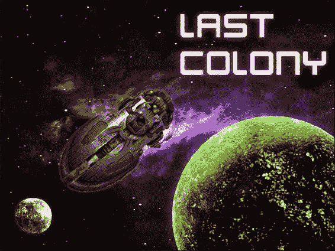
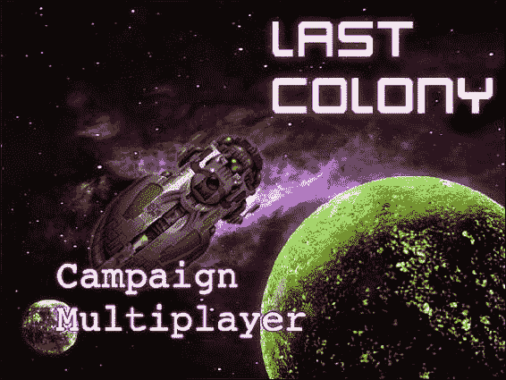
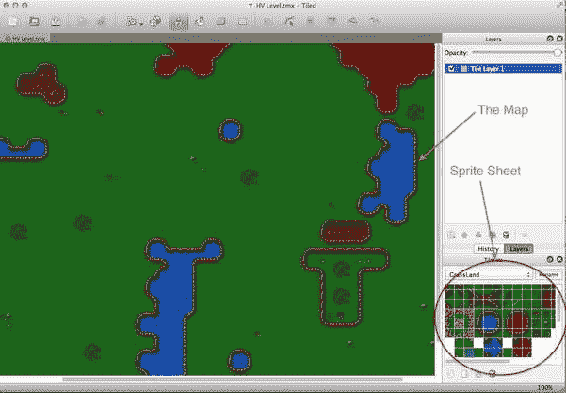
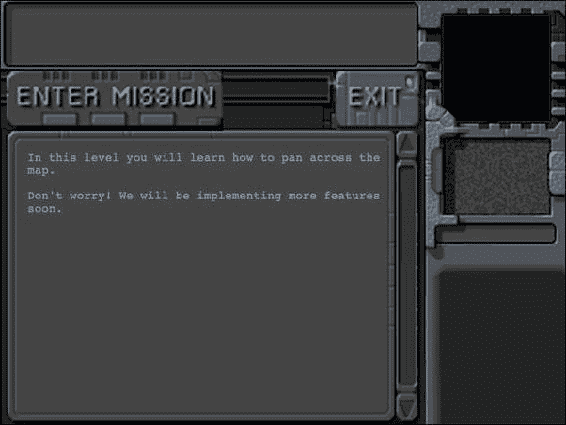
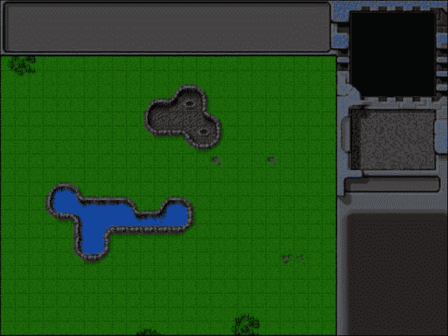
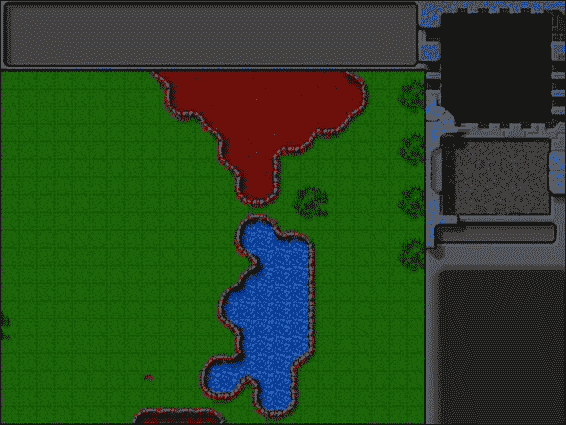

# 五、创建 RTS 游戏世界

即时战略(RTS)游戏结合了快节奏的战术战斗、资源管理和经济建设。

一个典型的 RTS 游戏包括一个有不同单位、建筑和地形的世界地图，以及一个控制和操作这些元素的界面。玩家使用界面来处理任务，例如收集资源、建造建筑物和创建军队，然后管理军队以实现为每个级别定义的一组目标。

虽然这些游戏有着广泛的历史，但 RTS 类型在很大程度上是由韦斯特伍德工作室和暴雪娱乐公司在 20 世纪 90 年代发布的游戏普及的。韦斯特伍德的*沙丘 II* 和*命令&征服*系列被认为是帮助定义该类型的经典。凭借其引人入胜的故事线和令人上瘾的多人游戏，暴雪的*星际争霸*继续将 RTS 游戏提升为电子竞技，在世界各地举办职业竞技比赛。

HTML5 现在可以将这种风格带到浏览器中，这在以前是不可能的。事实上，在过去的一年中，我最著名的游戏编程相关的成就之一就是在 HTML5 中单独重新创建了最初的*命令&征服*。虽然在网上引起了很多议论，但这个项目毫无疑问地证明了 HTML5 已经为下一代游戏做好了准备。

在接下来的几章中，我们将使用我们在前面章节中学到的知识，并在此基础上创建我们自己的 RTS 游戏。我们将定义一个有建筑、单位和主线故事的游戏世界，来创造一个引人入胜的单人战役。然后，我们将使用 HTML5 websockets 为我们的游戏添加实时多人支持。

这款游戏的大部分艺术作品由丹尼尔·库克([www.lostgarden.com](http://www.lostgarden.com))提供，他最初为一款未发布的 RTS 游戏《??》设计了这幅艺术作品。我们将重用他优雅地分享的作品，但将创造我们自己的游戏概念。我们的游戏*最后的殖民地*，将讲述一小群幸存者在一个刚刚被攻击的星球上的故事。我们将在接下来的几章中更详细地探索故事和游戏。

在开发这个游戏时，我们将尽可能保持代码的通用性和可定制性，以便您以后可以重用这些代码来构建您自己的想法。

那么，我们开始吧。

基本 HTML 布局

像之前的游戏一样，我们的 RTS 游戏将由几层组成。以下是我们将定义的最初几层:

*   *闪屏和主菜单*:游戏加载时显示，允许玩家选择战役或多人模式
*   *载入画面*:游戏载入素材时显示
*   *任务画面*:任务开始前显示，带有任务说明
*   *游戏界面画面* :游戏主画面，包括地图区和控制游戏的仪表盘

我们将在后面的章节中根据需要定义更多的屏幕。我们将在一个图像文件夹中组织所有的艺术作品。与上一个游戏不同，我们将 JavaScript 代码分解成 js 文件夹中的几个文件(如 buildings.js、vehicles.js、levels.js 和 common.js ),以使代码更易于维护。

创建闪屏和主菜单

我们将从创建一个 HTML 文件并为我们的容器添加标记开始，如清单 5-1 所示。

***清单 5-1。*** 【基本骨架】(index.html)添加图层

```html
<!DOCTYPE html>
<html>
    <head>
        <meta http-equiv="Content-type" content="text/html; charset=utf-8">
        <title>Last Colony</title>
        <script src="js/common.js" type="text/javascript" charset="utf-8"></script>
        <script src="js/jquery.min.js" type="text/javascript" charset="utf-8"></script>
        <script src="js/game.js" type="text/javascript" charset="utf-8"></script>
        <script src="js/mouse.js" type="text/javascript" charset="utf-8"></script>
        <script src="js/singleplayer.js" type="text/javascript" charset="utf-8"></script>
        <script src="js/maps.js" type="text/javascript" charset="utf-8"></script>
        <link rel="stylesheet" href="styles.css" type="text/css" media="screen" charset="utf-8">
    </head>
    <body>
        <div id="gamecontainer">
            <div id="gamestartscreen" class="gamelayer">
                <span id="singleplayer" onclick = "singleplayer.start();">Campaign</span><br>
                <span id="multiplayer" onclick = "multiplayer.start();">Multiplayer</span><br>
            </div>
            <div id="loadingscreen" class="gamelayer">
                <div id="loadingmessage"></div>
            </div>
        </div>
    </body>
</html>
```

代码首先引用我们将使用的外部 JavaScript 和 CSS 文件。我们将在游戏过程中创建和实现所有这些 JavaScript 文件(除了 jQuery 代码)。我们还定义了一个 gamecontainer div，它包含了我们的前两个游戏层:gamestartscreen 和 loadingscreen。

接下来我们要做的是在 styles.css 中定义游戏容器的初始样式，如清单 5-2 所示。

***清单 5-2。*** 游戏容器和图层的初始样式表(styles.css)

```html
#gamecontainer {
    width:640px;
    height:480px;
    background: url(img/splashscreen.png);
    border: 1px solid black;
}

.gamelayer {
    width:640px;
    height:480px;
    position:absolute;
    display:none;
}

```

在这段代码中，我们设置了游戏容器和层的宽度和高度，并分配了一个背景闪屏，就像我们在之前的游戏中所做的那样。

当我们在浏览器中加载 index.html 时，我们应该会看到新的闪屏，如图 5-1 所示。



图 5-1。初始游戏启动画面

现在闪屏已经就绪，我们可以实现主菜单屏幕和游戏加载屏幕了。

我们将从设置 requestAnimationFrame 和素材加载器开始，使用与我们在上一个游戏中相同的代码。我们将把这段代码放在一个名为 common.js 的单独文件中，如清单 5-3 所示。

***清单 5-3。*** 设置 requestAnimationFrame 和图像加载器(common.js)

```html
// Setup requestAnimationFrame and cancelAnimationFrame for use in the game code
(function() {
    var lastTime = 0;
    var vendors = ['ms', ';', 'webkit', 'o'];
    for(var x = 0; x < vendors.length && !window.requestAnimationFrame; ++x) {
        window.requestAnimationFrame = window[vendors[x]+'RequestAnimationFrame'];
        window.cancelAnimationFrame =
          window[vendors[x]+'CancelAnimationFrame'] || window[vendors[x]+'CancelRequestAnimationFrame'];
    }

    if (!window.requestAnimationFrame)
        window.requestAnimationFrame = function(callback, element) {
            var currTime = new Date().getTime();
            var timeToCall = Math.max(0, 16 - (currTime - lastTime));
            var id = window.setTimeout(function() { callback(currTime + timeToCall); },
              timeToCall);
            lastTime = currTime + timeToCall;
            return id;
        };

    if (!window.cancelAnimationFrame)
        window.cancelAnimationFrame = function(id) {
            clearTimeout(id);
        };
}());

var loader = {
    loaded:true,
    loadedCount:0, // Assets that have been loaded so far
    totalCount:0, // Total number of assets that need to be loaded

    init:function(){
        // check for sound support
        var mp3Support,oggSupport;
        var audio = document.createElement('audio');
        if (audio.canPlayType) {
               // Currently canPlayType() returns: "", "maybe" or "probably"
              mp3Support = "" != audio.canPlayType('audio/mpeg');
              oggSupport = "" != audio.canPlayType('audio/ogg; codecs="vorbis"');
        } else {
            //The audio tag is not supported
            mp3Support = false;
            oggSupport = false;
        }

        // Check for ogg, then mp3, and finally set soundFileExtn to undefined
        loader.soundFileExtn = oggSupport?".ogg":mp3Support?".mp3":undefined;
    },
    loadImage:function(url){
        this.totalCount++;
        this.loaded = false;
        $('#loadingscreen').show();
        var image = new Image();
        image.src = url;
        image.onload = loader.itemLoaded;
        return image;
    },
    soundFileExtn:".ogg",
    loadSound:function(url){
        this.totalCount++;
        this.loaded = false;
        $('#loadingscreen').show();
        var audio = new Audio();
        audio.src = url+loader.soundFileExtn;
        audio.addEventListener("canplaythrough", loader.itemLoaded, false);
        return audio;
    },
    itemLoaded:function(){
        loader.loadedCount++;
        $('#loadingmessage').html('Loaded '+loader.loadedCount+' of '+loader.totalCount);
        if (loader.loadedCount === loader.totalCount){
            loader.loaded = true;
            $('#loadingscreen').hide();
            if(loader.onload){
                loader.onload();
                loader.onload = undefined;
            }
        }
    }
}
```

接下来，我们将在 game.js 中定义我们的游戏对象，如清单 5-4 所示。

***清单 5-4。*** 定义游戏对象的 init()方法(game.js)

```html
$(window).load(function() {
    game.init();
});

var game = {
    // Start preloading assets
    init: function(){
        loader.init();
        $('.gamelayer').hide();
        $('#gamestartscreen').show();
    },
}
```

在这段代码中，我们使用 init()方法创建了一个游戏对象，该方法首先初始化我们的素材加载器，然后使用 jQuery 显示游戏开始屏幕。一旦窗口完全加载，我们还使用窗口加载处理程序来调用 game.init()。

最后，我们需要在 styles.css 中追加游戏开始屏幕和加载屏幕的 CSS，如清单 5-5 所示。

***清单 5-5。*** 游戏启动画面和加载画面的样式(styles.css)

```html
/* Game Starting Menu Screen */
#gamestartscreen {
    padding-top:320px;
    text-align:left;
    padding-left:50px;
    width:590px;
    height:160px;
}

#gamestartscreen span {
    margin:20px;
    font-family: 'Courier New', Courier, monospace;
    font-size: 48px;
    cursor:pointer;
    color:white    ;
    text-shadow: -2px 0 purple, 0 2px purple, 2px 0 purple, 0 -2px purple;
}

#gamestartscreen span:hover {
    color:yellow;
}

/* Loading Screen */
#loadingscreen {
    background:rgba(100,100,100,0.7);
    z-index:10;
}

#loadingmessage {
    margin-top:400px;
    text-align:center;
    height:48px;
    color:white;
    background:url(img/loader.gif) no-repeat center;
    font:12px Arial;
}
```

当我们在浏览器中打开游戏时，应该会看到带有主菜单的开始屏幕，如图图 5-2 所示。



图 5-2。带有主菜单的启动屏幕

菜单目前提供了战役选项，是我们基于故事的单人游戏模式，多人游戏是我们的玩家对战模式。你可能已经注意到在清单 5-1 中，这两个选项的 onclick 处理程序分别调用了 singleplayer.start() 和 multiplayer.start()方法。现在，单击战役选项不会做任何事情，因为我们还没有实现单人游戏对象。然而，在此之前，我们需要创建第一个关卡。

创建我们的第一关

对于我们的游戏，有许多可行的方法来定义地图或关卡。一种方法是将关于地图地形的所有信息存储为元数据，然后在运行时通过在浏览器上组装地形的所有必要图像来绘制地图。

另一种方法稍微简单一点，就是将基本地图存储为一幅大图，并使用我们自己的关卡设计工具绘制地形。然后，我们只需要存储地图图像的位置以及元数据，如游戏实体和任务目标。这是我们将在游戏中使用的方法。

使用 Tiled([www.mapeditor.org](http://www.mapeditor.org))等通用平铺地图编辑软件可以很快设计出地图图像。Tiled 是一个优秀的免费工具，可用于多种操作系统，包括 Windows、Mac 和 Linux。一旦你启动应用，你可以加载地形的精灵表作为一个图块集，然后用它来绘制地图，就像你在使用一个绘画应用一样(见图 5-3 )。



图 5-3。使用平铺绘制地图

绘制地图后，可以将其导出为多种不同的文件格式，如 PNG 图像或 JSON 元数据。你不需要使用这个工具来跟随这本书，因为我们需要的所有地图已经生成。然而，如果你正在考虑开发自己的游戏，我强烈建议你探索一下这个工具的特性。

 **注意**平铺编辑器的 JSON 格式包含对 sprite 表的引用和它使用的所有平铺块的偏移量。这意味着您可以使用 JSON 文件来创建在运行时组装的地图(而不是我们正在创建的预组装地图)。

一旦我们设计了第一个地图图像，我们将需要创建描述关卡的基本元数据。我们将在 maps.js 中这样做，如清单 5-6 所示。

***清单 5-6。*** 定义基层元数据(maps.js)

```html
var maps = {
    "singleplayer":[
        {
            "name":"Introduction",
            "briefing": "In this level you will learn how to pan across the map.\n\nDon't worry! We will be implementing more features soon.",

            /* Map Details */
            "mapImage":"img/level-one-debug-grid.png",
            "startX":4,
            "startY":4,

        },
    ]
};
```

我们定义了一个包含单人数组的地图对象。此数组当前仅包含一张地图的详细信息。这个数组将最终包含所有按时间顺序排列的单人战役地图。当单人战役开始时，单人玩家对象将加载该数组中的第一张地图，然后随着玩家完成每一关而在列表中继续向下移动。

我们为关卡存储的详细信息包括关卡名称和任务简介，我们将在开始关卡之前显示。然后，我们存储地图图像和起始地图坐标(startX，startY)。

地图图像被分解成 20 像素宽 20 像素高的方格(基于我们使用的图块的大小)。现在，我们使用的是一个“调试”版本的关卡，它在地图上绘制了这个网格。这将使我们在构建游戏时更容易定位关卡中的元素。

当我们使用网格坐标开始关卡时，起始地图坐标让我们决定屏幕在地图上的位置。

现在我们已经定义了一个简单的地图，我们将设置单人游戏对象并显示任务简报屏幕。

加载任务简报屏幕

我们要做的第一件事是将任务屏幕的 HTML 代码添加到 HTML 文件(index.html)的主体中。HTML 的主体现在将看起来像清单 5-7 中的。

***清单 5-7。*** 添加任务画面

```html
<body>
    <div id="gamecontainer">
        <div id="gamestartscreen" class="gamelayer">
            <span id="singleplayer" onclick = "singleplayer.start();">Campaign</span><br>
            <span id="multiplayer" onclick = "multiplayer.start();">Multiplayer</span><br>
        </div>

        <div id="missionscreen" class="gamelayer">
            <input type="button" id="entermission" onclick = "singleplayer.play();">
            <input type="button" id="exitmission" onclick = "singleplayer.exit();">
            <div id="missonbriefing"></div>
        </div>

        <div id="loadingscreen" class="gamelayer">
            <div id="loadingmessage"></div>
        </div>
    </div>
</body>
```

missionscreen div 包含两个按钮；它们用于进入任务和退出任务屏幕。它还包含一个 missionbriefing div，我们将使用它来显示简报消息。

现在我们已经有了 HTML 标记，我们需要将任务屏幕的 CSS 样式添加到 styles.css 中，如清单 5-8 所示。

***清单 5-8。*** 任务画面的 CSS 样式

```html
/* Mission Briefing Screen */
#missionscreen {
    background: url(img/missionscreen.png) no-repeat;
}

#missionscreen #entermission {
    position:absolute;
    top:79px;
    left:6px;
    width:246px;
    height:68px;
    border-width:0px;
    background-image: url(img/buttons.png);
    background-position: 0px 0px;
}

#missionscreen #entermission:disabled, #missionscreen #entermission:active {
    background-image: url(img/buttons.png);
    background-position: -251px 0px;
}

#missionscreen #exitmission {
    position:absolute;
    top:79px;
    left:380px;
    width:98px;
    height:68px;
    border-width:0px;
    background-image: url(img/buttons.png);
    background-position: 0px -76px;
}

#missionscreen #exitmission:disabled,#missionscreen #exitmission:active{
    background-image: url(img/buttons.png);
    background-position: -103px -76px;
}

#missionscreen #missonbriefing {
    position:absolute;
    padding:10px;
    top:160px;
    left:20px;
    width:410px;
    height:300px;
    color:rgb(130,150,162);
    font-size: 13px;
    font-family: 'Courier New', Courier, monospace;
}
```

我们为任务简报屏幕定义了一个新的背景，看起来像一个未来的控制台。然后我们定位按钮和 div 元素以适应背景。我们为按钮的启用和禁用状态保留不同的图像，但是将所有这些精灵存储在一个图像文件(buttons.png)中。

既然任务简报层已经就绪，我们将在 singleplayer.js 中用 start()和 exit()方法实现 singleplayer 对象，如清单 5-9 所示。

***清单 5-9。*** 实现基本 Singleplayer 对象(singleplayer.js)

```html
var singleplayer = {
    // Begin single player campaign
    start:function(){
        // Hide the starting menu layer
        $('.gamelayer').hide();

        // Begin with the first level
        singleplayer.currentLevel = 0;
        game.type = "singleplayer";
        game.team = "blue";

        // Finally start the level
        singleplayer.startCurrentLevel();
    }, 
    exit:function(){
        // Show the starting menu layer
        $('.gamelayer').hide();
        $('#gamestartscreen').show();
    },
    currentLevel:0,
    startCurrentLevel:function(){
        // Load all the items for the level
        var level = maps.singleplayer[singleplayer.currentLevel];

        // Don't allow player to enter mission until all assets for the level are loaded
        $("#entermission").attr("disabled", true);

        // Load all the assets for the level
        game.currentMapImage = loader.loadImage(level.mapImage);
        game.currentLevel = level;

        // Enable the enter mission button once all assets are loaded
        if (loader.loaded){
            $("#entermission").removeAttr("disabled");
        } else {
            loader.onload = function(){
                $("#entermission").removeAttr("disabled");
            }
        }

        // Load the mission screen with the current briefing
        $('#missonbriefing').html(level.briefing.replace(/\n/g,'<br><br>'));
        $("#missionscreen").show();
    },
};
```

我们用三个方法定义了一个 singleplayer 对象:start()、exit()和 startCurrentLevel()。

start()方法首先隐藏所有游戏层，并将 singleplayer.currentLevel 设置为 0，这是指我们之前定义的 maps.singleplayer 数组中的第一级。然后将 game.type 和 game.team 变量分别设置为 singleplayer 和 blue。一旦游戏开始运行，我们将使用这些值。最后，它调用 singleplayer.startCurrentLevel()方法，我们将在每次想要加载关卡时调用该方法。

exit()方法隐藏了所有的游戏层，并把我们带回到主菜单。

startCurrentLevel()方法首先创建一个包含我们级别的元数据的*级别*对象。

然后，它会暂时禁用屏幕上的“输入任务”按钮，并开始加载关卡资源。目前，我们加载的唯一素材是地图图像。一旦素材被加载，输入任务按钮被激活，玩家可以点击它并进入游戏。

最后，该方法将级别简报放在 missionbriefing div 内，并显示 missionscreen div。

 **注意**我们用< br >标签替换回车，这样它们就会出现在 HTML 中。这样，如果我们愿意，我们可以很容易地将任务简报分成多个段落。

当我们在浏览器中加载游戏并点击战役选项时，应该会看到第一关的任务简报画面，如图图 5-4 所示。



图 5-4。我们第一关的任务简报画面

在后台加载素材的同时显示任务简报屏幕的好处是玩家可以在等待所有素材加载的同时花时间阅读任务简报。

点击退出按钮应该会把我们带回主菜单。我们仍然不能进入任务，直到我们实现了实际的游戏界面和游戏动画和绘图循环。

实现游戏界面

我们要做的第一件事是将游戏界面屏幕的 HTML 标记添加到我们的 HTML 文件(index.html)的主体中。身体现在将看起来像清单 5-10 中的。

***清单 5-10。*【index.html】**添加游戏界面层(??)

```html
<body>
    <div id="gamecontainer">
        <div id="gamestartscreen" class="gamelayer">
            <span id="singleplayer" onclick = "singleplayer.start();">Campaign</span><br>
            <span id="multiplayer" onclick = "multiplayer.start();">Multiplayer</span><br>
        </div>
        <div id="missionscreen" class="gamelayer">
            <input type="button" id="entermission" onclick = "singleplayer.play();">
            <input type="button" id="exitmission" onclick = "singleplayer.exit();">
            <div id="missonbriefing">Welcome to your first mission.
            </div>
        </div>
        <div id="gameinterfacescreen" class="gamelayer">
            <div id="gamemessages"></div>
            <div id="callerpicture"></div>
            <div id="cash"></div>
            <div id="sidebarbuttons">
            </div>
            <canvas id="gamebackgroundcanvas" height="400" width="480"></canvas>
            <canvas id="gameforegroundcanvas" height="400" width="480"></canvas>
        </div>
        <div id="loadingscreen" class="gamelayer">
            <div id="loadingmessage"></div>
        </div>
    </div>
</body>
```

我们的游戏界面层由几个不同的区域组成。

*   游戏区:这是玩家可以看到地图并与游戏中的建筑、单位和其他实体互动的地方。这是使用两个 canvas 元素实现的:gamebackgroundcanvas 用于地图，gameforegroundcanvas 用于关卡内部的实体(比如建筑和单位)。
*   *游戏消息*:这是玩家可以看到系统通知或故事驱动消息的地方。
*   *来电图片*:玩家将在这里看到发送故事驱动消息的人的个人资料图片。
*   现金:玩家可以在这里看到他们的现金储备。
*   侧边栏按钮:玩家将在这里看到他们可以用来在游戏中创建单位和建筑的按钮。

现在 HTML 已经就绪，我们将把游戏界面的 CSS 添加到 styles.css 中，如清单 5-11 所示。

***清单 5-11。*** CSS 为游戏界面画面

```html
/* Game Interface Screen */
#gameinterfacescreen {
    background: url(img/maininterface.png) no-repeat;
}

#gameinterfacescreen #gamemessages{
    position:absolute;
    padding-left:10px;
    top:5px;
    left:5px;
    width:450px;
    height:60px;
    color:rgb(130,150,162);
    overflow:hidden;
    font-size: 13px;
    font-family: 'Courier New', Courier, monospace;
}
#gameinterfacescreen #gamemessages span {
    color:white;
}

#gameinterfacescreen #callerpicture {
    position:absolute;
    left:498px;
    top:154px;
    width:126px;
    height:88px;
    overflow:none;
}

#gameinterfacescreen #cash {
    width:120px;
    height:22px;
    position:absolute;
    left:498px;
    top:256px;
    color:rgb(130,150,162);
    overflow:hidden;
    font-size: 13px;
    font-family: 'Courier New', Courier, monospace;
    text-align:right;
}

#gameinterfacescreen canvas{
    position:absolute;
    top:79px;
    left:0px;
}

#gameinterfacescreen #foregroundcanvas{
    z-index:1;
}

#gameinterfacescreen #backgroundcanvas{
    z-index:0;
}
```

我们首先为 gameinterfacescreen div 定义一个单独的背景，然后将各种其他 div 放置在界面区域上方的适当位置。通过为 foregroundcanvas 设置较高的 z-index 值，这两个游戏画布元素与 foregroundcanvas 位于 backgroundcanvas 之上的位置相同。具有较高 z 索引值的元素显示在具有较低 z 索引值的元素上方。

接下来，我们将修改 game.js 中的游戏对象，以初始化画布元素并定义动画和绘制循环。修改后的游戏对象现在看起来像清单 5-12 中的。

***清单 5-12。*** 给游戏对象添加动画和绘制循环(game.js)

```html
var game = {
    // Start preloading assets
    init: function(){
        loader.init();

        $('.gamelayer').hide();
        $('#gamestartscreen').show();

        game.backgroundCanvas = document.getElementById('gamebackgroundcanvas');
        game.backgroundContext = game.backgroundCanvas.getContext('2d');

        game.foregroundCanvas = document.getElementById('gameforegroundcanvas');
        game.foregroundContext = game.foregroundCanvas.getContext('2d');

        game.canvasWidth = game.backgroundCanvas.width;
        game.canvasHeight = game.backgroundCanvas.height;
    },
    start:function(){
        $('.gamelayer').hide();
        $('#gameinterfacescreen').show();
        game.running = true;
        game.refreshBackground= true;

        game.drawingLoop();
    },

    // The map is broken into square tiles of this size (20 pixels x 20 pixels)
    gridSize:20,

    // Store whether or not the background moved and needs to be redrawn
    backgroundChanged:true,

    // A control loop that runs at a fixed period of time
    animationTimeout:100, // 100 milliseconds or 10 times a second
    offsetX:0,    // X & Y panning offsets for the map
    offsetY:0,
    animationLoop:function(){

        // Animate each of the elements within the game
    },
    drawingLoop:function(){
        // Handle Panning the Map
        // Since drawing the background map is a fairly large operation,
        // we only redraw the background if it changes (due to panning)
        if (game.refreshBackground){
            game.backgroundContext.drawImage(game.currentMapImage,game.offsetX,game.offsetY, game.canvasWidth,game.canvasHeight, 0,0,game.canvasWidth,game.canvasHeight);
            game.refreshBackground = false;
        }

        // Call the drawing loop for the next frame using request animation frame
        if (game.running){
            requestAnimationFrame(game.drawingLoop);
        }
    },
}
```

我们修改了 init()方法，将画布元素、它们的 2D 上下文对象以及它们的宽度和高度保存到变量中。

我们定义一个 start()方法，隐藏其他层，显示游戏界面画面。然后将 game.running 和 game.backgroundChanged 变量设置为 true 以备后用。最后，我们第一次调用 drawingLoop()方法。

我们还定义了两个不同的方法，分别叫做 animationLoop() 和 drawingLoop()。

animationLoop()方法处理所有与控制和动画相关的逻辑，并且需要以固定的时间间隔运行(在 animationTimeout 中定义)。对于相当流畅的游戏来说，100 毫秒的动画超时通常就足够了。现在 animationLoop()方法是空的，占位符用于处理地图平移和动画游戏元素。

我们将代码分成两个不同的定时器循环的原因是因为动画代码将包含诸如寻路、处理命令和改变精灵的动画状态之类的逻辑，这些不需要像绘图代码那样频繁地执行。

动画代码也将控制单位的实际移动。通过保持这个代码独立于绘图代码，我们可以确保在每个动画周期后，单位将移动相同的数量。当我们处理多人游戏并且需要游戏状态在不同的机器上同步时，这将变得非常重要。如果我们不小心，浏览器和机器之间的微小计算差异会导致意想不到的结果，例如子弹在一个浏览器中击中敌人，但在另一个浏览器中错过敌人。

如果代码运行时间超过 100 毫秒，则在当前循环完成之前，不会执行下一个间隔循环。这可能会导致游戏在较慢的机器上出现轻微的跳跃和口吃。一些游戏使用基于时间增量的代码，通过推断单位运动来解决这个问题。然而，由于我们将开发多人游戏，推断可能会有点棘手。现在，我们假设玩家有一台能够流畅运行游戏的机器。

drawingLoop()方法处理所有游戏元素在两个游戏画布对象上的实际绘制。该方法是使用 requestAnimationFrame()调用的，可以在浏览器允许的情况下尽可能频繁地运行。

drawingLoop()方法做的第一件事就是检查背景是否已经改变，需要重画。如果是这样，它将使用平移偏移量(offsetX，offsetY)和画布尺寸绘制地图图像(在加载地图时存储在 currentMapImage 中)。然后它重置 backgroundChanged 标志。我们使用这种优化，这样我们就不需要在每次刷新后重新绘制整个背景。最后，只要游戏还在运行，drawingLoop()方法就使用 requestAnimationFrame()调用自己。

既然游戏动画状态已经就绪，我们需要在 singleplayer.js 中实现 singleplayer.play()方法，如清单 5-13 所示。

***清单 5-13。***single player . play()方法(singleplayer.js)

```html
play:function(){
    game.animationLoop();
    game.animationInterval = setInterval(game.animationLoop,game.animationTimeout);
    game.start();
},
```

这个方法相当简单。它第一次调用 game.animationLoop()方法，然后每隔 100 毫秒使用 setInterval()方法调用该方法(在 game.animationTimeout 中设置)。最后，它调用 game.start()方法。gameAnimationLoop()方法目前是空的，但是我们将在下一章向游戏中添加实体时开始使用它。

如果我们运行我们目前拥有的游戏代码，我们应该能够在任务简报屏幕上点击输入任务按钮，然后看到加载了地图的游戏界面屏幕，如图图 5-5 所示。



图 5-5。加载了第一张地图的游戏界面

你可能会注意到，游戏从地图的左上角开始。要使用我们在 map.js 中提供的初始地图偏移设置，我们需要在开始关卡时加载偏移值。我们将通过修改 singleplayer.js 中的 startCurrentLevel()方法来实现这一点，如清单 5-14 所示。

***清单 5-14。*** 在 startCurrentLevel()(single player . js)内设置地图偏移

```html
startCurrentLevel:function(){
    // Load all the items for the level
    var level = maps.singleplayer[singleplayer.currentLevel];

    // Don't allow player to enter mission until all assets for the level are loaded
    $("#entermission").attr("disabled", true);

    // Load all the assets for the level
    game.currentMapImage = loader.loadImage(level.mapImage);
    game.currentLevel = level;

    game.offsetX = level.startX * game.gridSize;
    game.offsetY = level.startY * game.gridSize;

    // Enable the enter mission button once all assets are loaded
    if (loader.loaded){
        $("#entermission").removeAttr("disabled");
    } else {
        loader.onload = function(){
            $("#entermission").removeAttr("disabled");
        }
    }

    // Load the mission screen with the current briefing
    $('#missonbriefing').html(level.briefing.replace('\n','<br><br>'));
    $("#missionscreen").show();
},
```

我们只添加了两行来设置基于 level.startX 和 level.startY 的 game.offsetX 和 game.offsetY。现在我们已经完成了地图的加载，我们将使用鼠标实现地图的平移。

实现地图平移

我们要做的第一件事是通过在 mouse.js 中创建一个鼠标对象来设置鼠标输入(见清单 5-15 )。

***清单 5-15。*** 设置鼠标对象

```html
var mouse = {
    // x,y coordinates of mouse relative to top left corner of canvas
    x:0,
    y:0,
    // x,y coordinates of mouse relative to top left corner of game map
    gameX:0,
    gameY:0,
    // game grid x,y coordinates of mouse
    gridX:0,
    gridY:0,
    // whether or not the left mouse button is currently pressed
    buttonPressed:false,
    // whether or not the player is dragging and selecting with the left mouse button pressed
    dragSelect:false,
    // whether or not the mouse is inside the canvas region
    insideCanvas:false,

    click:function(ev,rightClick){
        // Player clicked inside the canvas
    },

    draw:function(){
        if(this.dragSelect){
            var x = Math.min(this.gameX,this.dragX);
            var y = Math.min(this.gameY,this.dragY);
            var width = Math.abs(this.gameX-this.dragX)
            var height = Math.abs(this.gameY-this.dragY)
            game.foregroundContext.strokeStyle = 'white';
            game.foregroundContext.strokeRect(x-game.offsetX,y-game.offsetY, width, height);
        }
    },
    calculateGameCoordinates:function(){
        mouse.gameX = mouse.x + game.offsetX ;
        mouse.gameY = mouse.y + game.offsetY;

        mouse.gridX = Math.floor((mouse.gameX) / game.gridSize);
        mouse.gridY = Math.floor((mouse.gameY) / game.gridSize);
    },
    init:function(){
        var $mouseCanvas = $("#gameforegroundcanvas");
        $mouseCanvas.mousemove(function(ev) {
            var offset = $mouseCanvas.offset();
            mouse.x = ev.pageX - offset.left;
            mouse.y = ev.pageY - offset.top;

            mouse.calculateGameCoordinates();

            if (mouse.buttonPressed){
                if  ((Math.abs(mouse.dragX - mouse.gameX) > 4 || Math.abs(mouse.dragY - mouse.gameY) > 4)){
                        mouse.dragSelect = true
                }
            } else {
                mouse.dragSelect = false;
            }
        });

        $mouseCanvas.click(function(ev) {
            mouse.click(ev,false);
            mouse.dragSelect = false;
            return false;
        });

        $mouseCanvas.mousedown(function(ev) {
            if(ev.which == 1){
                mouse.buttonPressed = true;
                mouse.dragX = mouse.gameX;
                mouse.dragY = mouse.gameY;
                ev.preventDefault();
            }
            return false;
        });

        $mouseCanvas.bind('contextmenu',function(ev){
            mouse.click(ev,true);
            return false;
        });

        $mouseCanvas.mouseup(function(ev) {
            var shiftPressed = ev.shiftKey;
            if(ev.which==1){
                //Left key was released
                mouse.buttonPressed = false;
                mouse.dragSelect = false;
            }
            return false;
        });

        $mouseCanvas.mouseleave(function(ev) {
            mouse.insideCanvas = false;
        });

        $mouseCanvas.mouseenter(function(ev) {
            mouse.buttonPressed = false;
            mouse.insideCanvas = true;
        });
    }
}
```

这个物体内部发生了很多事情。首先，我们声明一个鼠标对象，并通过定义变量来存储相对于画布(x，y)、相对于地图(gameX，gameY)和地图网格(gridX，gridY)的鼠标坐标。我们还定义了几个变量来存储鼠标状态(buttonPressed、dragSelect 和 insideCanvas)。

接下来，我们将 click()方法定义为一个占位符，每当鼠标在画布区域内单击时都会调用它。我们将在后面实现这个方法。

接下来我们定义一个 draw()方法,该方法检查鼠标是否被拖过画布，如果是，从所选区域的左上角到右下角绘制一个白色矩形。在计算矩形的坐标时，我们减去了地图偏移量，这样它就相对于游戏地图绘制了，即使地图被平移，它也不会移动。

我们还定义了一个名为 calculateGameCoordinates()的方法，将鼠标的 x 和 y 坐标转换为游戏坐标。

最后，我们定义 init()方法，这是鼠标对象的核心。这个方法为前景画布设置所有必要的鼠标事件监听器:

*   mousemove:每当鼠标移动时，我们计算不同的鼠标坐标并存储它们。我们还检查鼠标按钮是否被按下，鼠标是否被拖动了至少 4 个像素，如果是，设置 dragSelect 选项。4 像素的阈值防止游戏将每次点击与拖动选择操作混淆。
*   click:每当单击操作完成时，我们调用 mouse.click()方法并清除 dragSelect 标志。
*   mousedown:如果鼠标左键被按下，我们设置 buttonPressed 标志并将坐标保存到 dragX 和 dragY 中。此外，我们还防止了默认的鼠标点击行为(比如按下鼠标右键时的浏览器上下文菜单)。
*   contextmenu:我们调用 mouse.click()方法并将 rightClick 参数作为 true 传递。
*   mouseup:如果鼠标左键被释放，我们清除 dragSelect 和 buttonPressed 标志。
*   mouseleave:当鼠标离开画布区域时，我们将 insideCanvas 标志设置为 false。
*   mouseenter:每当鼠标重新进入画布区域时，我们将 insideCanvas 标志设置为 true 并清除 buttonPressed 标志。

现在我们已经设置了鼠标对象，我们将修改 game.js 中的游戏对象来使用鼠标。我们需要做的第一件事是从 game.init()方法内部调用 mouse.init()方法。更新后的 game.init()方法将类似于清单 5-16 中的。

***清单 5-16。*** 从 game.init() (game.js)内部调用 mouse.init()

```html
init: function(){
    loader.init();
    mouse.init();

    $('.gamelayer').hide();
    $('#gamestartscreen').show();

    game.backgroundCanvas = document.getElementById('gamebackgroundcanvas');
    game.backgroundContext = game.backgroundCanvas.getContext('2d');

    game.foregroundCanvas = document.getElementById('gameforegroundcanvas');
    game.foregroundContext = game.foregroundCanvas.getContext('2d');

    game.canvasWidth = game.backgroundCanvas.width;
    game.canvasHeight = game.backgroundCanvas.height;
},
```

接下来我们将在游戏对象中定义一个 handlePanning()方法。(参见清单 5-17 。)

***清单 5-17。*** 定义游戏对象(game.js)内部的 handlePanning()方法

```html
 // A control loop that runs at a fixed period of time
animationTimeout:100, // 100 milliseconds or 10 times a second
offsetX:0,    // X & Y panning offsets for the map
offsetY:0,
panningThreshold:60, // Distance from edge of canvas at which panning starts
panningSpeed:10, // Pixels to pan every drawing loop
handlePanning:function(){
    // do not pan if mouse leaves the canvas
    if (!mouse.insideCanvas){
        return;
    }

    if(mouse.x<=game.panningThreshold){
        if (game.offsetX>=game.panningSpeed){
            game.refreshBackground = true;
            game.offsetX -= game.panningSpeed;
        }
    } else if (mouse.x>= game.canvasWidth - game.panningThreshold){
        if (game.offsetX + game.canvasWidth + game.panningSpeed <= game.currentMapImage.width){
            game.refreshBackground = true;
            game.offsetX += game.panningSpeed;
        }
    }

    if(mouse.y<=game.panningThreshold){
        if (game.offsetY>=game.panningSpeed){
            game.refreshBackground = true;
            game.offsetY -= game.panningSpeed;
        }
    } else if (mouse.y>= game.canvasHeight - game.panningThreshold){
        if (game.offsetY + game.canvasHeight + game.panningSpeed <= game.currentMapImage.height){
            game.refreshBackground = true;
            game.offsetY += game.panningSpeed;
        }
    }

    if (game.refreshBackground){
        // Update mouse game coordinates based on game offsets
        mouse.calculateGameCoordinates();
    }
},
```

我们首先定义两个新的变量，panningThreshold 和 panningSpeed，它们存储鼠标光标需要多接近画布边缘才能进行平移，以及平移应该多快。handlePanning()方法本身检查鼠标是否在画布的任何边缘附近，以及是否还有任何地图可以在那个方向平移。如果有，我们通过平移阈值调整该方向上的偏移，并设置背景改变标志。最后，如果地图平移，我们刷新鼠标游戏坐标，因为它们会随着地图的平移而改变。

我们将对游戏对象进行的最后一个更改是从 game.drawingLoop()内部调用 handlePanning()和 mouse.draw()方法。最终的 drawingLoop()方法将类似于清单 5-18 中的。

***清单 5-18。*** 从 game.drawingLoop() (game.js)内部调用 mouse.draw()

```html
drawingLoop:function(){
    // Handle Panning the Map
    game.handlePanning();

    // Since drawing the background map is a fairly large operation,
    // we only redraw the background if it changes (due to panning)
    if (game.refreshBackground){
        game.backgroundContext.drawImage(game.currentMapImage, game.offsetX, game.offsetY, game.canvasWidth, game.canvasHeight, 0,0,game.canvasWidth,game.canvasHeight);
        game.refreshBackground = false;
    }

    // Clear the foreground canvas
    game.foregroundContext.clearRect(0,0,game.canvasWidth,game.canvasHeight);

    // Start drawing the foreground elements

    // Draw the mouse
    mouse.draw()

    // Call the drawing loop for the next frame using request animation frame
    if (game.running){
        requestAnimationFrame(game.drawingLoop);
    }
},
```

我们首先调用刚刚定义的 game.handlePanning()方法。接下来，我们通过重置画布宽度来清除前景画布。然后，我们留下一个占位符，用于绘制前景元素，如稍后将实现的建筑物和单位。最后，我们在绘图循环结束之前调用 mouse.draw()方法。

此时，如果我们运行游戏，我们应该能够通过在画布边缘附近移动鼠标来平移地图，这样我们就可以浏览整个地图，如图图 5-6 所示。



图 5-6。平移地图

摘要

在这一章，我们开始为我们的 RTS 游戏开发基本框架。

就像在第二章中，我们实现了闪屏和开始菜单。然后，我们通过结合地图图像和一些基本级别的元数据创建了第一个级别。

我们实现了一个单人游戏对象，它加载地图数据并显示任务简报屏幕。然后，我们创建了游戏界面屏幕，并为游戏设置了动画和绘图循环，这样我们就可以在画布上加载和查看初始地图。最后，我们捕获并使用鼠标事件来让用户在关卡周围平移。

虽然我们有很多游戏世界的基本元素，但我们仍然缺少实际的实体来进行交互，例如建筑物和车辆。

在下一章，我们将开始添加这些不同的实体到我们的水平。我们将使用精灵表和动画状态在屏幕上绘制它们。然后，我们将建立一个框架来选择这些实体，这样我们就可以与它们进行交互。