# 六、向我们的世界添加实体

在前一章中，我们为 RTS 游戏搭建了基本框架。我们加载了一个关卡，并使用鼠标进行平移。

在这一章中，我们将通过在我们的游戏世界中添加实体来建立它。我们将建立一个通用框架，允许我们轻松地添加实体，如建筑物和单位到一个级别。最后，我们将增加玩家使用鼠标选择这些实体的能力。

我们开始吧。我们将使用第五章中的代码作为起点。

定义实体

这些是我们将添加到游戏中的游戏实体:

*   *建筑* : 我们的游戏将会有四种类型的建筑。

*   *基础*:用于建造其他建筑的主要结构
*   星港:用于传送地面车辆和飞机
*   *收割机*:用于从油田中提取资源
*   *地面炮塔*:用来防御地面车辆的防御建筑

*   *交通工具*:我们的游戏将会有四种交通工具。

*   运输工具:一种用来运送物资和人员的非武装车辆
*   *收割者*:部署在油田收割者建筑内的移动单位
*   侦察坦克:一种轻型快速移动的坦克，用于侦察
*   重型坦克:速度较慢的坦克，拥有更重的装甲和武器

*   *飞行器* : 我们的游戏将会有两种类型的飞行器。

*   斩波器:一种缓慢移动的飞行器，可以攻击陆地和空中
*   幽灵:一种快速移动的喷气式飞机，只能在空中攻击

*   地形:除了已经整合到我们地图中的地形，我们将定义两种额外的地形。

*   *油田*:可以通过部署收割机提取现金的矿产资源来源
*   *岩石*:有趣的岩层

我们将实体类型存储在单独的 JavaScript 文件中，以使代码更易于维护。我们要做的第一件事是在 HTML 文件的 head 部分添加对新 JavaScript 文件的引用。修改后的 head 部分现在看起来像清单 6-1 中的。

***清单 6-1。*** 添加对实体的引用(index.html)

```html
<head>
    <meta http-equiv="Content-type" content="text/html; charset=utf-8">
    <title>Last Colony</title>
    <script src="js/common.js" type="text/javascript" charset="utf-8"></script>
    <script src="js/jquery.min.js" type="text/javascript" charset="utf-8"></script>
    <script src="js/game.js" type="text/javascript" charset="utf-8"></script>
    <script src="js/mouse.js" type="text/javascript" charset="utf-8"></script>
    <script src="js/singleplayer.js" type="text/javascript" charset="utf-8"></script>
    <script src="js/maps.js" type="text/javascript" charset="utf-8"></script>

    <!-- Definitions for game entities -->
    <script src="js/buildings.js" type="text/javascript" charset="utf-8"></script>
    <script src="js/vehicles.js" type="text/javascript" charset="utf-8"></script>
    <script src="js/aircraft.js" type="text/javascript" charset="utf-8"></script>
    <script src="js/terrain.js" type="text/javascript" charset="utf-8"></script>

    <link rel="stylesheet" href="styles.css" type="text/css" media="screen" charset="utf-8">
</head>
```

有了这些代码，我们现在就可以开始为游戏定义我们的第一组实体，建筑物。

定义我们的第一个实体:主基地

我们将定义的第一个建筑是主基地。与游戏中其他可以由玩家建造的建筑不同，主基地总是在关卡开始前就已经建造好了。只要玩家有足够的资源，基地允许玩家传送到其他建筑中。

基础将由单个 sprite 表图像组成，该图像包含基础的不同动画状态(见图 6-1 )。

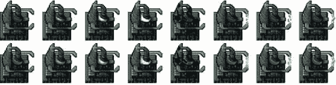

图 6-1。雪碧片为基底

如您所见，该表单由蓝色和绿色团队的两行不同的框架组成。在这种情况下，精灵由一个默认动画(四帧)、一个损坏的基础(一帧)和最后一个基础建造建筑物时的动画(三帧)组成。我们将为游戏中的所有实体使用相似的精灵表和通用的加载和绘制机制。

我们要做的第一件事是在 buildings.js 中定义一个 buildings 对象，如清单 6-2 所示。

***清单 6-2。*** 用第一个建筑类型(buildings.js)定义建筑对象

```html
    var buildings = {
    list:{
        "base":{
            name:"base",
            // Properties for drawing the object
            pixelWidth:60,
            pixelHeight:60,
            baseWidth:40,
            baseHeight:40,
            pixelOffsetX:0,
            pixelOffsetY:20,
            // Properties for describing structure for pathfinding
            buildableGrid:[
                [1,1],
                [1,1]
            ],
            passableGrid:[
                [1,1],
                [1,1]
            ],
            sight:3,
            hitPoints:500,
            cost:5000,
            spriteImages:[
                {name:"healthy",count:4},
                {name:"damaged",count:1},
                {name:"contructing",count:3},
            ],
        },
    },
    defaults:{
        type:"buildings",
        animationIndex:0,
        direction:0,
        orders:{ type:"stand" },
        action:"stand",
        selected:false,
        selectable:true,
        // Default function for animating a building
        animate:function(){
        },
        // Default function for drawing a building
        draw:function(){
        }
    },
    load:loadItem,
    add:addItem,
}
```

buildings 对象有四个重要的项目。

*   列表属性将包含我们所有建筑的定义。现在，我们定义基础建筑以及稍后需要的属性。这些属性包括绘制对象的属性(如 pixelWidth)、寻路属性(buildableGrid)、生命值和开销等常规属性，最后是精灵图像列表。
*   defaults 属性包含所有建筑通用的属性和定义。这包括所有建筑物通常使用的 animate()和 draw()方法的占位符。我们将在后面实现这些方法。
*   load()方法指向所有实体的一个公共方法，称为 loadItem()，我们仍然需要定义它。该方法将加载给定实体的 sprite 表和定义。
*   add()方法指向我们需要定义的所有实体的另一个公共方法 addItem()。这个方法将创建一个给定实体的新实例来添加到游戏中。

现在我们已经有了一个基本的构建定义，我们将在 common.js 中定义 loadItem()和 addItem()方法，这样它们就可以被所有的实体使用(见清单 6-3 )。

***清单 6-3。*** 定义 loadItem()和 addItem()方法(common.js)

```html
/* The default load() method used by all our game entities*/
function loadItem(name){
    var item = this.list[name];
    // if the item sprite array has already been loaded then no need to do it again
    if(item.spriteArray){
        return;
    }
    item.spriteSheet = loader.loadImage('img/'+this.defaults.type+'/'+name+'.png');
    item.spriteArray = [];
    item.spriteCount = 0;

    for (var i=0; i < item.spriteImages.length; i++){
        var constructImageCount = item.spriteImages[i].count;
        var constructDirectionCount = item.spriteImages[i].directions;
        if (constructDirectionCount){
            for (var j=0; j < constructDirectionCount; j++) {
                var constructImageName = item.spriteImages[i].name +"-"+j;
                item.spriteArray[constructImageName] = {
                    name:constructImageName,
                    count:constructImageCount,
                    offset:item.spriteCount
                };
                item.spriteCount += constructImageCount;
            };
        } else {
            var constructImageName = item.spriteImages[i].name;
            item.spriteArray[constructImageName] = {
                name:constructImageName,
                count:constructImageCount,
                offset:item.spriteCount
            };
            item.spriteCount += constructImageCount;
        }

    }
}

/* The default add() method used by all our game entities*/
function addItem(details){
    var item = {};
    var name = details.name;
    $.extend(item,this.defaults);
    $.extend(item,this.list[name]);
    item.life = item.hitPoints;
    $.extend(item,details);
    return item;
}
```

loadItem()方法使用图像加载器将 sprite 工作表图像加载到 sprite sheet 属性中。然后，它遍历 spriteImages 定义并创建一个 spriteArray 对象，该对象存储每个 sprite 动画的起始偏移量。

您会注意到，在创建数组时，代码会检查 count 和 directions 属性是否存在。这允许我们定义多方向的精灵，在绘制像炮塔和车辆这样的实体时会用到。

addItem()方法首先应用实体类型的默认值(例如，buildings)，然后使用特定实体的属性(例如，base)扩展它，设置项目的生命周期，最后应用传递到 details 参数中的任何附加属性。

这种创建对象的有趣方式为我们提供了自己的多重继承实现，允许我们在三个不同的级别定义和覆盖属性:建筑属性、基本属性和特定于项目的细节(比如位置和团队颜色)。

既然我们已经定义了我们的第一个实体，我们需要一个简单的方法将实体添加到一个级别中。

向级别添加实体

我们要做的第一件事是修改我们的映射定义，以包含一个需要加载的实体类型列表和一个在开始之前要添加到级别的项目列表。我们将修改我们在 maps.js 中创建的第一个地图，如清单 6-4 所示。

***清单 6-4。*** 加载和添加地图内部实体(maps.js)

```html
var maps = {
    "singleplayer":[
        {
            "name":"Entities",
            "briefing": "In this level you will add new entities to the map.\nYou will also select them using the mouse",

            /* Map Details */
            "mapImage":"img/level-one-debug-grid.png",
            "startX":4,
            "startY":4,

            /* Entities to be loaded */
            "requirements":{
                "buildings":["base"],
                "vehicles":[],
                "aircraft":[],
                "terrain":[]
            },

            /* Entities to be added */
            "items":[
                {"type":"buildings","name":"base","x":11,"y":14,"team":"blue"},
                {"type":"buildings","name":"base","x":12,"y":16,"team":"green"},
                {"type":"buildings","name":"base","x":15,"y":15,"team":"green", "life":50}
            ]

        }
    ]
}
```

该地图与第五章中的地图非常相似。我们添加了两个新的部分:需求和项目。

requirements 属性包含建筑物、车辆、飞机和地形，以便为该级别预加载。现在，我们只装载基地类型的建筑。

条目数组包含了我们想要添加到这个级别的实体的详细信息。我们提供的细节包括项目类型和名称、x 和 y 坐标以及团队的颜色。这些是我们唯一定义一个实体所需要的最基本的属性。

我们增加了三个随机位置和队伍的基地建筑。items 数组中的最后一个建筑还包含一个附加属性:life。由于我们之前定义 addItem()方法的方式，这个 life 属性将覆盖基础的 life 默认值。这样，我们也将有一个受损建筑的例子。

接下来我们将修改 singleplayer.js 中的 singleplayer.startCurrentLevel()方法，以便在游戏开始时加载和添加实体(参见清单 6-5 )。

***清单 6-5。*** 在 startCurrentLevel()方法(singleplayer.js)中加载和添加实体

```html
startCurrentLevel:function(){
    // Load all the items for the level
    var level = maps.singleplayer[singleplayer.currentLevel];

    // Don't allow player to enter mission until all assets for the level are loaded
    $("#entermission").attr("disabled", true);
    // Load all the assets for the level
    game.currentMapImage = loader.loadImage(level.mapImage);
    game.currentLevel = level;

    game.offsetX = level.startX * game.gridSize;
    game.offsetY = level.startY * game.gridSize;

    // Load level Requirements
    game.resetArrays();
    for (var type in level.requirements){
       var requirementArray = level.requirements[type];
       for (var i=0; i < requirementArray.length; i++) {
           var name = requirementArray[i];
           if (window[type]){
               window[type].load(name);
           } else {
               console.log('Could not load type :',type);
           }
       };
   }

    for (var i = level.items.length - 1; i >= 0; i--){
        var itemDetails = level.items[i];
        game.add(itemDetails);
    };

    // Enable the enter mission button once all assets are loaded
    if (loader.loaded){
        $("#entermission").removeAttr("disabled");
    } else {
        loader.onload = function(){
            $("#entermission").removeAttr("disabled");
        }
    }

    // Load the mission screen with the current briefing
    $('#missonbriefing').html(level.briefing.replace(/\n/g,'<br><br>'));
    $("#missionscreen").show();
},
```

我们在新添加的代码中做了三件事。我们首先通过调用 game.resetArrays()方法初始化游戏数组。然后我们遍历需求对象，并为每个实体调用适当的 load()方法。load()方法将依次调用加载器在后台异步加载实体的所有图像，并在所有图像加载完毕后启用 entermission 按钮。

最后，我们遍历 items 数组并将详细信息传递给 game.add()方法。

接下来我们将在 game.js 中为游戏对象添加 resetArrays()、add()和 remove()方法(参见清单 6-6 )。

***清单 6-6。*** 向游戏对象(game.js)添加 resetArrays()、add()和 remove()

```html
resetArrays:function(){
    game.counter = 1;
    game.items = [];
    game.sortedItems = [];
    game.buildings = [];
    game.vehicles = [];
    game.aircraft = [];
    game.terrain = [];
    game.triggeredEvents = [];
    game.selectedItems = [];
    game.sortedItems = [];
},
add:function(itemDetails) {
    // Set a unique id for the item
    if (!itemDetails.uid){
        itemDetails.uid = game.counter++;
    }
    var item = window[itemDetails.type].add(itemDetails);
    // Add the item to the items array
    game.items.push(item);
    // Add the item to the type specific array
    game[item.type].push(item);
    return item;
},
remove:function(item){
    // Unselect item if it is selected
    item.selected = false;
    for (var i = game.selectedItems.length - 1; i >= 0; i--){
           if(game.selectedItems[i].uid == item.uid){
               game.selectedItems.splice(i,1);
               break;
           }
    };

    // Remove item from the items array
    for (var i = game.items.length - 1; i >= 0; i--){
        if(game.items[i].uid == item.uid){
            game.items.splice(i,1);
            break;
        }
    };

    // Remove items from the type specific array
    for (var i = game[item.type].length - 1; i >= 0; i--){
        if(game[item.type][i].uid == item.uid){
            game[item.type].splice(i,1);
            break;
        }
    };
},
```

resetArrays()方法仅仅初始化所有游戏特定的数组和*计数器*变量。

add()方法使用计数器为项目生成唯一标识符(UID ),调用适当实体的 add()方法，最后将项目保存在适当的游戏数组中。对于基础建筑物，该方法将首先调用 buildings.add()，然后将新建筑物添加到 game.items 和 game.buildings 数组中。

remove()方法从 selectedItems、Items 和特定于实体的数组中移除指定的项。这样，任何时候从游戏中移除一个物品(例如，当它被破坏时)，它会自动从选择和物品数组中移除。

既然我们已经设置了定义实体和向层添加实体的代码，我们就可以开始在屏幕上绘制它们了。

绘制实体

为了绘制实体，我们需要在实体对象中实现 animate()和 draw()方法，然后从游戏 animationLoop()和 drawingLoop()方法中调用这些方法。

我们首先在 buildings.js 中的 buildings 对象内部实现 draw()和 animate()方法。buildings 对象的默认 draw()和 animate()方法现在看起来将类似于清单 6-7 。

***清单 6-7。***实现默认的 draw()和 animate()方法(buildings.js)

```html
animate:function(){
    // Consider an item healthy if it has more than 40% life
    if (this.life>this.hitPoints*0.4){
        this.lifeCode = "healthy";
    } else if (this.life <= 0){
        this.lifeCode = "dead";
        game.remove(this);
        return;
    } else {
        this.lifeCode = "damaged";
    }

    switch (this.action){
        case "stand":
            this.imageList = this.spriteArray[this.lifeCode];
            this.imageOffset = this.imageList.offset + this.animationIndex;
            this.animationIndex++;
            if (this.animationIndex>=this.imageList.count){
                this.animationIndex = 0;
            }
            break;
        case "construct":
            this.imageList = this.spriteArray["contructing"];
            this.imageOffset = this.imageList.offset + this.animationIndex;
            this.animationIndex++;
            // Once constructing is complete go back to standing
            if (this.animationIndex>=this.imageList.count){
                this.animationIndex = 0;
                this.action = "stand";
            }
            break;
    }
},
// Default function for drawing a building
draw:function(){
    var x = (this.x*game.gridSize)-game.offsetX-this.pixelOffsetX;
    var y = (this.y*game.gridSize)-game.offsetY-this.pixelOffsetY;

    // All sprite sheets will have blue in the first row and green in the second row
    var colorIndex = (this.team == "blue")?0:1;
    var colorOffset = colorIndex*this.pixelHeight;
    game.foregroundContext.drawImage(this.spriteSheet,
    this.imageOffset*this.pixelWidth,colorOffset, this.pixelWidth, this.pixelHeight,
    x,y,this.pixelWidth,this.pixelHeight);
}
```

在 animate()方法中，我们首先根据项目的健康状况和生命值设置项目的 lifeCode 属性。任何时候一个物品的生命值降到 0 以下，我们会将生命代码设置为死亡，并将其从游戏中移除。

接下来，我们基于项目的 action 属性实现行为。现在，我们只实现 stand 和 construct 操作。

对于站立动作，我们选择“健康的”或“损坏的”精灵动画，并增加 animationIndex 属性。如果 animationIndex 超过了 sprite 中的帧数，我们将该值回滚到 0。这样，动画会一次又一次地在精灵的每一帧中旋转。

对于构造动作，我们显示构造精灵，并在完成后滚动到 *stand* 动作。

draw()方法相对简单一些。我们通过转换网格 x 和 y 坐标来计算建筑物的绝对 x 和 y 像素坐标。然后我们计算正确的图像偏移量(基于 animationIndex)和图像颜色行(基于 team)。最后，我们使用 foregroundContext.drawImage()方法在前景画布上绘制适当的图像。

既然 draw()和 animate()方法已经就绪，我们需要从游戏对象中调用它们。我们将修改 game.js 内部的 game.animationLoop()和 game.drawingLoop()方法，如清单 6-8 所示。

***清单 6-8。*** 从游戏循环(game.js)中调用 draw()和 animate()

```html
animationLoop:function(){
    // Animate each of the elements within the game
    for (var i = game.items.length - 1; i >= 0; i--){
        game.items[i].animate();
    };

    // Sort game items into a sortedItems array based on their x,y coordinates
    game.sortedItems = $.extend([],game.items);
    game.sortedItems.sort(function(a,b){
        return b.y-a.y + ((b.y==a.y)?(a.x-b.x):0);
    });
},
drawingLoop:function(){
    // Handle Panning the Map
    game.handlePanning();

    // Since drawing the background map is a fairly large operation,
    // we only redraw the background if it changes (due to panning)
    if (game.refreshBackground){
game.backgroundContext.drawImage(game.currentMapImage,game.offsetX,game.offsetY,game.canvasWidth, game.canvasHeight, 0,0,game.canvasWidth,game.canvasHeight);
        game.refreshBackground = false;
    }

    // Clear the foreground canvas
    game.foregroundContext.clearRect(0,0,game.canvasWidth,game.canvasHeight);

    // Start drawing the foreground elements
    for (var i = game.sortedItems.length - 1; i >= 0; i--){
        game.sortedItems[i].draw();
    };

    // Draw the mouse
    mouse.draw();

    // Call the drawing loop for the next frame using request animation frame
    if (game.running){
        requestAnimationFrame(game.drawingLoop);
    }
},
```

在 animationLoop()方法中，我们首先遍历所有游戏项目，并调用它们的 animate()方法。然后，我们按 y 值和 x 值对所有项目进行排序，并将它们存储在 game.sortedItems 数组中。

drawingLoop()方法中的新代码只是遍历 sortedItems 数组，并调用每一项的 draw()方法。我们使用 sortedItems 数组，以便根据项目的 y 坐标从后向前依次绘制项目。这是深度排序的一个简单实现，它确保靠近玩家的项目掩盖了后面的项目，产生了深度的错觉。

经过最后的修改，我们现在可以在屏幕上看到我们的第一个游戏实体了。如果我们在浏览器中打开游戏，加载第一关，我们应该会看到我们在地图中定义的三个基地建筑一个挨着一个画出来(见图 6-2 )。

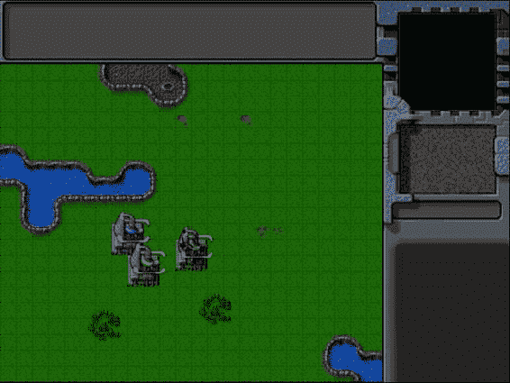

图 6-2。三个基地建筑

正如你所看到的，第一个“蓝色”团队基地使用“健康”动画显示了闪烁的蓝光。

第二个“绿色”团队基础绘制在第一个基础之上，并部分遮挡第一个基础。这是我们深度排序步骤的结果，让玩家清楚地看到二垒在一垒前面。

最后，生命值更低的三垒看起来受损。这是因为每当建筑物的寿命低于其最大生命值的 40%时，我们会自动使用“受损”动画。

现在我们已经有了在游戏中展示建筑的框架，让我们添加剩下的建筑，从星港开始。

添加 Starport

星港可以用来购买地面和空中单位。星港精灵表单有一些基地没有的有趣的动画:一个传送动画序列，我们将在第一次创建建筑时使用，一个打开和关闭动画序列，我们将在运输新单位时使用。

我们要做的第一件事是将 starport 定义添加到 buildings.js 中的基本定义下面的 buildings 列表中(见清单 6-9 )。

***清单 6-9。*** 定义为星港大厦(buildings.js)

```html
"starport":{
    name:"starport",
    pixelWidth:40,
    pixelHeight:60,
    baseWidth:40,
    baseHeight:55,
    pixelOffsetX:1,
    pixelOffsetY:5,
    buildableGrid:[
        [1,1],
        [1,1],
        [1,1]
    ],
    passableGrid:[
        [1,1],
        [0,0],
        [0,0]
    ],
    sight:3,
    cost:2000,
    hitPoints:300,
    spriteImages:[
        {name:"teleport",count:9},
        {name:"closing",count:18},
        {name:"healthy",count:4},
        {name:"damaged",count:1},
    ],
},

```

除了两个新的精灵集，starport 的定义与基本定义非常相似。接下来，我们将需要考虑动画的打开，关闭和瞬间移动的动画状态。我们将通过修改 buildings.js 中建筑物的默认 animate()方法来实现这一点，如清单 6-10 所示。

***清单 6-10。*** 修改 animate()来处理瞬移、开启和关闭

```html
animate:function(){
    // Consider an item healthy if it has more than 40% life
    if (this.life>this.hitPoints*0.4){
        this.lifeCode = "healthy";
    } else if (this.life <= 0){
        this.lifeCode = "dead";
        game.remove(this);
        return;
    } else {
        this.lifeCode = "damaged";
    }

    switch (this.action){
        case "stand":
            this.imageList = this.spriteArray[this.lifeCode];
            this.imageOffset = this.imageList.offset + this.animationIndex;
            this.animationIndex++;
            if (this.animationIndex>=this.imageList.count){
                this.animationIndex = 0;
            }
            break;
```

        case "construct":

```html
            this.imageList = this.spriteArray["contructing"];
            this.imageOffset = this.imageList.offset + this.animationIndex;
            this.animationIndex++;
            // Once contructing is complete go back to standing
            if (this.animationIndex>=this.imageList.count){
                this.animationIndex = 0;

this.action = "Stand";
```

            }

```html
            break;
        case "teleport":
            this.imageList = this.spriteArray["teleport"];
            this.imageOffset = this.imageList.offset + this.animationIndex;
            this.animationIndex++;
            // Once teleporting is complete, move to either guard or stand mode
            if (this.animationIndex>=this.imageList.count){
                this.animationIndex = 0;
                if (this.canAttack){
                    this.action = "guard";
                } else {
                    this.action = "stand";
                }
            }
            break;
        case "close":
            this.imageList = this.spriteArray["closing"];
            this.imageOffset = this.imageList.offset + this.animationIndex;
            this.animationIndex++;
            // Once closing is complete go back to standing
            if (this.animationIndex>=this.imageList.count){
                this.animationIndex = 0;
                this.action = "stand";
            }
            break;
        case "open":
            this.imageList = this.spriteArray["closing"];
            // Opening is just the closing sprites running backwards
            this.imageOffset = this.imageList.offset + this.imageList.count - this.animationIndex;
            this.animationIndex++;
            // Once opening is complete, go back to close
            if (this.animationIndex>=this.imageList.count){
                this.animationIndex = 0;
                this.action = "close";
            }
            break;
    }
},
```

像构造动画状态一样，*传送*、*关闭*和*打开*动画状态一旦结束就不再重复。瞬间移动动画翻转到站立动画状态(或可以攻击的建筑如炮塔的守卫动画状态)。*打开*动画(仅仅是向后运行的关闭动画状态)翻转到*关闭*动画状态，然后翻转到站立动画状态。

这样，我们可以用一个*传送*或*打开*动画状态来初始化 starport，知道一旦当前动画完成，它最终会移回到站立动画状态。

现在，我们可以通过修改 maps.js 中的需求和项目来将 starport 添加到地图中，如清单 6-11 中的所示。

***清单 6-11。*** 在地图上添加星港

```html
/* Entities to be loaded */
"requirements":{
    "buildings":["base","starport"],
    "vehicles":[],
    "aircraft":[],
    "terrain":[]
},

/* Entities to be added */
"items":[
    {"type":"buildings","name":"base","x":11,"y":14,"team":"blue"},
    {"type":"buildings","name":"base","x":12,"y":16,"team":"green"},
    {"type":"buildings","name":"base","x":15,"y":15,"team":"green", "life":50},

    {"type":"buildings","name":"starport","x":18,"y":14,"team":"blue"},
    {"type":"buildings","name":"starport","x":18,"y":10,"team":"blue", "action":"teleport"},
    {"type":"buildings","name":"starport","x":18,"y":6,"team":"green", "action":"open"},
]
```

当我们在浏览器中打开游戏开始关卡时，应该会看到三个新的星港建筑，如图图 6-3 所示。


图 6-3。三座星港建筑

第一个绿色团队星港打开，然后关闭。第二个蓝队星港首先发光并出现，然后切换到站立模式，而最后一个蓝队星港只是在站立模式下等待。

现在星港已经被添加了，我们要看的下一个建筑是矿车。

添加收割机

收割机是一个独特的实体，因为它既是建筑又是交通工具。与游戏中的其他建筑不同，收割机是通过在油田部署一辆收割机进入建筑而创建的(见图 6-4 )。

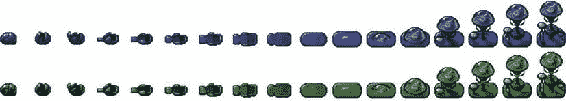

图 6-4。收割机展开成建筑形态

我们要做的第一件事是将收割机定义添加到 buildings.js 中 starport 定义下的 buildings 列表中(见清单 6-12 )。

***清单 6-12。*** 收割机建筑定义(buildings.js)

```html
"harvester":{
    name:"harvester",
    pixelWidth:40,
    pixelHeight:60,
    baseWidth:40,
    baseHeight:20,
    pixelOffsetX:-2,
    pixelOffsetY:40,
    buildableGrid:[
        [1,1]
    ],
    passableGrid:[
        [1,1]
    ],
    sight:3,
    cost:5000,
    hitPoints:300,
    spriteImages:[
        {name:"deploy",count:17},
        {name:"healthy",count:3},
        {name:"damaged",count:1},
    ],
},
```

接下来，我们需要考虑正在部署的动画状态。我们将通过向 buildings.js 中的默认 animate()方法添加部署案例来实现这一点，如清单 6-13 中的所示。

***清单 6-13。*** 处理部署动画状态(buildings.js)

```html
case "deploy":
    this.imageList = this.spriteArray["deploy"];
    this.imageOffset = this.imageList.offset + this.animationIndex;
    this.animationIndex++;
    // Once deploying is complete, go back to stand
    if (this.animationIndex>=this.imageList.count){
        this.animationIndex = 0;
        this.action = "stand";
    }
    break;
```

展开状态，就像我们之前定义的传送状态一样，一旦完成就会自动进入站立动画状态。

现在，我们可以通过修改 maps.js 中的需求和项目来将收割机添加到地图中，如清单 6-14 中的所示。

***清单 6-14。*** 向地图添加收割机

```html
/* Entities to be loaded */
"requirements":{
    "buildings":["base","starport","harvester"],
    "vehicles":[],
    "aircraft":[],
    "terrain":[]
},

/* Entities to be added */
"items":[
    {"type":"buildings","name":"base","x":11,"y":14,"team":"blue"},
    {"type":"buildings","name":"base","x":12,"y":16,"team":"green"},
    {"type":"buildings","name":"base","x":15,"y":15,"team":"green", "life":50},

    {"type":"buildings","name":"starport","x":18,"y":14,"team":"blue"},
    {"type":"buildings","name":"starport","x":18,"y":10,"team":"blue", "action":"teleport"},
    {"type":"buildings","name":"starport","x":18,"y":6,"team":"green", "action":"open"},

    {"type":"buildings","name":"harvester","x":20,"y":10,"team":"blue"},
    {"type":"buildings","name":"harvester","x":22,"y":12,"team":"green", "action":"deploy"},

]
```

当我们在浏览器中打开游戏开始关卡时，应该会看到两个新的收割机建筑，如图图 6-5 所示。

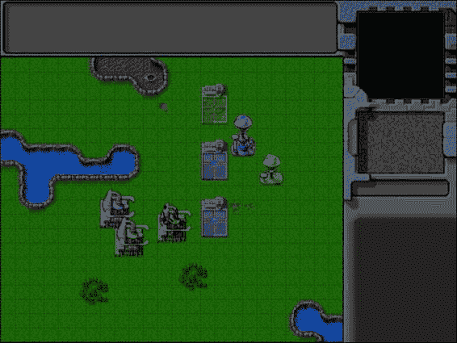

图 6-5。两座收割机建筑

蓝色的收割者处于默认的站立模式，而绿色的收割者在部署模式下会变形为一个建筑，然后切换到站立模式。

现在已经添加了矿车，最后一个建筑我们来看看地面炮塔。

添加地面炮塔

地面炮塔是一种防御建筑，只攻击地面威胁。

这是唯一使用基于方向的精灵的建筑。此外，与其他建筑不同，它有一个默认的守卫动画状态，在动画和绘图时会考虑炮塔的方向。

方向属性的取值范围为 0-7，顺时针方向递增，0 指向北方，7 指向西北方向，如图图 6-6 所示。

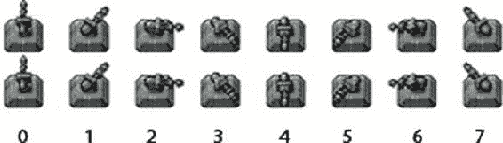

图 6-6。炮塔的方向精灵范围从 0 到 7

我们要做的第一件事是将炮塔定义添加到 buildings.js 中收割机定义下面的建筑物列表中(见清单 6-15 )。

***清单 6-15。*** 收割机建筑定义(buildings.js)

```html
"ground-turret":{
    name:"ground-turret",
    canAttack:true,
    canAttackLand:true,
    canAttackAir:false,
    weaponType:"cannon-ball",
    action:"guard", // Default action is guard unlike other buildings
    direction:0, // Face upward (0) by default
    directions:8, // Total of 8 turret directions allowed (0-7)
    orders:{type:"guard"},
    pixelWidth:38,
    pixelHeight:32,
    baseWidth:20,
    baseHeight:18,
    cost:1500,
    pixelOffsetX:9,
    pixelOffsetY:12,
    buildableGrid:[
        [1]
    ],
    passableGrid:[
        [1]
    ],
    sight:5,
    hitPoints:200,
    spriteImages:[
        {name:"teleport",count:9},
        {name:"healthy",count:1,directions:8},
        {name:"damaged",count:1},
    ],
}
```

炮塔有一些额外的属性，表明它是否可以用来攻击敌人，炮塔指向的方向，以及它使用的武器类型。当我们在游戏中实现战斗时，我们将使用这些属性。

健康精灵有一个附加的 directions 属性，itemLoad()方法使用该属性为每个方向生成精灵。

接下来，我们将把 guard case 添加到 buildings.js 中的 animate()方法，如清单 6-16 所示。

***清单 6-16。*** 处理门卫动画状态(buildings.js)

```html
case "guard":
    if (this.lifeCode == "damaged"){
        // The damaged turret has no directions
        this.imageList = this.spriteArray[this.lifeCode];
    } else {
        // The healthy turret has 8 directions
        this.imageList = this.spriteArray[this.lifeCode+"-"+this.direction];
    }
     this.imageOffset = this.imageList.offset;
    break;
```

与前面的动画状态不同，保护状态不使用 animationIndex，而是使用炮塔方向来拾取适当的图像偏移。

现在，我们可以通过修改 maps.js 中的要求和项目来将炮塔添加到地图中，如清单 6-17 所示。

***清单 6-17。*** 给地图添加地面炮塔

```html
/* Entities to be loaded */
"requirements":{
    "buildings":["base","starport","harvester","ground-turret"],
    "vehicles":[],
    "aircraft":[],
    "terrain":[]
},

/* Entities to be added */
"items":[
    {"type":"buildings","name":"base","x":11,"y":14,"team":"blue"},
    {"type":"buildings","name":"base","x":12,"y":16,"team":"green"},
    {"type":"buildings","name":"base","x":15,"y":15,"team":"green", "life":50},

    {"type":"buildings","name":"starport","x":18,"y":14,"team":"blue"},
    {"type":"buildings","name":"starport","x":18,"y":10,"team":"blue", "action":"teleport"},
    {"type":"buildings","name":"starport","x":18,"y":6,"team":"green", "action":"open"},

    {"type":"buildings","name":"harvester","x":20,"y":10,"team":"blue"},
    {"type":"buildings","name":"harvester","x":22,"y":12,"team":"green", "action":"deploy"},

    {"type":"buildings","name":"ground-turret","x":14,"y":9,"team":"blue", "direction":3},
    {"type":"buildings","name":"ground-turret","x":14,"y":12,"team":"green", "direction":1},
    {"type":"buildings","name":"ground-turret","x":16,"y":10,"team":"blue", "action":"teleport"},
]
```

我们为前两个炮塔指定了起始方向属性，并将第三个炮塔的动作属性设置为传送。当我们在浏览器中打开游戏，开始关卡时，应该会看到三个新的炮塔，如图图 6-7 所示。

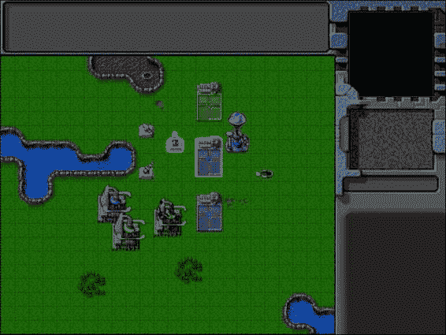

图 6-7。三座地面炮塔建筑

前两个炮塔是守卫模式，面向两个不同的方向，第三个是瞬移到面向默认方向，瞬移到后切换到守卫模式。

至此，我们已经实现了我们需要的所有构建。现在是时候开始给我们的游戏增加一些交通工具了。

添加车辆

我们游戏中的所有交通工具，包括运输工具，都会有一个简单的精灵表，上面的交通工具指向八个方向，类似于地面炮塔，如图图 6-8 所示。

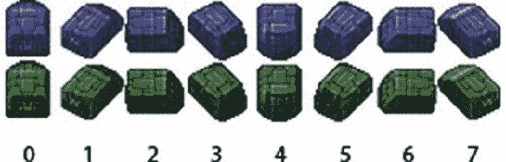

图 6-8。运输子画面

我们将通过在 vehicles.js 中定义一个新的 vehicles 对象来为我们的车辆设置代码，如清单 6-18 中的所示。

***清单 6-18。*** 定义车辆对象(vehicles.js)

```html
var vehicles = {
    list:{
        "transport":{
            name:"transport",
            pixelWidth:31,
            pixelHeight:30,
            pixelOffsetX:15,
            pixelOffsetY:15,
            radius:15,
            speed:15,
            sight:3,
            cost:400,
            hitPoints:100,
            turnSpeed:2,
            spriteImages:[
                {name:"stand",count:1,directions:8}
            ],
        },
        "harvester":{
            name:"harvester",
            pixelWidth:21,
            pixelHeight:20,
            pixelOffsetX:10,
            pixelOffsetY:10,
            radius:10,
            speed:10,
            sight:3,
            cost:1600,
            hitPoints:50,
            turnSpeed:2,
            spriteImages:[
                {name:"stand",count:1,directions:8}
            ],
        },
        "scout-tank":{
            name:"scout-tank",
            canAttack:true,
            canAttackLand:true,
            canAttackAir:false,
            weaponType:"bullet",
            pixelWidth:21,
            pixelHeight:21,
            pixelOffsetX:10,
            pixelOffsetY:10,
            radius:11,
            speed:20,
            sight:4,
            cost:500,
            hitPoints:50,
            turnSpeed:4,
            spriteImages:[
                {name:"stand",count:1,directions:8}
            ],
        },
        "heavy-tank":{
            name:"heavy-tank",
            canAttack:true,
            canAttackLand:true,
            canAttackAir:false,
            weaponType:"cannon-ball",
            pixelWidth:30,
            pixelHeight:30,
            pixelOffsetX:15,
            pixelOffsetY:15,
            radius:13,
            speed:15,
            sight:5,
            cost:1200,
            hitPoints:50,
            turnSpeed:4,
            spriteImages:[
                {name:"stand",count:1,directions:8}
            ],
        }
    },
    defaults:{
        type:"vehicles",
        animationIndex:0,
        direction:0,
        action:"stand",
        orders:{type:"stand"},
        selected:false,
        selectable:true,
        directions:8,
        animate:function(){
            // Consider an item healthy if it has more than 40% life
            if (this.life>this.hitPoints*0.4){
                this.lifeCode = "healthy";
            } else if (this.life <= 0){
                this.lifeCode = "dead";
                game.remove(this);
                return;
            } else {
                this.lifeCode = "damaged";
            }

            switch (this.action){
                case "stand":
                    var direction = this.direction;
                    this.imageList = this.spriteArray["stand-"+direction];
                    this.imageOffset = this.imageList.offset + this.animationIndex;
                    this.animationIndex++;
                    if (this.animationIndex>=this.imageList.count){
                        this.animationIndex = 0;
                    }

                break;
            }
        },
        draw:function(){
            var x = (this.x*game.gridSize)-game.offsetX-this.pixelOffsetX;
            var y = (this.y*game.gridSize)-game.offsetY-this.pixelOffsetY;
            var colorIndex = (this.team == "blue")?0:1;
            var colorOffset = colorIndex*this.pixelHeight;
            game.foregroundContext.drawImage(this.spriteSheet, this.imageOffset*this.pixelWidth, colorOffset, this.pixelWidth, this.pixelHeight, x, y, this.pixelWidth, this.pixelHeight);
        }
    },
    load:loadItem,
    add:addItem,
}
```

我们的车辆对象的结构与建筑物对象非常相似。我们有一个列表属性，定义了四种车辆类型:运输车、矿车、侦察兵坦克和重型坦克。

所有车辆精灵都有 directions 属性和 animate()中的默认 stand 动画实现，它使用车辆的方向来选择要绘制的精灵。我们使用 animationIndex 来处理一个 sprite 中的多个图像，以便在需要时添加带有动画的车辆。

车辆还具有速度、视野和成本等属性。运输和采矿车没有任何武器，而这两种坦克有类似于我们之前定义的地面炮塔建筑的武器属性。我们将在后面的章节中使用所有这些属性来实现移动和战斗。

现在，我们可以通过修改 maps.js 中的 requirements 和 items 属性将这些车辆添加到地图中，如清单 6-19 中的所示。

***清单 6-19。*** 向地图添加车辆

```html
/* Entities to be loaded */
"requirements":{
    "buildings":["base","starport","harvester","ground-turret"],
    "vehicles":["transport","harvester","scout-tank","heavy-tank"],
    "aircraft":[],
    "terrain":[]
},

/* Entities to be added */
"items":[
    {"type":"buildings","name":"base","x":11,"y":14,"team":"blue"},
    {"type":"buildings","name":"base","x":12,"y":16,"team":"green"},
    {"type":"buildings","name":"base","x":15,"y":15,"team":"green", "life":50},

    {"type":"buildings","name":"starport","x":18,"y":14,"team":"blue"},
    {"type":"buildings","name":"starport","x":18,"y":10,"team":"blue", "action":"teleport"},
    {"type":"buildings","name":"starport","x":18,"y":6,"team":"green", "action":"open"},

    {"type":"buildings","name":"harvester","x":20,"y":10,"team":"blue"},
    {"type":"buildings","name":"harvester","x":22,"y":12,"team":"green", "action":"deploy"},

    {"type":"buildings","name":"ground-turret","x":14,"y":9,"team":"blue", "direction":3},
    {"type":"buildings","name":"ground-turret","x":14,"y":12,"team":"green", "direction":1},
    {"type":"buildings","name":"ground-turret" ,"x":16,"y":10, "team":"blue", "action":"teleport"},

    {"type":"vehicles","name":"transport","x":26,"y":10,"team":"blue","direction":2},
    {"type":"vehicles","name":"harvester","x":26,"y":12,"team":"blue","direction":3},
    {"type":"vehicles","name":"scout-tank","x":26,"y":14,"team":"blue", "direction":4},
    {"type":"vehicles","name":"heavy-tank","x":26,"y":16,"team":"blue", "direction":5},
    {"type":"vehicles","name":"transport","x":28,"y":10,"team":"green", "direction":7},
    {"type":"vehicles","name":"harvester","x":28,"y":12,"team":"green", "direction":6},
    {"type":"vehicles","name":"scout-tank","x":28,"y":14,"team":"green", "direction":1},
    {"type":"vehicles","name":"heavy-tank","x":28,"y":16,"team":"green", "direction":0},
]
```

当我们在浏览器中打开游戏并开始关卡时，应该会看到车辆，如图图 6-9 所示。

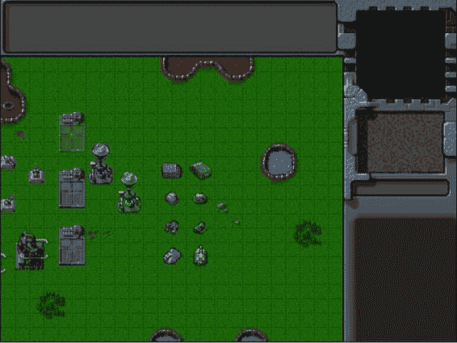

图 6-9。向关卡添加车辆

根据我们在将车辆添加到项目列表时设置的属性，车辆指向不同的方向。随着交通工具的实现，是时候把飞机加入到我们的游戏中了。

添加飞机

我们游戏中的飞机有一个类似于车辆的精灵表，除了一个区别:阴影。飞机精灵表有第三排阴影。此外，斩波器子画面在每个方向都有多个图像，如图图 6-10 所示。

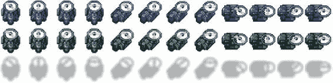

图 6-10。带阴影的斩波器子画面

我们将通过在 aircraft.js 中定义一个新的飞行器对象来为我们的飞行器设置代码，如清单 6-20 中的所示。

***清单 6-20。*** 定义飞机对象(aircraft.js)

```html
var aircraft = {
    list:{
        "chopper":{
            name:"chopper",
            cost:900,
            pixelWidth:40,
            pixelHeight:40,
            pixelOffsetX:20,
            pixelOffsetY:20,
            weaponType:"heatseeker",
            radius:18,
            sight:6,
            canAttack:true,
            canAttackLand:true,
            canAttackAir:true,
            hitPoints:50,
            speed:25,
            turnSpeed:4,
            pixelShadowHeight:40,
            spriteImages:[
                {name:"fly",count:4,directions:8}
            ],
        },
        "wraith":{
            name:"wraith",
            cost:600,
            pixelWidth:30,
            pixelHeight:30,
            canAttack:true,
            canAttackLand:false,
            canAttackAir:true,
            weaponType:"fireball",
            pixelOffsetX:15,
            pixelOffsetY:15,
            radius:15,
            sight:8,
            speed:40,
            turnSpeed:4,
            hitPoints:50,
            pixelShadowHeight:40,
            spriteImages:[
                {name:"fly",count:1,directions:8}
            ],
        }
    },
    defaults:{
        type:"aircraft",
        animationIndex:0,
        direction:0,
        directions:8,
        action:"fly",
        selected:false,
        selectable:true,
        orders:{type:"float"},
        animate:function(){
            // Consider an item healthy if it has more than 40% life
            if (this.life>this.hitPoints*0.4){
                this.lifeCode = "healthy";
            } else if (this.life <= 0){
                this.lifeCode = "dead";
                game.remove(this);
                return;
            } else {
                this.lifeCode = "damaged";
            }
            switch (this.action){
                case "fly":
                    var direction = this.direction;
                     this.imageList = this.spriteArray["fly-"+ direction];
                    this.imageOffset = this.imageList.offset + this.animationIndex;
                    this.animationIndex++;
                    if (this.animationIndex>=this.imageList.count){
                         this.animationIndex = 0;
                    }
                break;
            }
        },
        draw:function(){
            var x = (this.x*game.gridSize)-game.offsetX-this.pixelOffsetX;
            var y = (this.y*game.gridSize)-game.offsetY-this.pixelOffsetY-this.pixelShadowHeight;
            var colorIndex = (this.team == "blue")?0:1;
            var colorOffset = colorIndex*this.pixelHeight;
            var shadowOffset = this.pixelHeight*2; // The aircraft shadow is on the second row of the sprite sheet

            game.foregroundContext.drawImage(this.spriteSheet, this.imageOffset*this.pixelWidth, colorOffset, this.pixelWidth, this.pixelHeight, x, y, this.pixelWidth,this.pixelHeight);
            game.foregroundContext.drawImage(this.spriteSheet, this.imageOffset*this.pixelWidth, shadowOffset, this.pixelWidth, this.pixelHeight, x, y+this.pixelShadowHeight, this.pixelWidth, this.pixelHeight);
        }
    },
    load:loadItem,
    add:addItem,
}
```

我们的飞机对象的结构类似于车辆对象。我们有一个列表属性，其中定义了两种飞机类型:直升机和幽灵。

所有的飞机精灵都有方向属性。animate()中的默认飞行动画实现使用飞机的方向来选择要绘制的精灵。对于斩波器，我们还使用 animationIndex 来处理每个方向的多个图像。

一个很大的区别是 draw()方法的实现方式。我们在飞机的位置画一个阴影，在飞机的位置上面画实际的飞机 pixelShadowHeight 像素。这样，飞机看起来就像是漂浮在地面上，阴影在它下面的地面上。

现在，我们可以通过修改 maps.js 中的 requirements 和 items 属性将这些飞机添加到地图中，如清单 6-21 所示。

***清单 6-21。*** 向地图添加飞机

```html
/* Entities to be loaded */
"requirements":{
    "buildings":["base","starport","harvester","ground-turret"],
    "vehicles":["transport","harvester","scout-tank","heavy-tank"],
    "aircraft":["chopper","wraith"],
    "terrain":[]
},

/* Entities to be added */
"items":[
    {"type":"buildings","name":"base","x":11,"y":14,"team":"blue"},
    {"type":"buildings","name":"base","x":12,"y":16,"team":"green"},
    {"type":"buildings","name":"base","x":15,"y":15,"team":"green", "life":50},

    {"type":"buildings","name":"starport","x":18,"y":14,"team":"blue"},
    {"type":"buildings","name":"starport","x":18,"y":10,"team":"blue", "action":"teleport"},
    {"type":"buildings","name":"starport","x":18,"y":6,"team":"green", "action":"open"},

    {"type":"buildings","name":"harvester","x":20,"y":10,"team":"blue"},
    {"type":"buildings","name":"harvester","x":22,"y":12,"team":"green", "action":"deploy"},

    {"type":"buildings","name":"ground-turret","x":14,"y":9,"team":"blue", "direction":3},
    {"type":"buildings","name":"ground-turret","x":14,"y":12,"team":"green", "direction":1},
    {"type":"buildings","name":"ground-turret","x":16,"y":10,"team":"blue", "action":"teleport"},

    {"type":"vehicles","name":"transport","x":26,"y":10,"team":"blue","direction":2},
    {"type":"vehicles","name":"harvester","x":26,"y":12,"team":"blue","direction":3},
    {"type":"vehicles","name":"scout-tank","x":26,"y":14,"team":"blue", "direction":4},
    {"type":"vehicles","name":"heavy-tank","x":26,"y":16,"team":"blue", "direction":5},
    {"type":"vehicles","name":"transport","x":28,"y":10,"team":"green", "direction":7},
    {"type":"vehicles","name":"harvester","x":28,"y":12,"team":"green", "direction":6},
    {"type":"vehicles","name":"scout-tank","x":28,"y":14,"team":"green", "direction":1},
    {"type":"vehicles","name":"heavy-tank","x":28,"y":16,"team":"green", "direction":0},
    {"type":"aircraft","name":"chopper","x":20,"y":22,"team":"blue", "direction":2},    {"type":"aircraft","name":"wraith","x":23,"y":22,"team":"green", "direction":3},
]
```

当我们在浏览器中打开游戏，开始关卡的时候，应该会看到飞行器悬停在地面上方，如图图 6-11 所示。

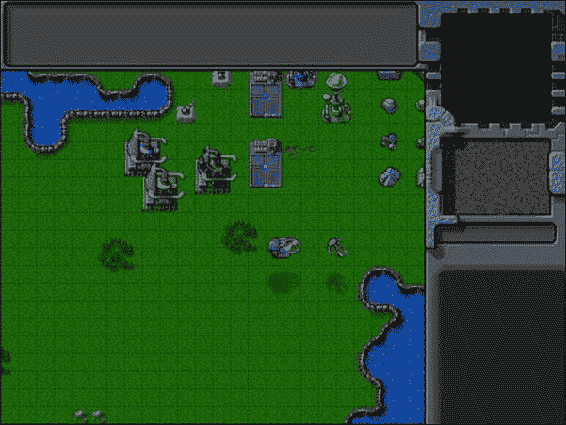

图 6-11。漂浮在地面上方的飞行器

阴影有助于创造飞机漂浮在地面上的错觉，也标记出它们在地面上的准确位置。由于动画的缘故，斩波器刀片及其在地面上的阴影似乎在旋转。

随着飞机的实现，我们现在将添加地形到我们的游戏中。

添加地形

除了油田之外，我们游戏中的地形实体都是静态物体，只是为了装饰。油田是一个特殊的实体，在它上面，采矿车可以部署到采矿建筑中。油田精灵表包括两个版本:一个默认版本和一个“提示”版本，上面显示一个模糊的收割机作为对玩家的提示。

我们将通过在 terrain.js 中定义一个新的地形对象来为我们的地形设置代码，如清单 6-22 所示。

***清单 6-22。*** 定义地形对象(terrain.js)

```html
var terrain = {
    list:{
        "oilfield":{
            name:"oilfield",
            pixelWidth:40,
            pixelHeight:60,
            baseWidth:40,
            baseHeight:20,
            pixelOffsetX:0,
            pixelOffsetY:40,
            buildableGrid:[
                [1,1]
            ],
            passableGrid:[
                [1,1]
            ],
            spriteImages:[
                {name:"hint",count:1},
                {name:"default",count:1},
            ],
        },
        "bigrocks":{
            name:"bigrocks",
            pixelWidth:40,
            pixelHeight:70,
            baseWidth:40,
            baseHeight:40,
            pixelOffsetX:0,
            pixelOffsetY:30,
            buildableGrid:[
                [1,1],
                [0,1]
            ],
            passableGrid:[
                [1,1],
                [0,1]
            ],
            spriteImages:[
                {name:"default",count:1},
            ],
        },
        "smallrocks":{
            name:"smallrocks",
            pixelWidth:20,
            pixelHeight:35,
            baseWidth:20,
            baseHeight:20,
            pixelOffsetX:0,
            pixelOffsetY:15,
            buildableGrid:[
                [1]
            ],
            passableGrid:[
                [1]
            ],
            spriteImages:[
                {name:"default",count:1},
            ],
        },
    },
    defaults:{
        type:"terrain",
        animationIndex:0,
        action:"default",
        selected:false,
        selectable:false,
        animate:function(){
            switch (this.action){
                case "default":
                     this.imageList = this.spriteArray["default"];
                     this.imageOffset = this.imageList.offset + this.animationIndex;
                     this.animationIndex++;
                     if (this.animationIndex>=this.imageList.count){
                         this.animationIndex = 0;
                     }
                break;
                case "hint":
                    this.imageList = this.spriteArray["hint"];
                    this.imageOffset = this.imageList.offset + this.animationIndex;
                    this.animationIndex++;
                    if (this.animationIndex>=this.imageList.count){
                        this.animationIndex = 0;
                    }
                break;
            }
        },
        draw:function(){
            var x = (this.x*game.gridSize)-game.offsetX-this.pixelOffsetX;
            var y = (this.y*game.gridSize)-game.offsetY-this.pixelOffsetY;

            var colorOffset = 0; // No team based colors
            game.foregroundContext.drawImage(this.spriteSheet, this.imageOffset*this.pixelWidth, colorOffset, this.pixelWidth, this.pixelHeight, x, y, this.pixelWidth, this.pixelHeight);
        }
    },
    load:loadItem,
    add:addItem,
}
```

我们的地形对象的结构类似于建筑物对象。我们有一个定义地形类型的列表属性:油田、大岩石和小岩石。我们在 animate()方法中实现了默认和提示动画状态。我们还实现了一个更简单的 draw()方法，它不使用基于团队的颜色。

现在，我们可以通过修改 maps.js 中的需求和项目将这些地形添加到地图中，如清单 6-23 所示。

***清单 6-23。*** 给地图添加地形

```html
/* Entities to be loaded */
"requirements":{
    "buildings":["base","starport","harvester","ground-turret"],
    "vehicles":["transport","harvester","scout-tank","heavy-tank"],
    "aircraft":["chopper","wraith"],
    "terrain":["oilfield","bigrocks","smallrocks"]
},

/* Entities to be added */
"items":[
    {"type":"buildings","name":"base","x":11,"y":14,"team":"blue"},
    {"type":"buildings","name":"base","x":12,"y":16,"team":"green"},
    {"type":"buildings","name":"base","x":15,"y":15,"team":"green", "life":50},

    {"type":"buildings","name":"starport","x":18,"y":14,"team":"blue"},
    {"type":"buildings","name":"starport","x":18,"y":10,"team":"blue", "action":"teleport"},
    {"type":"buildings","name":"starport","x":18,"y":6,"team":"green", "action":"open"},

    {"type":"buildings","name":"harvester","x":20,"y":10,"team":"blue"},
    {"type":"buildings","name":"harvester","x":22,"y":12,"team":"green", "action":"deploy"},

    {"type":"buildings","name":"ground-turret","x":14,"y":9,"team":"blue","direction":3},
    {"type":"buildings","name":"ground-turret","x":14,"y":12,"team":"green","direction":1},
    {"type":"buildings","name":"ground-turret","x":16,"y":10,"team":"blue","action":"teleport"},

    {"type":"vehicles","name":"transport","x":26,"y":10,"team":"blue", "direction":2},
    {"type":"vehicles","name":"harvester","x":26,"y":12,"team":"blue", "direction":3},
    {"type":"vehicles","name":"scout-tank","x":26,"y":14,"team":"blue","direction":4},
    {"type":"vehicles","name":"heavy-tank","x":26,"y":16,"team":"blue","direction":5},
    {"type":"vehicles","name":"transport","x":28,"y":10,"team":"green", "direction":7},
    {"type":"vehicles","name":"harvester","x":28,"y":12,"team":"green", "direction":6},
    {"type":"vehicles","name":"scout-tank","x":28,"y":14,"team":"green","direction":1},
    {"type":"vehicles","name":"heavy-tank","x":28,"y":16,"team":"green","direction":0},

    {"type":"aircraft","name":"chopper","x":20,"y":22,"team":"blue", "direction":2},
    {"type":"aircraft","name":"wraith","x":23,"y":22,"team":"green", "direction":3},
    {"type":"terrain","name":"oilfield","x":5,"y":7},
    {"type":"terrain","name":"oilfield","x":8,"y":7,"action":"hint"},
    {"type":"terrain","name":"bigrocks","x":5,"y":3},
    {"type":"terrain","name":"smallrocks","x":8,"y":3},
]
```

我们添加了两个油田，其中一个的 action 属性设置为 hint。当我们在浏览器中打开游戏并开始关卡时，应该会看到岩石和油田，如图图 6-12 所示。

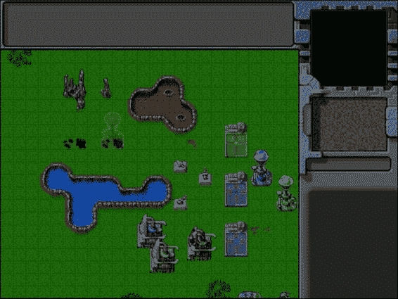

图 6-12。添加岩石和油田

右边有提示的油田有一个微弱发光的矿车图像，让玩家知道矿车可以部署在那里。这个油田的提示版本可以用在我们战役的早期阶段，当玩家刚刚接触到收割的想法时。

这样，我们实现了游戏中所有重要的实体。当然，在这一点上我们所能做的就是看着他们。接下来我们要做的是通过选择它们来与它们互动。

选择游戏实体

我们将允许玩家通过点击或者拖拽选择框来选择实体。

我们将通过修改 mouse.js 中的鼠标对象来启用点击选择，如清单 6-24 所示。

***清单 6-24。*** 通过点击启用选择(mouse.js)

```html
click:function(ev,rightClick){
    // Player clicked inside the canvas

    var clickedItem = this.itemUnderMouse();
    var shiftPressed = ev.shiftKey;

    if (!rightClick){ // Player left clicked
        if (clickedItem){
            // Pressing shift adds to existing selection. If shift is not pressed, clear existing selection
            if(!shiftPressed){
                game.clearSelection();
            }
            game.selectItem(clickedItem,shiftPressed);
        }
    } else { // Player right clicked
        // Handle actions like attacking and movement of selected units
    }
},
itemUnderMouse:function(){
    for (var i = game.items.length - 1; i >= 0; i--){
        var item = game.items[i];
        if (item.type=="buildings" || item.type=="terrain"){
            if(item.lifeCode != "dead"
                && item.x<= (mouse.gameX)/game.gridSize
                && item.x >= (mouse.gameX - item.baseWidth)/game.gridSize
                && item.y<= mouse.gameY/game.gridSize
                && item.y >= (mouse.gameY - item.baseHeight)/game.gridSize
                ){
                    return item;
            }
        } else if (item.type=="aircraft"){
            if (item.lifeCode != "dead" &&
                Math.pow(item.x-mouse.gameX/game.gridSize,2) + Math.pow(item.y-(mouse.gameY+item.pixelShadowHeight)/game.gridSize,2) < Math.pow((item.radius)/game.gridSize,2)){
                return item;
            }
       }else {
            if (item.lifeCode != "dead" && Math.pow(item.x-mouse.gameX/game.gridSize,2) + Math.pow(item.y-mouse.gameY/game.gridSize,2) < Math.pow((item.radius)/game.gridSize,2)){
                return item;
            }
        }
    }
},
```

mouse.click()方法首先使用 itemUnderMouse()方法检查在点击过程中鼠标下是否有项目。如果鼠标下有一个项目，单击了左键，我们调用 game.selectItem()方法。除非在单击时按下了 Shift 键，否则在选择新项目之前会调用 game.clearSelection()方法。这样，用户可以通过在选择时按住 Shift 键来选择多个项目。

itemUnderMouse()方法遍历列表中的所有项目，并使用针对不同项目类型的不同标准返回鼠标 gameX 和 gameY 坐标下的第一个项目。

*   在建筑物和地形的情况下，我们检查项目的底部是否在鼠标下面。这样，玩家可以点击建筑的底部来选择它，但在选择建筑后面的车辆时不会有问题。
*   对于车辆，我们检查鼠标是否在车辆中心的半径范围内。
*   对于飞机，我们使用 pixelShadowHeight 属性检查鼠标是否在飞机中心的半径范围内，而不是阴影。

接下来，我们将通过修改鼠标对象的 init()方法中的 mouseup 事件处理程序来处理拖动选择(参见清单 6-25 )。

***清单 6-25。*** 在 mouseup 事件处理程序(mouse.js)中实现拖动选择

```html
$mouseCanvas.mouseup(function(ev) {
    var shiftPressed = ev.shiftKey;
    if(ev.which==1){
    //Left key was released
        if (mouse.dragSelect){
            if (!shiftPressed){
                // Shift key was not pressed
                game.clearSelection();
            }

            var x1 = Math.min(mouse.gameX,mouse.dragX)/game.gridSize;
            var y1 = Math.min(mouse.gameY,mouse.dragY)/game.gridSize;
            var x2 = Math.max(mouse.gameX,mouse.dragX)/game.gridSize;
            var y2 = Math.max(mouse.gameY,mouse.dragY)/game.gridSize;
            for (var i = game.items.length - 1; i >= 0; i--){
                var item = game.items[i];
                if (item.type != "buildings" && item.selectable && item.team==game.team && x1<= item.x && x2 >= item.x){
                    if ((item.type == "vehicles" && y1<= item.y && y2 >= item.y)
                    || (item.type == "aircraft" && (y1 <= item.y-item.pixelShadowHeight/game.gridSize) && (y2 >= item.y-item.pixelShadowHeight/game.gridSize))){
                        game.selectItem(item,shiftPressed);
                    }

                }
            };
        }
        mouse.buttonPressed = false;
        mouse.dragSelect = false;
    }
    return false;
});
```

在 mouseup 事件中，我们检查鼠标是否被拖动过，如果是，遍历每个游戏项目，检查它是否在被拖动的矩形的边界内。然后，我们选择适当的项目。

最重要的是，我们只允许拖拽选择我们自己的车辆和飞机，而不是敌人或者我们自己的建筑。这是因为拖拽选择通常被用来选择一组单位来移动它们或者用它们快速攻击，而选择敌人单位或者我们自己的建筑并不能真正帮助玩家。

接下来，我们将在 game.js 内部的游戏对象中添加一些与选择相关的代码，如清单 6-26 所示。

***清单 6-26。*** 给游戏对象添加选择相关代码(game.js)

```html
/* Selection Related Code */
selectionBorderColor:"rgba(255,255,0,0.5)",
selectionFillColor:"rgba(255,215,0,0.2)",
healthBarBorderColor:"rgba(0,0,0,0.8)",
healthBarHealthyFillColor:"rgba(0,255,0,0.5)",
healthBarDamagedFillColor:"rgba(255,0,0,0.5)",
lifeBarHeight:5,
clearSelection:function(){
    while(game.selectedItems.length>0){
        game.selectedItems.pop().selected = false;
    }
},
selectItem:function(item,shiftPressed){
    // Pressing shift and clicking on a selected item will deselect it
    if (shiftPressed && item.selected){
        // deselect item
        item.selected = false;
        for (var i = game.selectedItems.length - 1; i >= 0; i--){
            if(game.selectedItems[i].uid == item.uid){
                game.selectedItems.splice(i,1);
                break;
            }
        };
        return;
    }

    if (item.selectable && !item.selected){
        item.selected = true;
        game.selectedItems.push(item);
    }
},
```

我们首先定义一些与颜色和生活条相关的常见的基于选择的属性。然后我们定义用于选择的两种方法。

*   clearSelection()方法遍历 game.selectedItems 数组，清除每个项目的 selected 标志，并从数组中删除该项目。
*   selectItem()方法根据是否按下了 Shift 键，将可选项目添加到 selectedItems()数组中，或者将其从数组中移除。通过这种方式，玩家可以在按住 Shift 键的情况下通过单击来取消选定的项目。

至此，我们已经拥有了在游戏中选择物品所需的所有代码。然而，我们仍然需要一种方法来突出显示选定的项目，以便我们可以在视觉上识别它们。这是我们接下来要实现的。

突出显示选定的实体

当玩家选择一个项目时，我们将使用该项目的 selected 属性来检测它，并在该项目周围绘制一个封闭的选择边界。我们还将添加一个指示器来显示该物品的寿命。

为此，我们将为每个实体定义两个默认方法 drawSelection()和 drawLifeBar()，并修改 draw()方法来调用它们。

首先，我们将在 buildings 对象中实现这些方法(参见清单 6-27 )。

***清单 6-27。*** 为建筑物(buildings.js)实现 drawSelection()和 drawLifeBar()

```html
drawLifeBar:function(){
    var x = this.drawingX+ this.pixelOffsetX;
    var y = this.drawingY - 2*game.lifeBarHeight;

    game.foregroundContext.fillStyle = (this.lifeCode == "healthy") ? game.healthBarHealthyFillColor: game.healthBarDamagedFillColor;

game.foregroundContext.fillRect(x,y,this.baseWidth*this.life/this.hitPoints,game.lifeBarHeight)

    game.foregroundContext.strokeStyle = game.healthBarBorderColor;
    game.foregroundContext.lineWidth = 1;
    game.foregroundContext.strokeRect(x,y,this.baseWidth,game.lifeBarHeight)
},
drawSelection:function(){
    var x = this.drawingX + this.pixelOffsetX;
    var y = this.drawingY + this.pixelOffsetY;
    game.foregroundContext.strokeStyle = game.selectionBorderColor;
    game.foregroundContext.lineWidth = 1;
    game.foregroundContext.fillStyle = game.selectionFillColor;
    game.foregroundContext.fillRect(x-1,y-1,this.baseWidth+2,this.baseHeight+2);
    game.foregroundContext.strokeRect(x-1,y-1,this.baseWidth+2,this.baseHeight+2);
},
// Default function for drawing a building
draw:function(){
    var x = (this.x*game.gridSize)-game.offsetX-this.pixelOffsetX;
    var y = (this.y*game.gridSize)-game.offsetY-this.pixelOffsetY;
    this.drawingX = x;
    this.drawingY = y;
    if (this.selected){
        this.drawSelection();
        this.drawLifeBar();
    }
    // All sprite sheets will have blue in the first row and green in the second row
    var colorIndex = (this.team == "blue")?0:1;
    var colorOffset = colorIndex*this.pixelHeight;
    game.foregroundContext.drawImage(this.spriteSheet, this.imageOffset*this.pixelWidth, colorOffset, this.pixelWidth, this.pixelHeight, x, y, this.pixelWidth, this.pixelHeight);
}
```

drawLifeBar()方法仅仅是根据建筑物的寿命用绿色或红色在建筑物上方画一个条形。酒吧的长度与建筑的寿命成正比。drawSelection()方法在建筑物底部周围绘制一个黄色矩形。最后，如果项目是从 draw()方法中选择的，我们将调用这两个方法。

接下来，我们将为 vehicles 对象实现这些方法(参见清单 6-28 )。

***清单 6-28。*** 为车辆(vehicles.js)实现 drawSelection()和 drawLifeBar()

```html
drawLifeBar:function(){
    var x = this.drawingX;
    var y = this.drawingY - 2*game.lifeBarHeight;
    game.foregroundContext.fillStyle = (this.lifeCode == "healthy")?game.
healthBarHealthyFillColor:game.healthBarDamagedFillColor;

game.foregroundContext.fillRect(x,y,this.pixelWidth*this.life/this.hitPoints,game.lifeBarHeight)
    game.foregroundContext.strokeStyle = game.healthBarBorderColor;
    game.foregroundContext.lineWidth = 1;
    game.foregroundContext.strokeRect(x,y,this.pixelWidth,game.lifeBarHeight)
},
drawSelection:function(){
    var x = this.drawingX + this.pixelOffsetX;
    var y = this.drawingY + this.pixelOffsetY;
    game.foregroundContext.strokeStyle = game.selectionBorderColor;
    game.foregroundContext.lineWidth = 1;
    game.foregroundContext.beginPath();
    game.foregroundContext.arc(x,y,this.radius,0,Math.PI*2,false);
    game.foregroundContext.fillStyle = game.selectionFillColor;
    game.foregroundContext.fill();
    game.foregroundContext.stroke();
},
draw:function(){
    var x = (this.x*game.gridSize)-game.offsetX-this.pixelOffsetX;
    var y = (this.y*game.gridSize)-game.offsetY-this.pixelOffsetY;
    this.drawingX = x;
    this.drawingY = y;
    if (this.selected){
        this.drawSelection();
        this.drawLifeBar();
    }
    var colorIndex = (this.team == "blue")?0:1;
    var colorOffset = colorIndex*this.pixelHeight;
    game.foregroundContext.drawImage(this.spriteSheet,
    this.imageOffset*this.pixelWidth,colorOffset,
    this.pixelWidth,this.pixelHeight,x,y,this.pixelWidth,this.pixelHeight);
}
```

这一次，drawSelection()方法在选定的车辆下绘制了一个黄色的浅填充圆。像以前一样，drawLifeBar()方法在车辆上方绘制一个生命条。

最后，我们将为飞机对象实现这些方法(见清单 6-29 )。

***清单 6-29。*** 为飞机(aircraft.js)实现 drawSelection()和 drawLifeBar()

```html
drawLifeBar:function(){
    var x = this.drawingX;
    var y = this.drawingY - 2*game.lifeBarHeight;
    game.foregroundContext.fillStyle = (this.lifeCode ==
    "healthy")?game.healthBarHealthyFillColor:game.healthBarDamagedFillColor;

game.foregroundContext.fillRect(x,y,this.pixelWidth*this.life/this.hitPoints,game.lifeBarHeight)
    game.foregroundContext.strokeStyle = game.healthBarBorderColor;
    game.foregroundContext.lineWidth = 1;
    game.foregroundContext.strokeRect(x,y,this.pixelWidth,game.lifeBarHeight)
},
drawSelection:function(){
    var x = this.drawingX + this.pixelOffsetX;
    var y = this.drawingY + this.pixelOffsetY;
    game.foregroundContext.strokeStyle = game.selectionBorderColor;
    game.foregroundContext.lineWidth = 2;
    game.foregroundContext.beginPath();
    game.foregroundContext.arc(x,y,this.radius,0,Math.PI*2,false);
    game.foregroundContext.stroke();
    game.foregroundContext.fillStyle = game.selectionFillColor;
    game.foregroundContext.fill();

    game.foregroundContext.beginPath();
    game.foregroundContext.arc(x,y+this.pixelShadowHeight,4,0,Math.PI*2,false);
    game.foregroundContext.stroke();

    game.foregroundContext.beginPath();
    game.foregroundContext.moveTo(x,y);
    game.foregroundContext.lineTo(x,y+this.pixelShadowHeight);
    game.foregroundContext.stroke();
},
draw:function(){
    var x = (this.x*game.gridSize)-game.offsetX-this.pixelOffsetX;
    var y = (this.y*game.gridSize)-game.offsetY-this.pixelOffsetY-this.pixelShadowHeight;
    this.drawingX = x;
    this.drawingY = y;
    if (this.selected){
        this.drawSelection();
        this.drawLifeBar();
    }
    var colorIndex = (this.team == "blue")?0:1;
    var colorOffset = colorIndex*this.pixelHeight;
    var shadowOffset = this.pixelHeight*2; // The aircraft shadow is on the second row of the sprite sheet

    game.foregroundContext.drawImage(this.spriteSheet, this.imageOffset*this.pixelWidth,
colorOffset, this.pixelWidth, this.pixelHeight, x, y, this.pixelWidth, this.pixelHeight);
    game.foregroundContext.drawImage(this.spriteSheet, this.imageOffset*this.pixelWidth,
shadowOffset, this.pixelWidth, this.pixelHeight, x, y+this.pixelShadowHeight, this.pixelWidth,this.pixelHeight);
}
```

这一次，drawLifeBar()方法在绘制生活栏时调整阴影高度。drawSelection()方法在飞机周围画一个黄色的圆，从飞机到阴影画一条直线，最后在阴影的中心画一个小圆。

通过最后的更改，我们已经为所有实体实现了绘图选择。我们不需要选择地形，因为它不能在游戏中被选择。

如果我们在浏览器中运行游戏，我们现在应该能够通过点击或者拖动鼠标到多个单位上来选择项目。这些被选中的项目应高亮显示，如图图 6-13 所示。

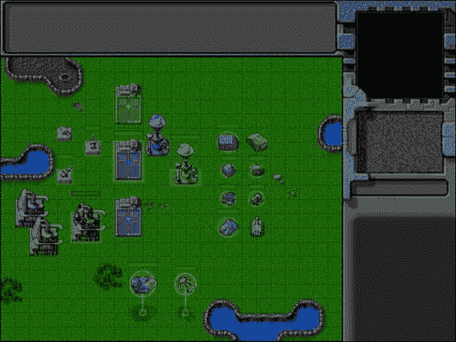

图 6-13。选中的项目高亮显示

请注意，受损建筑上方的生命栏清楚地向我们展示了它的受损程度。您可以在按住 Shift 键的同时点按项目，从而在选择中添加或减去项目。我们现在已经在游戏中完全实现了实体选择。

摘要

我们在这一章中涉及了很多内容。从上一章的空白开始，我们开发了一个通用框架，通过为这些实体实现 draw()和 animate()方法来在游戏中动画和绘制项目。

在绘制项目之前，我们进行了深度排序，这样靠近屏幕的项目会遮住较远的项目。使用这个框架，我们在游戏中添加了建筑、车辆、飞机和地形。

最后，我们实现了使用鼠标选择这些实体并突出显示这些选定实体的能力。

在下一章，我们将实现发送命令到这些实体，从最重要的一个开始:运动。我们也将着眼于使用寻路和转向算法，使单位智能导航周围的建筑物和其他障碍。

所以，我们继续吧。