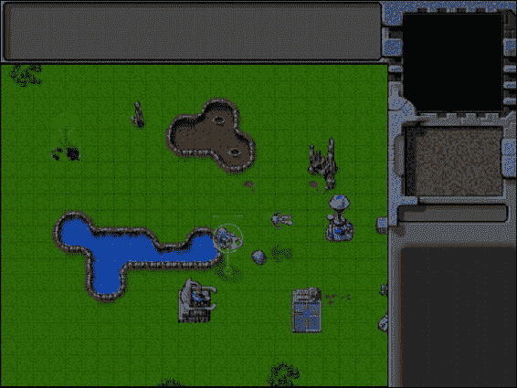
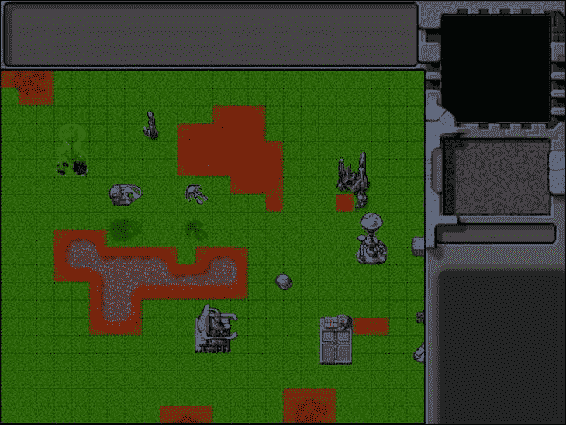
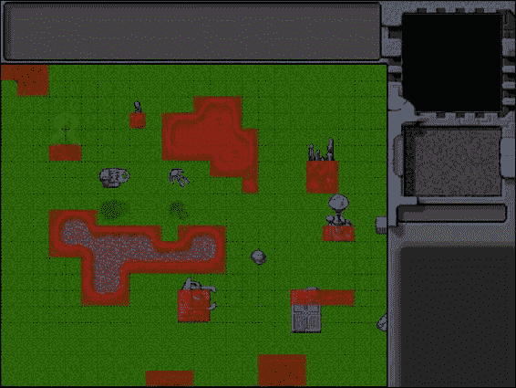
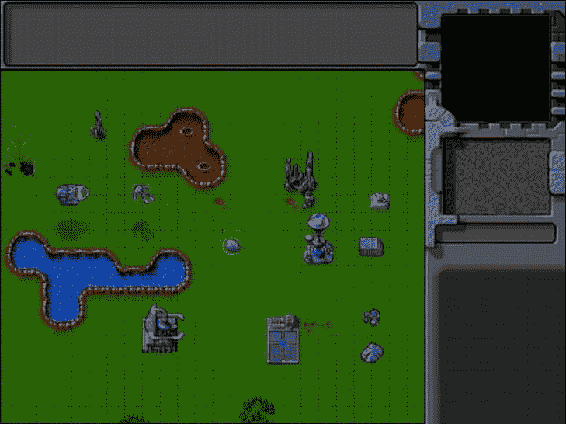
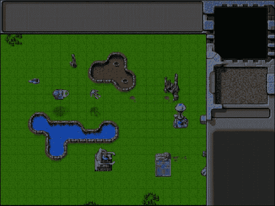

# 七、智能单元运动

在前一章中，我们建立了一个在游戏中制作动画和绘制实体的框架，然后添加了不同类型的建筑、车辆、飞机和地形。最后，我们添加了选择这些实体的功能。

在这一章中，我们将添加一个框架来给选定的单位命令，并让实体遵循命令。然后我们将实现这些命令中最基本的:通过使用寻路和转向算法的组合来智能地移动我们的单位。

现在让我们开始吧。我们将使用第六章中的代码作为起点。

指挥单位

我们将使用现在已经成为大多数现代 RTS 游戏标准的惯例来指挥单位。我们将用左键选择单位，用右键命令它们。

右键单击地图上的可导航点将命令选定的单位移动到该点。右击一个敌人单位或建筑会命令所有选中的可以攻击的单位去攻击敌人。右击一个友军单位会告诉所有选择的单位跟随它并保护它。最后，右键点击一个油田并选择一辆矿车，会告诉矿车移动到油田并在上面部署。

我们需要做的第一件事是修改 mouse.js 中鼠标对象的 click()方法来处理右击事件，如清单 7-1 所示。

***清单 7-1。*** 修改 click()处理右键命令(mouse.js)

```html
click:function(ev,rightClick){
    // Player clicked inside the canvas

    var clickedItem = this.itemUnderMouse();
    var shiftPressed = ev.shiftKey;

    if (!rightClick){ // Player left clicked
        if (clickedItem){
            // Pressing shift adds to existing selection. If shift is not pressed, clear existing selection
            if(!shiftPressed){
                game.clearSelection();
            }
            game.selectItem(clickedItem,shiftPressed);
        }
    } else { // Player right-clicked
        // Handle actions like attacking and movement of selected units
        var uids = [];
        if (clickedItem){ // Player right-clicked on something
            if (clickedItem.type != "terrain"){
                if (clickedItem.team != game.team){ // Player right-clicked on an enemy item
                    // Identify selected items from players team that can attack
                    for (var i = game.selectedItems.length - 1; i >= 0; i--){
                        var item = game.selectedItems[i];
                        if(item.team == game.team && item.canAttack){
                            uids.push(item.uid);
                        }
                    };
                    // then command them to attack the clicked item
                    if (uids.length>0){
                        game.sendCommand(uids,{type:"attack",toUid:clickedItem.uid});
                    }
                } else  { // Player right-clicked on a friendly item
                    //identify selected items from players team that can move
                    for (var i = game.selectedItems.length - 1; i >= 0; i--){
                        var item = game.selectedItems[i];
                        if(item.team == game.team && (item.type == "vehicles" || item.type == "aircraft")){
                            uids.push(item.uid);
                        }
                    };
                    // then command them to guard the clicked item
                    if (uids.length>0){
                        game.sendCommand(uids,{type:"guard", toUid:clickedItem.uid});
                    }
                }
            } else if (clickedItem.name == "oilfield"){ // Player right licked on an oilfield
                // identify the first selected harvester from players team (since only one can deploy at a time)
                for (var i = game.selectedItems.length - 1; i >= 0; i--){
                    var item = game.selectedItems[i];
                    if(item.team == game.team && (item.type == "vehicles" && item.name == "harvester")){
                        uids.push(item.uid);
                        break;
                    }
                };
                // then command it to deploy on the oilfield
                if (uids.length>0){
                    game.sendCommand(uids,{type:"deploy",toUid:clickedItem.uid});
                }
            }
        } else { // Player clicked on the ground
            //identify selected items from players team that can move
            for (var i = game.selectedItems.length - 1; i >= 0; i--){
                var item = game.selectedItems[i];
                if(item.team == game.team && (item.type == "vehicles" || item.type == "aircraft")){
                    uids.push(item.uid);
                }
            };
            // then command them to move to the clicked location
            if (uids.length>0){
                game.sendCommand(uids, {type:"move", to:{x:mouse.gameX/game.gridSize, y:mouse.gameY/game.gridSize}});
            }
        }
    }
},
```

当玩家在游戏地图内右击时，我们首先检查鼠标是否在一个物体上。

如果玩家没有点击某个对象，我们调用 game.sendCommand()方法向所有被选中的友军车辆和飞机发送移动命令。

如果玩家点击了一个物体，我们同样会向相应的单位发送攻击、守卫或部署命令。我们还在订单中将被点击项目的 UID 作为一个名为 toUid 的参数进行传递。

有了右键逻辑，我们现在必须实现发送和接收游戏命令的方法。

发送和接收命令

我们可以通过在前面修改的 click()方法中修改所选项目的 orders 属性来实现发送命令。然而，我们将使用一个稍微复杂一些的实现。

任何生成命令的点击动作都会调用 game.sendCommand()方法。sendCommand()方法会将调用传递给单人游戏或多人游戏对象。然后，这些对象会将命令细节发送回 game.processCommand()方法。在 game.processCommand()方法中，我们将更新所有适当对象的顺序。我们首先将这些方法添加到 game.js 中的游戏对象，如清单 7-2 所示。

***清单 7-2。*** 实现 sendCommand()和 processCommand() (game.js)

```html
// Send command to either singleplayer or multiplayer object
sendCommand:function(uids,details){
    if (game.type=="singleplayer"){
         singleplayer.sendCommand(uids,details);
    } else {
        multiplayer.sendCommand(uids,details);
    }
},
getItemByUid:function(uid){
    for (var i = game.items.length - 1; i >= 0; i--){
        if(game.items[i].uid == uid){
            return game.items[i];
        }
    };
},
// Receive command from singleplayer or multiplayer object and send it to units
processCommand:function(uids,details){
    // In case the target "to" object is in terms of uid, fetch the target object
    var toObject;
    if (details.toUid){
        toObject = game.getItemByUid(details.toUid);
        if(!toObject || toObject.lifeCode=="dead"){
            // To object no longer exists. Invalid command
            return;
        }
    }

    for (var i in uids){
        var uid = uids[i];
        var item = game.getItemByUid(uid);
        //if uid is a valid item, set the order for the item
        if(item){
            item.orders = $.extend([],details);
            if(toObject) {
                item.orders.to = toObject;
            }
        }
    };
},
```

sendCommand()方法根据游戏类型将调用传递给单人游戏或多人游戏对象的 sendCommand()方法。使用这一抽象层允许我们对单人游戏和多人游戏使用相同的代码，同时以不同的方式处理命令。

虽然单机版的 sendCommand()只会立即回调 processCommand()，但多人版会将命令发送到服务器，然后服务器会同时将命令转发给所有玩家。

我们还实现了 getItemByUid()方法，该方法查找条目 Uid 并返回实体对象。

由于游戏的多人版本，我们将 uid 而不是实际的游戏对象传递给 sendCommand()方法。一个典型的 item 对象包含许多动画和绘制对象的细节，如方法、sprite 表图像和所有的 item 属性。虽然需要绘制项目，但是将这些额外的数据传输到服务器并取回是浪费带宽，而且是完全不必要的，特别是因为整个对象可以用一个整数(UID)来代替。

processCommand()方法首先查找任何 toUid 属性并获取结果项。如果不存在具有该 UID 的项目，它会认为该命令无效并忽略该命令。然后，该方法查找 uids 数组中传递的商品，并将它们的 orders 对象设置为参数中提供的订单详细信息的副本。

接下来我们要做的是在 singleplayer.js 中实现 singlePlayer 对象的 sendCommand()方法，如清单 7-3 所示。

***清单 7-3。*** 实现单人 sendCommand()方法(singleplayer.js)

```html
sendCommand:function(uids,details){
    game.processCommand(uids,details);
}
```

如您所见，sendCommand()的实现相当简单。我们只是将呼叫转发给 game.processCommand()。然而，如果我们愿意，我们也可以使用这个方法来添加保存游戏命令的功能，以及关于当前运行的动画周期的细节，以实现重放保存的游戏的能力。

现在我们已经建立了一个指挥单位和设置他们的命令的机制，我们需要建立一个单位处理和执行这些命令的方法。

处理订单

我们处理订单的实现将相当简单。我们将为每个需要它的实体实现一个名为 processOrders()的方法，并从游戏动画循环内部为所有游戏项目调用 processOrders()方法。

我们将从修改 game.js 内游戏对象的 animationLoop()方法开始，如清单 7-4 所示。

***清单 7-4。*** 从动画循环(game.js)内部调用 processOrders()

```html
animationLoop:function(){
    // Process orders for any item that handles it
    for (var i = game.items.length - 1; i >= 0; i--){
        if(game.items[i].processOrders){
            game.items[i].processOrders();
        }
    };

    // Animate each of the elements within the game
    for (var i = game.items.length - 1; i >= 0; i--){
        game.items[i].animate();
    };

    // Sort game items into a sortedItems array based on their x,y coordinates
    game.sortedItems = $.extend([],game.items);
    game.sortedItems.sort(function(a,b){
     return b.y-a.y + ((b.y==a.y)?(a.x-b.x):0);
    });
},
```

该代码遍历每个游戏项目，并调用该项目的 processOrders()方法(如果存在)。现在，我们可以为游戏实体逐个实现 processOrders()方法，并观察这些实体开始服从我们的命令。

让我们从实现飞机的运动开始。

实现飞机运动

与陆地交通工具不同，移动飞机相当简单，因为飞机不受地形、建筑物或其他交通工具的影响。当一架飞机接到移动命令时，它只会转向目的地，然后直线前进。一旦飞机接近目的地，它将回到漂浮状态。

我们将把它实现为 aircraft.js 中飞机的默认 processOrders()方法，如清单 7-5 中的所示。

***清单 7-5。*** 运动中飞机对象的默认 processOrders()方法(aircraft.js)

```html
processOrders:function(){
    this.lastMovementX = 0;
    this.lastMovementY = 0;
    switch (this.orders.type){
        case "move":
            // Move towards destination until distance from destination is less than aircraft radius
            var distanceFromDestinationSquared = (Math.pow(this.orders.to.x-this.x,2) + Math.pow(this.orders.to.y-this.y,2));
            if (distanceFromDestinationSquared < Math.pow(this.radius/game.gridSize,2)) {
                this.orders = {type:"float"};
            } else {
                this.moveTo(this.orders.to);
            }
            break;
    }
},
```

我们首先重置两个与运动相关的变量，我们稍后会用到它们。然后，我们检查 case 语句中的订单类型。

如果订单类型是 move，我们调用 moveTo()方法，直到飞机到目的地的距离(存储在 To 参数中)小于飞机的半径。一旦飞机到达目的地，我们就把顺序改回浮动。

目前，我们只执行了一个订单。每当飞机收到一个它不知道如何处理的命令时，它将继续在当前位置浮动。随着时间的推移，我们将执行更多的订单。

我们要做的下一件事是实现一个默认的 moveTo()方法，这两个飞行器都将使用它(见清单 7-6 )。

***清单 7-6。*** 飞机对象的默认 moveTo()方法(aircraft.js)

```html
moveTo:function(destination){
    // Find out where we need to turn to get to destination
    var newDirection = findAngle(destination,this,this.directions);
    // Calculate difference between new direction and current direction
    var difference = angleDiff(this.direction,newDirection,this.directions);
    // Calculate amount that aircraft can turn per animation cycle
    var turnAmount = this.turnSpeed*game.turnSpeedAdjustmentFactor;
    if (Math.abs(difference)>turnAmount){
        this.direction = wrapDirection(this.direction+turnAmount*Math.abs(difference)/difference,this.directions);
    } else {
        // Calculate distance that aircraft can move per animation cycle
        var movement = this.speed*game.speedAdjustmentFactor;
        // Calculate x and y components of the movement
        var angleRadians = -(Math.round(this.direction)/this.directions)*2*Math.PI ;
        this.lastMovementX = - (movement*Math.sin(angleRadians));
        this.lastMovementY = - (movement*Math.cos(angleRadians));
        this.x = (this.x +this.lastMovementX);
        this.y = (this.y +this.lastMovementY);
    }
},
```

我们首先使用 findAngle()方法计算从飞机到目的地的角度，并使用 angleDiff()方法计算当前方向和新方向之间的差异。newDirection 变量的值在 0 到 7 之间(以反映飞机可以采取的方向)，而 difference 变量的值在-4 到 4 之间，负号表示逆时针转弯比顺时针转弯短。

然后，我们根据飞机的转弯速度属性计算飞机可以转弯的量，并通过比较角度差和转弯量来查看该项目是否需要更多的转弯。

如果飞机仍然需要转弯，我们将 turnAmount 值加到它的方向上，同时保持差值变量的符号。我们使用 wrapDirection()方法来确保最终的飞机方向仍然在 0 到 7 之间。

如果飞机已经转向目的地，我们根据它的速度计算移动距离。然后，我们计算运动的 x 和 y 分量，并将其添加到飞机的 x 和 y 坐标中。

当然，既然飞机方向可以采用非整数值，我们需要修改飞机对象的默认 animate()方法，以确保它在选择精灵之前舍入方向(见清单 7-7 )。

***清单 7-7。*** 修改 animate()处理非整数方向值(aircraft.js)

```html
animate:function(){
    // Consider an item healthy if it has more than 40% life
    if (this.life>this.hitPoints*0.4){
        this.lifeCode = "healthy";
    } else if (this.life <= 0){
        this.lifeCode = "dead";
        game.remove(this);
        return;
    } else {
        this.lifeCode = "damaged";
    }
    switch (this.action){
        case "fly":
            var direction = wrapDirection(Math.round(this.direction),this.directions);
            this.imageList = this.spriteArray["fly-"+ direction];
            this.imageOffset = this.imageList.offset + this.animationIndex;
            this.animationIndex++;
            if (this.animationIndex>=this.imageList.count){
                this.animationIndex = 0;
            }
            break;
    }
},
```

我们首先舍入飞机方向，然后调用 wrapDirection()来确保方向位于 0 和 7 之间。方法的其余部分保持不变。

接下来，我们将把 findAngle()、angleDiff()和 wrapDirection()方法添加到 common.js 中，如清单 7-8 所示。

***清单 7-8。*** 实现 findAngle()、angleDiff()和 wrapDirection() (common.js)

```html
/* Common functions for turning and movement */

// Finds the angle between two objects in terms of a direction (where 0 <= angle < directions)
function findAngle(object,unit,directions){
     var dy = (object.y) - (unit.y);
     var dx = (object.x) - (unit.x);
    //Convert Arctan to value between (0 - directions)
    var angle = wrapDirection(directions/2-(Math.atan2(dx,dy)*directions/(2*Math.PI)),directions);
    return angle;
 }

// returns the smallest difference (value ranging between -directions/2 to +directions/2) between two angles (where 0 <= angle < directions)
function angleDiff(angle1,angle2,directions){
    if (angle1>=directions/2){
        angle1 = angle1-directions;
    }
    if (angle2>=directions/2){
        angle2 = angle2-directions;
    }

    diff = angle2-angle1;

    if (diff<-directions/2){
        diff += directions;
    }
    if (diff>directions/2){
        diff -= directions;
    }

    return diff;
}

// Wrap value of direction so that it lies between 0 and directions-1
function wrapDirection(direction,directions){
    if (direction<0){
        direction += directions;
    }
    if (direction >= directions){
        direction -= directions;
    }
    return direction;
}
```

我们需要做的最后一个改变是在 game.js 的游戏对象中定义两个与运动相关的属性(参见清单 7-9 )。

***清单 7-9。*** 给游戏对象添加动作相关属性(game.js)

```html
//Movement related properties
speedAdjustmentFactor:1/64,
turnSpeedAdjustmentFactor:1/8,
```

这两个因素用于将实体的速度和转弯速度值转换为游戏中的移动和转弯单位。

我们现在准备开始在游戏中移动我们的飞行器，但是在此之前，让我们通过从地图上移除所有不必要的物品来简化我们的关卡。新的 maps.js 将看起来像清单 7-10 中的。

***清单 7-10。*** 从地图中删除不必要的项目(maps.js)

```html
var maps = {
    "singleplayer":[
        {
            "name":"Entities",
            "briefing": "In this level you will start commanding units and moving them around the map.",

            /* Map Details */
            "mapImage":"img/level-one-debug-grid.png",
            "startX":2,
            "startY":3,

            /* Entities to be loaded */
            "requirements":{
                "buildings":["base","starport","harvester","ground-turret"],
                "vehicles":["transport","harvester","scout-tank","heavy-tank"],
                "aircraft":["chopper","wraith"],
                "terrain":["oilfield","bigrocks","smallrocks"]
            },

            /* Entities to be added */
            "items":[
                {"type":"buildings","name":"base","x":11,"y":14,"team":"blue"},
                {"type":"buildings","name":"starport","x":18,"y":14, "team":"blue"},
                {"type":"buildings","name":"harvester","x":20,"y":10, "team":"blue"},
                {"type":"buildings","name":"ground-turret","x":24,"y":7, "team":"blue","direction":3},

                {"type":"vehicles","name":"transport","x":24,"y":10, "team":"blue","direction":2},
                {"type":"vehicles","name":"harvester","x":16,"y":12, "team":"blue","direction":3},
                {"type":"vehicles","name":"scout-tank","x":24,"y":14, "team":"blue","direction":4},
                {"type":"vehicles","name":"heavy-tank","x":24,"y":16, "team":"blue","direction":5},

                {"type":"aircraft","name":"chopper","x":7,"y":9, "team":"blue","direction":2},
                {"type":"aircraft","name":"wraith","x":11,"y":9, "team":"blue","direction":3},

                {"type":"terrain","name":"oilfield","x":3,"y":5, "action":"hint"},
                {"type":"terrain","name":"bigrocks","x":19,"y":6},
                {"type":"terrain","name":"smallrocks","x":8,"y":3}
            ]
        }
    ]
}
```

当你在浏览器中运行游戏时，你应该能够选择两架飞机并在新地图上移动它们，如图 7-1 所示。



图 7-1。在新地图周围移动飞机

当你选择一架飞机，在地图上某处右击，飞机应该会转向，向目的地移动。你会注意到幽灵的飞机比直升机移动得更快，因为我们在幽灵实体的属性中指定了一个更高的速度值。

你可能也会注意到右键点击一个建筑或者一个友军单位并没有任何作用。这是因为右击一个友方物品会生成守卫命令，我们还没有实现这个命令。

为我们的飞机实现运动相当简单，因为我们创造性地假设飞机可以通过调整高度来避开建筑物、车辆和其他飞机。

然而，当涉及到车辆时，我们不能再这样做了。当我们在建筑物和地形等障碍物周围行驶时，我们需要担心找到车辆和目的地之间的最短路径。这就是寻路的用武之地。

寻路

*寻路*，或称寻路，是寻找两点间最短路径的过程。典型地，它包括使用各种算法来遍历节点图，从一个顶点开始并探索相邻的节点，直到到达目的节点。

基于图的寻路最常用的两种算法是 Dijkstra 算法及其变体 A*(读作“A star”)算法。

A*使用额外的距离启发式算法，帮助它比 Dijkstra 更快地找到路径。由于其性能和准确性，被广泛应用于游戏中。你可以在[`en.wikipedia.org/wiki/A`](http://en.wikipedia.org/wiki/A)*了解更多算法。我们也将在游戏中使用*来表示车辆路径。

我们将使用 Andrea Giammarchi 的 A*的一个优秀的 MIT 授权的 JavaScript 实现。代码已经针对 JavaScript 进行了优化，即使在大型图形上，它的性能也相当不错。在[`devpro.it/javascript_id_137.html`](http://devpro.it/javascript_id_137.html)，你可以看到最新的代码，也可以玩现场演示。我们将在 index.html 的 head 部分添加一个对 A*实现(存储在 astar.js 中)的引用，如清单 7-11 所示。

***清单 7-11。*** 添加引用 A*实现(index.html)

```html
<!-- A* Implementation by Andrea Giammarchi -->
<script src="js/astar.js" type="text/javascript" charset="utf-8"></script>
```

虽然实现相当复杂，但相对容易使用。代码让我们可以访问 Astar()方法，该方法接受四个参数:我们要使用的地图、起始坐标、结束坐标，以及可选的要使用的启发式名称。

该方法返回一个包含最短路径所有中间步骤的数组，或者在没有可能路径的情况下返回一个空数组。

现在我们已经有了 A*算法，我们需要为它提供一个用于寻路的图或网格。

定义我们的寻路网格

我们已经把地图分成了 20 像素乘 20 像素的方格。我们将把寻路网格存储为一个二维数组，对于可通行和不可通行的正方形，其值分别为 0 和 1。

在我们创建这个数组之前，我们需要修改我们的地图来定义地图上所有不可通行的区域。我们将通过在 maps.js 中的第一层添加一些新的属性来做到这一点，如清单 7-12 中的所示。

***清单 7-12。*** 为关卡添加寻路属性(maps.js)

```html
/* Map coordinates that are obstructed by terrain*/
"mapGridWidth":60,
"mapGridHeight":40,
"mapObstructedTerrain":[
    [49,8], [50,8], [51,8], [51,9], [52,9], [53,9], [53,10], [53,11], [53,12], [53,13], [53,14],
[53,15], [53,16], [52,16], [52,17], [52,18], [52,19], [51,19], [50,19], [50,18], [50,17], [49,17],
[49,18], [48,18], [47,18], [47,17], [47,16], [48,16], [49,16], [49,15], [49,14], [48,14], [48,13],
[48,12], [49,12], [49,11], [50,11], [50,10], [49,10], [49,9], [44,0], [45,0], [45,1], [45,2],
[46,2], [47,2], [47,3], [48,3], [48,4], [48,5], [49,5], [49,6], [49,7], [50,7], [51,7], [51,6],
[51,5], [51,4], [52,4], [53,4], [53,3], [54,3], [55,3], [55,2], [56,2], [56,1], [56,0], [55,0],
[43,19], [44,19], [45,19], [46,19], [47,19], [48,19], [48,20], [48,21], [47,21], [46,21], [45,21],
[44,21], [43,21], [43,20], [41,22], [42,22], [43,22], [44,22], [45,22], [46,22], [47,22], [48,22],
[49,22], [50,22], [50,23], [50,24], [49,24], [48,24], [47,24], [47,25], [47,26], [47,27], [47,28],
[47,29], [47,30], [46,30], [45,30], [44,30], [43,30], [43,29], [43,28], [43,27], [43,26], [43,25],
[43,24], [42,24], [41,24], [41,23], [48,39], [49,39], [50,39], [51,39], [52,39], [53,39], [54,39],
[55,39], [56,39], [57,39], [58,39], [59,39], [59,38], [59,37], [59,36], [59,35], [59,34], [59,33],
[59,32], [59,31], [59,30], [59,29], [0,0], [1,0], [2,0], [1,1], [2,1], [10,3], [11,3], [12,3],
[12,2], [13,2], [14,2], [14,3], [14,4], [15,4], [15,5], [15,6], [14,6], [13,6], [13,5], [12,5],
[11,5], [10,5], [10,4], [3,9], [4,9], [5,9], [5,10], [6,10], [7,10], [8,10], [9,10], [9,11],
[10,11], [11,11], [11,10], [12,10], [13,10], [13,11], [13,12], [12,12], [11,12], [10,12], [9,12],
[8,12], [7,12], [7,13], [7,14], [6,14], [5,14], [5,13], [5,12], [5,11], [4,11], [3,11], [3,10],
[33,33], [34,33], [35,33], [35,34], [35,35], [34,35], [33,35], [33,34], [27,39], [27,38], [27,37],
[28,37], [28,36], [28,35], [28,34], [28,33], [28,32], [28,31], [28,30], [28,29], [29,29], [29,28],
[29,27], [29,26], [29,25], [29,24], [29,23], [30,23], [31,23], [32,23], [32,22], [32,21], [31,21],
[30,21], [30,22], [29,22], [28,22], [27,22], [26,22], [26,21], [25,21], [24,21], [24,22], [24,23],
[25,23], [26,23], [26,24], [25,24], [25,25], [24,25], [24,26], [24,27], [25,27], [25,28], [25,29],
[24,29], [23,29], [23,30], [23,31], [24,31], [25,31], [25,32], [25,33], [24,33], [23,33], [23,34],
[23,35], [24,35], [24,36], [24,37], [23,37], [22,37], [22,38], [22,39], [23,39], [24,39], [25,39],
[26,0], [26,1], [25,1], [25,2], [25,3], [26,3], [27,3], [27,2], [28,2], [29,2], [29,3], [30,3],
[31,3], [31,2], [31,1], [32,1], [32,0], [33,0], [32,8], [33,8], [34,8], [34,9], [34,10], [33,10],
[32,10], [32,9], [8,29], [9,29], [9,30], [17,32], [18,32], [19,32], [19,33], [18,33], [17,33]
, [18,34], [19,34], [3,27], [4,27], [4,26], [3,26], [2,26], [3,25], [4,25], [9,20], [10,20], [11,20],
[11,21], [10,21], [10,19], [19,7], [15,7], [29,12], [30,13], [20,14], [21,14], [34,13], [35,13],
[36,13], [36,14], [35,14], [34,14], [35,15], [36,15], [16,18], [17,18], [18,18], [16,19], [17,19],
[18,19], [17,20], [18,20], [11,19], [58,0], [59,0], [58,1], [59,1], [59,2], [58,3], [59,3], [58,4],
[59,4], [59,5], [58,6], [59,6], [58,7], [59,7], [59,8], [58,9], [59,9], [58,10], [59,10], [59,11],
[52,6], [53,6], [54,6], [52,7], [53,7], [54,7], [53,8], [54,8], [44,17], [46,32], [55,32], [54,28],
[26,34], [34,34], [4,10], [6,11], [6,12], [6,13], [7,11], [8,11], [12,11], [27,0], [27,1], [26,2],
[28,1], [28,0], [29,0], [29,1], [30,2], [30,1], [30,0], [31,0], [33,9], [46,0], [47,0], [48,0],
[49,0], [50,0], [51,0], [52,0], [53,0], [54,0], [55,1], [54,1], [53,1], [52,1], [51,1], [50,1],
[49,1], [48,1], [47,1], [46,1], [48,2], [49,2], [50,2], [51,2], [52,2], [53,2], [54,2], [52,3],
[51,3], [50,3], [49,3], [49,4], [50,4], [50,5], [50,6], [50,9], [51,10], [52,10], [51,11], [52,11],
[50,12], [51,12], [52,12], [49,13], [50,13], [51,13], [52,13], [50,14], [51,14], [52,14], [50,15],
[51,15], [52,15], [50,16], [51,16], [51,17], [48,17], [51,18], [44,20], [45,20], [46,20], [47,20],
[42,23], [43,23], [44,23], [45,23], [46,23], [47,23], [48,23], [49,23], [44,24], [45,24], [46,24],
[44,25], [45,25], [46,25], [44,26], [45,26], [46,26], [44,27], [45,27], [46,27], [44,28], [45,28],
[46,28], [44,29], [45,29], [46,29], [11,4], [12,4], [13,4], [13,3], [14,5], [25,22], [31,22],
[27,23], [28,23], [27,24], [28,24], [26,25], [27,25], [28,25], [25,26], [26,26], [27,26], [28,26],
[26,27], [27,27], [28,27], [26,28], [27,28], [28,28], [26,29], [27,29], [24,30], [25,30], [26,30],
[27,30], [26,31], [27,31], [26,32], [27,32], [26,33], [27,33], [24,34], [25,34], [27,34], [25,35],
[26,35], [27,35], [25,36], [26,36], [27,36], [25,37], [26,37], [23,38], [24,38], [25,38], [26,38],
[26,39], [2,25], [9,19], [36,31]
],
```

我们首先定义了两个名为 mapGridWidth 和 mapGridHeight 的属性，最后定义了一个非常大而且看起来很吓人的数组，名为 mapObstructedTerrain。这个数组仅仅包含了地图中每个不可通过的网格的 x 和 y 坐标。这包括有树、山、水、火山口和熔岩的地区。

 **注**如果你打算给你的游戏增加很多关卡，你应该花时间设计一个关卡编辑器，自动为你生成这个数组，而不是试图手工创建。

现在我们已经有了这些属性，我们需要在加载关卡时从这些数据中生成一个地形网格。我们将在 singleplayer.js 中的 singleplayer 对象的 startCurrentLevel()方法中完成这项工作(参见清单 7-13 )。

***清单 7-13。*** 开始关卡时创建地形网格(singleplayer.js)

```html
startCurrentLevel:function(){
    // Load all the items for the level
    var level = maps.singleplayer[singleplayer.currentLevel];

    // Don't allow player to enter mission until all assets for the level are loaded
    $("#entermission").attr("disabled", true);

    // Load all the assets for the level
    game.currentMapImage = loader.loadImage(level.mapImage);
    game.currentLevel = level;

    game.offsetX = level.startX * game.gridSize;
    game.offsetY = level.startY * game.gridSize;

    // Load level Requirements
    game.resetArrays();
    for (var type in level.requirements){
        var requirementArray = level.requirements[type];
        for (var i=0; i < requirementArray.length; i++) {
            var name = requirementArray[i];
            if (window[type]){
                window[type].load(name);
            } else {
                console.log('Could not load type :',type);
            }
        };
    }

    for (var i = level.items.length - 1; i >= 0; i--){
        var itemDetails = level.items[i];
        game.add(itemDetails);
    };

    // Create a grid that stores all obstructed tiles as 1 and unobstructed as 0
    game.currentMapTerrainGrid = [];
    for (var y=0; y < level.mapGridHeight; y++) {
        game.currentMapTerrainGrid[y] = [];
        for (var x=0; x< level.mapGridWidth; x++) {
           game.currentMapTerrainGrid[y][x] = 0;
        }
    };
    for (var i = level.mapObstructedTerrain.length - 1; i >= 0; i--){
        var obstruction = level.mapObstructedTerrain[i];
        game.currentMapTerrainGrid[obstruction[1]][obstruction[0]] = 1;
    };
    game.currentMapPassableGrid = undefined;

    // Enable the enter mission button once all assets are loaded
    if (loader.loaded){
        $("#entermission").removeAttr("disabled");
    } else {
        loader.onload = function(){
            $("#entermission").removeAttr("disabled");
        }
    }

    // Load the mission screen with the current briefing
    $('#missonbriefing').html(level.briefing.replace(/\n/g,'<br><br>'));
    $("#missionscreen").show();
},
```

我们在游戏对象中初始化一个名为 currentMapTerrainGrid 的数组，并使用 mapGridWidth 和 mapGridHeight 将它设置为地图的尺寸。然后，我们将所有被遮挡的方块设为 1，将未被遮挡的方块设为 0。

如果我们在地图上突出显示当前主栅格中被遮挡的方块，它看起来会像图 7-2 。



图 7-2。当前主栅格中定义的障碍栅格方块

虽然 currentMapTerrainGrid 在地图地形中标出了所有的障碍物，但它仍然不包括地图上的建筑物和地形实体。

我们将在游戏对象中保留另一个名为 currentMapPassableGrid 的数组，该数组将结合建筑和地形实体以及我们之前定义的 currentMapTerrainGrid 数组。每次在游戏中添加或删除建筑或地形时，都需要重新创建这个数组。我们将在游戏对象中的 rebuildPassableGrid()方法中实现这一点(参见清单 7-14 )。

***清单 7-14。*** 游戏对象(game.js)中的 rebuildPassableGrid()方法

```html
rebuildPassableGrid:function(){
    game.currentMapPassableGrid = $.extend(true,[],game.currentMapTerrainGrid);
    for (var i = game.items.length - 1; i >= 0; i--){
        var item = game.items[i];
        if(item.type == "buildings" || item.type == "terrain"){
            for (var y = item.passableGrid.length - 1; y >= 0; y--){
                for (var x = item.passableGrid[y].length - 1; x >= 0; x--){
                    if(item.passableGrid[y][x]){
                        game.currentMapPassableGrid[item.y+y][item.x+x] = 1;
                    }
                };
            };
        }
    };
},
```

我们首先将 currentMapTerrainGrid 数组复制到 currentMapPassableGrid 中。然后，我们遍历所有游戏项目，并使用我们为所有建筑物和地形定义的 passableGrid 属性来标记出不可通过的网格方块。如果我们基于 currentMapPassableGrid 在地图上高亮显示被遮挡的方块，它看起来会像图 7-3 。



图 7-3。在 currentMapPassableGrid 中定义的障碍网格方块

由于我们为每个建筑定义 passableGrid 的方式，允许部分建筑是可通行的是可能的(例如，星门的下部)。

我们需要确保在游戏中添加或移除建筑时，game.currentMapPassableGrid 会被重置。我们通过在游戏对象的 add()和 remove()方法中添加一个额外的条件来做到这一点，如清单 7-15 所示。

***清单 7-15。*** 清除 currentMapPassableGrid 里面的 add()和 remove() (game.js)

```html
add:function(itemDetails) {
    // Set a unique id for the item
    if (!itemDetails.uid){
        itemDetails.uid = game.counter++;
    }

    var item = window[itemDetails.type].add(itemDetails);

    // Add the item to the items array
    game.items.push(item);
    // Add the item to the type specific array
    game[item.type].push(item);

    if(item.type == "buildings" || item.type == "terrain"){
        game.currentMapPassableGrid = undefined;
    }
    return item;
},
remove:function(item){
    // Unselect item if it is selected
    item.selected = false;
    for (var i = game.selectedItems.length - 1; i >= 0; i--){
           if(game.selectedItems[i].uid == item.uid){
               game.selectedItems.splice(i,1);
               break;
           }
       };

    // Remove item from the items array
    for (var i = game.items.length - 1; i >= 0; i--){
        if(game.items[i].uid == item.uid){
            game.items.splice(i,1);
            break;
        }
    };

    // Remove items from the type specific array
    for (var i = game[item.type].length - 1; i >= 0; i--){
        if(game[item.type][i].uid == item.uid){
           game[item.type].splice(i,1);
           break;
        }
    };

    if(item.type == "buildings" || item.type == "terrain"){
        game.currentMapPassableGrid = undefined;
    }
},
```

在这两种方法中，我们检查被添加或删除的项目是建筑物类型还是地形类型，如果是，重置 currentMapPassableGrid 变量。

现在我们已经为 A*算法定义了运动网格，我们准备好实现车辆运动。

实现车辆移动

我们将从在 vehicles.js 中为 vehicles 对象添加一个默认的 processOrders()方法开始，如清单 7-16 中的所示。

***清单 7-16。*** 默认为车辆的 processOrders()方法(vehicles.js)

```html
processOrders:function(){
    this.lastMovementX = 0;
    this.lastMovementY = 0;
    switch (this.orders.type){
        case "move":
            // Move towards destination until distance from destination is less than vehicle radius
            var distanceFromDestinationSquared = (Math.pow(this.orders.to.x-this.x,2) + Math.pow(this.orders.to.y-this.y,2));
            if (distanceFromDestinationSquared < Math.pow(this.radius/game.gridSize,2)) {
                this.orders = {type:"stand"};
                return;
            } else {
                // Try to move to the destination
                var moving = this.moveTo(this.orders.to);
                if(!moving){
                    // Pathfinding couldn't find a path so stop
                    this.orders = {type:"stand"};
                    return;
                }
            }
            break;
    }
},
```

该方法非常类似于我们为飞机定义的 processOrders()方法。一个微妙的区别是，我们检查 moveTo()方法是否返回 true 值，表明它能够向目的地移动，并在它不能移动时重置订单。我们这样做是因为寻路算法可能找不到有效的路径，moveTo()将返回一个指示这一点的值。

接下来，我们将为车辆实现默认的 moveTo()方法，如清单 7-17 所示。

***清单 7-17。*** 默认为车辆的 moveTo()方法(vehicles.js)

```html
moveTo:function(destination){
    if(!game.currentMapPassableGrid){
        game.rebuildPassableGrid();
    }

    // First find path to destination
    var start = [Math.floor(this.x),Math.floor(this.y)];
    var end = [Math.floor(destination.x),Math.floor(destination.y)];

    var grid = $.extend(true,[],game.currentMapPassableGrid);
    // Allow destination to be "movable" so that algorithm can find a path
    if(destination.type == "buildings"||destination.type == "terrain"){
        grid[Math.floor(destination.y)][Math.floor(destination.x)] = 0;
    }

    var newDirection;
    // if vehicle is outside map bounds, just go straight towards goal
    if (start[1]<0 || start[1]>=game.currentLevel.mapGridHeight || start[0]<0 || start[0]>= game.currentLevel.mapGridWidth){
        this.orders.path = [this,destination];
        newDirection = findAngle(destination,this,this.directions);
    } else {
        //Use A* algorithm to try and find a path to the destination
        this.orders.path = AStar(grid,start,end,'Euclidean');
        if (this.orders.path.length>1){
            var nextStep = {x:this.orders.path[1].x+0.5,y:this.orders.path[1].y+0.5};
            newDirection = findAngle(nextStep,this,this.directions);
        } else if(start[0]==end[0] && start[1] == end[1]){
            // Reached destination grid;
            this.orders.path = [this,destination];
            newDirection = findAngle(destination,this,this.directions);
        } else {
            // There is no path
            return false;
        }
    }

    // Calculate turn amount for new direction
    var difference = angleDiff(this.direction,newDirection,this.directions);
    var turnAmount = this.turnSpeed*game.turnSpeedAdjustmentFactor;

    // Move forward, but keep turning as needed
    var movement = this.speed*game.speedAdjustmentFactor;
    var angleRadians = -(Math.round(this.direction)/this.directions)*2*Math.PI;
    this.lastMovementX = - (movement*Math.sin(angleRadians));
    this.lastMovementY = - (movement*Math.cos(angleRadians));
    this.x = (this.x +this.lastMovementX);
    this.y = (this.y +this.lastMovementY);

    if (Math.abs(difference)>turnAmount){
        this.direction = wrapDirection(this.direction + turnAmount*Math.abs(difference)/difference, this.directions);
    }

    return true;
},
```

我们首先检查 game.currentMapPassableGrid 是否已定义，如果未定义，则调用 game.rebuildPassableGrid()。然后，我们通过截断车辆和目的地位置来定义路径的开始和结束值。

接下来，我们将 game.currentMapPassableGrid 复制到一个网格变量中，并将目的地网格正方形定义为可通行，以防目的地是建筑物或地形。这种黑客让 A*算法找到一条通往建筑物的路径，即使目的地无法通行。

下一步是计算路径和新方向。我们首先检查车辆是否在地图边界之外，如果是，通过使用车辆和目的地定义路径的开始和结束位置，并使用 findAngle()方法计算 newDirection，直接驶向目的地。我们这样做是因为如果我们传递给 AStar()方法的起始坐标在网格之外，它就会失败。

如果车辆在地图范围内，我们调用 AStar()方法，同时向它传递 start、end 和 grid 值。我们指定了欧几里得的启发式方法，它允许对角线移动，似乎对我们的游戏很有效。

如果 AStar()方法返回一条至少有两个元素的路径，我们通过找到从车辆到下一个网格中间的角度来计算 newDirection。

如果路径不包含至少两个元素，我们检查这是否是因为我们已经到达目的地网格方块，如果是，则朝着最终目的地前进。如果不是，我们假设这是因为 AStar()找不到路径并返回 false。

最后，我们使用 newDirection 和 turnSpeed 和 Speed 值来向前移动车辆并使其转向 newDirection。与我们的飞机不同，车辆不应该原地转向，我们通过使运动和转向同时发生来实现这一点。

实现了寻路方法的核心之后，我们需要对车辆对象进行最后一次修改。我们将修改默认的 animate()方法来考虑方向的非整数值，如清单 7-18 所示。

***清单 7-18。*** 修改 animate()处理非整数方向值(vehicles.js)

```html
animate:function(){
    // Consider an item healthy if it has more than 40% life
    if (this.life>this.hitPoints*0.4){
        this.lifeCode = "healthy";
    } else if (this.life <= 0){
        this.lifeCode = "dead";
        game.remove(this);
        return;
    } else {
        this.lifeCode = "damaged";
    }

    switch (this.action){
        case "stand":
            var direction = wrapDirection(Math.round(this.direction),this.directions);
            this.imageList = this.spriteArray["stand-"+direction];
            this.imageOffset = this.imageList.offset + this.animationIndex;
            this.animationIndex++;

            if (this.animationIndex>=this.imageList.count){
                this.animationIndex = 0;
            }
            break;
    }
},
```

如果你现在运行这个游戏，你应该能够通过右击地图上的一个点来选择车辆并在地图上移动它们。车辆将沿着避开所有地形和建筑障碍物的路径行驶。图 7-4 显示了寻路算法返回的典型路径。



图 7-4。使用寻路算法的典型运动路径

你会注意到的一件事是，当车辆避开无法通行的地形时，它们仍然会驶过其他车辆。

解决这个问题的一个简单方法是将所有被车辆占据的方格标记为不可通行。然而，这种简单的方法可能会阻塞地图的很大一部分，因为车辆经常穿过多个网格方块。这种方法的另一个缺点是，如果我们试图移动一堆车辆通过一条狭窄的通道，第一辆车将阻塞通道，导致后面的车辆试图寻找一条更长的替代路线，或者更糟的是，假设没有可能的路径而放弃。

一个更好的替代方案是实现一个转向步骤，该步骤检查与其他物体的碰撞并修改车辆的方向，同时仍然尽可能地保持原始路径。

碰撞检测和转向

转向和寻路一样，是一个相当庞大的人工智能课题。在游戏中应用转向行为的想法由来已久，但它是在 20 世纪 80 年代中后期由克雷格·雷诺兹(Craig Reynolds)的工作推广开来的。他的论文“自主角色的操纵行为”和他的 Java 演示仍然被认为是开发游戏中操纵机制的基本起点。你可以阅读更多关于他的研究，并在 http://www.red3d.com/cwr/steer/观看各种转向机制的演示。

我们将为我们的游戏使用一个相当简单的实现。我们将首先检查沿当前方向移动车辆是否会导致与任何物体的碰撞。如果有碰撞的物体，我们将从任何碰撞的物体对我们的车辆产生排斥力，并对寻路路径中的下一个网格方块产生温和的吸引力。

然后，我们将所有这些力结合起来作为矢量，来看车辆需要向哪个方向移动以避开碰撞。我们将把车辆转向这个方向，直到车辆不再与任何物体碰撞，此时车辆将返回到基本寻路模式。

我们将根据碰撞物体的距离来区分硬碰撞和软碰撞。即将发生软碰撞的车辆在转弯时仍可能移动；然而，一辆即将发生硬碰撞的车辆根本不会向前行驶，只会转向。

我们将首先为 vehicles.js 中的 vehicle 对象实现一个默认的 checkCollisionsObject()方法，如清单 7-19 所示。

***清单 7-19。*** 默认的 checkCollisionObjects()方法(vehicles.js)

```html
// Make a list of collisions that the vehicle will have if it goes along present path
checkCollisionObjects:function(grid){
    // Calculate new position on present path
    var movement = this.speed*game.speedAdjustmentFactor;
    var angleRadians = -(Math.round(this.direction)/this.directions)*2*Math.PI;
    var newX = this.x - (movement*Math.sin(angleRadians));
    var newY = this.y - (movement*Math.cos(angleRadians));

    // List of objects that will collide after next movement step
    var collisionObjects = [];
    var x1 = Math.max(0,Math.floor(newX)-3);
    var x2 = Math.min(game.currentLevel.mapGridWidth-1,Math.floor(newX)+3);
    var y1 = Math.max(0,Math.floor(newY)-3);
    var y2 = Math.min(game.currentLevel.mapGridHeight-1,Math.floor(newY)+3);
    // Test grid upto 3 squares away
    for (var j=x1; j <= x2;j++){
        for(var i=y1; i<= y2 ;i++){
            if(grid[i][j]==1){ // grid square is obsutructed
                if (Math.pow(j+0.5-newX,2)+Math.pow(i+0.5-newY,2) < Math.pow(this.radius/game.gridSize+0.1,2)){
                    // Distance of obstructed grid from vehicle is less than hard collision threshold
                    collisionObjects.push({collisionType:"hard", with:{type:"wall",x:j+0.5,y:i+0.5}});
                } else if (Math.pow(j+0.5-newX,2)+Math.pow(i+0.5-newY,2) < Math.pow(this.radius/game.gridSize+0.7,2)){
                    // Distance of obstructed grid from vehicle is less than soft collision threshold
                     collisionObjects.push({collisionType:"soft", with:{type:"wall",x:j+0.5,y:i+0.5}});
                }
            }
        };
    };

    for (var i = game.vehicles.length - 1; i >= 0; i--){
        var vehicle = game.vehicles[i];
        // Test vehicles that are less than 3 squares away for collisions
        if (vehicle != this && Math.abs(vehicle.x-this.x)<3 && Math.abs(vehicle.y-this.y)<3){
            if (Math.pow(vehicle.x-newX,2) + Math.pow(vehicle.y-newY,2) < Math.pow((this.radius+vehicle.radius)/game.gridSize,2)){
                // Distance between vehicles is less than hard collision threshold (sum of vehicle radii)
                   collisionObjects.push({collisionType:"hard",with:vehicle});
            } else if (Math.pow(vehicle.x-newX,2) + Math.pow(vehicle.y-newY,2) < Math.pow((this.radius*1.5+vehicle.radius)/game.gridSize,2)){
                // Distance between vehicles is less than soft collision threshold (1.5 times vehicle radius + colliding vehicle radius)
                collisionObjects.push({collisionType:"soft",with:vehicle});
            }
        }
    };

    return collisionObjects;
},
```

如果车辆沿着其当前方向移动，我们首先计算车辆的新位置。然后，我们通过将中心之间的距离与基于车辆半径的特定阈值进行比较，来检查附近是否有任何不可通过的网格方块可能与新位置的车辆发生碰撞。如果碰撞正在发生，我们将它们标记为“硬”碰撞，如果它们即将发生碰撞，我们将它们标记为“软”碰撞。然后，所有碰撞都添加到 collisionObjects 数组中。

然后，我们对车辆阵列重复这一过程，通过使用它们的半径之和作为阈值距离来测试附近的所有车辆的可能碰撞。

现在我们有了一个碰撞对象的列表，我们将修改我们之前定义的默认 moveTo()方法来处理碰撞(见清单 7-20 )。

***清单 7-20。*** 处理碰撞内部默认 moveTo()方法(vehicles.js)

```html
moveTo:function(destination){
    if(!game.currentMapPassableGrid){
        game.rebuildPassableGrid();
    }

    // First find path to destination
    var start = [Math.floor(this.x),Math.floor(this.y)];
    var end = [Math.floor(destination.x),Math.floor(destination.y)];

    var grid = $.extend(true,[],game.currentMapPassableGrid);
    // Allow destination to be "movable" so that algorithm can find a path
    if(destination.type == "buildings"||destination.type == "terrain"){
        grid[Math.floor(destination.y)][Math.floor(destination.x)] = 0;
    }

    var newDirection;
    // if vehicle is outside map bounds, just go straight towards goal
    if (start[1]<0 || start[1]>=game.currentLevel.mapGridHeight || start[0]<0 || start[0]>= game.currentLevel.mapGridWidth){
        this.orders.path = [this,destination];
        newDirection = findAngle(destination,this,this.directions);
    } else {
        //Use A* algorithm to try and find a path to the destination
        this.orders.path = AStar(grid,start,end,'Euclidean');
        if (this.orders.path.length>1){
            var nextStep = {x:this.orders.path[1].x+0.5,y:this.orders.path[1].y+0.5};
            newDirection = findAngle(nextStep,this,this.directions);
        } else if(start[0]==end[0] && start[1] == end[1]){
            // Reached destination grid square
            this.orders.path = [this,destination];
            newDirection = findAngle(destination,this,this.directions);
        } else {
            // There is no path
            return false;
        }
    }

    // check if moving along current direction might cause collision..
    // If so, change newDirection
    var collisionObjects = this.checkCollisionObjects(grid);
    this.hardCollision = false;
    if (collisionObjects.length>0){
        this.colliding = true;

        // Create a force vector object that adds up repulsion from all colliding objects
        var forceVector = {x:0,y:0}
        // By default, the next step has a mild attraction force
        collisionObjects.push({collisionType:"attraction", with:{x:this.orders.path[1].x+0.5,y:this.orders.path[1].y+0.5}});
        for (var i = collisionObjects.length - 1; i >= 0; i--){
            var collObject = collisionObjects[i];
            var objectAngle = findAngle(collObject.with,this,this.directions);
            var objectAngleRadians = -(objectAngle/this.directions)* 2*Math.PI;
            var forceMagnitude;
            switch(collObject.collisionType){
                case "hard":
                    forceMagnitude = 2;
                    this.hardCollision = true;
                    break;
                case "soft":
                    forceMagnitude = 1;
                    break;
                case "attraction":
                    forceMagnitude = -0.25;
                    break;
            }

            forceVector.x += (forceMagnitude*Math.sin(objectAngleRadians));
            forceVector.y += (forceMagnitude*Math.cos(objectAngleRadians));
        };
        // Find a new direction based on the force vector
        newDirection = findAngle(forceVector,{x:0,y:0},this.directions);
    } else {
        this.colliding = false;
    }

    // Calculate turn amount for new direction
    var difference = angleDiff(this.direction,newDirection,this.directions);
    var turnAmount = this.turnSpeed*game.turnSpeedAdjustmentFactor;

    // Either turn or move forward based on collision type
    if (this.hardCollision){
        // In case of hard collision, do not move forward, just turn towards new direction
        if (Math.abs(difference)>turnAmount){
            this.direction = wrapDirection(this.direction+ turnAmount*Math.abs(difference)/difference, this.directions);
        }
    } else {
        // Otherwise, move forward, but keep turning as needed
        var movement = this.speed*game.speedAdjustmentFactor;
        var angleRadians = -(Math.round(this.direction)/this.directions)* 2*Math.PI ;
        this.lastMovementX = - (movement*Math.sin(angleRadians));
        this.lastMovementY = - (movement*Math.cos(angleRadians));
        this.x = (this.x +this.lastMovementX);
        this.y = (this.y +this.lastMovementY);
        if (Math.abs(difference)>turnAmount){
            this.direction = wrapDirection(this.direction+ turnAmount*Math.abs(difference)/difference, this.directions);
        }
    }
    return true;
},
```

在初始寻路步骤之后，我们调用 checkCollisionObjects()方法，并获得车辆将与之碰撞的对象列表。

然后，我们遍历这个对象列表，根据碰撞是“软”还是“硬”，为每个对象定义一个大小为 1 或 2 的排斥力我们还定义了一个对下一个寻路方格的吸引力。最后，我们将所有这些力加到一个 forceVector 对象中，并使用它来计算使车辆离所有力最远的方向，并将它赋给新的 direction 变量。

这意味着，只要没有碰撞物体，车辆就会朝着其路径中定义的下一个网格方块前进。当车辆感觉到碰撞时，它的主要动机将是通过采取规避动作来避免碰撞。一旦避免了碰撞威胁，车辆将返回到其最初的路径跟踪行为。

我们增加了一个额外的检查，以防止车辆向前移动，如果移动将导致严重碰撞。因此，车辆将完全停止，而不是实际上与另一个物体相撞。

如果你现在运行游戏并试图移动一辆车，你会发现它会绕过其他车辆以避免与它们相撞。

您可能会注意到的一个问题是，如果您试图将多辆车移动到同一个地点，第一辆车会停在正确的位置，而其他车会不停地兜圈子，徒劳地试图到达被占用的站点。我们将需要通过增加一些智能来解决这个问题，让车辆处理试图移动到堵塞点的方式。

理想的行为是，如果目的地被阻挡，则在离目的地不远的地方停下来，如果车辆碰撞了很长时间而没有到达目的地，则在更远的地方停下来。

我们将通过修改默认的 processOrders()方法来实现这一点，如清单 7-21 所示。

***清单 7-21。*** 修改 processOrders()处理停止(vehicles.js)

```html
processOrders:function(){
    this.lastMovementX = 0;
    this.lastMovementY = 0;
    switch (this.orders.type){
        case "move":
            // Move towards destination until distance from destination is less than vehicle radius
            var distanceFromDestinationSquared = (Math.pow(this.orders.to.x-this.x,2) + Math.pow(this.orders.to.y-this.y,2));
            if (distanceFromDestinationSquared < Math.pow(this.radius/game.gridSize,2)) {
                //Stop when within one radius of the destination
                this.orders = {type:"stand"};
                return;
            } else if (distanceFromDestinationSquared <Math.pow(this.radius*3/game.gridSize,2)) {
                //Stop when within 3 radius of the destination if colliding with something
                this.orders = {type:"stand"};
                return;
            } else {
                if (this.colliding && (Math.pow(this.orders.to.x-this.x,2) + Math.pow(this.orders.to.y-this.y,2))<Math.pow(this.radius*5/game.gridSize,2)) {
                    // Count collsions within 5 radius distance of goal
                    if (!this.orders.collisionCount){
                        this.orders.collisionCount = 1
                    } else {
                        this.orders.collisionCount ++;
                    }
                    // Stop if more than 30 collisions occur
                    if (this.orders.collisionCount > 30) {
                        this.orders = {type:"stand"};
                        return;
                    }
                }
                var moving = this.moveTo(this.orders.to);
                // Pathfinding couldn't find a path so stop
                if(!moving){
                    this.orders = {type:"stand"};
                    return;
                }
            }
            break;
    }
},
```

如果车辆在目的地的 1 个半径范围内，我们首先尝试在目的地停车。如果车辆发生碰撞，并且在目的地的 3 个半径范围内，我们也会停下来。最后，如果车辆在距离目的地 5 个半径的范围内碰撞超过 30 次，我们就停下来。最后一个条件处理车辆在拥挤的区域颠簸了一段时间而没有找到到达目的地的方法的情况。

如果你现在运行游戏，并试图移动多辆车在一起，你会看到他们智能地停在他们的目的地附近，即使在拥挤的地区。

在这一点上，我们有一个相当好的智能单元运动的寻路和转向解决方案。这个系统可以进一步开发，以提高性能和增加其他智能行为，如排队，成群结队，领导跟随，这取决于你的游戏要求。当你在自己的游戏中实现单位运动时，你一定要进一步研究这个话题，从克雷格·雷诺兹([www.red3d.com/cwr/steer/](http://www.red3d.com/cwr/steer/))的作品开始。

现在我们已经有了车辆运动，让我们花点时间来实现另一个与运动相关的命令:部署收割机。

部署收割机

我们将收割机设计为可展开的车辆，当部署在油田上时，它可以打开进入收割机建筑。我们已经设置了代码，当玩家右键单击油田时，将部署命令传递给收割机。现在我们将在 vehicles.js 中的 vehicle 对象的 processOrders()方法中实现 deploy case，如清单 7-22 所示。

***清单 7-22。***process orders()(vehicles . js)内部部署案例的实现

```html
case "deploy":
    // If oilfield has been used already, then cancel order
    if(this.orders.to.lifeCode == "dead"){
        this.orders = {type:"stand"};
        return;
    }
    // Move to middle of oil field
    var target = {x:this.orders.to.x+1,y:this.orders.to.y+0.5,type:"terrain"};
    var distanceFromTargetSquared = (Math.pow(target.x-this.x,2) + Math.pow(target.y-this.y,2));
    if (distanceFromTargetSquared<Math.pow(this.radius*2/game.gridSize,2)) {
        // After reaching oil field, turn harvester to point towards left (direction 6)
        var difference = angleDiff(this.direction,6,this.directions);
        var turnAmount = this.turnSpeed*game.turnSpeedAdjustmentFactor;
        if (Math.abs(difference)>turnAmount){
            this.direction = wrapDirection(this.direction+turnAmount*Math.abs(difference)/difference,this.directions);
        } else {
            // Once it is pointing to the left, remove the harvester and oil field and deploy a harvester building
            game.remove(this.orders.to);
            this.orders.to.lifeCode="dead";
            game.remove(this);
            this.lifeCode="dead";
            game.add({type:"buildings", name:"harvester", x:this.orders.to.x, y:this.orders.to.y, action:"deploy", team:this.team});
        }
    } else {
        var moving = this.moveTo(target);
        // Pathfinding couldn't find a path so stop
        if(!moving){
            this.orders = {type:"stand"};
        }
    }
    break;
```

我们首先使用 moveTo()方法将收割机移动到油田的中间。一旦收割机到达油田，我们使用 angleDiff()方法将收割机转向左侧(方向 6)。最后，我们从游戏中移除矿车和油田物品，并在油田位置添加一个矿车建筑，动作设置为部署。

如果我们运行我们的游戏，选择矿车，然后右键单击一个油田，我们应该看到矿车移动到油田并部署到一个建筑中，如图图 7-5 所示。



图 7-5。收割机部署到收割机建筑中

矿车移动到油田，转入位置，然后似乎扩展成一个矿车建筑。如您所见，有了移动框架，处理不同的订单变得非常容易。

在我们结束单位运动之前，我们将解决最后一件事。你可能已经注意到了单位的移动，特别是像幽灵这样的快速单位，看起来有点起伏不定。我们将努力使这个单位运动平稳。

更平滑的单位运动

我们的游戏动画循环目前以稳定的每秒 10 帧的速度运行。尽管我们的绘制循环运行得更快(通常每秒 30 到 60 帧)，但在这些额外的循环中它没有新的信息要绘制，所以实际上它也以每秒 10 帧的速度绘制。这导致了我们看到的起伏不定的运动。

使动画看起来更平滑的一个简单方法是在动画帧之间插入车辆运动。我们可以计算自上次动画循环以来的时间，并使用它来创建插值因子，该因子用于在中间绘制循环期间定位单元。这个小小的调整将使单位看起来以更高的帧速率移动，即使它们实际上仅以每秒 10 帧的速度移动。

我们将首先修改游戏对象的 animationLoop()方法来保存最后的动画时间，并修改 drawingLoop()方法来根据当前绘制时间和最后的动画时间计算插值因子。animationLoop()和 drawingLoop()的最终版本将类似于清单 7-23 。

***清单 7-23。*** 计算一个运动插值因子(game.js)

```html
animationLoop:function(){
    // Process orders for any item that handles it
    for (var i = game.items.length - 1; i >= 0; i--){
        if(game.items[i].processOrders){
            game.items[i].processOrders();
        }
    };

    // Animate each of the elements within the game
    for (var i = game.items.length - 1; i >= 0; i--){
        game.items[i].animate();
    };

    // Sort game items into a sortedItems array based on their x,y coordinates
    game.sortedItems = $.extend([],game.items);
    game.sortedItems.sort(function(a,b){
        return b.y-a.y + ((b.y==a.y)?(a.x-b.x):0);
    });

    //Save the time that the last animation loop completed
    game.lastAnimationTime = (new Date()).getTime();
},
drawingLoop:function(){
    // Handle Panning the Map
    game.handlePanning();

    // Check the time since the game was animated and calculate a linear interpolation factor (-1 to 0)
    // since drawing will happen more often than animation
    game.lastDrawTime = (new Date()).getTime();
       if (game.lastAnimationTime){
           game.drawingInterpolationFactor = (game.lastDrawTime-game.lastAnimationTime)/game.animationTimeout - 1;
           if (game.drawingInterpolationFactor>0){ // No point interpolating beyond the next animation loop ...
               game.drawingInterpolationFactor = 0;
           }
       } else {
        game.drawingInterpolationFactor = -1;

    }

    // Since drawing the background map is a fairly large operation,
    // we only redraw the background if it changes (due to panning)
    if (game.refreshBackground){
        game.backgroundContext.drawImage(game.currentMapImage, game.offsetX, game.offsetY,game.
canvasWidth, game.canvasHeight, 0, 0, game.canvasWidth, game.canvasHeight);
        game.refreshBackground = false;
    }

    // Clear the foreground canvas
    game.foregroundContext.clearRect(0,0,game.canvasWidth,game.canvasHeight);

    // Start drawing the foreground elements
    for (var i = game.sortedItems.length - 1; i >= 0; i--){
        game.sortedItems[i].draw();
    };

    // Draw the mouse
    mouse.draw();

    // Call the drawing loop for the next frame using request animation frame
    if (game.running){
        requestAnimationFrame(game.drawingLoop);
    }
},
```

我们在 animationLoop()方法的末尾将当前时间保存到 game.lastAnimationTime 中。然后，我们使用这个变量和当前时间来计算 game . drawingininterpolationfactor 变量，它是一个介于-1 和 0 之间的数字。值-1 表示我们在先前的位置绘制单元，而值 0 表示我们在当前位置绘制单元。-1 和 0 之间的任何值都意味着我们在两点之间的中间位置绘制单位。我们将该值限制在 0，以防止任何外推的发生(即，将单元绘制到它已经被动画化的点之外)。

 **注意**在多人第一人称射击游戏中，使用外推和客户端预测等技术来定位单位更为常见，以补偿由于高延迟造成的滞后。

现在我们已经计算了插值因子，我们将使用它和单位 lastMovementX 和 lastMovementY 值在绘制时定位元素。首先，我们将修改 aircraft.js 中 aircraft 对象的默认 draw()方法，如清单 7-24 所示。

***清单 7-24。*** 绘制飞机时插补运动(aircraft.js)

```html
draw:function(){
    var x = (this.x*game.gridSize)-game.offsetX-this.pixelOffsetX + this.lastMovementX*game.drawingInterpolationFactor*game.gridSize;
    var y = (this.y*game.gridSize)-game.offsetY-this.pixelOffsetY-this.pixelShadowHeight +
this.lastMovementY*game.drawingInterpolationFactor*game.gridSize;
    this.drawingX = x;
    this.drawingY = y;
    if (this.selected){
        this.drawSelection();
        this.drawLifeBar();
    }
    var colorIndex = (this.team == "blue")?0:1;
    var colorOffset = colorIndex*this.pixelHeight;
    var shadowOffset = this.pixelHeight*2; // The aircraft shadow is on the second row of the sprite sheet

    game.foregroundContext.drawImage(this.spriteSheet, this.imageOffset*this.
pixelWidth,colorOffset,this.pixelWidth,this.pixelHeight,x,y,this.pixelWidth,this.pixelHeight);
    game.foregroundContext.drawImage(this.spriteSheet, this.imageOffset*this.
pixelWidth,shadowOffset,this.pixelWidth,this.pixelHeight,x,y+this.pixelShadowHeight,this.
pixelWidth,this.pixelHeight);
}
```

我们所做的唯一改变是在 x 和 y 坐标计算中加入了与外推相关的项。接下来，我们将对 vehicles.js 中车辆的默认 draw()方法进行同样的更改(参见清单 7-25 )。

***清单 7-25。*** 绘制车辆时插补运动(vehicles.js)

```html
draw:function(){
    var x = (this.x*game.gridSize)-game.offsetX-this.pixelOffsetX + this.lastMovementX*game.drawingInterpolationFactor*game.gridSize;
    var y = (this.y*game.gridSize)-game.offsetY-this.pixelOffsetY + this.lastMovementY*game.drawingInterpolationFactor*game.gridSize;
    this.drawingX = x;
    this.drawingY = y;

    if (this.selected){
        this.drawSelection();
        this.drawLifeBar();
    }

    var colorIndex = (this.team == "blue")?0:1;
    var colorOffset = colorIndex*this.pixelHeight;

    game.foregroundContext.drawImage(this.spriteSheet, this.imageOffset*this.pixelWidth,colorOffset,
           this.pixelWidth,this.pixelHeight,x,y,this.pixelWidth,this.pixelHeight);
}
```

如果我们运行游戏并四处移动单位，移动现在应该比以前更平滑了。有了这最后一个变化，我们现在可以认为单位运动结束了。

摘要

在这一章中，我们为我们的游戏实现了智能单位运动。

我们从开发一个框架开始，给选定的单位命令，然后让实体执行命令。

我们通过将飞机直接移向目的地来实现移动命令，通过将 A*用于寻路，将排斥力用于转向来实现车辆的移动命令。然后，我们使用我们开发的移动代码实现了矿车的部署命令。

最后，我们通过在绘图代码中集成一个插值步骤来平滑单元移动。

在下一章，我们将实现更多的游戏规则:建造和放置建筑，从星际港口传送车辆和飞机，以及收获金钱。所以，我们继续吧。