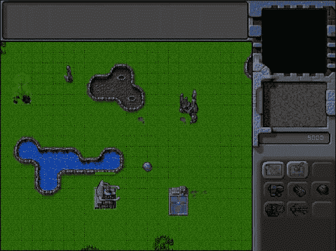

# 八、添加更多游戏元素

在前一章中，我们开发了一个结合寻路和转向的单元移动框架。我们使用这个框架来实现车辆的移动和部署命令。最后，我们通过在中间绘制周期中插入移动步骤，使我们的单元移动看起来更平滑。

我们现在有一个游戏，玩家可以选择单位并命令他们在地图上移动。

在这一章中，我们将在这段代码的基础上添加更多的游戏元素。我们将从实现一种经济开始，玩家可以通过收割来赚钱，然后把钱花在建造建筑和单位上。

然后，我们将构建一个框架来创建游戏级别内的脚本事件，我们可以使用它来控制游戏故事线。我们还将添加向用户显示消息和通知的功能。然后，我们将使用这些元素来处理一个级别内的任务的完成。

我们开始吧。我们将使用第七章中的代码作为起点。

实现基本经济

我们的游戏将会有一个相当简单的经济系统。玩家开始每个任务时会有一笔初始资金。然后，他们可以通过在油田部署收割机来赚取更多。玩家将能够在侧边栏中看到他们的现金余额。一旦玩家有了足够的钱，他们就可以使用工具条来购买建筑和单位。

我们要做的第一件事是修改游戏，以便在关卡开始时向玩家提供金钱。

设定启动资金

我们将从移除物品数组中的一些额外物品开始，并在 maps.js 中的第一张地图中指定两位玩家的起始现金，如清单 8-1 中的所示。

***清单 8-1。*** 设置关卡的起始现金金额(maps.js)

```html
/* Entities to be added */
"items":[
    {"type":"buildings","name":"base","x":11,"y":14,"team":"blue"},
    {"type":"buildings","name":"starport","x":18,"y":14,"team":"blue"},

    {"type":"vehicles","name":"harvester","x":16,"y":12,"team":"blue","direction":3, "uid":-1},
    {"type":"terrain","name":"oilfield","x":3,"y":5,"action":"hint"},

    {"type":"terrain","name":"bigrocks","x":19,"y":6},
    {"type":"terrain","name":"smallrocks","x":8,"y":3}
],

/* Economy Related*/
"cash":{
    "blue":5000,
    "green":1000
},
```

我们把所有不必要的项目从项目清单上删除了。我们还添加了一个现金对象，将蓝队的起始现金设置为 5000，绿队的起始现金设置为 1000。

您可能已经注意到，我们已经为收割机指定了一个 UID。我们将在本章后面处理触发器和脚本事件时使用它。

 **注意**当我们为一个项目指定 UID 时，我们使用负值，这样我们可以确保 UID 永远不会与自动生成的 UID 冲突，后者总是正值。

接下来，我们需要在 singleplayer 对象的 startCurrentLevel()方法中加载这些现金值，如清单 8-2 所示。

***清单 8-2。*** 开始关卡时加载现金金额(singleplayer.js)

```html
startCurrentLevel:function(){
    // Load all the items for the level
    var level = maps.singleplayer[singleplayer.currentLevel];

    // Don't allow player to enter mission until all assets for the level are loaded
    $("#entermission").attr("disabled", true);

    // Load all the assets for the level
    game.currentMapImage = loader.loadImage(level.mapImage);
    game.currentLevel = level;

    game.offsetX = level.startX * game.gridSize;
    game.offsetY = level.startY * game.gridSize;

    // Load level Requirements
    game.resetArrays();
    for (var type in level.requirements){
           var requirementArray = level.requirements[type];
           for (var i=0; i < requirementArray.length; i++) {
               var name = requirementArray[i];
               if (window[type]){
                   window[type].load(name);
               } else {
                   console.log('Could not load type :',type);
               }
           };
    };

    for (var i = level.items.length - 1; i >= 0; i--){
        var itemDetails = level.items[i];
        game.add(itemDetails);
    };

    // Create a grid that stores all obstructed tiles as 1 and unobstructed as 0
    game.currentMapTerrainGrid = [];
    for (var y=0; y < level.mapGridHeight; y++) {
        game.currentMapTerrainGrid[y] = [];
        for (var x=0; x< level.mapGridWidth; x++) {
           game.currentMapTerrainGrid[y][x] = 0;
        }
    };
    for (var i = level.mapObstructedTerrain.length - 1; i >= 0; i--){
        var obstruction = level.mapObstructedTerrain[i];
        game.currentMapTerrainGrid[obstruction[1]][obstruction[0]] = 1;
    };
    game.currentMapPassableGrid = undefined;

    // Load Starting Cash For Game
    game.cash = $.extend([],level.cash);

    // Enable the enter mission button once all assets are loaded
    if (loader.loaded){
        $("#entermission").removeAttr("disabled");
    } else {
        loader.onload = function(){
            $("#entermission").removeAttr("disabled");
        }
    }

    // Load the mission screen with the current briefing
    $('#missonbriefing').html(level.briefing.replace(/\n/g,'<br><br>'));
    $("#missionscreen").show();
},
```

此时，游戏应该加载关卡加载时双方玩家的起始现金金额。然而，在我们看到现金价值之前，我们需要实现侧栏。

实现侧栏

我们将在 sidebar.js 的侧边栏对象中实现侧边栏功能，如清单 8-3 所示。

***清单 8-3。*** 创建侧栏对象(sidebar.js)

```html
var sidebar = {
    animate:function(){
        // Display the current cash balance value
        $('#cash').html(game.cash[game.team]);
    },
}
```

目前，该对象只有 animate()方法，它更新侧栏现金值。我们将从游戏对象的 animationLoop()方法中调用这个方法，如清单 8-4 所示。

***清单 8-4。*** 从 game.animationLoop() (game.js)调用 sidebar.animate()

```html
animationLoop:function(){
    // Animate the Sidebar
    sidebar.animate();

    // Process orders for any item that handles it
    for (var i = game.items.length - 1; i >= 0; i--){
        if(game.items[i].processOrders){
            game.items[i].processOrders();
        }
    };

    // Animate each of the elements within the game
    for (var i = game.items.length - 1; i >= 0; i--){
        game.items[i].animate();
    };

    // Sort game items into a sortedItems array based on their x,y coordinates
    game.sortedItems = $.extend([],game.items);
    game.sortedItems.sort(function(a,b){
        return b.y-a.y + ((b.y==a.y)?(a.x-b.x):0);
    });

    game.lastAnimationTime = (new Date()).getTime();
},
```

接下来，我们将在 index.html 的部分添加对 sidebar.js 的引用，如清单 8-5 所示。

***清单 8-5。*** 添加对 sidebar.js 的引用(index.html)

```html
<script src="js/sidebar.js" type="text/javascript" charset="utf-8"></script>
```

如果我们运行代码到目前为止，我们应该在侧边栏区域看到玩家的现金余额，如图图 8-1 所示。


图 8-1。侧栏显示现金余额

现在我们有了一个有现金余额的基本侧边栏，我们将为玩家实现一种通过收获获得更多钱的方法。

产生金钱

在前一章中，我们已经实现了部署收割机的能力。为了在收割时开始赚钱，我们将修改部署动画状态，并在 buildings.js 中的默认 animate()方法中实现一个新的收割动画状态，如清单 8-6 中的所示。

***清单 8-6。*** 在 animate() (buildings.js)内部实现新的收割动画状态

```html
case "deploy":
    this.imageList = this.spriteArray["deploy"];
    this.imageOffset = this.imageList.offset + this.animationIndex;
    this.animationIndex++;
    // Once deploying is complete, go to harvest now
    if (this.animationIndex>=this.imageList.count){
        this.animationIndex = 0;
        this.action = "harvest";
    }
    break;
case "harvest":
    this.imageList = this.spriteArray[this.lifeCode];
    this.imageOffset = this.imageList.offset + this.animationIndex;
    this.animationIndex++;
    if (this.animationIndex>=this.imageList.count){
        this.animationIndex = 0;
        if (this.lifeCode == "healthy"){
            // Harvesters mine 2 credits of cash per animation cycle
            game.cash[this.team] += 2;
        }
    }
    break;
```

收获箱与立箱相似。然而，每当动画运行一个完整的周期，我们会在玩家的现金余额中增加两个信用点。只有在矿车建筑没有损坏的情况下，我们才会这么做。

我们还修改了 deploy 状态，使其转入 harvest 状态，而不是 stand 状态。这样一旦部署了收割机，就会自动开始赚钱。

如果我们开始游戏，将矿车部署到油田，应该会看到现金余额慢慢增加，如图图 8-2 所示。


图 8-2。部署收割机慢慢挣钱

我们现在有一个基本的游戏经济设置。我们准备实现购买建筑物和单位。

购买建筑物和单元

在我们的游戏中，基地建筑被用来建造建筑，星港被用来建造车辆和飞机。玩家可以通过选择他们想要建造的建筑来购买物品，然后点击工具条上相应的购买按钮。

我们首先将这些购买按钮添加到我们的侧边栏。

添加侧边栏按钮

我们首先将按钮的 HTML 标记添加到 index.html 内部的 gameinterfacescreen div 中，如清单 8-7 所示。

***清单 8-7。*** 添加侧边栏购买按钮到游戏界面屏幕(index.html)

```html
<div id="gameinterfacescreen" class="gamelayer">
    <div id="gamemessages"></div>
    <div id="callerpicture"></div>
    <div id="cash"></div>
    <div id="sidebarbuttons">
        <input type="button" id="starportbutton" title = "Starport">
        <input type="button" id="turretbutton" title = "Turret">
        <input type="button" id="placeholder1" disabled>

        <input type="button" id="scouttankbutton" title = "Scout Tank">
        <input type="button" id="heavytankbutton" title = "Heavy Tank">
        <input type="button" id="harvesterbutton" title = "Harvester">

        <input type="button" id="chopperbutton" title = "Copter">
        <input type="button" id="wraithbutton" title = "Wraith">
        <input type="button" id="placeholder2" disabled>
    </div>
    <canvas id="gamebackgroundcanvas" height="400" width="480"></canvas>
    <canvas id="gameforegroundcanvas" height="400" width="480"></canvas>
</div>
```

接下来我们将为这些按钮添加合适的 CSS 样式到 styles.css 中，如清单 8-8 所示。

***清单 8-8。*** 侧边栏按钮的 CSS 样式(styles.css)

```html
/* Sidebar Buttons */
#gameinterfacescreen #sidebarbuttons {
    position:absolute;
    left:500px;
    top:305px;
    width:152px;
    height:148px;
    overflow:none;
}

#gameinterfacescreen #sidebarbuttons input[type="button"] {
    width:43px;
    height:35px;
    border-width:0px;
    padding:0px;
    background-image: url(img/buttons.png);
}

/* Grayed out state for buttons*/
#starportbutton:active, #starportbutton:disabled {
    background-position: -2px -305px;
}
#placeholder1:active, #placeholder1:disabled {
    background-position: -52px -305px;
}
#turretbutton:active, #turretbutton:disabled {
    background-position: -100px -305px;
}
#scouttankbutton:active, #scouttankbutton:disabled {
    background-position: -2px -346px;
}
#heavytankbutton:active, #heavytankbutton:disabled {
    background-position: -52px -346px;
}
#harvesterbutton:active, #harvesterbutton:disabled {
    background-position: -102px -346px;
}
#chopperbutton:active, #chopperbutton:disabled {
    background-position: -2px -387px;
}
#placeholder2:active, #placeholder2:disabled {
    background-position: -52px -387px;
}
#wraithbutton:active, #wraithbutton:disabled {
    background-position: -102px -387px;
}

/* Regular state for buttons*/
#starportbutton {
    background-position: -167px -305px;
}
#placeholder1 {
    background-position: -216px -305px;
}
#turretbutton {
    background-position: -264px -305px;
}
#scouttankbutton {
    background-position: -167px -346px;
}
#heavytankbutton {
    background-position: -216px -346px;
}
#harvesterbutton {
    background-position: -264px -346px;
}
#chopperbutton {
    background-position: -167px -387px;
}
#placeholder2 {
    background-position: -216px -387px;
}
#wraithbutton {
    background-position: -264px -387px;
}
```

HTML 标记将按钮添加到侧边栏，而 CSS 样式使用 buttons.png 文件定义这些按钮的图像。

如果我们在浏览器中运行游戏，我们应该会在工具条中看到购买按钮，如图图 8-3 所示。


图 8-3。侧边栏中的购买按钮

此时，所有的按钮看起来都是激活的；但是，单击按钮不会做任何事情。根据是否允许玩家构建物品，需要启用或禁用按钮。

启用和禁用侧栏按钮

我们要做的下一件事是确保侧边栏按钮只有在选择了合适的建筑并且玩家有足够的钱来建造物品时才被激活。我们将通过向 sidebar.js 添加一个 enableSidebarButtons()方法并从 animate()方法内部调用它来实现，如清单 8-9 所示。

***清单 8-9。*** 启用和禁用侧边栏按钮(sidebar.js)

```html
var sidebar = {
    enableSidebarButtons:function(){
        // Buttons only enabled when appropriate building is selected
        $("#gameinterfacescreen #sidebarbuttons input[type='button'] ").attr("disabled", true);

        // If no building selected, then no point checking below
        if (game.selectedItems.length==0){
            return;
        }
        var baseSelected = false;
        var starportSelected = false;
        // Check if base or starport is selected
        for (var i = game.selectedItems.length - 1; i >= 0; i--){
            var item = game.selectedItems[i];
            //  Check If player selected a healthy,inactive building (damaged buildings can't produce)
if (item.type == "buildings" && item.team == game.team && item.lifeCode == "healthy" && item.action=="stand"){
                if(item.name == "base"){
                    baseSelected = true;
                } else if (item.name == "starport"){
                    starportSelected = true;
                }
            }
        };

        var cashBalance = game.cash[game.team];
        /* Enable building buttons if base is selected,building has been loaded in requirements, not in deploy building mode and player has enough money*/
        if (baseSelected && !game.deployBuilding){
            if(game.currentLevel.requirements.buildings.indexOf('starport')>-1 && cashBalance>=buildings.list["starport"].cost){
                $("#starportbutton").removeAttr("disabled");
            }
                              if(game.currentLevel.requirements.buildings.indexOf('ground-turret')>-1 && cashBalance>=buildings.list["ground-turret"].cost){
                $("#turretbutton").removeAttr("disabled");
            }
        }

        /* Enable unit buttons if starport is selected, unit has been loaded in requirements, and player has enough money*/
        if (starportSelected){
                              if(game.currentLevel.requirements.vehicles.indexOf('scout-tank')>-1 && cashBalance>=vehicles.list["scout-tank"].cost){
                $("#scouttankbutton").removeAttr("disabled");
            }
if(game.currentLevel.requirements.vehicles.indexOf('heavy-tank')>-1 && cashBalance>=vehicles.list["heavy-tank"].cost){
                $("#heavytankbutton").removeAttr("disabled");
            }
            if(game.currentLevel.requirements.vehicles.indexOf('harvester')>-1 && cashBalance>=vehicles.list["harvester"].cost){
                $("#harvesterbutton").removeAttr("disabled");
            }
            if(game.currentLevel.requirements.aircraft.indexOf('chopper')>-1 && cashBalance>=aircraft.list["chopper"].cost){
                $("#chopperbutton").removeAttr("disabled");
            }
            if(game.currentLevel.requirements.aircraft.indexOf('wraith')>-1 && cashBalance>=aircraft.list["wraith"].cost){
                $("#wraithbutton").removeAttr("disabled");
            }
        }
    },
    animate:function(){
        // Display the current cash balance value
        $('#cash').html(game.cash[game.team]);

        //  Enable or disable buttons as appropriate
        this.enableSidebarButtons();
    },
}

```

在 enableSidebarButton()方法中，我们首先默认禁用所有按钮。然后，我们检查是否选择了有效的 base 或 starport。一个有效的基地或星港属于玩家，是健康的，并且当前处于站立模式，这意味着它当前没有建造任何其他东西。

如果基地已经被选中，建筑类型已经载入关卡要求，并且玩家有足够的现金购买建筑，我们就会启用建筑按钮。如果选择了一个有效的星港，我们对车辆和飞机做同样的事情。

如果我们现在运行游戏，一旦我们选择了一个基地或星港，侧边栏按钮就会被激活，如图 8-4 所示。



图 8-4。侧边栏建筑建造按钮通过选择基础启用

如图所示，建筑物按钮已启用，而车辆和飞机按钮被禁用，因为选择了基础。我们同样可以通过选择星港来激活车辆和飞机建造按钮。

现在是时候在星港建造车辆和飞机了。

在星港建造车辆和飞机

我们要做的第一件事是通过添加清单 8-10 中的代码来修改侧边栏对象以处理按钮的点击事件。

***清单 8-10。*** 设置侧栏按钮的点击事件(Sidebar . js)

```html
init:function(){
    $("#scouttankbutton").click(function(){
        sidebar.constructAtStarport({type:"vehicles","name":"scout-tank"});
    });
    $("#heavytankbutton").click(function(){
        sidebar.constructAtStarport({type:"vehicles","name":"heavy-tank"});
    });
    $("#harvesterbutton").click(function(){
        sidebar.constructAtStarport({type:"vehicles","name":"harvester"});
    });
    $("#chopperbutton").click(function(){
        sidebar.constructAtStarport({type:"aircraft","name":"chopper"});
    });
    $("#wraithbutton").click(function(){
        sidebar.constructAtStarport({type:"aircraft","name":"wraith"});
    });
},
constructAtStarport:function(unitDetails){
    var starport;
    // Find the first eligible starport among selected items
    for (var i = game.selectedItems.length - 1; i >= 0; i--){
        var item = game.selectedItems[i];
        if (item.type == "buildings" && item.name == "starport"
            && item.team == game.team && item.lifeCode == "healthy" && item.action=="stand"){
            starport = item;
            break;
        }
    };
    if (starport){
        game.sendCommand([starport.uid],{type:"construct-unit",details:unitDetails});
    }
},
```

我们首先声明一个 init()方法，为每个车辆和飞机按钮设置 click 事件，以使用适当的单元细节调用 constructAtStarport()方法。

在 constructAtStarport()方法中，我们获得了所选项目中第一个合格的 Starport。然后，我们使用 game.sendCommand()方法向 starport 发送一个构造单元命令，其中包含要构造的单元的详细信息。

接下来，我们将在游戏初始化时从 game.init()方法内部调用 sidebar.init()方法，如清单 8-11 所示。

***清单 8-11。*** 从 game.init() (game.js)内部初始化侧边栏

```html
 // Start preloading assets
init: function(){
    loader.init();
    mouse.init();
    sidebar.init();

    $('.gamelayer').hide();
    $('#gamestartscreen').show();

    game.backgroundCanvas = document.getElementById('gamebackgroundcanvas');
    game.backgroundContext = game.backgroundCanvas.getContext('2d');

    game.foregroundCanvas = document.getElementById('gameforegroundcanvas');
    game.foregroundContext = game.foregroundCanvas.getContext('2d');

    game.canvasWidth = game.backgroundCanvas.width;
    game.canvasHeight = game.backgroundCanvas.height;
},
```

接下来，我们将为 starport 建筑创建一个 processOrder()方法，它实现了构造单元订单。我们将在 starport 定义中添加这个方法，如清单 8-12 所示。

***清单 8-12。*** 在 Starport 定义(buildings.js)内实现 processOrder()

```html
"starport":{
    name:"starport",
    pixelWidth:40,
    pixelHeight:60,
    baseWidth:40,
    baseHeight:55,
    pixelOffsetX:1,
    pixelOffsetY:5,
    buildableGrid:[
        [1,1],
        [1,1],
        [1,1]
    ],
    passableGrid:[
        [1,1],
        [0,0],
        [0,0]
    ],
    sight:3,
    cost:2000,
      hitPoints:300,
    spriteImages:[
        {name:"teleport",count:9},
        {name:"closing",count:18},
        {name:"healthy",count:4},
        {name:"damaged",count:1},
    ],
    processOrders:function(){
        switch (this.orders.type){
            case "construct-unit":
                if(this.lifeCode != "healthy"){
                    return;
                }
                // First make sure there is no unit standing on top of the building
                var unitOnTop = false;
                for (var i = game.items.length - 1; i >= 0; i--){
                    var item = game.items[i];
                    if (item.type == "vehicles" || item.type == "aircraft"){
                         if (item.x > this.x && item.x < this.x+2 && item.y> this.y && item.y<this.y+3){
                            unitOnTop = true;
                            break;
                        }
                    }
                };

                var cost = window[this.orders.details.type].list[this.orders.details.name].cost;
                if (unitOnTop){
                    if (this.team == game.team){
                        game.showMessage("system","Warning! Cannot teleport unit while landing bay is occupied.");
                    }
                } else if(game.cash[this.team]<cost){
                    if (this.team == game.team){
                        game.showMessage("system","Warning! Insufficient Funds. Need "+cost+ " credits.");
                    }
                } else {
                    this.action="open";
                    this.animationIndex = 0;
                    // Position new unit above center of starport
                    var itemDetails = this.orders.details;
                    itemDetails.x = this.x+0.5*this.pixelWidth/game.gridSize;
                    itemDetails.y = this.y+0.5*this.pixelHeight/game.gridSize;
                    // Teleport in unit and subtract the cost from player cash
                    itemDetails.action="teleport";
                    itemDetails.team = this.team;
                    game.cash[this.team] -= cost;
                    this.constructUnit = $.extend(true,[],itemDetails);

                }
                this.orders = {type:"stand"};
                break;
        }
    }
},
```

我们首先检查是否有任何单位已经被放置在星港上方，如果是，我们使用 game.showMessage()方法通知玩家当登陆舱被占用时不能传送单位。接下来，我们检查我们是否有足够的资金，如果没有，通知用户。

最后，我们实现了单元的实际购买。我们首先将建筑物的动画动作设置为打开。然后，我们为该项设置位置、动作和团队属性。我们将新单位的详细信息保存在 constructUnit 变量中，最后从玩家的现金余额中减去该物品的费用。

你可能已经注意到我们为新建造的单位设置了一个传送动作。我们需要在车辆和飞机上实现这一点。

接下来，我们将修改 buildings 对象的 animate()方法中的开放动画状态，以将该单位添加到游戏中，如清单 8-13 所示。

***清单 8-13。*** 星港开启后添加单位(buildings.js)

```html
case "open":
    this.imageList = this.spriteArray["closing"];
    // Opening is just the closing sprites running backwards
    this.imageOffset = this.imageList.offset + this.imageList.count - this.animationIndex;
    this.animationIndex++;
    // Once opening is complete, go back to close
    if (this.animationIndex>=this.imageList.count){
        this.animationIndex = 0;
        this.action = "close";
        // If constructUnit has been set, add the new unit to the game
        if(this.constructUnit){
            game.add(this.constructUnit);
            this.constructUnit = undefined;
        }
    }
     break;
```

一旦打开动画完成，我们检查是否设置了 constructUnit 属性，如果设置了，我们在取消设置变量之前将单位添加到游戏中。

接下来我们将在游戏对象中实现一个 showMessage()方法，如清单 8-14 所示。

***清单 8-14。*** 游戏对象的 showMessage()方法

```html
// Functions for communicating with player
characters: {
    "system":{
        "name":"System",
        "image":"img/system.png"
    }
},
showMessage:function(from,message){
    var character = game.characters[from];
    if (character){
        from = character.name;
        if (character.image){
            $('#callerpicture').html('');
            // hide the profile picture after six seconds
            setTimeout(function(){
                $('#callerpicture').html("");
            },6000)
        }
    }
    // Append message to messages pane and scroll to the bottom
    var existingMessage = $('#gamemessages').html();
    var newMessage = existingMessage+'<span>'+from+': </span>'+message+'<br>';
    $('#gamemessages').html(newMessage);
    $('#gamemessages').animate({scrollTop:$('#gamemessages').prop('scrollHeight')});
}
```

我们首先定义一个 characters 对象，它包含系统角色的名称和图像。在 showMessage()方法中，我们检查 from 参数是否有字符图像，如果有，则显示该图像四秒钟。接下来，我们将消息追加到 gamemessages div，并滚动到 div 的底部。

无论何时调用 showMessage()方法，都会在消息窗口显示消息，在侧边栏显示图片，如图图 8-5 所示。


图 8-5。使用 showMessage()显示系统警告

当我们推进游戏故事线时，我们可以使用这种机制来显示来自各种游戏角色的玩家对话。这将使单人战役更受剧情驱动，并使游戏更具吸引力。

最后，我们将修改车辆和飞机物体来实现新的传送动作。

我们将从在 vehicles 对象的 animate()方法中的 stand 动作的正下方添加一个传送动作的案例开始，如清单 8-15 所示。

***清单 8-15。*** 在 animate() (vehicles.js)内添加瞬移动作的案例

```html
case "teleport":
    var direction = wrapDirection(Math.round(this.direction),this.directions);
    this.imageList = this.spriteArray["stand-"+direction];
    this.imageOffset = this.imageList.offset + this.animationIndex;
    this.animationIndex++;

    if (this.animationIndex>=this.imageList.count){
        this.animationIndex = 0;
    }
    if (!this.brightness){
        this.brightness = 1;
    }
    this.brightness -= 0.05;
    if(this.brightness <= 0){
        this.brightness = undefined;
        this.action = "stand";
    }
    break;
```

我们首先设置 imageOffset 和 animationIndex，就像我们为默认的 stand 动作所做的那样。然后，我们将一个亮度变量设置为 1，并逐渐将其减少到 0，此时我们将动作状态切换回 stand。

接下来，我们将修改 vehicles 对象的默认 draw()方法来使用 brightness 属性，如清单 8-16 所示。

***清单 8-16。*** 修改 draw()方法处理瞬移亮度(vehicles.js)

```html
draw:function(){
    var x = (this.x*game.gridSize)-game.offsetX-this.pixelOffsetX + this.lastMovementX*game.drawingInterpolationFactor*game.gridSize;
    var y = (this.y*game.gridSize)-game.offsetY-this.pixelOffsetY + this.lastMovementY*game.drawingInterpolationFactor*game.gridSize;
    this.drawingX = x;
    this.drawingY = y;

    if (this.selected){
        this.drawSelection();
        this.drawLifeBar();
    }

    var colorIndex = (this.team == "blue")?0:1;
    var colorOffset = colorIndex*this.pixelHeight;

    game.foregroundContext.drawImage(this.spriteSheet, this.imageOffset*this.pixelWidth,colorOffset,
           this.pixelWidth,this.pixelHeight,x,y,this.pixelWidth,this.pixelHeight);

    // Draw glow while teleporting in
    if(this.brightness){
        game.foregroundContext.beginPath();
        game.foregroundContext.arc(x+ this.pixelOffsetX, y+this.pixelOffsetY, this.radius, 0 , Math.PI*2,false);
        game.foregroundContext.fillStyle = 'rgba(255,255,255,'+this.brightness+')';
        game.foregroundContext.fill();
    }
}
```

在新添加的代码中，我们检查车辆是否设置了亮度属性，如果是，我们在车辆顶部绘制一个填充的白色圆圈，并根据亮度填充 alpha 值。由于 brightness 属性的值从 1 下降到 0，圆将逐渐从亮白色变为完全透明。

接下来，我们将在飞行器对象的 animate()方法中的 fly 动作下面添加一个传送动作的例子，如清单 8-17 所示。

***清单 8-17。*** 在 animate() (aircraft.js)内部添加瞬移动作案例

```html
case "teleport":
    var direction = wrapDirection(Math.round(this.direction),this.directions);
    this.imageList = this.spriteArray["fly-"+direction];
    this.imageOffset = this.imageList.offset + this.animationIndex;
    this.animationIndex++;

    if (this.animationIndex>=this.imageList.count){
        this.animationIndex = 0;
    }
    if (!this.brightness){
        this.brightness = 1;
    }
    this.brightness -= 0.05;
    if(this.brightness <= 0){
        this.brightness = undefined;
        this.action = "fly";
    }
    break;
```

与我们对车辆所做的类似，我们设置一个亮度属性，逐渐将其降低到 0，然后将动作状态设置为飞行。

最后，我们将修改飞机对象的默认 draw()方法来使用亮度属性，就像我们对车辆所做的一样，如清单 8-18 所示。

***清单 8-18。*** 修改 draw()方法处理瞬移亮度(aircraft.js)

```html
draw:function(){
    var x = (this.x*game.gridSize)-game.offsetX-this.pixelOffsetX + this.lastMovementX*game.drawingInterpolationFactor*game.gridSize;
    var y = (this.y*game.gridSize)-game.offsetY-this.pixelOffsetY-this.pixelShadowHeight + this.lastMovementY*game.drawingInterpolationFactor*game.gridSize;
    this.drawingX = x;
    this.drawingY = y;
    if (this.selected){
        this.drawSelection();
        this.drawLifeBar();
    }
    var colorIndex = (this.team == "blue")?0:1;
    var colorOffset = colorIndex*this.pixelHeight;
    var shadowOffset = this.pixelHeight*2; // The aircraft shadow is on the second row of the sprite sheet

    game.foregroundContext.drawImage(this.spriteSheet, this.imageOffset*this.pixelWidth,colorOffset, this.pixelWidth, this.pixelHeight, x,y,this.pixelWidth,this.pixelHeight);
    game.foregroundContext.drawImage(this.spriteSheet, this.imageOffset*this.pixelWidth,shadowOffset,this.pixelWidth, this.pixelHeight, x, y+this.pixelShadowHeight, this.pixelWidth,this.pixelHeight);

    // Draw glow while teleporting in
    if(this.brightness){
        game.foregroundContext.beginPath();
        game.foregroundContext.arc(x+ this.pixelOffsetX,y+this.pixelOffsetY,this.radius,0,Math.PI*2,false);
        game.foregroundContext.fillStyle = 'rgba(255,255,255,'+this.brightness+')';
        game.foregroundContext.fill();
    }
}
```

如果你在浏览器中运行游戏，你现在应该能够选择星港并建造一辆车或飞机，如图 8-6 所示。


图 8-6。飞行器瞬移到星际港口

飞机传送到星港的正上方，在一个白色发光的圆圈内。你会注意到，当飞机被传送进来时，侧边栏按钮被禁用。此外，现金余额因飞机成本而减少。当玩家买不起一个单位时，它的按钮会自动失效。当星港有另一个单位在它上面盘旋时，试图建造一个单位将会导致如图 8-5 所示的系统警告。

现在我们已经完成了建造车辆和飞机，是时候在基地建造建筑了。

在基地建造建筑

我们将从在侧边栏对象的 init()方法中为两个建筑构造按钮设置 click 事件开始，如清单 8-19 中的所示。

***清单 8-19。*** 设置建筑按钮的点击事件(sidebar.js)

```html
init:function(){
    // Initialize unit construction buttons
    $("#scouttankbutton").click(function(){
        sidebar.constructAtStarport({type:"vehicles","name":"scout-tank"});
    });
    $("#heavytankbutton").click(function(){
        sidebar.constructAtStarport({type:"vehicles","name":"heavy-tank"});
    });
    $("#harvesterbutton").click(function(){
        sidebar.constructAtStarport({type:"vehicles","name":"harvester"});
    });
    $("#chopperbutton").click(function(){
        sidebar.constructAtStarport({type:"aircraft","name":"chopper"});
    });
    $("#wraithbutton").click(function(){
        sidebar.constructAtStarport({type:"aircraft","name":"wraith"});
    });

    //Initialize building construction buttons

    $("#starportbutton").click(function(){
        game.deployBuilding = "starport";
    });
    $("#turretbutton").click(function(){
        game.deployBuilding = "ground-turret";
    });
},
```

当单击两个 building-construction 按钮中的任何一个时，我们将 sidebar.deployBuilding 属性设置为要构建的建筑物的名称。

接下来，我们将修改侧边栏 animate()方法来处理建筑物的部署，如清单 8-20 所示。

***清单 8-20。*** 修改 animate()方法处理建筑部署(sidebar.js)

```html
animate:function(){
    // Display the current cash balance value
    $('#cash').html(game.cash[game.team]);
    //  Enable or disable buttons as appropriate
    this.enableSidebarButtons();

    if (game.deployBuilding){
        // Create the buildable grid to see where building can be placed
        game.rebuildBuildableGrid();
        // Compare with buildable grid to see where we need to place the building
        var placementGrid = buildings.list[game.deployBuilding].buildableGrid;
        game.placementGrid = $.extend(true,[],placementGrid);
        game.canDeployBuilding = true;
        for (var i = game.placementGrid.length - 1; i >= 0; i--){
            for (var j = game.placementGrid[i].length - 1; j >= 0; j--){
                if(game.placementGrid[i][j] &&
                    (mouse.gridY+i>= game.currentLevel.mapGridHeight || mouse.gridX+j>=game.currentLevel.mapGridWidth || game.currentMapBuildableGrid[mouse.gridY+i][mouse.gridX+j]==1)){
                    game.canDeployBuilding = false;
                    game.placementGrid[i][j] = 0;
                }
            };
        };
    }
},
```

如果已经设置了 game.deployBuilding 变量，我们调用 game.rebuildBuildableGrid()方法创建 game.currentMapBuildableGrid 数组，然后使用正在部署的建筑物的 BuildableGrid 属性设置 game.placementGrid 变量。

然后，我们遍历放置网格，检查是否有可能在当前鼠标位置部署建筑。如果要在其上放置建筑物的任何方块在地图边界之外，或者在 currentMapBuildableGrid 数组中被标记为不可建造，我们将 placementGrid 数组上相应的方块标记为不可建造，并将 canDeployBuilding 标志设置为 false。

接下来我们将在游戏对象内部实现 rebuildBuildableGrid()方法，如清单 8-21 所示。

***清单 8-21。*** 在 rebuildBuildableGrid()方法中创建 buildableGrid(game . js)

```html
rebuildBuildableGrid:function(){
    game.currentMapBuildableGrid = $.extend(true,[],game.currentMapTerrainGrid);
    for (var i = game.items.length - 1; i >= 0; i--){
        var item = game.items[i];
        if(item.type == "buildings" || item.type == "terrain"){
            for (var y = item.buildableGrid.length - 1; y >= 0; y--){
                for (var x = item.buildableGrid[y].length - 1; x >= 0; x--){
                    if(item.buildableGrid[y][x]){
                        game.currentMapBuildableGrid[item.y+y][item.x+x] = 1;
                    }
                };
            };
        } else if (item.type == "vehicles"){
            // Mark all squares under or near the vehicle as unbuildable
            var radius = item.radius/game.gridSize;
            var x1 = Math.max(Math.floor(item.x - radius),0);
            var x2 = Math.min(Math.floor(item.x + radius),game.currentLevel.mapGridWidth-1);
            var y1 = Math.max(Math.floor(item.y - radius),0);
            var y2 = Math.min(Math.floor(item.y + radius),game.currentLevel.mapGridHeight-1);
            for (var x=x1; x <= x2; x++) {
                for (var y=y1; y <= y2; y++) {
                    game.currentMapBuildableGrid[y][x] = 1;
                };
            };
        }
    };
},
```

我们首先将 currentMapBuildableGrid 初始化为 currentMapTerrainGrid。然后，我们将建筑或地形实体下的所有方块标记为不可建筑，就像我们在创建可通行数组时所做的那样。最后，我们将车辆旁边的所有方格标记为不可建造。

接下来我们将修改鼠标对象的 draw()方法来标记建筑将要部署的网格位置，如清单 8-22 所示。

***清单 8-22。*** 绘制鼠标光标下的建筑部署网格(Mouse . js)

```html
draw:function(){
    if(this.dragSelect){
        var x = Math.min(this.gameX,this.dragX);
        var y = Math.min(this.gameY,this.dragY);
        var width = Math.abs(this.gameX-this.dragX)
        var height = Math.abs(this.gameY-this.dragY)
        game.foregroundContext.strokeStyle = 'white';
        game.foregroundContext.strokeRect(x-game.offsetX,y-    game.offsetY, width, height);
    }
    if (game.deployBuilding && game.placementGrid){
        var buildingType = buildings.list[game.deployBuilding];
        var x = (this.gridX*game.gridSize)-game.offsetX;
        var y = (this.gridY*game.gridSize)-game.offsetY;
        for (var i = game.placementGrid.length - 1; i >= 0; i--){
            for (var j = game.placementGrid[i].length - 1; j >= 0; j--){
                if(game.placementGrid[i][j]){
                    game.foregroundContext.fillStyle = "rgba(0,0,255,0.3)";
                } else {
                    game.foregroundContext.fillStyle = "rgba(255,0,0,0.3)";
                }
                game.foregroundContext.fillRect(x+j*game.gridSize, y+i*game.gridSize, game.gridSize, game.gridSize);
            };
        };
    }
},
```

我们首先检查是否已经设置了 deployBuilding 和 placementGrid 变量，如果已经设置了，我们根据是否可以在该网格位置放置建筑物来绘制蓝色或红色方块。

如果你现在运行游戏，选择主基地，并尝试创建一个建筑，你应该会看到建筑在鼠标位置展开网格，如图图 8-7 所示。


图 8-7。构建部署网格，用红色标记不可构建的方块

现在我们可以启动建筑物部署模式，我们将通过单击鼠标左键来放置建筑物，或者通过单击鼠标右键来取消模式。我们将从修改鼠标对象的 click()方法开始，如清单 8-23 所示。

***清单 8-23。*** 修改 mouse.click() 完成或取消部署模式(mouse.js)

```html
click:function(ev,rightClick){
    // Player clicked inside the canvas

    var clickedItem = this.itemUnderMouse();
    var shiftPressed = ev.shiftKey;

    if (!rightClick){ // Player left clicked
        // If the game is in deployBuilding mode, left clicking will deploy the building
        if (game.deployBuilding){
            if(game.canDeployBuilding){
                sidebar.finishDeployingBuilding();
            } else {
                game.showMessage("system","Warning! Cannot deploy building here.");
            }

            return;
        }
        if (clickedItem){
            // Pressing shift adds to existing selection. If shift is not pressed, clear existing selection
            if(!shiftPressed){
                game.clearSelection();
            }
            game.selectItem(clickedItem,shiftPressed);
        }
    } else { // Player right clicked
        // If the game is in deployBuilding mode, right clicking will cancel deployBuilding mode
        if (game.deployBuilding){
            sidebar.cancelDeployingBuilding();
            return;
        }
        // Handle actions like attacking and movement of selected units
        var uids = [];
        if (clickedItem){ // Player right clicked on something... Specific action
            if (clickedItem.type != "terrain"){
                if (clickedItem.team != game.team){ // Player right clicked on an enemy item
                    for (var i = game.selectedItems.length - 1; i >= 0; i--){
                        var item = game.selectedItems[i];
                        // if selected item is from players team and can attack
                        if(item.team == game.team && item.canAttack){
                            uids.push(item.uid);
                        }
                    };
                    if (uids.length>0){
                        game.sendCommand(uids,{type:"attack",toUid:clickedItem.uid});
                    }
                } else  { // Player right clicked on a friendly item
                    for (var i = game.selectedItems.length - 1; i >= 0; i--){
                        var item = game.selectedItems[i];
                        if(item.team == game.team && (item.type == "vehicles" || item.type == "aircraft")){
                            uids.push(item.uid);
                        }
                    };
                    if (uids.length>0){
                        game.sendCommand(uids,{type:"guard",toUid:clickedItem.uid});
                    }
                }
            } else if (clickedItem.name == "oilfield"){
                // Oilfield means harvesters go and deploy there
                for (var i = game.selectedItems.length - 1; i >= 0; i--){
                    var item = game.selectedItems[i];
                    // pick the first selected harvester since only one can deploy at a time
                    if(item.team == game.team && (item.type == "vehicles" && item.name == "harvester")){
                        uids.push(item.uid);
                        break;
                    }
                };
                if (uids.length>0){
                    game.sendCommand(uids,{type:"deploy",toUid:clickedItem.uid});
                }
            }
        } else { // Just try to move there
            // Get all UIDs that can be commanded to move
            for (var i = game.selectedItems.length - 1; i >= 0; i--){
                var item = game.selectedItems[i];
                if(item.team == game.team && (item.type == "vehicles" || item.type == "aircraft")){
                    uids.push(item.uid);
                }
            };
            if (uids.length>0){
                game.sendCommand(uids,{type:"move",  to:{x:mouse.gameX/game.gridSize, y:mouse.gameY/game.gridSize}});
            }
        }
    }
},
```

如果玩家在部署模式下单击鼠标左键，我们检查 canDeployBuilding 变量并调用 sidebar . finishdeployingbuilding()，如果我们可以部署建筑物，我们使用 game.showMessage()显示警告消息。

如果播放器在部署模式下右键单击，我们调用 sidebar . canceldeployingbuilding()方法。

接下来我们将在侧边栏对象中实现这两个新方法，finishDeployBuilding() 和 cancelDeployBuilding() ，如清单 8-24 所示。

***清单 8-24。*** 完成部署构建()和取消部署构建()(sidebar.js)

```html
cancelDeployingBuilding:function(){
    game.deployBuilding = undefined;
},
finishDeployingBuilding:function(){
    var buildingName= game.deployBuilding;
    var base;
    for (var i = game.selectedItems.length - 1; i >= 0; i--){
        var item = game.selectedItems[i];
        if (item.type == "buildings" && item.name == "base" && item.team == game.team && item.lifeCode == "healthy" && item.action=="stand"){
            base = item;
            break;
        }
    };

    if (base){
        var buildingDetails = {type:"buildings",name:buildingName,x:mouse.gridX,y:mouse.gridY};
        game.sendCommand([base.uid],{type:"construct-building",details:buildingDetails});
    }

    // Clear deployBuilding flag
    game.deployBuilding = undefined;
}
```

cancelDeployingBuilding()方法只是清除 deployBuilding 变量。finishDeployingBuilding()方法首先选择基地，然后使用 game.sendCommand()方法向其发送构建命令。

接下来，我们将为实现构造-构建顺序的基础构建创建一个 processOrder()方法。我们将在基本定义中添加这个方法，如清单 8-25 所示。

***清单 8-25。*** 实现基定义(buildings.js)内的 processOrder()

```html
processOrders:function(){
    switch (this.orders.type){
        case "construct-building":
            this.action="construct";
            this.animationIndex = 0;
            var itemDetails = this.orders.details;
            // Teleport in building and subtract the cost from player cash
            itemDetails.team = this.team;
            itemDetails.action = "teleport";
            var item = game.add(itemDetails);
            game.cash[this.team] -= item.cost;
            this.orders = {type:"stand"};
            break;
    }
}
```

我们首先将基本实体的动作状态设置为构造。接下来，我们把这个建筑添加到游戏中，它的动作状态是传送。最后，我们从现金余额中减去建筑成本，并将基本实体的 orders 属性设置回 stand。

如果你现在运行游戏，并试图通过左键点击地图上的一个有效位置来部署建筑，建筑应该会被传送到那个位置，如图 8-8 所示。


图 8-8。部署好的建筑被传送进来

你会注意到现金余额因建筑成本而减少。当玩家买不起建筑时，它的按钮会自动失效。此外，如果您尝试在无效的位置部署建筑物，您将会看到一条系统警告消息，告诉您不能在该位置部署建筑物。

我们现在可以在游戏中建造单位和建筑了。我们将在本章中实现的最后一件事是根据触发的事件结束级别。

结束一关

每当玩家成功完成一个关卡的目标，我们会显示一个消息框通知他们，然后载入下一个关卡。如果玩家任务失败，我们会给玩家重新玩当前关卡或者离开单人战役的选择。

我们将通过在游戏中实现一个触发事件系统来检查成功和失败的标准。在后面的章节中，我们将使用相同的事件系统来编写基于故事的事件。

我们要做的第一件事是实现一个消息对话框。

实现消息对话框

消息框将是一个模式对话框，只有一个确定按钮或同时有确定和取消按钮。

我们首先将消息框屏幕的 HTML 标记添加到 index.html 的主体，如清单 8-26 所示。

***清单 8-26。*** 在正文标签内为消息框添加 HTML 标记(index.html)

```html
<body>
    <div id="gamecontainer">
        <div id="gamestartscreen" class="gamelayer">
            <span id="singleplayer" onclick = "singleplayer.start();">Campaign</span><br>
            <span id="multiplayer" onclick = "multiplayer.start();">Multiplayer</span><br>
        </div>
        <div id="missionscreen" class="gamelayer">
            <input type="button" id="entermission" onclick = "singleplayer.play();">
            <input type="button" id="exitmission" onclick = "singleplayer.exit();">
            <div id="missonbriefing">Welcome to your first mission.
            </div>
        </div>
        <div id="gameinterfacescreen" class="gamelayer">
            <div id="gamemessages"></div>
            <div id="callerpicture"></div>
            <div id="cash"></div>
            <div id="sidebarbuttons">
                <input type="button" id="starportbutton" title = "Starport">
                <input type="button" id="turretbutton" title = "Turret">
                <input type="button" id="placeholder1" disabled>

                <input type="button" id="scouttankbutton" title = "Scout Tank">
                <input type="button" id="heavytankbutton" title = "Heavy Tank">
                <input type="button" id="harvesterbutton" title = "Harvester">

                <input type="button" id="chopperbutton" title = "Copter">
                <input type="button" id="wraithbutton" title = "Wraith">
                <input type="button" id="placeholder2" disabled>
            </div>
            <canvas id="gamebackgroundcanvas" height="400" width="480"></canvas>
            <canvas id="gameforegroundcanvas" height="400" width="480"></canvas>
        </div>
        <div id="messageboxscreen" class="gamelayer">
            <div id="messagebox">
                <span id="messageboxtext"></span>
                <input type="button" id="messageboxok" onclick="game.messageBoxOK();">
                <input type="button" id="messageboxcancel" onclick="game.messageBoxCancel();">
            </div>
        </div>
        <div id="loadingscreen" class="gamelayer">
            <div id="loadingmessage"></div>
        </div>
    </div>
</body>
```

接下来，我们将把消息框的样式添加到 styles.css 中，如清单 8-27 所示。

***清单 8-27。*** 消息框样式(styles.css)

```html
/* Message Box Screen */
#messageboxscreen {
    background:rgba(0,0,0,0.7);
    z-index:20;
}
#messagebox {
    position:absolute;
    top:170px;
    left:140px;
    width:296px;
    height:178px;
    color:white;
    background:url(img/messagebox.png) no-repeat center;
    color:rgb(130,150,162);
    overflow:hidden;
    font-size: 13px;
    font-family: 'Courier New', Courier, monospace;
}
#messagebox span {
    position:absolute;
    top:30px;
    left:50px;
    width:200px;
    height:100px;
}

#messagebox input[type="button"]{
    background-image: url(img/buttons.png);
    position:absolute;
    border-width:0px;
    padding:0px;
}
#messageboxok{
    background-position: -2px -150px;
    top:126px;
    left:11px;
    width:74px;
    height:26px;
}
#messageboxok:active,#messageboxok:disabled{
    background-position: -2px -186px;
}

#messageboxcancel{
    background-position: -86px -150px;
    left:197px;
    top:129px;
    width:73px;
    height:24px;
}
#messageboxcancel:active,#messageboxcancel:disabled{
    background-position: -86px -184px;
}
```

最后，我们给游戏对象添加一些方法，如清单 8-28 所示。

***清单 8-28。*** 给游戏对象添加消息框方法(game.js)

```html
/* Message Box related code*/
messageBoxOkCallback:undefined,
messageBoxCancelCallback:undefined,
showMessageBox:function(message,onOK,onCancel){
    // Set message box text
    $('#messageboxtext').html(message);

    // Set message box ok and cancel handlers and enable buttons
    if(!onOK){
        game.messageBoxOkCallback = undefined;
    } else {
        game.messageBoxOkCallback = onOK;
    }
    if(!onCancel){
        game.messageBoxCancelCallback = undefined;
        $("#messageboxcancel").hide();
    } else {
        game.messageBoxCancelCallback = onCancel;
        $("#messageboxcancel").show();
    }

    // Display the message box and wait for user to click a button
    $('#messageboxscreen').show();
},
messageBoxOK:function(){
    $('#messageboxscreen').hide();
    if(game.messageBoxOkCallback){
        game.messageBoxOkCallback()
    }
},
messageBoxCancel:function(){
    $('#messageboxscreen').hide();
    if(game.messageBoxCancelCallback){
        game.messageBoxCancelCallback();
    }
},
```

showMessageBox()方法首先在 messageboxtext 元素中设置消息。接下来，它将 onOK 和 onCancel 回调方法参数保存到 messageBoxOkCallback 和 messageBoxCancelCallback 变量中。它根据是否传递了取消回调方法参数来显示或隐藏取消按钮。最后，它展示了 messageboxscreen 层。

messageBoxOK()和 messageBoxCancel()方法隐藏 messageboxscreen 层，然后调用它们各自的回调方法(如果已设置)。

在没有指定任何回调方法的情况下调用 showMessageBox()时，它会在一个只有 OK 按钮的黑屏上显示消息框，如图图 8-9 所示。


图 8-9。消息框中显示的示例消息

现在消息框的代码已经就绪，我们将实现我们的游戏触发器。

实现触发器

我们的游戏将使用两种类型的触发器。

*   定时触发器将在指定时间后执行操作。他们也可以定期重复。
*   条件触发器将在指定的条件为真时执行操作。

我们将从在 maps 对象的级别中添加一个触发器数组开始，如清单 8-29 所示。

***清单 8-29。*** 向关卡中添加触发器(maps.js)

```html
/* Conditional and Timed Trigger Events */
"triggers":[
    /* Timed Events*/
    {"type":"timed","time":1000,
        "action":function(){
            game.showMessage("system","You have 20 seconds left.\nGet the harvester near the oil field.");
        }
    },
    {"type":"timed","time":21000,
        "action":function(){
            singleplayer.endLevel(false);
        }
    },
    /* Conditional Event */
    {"type":"conditional",
        "condition":function(){
            var transport = game.getItemByUid(-1);
            return (transport.x <10 && transport.y <10);
        },
        "action":function(){
            singleplayer.endLevel(true);
        }
    }
],
```

所有的触发器都有一个*类型*和一个*动作*方法。我们在数组中定义了三个触发器。

第一个触发器是时间设置为 1 秒的定时触发器。在它的动作参数中，我们调用 game.showMessage()并告诉玩家他有 20 秒的时间将收割机移动到油田附近。

第二个触发器计时 20 秒后，调用 singleplayer.endLevel()方法，参数为 false，表示任务失败。

最终触发器是条件触发器。当运输工具位于地图的左上角象限内且 x 和 y 坐标小于 10°时，condition 方法返回 true。当这个条件被触发时，action 方法调用 singleplayer.endLevel()方法，参数 true 表示任务成功完成。

接下来我们将在 singleplayer 对象中实现 endLevel()方法，如清单 8-30 所示。

***清单 8-30。*** 实现 singleplayer endLevel()方法(singleplayer.js)

```html
endLevel:function(success){
    clearInterval(game.animationInterval);
    game.end();

    if (success){
        var moreLevels = (singleplayer.currentLevel < maps.singleplayer.length-1);
        if (moreLevels){
            game.showMessageBox("Mission Accomplished.",function(){
                $('.gamelayer').hide();
                singleplayer.currentLevel++;
                singleplayer.startCurrentLevel();
            });
        } else {
            game.showMessageBox("Mission Accomplished.<br><br>This was the last mission in the campaign.<br><br>Thank You for playing.",function(){
                $('.gamelayer').hide();
                $('#gamestartscreen').show();
            });
        }
    } else {
        game.showMessageBox("Mission Failed.<br><br>Try again?",function(){
            $('.gamelayer').hide();
            singleplayer.startCurrentLevel();
        }, function(){
            $('.gamelayer').hide();
            $('#gamestartscreen').show();
        });
    }
}
```

我们首先清除调用 game.animationLoop()方法的 game.animationInterval 计时器。接下来我们调用 game.end()方法。

如果关卡成功完成，我们将检查地图中是否有更多的关卡。如果是这样，我们会在消息框中通知玩家任务成功，然后当玩家点击 OK 按钮时开始下一关。如果没有更多的关卡，我们会通知玩家，但是当玩家点击“确定”时，我们会返回到游戏开始菜单。

如果关卡没有成功完成，我们会询问玩家是否想再试一次。如果玩家点击确定，我们重新开始当前的水平。如果玩家点击取消，我们返回游戏开始菜单。

接下来我们将为游戏对象添加一些与触发器相关的方法，如清单 8-31 所示。

***清单 8-31。*** 给游戏对象添加触发相关方法(game.js)

```html
// Methods for handling triggered events within the game
initTrigger:function(trigger){
    if(trigger.type == "timed"){
        trigger.timeout = setTimeout (function(){
            game.runTrigger(trigger);
        },trigger.time)
    } else if(trigger.type == "conditional"){
        trigger.interval = setInterval (function(){
            game.runTrigger(trigger);
        },1000)
    }
},
runTrigger:function(trigger){
    if(trigger.type == "timed"){
        // Re initialize the trigger based on repeat settings
        if (trigger.repeat){
            game.initTrigger(trigger);
        }
        // Call the trigger action
        trigger.action(trigger);
    } else if (trigger.type == "conditional"){
        //Check if the condition has been satisfied
        if(trigger.condition()){
            // Clear the trigger
            game.clearTrigger(trigger);
            // Call the trigger action
            trigger.action(trigger);
        }
    }
},
clearTrigger:function(trigger){
    if(trigger.type == "timed"){
        clearTimeout(trigger.timeout);
    } else if (trigger.type == "conditional"){
        clearInterval(trigger.interval);
    }
},
end:function(){
    // Clear Any Game Triggers
    if (game.currentLevel.triggers){
        for (var i = game.currentLevel.triggers.length - 1; i >= 0; i--){
            game.clearTrigger(game.currentLevel.triggers[i]);
        };
    }
    game.running = false;
}
```

我们实现的第一个方法是 initTrigger()。我们检查触发器是定时的还是有条件的。对于定时触发器，我们在 time 参数中指定的超时之后调用 runTrigger()方法。对于条件触发器，我们每秒调用一次 runTrigger()方法。

在 runTrigger()方法中，我们检查触发器是定时的还是有条件的。对于指定了重复参数的定时触发器，我们再次调用 initTrigger()。然后，我们执行触发操作。对于条件触发器，我们检查条件是否为真。如果是，我们清除触发器并执行操作。

clearTimeout()方法只是清除触发器的超时或间隔。

最后，end()方法清除某个级别的所有触发器，并将 game.running 变量设置为 false。

我们要做的最后一个改变是游戏对象的 start()方法，如清单 8-32 所示。

***清单 8-32。*** 初始化 start()方法(game.js)内的触发器

```html
    start:function(){
        $('.gamelayer').hide();
        $('#gameinterfacescreen').show();
        game.running = true;
        game.refreshBackground = true;
        game.drawingLoop();

        $('#gamemessages').html("");
        // Initialize All Game Triggers
        for (var i = game.currentLevel.triggers.length - 1; i >= 0; i--){
            game.initTrigger(game.currentLevel.triggers[i]);
        };
    },
```

当我们开始关卡时，我们初始化 gamemessages 容器。接下来，我们遍历当前级别的触发器数组，并为每个触发器调用 initTrigger()。

如果我们现在运行游戏，我们应该会收到一条消息，要求我们在 20 秒内将收割机带到油田附近。如果我们没有及时这样做，我们会看到一个消息框，指示任务失败，如图图 8-10 所示。


图 8-10。任务失败时显示的消息

如果我们点击“确定”按钮，关卡将重新开始，我们将返回到任务简报界面。如果我们点击取消按钮，我们将回到主菜单。

如果我们将收割机移向油田，并在 20 秒结束前到达那里，我们将看到一个消息框，指示任务已完成，如图图 8-11 所示。


图 8-11。任务完成时显示的消息

由于这是我们战役中唯一的任务，我们将会看到战役结束的消息框。当我们单击“确定”时，我们将返回到主菜单。

摘要

我们在这一章完成了很多。我们从创建一个基础经济开始，在那里我们可以通过收割来赚取现金。然后我们实现了使用工具条上的按钮来购买星港的单位和基地的建筑的能力。

我们开发了一个消息系统和一个消息对话框来和玩家交流。然后，我们为基于触发器的动作构建了一个系统，处理定时和条件触发器。最后，我们使用这些触发器来创建一个简单的任务目标和任务成功或失败的标准。尽管这是一个相当简单的任务，但我们现在已经有了建造更复杂关卡的基础设施。

在下一章，我们将处理游戏的另一个重要组成部分:战斗。我们将对单位和炮塔实现不同的基于攻击的命令状态。我们将使用触发器和命令状态的组合来使单位在战斗中表现得聪明。最后，我们将着眼于实现战争迷雾，使单位看不到或攻击未探索的领域。