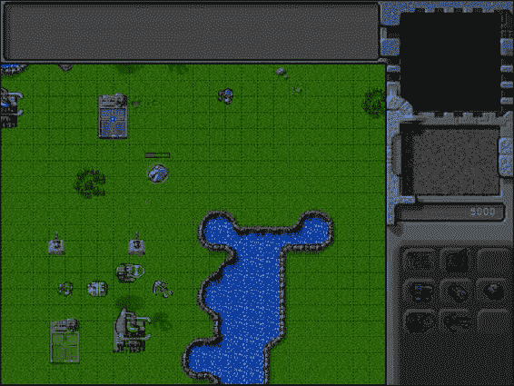
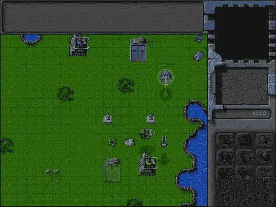
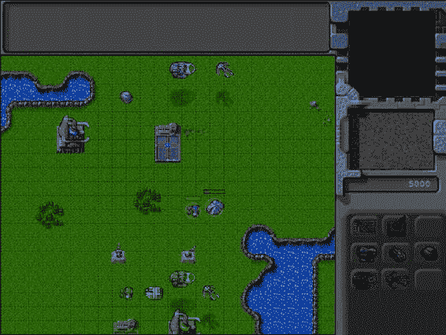
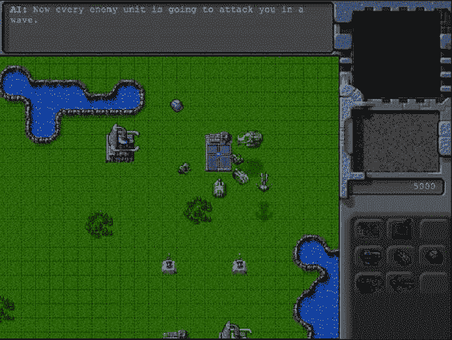
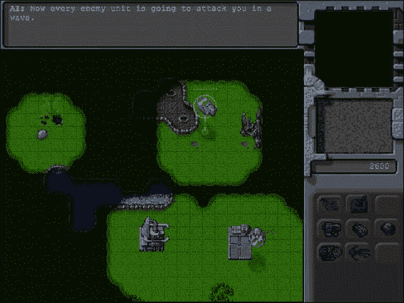
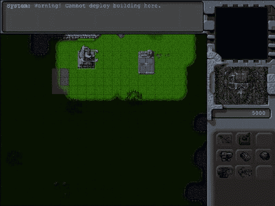

# 九、添加武器和战役

在过去的几章中，我们建立了游戏的基本框架；增加了车辆、飞机和建筑物等实体；执行单位移动；并使用侧边栏创建了一个简单的经济。我们现在有一个游戏，我们可以开始水平，赚钱，购买建筑物和单位，并移动这些单位来实现简单的目标。

在这一章中，我们将实现车辆、飞机和炮塔的武器。我们将增加处理基于战斗的命令的能力，例如攻击、守卫、巡逻和狩猎，让单位以智能的方式战斗。最后，我们将实现一个限制地图可见性的战争迷雾，允许有趣的策略，如偷袭和伏击。

我们开始吧。我们将使用第八章中的代码作为起点。

实现战斗系统

我们的游戏将有一个相当简单的战斗系统。所有单位和炮塔都有自己的武器和子弹类型。当攻击敌人时，单位将首先进入射程，转向目标，然后向他们发射子弹。一旦单位发射了一颗子弹，它会等到它的武器重新加载后再发射。

子弹本身会是一个独立的游戏实体，有自己的动画逻辑。发射时，子弹会飞向目标，一旦到达目的地就会爆炸。

我们要做的第一件事是给我们的游戏添加子弹。

添加项目符号

我们将从在 bullets.js 中定义一个新的 bullets 对象开始，如清单 9-1 所示。

***清单 9-1。*** 定义子弹对象(bullets.js)

```html
var bullets = {
    list:{
        "fireball":{
            name:"fireball",
            speed:60,
            reloadTime:30,
            range:8,
            damage:10,
            spriteImages:[
                {name:"fly",count:1,directions:8},
                {name:"explode",count:7}
            ],
        },
        "heatseeker":{
            name:"heatseeker",
            reloadTime:40,
            speed:25,
            range:9,
            damage:20,
            turnSpeed:2,
            spriteImages:[
                {name:"fly",count:1,directions:8},
                {name:"explode",count:7}
            ],
        },
        "cannon-ball":{
            name:"cannon-ball",
            reloadTime:40,
            speed:25,
            damage:10,
            range:6,
            spriteImages:[
                {name:"fly",count:1,directions:8},
                {name:"explode",count:7}
            ],
        },
        "bullet":{
            name:"bullet",
            damage:5,
            speed:50,
            range:5,
            reloadTime:20,
            spriteImages:[
                {name:"fly",count:1,directions:8},
                {name:"explode",count:3}
            ],
        },
    },
    defaults:{
        type:"bullets",
        distanceTravelled:0,
        animationIndex:0,
        direction:0,
        directions:8,
        pixelWidth:10,
        pixelHeight:11,
        pixelOffsetX:5,
        pixelOffsetY:5,
        radius:6,
        action:"fly",
        selected:false,
        selectable:false,
        orders:{type:"fire"},
        moveTo:function(destination){
            // Weapons like the heatseeker can turn slowly toward target while moving
            if (this.turnSpeed){
                // Find out where we need to turn to get to destination
                var newDirection = findFiringAngle(destination,this,this.directions);
                // Calculate difference between new direction and current direction
                var difference = angleDiff(this.direction,newDirection,this.directions);
                // Calculate amount that bullet can turn per animation cycle
                var turnAmount = this.turnSpeed*game.turnSpeedAdjustmentFactor;
                if (Math.abs(difference)>turnAmount){
                    this.direction = wrapDirection(this.direction+turnAmount*Math.abs(difference)/difference,this.directions);
                }
            }

            var movement = this.speed*game.speedAdjustmentFactor;
            this.distanceTravelled += movement;

            var angleRadians = −((this.direction)/this.directions)*2*Math.PI ;

            this.lastMovementX = − (movement*Math.sin(angleRadians));
            this.lastMovementY = − (movement*Math.cos(angleRadians));
            this.x = (this.x +this.lastMovementX);
            this.y = (this.y +this.lastMovementY);
        },
        reachedTarget:function(){
            var item = this.target;
            if (item.type=="buildings"){
                return (item.x<= this.x && item.x >= this.x - item.baseWidth/game.gridSize &&
item.y<= this.y && item.y >= this.y - item.baseHeight/game.gridSize);
            } else if (item.type=="aircraft"){
                return (Math.pow(item.x-this.x,2)+Math.pow(item.y-(this.y+item.pixelShadowHeight/
game.gridSize),2) < Math.pow((item.radius)/game.gridSize,2));
           } else {
                   return (Math.pow(item.x-this.x,2)+Math.pow(item.y-this.y,2) < Math.pow((item.radius)/game.gridSize,2));
           }
        },
        processOrders:function(){
            this.lastMovementX = 0;
            this.lastMovementY = 0;
            switch (this.orders.type){
                case "fire":
                    // Move toward destination and stop when close by or if travelled past range
                    var reachedTarget = false;
                    if (this.distanceTravelled>this.range
                        || (reachedTarget = this.reachedTarget())) {
                        if(reachedTarget){
                            this.target.life -= this.damage;
                            this.orders = {type:"explode"};
                            this.action = "explode";
                            this.animationIndex = 0;
                        } else {
                            // Bullet fizzles out without hitting target
                            game.remove(this);
                        }
                    } else {
                        this.moveTo(this.target);
                    }
                    break;
            }
        },
        animate:function(){
            switch (this.action){
                case "fly":
                    var direction = wrapDirection(Math.round(this.direction),this.directions);
                     this.imageList = this.spriteArray["fly-"+ direction];
                    this.imageOffset = this.imageList.offset;
                    break;
                case "explode":
                    this.imageList = this.spriteArray["explode"];
                    this.imageOffset = this.imageList.offset + this.animationIndex;
                    this.animationIndex++;
                    if (this.animationIndex>=this.imageList.count){
                        // Bullet explodes completely and then disappears
                        game.remove(this);
                    }
                    break;
            }
        },
        draw:function(){
            var x = (this.x*game.gridSize)-game.offsetX-this.pixelOffsetX + this.lastMovementX*game.drawingInterpolationFactor*game.gridSize;
            var y = (this.y*game.gridSize)-game.offsetY-this.pixelOffsetY + this.lastMovementY*game.drawingInterpolationFactor*game.gridSize;
            var colorOffset = 0;
            game.foregroundContext.drawImage(this.spriteSheet, this.imageOffset*this.pixelWidth,
colorOffset, this.pixelWidth,this.pixelHeight, x,y,this.pixelWidth,this.pixelHeight);
        }
    },
    load:loadItem,
    add:addItem,
}
```

子弹对象遵循与所有其他游戏实体相同的模式。我们从定义四种子弹类型开始:火球、热探测器、炮弹和子弹。每个项目符号都有一组共同的属性。

*   速度:子弹行进的速度
*   reloadTime:在子弹再次发射之前，发射后动画循环的次数
*   伤害:子弹爆炸时对目标造成的伤害
*   射程:子弹失去动量前的最大飞行距离

项目符号还定义了两个动画序列:飞行和爆炸。飞行状态有八个方向，类似于车辆和飞机。分解状态只有方向，但有多个帧。

然后我们定义一个默认的 moveTo()方法，它类似于 aircraft moveTo()方法。在这个方法中，我们首先检查子弹是否可以转动，如果可以，使用 findFiringAngle()方法计算子弹朝向目标中心的角度，轻轻地将子弹转向目标。接下来，我们沿着当前方向向前移动项目符号，并更新项目符号的 distanceTravelled 属性。

接下来我们定义一个 reachedTarget()方法来检查子弹是否已经到达目标。我们检查子弹的坐标是否在建筑物的基准区域内，是否在车辆和飞机的项目半径内。如果是这样，我们返回 true 值。

在 processOrders()方法中，我们实现了 fire order。我们检查子弹是否到达了目标或者超出了射程。如果没有，我们继续将子弹移向目标。

如果子弹超出射程而没有击中目标，我们将它从游戏中移除。如果子弹到达目标，我们首先将子弹的顺序和动画状态设置为爆炸，并按伤害量减少其目标的生命。

在 animate()方法中，一旦分解动画序列完成，我们就移除子弹。

现在我们已经定义了 bullets 对象，我们将在 index.html 的部分添加对 bullets.js 的引用，如清单 9-2 所示。

***清单 9-2。*** 【添加对项目符号对象的引用】(index.html)

```html
<script src="js/bullets.js" type="text/javascript" charset="utf-8"></script>
```

我们还将在 common.js 中定义 findFiringAngle()方法，如清单 9-3 所示。

***清单 9-3。*** 定义 findFiringAngle()方法(common.js)

```html
function findFiringAngle(target,source,directions){
    var dy = (target.y) - (source.y);
    var dx = (target.x) - (source.x);

    if(target.type=="buildings"){
        dy += target.baseWidth/2/game.gridSize;
        dx += target.baseHeight/2/game.gridSize;
    } else if(target.type == "aircraft"){
        dy -= target.pixelShadowHeight/game.gridSize;
    }

     if(source.type=="buildings"){
        dy -= source.baseWidth/2/game.gridSize;
        dx -= source.baseHeight/2/game.gridSize;
    } else if(source.type == "aircraft"){
        dy += source.pixelShadowHeight/game.gridSize;
    }

    //Convert Arctan to value between (0 – 7)
    var angle = wrapDirection(directions/2-(Math.atan2(dx,dy)*directions/(2*Math.PI)),directions);
    return angle;
}
```

findFiringAngle()方法类似于 findAngle()方法，除了我们调整 dy 和 dx 变量的值以指向源和目标的中心。对于建筑物，我们使用 baseWidth 和 baseHeight 属性调整 dx 和 dy，对于飞机，我们通过 pixelShadowHeight 属性调整 dy。这样子弹就可以瞄准目标的中心。

我们还将修改 common.js 中的 loadItem()方法，以便在项目加载时加载项目符号，如清单 9-4 所示。

***清单 9-4。*** 加载物品时加载子弹(common.js)

```html
/* The default load() method used by all our game entities*/
function loadItem(name){
    var item = this.list[name];
    // if the item sprite array has already been loaded then no need to do it again
    if(item.spriteArray){
        return;
    }
    item.spriteSheet = loader.loadImage('img/'+this.defaults.type+'/'+name+'.png');
    item.spriteArray = [];
    item.spriteCount = 0;

    for (var i=0; i < item.spriteImages.length; i++){
        var constructImageCount = item.spriteImages[i].count;
        var constructDirectionCount = item.spriteImages[i].directions;
        if (constructDirectionCount){
            for (var j=0; j < constructDirectionCount; j++) {
                var constructImageName = item.spriteImages[i].name +"-"+j;
                item.spriteArray[constructImageName] = {
                    name:constructImageName,
                    count:constructImageCount,
                    offset:item.spriteCount
                };
                item.spriteCount += constructImageCount;
            };
        } else {
            var constructImageName = item.spriteImages[i].name;
            item.spriteArray[constructImageName] = {
                name:constructImageName,
                count:constructImageCount,
                offset:item.spriteCount
            };
            item.spriteCount += constructImageCount;
        }
    };
    // Load the weapon if item has one
    if(item.weaponType){
        bullets.load(item.weaponType);
    }
}
```

当加载一个项目时，我们检查它是否定义了 weaponType 属性，如果是，使用 bullets.load()方法加载武器的项目符号。所有有攻击能力的实体都有一个武器类型属性。

我们要做的下一个改变是修改游戏对象的 drawingLoop()方法，以在游戏中所有其他项目的顶部绘制子弹和爆炸。更新后的 drawingLoop()方法将类似于清单 9-5 中的。

***清单 9-5。*** 修改 drawingLoop()在其他项目上方绘制项目符号(game.js)

```html
drawingLoop:function(){
    // Handle Panning the Map
    game.handlePanning();

    // Check the time since the game was animated and calculate a linear interpolation factor (−1 to 0)
    // since drawing will happen more often than animation
    game.lastDrawTime = (new Date()).getTime();
    if (game.lastAnimationTime){
        game.drawingInterpolationFactor = (game.lastDrawTime -game.lastAnimationTime)/game.animationTimeout - 1;
        if (game.drawingInterpolationFactor>0){ // No point interpolating beyond the next animation loop...
            game.drawingInterpolationFactor = 0;
        }
    } else {
        game.drawingInterpolationFactor = −1;
    }
    // Since drawing the background map is a fairly large operation,
    // we only redraw the background if it changes (due to panning)
    if (game.refreshBackground){
        game.backgroundContext.drawImage(game.currentMapImage,game.offsetX,game.offsetY, game.canvasWidth, game.canvasHeight, 0,0,game.canvasWidth,game.canvasHeight);
        game.refreshBackground = false;
    }

    // Clear the foreground canvas
    game.foregroundContext.clearRect(0,0,game.canvasWidth,game.canvasHeight);

    // Start drawing the foreground elements
    for (var i = game.sortedItems.length - 1; i >= 0; i--){
        if (game.sortedItems[i].type != "bullets"){
            game.sortedItems[i].draw();
        }
    };

    // Draw the bullets on top of all the other elements
    for (var i = game.bullets.length - 1; i >= 0; i--){
        game.bullets[i].draw();
    };

    // Draw the mouse
    mouse.draw()

    // Call the drawing loop for the next frame using request animation frame
    if (game.running){
        requestAnimationFrame(game.drawingLoop);
    }
},
```

我们先画出所有不是子弹的项目，最后画出子弹。这样，子弹和爆炸在游戏中总是清晰可见的。

最后，我们将修改游戏对象的 resetArrays()方法来重置 game.bullets[]数组，如清单 9-6 所示。

***清单 9-6。*** 重置 resetArrays()(game.js)内的子弹数组

```html
resetArrays:function(){
    game.counter = 1;
    game.items = [];
    game.sortedItems = [];
    game.buildings = [];
    game.vehicles = [];
    game.aircraft = [];
    game.terrain = [];
    game.triggeredEvents = [];
    game.selectedItems = [];
    game.sortedItems = [];
    game.bullets = [];
},
```

现在我们已经实现了子弹对象，是时候为炮塔、车辆和飞机实现基于战斗的命令了。

基于战斗的炮塔订单

地面炮塔可以向任何地面威胁发射炮弹。当处于守卫或攻击模式时，他们将搜索视线内的有效目标，将炮塔对准目标，并发射子弹，直到目标被摧毁或超出射程。

我们将通过修改 buildings.js 中的地面炮塔对象来实现 processOrders()方法，如清单 9-7 所示。

***清单 9-7。*** 修改地堡对象实现攻击(buildings.js)

```html
isValidTarget:isValidTarget,
findTargetsInSight:findTargetsInSight,
processOrders:function(){
    if(this.reloadTimeLeft){
        this.reloadTimeLeft--;
    }
    // damaged turret cannot attack
    if(this.lifeCode != "healthy"){
        return;
    }
    switch (this.orders.type){
        case "guard":
            var targets = this.findTargetsInSight();
            if(targets.length>0){
                this.orders = {type:"attack",to:targets[0]};
            }
            break;
        case "attack":
            if(!this.orders.to ||
                this.orders.to.lifeCode == "dead" ||
                !this.isValidTarget(this.orders.to) ||
                (Math.pow(this.orders.to.x-this.x,2) + Math.pow(this.orders.to.y-this.y,2))>Math.pow(this.sight,2)
                ){

                var targets = this.findTargetsInSight();
                if(targets.length>0){
                    this.orders.to = targets[0];
                } else {
                    this.orders = {type:"guard"};
                }
            }

            if (this.orders.to){
                var newDirection = findFiringAngle(this.orders.to,this,this.directions);
                var difference = angleDiff(this.direction,newDirection,this.directions);
                var turnAmount = this.turnSpeed*game.turnSpeedAdjustmentFactor;
                if (Math.abs(difference)>turnAmount){
                    this.direction = wrapDirection(this.direction+turnAmount*Math.abs(difference)/difference,this.directions);
                    return;
                } else {
                    this.direction = newDirection;
                    if(!this.reloadTimeLeft){
                        this.reloadTimeLeft = bullets.list[this.weaponType].reloadTime;
                        var angleRadians = −(Math.round(this.direction)/this.directions)*2*Math.PI ;
                        var bulletX = this.x+0.5- (1*Math.sin(angleRadians));
                        var bulletY = this.y+0.5- (1*Math.cos(angleRadians));
                        var bullet = game.add({name:this.weaponType,type:"bullets", x:bulletX,
y:bulletY, direction:this.direction, target:this.orders.to});
                    }
                }
            }
            break;
    }
}
```

我们首先在地面炮塔对象内部分配两个名为 isValidTarget()和 findTargetInSight()的方法。我们需要定义这些方法。然后我们定义 processOrders()方法。

在 processOrders()方法中，如果 reloadTimeLeft 属性已定义并且大于 0，我们将减小该属性的值。如果转台生命码不健康(它已损坏或失效)，我们什么也不做并退出。

接下来，我们定义守卫命令和攻击命令的行为。在守卫模式下，我们使用 findTargetsInSight()方法来查找目标，如果找到了，就攻击它。在攻击模式下，如果炮塔的当前目标是未定义的、死亡的或看不见的，我们使用 findTargetsInSight()找到新的有效目标，并设置攻击它的顺序。如果我们找不到一个有效的目标，我们回到守卫模式。

如果炮塔有一个有效的目标，我们把它转向目标。一旦炮塔面向目标并且 reloadTimeLeft 为 0，我们通过使用 game.add()方法将子弹添加到游戏中来发射子弹，并将炮塔的 reloadTimeLeft 属性重置为子弹的重新加载时间。

接下来，我们将修改默认 animate()方法中的守卫动画案例来处理方向，如清单 9-8 所示。

***清单 9-8。*** 修改内护箱 animate() (buildings.js)

```html
case "guard":
    if (this.lifeCode == "damaged"){
        // The damaged turret has no directions
        this.imageList = this.spriteArray[this.lifeCode];
    } else {
        // The healthy turret has 8 directions
        var direction = wrapDirection(Math.round(this.direction),this.directions);
        this.imageList = this.spriteArray[this.lifeCode+"-"+ direction];
    }
    this.imageOffset = this.imageList.offset;
    break;
```

接下来，我们将在 common.js 中添加两个名为 isValidTarget()和 findTargetInSight()的方法，如清单 9-9 所示。

***清单 9-9。*** 添加 isValidTarget()和 findTargetInSight()方法(common.js)

```html
// Common Functions related to combat
function isValidTarget(item){
    return item.team != this.team &&
(this.canAttackLand && (item.type == "buildings" || item.type == "vehicles")||
(this.canAttackAir && (item.type == "aircraft")));
}

function findTargetsInSight(increment){
    if(!increment){
        increment=0;
    }
    var targets = [];
    for (var i = game.items.length - 1; i >= 0; i--){
        var item = game.items[i];
        if (this.isValidTarget(item)){
            if(Math.pow(item.x-this.x,2) + Math.pow(item.y-this.y,2)<Math.pow(this.sight+increment,2)){
                targets.push(item);
            }
        }
    };

    // Sort targets based on distance from attacker
    var attacker = this;
    targets.sort(function(a,b){
        return (Math.pow(a.x-attacker.x,2) + Math.pow(a.y-attacker.y,2))-(Math.pow(b.x-attacker.x,2) + Math.pow(b.y-attacker.y,2));
       });

    return targets;
}
```

isValidTarget()方法如果目标物品来自对方队伍，则返回 true，可以攻击。

findTargetsInSight()方法检查 game.items()数组中的所有项目，查看它们是否是有效的目标并在范围内，如果是，它将它们添加到 targets 数组中。然后，它根据每个目标与攻击者的距离对目标数组进行排序。该方法还接受一个可选的 increment 参数，该参数允许我们找到超出项目范围的目标。这两种常用的方法将被炮塔、车辆和飞机使用。

在我们看到代码的结果之前，我们将通过修改触发器和项目数组从最后一级更新我们的映射，如清单 9-10 所示。

***清单 9-10。*** 更新地图条目和触发器(maps.js)

```html
/* Entities to be added */
"items":[
    {"type":"buildings","name":"base","x":11,"y":14,"team":"blue"},
    {"type":"buildings","name":"starport","x":18,"y":14,"team":"blue"},

    {"type":"vehicles","name":"harvester","x":16,"y":12,"team":"blue","direction":3},
    {"type":"terrain","name":"oilfield","x":3,"y":5,"action":"hint"},

    {"type":"terrain","name":"bigrocks","x":19,"y":6},
    {"type":"terrain","name":"smallrocks","x":8,"y":3},

    {"type":"vehicles","name":"scout-tank","x":26,"y":14,"team":"blue","direction":4},
    {"type":"vehicles","name":"heavy-tank","x":26,"y":16,"team":"blue","direction":5},
    {"type":"aircraft","name":"chopper","x":20,"y":12,"team":"blue","direction":2},
    {"type":"aircraft","name":"wraith","x":23,"y":12,"team":"blue","direction":3},

    {"type":"buildings","name":"ground-turret","x":15,"y":23,"team":"green"},
    {"type":"buildings","name":"ground-turret","x":20,"y":23,"team":"green"},

    {"type":"vehicles","name":"scout-tank","x":16,"y":26,"team":"green","direction":4},
    {"type":"vehicles","name":"heavy-tank","x":18,"y":26,"team":"green","direction":6},
    {"type":"aircraft","name":"chopper","x":20,"y":27,"team":"green","direction":2},
    {"type":"aircraft","name":"wraith","x":22,"y":28,"team":"green","direction":3},

    {"type":"buildings","name":"base","x":19,"y":28,"team":"green"},
    {"type":"buildings","name":"starport","x":15,"y":28,"team":"green"},
],

/* Conditional and Timed Trigger Events */
"triggers":[
],
```

我们移除了在上一章中定义的触发器，因此关卡不会在 30 秒后结束。现在，如果我们在浏览器中运行游戏，移动一辆车辆靠近敌人的炮塔，炮塔应该会开始攻击车辆，如图图 9-1 所示。



图 9-1。炮塔向射程内的车辆开火

子弹击中车辆时会爆炸，缩短车辆寿命。一旦车辆失去所有生命，它就会从游戏中消失。如果目标超出射程，炮塔停止向目标射击，并移动到下一个目标。

接下来，我们将实现基于战斗的飞机订单。

基于战斗的飞机订单

我们将为飞机定义几个基本的基于战斗的命令状态。

*   攻击:在目标范围内移动并射击它。
*   漂浮:呆在一个地方，攻击任何靠近的敌人。
*   守卫:跟随一个友军单位，向任何靠近的敌人射击。
*   狩猎:积极寻找地图上任何地方的敌人并攻击他们。
*   巡逻:在两点之间移动，向任何进入射程的敌人射击。
*   哨兵:呆在一个地方，比在漂浮模式下攻击敌人更有侵略性。

我们将通过修改 aircraft 对象中默认的 processOrders()方法来实现这些状态，如清单 9-11 中的所示。

***清单 9-11。*** 对战机实现战斗命令(aircraft.js)

```html
isValidTarget:isValidTarget,
findTargetsInSight:findTargetsInSight,
processOrders:function(){
    this.lastMovementX = 0;
    this.lastMovementY = 0;
    if(this.reloadTimeLeft){
        this.reloadTimeLeft--;
    }
    switch (this.orders.type){
        case "float":
            var targets = this.findTargetsInSight();
            if(targets.length>0){
                this.orders = {type:"attack",to:targets[0]};
            }
            break;
        case "sentry":
            var targets = this.findTargetsInSight(2);
            if(targets.length>0){
                this.orders = {type:"attack",to:targets[0],nextOrder:this.orders};
            }
            break;
        case "hunt":
            var targets = this.findTargetsInSight(100);
            if(targets.length>0){
                this.orders = {type:"attack",to:targets[0],nextOrder:this.orders};
            }
            break;
        case "move":
            // Move toward destination until distance from destination is less than aircraft radius
            var distanceFromDestinationSquared = (Math.pow(this.orders.to.x-this.x,2) + Math.pow(this.orders.to.y-this.y,2));
            if (distanceFromDestinationSquared < Math.pow(this.radius/game.gridSize,2)) {
                this.orders = {type:"float"};
            } else {
                this.moveTo(this.orders.to);
            }
            break;
        case "attack":
            if(this.orders.to.lifeCode == "dead" || !this.isValidTarget(this.orders.to)){
                if (this.orders.nextOrder){
                    this.orders = this.orders.nextOrder;
                } else {
                    this.orders = {type:"float"};
                }
                return;
            }
            if ((Math.pow(this.orders.to.x-this.x,2) + Math.pow(this.orders.to.y-this.y,2))<Math.pow(this.sight,2)) {
                //Turn toward target and then start attacking when within range of the target
                var newDirection = findFiringAngle(this.orders.to,this,this.directions);
                var difference = angleDiff(this.direction,newDirection,this.directions);
                var turnAmount = this.turnSpeed*game.turnSpeedAdjustmentFactor;
                if (Math.abs(difference)>turnAmount){
                    this.direction = wrapDirection(this.direction+ turnAmount*Math.abs(difference)/difference, this.directions);
                    return;
                } else {
                    this.direction = newDirection;
                    if(!this.reloadTimeLeft){
                        this.reloadTimeLeft = bullets.list[this.weaponType].reloadTime;
                        var angleRadians = −(Math.round(this.direction)/this.directions)*2*Math.PI ;
                        var bulletX = this.x- (this.radius*Math.sin(angleRadians)/game.gridSize);
                        var bulletY = this.y- (this.radius*Math.cos(angleRadians)/game.gridSize)-this.pixelShadowHeight/game.gridSize;
                        var bullet = game.add({name:this.weaponType, type:"bullets",x:bulletX, y:bulletY, direction:newDirection, target:this.orders.to});
                    }
                }

            } else {
                var moving = this.moveTo(this.orders.to);
            }
            break;
        case "patrol":
            var targets = this.findTargetsInSight(1);
            if(targets.length>0){
                this.orders = {type:"attack",to:targets[0],nextOrder:this.orders};
                return;
            }
            if ((Math.pow(this.orders.to.x-this.x,2) + Math.pow(this.orders.to.y-this.y,2))<Math.pow(this.radius/game.gridSize,2)) {
                var to = this.orders.to;
                this.orders.to = this.orders.from;
                this.orders.from = to;
            } else {
                this.moveTo(this.orders.to);
            }
            break;
        case "guard":
            if(this.orders.to.lifeCode == "dead"){
                if (this.orders.nextOrder){
                    this.orders = this.orders.nextOrder;
                } else {
                    this.orders = {type:"float"};
                }
                return;
            }
            if ((Math.pow(this.orders.to.x-this.x,2) + Math.pow(this.orders.to.y-this.y,2))<Math.pow(this.sight-2,2)) {
                var targets = this.findTargetsInSight(1);
                if(targets.length>0){
                    this.orders = {type:"attack",to:targets[0],nextOrder:this.orders};
                    return;
                }
            } else {
                this.moveTo(this.orders.to);
            }
            break;

    }
},
```

我们首先分配 isValidTarget()和 findTargetInSight()方法。然后，我们定义 processOrders()方法中的所有状态。

在 processOrders()方法中，我们减少了 reloadTimeLeft 属性的值，就像我们对炮塔所做的那样。然后，我们为每个订单状态定义案例。

如果订单类型是 float，我们使用 findTargetsInSight()来检查目标是否在附近，如果是，就攻击它。当订单类型是 sentry 时，我们做同样的事情，除了我们传递一个范围增量参数 2，以便飞机攻击稍微超出其典型范围的单位。

除了范围增量参数为 100 之外,寻线情况非常相似，这应该理想地覆盖整个地图。这意味着飞机将攻击地图上的任何敌人单位或车辆，从最近的开始。

对于攻击情况，我们首先检查目标是否还活着。如果没有，我们要么将 orders 设置为 orders.nextOrder(如果它已定义),要么返回浮点模式。

接下来我们检查目标是否在射程内，如果不在，我们就向目标靠近。接下来，我们确保飞机指向目标。最后，我们等到 reloadTimeLeft 变量为 0，然后向目标射出一颗子弹。

巡逻案件是移动和岗哨案件的结合。我们将飞机移动到 to 属性中定义的位置，一旦飞机到达该位置，就掉头向 from 位置移动。如果目标进入射程，我们将下一个攻击顺序设置为当前顺序。这样，如果飞机在巡逻时看到敌人，它会先攻击敌人，然后在敌人被消灭后再回去巡逻。

最后，在守卫模式下，我们将飞机移动到它所守卫的单位的视线范围内，并攻击任何靠近的敌人。

如果你运行我们到目前为止的代码，你应该可以看到不同的飞机互相攻击，如图图 9-2 所示。



图 9-2。互相攻击的飞机

选择飞机后右击鼠标可以命令飞机攻击敌人或守卫朋友。直升机可以攻击地面和空中单位，而幽灵只能攻击空中单位。

我们通常会使用哨兵，猎人和巡逻的命令来给电脑人工智能一点优势，并使游戏对玩家更具挑战性。玩家将无法访问这些订单。


接下来，我们将实现基于战斗的车辆订单。

基于战斗的车辆订单

车辆的基于战斗的命令状态将非常类似于飞机的命令状态。

*   攻击:在目标范围内移动并射击它。
*   站立:呆在一个地方，攻击任何靠近的敌人。
*   守卫:跟随一个友军单位，向任何靠近的敌人射击。
*   狩猎:积极寻找地图上任何地方的敌人并攻击他们。
*   巡逻:在两点之间移动，向任何进入射程的敌人射击。
*   哨兵:呆在一个地方，比站着的时候攻击敌人更有侵略性。

我们将通过修改 vehicles 对象中默认的 processOrders()方法来实现这些状态，如清单 9-12 所示。

***清单 9-12。*** 执行战斗命令的车辆(vehicles.js)

```html
isValidTarget:isValidTarget,
findTargetsInSight:findTargetsInSight,
processOrders:function(){
    this.lastMovementX = 0;
    this.lastMovementY = 0;
    if(this.reloadTimeLeft){
        this.reloadTimeLeft--;
    }
    var target;
    switch (this.orders.type){
        case "move":
            // Move toward destination until distance from destination is less than vehicle radius
            var distanceFromDestinationSquared = (Math.pow(this.orders.to.x-this.x,2) + Math.pow(this.orders.to.y-this.y,2));
            if (distanceFromDestinationSquared < Math.pow(this.radius/game.gridSize,2)) {
                //Stop when within one radius of the destination
                this.orders = {type:"stand"};
                return;
            } else if (distanceFromDestinationSquared <Math.pow(this.radius*3/game.gridSize,2)) {
                //Stop when within 3 radius of the destination if colliding with something
                this.orders = {type:"stand"};
                return;
            } else {
                if (this.colliding && (Math.pow(this.orders.to.x-this.x,2) + Math.pow(this.orders.to.y-this.y,2))<Math.pow(this.radius*5/game.gridSize,2)) {
                    // Count collsions within 5 radius distance of goal
                    if (!this.orders.collisionCount){
                        this.orders.collisionCount = 1
                    } else {
                        this.orders.collisionCount ++;
                    }
                    // Stop if more than 30 collisions occur
                    if (this.orders.collisionCount > 30) {
                        this.orders = {type:"stand"};
                        return;
                    }
                }
                var moving = this.moveTo(this.orders.to);
                // Pathfinding couldn't find a path so stop
                if(!moving){
                    this.orders = {type:"stand"};
                    return;
                }
            }
            break;
        case "deploy":
            // If oilfield has been used already, then cancel order
            if(this.orders.to.lifeCode == "dead"){
                this.orders = {type:"stand"};
                return;
            }
            // Move to middle of oil field
            var target = {x:this.orders.to.x+1,y:this.orders.to.y+0.5,type:"terrain"};
            var distanceFromTargetSquared = (Math.pow(target.x-this.x,2) + Math.pow(target.y-this.y,2));
            if (distanceFromTargetSquared<Math.pow(this.radius*2/game.gridSize,2)) {
                // After reaching oil field, turn harvester to point toward left (direction 6)
                var difference = angleDiff(this.direction,6,this.directions);
                var turnAmount = this.turnSpeed*game.turnSpeedAdjustmentFactor;
                if (Math.abs(difference)>turnAmount){
                    this.direction = wrapDirection(this.direction+turnAmount*Math.abs(difference)/difference,this.directions);
                } else {
                    // Once it is pointing to the left, remove the harvester and oil field and deploy a harvester building
                    game.remove(this.orders.to);
                    this.orders.to.lifeCode="dead";
                    game.remove(this);
                    this.lifeCode="dead";
                    game.add({type:"buildings", name:"harvester", x:this.orders.to.x, y:this.orders.to.y, action:"deploy", team:this.team});
                }
            } else {
                var moving = this.moveTo(target);
                // Pathfinding couldn't find a path so stop
                if(!moving){
                    this.orders = {type:"stand"};
                }
            }
            break;
        case "stand":
            var targets = this.findTargetsInSight();
            if(targets.length>0){
                this.orders = {type:"attack",to:targets[0]};
            }
            break;
        case "sentry":
            var targets = this.findTargetsInSight(2);
            if(targets.length>0){
                this.orders = {type:"attack",to:targets[0],nextOrder:this.orders};
            }
            break;
        case "hunt":
            var targets = this.findTargetsInSight(100);
            if(targets.length>0){
                this.orders = {type:"attack",to:targets[0],nextOrder:this.orders};
            }
            break;
        case "attack":
            if(this.orders.to.lifeCode == "dead" || !this.isValidTarget(this.orders.to)){
                if (this.orders.nextOrder){
                    this.orders = this.orders.nextOrder;
                } else {
                    this.orders = {type:"stand"};
                }
                return;
            }
            if ((Math.pow(this.orders.to.x-this.x,2) + Math.pow(this.orders.to.y-this.y,2))<Math.pow(this.sight,2)) {
                //Turn toward target and then start attacking when within range of the target
                var newDirection = findFiringAngle(this.orders.to,this,this.directions);
                var difference = angleDiff(this.direction,newDirection,this.directions);
                var turnAmount = this.turnSpeed*game.turnSpeedAdjustmentFactor;
                if (Math.abs(difference)>turnAmount){
                    this.direction = wrapDirection(this.direction + turnAmount*Math.abs(difference)/difference, this.directions);
                    return;
                } else {
                    this.direction = newDirection;
                    if(!this.reloadTimeLeft){
                        this.reloadTimeLeft = bullets.list[this.weaponType].reloadTime;
                        var angleRadians = −(Math.round(this.direction)/this.directions)*2*Math.PI ;
                        var bulletX = this.x- (this.radius*Math.sin(angleRadians)/game.gridSize);
                        var bulletY = this.y- (this.radius*Math.cos(angleRadians)/game.gridSize);
                        var bullet = game.add({name:this.weaponType,type:"bullets",x:bulletX,y:bulletY, direction:newDirection, target:this.orders.to});
                    }
                }
            } else {
                var moving = this.moveTo(this.orders.to);
                // Pathfinding couldn't find a path so stop
                if(!moving){
                    this.orders = {type:"stand"};
                    return;
                }
            }
            break;
        case "patrol":
            var targets = this.findTargetsInSight(1);
            if(targets.length>0){
                this.orders = {type:"attack",to:targets[0],nextOrder:this.orders};
                return;
            }
            if ((Math.pow(this.orders.to.x-this.x,2) + Math.pow(this.orders.to.y-this.y,2))<Math.pow(this.radius*4/game.gridSize,2)) {
                var to = this.orders.to;
                this.orders.to = this.orders.from;
                this.orders.from = to;
            } else {
                this.moveTo(this.orders.to);
            }
            break;
        case "guard":
            if(this.orders.to.lifeCode == "dead"){
                if (this.orders.nextOrder){
                    this.orders = this.orders.nextOrder;
                } else {
                    this.orders = {type:"stand"};
                }
                return;
            }
            if ((Math.pow(this.orders.to.x-this.x,2) + Math.pow(this.orders.to.y-this.y,2))<Math.pow(this.sight-2,2)) {
                var targets = this.findTargetsInSight(1);
                if(targets.length>0){
                    this.orders = {type:"attack",to:targets[0],nextOrder:this.orders};
                    return;
                }
            } else {
                this.moveTo(this.orders.to);
            }
            break;
    }
},
```

状态的实现几乎与飞机相同。如果我们现在运行代码，我们应该能够攻击车辆，如图 9-3 所示。



图 9-3。用车辆攻击

我们现在可以用车辆、飞机或炮塔攻击。

你可能已经注意到，当你靠近时，对方的单位会攻击，但他们仍然很容易被击败。现在战斗系统已经就位，我们将探索如何让敌人变得更聪明，让游戏更有挑战性。

构建智能敌人

建造智能敌人 AI 的主要目标是确保玩游戏的人发现它相当具有挑战性，并且有完成关卡的乐趣。关于 RTS 游戏，尤其是单人战役，需要意识到的一个重要的事情是，敌人 AI 不需要是特级大师级别的棋手。事实是，我们可以只使用战斗命令状态和条件脚本事件的组合来为玩家提供非常引人注目的体验。

通常，人工智能的“智能”行为方式会随着每个等级的不同而不同。

在一个简单的关卡中，没有生产设施，只有地面单位，唯一可能的行为就是开到敌人单位前并攻击他们。巡逻和哨兵命令的结合通常足以达到这个目的。我们也可以通过在特定时间或特定事件发生时(例如，当玩家到达特定地点或建造特定建筑时)攻击玩家来增加关卡的趣味性。

在一个更复杂的层面上，我们可以通过使用定时触发和狩猎命令，在特定的时间间隔内制造和派出一波又一波的敌人来挑战敌人。

我们可以通过在地图上添加更多的项目和触发器来看到这些想法在起作用，如清单 9-13 中的所示。

***清单 9-13。*** 增加触发器和物品使关卡更具挑战性(maps.js)

```html
/* Entities to be added */
"items":[
    {"type":"buildings","name":"base","x":11,"y":14,"team":"blue"},
    {"type":"buildings","name":"starport","x":18,"y":14,"team":"blue"},

    {"type":"vehicles","name":"harvester","x":16,"y":12,"team":"blue","direction":3},
    {"type":"terrain","name":"oilfield","x":3,"y":5,"action":"hint"},

    {"type":"terrain","name":"bigrocks","x":19,"y":6},
    {"type":"terrain","name":"smallrocks","x":8,"y":3},

    {"type":"vehicles","name":"scout-tank","x":26,"y":14,"team":"blue","direction":4},
    {"type":"vehicles","name":"heavy-tank","x":26,"y":16,"team":"blue","direction":5},
    {"type":"aircraft","name":"chopper","x":20,"y":12,"team":"blue","direction":2},
    {"type":"aircraft","name":"wraith","x":23,"y":12,"team":"blue","direction":3},

    {"type":"buildings","name":"ground-turret","x":15,"y":23,"team":"green"},
    {"type":"buildings","name":"ground-turret","x":20,"y":23,"team":"green"},

    {"type":"vehicles","name":"scout-tank","x":16,"y":26,"team":"green","direction":4,"orders":{"type":"sentry"}},
    {"type":"vehicles","name":"heavy-tank","x":18,"y":26,"team":"green","direction":6,"orders":{"type":"sentry"}},
    {"type":"aircraft","name":"chopper","x":20,"y":27,"team":"green","direction":2,"orders":{"type":"hunt"}},
    {"type":"aircraft","name":"wraith","x":22,"y":28,"team":"green","direction":3,"orders":{"type":"hunt"}},

    {"type":"buildings","name":"base","x":19,"y":28,"team":"green"},
    {"type":"buildings","name":"starport","x":15,"y":28,"team":"green","uid":-1},
],

/* Economy Related*/
"cash":{
    "blue":5000,
    "green":5000
},

/* Conditional and Timed Trigger Events */
"triggers":[
/* Timed Events*/
    {"type":"timed","time":1000,
        "action":function(){
            game.sendCommand([−1],{type:"construct-unit",details:{type:"aircraft",name:"wraith",orders:
{"type":"patrol","from":{"x":22,"y":30},"to":{"x":15,"y":21}}}});
        }
    },
    {"type":"timed","time":5000,
        "action":function(){
            game.sendCommand([−1],{type:"construct-unit", details:{type:"aircraft",name:"chopper",
orders:{"type":"patrol","from":{"x":15,"y":30},"to":{"x":22,"y":21}}}});
        }
    },
    {"type":"timed","time":10000,
        "action":function(){
            game.sendCommand([−1],{type:"construct-unit",details:{type:"vehicles",name:"heavy-tank",
orders:{"type":"patrol","from":{"x":15,"y":30},"to":{"x":22,"y":21}}}});
        }
    },
    {"type":"timed","time":15000,
        "action":function(){
            game.sendCommand([−1],{type:"construct-unit",details:{type:"vehicles",name:"scout-tank",
orders:{"type":"patrol","from":{"x":22,"y":30},"to":{"x":15,"y":21}}}});
        }
    },
    {"type":"timed","time":60000,
        "action":function(){
            game.showMessage("AI","Now every enemy unit is going to attack you in a wave.");
            var units = [];
            for (var i=0; i < game.items.length; i++) {
                var item = game.items[i];
                if (item.team == "green" && (item.type == "vehicles"|| item.type == "aircraft")){
                    units.push(item.uid);
                }
            };
            game.sendCommand(units,{type:"hunt"});
        }
    },
],
```

我们做的第一件事是在游戏开始时命令敌人的直升机和幽灵去打猎。接下来，我们分配一个 UID 1 给敌人的星港，并设置一些定时触发器来每隔几秒建造不同类型的巡逻单位。

最后，60 秒后，我们命令所有敌方单位进行狩猎，并使用 showMessage()方法通知玩家。

如果我们现在运行代码，我们可以预期人工智能会很好地保护自己，并在 60 秒结束时非常积极地攻击，如图 9-4 所示。



图 9-4。电脑 AI 大举进攻玩家

显然，这是一个相当做作的例子。没有人会想玩一个游戏，在玩的第一分钟就被如此残忍地攻击。然而，正如这个例子所说明的，我们可以通过调整这些触发器和顺序来使游戏变得简单或具有挑战性。

 **提示**你可以根据难度设置实现不同的触发器和起始物品，这样玩家就可以根据所选的设置玩同一战役的简单版本或挑战版本。

现在我们已经实现了战斗系统，并探索了使游戏 AI 具有挑战性的方法，我们在这一章最后要看的是加入战争迷雾。

增加了战争的迷雾

战争之雾通常是一层黑色的裹尸布，覆盖了地图上所有未被探索的区域。当玩家单位在地图上移动时，单位可以看到的任何地方的雾都会被清除。

这为游戏引入了探索和阴谋的元素。隐藏在雾中的能力允许使用诸如隐藏基地、伏击和偷袭等策略。

有些 RTS 游戏会在探索某个区域后永久清除雾气，而其他游戏则只会清除玩家单位视线范围内的雾气，并在玩家单位离开该区域后将雾气带回来。对于我们的游戏，我们将使用第二个实现。

定义雾对象

我们将从在 fog.js 中定义一个新的 fog 对象开始，如清单 9-14 所示。

***清单 9-14。*** 实现雾对象(fog.js)

```html
var fog = {
    grid:[],
    canvas:document.createElement('canvas'),
    initLevel:function(){
        // Set fog canvas to the size of the map
        this.canvas.width = game.currentLevel.mapGridWidth*game.gridSize;
        this.canvas.height = game.currentLevel.mapGridHeight*game.gridSize;

        this.context = this.canvas.getContext('2d');

        // Set the fog grid for the player to array with all values set to 1
        this.defaultFogGrid = [];
        for (var i=0; i < game.currentLevel.mapGridHeight; i++) {
           this.defaultFogGrid[i] = [];
           for (var j=0; j < game.currentLevel.mapGridWidth; j++) {
               this.defaultFogGrid[i][j] = 1;
           };
        };

    },
    isPointOverFog:function(x,y){
        // If the point is outside the map bounds consider it fogged
        if(y<0 || y/game.gridSize >= game.currentLevel.mapGridHeight || x<0 || x/game.gridSize >= game.currentLevel.mapGridWidth ){
            return true;
           }
        // If not, return value based on the player's fog grid
        return this.grid[game.team][Math.floor(y/game.gridSize)][Math.floor(x/game.gridSize)] == 1;
    },
    animate:function(){
        // Fill fog with semi solid black color over the map
        this.context.drawImage(game.currentMapImage,0,0)
        this.context.fillStyle = 'rgba(0,0,0,0.8)';
        this.context.fillRect(0,0,this.canvas.width,this.canvas.height);

        // Initialize the players fog grid
        this.grid[game.team] = $.extend(true,[],this.defaultFogGrid);

        // Clear all areas of the fog where a player item has vision
        fog.context.globalCompositeOperation = "destination-out";
        for (var i = game.items.length - 1; i >= 0; i--){
            var item = game.items[i];
            var team = game.team;
                if (item.team == team && !item.keepFogged){
                    var x = Math.floor(item.x );
                    var y = Math.floor(item.y );
                      var x0 = Math.max(0,x-item.sight+1);
                      var y0 = Math.max(0,y-item.sight+1);
                      var x1 = Math.min(game.currentLevel.mapGridWidth-1, x+item.sight-1+ (item.type=="buildings"?item.baseWidth/game.gridSize:0));
                      var y1 = Math.min(game.currentLevel.mapGridHeight-1, y+item.sight-1+ (item.type=="buildings"?item.baseHeight/game.gridSize:0));
                    for (var j=x0; j <= x1; j++) {
                        for (var k=y0; k <= y1; k++) {
                            if ((j>x0 && j<x1) || (k>y0 && k<y1)){
                                if(this.grid[team][k][j]){
                                    this.context.fillStyle = 'rgba(100,0,0,0.9)';
                                    this.context.beginPath();
                                    this.context.arc(j*game.gridSize+12, k*game.gridSize+12, 16, 0, 2*Math.PI, false);
                                    this.context.fill();
                                    this.context.fillStyle = 'rgba(100,0,0,0.7)';
                                    this.context.beginPath();
                                    this.context.arc(j*game.gridSize+12, k*game.gridSize+12,18, 0, 2*Math.PI, false);
                                    this.context.fill();

                                    this.context.fillStyle = 'rgba(100,0,0,0.5)';
                                    this.context.beginPath();
                                    this.context.arc(j*game.gridSize+12, k*game.gridSize+12, 24, 0, 2*Math.PI, false);
                                    this.context.fill();

                                }
                                this.grid[team][k][j] = 0;
                          }
                     };
                 };
             }
        };
        fog.context.globalCompositeOperation = "source-over";
    },
    draw:function(){
        game.foregroundContext.drawImage(this.canvas,game.offsetX, game.offsetY, game.canvasWidth, game.canvasHeight, 0,0,game.canvasWidth,game.canvasHeight);
    }
}
```

我们首先在雾对象中定义一个画布。initLevel()方法将 canvas 对象的大小调整为当前地图的大小，并定义一个 fogGrid 数组，该数组与所有元素都设置为 1 的地图具有相同的维度。

在 animate()方法中，我们首先用半透明的黑色图层将雾初始化为地图背景。这样，地图上模糊的区域会显示为变暗的背景地形。

然后，我们遍历游戏中的每个物品，并根据玩家物品的视线属性清除其周围的雾数组和雾画布。我们不会为敌对玩家的物品或 keepFogged 属性设置为 true 的物品清除迷雾。

最后，draw()方法使用我们在 game.backgroundContext 上下文上绘制地图时使用的相同偏移量，在 game.foregroundContext 上下文上绘制雾画布。

拨开迷雾

现在我们已经定义了 fog 对象，我们将开始在 index.html 的 head 部分添加一个对 fog.js 的引用，如清单 9-15 所示。

***清单 9-15。*** 【添加引用到雾对象(index.html)

```html
<script src="js/fog.js" type="text/javascript" charset="utf-8"></script>
```

接下来，我们需要在关卡加载后初始化雾。我们将通过调用 singleplayer 对象的 play()方法中的 fog.initLevel()方法来实现这一点，如清单 9-16 所示。

***清单 9-16。*** 为关卡初始化雾对象(singleplayer.js)

```html
play:function(){
    fog.initLevel();
    game.animationLoop();
    game.animationInterval = setInterval(game.animationLoop,game.animationTimeout);
    game.start();
},
```

接下来我们需要修改游戏对象的 animationLoop()和 drawingLoop()方法，分别调用 fog.animate()和 fog.draw()，如清单 9-17 所示。

***清单 9-17。*** 调用 fog.animate()和 fog.draw() (game.js)

```html
animationLoop:function(){
    // Animate the Sidebar
    sidebar.animate();

    // Process orders for any item that handles it
    for (var i = game.items.length - 1; i >= 0; i--){
        if(game.items[i].processOrders){
            game.items[i].processOrders();
        }
    };

    // Animate each of the elements within the game
    for (var i = game.items.length - 1; i >= 0; i--){
        game.items[i].animate();
    };

    // Sort game items into a sortedItems array based on their x,y coordinates
    game.sortedItems = $.extend([],game.items);
    game.sortedItems.sort(function(a,b){
        return b.y-a.y + ((b.y==a.y)?(a.x-b.x):0);
    });

    fog.animate();

    game.lastAnimationTime = (new Date()).getTime();
},
drawingLoop:function(){
    // Handle Panning the Map
    game.handlePanning();

    // Check the time since the game was animated and calculate a linear interpolation factor (−1 to 0)
    // since drawing will happen more often than animation
    game.lastDrawTime = (new Date()).getTime();
       if (game.lastAnimationTime){
           game.drawingInterpolationFactor = (game.lastDrawTime-game.lastAnimationTime)/game.animationTimeout - 1;
           if (game.drawingInterpolationFactor>0){ // No point interpolating beyond the next animation loop...
               game.drawingInterpolationFactor = 0;
           }
       } else {
        game.drawingInterpolationFactor = −1;

    }

    // Since drawing the background map is a fairly large operation,
    // we only redraw the background if it changes (due to panning)
    if (game.refreshBackground){
        game.backgroundContext.drawImage(game.currentMapImage,game.offsetX, game.offsetY, game.canvasWidth, game.canvasHeight, 0,0,game.canvasWidth,game.canvasHeight);
        game.refreshBackground = false;
    }

    // Clear the foreground canvas
    game.foregroundContext.clearRect(0,0,game.canvasWidth,game.canvasHeight);

    // Start drawing the foreground elements
    for (var i = game.sortedItems.length - 1; i >= 0; i--){
        if (game.sortedItems[i].type != "bullets"){
            game.sortedItems[i].draw();
        }
    };

    // Draw the bullets on top of all the other elements
    for (var i = game.bullets.length - 1; i >= 0; i--){
        game.bullets[i].draw();
    };

    fog.draw();

    // Draw the mouse
    mouse.draw()

    // Call the drawing loop for the next frame using request animation frame
    if (game.running){
        requestAnimationFrame(game.drawingLoop);
    }
},
```

如果我们现在运行代码，我们应该会看到整个地图笼罩在战争的迷雾中，如图图 9-5 所示。



图 9-5。笼罩在战争迷雾中的地图

你会看到友方单位和建筑周围的雾气被揭开了。此外，雾区显示原始地形，但不显示其下的任何单位。

当我们不知道对方军队的规模和位置时，同样的敌人攻击会令人感到更加恐怖。在我们结束这一章之前，我们将做一些补充，从使模糊的区域不可建造开始。

使得有雾的区域不可建造

我们要做的第一个改变是通过使雾区不可建造来防止在雾区部署建筑。我们将修改侧边栏对象的 animate()方法，如清单 9-18 所示。

***清单 9-18。*** 使模糊区域不可构建(sidebar.js)

```html
animate:function(){
    // Display the current cash balance value
    $('#cash').html(game.cash[game.team]);

    //  Enable or disable buttons as appropriate
    this.enableSidebarButtons();

    if (game.deployBuilding){
        // Create the buildable grid to see where building can be placed
        game.rebuildBuildableGrid();
        // Compare with buildable grid to see where we need to place the building
        var placementGrid = buildings.list[game.deployBuilding].buildableGrid;
        game.placementGrid = $.extend(true,[],placementGrid);
        game.canDeployBuilding = true;
        for (var i = game.placementGrid.length - 1; i >= 0; i--){
            for (var j = game.placementGrid[i].length - 1; j >= 0; j--){
                if(game.placementGrid[i][j] &&
                    (mouse.gridY+i>= game.currentLevel.mapGridHeight || mouse.gridX+j>= game.currentLevel.mapGridWidth
                        || game.currentMapBuildableGrid[mouse.gridY+i][mouse.gridX+j]==1 || fog.grid[game.team][mouse.gridY+i][mouse.gridX+j]==1 )){
                    game.canDeployBuilding = false;
                    game.placementGrid[i][j] = 0;
                }
            };
        };
    }
},
```

在创建 placementGrid 数组时，我们添加了一个额外的条件来测试雾化网格，这样就不能再构建雾化的网格方块了。如果我们运行游戏并试图在一个有雾的区域建造，我们应该会看到一个警告，如图 9-6 所示。



图 9-6。不能在有雾的地区部署建筑

正如你所看到的，建筑部署网格在有雾的区域变成红色，表示玩家不能在那里建筑。如果你仍然试图点击一个模糊的区域，你会得到一个系统警告。

接下来，我们将确保玩家不能选择或探测到在雾中的建筑或单位。我们通过修改鼠标对象的 pointUnderFog()方法来做到这一点，如清单 9-19 所示。

***清单 9-19。*** 【雾下藏物】(mouse.js)

```html
itemUnderMouse:function(){
    if(fog.isPointOverFog(mouse.gameX,mouse.gameY)){
        return;
    }
    for (var i = game.items.length - 1; i >= 0; i--){
        var item = game.items[i];
        if (item.type=="buildings" || item.type=="terrain"){
            if(item.lifeCode != "dead"
                && item.x<= (mouse.gameX)/game.gridSize
                && item.x >= (mouse.gameX - item.baseWidth)/game.gridSize
                && item.y<= mouse.gameY/game.gridSize
                && item.y >= (mouse.gameY - item.baseHeight)/game.gridSize
                ){
                    return item;
            }
        } else if (item.type=="aircraft"){
            if (item.lifeCode != "dead" &&
                Math.pow(item.x-mouse.gameX/game.gridSize,2)+Math.pow(item.y-(mouse.gameY+item.pixelShadowHeight)/game.gridSize,2) < Math.pow((item.radius)/game.gridSize,2)){
                return item;
            }
       }else {
            if (item.lifeCode != "dead" && Math.pow(item.x-mouse.gameX/game.gridSize,2) + Math.pow(item.y-mouse.gameY/game.gridSize,2) < Math.pow((item.radius)/game.gridSize,2)){
                return item;
            }
        }
    }
},
```

我们检查鼠标下的点是否模糊，如果是，不返回任何东西。随着这最后的改变，我们现在在游戏中有一个工作的战争迷雾。

摘要

在这一章中，我们为我们的游戏实现了一个战斗系统。我们从用不同类型的项目符号定义一个项目符号对象开始。然后，我们在炮塔、飞机和车辆上添加了几个基于战斗的订单状态。我们使用这些命令和上一章定义的触发系统来创造一个相当有挑战性的敌人。最后，我们实现了战争迷雾。

我们的游戏现在拥有了 RTS 的大部分基本元素。在下一章，我们将通过添加声音来完善我们的游戏框架。然后，我们将使用这个框架来构建一些有趣的关卡，并结束我们的单人战役。