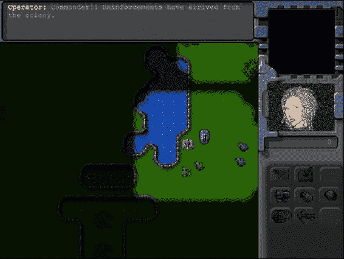

# 十、完成单人战役

我们的游戏框架现在几乎拥有了构建一个非常好的单人战役所需的一切:关卡系统，各种单位和建筑，使用寻路的智能移动，经济，最后是战斗。

现在是时候添加最后的润色，结束我们的单人战役了。我们将首先在游戏中加入爆炸和声音等音效。然后，我们将通过组合和使用我们在过去几章中开发的各种元素来构建几个级别。你会看到这些积木是如何组合成一个完整的游戏的。

我们开始吧。我们将从第九章结束时我们停止的地方继续。

添加声音

RTS 游戏比其他类型的游戏有更多的事情同时发生，比如我们在前几章开发的物理游戏。如果我们不小心，有可能用如此多的音频输入淹没玩家，以至于它成为一种干扰，并从他们的沉浸感中带走。对于我们的游戏来说，我们将专注于让玩家意识到游戏中重要事件的声音。

*   *确认命令*:任何时候玩家选择一个单位并给它一个命令，我们都会让这个单位确认它收到了命令。
*   *消息*:每当玩家收到系统警告或故事线驱动的通知时，我们会用声音提醒玩家。
*   战斗:我们将在战斗中添加声音，这样玩家就能立即知道他们在地图上的某个地方受到了攻击。

设置声音

我们将从在 sounds.js 中创建一个 sounds 对象开始，如清单 10-1 所示。

***清单 10-1。*** 创建一个声音对象(sounds.js)

```html
var sounds = {
    list:{
        "bullet":["bullet1","bullet2"],
        "heatseeker":["heatseeker1","heatseeker2"],
        "fireball":["laser1","laser2"],
        "cannon-ball":["cannon1","cannon2"],
        "message-received":["message"],
        "acknowledge-attacking":["engaging"],
        "acknowledge-moving":["yup","roger1","roger2"],
    },
    loaded:{},
    init: function(){
        for(var soundName in this.list){
            var sound = {};
            sound.audioObjects = [];
            for (var i=0; i < this.list[soundName].length; i++) {
                sound.audioObjects.push(loader.loadSound('audio/' + this.list[soundName][i]));
            };
            this.loaded [soundName] = sound;
        }
    },
    play:function(soundName){
        var sound = sounds.loaded[soundName];
        if(sound && sound.audioObjects && sound.audioObjects.length>0){
            if(!sound.counter || sound.counter>= sound.audioObjects.length){
                sound.counter = 0;
            }
            var audioObject = sound.audioObjects[sound.counter];
            sound.counter++;
            audioObject.play();
        }
    }
};
```

在 sound 对象中，我们首先声明一个列表，它将一个声音名称映射到一个或多个声音文件。例如，项目符号声音映射到两个文件:项目符号 1 和项目符号 2。您会注意到我们没有指定文件扩展名(。ogg 或. mp3)。我们让 loader 对象为浏览器选择合适的音频文件扩展名。

接下来，我们声明一个 init()方法，它遍历声音列表，使用 loader.loadSound()方法加载每个音频文件，然后为每个声音名称创建一个 audioObjects 数组。然后，我们将这个声音对象添加到加载的对象中。

最后，我们声明一个 play()方法，它从加载的数组中查找合适的声音对象，然后使用 play()方法播放音频对象。您会注意到，我们为每个声音对象使用了一个计数器，以确保我们遍历给定声音名称的声音，以便每次调用 play()时播放不同的声音。这使得我们可以为一个事件播放不同版本的声音，而不是每次都听到相同的单调声音。

接下来，我们将在 index.html 的部分添加对 sounds.js 的引用，如清单 10-2 所示。

***清单 10-2。*** 泛指 sounds . js(index.html)

```html
<script src="js/sounds.js" type="text/javascript" charset="utf-8"></script>
```

最后，我们将在游戏初始化时加载所有这些声音，方法是从游戏对象的 init()方法内部调用 init()方法，如清单 10-3 所示。

***清单 10-3。*** 初始化 game.init()方法(game.js)内部的 sounds 对象

```html
init:function(){
    loader.init();
    mouse.init();
    sidebar.init();
    sounds.init();

    $('.gamelayer').hide();
    $('#gamestartscreen').show();

    game.backgroundCanvas = document.getElementById('gamebackgroundcanvas');
    game.backgroundContext = game.backgroundCanvas.getContext('2d');

    game.foregroundCanvas = document.getElementById('gameforegroundcanvas');
    game.foregroundContext = game.foregroundCanvas.getContext('2d');

    game.canvasWidth = game.backgroundCanvas.width;
    game.canvasHeight = game.backgroundCanvas.height;
},
```

现在 sounds 对象已经就绪，我们可以开始为每个事件添加声音，从确认命令开始。

确认命令

我们允许玩家给单位几种类型的命令:攻击，移动，部署和守卫。每当一个单位被发送攻击命令，我们将播放确认攻击的声音。当单位被发送任何其他命令，如移动或守卫，我们将播放确认移动的声音。

我们将通过从鼠标对象的 click()方法内部调用 sounds.play()来实现，如清单 10-4 所示。

***清单 10-4。*** 确认 click()方法(mouse.js)内的命令

```html
click:function(ev,rightClick){
    // Player clicked inside the canvas
    var clickedItem = this.itemUnderMouse();
    var shiftPressed = ev.shiftKey;

    if (!rightClick){ // Player left clicked
        // If the game is in deployBuilding mode, left clicking will deploy the building
        if (game.deployBuilding){
            if(game.canDeployBuilding){
                sidebar.finishDeployingBuilding();
            } else {
                game.showMessage("system","Warning! Cannot deploy building here.");
            }
            return;
        }
        if (clickedItem){
            // Pressing shift adds to existing selection. If shift is not pressed, clear existing selection
            if(!shiftPressed){
                game.clearSelection();
            }
            game.selectItem(clickedItem,shiftPressed);
        }
    } else { // Player right clicked
        // If the game is in deployBuilding mode, right clicking will cancel deployBuilding mode
        if (game.deployBuilding){
            sidebar.cancelDeployingBuilding();
            return;
        }
        // Handle actions like attacking and movement of selected units
        var uids = [];
        if (clickedItem){ // Player right clicked on something
            if (clickedItem.type != "terrain"){
                if (clickedItem.team != game.team){ // Player right clicked on an enemy item
                    // identify selected items from players team that can attack
                    for (var i = game.selectedItems.length - 1; i >= 0; i--){
                        var item = game.selectedItems[i];
                        if(item.team == game.team && item.canAttack){
                            uids.push(item.uid);
                        }
                    };
                    // then command them to attack the clicked item
                    if (uids.length>0){
                        game.sendCommand(uids,{type:"attack", toUid:clickedItem.uid});
                        sounds.play("acknowledge-attacking");
                    }
                } else  { // Player right clicked on a friendly item
                    //identify selected items from players team that can move
                    for (var i = game.selectedItems.length - 1; i >= 0; i--){
                        var item = game.selectedItems[i];
                        if(item.team == game.team && (item.type == "vehicles" || item.type == "aircraft")){
                            uids.push(item.uid);
                        }
                    };
                    // then command them to guard the clicked item
                    if (uids.length>0){
                        game.sendCommand(uids,{type:"guard", toUid:clickedItem.uid});
                        sounds.play("acknowledge-moving");
                    }
                }
            } else if (clickedItem.name == "oilfield"){ // Player right clicked on an oilfield
                // identify the first selected harvester from players team (since only one can deploy at a time)
                for (var i = game.selectedItems.length - 1; i >= 0; i--){
                    var item = game.selectedItems[i];
                    // pick the first selected harvester since only one can deploy at a time
                    if(item.team == game.team && (item.type == "vehicles" && item.name == "harvester")){
                        uids.push(item.uid);
                        break;
                    }
                };
                // then command it to deploy on the oilfield
                if (uids.length>0){
                    game.sendCommand(uids,{type:"deploy", toUid:clickedItem.uid});
                    sounds.play("acknowledge-moving");
                }
            }
        } else { // Player right clicked on the ground
            //identify selected items from players team that can move
            for (var i = game.selectedItems.length - 1; i >= 0; i--){
                var item = game.selectedItems[i];
                if(item.team == game.team && (item.type == "vehicles" || item.type == "aircraft")){
                    uids.push(item.uid);
                }
            };
            // then command them to move to the clicked location
            if (uids.length>0){
                game.sendCommand(uids,{type:"move", to:{x:mouse.gameX/game.gridSize, y:mouse.gameY/game.gridSize}});
                sounds.play("acknowledge-moving");
            }
        }
    }
},
```

每当我们发送一个游戏命令时，我们用适当的声音名称调用 sounds.play()方法。

需要指出的一个有趣的事情是，我们是在命令发出的时候播放声音，而不是在命令被接收和处理的时候。虽然这在单人战役中影响很小，但在多人游戏中却很重要。

通常，网络延迟和其他问题会导致在发送命令和所有玩家实际收到命令之间有长达几百毫秒的延迟。通过在点击鼠标时立即播放声音，我们给玩家一种命令已经被立即执行的错觉，并使滞后的影响不那么明显。

 **注意**一些游戏除了声音之外还使用动画序列来向玩家表明该单元正在处理命令。像第一人称射击游戏这样的游戏经常试图预测单位的移动，并在收到服务器确认之前开始移动单位。

如果你现在打开并运行游戏，你应该会听到部队在开始移动或攻击前确认命令。接下来，让我们添加消息声音。

信息

每当玩家看到一条消息时，我们会播放一个简短的哔哔声来通知他们。我们将从游戏对象的 showMessage()方法中播放消息接收的声音，如清单 10-5 所示。

***清单 10-5。*** 消息通知声音里面的 showMessage()方法(game.js)

```html
showMessage:function(from,message){
    sounds.play('message-received');
    var character = game.characters[from];
    if (character){
        from = character.name;
        if (character.image){
            $('#callerpicture').html('');
            // hide the profile picture after six seconds
            setTimeout(function(){
                $('#callerpicture').html("");
            },6000)
        }
    }
    // Append message to messages pane and scroll to the bottom
    var existingMessage = $('#gamemessages').html();
    var newMessage = existingMessage+'<span>'+from+': </span>'+message+'<br>';
    $('#gamemessages').html(newMessage);
    $('#gamemessages').animate( {scrollTop:$('#gamemessages').prop('scrollHeight')});
},
```

如果你现在玩游戏，每当显示新消息时，你应该会听到哔哔声。

我们将实现的最后一组声音是用于战斗的。

战斗

您可能已经注意到，我们在声音列表中声明了四种不同的声音类型:子弹、热探测器、炮弹和火球。这四种声音对应于我们在前一章中声明的四种子弹类型。每当我们发射子弹时，我们都会播放相应子弹的声音。

我们可以通过修改 game.js 中的 add()方法很容易地做到这一点，每当添加一个项目符号时就播放适当的声音，如清单 10-6 所示。

***清单 10-6。*** 加子弹时播放声音(game.js)

```html
add:function(itemDetails) {
    // Set a unique id for the item
    if (!itemDetails.uid){
        itemDetails.uid = game.counter++;
    }

    var item = window[itemDetails.type].add(itemDetails);

    // Add the item to the items array
    game.items.push(item);
    // Add the item to the type specific array
    game[item.type].push(item);

    if(item.type == "buildings" || item.type == "terrain"){
        game.currentMapPassableGrid = undefined;
    }

    if (item.type == "bullets"){
        sounds.play(item.name);
    }
    return item;
},
```

如果你现在玩这个游戏，你应该会听到不同武器发射时的不同声音。

如果我们愿意，我们可以不断地给游戏添加更多的声音，比如爆炸、建筑噪音、对话，甚至背景音乐。该过程将保持不变。然而，我们目前实现的声音已经足够了。

现在我们的游戏已经有声音了，是时候开始为我们的单人战役建立实际的关卡了。

构建单人战役

我们将在游戏战役中建立三个关卡。每一关都将越来越难，同时建立在前几关的基础上。这些关卡将展示你在 RTS 游戏中能找到的典型关卡类型。

救援队

在我们的游戏中，入门将是一个相对简单的任务，这样玩家就可以轻松地在地图上移动和攻击敌人的单位。

玩家需要在一张布满容易被击败的敌人的地图上导航，然后护送一队运输车辆回到玩家的出发地点。在任务简报之后，我们将使用由定时和条件触发器触发的角色对话来推进故事情节。

我们将从 maps.js 中一个全新的地图对象开始，如清单 10-7 所示。

***清单 10-7。*** 创建第一关(maps.js)

```html
var maps = {
    "singleplayer":[
        {
            "name":"Rescue",
            "briefing": "In the months since the great war, mankind has fallen into chaos. Billions are dead with cities in ruins.\nSmall groups of survivors band together to try and survive as best as they can.\nWe are trying to reach out to all the survivors in this sector before we join back with the main colony.",

            /* Map Details */
            "mapImage":"img/level-one.png",
            "startX":36,
            "startY":0,

            /* Map coordinates that are obstructed by terrain*/
            "mapGridWidth":60,
            "mapGridHeight":40,
            "mapObstructedTerrain":[
                [49,8], [50,8], [51,8], [51,9], [52,9], [53,9], [53,10], [53,11], [53,12], [53,13],
 [53,14], [53,15], [53,16], [52,16], [52,17], [52,18], [52,19], [51,19], [50,19], [50,18], [50,17],
 [49,17], [49,18], [48,18], [47,18], [47,17], [47,16], [48,16], [49,16], [49,15], [49,14], [48,14],
 [48,13], [48,12], [49,12], [49,11], [50,11], [50,10], [49,10], [49,9], [44,0], [45,0], [45,1],
 [45,2], [46,2], [47,2], [47,3], [48,3], [48,4], [48,5], [49,5], [49,6], [49,7], [50,7], [51,7],
 [51,6], [51,5], [51,4], [52,4], [53,4], [53,3], [54,3], [55,3], [55,2], [56,2], [56,1], [56,0],
 [55,0], [43,19], [44,19], [45,19], [46,19], [47,19], [48,19], [48,20], [48,21], [47,21], [46,21],
 [45,21], [44,21], [43,21], [43,20], [41,22], [42,22], [43,22], [44,22], [45,22], [46,22], [47,22],
 [48,22], [49,22], [50,22], [50,23], [50,24], [49,24], [48,24], [47,24], [47,25], [47,26], [47,27],
 [47,28], [47,29], [47,30], [46,30], [45,30], [44,30], [43,30], [43,29], [43,28], [43,27], [43,26],
 [43,25], [43,24], [42,24], [41,24], [41,23], [48,39], [49,39], [50,39], [51,39], [52,39], [53,39],
 [54,39], [55,39], [56,39], [57,39], [58,39], [59,39], [59,38], [59,37], [59,36], [59,35], [59,34],
 [59,33], [59,32], [59,31], [59,30], [59,29], [0,0], [1,0], [2,0], [1,1], [2,1], [10,3], [11,3],
 [12,3], [12,2], [13,2], [14,2], [14,3], [14,4], [15,4], [15,5], [15,6], [14,6], [13,6], [13,5],
 [12,5], [11,5], [10,5], [10,4], [3,9], [4,9], [5,9], [5,10], [6,10], [7,10], [8,10], [9,10], [9,11],
 [10,11], [11,11], [11,10], [12,10], [13,10], [13,11], [13,12], [12,12], [11,12], [10,12], [9,12],
 [8,12], [7,12], [7,13], [7,14], [6,14], [5,14], [5,13], [5,12], [5,11], [4,11], [3,11], [3,10],
 [33,33], [34,33], [35,33], [35,34], [35,35], [34,35], [33,35], [33,34], [27,39], [27,38], [27,37],
 [28,37], [28,36], [28,35], [28,34], [28,33], [28,32], [28,31], [28,30], [28,29], [29,29], [29,28],
 [29,27], [29,26], [29,25], [29,24], [29,23], [30,23], [31,23], [32,23], [32,22], [32,21], [31,21],
 [30,21], [30,22], [29,22], [28,22], [27,22], [26,22], [26,21], [25,21], [24,21], [24,22], [24,23],
 [25,23], [26,23], [26,24], [25,24], [25,25], [24,25], [24,26], [24,27], [25,27], [25,28], [25,29],
 [24,29], [23,29], [23,30], [23,31], [24,31], [25,31], [25,32], [25,33], [24,33], [23,33], [23,34],
 [23,35], [24,35], [24,36], [24,37], [23,37], [22,37], [22,38], [22,39], [23,39], [24,39], [25,39],
 [26,0], [26,1], [25,1], [25,2], [25,3], [26,3], [27,3], [27,2], [28,2], [29,2], [29,3], [30,3],
 [31,3], [31,2], [31,1], [32,1], [32,0], [33,0], [32,8], [33,8], [34,8], [34,9], [34,10], [33,10],
 [32,10], [32,9], [8,29], [9,29], [9,30], [17,32], [18,32], [19,32], [19,33], [18,33], [17,33],
 [18,34], [19,34], [3,27], [4,27], [4,26], [3,26], [2,26], [3,25], [4,25], [9,20], [10,20], [11,20],
 [11,21], [10,21], [10,19], [19,7], [15,7], [29,12], [30,13], [20,14], [21,14], [34,13], [35,13],
 [36,13], [36,14], [35,14], [34,14], [35,15], [36,15], [16,18], [17,18], [18,18], [16,19], [17,19],
 [18,19], [17,20], [18,20], [11,19], [58,0], [59,0], [58,1], [59,1], [59,2], [58,3], [59,3], [58,4],
 [59,4], [59,5], [58,6], [59,6], [58,7], [59,7], [59,8], [58,9], [59,9], [58,10], [59,10], [59,11],
 [52,6], [53,6], [54,6], [52,7], [53,7], [54,7], [53,8], [54,8], [44,17], [46,32], [55,32], [54,28],
 [26,34], [34,34], [4,10], [6,11], [6,12], [6,13], [7,11], [8,11], [12,11], [27,0], [27,1], [26,2],
 [28,1], [28,0], [29,0], [29,1], [30,2], [30,1], [30,0], [31,0], [33,9], [46,0], [47,0], [48,0],
 [49,0], [50,0], [51,0], [52,0], [53,0], [54,0], [55,1], [54,1], [53,1], [52,1], [51,1], [50,1],
 [49,1], [48,1], [47,1], [46,1], [48,2], [49,2], [50,2], [51,2], [52,2], [53,2], [54,2], [52,3],
 [51,3], [50,3], [49,3], [49,4], [50,4], [50,5], [50,6], [50,9], [51,10], [52,10], [51,11], [52,11],
 [50,12], [51,12], [52,12], [49,13], [50,13], [51,13], [52,13], [50,14], [51,14], [52,14], [50,15],
 [51,15], [52,15], [50,16], [51,16], [51,17], [48,17], [51,18], [44,20], [45,20], [46,20], [47,20],
 [42,23], [43,23], [44,23], [45,23], [46,23], [47,23], [48,23], [49,23], [44,24], [45,24], [46,24],
 [44,25], [45,25], [46,25], [44,26], [45,26], [46,26], [44,27], [45,27], [46,27], [44,28], [45,28],
 [46,28], [44,29], [45,29], [46,29], [11,4], [12,4], [13,4], [13,3], [14,5], [25,22], [31,22],
 [27,23], [28,23], [27,24], [28,24], [26,25], [27,25], [28,25], [25,26], [26,26], [27,26], [28,26],
 [26,27], [27,27], [28,27], [26,28], [27,28], [28,28], [26,29], [27,29], [24,30], [25,30], [26,30],
 [27,30], [26,31], [27,31], [26,32], [27,32], [26,33], [27,33], [24,34], [25,34], [27,34], [25,35],
 [26,35], [27,35], [25,36], [26,36], [27,36], [25,37], [26,37], [23,38], [24,38], [25,38], [26,38],
 [26,39], [2,25], [9,19], [36,31]
            ],

            /* Entities to be loaded */
            "requirements":{
                "buildings":["base"],
                "vehicles":["transport","scout-tank","heavy-tank"],
                "aircraft":[],
                "terrain":[]
            },

            /* Economy Related*/
            "cash":{
                "blue":0,
                "green":0
            },

            /* Entities to be added */
            "items":[
                /* Slightly damaged base */
                {"type":"buildings","name":"base","x":55,"y":6,"team":"blue","life":100},

                {"type":"vehicles","name":"heavy-tank","x":57,"y":12,"direction":4,"team":"blue","uid":-1},

                /* Two transport vehicles waiting just outside the visible map */
                {"type":"vehicles","name":"transport","x":-3,"y":2,"direction":2,"team":"blue","uid":-3,"selectable":false},
                {"type":"vehicles","name":"transport","x":-3,"y":4,"direction":2,"team":"blue","uid":-4,"selectable":false},

                /* Two damaged enemy scout-tanks patroling the area*/
                {"type":"vehicles","name":"scout-tank","x":40,"y":20,"direction":4,"team":"green","uid":-2,"life":20,"orders":{"type":"patrol","from":{"x":34,"y":20},"to":{"x":42,"y":25}}},
                {"type":"vehicles","name":"scout-tank","x":14,"y":0,"direction":4,"team":"green","uid":-5,"life":20,"orders":{"type":"patrol","from":{"x":14,"y":0},"to":{"x":14,"y":14}}},

            ],

            /* Conditional and Timed Trigger Events */
            "triggers":[
                {"type":"timed","time":3000,
                    "action":function(){
                        game.showMessage("op", "Commander!! We haven't heard from the last convoy in over two hours. They should have arrived by now.");
                    }
                },
                {"type":"timed","time":10000,
                    "action":function(){
                        game.showMessage("op", "They were last seen in the North West Sector. Could you investigate?");
                    }
                },
                {"type":"conditional",
                    "condition":function(){
                        return(isItemDead(−1)||isItemDead(−3)||isItemDead(−4));
                    },
                    "action":function(){
                        singleplayer.endLevel(false);
                    }
                },
            ],
        }
    ]
}
```

该级别的第一部分由我们在早期级别中看到的相同的基本元数据组成。我们从任务简报开始，它给玩家一点地图背景。然后，我们将地图图像设置为地图的最终版本，而不是我们迄今为止用来构建游戏的调试版本。我们还将地图起始位置设置为地图的右上角。最后，我们设置地图大小和 mapObstructedTerrain 属性。

接下来，我们在 requirements 数组中加载一些基本项目，并将两个玩家的起始现金余额设置为 0。

在关卡的物品阵列中，我们添加了一个受损的基地，一辆玩家控制的重型坦克，两辆巡逻该区域的敌方侦查坦克，以及两辆运输船。我们为它们中的每一个设置了 uid，这样我们就可以从触发器中引用它们。

因为这是第一关，我们设定了侦察兵坦克的寿命，这样玩家会发现摧毁它们很容易。运输工具被放置在稍微超出地图左上角边界的地方，这样玩家在适当的时候才能看到它们。

在触发器数组中，我们定义了前几个触发器。前两个定时触发器向玩家显示来自运营商的消息，要求他们找到失踪的运输工具。第三个是一个条件触发器，如果运输工具或者重型坦克被 isItemDead()方法摧毁，这个触发器就会以失败结束任务。

接下来，我们将在游戏对象中的角色对象中添加一些新角色，如清单 10-8 所示。

***清单 10-8。*** 添加新角色(game.js)

```html
characters: {
    "system":{
        "name":"System",
        "image":"img/system.png"
    },
    "op":{
        "name":"Operator",
        "image":"img/girl1.png"
    },
    "pilot":{
        "name":"Pilot",
        "image":"img/girl2.png"
    },
    "driver":{
        "name":"Driver",
        "image":"img/man1.png"
    }
},
```

 **注意**这些新的角色形象是知识共享——在[`opengameart.org`](http://opengameart.org)找到的授权作品。

我们还将在 common.js 中定义 isItemDead()方法，如清单 10-9 所示。

***清单 10-9。**isItemDead()方法(common.js)*

```html
function isItemDead(uid){
    var item = game.getItemByUid(uid);
    return (!item || item.lifeCode == "dead");
}
```

如果在 game.items 数组中找不到某个物品，或者该物品的 lifeCode 属性被设置为 dead，则认为该物品已经死亡。

如果你运行游戏到现在，你应该会看到操作者通过让你调查情况的方式给你第一个任务任务，如图图 10-1 所示。


图 10-1。第一次任务任务

你应该能够选择坦克并移动它，随着你探索地图，战争的迷雾慢慢散去。

现在，我们将通过在第一张地图上添加更多的触发器来引入敌人和车队，如清单 10-10 所示。

***清单 10-10。*** 介绍敌人和车队(maps.js)

```html
{"type":"conditional",
    "condition":function(){
        // Check if first enemy is dead
        return isItemDead(−2);
    },
    "action":function(){
        game.showMessage("op", "The rebels have been getting very aggressive lately. I hope the convoy is safe. Find them and escort them back to the base.");
    }
},
{"type":"conditional",
    "condition":function(){
        var hero = game.getItemByUid(−1);
        return(hero && hero.x<30 && hero.y<30);
    },
    "action":function(){
        game.showMessage("driver", "Can anyone hear us? Our convoy has been pinned down by rebel tanks. We need help.");
    }
},
```

在第一个条件触发中，我们显示了一条来自操作员的消息，讨论一旦第一辆敌方侦查坦克被摧毁后的叛军。在第二个条件触发器中，当我们进入地图的左上角时，我们显示来自车队司机的消息。

如果我们现在运行游戏，我们应该会看到操作员在与叛军的第一次战斗后催促我们快点，以及当我们接近车队位置时车队司机呼救，如图图 10-2 所示。


图 10-2。车队司机求助

最后，我们将添加几个触发器来实现营救车队和完成任务，如清单 10-11 所示。

***清单 10-11。*** 营救车队完成任务(maps.js)

```html
{"type":"conditional",
    "condition":function(){
        var hero = game.getItemByUid(−1);
        return(hero && hero.x<10 && hero.y<10);
    },
    "action":function(){
        var hero = game.getItemByUid(−1);
        game.showMessage("driver", "Thank you. We thought we would never get out of here alive.");
        game.sendCommand([−3,-4],{type:"guard",to:hero});
    }
},
{"type":"conditional",
    "condition":function(){
        var transport1 = game.getItemByUid(−3);
        var transport2 = game.getItemByUid(−4);
        return(transport1 && transport2 && transport1.x>52 && transport2.x>52 && transport2.y<18 && transport1.y<18);
    },
    "action":function(){
        singleplayer.endLevel(true);
    }
},
```

在第一个条件触发中，当英雄坦克到达地图的左上角时，我们显示了来自驾驶员的另一条消息。然后我们命令两艘运输舰守卫坦克，这意味着无论坦克去哪里，他们都会跟着它。

在第二个条件触发中，一旦两个运输机到达基地所在的地图右上角，我们就结束游戏。

如果你现在运行游戏，应该会看到车队司机感谢你救了车队，然后跟着你回基地，如图图 10-3 所示。


图 10-3。营救车队

回程应该是平安无事的，因为这一关的所有敌人都死了。一旦两艘运输舰到达基地，任务就结束了。你刚刚完成了单人战役中的第一个任务。

现在是时候进入下一关了，突击。

攻击

我们游戏中的第二关会比第一关更有挑战性。这一次我们将向玩家介绍微操单位来攻击敌人的想法，而不必担心管理资源或单位的生产。

玩家将获得源源不断的援军，他们需要用这些援军来定位并占领地图上的一个小型敌人基地。敌人的基地会不断派出攻击单位，使任务更具挑战性。

我们将在地图对象的单人游戏数组中创建一个新的关卡对象，如清单 10-12 所示。这个新的关卡会在第一次任务完成后自动加载。

***清单 10-12。*** 创建第二关(maps.js)

```html
{
    "name":"Assault",
    "briefing": "Thanks to the supplies from the convoy, we now have the base up and running.\n The rebels nearby are proving to be a problem. We need to take them out. \n First set up the base defences. Then find and destroy all rebels in the area.\n The colony will be sending us reinforcements to help us out.",

    /* Map Details */
    "mapImage":"img/level-one.png",
    "startX":36,
    "startY":0,

    /* Map coordinates that are obstructed by terrain*/
    "mapGridWidth":60,
    "mapGridHeight":40,
    "mapObstructedTerrain":[
        [49,8], [50,8], [51,8], [51,9], [52,9], [53,9], [53,10], [53,11], [53,12], [53,13],
 [53,14], [53,15], [53,16], [52,16], [52,17], [52,18], [52,19], [51,19], [50,19], [50,18], [50,17],
 [49,17], [49,18], [48,18], [47,18], [47,17], [47,16], [48,16], [49,16], [49,15], [49,14], [48,14],
 [48,13], [48,12], [49,12], [49,11], [50,11], [50,10], [49,10], [49,9], [44,0], [45,0], [45,1],
 [45,2], [46,2], [47,2], [47,3], [48,3], [48,4], [48,5], [49,5], [49,6], [49,7], [50,7], [51,7],
 [51,6], [51,5], [51,4], [52,4], [53,4], [53,3], [54,3], [55,3], [55,2], [56,2], [56,1], [56,0],
 [55,0], [43,19], [44,19], [45,19], [46,19], [47,19], [48,19], [48,20], [48,21], [47,21], [46,21],
 [45,21], [44,21], [43,21], [43,20], [41,22], [42,22], [43,22], [44,22], [45,22], [46,22], [47,22],
 [48,22], [49,22], [50,22], [50,23], [50,24], [49,24], [48,24], [47,24], [47,25], [47,26], [47,27],
 [47,28], [47,29], [47,30], [46,30], [45,30], [44,30], [43,30], [43,29], [43,28], [43,27], [43,26],
 [43,25], [43,24], [42,24], [41,24], [41,23], [48,39], [49,39], [50,39], [51,39], [52,39], [53,39],
 [54,39], [55,39], [56,39], [57,39], [58,39], [59,39], [59,38], [59,37], [59,36], [59,35], [59,34],
 [59,33], [59,32], [59,31], [59,30], [59,29], [0,0], [1,0], [2,0], [1,1], [2,1], [10,3], [11,3],
 [12,3], [12,2], [13,2], [14,2], [14,3], [14,4], [15,4], [15,5], [15,6], [14,6], [13,6], [13,5],
 [12,5], [11,5], [10,5], [10,4], [3,9], [4,9], [5,9], [5,10], [6,10], [7,10], [8,10], [9,10], [9,11],
 [10,11], [11,11], [11,10], [12,10], [13,10], [13,11], [13,12], [12,12], [11,12], [10,12], [9,12],
 [8,12], [7,12], [7,13], [7,14], [6,14], [5,14], [5,13], [5,12], [5,11], [4,11], [3,11], [3,10],
 [33,33], [34,33], [35,33], [35,34], [35,35], [34,35], [33,35], [33,34], [27,39], [27,38], [27,37],
 [28,37], [28,36], [28,35], [28,34], [28,33], [28,32], [28,31], [28,30], [28,29], [29,29], [29,28],
 [29,27], [29,26], [29,25], [29,24], [29,23], [30,23], [31,23], [32,23], [32,22], [32,21], [31,21],
 [30,21], [30,22], [29,22], [28,22], [27,22], [26,22], [26,21], [25,21], [24,21], [24,22], [24,23],
 [25,23], [26,23], [26,24], [25,24], [25,25], [24,25], [24,26], [24,27], [25,27], [25,28], [25,29],
 [24,29], [23,29], [23,30], [23,31], [24,31], [25,31], [25,32], [25,33], [24,33], [23,33], [23,34],
 [23,35], [24,35], [24,36], [24,37], [23,37], [22,37], [22,38], [22,39], [23,39], [24,39], [25,39],
 [26,0], [26,1], [25,1], [25,2], [25,3], [26,3], [27,3], [27,2], [28,2], [29,2], [29,3], [30,3],
 [31,3], [31,2], [31,1], [32,1], [32,0], [33,0], [32,8], [33,8], [34,8], [34,9], [34,10], [33,10],
 [32,10], [32,9], [8,29], [9,29], [9,30], [17,32], [18,32], [19,32], [19,33], [18,33], [17,33],
 [18,34], [19,34], [3,27], [4,27], [4,26], [3,26], [2,26], [3,25], [4,25], [9,20], [10,20], [11,20],
 [11,21], [10,21], [10,19], [19,7], [15,7], [29,12], [30,13], [20,14], [21,14], [34,13], [35,13],
 [36,13], [36,14], [35,14], [34,14], [35,15], [36,15], [16,18], [17,18], [18,18], [16,19], [17,19],
 [18,19], [17,20], [18,20], [11,19], [58,0], [59,0], [58,1], [59,1], [59,2], [58,3], [59,3], [58,4],
 [59,4], [59,5], [58,6], [59,6], [58,7], [59,7], [59,8], [58,9], [59,9], [58,10], [59,10], [59,11],
 [52,6], [53,6], [54,6], [52,7], [53,7], [54,7], [53,8], [54,8], [44,17], [46,32], [55,32], [54,28],
 [26,34], [34,34], [4,10], [6,11], [6,12], [6,13], [7,11], [8,11], [12,11], [27,0], [27,1], [26,2],
 [28,1], [28,0], [29,0], [29,1], [30,2], [30,1], [30,0], [31,0], [33,9], [46,0], [47,0], [48,0],
 [49,0], [50,0], [51,0], [52,0], [53,0], [54,0], [55,1], [54,1], [53,1], [52,1], [51,1], [50,1],
 [49,1], [48,1], [47,1], [46,1], [48,2], [49,2], [50,2], [51,2], [52,2], [53,2], [54,2], [52,3],
 [51,3], [50,3], [49,3], [49,4], [50,4], [50,5], [50,6], [50,9], [51,10], [52,10], [51,11], [52,11],
 [50,12], [51,12], [52,12], [49,13], [50,13], [51,13], [52,13], [50,14], [51,14], [52,14], [50,15],
 [51,15], [52,15], [50,16], [51,16], [51,17], [48,17], [51,18], [44,20], [45,20], [46,20], [47,20],
 [42,23], [43,23], [44,23], [45,23], [46,23], [47,23], [48,23], [49,23], [44,24], [45,24], [46,24],
 [44,25], [45,25], [46,25], [44,26], [45,26], [46,26], [44,27], [45,27], [46,27], [44,28], [45,28],
 [46,28], [44,29], [45,29], [46,29], [11,4], [12,4], [13,4], [13,3], [14,5], [25,22], [31,22]
, [27,23], [28,23], [27,24], [28,24], [26,25], [27,25], [28,25], [25,26], [26,26], [27,26], [28,26],
 [26,27], [27,27], [28,27], [26,28], [27,28], [28,28], [26,29], [27,29], [24,30], [25,30], [26,30],
 [27,30], [26,31], [27,31], [26,32], [27,32], [26,33], [27,33], [24,34], [25,34], [27,34], [25,35],
 [26,35], [27,35], [25,36], [26,36], [27,36], [25,37], [26,37], [23,38], [24,38], [25,38], [26,38],
 [26,39], [2,25], [9,19], [36,31]
    ],

    /* Entities to be loaded */
    "requirements":{
        "buildings":["base","ground-turret","starport","harvester"],
        "vehicles":["transport","scout-tank","heavy-tank"],
        "aircraft":["chopper"],
        "terrain":[]
    },

    /* Economy Related*/
    "cash":{
        "blue":0,
        "green":0
    },

    /* Entities to be added */
    "items":[
        {"type":"buildings","name":"base","x":55,"y":6,"team":"blue","uid":-1},
        {"type":"buildings","name":"ground-turret","x":53,"y":17,"team":"blue"},
        {"type":"vehicles","name":"heavy-tank","x":55,"y":16,"direction":4,"team":"blue","uid":-2,"orders":{"type":"sentry"}},
        /* The first wave of attacks*/
        {"type":"vehicles","name":"scout-tank","x":55,"y":36,"direction":4,"team":"green","orders":{"type":"hunt"}},
        {"type":"vehicles","name":"scout-tank","x":53,"y":36,"direction":4,"team":"green","orders":{"type":"hunt"}},

        /* Enemies patroling the area */
        {"type":"vehicles","name":"scout-tank","x":5,"y":5,"direction":4,"team":"green","orders":{"type":"patrol","from":{"x":5,"y":5},"to":{"x":20,"y":20}}},
        {"type":"vehicles","name":"scout-tank","x":5,"y":15,"direction":4,"team":"green","orders":{"type":"patrol","from":{"x":5,"y":15},"to":{"x":20,"y":30}}},
        {"type":"vehicles","name":"scout-tank","x":25,"y":5,"direction":4,"team":"green","orders":{"type":"patrol","from":{"x":25,"y":5},"to":{"x":25,"y":20}}},
        {"type":"vehicles","name":"scout-tank","x":35,"y":5,"direction":4,"team":"green","orders":{"type":"patrol","from":{"x":35,"y":5},"to":{"x":35,"y":30}}},

        /* The Evil Rebel Base*/
        {"type":"buildings","name":"base","x":5,"y":36,"team":"green","uid":-11},
        {"type":"buildings","name":"starport","x":1,"y":30,"team":"green","uid":-12},
        {"type":"buildings","name":"starport","x":4,"y":32,"team":"green","uid":-13},
        {"type":"buildings","name":"harvester","x":1,"y":38,"team":"green","action":"deploy"},
        {"type":"buildings","name":"ground-turret","x":5,"y":28, "team":"green"},
        {"type":"buildings","name":"ground-turret","x":7,"y":33, "team":"green"},
        {"type":"buildings","name":"ground-turret","x":8,"y":37, "team":"green"},
    ],

    /* Conditional and Timed Trigger Events */
    "triggers":[
        {"type":"timed","time":8000,
            "action":function(){
                // Send in reinforcements to defend the base from the first wave
                game.showMessage("op", "Commander!! Reinforcements have arrived from the colony.");
                var hero = game.getItemByUid(−2);
                game.add ({"type":"vehicles","name":"scout-tank","x":61,"y":22, "team":"blue","orders":{"type":"guard","to":hero}});
                game.add ({"type":"vehicles","name":"scout-tank","x":61,"y":21, "team":"blue","orders":{"type":"guard","to":hero}});
            }
        },
        {"type":"timed","time":25000,
            "action":function(){
                // Supply extra cash
                game.cash["blue"] = 1500;
                game.showMessage("op", "Commander!! We have enough resources for another ground turret. Set up the turret to keep the base safe from any more attacks.");
            }
        },
    ]
},
```

该级别的第一部分具有与前一级别几乎相同的元数据。我们正在重用第一级的地图。唯一改变的是任务简报。

接下来，我们加载需求数组中的所有基本项目，并将两个玩家的起始现金余额设置为 0。

这一次，我们在关卡的条目数组中添加了更多的条目。我们从基地开始，一个玩家将控制的重型坦克，和一个保护基地的地面炮塔。

接下来，我们添加了两辆被设置为狩猎模式的敌方侦查坦克，这样它们会在游戏一开始就攻击我们的基地。然后我们增加了几辆巡逻坦克。

最后，我们添加了一个有两个星际机场和一个精炼厂的敌人基地。它也被一些地面炮塔和附近巡逻的侦察坦克保护得很好。

触发器数组包含两个定时触发器，它们在游戏的前几秒内被触发。在第一次触发时，我们在游戏中增加了两辆友军侦察兵坦克，并通知玩家援军已经到达。

在第二个触发器中，我们给玩家 1500 信用点，并告诉他们有足够的资源来建造一个地面炮塔。放置这个炮塔将是玩家在这个游戏中执行的唯一与侧边栏相关的任务。

如果你运行游戏，你会发现第二关的开始比第一关要精彩得多。你会看到基地在最初的几秒钟内受到攻击，援军在紧要关头赶来救你，如图图 10-4 所示。



图 10-4。被援军救了

一旦攻击停止，操作员会通知你你有足够的资源来建造更多的炮塔。

现在我们将添加更多的触发器来增加攻击单位和增援部队的数量，如清单 10-13 所示。

***清单 10-13。*** 添加敌波和援军(maps.js)

```html
// Construct a couple of bad guys to hunt the player every time enemy has enough money
{"type":"timed","time":60000,"repeat":true,
    "action":function(){
        if(game.cash["green"]>1000){
            game.sendCommand([−12,-13],{type:"construct-unit", details:{type:"vehicles",name:"scout-tank", oders:{"type":"hunt"}}});
        }
    }
},
// Send in some reinforcements every three minutes
{"type":"timed","time":180000,"repeat":true,
    "action":function(){
        game.showMessage("op", "Commander!! More Reinforcments have arrived.");
        game.add ({"type":"vehicles","name":"scout-tank","x":61,"y":22, "team":"blue","orders":{"type":"move","to":{"x":55,"y":21}}});
        game.add ({"type":"vehicles","name":"heavy-tank","x":61,"y":23, "team":"blue","orders":{"type":"move","to":{"x":56,"y":23}}});
    }
},
```

在第一次定时触发中，我们每 60 秒检查一次绿色玩家是否有足够的钱，如果绿色玩家有足够的钱，我们在狩猎模式下建造几辆侦察坦克。在第二次定时触发中，我们每 180 秒向英雄发送两个增援单位。

不像第一关，敌人有更多的单位和炮塔防御。对敌人基地进行正面攻击是行不通的，因为玩家很可能会失去所有的单位。玩家也不能等太久，因为敌人每隔几分钟就会派出一波又一波的敌人。

一个玩家的最佳策略将是进行小规模攻击，一点一点地削弱对手，然后撤退到基地寻求增援，直到准备好进行最后的攻击。

最后，我们将添加触发器为玩家提供空中支援并完成任务，如清单 10-14 所示。

***清单 10-14。*** 增加空中支援并完成任务(maps.js)

```html
// Send in air support after 10 minutes
{"type":"timed","time":600000,
    "action":function(){
        game.showMessage("pilot", "Close Air Support en route. Will try to do what I can.");
        game.add ({"type":"aircraft","name":"chopper","x":61, "y":22,"selectable":false, "team":"blue", "orders":{"type":"hunt"}});
    }
},
/* Lose if our base gets destroyed  */
{"type":"conditional",
    "condition":function(){
        return isItemDead(−1);
    },
    "action":function(){
        singleplayer.endLevel(false);
    }
},
/* Win if enemy base gets at least half destroyed */
{"type":"conditional",
    "condition":function(){
        var enemyBase = game.getItemByUid(−11);
        return(!enemyBase || (enemyBase.life<=enemyBase.hitPoints/2));
    },
    "action":function(){
        singleplayer.endLevel(true);
    }
},
```

在第一次定时触发中，我们在游戏开始 10 分钟后释放了一个狩猎模式的友方直升机。接下来的两个条件触发器设置任务成功完成或失败的条件。

如果我们现在运行游戏，我们应该看到直升机驾驶员在一段时间后进来帮助我们，如图图 10-5 所示。


图 10-5。飞行员驾驶直升机进行空中支援

如果你完成任务有困难，额外的空中支援会有帮助。我们再次介绍一个新角色，飞行员，他将和我们一起完成下一个任务。在直升机的帮助下，我们可以占领敌人的基地并完成任务，这样我们就可以继续最后的任务。

现在是时候建立我们的最终任务:围攻。

被围困

我们游戏的最后一关将是最具挑战性的。玩家需要不断建造单位来击退几波敌人的单位。

这一次，玩家将接管上次任务后占领的敌人基地。玩家将被提供一些初始用品来帮助开始。之后，玩家将需要抵挡几波单位，并保护装满难民的运输车辆，直到殖民地援军到来帮助他们。

我们将在地图对象的单人游戏数组中创建一个新的关卡对象，如清单 10-15 所示。一旦第二次任务完成，这个新关卡将会自动加载。

***清单 10-15。*** 创建第三关(maps.js)

```html
{
    "name":"Under Siege",
    "briefing": "Thanks to the attack led by you, we now have control of the rebel base. We can expect the rebels to try to retaliate.\n The colony is sending in aircraft to help us evacuate back to the main camp. All we need to do is hang tight until the choppers get here. \n Luckily, we have some supplies and ammunition to defend ourselves with until they get here. \n Protect the transports at all costs.",

    /* Map Details */
    "mapImage":"img/level-one.png",
    "startX":0,
    "startY":20,

    /* Map coordinates that are obstructed by terrain*/
    "mapGridWidth":60,
    "mapGridHeight":40,
    "mapObstructedTerrain":[
        [49,8], [50,8], [51,8], [51,9], [52,9], [53,9], [53,10], [53,11], [53,12], [53,13],
 [53,14], [53,15], [53,16], [52,16], [52,17], [52,18], [52,19], [51,19], [50,19], [50,18], [50,17],
 [49,17], [49,18], [48,18], [47,18], [47,17], [47,16], [48,16], [49,16], [49,15], [49,14], [48,14],
 [48,13], [48,12], [49,12], [49,11], [50,11], [50,10], [49,10], [49,9], [44,0], [45,0], [45,1],
 [45,2], [46,2], [47,2], [47,3], [48,3], [48,4], [48,5], [49,5], [49,6], [49,7], [50,7], [51,7],
 [51,6], [51,5], [51,4], [52,4], [53,4], [53,3], [54,3], [55,3], [55,2], [56,2], [56,1], [56,0],
 [55,0], [43,19], [44,19], [45,19], [46,19], [47,19], [48,19], [48,20], [48,21], [47,21], [46,21],
 [45,21], [44,21], [43,21], [43,20], [41,22], [42,22], [43,22], [44,22], [45,22], [46,22], [47,22],
 [48,22], [49,22], [50,22], [50,23], [50,24], [49,24], [48,24], [47,24], [47,25], [47,26], [47,27],
 [47,28], [47,29], [47,30], [46,30], [45,30], [44,30], [43,30], [43,29], [43,28], [43,27], [43,26]
, [43,25], [43,24], [42,24], [41,24], [41,23], [48,39], [49,39], [50,39], [51,39], [52,39], [53,39],
 [54,39], [55,39], [56,39], [57,39], [58,39], [59,39], [59,38], [59,37], [59,36], [59,35], [59,34],
 [59,33], [59,32], [59,31], [59,30], [59,29], [0,0], [1,0], [2,0], [1,1], [2,1], [10,3], [11,3],
 [12,3], [12,2], [13,2], [14,2], [14,3], [14,4], [15,4], [15,5], [15,6], [14,6], [13,6], [13,5],
 [12,5], [11,5], [10,5], [10,4], [3,9], [4,9], [5,9], [5,10], [6,10], [7,10], [8,10], [9,10], [9,11],
 [10,11], [11,11], [11,10], [12,10], [13,10], [13,11], [13,12], [12,12], [11,12], [10,12], [9,12],
 [8,12], [7,12], [7,13], [7,14], [6,14], [5,14], [5,13], [5,12], [5,11], [4,11], [3,11], [3,10],
 [33,33], [34,33], [35,33], [35,34], [35,35], [34,35], [33,35], [33,34], [27,39], [27,38], [27,37],
 [28,37], [28,36], [28,35], [28,34], [28,33], [28,32], [28,31], [28,30], [28,29], [29,29], [29,28],
 [29,27], [29,26], [29,25], [29,24], [29,23], [30,23], [31,23], [32,23], [32,22], [32,21], [31,21],
 [30,21], [30,22], [29,22], [28,22], [27,22], [26,22], [26,21], [25,21], [24,21], [24,22], [24,23],
 [25,23], [26,23], [26,24], [25,24], [25,25], [24,25], [24,26], [24,27], [25,27], [25,28], [25,29],
 [24,29], [23,29], [23,30], [23,31], [24,31], [25,31], [25,32], [25,33], [24,33], [23,33], [23,34],
 [23,35], [24,35], [24,36], [24,37], [23,37], [22,37], [22,38], [22,39], [23,39], [24,39], [25,39],
 [26,0], [26,1], [25,1], [25,2], [25,3], [26,3], [27,3], [27,2], [28,2], [29,2], [29,3], [30,3],
 [31,3], [31,2], [31,1], [32,1], [32,0], [33,0], [32,8], [33,8], [34,8], [34,9], [34,10], [33,10],
 [32,10], [32,9], [8,29], [9,29], [9,30], [17,32], [18,32], [19,32], [19,33], [18,33], [17,33],
 [18,34], [19,34], [3,27], [4,27], [4,26], [3,26], [2,26], [3,25], [4,25], [9,20], [10,20], [11,20],
 [11,21], [10,21], [10,19], [19,7], [15,7], [29,12], [30,13], [20,14], [21,14], [34,13], [35,13],
 [36,13], [36,14], [35,14], [34,14], [35,15], [36,15], [16,18], [17,18], [18,18], [16,19], [17,19],
 [18,19], [17,20], [18,20], [11,19], [58,0], [59,0], [58,1], [59,1], [59,2], [58,3], [59,3], [58,4],
 [59,4], [59,5], [58,6], [59,6], [58,7], [59,7], [59,8], [58,9], [59,9], [58,10], [59,10], [59,11],
 [52,6], [53,6], [54,6], [52,7], [53,7], [54,7], [53,8], [54,8], [44,17], [46,32], [55,32], [54,28],
 [26,34], [34,34], [4,10], [6,11], [6,12], [6,13], [7,11], [8,11], [12,11], [27,0], [27,1], [26,2],
 [28,1], [28,0], [29,0], [29,1], [30,2], [30,1], [30,0], [31,0], [33,9], [46,0], [47,0], [48,0],
 [49,0], [50,0], [51,0], [52,0], [53,0], [54,0], [55,1], [54,1], [53,1], [52,1], [51,1], [50,1],
 [49,1], [48,1], [47,1], [46,1], [48,2], [49,2], [50,2], [51,2], [52,2], [53,2], [54,2], [52,3],
 [51,3], [50,3], [49,3], [49,4], [50,4], [50,5], [50,6], [50,9], [51,10], [52,10], [51,11], [52,11],
 [50,12], [51,12], [52,12], [49,13], [50,13], [51,13], [52,13], [50,14], [51,14], [52,14], [50,15],
 [51,15], [52,15], [50,16], [51,16], [51,17], [48,17], [51,18], [44,20], [45,20], [46,20], [47,20],
 [42,23], [43,23], [44,23], [45,23], [46,23], [47,23], [48,23], [49,23], [44,24], [45,24], [46,24],
 [44,25], [45,25], [46,25], [44,26], [45,26], [46,26], [44,27], [45,27], [46,27], [44,28], [45,28],
 [46,28], [44,29], [45,29], [46,29], [11,4], [12,4], [13,4], [13,3], [14,5], [25,22], [31,22],
 [27,23], [28,23], [27,24], [28,24], [26,25], [27,25], [28,25], [25,26], [26,26], [27,26], [28,26],
 [26,27], [27,27], [28,27], [26,28], [27,28], [28,28], [26,29], [27,29], [24,30], [25,30], [26,30],
 [27,30], [26,31], [27,31], [26,32], [27,32], [26,33], [27,33], [24,34], [25,34], [27,34], [25,35],
 [26,35], [27,35], [25,36], [26,36], [27,36], [25,37], [26,37], [23,38], [24,38], [25,38], [26,38],
 [26,39], [2,25], [9,19], [36,31]
    ],

    /* Entities to be loaded */
    "requirements":{
        "buildings":["base","ground-turret","starport","harvester"],
        "vehicles":["transport","scout-tank","heavy-tank"],
        "aircraft":["chopper","wraith"],
        "terrain":[]
    },

    /* Economy Related*/
    "cash":{
        "blue":0,
        "green":0
    },

    /* Entities to be added */
    "items":[
        /* The Rebel Base now in our hands */
        {"type":"buildings","name":"base","x":5,"y":36,"team":"blue","uid":-11},
        {"type":"buildings","name":"starport","x":1,"y":28,"team":"blue","uid":-12},
        {"type":"buildings","name":"starport","x":4,"y":32,"team":"blue","uid":-13},
        {"type":"buildings","name":"harvester","x":1,"y":38,"team":"blue","action":"deploy"},
        {"type":"buildings","name":"ground-turret","x":7,"y":28,"team":"blue"},
        {"type":"buildings","name":"ground-turret","x":8,"y":32,"team":"blue"},
        {"type":"buildings","name":"ground-turret","x":11,"y":37,"team":"blue"},

        /* The transports that need to be protected*/
        {"type":"vehicles","name":"transport","x":2,"y":33,"team":"blue","direction":2, "selectable":false, "uid":-1},
        {"type":"vehicles","name":"transport","x":1,"y":34,"team":"blue","direction":2, "selectable":false,"uid":-2},
        {"type":"vehicles","name":"transport","x":2,"y":35,"team":"blue","direction":2, "selectable":false,"uid":-3},
        {"type":"vehicles","name":"transport","x":1,"y":36,"team":"blue","direction":2, "selectable":false,"uid":-4},

        /* The chopper pilot from the last mission */
{"type":"aircraft","name":"chopper","x":15,"y":40,"team":"blue","selectable":false,"uid":-5,"orders":{"type":"patrol","from":{"x":15,"y":40},"to":{"x":0,"y":25}}},

        /* The first wave of attacks*/
        {"type":"vehicles","name":"scout-tank","x":15,"y":16,"direction":4,"team":"green","orders":{"type":"hunt"}},
        {"type":"vehicles","name":"scout-tank","x":17,"y":16,"direction":4,"team":"green","orders":{"type":"hunt"}},

        /* Secret Rebel bases*/

        {"type":"buildings","name":"starport","x":35,"y":37,"team":"green","uid":-23},
        {"type":"buildings","name":"starport","x":33,"y":37,"team":"green","uid":-24},
        {"type":"buildings","name":"harvester","x":28,"y":39,"team":"green","action":"deploy"},
        {"type":"buildings","name":"harvester","x":30,"y":39,"team":"green","action":"deploy"},

        {"type":"buildings","name":"starport","x":3,"y":0,"team":"green","uid":-21},
        {"type":"buildings","name":"starport","x":6,"y":0,"team":"green","uid":-22},
        {"type":"buildings","name":"harvester","x":0,"y":2,"team":"green","action":"deploy"},
        {"type":"buildings","name":"harvester","x":0,"y":4,"team":"green","action":"deploy"},

    ],

    /* Conditional and Timed Trigger Events */
    "triggers":[
        /* Lose if even one transport gets destroyed  */
        {"type":"conditional",
            "condition":function(){
                return isItemDead(−1)||isItemDead(−2)||isItemDead(−3)||isItemDead(−4);
            },
            "action":function(){
                singleplayer.endLevel(false);
            }
        },
        {"type":"timed","time":5000,
            "action":function(){
                game.showMessage("op", "Commander!! The rebels have started attacking. We need to protect the base at any cost.");
            }
        },
    ],
}
```

同样，我们正在重用级别 1 的地图。该级别的第一部分与之前的级别具有几乎相同的元数据。唯一改变的是任务简报。

接下来，我们加载需求数组中的所有基本项目，并将两个玩家的起始现金余额设置为 0。

这一次，我们在地图上添加了更多的项目。首先，我们重建整个敌人基地，但是是为了玩家团队。接下来，我们添加几辆我们将在这次任务中保护的运输车辆，并添加上次任务中巡逻模式的直升机来保护基地。接下来，我们增加一些敌人单位进行第一波攻击。最后，我们为将要攻击玩家的两个秘密敌人基地定义了几个星际机场和精炼厂。

在触发器中，我们定义了一个条件触发器，在其中一架运输机死亡的情况下结束任务。第二个定时触发器只显示来自操作员的信息。

如果我们运行游戏并开始第三关，我们应该会看到叛军攻击基地，巡逻的直升机击退他们，如图图 10-6 所示。


图 10-6。巡逻直升机保卫基地

既然第一波攻击已经被击退，我们将通过在地图上添加一些创造性的触发器，在任务中建立一个带有小电影故事线的小戏剧，如清单 10-16 所示。

***清单 10-16。*** 增加一点剧情到关卡(maps.js)

```html
{"type":"timed","time":20000,
    "action":function(){
        game.add({"type":"vehicles","name":"transport","x":57,"y":3,"team":"blue","direction":4, "selectable":false,"uid":-6});
        game.sendCommand([−5],{"type":"guard","toUid":-6})
        game.showMessage("driver", "Commander!! The colony has sent some extra supplies. We are coming in from the North East sector through rebel territory. We could use a little protection.");
    }
},
//Have the pilot offer to assist and get some villains in to make it interesting
{"type":"timed","time":28000,
    "action":function(){
        game.showMessage("pilot", "I'm on my way.");
        game.add({"type":"vehicles","name":"scout-tank","x":57,"y":28,"team":"green","orders":{"type":"hunt"}});
        game.add({"type":"aircraft","name":"wraith","x":55,"y":33,"team":"green", "orders":{"type":"sentry"}});
        game.add({"type":"aircraft","name":"wraith","x":53,"y":33,"team":"green", "orders":{"type":"sentry"}});
        game.add({"type":"vehicles","name":"scout-tank","x":35,"y":25,"life":20,"direction":4,"team":"green", "orders":{"type":"patrol","from":{"x":35,"y":25},"to":{"x":35,"y":30}}});
    }
},
// Start moving the transport,
{"type":"timed","time":48000,
    "action":function(){
        game.showMessage("driver", "Thanks! Appreciate the backup. All right. Off we go.");
        game.sendCommand([−6],{"type":"move","to":{"x":0,"y":39,}});
    }
},
// Pilot asks for help when attacked
{"type":"conditional",
    "condition":function(){
        var pilot = game.getItemByUid(−5);
        return pilot.life<pilot.hitPoints;
    },
    "action":function(){
        game.showMessage("pilot", "We are under attack! Need assistance. This doesn't look good.");
    }
},
// Extra supplies from new transport
{"type":"conditional",
    "condition":function(){
        var driver = game.getItemByUid(−6);
        return driver && driver.x < 2 && driver.y>37;
    },
    "action":function(){
        game.showMessage("driver", "The rebels came out of nowhere. There was nothing we could do. She saved our lives. Hope these supplies were worth it.");
        game.cash["blue"] += 1200;
    }
},
```

在第一个定时触发中，来自第一个任务的驾驶员站在地图的右上角请求帮助。然后我们命令飞行员守卫运输机。

在第二次定时触发时，飞行员宣布她已经上路了。我们也在地图上增加了几个敌人单位。

在第三次定时触发中，它将在飞行员到达运输机的位置时被触发，我们命令运输机开始向基地移动。

在第四个条件触发中——如果飞行员的直升机受到攻击就会被触发——飞行员发出求救信息。

在最后的条件触发中，如果运输工具到达目的地就会被触发，司机会谈论他的经历，玩家的现金资源会增加。

如果你现在运行这个游戏，你应该会看到一个相当有趣的场景。你会看到飞行员在司机呼救的时候出去帮助他。然后飞行员在被几架敌机伏击前保护运输机。

运输机在敌人的炮火下继续向基地驶去。一旦驾驶员到达基地，驾驶员向玩家提供一些补给并描述体验，如图图 10-7 所示。


图 10-7。司机描述回来后的痛苦经历

在整个体验结束时，玩家现在有一些额外的现金来开始建造单位。

尽管我们游戏中的故事有点仓促，但正如你所见，这种触发机制可以用来讲述一个相当有趣的故事。显然，游戏框架可以扩展到使用视频、音频或动画 gif 的组合，使体验更加身临其境。

现在让我们添加一个触发器来设置敌人单位的波动，如清单 10-17 所示。

***清单 10-17。*** 添加敌波(maps.js)

```html
// Send in waves of enemies every 150 seconds
{"type":"timed","time":150000,"repeat":true,
    "action":function(){
        // Count aircraft and tanks already available to bad guys
        var wraithCount = 0;
        var chopperCount = 0;
        var scoutTankCount = 0;
        var heavyTankCount = 0;
        for (var i = game.items.length - 1; i >= 0; i--){
            var item = game.items[i];
            if(item.team=="green"){
                switch(item.name){
                    case "chopper":
                        chopperCount++;
                        break;
                    case "wraith":
                        wraithCount++;
                        break;
                    case "scout-tank":
                        scoutTankCount++;
                        break;
                    case "heavy-tank":
                        heavyTankCount++;
                        break;
                }
            }
        };

        // Make sure enemy has atleast two wraiths and two heavy tanks, and use the remaining starports to build choppers and scouts
        if(wraithCount==0){
            // No wraiths alive. Ask both starports to make wraiths
            game.sendCommand([−23,-24],{type:"construct-unit",details:{type:"aircraft",name:"wraith","orders":{"type":"hunt"}}});
        } else if (wraithCount==1){
            // One wraith alive. Ask starports to make one wraith and one chopper
            game.sendCommand([−23],{type:"construct-unit",details:{type:"aircraft",name:"wraith","orders":{"type":"hunt"}}});
            game.sendCommand([−24],{type:"construct-unit",details:{type:"aircraft",name:"chopper","orders":{"type":"hunt"}}});
        } else {
            // Two wraiths alive. Ask both starports to make choppers
            game.sendCommand([−23,-24],{type:"construct-unit",details:{type:"aircraft",name:"chopper","orders":{"type":"hunt"}}});
        }

        if(heavyTankCount==0){
            // No heavy-tanks alive. Ask both starports to make heavy-tanks
            game.sendCommand([−21,-22],{type:"construct-unit",details:{type:"vehicles",name:"heavy-tank","orders":{"type":"hunt"}}});
        } else if (heavyTankCount==1){
        // One heavy-tank alive. Ask starports to make one heavy-tank and one scout-tank
            game.sendCommand([−21],{type:"construct-unit",details:{type:"vehicles",name:"heavy-tank","orders":{"type":"hunt"}}});
            game.sendCommand([−22],{type:"construct-unit",details:{type:"vehicles",name:"scout-tank","orders":{"type":"hunt"}}});
        } else {
            // Two heavy-tanks alive. Ask both starports to make scout-tanks
            game.sendCommand([−21,-22],{type:"construct-unit",details:{type:"vehicles",name:"scout-tank","orders":{"type":"hunt"}}});
        }
        // Ask any units on the field to attack
        var uids = [];
        for (var i=0; i < game.items.length; i++) {
            var item = game.items[i];
            if(item.team == "green" && item.canAttack){
                uids.push(item.uid);
            }
        };
        game.sendCommand(uids,{"type":"hunt"});
    }
},
```

与之前的关卡不同，敌方电波触发稍微智能一点。定时触发器每 150 秒运行一次。它首先计算每种类型的敌人单位的数量。然后，它会根据哪些单元可用来决定要构建哪些单元。在这个简单的例子中，我们首先确保绿队至少有两个幽灵来控制天空和两个重型坦克来控制地面，如果没有，我们就在星际机场建造它们。我们在任何剩余的星际港口建造直升机和侦查坦克。最后，我们命令所有会攻击的绿队单位进入狩猎模式。

如果现在运行游戏，敌人每隔几分钟就会发出电波。这一次，敌人单位的组成将随着每次攻击而变化。如果你没有适当地计划你的防御，你可以期待被敌人压倒。

显然，这个 AI 可以通过根据玩家的构成调整敌人的构成或选择目标进行智能攻击来进一步改进。然而，正如您所看到的，即使是这一组简单的指令也为我们提供了一个相当具有挑战性的敌人。

现在我们在关卡中有了一个具有挑战性的敌人，我们将实现结束任务的触发器，如清单 10-18 所示。

***清单 10-18。*** 实现结局(maps.js)

```html
//After 8 minutes, start waiting for the end
{"type":"timed","time":480000,
    "action":function(){
        game.showMessage("op", "Commander! The colony air fleet is just a few minutes away.");
    }
},
//After 10 minutes send in reinforcements
{"type":"timed","time":600000,
    "action":function(){
        game.showMessage("op", "Commander! The colony air fleet is approaching");
        game.add({"type":"aircraft","name":"wraith","x":-1,"y":30, "team":"blue","orders":{"type":"hunt"}});
        game.add({"type":"aircraft","name":"chopper","x":-1,"y":31, "team":"blue","orders":{"type":"hunt"}});
        game.add({"type":"aircraft","name":"wraith","x":-1,"y":32, "team":"blue","orders":{"type":"hunt"}});
        game.add({"type":"aircraft","name":"chopper","x":-1,"y":33, "team":"blue","orders":{"type":"hunt"}});
        game.add({"type":"aircraft","name":"wraith","x":-1,"y":34, "team":"blue","orders":{"type":"hunt"}});
        game.add({"type":"aircraft","name":"chopper","x":-1,"y":35, "team":"blue","orders":{"type":"hunt"}});
        game.add({"type":"aircraft","name":"wraith","x":-1,"y":36, "team":"blue","orders":{"type":"hunt"}});
        game.add({"type":"aircraft","name":"chopper","x":-1,"y":37, "team":"blue","orders":{"type":"hunt"}});
        game.add({"type":"aircraft","name":"wraith","x":-1,"y":38, "team":"blue","orders":{"type":"hunt"}});
        game.add({"type":"aircraft","name":"chopper","x":-1,"y":39, "team":"blue","orders":{"type":"hunt"}});
    }
},
// And a minute after, end the level
{"type":"timed","time":660000,
    "action":function(){
        singleplayer.endLevel(true);

    }
},
```

第一个触发器，在游戏开始 8 分钟后，操作员宣布殖民地的机群几乎已经到达。在第二次触发中，两分钟后，我们在搜索模式下增加了一整队友军飞机。最后，舰队到达后一分钟，我们结束了水平。

很明显，这次任务的唯一目标是在舰队到达之前生存和保护运输工具。如果你现在玩任务，存活那么久，你应该会看到大舰队飞过来消灭敌人，如图图 10-8 所示。


图 10-8。殖民地的空军舰队飞来拯救世界

一旦舰队飞来，在完成单人战役的最后一关之前，我们有额外的一分钟来欣赏他们攻击和摧毁敌人。

摘要

在这一章中，我们终于完成了我们的 RTS 游戏的整个单人战役。我们从给游戏添加声音开始。然后，我们使用我们在过去几章中构建的框架来开发活动的几个级别。我们研究了通过创造性地使用触发事件来使关卡具有挑战性和趣味性的方法。我们还学会了如何在游戏中编织一个完整的故事。

至此，你已经有了一个完整的、可运行的单人 RTS 游戏，你既可以扩展它，也可以根据自己的想法使用它。从这里开始，一个很好的方法是尝试为这个活动开发你自己的有趣水平。

在此之后，如果你准备好了更具挑战性的东西，你应该尝试建立自己的游戏。你可以使用这些代码，通过修改图片和调整设置，相当快地设计出新的游戏创意。如果对你的原型的反馈是令人鼓舞的，那么你可以投入更多的时间和精力来构建一个完整的游戏。

当然，虽然和电脑对战很有趣，但是挑战你的朋友会更有趣。在接下来的两章中，我们将看看 HTML5 WebSocket API，以及我们如何使用它来构建一个多人游戏，以便您可以通过网络与您的朋友进行游戏。所以，一旦你花了一些时间享受单人游戏，继续下一章，这样我们就可以开始多人游戏了。