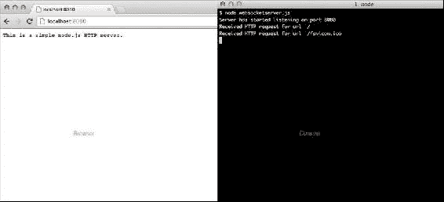
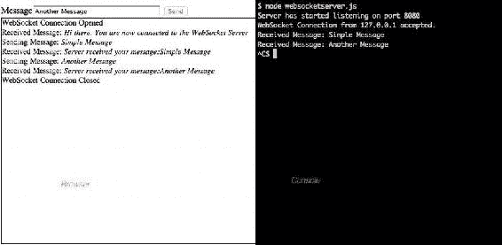
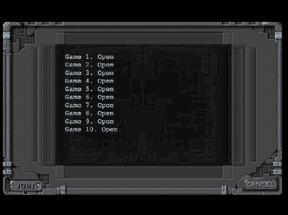
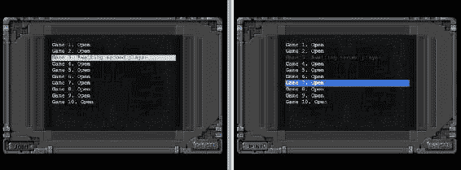
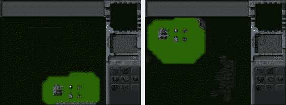

# 十一、使用 WebSockets 的多人游戏

不管我们制作的单人游戏有多有挑战性，它总是缺少与另一个人竞争的挑战。多人游戏允许玩家相互竞争或者为了一个共同的目标合作。

现在我们已经有了一个可行的单人游戏，我们将看看如何通过使用 HTML5 WebSocket API 为我们的 RTS 游戏添加多人支持。

在我们开始向游戏中添加多人游戏之前，让我们先来看看使用 Node.js 的 WebSocket API 的一些网络基础知识。

通过 Node.js 使用 WebSocket API

我们多人游戏的核心是新的 HTML5 WebSocket API。在 WebSockets 出现之前，浏览器与服务器交互的唯一方式是通过稳定的请求流轮询和长时间轮询服务器。这些方法虽然有效，但有很高的网络延迟和高带宽使用率，使它们不适合实时多人游戏。

随着 WebSocket API 的出现，这一切都改变了。该 API 通过单个 TCP 套接字定义了一个双向、全双工通信通道，为我们提供了浏览器和服务器之间高效、低延迟的连接。

简而言之，我们现在可以在浏览器和服务器之间创建一个单一的、持久的连接，并以比以前更快的速度来回发送数据。你可以在 www.websocket.org/了解更多关于 WebSockets 的好处。让我们看一个使用 WebSockets 在浏览器和服务器之间进行通信的简单例子。

浏览器上的 WebSocket

使用 WebSockets 与服务器通信包括以下步骤:

1.  通过提供服务器 URL 来实例化 WebSocket 对象
2.  根据需要实现 onopen、onclose 和 onerror 事件处理程序
3.  实现 onmessage 事件处理程序，以便在从服务器收到消息时处理操作
4.  使用 send()方法向服务器发送消息
5.  使用 close()方法关闭与服务器的连接

我们可以在一个新的 HTML 文件中创建一个简单的 WebSocket 客户端，如清单 11-1 所示。我们将把这个新文件放在 websocketdemo 文件夹中，使它与我们的游戏代码分开。

***清单 11-1。*** 一个简单的 WebSocket 客户端(websocketclient.html)

```html
<!DOCTYPE html>
<html>
    <head>
        <meta http-equiv="Content-type" content="text/html; charset=utf-8">
        <title>WebSocket Client</title>
        <script type="text/javascript" charset="utf-8">

            var websocket;
            var serverUrl = "ws://localhost:8080/";

            function displayMessage(message){
                document.getElementById("displaydiv").innerHTML += message +"<br>";
            }

            // Initialize the WebSocket object and setup Event Handlers
            function initWebSocket(){
                // Check if browser has an implementation of WebSocket (older Mozilla browsers used MozWebSocket)
                var WebSocketObject = window.WebSocket || window.MozWebSocket;
                if(WebSocketObject){
                    // Create the WebSocket object
                    websocket = new WebSocketObject(serverUrl);

                    // Setup the event handlers
                    websocket.onopen = function(){
                        displayMessage("WebSocket Connection Opened");
                        document.getElementById("sendmessage").disabled = false;
                    };

                    websocket.onclose = function(){
                        displayMessage("WebSocket Connection Closed");
                        document.getElementById("sendmessage").disabled = true;
                    };

                    websocket.onerror = function(){
                        displayMessage("Connection Error Occured");
                    };

                    websocket.onmessage = function(message){
                        displayMessage("Received Message: <i>"+message.data+"</i>");
                    };
                } else {
                    displayMessage("Your Browser does not support WebSockets");
                }
            }

            // Send a message to the server using the WebSocket
            function sendMessage(){
                // readyState can be CONNECTING,OPEN,CLOSING,CLOSED
                if (websocket.readyState = websocket.OPEN){
                    var message = document.getElementById("message").value;
                    displayMessage("Sending Message: <i>"+message+"</i>");
                    websocket.send(message);
                } else {
                    displayMessage("Cannot send message. The WebSocket connection isn't open");
                }
            }

        </script>
    </head>
    <body onload="initWebSocket();">
        <label for="message">Message</label><input type="text" value="Simple Message" size="40" id="message">
        <input type="button" value="Send" id="sendmessage" onclick="sendMessage()" disabled="true">
        <div id="displaydiv" style="border:1px solid black;width:600px; height:400px;font-size:14px;"></div>
    </body>
</html>
```

HTML 文件的 body 标记包含一些基本元素:一个消息输入框、一个发送消息的按钮和一个显示所有消息的 div。

在脚本标记中，我们首先使用 WebSocket 协议(ws://)声明一个指向 WebSocket 服务器的服务器 URL。

然后我们声明一个简单的 displayMessage()方法，它将给定的消息附加到 displaydiv div 元素。

接下来，我们声明 initWebSocket()方法，该方法初始化 WebSocket 连接并设置事件处理程序。

在这个方法中，我们首先检查 WebSocket 或 MozWebSocket 对象是否存在，以验证浏览器是否支持 WebSockets，并将其保存到 WebSocket object。这是因为旧版本的 Mozilla 浏览器在转换到 WebSocket 之前将它们的实现命名为 MozWebSocket。

然后，我们通过调用 WebSocket object 的构造函数并将其保存到 WebSocket 变量来初始化 websocket 对象。

最后，我们为 onopen、onclose、onerror 和 onmessage 事件处理程序定义处理程序，向用户显示适当的消息。我们还在连接打开时启用 sendmessage 按钮，在连接关闭时禁用它。

在 sendMessage()方法中，我们使用 readyState 属性检查连接是否打开，然后使用 send()方法将消息输入框的内容发送到服务器。

我们的浏览器客户端需要一个可以使用 WebSocket 协议进行通信的服务器。已经有几个 WebSocket 服务器实现可用于大多数流行语言，如 Java 的 jweb socket([`jwebsocket.org/`](http://jwebsocket.org/))和 Jetty([`jetty.codehaus.org/jetty/`](http://jetty.codehaus.org/jetty/))，Node.js 的 socket . io([`github.com/LearnBoost/Socket.IO-node`](http://github.com/LearnBoost/Socket.IO-node))和 web socket-Node([`github.com/Worlize/WebSocket-Node`](https://github.com/Worlize/WebSocket-Node))以及 C++的 web socket++([`github.com/zaphoyd/websocketpp`](https://github.com/zaphoyd/websocketpp))。

在本书中，我们将对 Node.js 使用 WebSocket-Node。我们将首先设置 Node.js 并创建一个 HTTP 服务器，然后为其添加 WebSocket 支持。

在 Node.js 中创建 HTTP 服务器

node . js([`nodejs.org/`](http://nodejs.org/))是一个服务器端平台，由构建在谷歌 JavaScript V8 引擎之上的几个库组成。Node.js 最初由 Ryan Dahl 于 2009 年创建，旨在轻松构建快速、可伸缩的网络应用。程序是用 JavaScript 编写的，使用事件驱动的、非阻塞的 I/O 模型，它是轻量级的、高效的。Node.js 在相对较短的时间内获得了很大的知名度，并被许多公司使用，包括 LinkedIn、微软和雅虎。

在开始编写 Node.js 代码之前，您需要在计算机上安装 Node.js。Node.js 的实现可用于大多数操作系统，如 Windows、Mac OS X、Linux 和 SunOS，在您的特定操作系统上设置 Node.js 的详细说明可在[`github.com/joyent/node/wiki/Installation`](https://github.com/joyent/node/wiki/Installation)获得。对于 Windows 和 Mac OS X，最简单的安装方法是运行现成的安装文件，可在 http://nodejs.org/download/[下载。](http://nodejs.org/download/)

正确设置 Node.js 后，您将能够从命令行运行 Node.js 程序，方法是调用 Node 可执行文件并将程序名作为参数传递。

设置 Node.js 后，我们可以在一个新的 JavaScript 文件中创建一个简单的 HTTP web 服务器，如清单 11-2 所示。我们将把这个文件放在 websocketdemo 文件夹中。

***清单 11-2。*** 一个简单的 HTTP Web 服务器中的 Node.js (websocketserver.js)

```html
// Create an HTTP Server
var http = require('http');

// Create a simple web server that returns the same response for any request
var server = http.createServer(function(request,response){
    console.log('Received HTTP request for url ', request.url);
    response.writeHead(200, {'Content-Type': 'text/plain'});
    response.end("This is a simple node.js HTTP server.");
});

// Listen on port 8080
server.listen(8080,function(){
    console.log('Server has started listening on port 8080');
});
```

使用 Node.js HTTP 库，在 Node.js 中构建简单 web 服务器的代码少得惊人。你可以在 http://nodejs.org/api/http.html 找到关于这个库的详细文档。

我们首先使用 require()方法引用 http 库，并将其保存到 HTTP 变量中。然后，我们通过调用 createServer()方法创建一个 HTTP 服务器，并向它传递一个处理所有 HTTP 请求的方法。在我们的例子中，对于任何 HTTP 请求，我们都向服务器发回相同的文本响应。最后，我们告诉服务器开始监听端口 8080。

如果您从命令行运行 websocketserver.js 中的代码，并尝试从浏览器访问 web 服务器的 URL([`localhost:8080`](http://localhost:8080))，您应该会看到如图图 11-1 所示的输出。



图 11-1。node . js 中的一个简单的 HTTP 服务器

我们已经启动并运行了 HTTP 服务器。无论我们在 URL 中的服务器名称后传递什么路径，这个服务器都将返回相同的页面。此服务器也不支持 WebSockets。

接下来，我们将通过使用 WebSocket-Node 包向该服务器添加 WebSocket 支持。

创建 WebSocket 服务器

您需要做的第一件事是使用 npm 命令安装 WebSocket-Node 包。详细的安装说明和示例代码可在[`github.com/Worlize/WebSocket-Node`](https://github.com/Worlize/WebSocket-Node)获得。

如果 Node.js 设置正确，您应该能够通过从命令行运行以下命令来设置 WebSocket:

```html
npm install websocket
```

 **提示**如果你之前已经安装了 Node。JS 和 WebSocket-Node，您应该通过运行 npm update 命令来确保您使用的是最新版本。

一旦安装了 WebSocket 包，我们将通过修改 websocketserver.js 来添加 WebSocket 支持，如清单 11-3 所示。

***清单 11-3。*** 实现一个简单的 WebSocket 服务器(websocketserver.js)

```html
// Create an HTTP Server
var http = require('http');

// Create a simple web server that returns the same response for any request
var server = http.createServer(function(request,response){
  console.log('Received HTTP request for url', request.url);
  response.writeHead(200, {'Content-Type': 'text/plain'});
  response.end("This is a simple node.js HTTP server.");
});

// Listen on port 8080
server.listen(8080,function(){
  console.log('Server has started listening on port 8080');
});

// Attach WebSocket Server to HTTP Server
var WebSocketServer = require('websocket').server;
var wsServer = new WebSocketServer({
  httpServer:server
});

// Logic to determine whether a specified connection is allowed.
function connectionIsAllowed(request){
  // Check criteria such as request.origin, request.remoteAddress
  return true;
}

// Handle WebSocket Connection Requests
wsServer.on('request',function(request){
  // Reject requests based on certain criteria
  if(!connectionIsAllowed(request)){
     request.reject();
     console.log('WebSocket Connection from' + request.remoteAddress + 'rejected.');
     return;
  }
  // Accept Connection
  var websocket = request.accept();
  console.log('WebSocket Connection from' + request.remoteAddress + 'accepted.');
  websocket.send ('Hi there. You are now connected to the WebSocket Server');

  websocket.on('message', function(message) {
   if (message.type === 'utf8') {
      console.log('Received Message:' + message.utf8Data);
      websocket.send('Server received your message:'+ message.utf8Data);
  }
});

    websocket.on('close', function(reasonCode, description) {
     console.log('WebSocket Connection from' + request.remoteAddress + 'closed.');
    });
});
```

我们创建 HTTP 服务器的代码的第一部分保持不变。在新添加的代码中，我们首先使用 require()方法保存对 WebSocket 服务器的引用。然后，我们创建一个新的 WebSocketServer 对象，传递我们之前作为配置选项创建的 HTTP 服务器。您可以在[`github . com/Worlize/web socket-Node/wiki/Documentation`](https://github.com/Worlize/WebSocket-Node/wiki/Documentation)上了解不同的 WebSocketServer 配置选项以及 WebSocketServer API 的详细信息。

接下来，我们实现服务器请求事件的处理程序。我们首先检查连接请求是否应该被拒绝，如果应该，调用请求的 reject()方法。

我们使用一个名为 connectionIsAllowed()的方法来过滤需要拒绝的连接。现在我们批准所有连接；但是，这种方法可以使用连接请求的 IP 地址和来源等信息来智能地过滤请求。

如果允许连接，我们使用 accept()方法接受请求，并将结果 WebSocket 连接保存到 websocket 变量中。这个 websocket 变量是我们前面在客户机 HTML 文件中创建的 websocket 变量的服务器端等价物。

一旦我们创建了连接，我们就使用 websocket 对象的 send()方法向客户端发送一条欢迎消息，通知它连接已经建立。

```html
Next we implement the handler for the message event of the websocket object. Every time a message arrives, we send back a message to the client saying the server just received the message and then log the message to the console.
```

 **注意**web socket API 允许多种消息数据类型，如 UTF8 文本、二进制和 blob 数据。与浏览器不同，服务器端的消息对象根据数据类型使用不同的属性(如 utf8Data、binaryData)存储消息数据。

```html
Finally, we implement the handler for the close event, where we just log the fact that the connection was closed.
```

如果从命令行运行 websocketserver.js 代码，并在浏览器中打开 websocketclient.html，应该会看到客户端和服务器之间的交互，如图图 11-2 所示。



图 11-2。客户端和服务器之间的交互

一旦建立了 WebSocket 连接，浏览器就会收到来自服务器的欢迎消息。客户端上的发送按钮也会被启用。如果您键入一条消息并单击发送，服务器会在控制台中显示该消息，并向客户端发回一个响应。最后，如果关闭服务器，客户机会显示一条消息，说明连接已经关闭。

我们现在有了一个在客户机和服务器之间来回传输纯文本消息的工作示例。

 **注**使用二进制数据代替纯文本可以减少消息大小并优化带宽使用。然而，我们将继续使用 UTF8 文本，甚至在我们的游戏实现中，以保持代码简单。

现在我们已经了解了 WebSocket 通信的基础，是时候在我们的游戏中加入多人游戏了。我们将从第十章结尾的地方继续。
我们要做的第一件事是建造一个多人游戏大厅。

建造多人游戏大厅

我们的游戏大厅将显示游戏室列表。玩家可以从游戏大厅屏幕加入或离开这些房间。一旦两个玩家加入一个房间，多人游戏就开始了，两个玩家可以互相竞争。

定义多人游戏大厅画面

我们将从在 index.html 的 gamecontainer div 中添加多人游戏大厅屏幕的 HTML 代码开始，如清单 11-4 所示。

***清单 11-4。*** 多人游戏大厅屏幕的 HTML 代码(index.html)

```html
<div id="multiplayerlobbyscreen" class="gamelayer">
    <select id="multiplayergameslist" size="10">
    </select>
    <input type="button" id="multiplayerjoin" onclick="multiplayer.join();">
    <input type="button" id="multiplayercancel" onclick="multiplayer.cancel();">
</div>
```

该层包含一个 select 元素，用于显示游戏房间列表以及两个按钮。我们还将把大厅屏幕的 CSS 代码添加到 styles.css 中，如清单 11-5 所示。

***清单 11-5。*** 多人游戏大厅屏幕的 CSS 代码(styles.css)

```html
/* Multiplayer Lobby Screen */
#multiplayerlobbyscreen {
    background:url(img/multiplayerlobbyscreen.png) no-repeat center;
}
#multiplayerlobbyscreen input[type="button"]{
    background-image: url(img/buttons.png);
    position:absolute;
    border-width:0px;
    padding:0px;
}
#multiplayerjoin{
    background-position: -2px -212px;
    top:400px;
    left:21px;
    width:74px;
    height:26px;
}
#multiplayerjoin:active,#multiplayerjoin:disabled{
    background-position: -2px -247px;
}
#multiplayercancel{
    background-position: -86px -150px;
    left:545px;
    top:400px;
    width:73px;
    height:24px;
}
#multiplayercancel:active,#multiplayercancel:disabled{
    background-position: -86px -184px;
}
#multiplayergameslist {
    padding:20px;
    position:absolute;
    width:392px;
    height:270px;
    top:98px;
    left:124px;
    background:rgba(0,0,0,0.7);
    border:none;
    color:gray;
    font-size: 15px;
    font-family: 'Courier New', Courier, monospace;
}
#multiplayergameslist:focus {
    outline:none;
}
#multiplayergameslist option.running{
    color:gray;
}
#multiplayergameslist option.waiting{
    color:green;
}
#multiplayergameslist option.empty{
    color:lightblue;
}
```

现在大厅屏幕已经就绪，我们将构建代码将浏览器连接到服务器并填充游戏列表。

推广游戏列表

我们将从在 multiplayer.js 中定义一个新的多人对象开始，如清单 11-6 所示。

***清单 11-6。*** 定义多人对象(multiplayer.js)

```html
var multiplayer = {
    // Open multiplayer game lobby
    websocket_url:"ws://localhost:8080/",
    websocket:undefined,
    start:function(){
        game.type = "multiplayer";
        var WebSocketObject = window.WebSocket || window.MozWebSocket;
        if (!WebSocketObject){
            game.showMessageBox("Your browser does not support WebSocket. Multiplayer will not work.");
            return;
        }
        this.websocket = new WebSocketObject(this.websocket_url);
        this.websocket.onmessage = multiplayer.handleWebSocketMessage;
        // Display multiplayer lobby screen after connecting
        this.websocket.onopen = function(){
            // Hide the starting menu layer
            $('.gamelayer').hide();
            $('#multiplayerlobbyscreen').show();
        }
    },
    handleWebSocketMessage:function(message){
        var messageObject = JSON.parse(message.data);
        switch (messageObject.type){
            case "room_list":
                multiplayer.updateRoomStatus(messageObject.status);
                break;
        }
    },
    statusMessages:{
        'starting':'Game Starting',
        'running':'Game in Progress',
        'waiting':'Awaiting second player',
        'empty':'Open'
    },
    updateRoomStatus:function(status){
        var $list = $("#multiplayergameslist");
        $list.empty(); // remove old options
        for (var i=0; i < status.length; i++) {
            var key = "Game "+(i+1)+". "+this.statusMessages[status[i]];
            $list.append($("<option></option>").attr("disabled",status[i]== "running"||status[i]== "starting").attr("value", (i+1)).text(key).addClass(status[i]).attr("selected", (i+1)== multiplayer.roomId));
        };
    },
};
```

在多人游戏对象中，我们首先定义一个 start()方法,该方法试图初始化一个到服务器的 WebSocket 连接，并将其保存在 websocket 变量中。然后，我们将 websocket 对象的 onmessage 事件处理程序设置为调用 handleWebSocketMessage()方法，并使用 onopen 事件处理程序在连接打开后显示大厅屏幕。

接下来，我们定义 handleWebSocketMessage()方法来处理消息数据。我们将使用 JSON.parse()和 JSON.stringify()在对象和字符串之间进行转换，从而在服务器和浏览器之间传递完整的对象，而不是像前面的 WebSocket 示例那样传递字符串。我们首先将消息数据解析为 messageObject 变量，然后使用解析对象的 type 属性来决定如何处理消息。

如果 type 属性设置为 room_list，我们将调用 updateRoomStatus()方法并向其传递 Status 属性。

最后，我们定义了一个 updateRoomStatus()方法,该方法接受一组状态消息并填充 multiplayergameslist select 元素。我们禁用任何状态为 starting 或 running 的选项，并将选项的 CSS 类设置为 status。

接下来，我们需要在 index.html 的头部添加一个对 multiplayer.js 的引用，如清单 11-7 所示。

***清单 11-7。*** 添加对 multiplayer . js(index.html)的引用

```html
<script src="js/multiplayer.js" type="text/javascript" charset="utf-8"></script>
```

最后，我们将在一个名为 server.js 的新文件中定义我们的多人 WebSocket 服务器，如清单 11-8 所示。

***清单 11-8。*** 定义多人服务器(server.js)

```html
var WebSocketServer = require('websocket').server;
var http = require('http');

// Create a simple web server that returns the same response for any request
var server = http.createServer(function(request,response){
    response.writeHead(200, {'Content-Type': 'text/plain'});
    response.end("This is the node.js HTTP server.");
});

server.listen(8080,function(){
    console.log('Server has started listening on port 8080');
});

var wsServer = new WebSocketServer({
    httpServer:server,
    autoAcceptConnections: false
});

// Logic to determine whether a specified connection is allowed.
function connectionIsAllowed(request){
    // Check criteria such as request.origin, request.remoteAddress
    return true;
}

// Initialize a set of rooms
var gameRooms = [];
for (var i=0; i < 10; i++) {
    gameRooms.push({status:"empty",players:[],roomId:i+1});
};

var players = [];
wsServer.on('request',function(request){
    if(!connectionIsAllowed(request)){
        request.reject();
        console.log('Connection from' + request.remoteAddress + 'rejected.');
        return;
    }

    var connection = request.accept();
    console.log('Connection from' + request.remoteAddress + 'accepted.');

    // Add the player to the players array
    var player = {
        connection:connection
    }
    players.push(player);

    // Send a fresh game room status list the first time player connects
    sendRoomList(connection);

    // On Message event handler for a connection
    connection.on('message', function(message) {
        if (message.type === 'utf8') {
            var clientMessage = JSON.parse(message.utf8Data);
            switch (clientMessage.type){
                // Handle different message types
            }
        }
    });

    connection.on('close', function(reasonCode, description) {
        console.log('Connection from' + request.remoteAddress + 'disconnected.');
        for (var i = players.length - 1; i >= 0; i--){
            if (players[i]==player){
                players.splice(i,1);
            }
        };
    });
});

function sendRoomList(connection){
    var status = [];
    for (var i=0; i < gameRooms.length; i++) {
        status.push(gameRooms[i].status);
    };
    var clientMessage = {type:"room_list",status:status};
    connection.send(JSON.stringify(clientMessage));
}
```

我们从定义 HTTP 服务器和 WebSocketServer 开始，就像我们在前面的 websocketdemo 示例中所做的那样。

接下来，我们定义一个 rooms 数组，并用十个 room 对象填充它，这些对象的 status 属性设置为 empty。

最后，我们实现了连接请求事件处理程序。我们首先为连接创建一个 player 对象，并将其添加到 players 数组中。然后，我们为该连接调用 sendRoomList()方法。

接下来，我们为连接实现消息事件处理程序，以解析消息数据并基于类型属性做出响应，就像我们在客户端所做的那样。我们尚未处理任何消息类型。

接下来，我们实现 close 事件处理程序，一旦连接关闭，我们就从 players 数组中删除播放器。

最后，我们创建一个 sendRoomList()方法，该方法在 room_list 类型的消息对象中发送一个状态数组。这与我们将在客户端解析的消息相同。

如果我们运行新创建的 server.js，然后在浏览器中打开我们的游戏，我们应该能够点击多人游戏菜单选项并到达多人游戏大厅屏幕，如图图 11-3 所示。



图 11-3。多人游戏大厅屏幕

在后台，客户机创建一个到服务器的套接字连接，服务器向客户机发回一个 room_list 消息，然后用它来填充列表。

你应该可以选择任何游戏室，但不能加入或离开这些房间。我们现在将实现加入和离开游戏室。

加入和离开游戏室

我们将从在多人游戏对象中实现 join()和 cancel()方法开始，如清单 11-9 所示。

***清单 11-9。*** 实现 join()和 cancel() (multiplayer.js)

```html
join:function(){
    var selectedRoom = document.getElementById('multiplayergameslist').value;
    if(selectedRoom){
        multiplayer.sendWebSocketMessage({type:"join_room",roomId:selectedRoom});
        document.getElementById('multiplayergameslist').disabled = true;
        document.getElementById('multiplayerjoin').disabled = true;
    } else {
        game.showMessageBox("Please select a game room to join.");
    }
},
cancel:function(){
    // Leave any existing game room
    if(multiplayer.roomId){
        multiplayer.sendWebSocketMessage({type:"leave_room",roomId:multiplayer.roomId});
        document.getElementById('multiplayergameslist').disabled = false;
        document.getElementById('multiplayerjoin').disabled = false;
        delete multiplayer.roomId;
        delete multiplayer.color;
        return;
    } else {
        // Not in a room, so leave the multiplayer screen itself
        multiplayer.closeAndExit();
    }
},
closeAndExit:function(){
    // clear handlers and close connection
    multiplayer.websocket.onopen = null;
    multiplayer.websocket.onclose = null;
    multiplayer.websocket.onerror = null;
    multiplayer.websocket.close();
    document.getElementById('multiplayergameslist').disabled = false;
    document.getElementById('multiplayerjoin').disabled = false;
    // Show the starting menu layer
    $('.gamelayer').hide();
    $('#gamestartscreen').show();
},
sendWebSocketMessage:function(messageObject){
    this.websocket.send(JSON.stringify(messageObject));
},
```

在 join()方法中，我们检查是否选择了一个房间，如果选择了，就用 roomId 属性向服务器发送一个 join_room WebSocket 消息。然后我们禁用加入按钮和游戏列表。如果没有选择房间，我们要求玩家先选择一个房间。

在 cancel()方法中，我们首先使用 multiplayer.roomId 属性检查玩家是否在一个房间中。如果是这样，我们向服务器发送一个 leave_room WebSocket 消息，删除 roomId 和 color 属性，并启用 Join 按钮和游戏列表选择元素。如果没有，我们使用 closeAndExit()方法关闭套接字连接并返回到游戏开始屏幕。

在 closeAndExit()方法中，我们首先清除 websocket 对象的事件处理程序并关闭连接。然后，我们启用加入按钮和游戏列表，并返回到游戏开始屏幕。

最后，我们定义了一个 sendWebSocketMessage()，它将 messageObject 转换为一个字符串并将其发送到服务器。

接下来，我们将通过修改 server.js 中的消息事件处理程序来修改服务器以处理 join_room 和 leave_room 消息类型，如清单 11-10 所示。

***清单 11-10。*** 处理加入房间和离开房间消息(server.js)

```html
// On Message event handler for a connection
connection.on('message', function(message) {
    if (message.type === 'utf8') {
        var clientMessage = JSON.parse(message.utf8Data);
        switch (clientMessage.type){
            case "join_room":
                var room = joinRoom(player,clientMessage.roomId);
                sendRoomListToEveryone();
                break;
            case "leave_room":
                leaveRoom(player,clientMessage.roomId);
                sendRoomListToEveryone();
                break;
        }
    }
});
```

当 join_room 消息进来时，我们首先调用 joinRoom()方法，然后使用 sendRoomListToEveryone()方法将房间列表发送给所有玩家。同样，当一个 leave_room 消息进来时，我们首先调用 leaveRoom()方法，然后调用 sendRoomListToEveryone()方法。

接下来，我们将在 server.js 中定义这三个新方法，如清单 11-11 所示。

***清单 11-11。***join room()、leaveRoom()和 sendRoomListToEveryone()方法(server.js)

```html
function sendRoomListToEveryone(){
    // Notify all connected players of the room status changes
    var status = [];
    for (var i=0; i < gameRooms.length; i++) {
        status.push(gameRooms[i].status);
    };
    var clientMessage = {type:"room_list",status:status};
    var clientMessageString = JSON.stringify(clientMessage);
    for (var i=0; i < players.length; i++) {
        players[i].connection.send(clientMessageString);
    };
}

function joinRoom(player,roomId){
    var room = gameRooms[roomId-1];
    console.log("Adding player to room",roomId);
    // Add the player to the room
    room.players.push(player);
    player.room = room;
    // Update room status
    if(room.players.length == 1){
        room.status = "waiting";
        player.color = "blue";
    } else if (room.players.length == 2){
        room.status = "starting";
        player.color = "green";
    }
    // Confirm to player that he was added
    var confirmationMessageString = JSON.stringify({type:"joined_room", roomId:roomId, color:player.color});
    player.connection.send(confirmationMessageString);
    return room;
}

function leaveRoom(player,roomId){
    var room = gameRooms[roomId-1];
    console.log("Removing player from room",roomId);

    for (var i = room.players.length - 1; i >= 0; i--){
        if(room.players[i]==player){
            room.players.splice(i,1);
        }
    };
    delete player.room;
    // Update room status
    if(room.players.length == 0){
        room.status = "empty";
    } else if (room.players.length == 1){
        room.status = "waiting";
    }
}
```

在 sendRoomListToEveryone()方法中，我们遍历 players 数组中的所有玩家，并向他们发送一条包含房间列表的 room_list 消息。

在 joinRoom()方法中，我们首先使用 roomId 获取房间对象，并将玩家添加到房间对象的玩家数组中。然后，我们根据房间里有多少玩家，将房间的状态设置为等待或开始。我们还根据玩家是第一个还是第二个加入房间的玩家，将玩家的颜色设置为蓝色或绿色。最后，我们向玩家发送一个 joined_room 消息，其中包含房间 ID 和玩家颜色的详细信息。

在 leaveRoom()方法中，我们首先使用 roomId 获取房间对象，并从房间对象的 players 数组中移除播放器。然后，我们根据房间中有多少玩家，将房间对象的状态设置为空或等待。

我们要做的下一个改变是在 multiplayer.js 中处理 joined_room 确认消息，如清单 11-12 中的所示。

***清单 11-12。*** 处理加入 _ 房间消息(multiplayer.js)

```html
handleWebSocketMessage:function(message){
    var messageObject = JSON.parse(message.data);
    switch (messageObject.type){
        case "room_list":
            multiplayer.updateRoomStatus(messageObject.status);
            break;
        case "joined_room":
            multiplayer.roomId = messageObject.roomId;
            multiplayer.color = messageObject.color;
            break;
    }
},
```

当 joined_room 消息进来时，我们将 roomId 和 color 属性保存在多人游戏对象中。

最后，我们将通过修改服务器上的 close 事件处理程序来确保如果玩家断开连接，玩家将被移出游戏室，如清单 11-13 所示。

***清单 11-13。*** 处理玩家断线(server.js)

```html
connection.on('close', function(reasonCode, description) {
    console.log('Connection from' + request.remoteAddress + 'disconnected.');

    for (var i = players.length - 1; i >= 0; i--){
        if (players[i]==player){
            players.splice(i,1);
        }
    };

    // If the player is in a room, remove him from room and notify everyone
    if(player.room){
        var status = player.room.status;
        var roomId = player.room.roomId;
        // If the game was running, end the game as well
        leaveRoom(player,roomId);
        sendRoomListToEveryone();
    }
});
```

在新添加的代码中，我们检查断开连接的玩家是否在房间中，如果是，我们使用 leaveRoom()方法将玩家从房间中移除，然后使用 sendRoomListToEveryone()方法通知每个人。

如果我们重启服务器并在多个浏览器窗口中运行游戏，我们应该能够在一个窗口中加入一个房间，并在两个窗口中看到状态变化，如图图 11-4 所示。



图 11-4。加入房间时，房间状态会在两个浏览器上更新

您会注意到，加入房间后,“加入”按钮和列表会被禁用。如果您在两个浏览器上加入同一个房间，房间状态将更改为“开始”，其他人无法加入房间。

如果您单击“取消”,您将离开房间，加入按钮将重新启用。如果您再次单击取消，您将返回到主菜单。如果通过关闭浏览器窗口断开与服务器的连接，您将被移出房间。

我们现在有一个工作游戏大厅，玩家可以加入和离开游戏室。接下来，一旦玩家加入游戏室，我们将开始多人游戏。

开始多人游戏

我们的多人游戏将在两名玩家加入游戏室后开始。我们需要告诉两个客户端加载相同的级别。一旦关卡在两个浏览器上都加载了，我们就开始游戏。我们需要做的第一件事是定义一个新的多人游戏关卡。

定义多人游戏关卡

多人游戏关卡与单人游戏关卡相似，将包含一些额外的信息，如每个玩家的起始位置和每个团队的起始物品。我们将从在地图对象中定义一个简单的关卡开始，如清单 11-14 所示。

***清单 11-14。*** 一个多人关卡里面的多人阵列(maps.js)

```html
"multiplayer":[
    {
        /* Map Details */
        "mapImage":"img/level-one.png",

        /* Map coordinates that are obstructed by terrain*/
        "mapGridWidth":60,
        "mapGridHeight":40,
        "mapObstructedTerrain":[
            [49,8], [50,8], [51,8], [51,9], [52,9], [53,9], [53,10], [53,11], [53,12], [53,13],
[53,14], [53,15], [53,16], [52,16], [52,17], [52,18], [52,19], [51,19], [50,19], [50,18], [50,17],
[49,17], [49,18], [48,18], [47,18], [47,17], [47,16], [48,16], [49,16], [49,15], [49,14], [48,14],
 [48,13], [48,12], [49,12], [49,11], [50,11], [50,10], [49,10], [49,9], [44,0], [45,0], [45,1],
 [45,2], [46,2], [47,2], [47,3], [48,3], [48,4], [48,5], [49,5], [49,6], [49,7], [50,7], [51,7],
 [51,6], [51,5], [51,4], [52,4], [53,4], [53,3], [54,3], [55,3], [55,2], [56,2], [56,1], [56,0],
 [55,0], [43,19], [44,19], [45,19], [46,19], [47,19], [48,19], [48,20], [48,21], [47,21], [46,21],
 [45,21], [44,21], [43,21], [43,20], [41,22], [42,22], [43,22], [44,22], [45,22], [46,22], [47,22],
 [48,22], [49,22], [50,22], [50,23], [50,24], [49,24], [48,24], [47,24], [47,25], [47,26], [47,27],
 [47,28], [47,29], [47,30], [46,30], [45,30], [44,30], [43,30], [43,29], [43,28], [43,27], [43,26],
 [43,25], [43,24], [42,24], [41,24], [41,23], [48,39], [49,39], [50,39], [51,39], [52,39], [53,39],
 [54,39], [55,39], [56,39], [57,39], [58,39], [59,39], [59,38], [59,37], [59,36], [59,35], [59,34],
 [59,33], [59,32], [59,31], [59,30], [59,29], [0,0], [1,0], [2,0], [1,1], [2,1], [10,3], [11,3],
 [12,3], [12,2], [13,2], [14,2], [14,3], [14,4], [15,4], [15,5], [15,6], [14,6], [13,6], [13,5],
 [12,5], [11,5], [10,5], [10,4], [3,9], [4,9], [5,9], [5,10], [6,10], [7,10], [8,10], [9,10], [9,11],
 [10,11], [11,11], [11,10], [12,10], [13,10], [13,11], [13,12], [12,12], [11,12], [10,12], [9,12],
 [8,12], [7,12], [7,13], [7,14], [6,14], [5,14], [5,13], [5,12], [5,11], [4,11], [3,11], [3,10],
 [33,33], [34,33], [35,33], [35,34], [35,35], [34,35], [33,35], [33,34], [27,39], [27,38], [27,37],
 [28,37], [28,36], [28,35], [28,34], [28,33], [28,32], [28,31], [28,30], [28,29], [29,29], [29,28],
 [29,27], [29,26], [29,25], [29,24], [29,23], [30,23], [31,23], [32,23], [32,22], [32,21], [31,21],
 [30,21], [30,22], [29,22], [28,22], [27,22], [26,22], [26,21], [25,21], [24,21], [24,22], [24,23],
 [25,23], [26,23], [26,24], [25,24], [25,25], [24,25], [24,26], [24,27], [25,27], [25,28], [25,29],
 [24,29], [23,29], [23,30], [23,31], [24,31], [25,31], [25,32], [25,33], [24,33], [23,33], [23,34],
 [23,35], [24,35], [24,36], [24,37], [23,37], [22,37], [22,38], [22,39], [23,39], [24,39], [25,39],
 [26,0], [26,1], [25,1], [25,2], [25,3], [26,3], [27,3], [27,2], [28,2], [29,2], [29,3], [30,3],
 [31,3], [31,2], [31,1], [32,1], [32,0], [33,0], [32,8], [33,8], [34,8], [34,9], [34,10], [33,10],
 [32,10], [32,9], [8,29], [9,29], [9,30], [17,32], [18,32], [19,32], [19,33], [18,33], [17,33],
 [18,34], [19,34], [3,27], [4,27], [4,26], [3,26], [2,26], [3,25], [4,25], [9,20], [10,20], [11,20],
 [11,21], [10,21], [10,19], [19,7], [15,7], [29,12], [30,13], [20,14], [21,14], [34,13], [35,13],
 [36,13], [36,14], [35,14], [34,14], [35,15], [36,15], [16,18], [17,18], [18,18], [16,19], [17,19],
 [18,19], [17,20], [18,20], [11,19], [58,0], [59,0], [58,1], [59,1], [59,2], [58,3], [59,3], [58,4],
 [59,4], [59,5], [58,6], [59,6], [58,7], [59,7], [59,8], [58,9], [59,9], [58,10], [59,10], [59,11],
 [52,6], [53,6], [54,6], [52,7], [53,7], [54,7], [53,8], [54,8], [44,17], [46,32], [55,32], [54,28],
 [26,34], [34,34], [4,10], [6,11], [6,12], [6,13], [7,11], [8,11], [12,11], [27,0], [27,1], [26,2],
 [28,1], [28,0], [29,0], [29,1], [30,2], [30,1], [30,0], [31,0], [33,9], [46,0], [47,0], [48,0],
 [49,0], [50,0], [51,0], [52,0], [53,0], [54,0], [55,1], [54,1], [53,1], [52,1], [51,1], [50,1],
 [49,1], [48,1], [47,1], [46,1], [48,2], [49,2], [50,2], [51,2], [52,2], [53,2], [54,2], [52,3],
 [51,3], [50,3], [49,3], [49,4], [50,4], [50,5], [50,6], [50,9], [51,10], [52,10], [51,11], [52,11],
 [50,12], [51,12], [52,12], [49,13], [50,13], [51,13], [52,13], [50,14], [51,14], [52,14], [50,15],
 [51,15], [52,15], [50,16], [51,16], [51,17], [48,17], [51,18], [44,20], [45,20], [46,20], [47,20],
 [42,23], [43,23], [44,23], [45,23], [46,23], [47,23], [48,23], [49,23], [44,24], [45,24], [46,24],
 [44,25], [45,25], [46,25], [44,26], [45,26], [46,26], [44,27], [45,27], [46,27], [44,28], [45,28],
 [46,28], [44,29], [45,29], [46,29], [11,4], [12,4], [13,4], [13,3], [14,5], [25,22], [31,22],
 [27,23], [28,23], [27,24], [28,24], [26,25], [27,25], [28,25], [25,26], [26,26], [27,26], [28,26],
 [26,27], [27,27], [28,27], [26,28], [27,28], [28,28], [26,29], [27,29], [24,30], [25,30], [26,30],
 [27,30], [26,31], [27,31], [26,32], [27,32], [26,33], [27,33], [24,34], [25,34], [27,34], [25,35],
 [26,35], [27,35], [25,36], [26,36], [27,36], [25,37], [26,37], [23,38], [24,38], [25,38], [26,38],
 [26,39], [2,25], [9,19], [36,31]
        ],

        /* Entities to be loaded */
        "requirements":{
            "buildings":["base","harvester","starport","ground-turret"],
            "vehicles":["transport","scout-tank","heavy-tank","harvester"],
            "aircraft":["wraith","chopper"],
            "terrain":["oilfield"]
        },

        /* Economy Related*/
        "cash":{
            "blue":1000,
            "green":1000
        },

        /* Entities to be added */
        "items":[
            {"type":"terrain","name":"oilfield","x":16,"y":4,"action":"hint"},
            {"type":"terrain","name":"oilfield","x":34,"y":12,"action":"hint"},
            {"type":"terrain","name":"oilfield","x":1,"y":30,"action":"hint"},
            {"type":"terrain","name":"oilfield","x":38,"y":38,"action":"hint"},
        ],

        /* Entities for each starting team */
        "teamStartingItems":[
            {"type":"buildings","name":"base","x":0,"y":0},
            {"type":"vehicles","name":"harvester","x":2,"y":0},
            {"type":"vehicles","name":"heavy-tank","x":2,"y":1},
            {"type":"vehicles","name":"scout-tank","x":3,"y":0},
            {"type":"vehicles","name":"scout-tank","x":3,"y":1},
        ],
        "spawnLocations":[
            { "x":48, "y":36,"startX":36,"startY":20},
            { "x":3, "y":36,"startX":0,"startY":20},
            { "x":36, "y":3,"startX":32,"startY":0},
            { "x":3, "y":3,"startX":0,"startY":0},
        ],
        /* Conditional and Timed Trigger Events */
        "triggers":[
        ]
    }
]
```

我们在多人游戏中引入的两个新元素是 teamStartingItems 和 spawnLocations 数组。

teamStartingItems 数组包含了每个团队在关卡开始时将拥有的物品列表。x 和 y 坐标将相对于团队产生的位置。

spawnLocations 数组包含地图上每个玩家团队可以开始的几个点。每个对象包含该位置的 x 和 y 坐标，以及该位置的起始平移偏移量。

现在我们已经定义了多人游戏关卡，我们需要在两个玩家加入游戏室后加载关卡。

载入多人游戏关卡

当两个玩家加入一个房间时，我们会告诉他们初始化关卡，并等待他们确认关卡已经初始化。一旦发生这种情况，我们需要告诉他们开始游戏。

我们将从向 server.js 添加一些新方法来处理游戏的初始化和启动开始，如清单 11-15 所示。

***清单 11-15。*** 初始化并开始游戏(server.js)

```html
function initGame(room){
    console.log("Both players Joined. Initializing game for Room "+room.roomId);

    // Number of players who have loaded the level
    room.playersReady = 0;

    // Load the first multiplayer level for both players
    // This logic can change later to let the players pick a level
    var currentLevel = 0;

    // Randomly select two spawn locations between 0 and 3 for both players.
    var spawns = [0,1,2,3];
    var spawnLocations = {"blue":spawns.splice(Math.floor(Math.random()*spawns.length),1), "green":spawns.splice(Math.floor(Math.random()*spawns.length),1)};

    sendRoomWebSocketMessage(room,{type:"init_level", spawnLocations:spawnLocations, level:currentLevel});
}

function startGame(room){
    console.log("Both players are ready. Starting game in room",room.roomId);
    room.status = "running";
    sendRoomListToEveryone();
    // Notify players to start the game
    sendRoomWebSocketMessage(room,{type:"start_game"});
}

function sendRoomWebSocketMessage(room,messageObject){
    var messageString = JSON.stringify(messageObject);
    for (var i = room.players.length - 1; i >= 0; i--){
        room.players[i].connection.send(messageString);
    };
}
```

在 initGame()方法中，我们初始化 playersReady 变量，为两个玩家选择两个随机的种子位置，并使用 sendRoomWebSocketMessage()方法在 init_level 消息中将位置发送给两个玩家。

在 startGame()方法中，我们将房间状态设置为 running，更新每个玩家的房间列表，最后使用 sendRoomWebSocketMessage()方法向两个玩家发送 start_game 消息。

最后，在 sendRoomWebSocketMessage()方法中，我们遍历房间中的玩家，并向他们每个人发送给定的消息。

接下来，我们将修改 server.js 中的消息事件处理程序来初始化并启动游戏，如清单 11-16 所示。

***清单 11-16。*** 修改消息事件处理程序(server.js)

```html
// On Message event handler for a connection
connection.on('message', function(message) {
    if (message.type === 'utf8') {
        var clientMessage = JSON.parse(message.utf8Data);
        switch (clientMessage.type){
            case "join_room":
                var room = joinRoom(player,clientMessage.roomId);
                sendRoomListToEveryone();
                if(room.players.length == 2){
                    initGame(room);
                }
                break;
            case "leave_room":
                leaveRoom(player,clientMessage.roomId);
                sendRoomListToEveryone();
                break;
            case "initialized_level":
                player.room.playersReady++;
                if (player.room.playersReady==2){
                    startGame(player.room);
                }
                break;
        }
    }
});
```

当一个玩家加入一个房间并且玩家数量达到两个时，我们调用 initGame()方法。当我们收到来自玩家的 initialized_level 消息时，我们递增 playersReady 变量。一旦计数达到 2，我们就调用 startGame()方法。

接下来我们将向多人游戏对象添加两个新方法来初始化多人游戏关卡并开始游戏，如清单 11-17 所示。

***清单 11-17。*** 初始化并开始多人游戏(multiplayer.js)

```html
currentLevel:0,
initMultiplayerLevel:function(messageObject){
    $('.gamelayer').hide();
    var spawnLocations = messageObject.spawnLocations;

    // Initialize multiplayer related variables
    multiplayer.commands = [[]];
    multiplayer.lastReceivedTick = 0;
    multiplayer.currentTick = 0;

    game.team = multiplayer.color;

    // Load all the items for the level
    multiplayer.currentLevel = messageObject.level;
    var level = maps.multiplayer[multiplayer.currentLevel];

    // Load all the assets for the level
    game.currentMapImage = loader.loadImage(level.mapImage);
    game.currentLevel = level;

    // Setup offset based on spawn location sent by server

    // Load level Requirements
    game.resetArrays();
    for (var type in level.requirements){
           var requirementArray = level.requirements[type];
           for (var i=0; i < requirementArray.length; i++) {
               var name = requirementArray[i];
               if (window[type]){
                   window[type].load(name);
               } else {
                   console.log('Could not load type :',type);
               }
           };
     }

    for (var i = level.items.length - 1; i >= 0; i--){
        var itemDetails = level.items[i];
        game.add(itemDetails);
    };

    // Add starting items for both teams at their respective spawn locations
    for (team in spawnLocations){
        var spawnIndex = spawnLocations[team];
        for (var i=0; i < level.teamStartingItems.length; i++) {
            var itemDetails = $.extend(true,{},level.teamStartingItems[i]);
            itemDetails.x += level.spawnLocations[spawnIndex].x+itemDetails.x;
            itemDetails.y += level.spawnLocations[spawnIndex].y+itemDetails.y;
            itemDetails.team = team;
            game.add(itemDetails);
        };

        if (team==game.team){
            game.offsetX = level.spawnLocations[spawnIndex].startX*game.gridSize;
            game.offsetY = level.spawnLocations[spawnIndex].startY*game.gridSize;
        }
    }

    // Create a grid that stores all obstructed tiles as 1 and unobstructed as 0
    game.currentMapTerrainGrid = [];
    for (var y=0; y < level.mapGridHeight; y++) {
        game.currentMapTerrainGrid[y] = [];
           for (var x=0; x< level.mapGridWidth; x++) {
            game.currentMapTerrainGrid[y][x] = 0;
        }
    };
    for (var i = level.mapObstructedTerrain.length - 1; i >= 0; i--){
        var obstruction = level.mapObstructedTerrain[i];
        game.currentMapTerrainGrid[obstruction[1]][obstruction[0]] = 1;
    };
    game.currentMapPassableGrid = undefined;

    // Load Starting Cash For Game
    game.cash = $.extend([],level.cash);

    // Enable the enter mission button once all assets are loaded
    if (loader.loaded){
        multiplayer.sendWebSocketMessage({type:"initialized_level"});

    } else {
        loader.onload = function(){
            multiplayer.sendWebSocketMessage({type:"initialized_level"});
        }
    }
},
startGame:function(){
    fog.initLevel();
    game.animationLoop();
    game.start();
},
```

在 initMultiplayerLevel()方法中，我们首先初始化一些与多人游戏相关的变量，这些变量我们以后会用到。然后我们初始化 game.team 和 multiplayer.currentLevel 变量。然后我们加载多人地图，就像我们加载单人战役一样。

接下来，我们将两个玩家的所有起始物品放在他们各自的产卵位置，并根据他们的产卵位置为每个玩家设置偏移位置。

然后，我们像对单人游戏那样加载地形网格，最后，一旦地图加载完毕，我们就将 initialized_level 消息发送回服务器，让服务器知道客户端已经完成了关卡的加载。

在 startGame()方法中，我们初始化雾，调用 animationLoop()一次，最后调用 game.start()。

接下来，我们将修改 multiplayer.js 中的 handleWebSocketMessage()方法来调用这些新创建的方法，如清单 11-18 所示。

***清单 11-18。*** 修改消息处理程序初始化并开始游戏(multiplayer.js)

```html
handleWebSocketMessage:function(message){
    var messageObject = JSON.parse(message.data);
    switch (messageObject.type){
        case "room_list":
            multiplayer.updateRoomStatus(messageObject.status);
            break;
        case "joined_room":
            multiplayer.roomId = messageObject.roomId;
            multiplayer.color = messageObject.color;
            break;
        case "init_level":
            multiplayer.initMultiplayerLevel(messageObject);
            break;
        case "start_game":
            multiplayer.startGame();
            break;
    }
},
```

当我们收到 init_level 消息时，我们只调用 initMultiplayerLevel()方法，当我们收到 start_game 消息时，我们只调用 startGame()方法。

如果我们重启服务器，在两个浏览器窗口中运行游戏，我们应该能够从两个浏览器加入同一个房间，并在两个浏览器中查看游戏加载，如图图 11-5 所示。



图 11-5。多人游戏载入两个浏览器窗口

一旦两个玩家加入房间，服务器会自动分配给两个玩家不同的颜色和产卵位置。当游戏载入时，两个玩家都被放置在各自的产卵位置，并有相同的开始队伍:两辆侦察坦克，一辆重型坦克和一辆收割机。

我们可以滚动地图，甚至选择单位；然而，我们仍然不能通过给这些单位命令来玩游戏。这是我们将在下一章实现的。

摘要

在这一章中，我们研究了在一个简单的客户端-服务器架构中使用 WebSocket API 和 Node.js。首先，我们安装了 Node.js 和 WebSocket-Node 包，并使用它构建了一个简单的 WebSocket 服务器。然后，我们构建了一个简单的基于 WebSocket 的浏览器客户端，并在浏览器和服务器之间来回发送消息。

我们使用相同的架构实现了一个多人游戏大厅，玩家可以加入和离开房间。我们设计了一个多人游戏关卡，有产卵地点和出发队伍。最后，我们在两个不同的浏览器上加载并启动了相同的关卡，同时将两个玩家放在不同的种子位置。

在下一章，我们将通过在浏览器和服务器之间传递命令来实现真正的多人游戏。我们将使用触发器来实现游戏的输赢。最后，我们将添加一些收尾工作，结束我们游戏的多人部分。