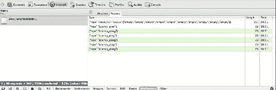
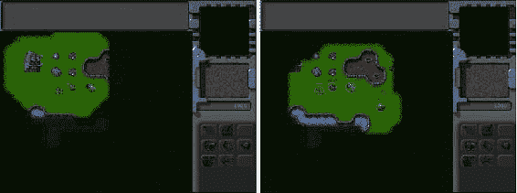
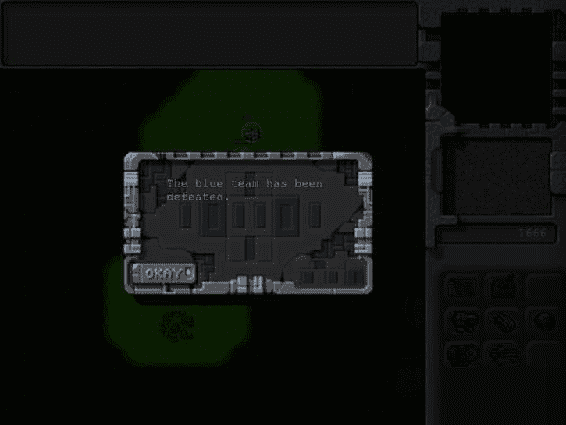
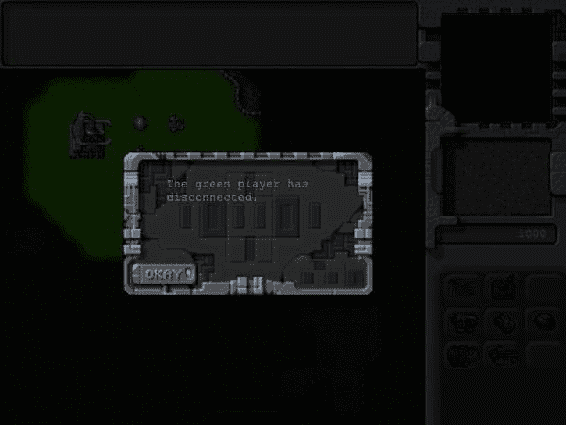
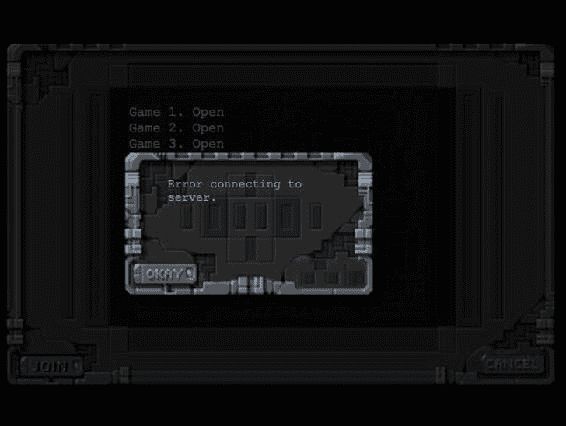
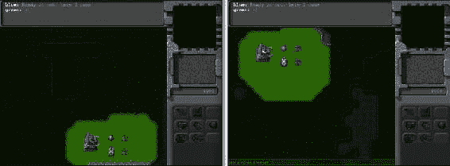

# 十二、多人游戏

在前一章中，我们看到了如何使用 WebSocket API 和 Node.js 服务器来实现简单的客户机-服务器网络架构。我们用它建立了一个简单的游戏大厅，这样两个玩家现在可以加入一个服务器上的游戏室，开始一个多人对战游戏。

在这一章中，我们将继续我们在第十一章结束时离开的地方，并使用锁步网络模型实现一个实际多人游戏的框架。我们将看看如何处理典型的游戏网络问题，如延迟和游戏同步。然后，我们将使用我们在前面章节中设计的 sendCommand()体系结构来确保玩家的命令在两种浏览器上都能执行，从而使游戏保持同步。然后我们将像在第十章中那样使用触发器来实现游戏中的输赢。最后，我们将为我们的游戏实现一个聊天系统。

我们开始吧。

锁步网络模型

到目前为止，我们使用 Node.js 服务器来传递简单的消息，例如游戏大厅状态和加入或离开房间。这些信息相互独立，一个玩家的信息不会影响另一个玩家。然而，当涉及到游戏时，这种交流会变得稍微复杂一些。

构建多人游戏最重要的挑战之一是确保所有玩家同步。这意味着每次游戏中发生变化时(例如，一个玩家发出移动或攻击命令)，该变化会传达给其他玩家，以便他们也可以做出相同的变化。

更重要的是，动作或变化同时发生在两个玩家的机器上。如果在执行这些改变时有延迟，单位位置的细微差异将最终积累，导致游戏状态之间明显的差异。

举例来说，一个单位在到达敌人的位置时只晚了半秒钟，可能会躲过敌人的攻击并在一个浏览器中存活下来，而同一个单位可能会在另一个玩家的浏览器中被摧毁。当这样的事情发生时，两个玩家正在玩两个完全不同的游戏，而不是同一个游戏。

为了确保两个玩家完全同步，我们将实现一个被称为*锁步*网络模型的架构。两个玩家将以相同的游戏状态开始。当玩家给一个单位下命令时，我们会把命令发送到服务器，而不是立即执行。然后，服务器将向连接的玩家发送相同的命令，并指示何时执行该命令。一旦玩家收到命令，他们将同时执行，确保游戏保持同步。

服务器将通过运行自己的游戏计时器来实现这一行为，其速度为每秒 10 个时钟周期。当玩家向服务器发送命令时，服务器将记录收到命令时的时钟滴答声。然后，服务器将命令发送给玩家，同时指定执行命令的游戏记号。玩家将依次跟踪当前的游戏节拍，并在正确的节拍执行命令。

需要记住的一点是，由于服务器需要同时执行所有玩家的命令，所以它需要等待所有玩家的命令到达，然后才能前进到下一个游戏节拍，这就是为什么它被称为*锁步*。

由于网络延迟会导致通信延迟，消息有时需要数百毫秒才能在客户端和服务器之间传输，因此这一过程变得更加复杂。我们的网络模型需要测量并考虑这种延迟，以确保游戏流畅。

我们将从修改游戏代码开始，在玩家第一次连接到服务器时测量每个玩家的网络延迟。

测量网络延迟

出于我们的目的，我们将延迟定义为消息从服务器传输到客户端所花费的时间。我们将通过在服务器和客户端之间来回发送几条消息来测量这种延迟，然后取每次传输所用时间的平均值。

我们将从定义两种测量 server.js 内部延迟的新方法开始，如清单 12-1 所示。

***清单 12-1。*** 测量网络延迟的方法(server.js)

```html
function measureLatency(player){
    var connection = player.connection;
    var measurement = {start:Date.now()};
    player.latencyTrips.push(measurement);
    var clientMessage = {type:"latency_ping"};
    connection.send(JSON.stringify(clientMessage));
}
function finishMeasuringLatency(player,clientMessage){
    var measurement = player.latencyTrips[player.latencyTrips.length-1];
    measurement.end = Date.now();
    measurement.roundTrip = measurement.end - measurement.start;
    player.averageLatency = 0;
    for (var i=0; i < player.latencyTrips.length; i++) {
        player.averageLatency += measurement.roundTrip/2;
    };
    player.averageLatency = player.averageLatency/player.latencyTrips.length;
    player.tickLag = Math.round(player.averageLatency * 2/100)+1;
    console.log("Measuring Latency for player. Attempt", player.latencyTrips.length, "- Average Latency:",player.averageLatency, "Tick Lag:", player.tickLag);
}
```

在 measureLatency()方法中，我们首先创建一个新的 measurement 对象，将 start 属性设置为当前时间，并将该对象添加到 player.latencyTrips 数组中。然后，我们向播放器发送 latency_ping 类型的消息。播放器将通过发回类型为 latency_pong 的消息来响应此消息。

在 finishMeasuringLatency()方法中，我们从 player.latencyTrips 数组中获取最后一次测量值，并将其 end 属性设置为当前时间，将其 roundTrip 属性设置为结束时间和开始时间之间的差值。

然后，我们计算玩家的平均等待时间，方法是将所有往返值相加，然后将总和除以往返次数。

最后，我们使用 averageLatency 来计算玩家的 tickLag 属性。这是发送命令后，玩家可以安全地预期已经收到命令的滴答数。启发式算法使用的值是典型延迟的 200 %,最小值为一个游戏节拍。

如果你愿意，你可以尝试这种启发式方法，并对它进行精确的微调；但是，出于游戏流畅的目的，高值更安全。人们发现，只要延迟一致，玩家就能够习惯网络延迟并自动进行调整。任何时候滞后变化太大，玩家往往会感到沮丧。

接下来我们将修改多人游戏对象的 handleWebSocketMessage()方法来响应服务器的 latency_ping 消息，如清单 12-2 所示。

***清单 12-2。*** 响应 latency_ping 用 latency_pong (multiplayer.js)

```html
handleWebSocketMessage:function(message){
    var messageObject = JSON.parse(message.data);
    switch (messageObject.type){
        case "room_list":
            multiplayer.updateRoomStatus(messageObject.status);
            break;
        case "joined_room":
            multiplayer.roomId = messageObject.roomId;
            multiplayer.color = messageObject.color;
            break;
        case "init_level":
            multiplayer.initMultiplayerLevel(messageObject);
            break;
        case "start_game":
            multiplayer.startGame();
            break;
        case "latency_ping":
            multiplayer.sendWebSocketMessage({type:"latency_pong"});
            break;
    }
},
```

当浏览器从服务器收到 latency_ping 消息时，它会立即向服务器发回 latency_pong 消息。

最后，我们将修改服务器上 websocket 对象的请求事件处理程序，以便在播放器连接时开始测量延迟，并在播放器发回 latency_pong 响应时结束测量延迟，如清单 12-3 所示。

***清单 12-3。*** 开始和结束延迟测量(server.js)

```html
wsServer.on('request',function(request){
    if(!connectionIsAllowed(request)){
        request.reject();
        console.log('Connection from ' + request.remoteAddress + ' rejected.');
        return;
    }

    var connection = request.accept();
    console.log('Connection from ' + request.remoteAddress + ' accepted.');

    // Add the player to the players array
    var player = {
        connection:connection,
        latencyTrips:[]
    }
    players.push(player);

    // Send a fresh game room status list the first time player connects
    sendRoomList(connection);

    // Measure latency for player
    measureLatency(player);

    // On Message event handler for a connection
    connection.on('message', function(message) {
        if (message.type === 'utf8') {
            var clientMessage = JSON.parse(message.utf8Data);
            switch (clientMessage.type){
                case "join_room":
                    var room = joinRoom(player,clientMessage.roomId);
                    sendRoomListToEveryone();
                    if(room.players.length == 2){
                        initGame(room);
                    }
                    break;
                case "leave_room":
                    leaveRoom(player,clientMessage.roomId);
                    sendRoomListToEveryone();
                    break;
                case "initialized_level":
                    player.room.playersReady++;
                    if (player.room.playersReady==2){
                        startGame(player.room);
                    }
                    break;
                case "latency_pong":
                    finishMeasuringLatency(player,clientMessage);
                    // Measure latency at least thrice
                    if(player.latencyTrips.length<3){
                        measureLatency(player);
                    }
                    break;
            }
        }
    });

    connection.on('close', function(reasonCode, description) {
        console.log('Connection from ' + request.remoteAddress + ' disconnected.');
        for (var i = players.length - 1; i >= 0; i--){
            if (players[i]==player){
                players.splice(i,1);
            }
        };

        // If the player is in a room, remove him from room and notify everyone
        if(player.room){
            var status = player.room.status;
            var roomId = player.room.roomId;

            leaveRoom(player,roomId);

            sendRoomListToEveryone();
        }
    });
});
```

我们首先向 player 对象添加 latencyTrips 数组，并在播放器连接后调用 measureLatency()。

然后我们修改消息处理程序来处理 latency_pong 类型的消息。当播放器用 latency_pong 消息响应 latency_ping 消息时，我们调用我们前面定义的 finishMeasuringLatency()方法。然后，我们检查是否至少有三个延迟测量值，如果没有，再次调用 measureLatency()方法。

现在，如果您启动服务器并运行游戏，服务器将进行三次尝试来测量延迟。使用浏览器的开发者控制台可以看到 Websocket 通信，如图图 12-1 所示。



图 12-1。观察开发人员控制台中的 websocket 通信

现在我们已经测量了玩家的延迟，是时候执行发送命令了。

发送命令

一旦游戏开始，我们将在服务器和客户端上维护一个带有游戏刻度号的游戏时钟。当一个玩家向服务器发送一个命令时，我们将把这个命令发送回客户端，并附上指令，以便在稍后使用 tickLag 计算的时间执行这个命令。

我们将从修改多人游戏对象的 handleWebSocketMessage()方法来接收 game_tick 消息中的命令开始，如清单 12-4 所示。

***清单 12-4。*** 在 game_tick 消息中接收命令(multiplayer.js)

```html
handleWebSocketMessage:function(message){
    var messageObject = JSON.parse(message.data);
    switch (messageObject.type){
        case "room_list":
            multiplayer.updateRoomStatus(messageObject.status);
            break;
        case "joined_room":
            multiplayer.roomId = messageObject.roomId;
            multiplayer.color = messageObject.color;
            break;
        case "init_level":
            multiplayer.initMultiplayerLevel(messageObject);
            break;
        case "start_game":
            multiplayer.startGame();
            break;
        case "latency_ping":
            multiplayer.sendWebSocketMessage({type:"latency_pong"});
            break;
        case "game_tick":
            multiplayer.lastReceivedTick = messageObject.tick;
            multiplayer.commands[messageObject.tick] = messageObject.commands;
            break;
    }
},
```

当我们从服务器接收到一个 game_tick 消息，其中包含命令列表和命令需要执行的 tick 号时，我们将命令保存在 multiplayer.commands 数组中，然后更新 lastReceivedTick 变量。

接下来我们将实现游戏循环并处理发送命令，如清单 12-5 所示。

***清单 12-5。** 客户端发送命令(multiplayer.js)*

```html
startGame:function(){
    fog.initLevel();
    game.animationLoop();
    multiplayer.animationInterval = setInterval(multiplayer.tickLoop, game.animationTimeout);
    game.start();
},
sendCommand:function(uids,details){
    multiplayer.sentCommandForTick = true;
    multiplayer.sendWebSocketMessage({type:"command",uids:uids, details:details,currentTick:multiplayer.currentTick});
},
tickLoop:function(){
    // if the commands for that tick have been received
    // execute the commands and move on to the next tick
    // otherwise wait for server to catch up
    if(multiplayer.currentTick <= multiplayer.lastReceivedTick){
        var commands = multiplayer.commands[multiplayer.currentTick];
        if(commands){
            for (var i=0; i < commands.length; i++) {
                game.processCommand(commands[i].uids,commands[i].details);
            };
        }

        game.animationLoop();

        // In case no command was sent for this current tick, send an empty command to the server
        // So that the server knows that everything is working smoothly
        if (!multiplayer.sentCommandForTick){
            multiplayer.sendCommand();
        }
        multiplayer.currentTick++;
        multiplayer.sentCommandForTick = false;
    }
},
```

首先，在 startGame()方法中，我们设置了一个间隔，在游戏开始时每隔 100 毫秒调用一次 tickLoop()方法。

接下来，在 sendCommand()方法中，我们向服务器发送命令类型的消息，其中包含命令的详细信息以及命令的 uid。

命令消息还包含当前的游戏滴答。这样，命令消息就像一个心跳，让服务器知道客户端当前在玩什么游戏。我们还将 sendCommandForTick 标志设置为 true。

在 tickLoop()方法中，我们检查是否收到了当前 tick 的命令。如果没有，我们将等待来自服务器的命令。

如果我们收到了 tick 的命令，我们将使用 game.processCommand()方法处理所有收到的命令。然后我们调用 game.animationLoop()方法。

如果到目前为止我们还没有发出任何命令，我们也向服务器发送一个空命令。

最后，我们增加游戏刻度数并清除 sentCommandForTick 标志。

现在客户机已经修改为发送和接收命令，我们将修改服务器来处理这些命令。

我们将从修改服务器上的消息事件处理程序来处理命令类型的消息开始，如清单 12-6 所示。

***清单 12-6。*** 处理命令类型的消息(server.js)

```html
// On Message event handler for a connection
connection.on('message', function(message) {
    if (message.type === 'utf8') {
        var clientMessage = JSON.parse(message.utf8Data);
        switch (clientMessage.type){
            case "join_room":
                var room = joinRoom(player,clientMessage.roomId);
                sendRoomListToEveryone();
                if(room.players.length == 2){
                    initGame(room);
                }
                break;
            case "leave_room":
                leaveRoom(player,clientMessage.roomId);
                sendRoomListToEveryone();
                break;
            case "initialized_level":
                player.room.playersReady++;
                if (player.room.playersReady==2){
                    startGame(player.room);
                }
                break;
            case "latency_pong":
                finishMeasuringLatency(player,clientMessage);
                // Measure latency at least thrice
                if(player.latencyTrips.length<3){
                    measureLatency(player);
                }
                break;
            case "command":
                if (player.room && player.room.status=="running"){
                    if(clientMessage.uids){
                        player.room.commands.push({uids:clientMessage.uids, details:clientMessage.details});
                    }
                    player.room.lastTickConfirmed[player.color] = clientMessage.currentTick + player.tickLag;
                }
                break;
        }
    }
});
```

当服务器收到命令类型的消息时，我们检查消息是否有 uid。如果是这样，我们将命令存储在房间的命令数组中。否则，该消息只是一个心跳消息，没有需要保存的命令。然后，我们更新播放器的 lastTickConfirmed 属性。

接下来，我们将修改 server.js 中的 startGame()方法，如清单 12-7 所示。

***清单 12-7。*** 修改 startGame()方法(server.js)

```html
function startGame(room){
    console.log("Both players are ready. Starting game in room",room.roomId);
    room.status = "running";
    sendRoomListToEveryone();
    // Notify players to start the game
    sendRoomWebSocketMessage(room,{type:"start_game"});

    room.commands = [];
    room.lastTickConfirmed = {"blue":0,"green":0};
    room.currentTick = 0;

    // Calculate tick lag for room as the max of both player's tick lags
    var roomTickLag = Math.max(room.players[0].tickLag,room.players[1].tickLag);

    room.interval = setInterval(function(){
        // Confirm that both players have send in commands for up to present tick
        if(room.lastTickConfirmed["blue"] >= room.currentTick && room.lastTickConfirmed["green"] >= room.currentTick){
            // Commands should be executed after the tick lag
            sendRoomWebSocketMessage(room,{type:"game_tick", tick:room.currentTick+roomTickLag, commands:room.commands});
            room.currentTick++;
            room.commands = [];
        } else {
            // One of the players is causing the game to lag. Handle appropriately
            if(room.lastTickConfirmed["blue"] < room.currentTick){
                console.log ("Room",room.roomId,"Blue is lagging on Tick:",room.currentTick,"by", room.currentTick-room.lastTickConfirmed["blue"]);
            }
            if(room.lastTickConfirmed["green"] < room.currentTick){
                console.log ("Room",room.roomId,"Green is lagging on Tick:", room.currentTick, "by", room.currentTick-room.lastTickConfirmed["green"]);
            }
        }
    },100);
}
```

当游戏开始时，我们初始化房间的命令数组、currentTick 和 lastTickConfirmed 对象。然后，我们计算房间的刻度滞后，作为两个玩家的最大刻度滞后，并将其保存在 roomTickLag 变量中。

然后，我们使用 setInterval()启动游戏的计时器循环。在这个循环中，我们首先检查两个玩家是否通过发送当前游戏滴答的命令赶上了服务器。

如果是这样，我们向玩家发送一个带有命令列表的 game_tick 消息，并要求他们在当前 tick 之后执行命令 roomTickLag ticks。这样，两个玩家将同时执行命令，即使消息需要一点时间到达玩家。

然后，我们清除服务器上的命令数组，并增加房间的 currentTick 变量。

如果服务器没有收到来自两个客户端的对当前节拍的确认，我们将向控制台记录一条消息，并且不增加节拍。您可以修改这段代码来检查服务器是否已经等待了很长时间，如果是这样，就向玩家发送一个通知，告诉他们服务器正在经历延迟。

如果你启动服务器并在两个不同的浏览器上运行游戏，你应该能够指挥单位并进行你的第一次多人对战，如图图 12-2 所示。



图 12-2。多人对战中的指挥单位

我们游戏的多人游戏部分现在可以运行了。现在两种浏览器都在同一台机器上。您可以将服务器代码移动到单独的 Node.js 机器上，并修改 multiplayer 对象以指向这个新服务器，而不是 localhost。如果你想迁移到公共服务器，你可以找到几个提供 Node.js 支持的主机提供商，比如 Nodester([`nodester.com`](http://nodester.com))和 node jitsu([`nodejitsu.com/`](http://nodejitsu.com/))。

现在我们已经实现了发送命令，我们将实现结束多人游戏。

结束多人游戏

多人游戏有两种结束方式。第一个是如果一个玩家通过满足等级要求来击败另一个玩家。另一种情况是玩家关闭浏览器或者与服务器断开连接。

当玩家被击败时结束游戏

我们将使用触发事件来结束游戏，就像我们在第十章中所做的一样。这给了我们设计不同类型的多人游戏关卡的灵活性，比如夺旗或死亡竞赛。我们只是被我们的想象力所限制。

现在，当一方被完全摧毁时，我们将使关卡结束。我们将从在多人游戏地图中创建一个简单的触发事件开始，如清单 12-8 所示。

***清单 12-8。*** 结束多人关卡的触发器(maps.js)

```html
/* Conditional and Timed Trigger Events */
"triggers":[
    /* Lose if not even one item is left */
    {"type":"conditional",
        "condition":function(){
            for (var i=0; i < game.items.length; i++) {
                if(game.items[i].team == game.team){
                    return false;
                }
            };
            return true;
        },
        "action":function(){
            multiplayer.loseGame();
        }
    },
]
```

在条件触发器中，我们检查 game.items 数组是否包含至少一个属于玩家的项目。如果玩家没有剩余的物品，我们调用 loseGame()方法。

接下来我们将添加 loseGame()和 endGame()方法到多人游戏对象中，如清单 12-9 所示。

***清单 12-9。*** 添加 loseGame()和 endgame()方法(multiplayer.js)

```html
// Tell the server that the player has lost
loseGame:function(){
    multiplayer.sendWebSocketMessage({type:"lose_game"});
},
endGame:function(reason){
    game.running = false
    clearInterval(multiplayer.animationInterval);
    // Show reason for game ending, and on OK, exit multiplayer screen
    game.showMessageBox(reason,multiplayer.closeAndExit);
}
```

在 loseGame()方法中，我们向服务器发送一条 lose_game 类型的消息，让它知道玩家输掉了游戏。

在 endGame()方法中，我们清除 game.running 标志和 multiplayer.animationInterval 间隔。然后我们显示一个消息框，说明结束游戏的原因，最后在单击消息框上的 OK 按钮后调用 multiplayer.closeAndExit()方法。

接下来，我们将在 server.js 中定义一个新的 endGame()方法，如清单 12-10 所示。

***清单 12-10。*** 服务器残局()方法(server.js)

```html
function endGame(room,reason){
    clearInterval(room.interval);
    room.status = "empty";
    sendRoomWebSocketMessage(room,{type:"end_game",reason:reason})
    for (var i = room.players.length - 1; i >= 0; i--){
        leaveRoom(room.players[i],room.roomId);
    };
    sendRoomListToEveryone();
}
```

我们从清除游戏循环的间隔开始。然后，我们将 end_game 消息发送给房间中的所有玩家，原因作为参数提供。然后，我们将房间设置为空，并使用 leaveRoom()方法将所有玩家从房间中移除。最后，我们将更新后的房间列表发送给所有连接的玩家。

接下来，我们将修改服务器上的消息事件处理程序来处理 lose_game 类型的消息，如清单 12-11 所示。

***清单 12-11。*** 处理 lose_game 类型的消息(server.js)

```html
// On Message event handler for a connection
connection.on('message', function(message) {
    if (message.type === 'utf8') {
        var clientMessage = JSON.parse(message.utf8Data);
        switch (clientMessage.type){
            case "join_room":
                var room = joinRoom(player,clientMessage.roomId);
                sendRoomListToEveryone();
                if(room.players.length == 2){
                    initGame(room);
                }
                break;
            case "leave_room":
                leaveRoom(player,clientMessage.roomId);
                sendRoomListToEveryone();
                break;
            case "initialized_level":
                player.room.playersReady++;
                if (player.room.playersReady==2){
                    startGame(player.room);
                }
                break;
            case "latency_pong":
                finishMeasuringLatency(player,clientMessage);
                // Measure latency at least thrice
                if(player.latencyTrips.length<3){
                    measureLatency(player);
                }
                break;
            case "command":
                if (player.room && player.room.status=="running"){
                    if(clientMessage.uids){
                        player.room.commands.push({uids:clientMessage.uids, details:clientMessage.details});
                    }
                    player.room.lastTickConfirmed[player.color] = clientMessage.currentTick + player.tickLag;
                }
                break;
            case "lose_game":
                endGame(player.room, "The "+ player.color +" team has been defeated.");
                break;
        }
    }
});
```

当我们收到一个玩家发来的 lose_game 消息时，我们调用 endGame()方法，给出结束游戏的原因。

最后，我们将修改多人游戏对象的 handleWebSocketMessage()方法来接收 end_game 类型的消息，如清单 12-12 所示。

***清单 12-12。*** 接收 end_game (multiplayer.js)类型的消息

```html
handleWebSocketMessage:function(message){
    var messageObject = JSON.parse(message.data);
    switch (messageObject.type){
        case "room_list":
            multiplayer.updateRoomStatus(messageObject.status);
            break;
        case "joined_room":
            multiplayer.roomId = messageObject.roomId;
            multiplayer.color = messageObject.color;
            break;
        case "init_level":
            multiplayer.initMultiplayerLevel(messageObject);
            break;
        case "start_game":
            multiplayer.startGame();
            break;
        case "latency_ping":
            multiplayer.sendWebSocketMessage({type:"latency_pong"});
            break;
        case "game_tick":
            multiplayer.lastReceivedTick = messageObject.tick;
            multiplayer.commands[messageObject.tick] = messageObject.commands;
            break;
        case "end_game":
            multiplayer.endGame(messageObject.reason);
            break;
    }
},
```

当客户端收到 end_game 消息时，我们调用 multiplayer.endGame()并在消息中提供原因。

如果你启动服务器并运行游戏，当一个玩家摧毁所有其他玩家的单位和建筑时，你会看到一个消息框，如图 12-3 所示。



图 12-3。当一方击败另一方时，游戏结束

如果你点击 ok 按钮，你应该会回到主游戏菜单。您会注意到，当游戏结束时，大厅会自动显示房间为空，以便下一组玩家可以加入房间。

当玩家关闭浏览器或与服务器断开连接时，我们也会结束游戏。

当玩家断线时结束游戏

每当玩家在玩游戏时断开与服务器的连接，都会触发服务器上的 websocket close 事件。我们将通过修改服务器上的 close 事件处理程序来处理这个断开，如清单 12-13 所示。

***清单 12-13。*** 处理玩家断线(server.js)

```html
connection.on('close', function(reasonCode, description) {
    console.log('Connection from ' + request.remoteAddress + ' disconnected.');

    for (var i = players.length - 1; i >= 0; i--){
        if (players[i]==player){
            players.splice(i,1);
        }
    };

    // If the player is in a room, remove him from room and notify everyone
    if(player.room){
        var status = player.room.status;
        var roomId = player.room.roomId;
        // If the game was running, end the game as well
        if(status=="running"){
            endGame(player.room, "The "+ player.color +" player has disconnected.");
        } else {
            leaveRoom(player,roomId);
        }
        sendRoomListToEveryone();
    }
});
```

如果玩家在一个房间里，我们会将玩家从房间中移除，并将更新后的房间列表发送给每个人。如果游戏正在运行，我们也调用 endgame()方法，原因是玩家已经断开连接。

如果你启动服务器并开始一个多人游戏，当任何一个玩家断开连接时，你应该会看到一个断开消息，如图 12-4 所示。



图 12-4。玩家断线时显示的消息

单击“确定”按钮将带您回到主菜单屏幕。同样，大厅会自动显示房间为空，以便下一组玩家可以加入房间。

我们要处理的最后一件事是，如果出现连接错误并且连接丢失，就结束游戏。

失去连接时结束游戏

每当客户端与服务器断开连接或发生错误时，都会触发客户端上的错误或关闭事件。我们将通过在多人游戏对象的 start()方法中实现这些事件处理程序来处理这个问题，如清单 12-14 所示。

***清单 12-14。*** 处理连接错误(multiplayer.js)

```html
start:function(){
    game.type = "multiplayer";
    var WebSocketObject = window.WebSocket || window.MozWebSocket;
    if (!WebSocketObject){
        game.showMessageBox("Your browser does not support WebSocket. Multiplayer will not work.");
        return;
    }
    this.websocket = new WebSocketObject(this.websocket_url);
    this.websocket.onmessage = multiplayer.handleWebSocketMessage;
    // Display multiplayer lobby screen after connecting
    this.websocket.onopen = function(){
        // Hide the starting menu layer
        $('.gamelayer').hide();
        $('#multiplayerlobbyscreen').show();
    }

    this.websocket.onclose = function(){
        multiplayer.endGame("Error connecting to server.");
    }

    this.websocket.onerror = function(){
        multiplayer.endGame("Error connecting to server.");
    }
},
```

对于这两个事件，我们调用 endGame()方法并显示一条错误消息。如果你现在运行游戏，关闭服务器重新创建服务器断开连接，你应该会看到一个错误信息，如图图 12-5 所示。



图 12-5。出现连接错误时显示的消息

如果玩家在大厅或玩游戏时出现连接问题，浏览器将显示此错误消息，然后返回游戏主屏幕。

一个更健壮的实现将包括尝试在超时时间内重新连接到服务器，然后继续游戏。我们可以通过将带有唯一玩家 ID 的重新连接消息传递给服务器并在服务器端适当地处理该消息来实现这一点。然而，我们将坚持在我们的游戏中使用这个更简单的实现。

在我们结束游戏的多人部分之前，我们将实现游戏中的最后一个功能:玩家聊天。

实现玩家聊天

我们将从在 index.html 的 gameinterfacescreen 层中为聊天消息定义一个输入框开始，如清单 12-15 所示。

***清单 12-15。*** 添加聊天消息输入框(index.html)

```html
<div id="gameinterfacescreen" class="gamelayer">
    <div id="gamemessages"></div>
    <div id="callerpicture"></div>
    <div id="cash"></div>
    <div id="sidebarbuttons">
        <input type="button" id="starportbutton" title = "Starport">
        <input type="button" id="turretbutton" title = "Turret">
        <input type="button" id="placeholder1" disabled>

        <input type="button" id="scouttankbutton" title = "Scout Tank">
        <input type="button" id="heavytankbutton" title = "Heavy Tank">
        <input type="button" id="harvesterbutton" title = "Harvester">

        <input type="button" id="chopperbutton" title = "Copter">
        <input type="button" id="wraithbutton" title = "Wraith">
        <input type="button" id="placeholder2" disabled>

    </div>
    <canvas id="gamebackgroundcanvas" height="400" width="480"></canvas>
    <canvas id="gameforegroundcanvas" height="400" width="480"></canvas>
    <input type="text" id="chatmessage"></input>
</div>
```

接下来，我们将为 styles.css 中的聊天消息输入添加一些额外的样式，如清单 12-16 所示。

***清单 12-16。*** 聊天消息输入框样式(styles.css)

```html
#chatmessage{
    position:absolute;
    top:460px;
    width:479px;
    background:rgba(0,255,0,0.1);
    color:green;
    border:1px solid green;
    display:none;
}
#chatmessage:focus {
    outline:none;
}
```

接下来我们将为 multiplayer.js 中的 keydown 事件添加一个事件处理程序，如清单 12-17 中的所示。

***清单 12-17。***【Handing Keydown 事件】处理聊天消息输入(multiplayer.js)

```html
$(window).keydown(function(e){
    // Chatting only allowed in multiplayer when game is running
    if(game.type != "multiplayer" || !game.running){
        return;
    }

    var keyPressed = e.which;
    if (e.which == 13){ // Enter key pressed
        var isVisible = $('#chatmessage').is(':visible');
        if (isVisible){
            // if chat box is visible, pressing enter sends the message and hides the chat box
            if ($('#chatmessage').val()!= ''){
                multiplayer.sendWebSocketMessage({type:"chat",message:$('#chatmessage').val()});
                $('#chatmessage').val('');
            }
            $('#chatmessage').hide();
        } else {
            // if chat box is not visible, pressing enter shows the chat box
            $('#chatmessage').show();
            $('#chatmessage').focus();
        }
        e.preventDefault();
    } else if (e.which==27){ // Escape key pressed
        // Pressing escape hides the chat box
        $('#chatmessage').hide();
        $('#chatmessage').val('');
        e.preventDefault();
    }
});
```

每当一个键被按下，我们首先确认游戏是一个多人游戏，它正在运行，如果不是就退出。如果按下的键是回车键(键代码 13)，我们首先检查 chatmessage 输入框是否可见。如果它是可见的，我们就把消息框的内容放在聊天类型的消息中发送给服务器。然后我们清除输入框的内容并隐藏它。如果输入框不可见，我们将显示聊天输入框并将焦点设置到它上面。如果按下的键是 Escape(键代码 27)，我们清除输入框的内容并隐藏它。接下来，我们将修改服务器上的消息事件处理程序来处理 chat 类型的消息，如清单 12-18 所示。

***清单 12-18。*** 处理聊天类型的消息(server.js)

```html
// On Message event handler for a connection
connection.on('message', function(message) {
    if (message.type === 'utf8') {
        var clientMessage = JSON.parse(message.utf8Data);
        switch (clientMessage.type){
            case "join_room":
                var room = joinRoom(player,clientMessage.roomId);
                sendRoomListToEveryone();
                if(room.players.length == 2){
                    initGame(room);
                }
                break;
            case "leave_room":
                leaveRoom(player,clientMessage.roomId);
                sendRoomListToEveryone();
                break;
            case "initialized_level":
                player.room.playersReady++;
                if (player.room.playersReady==2){
                    startGame(player.room);
                }
                break;
            case "latency_pong":
                finishMeasuringLatency(player,clientMessage);
                // Measure latency at least thrice
                if(player.latencyTrips.length<3){
                    measureLatency(player);
                }
                break;
            case "command":
                if (player.room && player.room.status=="running"){
                    if(clientMessage.uids){
                        player.room.commands.push({uids:clientMessage.uids, details:clientMessage.details});
                    }
                    player.room.lastTickConfirmed[player.color] = clientMessage.currentTick + player.tickLag;
                }
                break;
            case "lose_game":
                endGame(player.room, "The "+ player.color +" team has been defeated.");
                break;
            case "chat":
                if (player.room && player.room.status=="running"){
                    var cleanedMessage = clientMessage.message.replace(/[<>]/g,"");
                    sendRoomWebSocketMessage(player.room,{type:"chat", from:player.color, message:cleanedMessage});
                }
                break;
        }
    }
});
```

当我们从一个玩家那里收到一条聊天类型的消息时，我们向房间中的所有玩家发回一条聊天类型的消息，将 from 属性设置为玩家的颜色，将 message 属性设置为我们刚刚收到的消息。

理想情况下，您应该验证聊天消息，这样玩家就不能在聊天消息中发送恶意的 HTML 和脚本标签。现在，我们使用一个简单的正则表达式在发送消息之前从消息中去掉所有的 HTML 标签。

最后，我们将修改多人游戏对象的 handleWebSocketMessage()方法来接收聊天类型的消息，如清单 12-19 所示。

***清单 12-19。*** 接收聊天类型的消息(multiplayer.js)

```html
handleWebSocketMessage:function(message){
    var messageObject = JSON.parse(message.data);
    switch (messageObject.type){
        case "room_list":
            multiplayer.updateRoomStatus(messageObject.status);
            break;
        case "joined_room":
            multiplayer.roomId = messageObject.roomId;
            multiplayer.color = messageObject.color;
            break;
        case "init_level":
            multiplayer.initMultiplayerLevel(messageObject);
            break;
        case "start_game":
            multiplayer.startGame();
            break;
        case "latency_ping":
            multiplayer.sendWebSocketMessage({type:"latency_pong"});
            break;
        case "game_tick":
            multiplayer.lastReceivedTick = messageObject.tick;
            multiplayer.commands[messageObject.tick] = messageObject.commands;
            break;
        case "end_game":
            multiplayer.endGame(messageObject.reason);
            break;
        case "chat":
            game.showMessage(messageObject.from,messageObject.message);
            break;
    }
},
```

如果你现在启动服务器玩多人游戏，你应该可以从一个玩家向另一个玩家发送聊天消息，如图图 12-6 所示。



图 12-6。多人游戏中玩家之间的聊天

我们现在有一个多人游戏的工作玩家聊天。有了这最后的改变，我们可以认为我们的多人游戏结束了。

摘要

在这本书的过程中，我们已经走了很长的路。我们从查看构建游戏所需的 HTML5 的基本元素开始，例如在画布上绘图和制作动画、播放音频以及使用 sprite 表。

然后，我们使用这些基础知识构建了一个基于 Box2D 物理引擎的游戏，名为 *Froot Wars* 。在这个过程中，我们着眼于创建闪屏、素材加载器和可定制的级别。然后，我们检查了 Box2D 引擎的构建模块，并将 Box2D 与游戏集成在一起，以创建逼真的物理效果。然后我们添加了音效和背景音乐来制作一个非常精美的游戏。

之后我们构建了一个完整的即时战略游戏，名为*失落的殖民地*。在前几章的基础上，我们首先创造了一个单人游戏世界，有很大的可平移关卡和不同类型的实体。我们增加了使用寻路和转向的智能运动，使用状态和触发器的战斗，甚至游戏经济。然后，我们看到了如何使用这个框架来讲述一个令人信服的单人战役故事。

最后，在最后两章中，我们使用 Node.js 和 WebSockets 为我们的游戏添加了多人支持。我们从 WebSocket 通信的基础开始，用它来创建一个多人游戏大厅。

然后，我们使用锁步网络模型实现了一个多人游戏的框架，在保持游戏同步的同时也补偿了网络延迟。我们使用触发事件处理连接错误和游戏完成。最后，我们建立了一个聊天系统，在玩家之间发送消息。

如果你一直在跟随，你现在应该有知识、资源和信心在 HTML5 中构建你自己的令人惊奇的游戏。

我写这本书的目的是揭开在 HTML5 中构建复杂游戏的神秘面纱，并为您提供自己构建这类游戏所需的一切。

如果你有问题或反馈，你可以通过我网站上这本书的专用页面联系我，地址是[www.adityaravishankar.com/pro-html5-games/](http://www.adityaravishankar.com/pro-html5-games/)。我很想听听你是如何将这本书作为你自己项目的起点的。

我祝你在游戏编程之旅中一切顺利。