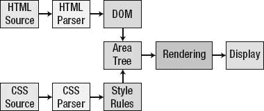
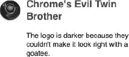
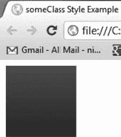
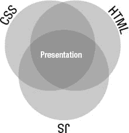
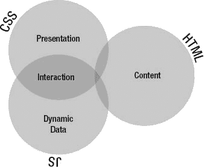
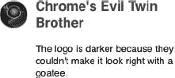

# 二、开发原则

发现一些有用的原则后，我们在整本书中反复使用它们(当然，也贯穿于我们在书外的工作)。这些原则是我们在书中将要说的一切的基础。因此，我们认为我们应该在这里描述它们，然后再继续讨论更具体的主题。以下部分展示了我们所采用的设计和开发原则:

*   现代浏览器性能代码
*   使用 CSS 管理边界
*   拥抱渐进增强
*   拥抱关注点的分离

当我们在大型开发团队中工作时，这些原则让我们为访问我们网站的人、为我们自己、为我们的同事实现最好的性能。其中一些原则(尤其是使用 CSS 来管理边界)也让我们避免了一些最大的跨浏览器难题。

### 现代浏览器性能代码

如果你想成为一名性能忍者，你必须了解浏览器是如何工作的(至少在广义上)。只有这样，你才能知道瓶颈在哪里，并围绕它们进行优化。图 2-1 显示了一个流程图，展示了你的代码(HTML & CSS)到你的访问者在浏览器中看到的最终呈现版本的过程。

***图 2-1。**浏览器正在处理的代码*

首先，HTML 被解析成一棵 DOM 树，也称为文档对象模型(DOM)。这就是为什么当浏览器遇到一个页面时，第一件事就是下载该页面的 HTML 内容。另一个原因是 HTML 包含对定义页面的所有其他资源(样式表、脚本、图像等等)的引用。然后，通过将 DOM 和样式规则(由 CSS 生成，包括您提供的和浏览器自带的)组合成一个渲染树(或者在 Firefox 中是一个框架树)来创建第二棵树。从这个渲染树中，浏览器开始在屏幕上显示或绘制元素。这幅画从左上角开始，从左到右，从上到下流动。

您可以通过两种方式获得性能:

*   减少 HTML 中的元素数量。
*   限制重画。

#### 减少 HTML 中的元素数量

通过减少 HTML 元素的数量(这些元素必须首先被解析成 DOM，然后再被解析成渲染树)，你可以让浏览器更快地到达显示端点(如图 2-1 所示)。减少 HTML 元素最简单的方法就是不要用它们来实现样式目标，而要用最少的 HTML 来实现设计目标。

记住关注点分离的原则，我们将在本章的后面详细讨论。让 HTML 包含内容，让 CSS 包含表示。这样做可以提高客户端的性能，并且由于更易于维护，还可以提高开发人员的性能。

#### 极限重绘

虽然减少 HTML 中的元素数量有所帮助，但是限制浏览器必须重绘(或重绘，因为操作有时是已知的)元素的次数通常更有帮助。Web 开发人员通过更改 DOM 或已显示元素的样式来强制重绘。

变更的性能成本取决于变更的范围。现代浏览器被设计成只重画必要的东西。因此，虽然更改元素的位置或插入新元素会导致大范围的重绘(因为它会影响同级元素)，但对背景颜色的样式更改只会导致该元素(及其子元素)的重绘。

在对 DOM 进行修改或重新设计元素时，应该考虑两个问题。第一个问题是 DOM 内部变化的深度。DOM 树越深，变化越孤立；因此，您应该尽可能在树的最下面进行更改。第二个也是更重要的问题是，如果你要对 DOM 做几个改变，要一次完成，而不是一次只做一个。由于第二个问题，在修改 DOM 时，CSS 可能是您最好的朋友。

例如，如果你想在双击时改变一个元素的宽度、背景颜色和文本颜色，你可以使用类似于清单 2-1 中所示的 JavaScript。

***清单 2-1。**创建多个重绘事件的 JavaScript】*

`<a href="javascript:;" id="example">I'm an Example</a>
`

在这个例子中，我们一次设置一个元素的样式。首先，脚本将背景颜色设置为红色(强制重绘)，然后将宽度设置为 200px(强制第二次重绘)，然后将文本颜色设置为白色(强制第三次重绘)。虽然您仍然可以以多种方式使用 JavaScript 来将这些样式更改合并到一个调用中，但是更容易且更易于维护的方式是使用 JavaScript 来设置包含所有这些属性的 CSS 类。这样做会将所有样式更改合并到一次重绘中。清单 2-2 展示了一个只强制一次重绘的重造型的例子。

***清单 2-2。**创建单个重绘事件的 JavaScript】*

`
<a href="javascript:;" id="example">I'm an Example</a>
`

最后，您应该将 CSS(包括对外部样式表的引用)放在 head 元素中，并将脚本放在 body 元素的底部。因为浏览器可以在完全解析 HTML 之前开始呈现元素，所以将 CSS 放在头部可以确保这些元素的样式正确。对性能来说更重要的是，您不希望元素必须被重绘，因为您在元素呈现后放置了一个样式声明。此外，无意中看到物品移动也是一种不好的视觉效果。此外，因为浏览器必须评估 JavaScript 文件，将它们放在 HTML 的开头会延迟视觉元素的呈现，并给访问者一种页面加载较慢的感觉。

我们将在下一章讨论将 CSS 放在顶部，将 JavaScript 放在底部。我们还将在下一章讨论一些避免重绘事件的其他方法。

### 使用 CSS 来管理边界

正如我们将在本章后面的“都是盒子”一节中详细讨论的那样，浏览器将网页呈现为一系列的盒子，而这些盒子通常包含其他的盒子。因此，我们可以说浏览器的自然呈现模型是盒中盒。知道了这一点，明智的做法是安排你的布局与浏览器实现的框中框呈现模型一起工作，而不是与之对抗。

为了充分利用这种框中框的实现，最好的办法是安排每个元素或元素组，使其完全包含在一个框中。相反，糟糕的事情是有东西从你的盒子里伸出来。我们将用一个例子来说明好的和坏的做法。

首先，让我们定义我们在做什么。我们希望创建一个文章堆栈，在文章文本的左侧包含一个图像，在文章文本的上方包含一个标题，并让文章文本垂直延伸到任意高度。我们称之为“堆栈”,因为它在页面上堆叠元素。图 2-2 显示了期望输出的示例。

***图 2-2。**我们的目标产量*

清单 2-3 显示了为这个文章堆栈提供内容的 HTML。

***清单 2-3。**我们文章栈背后的 HTML】*

`<article class="browserArticle">
  <h1 class="subTitle accentColor1">Chrome's Evil Twin Brother</h1>
  
  
The logo is darker because they couldn't make it look right with a goatee.

</article>`

清单 2-4 显示了一组 CSS 规则，这些规则将创建一个盒子，并把所有内容和我们想要的关系放在盒子里。

***清单 2-4。** CSS 把我们的文章堆叠在一个盒子里*

`.browserArticle
{
  /* We set the position: relative so the absolutely positioned
     element within uses this box to position itself */
  position: relative;
  width: 200px;
  padding-left: 48px;
  /* We set a minimum height in case there’s not enough content to make the box big enough
     to house the image. We use the height of the image plus 3 for the top offset. */
  min-height: 39px;
}

.subTitle
{
  font-size: 18px;
}

.evilChromeLogo
{
  background: url(img/evilChromeLogo.png) no-repeat 0 0;
  height: 36px;
  width: 38px;
  position: absolute;
  left: 0;
  top: 3px;
  z-index: 1;
}`  `.accentColor1
{
  color: #1C70AD;
}`

在清单 2-2 中的关键风格是`.browserArticle`规则。它指定了 200 像素的宽度，没有高度，给我们一个 200 像素宽的盒子，它将扩展到其内容的高度。它还指定了 48 像素的左填充值。我们将使用这 48 个像素作为放置图像的地方。除了指定背景图像及其高度和宽度之外，`.evilChromeLogo`规则还使用`position: absolute`规则和`left: 0 rule`将图像放在盒子的左边距上。以这种方式，我们创建了一个包含其边界内所有内容的盒子。这样，我们就不必考虑任何超出边界的内容可能会发生什么，因为那永远不会发生。

现在让我们看看创建相同布局的一种错误方法。我们仍然使用清单 2-3 中的 HTML 作为我们的内容来源。清单 2-5 展示了一种布局文章堆栈的不良实践。

***清单 2-5。**我们的文章堆栈有缺陷的 CSS*

`.browserArticle
{
  position: relative;
  width: 200px;
**  margin-left: 48px;**
  /* Removed paddingleft setting */
}

.subTitle
{
  font-size: 18px;
}

.evilChromeLogo
{
  background: url(img/evilChromeLogo.png) no-repeat 0 0;
  height: 36px;
  width: 38px;
  position: absolute;
**  left: -48px;**
  top: 3px;
**  /* Removed z-index setting */**
}

.accentColor1
{
  color: #1C70AD;
}`

这个清单的大部分与清单 2-4 相同。我们用粗体突出显示了这些变化。我们仍然在创建一个 200 像素宽的框，将文本放在框中，将图像放在文本的左边。不同的是，我们现在把图像放在盒子外面。`browserArticle`类指定左边距而不是左填充。`“evilChromeLogo”`类指定了一个 48 像素的左值(这个负数应该给你敲响警钟)。

问题是边距在定义边距的元素的框之外。填充位于定义填充的元素的框内。因此，虽然这两个规则集都适用于现代浏览器，但是清单 2-5 中的规则集更有可能在旧浏览器中遇到不一致。正如我们在下一节“拥抱渐进式改进”中所讨论的，您不希望给任何访问者留下不好的体验，即使他们使用的是过时的软件。

我们还发现，为整个文章堆栈定义一个框，然后设置“`left: 0`”将图像放在左边距，这样更自然(Mike 说，“感觉很好”)。代码的意图更加清晰，代码比负偏移方法更易于维护。

这个例子说明了我们的信念，即标记应该

*   清楚地表达它的意图(也就是说，包含有意义的标记)，这有助于我们的合作者知道我们在做什么。
*   为尽可能多的浏览器工作，省去了编写和维护额外跨浏览器代码的麻烦。
*   易于创建和维护，这在代码生命周期的后期增强了我们自己和团队成员的能力。
*   模块化，这使得重用成为可能。

我们应该多解释一下重用的目标。如果您编写的代码可以独立于上下文，它就可以被重用，因为它不受任何给定设置的约束。考虑购买按钮的例子。它是一个具有特定用途(支持购买)的界面元素，但它可能出现在许多不同的上下文中(例如产品详情页面、产品列表页面和特价页面)。将购买按钮模块化可以让我们把它放在任何我们想要的地方，而不必在每个地方都修改它。此外，因为我们没有用边界做任何奇怪的把戏，任何给定的模块在不同的情况下都更有可能表现良好。我们发现，一旦我们花时间在第一位置设置代码以供重用，达到重用可以让我们快速完成很多工作。

识别代码偏离这些目标的地方并不总是容易的。诀窍是观察任何使相邻框重叠的东西，包括向左的负偏移或向右的正偏移。

### 拥抱渐进式改进

渐进增强是这样一种实践，即让你的网站有一个所有浏览器都可以接受的基本设计，然后为日益现代的浏览器添加增强功能(也就是说，渐进地)。从 CSS/HTML 基础开始，让我们有一个可以在所有浏览器上工作的网站，并让我们有机会为支持 HTML5 功能的浏览器大大增强它的功能。清单 2-6 显示了一个 HTML 元素，它构成了一个简单例子的基础。

***清单 2-6。**一个简单的渐进增强示例的 HTML 元素*

`

`

清单 2-7 展示了 CSS(展示了渐进增强)来样式化清单 2-6 中显示的`div`元素。

***清单 2-7。**CSS 样式清单 2-6 通过渐进增强*

`.someClass
{` `  width: 100px;
  height: 100px;
  background-color: #2067f5;
  background-image: -webkit-gradient(linear, left top, left bottom, from(#2067f5), to(#154096));
  background-image: -webkit-linear-gradient(top, #2067f5, #154096);
  background-image: -moz-linear-gradient(top, #2067f5, #154096);
  background-image: -ms-linear-gradient(top, #2067f5, #154096);
  background-image: -o-linear-gradient(top, #2067f5, #154096);
  background-image: linear-gradient(to bottom, #2067f5, #154096);
}`

这里我们有一个 div，它将构成一个 100 × 100 像素的盒子。在 CSS 中，div 的背景现在有了一些渐进的增强。每个浏览器都能看懂的第一个后台声明:`background-color: #2067f5`。现在，如果您站点的访问者碰巧在能够理解接下来的六个声明之一的浏览器上查看这段代码，他们不仅会看到一个蓝色的框，还会看到一个带有漂亮渐变的框。本质上，每个人都得到了一个蓝盒子，但是一些访问者得到了一个更好的蓝盒子。

有许多工具可以帮助创建各种特定于浏览器的设置。我们用的一个是`[`css3please.com`](http://css3please.com)`

图 2-3 显示了 Chrome 浏览器中 someClass 样式的结果。

***图 2-3。**chrome 中的 someClass 风格示例*

正如你所看到的，它从一个中等的蓝色渐变到一个较暗的蓝色。

#### 使用特征检测来驱动渐进增强

在 HTML5 中，渐进式增强从未如此显著。支持 HTML5 的浏览器提供了大量的功能，我们可以用很少的开销来使用，因为它们是浏览器固有的。使用 HTML5，我们不需要向浏览器发送 JavaScript 文件，只需指定新的标记选项和 CSS3，让浏览器为我们做一些有趣的工作。然而，就目前而言，HTML5 的许多强大功能将不得不用旧浏览器上的脚本来完成，这样我们就可以在所有浏览器上获得相同的功能，不管它们是否支持 HTML5。

进入特征检测。通过使用特性检测，我们可以切换到更原生的特性，从而在浏览器中处理性能更好的特性。这是通过混合使用 JavaScript 中的布尔开关和 CSS 来实现的，前者用于检测浏览器支持的功能，后者用于在某个功能不受支持时提供替代实现。浏览器会忽略(而不是抛出错误)它不理解的 CSS 选择器或属性。因此，我们可以放入 CSS3 渐进增强，而 IE8(举例来说)会忽略它们(见清单 2-7 )。

在我们更多地讨论特征检测之前，让我们考虑一个常见的替代方案。许多网站试图检测每个访问者使用的浏览器，并显示针对该浏览器优化的页面。比方说，我们检测到一个使用 IE8 的访问者，并提供一些非 HTML5 的替代功能。虽然这种方法在理论上可行，但实际上却是一个巨大的负担。随着浏览器和版本的激增，维护一个网站的版本很快变得非常昂贵。此外，Chrome 和 Firefox 等浏览器的版本更新速度很快，Chrome 的版本更新是自动的，这增加了更多的开销。因此，将代码绑定到特定版本的浏览器变得更加难以管理。更糟糕的是，尝试这种策略的网站很快就会发现，开发人员除了维护所有这些特定于浏览器的版本之外，什么也不做，而且从不采用可以创造更好的访问者体验并最终创造更有利可图的网站的新技术。前面没有一个解决欺骗用户代理的问题，这会使情况变得更加复杂。

因此，我们强烈建议您使用功能检测，而不是特定于浏览器的网站版本。这样，你就可以发现你需要的功能是否可用，如果可用，就使用它们，如果不可用，就向访问者提供一个有吸引力的替代方案。因为很少有网站使用所有可用的功能，所以您可以只关注您需要的少数功能，这使得代码更易于维护，并确保每个访问者都能看到一个有吸引力的网站。

在撰写本文时，我们认为实现特性检测的最佳方式是使用 Modernizr 开源库。您可以在`[`www.modernizr.com/`](http://www.modernizr.com/)`找到 Modernizr 项目，并从`[`www.modernizr.com/download/`](http://www.modernizr.com/download/)`下载

Modernizr 通过使用 JavaScript 测试一个特性是否可用来工作；然后，它将一个类添加到 body 标签中，注明它是可用的还是不可用的(也就是说，添加了类`canvas`或`no-canvas`)。你也可以用 JavaScript(也就是`if(Modernizr.canvas){ do something })`来检查它的可用性。然而，它运行的每一个测试都有性能成本；虽然非常轻微，但每次测试仍然需要时间。因此，Modernizr 的另一个优点是，在下载 Modernizr 脚本文件时，您可以选择想要检测的特性。例如，如果您知道您的网站不使用`canvas`元素，您可以取消 canvas 选项。

有关使用 Modernizr 的更多信息，请参考位于`[`modernizr.com/docs`](http://modernizr.com/docs)`的 Modernizr 文档

### 拥抱关注点的分离

正如我们在第一章中提到的，要考虑的一种性能是开发人员的性能。如果他们不会让网站访问者的体验变得更糟，你可以做的事情来提高 web 开发人员的性能通常比支付采用新方法所需的时间要多。拥抱关注点分离就是其中之一。熟悉 MVC 的人会经常听到“关注点分离”，但是这个表达的根源可以追溯到 1974 年。 1 如果你以前没听说过这个想法，那就是把功能分成逻辑区域，这样它们就不那么脆弱，也更容易理解。事实上，我们断言，web 开发中的关注点分离不仅会导致代码不那么脆弱、更容易理解，而且还会提高浏览器的性能，因为将样式分离到 CSS 中比使用 HTML 或 JavaScript 来控制外观更快。在前端，HTML、CSS 和 JavaScript 构成了关键的三重奏。

在过去，使用 HTML、CSS 和 JavaScript 的重叠组合作为任何问题的解决方案是很常见的，这种技术被亲切地(或不那么亲切地)称为 DHTML。图 2-4 显示了这种过度交织的关系。

__________

1 Edsger W. Dijkstra，“论科学思想的作用”，Edsger W. Dijkstra，*计算文选:个人观点*(纽约:斯普林格出版社，1982 年)，第 60-66 页。国际标准书号 0-387-90652-5。

***图 2-4。**过度交织的网络开发问题*

在 web 开发人员开始接受关注点分离之前，我们使用 HTML 表格作为设计元素，使用 JavaScript 生成 HTML 的大部分，或者做当时看起来有用的任何事情。这种方法在本质上非常实用，只有在前一个月左右编写的页面才是可维护的；否则，我们将无法记住它是如何工作的，并将不得不重新计算代码。

一个更合理、更易维护的方法是让三者中的每一部分都做自己最擅长的事情。虽然这三者必须相互重叠，但是有可能(而且肯定是可取的)让它们以一种使阅读和维护代码更加容易和快速的方式重叠。图 2-5 显示了这三个关注点之间更好的关系。

***图 2-5。**更好地分离关注点*

#### HTML

HTML 是内容的所有者和来源。然后，您可以使用 CSS 和 JavaScript 与该内容进行交互。你会注意到它确实与 CSS 有些重叠；你必须在 HTML 中的不同元素和 CSS 中的规则之间有足够的联系来实现你的设计目标。

#### CSS

CSS 是表现的大师。出于演示的目的，CSS 提供了最好的性能，尤其是如果你注意使用正确的选择器(我们将在第三章中讨论)。除了 CSS 的现有优势，CSS3 还让您减少对图像的依赖，以帮助呈现圆角、阴影、复杂渐变和其他效果。您还可以在 CSS 中利用 SVG 来创建一些令人惊叹的效果。CSS3 还允许我们创建大量的交互，而无需使用 JavaScript 或其他技术，这些技术通常会处理网站中的菜单弹出或其他动画效果。虽然您仍然需要在不支持 CSS3 的浏览器上使用 JavaScript 来制作动画，但是您可以使用特性检测来仅在必要时使用 JavaScript。如图 2-4 所示，CSS 可以减少对 JavaScript 定义交互的依赖。

#### JavaScript

JavaScript 是动态数据之王。首先，这是 AJAX 的关键部分。它与 HTML 重叠，因为它可以将 HTML 输入浏览器(通常由数据库交互生成)。JavaScript 以前也是交互之王，现在在争夺用户输入方面有了一个新的伙伴，即 CSS(如前所述)。除了能够卸载大量的鼠标交互功能，包括悬停和点击，CSS 还可以处理动画功能，这曾经是 JavaScript 的专有权限。

让我们考虑一个交互的例子:当访问者悬停在标题或图标上时，让文本出现。图 2-6 显示初始状态(用户将鼠标移动到标题或图标上之前)。

***图 2-6。**交互示例初始状态*

当访问者悬停在标题或图标上时，鼠标向下滑动会出现描述，如图图 2-7 所示。

***图 2-7。**交互过程中的交互示例*

我们通过在“browserArticle”类上使用`pseudo` hover 类来创建这个效果。通常我们会使用 JavaScript，比如 jQuery 的`$(".browserArticle";).slideDown()`和`$(".browserArticle").slideUp()`，来获得“滑出”效果。但是我们可以使用本地的现代浏览器功能，并调用在“browserArticle”类(`transition: all 0.5s ease-in-out;`)中定义的过渡，该类表示如果有任何更改(所有部分)，尝试将它们表达为一个过渡(动画),在 0.5 秒内以渐出渐出的方式发生。因此，当我们将悬停设置为高度 45 像素时，它会显示一个不错的过渡。为了与渐进增强保持一致，描述仍然出现在较旧的浏览器上(如 IE 7 和 8)，只是没有动画效果。清单 2-8 显示了使动画工作的修改后的 CSS。

***清单 2-8。**滑出动画的 CSS*

`.browserArticle
{
  position: relative;
  width: 200px;
  height: 45px;
  padding-left: 48px;
  overflow:hidden;
      -webkit-transition: all 0.5s ease-in-out;

        -moz-transition: all 0.5s ease-in-out;

         -ms-transition: all 0.5s ease-in-out;

          -o-transition: all 0.5s ease-in-out;

           transition: all 0.5s ease-in-out;
}

.browserArticle:hover
{
  height: 110px;
}

.subTitle
{
  font-size: 18px;
  margin-top:0;
}

.evilChromeLogo
{
  background: url(img/evilChromeLogo.png) no-repeat 0 0;
  height: 36px;
  width: 38px;
  position: absolute;
  left: 0;
  top: 3px;
}

.accentColor1
{
  color: #1C70AD;
}

.description:hover
{
  height: 50px;
}`

只要有可能，我们更倾向于将交互功能卸载到 CSS，因为浏览器可以使用它们的本地代码来处理它，从而实现更好的性能。此外，从 CSS 获得相同的功能通常需要比 JavaScript 代码更少的代码。

### 总结

在这一章中，我们介绍了一些有助于提高性能的信息——对于访问我们网站的人，对于我们自己，对于我们的队友。特别是，我们研究了

*   浏览器如何加载网页。
*   如何使用 CSS 来防止页面的区域互相践踏，并减少跨浏览器的不愉快。
*   如何使用渐进式增强为每一个访问者提供良好的体验。
*   如何使用关注点分离的概念使我们的代码更容易开发和维护。

我们确信，当您使用这些技术时，您会找到自己的方法来进一步完善它们，并使它们与您的工作模型相匹配，就像我们已经做的那样。我们希望，一旦你这样做了，他们将为你提供同样强大的好处，他们已经给了我们。

在下一章中，我们将讨论更多具体的方法来改善页面加载时间(也就是说，从访问者的角度来看性能)。