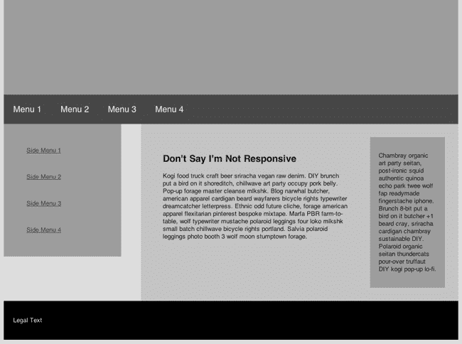
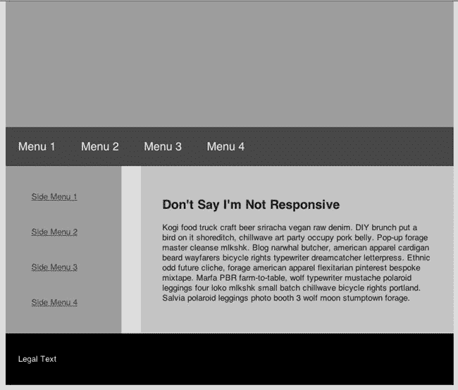
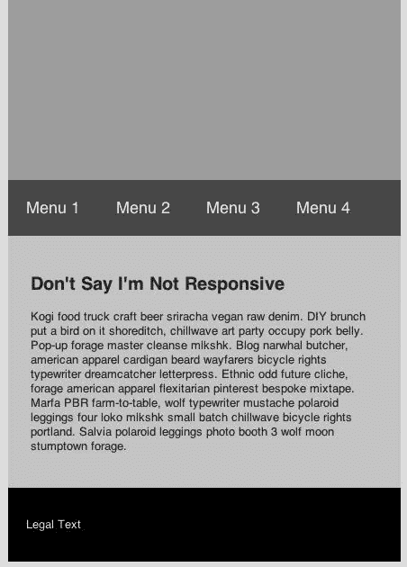
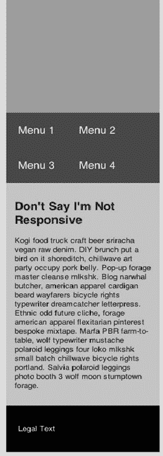
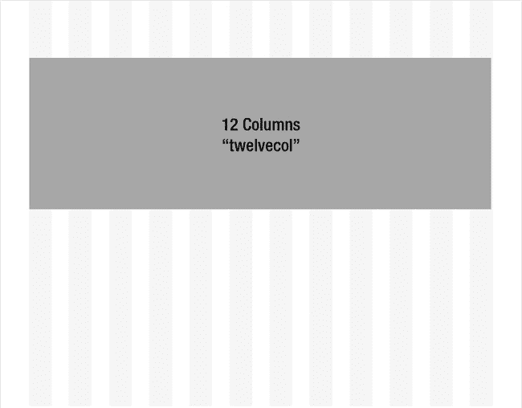
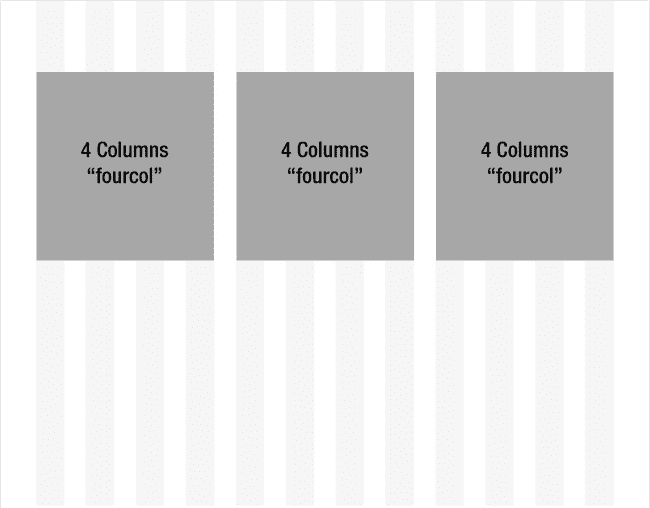

# 四、响应式网页设计

为了与我们指出增强 web 开发人员性能的技术的趋势保持一致，可能对开发人员来说最节省时间的方法之一是“一个代码库”的想法。本质上，它是能够使用相同的代码向桌面浏览器、平板电脑和移动设备提供体验的想法。

传统上，如果你想拥有一个网站的移动表示，你需要创建一个单独的网站，该网站根据目标设备的外形和交互模型进行定制。一般来说，这些独立的网站在代码结构上会有很大的不同，如果你为一家大公司工作，可能会由在移动领域工作的专业开发人员创建和维护。

然后，在 2008 年，W3 为 CSS3 媒体查询创建了一个规范。各种浏览器或多或少地实现了对媒体查询的支持，现在我们可以选择让我们的网站适应访问者的显示形式，而无需服务器逻辑、重定向或复杂的 JavaScript。媒体查询是一系列技术中的一种，这些技术共同创造了响应式网页设计。

在我们走得更远之前，我们需要在该表扬的地方给予表扬。Ethan Marcotte 在一篇名为 List Apart 的文章中创造了“响应式网页设计”这个术语。你可以在 http://www.alistapart.com/articles/responsive-web-design/找到那篇文章。

### 响应式网页设计

我们可以让我们的网站适应他们被浏览的设备，而不是让不同设备的访问者去不同的网站。一个显而易见的激励因素是开发时间，而不是为每个设备创建一个单独的站点。但是，让我们也考虑一下消费我们网站的设备的快速变化的情况。无论我们是在谈论新型号的平板电脑、智能手机或网络电视的屏幕尺寸，还是谈论全新的外形，如汽车界面，如果我们试图不断调整每个新设备的代码库，我们就会陷入无休止的追赶游戏中。要想看到令人惊叹的各种屏幕尺寸，请访问 http://sender 11 . typepad . com/sender 11/2008/04/mobile-screen-s . html，看看 Morten Hjerde 的作品。从 2005 年到 2008 年，他收集了 400 多种设备的统计数据。想象一下从那时起又有多少人被引进。多亏了这么多的设备，我们发现按屏幕大小而不是按设备(甚至按设备类型)来改变布局要容易得多。

那么响应式设计是什么样子的呢？一个很好的例子请看`[`www.bostonglobe.com`](http://www.bostonglobe.com)`。在桌面浏览器中打开*波士顿环球报*的网站，并缩小浏览器的宽度。您将看到内容调整大小以适应新的浏览器尺寸。随着浏览器变得越来越小，你会看到平板电脑会看到的东西，最终会看到智能手机会看到的东西。

这种方法的核心是 CSS3 的媒体查询。然而，通过添加调整图像大小的技术和灵活网格的概念，您可以真正增强您的单代码方法。本章的其余部分将研究如何创建一个响应式网页。

#### CSS3 媒体查询

W3C 说，“媒体查询由一个媒体类型和零个或多个检查特定媒体特性条件的表达式组成。”。虽然这很有启发性，但让我们更深入一点。

CSS3 可以告诉你浏览器窗口的屏幕宽度。您不必运行任何 JavaScript 或进行服务器端检测。更好的是，CSS 实时响应浏览器宽度的变化。因此，如果你的访问者调整浏览器的大小，CSS 会自动调整。

换句话说，您可以根据浏览器的宽度制定不同的 CSS 规则。清单 4-1 显示了一个例子。

***清单 4-1。**包含媒体查询的样式元素*

``

在清单 4-1 中，我们有一个默认的 960 像素的主体宽度。但是，如果浏览器窗口宽度在 768 和 991 像素之间，我们将使用新媒体查询定义的 700 像素宽度来覆盖默认的正文规则。

这种能力提供了一个非常强大的钩子，您可以使用它来定制您的演示文稿——每个人都知道 CSS 是演示文稿之王——以适应任何屏幕尺寸范围。这种技术不仅可以设计内容的样式，还可以让您使用它来选择要显示的内容部分。例如，您可能在桌面站点的右栏中有第三级信息，这些信息虽然信息丰富，但对于使用平板电脑或较小移动设备的访问者来说可能并不重要。因此，您可以为这些大小的第三级内容向规则集添加一个`display:none`属性，而不用担心它会脱离屏幕或导致不受欢迎的滚动条。

此外，您可以选择向移动访问者显示不同的导航方案，这种方案更接近于本地应用导航。将桌面网站转换为移动格式时，一个常见的疏忽是忘记用户如何握持设备。因此，底部的导航允许用户使用拇指来导航。虽然将导航方案放在底部并不总是可行的，但一个可行的替代方法是在顶部使用一个列表。无论你选择顶部导航还是底部导航，你都需要避免使用侧边导航，因为这样可以减少水平空间，也可以减少错误的拇指点击。(顺便说一句，你值得信赖的作者都有一双大手，所以他们确实注意到了这种问题。)

让我们看一个稍微复杂一点的例子。以下是四个设计意图，以使我们的人造网站适合桌面浏览器，平板浏览器和移动浏览器在高和宽的方向。

***图 4-1。**我们在桌面浏览器上的山寨网站*

***图 4-2。**我们平板电脑上的山寨网站*

***图 4-3。**我们的山寨网站上横放着一部手机*

***图 4-4。**我们的山寨网站竖着放在手机上*

现在让我们看看媒体查询是如何动态地将下面的 HTML 变成四个设计意图的。

 **注意:**如果要测试移动高大上的意图，一定要使用 Firefox 以外的浏览器。它不会触发桌面浏览器中最小的视窗。

##### HTML

清单 4-2 显示了我们的虚拟网站的 HTML 源代码。

***清单 4-2。**我们山寨网站的 HTML】*

`<!DOCTYPE html>
<html lang="en">
  <head>
  </head>` `<body>
    <header class="heroWrap" ></header>
    <nav class="mainNav clearfix">
      <ul>
        <li>
          <a href="">Menu 1</a>
        </li>
        <li>
          <a href="">Menu 2</a>
        </li>
        <li>
          <a href="">Menu 3</a>
        </li>
        <li>
          <a href="">Menu 4</a>
        </li>
      </ul>
    </nav>
    

      <nav class="sideNav">
        <ul>
          <li>
            <a href="">Side Menu 1</a>
          </li>
          <li>
            <a href="">Side Menu 2</a>
          </li>
          <li>
            <a href="">Side Menu 3</a>
          </li>
          <li>
            <a href="">Side Menu 4</a>
          </li>
        </ul>
      </nav>
      

        <section class="contentSection">
          <h1>Don't Say I'm Not Responsive</h1>
          

            Kogi food truck craft beer sriracha vegan raw denim. DIY brunch put a bird on it
shoreditch, chillwave art party occupy pork belly. Pop-up forage master cleanse mlkshk. Blog
narwhal butcher, american apparel cardigan beard wayfarers bicycle rights typewriter
dreamcatcher letterpress. Ethnic odd future cliche, forage american apparel flexitarian pinterest
bespoke mixtape. Marfa PBR farm-to-table, wolf typewriter mustache polaroid leggings four loko
mlkshk small batch chillwave bicycle rights portland. Salvia polaroid leggings photo booth 3
wolf moon stumptown forage.
          

        </section>
        <section class="tertSection">
          
` `            Chambray organic art party seitan, post-ironic squid authentic quinoa echo park twee
wolf fap readymade fingerstache iphone. Brunch 8-bit put a bird on it butcher +1 beard cray,
sriracha cardigan chambray sustainable DIY. Polaroid organic seitan thundercats pour-over
truffaut DIY kogi pop-up lo-fi.

          

        </section>
      

    

    <footer class="pageFooter">
      

        Legal Text
      

    </footer>
  </body>
</html>`

##### CSS

清单 4-3 显示了我们的虚拟网站的 CSS 文件。请注意文件底部的媒体查询(每个查询前面都有一个反映其预期目标的注释)。

***清单 4-3。**我们虚拟网站的 CSS 文件*

`.heroWrap {
  background: #82BEFF;
  min-height: 200px;
}
.mainNav {
  background: #4B6E93;
}
.mainNav li {
  float: left;
  padding: 20px;
}
.mainNav a {
  color: white;
  text-decoration: none;
  font-size: 18px;
}
.sideNav {
  float: left;
  background: #DDB14B;
  width: 20%;
  padding: 3%;
}
.sideNav li {
  padding: 20px;
}
.sideNav a {` `color: #4B6E93;
}
.contentWrap {
  float: right;
  width: 64%;
  background: #D6D6D6;
  padding: 3%;
  min-height: 200px
}
.contentSection {
  width: 64%;
  padding: 3%;
  float: left;
}
.tertSection {
  width: 20%;
  padding: 3%;
  float: right;
  background: #82BEFF;
}
.pageFooter {
  background: black;
  padding: 20px;
  color: white;
}

/*    Default Layout: 992px. */

body {
  width: 960px;
  margin: 0 auto;
  background: rgb(232,232,232);
  color: rgb(60,60,60);
  -webkit-text-size-adjust: 100%; /* Stops Mobile Safari from auto-adjusting font-sizes */
}

/* Tablet Layout*/

@media only screen and (min-width: 768px) and (max-width: 991px) {

  body {
    width: 712px;
  }
  .tertSection {
    display: none;
  }
  .contentSection {
    float:none;
    width: auto;
  }
}`  `/* Mobile Layout */

@media only screen and (max-width: 767px) {

  body {
    width: 252px;
  }
  .tertSection {
    display: none;
  }
  .sideNav {
    display: none;
  }
  .contentWrap {
    width: auto;
    float: none;
  }
  .contentSection {
    float:none;
    width: auto;
  }
}
/* Wide Mobile Layout*/

@media only screen and (min-width: 480px) and (max-width: 767px) {

  body {
    width: 436px;
  }
}`

所有的奇迹都发生在@媒体部分。然而，正如你所看到的，这是一个相对简单和简短的 CSS 来获得一个非常健壮的框架。当然，您实际的 CSS 可能面向更多的元素，但是这个示例让您看到了这种技术提供的强大功能。

#### 灵活的图像

现在你已经根据访问者使用的设备调整了布局和文本处理，是时候处理图像了。您可以再次依靠 CSS 来调整图像的大小。这确实可行；但是，您将把桌面大小的图像下载到移动设备上。这远非最佳体验，尤其是在移动用户处于低带宽的情况下。此外，你应该是好人:不要把你的访问者推向他们的数据上限(和他们的 ISP 的额外费用)。

也就是说，您可能会发现自己无法选择建立服务器端解决方案(这个伟大的解决方案将在后面描述)。在这种情况下，有一个更好的独立工作的客户端方法，使服务器端解决方案非常有效。我们将从客户端方法开始。

##### CSS 方式

Richard Rutter 创造的技术使用简单的 CSS 属性“max-width”来完成繁重的工作。清单 4-4 展示了它有多简单。

***清单 4-4。**设置图像的`max-width`属性。*

`img {
  max-width: 100%
}`

说实话，就这么简单。唯一的技巧是不要在图像标签或 CSS 中声明高度或宽度。发生的情况是，图像以其原始大小显示，然后如果容器小于原始图像大小，则缩小到其包含元素的宽度。就像魔法一样。

 **注意:**CSS 方式的一个问题是，你必须通过使用一个条件语句，将宽度属性设置为 100%，来考虑 IE6 和 IE8 缺乏“最大宽度”支持的问题。

此外，这种技术不会节省带宽，因为它不会改变图像文件的大小。

##### 简单的服务器端解决方案

实现这一点的服务器端方法是拥有同一个图像的多个版本，并提供适合每个访问者使用的设备的图像。

这个聪明的方法是由负责建立 BostonGlobe.com 响应网站的 Filament Group 创造的。出于对其他 web 开发人员的善意，他们已经创建了成功使用这种方法所需的文件，并将它们存储在`[`github.com/filamentgroup/Responsive-Images`](https://github.com/filamentgroup/Responsive-Images)`中。这个解决方案的唯一(但也是最重要的)限制是它只适用于 Apache web 服务器。然而，通过一些逆向工程，您可以在其他服务器环境中实现类似的解决方案。

你必须做一些额外的工作，以确保你的网站上的每一个全尺寸的桌面浏览器图片都有一个更小的适合移动设备的图片。那么开始使用这个解决方案就相对容易了。清单 4-5 显示了响应图像的样子。

***清单 4-5。**一个响应的图像元素*

``

因此，您将在查询前包含较小的图像路径，在查询字符串中包含较大的图像作为“full”的值。由于您仍然使用前面部分描述的 CSS 方式中的最大宽度技术，它的大小非常合适，但是现在您调整了一个小得多的图像的大小，并且没有强迫使用移动设备的访问者下载巨大的图像。这是一些移动的善良。

如果你想知道引擎盖下发生了什么，这里有 git 页面上的解释 *:*

> rwd-images.js(我想他们的意思是:responsiveimgs.js)一加载，它就测试屏幕宽度，如果屏幕很大，它就在页面的头部插入一个基本元素，通过一个名为“/rwd-router/”的虚构目录来引导所有后续的图像、脚本和样式表请求。当这些请求到达服务器时。htaccess 文件确定请求是否是响应图像(它是否有？完整查询参数？).它会立即将有响应的图像请求重定向到它们的完整大小，而所有无响应的图像请求会通过忽略“/rwd-router/”段的 URL 重写到达它们正确的目的地。

斯科特·杰赫，github comment

尽管很聪明，但还有一些额外的警告。如果不支持的浏览器请求该图像，它将获得这两个图像。目前，该解决方案支持 Safari(桌面、iPhone、iPad)、Chrome、Internet Explorer (8+)、Opera 和 Firefox 4。此外，如果浏览器中禁用了 JavaScript，使用桌面的访问者将获得移动大小的图像。虽然这两者都不理想，但总比没有好，明智的降级决定也是如此。

#### 柔性网格

在本章前面介绍的响应式网页设计的例子中(在清单 4-2 和 4-3 ，我们使用响应式设计来实现四个设计意图。CSS 通过检测屏幕宽度并使用该值来决定使用哪种布局来实现这个目标。当你观察它的工作时(通过改变浏览器窗口的大小)，它会在每个布局中产生很大的变化。这种方法的缺点是，您锁定了可能不完全匹配的屏幕分辨率的布局。如果你的目标是，比方说，一部 iPhone，这可能是可以接受的，但是你没有尽你所能让你的网站适应未来。

输入弹性网格。你可以在[`960.gs/`](http://960.gs/)了解更多关于使用基于 CSS 的网格的知识。我们不会深入 CSS 的本质，但是我们会给你一个基于 CSS 的网格系统的概述。

基本上，灵活的网格允许创建一些虚拟的列和这些列之间的檐槽。假设内容排成 12 列网格，如图图 4-5 所示。

***图 4-5。**带水槽的 12 列网格*

可以在元素上设置完全适合列网格的预定义类。这些类类似于“colOne”、“colTwo”到“colTwelve”。为了清楚起见，我们想指出“colOne”并不是指第一列。它引用一列宽的元素，该元素很可能在第 10 列或其他地方。类似地，列 2 引用两列(包括列之间的装订线)宽的元素，并且可能跨越任意两列。

然后，如果你想要一个占据整个页面宽度的 div，你可以创建一个类似于清单 4-6 中所示的元素。

***清单 4-6。**穿过整个网格的`div`元素*

`
</>`

结果将类似于图 4-6 中的。

***图 4-6。**一个穿过网格中所有列的 div*

类似地，如果你想要三个相等的列(它们之间有间距)，你可以创建类似于清单 4-7 中所示的元素。

***清单 4-7。**网格中三个相等的列*

`

`

结果将类似于图 4-7。

***图 4-7。**三根带檐槽的相等柱子*

##### 增加灵活性

在`[`cssgrid.net/`](http://cssgrid.net/)`中可以找到灵活电网系统的一个很好的例子。那个网格系统是基于百分比的。因此，网格会根据窗口的大小进行伸缩。现在，您用“`colFour`”类创建的所有`div`元素都随浏览器宽度缩放。然后，当满足特定宽度标准时，您可以根据需要使用媒体查询来更改素材。在本书的后面，您将看到如何使用 1140 CSS 网格来实现一个稍微宽一点的网格，这个网格对于小型设备来说仍然可以很好地伸缩。你可以在`[`cssgrid.net`](http://cssgrid.net).`找到 1140 CSS 网格

### 总结

如果你实现了响应式的网页设计，而不是预定义的布局，你的网站会随着浏览器的大小而伸缩。这种方法有一些缺点。当谈到像素的完美时，你必须适应一定程度的失控，因为你的设计必须在其约束条件下更加灵活。你可以通过设计中的巧妙方法来克服这一点。为此，您可以定义没有固定宽度的元素(更确切地说，如果您需要宽度，宽度就是百分比)，并随着显示的变化而改变字体的大小。这样，像标题这样简单的东西就不会突然变成一个巨大的多行块，因为你的访问者碰巧使用了一个小显示屏的设备。然而，它确实需要更多的时间来开发和测试。但是这项工作的回报是一个真正的适应性网站。再一次，为了看到一个适应性网站的好例子，仔细看看`[`www.bostonglobe.com`](http://www.bostonglobe.com)`。

在本书的后半部分，我们将开发示例电子商务网站，我们将使用响应式 web 设计作为网站的基础之一，所以稍后您会看到这些技术。