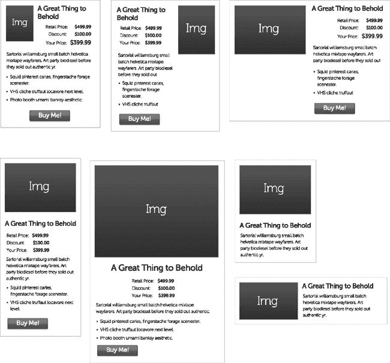
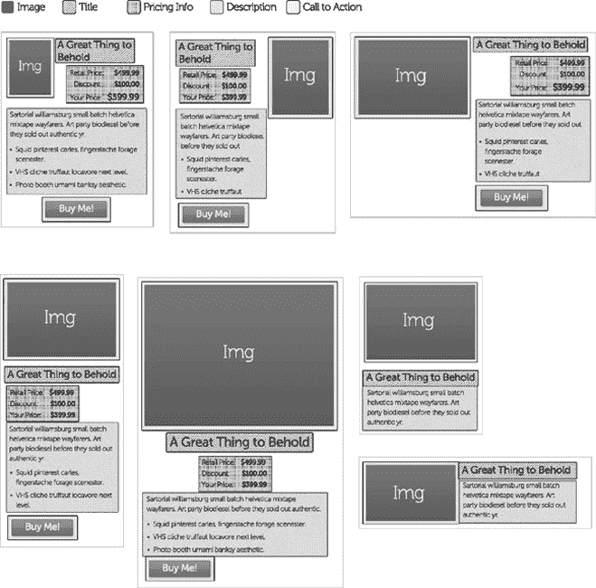
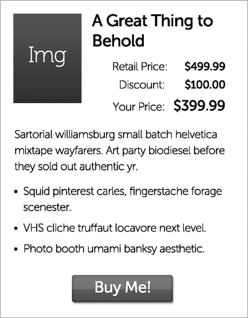
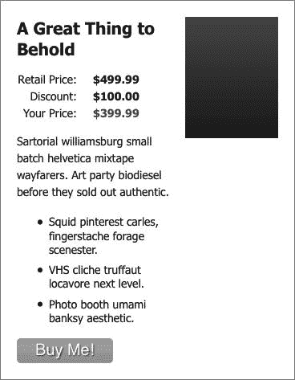
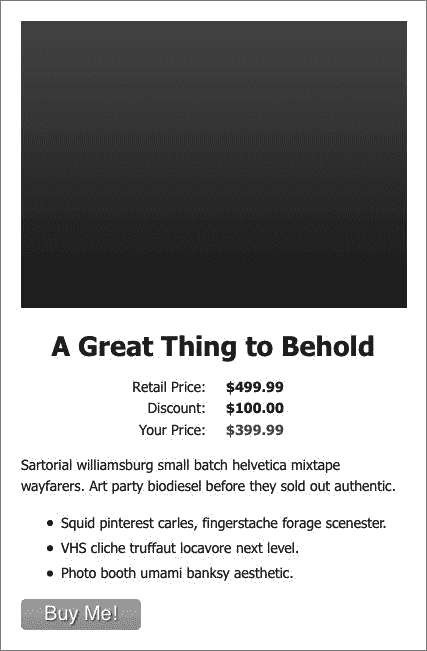
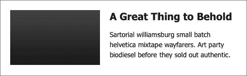

# 五、理解 Web 重用模式

当 Mike 刚开始为美国五大电子商务网站之一工作时，他提出了一种开发方法，这种方法加快了开发周期和更新周期(或者说减少了维护时间)。这个网站有很多产品和很多展示这些产品的方式，这取决于访问者在网站中的位置(搜索还是按类别浏览还是按价格浏览，等等)。

最初，Mike 确定了 14 种不同的产品设计意图。由于站点是在 MVC 平台上构建的，开发人员制作了 14 个不同的视图(MVC 视图是一个 HTML 片段，通过特殊的语法嵌入了服务器端逻辑)，每个视图对应一个意图(也称为处理)。每次治疗创建一个视图是解决该问题的一种常见方法。首先，每个处理的一个视图清晰地映射(支持开发团队内部和之间以及开发和设计团队之间的交流)。另一方面，至少在开始阶段，它能够快速发展。

不幸的是，为每个处理创建一个视图很快被证明是一个糟糕的范例(按照许多开发人员的说法，是一种反模式)。一旦您需要更改组成各种治疗的元素的某个方面，您突然需要更改许多视图，而不是一个视图。例如，如果业务涉众决定添加一些东西，Mike 必须更改 14 个视图。抛开同样的事情做 14 遍的痛苦(还有哪个开发者不讨厌重复？)，漏掉什么东西的几率就上去的很快。在 13 个地方而不是 14 个地方进行更改太容易了，最终会在某个地方出现错误。

在我们向您展示如何避免这种混乱之前，我们将首先详细展示这个问题。图 5-1 显示了 Mike 确定的设计变更(当然，删除了所有公司和产品信息)。

***图 5-1。**设计变更*

当 Mike 检查这些设计意图时，他不禁注意到它们都有相似的项目，只需要改变它们的布局。他很快意识到这是 CSS 的工作，而不是一堆单独的视图。

 **注意**迈克想感谢妮可·沙利文，她也经历了类似的过程，当时她重组了脸书的内容，并发现大量内容都归入了几个模式。她对这个过程的描述(在网上很多地方都可以找到)极大地启发了 Mike 在这个类似问题上的工作。

Mike 发现了各种设计意图的相似之处。图 5-2 通过颜色编码显示了相似之处。

***图 5-2。**设计的相似性*

如你所见，所有这些设计意图共享一个图像、一个标题和一个描述。此外，大多数人还分享定价信息和行动呼吁按钮。我们创建了一个包含所有元素(图像、标题、定价信息、描述和行动号召)的动态主产品堆栈，而不是创建不同的 HTML 片段来在我们的大型高带宽电子商务网站中重复使用。然后，我们在每个元素周围放置条件语句，这样我们就可以控制它是否在被推送到客户浏览器的 HTML 中呈现。我们在父元素中插入一个 CSS 类来实现我们的设计意图。我们对此并不过分严格。如果出现了不适合我们现有模式的新产品堆栈处理，我们总是可以选择创建另一个视图。也就是说，在一年半的时间里，我们被要求进行大量的更改和六次额外的处理，我们只需要创建一个额外的视图(对于一个可切换的功能，我们认为它超出了我们的产品堆栈视图的范围)。

让我们来看一些代码。清单 5-1 显示了产品堆栈背后的 HTML(的简化版本)。

***清单 5-1。**产品堆栈的 HTML】*

`<section class="productStackWrap" >
  
  <article class="psArticleWrap">
    <h1 class="psTitle">Title</h1>
    <ul class="psPriceWrap">
      <li>
        LabelPrice
      </li>
      <li>
        LabelPrice
      </li>
      <li>
        LabelPrice
      </li>
    </ul>
    

      
Description

      <ul class="descBulletsUL">
        <li>Bullets </li>
      </ul>
    

    <button class="psCTA">
      Button
    </button>
  </article>
</section>`

虽然您可以复制和粘贴框架，并手动填充文本和图像路径，但更有效的方法是使用您选择的服务器端解决方案，并动态填充产品堆栈。在 Mike 和 Jay 相遇的前五大公司，解决方案是微软 MVC 框架。这是维护方面真正获得性能提升的地方，因为现在我们只是调整一段代码，这段代码将更新我们所有的产品堆栈。

因为我们使用的是微软的 MVC，我们的视图是。NET MVC Razor 代码(实际上只是嵌入了某些代码的 HTML)。然而，任何类似的服务器端语言(如 JSP 或 PHP)都应该允许完成相同的任务，因为我们所做的只是设置一些变量，并使用一些逻辑来决定在最终页面中包含哪些 HTML 内容，然后通过管道发送给客户。

出于演示目的，我们将在视图中创建一些变量，但是您通常会从数据库或模型中填充这些变量。此外，为了清楚起见，我们将在定价信息中排除逻辑。清单 5-2 显示了产品堆栈的 Razor 代码。

***清单 5-2。**剃刀码为一个产品栈*

`@{
  var Treatment = "psTreatmentA1";
  var Title = "A Great Thing to Behold";
  var ImagePath = "img/image.jpg";

  var RetailPriceAmt = "$499.99";
  var DiscountAmt = "$100.99";
  var YourPriceAmt = "$399.99";` `  var Description = "Sartorial williamsburg small batch helvetica mixtape wayfarers. Art party
biodiesel.";
  var showPricingWrap = true;
  var showDescBullets = true;
  var showButton = true;

}
<section class="productStackWrap @Treatment" >
  
  <article class="psArticleWrap">
    <h1 class="psTitle">@Title</h1>
    if(showPricingWrap){
    <ul class="psPriceWrap">
      <li>
        Retail Price:@RetailPriceAmt
      </li>
      <li>
        Discount:@DiscountAmt 
      </li>
      <li>
        Your Price:@
YourPriceAmt 
      </li>
    </ul>
    }
    

      
Description

      if(showDescBullets){
      <ul class="descBulletsUL">
        @foreach(Bullet bullet in Model.Item1)
        {
          <li> @bullet.bulletText</li>
        }
      </ul>
      }
    

    @if(showButton){
    <button class="psCTA">
      Button
    </button>
    }
  </article>
</section>`

布尔逻辑让我们只发送我们特殊处理所必需的代码，这样我们就不会有发送不必要的代码然后用 CSS 隐藏它的开销。通过这种方法，我们在代码匹配的模式上获得了很大的灵活性。

最棒的是，通过简单地给我们的`section element with the class: “productStackWrap”`添加一个类名，我们可以表达各种各样的设计意图。请记住，我们对每个 CSS 转换都使用相同的 HTML。

 **注意**我们利用 CSS 嵌套来完成繁重的工作。我们相信 CSS 会优雅地失败。也就是说，如果浏览器的 CSS 渲染引擎不理解我们的 CSS 中的某些内容，它会忽略它(只要它的语法正确)。我们大量使用 CSS 嵌套。

清单 5-3 展示了一个 CSS 嵌套的例子。

***清单 5-3。**CSS 嵌套的例子*

`.child {
  font-weight: normal;
}
.parent .child {
  font-weight: bold;
}`

如果有一个类为`child`的元素有一个类为`parent`的祖先，那么`child`应用的元素是粗体的。否则，child 将保留其`font-weight: normal`属性。通过将`parent”`的类设置为`child`的祖先，我们可以控制各种元素的字体粗细。

现在让我们回到为多种设计设计产品堆栈。清单 5-4 显示了所有处理共享的基本 CSS。

***清单 5-4。**所有产品堆栈处理的基本 CSS*

`/* Shared Product Stack Rules */
.productStackWrap {
  position: relative;
  font-size: 14px;
  margin: 40px 0;
  border: 1px solid #999;
  padding: 20px;
}
.psTitle {
  font-size: 21px;
  font-weight: 700;
  margin: 0 0 5px 0;
}
.psPriceWrap {
  padding: 0;
}
.psPriceWrap li {
  list-style: none;
  padding: 2px 0;
}
.spLabel {
  display: inline-block;
  width: 75px;
  text-align: right;
  padding-right: 3px;
}
.spAmount {` `  display: inline-block;
  width: 75px;
  text-align: right;
  font-weight: 700;
}
.spTotalPrice {
  color: green;
}
.spDescriptionWrap p {
  line-height: 150%;
}

.psCTA {
  background: green;
  color: white;
  padding: 5px 0;
  width: 120px;
  display:block;
  border: 0;
  text-align:center;
  font-size: 20px;
  text-shadow: 1px 1px 1px #666666;
  -webkit-border-radius: 5px;
  -moz-border-radius: 5px;
  border-radius: 5px;
  -moz-background-clip: padding;
  -webkit-background-clip: padding-box;
  background-clip: padding-box;
  background: #92c436; /* Old browsers */
  background: -moz-linear-gradient(top,  #92c436 0%, #97c64b 50%, #80c217 51%, #7cbc0a 100%); /*
FF3.6+ */
  background: -webkit-gradient(linear, left top, left bottom, color-stop(0%,#92c436), color-
stop(50%,#97c64b), color-stop(51%,#80c217), color-stop(100%,#7cbc0a)); /* Chrome,Safari4+ */
  background: -webkit-linear-gradient(top,  #92c436 0%,#97c64b 50%,#80c217 51%,#7cbc0a 100%); /*
Chrome10+,Safari5.1+ */
  background: -o-linear-gradient(top,  #92c436 0%,#97c64b 50%,#80c217 51%,#7cbc0a 100%); /*
Opera 11.10+ */
  background: -ms-linear-gradient(top,  #92c436 0%,#97c64b 50%,#80c217 51%,#7cbc0a 100%); /*
IE10+ */
  background: linear-gradient(top,  #92c436 0%,#97c64b 50%,#80c217 51%,#7cbc0a 100%); /* W3C */
  filter: progid : DXImageTransform.Microsoft.gradient( startColorstr='#92c436', endColorstr='#7c
bc0a',GradientType=0 ); /* IE6-9 */
}
.descBulletsUL li {
  padding: 4px 0;
}`

为了让基本产品堆栈 HTML 看起来像我们的第一个设计意图，我们将把类`psTreatmentA1`添加到父元素中。当然，那是不完整的。当我们进行治疗时，我们将完成每种治疗的列表。请耐心等待，我们将很快展示如何使用基础治疗。图 5-3 显示了结果。

***图 5-3。**产品堆叠处理 A1*

清单 5-5 显示了处理 A1 的 CSS。

***清单 5-5。** CSS 治疗 A1*

`/* Treatment A1 */
.psTreatmentA1
{
  width: 310px;
}

.psTreatmentA1 .psImage
{
  width: 80px;
  height: 112px;
  float:left;
}

.psTreatmentA1 .psTitle
{
  margin-left: 100px;
}

.psTreatmentA1 .psPriceWrap
{
  margin-left: 100px;
}

.psTreatmentA1 .psCTA
{` `  margin: 0 auto;
}

.psTreatmentA1 .psPriceWrap
{
  text-align: right;
}`

类似地，我们可以添加类“psTreatmentB1”来重新排列内容以匹配另一个设计。图 5-4 显示了结果。

***图 5-4。**治疗 B1*

清单 5-6 显示了治疗 B1 的 CSS。

***清单 5-6。**治疗 B1 的 CSS*

`/* Treatment B1 */
.psTreatmentB1
{
  width: 190px;
  padding-right: 156px;
}

.psTreatmentB1 .psImage
{
  width: 116px;
  height: 151px;
  position: absolute;
  right: 20px;` `  top: 20px;
}

.psTreatmentB1 .psPriceWrap
{
  text-align: left;
}`

同样，我们可以添加类“psTreatmentC1”来重新排列内容，以匹配第三个设计。图 5-5 显示了结果。

***图 5-5。**治疗 C1*

清单 5-7 显示了 C1 治疗的 CSS。

***清单 5-7。** CSS 治疗 C1*

`/* Treatment C1 */
.psTreatmentC1
{
        width: 385px;
}`  `.psTreatmentC1 .psImage
{
        width: 386px;
        height: 287px;
        display: block;
        margin-bottom: 20px;
}

.psTreatmentC1 .psPriceWrap
{
        text-align: left;
        margin-left: 110px;
}

.psTreatmentC1 .psTitle
{
        text-align: center;
        font-size: 27px;
}`

我们将用一个最简单的设计来结束我们的例子。图 5-6 显示了结果。

***图 5-6。**治疗 D1*

清单 5-8 显示了 D1 治疗的 CSS。

***清单 5-8。** CSS 治疗 D1*

`/* Treatment D1 */
.psTreatmentD1
{
  width: 261px;
  padding-left: 224px;
  min-height: 116px;
}

.psTreatmentD1 .psImage
{
  width: 184px;
  height: 114px;
  position: absolute;
  top: 20px;
  left: 20px;
}`  `.psTreatmentD1 .spDescriptionWrap p
{
  margin-bottom: 0;
}

.psTreatmentD1 .psPriceWrap, .psTreatmentD1 .psCTA, .psTreatmentD1 .descBulletsUL
{
  display:none;
  /* If we’re using our server-side logic, we wouldn’t need this as these extraneous HTML
elements wouldn't be on the page. */
}`

### 关于 Web 重用的一些最终观察

#### 思考积木

我们喜欢所有那些能够用一堆相似的零件做东西的玩具。我们还认为这是构建 web 组件的一个很好的比喻，您可以在您的站点中重用这些组件。如果你的组件是一个玩具积木的集合，那么构建你的站点就相当于挑选要组装的积木。当一块砖的形状相同但颜色不同时，这类似于一个 web 组件打开或关闭了一个或多个功能。

从构建块和创建可重用的 web 组件的角度来考虑，应该可以加快开发速度，将更多的任务交给初级开发人员，并随着业务需求的变化减少更改页面的时间。理想情况下，一旦你弄清楚了网站需要的所有组件(以及这些组件的变体)，添加新页面和更改现有页面应该是轻而易举的事情。

#### 一切都包含在内

容器有很多名字。在我们自己的工作中，我们经常谈论各种各样的“堆栈”。正如我们在本章前面所演示的，文章堆栈是一个容器，它保存了实现一篇文章的元素集合，以供访问者阅读。类似地，我们还展示了一个产品堆栈(以及它的一些变体)。对我们来说，甚至一个按钮也是一个堆栈，因为按钮通常有多个元素(比如为按钮定义一块空间的 div 元素，如果按钮是一个链接，还有一个锚元素，一个图像按钮的图像元素，等等)。然而，“栈”实际上只是容器的另一个名称。

我们想以一个提醒来结束我们关于可重用 web 组件的讨论，在一个 web 页面上，几乎所有的东西都在某种容器中，并且几乎所有的东西都被其他容器所包含。不管你怎么称呼它(栈或小部件或其他什么)，每个组件实际上都是一个容器，既包含其他容器，又被其他东西所包含。我们发现，开发和维护功能丰富的网页可以变得更易于管理，只要记住这一切都只是盒中盒。

### 总结

在这一章中，我们讨论了创建一组组件的想法，这些组件覆盖了一个企业网站的所有需求，然后用这些组件的一部分来制作每个页面。我们强烈建议所有主要网站使用类似的技术，因为它提供了以下好处:

*   它确保了大型复杂网站的品牌一致性。对许多公司来说，他们的品牌是他们最宝贵的素材，对品牌素材(标识、口号等)的一致对待。)是网站开发和维护的重要组成部分。
*   它很容易在整个网站上创造一致的体验。事实上，您必须做额外的工作来获得标准组件所提供的外观。
*   它使得开发新的网页和维护现有的网页变得更加容易和快速。
*   它允许将日常的 web 开发任务交给经验较少的开发人员，他们只需将标准组件组装起来就可以完成。
*   它解放了高级开发人员，使他们能够解决棘手的问题，创建定制的解决方案，并在业务需要时创建额外的站点范围的组件。

我们发现这种技术非常有效。随着创建和维护大型复杂网站的开发人员对它的了解，我们希望看到它被广泛采用。