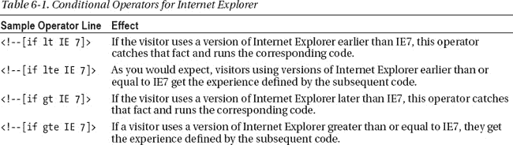
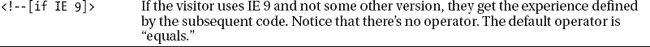
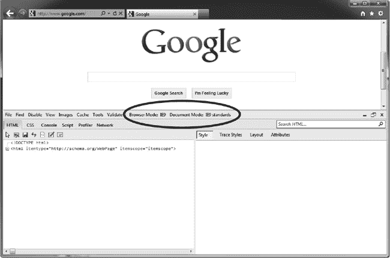
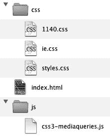
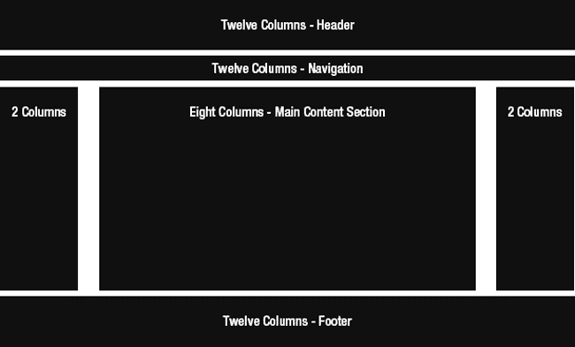

# 六、页面模板

在本书的整个第二节中，我们将重点创建一个示例站点来展示我们在第一节中讨论的原则。阅读一些东西是如何工作的只会让大多数人开始真正理解。看到它的实际应用是迈向精通的一大步。(当然，要完全学会如何做一件事，你必须自己去做，但我们相信你会这样做。)为了给对话提供一些背景信息，在开始介绍网站的构建之前，让我们先来看看这个网站。图 6-1 显示了我们正在建设的样本网站，你可以在`[`clikz.us`](http://clikz.us)`找到

***图 6-1。**我们正在建设的样本网站( [`clikz.us`](http://clikz.us) )的*

我们将通过首先创建一个页面模板来开始构建我们的示例网站。在。NET 世界中，这样的模板通常被称为母版页。我们也看到它被称为主布局。不管它叫什么，页面模板是我们构建网站的框架。

对于我们的示例站点，我们将创建一些设置各种选项的元素，并指定一个灵活的网格。在它们之间，这些项目构成了网站上所有页面的基础。

### 设置样板文件选项

首先，我们将主要依靠 [` `www.html5boilerplate.com``](http://www.html5boilerplate.com) 提供的工具来生成一个不错的 HTML5 起点。HTML5 样板网站提供了很多我们在本章中不会涉及的配置细节，包括 web 配置、构建脚本等等。由于我们在本书中关注的是 HTML 和 CSS，所以我们在示例站点中省略了这些特性。我们强烈建议您详细查看 HTML5 样板网站，寻找可能对您有用的内容。我们也要感谢保罗·爱尔兰、迪维娅·马年、施尚恩、马蒂亚斯·拜恩斯和尼古拉斯·加拉格尔(仅举几例)为我们提供了这个有用的工具。他们做了有益于所有网络开发者的伟大工作。

在我们分析代码之前，您可能会看到一个完整的样板页面。清单 6-1 显示了这样一个清单。

***清单 6-1。**一个完整的页面模板*

`<!doctype html>
<!--[if lt IE 7 ]> <html class="ie6"> <![endif]-->

<!--[if IE 7 ]>    <html class="ie7"> <![endif]-->

<!--[if IE 8 ]>    <html class="ie8"> <![endif]-->

<!--[if IE 9 ]>    <html class="ie9"> <![endif]-->

<!--[if (gt IE 9)|!(IE)]><!--> <html class=""> <!--<![endif]-->
<head>
  <meta charset="utf-8">

<meta http-equiv="X-UA-Compatible" content="IE=edge,chrome=1">

  <title></title>
  <meta name="description" content="">

  *<!-- <ins>Mobile</ins> <ins>viewport</ins> optimized: h5bp.com/<ins>viewport</ins> -->*
  <meta name="viewport" content="width=device-width">

  *<!-- Place favicon.ico and apple-touch-icon.png in the root directory: mathiasbynens.be/notes/touch-icons -->*

  <link rel="stylesheet" href="css/style.css">

  *<!-- More ideas for your <head> here: h5bp.com/d/head-Tips -->*

  *<!-- All JavaScript at the bottom, except this <ins>Modernizr</ins> build.*
*       <ins>Modernizr</ins> enables HTML5 elements & feature detects for optimal performance.*
*       Create your own custom <ins>Modernizr</ins> build: www.modernizr.com/<ins>download</ins>/ -->*
  
</head>
<body>
  *<!--[if <ins>lt</ins> IE 7]>
chromeframe</ins>>Your browser is <em>ancient!</em> <a <ins>href</ins>="http://
browsehappy.com/">Upgrade to a different browser</a> or <a <ins>href</ins>="http://www.google.com/chromefra
me/?redirect=true">install <ins>Google</ins> <ins>Chrome</ins> Frame</a> to experience this site.
<![<ins>endif</ins>]-->*
  <header>

  </header>
  

  

  <footer>

  </footer>

  *<!-- JavaScript at the bottom for fast page loading -->*

  *<!-- Grab <ins>Google</ins> CDN's jQuery, with a protocol relative URL; fall back to local if <ins>offline</ins> -->*
  
  

  *<!-- scripts concatenated and <ins>minified</ins> via build script -->*
  
  
  *<!-- end scripts -->*

  *<!-- Asynchronous <ins>Google</ins> Analytics snippet. Change UA-XXXXX-X to be your site's ID.*
*       mathiasbynens.be/notes/<ins>async</ins>-analytics-snippet -->*
  
</body>
</html>`

#### HTML 元素周围的条件语句

通常(通常，我们怀疑)，您需要识别您站点的个人访问者正在使用的浏览器，以便您可以向该访问者提供最好的体验。将 HTML 元素包装在条件语句中允许您这样做，尽管只适用于 Internet Explorer。

 **注意:**我们在这一章中对 Internet Explorer 的明显关注实际上只是以下事实的一个副作用:Internet Explorer 迫使 web 开发人员做额外的工作来在 IE 上工作，以及 IE 是唯一支持条件语句的浏览器(至少目前如此)。鉴于世界上大部分地区仍在使用 IE，我们认为它的好处是值得花时间的。你自己可能也遇到过同样的问题。

清单 6-2 展示了如何做到这一点。

***清单 6-2。**条件语句识别浏览器*

`<!--[if lt IE 7 ]> <html class="ie6" lang=”en”> <![endif]-->

<!--[if IE 7 ]>    <html class="ie7" lang=”en”>  <![endif]-->

<!--[if IE 8 ]>    <html class="ie8" lang=”en”>  <![endif]-->

<!--[if IE 9 ]>    <html class="ie9" lang=”en”>  <![endif]-->

<!--[if (gt IE 9)|!(IE)]><!--> <html  lang=”en”>  <!--<![endif]-->`

乍一看，这可能令人困惑。此外，仅仅是呈现一个 HTML 元素似乎就需要很多代码。然而，对于网站的开发者和最终的访问者来说，这将是无价的。

首先，让我们考虑条件语句本身。下面一行显示了一个示例:

`*<!--[if IE 7]>  Render this html<![<ins>endif</ins>]-->*`

语法相当明显，但需要解释一下，以便澄清一些细节。第一，是评论。这很方便，因为不识别条件语句的浏览器(除了 Internet Explorer 以外的任何浏览器)都会忽略该语句(因此对于使用其他浏览器的访问者来说，不会有页面加载延迟)。二、以`<!--[if *condition*]>`开头，以`<![endif]-->`结尾。最后，如果浏览器识别出条件语句，并且浏览器能够将该语句解析为真，则中间的代码将运行。

在清单 6-2 所示的例子中，如果访问者的浏览器是 Internet Explorer 7，中间的代码就会运行。在清单 6-2 所示的例子中，没有操作符。但是，运算符(如“小于”和“大于”)可以存在。默认的操作符是“equals”，但是没有它的语法。如果你需要“等于”，省略掉操作符。让我们来看看一些比较常用的运算符。表 6-1 显示了基本操作符。

如清单 6-2 所示，我们在这些条件语句中包装了 HTML 元素的许多版本，但是浏览器将只处理一个版本:浏览器可以评估为真的版本(对于 Internet Explorer)。例如，如果我们的访问者的浏览器是 IE7，HTML 元素的定义如下所示:

`<html class="ie7" <ins>lang</ins>="<ins>en</ins>">`

现在让我们仔细检查我们的条件语句的最后一行，在下面一行中再次显示(我们讨厌翻阅页面):

`<!--[if (gt IE 9)|!(IE)]><!--> <html  lang=”en”>  <!--<![endif]-->`

附加注释确保了，如果访问者使用 Internet Explorer 以外的浏览器，浏览器可以找到 HTML 元素的开始标记。此外，如果访问者使用 Internet Explorer，此行将匹配高于 9 的版本。IE10 在测试中，所以有可能。

条件的最后一部分是`|!(IE)`。也就是说“或者不是 Internet Explorer”竖线(`|`)表示“或者”，感叹号(`!`)表示“不是”我们并不严格需要这种语法，因为除了 Internet Explorer 之外的任何浏览器都无法识别它。然而，我们包含它是为了与开发人员(包括我们自己)交流，他们可能在将来的某一天需要维护这个页面，以防其他浏览器开始识别条件语句。

我们希望 IE10 是符合标准的，我们不需要用一个条件来捕捉它，也不需要为它编写特殊的规则。然而，如果确实需要为 IE10 编写特殊的规则，我们可以在我们的条件语句集合中添加另一行。清单 6-3 显示了在这种情况下最后两个条件是什么。

***清单 6-3。**会计 IE10*

`<!--[if IE 10 ]>    <html class="ie10" lang=”en”>  <![endif]-->
<!--[if (gt IE 10)|!(IE)]><!--> <**html**  lang=”en”>  <!--<![endif]-->`

无论我们是检查 IE10 还是停止在 IE9，呈现给任何不符合任何条件的浏览器的元素的开始标记都显示在下面的行中:

`<html  lang=”en”>`

现在我们已经展示了语法是如何工作的，我们可以深入了解为什么这种技术是有价值的。您可能已经注意到，条件语句(除了最后一个)向 HTML 元素添加了一个类。此类别对应于访问者使用的 Internet Explorer 版本。就其本身而言，添加一个类没有任何作用。然而，它为针对特定于浏览器的 CSS 提供了一个很棒的钩子。例如，如果我们需要为 IE7 调整一些填充，我们可以编写如清单 6-4 所示的 CSS。

***清单 6-4。**为所有浏览器和 IE7 定义填充*

`.paddingDefinition
{
  padding: 10px  /* All Browsers */
}

.ie7 .paddingDefinition
{
   padding: 12px; /* Only IE7 */
}`

我们不需要编写一堆 CSS 代码或加载额外的特定于浏览器的样式表(这将意味着更多的 HTTP 请求和更差的性能)，我们可以简单地在现有代码旁边定义我们的特定于浏览器的代码，这样更容易找到和理解。此外，通过添加一个额外的选择器，我们增加了特异性，因此我们的 IE7 规则比现有的类具有更大的权重——但前提是浏览器是 IE7。这又回到了浏览器忽略没有意义的 CSS 选择器。因此，如果我们的条件语句没有将类“ie7”添加到 HTML 标记中，那么第二条规则(" . ie7。someClass”)从未得到应用。

我们喜欢 CSS 让我们编写浏览器可以忽略的规则。这听起来很奇怪，但确实有效。如果你想了解这一强大技术的更多信息，请访问`[`paulirish.com/2008/conditional-stylesheets-vs-css-hacks-answer-neither/`](http://paulirish.com/2008/conditional-stylesheets-vs-css-hacks-answer-neither/)`。

#### 设置字符集

正如我们在第三章中讨论的，你应该总是将 charset(“字符集”的缩写)元标签设置为你的 HTML 的 head 部分的第一项，因为不这样做可能会导致在浏览器开始向你的访问者显示信息之前的长时间停顿。下面一行显示了将字符集设置为 UTF-8 的语法:

`<meta charset="utf-8">`

不这样做可能会对性能和安全性造成严重后果。如果浏览器不确定使用什么字符集，它会尝试使用不同的算法(因浏览器而异)来分析或“嗅探”类型。这种嗅探可能会延迟页面加载，并为攻击者提供了一种欺骗浏览器使用 UTF-7 字符集的途径，这种字符集有很大的漏洞。套用一句旧的电视广告:UTF-8-没有它不要离开家。

#### 控制 IE 的兼容模式

从 IE8 开始，微软引入了“兼容模式”以及任何网页打开和关闭兼容模式的方法。当兼容模式打开时，如果浏览器检测到它不理解的东西，它将恢复到以前的 IE 浏览器规则。

 **提示:**微软有一个“兼容性视图列表”，这是微软的人认为需要用 IE7 引擎渲染的网站列表。要查看您的网站是否在该列表中，请访问以下网站:[`ie9cvlist.ie.microsoft.com/ie9CompatViewList.xml`](http://ie9cvlist.ie.microsoft.com/ie9CompatViewList.xml)。

如果你想在兼容模式下测试你的站点，你可以通过 ie 浏览器中可用的开发者工具手动强制一个页面在兼容模式下显示(按下 **F12** 或者查看**工具**菜单)。您还可以使用兼容模式来测试跨浏览器代码。然而，不要单独依赖这种技术，因为它不是 100%可靠的；在各种浏览器中查看和测试页面仍然是无可替代的。图 6-2 显示了在 Internet Explorer 中可以找到浏览器模式和文档模式设置的地方。从这些列表中，您可以选择“兼容模式”

***图 6-2。** Internet Explorer 的开发者工具*

有关兼容模式的更多信息，请访问 http://msdn . Microsoft . com/en-us/library/DD 567845(v = vs . 85). aspx。

通常，我们更喜欢关闭兼容模式。为此，我们使用如下行所示的元元素:

`<meta http-equiv="X-UA-Compatible" content="IE=edge,chrome=1">`

 **注意:**前面的元元素会导致验证问题。通常最好在您的中添加一行。设置兼容模式的 htaccess(或等效)文件。

属性告诉 Internet Explorer (IE8 和更高版本)这个元素将设置兼容模式。属性指定了哪些显示规则(IE8、IE9 等。)供访问者使用 Internet Explorer 时使用(同样，仅限 IE8 及以上版本)。

内容属性中的第一个设置`IE=edge`告诉访问的 IE 浏览器不要使用兼容模式，而是使用可用的最新版本。例如，如果你的访问者的浏览器是 IE9，浏览器应该使用 IE9 规则来呈现页面。

这个 metatag 的第二部分，`chrome=1`，是告诉 IE，如果用户安装了插件，它可以使用 Google Chrome 框架(GCF)。如果你不熟悉 GCF，它是一个很棒的免费 Google 插件，可以让 IE 浏览器在 IE6 中显示 HTML5 代码。它基本上在 IE 中创建了一个使用 Chrome 引擎的框架。我们喜欢它。不幸的是，没有办法确保所有使用 IE 的访问者都安装了 GCF(但是请参见下一节获得这方面的帮助)。您可以在以下网站找到关于 GCF 的更多信息:[`www . chromium . org/developers/how-tos/chrome-frame-getting-started。`](http://www.chromium.org/developers/how-tos/chrome-frame-getting-started)

#### 提示安装谷歌 Chrome 框架

正如我们在上一节中提到的，你不能保证使用旧版本 Internet Explorer 的访问者已经安装了 Google Chrome Frame (GCF)。但是，您可以提示他们安装它。如果您在 HTML5 样板网站上启用这个设置，您会得到一个条件元素，提示使用旧版本 Internet Explorer 的访问者安装 GCF，如清单 6-5 所示。

***清单 6-5:** 提示访问者安装 GCF*

`<!--[if <ins>lt</ins> IE 7]>
chromeframe</ins>>Your browser is <em>ancient!</em> <a <ins>href</ins>="http://
browsehappy.com/">Upgrade to a different browser</a> or <a <ins>href</ins>="http://www.google.com/chromefra
me/?redirect=true">install <ins>Google</ins> <ins>Chrome</ins> Frame</a> to experience this site.
<![<ins>endif</ins>]-->`

当然，您可以用适合您站点的消息来修改文本。但简而言之，这个条件语句在 IE7 之前的 IE 浏览器上使用，并提供了一种安装 Google Chrome 框架的方法。这样，更多的访问者可以体验 HTML5，这很可能比 IE6 更好。

#### 控制 iPhones 上的视窗

mobile safari(iphone 自带的浏览器)会检测页面的宽度，并缩放页面以适应手机屏幕。大多数网页都被设计成可以在桌面浏览器上浏览(尽管随着越来越多的网页设计师采用移动优先的工作方式，这种情况正在迅速改变)。因此，如果不缩放，页面通常是不可读的，因为文本太小。您可以防止 MobileSafari 缩小，而是以 100%显示内容，从而通过使用下面一行中显示的 meta 元素使内容更加易读:

`<meta name="viewport" content="width=device-width">`

#### 加载 jQuery

如果您的站点使用 jQuery(顺便说一下，我们喜欢 jQuery)，您可以使用以下脚本元素将其添加到页面中。

***清单 6-6。**向页面模板添加 jQuery*

`
`

第一个脚本元素试图从 Google CDN 下载 jQuery 1 . 7 . 1 版本。第二个脚本元素指定一个本地目录作为脚本文件的源。

使用谷歌 CDN 有几个很大的好处。首先，你得到了 CDN 的好处。正如我们在第三章中讨论的，CDN 可以通过将素材放置在地理上更靠近用户的位置来真正提高性能。第二个也是更有趣的方面是，由于从 Google CDN 加载 jQuery 非常流行，所以您网站的访问者很可能已经访问过使用 Google CDN jQuery 库的网站。在这种情况下，它已经在缓存中，不需要下载。如果访问者带着这个 jQuery 库的缓存，他们就不需要再次下载了。我们节省了带宽和讨厌的 HTTP 请求。谈论一个性能助推器。

但是，如果谷歌宕机了怎么办(不太可能，但你永远不知道)，或者(更有可能的是)如果我在没有互联网连接的情况下工作，而我想写代码怎么办。第二个脚本元素说，“如果我不能从 CDN 获得 jQuery，就使用位于我的相对目录中的文件。”在这种默认情况下，它在 root/js/libs/中查找 jQuery。您可以将该目录设置为存储 jQuery 库任何位置。最后，您还可以定制想要使用的 jQuery 版本。

老实说，如果您打算使用 jQuery，您将很难找到更好的加载方式。

 **提示:** Modernizr 的 load 特性的工作方式大致相同(好主意到处都是)，所以这是加载 jQuery 的另一种方式。我们在第二章中更详细地讨论了 Modernizr。

#### 添加谷歌分析

清单 6-7 中的脚本元素为你的页面启用了谷歌分析。

***清单 6-7。**添加谷歌分析*

``

自然，你应该用你网站的谷歌分析账户 ID 替换`UA-XXXXX-X`。

#### 更多选项

我们已经选择了我们通常使用的选项，并且我们打算将这些选项用于我们正在构建的示例网站，作为撰写本书的一部分。然而，HTML5 样板站点有更多的选项，您可能希望在自己的站点中使用，这取决于您到底需要或想要做什么。更多细节，请参见 HTML5 样板网站`[`www.html5boilerplate.com`](http://www.html5boilerplate.com)`。

### 设置站点的网格

正如我们在第四章中提到的，一个响应式设计的一个常见部分是一个灵活的网格。对于我们的示例站点，我们选择了安迪·泰勒的 1140 CSS 网格。Andy 创建了一个 12 列的网格，适合 1280 像素宽的显示器。由于灵活，它在较低分辨率下也看起来不错，一直到电话和其他移动设备。你可以在`[`cssgrid.net`](http://cssgrid.net)`找到 1140 CSS 网格，从`[`download.cssgrid.net/1140_CssGrid_2.zip`](http://download.cssgrid.net/1140_CssGrid_2.zip)`下载。

当你解压缩 zip 文件时，你应该得到一个类似于图 6-3 所示的目录结构。

***图 6-3。**1140 _ CSS grid _ 2 . zip 的内容*

这本书不涉及 JavaScript，所以我们将重点放在 1140 CSS 网格的 HTML 和 CSS 部分。此外，当访问者使用识别媒体查询的浏览器时，1140 网格不需要 JavaScript 然而，它包含了谷歌在旧浏览器上处理媒体查询的脚本(称为`css3-mediaqueries.js`)。文件`index.html`很有趣，因为它显示了列的许多可能的排列。还有其他可能的安排，但是示例`index.html`文件中显示的排列涵盖了大多数用例。css/1140.css 文件承担了创建网格的重任。css/styles.css 文件提供了在不同分辨率下添加您自己的样式的钩子。css/ie.css 文件为 IE9 之前的 Internet Explorer 版本提供了变通方法。当使用旧版本 Internet Explorer 的访问者访问您的站点时，您应该编写一个条件语句来加载 css/ie.css。下面一行显示了这样一个语句的示例:

`<!--[if <ins>lte</ins> IE 9]><link <ins>rel</ins>="<ins>stylesheet</ins>" <ins>href</ins>="<ins>css</ins>/ie.css" type="text/<ins>css</ins>" media="screen"
/><![<ins>endif</ins>]-->`

顺便说一下，有时跳过条件并将各种样式表合并成一个样式表是值得的。单个大型样式表比有条件地加载特定样式表性能更好，这似乎有悖常理。然而，我们最近对合并的样式表做了一些测试，发现页面加载时间更短。确实，对于页面加载时间，我们能做的最好的事情就是减少 HTTP 请求。但是，每种情况都是独特的，所以请测试您自己的替代解决方案，找出最适合您的站点的解决方案。

让我们从这个网格的一些基本概念开始。本质上，您分配类名来表示您希望您的特定元素占据多少列(总共 12 列)(即 onecol、twocol 等)。1140 CSS 网格因其最大宽度为 1140 像素而得名。这是你的站点在这个网格中所能达到的最大值。对于许多习惯使用 960 像素作为标准尺寸(以适应更小的屏幕分辨率)的人来说，这似乎有点宽。然而，由于灵活的网格，没有人再被固定的大小所束缚。如果访问者的屏幕分辨率为 1024 x 768，网格会调整所有列的大小，使 12 列仍然适合该屏幕的宽度。那是相当自由的。当然，您仍然需要在不同的分辨率下测试您的站点，以确保您对布局变化感到满意。一旦你的尺寸低于平板电脑的尺寸，你可能需要对你的布局做出一些更激进的决定。不过，在那之前，较小的柱子工作得相当好。

一旦你安装并弄清楚了网格，你就可以决定一些基本的页面结构，比如在哪里放置页眉、正文、页脚等等。最棒的是，这些元素无需任何进一步的工作就能正确调整大小。对于我们的示例电子商务网站，我们选择了图 6-4 所示的基本布局。

***图 6-4。**我们的样本电子商务网站的基本布局*

为了实现这种布局意图，我们必须将列元素包装在几个父元素中。清单 6-8 显示了这种关系。

***清单 6-8。**父元素与网格的关系*

`

  

    

  

`

类别为`container`的`div`元素跨越了访问者浏览器的整个宽度。类别为`row`的`div`元素将是你的站点的外部宽度。如果访问者的浏览器宽度为 1200 像素或更大，网格的宽度为 1140 像素(1140 网格设置的最大值)。当使用较小分辨率的访问者到达您的站点时，分辨率低于 1140 时，它的宽度会缩小。具有类`twelvecol`的`div`元素保存你的站点内容。因为我们已经使用了最大的列数，这个`div`元素的宽度将是`row` div 宽度的 100%。这种排列可能会让您想起 HTML 表格结构，它不仅在结构上相似，在功能上也相似，因为列宽会根据可用宽度进行伸缩。`container` `div`对应`table`元素，`row` `div`对应`tr`元素，`twelvecol` `div`对应`td`元素。

回到我们的示例电子商务站点，清单 6-9 显示了构成站点框架的 HTML 元素。

***清单 6-9。**我们示例电子商务网站的基础结构*

`<header class="container">
  <section class="row">
    <nav class="twelvecol">
      This is the Main Header Section
    </nav>
  </section>
</header>

<nav class="container">
  <section class="row">
    

      This is the Main Navigation Section
    

  </section>
</nav>

<section class="container">
  

    

      Left Column
    

    

      Content Area
    

    

      Right Column
    

  

</section>

<footer class="container mainFooter">
  <section class="row">
    <nav class="twelvecol">
      This is the Main Footer Section
    </nav>
  </section>
</footer>`

如您所见，我们在 div 以外的元素上设置了容器、行和列类。为了保持清晰的意图，最好在块级元素上设置这些类。您还可以看到，我们已经向右边的列 div 添加了一个类`last`。您需要对多列布局的最后一列执行此操作。它唯一的功能是去掉右边距，这样内容就不会意外换行。

我们现在已经有了响应式电子商务网站的基本结构。在我们用控件和内容填充完新结构后，我们将进一步调整平板电脑和移动设备的布局。

### 总结

在这一章中，我们介绍了使用模板页面作为网站上所有(或者至少是大部分)页面的基础。为了制作这样一个页面，我们引入了由`[`html5boilerplate.com`](http://html5boilerplate.com)`背后的优秀人员提供的优秀工具。

我们还介绍了 html5boilerplate.com 工具为我们创建的各种设置，包括

*   Internet Explorer 中的条件语句。
*   设置字符集。
*   控制 IE 的兼容模式。
*   提示安装谷歌浏览器框架。
*   控制 iPhones 上的视窗。
*   正在加载 jQuery。
*   添加谷歌分析。

最后但同样重要的是，我们描述了我们将用于整个站点的网格系统。1140 CSS 网格在一个灵活的网格中做了我们需要的一切，甚至优雅地处理移动设备。

在本书的其余部分，我们不会涉及这些信息的大部分(除了可能在这里或那里顺便提及)。然而，当您检查我们的示例站点背后的代码时，您会在每个页面上看到这些特性。