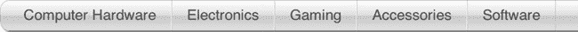
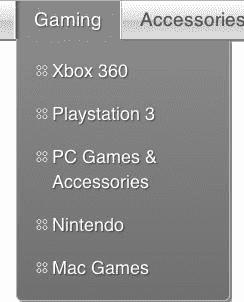
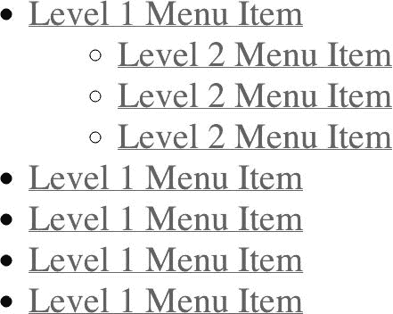
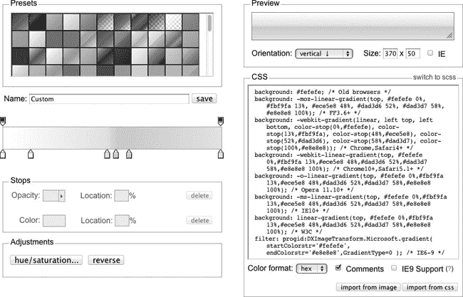
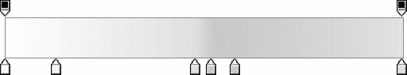
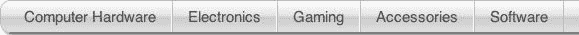
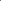
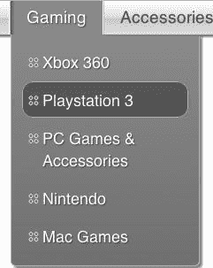
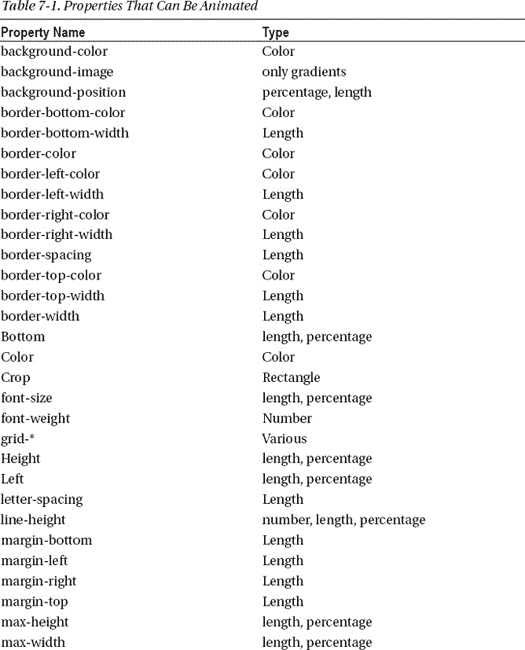
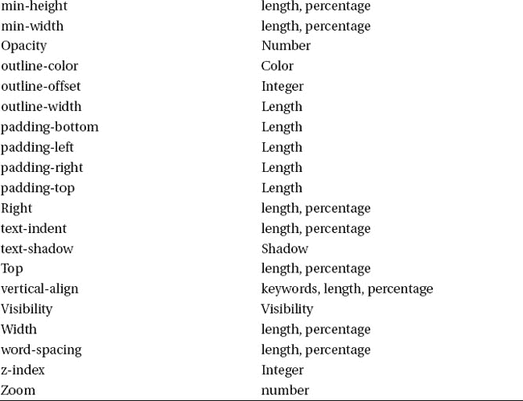

# 七、导航

除非你只是制作一个页面，否则导航是你的网站的一个重要方面。因此，当涉及到网站成功的关键因素时，你真的应该考虑一下你的策略。除了有一个好的分类法，你还需要有一个清晰的方法让访问者在你的网站上找到和探索不同的产品。有时候你可能会被诱惑在你的界面中加入很多活力和重量，尤其是当你首先从设计开始的时候。但是，内容才是王道。因此，作为一个规则，你的导航不应该和你的内容争夺注意力。也就是说，你的导航应该易于查看，更重要的是，易于使用。

为了使导航方案真正易于使用，你应该支持不同类型的访问者行为。不同的人喜欢用不同的方式导航站点，你应该支持所有导航站点的常用方式，以免你赶走那些不能如他们所愿导航的用户。一本关于可用性的很棒的书，*不要让我想到*、、 1 、有一个类比:把你的站点想象成一个百货商店。一些购物者看着部门标志，然后在过道里走来走去，直到找到他们想要的商品。有些人会找到商店员工，询问商品在哪里。第一批购物者是使用菜单找到他们想要的内容的访问者。询问店员的购物者是那些会使用网站搜索的人。您应该为这两个群体提供机制。

进一步说，百货公司把过道里的一些商品放在端盖上，这样当游客走过时，他们可以向他们展示这些商品。您应该考虑通过侧面导航这样的设计元素来提供类似的导航形式，侧面导航包括在主导航中也可用的项目(通常是下拉菜单)。我们称这种导航为“第三级导航”，因为它是我们导航方案的第三级，前两级是菜单和搜索。

在深入菜单背后的代码之前，展示一下我们在本章剩余部分创建的菜单图像是有意义的。图 7-1 显示了菜单的大部分(比页面宽度要宽，但图中显示了大部分)。

***图 7-1。**菜单处于就绪状态*

现在，让我们来看看菜单的一些扩展形式。图 7-2 显示了游戏子菜单的放大视图。

__________

1 史蒂夫·克鲁格，*别让我胡思乱想！网站可用性的常识方法*(新骑士出版社，第二版，2005)

***图 7-2。**鼠标悬停时游戏响应菜单*

### 菜单结构

创建菜单结构时，您希望定义菜单内容的 HTML

*   要有意义。
*   可读性强。
*   易于屏幕阅读器理解(或忽略)。
*   非常适合渐进的设计目标。

当我们说你希望菜单使用有意义的 HTML 时，我们的意思是你希望能够查看它的源代码，并看到各种元素(容器和内容)之间的关系。当我们说您想要可读的 HTML 时，我们的意思是您不希望它因为混乱或者使用难以理解的类名而变得难以理解。当我们说你想要一个易于屏幕阅读器理解的菜单结构时，我们的意思是你想要一个不会浪费视觉障碍访问者过多时间的菜单结构(这将在本章后面更详细地讨论)。最后，当我们说你想要符合渐进设计目标的 HTML 时，我们的意思是你想要的内容不会妨碍你为你的每个目标浏览器提供最好的显示。

我们可以从大量可能的菜单结构表示中进行选择，因为 HTML 为表达这种内容提供了相当大的灵活性。为了达到这些目标，嵌套无序列表是最有意义的。由于列表中列表的方法是菜单内容的自然映射，它很容易满足有意义和可读的目标。当我们听屏幕阅读器浏览菜单时，列表中列表结构提供了菜单最直接的听觉表现。最后，我们知道我们可以让列表中的列表结构为渐进的增强目标而工作，正如我们在本章的其余部分所演示的那样。

最后，嵌套列表方法的相对自然的结构应该尽可能地面向未来。可上网设备的数量继续飞速增长，所以没有办法知道你的网站什么时候会出现在某人的冰箱上(老实说，不要感到惊讶)。

清单 7-1 显示了基本的菜单结构。

 **注:后面的类名中** `nm`代表`navMain`。同样，`L2`表示二级列表的组成部分。我们是节省字节的朋友，也是懒惰的打字员。

***清单 7-1。**基本菜单结构*

`<ul class="navMainUL">
  <li class="nmLI"><a href="javascript:;" class="nmA">Level 1 Menu Item</a>
    <ul class="nmUL-L2">
      <li class="nmLI-L2"><a href="javascript:;" class="nmA-L2">Level 2 Menu Item</a></li>
      <li class="nmLI-L2"><a href="javascript:;" class="nmA-L2">Level 2 Menu Item</a></li>
      <li class="nmLI-L2"><a href="javascript:;" class="nmA-L2">Level 2 Menu Item</a></li>
    </ul>
  </li>
  <li class="nmLI"><a href="javascript:;" class="nmA">Level 1 Menu Item</a></li>
  <li class="nmLI"><a href="javascript:;" class="nmA">Level 1 Menu Item</a></li>
  <li class="nmLI"><a href="javascript:;" class="nmA">Level 1 Menu Item</a></li>
  <li class="nmLI"><a href="javascript:;" class="nmA">Level 1 Menu Item</a></li>
</ul>`

我们使用一个非常基本的结构，你会在许多导航方案中发现(当约定工作良好时，遵循约定是好的)。在没有样式或脚本的情况下，浏览器呈现这个结构，如图 7-3 所示。

***图 7-3。**造型前的无序列表*

您可以看到菜单结构是可读的，并且表达了正确的嵌套。在这种情况下，2 级菜单项是父 1 级菜单项的子级。我们现在可以添加样式和功能来突出您的意图。不过，在开始设计样式之前，让我们先看看提供实际菜单的 HTML。

当您阅读下面的清单时，您可能会注意到围绕第 2 层导航的额外的`div`元素。它的类名是`nmSlideout zeroHeight`。额外的标记启用了滑出技巧(我们将用菜单元素的样式来介绍)。接下来，您可能会注意到，我们在第 1 层菜单的最后一个`LI`元素(带有一个`nmLI searchWrap`类)中添加了一个搜索框。

让我们花一点时间来讨论一些基于标准的开发人员的症结所在:在这个例子中(以及我们所有的 HTML 代码中)对类名的富有表现力的使用。我们采用了这种方法，因为它很适合我们，我们现在将解释这一点。

一方面，你可能会说，通过使用 CSS 嵌套，用更少的标记就可以为嵌套元素指定类名。例如，你可以用代替一个类为`nmLI`的`li`元素，而是通过声明它的父元素并如下钻取来得到那个`li`元素:`.nmUL li`。这确实会得到第一级的`li`元素、第二级的`li`元素以及其后的任何`li`元素。虽然像`.nmUL li li`这样的选择器可以用来定位那些进一步嵌套的`li`元素，但是这样做会变得更加复杂(并且难以阅读和维护——绝对不希望将来拖累开发)。

尽管避免令人费解的代码很重要，但这并不是使用更多代码为这些元素提供自己的类的最佳理由。渲染性能是更大的原因。使用选择元素的后代方法不会产生最佳性能。原因如下:CSS 选择器引擎从右向左工作。在使用`.nmUL li`选择器的情况下，浏览器首先将所有的`li`元素收集到一个集合中，然后尝试查找其祖先拥有一个`.nmUL`类的`li`元素。这需要在 DOM 树上爬很长时间才能发现每个`li`元素是否在树上的某个地方有一个`.nmUL`祖先。使用带有标识符的选择器可以获得更好的性能。最好的性能(但比标识符好不了多少)来自于使用 ID 属性作为选择器。使用标识符而不是 ID 属性对性能的微小影响是值得的，因为标识符可以多次使用。但是，不要因为后代选择器而接受多次上下遍历 DOM 带来的更大的性能损失。

不使用后代选择器的另一个重要原因是，这种方法将 CSS 与 HTML 的结构联系在一起。因此，如果您曾经将结构更改为`ul li span span`，例如，您现在已经破坏了 CSS——并且在您的导航中间有一个醒目的黑眼睛。此外，您失去了重用为其他元素定义的类的能力，这些元素可能具有相似的样式但不同的结构。

最后，对于开发人员来说，使用显式命名的元素更容易。考虑到所有这些好处的成本可能会比几千个额外的类名实例的成本要低，您会以较低的成本获得很多。

清单 7-2 显示了我们将用于导航的实际代码。

***清单 7-2。**导航 HTML*

`<ul class="navMainUL nmDropDown clearfix" role=”navigation”>
  <li class="visuallyhidden">
    <h3 class="assistive-text">Main menu</h3>
    

        <a class="assistive-text" href="#content" title="Skip to primary content">Skip to
primary content</a>
    

  </li>
  <li class="nmLI first">
    <a href="javascript:;" class="nmA">Computer Hardware
    </a>
    

      <ul class="nmUL-L2 ">
        <li class="nmLI-L2">
          <a href="" class="nmA-L2">Computer Cases</a>
        </li>
        <li class="nmLI-L2">
          <a href="" class="nmA-L2">Hard Drives</a>
        </li>
        <li class="nmLI-L2">
          <a href="" class="nmA-L2">Monitors</a>
        </li>
        <li class="nmLI-L2 nmLast">
          <a href="" class="nmA-L2">Printers &amp; Scanners</a>
        </li>
      </ul>
    

  </li>
  <li class="nmLI">
    <a href="javascript:;" class="nmA">Electronics</a>
    

      <ul class="nmUL-L2 ">
        <li class="nmLI-L2">
          <a href="" class="nmA-L2">Television</a>
        </li>
        <li class="nmLI-L2">
          <a href="" class="nmA-L2">Home Video</a>
        </li>
        <li class="nmLI-L2 nmLast">
          <a href="" class="nmA-L2">Home Theater Solutions</a>
        </li>
        <li class="nmLI-L2 nmLast">
          <a href="" class="nmA-L2">Headphones &amp; Accessories</a>
        </li>
        <li class="nmLI-L2 nmLast">
          <a href="" class="nmA-L2">Tablets &amp; Accessories</a>
        </li>
      </ul>
    

  </li>
  <li class="nmLI">
    <a href="javascript:;" class="nmA">Gaming</a>
    

      <ul class="nmUL-L2 ">
        <li class="nmLI-L2">
          <a href="" class="nmA-L2">Xbox 360</a>
        </li>
        <li class="nmLI-L2">
          <a href="" class="nmA-L2">Playstation 3</a>
        </li>
        <li class="nmLI-L2 nmLast">
          <a href="" class="nmA-L2">PC Games &amp; Accessories</a>
        </li>
        <li class="nmLI-L2">
          <a href="" class="nmA-L2">Nintendo</a>
        </li>
        <li class="nmLI-L2">
          <a href="" class="nmA-L2">Mac Games</a>
        </li>
      </ul>
    

  </li>
  <li class="nmLI">
    <a href="javascript:;" class="nmA">Accessories</a>
    

      <ul class="nmUL-L2 ">
        <li class="nmLI-L2">
          <a href="" class="nmA-L2">Cables</a>
        </li>
        <li class="nmLI-L2">
          <a href="" class="nmA-L2">Desktop Computer Accessories</a>
        </li>
        <li class="nmLI-L2">
          <a href="" class="nmA-L2">Display Accessories</a>
        </li>
        <li class="nmLI-L2">
          <a href="" class="nmA-L2">Network Accessories</a>
        </li>
        <li class="nmLI-L2">
          <a href="" class="nmA-L2">Gaming Accessories</a>
        </li>
      </ul>
    

  </li>
  <li class="nmLI last">
    <a href="javascript:;" class="nmA">Software</a>
    

      <ul class="nmUL-L2 ">
        <li class="nmLI-L2">
          <a href="" class="nmA-L2">Books</a>
        </li>
        <li class="nmLI-L2">
          <a href="" class="nmA-L2">Graphic &amp; Design</a>
        </li>
        <li class="nmLI-L2">
          <a href="" class="nmA-L2">Mac Games</a>
        </li>
        <li class="nmLI-L2">
          <a href="" class="nmA-L2">Mac Software</a>
        </li>
        <li class="nmLI-L2">
          <a href="" class="nmA-L2">Server Software</a>
        </li>
      </ul>
    

  </li>
  <li class="nmLI searchWrap">
    <input type="search" id="searchInput" class="searchInput" placeholder="Site Search" />
    <button class="searchBtn siteGrad">Search</button>
  </li>
</ul>`

当渲染引擎完成 CSS 时，它将看起来像图 7-4 。

***图 7-4。**一级造型*

 **注意**在谈论菜单的其余部分之前，我们要指出看不见的菜单项，由`class="visuallyhidden"`标识。该菜单项以及其中的链接允许使用屏幕阅读器的访问者跳过该菜单。如果你曾经因为听菜单而痛苦，你就能理解为什么这个选项对有视觉障碍的游客来说是友好的。因为适应所有用户是非常重要的，所以要注意为视觉能力不同于普通访问者的人提供这种便利。

### 设计菜单

现在我们已经详细描述了菜单的结构和它的选择器，让我们继续把嵌套列表变成一个菜单。我们将从设计父元素`ul`开始。图 7-5 显示了期望的设计处理。

***图 7-5。**现代浏览器中的 UL 造型*

我们在这种治疗中没有使用图像；换句话说，菜单完全是通过代码定义的。我们大量利用 CSS3 来获得大量额外的视觉冲击，所以你可能会合理地想，“IE8 呢？”这又引出了另一个问题，而且是一个大问题。并非所有的浏览器都需要显示完全相同的演示文稿。事实上，试图让所有浏览器显示完全相同的演示是错误的。如前所述，我们在五大电子商务网站之一工作。并让我们组织中的每个人都同意 IE6 到 IE8 的降级状态。这意味着，如果你用 IE6 到 IE8 浏览我们的网站，你仍然会看到一个很棒的网站。它只是不会有圆角和阴影。

不再坚持每个浏览器都得到相同的待遇，这大大提高了开发速度、更精简的代码、响应性更强的设计选项和更快的页面加载速度(因为没有任何额外的 HTTP 请求)。就像我们的统计数据显示的那样，旧浏览器上的方形角和无阴影框有很大的优势，但我们的访问者很少使用。

当然，这取决于你和你的雇主或顾客来决定这是否是你的一个选择，你仍然可以按照你喜欢的方式制作所有这些菜单。尽管如此，我们还是强烈建议向旧浏览器宣传降级状态的概念。这对每个人来说都是一个胜利。由于使用旧浏览器的人不经常看到尖端的设计，他们不太可能注意到他们没有在你的网站上得到它，而你获得了更干净的代码库的所有好处。当然，这并不是给使用旧浏览器的访问者一个糟糕体验的许可；他们仍然应该获得浏览器所能提供的最佳体验。正如我们的技术评论员(嗨，杰夫)指出的，这很像在黑白电视上看彩色电视节目；肯定有什么东西不见了，但这是观众得到的。电视摄制组所能做的就是努力确保画面至少能在黑白电视上显示出来。最后，随着圆角在设计界失去声望，我们都在无缘无故地追逐回报递减。

图 7-6 展示了 IE8 参观者实际看到的。它仍然提供了正确的信息和功能，看起来也不错，特别是对于那些很少看到圆角的访问者。(杰伊说它看起来更干净，事实上，但他从来不喜欢圆角。)

***图 7-6。**在旧浏览器上看到的第 1 层样式*

让我们回到这个菜单的样式。清单 7-3 显示了父元素`ul`的 CSS:

***清单 7-3。**父 UL 的 CSS*

`.navMainUL {
  display: block;
  min-height: 31px;
  padding: 0 5px 0 8px;
  border: 1px solid #cdbec4;
  width: 100%;
  margin-right: 5px;
  -webkit-box-sizing: border-box;
  -moz-box-sizing: border-box;
  box-sizing: border-box;
  -webkit-box-shadow: 2px 2px 2px #999999;
  -moz-box-shadow: 2px 2px 2px #999999;
  box-shadow: 2px 2px 2px #999999;
  -webkit-border-radius: 10px;
  -moz-border-radius: 10px;
  border-radius: 10px;
  -moz-background-clip: padding;
  -webkit-background-clip: padding-box;
  background-clip: padding-box;
  z-index: 20;
  position: relative;
  -moz-background-clip: padding;
  -webkit-background-clip: padding-box;
  background-clip: padding-box;
  /* Background */

  background: #fefefe;
  background: url(data:image/svg+xml;base64,PD94bWwgdmVyc2lvbj0iMS4wIiA/Pgo8c3ZnIHhtbG5zPSJodHRw
Oi8vd3d3LnczLm9yZy8yMDAwL3N2ZyIgd2lkdGg9IjEwMCUiIGhlaWdodD0iMTAwJSIgdmlld0JveD0iMCAwIDEgMSIgcHJl
c2VydmVBc3BlY3RSYXRpbz0ibm9uZSI+CiAgPGxpbmVhckdyYWRpZW50IGlkPSJncmFkLXVjZ2ctZ2VuZXJhdGVkIiBncmFk
aWVudFVuaXRzPSJ1c2VyU3BhY2VPblVzZSIgeDE9IjAlIiB5MT0iMCUiIHgyPSIwJSIgeTI9IjEwMCUiPgogICAgPHN0b3Ag
b2Zmc2V0PSIwJSIgc3RvcC1jb2xvcj0iI2ZlZmVmZSIgc3RvcC1vcGFjaXR5PSIxIi8+CiAgICA8c3RvcCBvZmZzZXQ9IjEz
JSIgc3RvcC1jb2xvcj0iI2ZiZjlmYSIgc3RvcC1vcGFjaXR5PSIxIi8+CiAgICA8c3RvcCBvZmZzZXQ9IjQ4JSIgc3RvcC1j
b2xvcj0iI2VjZTVlOCIgc3RvcC1vcGFjaXR5PSIxIi8+CiAgICA8c3RvcCBvZmZzZXQ9IjUyJSIgc3RvcC1jb2xvcj0iI2Rh
ZDNkNiIgc3RvcC1vcGFjaXR5PSIxIi8+CiAgICA8c3RvcCBvZmZzZXQ9IjU4JSIgc3RvcC1jb2xvcj0iI2RhZDNkNyIgc3Rv
cC1vcGFjaXR5PSIxIi8+CiAgICA8c3RvcCBvZmZzZXQ9IjEwMCUiIHN0b3AtY29sb3I9IiNlOGU4ZTgiIHN0b3Atb3BhY2l0
eT0iMSIvPgogIDwvbGluZWFyR3JhZGllbnQ+CiAgPHJlY3QgeD0iMCIgeT0iMCIgd2lkdGg9IjEiIGhlaWdodD0iMSIgZmls
bD0idXJsKCNncmFkLXVjZ2ctZ2VuZXJhdGVkKSIgLz4KPC9zdmc+);
  background: -moz-linear-gradient(top, #fefefe 0%, #fbf9fa 13%, #ece5e8 48%, #dad3d6 52%,
#dad3d7 58%, #e8e8e8 100%);
  background: -webkit-gradient(linear, left top, left bottom, color-stop(0%, #fefefe),
color-stop(13%, #fbf9fa), color-stop(48%, #ece5e8), color-stop(52%, #dad3d6), color-stop(58%,
#dad3d7), color-stop(100%, #e8e8e8));
  background: -webkit-linear-gradient(top, #fefefe 0%, #fbf9fa 13%, #ece5e8 48%, #dad3d6 52%,
#dad3d7 58%, #e8e8e8 100%);
  background: -o-linear-gradient(top, #fefefe 0%, #fbf9fa 13%, #ece5e8 48%, #dad3d6 52%, #dad3d7
58%, #e8e8e8 100%);
  background: -ms-linear-gradient(top, #fefefe 0%, #fbf9fa 13%, #ece5e8 48%, #dad3d6 52%,
#dad3d7 58%, #e8e8e8 100%);
  background: linear-gradient(top, #fefefe 0%, #fbf9fa 13%, #ece5e8 48%, #dad3d6 52%, #dad3d7
58%, #e8e8e8 100%);
  filter: progid:dximagetransform.microsoft.gradient(startColorstr='#fefefe',
endColorstr='#e8e8e8', GradientType=0);
}`

这里有很多 CSS，但大部分是不同的供应商前缀(例如–moz，-webkit 等。).没有必要解释所有的 CSS，因为它是非常基本的。然而，回顾一下 CSS3 的一些优点会有所帮助。具体来说，我们应该解释一下你可能会挠头的那个古怪的 base64 背景图像。

 **注意**微软过滤器会导致性能非常差。如果没有它们也可以，那就跳过它们。我们在这里包括它们是为了支持 Internet Explorer 并提供一个完整的示例。

#### 盒子尺寸

自浏览器早期以来，框的大小就一直是争论的焦点(这个问题可以追溯到页面布局软件的早期)。基本问题是如何处理填充、边距和边框。

假设您指定了一个宽度为 100 像素、填充为 20 像素、边距为 20 像素的 div 元素。(为了简单起见，我们将边框设置为 0。)得到的元素实际上会有多宽？嗯，这取决于谁实现了箱子尺寸。(如果有什么让开发人员抓狂的话，那就是“视情况而定”，这总是意味着他们必须为多种条件编码。)微软的一些人认为这个框应该是 140 像素宽:20 像素用于左边距，100 像素用于框本身，20 像素用于右边距。在这种情况下，填充位于框内，因此内容区域为 60 像素宽。这个规范和大多数实现它的人都说这个盒子应该是 180 像素宽。在该实现中，边距和填充都在框外，留下 100 像素宽的内容区域。

哪一种看起来是正确的，很大程度上是个人喜好的问题，许多人都试图证明这种或那种方法是正确的。严格来说，微软的实现是一个 bug。然而，他们的实现对很多人来说是有意义的，包括迈克尔。所以整个问题引起了一些争议。

更有趣的是(从某种众所周知的诅咒的意义上来说)，不同版本的 Internet Explorer 以不同的方式实现框大小调整。在版本 6 之前，Internet Explorer 通过填充值缩小了内容区域。从版本 6 开始，Internet Explorer 将在其符合标准的模式下遵守规范(将填充放在内容区域之外),但在其古怪的模式下不遵守规范。因为当存在有效的文档类型时，Internet Explorer 进入标准兼容模式，所以指定有效的文档类型是控制这种行为的方法。另外，Mac 版的 Internet Explorer 从未缩小过内容区。

作者注迈克尔说:“就我个人而言，虽然这么说让我很痛苦，但我实际上同意 IE 版本的盒子模型的工作方式。对我来说，当你试图使用现实世界的类比时更有意义。如果我有一个装运箱，并添加了填充物，箱子本身不会变大。里面的空间变小了。”

Jay 更喜欢坚持 glue 这样的标准，但是这次他让 Mike 按照 Mike 的方式来做，因为 Jay 认为内容区域改变宽度是不好的。

我们确实同意，如果你正在做移动 web 开发，或者可以依赖拥有支持 CSS3 的浏览器的访问者，那么`box-sizing`属性会很方便。

我们选择使用一个`box-sizing`属性，这样我们可以设置 100%的宽度，并且仍然以像素为单位设置填充。这很方便，因为我们不希望填充因为在不同的显示设备上调整大小而伸缩或“自我调整”。

***清单 7-4。**设定定箱模型*

`box-sizing: border-box;`

#### 标准 CSS3 糖果

当然，我们使用了圆角和阴影。我们不会深入细节，因为代码本身读起来很好。此外，很有可能你已经对这些特殊的特性听得够多了。

#### 渐变

如果你说这是一段冗长的 CSS 来描述`ul`元素的背景，我们同意你的观点。好消息是我们不需要写这些，你也不需要。ColorZilla 的优秀人员为您带来了 Firefox 的颜色选择器插件，他们也制作了可能是我们见过的最酷的 CSS web 应用之一。它被恰当地称为终极 CSS 渐变生成器。你可以在 http://www.colorzilla.com/gradient-editor/找到它。

本质上，它是一个非常强大的(“终极”非常接近)渐变生成器，输出一段相当防弹的代码，以确保您的渐变要么显示良好，要么逐步后退。一切为了低价，低价的免费！让我们来看看他们界面中的渐变，如图图 7-7 所示。

***图 7-7。**终极 CSS 渐变生成器*

请注意，在“预置”面板中，您可以从许多不同的起点中进行选择。你也可以一头扎进去，忽略预设，从头开始酝酿你自己的渐变。

预设面板下方是神奇的地方。您可以通过输入名称并点击保存来保存您的渐变。如果你以后需要修改你的作品，这很方便。渐变的实际输入在保存功能下面。

***图 7-8。**渐变选择器*

在图 7-8 的顶部，两个黑框构成了不透明度选择器。对于这个例子，我们将使用 100%的不透明度(这就是为什么手柄是纯黑色)，但你可以选择用不透明度做一些真正有趣的组合。我们鼓励你去尝试。底部的一排方框是定义颜色的地方，也是“停止”的地方。以百分比定义的停止点基本上告诉工具颜色可能在哪里变化。然后，该工具负责计算出在停止点之间映射的颜色，以创建平滑的渐变。您可以通过双击方块来更改颜色，并通过单击左侧或右侧的相邻区域来进行更多停留。您也可以更改颜色，方法是点按其中一个颜色框，然后点按其下方“停靠点”面板中的颜色框。这有助于选择颜色的替代方法，因为双击时很容易不小心移动颜色框。

图 7-9 显示了我们选择的颜色。

***图 7-9。**渐变颜色*

在“色阶”面板下面的“调整”面板中，您将有一些额外的选项来进行全面的色调/饱和度更改，并反转您的颜色顺序。

“预置”面板的右边是预览面板，您可以在这里看到渐变的形状。预览栏下是方向选项:垂直、水平、对角线和径向。大小选项只是预览的大小；它不会影响输出的 CSS。旁边是 IE 复选框，可以让你看到用两种颜色表示的渐变(这是前面提到的回退部分)。同样，这个复选框不会影响代码；这只是另一种预习方式。

CSS 窗格包含输出。有几个选项，包括你想要的颜色格式(十六进制，rgba，hsl 等。).您可以选择在代码中留下注释(我们通常在这里保存字节并关闭它们)。您也可以使用 IE9 支持复选框。在支持 HTML5 和相关技术方面，IE9 已经从早期版本走了很长的路。然而，一些差距仍然存在，梯度(至少复杂的梯度，如本例)是其中之一。您仍然可以使用渐变(通过指定`filter: progid:DXImageTransform.Microsoft.gradient`)，但是它只支持两种颜色。这个工具的一个强大功能是，它可以创建一个 base64 编码的 SVG 来匹配正在定义的渐变。这有多酷？不过，要做到这一点，您需要禁用 IE9 的过滤器选项。该工具为此提供了代码，如清单 7-5 所示。

***清单 7-5。**关闭 IE9 的过滤器*

`<!--[if gte IE 9]>   
 <![endif]-->`

这是我们的老朋友，条件语句。如果浏览器是 IE9，该语句禁用过滤器。从那里开始，你只需要将`gradient`类添加到适用的元素中，如前面的清单 7-3 所示。

除了一长串的浏览器前缀外，它还支持这些浏览器的不同版本。如果所有这些都失败了，它将定义一个与滑块中的第一种颜色相匹配的平面背景颜色。

接下来，`ul`元素中有`li`元素；它们构成了第 1 层和第 2 层导航元素的容器。图 7-10 提醒你它的样子。

***图 7-10。**现代浏览器中的主菜单*

清单 7-6 显示了一个定义菜单项的 li 元素

***清单 7-6。**一个定义菜单项的李元素*

`<li class="nmLI">
  <a href="javascript:;" class="nmA">Computer Hardware </a>
  

</li>`

清单 7-7 显示了样式化一个菜单项的 CSS。

***清单 7-7。**样式化菜单项的 CSS*

`.nmLI {
  border-right: 1px solid white;
  border-left: 1px solid #ccc;
  list-style: none;
  text-align: center;
  position: relative;
  background: rgba(0, 0, 0, 0);
  display: block;
  float: left;
  padding: 0px;
  min-height: 31px;
}
.nmLI.first {
  border-left: none;
}
.nmLI.last {
  border-right-color: #ccc;
  border-left-color: #ccc;
}
.nmLI:hover {
  background: #a29da0;
}
.nmLI:hover:before {
  content: "";
  background: url(data:image/gif;base64,iVBORw0KGgoAAAANSUhEUgAAAAQAAAAjCAMAAACEhlvCAAAAGXRFWHRT
b2Z0d2FyZQBBZG9iZSBJbWFnZVJlYWR5ccllPAAAA+dpVFh0WE1MOmNvbS5hZG9iZS54bXAAAAAAADw/eHBhY2tldCBiZWdp
bj0i77u/IiBpZD0iVzVNME1wQ2VoaUh6cmVTek5UY3prYzlkIj8+IDx4OnhtcG1ldGEgeG1sbnM6eD0iYWRvYmU6bnM6bWV0
YS8iIHg6eG1wdGs9IkFkb2JlIFhNUCBDb3JlIDUuMC1jMDYwIDYxLjEzNDc3NywgMjAxMC8wMi8xMi0xNzozMjowMCAgICAg
ICAgIj4gPHJkZjpSREYgeG1sbnM6cmRmPSJodHRwOi8vd3d3LnczLm9yZy8xOTk5LzAyLzIyLXJkZi1zeW50YXgtbnMjIj4g
PHJkZjpEZXNjcmlwdGlvbiByZGY6YWJvdXQ9IiIgeG1sbnM6eG1wPSJodHRwOi8vbnMuYWRvYmUuY29tL3hhcC8xLjAvIiB4
bWxuczpkYz0iaHR0cDovL3B1cmwub3JnL2RjL2VsZW1lbnRzLzEuMS8iIHhtbG5zOnhtcE1NPSJodHRwOi8vbnMuYWRvYmUu
Y29tL3hhcC8xLjAvbW0vIiB4bWxuczpzdFJlZj0iaHR0cDovL25zLmFkb2JlLmNvbS94YXAvMS4wL3NUeXBlL1Jlc291cmNl
UmVmIyIgeG1wOkNyZWF0b3JUb29sPSJBZG9iZSBQaG90b3Nob3AgQ1M1IE1hY2ludG9zaCIgeG1wOkNyZWF0ZURhdGU9IjIw
MTItMDUtMDFUMDA6NDk6MTgtMDU6MDAiIHhtcDpNb2RpZnlEYXRlPSIyMDEyLTA1LTAxVDA2OjI2OjA3LTA1OjAwIiB4bXA6
TWV0YWRhdGFEYXRlPSIyMDEyLTA1LTAxVDA2OjI2OjA3LTA1OjAwIiBkYzpmb3JtYXQ9ImltYWdlL3BuZyIgeG1wTU06SW5z
dGFuY2VJRD0ieG1wLmlpZDpGODBFRTI0RDhCNzcxMUUxQjc2RUI3REExQzg1RUEyMSIgeG1wTU06RG9jdW1lbnRJRD0ieG1w
LmRpZDpGODBFRTI0RThCNzcxMUUxQjc2RUI3REExQzg1RUEyMSI+IDx4bXBNTTpEZXJpdmVkRnJvbSBzdFJlZjppbnN0YW5j
ZUlEPSJ4bXAuaWlkOkY4MEVFMjRCOEI3NzExRTFCNzZFQjdEQTFDODVFQTIxIiBzdFJlZjpkb2N1bWVudElEPSJ4bXAuZGlk
OkY4MEVFMjRDOEI3NzExRTFCNzZFQjdEQTFDODVFQTIxIi8+IDwvcmRmOkRlc2NyaXB0aW9uPiA8L3JkZjpSREY+IDwveDp4
bXBtZXRhPiA8P3hwYWNrZXQgZW5kPSJyIj8+tVKbSQAAABhQTFRFmJSXb2ttgX1/j4uNk4+ShYGDcm5wnpmckwoARwAAABdJ
REFUeNpiYGRiZmBgY2VhHxIEQIABAPz1AvMeVbYrAAAAAElFTkSuQmCC);
  display: block;
  position: absolute;
  width: 4px;
  height: 33px;
  left: 0;
  top: 0;
}`

这里唯一棘手的是最后一个规则集`.nmLI:hover:before`，我们将在下一个规则集中讨论。在我们继续之前，我们认为你应该看看菜单的样子。当然，您也可以访问我们的示例网站(`[`clikz.us`](http://clikz.us)`)来看看它的运行情况。图 7-11 显示了游戏子菜单。

***图 7-11。**游戏子菜单*

#### :之前和之后:伪类

还记得`:before`伪类吗？为了省去你找它的麻烦，清单 7-8 重复了那个类。

***清单 7-8。**`:before`伪级*

`.nmLI:hover:before {
  content: "";
  background: url(data:image/gif;base64,iVBORw0KGgoAAAANSUhEUgAAAAQAAAAjCAMAAACEhlvCAAAAGXRFWHRT
b2Z0d2FyZQBBZG9iZSBJbWFnZVJlYWR5ccllPAAAA+dpVFh0WE1MOmNvbS5hZG9iZS54bXAAAAAAADw/eHBhY2tldCBiZWdp
bj0i77u/IiBpZD0iVzVNME1wQ2VoaUh6cmVTek5UY3prYzlkIj8+IDx4OnhtcG1ldGEgeG1sbnM6eD0iYWRvYmU6bnM6bWV0
YS8iIHg6eG1wdGs9IkFkb2JlIFhNUCBDb3JlIDUuMC1jMDYwIDYxLjEzNDc3NywgMjAxMC8wMi8xMi0xNzozMjowMCAgICAg
ICAgIj4gPHJkZjpSREYgeG1sbnM6cmRmPSJodHRwOi8vd3d3LnczLm9yZy8xOTk5LzAyLzIyLXJkZi1zeW50YXgtbnMjIj4g
PHJkZjpEZXNjcmlwdGlvbiByZGY6YWJvdXQ9IiIgeG1sbnM6eG1wPSJodHRwOi8vbnMuYWRvYmUuY29tL3hhcC8xLjAvIiB4
bWxuczpkYz0iaHR0cDovL3B1cmwub3JnL2RjL2VsZW1lbnRzLzEuMS8iIHhtbG5zOnhtcE1NPSJodHRwOi8vbnMuYWRvYmUu
Y29tL3hhcC8xLjAvbW0vIiB4bWxuczpzdFJlZj0iaHR0cDovL25zLmFkb2JlLmNvbS94YXAvMS4wL3NUeXBlL1Jlc291cmNl
UmVmIyIgeG1wOkNyZWF0b3JUb29sPSJBZG9iZSBQaG90b3Nob3AgQ1M1IE1hY2ludG9zaCIgeG1wOkNyZWF0ZURhdGU9IjIw
MTItMDUtMDFUMDA6NDk6MTgtMDU6MDAiIHhtcDpNb2RpZnlEYXRlPSIyMDEyLTA1LTAxVDA2OjI2OjA3LTA1OjAwIiB4bXA6
TWV0YWRhdGFEYXRlPSIyMDEyLTA1LTAxVDA2OjI2OjA3LTA1OjAwIiBkYzpmb3JtYXQ9ImltYWdlL3BuZyIgeG1wTU06SW5z
dGFuY2VJRD0ieG1wLmlpZDpGODBFRTI0RDhCNzcxMUUxQjc2RUI3REExQzg1RUEyMSIgeG1wTU06RG9jdW1lbnRJRD0ieG1w
LmRpZDpGODBFRTI0RThCNzcxMUUxQjc2RUI3REExQzg1RUEyMSI+IDx4bXBNTTpEZXJpdmVkRnJvbSBzdFJlZjppbnN0YW5j
ZUlEPSJ4bXAuaWlkOkY4MEVFMjRCOEI3NzExRTFCNzZFQjdEQTFDODVFQTIxIiBzdFJlZjpkb2N1bWVudElEPSJ4bXAuZGlk
OkY4MEVFMjRDOEI3NzExRTFCNzZFQjdEQTFDODVFQTIxIi8+IDwvcmRmOkRlc2NyaXB0aW9uPiA8L3JkZjpSREY+IDwveDp4
bXBtZXRhPiA8P3hwYWNrZXQgZW5kPSJyIj8+tVKbSQAAABhQTFRFmJSXb2ttgX1/j4uNk4+ShYGDcm5wnpmckwoARwAAABdJ
REFUeNpiYGRiZmBgY2VhHxIEQIABAPz1AvMeVbYrAAAAAElFTkSuQmCC);
  display: block;
  position: absolute;
  width: 4px;
  height: 33px;
  left: 0;
  top: 0;
}`

这段代码可能看起来很奇怪，因为选择器中的`:before`伪类和看起来很奇怪的代码块。先说一下`:before`和`:after`伪类。这个想法一开始可能看起来有点奇怪，但是一旦你习惯了这些伪类，它们可能会改变游戏规则。

首先，让我们考虑浏览器支持。以下浏览器支持`:before`和`:after`伪类:

*   Firefox 3.5+(3.5 之前的版本有部分支持)
*   Safari 1.3 以上版本
*   Chrome:所有版本
*   歌剧:6+
*   IE: 9+(部分支持 IE8)

因此，不要将这些伪类用于任务关键型代码，但是它们对于渐进式增强非常有用。事实上，由于浏览器支持有限，我们通常不使用这些伪类。

`:before`和`:after`伪类都在 DOM 中创建了另一个可以样式化的元素。此外，还可以添加文字。你可以用它来添加美元符号或时髦的引号或任何一千种其他东西。在这种情况下，让我们来一点演示技巧。在菜单中，当访问者的鼠标悬停在第 1 层`li`元素上时，让我们显示下拉菜单并更改`li`元素的背景。为了给人一种有深度的感觉，让我们在`li`元素的左边添加一个小阴影，让它看起来稍微有点凹陷。如果它没有出现在旧的浏览器上，那也没关系，因为它只是养眼而已。

这是渐进增强的一个很好的例子。我们创造了一种适用于所有访问者的体验，使用功能更强大的浏览器的访问者可以获得与他们的浏览器功能相匹配的体验，因此会更好一点。

#### 使用 Base64 编码

现在让我们来谈谈背景图片和时髦的代码。我们希望展示如何在 CSS 中嵌入图像的实际代码，而不是提供图像的路径。生成看似随机的字符块的技术称为 base64 编码。这是一种将图像存储为字符块的方式。(如果你打开一个图像文件，你会看到它也只是一个这样或那样的字符块，取决于图像；base64 编码在您的代码中创建了一个类似的构造。)

使用 base64 编码可能很棘手，因为你必须了解缓存。如果您将 base64 编码的图像添加到 HTML 中，该图像将不会被缓存。因此，如果再次需要该图像，必须将它添加到下一个需要它出现的页面。那是一种痛苦。相反，应该将 base64 编码的图像放在 CSS 中，因为 CSS 会被缓存。

即使您可以将它们放在 CSS 中，稍后从缓存中获取它们，处理引用的图像通常更容易，因为它们更容易维护，并且不会弄乱您的代码。不过，在这种情况下，通过不让 HTTP 请求获取该图像，可以从站点中挤出一点点性能。不过，最主要的是，让我们把它放在这里进行演示。

另一个限制是 IE7 和早期版本不支持 base64 编码。在这个例子中，因为我们知道 IE7 不会支持`:before`伪类，所以我们不用担心。在我们已经使用这种技术并不得不考虑 IE7 使用的网站中，我们让服务器端控制器对图像进行动态编码，或者如果访问者的浏览器不能处理它，就用路径替换 base64 编码(我们在第二章中讨论了使用特征检测的基本思想)。对支持 base64 编码的浏览器使用 base64 编码是检测访问者浏览器功能并为其编码的另一个例子。

清单 7-9 显示了第一层`li`元素中的锚标签。

***清单 7-9。**一级主播风格*

`.nmA {
  display: block;
  line-height: 110%;
  font-size: 15px;
  color: #606060;
  text-decoration: none;
  background-color: rgba(0, 0, 0, 0);
padding: 7px 15px 3px;
}
.nmA:visited {
  color: #606060;
}
.nmA:hover {
  color: #606060;
  text-decoration: none;
}
 nmLI:hover .nmA {
  text-shadow: 1px 1px 1px rgba(0, 0, 0, 0.4);
}`

这里唯一需要注意的是最后一个规则集:`.nmLI:hover .nmA{}`。

我们指定，当`.nmLI`被悬停时，`li`元素内的锚(由`.nmA`标识符标识)应该有不同的样式。在这种情况下，我们指定在文本上放置阴影，以便它与下拉部分中的其他链接相匹配。如果 JavaScript 被禁用，我们将使用相同的技术来激活下拉菜单。稍后会有更多内容。

现在让我们看看下拉菜单；首先，我们需要实际的下拉容器。这是一个 div，有一个类`nmSlideout zeroHeight`位于我们的第 1 层锚标签旁边。清单 7-10 展示了 CSS。

***清单 7-10。**下拉容器的 CSS*

`.nmSlideout {
  overflow: hidden;
  min-width: 100%;

  -webkit-transition: all 0.25s ease-in-out;
  -moz-transition: all 0.25s ease-in-out;
  -ms-transition: all 0.25s ease-in-out;
  -o-transition: all 0.25s ease-in-out;
  transition: all 0.25s ease-in-out;

  position: absolute;
  z-index: 11;
  -webkit-border-top-right-radius: 0;
  -webkit-border-bottom-right-radius: 5px;
  -webkit-border-bottom-left-radius: 5px;
  -webkit-border-top-left-radius: 0;
  -moz-border-radius-topright: 0;
  -moz-border-radius-bottomright: 5px;
  -moz-border-radius-bottomleft: 5px;
  -moz-border-radius-topleft: 0;
  border-top-right-radius: 0;
  border-bottom-right-radius: 5px;
  border-bottom-left-radius: 5px;
  border-top-left-radius: 0;
  -moz-background-clip: padding;
  -webkit-background-clip: padding-box;
  background-clip: padding-box;
  background-color: #a29da0;
  background: -webkit-gradient(linear, left top, left bottom, from(#a29da0), to(#898587));
  background: -webkit-linear-gradient(top, #a29da0, #898587);
  background: -moz-linear-gradient(top, #a29da0, #898587);
  background: -ms-linear-gradient(top, #a29da0, #898587);
  background: -o-linear-gradient(top, #a29da0, #898587);
  -webkit-box-shadow: 3px 3px 3px rgba(0, 0, 0, 0.4);
  -moz-box-shadow: 3px 3px 3px rgba(0, 0, 0, 0.4);
  box-shadow: 3px 3px 3px rgba(0, 0, 0, 0.4);
  top: 100%;
  min-width: 170px;
}`

除了大量带有供应商前缀的防弹功能，我们还有一些其他有趣的代码。最值得注意的是下面一行:

`transition: all 0.25s ease-in-out;`

当 CSS3 可用时，该行提供动画。翻译成英语，它基本上是说，“如果某些属性发生了变化，让我们来制作动画。”清单 7-11 展示了如何让它运行。

***清单 7-11。**CSS 过渡的一般模式*

`transition: [what properties to animate; i.e., width, height, etc.] [how long should the
animation take] [what kind of easing should be used];`

所以在这个例子中，所有的方面(冒号后的关键字`all`)都被动画化了。下一个值指定动画持续时间，即原始状态和您设置的结束状态之间的时间。在这种情况下，那就是四分之一秒(`0.25s`)。然后是缓动说明符，这个说明符有点复杂。真的是曲线加速率。所以如果你用一个`linear`的值，它将是一个变化的恒定速率，但如果你用`ease-in-out`，它将在开始和结束时加速得更快，而中间会慢一点。`ease-in-out`的设定倾向于让动画看起来更真实；当事物在现实生活中运动时，它们通常不会以同样精确的速度运动。

你可能会想，“我如何告诉它改变。”问得好。有几种方法；最简单的是使用伪类，比如:hover。现在你可以在`.nmSlideout:hover`中定义一种不同的颜色，动画就会自动出现。那是一些不错的魔术。或者，在我们的例子中，您可以使用 JavaScript 来更改类或 CSS 属性，转换将由此触发。

表 7-1 显示了许多可以设置动画的属性。

 **作者注**是的，这是一场漫长的战役，我们还没有描述完我们的菜单是如何运作的。请容忍我们。如果这算是一种安慰的话，这也是一个很长的章节(重写了几次)。

现在让我们来设计下拉列表中链接的样式。让我们再次使用一个包含锚标签的无序列表。清单 7-10 显示了`ul`和`li`类的 CSS。

***清单 7-12。【CSS 给和李上课***

`.nmUL-L2 {
  text-align: left;
  position: absolute;
  bottom: 0;
  display: block;
  padding: 5px 10px 10px 10px;
  float: left;
}
.nmLI-L2 {
  padding: 1px 0;
}`

那一点造型不含惊喜。然而，我们将在锚标签和`:before`伪类中遇到更多的转换乐趣。我们将使用这些技术来突出显示一个菜单项，如图图 7-12 所示。

***图 7-12。**游戏菜单中突出显示了一个项目*

清单 7-13 显示了我们用来定义菜单高亮行为的代码。

***清单 7-13。**动画显示并高亮显示菜单项*

`.nmA-L2 {
  color: white;
  background: rgba(0, 0, 0, 0);
  text-shadow: 1px 1px 1px rgba(0, 0, 0, 0.4);
  padding: 7px 5px 5px 18px;
  display: block;
  position: relative;
  -webkit-transition: all 0.5s ease-in-out;
  -moz-transition: all 0.5s ease-in-out;
  -ms-transition: all 0.5s ease-in-out;
  -o-transition: all 0.5s ease-in-out;
  transition: all 0.5s ease-in-out;
  -webkit-border-radius: 10px;
  -moz-border-radius: 10px;
  border-radius: 10px;
  -moz-background-clip: padding;
  -webkit-background-clip: padding-box;
  background-clip: padding-box;
  border: 1px solid rgba(0, 0, 0, 0);
}
.nmA-L2:visited {
  color: #ffffff;
}
.nmA-L2:hover {
  background: rgba(0, 0, 0, 0.3);
  text-decoration: none;
  color: white;
  border: 1px solid #c5bfc3;
}
.nmA-L2:before {
  content: "::";
  /*background: url(../img/menu-arrow.png) no-repeat;*/

  width: 15px;
  height: 16px;
  font-family: times, serif;
  display: inline-block;
  color: #828282;
  font-weight: 700;
  position: absolute;
  text-shadow: -1px 0 #f3f3f3, 0 1px #f3f3f3, 1px 0 #f3f3f3, 0 -1px #f3f3f3;
  top: 6px;
  left: 5px;
}`

您可能注意到了`.nmA-L2`规则集中的转换。当我们将鼠标悬停在第 2 层链接上时，该规则集处理轻微的转换，这样我们可以看到一个框在它们周围淡入。我们通过使用以下代码行设置初始背景来实现这一点:

`background: rgba(0, 0, 0, 0);`

该值为突出显示的菜单项设置红色、绿色、蓝色和 alpha。(我们知道你知道这一点，但我们必须告诉你这一点，以便我们可以告诉你下一点。)阿尔法部分是我们最感兴趣的。将初始值设置为 0(零)会使其完全透明。然后我们在`.nmA-L2:hover`中用下面一行设置悬停状态:

`background: rgba(0, 0, 0, 0.3);`

该设置使其成为 30%不透明度的黑盒。有趣的东西。

您还可以看到，我们使用了`:before`伪类，并且做了一些我们说不经常做的事情:用 CSS 插入文本。然而，我们这次这样做有一个很好的理由:我们可以得到一个简单的图标，它比用图像得到的图标表现得更好。为此，我们使用::(两个冒号字符)，然后给菜单项一个轮廓。清单 7-14 显示了添加两个冒号字符的行。

***清单 7-14。**用 CSS 添加两个冒号*

`nmA-L2:before {
  content: "::"; /* The insertion of colon characters
  text-shadow: -1px 0 #f3f3f3, 0 1px #f3f3f3, 1px 0 #f3f3f3, 0 -1px #f3f3f3;
}`

 **提示**正如我们在第一章中提到的，实用主义战胜了纯粹主义。已经说过我们从不通过 CSS 插入文本，我们可以拒绝这样做。然后，我们必须使用一个图像来创建这个小图标。这将是一个错误，因为这将迫使我们管理另一项素材，从而影响业绩。如果打破规则能带来好处，那就打破规则。当然，诀窍是知道*何时*打破规则。

获得课文的大纲有点棘手。由于文本上没有轮廓的概念，我们可以通过使用一系列基本上实心的文本阴影来欺骗它。清单 7-15 显示了定义文本阴影的一般模式。

***清单 7-15。**定义文本阴影的一般模式*

`Text-shadow: [horizontal offset] [vertical offset] [blur] [color];`

因为我们没有定义模糊度，所以假设模糊度为 0。在这种情况下，模糊度为 0 会使它看起来像一条实线。因为我们确保每个方向都有一个实阴影，阴影重叠，最终结果是一条实线。巧妙的把戏，不是吗？

然后剩下的就是绝对地定位它，把它移到左边，使用左边的填充来确保按钮文本不与它相交。这就是我们的技术:简单有效。

#### 下拉效果

既然样式已经就位，剩下的就是以一种包含渐进增强核心价值的方式来制作下拉菜单的动画。在这里，您将不得不稍微依赖一下 JavaScript。如果使用`.nmSlideout`标识符手动设置每个元素的高度，使每个元素都与其内容一样高，那么在 CSS3 中您实际上可以完成这一切。如果所有这些值都是手动设置的，下拉菜单的动画可以用清单 7-16 中的简单规则来定义。

***清单 7-16。** CSS3 动画下拉方式*

`.nmLI:hover .nmSlideout {
        height: some number px;
}`

那会工作得很好，但是会有更多的前期编码工作要做。更糟糕的是，如果内容发生了变化，您必须记得重新测量新的内容。最糟糕的是，如果维护内容的人和维护设计的人不是同一批人，那么你的页面肯定会出现明显的错误。因此，采取简单(也是聪明)的方法，让 JavaScript 来帮忙。然而，最好采用一种对 JavaScript 依赖很少的方法，这样性能就很好(记住计算也总是有成本的)。清单 7-17 显示了代码。

***清单 7-17。**设置下拉框高度的 JavaScript】*

`var nmLICol = $(".nmLI"), slideoutCol = $(".nmSlideout");
$(".nmSlideout").each(function() {
  var t = $(this), level2Nav = $(".nmUL-L2", t);
  t.css({
    "height" : level2Nav.outerHeight() + "px"
  }).attr("data-height", level2Nav.outerHeight() + "px");
})`

这段代码抓取所有标识符为`.nmSlideout`的元素；然后，对于每一个元素，它找出其中的`ul`元素有多高，并将标识符为`.nmSlideout`的元素的样式设置为该高度。最后，它将`data-height`属性的值设置为相同的像素高度(`+ "px"`)。稍后将需要该值，所以我们在这里设置它。

现在我们来看一下`.nmSlideout`的高度应该是多少，以容纳内部内容，并使其显式化。然而，你仍然需要一个高度来过渡。唯一的问题是它的高度不再是 0，因为它的内联样式已经被设置为一个新的高度。这里有一点小技巧。

你可能注意到了我们的`.nmSlideout`元素的第二个类:`zeroHeight`。清单 7-18 显示了那个类。

***清单 7-18。**美国。零高度等级*

`.zeroHeight {
  height: 0 !important;
  -webkit-box-shadow: 0 0 0 rgba(0, 0, 0, 0) !important;
  -moz-box-shadow: 0 0 0 rgba(0, 0, 0, 0) !important;
  box-shadow: 0 0 0 rgba(0, 0, 0, 0) !important;` `}`

这个类中最重要的事情是它将`.nmSlideout`元素的高度设置为 0(零),并添加了一个`!important`声明，因此它胜过任何没有`!important`声明的规则。所以又回到了零的高度。要制作动画，使用 jQuery 移除`mouseenter`事件上的`zeroHeight`类，并将其添加到`mouseleave`事件上。这将使浏览器遵循之前用 JavaScript 设置的高度。当它向后设置时，它会自动回到零高度。清单 7-19 显示了在`mouseenter`和`mouseleave`事件上设置类的 JavaScript 代码。

***清单 7-19。**在 mouseenter 和 mouseleave 事件上改变类的 JavaScript】*

`nmLICol.each(function() {
  var t = $(this);
  t.hover(function() {
    var slideout = $(".nmSlideout", t);
    setTimeout(function() {
      slideout.removeClass("zeroHeight");
    }, 0);
  }, function() {
    var slideout = t.find(".nmSlideout");

    slideout.addClass("zeroHeight");
  })
})`

第 1 层`li`元素已经被收集到一个集合中，然后为每个元素添加一个悬停事件。这个`jQuery .hover()`带两个函数:第一个是 hover enter 函数，第二个是 hover leave 函数。(顺便说一下，这些函数是匿名的，在运行时由它们的签名来标识——也就是参数的数量。)它添加了`mouseenter`和`mouseleave`事件处理程序。延迟为零的`setTimeout`函数是让 Firefox 正常运行所必需的。

现在我们有了现代浏览器的导航，使用 JavaScript，在大多数机器上应该在 20 毫秒内运行，并利用 CSS3 处理动画。对许多游客来说，它又快又平稳。但是非 CSS3 浏览器呢？为此，我们依靠 Modernizr 来确定 CSS3 是否可用。当它不可用时，依赖 jQuery 及其动画功能。正如我们在第二章中提到的，我们坚信使用特征检测来帮助塑造提供给每个访问者的体验。清单 7-20 展示了如何检测浏览器处理 CSS3 的能力，以及当浏览器不能处理 CSS3 时该怎么做。

***清单 7-20。**非 CSS3 浏览器的特征检测和动画*

`nmLICol.each(function() {
  var t = $(this);
  t.hover(function() {
    var slideout = $(".nmSlideout", t);
    setTimeout(function() {
      slideout.removeClass("zeroHeight")
    }, 0);
    //Add fallback if CSS3 animations are not available
    if(!Modernizr.cssanimations) {
      slideout.css("height", 0);
      slideout.stop().animate({
        "height" : slideout.attr("data-height")
      }, 400);
    }
  }, function() {
    var slideout = t.find(".nmSlideout");
    if(!Modernizr.cssanimations) {
      slideout.stop().animate({
        "height" : 0
      }, 400, function() {
        slideout.addClass("zeroHeight");
      });
    } else {
      slideout.addClass("zeroHeight");
    }
  })
})`

内置了一些逻辑来检测 CSS3 动画是否可用，如果不可用，就使用 jQuery 的`animate`函数。我们依靠 Modernizr 来检测 CSS3 动画特性是否在`!Modernizr.cssanimations`中可用。如果条件评估为假，我们通过在零高度和`.nmSlideout`显示其内容所需的高度之间制作动画来模仿 CSS3 的行为。我们从清单 7-15 中第一次运行脚本时设置的`data-height`属性中获取高度。除了将`mouseleave`事件的高度设置为零，我们还需要将`zeroHeight`类设置回来。如果我们已经将高度设置为零，为什么还要这样做呢？因为我们需要 CSS 使默认状态看起来像有一个透明的边框，这样当动画发生时元素就不会移动。

你差不多完成了。(感谢大家的包容。正如我们之前所写的，这对我们来说也是一个漫长的篇章。)现在我们有了一个菜单，可以在支持 CSS3 的浏览器和不支持 CSS3 的浏览器上工作。现在是帽子戏法。如果你的访问者没有 JavaScript 怎么办？没问题。由于 HTML 的结构方式，很容易使用一种既定的方法来显示和隐藏悬停时的下拉菜单。同样，让我们使用 Modernizr，但是依赖于当访问者关闭 JavaScript 时它不存在。这听起来可能很疯狂，但这是 Modernizr 的另一个很棒的特性:它在 HTML 标签中查找并删除了`no-js`类，插入了`js`类。您现在可以利用`no-js`在 HTML 标签中的事实，因为如果没有 JavaScript，Modernizr 就不能运行，因此不能删除`no-js`类。它微妙而有效——就像我们都喜欢的东西一样。清单 7-21 显示了我们菜单的`.no-js`类:

***清单 7-21。**菜单的无 js 类*

`.no-js .zeroHeight {
  height: auto ! important;
}
.no-js .nmSlideout {
  display: none;
}
.no-js .nmLI:hover .nmSlideout {
  display: block;
}`

在`.nmLI:hover`上，显示标识为`.nmSlideout`的元素。当悬停状态不再有效时，标识为`.nmSlideout`的元素被隐藏。

#### 搜索框

最后但同样重要的是，有搜索框。考虑到大量的网络用户依靠搜索来寻找东西，你需要提供这种能力，并使它容易找到。对于这个站点，让我们设计站点搜索框的样式，使其位于导航的右侧。清单 7-22 展示了如何去做。

***清单 7-22。**设计搜索框*

`.searchWrap {
  text-align: right;
  border: 0;
  padding: 0 0 0 10px;
  float: right;
}
.searchWrap:hover {
  background: none;
}
.searchWrap:hover:before {
  background: none;
}
.searchInput {
  border: 1px solid #ccc;
  display: inline-block;
  position: relative;
  margin: 4px 0 0 0;
  height: 14px;
  padding: 5px 4px 2px 5px;
  width: 150px;
  -webkit-border-top-right-radius: 0;
  -webkit-border-bottom-right-radius: 0;
  -webkit-border-bottom-left-radius: 5px;
  -webkit-border-top-left-radius: 5px;
  -moz-border-radius-topright: 0;
  -moz-border-radius-bottomright: 0;
  -moz-border-radius-bottomleft: 5px;
  -moz-border-radius-topleft: 5px;
  border-top-right-radius: 0;
  border-bottom-right-radius: 0;
  border-bottom-left-radius: 5px;
  border-top-left-radius: 5px;
  -moz-background-clip: padding;
  -webkit-background-clip: padding-box;
  background-clip: padding-box;
  -webkit-box-shadow: inset 2px 2px 2px #999999;
  -moz-box-shadow: inset 2px 2px 2px #999999;
  box-shadow: inset 2px 2px 2px #999999;
}
.searchBtn {
  -webkit-border-top-right-radius: 7px;
  -webkit-border-bottom-right-radius: 7px;
  -webkit-border-bottom-left-radius: 0;
  -webkit-border-top-left-radius: 0;
  -moz-border-radius-topright: 7px;
  -moz-border-radius-bottomright: 7px;
  -moz-border-radius-bottomleft: 0;
  -moz-border-radius-topleft: 0;
  border-top-right-radius: 7px;
  border-bottom-right-radius: 7px;
  border-bottom-left-radius: 0;
  border-top-left-radius: 0;
  -moz-background-clip: padding;
  -webkit-background-clip: padding-box;
  background-clip: padding-box;
  border: 1px solid #ccc;
  top: -2px;
  position: relative;
  color: white;
  display: inline-block;
  padding: 3px;
  text-shadow: 0 0 4px rgba(0, 0, 0, 0.3);
}
.searchBtn:hover {
  background: #c62125;
}`

如您所见，`.searchWrap`类定位搜索框，而其他`.search`类设计搜索文本框及其相关按钮的样式。我们确信您以前见过这种结构，所以我们不会详细讨论这个话题。

### 总结

虽然一章的长度并不真正重要(尽管我们确实试图避免超出普通人一个午餐小时所能消化的范围)，但它揭示了创建一个有效的导航范例需要相当多的代码。它不需要太多的 HTML，但是需要一些复杂的 CSS 和(在较小程度上)JavaScript。

在这一章中，我们想留给你的主要思想是，使用渐进式改进来确保你的访问者获得最佳的浏览体验。我们从“完全增强”的一端开始，为浏览器支持 CSS3 的访问者编写规则。然后，我们讨论了不能处理 CSS3 但支持 JavaScript 的浏览器。最后，我们为那些浏览器不能使用 JavaScript 的访问者提供了一个解决方案。

我们强烈建议你将这个想法应用到你自己的导航元素和你开发的网站的其他方面，只要这样的技术对你的访问者有好处。