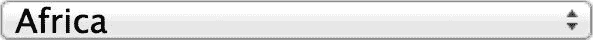

# 八、报头

在最后一章的马拉松之后，我们认为你可能想要休息一下。因为我们没有太多关于报头的内容要说，所以我们决定用这个简短的章节来平衡这个长章节。我们对报头的基本建议是保持简洁。不要试图把所有的东西(或者任何超出基本的东西)都塞进报头。

“报头”一词来源于帆船时代。想象一下，一根桅杆上挂着一堆巨大的方形帆，顶部有一面旗帜(字面意思是在桅杆的顶端)。帆完成了所有的工作。这面旗帜赢得了所有的荣誉，因为它承载着对那艘船上的人和其他船上的人都非常重要的信息。通过显示国籍，它是船上的人的骄傲，也是其他人的朋友或敌人的指示器。

当报纸变得司空见惯时，他们采用了刊头的概念作为部分版面的隐喻。一份报纸的大部分版面都被自己的“帆”占据了:它的版面——传递信息的大块区域，包括新闻报道和广告。刊头标识纸张，就像旗帜标识船只一样。这个比喻是一个方便的提醒，即刊头的工作是识别或标记报纸。换句话说，在报纸和网站上，刊头是识别品牌的地方，也是展示其他方便信息的地方。

在网页设计中，标题是品牌标志的位置，是设置网站外观和感觉的起点。此外，报头通常包含重要的导航项目:“关于我们”、“联系我们”、“购物车”等。在下面的例子中，我们使用电子商务网站上常见的内容:徽标、帐户、购物车和电话。国际网站上常见的一个项目是国家/语言选择器。虽然我们没有在示例站点中包括它，但是我们提到了一种加速这个特性的性能技术。

### 构建更好的国家选择器

在许多国家销售的大型网站通常会提供一个下拉菜单，包含他们提供的每个国家/语言选项。图 8-1 显示了处于关闭状态的典型语言选择器。

***图 8-1。**一个大型电子商务网站关闭状态下的典型语言选择器*

图 8-2 显示了同一语言选择器处于打开状态。

***图 8-2。**一个大型电子商务网站打开状态下的典型语言选择器*

这种设计元素会变得非常复杂，有时会提供 50 种甚至更多的组合。虽然可以将选择框抽象为一段动态引用的代码，但每次都必须下载生成选择列表的 HTML。在图 8-1 和图 8-2 所示的国家选择器中，每个访问者的每个页面都插入了 200 多行代码。对于一个大多数访问者从不使用的功能来说，这是一个很大的开销，而且很少有访问者会使用一次以上。

一个更好的方法是链接到一个国家/语言页面，以一种更有意义的方式列出可用的选项，也许还带有易于识别的标志。因为您已经有了一整页要处理，所以这些标志可以比下拉国家选择器中的标志更大。这种技术节省了大量的 HTML 生成，并且需要呈现的元素更少。此外，考虑到访问者通常只设置一次他们的位置和语言偏好。因此，让他们在继续购物之前进入这个页面并不是一个很大的障碍。带宽的节省(在较小的程度上，页面加载时间)是相当可观的，大多数访问者永远不会注意到这种差异。

### 看起来&感觉起来

在我们的示例电子商务站点中，我们要有一个非常直观的外观:只有一个容纳报头的容器和一些绝对放置的元素来传达关键信息。图 8-3 显示了样本站点的报头。

***图 8-3。**刊头*

清单 8-1 显示了定义报头的 HTML。

***清单 8-1。**报头 HTML*

`<header class="headNav twelvecol">
  
  <nav>
    <ul class="acctNav">
      <li class="acctNavLI">
        <a href="" class="acctNavA">Account</a>
      </li>
      <li class="acctNavLI">
        <a href="" class="acctNavA mhCart">Cart <i class="icon_
cart ir"></i></a>
      </li>
      <li class="mhContactPhone">
        1-800-555-1212
      </li>
    </ul>
  </nav>
</header>`

报头 HTML 没有令人兴奋的内容；我们可能都多次见过类似的 HTML。然而，我们确实想指出一件事:带有类`headNav twelvecol`的头部包装器。`twelvecol`标识符指的是我们正在使用的灵活网格。我们稍后会谈到这一点。

清单 8-2 显示了样式化报头的 CSS。

***清单 8-2。**报头 CSS*

`.headNav {
  height: 70px;
}
.logo_166 {
  position: absolute;
  top: 12px;
  clip: rect(2px, 168px, 48px, 2px);
}
.headNav {
  position: relative;
  font-size: 12px;
}
.acctNav {
  position: absolute;
  right: 0;
  top: 15px;
}
.acctNavLI {
  float: left;
  margin-left: 20px;
}
.acctNavA, .acctNavA:visited {
  text-decoration: none;
  color: #666666;
  display: inline-block;
}
.acctNavA:hover {
  text-decoration: underline;
}
.mhCart {
  padding-right: 23px;
}
.mhCart:hover {
  text-decoration: none;
}
.mhCart:hover .cartText {
  text-decoration: underline;
}
.icon_cart {
  background: url(../img/clikz-sprite.png) no-repeat -22px -54px;
  width: 19px;
  height: 16px;
  position: absolute;
  z-index: 1;
  right: 0;
  top: 0;
}
.mhContactPhone {
  float: right;
  clear: both;
  margin-top: 5px;
}`

我们应该在这里指出一点诡计:品牌标志的图像元素。我们选择使用图像而不是背景图像的原因只有一个:打印。你不能指望浏览器打印背景图片。事实上，你可以指望浏览器*而不是*打印背景图片。也有例外，比如用户在浏览器中改变了偏好，但我们当然不能依赖于此。所以我们选择了图像元素。然而，我们不能忍受额外的 HTTP 请求对性能的影响，所以我们将徽标添加到用于其他元素的 sprite 中，并剪切掉 sprite 图像的其余部分，只留下徽标。

#### CSS 剪辑

我们在清单 8-2 中提到的技术是新旧技术的结合。clip 属性支持 IE6，但是图像精灵的广泛采用是新的(嗯，不完全是新的，但是更新了)。

那么我们来谈谈它是如何工作的。首先，考虑清单 8-3 。

***清单 8-3。**定义一个裁剪矩形*

`clip: rect(2px, 168px, 48px, 2px);`

`clip`属性可以采用的唯一形状是`rect()`。(记住浏览器只画矩形。)里面有 CSS 经典顺序。(记住顺序的一个简单方法就是想想回忆顺序是多少:上、右、下、左。)我们使用这种顺序是因为这与大多数浏览器在呈现页面区域时使用的顺序相同。我们正在描述一个盒子，从图像的左上角开始定义。这个想法可能有点难以理解，所以让我们看一个图表。图 8-4 显示了我们的精灵。

***图 8-4。**我们的雪碧*

在本例中，我们只需要左上角的徽标部分。图 8-5 显示了具有各种特征的精灵的更详细视图。

***图 8-5。**雪碧特性*

棘手的部分可能是可视化的底部和右侧。一个简单的方法是把它们看作一个总和:它们的边距加上我们想要的图像的大小。清单 8-4 显示了伪代码中的细节。

***清单 8-4。**雪碧伪码*

`Bottom = Top (2px) + height of image (46px);
Right = Left (2px) + width of image (166px);`

为了实现这一点，我们还必须将`position`属性设置为`absolute`。现在我们有了一个像精灵一样工作的图像元素。很酷，不是吗？好吧，不管酷不酷，这是一个很方便的技巧。

#### 图标链接

在购物车链接中，我们有一个购物车图标。这种效果可以通过许多不同的方式来实现，但让我们坚持一种一直都很可靠的方式。清单 8-5 显示了 HTML。

***清单 8-5。**报头链接的 HTML】*

`<a href="javascript:;" class="acctNavA mhCart">
  Cart
  <i class="icon_cart ir"></i>
</a>`

清单 8-6 显示了 CSS。

***清单 8-6。** CSS 样式的报头链接*

`.mhCart {
  padding-right: 23px;
}
.mhCart:hover {
  text-decoration: none;
}
.mhCart:hover .cartText {
  text-decoration: underline;
}
.icon_cart {
  background: url(../img/clikz-sprite.png) no-repeat -22px -54px;
  width: 19px;
  height: 16px;
  position: absolute;
  z-index: 1;
  right: 0;
  top: 0;
}`

如您所见，文本和图像都在锚标记内。这使得它们都可以点击。

 **注意**为了定义图像，我们使用了一个< i >元素。对于关心语义标记的人来说，这似乎很奇怪，因为这是将文本显示为斜体的老方法。在网络的早期，当< i >元素很普遍时，这种时尚转移到了< em >(强调)元素，以满足斜体文本的需要。如今< i >和< b >都卷土重来，用于视觉造型，代替文字表示。因此，虽然这种对< i >元素的使用可能有点偏离预期用途，可能会让一些读者觉得奇怪甚至是错误的，但使用< i >元素来表示图标实际上是相当时尚的。简而言之，将< i >和< b >元素视为纯粹的样式而非语义标记。

您可以在清单 8-6 的规则集中看到购物车链接的 CSS。我们将使用之前解释过的填充技巧，给锚点足够的填充来容纳图标，中间留一点空间来填充文本。现在我们在做饭，但还有一个问题。因为我们已经将锚的状态定义为`text-decoration: underline`，所以图标也加了下划线。那不行；我们只希望文本有下划线。下面是解决这个问题的方法:用一个类`spanText`在文本周围添加一个 span。在锚点中，禁用从默认锚点规则集中继承的`:hover`状态。然后使用一个具有`:hover`状态的后代选择器，如清单 8-7 所示。

***清单 8-7。**后代选择器:悬停状态*

`.mhCart:hover {
  text-decoration: none;
}
.mhCart:hover .cartText {
  text-decoration: underline;
}`

这样，当访问者将鼠标悬停在带有`.mhCart`标识符的元素上时，`span.cartText`元素会得到一条下划线，但图像不会。

我们认为额外的标记是值得的，因为它让我们可以选择文本和图标。此外，它包含了“在盒子里思考”的范例，让我们以模块化的方式保持我们的关注。

### 总结

在这短短的一章中，我们讲述了

*   “报头”的起源及其在印刷和网络中的使用
*   呈现国家和语言选择器的更好方式
*   如何使用 sprite 为图像元素提供内容
*   如何在一个容器中组织文本和图像，并让它们正确地突出显示

所有这些加起来就是如何制作一个网页的报头。

我们想强调一个我们在访问各种网站和与商务人士打交道时多次遇到的警告。不要试图做太多的报头。一旦你超越了一个标志，一个购物车，和基本的联系信息，刊头就开始变得太忙了。在这一点上，你开始削弱你的品牌，让你的客户更难找到必要的信息。

最后但并非最不重要的一点是，过于繁忙的报头确实会影响性能，尤其是当您试图为每个客户定制报头时。如果你必须定制报头(我们已经做过了)，尽可能地进行广泛的测试和优化，以减少页面加载时间。另外，不要把测试留到开发过程的最后。早期，这是个问题；在最后一刻，这是一个危机，没有人需要那种心痛。套用一位著名的芝加哥政治家的话:尽早测试，经常测试。总的来说，这是一个好建议，尤其是当你在报头中添加自定义内容的时候。记住，每一页都有刊头，所以一个糟糕的刊头就是一场噩梦。