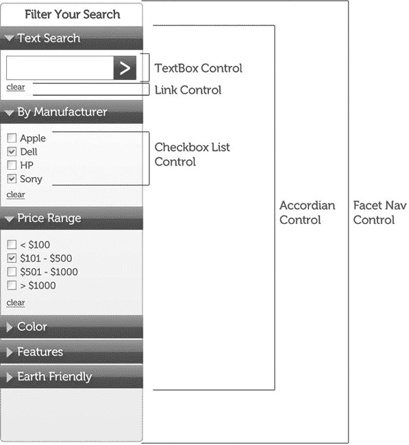

# 十、分形设计模式

“分形”可能看起来有点奇怪(特别是因为 Jay 在另一本书里写过严格数学意义上的分形)。在这种情况下，虽然，我们使用这个术语有点隐喻。根据严格的数学定义，分形是一种具有比例对称性的几何形状，这意味着你可以放大到任意深度，并看到相同的图案重复出现。图 10-1 展示了 Jay 通过编写 Java 类创建的分形树。它代表了我们从几个可重用组件构建许多页面的理念。

***图 10-1。**一棵分形树，象征递归容器设计模式*

虽然我们没有展示数学上衍生的分形，但我们将描述一种设计模式，它包括重复相同的模式到我们需要的任何深度(有时是四层或更多层)。换句话说，我们将描述一个递归容器模式。

我们在第五章中提到了我们如何构建大型网站的理论基础。在这一章中，我们将更详细地探讨这个想法。在本书这一部分的剩余章节中，我们将呈现一些分形类型的模式，作为我们在整个示例站点中使用的可重用组件。当然，您也可以在自己的工作中使用它们。

可重用组件(我们称之为控件，源于用户界面控件的概念)提供了许多好处:

*   更快的页面开发时间
*   更快的错误修复
*   增加一致性
*   更少的模式
*   更大的接受度
*   提高质量

我们将在本章后面详细讨论这些好处。

在第五章中，我们展示了一点内容，然后通过改变与内容相关的 CSS 以多种方式重用它。通过这种方式，我们得到了一个可以放在很多地方的积木。如前所述，我们称这些构建模块为控件。

### 定义控件

让我们更详细地定义一下什么是控件。控件是一个 HTML 片段，带有相关的 CSS，可能还有可重用和可配置的 JavaScript。配置可以包括更改控件的内容。让我们以最简单的控件 Label 控件为例:

`I’m a fun label
control`

我们将使用一点 PHP 把它变成可重用的东西。虽然我们选择了 PHP 来说明这些原则，但它们是非常基本的概念，几乎适用于任何服务器端语言。我们选择 PHP 是因为它是一种脚本语言，这使得描述概念比用面向对象的语言(如 Java 或 C#)更容易一些(尽管我们已经用这两种语言做了这种工作)。

现在，回到我们的控制。我们可以创建一个通用函数来构造我们的标签:

***清单 10-1。**标签控件背后的 PHP 函数*

`<?php
function label($innerText, $titleText, $addClasses) {
  var $payload = '';
  $payload .= $innerText . '';
  echo $payload;}
?>`

 **注**在 PHP 中，为“.”字符是字符串连接字符，在许多其他语言中与“+”字符具有相同的功能。类似地。= '运算符将运算符后面的字符串与运算符前面的变量的字符串值连接起来，并将结果赋给变量。的’。= '运算符在许多其他语言中相当于'+= '运算符，如 Java 和 C#。

为了在我们的页面上调用这个控件，我们将在 HTML 中希望放置标签的地方放置以下内容:

`<?php label("I'm a fun label control", "A description of this label", "anotherClass"); ?>`

正如您所看到的，label 函数是一个非常简单的字符串生成器，其中我们用函数的参数替换内部文本值。如果页面的构建者指定了额外的类，我们就把它们放进去。否则唯一的类就是`labelControl`。echo 语句是 PHP 将函数输出发送到调用该函数的 HTML 的方式。

你可能会想，“这是一个如此简单的 HTML，为什么要大费周章地制作一个控件呢？”为什么呢？因为这样做，即使对于简单的代码(如标签)也有一定的优势:

*   代码一致性
*   更简单的更新
*   更大的可读性
*   明确的意图

#### 代码一致性

现在，您已经锁定了一个可以在整个站点中使用的 HTML，它将具有一致的、可预测的结构。您不会让其他开发人员使用他们自己的特定(也可能是奇特的)模式。

#### 更简单的更新

因为您已经将这些代码抽象为一个函数，所以您有了一个中心点，可以从这个点对整个站点进行更改。您还可以选择添加功能和结构。正如我们将在本章后面提到的，你可以分离 CSS 和 JS 来匹配每个控件。由于所有相关代码都在一个地方，这大大加快了更新速度。

#### 更好的可读性

尽管在实例化控件时模糊了控件的 HTML，但您不必查看所有多余的东西。这种优势在更大、更复杂的控件中尤其有用。

#### 明确意图

如果您为控件使用描述性的名称，那么您的意图对其他开发人员来说是清楚的——当您以后再次访问这些代码时也是如此。

 **提示**因为这些名字不会被插入到 HTML 中，所以你可以使用更长的描述性名字，而不用担心增加页面的字节数(从而增加带宽的使用)。

既然我们已经设计了最简单的控件，让我们继续我们模式的分形部分:控件中的控件。

### 走向分形:案例研究

我们在其他地方提到过，我们在一个主要的电子商务网站上合作过(事实上，是世界上最活跃的五个电子商务网站之一)。更具体地说，我们为这个网站的框架团队工作。超过 20 个团队使用这个框架来加速他们的开发。我们提供了一切，从一般的页面布局意图到控件，从简单的链接控件到复杂的迷你应用。除了拥有一个真正伟大的开发团队和富有远见的领导之外，让这个框架成功的是分形设计模式。

虽然将重复的模式抽象为控件增加了极大的灵活性和速度，但使其指数化的是这些模式中的每一个都由更小的模式组成。比如说一个常见的电子商务控件，一个刻面导航窗格，比如图 10-2 所示。该控件允许访问者根据各种标准过滤搜索结果。

***图 10-2。**多面导航控件*

对我们来说重要的是，这个控件是由更小的可重用控件组成的:链接控件、标签控件、复选框控件、折叠控件等等。因此，分面导航成为刚刚提到的迷你应用之一。此外，分面导航窗格本身是一个更大的控件中的组件，也就是说，侧面导航控件本身包含在整个页面布局控件中。图 10-3 显示了分面导航控件中的主要控件(大部分由其他控件组成)。

***图 10-3。**分面导航控件内的控件*

这种看似无穷无尽的控件嵌套在控件中的方式在很多方面都有好处。最明显的是，您不必在每次需要元素已经是控件的控件时都重写代码。对于订阅我们框架的团队来说，他们的工作被大大简化了。他们能够编写一行代码并传递参数(通常以模型对象的形式在。NET MVC 框架)来获得一致的、像素完美的元素来构建新页面。

明显的好处包括:

*   更快的页面开发时间
*   更快的错误修复
*   增加一致性

我们将在以下几节中详细描述每种优势。

#### 页面开发时间更快

我们看到制作页面的速度提高了(有一次从几个月到几天)。因此，我们的客户团队可以更快地将新产品发布到网站上，这让业务人员(以及其他所有人)都很高兴。

#### 更快的错误修复

我们可以很容易地指出使用该框架的团队在哪里误用了它。在这个框架出现之前，看起来我们 20 多个客户团队中的每一个都擅长找到自己制造混乱的方法。当然，有时错误是我们的，通常是在一些我们从未预料到的边缘情况下。由于我们使用的是我们熟知的有限数量的组件，我们通常可以快速修复这些错误(通常在一天之内)。

#### 增加一致性

随着框架开始被组织的开发团队采用，页面越来越相似。这种相似性使得消费者更容易找到产品和信息。这也使得开发团队更容易为业务人员设定期望；他们可能会说“你的新页面会看起来像这个现有的页面。”最后，因为我们与一个独立的设计组织(公司内的另一个部门，但独立于开发部门)一起工作，设计师们很高兴看到他们的设计被各种开发团队更多地使用。

然后，随着我们更多地与使用该框架的团队合作，我们开始看到我们没有预料到的好处:

*   更少的模式
*   更大的接受度
*   页面加载时间好于预期
*   提高质量

同样，我们将在接下来的章节中详细描述这些意想不到的好处。

##### 更少的模式

我们真的开始把网站的每个方面都看作是可重复的模式，这让我们减少了模式。我们经常会发现彼此非常相似的设计，但是每一个都有自己专用的 HTML、CSS 和 JavaScript 支持。我们能够接近我们的利益相关者(商业利益，独立的设计团队，和使用框架的开发人员)并且问，“你能使用我们现有的控制而不是你自己的控制吗？”大多数时候，涉众并不知道现有的控制。因为我们只在自定义控件非常类似于框架控件时才问这个问题，所以涉众通常会同意。

##### 更大的接受度

我们不能强迫人们使用我们的控制。我们的团队是作为一个与现有团队平等的团队组成的，所以我们没有特别的权力。因此，我们工作的一部分基本上是销售。我们最好的销售工具之一是让客户团队意识到快速制定他们的需求符合他们的利益，并且该框架提供了制作满足各种业务单位需求的新页面的最快方法(我们谈论的是一家拥有 80，000 多名员工的公司 web 开发团队中有许多商业利益)。此外，他们知道大型网站内的一致性是可取的，这为我们的销售对话提供了另一个切入点。页面加载时间好于预期

自然，我们期望页面加载时间有所改善，因为我们编写可重用组件的方式使得 HTTP 请求减少，JavaScript 和 CSS 得到更多的重用。然而，即使是框架团队的成员也对改进的程度感到惊讶。在一个案例中，我们看到页面加载时间下降到了客户团队使用框架之前的三分之一。如果你看看今天的网络，你可以找到 CSS 文件大于 1 兆字节的网站(每次我们找到一个，我们都摇头表示不相信，但它们确实存在)。通过开发一个可重用组件的框架，包括 8 个页面布局意图(本质上是包含所有其他组件的主组件)和 40 个左右在这些布局中使用的控件，我们实现了一个 gzipped 和最小化的 CSS 文件，大小只有大约 50 千字节。

##### 提高质量

最后一个不太明显的好处是质量。因为我们能够将数千个页面(事实上是数万个页面)上的所有内容减少到不到 50 个控件，所以我们能够投入大量时间来使这些控件坚如磐石。我们关注可靠性和可用性。转而使用我们的框架的团队可以依赖每次都以相同方式工作的控件。此外，我们是少数几个在团队中有专门的质量小组的团队之一；对于每两个开发人员，我们有一个 QA 人员，每个 QA 人员都是一个有经验的 web 开发人员。然后，我们将框架记录为 API，为所有控件及其参数和设置提供清晰、有意义的名称。最后，我们提供了一个示例站点，展示了如何实现每个控件，包括每个控件的所有变体(我们称之为处理)。最后，每个控件都有一个到设计部门控件定义的链接。有了这个链接，我们的客户团队可以验证我们已经正确地实现了控件，并从设计团队那里获得关于如何使用任何给定控件的进一步指导。我们有时间完成所有这些工作，因为我们已经确定了需要支持的相当小的一组控件。

虽然我们很高兴地承认为我们在这个大公司的框架团队中的工作感到自豪，但重点不仅仅是自吹自擂。我们希望您从这堂历史课中学到的信息是，采用可重用组件，然后在每个页面上使用它们，可以为您的组织的业务和开发带来实质性的好处。

现在，我们已经提供了一个可重用框架如何工作的高级概述，让我们继续讨论我们发现可以进一步提高性能(页面加载时间和开发人员性能)的两个相关项目:(1)分离 CSS 和 JavaScript，以及(2)组合 CSS 和 JavaScript。

#### 分离 CSS 和 JavaScript

本质上，我们采用了“先分后合”的策略来管理 CSS 和 JavaScript 文件中的复杂性。虽然这听起来很奇怪，但事实证明它非常有效。所以让我们继续讨论它是如何工作的细节。

结合分形概念，该团队还采用了一种模式，即制作与每个控件相关联的小型 CSS 和 JS 文件。例如，一个链接控件也有一个`link.css`文件和一个`link.js`文件。然后，我们将使用一个合并器(我们将在本章后面讲到)将这些文件与其他相关的 CSS 和 JavaScript 文件缝合在一起。

这种方法的最大好处在于缺陷解决和维护。通过能够影响单个代码库中的许多模式，我们使得修复缺陷和对我们的文件进行变更请求变得相对容易。通过分离 CSS 和 JavaScript 文件，我们不必在庞大的 CSS 和 JavaScript 组合中寻找相关代码。特别是当你在一个团队(或者多个团队，就像我们的例子一样)中编写代码时，很难预测他们会使用什么样的选择器来影响他们的 CSS/JavaScript。如果选择器是确定的，那么很容易找到一些东西，但是有些人会使用后代选择器，如清单 10-2 所示。

***清单 10-2。**后代选择器的例子*

``

他们将使用如清单 10-2 所示的样式来定义 HTML 内容的外观，如清单 10-3 中的所示。

***清单 10-3。**后代选择器示例的 HTML 示例*

`

  
This is a great idea 

  

    <ul>
      <li><a href="reason1.html" class="theReasons">Reason #1</a></li>
      <li><a href="reason2.html" class="theReasons">Reason #1</a></li>
    </ul>
  
`

在清单 10-2 和清单 10-3 中显示的 CSS 和 HTML 的关系是糟糕的，原因有很多。首先，由于在 CSS 中使用了后代选择器，它比预期的要慢。(正如我们在第三章中提到的，由于后代选择器导致渲染引擎遍历 DOM 树，它们总是比按 ID 或按类选择要慢。)然而，使调试变得非常困难的问题是，当出现错误时，试图找到那个选择器。考虑一个包含在单个文件中的大量 CSS。你要读多少规则才能找到正确的？你有多经常阅读一个规则，因为它与许多其他规则非常相似，而没有意识到它实际上是你试图寻找的问题的匹配？那种事情耗费大量时间，非常令人沮丧。

但是，仅仅因为这是一个坏主意，并不意味着队友可能不会这样做。所以为了避免整个问题，即使你的队友使用的选择器很差，也要使用小的 CSS 文件，只包含你需要的特定组件的规则。至少这样您就有机会(因为代码应该少得多)在梳理代码时快速找到正确的选择器。此外，您可以对您的 CSS 首选项吹毛求疵，无论是您排序非破坏性规则(不影响特异性的规则)的方式，还是出于语义原因使用特定的父/子结构。

最后，对于大的 CSS 文件，当紧急情况出现时，团队可能很快失去纪律(他们总是这样)，并且以后重新安排文件变得不可行。一旦达到这一点，您就不得不不断地维护这个庞大的文件。对于较小的文件，错误更容易被发现，修复也更容易，但是你必须有将代码分成小块的纪律。一旦你做了几次，看到了好处，你就会很容易找到规律。

#### 结合 CSS 和 JavaScript

在开发时制作大量小文件很好，但在运行时却是一场灾难。那你是做什么的？你把所有的小文件合并成一个大文件，然后和每一页一起发送。

有很多最小化和合并文件的解决方案。对于我们的电子商务示例，我们使用了 Google Code 项目的 Minify 实用程序。它的标语是:“按需组合、缩小和缓存 JavaScript 和 CSS 文件，以加快页面加载速度。”你可以从`[`code.google.com/p/minify/`](http://code.google.com/p/minify/)`下载

 **注意**Minify 工具只对 PHP 有效。您可以为其他语言找到类似的实用程序。例如，雅虎的 YUI 压缩器(在 http://developer.yahoo.com/yui/compressor/的[有售)就是用 Java 编写的。](http://developer.yahoo.com/yui/compressor/)

Minify 实用程序具有以下优点:

*   它将多个 CSS 或 JavaScript 文件合并并缩小到一个下载中。
*   它使用道格拉斯·克洛克福特 JSMin 库的增强端口和自定义类来缩小 CSS 和 HTML。
*   它缓存服务器端(`files/apc/memcache`)以避免做不必要的工作。
*   当浏览器拥有最新的缓存副本时，它会以 HTTP 304(未修改)响应进行响应。
*   大多数模块都是按需延迟加载的(304 个响应使用最少的代码)。
*   它会自动重写组合 CSS 文件中的相对 URIs，以指向有效的位置。
*   在启用缓存的情况下，Minify 能够在功能中等的服务器上每秒处理数百个请求。
*   对于内容编码，它使用基于请求头的 gzip。因为缓存允许这样做，所以它比 Apache 的 mod_deflate 选项更快地提供 gzip 文件！
*   它为大多数组件提供了测试用例。
*   它允许轻松集成第三方小型设备。
*   它有单独的实用程序类用于 HTTP 编码和缓存控制。Minify 的工作方式是将 CSS 和 JS 文件分别作为查询参数发送给 PHP 脚本。以下代码行显示了一个 CSS 示例:

`<link type="text/css" rel="stylesheet" href="/min/b=css&amp;f=reset.css,1140.
css,mainNavDropDown.css,mainHead.css,breadcrumbs.css,sidebox.css,productStack.css,base.
css,footer.css" />`

以下代码行显示了一个 JavaScript 示例:

``

只需将这些代码行放在与文件相同的位置。当然，我们知道 CSS 在顶部最好，JS 在底部最好，但是你有充分的灵活性来选择你认为最好的地方。

组合的唯一缺点是它会使用 Firebug 或类似的浏览器工具进行调试变得更加困难。因为最小化(删除空格和缩短标识符)和因为所有的文件被合并，阅读代码可能是一个真正的痛苦。为了在开发过程中避免这个问题，我们使用 CSS 和 JavaScript 文件的独立引用。清单 10-4 显示了一个例子。

***清单 10-4。**CSS 文件的独立链接*

`<!-- <link rel="stylesheet" href="css/reset.css">
<link rel="stylesheet" href="css/1140.css">
<link rel="stylesheet" href="css/mainNav.css">
<link rel="stylesheet" href="css/mainHead.css">
<link rel="stylesheet" href="css/breadcrumbs.css">
<link rel="stylesheet" href="css/sidebox.css">
<link rel="stylesheet" href="css/productStack.css">
<link rel="stylesheet" href="css/base.css"> -->
<!-- <link type="text/css" rel="stylesheet" href="/min/b=css&amp;f=reset.css,1140.
css,mainNavDropDown.css,mainHead.css,breadcrumbs.css,sidebox.css,productStack.css,base.
css,footer.css" /> -->`

当我们调试时，我们删除单个链接周围的注释，并在组合链接周围添加注释，如清单 10-5 所示。

***清单 10-5。**链接到一个组合的 CSS 文件*

`<!-- <link rel="stylesheet" href="css/reset.css">
<link rel="stylesheet" href="css/1140.css">
<link rel="stylesheet" href="css/mainNav.css">
<link rel="stylesheet" href="css/mainHead.css">
<link rel="stylesheet" href="css/breadcrumbs.css">
<link rel="stylesheet" href="css/sidebox.css">
<link rel="stylesheet" href="css/productStack.css">
<link rel="stylesheet" href="css/base.css">
-->
<!-- <link type="text/css" rel="stylesheet" href="/min/b=css&amp;f=reset.css,1140.
css,mainNavDropDown.css,mainHead.css,breadcrumbs.css,sidebox.css,productStack.css,base.
css,footer.css" /> -->`

这种安排给了我们更容易调试的代码。当然，当一个页面进入生产阶段时，我们会删除单独的链接。

### 总结

本章讲述了分形或递归容器模式，即在控件中放置控件，然后将这些控件放置在其他控件中，以此类推，直到您可以考虑的任何深度。我们还展示了一个来自我们自身经验的案例研究，以展示使用这种方法对业务和开发团队的好处。最后，我们讨论了在开发时将 CSS 和 JavaScript 文件分成小块并在运行时将它们组合起来的细节。

在接下来的几章中，我们将展示这种方法的一些具体例子。我们将从一些更简单的控件(链接和按钮)开始，然后是表格、标签和产品列表。一路上，我们将继续讨论在控件中使用控件的细节，因为更复杂的控件包含更简单的控件。我们将展示的代码和展示其工作原理的示例站点并不像我们在案例研究中提到的站点那样复杂，但它足以让您开始更好地控制站点的复杂性。