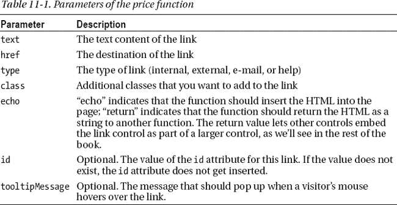
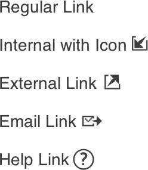
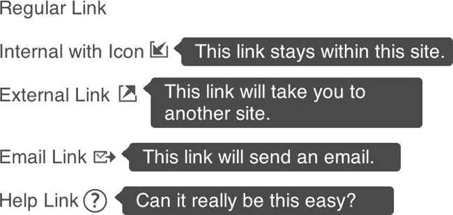
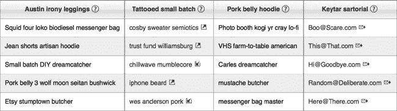

# 十一、链接控制

您可能会想，我们真的需要一个链接控件吗？编写一行 HTML 代码来完成这项任务不是更容易吗？虽然我们喜欢在简单的东西可以工作的时候不使用复杂的东西，但是我们也知道我们可以通过制作链接控件获得巨大的好处。首先，我们可以提高网站的可用性。另一方面，我们可以为我们自己和我们的团队大大提高开发人员的绩效(我们经常称之为开发速度)。

和我们所有的控件一样，我们创建了一个函数，然后可以在 HTML 中调用它。该函数为链接插入正确的 HTML。我们将包括一些参数，用于控制链接的各个方面(内部与外部链接、电子邮件链接等等)

虽然我们的方法可能看起来过于复杂，但我们将隔离这种复杂性，以便我们的队友可以获得一致样式的链接，而不必与复杂性纠缠。正如我们在第十章中提到的，在时间允许的情况下，将功能隔离在一个控件中可以让你在不中断开发团队的情况下极大地改进那个功能。当设计部门决定链接必须看起来不同时，你可以在一个地方改变它们，而不是改变你网站上的每个链接。对我们来说，这是一个巨大的好处，因为我们讨厌重复的(即无聊的)任务，这种搜索和替换操作几乎总是会产生错误。(我们似乎总是会错过一些，不是吗？)**注意**我们想指出一个经常被忽视的关于链接的事情:没有链接，网络就不会存在。众所周知但通常不会想到的是，HTTP 代表超文本传输协议。超文本的本质是在一个不断扩大的信息网中把一点内容链接到另一点内容。如果没有不起眼的 link 元素，我们就不会有万维网，也不会有工作(或者至少我们会有不同的工作)。因此，看似微不足道的链接元素实际上是我们许多生活的基础。

所以，事不宜迟，让我们看看链接控件是如何工作的，它给我们带来了什么好处。

### 功能

让我们考虑一下我们希望我们的链接控件做什么。当然，最起码要生成一个带有`href`属性的锚标记和一个描述链接的字符串，如下面的 HTML 元素所示:

`<a href="somepage.html">descriptive text</a>`

如果这就是控件所做的一切，我们就不会在这么简单的事情上浪费我们(或你们)的时间。相反，我们将使我们的链接控件提供以下选项，从而证明我们开发它所花费的时间是值得的:

*   设置`href`属性和描述性文本，如果其中一个未设置，则抛出异常。让我们面对现实:没有这两项，链接就不是链接。
*   添加 CSS 类。
*   添加一个 ID。
*   添加链接类型:内部、外部、电子邮件或帮助。
*   设置工具提示消息。
*   控制链接是输出到页面还是作为值返回给另一个函数。
*   当我们检测到更有能力的浏览器时，获得渐进增强。

这还差不多。现在，我们需要一个灵活的控件，允许我们处理许多用例。此外，正如我们前面提到的，我们可以让一个开发团队分享这种生产力的好处，同时确保整个网站的一致性。这些也是重要的要求。现在我们知道了一些控件的要求，让我们写一些代码。

我们将再次使用 PHP，但是您也可以轻松地用 Java 或。NET 或者任何人们用于 web 开发的编程语言。基本上，代码的核心是一个函数，它构建一个字符串并将其输出到页面，或者将该字符串返回给另一个函数。

当您阅读下一个清单时，考虑我们插入的`data-link-type`属性。这是我们创建的一个自定义属性，用来传递 CSS 规则使用的数据。(如果你想往前跳，清单 11-6 展示了我们如何处理这个定制属性。)虽然它是一个自定义属性，但 data-link-type 也遵循 HTML5 规范*3.2.3.8 将自定义的不可见数据嵌入 data-*属性*。

表 11-1 描述了`mLink`功能的参数。

清单 11-1 显示了我们的链接控件的 PHP 代码。

***清单 11-1。**我们的链接控件的 PHP 代码*

`<?php
  function mLink($text, $href, $type, $class, $echo, $id, $tooltipMessage) {` 
`// A link with an href attribute and a way to describe what is about to
    // happen seems pretty important, so we’ll make it mandatory. While
    // there's cases for omitting these, we'll keep this code clean and
    // handle those other cases in a different manner.

    // We'll use a try-catch block so that we can do
    // something if we don't get the values we require.
    try {
      if (($text == NULL || $text =="") || ($href == NULL || $href  =="")){
        throw new Exception("At least one Link is missing descriptive text and/or an href");
      }
    } catch (Exception $e){

      // We've chosen to display our exception in eye-jarring colors that
      // really stick out. It makes for immediate feedback as you develop,
      // but it can backfire on you. Choosing to do it in the DOM is risky
      // as it can be seen by visitors if bad data are passed to your live
      // site. You have the option here of choosing how you learn about the
      // exception. You could just as easily write this to a log or send it
      // to a browser that has a console (Chrome, Firefox with the Firebug
      // plugin, IE8+), by un-commenting the following line:
      // echo '';
      // In that case, you'd probably want to comment out our eye-watering
      // error message:
      echo '' .
$e->getMessage() . '';
    }

    // Let's start building our string, starting with the first bit of the
    // opening tag for our link and an href attribute:
    $output = "<a href='" . $href . "'";

    // The following ternary operator checks to see that our $type argument
    // has a value, and if it does we'll add the "data-link-type" attribute
    // along with the value of $type (we'll see later what the $type does):
    $output .= ( ($type == NULL || $type == "") ? "" : " data-link-type='" . $type . "'");
    // Add an ID if there's one present, with yet another ternary operator.
    $output .= ( ($id == NULL || $id == "") ? "" : " id='" . $id . "'");
    // Add our generic link class:
    $output .= " class='link";
    // Another ternary to pass in a class if there's one set:
    $output .= ( ($class == NULL || $class=="") ? "" : " " . $class);
    // Descriptive text for the link:
    $output .= "'>" . $text;
    // Add the link icon and, if $tooltipMessage has a value,
    // we'll add an attribute to drive the CSS:
/*
 * For folks who like ternary operators, here's a single-line way to add the icon and message:
    $output .= ( ($type == NULL || $type == "") ? "" : "");
*/` `// We include the other way for greater readability (
  if ($type != NULL && $type != "")
    $output .= "
    $output .= "</a>";

    // (If the ternary operators are too hard to follow, try breaking them up
    // into if-else blocks.) Sometimes, we need to return the link string to
    // other functions for further processing. Other times (most of the time,
    // really), we want to output the link where it's being called in the HTML.
    // So we pass a string in for the $echo argument that defaults to echoing
    // the output if anything besides "return" is passed. In this way we can
    // not set it for most of our uses. Here's a (commented) ternary operator
    // that would do the job:
    // ($echo != "return") ? echo $output : return $output;
    // Here's the replacement for that ternary operator, in case you're tired
    // of ternary operators:
    if ($echo != "return") {
      echo $output;
    } else  {
      return $output;
    }
  }
?>`

如您所见，我们添加了许多注释来描述基本功能。为了在我们的 HTML 中实现这一点，我们将在需要插入基本链接的地方编写以下代码:

`<?php mLink("Regular Link", "page.html"); ?>`

您将得到一个类似于以下元素的 link 元素:

`<a href="page.html" class="link">Regular Link</a>`

但是那很无聊，那么我们还能用我们的函数做什么呢？正如清单 11-2 所示,很多。

***清单 11-2。**mLink 函数的各种调用*

`<?php mLink("Regular Link", "page.html"); ?>  
<?php mLink("Internal Link", "page.html", "internal"); ?>  
<?php mLink("External Link", "http://somesite.com", "external"); ?>  
<?php mLink("Email Link", "mailto:me123@thefakeemail.com", "email"); ?>  
<?php mLink("Help Link", "javascript:;", "help", NULL, NULL, NULL, "Can it really be this
easy?"); ?>`

清单 11-3 显示了 HTML 结果中的元素。

***清单 11-3。**清单 11-2 的 HTML 结果元素:*

`<a href='page.html' class='link'>Regular Link</a>  
<a href='page.html' data-link-type='internal' class='link'>Internal with Icon</a>  ` `<a href='http://somesite.com' data-link-type='external' class='link'>External Link</a>  
<a href='mailto:me123@thefakeemail.com' data-link-type='email' class='link'>Email Link</a>  
<a href='javascript:;' data-link-type='help' class='link'>Help Link</a>`

注意，我们没有设置`id`属性，没有添加额外的类，也没有指定返回另一个函数而不是回显 HTML 文档。在每种情况下，指定指定的参数都会生成相应的属性，这似乎很容易。

图 11-1 显示了这些元素在浏览器中的样子。

***图 11-1。**链接看起来怎么样*

 **注意**你可以在[`clikz.us/BookExamples/linkControl.php`](http://clikz.us/BookExamples/linkControl.php)看到图 11-1 中的链接在浏览器中的样子

### 设计链接

我们使用 CSS 来生成链接的图标，并控制链接控件的各种表现形式的外观。内部链接的图标可能没什么用处。在许多网站中，大多数链接都是内部的，这样显示会增加太多的混乱。相反，你可能会发现外部链接对你的用户来说信息量更大。这是一个很好的可用性标准，让访问者知道他们什么时候离开你的网站，他们可能会信任你的网站，去另一个他们可能不信任的网站。电子邮件链接也表示点击该链接的结果。最后，我们将使用帮助图标(“？”);添加关于特定链接或信息片段的附加信息似乎已经成为事实上的惯例。

因为我们已经标准化了这些类型的链接，所以我们可以使用非常特定的 CSS 和 JavaScript 来给我们提供额外的功能。例如，如果 CSS 动画可用，访问者会看到链接以跳动的方式从当前颜色变为绿色的漂亮动画。这创造了一个非常像应用的感觉。我们将在本章稍后向您展示该动画。

如果访问者的鼠标悬停在链接旁边的图标上，我们可以让工具提示出现。对于内部、外部和电子邮件链接，工具提示消息是静态的。但是，对于帮助链接，我们可以创建一个自定义消息。自定义消息是函数的最后一个参数`$tooltipMessage`。图 11-2 显示了带有工具提示的链接。

***图 11-2。**链接图标及其含义*

我们还构建了能够忽略不必要参数的控件(除了我们认为必要的`href`和`descriptive text`)。出于性能原因，我们不想生成任何不明确需要的 HTML。

我们没有列出一个庞大的清单，而是把它分成许多较小的清单，每个清单都有一个介绍。我们还为更复杂的规则添加了注释(比如控制动画的规则)。

清单 11-4 显示了基本的链接规则。

***清单 11-4。**基本链接规则*

`a.link {
  display: inline-block;
  color: #14699F;
  padding: 0;
}`

清单 11-5 显示了如何获得“悸动”动画。因为我们希望它能在所有可能支持它的浏览器上运行，这是一个很长的列表。

***清单 11-5。**造型雷动悬停效果*

`/*
 * This hover state calls a keyframe, called "throb", declared below
 * this ruleset with duration, iteration count, easing (timing
 * function), and fill-mode, which tells the animation to end on the
 * 100% properties if the hover state is left.
 */
a.link:hover {
  text-decoration: none;
  -webkit-animation-name: throb;
  -webkit-animation-duration: 1s;
  -webkit-animation-iteration-count: infinite;
  -webkit-animation-timing-function: linear;
  -webkit-animation-fill-mode: forwards;

  -moz-animation-name: throb;
  -moz-animation-duration: 1s;
  -moz-animation-iteration-count: infinite;
  -moz-animation-timing-function: linear;
  -moz-animation-fill-mode: forwards;` 
`  animation-name: throb;
  animation-duration: 1s;
  animation-iteration-count: infinite;
  animation-timing-function: linear;
  animation-fill-mode: forwards;
}
/*
 * Our keyframe "throb" makes the link above start with its original
 * blue color and transition to green with a smooth animation. Then
 * back to blue. It repeats infinitely so long as the link is in the
 * hover state. The percentages are based on the animation-duration
 * defined in the ruleset above it. So in this case 100% will be one
 * second long.
 */
@-webkit-keyframes throb {
  0% {
    color: #14699F;
  }
  50% {
    color: #169f1d;
  }
  100% {
    color: #14699F;
  }
}
@-moz-keyframes throb {
  0% {
    color: #14699F;
  }
  50% {
    color: #169f1d;
  }
  100% {
    color: #14699F;
  }
}
@keyframes throb {
  0% {
    color: #14699F;
  }
  50% {
    color: #169f1d;
  }
  100% {
    color: #14699F;
  }
}`

在这一点上，提醒一下我们试图实现的视觉效果和功能可能会有所帮助。图 11-3 显示了一个包含各种链接的无意义内容的表格。标题行有帮助链接，第二列有外部链接，最后一列有电子邮件链接。

***图 11-3。**显示不同种类链接的表格*

清单 11-6 定义了一个悬停效果，显示给浏览器不支持悸动效果的访问者。

***清单 11-6。**当我们不能让它跳动的时候创造一个悬停效果*

`/*
 * If a browser doesn't support CSS3 animations we still want to show a hover state.
 */
.no-cssanimations a.link:hover {
  color: #169f1d;
}`

清单 11-7 为所有类型的链接(除了简单链接)设置了一些公共属性(`position`和`padding-right`)。

***清单 11-7。**设置链接的公共属性(简单链接除外)*

`/*
 * This looks for all anchors with an attribute of "data-link-type"
 * and a class of "link". We'll use this to set common CSS
 * properties for link controls that have a "data-link-type"
 * attribute set. This saves repeating the properties in each type.
 */
a[data-link-type].link {
  position: relative;
  padding-right: 23px;
}`

清单 11-8 显示了我们如何为保存链接图标的区域设置属性。同样，这些属性不适用于简单链接，因为它没有图标。

***清单 11-8。**设置链接图标属性*

`/*
 * Same as 11-6 but for the "linkIcon" span we inserted in the link
 * control for our link $types
 */` `a[data-link-type].link .linkIcon {
  background-image: url(/img/clikz-sprite.png);
  background-repeat: no-repeat;
  width: 16px;
  height: 16px;
  position: absolute;
  right: 3px;
  top: 0;
}`

清单 11-9 展示了一个巧妙的技巧(嗯，*我们*认为它很巧妙)。这个想法是当访问者的鼠标悬停在链接图标上时插入一个元素。这有点棘手，因为它依赖于在元素的三面设置边框。人们自然希望在四面都设置边界，但这对我们的目的来说是错误的。最终结果是一个突出显示链接图标的三角形——一种直观连接工具提示消息和它所描述的图标的便捷方式。

***清单 11-9。**用三角形高亮显示当前链接图标*

`/*
 * This is a little trickier. We're creating a nested element inside
 * the "linkIcon" span by adding the pseudo :before class only when
 * you hover on the "linkIcon" span. This :before is used to make
 * the triangle that appears to the right of our tooltip message.
 * The effect is accomplished by setting only three sides of the
 * border, with the top and bottom being transparent. The background
 * of the triangle is set by defining the right border color.
 */
a[data-link-type].link .linkIcon:hover:before {
  content: "";
  position: absolute;
  right: -6px;
  top: 3px;
  width: 0;
  height: 0;
  z-index: 99;
  border-top: 5px solid transparent;
  border-right: 6px solid #14699F;
  border-bottom: 5px solid transparent;
}`

清单 11-10 定义了工具提示消息的容器。我们使用伪`:after`类来为消息创建空间和样式。

***清单 11-10。**为工具提示消息创建容器和样式*

 `/*
 * This is the container for our tooltip message. As above, we use a
 * pseudo class but this time it's the :after class. We also add a
 * ".tooltipMessage" selector as a fallback if the :after pseudo
 * class isn't available (as in older browsers).
 */` `a[data-link-type].link .linkIcon:hover:after, .tooltipMessage {
  content: '';
  background: #14699F;
  width: 200px;
  position: absolute;
  z-index: 99;
  right: -206px;
  -webkit-border-radius: 3px;
  -moz-border-radius: 3px;
  border-radius: 3px;
  -moz-background-clip: padding;
  -webkit-background-clip: padding-box;
  background-clip: padding-box;
  color: white;
  padding: 2px 5px 3px 10px;
-moz-box-sizing: border-box;
  box-sizing: border-box;

  min-height: 16px;
}`

清单 11-11 定义了内部链接的位置和工具提示内容。

***清单 11-11。**定义内部链接的位置和工具提示内容*

`/*
 * INTERNAL LINK
 */
/*
 * This positions the background image we declared in the ruleset
 * above, "a[data-link-type].link .linkIcon", so we can see the
 * proper icon.
 */
a[data-link-type="internal"].link .linkIcon {
  background-position: -137px -54px;
}
/*
 * Here we set the text of our tooltip.
 */
a[data-link-type="internal"].link .linkIcon:hover:after {
  content: "This link stays within this site.";
}`

清单 11-12 定义了外部链接的位置和工具提示内容。

***清单 11-12。**定义外部链接的位置和工具提示内容*

`/*
 * EXTERNAL LINK
 */
a[data-link-type="external"].link .linkIcon {
  background-position: -159px -53px;` `}
a[data-link-type="external"].link .linkIcon:hover:after {
  content: "This link will take you to another site.";
}`

清单 11-13 定义了电子邮件链接的位置和工具提示内容。

***清单 11-13。**定义电子邮件链接的位置和工具提示内容*

`/*
 * EMAIL LINK
 */
a[data-link-type="email"].link .linkIcon {
  background-position: -116px -54px;
}
a[data-link-type="email"].link .linkIcon:hover:after {
  content: "This link will send an email.";
}`

清单 11-14 定义了帮助链接的位置和工具提示内容。因为我们希望帮助链接的工具提示内容是开发人员传递给函数的内容，所以我们使用 CSS 很少使用的`content`函数将内容放入工具提示中——这是另一个方便的技巧。

***清单 11-14。**定义帮助链接的位置和工具提示内容*

`/*
 * HELP LINK
 */
a[data-link-type="help"].link .linkIcon {
  background-position: -92px -54px;
}
/*
 * We're using a rarely seen function of CSS that really works only for
 * the content property: attr (name of an attribute for which we want
 * the value). This attribute has to be on the selector for our ruleset.
 */
a[data-link-type="help"].link .linkIcon:hover:after {
  content: attr(data-tooltip-message);
}`

清单 11-15 展示了我们的“如果其他都失败了”规则。如果我们不能做任何其他事情，我们将隐藏 JavaScript 在`:after`和`:before`功能不可用时创建的工具提示消息，您将在下一节看到。

***清单 11-15。**设定回退条件*

`/*
 * This is also for our fallback, so we start with a hidden state
 * that we'll show with some JavaScript.
 */
.tooltipMessage {
  display: none;
}`

### 当 CSS 失败时使用 JavaScript

有了 CSS，我们可以做很多事情来使我们的代码非常高效，这是令人惊讶的。这里使用的 CSS 也执行得很好，因为浏览器在本地处理它，而不是作为脚本定义的额外功能。然而，如果这个更现代的 CSS 不被支持，我们仍然希望保留我们的工具提示功能，至少对于帮助链接。当然，通过使用下面的方法，你也可以保留静态链接上的描述。或者您可以默认使用自己喜欢的方法来显示工具提示。无论如何添加故障转移功能，都要确保在函数调用周围添加 Modernizr ( `if(!Modernizr.generatedcontent){}`)检查。

为了补充我们的 HTML，我们在功能上严重依赖 CSS。然而，当 CSS 不工作时(因为有人有一个旧的或者功能不太好的浏览器)，我们使用 Modernizr 来触发一个 JavaScript 解决方案。(如果那个访问者也不使用 JavaScript，我们就被困住了，但是因为那些访问者可能习惯于非常简单的网站，相比之下，我们的网站看起来并不差。)

为了在没有 CSS 帮助的情况下添加工具提示功能，我们创建了一个 jQuery 插件。您当然可以使用其他方式，但是我们喜欢 jQuery。清单 11-16 显示了包含 jQuery 插件的脚本以及如何用 Modernizr 调用它。

***清单 11-16。**一个使用 Modernizr 来调用它的 jQuery 插件*

``

我们已经编写了一个 jQuery 插件，用于在`generatedcontent`功能不可用时(也就是说，当伪`:after`和`:before`类不可用时)处理帮助工具提示功能。我们通过插入一个`div`元素并给它分配一个`tooltipMessage`类，使用插件来近似`:after`功能，我们将它添加到通过 CSS 处理工具提示的相同规则中。然后我们将添加来自`data-tooltip-message`属性的值，这个值是用链接控件设置的。

然后我们需要做的就是将我们的工具提示插件包装在一个`if`语句中，当`generatedcontent`功能不可用时运行该语句。通过插件，我们将工具提示`div`附加到任何具有`data-tooltip-message`属性的锚点上。

### 总结

在这一章中，我们建立了一个链接控件，可以在我们的站点上使用。这样做有以下好处:

*   确保整个站点的一致性；这有助于访问者导航，并使网站更具吸引力。
*   提高开发人员的生产力(或者速度，如果你喜欢的话)。
*   使用封装，这样开发人员就不必在每次需要比链接更多的链接时编写自己的解决方案。封装进一步提高了速度，减少了出现错误的机会。

为了制作链接控件，我们创建了三个部分。首先，我们创建了一个函数，它将网页中的代码替换为最终的 HTML，并发送到用户的浏览器。该函数接受几个参数，开发人员可以使用这些参数向链接添加一些可选功能。该函数还支持五种不同的链接(通过其类型参数)。如果我们的开发团队需要另一种链接，我们可以添加功能，而不是强迫我们的团队创建自己的解决方案(同样，出于一致性和质量的原因，我们希望避免这种情况)。

其次，我们创建了许多 CSS 规则集来设计链接的样式。这种样式不仅包括控制链接的外观，还包括定位和样式化工具提示文本，除了最简单的链接。为了与渐进增强的理念保持一致，我们为支持 CSS3 动画的浏览器的链接添加了一个动画悬停，并为旧浏览器添加了一个标准悬停。

第三，我们使用 JavaScript 为不能通过 CSS 显示工具提示的浏览器添加了故障转移功能。我们不想失去我们的工具提示(特别是在帮助链接上)，所以我们增加了一点渐进式的增强，以确保每个人至少都能得到工具提示，即使他们没有得到动画或其他花哨的效果。

同样，对于一个链接来说，这可能看起来需要做很多工作。但是想想普通电子商务网站上的链接数量。他们不应该看起来和工作都一样吗？我们是这样认为的，这就是我们实现这些目标的方式。