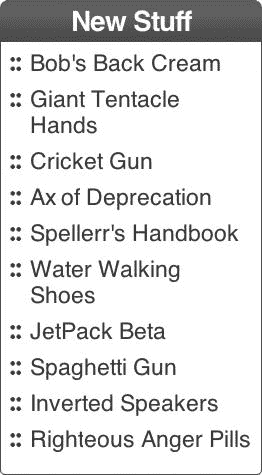
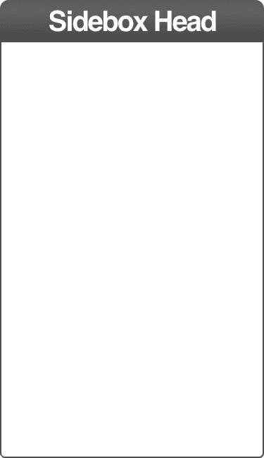
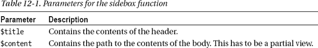

# 十二、边栏框控制

现在，您已经看到了相对简单的链接控件，让我们看看控件中的控件以及这种结构提供的开发人员生产率。侧框(或插图)是大多数多栏网站的主要内容。边栏通常位于站点主要内容区域的左侧或右侧。这个控件非常通用，因为它可以包含许多不同类型的信息:链接、信息标注、导航、调查以及其他各种信息。图 12-1 展示了一个典型的餐边柜，旨在突出展示我们商场的新品:

***图 12-1。**一个列有新产品链接的边栏*

### 内容

尽管 sidebox 控件有许多用途，但无论其内容如何，它总是具有某些功能，特别是页眉和边框。让我们通过指定这两个特性来开始开发我们的控件(见图 12-2 )。

***图 12-2。**空白嵌入控件*

sidebox 的结构非常简单，如清单 12-1 中的所示。

***清单 12-1。**边栏框的 HTML*

`<nav class="sideBox">
  <h1 class="sbH1 accentGradient gradient siteGrad">Sidebox Head</h1>
  

    <!--Our sidebox contents go here -->
  

</nav>`

正如您所看到的，它只是一个 nav 元素，作为标题(一个`h1`元素)和其他内容(在`div`元素中)的容器。我们指定了一些类来控制 sidebox 控件的外观，接下来我们将讨论这些。

### 造型

边栏框控件的 CSS 非常基本，除了我们给`H1`添加了一些阴影，给边栏框增加了一点视觉吸引力。我们已经使用了我们的老朋友，`:after`和`:before`伪类(在`h1`元素上)来实现这个效果。为了避免另一个 HTTP 请求，我们将图像编码为 base64 并包含在 CSS 中。

我们将分别描述每个类和伪类，以避免清单过于庞大而难以理解。清单 12-2 显示了`.sideBox`类，它指定了底部边距(防止内容撞到标题)。

***清单 12-2。**美国。侧盒类*

`.sideBox {
  margin-bottom: 10px;
}`

清单 12-3 显示了`.sbH1`(侧框 H1 的简称)样式，它指定了`H1`元素的许多属性。除了像字体大小和颜色这样单调的属性之外，我们还为边框控件指定了圆角。指定圆角占据了清单的大部分，因为我们必须让它适用于所有支持圆角的浏览器。

***清单 12-3。**. sb h1 类*

`.sbH1 {
  font-size: 16px;
  color: white;
  padding: 3px;
  text-align: center;
  letter-spacing: -0.05em;
  -webkit-border-top-right-radius: 5px;
  -webkit-border-bottom-right-radius: 0;
  -webkit-border-bottom-left-radius: 0;
  -webkit-border-top-left-radius: 5px;
  -moz-border-radius-topright: 5px;
  -moz-border-radius-bottomright: 0;
  -moz-border-radius-bottomleft: 0;
  -moz-border-radius-topleft: 5px;
  border-top-right-radius: 5px;
  border-bottom-right-radius: 0;
  border-bottom-left-radius: 0;
  border-top-left-radius: 5px;
  -moz-background-clip: padding;
  -webkit-background-clip: padding-box;
  background-clip: padding-box;
  position: relative;
  margin: 0;
}`

清单 12-4 显示了`.sbH1:before`伪类。此类指定图像的位置，该图像在包含标题的框的左侧提供圆形阴影的外观。它还提供图像，作为在`base64`中编码的数据块。

***清单 12-4。**sb h1:上课前*

`.sbH1:before {
  content: "";
  background: url(data:image/png;base64,iVBORw0KGgoAAAANSUhEUgAAAAcAAAAZCAMAAADKUMQKAAAAGXRFWHRT
b2Z0d2FyZQBBZG9iZSBJbWFnZVJlYWR5ccllPAAAA+dpVFh0WE1MOmNvbS5hZG9iZS54bXAAAAAAADw/eHBhY2tldCBiZWdp
bj0i77u/IiBpZD0iVzVNME1wQ2VoaUh6cmVTek5UY3prYzlkIj8+IDx4OnhtcG1ldGEgeG1sbnM6eD0iYWRvYmU6bnM6bWV0
YS8iIHg6eG1wdGs9IkFkb2JlIFhNUCBDb3JlIDUuMC1jMDYwIDYxLjEzNDc3NywgMjAxMC8wMi8xMi0xNzozMjowMCAgICAg
ICAgIj4gPHJkZjpSREYgeG1sbnM6cmRmPSJodHRwOi8vd3d3LnczLm9yZy8xOTk5LzAyLzIyLXJkZi1zeW50YXgtbnMjIj4g
PHJkZjpEZXNjcmlwdGlvbiByZGY6YWJvdXQ9IiIgeG1sbnM6eG1wPSJodHRwOi8vbnMuYWRvYmUuY29tL3hhcC8xLjAvIiB4
bWxuczpkYz0iaHR0cDovL3B1cmwub3JnL2RjL2VsZW1lbnRzLzEuMS8iIHhtbG5zOnhtcE1NPSJodHRwOi8vbnMuYWRvYmUu
Y29tL3hhcC8xLjAvbW0vIiB4bWxuczpzdFJlZj0iaHR0cDovL25zLmFkb2JlLmNvbS94YXAvMS4wL3NUeXBlL1Jlc291cmNl
UmVmIyIgeG1wOkNyZWF0b3JUb29sPSJBZG9iZSBQaG90b3Nob3AgQ1M1IE1hY2ludG9zaCIgeG1wOkNyZWF0ZURhdGU9IjIw
MTItMDQtMjhUMTA6MzA6NDYtMDU6MDAiIHhtcDpNb2RpZnlEYXRlPSIyMDEyLTA2LTE4VDIxOjE1OjU1LTA1OjAwIiB4bXA6
TWV0YWRhdGFEYXRlPSIyMDEyLTA2LTE4VDIxOjE1OjU1LTA1OjAwIiBkYzpmb3JtYXQ9ImltYWdlL3BuZyIgeG1wTU06SW5zLmlpZDoyMjQyNzc2NUIxQUYxMUUxOEJFODlBMDkxM0UyQ0FDNCIgeG1wTU06RG9jdW1lbnRJRD0ieG1wLmRpZDoyMjQyNzc2NkIxQUYxMUUxOEJFODlBMDkxM0UyQ0FDNCI+IDx4bXBNTTpEZXJpdmVkRnJvbSBzdFJlZjppbnN0YW5j
ZUlEPSJ4bXAuaWlkOjIyNDI3NzYzQjFBRjExRTE4QkU4OUEwOTEzRTJDQUM0IiBzdFJlZjpkb2N1bWVudElEPSJ4bXAuZGlk
OjIyNDI3NzY0QjFBRjExRTE4QkU4OUEwOTEzRTJDQUM0Ii8+IDwvcmRmOkRlc2NyaXB0aW9uPiA8L3JkZjpSREY+IDwveDp4
bXBtZXRhPiA8P3hwYWNrZXQgZW5kPSJyIj8+ADj9TgAAADBQTFRF/v7+7e3t/Pz83d3dzMzM9/f3u7u79fX1+vr61NTUrKys
4eHhw8PD5eXl8fHxsrKy+VpLHQAAAF1JREFUeNp8TtsWgDAI0nRry13+/29jtE5v+QIHEZR0CEfPQoxNKshatdpHAcluFCaE
5QDGAF7ZQxPRFGH/+Plnfu4nC5DfjM1vD+LXmbixTrYscPNl2392uuQWYABfdwN7BXQddQAAAABJRU5ErkJggg==);
  width: 7px;
  height: 25px;
  position: absolute;
  z-index: 2;
  top: 0;
  right: -7px;
}`

清单 12-5 显示了`.sbH1:after`伪类。这个类指定图像的位置，该图像在包含标题的框的右边提供圆形阴影的外观。如果你想知道为什么我们在这里使用 SVG 图像，这是为了创建一个特殊的阴影效果。我们可以尝试使用不同的边框半径设置，但不能保证它能在任何给定的浏览器上工作。此外，该方法使用的带宽不会超过使边界半径技术在尽可能多的浏览器上工作所需的所有属性。由于 SVG 更有可能在更多的地方工作，所以它成为获得所需外观的最佳选择。在阅读清单时，您可以忽略 SVG 数据，因为它是以 base64 编码的数据块，无论如何也不是人类可读的。

***清单 12-5。**sb h1:下课后*

`.sbH1:after {
  content: "";
  background: url(data:image/png;base64,iVBORw0KGgoAAAANSUhEUgAAAAcAAAAZCAMAAADKUMQKAAAAGXRFWHRT
b2Z0d2FyZQBBZG9iZSBJbWFnZVJlYWR5ccllPAAAA+dpVFh0WE1MOmNvbS5hZG9iZS54bXAAAAAAADw/eHBhY2tldCBiZWdp
bj0i77u/IiBpZD0iVzVNME1wQ2VoaUh6cmVTek5UY3prYzlkIj8+IDx4OnhtcG1ldGEgeG1sbnM6eD0iYWRvYmU6bnM6bWV0
YS8iIHg6eG1wdGs9IkFkb2JlIFhNUCBDb3JlIDUuMC1jMDYwIDYxLjEzNDc3NywgMjAxMC8wMi8xMi0xNzozMjowMCAgICAg
ICAgIj4gPHJkZjpSREYgeG1sbnM6cmRmPSJodHRwOi8vd3d3LnczLm9yZy8xOTk5LzAyLzIyLXJkZi1zeW50YXgtbnMjIj4g
PHJkZjpEZXNjcmlwdGlvbiByZGY6YWJvdXQ9IiIgeG1sbnM6eG1wPSJodHRwOi8vbnMuYWRvYmUuY29tL3hhcC8xLjAvIiB4
bWxuczpkYz0iaHR0cDovL3B1cmwub3JnL2RjL2VsZW1lbnRzLzEuMS8iIHhtbG5zOnhtcE1NPSJodHRwOi8vbnMuYWRvYmUu
Y29tL3hhcC8xLjAvbW0vIiB4bWxuczpzdFJlZj0iaHR0cDovL25zLmFkb2JlLmNvbS94YXAvMS4wL3NUeXBlL1Jlc291cmNl
UmVmIyIgeG1wOkNyZWF0b3JUb29sPSJBZG9iZSBQaG90b3Nob3AgQ1M1IE1hY2ludG9zaCIgeG1wOkNyZWF0ZURhdGU9IjIw
MTItMDQtMjhUMTA6MzA6NDYtMDU6MDAiIHhtcDpNb2RpZnlEYXRlPSIyMDEyLTA2LTE4VDIxOjE2OjEwLTA1OjAwIiB4bXA6
TWV0YWRhdGFEYXRlPSIyMDEyLTA2LTE4VDIxOjE2OjEwLTA1OjAwIiBkYzpmb3JtYXQ9ImltYWdlL3BuZyIgeG1wTU06SW5z
dGFuY2VJRD0ieG1wLmlpZDoyMjQyNzc2OUIxQUYxMUUxOEJFODlBMDkxM0UyQ0FDNCIgeG1wTU06RG9jdW1lbnRJRD0ieG1w`
`LmRpZDoyMjQyNzc2QUIxQUYxMUUxOEJFODlBMDkxM0UyQ0FDNCI+IDx4bXBNTTpEZXJpdmVkRnJvbSBzdFJlZjppbnN0YW5j
ZUlEPSJ4bXAuaWlkOjIyNDI3NzY3QjFBRjExRTE4QkU4OUEwOTEzRTJDQUM0IiBzdFJlZjpkb2N1bWVudElEPSJ4bXAuZGlk
OjIyNDI3NzY4QjFBRjExRTE4QkU4OUEwOTEzRTJDQUM0Ii8+IDwvcmRmOkRlc2NyaXB0aW9uPiA8L3JkZjpSREY+IDwveDp4
bXBtZXRhPiA8P3hwYWNrZXQgZW5kPSJyIj8+lSD+3wAAADBQTFRF+fn529vb/v7+8fHxxMTE9fX1sLCw+/v7vb297Ozs0dHR
5ubm4uLizc3N1tbW6enp6eXkiwAAAF9JREFUeNqMzksSwCAIA9AgWj/Qev/bltBx39UbJWJQSuloihBtGnhUE6pb7hDqq6L0
Nv0edEulak+9EOOjr/FLW8yf97kvnZL7M5j/RoA92tejY/rKnjGgbJTGxSvAAHW1A9LlrBDQAAAAAElFTkSuQmCC);
  width: 7px;
  height: 25px;
  position: absolute;
  z-index: 2;
  top: 0;
  left: -7px;` `}
.sbBody {
  -webkit-border-top-right-radius: 0;
  -webkit-border-bottom-right-radius: 3px;
  -webkit-border-bottom-left-radius: 3px;
  -webkit-border-top-left-radius: 0;
  -moz-border-radius-topright: 0;
  -moz-border-radius-bottomright: 3px;
  -moz-border-radius-bottomleft: 3px;
  -moz-border-radius-topleft: 0;
  border-top-right-radius: 0;
  border-bottom-right-radius: 3px;
  border-bottom-left-radius: 3px;
  border-top-left-radius: 0;
  -moz-background-clip: padding;
  -webkit-background-clip: padding-box;
  background-clip: padding-box;
  border: 1px solid #C62125;
  padding-bottom: 10px;
  border-top: 0;
  font-size: 13px;
  box-shadow: 0 2px 3px #AAA;
}`

 **提示**将内容与演示分离

我们想提到一个编程范例(一种模式),我们已经在其他地方取得了巨大的成功:MVC。MVC 代表模型-视图-控制器(网站的一种常见设计模式)。MVC 在分离内容和表现方面做得很好。我们在一个项目中相遇，这个项目的任务是将一个非常大的网站从 ASP.NET 和 webforms 转换成微软的 MVC。webforms 代码中有太多的业务逻辑纠缠在一起，以至于我们放弃了转换它的尝试，并重新开始新的设计。这个激进的步骤让我们将表示放在视图代码中(它所属的地方)，并将业务逻辑放在模型中(同样，它所属的地方)。遵循 MVC 模式的最佳实践，我们有非常“瘦”的控制器，基本上只是提供了一些进入控件的入口点。MVC 的口头禅是“胖模型，瘦控制器”

每个对照组都有一些“治疗”，这些治疗或多或少是对照组的微小变化。例如，我们有一个没有标题的 sidebox 控件。该版本的控件在 sidebox 控件的 controller 类中有自己的方法。控制器所做的只是将模型(保存数据)传递给另一个类，该类呈现构成控件的 HTML 元素。呈现类是数据不可知的。只要数据符合某些参数(大多数情况下，它必须存在，但有些控件需要列表或其他特定的数据结构)，呈现类就会将数据转换成 HTML。

如果控件有特殊的特性，我们将这些特性的逻辑移到模型类中。一个主要的例子是选项卡控件，它呈现了一系列的选项卡。选项卡可以按多种方式排序:字母顺序、倒字母顺序、原始顺序(最常见)等等。该模型使用了一个枚举来告诉呈现类如何对选项卡进行排序。将这种逻辑移到模型中会让呈现类(以及整个控件)变得像谚语中的石头盒子一样愚蠢。真正愚蠢的控制让我们远离试图理解业务逻辑。

MVC 的另一个伟大的特性是能够使用局部视图(通常称为“局部视图”)。通过局部视图，指定控件外观的视图可以包括处理父视图的部分内容的局部视图。我们将为 sidebox 控件做一些非常类似的事情，因为这样做是我们让`sidebox`函数与内容无关的方式。通过 partials，sidebox 控件可以处理任何类型的内容。我们将在下一节“函数”中讨论这个问题

这听起来好像我们试图避免帮助业务团队。实际上反过来才是正确的。业务和开发关注点的很好的分离让我们完成更多的工作，并且它也使业务团队能够完成更多的工作。我们提供了大量的 API 文档和一个完整的工作示例站点，其他团队可以在那里看到运行中的控件。我们甚至为每一个对照加入了每一种可能的变异(即每一种治疗)。这是一个相当不错的地方。

许多人建议将表示与内容分离，并将业务逻辑放在 web 代码之外。我们的经验明确证实了这种方法。

### 功能

我们讲述了我们如何将内容与演示分离的故事，以便更容易理解我们将要做的事情。我们将在用于呈现这个版本的 sidebox 控件的函数中遵循这些原则。只要我们得到了头的值和内容的局部视图(定义了如何呈现自己的内容),我们根本不关心这两个参数中有什么。这个 sidebox 控件可以呈现许多不同种类的内容，这使得它非常有用。

 **注意**呈现内容的分部可以包含一个或多个段落。因此，sidebox 控件可以像在电子商务网站上一样方便地在博客上使用。同样，当演示不需要关心内容时，控件的有用性会大大增加。

表 12-1 显示了`sidebox`功能接受的参数。

在我们的例子中，我们将通过另一个函数呈现局部视图。不同的平台以不同的方式处理偏音。PHP 和其他脚本语言倾向于使用另一个函数(尽管 PHP includes 可以只包含普通的 HTML)。面向对象的平台，如微软 MVC(使用多种语言)和 Spring(使用 Java)倾向于使用一个类作为局部视图。清单 12-6 显示了边框控件的入口点。

***清单 12-6。**Sidebox 控制入口点*

`<?php
  function sidebox($title, $content, $class){
    $path = $_SERVER['DOCUMENT_ROOT'];
    $sbTitle = $title;
    $sbContent = $path.$content; // The path to the partial view
    $classadd = ($class == null ? "" : $class);
    include $path."/includes/sideBox.php";
  }
?>`

`sidebox`函数的第一行定义了一个包含站点根的变量。接下来的三行创建变量来保存标题、向我们显示内容的局部视图的路径以及附加的类(如果有的话)。最后一行指定在哪里可以找到 sidebox 控件的 HTML。换句话说，最后一行定义了控件的主视图。主视图保存标题，然后调用分部视图(在`$content`参数中指定)来呈现内容。

 **注意**在这种情况下，$content 参数的值将是 new_to_store.php，它是定义 sidebox 内容的文件。我们将在本章的后面讨论这个文件。

清单 12-7 显示了`sideBox.php`(我们将它放在了`includes”`目录中)。

***清单 12-7。**`sidebox.php`的内容*

`<nav class="sideBox sbMainSubNav <?php echo $classadd; ?>">
  <h1 class="sbH1 accentGradient gradient siteGrad"><?php echo $sbTitle ?></h1>
  

    <?php include $sbContent ?> // Here’s where we call on the partial view to render the
content
  

</nav>`

如您所见，我们将标题和 CSS 类名传递到 HTML 中的适当位置。然后我们还包括进入控件的内容的路径。通过此方法，sidebox 控件可以包含任何内容，而无需控件中的内容逻辑。这种方法也给了我们巧妙处理内容的方法来帮助加速开发，就像我们在图 12-1 中处理边栏内容一样。这里我们将使用第十一章中的链接控件和一个`for`循环来为我们完成工作。为此，我们将创建一个函数来定义内容，然后使用另一个函数来呈现内容。

清单 12-8 展示了我们如何在一个外部数组中创建一组数组内容。我们在一个名为`new_to_store.php`的单独文件中完成。

***清单 12-8。** `new_to_store.php`，其中包含了样品侧框控件*的内容

`<?php
  $newToStoreArray = array(
    array("Bob's Back Cream", "javascript:fakelink(this);", NULL, "sbA-L2"),
    array("Giant Tentacle Hands","javascript:fakelink(this);", NULL, "sbA-L2"),
    array("Cricket Gun","javascript:fakelink(this);", NULL, "sbA-L2"),
    array("Ax of Deprecation","javascript:fakelink(this);", NULL, "sbA-L2"),
    array("Speller's Handbook","javascript:fakelink(this);", NULL, "sbA-L2"),
    array("Water Walking Shoes","javascript:fakelink(this);", NULL, "sbA-L2"),
    array("JetPack Beta","javascript:fakelink(this);", NULL, "sbA-L2"),
    array("Spaghetti Gun","javascript:fakelink(this);", NULL, "sbA-L2"),
    array("Inverted Speakers","javascript:fakelink(this);", NULL, "sbA-L2"),
    array("Righteous Anger Pills","javascript:fakelink(this);", NULL, "sbA-L2")
  );
  echo buildLevel2List($newToStoreArray);
?>`

清单 12-8 中的大多数只是在一个外部数组中构造了一组数组。我们以这种方式创建它，以模拟我们通常期望从数据库接收的数据类型。但是，对于示例站点，我们只使用静态数据，因为我们关注前端技术，不想因为处理数据库而使书籍变得杂乱。这些数据可以是 XML 或其他任何东西，只要你能写一个函数(或方法，如果你使用面向对象的语言)来解析。最后一行调用了`rendering`函数。虽然不是严格的 MVC，`new_to_store.php`基本上创建了我们的模型。在严格的 MVC 中，我们不会调用下一个函数；控制器会将模型传递给我们的渲染代码。

现在我们有了数据，我们将数据传递给另一个函数，该函数将构建 HTML(一个无序列表),作为示例 sidebox 控件的内容。我们可以在`new_to_store.php`中包含 HTML 构建功能。然而，我们想把数据和表现分开。此外，我们可能有其他用途的函数，建立一个名单。出于这些考虑，我们决定将列表构建代码抽象成它自己的函数。清单 12-9 展示了创建一个 HTML 列表的函数。

***清单 12-9。**创建一个无序列表作为内容*

`function buildLevel2List($linkArray){
  $StringBuilder .= '<ul class="sbUL-L2">';

  for ($i=0, $size = sizeof($linkArray); $i < $size; $i++) {
    $StringBuilder .= '<li class="sbLI-L2">';
    $StringBuilder .= mLink($linkArray[$i][0], $linkArray[$i][1], $linkArray[$i][2],
$linkArray[$i][3], "return");
    $StringBuilder .= '</li>';
  }
  $StringBuilder .= '</ul>';
  return $StringBuilder;
}`

我们使用一个字符串构建算法来创建一个 HTML 元素集合，然后将它插入到一个更大的 HTML 元素集合中，构成 sidebox 控件。字符串构建提供了创建标记的最佳方式。为每个元素创建一个对象会导致更大的内存使用量和更慢的性能，但没有任何好处。这个观察也适用于严格面向对象的语言，比如 Java 和 C#。将 HTML 创建为字符串在我们目前遇到的所有语言中提供了最好的性能。(Jay 第一次了解到这个真理是在他为 Apache FOP 项目做贡献的时候，并且在这些年里反复验证了它。)

第一行创建一个无序列表(UL)元素的开始标记。然后`for`循环遍历外循环。对于外部数组中的每个内部数组，`for`循环创建一个`li`元素。每个`li`元素包含一个链接控件的实例(在第十二章“链接控件”中有详细描述)。为了给链接控件提供参数，我们在处理每个数据成员时单独选择我们需要的数据比特。

 **注意**我们必须提供一个值“return”作为链接控件的最后一个参数。否则，链接控件会回显它自己的 HTML，把我们的列表弄得一团糟。这就是为什么 link 控件有最后一个参数来控制是直接回显它的输出还是将它的输出返回给另一个函数，就像我们在这里所做的一样。

现在我们有了一个边盒控件，它提供了极大的灵活性。虽然我们没有使用 MVC 框架，但我们在编写这个控件时考虑了这个模式，因为我们希望小心地将内容和表示分开。由于这种分离，我们现在可以从一个控件中创建任意数量的 sideboxeses，每个 sidebox 包含不同种类的内容。这省去了为每个边盒编写定制代码的麻烦，并避免了编写代码来处理每个边盒时出现的所有错误。最后，我们现在有了一个单一的地方，在这里我们可以对我们的 sidebox 控件进行改进或添加新功能。如果一个设计团队开始敲开大门，让我们包括没有标题的边盒，我们可以很快适应它们。此外，如果我们想办法让 sideboxes 性能更好或更健壮，我们可以在一组代码对象中进行这些改进，并在整个网站上看到好处。

如果我们没有提到制作和使用控件的最后一个好处，而不是为网站中每个页面的每个设计元素编写定制的 HTML 和 CSS，那我们就失职了:通过在另一个控件中使用一组控件，我们进一步扩展了我们的灵活性和健壮性。我们知道我们的链接控件是如何工作的，因为我们一直在使用它。同样重要的是，我们知道它是如何损坏的，如果它损坏了，我们也知道去哪里修理它。有没有一个 bug，不知道从哪里开始寻找它？我们当然有，我们讨厌这样。制作和使用控件可以让我们摆脱这个问题。

### 总结

在这一章中，我们提供了另一个在我们的示例网站上使用的示例控件，如果适合您的需要，您可以在自己的网站上自由使用。你可能需要扩展它一点，让它处理你的网站上所有不同种类的侧框(或者 insets 或者你想叫它们什么)。尽管如此，它还是提供了一个起点。

正如我们对所有控件所做的那样，我们展示了如何为控件定义 HTML、CSS 和处理程序代码。在我们的例子中，我们使用 PHP。您可以轻松地使用 C#或 Java 或任何其他可用于呈现网页的语言。类似地，我们不使用框架，但是你当然可以使用这个控件和我们在框架中提供的其他控件——例如 Spring 或 Microsoft MVC。

最后，我们想提醒你把你的内容(也就是数据)和你的演示分开。你的控件越是与内容无关，你能用它们做的事情就越多。当然，有时一个控件只有在存在某种数据时才有意义。在后面的章节中，当我们描述我们的产品堆栈控制时，我们将向您展示如何处理这个问题。