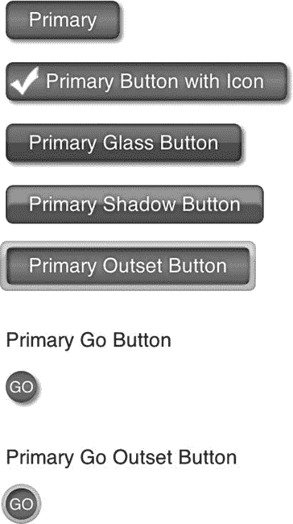
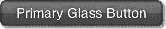
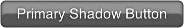
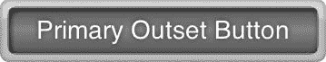
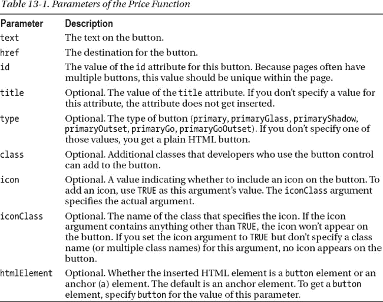

# 十三、按钮控制

这是另一个看似简单的 HTML 代码，可以制作成一个控件。然而，尽管这看起来像是一个奇怪的投入精力的地方，但是这样做在一致性、灵活性和开发速度方面是有回报的。我们将坚持分形设计模式。也就是说，我们将对每种按钮使用(实际上是重用)相同的 HTML，在服务器端使用布尔值来标识要显示哪种按钮，并通过动态设置 CSS 类来创建表示变体。

 **注**我们通常称控制的每一个变化为“处理”例如，一个按钮是一个按钮，但两个不同的按钮在外观上可能会有很大的不同。这个概念很像房子上的窗户处理。窗户是窗户，但百叶窗和窗帘给窗户带来了截然不同的外观。

我们展示了一系列按钮来说明这种方法。然而，与链接控件一样，几乎任何模式都是可以想象的。在我们的样本现场，我们将采用图 13-1 中所示的处理方法。

***图 13-1。**按钮控制上的变化(处理)*

您可以在`[`clikz.us/BookExamples/buttonControl.php`](http://clikz.us/BookExamples/buttonControl.php)`查看这些按钮(也是全彩色的)并与之互动。在网上的例子中，你可以看到我们为我们的按钮加入了一些有趣的交互。也就是说，这个按钮看起来是在悬停时按下的，或者是有一种内在发光的搏动，这取决于我们使用的治疗方法。这些动画纯粹是为了吸引眼球，但它们提供了一种利用新浏览器功能和卓越体验的好方法。我们也将确保为使用旧浏览器的访问者提供更传统的悬停效果。一如既往，我们支持渐进式改进，并努力确保所有访问者获得他们的浏览器所能提供的最佳体验。

图 13-1 显示了几种类型的按钮。我们简单看一下区别。我们已经定义了一个名为 Primary 的按钮类。我们可以很容易地(也许更具描述性地)称它为蓝色按钮。然而，如果更新的需求要求改变颜色，这个描述性的名称将会是一个问题。那么我们要么查看一个断开的按钮名称，要么替换一堆代码来纠正它。因此，我们发现使用描述目的的术语要比描述外表的好得多。在这种情况下，如果我们也有一个绿色按钮，我们可以称之为辅助按钮，或者它可以是特定于一个动作的，因此被称为购买按钮。在我们的例子中，所有的按钮都属于主系列。

### 按钮类型

我们只有主要按钮(与次要按钮相反，如果我们有更多的信息，我们可能会使用次要按钮)，但我们有几种不同的处理方法，正如我们在本节的其余部分所描述的。

#### 初级

让我们从默认按钮开始。让主系列中的所有按钮都从这个默认按钮派生出来，可以让我们有一点 CSS 抽象，如果需要的话，我们可以为特定的按钮进行扩展。这种处理包含悬停交互，其他按钮处理可以按原样使用或覆盖。

***图 13-2。**初级按钮处理*

#### 主图标

标题说明了一切。我们使用基本的主按钮，但添加了一个图标。我们将在这一章的后面讨论它是如何工作的。

***图 13-3。**初级用图标按钮治疗*

#### 初级玻璃

对于这种处理，我们在主按钮上创建一个玻璃效果。为了达到这个效果，我们使用了 CSS 渐变。如果你觉得在截图中很难看到玻璃效果(我们有)，请访问我们的示例网站， `[`clikz.us/BookExamples/buttonControl.php`](http://clikz.us/BookExamples/buttonControl.php)`

***图 13-4。**初级玻璃按钮处理*

#### 原生阴影

主要的阴影按钮处理看起来非常类似于主要的玻璃按钮处理，但是我们通过使用一种不同的技术来创建效果:白色的嵌入阴影。这需要比渐变少得多的代码，并允许一些复杂渐变不允许的 CSS 动画选项。我们实际上使用阴影方法来生成悬停时的悸动效果。

***图 13-5。**初级阴影按钮治疗*

#### 初级开始

在这里，我们通过定义一个开始形状(即形状在按钮之外)来增加一点视觉趣味。我们使用`:before`伪类来创建外部形状，以便我们的标记保持干净。

***图 13-6。**初级开始按钮处理*

#### 初级围棋

当我们需要一个小按钮来进行搜索或其他界面元素变得拥挤的地方时，主要的 Go 按钮处理就很方便了。我们可以使用`border-radius`属性生成圆；我们将在本章的后面讨论代码。

***图 13-7。**初级 Go 按钮处理*

#### 初选开始

主要的 Go Outset 按钮处理是一个 Go 按钮，它有一个由`:before`伪类定义的外部图像。当我们需要一个比基本的 Go 按钮更有存在感的小按钮时，这很有用。

***图 13-8。**初级 Go 开始按钮治疗*

### 编码按钮控件

让我们检查按钮控件背后的代码。现在可能已经很熟悉了，因为它使用了以前控件中使用的相同技术。我们在这里使用分形设计模式，所以我们用一些条件来制作一个字符串。

表 13-1 描述了`price`功能的参数。

清单 13-1 显示了 PHP 函数，它是我们按钮控件的核心:

***清单 13-1。**主按钮功能*

`<?php
// Our main button function.
function button($text, $href, $id, $title, $type, $class, $icon, $iconClass, $htmlElement) {
  $htmlEl = ($htmlElement == "button" ? "button" : "a");` `// Start string that contains the HTML output with
  // the option to use an anchor tag or a button tag.
  $output = "<" . $htmlEl;
  // Put in our href attribute.
  $output .= " href='" . $href . "'";
  // Get a base class of button.
  $output .= " class='button";
  // If there's a type declared, get the proper classes that give our
  // different treatments.
  $output .= (($type != NULL || $type != "") ? " " . getTypeClasses($type) : "");
  // If addition classes are present pass them in. This ability allows
  // us greater flexibility.
  $output .= (($class != NULL || $class != '') ? " " . $class . "'" : "'");
  // If a title is declared, add it.
  If ($title != NULL && $title != "") {
    $output .= " title='" . $title . "'";
  }
  $output .= ">";
  $output .= $text;
  if ($icon == TRUE) {
    $output .= "";
    }
  }

  // Finish the string by adding the closing tag (either </a> or </button>).
  $output .= "</" . $htmlEl . ">";

  echo $output;
}
// This function adds the appropriate classes based on the declared $type.
function getTypeClasses ($type) {
  switch ($type)
  {
  case "primary":
    return "primary";
    break;
  case "primaryGlass":
    return "primary glass";
    break;
  case "primaryShadow":
    return "primary shadow";
    break;
  case "primaryOutset":
    return "primary outset";
    break;
  case "primaryGo":
    return "primary go";
    break;
  case "primaryGoOutset":` `    return "primary go outset";
    break;
  default:
    return "";
  }
}
?>`

正如我们之前提到的，相同的目的可以在许多不同的语言中实现。我们只是碰巧在使用 PHP(我们不得不使用一些东西，我们发现 PHP 很容易阅读)。

我们在这里没有任何幻想。唯一看起来奇怪的部分是包含了按钮作为锚元素或按钮元素的能力。如果您需要在表单中放置一个按钮，您可能希望使用一个按钮元素(这样更容易附加`submit`行为等等)。在表单之外，您可能希望使用锚定元素，因为这样的按钮与锚定元素具有相同的效果。

同样，您现在可能已经认识到了这种模式。为了实例化我们的按钮控件，我们在希望按钮出现在 HTML 中的位置调用带有所需参数的函数。清单 13-2 显示了创建按钮的代码。

***清单 13-2。**创建按钮*

`<?php button("Primary", "javascript:;", NULL, NULL, "primary")  ?>  
<?php button("Primary Button with Icon", "#", NULL, NULL, "primary", "btn_checkmark", TRUE,
"icon_checkmark"); ?>  
<?php button("Primary Glass Button", "javascript:;", NULL, NULL, "primaryGlass")  ?>  
<?php button("Primary Shadow Button", "javascript:;", NULL, NULL, "primaryShadow")  ?>  
<?php button("Primary Outset Button", "javascript:;", NULL, NULL, "primaryOutset")  ?>  

Primary Go Button

<?php button("GO", "javascript:;", NULL, NULL, "primaryGo")  ?>  

Primary Go Outset Button

<?php button("GO", "javascript:;", NULL, NULL, "primaryGoOutset")  ?>  `

清单 13-3 显示了插入到结果文档中的 HTML 标记。

***清单 13-3。**函数调用产生的 HTML】*

`<a href="javascript:;" class="button primary">Primary</a>  
<a href="#" class="button primary btn_checkmark">Primary Button with Icon</a>  
<a href="javascript:;" class="button primary glass">Primary Glass Button</a>  
<a href="javascript:;" class="button primary shadow">Primary Shadow Button</a>  
<a href="javascript:;" class="button primary outset">Primary Outset Button</a>  

Primary Go Button

<a href="javascript:;" class="button primary go">GO</a>  

Primary Go Outset Button

<a href="javascript:;" class="button primary go outset">GO</a>  `

### CSS

与往常一样，CSS 变得相当密集，因为所有的供应商前缀使事情能够在不同的浏览器中正常工作。有趣的部分是在 outlet 类中，我们使用了`:before`伪类，结合了填充、偏移位置和`z` -index 来获得 outlet 效果。基本上，我们通过使用:before 伪选择器生成一个元素，并使该元素在宽度、高度和边框半径上匹配包含它的按钮。然后，我们在四周添加了一个 5 像素的填充，这使得整个处理比按钮本身大 10 像素。为了使按钮在其包装内居中，我们添加了–5 像素的顶部和左侧值。索引值为-1 的`z`将包装器放在按钮的后面，以便可以单击按钮。

我们喜欢的另一项技术是通过 base64 编码为我们的`buttonIcon`规则集定义一个背景精灵，而不是一个指向精灵的链接。这是一种在 CSS 中缓存图像以备将来重用的好方法；我们已经在边盒控件中使用了它(见第十二章)。如果我们需要这个 sprite，我们给这个元素一个基类`buttonIcon`，我们就有了它。这样，我们可以两全其美:我们避免了代价高昂的 HTTP 请求，并且图像被缓存。

最后，值得注意的是，生成主玻璃按钮需要相当多的 CSS，特别是如果它要在 Internet Explorer 9 中用额外的 SVG 编码看起来很好的话。相比之下，主要的阴影按钮效果只用了一小部分代码就实现了类似的外观。我们展示了这两种方法，让你意识到它们的区别。我们一般建议使用阴影技术，除非客户绝对坚持玻璃效果(有轻微的视觉差异，每个人都见过客户痴迷于此类事情)。

和其他控件一样，CSS 看起来有点大。为了可读性，我们将 CSS 分成多个清单，尽管在我们的示例站点中它是一个单独的代码块。清单 13-4 显示了第一种默认的按钮样式，它适用于所有的按钮处理。

***清单 13-4。**第一个默认按钮样式*

`/*
* * Default button styles*
* */*
.button, .button:visited {
  padding: 4px 15px 5px 15px;
  -webkit-border-radius: 5px;
  -moz-border-radius: 5px;
  border-radius: 5px;
  -moz-background-clip: padding;
  -webkit-background-clip: padding-box;
  background-clip: padding-box;
  background-color: #1f81dd;
  color: white;
  display: inline-block;
  text-shadow: 0 0 4px rgba(0, 0, 0, 0.6);
  -webkit-box-shadow: inset 0 0 3px rgba(0, 0, 0, 0.6), 2px 2px 3px rgba(0, 0, 0, 0.4);
  -moz-box-shadow: inset 0 0 3px rgba(0, 0, 0, 0.6), 2px 2px 3px rgba(0, 0, 0, 0.4);
  box-shadow: inset 0 0 3px rgba(0, 0, 0, 0.6), 2px 2px 3px rgba(0, 0, 0, 0.4);
  text-decoration: none;
  font-size: 14px;
  position: relative;
  border: 1px solid rgba(0, 0, 0, 0.3);
}`

清单 13-5 显示了当访问者的鼠标停留在按钮上时，定义按钮外观的 CSS。

***清单 13-5。**默认按钮悬停样式*

`.button:hover {
  color: white;` `  background-color: #24c61c;
  text-decoration: none;
  text-shadow: 0 0 4px rgba(255, 255, 255, 0.2);
  -webkit-box-shadow: inset 0 0 3px rgba(0, 0, 0, 0.6), 1px 1px 1px rgba(0, 0, 0, 0.4);
  -moz-box-shadow: inset 0 0 3px rgba(0, 0, 0, 0.6), 1px 1px 1px rgba(0, 0, 0, 0.4);
  box-shadow: inset 0 0 3px rgba(0, 0, 0, 0.6), 1px 1px 1px rgba(0, 0, 0, 0.4);
  top: 1px;
  left: 1px;
  -webkit-animation: shadowThrob 1s infinite;
  -moz-animation: shadowThrob 1s infinite;
  -o-animation: shadowThrob 1s infinite;
  animation: shadowThrob 1s infinite;
}`

清单 13-6 显示了当访问者的浏览器不支持动画时应用的样式规则。在这种情况下，我们只需改变背景颜色。

***清单 13-6。**不支持动画的浏览器的默认悬停风格*

`.no-cssanimations .button:hover {
  background: green;
}`

清单 13-7 显示了定义主要按钮处理外观的第一条规则。跳过 SVG 块就行了。这是 base64 编码的数据，不适合人类阅读。

***清单 13-7。**初级按钮处理的第一法则*

`*/**
* * Primary button*
* */*
.button.primary {
  background: #2c81da;
  background: url(data:image/svg+xml;base64,PD94bWwgdmVyc2lvbj0iMS4wIiA/Pgo8c3ZnIHhtbG5zPSJodHRw
Oi8vd3d3LnczLm9yZy8yMDAwL3N2ZyIgd2lkdGg9IjEwMCUiIGhlaWdodD0iMTAwJSIgdm
lld0JveD0iMCAwIDEgMSIgcHJlc2VydmVBc3BlY3RSYXRpbz0ibm9uZSI+CiAgPGxpbmVhckdyYWRpZW50IGlkPSJncmFkLX
VjZ2ctZ2VuZXJhdGVkIiBncmFkaWVudFVuaXRzPSJ1c2VyU3BhY2VPblVzZSIgeDE9IjAlIiB5MT0iMCUiIHgyPSIwJSIgeT
I9IjEwMCUiPgogICAgPHN0b3Agb2Zmc2V0PSIwJSIgc3RvcC1jb2xvcj0iIzJjODFkYSIgc3RvcC1vcGFjaXR5PSIxIi8+Ci
AgICA8c3RvcCBvZmZzZXQ9IjQ4JSIgc3RvcC1jb2xvcj0iIzViYWRmZiIgc3RvcC1vcGFjaXR5PSIxIi8+CiAgICA8c3RvcC
BvZmZzZXQ9IjEwMCUiIHN0b3AtY29sb3I9IiMyYzgyZGEiIHN0b3Atb3BhY2l0eT0iMSIvPgogIDwvbGluZWFyR3JhZGllbn
Q+CiAgPHJlY3QgeD0iMCIgeT0iMCIgd2lkdGg9IjEiIGhlaWdodD0iMSIgZmlsbD0idXJsKCNncmFkLXVjZ2ctZ2VuZXJhdG
VkKSIgLz4KPC9zdmc+);
  background: -moz-linear-gradient(top, #2c81da 0%, #5badff 48%, #2c82da 100%);
  background: -webkit-gradient(linear, left top, left bottom, color-stop(0%, #2c81da),
color-stop(48%, #5badff), color-stop(100%, #2c82da));
  background: -webkit-linear-gradient(top, #2c81da 0%, #5badff 48%, #2c82da 100%);
  background: -o-linear-gradient(top, #2c81da 0%, #5badff 48%, #2c82da 100%);
  background: -ms-linear-gradient(top, #2c81da 0%, #5badff 48%, #2c82da 100%);
  background: linear-gradient(top, #2c81da 0%, #5badff 48%, #2c82da 100%);
  filter: progid<ins>:</ins>dximagetransform.microsoft.gradient(startColorstr='#2c81da',
endColorstr='#2c82da', GradientType=0);
}`

清单 13-8 显示了处于活动状态的主按钮的 CSS 规则。

***清单 13-8。**主按钮处于活动状态的 CSS 规则*

`.button.primary:active {
  background: green;
}`

清单 13-9 显示了用玻璃效果定义主按钮的规则。将的清单 13-9 与的清单 13-10 进行比较，它们用少得多的代码生成了非常相似的效果。同样，跳过 SVG 块，因为它是数据，而不是对人类有意义的东西。我们包括这些区块，因为我们不能让自己把一个不完整的清单放在书里。

***清单 13-9。**主按钮上的玻璃效果规则*

`*/**
* * Primary button with Glass effect*
* */*
.button.primary.glass {
  background: #51a2ff;
  background: url(data:image/svg+xml;base64,PD94bWwgdmVyc2lvbj0iMS4wIiA/Pgo8c3ZnIHhtbG5zPSJodHRw
Oi8vd3d3LnczLm9yZy8yMDAwL3N2ZyIgd2lkdGg9IjEwMCUiIGhlaWdodD0iMTAwJSIgdmlld0JveD0iMCAwIDEgMSIgcHJl
c2VydmVBc3BlY3RSYXRpbz0ibm9uZSI+CiAgPGxpbmVhckdyYWRpZW50IGlkPSJncmFkLXVjZ2ctZ2VuZXJhdGVkIiBncmFk
aWVudFVuaXRzPSJ1c2VyU3BhY2VPblVzZSIgeDE9IjAlIiB5MT0iMCUiIHgyPSIwJSIgeTI9IjEwMCUiPgogICAgPHN0b3Ag
b2Zmc2V0PSIwJSIgc3RvcC1jb2xvcj0iIzUxYTJmZiIgc3RvcC1vcGFjaXR5PSIxIi8+CiAgICA8c3RvcCBvZmZzZXQ9IjQ4
JSIgc3RvcC1j
b2xvcj0iIzM3OTVmNSIgc3RvcC1vcGFjaXR5PSIxIi8+CiAgICA8c3RvcCBvZmZzZXQ9IjUxJSIgc3RvcC1jb2xvcj0iIzI1N2JkMSIgc3RvcC1vcGFjaXR5PSIxIi8+CiAgICA8c3RvcCBvZmZzZXQ9IjEwMCUiIHN0b3AtY29sb3I9IiMy
NTZlYmEiIHN0b3Atb3BhY2l0eT0iMSIvPgogIDwvbGluZWFyR3JhZGllbnQ+CiAgPHJlY3QgeD0iMCIgeT0iMCIgd2lkdGg9
IjEiIGhlaWdodD0iMSIgZmlsbD0idXJsKCNncmFkLXVjZ2ctZ2VuZXJhdGVkKSIgLz4KPC9zdmc+);
  background: -moz-linear-gradient(top, #51a2ff 0%, #3795f5 48%, #257bd1 51%, #256eba 100%);
  background: -webkit-gradient(linear, left top, left bottom, color-stop(0%, #51a2ff),
color-stop(48%, #3795f5), color-stop(51%, #257bd1), color-stop(100%, #256eba));
  background: -webkit-linear-gradient(top, #51a2ff 0%, #3795f5 48%, #257bd1 51%, #256eba 100%);
  background: -o-linear-gradient(top, #51a2ff 0%, #3795f5 48%, #257bd1 51%, #256eba 100%);
  background: -ms-linear-gradient(top, #51a2ff 0%, #3795f5 48%, #257bd1 51%, #256eba 100%);
  background: linear-gradient(top, #51a2ff 0%, #3795f5 48%, #257bd1 51%, #256eba 100%);
  filter: progid<ins>:</ins>dximagetransform.microsoft.gradient(startColorstr='#51a2ff',
endColorstr='#256eba', GradientType=0);
}`

清单 13-10 显示了用阴影效果定义主按钮的规则。同样，清单 13-10 产生的效果类似于清单 13-9 产生的效果，但是使用的代码要少得多。

***清单 13-10。**主按钮上的阴影效果规则*

`*/**
* * Primary Button with the Shadow Effect (approximates the Glass look)*
* */*
.button.shadow {
  background: #2c81da;
  -webkit-box-shadow: inset 0px 0px 4px rgba(0, 0, 0, 0.4), inset 0 12px 2px rgba(255, 255, 255,
0.4);` `  -moz-box-shadow: inset 0px 0px 4px rgba(0, 0, 0, 0.4), inset 0 12px 2px rgba(255, 255, 255,
0.4);
  box-shadow: inset 0px 0px 4px rgba(0, 0, 0, 0.4), inset 0 12px 2px rgba(255, 255, 255, 0.4);
}`

清单 13-11 显示了为两个有开始处理的按钮创建开始按钮处理的第一个规则。正如我们之前提到的，我们在按钮的所有边上创建一个 5 像素的边框，使处理的宽度和高度比实际的按钮多 10 像素。

***清单 13-11。**定义一开始按钮处理的第一个规则*

`*/**
* * Outset button styles*
* */*
.button.outset {
  content: "";
  display: inline-block;
  position: relative;
  -webkit-border-radius: 5px;
  -moz-border-radius: 5px;
  border-radius: 5px;
  -moz-background-clip: padding;
  -webkit-background-clip: padding-box;
  background-clip: padding-box;
  -webkit-box-shadow: inset 2px 2px 2px rgba(0, 0, 0, 0.3), inset 0 0 3px rgba(0, 0, 0, 0.4);
  -moz-box-shadow: inset 2px 2px 2px rgba(0, 0, 0, 0.3), inset 0 0 3px rgba(0, 0, 0, 0.4);
  box-shadow: inset 2px 2px 2px rgba(0, 0, 0, 0.3), inset 0 0 3px rgba(0, 0, 0, 0.4);
}`

清单 13-12 定义了开始按钮处理的悬停状态。

***清单 13-12。**开始按钮处理的悬停状态*

`.button.outset:hover {
  top: 0;
  left: 0;
  -webkit-box-shadow: inset 50% 50% 0 #ffffff;
  -moz-box-shadow: inset 50% 50% 0 #ffffff;
  box-shadow: inset 50% 50% 0 #ffffff;
}`

清单 13-13 使用`:before`伪选择器语法在按钮前生成一个元素。然后，我们使用该元素来创建按钮周围的区域。此外，我们将生成的元素的`z-index`属性设置为–1，以便访问者可以单击按钮。

***清单 13-13。**用:before 伪选择器生成开始元素*

`.button.outset:before {
  content: "";
  width: 100%;
  height: 100%;
  display: block;
  z-index: -1;` `  position: absolute;
  padding: 5px;
  background: #CCC;
  left: -5px;
  top: -5px;
  -webkit-border-radius: 5px;
  -moz-border-radius: 5px;
  border-radius: 5px;
  -moz-background-clip: padding;
  -webkit-background-clip: padding-box;
  background-clip: padding-box;
  -webkit-box-shadow: inset 0px 0px 4px rgba(0, 0, 0, 0.4), inset 0 10px 2px rgba(255, 255, 255,
0.4);
  -moz-box-shadow: inset 0px 0px 4px rgba(0, 0, 0, 0.4), inset 0 10px 2px rgba(255, 255, 255,
0.4);
  box-shadow: inset 0px 0px 4px rgba(0, 0, 0, 0.4), inset 0 10px 2px rgba(255, 255, 255, 0.4);
}`

清单 13-14 显示了定义 Go 按钮的样式规则，它是圆形的，比其他按钮小得多。

***清单 13-14。**定义 Go 按钮外观的规则*

`*/**
* * Go Button Styles*
* */*
.button.go {
  font-size: 11px;
  width: 22px;
  height: 17px;
  -webkit-border-radius: 100%;
  -moz-border-radius: 100%;
  border-radius: 100%;
  -moz-background-clip: padding;
  -webkit-background-clip: padding-box;
  background-clip: padding-box;
  border: none;
  padding: 5px 0 0 0;
  text-align: center;
}`

清单 13-15 显示了定义开始 Go 按钮的规则。

***清单 13-15。**定义开始执行按钮*

`*/**
* * Go Button with outset treatment*
* */*
.button.go.outset:before {
  content: "";
  width: 100%;
  height: 100%;` `  display: block;
  z-index: -1;
  position: absolute;
  padding: 3px;
  background: #CCC;
  left: -3px;
  top: -3px;
  -webkit-border-radius: 100%;
  -moz-border-radius: 100%;
  border-radius: 100%;
  -moz-background-clip: padding;
  -webkit-background-clip: padding-box;
  background-clip: padding-box;
  -webkit-box-shadow: inset 0px 0px 4px rgba(0, 0, 0, 0.4), inset 0 10px 2px rgba(255, 255, 255,
0.4);
  -moz-box-shadow: inset 0px 0px 4px rgba(0, 0, 0, 0.4), inset 0 10px 2px rgba(255, 255, 255,
0.4);
  box-shadow: inset 0px 0px 4px rgba(0, 0, 0, 0.4), inset 0 10px 2px rgba(255, 255, 255, 0.4);
}`

清单 13-16 显示了定义脉动效果的规则。如果访问者的浏览器不支持动画，当他们的鼠标指针停留在按钮上时，仍然会得到一个效果。他们得到了清单 13-6 中定义的悬停样式。

***清单 13-16。**定义悸动效应*

`*/**
* * Shadow Throb*
* */*
@-webkit-keyframes shadowThrob {
  0% {
    -webkit-box-shadow: inset 0px 0px 4px rgba(0, 0, 0, 0.4), inset 0 12px 2px rgba(255, 255,
255, 0);
    -moz-box-shadow: inset 0px 0px 4px rgba(0, 0, 0, 0.4), inset 0 12px 2px rgba(255, 255, 255,
0);
    box-shadow: inset 0px 0px 4px rgba(0, 0, 0, 0.4), inset 0 12px 2px rgba(255, 255, 255, 0);
  }
  50% {
    -webkit-box-shadow: inset 0px 0px 4px rgba(0, 0, 0, 0.4), inset 0 12px 2px rgba(255, 255,
255, 0.2);
    -moz-box-shadow: inset 0px 0px 4px rgba(0, 0, 0, 0.4), inset 0 12px 2px rgba(255, 255, 255,
0.2);
    box-shadow: inset 0px 0px 4px rgba(0, 0, 0, 0.4), inset 0 12px 2px rgba(255, 255, 255, 0.2);
  }
  100% {
    -webkit-box-shadow: inset 0px 0px 4px rgba(0, 0, 0, 0.4), inset 0 12px 2px rgba(255, 255,
255, 0);
    -moz-box-shadow: inset 0px 0px 4px rgba(0, 0, 0, 0.4), inset 0 12px 2px rgba(255, 255, 255,
0);
    box-shadow: inset 0px 0px 4px rgba(0, 0, 0, 0.4), inset 0 12px 2px rgba(255, 255, 255, 0);
  }` `}
@-moz-keyframes shadowThrob {
  0% {
    opacity: 0.0;
  }
  50% {
    opacity: 0.5;
  }
  100% {
    opacity: 1.0;
  }
}
@-o-keyframes shadowThrob {
  0% {
    opacity: 0.0;
  }
  50% {
    opacity: 0.5;
  }
  100% {
    opacity: 1.0;
  }
}
@keyframes shadowThrob {
  0% {
    opacity: 0.0;
  }
  50% {
    opacity: 0.5;
  }
  100% {
    opacity: 1.0;
  }
}`

清单 13-17 显示了用图标按钮处理定义主图标的第一个规则。正如我们在本章前面提到的，实际的图标是一个 SVG 图像，它让我们可以避免 HTTP 请求并利用浏览器的缓存。对于 Internet Explorer 8 和更早的版本，我们可以添加一个图像作为后备。在这种情况下，为了压缩已经很大的上市规模，我们没有这样做。正如我们之前提到的，您应该跳过 SVG 图像数据。

***清单 13-17。**为有图标的按钮定义图标*

`*/**
* * Button Icons*
* */*
.buttonIcon {
  position: absolute;
  left: 2px;
  top: 2px;
  background-repeat: no-repeat;` `  background-image: url(data:image/png;base64,iVBORw0KGgoAAAANSUhEUgAAAHEAAAAZCAYAAAAG2cHnAAAAGX
RFWHRTb2Z0d2FyZQBBZG9iZSBJbWFnZVJlYWR5ccllPAAAA+dpVFh0WE1MOmNvbS5hZG9iZS54bXAAAAAAADw/eHBhY2tldC
BiZWdpbj0i77u/IiBpZD0iVzVNME1wQ2VoaUh6cmVTek5UY3prYzlkIj8+IDx4OnhtcG1ldGEgeG1sbnM6eD0iYWRvYmU6bn
M6bWV0YS8iIHg6eG1wdGs9IkFkb2JlIFhNUCBDb3JlIDUuMC1jMDYwIDYxLjEzNDc3NywgMjAxMC8wMi8xMi0xNzozMjowMC
AgICAgICAgIj4gPHJkZjpSREYgeG1sbnM6cmRmPSJodHRwOi8vd3d3LnczLm9yZy8xOTk5LzAyLzIyLXJkZi1zeW50YXgtbn
MjIj4gPHJkZjpEZXNjcmlwdGlvbiByZGY6YWJvdXQ9IiIgeG1sbnM6eG1wPSJodHRwOi8vbnMuYWRvYmUuY29tL3hhcC8xLj
AvIiB4bWxuczpkYz0iaHR0cDovL3B1cmwub3JnL2RjL2VsZW1lbnRzLzEuMS8iIHhtbG5zOnhtcE1NPSJodHRwOi8vbnMuYW
RvYmUuY29tL3hhcC8xLjAvbW0vIiB4bWxuczpzdFJlZj0iaHR0cDovL25zLmFkb2JlLmNvbS94YXAvMS4wL3NUeXBlL1Jlc2
91cmNlUmVmIyIgeG1wOkNyZWF0b3JUb29sPSJBZG9iZSBQaG90b3Nob3AgQ1M1IE1hY2ludG9zaCIgeG1wOkNyZWF0ZURhdG
U9IjIwMTItMDYtMThUMjM6MjY6NDktMDU6MDAiIHhtcDpNb2RpZnlEYXRlPSIyMDEyLTA2LTIxVDAyOjM1OjU2LTE5OjAwIi
B4bXA6TWV0YWRhdGFEYXRlPSIyMDEyLTA2LTIxVDAyOjM1OjU2LTE5OjAwIiBkYzpmb3JtYXQ9ImltYWdlL3BuZyIgeG1wTU
06SW5zdGFuY2VJRD0ieG1wLmlpZDo5MzdGQ0M0OUIxRUMxMUUxOEJFODlBMDkxM0UyQ0FDNCIgeG1wTU06RG9jdW1lbnRJRD
0ieG1wLmRpZDo5MzdGQ0M0QUIxRUMxMUUxOEJFODlBMDkxM0UyQ0FDNCI+IDx4bXBNTTpEZXJpdmVkRnJvbSBzdFJlZjppbn
N0YW5jZUlEPSJ4bXAuaWlkOjkzN0ZDQzQ3QjFFQzExRTE4QkU4OUEwOTEzRTJDQUM0IiBzdFJlZjpkb2N1bWVudElEPSJ4bX
AuZGlkOjkzN0ZDQzQ4QjFFQzExRTE4QkU4OUEwOTEzRTJDQUM0Ii8+IDwvcmRmOkRlc2NyaXB0aW9uPiA8L3JkZjpSREY+ID
wveDp4bXBtZXRhPiA8P3hwYWNrZXQgZW5kPSJyIj8+7zXkvQAABN9JREFUeNrsWmFkHEEUvjR1LOE0dZTTEPKrHCGEkCpHCO
EIRwghHCEkQighhJIKR/vnqpUqRwmpVAipVEiFUlKlXJUQQivVSDTyKzRa2zd8y8uY2d3ZnU1S8vjs3uzM25337Xvz5u01uK
6bupL/W66F6NNOqBC2CN8ILo5baG+/MmMi0mKDxB7CMqFGOCSME+4SGnAcR3sN/XoiPKh7AUhKsoSnFvXlw1uRwqkCFcIOoV
9qv0Mo4cjb+9G/otGngyczhuNMMcPulYT+IuGA8Mmizr6wfVWNVcIaoQm/hwnrhBP3rJygfQj9mjCuakjiAxynEzLwtHQf2/
qFff5A9+JlIHGOsEpoJNzAQ3H5SljCkcsi+jdi/JwBiSlm4CnLBp5iBKYSIHFEssNsDF1pwiCcYgTOIF6QMqEzLIlFhMQM4T
ahjgc7hiJHGuzgZsfoV8e4jCYU+5HIQ96UZQJnNPez4SmyTETUlQdhjsYTO2FrJ4hEEQp72bmQ94RcwAPk0M/FONHWg1BrQi
IncjKmgSc1a60tEtvYy8slynN3EwohwqkD/Wkdie2EzzgfwwPtwqu8Pq1IXJZxbGXXMujvYnwKi3yHIYk2iJz0SZZskJiGrV
TyyFBXhuUUKcnWwywv4USWdSTOsTC2iQca0GR3riarHEDbJgtncxFI5MmIaXiaCEiSXIuJkkrqhrrKkmflmP1FbvFbMRexTGV
VJG4h7t6Egl9IUrxthZ94241GjHOhpyNEyu2GMNaEJQJtkNgGw6pkg9AVgUT+e4PpW2XnRckbh1Qk/iTcwlrmSutZNYBEvqV
YR5vQ0wxSUzGMOi2FaB3GQm5TwpJYVK09WEpUEiUrbZTIkJ1lVTrnY8+QeB17/mbCEaoOKVRiPGkLqBfw64esenEEvXHkIXR
UCX8JzxR9RnH9MfrHkTbo6kVF6gm71kHoV4yR+wWVMDtxnkZVxsFvcXzO+n4h/MC5sOUIu9bNxl16T+yAjh30HZWuj6JdXN9
DuItyPwd7SR4q96SUfk0x97jbIe5RzdL9uSfW/DzxMq+J3Ujj12BMj7AKdFcYsQ767QZsiVxNKr+rmdsk26fJ8tRCkjQo/b6
vIPEADub1aYFtEslOSxaz0wLKeivS2jSISXmTG5RS/xVkiFmD+3VqvMx7mZugl8uWZs00RUERPfrxPML75hUv5QhzsDMkcq8
J2ieuavaJO1I2GXWfWERYWdIYKo2ihO7aEoycMfT8kmYD/4LVRj1iWy1WfsZkUnxqp8Ke9/wqNhuschC1YrPO3rCNCBWbARC
4oJlY2KxvAfd3DNdgEao+BCwfRcv11wzCdjaAxAJeNN+yW8mndjqsePPTaNfVTkuGJHpfA2oxCORE1hThOMwWw5GSCl0SZxt
DCKVpicQcvDVv6ytGHW953fJXDC+Ez1s2zDye13SfKObxUprjjqIMlkrAK7tAYBWOULDxPbGM0HQqTeoU7eWY3xOnWNaZhGE
qLJN0Db2ZJzR9CRNo9aOwN/FtRfzPIyPMK5KR7Rhf9mcTNsgsooNp2c3BGrl4zgQakdjg82+3XlRDcoRXhHeE76jKZPFHngK
hRNhHNeVthP/YnLc0GPbPoDqyf87P2Ud4E2pCIf6yKMpNAyCsBQQeglBB7GvCx6s/p12chCHxSi65/BNgAM6z2oOaR+9QAAA
AAElFTkSuQmCC);
}`

清单 13-18 显示了为图标图像腾出空间和定位的两个相关类。

***清单 13-18。**为图标腾出空间并定位*

`*/**
* * Checkmark Icon Button*
* */*
.icon_checkmark {
  background-position: -64px -2px;
  width: 20px;
  height: 21px;
}
.btn_checkmark {
  padding-left: 27px;
}`

当你通读一本书时，这个 CSS 看起来很多，但在大的计划中它并不真的那么多。我们已经提到了一个可悲的事实，我们已经看到了大于一兆字节的 CSS 文件。想象一下试图理解那些怪物！不过，我们希望*我们的* CSS 对你有意义。此外，我们鼓励您访问我们的按钮控件示例站点，并研究实际的 CSS。我们的按钮控件的示例站点是`[`clikz.us/BookExamples/buttonControl.php`](http://clikz.us/BookExamples/buttonControl.php)`

### 总结

在这一章中，我们为一个元素创建了另一个控件，这个控件似乎不值得我们去做。虽然我们理解第一眼的评价，但我们认为稍加思考就会明白为什么为按钮创建一个控件是有意义的。最大的原因是按钮到处都是。大多数网站，尤其是电子商务网站，几乎每个页面上都有多个按钮。几乎总有一种方法可以购买某些东西，定制某些东西，与支持人员或销售代理进行聊天，等等。考虑到按钮的数量，我们肯定希望它们的外观和行为都一致。按钮控件是让他们合作的好方法。

第二(但仍然是一个很大的好处)，我们创造了一些东西，让我们的队友不必考虑如何制作按钮。如果他们使用我们的控制，他们会得到一个按钮，保证符合公司的外观和行为标准。因此，他们的发展速度增加；简而言之，他们用更少的时间完成更多的工作。我们怎么能不喜欢呢？

第三(但仍然很重要)，维护更容易。假设出于商业考虑(比如公司范围内的品牌重塑工作)，必须改变所有的按钮。我们改变一个代码块，控件，网站上所有的按钮都会改变。

此外，我们不得不提到封装的概念。按钮有问题吗？只需看看按钮控件。当您的问题被隔离在一个控件中时，故障诊断会快很多。

综上所述，这些优势以很低的成本提供了强大的功能和灵活性。这就是为什么我们喜欢我们的按钮控件，尽管乍一看它似乎有点过头了。