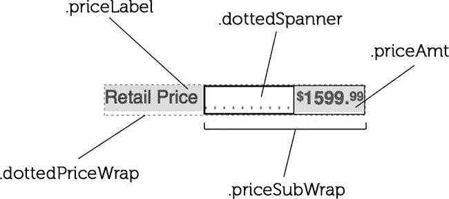
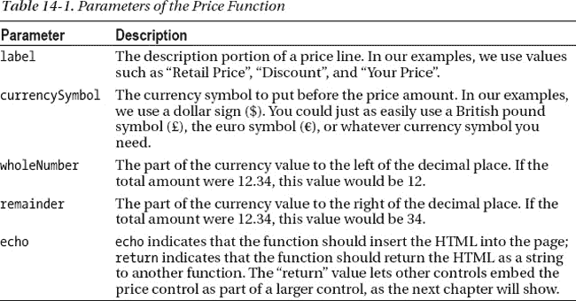
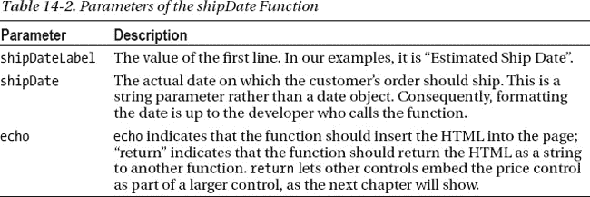
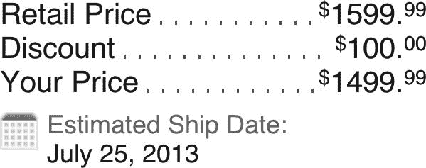

# 十五、价格控制

价格控制实际上是两个控制，布尔。除了实际的价格控制，我们还有运输控制。Tt:我们把它们放在同一个章节里，因为它们经常放在一起。价格控制包含价格信息，不仅仅是最终价格，还有底价、折扣、税等等。装运控制包含装运信息。

在开始之前，我们想展示一个完成的控件的图像。这是一个单一的图像，因为，再一次，控件经常在一起。

***图 14-1。**价格和运输管制*

如果您想查看价格和运输控制的运行情况，请在我们为支持本书而创建的示例网站上查找它们。对于样品价格控制，地址为`[`clikz.us/BookExamples/priceControl.php`](http://clikz.us/BookExamples/priceControl.php)`

### 价格控制

和我们所有的其他控件一样，这个控件实际上是一个函数和一组应用于函数输出的 CSS 规则。然而，由于没有看到 HTML 很难理解规则，我们从实际上是控件的函数生成的 HTML 开始。

我们看到许多 web 开发人员一直在努力解决的一个问题是，在左对齐的元素(如产品名称)和右对齐的内容(如价格)之间创建一个点前导符。为了帮助人们克服这个问题，价格控件包括一个点前导符，它总是弯曲以填充左对齐元素和右对齐元素之间的空间。

#### HTML

价格控制的 HTML 并不复杂。它只是一系列的`div`元素和`span`元素，一个`sup`元素保存货币，另一个`sup`元素保存价格的小数部分。

 **注意**保存价格信息的 HTML 包含一个运输信息的占位符。

清单 14-1 显示了 HTML 的一部分，它保存了图 14-1 中显示的价格清单的价格信息。

***清单 14-1。**价格控件插入的 HTML 的价格部分*

`

  
Retail Price

  

    

      $1599.99
    

    
.

  

  
Discount

  

    

        $100.00
    

    
.

  

  
Your Price

  

    

      $1499.99
    

    
.

  

`

#### CSS

价格控制的 CSS 只包含一些规则。我们分别描述每一个，这样我们就可以讨论每一个是如何工作的，以及这些规则是如何结合在一起的。

在这个过程中，我们还描述了虚线领导是如何工作的。为了获得跨各种背景(包括渐变)工作的虚线前导，我们使用了一个不太为人所知的效果，它是`overflow:hidden`属性的一部分。迈克尔从妮可·沙利文的博客中了解到这一点。如果你不熟悉妮可·沙利文的 CSS 工作，花点时间看看她的想法；这是值得花的时间。这里是 W3C CSS 2.1 规范中`overflow:hidden`属性的棘手部分:

> *表格的边框、块级替换元素或建立新的块格式化上下文的正常流程中的元素(如具有“溢出”而非“可见”的元素)不得与元素本身在同一块格式化上下文中的任何浮动重叠。*
> 
> 级联样式表 2 级修订版 1 (CSS 2.1)规范

这可以分解为一个浮点数旁边的`overflow:hidden`元素占用了剩余的空间。这就是我们如何让点的可变宽度自动占据标签和数量之间的剩余空间。我们正在创建一个嵌套的`overflow:hidden`排列，其中我们使用`priceSubWrap`来包含数量，使用`div`来包含点分隔符。图 14-2 标注了价格控制的各个部分。

***图 14-2。**价格管制的部分*

我们使用另一个 base64 编码的图像作为点。但是，由于 base64 图像不能在 Internet Explorer 6 或 7 中运行，我们还为使用这些浏览器的访问者提供了一个指向该图像的链接。我们对运输栈中的日历图标使用相同的技术。

现在让我们开始看看 CSS 规则。清单 14-2 显示了应用于价格堆栈的第一条规则。它为保存描述和价格的行设置位置和宽度。

***清单 14-2。**设定价格的位置和宽度*

`.dottedPriceWrap {
  position: relative;
  width: 200px;
}`

清单 14-3 显示了`priceLabel`规则，它对价格线的描述部分进行了样式化。特别是，它将`float`属性设置为`left`(这使得类为`priceSubWrap`的`div`元素出现在价格标签旁边)并设置填充。

***清单 14-3。**对价格的描述*

`.priceLabel {
  float: left;
  padding-right: 4px;
}`

清单 14-4 指定了实际的定界符(或前导符)。在这里，我们将`overflow`属性的值设置为`hidden`。`text-indent`属性确保了类别为`dottedSpanner`的`div`中的文本不会出现。我们必须在那个`div`元素中放些东西，否则它会崩溃，而不会显示我们的分隔符，但是我们不希望那个文本出现。正如我们在本章前面所讨论的，base64 编码的数据包含构成我们的点分隔符的点的图像。

 **提示**这种技术提供了一种适用于各种背景(包括渐变)的点状前导。

***清单 14-4。**指定分隔符(圆点)*

`.dottedSpanner {
  overflow: hidden;
  line-height: inherit;
  text-indent: -999em;
  background: url(data:image/gif;base64,R0lGODlhBwAFAJECAGZmZGJmZf///wAAACH/C1hNUCBEYXRhWE1QPD94cGFja2V0IGJlZ2luPSLvu78iIGlkPSJXNU0wTXBDZWhpSHpyZVN6TlRjemtjOWQiPz4gPHg6eG1w
bWV0YSB4bWxuczp4PSJhZG9iZTpuczptZXRhLyIgeDp4bXB0az0iQWRvYmUgWE1QIENvcmUgNS4wLWMwNjAgNjEuMTM0Nzc3
LCAyMDEwLzAyLzEyLTE3OjMyOjAwICAgICAgICAiPiA8cmRmOlJERiB4bWxuczpyZGY9Imh0dHA6Ly93d3cudzMub3JnLzE5
OTkvMDIvMjItcmRmLXN5bnRheC1ucyMiPiA8cmRmOkRlc2NyaXB0aW9uIHJkZjphYm91dD0iIiB4bWxuczp4bXA9Imh0dHA6
Ly9ucy5hZG9iZS5jb20veGFwLzEuMC8iIHhtbG5zOnhtcE1NPSJodHRwOi8vbnMuYWRvYmUuY29tL3hhcC8xLjAvbW0vIiB4
bWxuczpzdFJlZj0iaHR0cDovL25zLmFkb2JlLmNvbS94YXAvMS4wL3NUeXBlL1Jlc291cmNlUmVmIyIgeG1wOkNyZWF0b3JU
b29sPSJBZG9iZSBQaG90b3Nob3AgQ1M1IFdpbmRvd3MiIHhtcE1NOkluc3RhbmNlSUQ9InhtcC5paWQ6NUZCQUFFNUJBRjU3
MTFFMUE4NkZBMzc4MEIwMDVGMEQiIHhtcE1NOkRvY3VtZW50SUQ9InhtcC5kaWQ6NUZCQUFFNUNBRjU3MTFFMUE4NkZBMzc4
MEIwMDVGMEQiPiA8eG1wTU06RGVyaXZlZEZyb20gc3RSZWY6aW5zdGFuY2VJRD0ieG1wLmlpZDo1RkJBQUU1OUFGNTcxMUUx
QTg2RkEzNzgwQjAwNUYwRCIgc3RSZWY6ZG9jdW1lbnRJRD0ieG1wLmRpZDo1RkJBQUU1QUFGNTcxMUUxQTg2RkEzNzgwQjAw
NUYwRCIvPiA8L3JkZjpEZXNjcmlwdGlvbj4gPC9yZGY6UkRGPiA8L3g6eG1wbWV0YT4gPD94cGFja2V0IGVuZD0iciI/PgH/
/v38+/r5+Pf29fTz8vHw7+7t7Ovq6ejn5uXk4+Lh4N/e3dzb2tnY19bV1NPS0dDPzs3My8rJyMfGxcTDwsHAv769vLu6ubi3
trW0s7KxsK+urayrqqmop6alpKOioaCfnp2cm5qZmJeWlZSTkpGQj46NjIuKiYiHhoWEg4KBgH9+fXx7enl4d3Z1dHNycXBv
bm1sa2ppaGdmZWRjYmFgX15dXFtaWVhXVlVUU1JRUE9OTUxLSklIR0ZFRENCQUA/Pj08Ozo5ODc2NTQzMjEwLy4tLCsqKSgn
JiUkIyIhIB8eHRwbGhkYFxYVFBMSERAPDg0MCwoJCAcGBQQDAgEAACH5BAEAAAIALAAAAAAHAAUAAAIHjI6Ay+1XAAA7)
repeat-x bottom left;
}

background: url(data:image/gif;base64,R0lGODlhBwAFAJECAGZmZGJmZf///wAAACH/C1hNUCBEYXRhWE1QPD94
cGFja2V0IGJlZ2luPSLvu78iIGlkPSJXNU0wTXBDZWhpSHpyZVN6TlRjemtjOWQiPz4gPHg6eG1wbWV0YSB4bWxuczp4PSJh
ZG9iZTpuczptZXRhLyIgeDp4bXB0az0iQWRvYmUgWE1QIENvcmUgNS4wLWMwNjAgNjEuMTM0Nzc3LCAyMDEwLzAyLzEyLTE3
OjMyOjAwICAgICAgICAiPiA8cmRmOlJERiB4bWxuczpyZGY9Imh0dHA6Ly93d3cudzMub3JnLzE5OTkvMDIvMjItcmRmLXN5
bnRheC1ucyMiPiA8cmRmOkRlc2NyaXB0aW9uIHJkZjphYm91dD0iIiB4bWxuczp4bXA9Imh0dHA6Ly9ucy5hZG9iZS5jb20v
eGFwLzEuMC8iIHhtbG5zOnhtcE1NPSJodHRwOi8vbnMuYWRvYmUuY29tL3hhcC8xLjAvbW0vIiB4bWxuczpzdFJlZj0iaHR0
cDovL25zLmFkb2JlLmNvbS94YXAvMS4wL3NUeXBlL1Jlc291cmNlUmVmIyIgeG1wOkNyZWF0b3JUb29sPSJBZG9iZSBQaG90
b3Nob3AgQ1M1IFdpbmRvd3MiIHhtcE1NOkluc3RhbmNlSUQ9InhtcC5paWQ6NUZCQUFFNUJBRjU3MTFFMUE4NkZBMzc4MEIw
MDVGMEQiIHhtcE1NOkRvY3VtZW50SUQ9InhtcC5kaWQ6NUZCQUFFNUNBRjU3MTFFMUE4NkZBMzc4MEIwMDVGMEQiPiA8eG1w
TU06RGVyaXZlZEZyb20gc3RSZWY6aW5zdGFuY2VJRD0ieG1wLmlpZDo1RkJBQUU1OUFGNTcxMUUxQTg2RkEzNzgwQjAwNUYw
RCIgc3RSZWY6ZG9jdW1lbnRJRD0ieG1wLmRpZDo1RkJBQUU1QUFGNTcxMUUxQTg2RkEzNzgwQjAwNUYwRCIvPiA8L3JkZjpE
ZXNjcmlwdGlvbj4gPC9yZGY6UkRGPiA8L3g6eG1wbWV0YT4gPD94cGFja2V0IGVuZD0iciI/PgH//v38+/r5+Pf29fTz8vHw
7+7t7Ovq6ejn5uXk4+Lh4N/e3dzb2tnY19bV1NPS0dDPzs3My8rJyMfGxcTDwsHAv769vLu6ubi3trW0s7KxsK+urayrqqmo
p6alpKOioaCfnp2cm5qZmJeWlZSTkpGQj46NjIuKiYiHhoWEg4KBgH9+fXx7enl4d3Z1dHNycXBvbm1sa2ppaGdmZWRjYmFg
X15dXFtaWVhXVlVUU1JRUE9OTUxLSklIR0ZFRENCQUA/Pj08Ozo5ODc2NTQzMjEwLy4tLCsqKSgnJiUkIyIhIB8eHRwbGhkY
FxYVFBMSERAPDg0MCwoJCAcGBQQDAgEAACH5BAEAAAIALAAAAAAHAAUAAAIHjI6Ay+1XAAA7) repeat-x bottom left;` `}`

清单 14-5 显示了为使用 IE6 或 ie7 的访问者指定在哪里找到点的图像的规则。它还指定图像应该在整行中水平重复。

***清单 14-5。**为 IE6 和 IE7 指定点*

`.ie6 .dottedSpanner, .ie7 .dottedSpanner {
  background: url(/img/period.gif) repeat-x bottom left;
}`

清单 14-6 显示了对价格线的金额部分进行样式化的规则。特别是，它指定价格应该向右浮动，并且有 2 个像素的左填充(以便在分隔符和价格值之间留出一点空间)。

***清单 14-6。**造型价格值*

`.priceAmt {
  float: right;
  padding-left: 2px;
}`

清单 14-7 中的显示了`priceSubWrap`类。这个类应用于保存价格金额和点分隔符的`div`。为了让分隔符图像填充价格标签和价格值之间的空间，该类将`overflow`属性的值设置为`hidden`。它还指定了`div`元素的`position`属性的值为`relative`。

***清单 14-7。**围绕价格和分隔符设计包装器*

`.priceSubWrap {
  overflow: hidden;
  position: relative;
}`

清单 14-8 设计货币符号($，，€等)的样式。)使用一个简单的规则来指定符号的大小和位置。我们也对小数点右边的价格部分使用这种样式。

***清单 14-8。**设计货币符号*

`sup.currency {
  font-size: 70%;
  top: auto;
  position: relative;
  vertical-align: text-top;
  line-height: 125%;
}`

#### 控制

price 函数构建一个字符串，其中包含 HTML 元素和参数中指定的值，除了参数`$echo`。`$echo`参数指示是将 HTML 字符串插入调用该函数的页面，还是将 HTML 作为字符串返回给其他函数。

 **注意**通常，输入这些控件(以及大多数其他控件)的值来自数据库。为了简单起见，我们在示例站点上没有使用数据库。相反，我们只是手工插入值，因为我们的重点是 HTML 和 CSS，而不是后端工作。

表 14-1 描述了`price`功能的参数。

清单 14-9 显示了定义价格函数的 PHP 代码。

***清单 14-9。**价格功能*

`<?php
  function price($label, $currencySymbol, $wholeNumber, $remainder,  $echo) {
    $output = '
';
    $output .= '  
';
    $output .= $label;
    $output .= '  
';
    $output .= '  
';
    $output .= '    
';
    $output .= '      '. $currencySymbol . '</
sup>'.$wholeNumber.'.'.$remainder.'';
    $output .= '    
';
    $output .= '  
';
    $output .= '  
.
';
    $output .= '
';

    if($echo == "return"){
      return $output;
    } else {
      echo $output;
    }` `  }
?>`

### 装运控制

正如我们在本章开始时提到的，装运控制是一个独立的控制。但是，因为装运控制通常跟在价格控制之后，所以我们在这里解释装运控制。从 shipping control 函数生成的 HTML 开始，将提供上下文，帮助您理解 CSS 规则和实际控件的功能。

#### HTML

装运控件的 HTML 包含一个具有三个跨度的单个`div`。跨度让我们可以创建单独的规则来设置运输图标、运输标签和运输日期的样式。清单 14-10 显示了保存运输信息的 HTML。

***清单 14-10。**价格控件插入的 HTML 的运输部分*

`  

    
    Estimated Ship Date:     
    July 25, 2013
  
`

到目前为止，你可能已经习惯了我们的 HTML 风格。我们使用具有有意义的类名的简单元素，然后通过 CSS(以及 JavaScript，当我们无法从 CSS 中获得我们想要的东西时)指定如何处理这些元素。因此，让我们研究一下将这些内容转换成价格控件所需输出的 CSS。

#### CSS

由于装运栈由一个`div`和三个跨度组成，我们只需要四个规则来设计装运控制。

清单 14-11 显示了`shippingWrap`规则，它指定了装运栈的位置和字体大小。它提供了 22 个像素的左填充值来为日历图标腾出空间，并提供了 5 个像素的上边距值来在价格和运输信息之间留出一点空间。

***清单 14-11。**样式化出货信息*

`.shippingWrap {
  position: relative;
  padding-left: 22px;
  font-size: 12px;
  margin-top: 5px;
}`

清单 14-12 显示了`iconShipping`规则，它定义了我们放在运输信息左边的日历图标。我们将一个 18 像素的图像放入一个 22 像素空间的左侧(这 22 个像素是由`shippingWrap`规则定义的；参见清单 14-11 ，它在日历图标和发货信息之间提供了一个 4 像素的空间。与分隔符中的点一样，我们使用 base64 编码的数据块来指定图标图像。

***清单 14-12。**插入日历图标*

`.iconShipping {
  width: 18px;
  height: 18px;
  position: absolute;
  left: 0;
  top: 1px;
  background-repeat: no-repeat;
  background-image: url(data:image/png;base64,iVBORw0KGgoAAAANSUhEUgAAABIAAAASCAMAAABhEH5lAAAAGX
RFWHRTb2Z0d2FyZQBBZG9iZSBJbWFnZVJlYWR5ccllPAAABVhpVFh0WE1MOmNvbS5hZG9iZS54bXAAAAAAADw/eHBhY2tldC
BiZWdpbj0i77u/IiBpZD0iVzVNME1wQ2VoaUh6cmVTek5UY3prYzlkIj8+IDx4OnhtcG1ldGEgeG1sbnM6eD0iYWRvYmU6bn
M6bWV0YS8iIHg6eG1wdGs9IkFkb2JlIFhNUCBDb3JlIDUuMC1jMDYwIDYxLjEzNDc3NywgMjAxMC8wMi8xMi0xNzozMjowMC
AgICAgICAgIj4gPHJkZjpSREYgeG1sbnM6cmRmPSJodHRwOi8vd3d3LnczLm9yZy8xOTk5LzAyLzIyLXJkZi1zeW50YXgtbn
MjIj4gPHJkZjpEZXNjcmlwdGlvbiByZGY6YWJvdXQ9IiIgeG1sbnM6eG1wPSJodHRwOi8vbnMuYWRvYmUuY29tL3hhcC8xLj
AvIiB4bWxuczpkYz0iaHR0cDovL3B1cmwub3JnL2RjL2VsZW1lbnRzLzEuMS8iIHhtbG5zOnhtcE1NPSJodHRwOi8vbnMuYW
RvYmUuY29tL3hhcC8xLjAvbW0vIiB4bWxuczpzdEV2dD0iaHR0cDovL25zLmFkb2JlLmNvbS94YXAvMS4wL3NUeXBlL1Jlc2
91cmNlRXZlbnQjIiB4bWxuczpzdFJlZj0iaHR0cDovL25zLmFkb2JlLmNvbS94YXAvMS4wL3NUeXBlL1Jlc291cmNlUmVmIy
IgeG1wOkNyZWF0b3JUb29sPSJBZG9iZSBQaG90b3Nob3AgQ1M1IE1hY2ludG9zaCIgeG1wOkNyZWF0ZURhdGU9IjIwMTItMD
YtMThUMjM6MjY6NDktMDU6MDAiIHhtcDpNb2RpZnlEYXRlPSIyMDEyLTA2LTIyVDE3OjQyOjUxLTA1OjAwIiB4bXA6TWV0YW
RhdGFEYXRlPSIyMDEyLTA2LTIyVDE3OjQyOjUxLTA1OjAwIiBkYzpmb3JtYXQ9ImltYWdlL3BuZyIgeG1wTU06SW5zdGFuY2
VJRD0ieG1wLmlpZDpGRTVEQjQyRkI0QjUxMUUxOEJFODlBMDkxM0UyQ0FDNCIgeG1wTU06RG9jdW1lbnRJRD0ieG1wLmRpZD
pGRTVEQjQzMEI0QjUxMUUxOEJFODlBMDkxM0UyQ0FDNCIgeG1wTU06T3JpZ2luYWxEb2N1bWVudElEPSJ4bXAuZGlkOjAxOD
AxMTc0MDcyMDY4MTE4QTZEQjZBNUFBMERGQUNCIj4gPHhtcE1NOkhpc3Rvcnk+IDxyZGY6U2VxPiA8cmRmOmxpIHN0RXZ0Om
FjdGlvbj0iY3JlYXRlZCIgc3RFdnQ6aW5zdGFuY2VJRD0ieG1wLmlpZDowMTgwMTE3NDA3MjA2ODExOEE2REI2QTVBQTBERk
FDQiIgc3RFdnQ6d2hlbj0iMjAxMi0wNi0xOFQyMzoyNjo0OS0wNTowMCIgc3RFdnQ6c29mdHdhcmVBZ2VudD0iQWRvYmUgUG
hvdG9zaG9wIENTNSBNYWNpbnRvc2giLz4gPC9yZGY6U2VxPiA8L3htcE1NOkhpc3Rvcnk+IDx4bXBNTTpEZXJpdmVkRnJvbS
BzdFJlZjppbnN0YW5jZUlEPSJ4bXAuaWlkOjAxODAxMTc0MDcyMDY4MTE4QTZEQjZBNUFBMERGQUNCIiBzdFJlZjpkb2N1bW
VudElEPSJ4bXAuZGlkOjAxODAxMTc0MDcyMDY4MTE4QTZEQjZBNUFBMERGQUNCIi8+IDwvcmRmOkRlc2NyaXB0aW9uPiA8L3
JkZjpSREY+IDwveDp4bXBtZXRhPiA8P3hwYWNrZXQgZW5kPSJyIj8+Ih6y4AAAABtQTFRF5eXljcP38fHx////1dXVJYnnLZ
T0Np7/AAAAGCCkcgAAAAl0Uk5T//////////8AU094EgAAAD1JREFUeNpi4OBgYkACTBwcDBwMjOxIgBEowMTIhgIYgZrYWF
EAG1A3MxoACbGwoCAcQkNZI0oAggMRIMAA9O0D+65FZsYAAAAASUVORK5CYII=);
}`

清单 14-13 为使用 IE6 或 IE7 的访问者指定了日历图标的位置。

***清单 14-13。**为 IE 6 和 IE7 插入日历图标*

`.ie6 .iconShipping, .ie7 .iconShipping {
  background-image: url(/img/icon_calendar.png);
}`

清单 14-14 显示了`shipLabel`规则，它将短语“预计发货日期”设计成灰色阴影，并且是一个块。由于`shipLabel`规则位于`span`元素上，我们必须将它显示为一个块，以保持它在自己的行上。

***清单 14-14。**对装运块的标签部分进行造型*

`.shipLabel {
  color: #777;` `  display: block;
}`

现在让我们转到控件的 PHP 部分。

#### 控制

`.shipDate`函数做的事情与`price`函数非常相似。也就是说，它构建一个包含 HTML 元素的字符串，如果`$echo`参数包含`"echo"`，则将内容发送给浏览器，或者如果`$echo`参数包含`"return"`，则将内容发送给调用该函数的函数。但是，它使用不同的参数并创建两行而不是一行。

 **注意**为了描述函数，我们将它们分成两个清单。在我们的示例站点上，[`clikz.com/BookExamples/priceControl.php`](http://clikz.com/BookExamples/priceControl.php)，这两个函数在同一个代码块中。

表 14-2 描述了 shipDate 函数的参数。

正如`shipDate`参数的描述所示，该参数只是一个字符串。如果你想确保你总是得到相同的日期格式，把它分成三个参数:年，月，日。如果想要更灵活的控制，甚至可以添加第四个参数来指定日期的格式。因为我们假设我们所有的(虚构的)客户都在美国，所以我们将使用典型的美国日期格式。

清单 14-15 显示了定义`shipDate`函数的 PHP 代码。

***清单 14-15。**发货日期功能*

`<?php
  function shipDate($shipDateLabel, $shipDate, $echo){
  $output = '
';
  $output .= '  ';
  $output .= '  ';
  $output .= $shipDateLabel;
  $output .= '';
  $output .= '  ';
  $output .= $shipDate;
  $output .= '';` `  $output .= '
';

  if($echo == "return"){
  return $output;
  }else {
  echo $output;
  }
}
?>`

### 使用控件

要使用这些控件，您必须将`php`标签插入您的网页。每个价格和运输控制都需要一个单独的`php`标签。考虑一下我们在本章中使用的例子。图 14-3 显示了我们的示例价格堆栈(由三个价格控件和一个运输控件组成)。它与图 14-1 的图像完全相同，为了方便起见，在此重复一遍。

***图 14-3。**一个简单的价格栈(再次)*

为了创建我们的示例价格栈，我们需要四个`php`标记，每个标记调用价格控件或运输控件。清单 14-16 显示了创建价格栈的函数调用，如图图 14-3 所示。

***清单 14-16。**使用价格和运输控制*

`<?php price("Retail Price", "$", "1599", "99"); ?>
<?php price("Discount", "$", "100", "00"); ?>
<?php price("Your Price", "$", "1499", "99"); ?>
<?php shipDate( "Estimated Ship Date:", "July 25, 2013") ?>`

### 总结

价格控件实际上是两个控件，一个用于在价格堆栈中生成单独的行，另一个用于创建运输信息。这种关注点的分离提供了许多好处。首先，您可以堆叠任意数量的价格堆叠行(也许是为了显示各种折扣或费用)。另一方面，您可以将运输信息放在价格栈的顶部或底部(甚至在价格线之间，如果您能想到一个好的理由这样做)。您也可以省去一个控件或另一个控件，让定价单独存在，或者让装运块单独存在。

我们将在下一章中同时使用价格控制和运输控制，其中我们描述了产品控制(或者我们通常称之为产品堆栈)。正如我们不断重复的那样，我们的大多数控件都由其他控件组成，尽管通常带有附加信息。记住分形的比喻:如果你放大一个分形图像，你会看到一个非常相似的图像。类似地，如果你查看我们的一个控件，你可能会发现更多的控件。