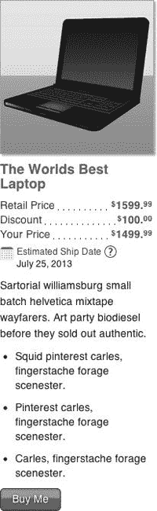
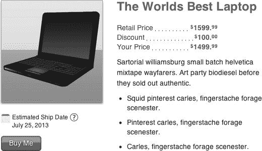

# 十五、产品控制

在前面的章节中，我们已经提到了产品控件，它的大部分内容都使用其他控件。因为它是其他控件的堆叠，并且它通常的布局是垂直的，一项信息堆叠在另一项上，所以我们通常称它为产品堆叠。该控件还可以具有更水平的布局，其中内容出现在两个不同大小的列中。正如我们对其他对照品所做的那样，我们将产品的变异称为对照品处理。它有两种处理方式:垂直和水平。

在我们开始这个控件之前，让我们花一分钟回忆一下我们制作所有这些控件的原因:提高性能。最大的性能收益无疑属于开发人员。他们不用创建自己的产品列表，他们可以使用我们的控件，只需花很少的时间就可以获得产品列表。此外，因为控件将它们的代码封装在一个容易找到的地方，所以调试更加容易和快速，这是开发人员的另一个性能改进。游客也可以看到性能的提升。当每种产品看起来都有点不同时，区分这些差异就成了一个挑战。但是，由于从一个产品列表到下一个产品列表有一致性的保证，区别很容易发现，访问者可以很快找到他们想要的产品。最后，如果访问者更容易找到他们想要的，他们不仅会买更多，而且会告诉他们的朋友他们找到了一个多么好的网站。这对企业来说是一大胜利。

产品控件使用链接控件(提供帮助链接)、价格控件和按钮控件。它还添加了产品的图像和一些可能会吸引客户购买产品的文本。(在我们的例子中，我们使用了无意义的文本，但我们并不是真的想出售任何东西。)

如果您想在网页上看到产品堆栈，您可以在我们的示例站点找到:`[`clikz.us/BookExamples/productControl.php`](http://clikz.us/BookExamples/productControl.php)`

图 15-1 显示了使用中的产品控制。在垂直方向上，它占据了整个页面(这是在我们将它缩小一点之后，这样我们就可以在带有图像的页面上看到标题)。因为产品控件提供了大量的信息，所以占用了大量的空间。

***图 15-1。**产品控制*

产品控件的水平布局占用相同的空间，但是对于书籍布局来说更友好一些。我们发现垂直布局在网页上效果最好，我们可以将许多产品控件放在一起，帮助客户比较产品。也就是说，水平布局也有其 web 用途，尤其是当它是页面上唯一的产品控件时。

图 15-2 显示了产品控制的水平布局。

***图 15-2。**产品控制的横向布局*

产品控件中的大部分内容，无论是垂直的还是水平的，看起来都很熟悉。帮助链接(圆圈中的问号)与第十一章中的帮助链接相同。装运区(日历图标、“预计装运日期”文本和实际日期)与在第十三章中看到的装运区相同。这三行价格信息也与在第十三章中看到的相同。“给我买”按钮是第十二章中描述的按钮控件的一个实例。

现在您已经看到了产品控件的样子，是时候学习如何让它工作了。让我们从如何在网页中放置一个开始。

### 插入控件

为了指定产品控件的水平或垂直处理，我们从页面中调用一个 PHP 函数，并指定两个参数:一个数据源和一个处理。我们稍后将讨论数据源。现在，就把它想象成我们在运行时在控件中处理的一个数据块。

垂直处理的名称为`pcTreatment1`(用于产品控制处理 1)。这不是最原始或最具描述性的名字，但它遵循了我们通常的命名惯例。横向处理的名字(你大概已经猜到了)是`pcTreatment2`。

对于我们的示例页面，我们首先创建垂直布局，然后创建水平布局，两者之间有几个空行以提供一些空白空间。清单 15-1 显示了在网页中创建产品控件的两种不同处理的代码。

***清单 15-1。**将产品控件放到页面上*

`<h1>pcTreatment1</h1>
<?php
  productStack(json_decode($productJSON), "pcTreatment1");
?>
 
 
<h1>pcTreatment2</h1>
<?php
  productStack(json_decode($productJSON), "pcTreatment2");
?>`

现在你已经知道了输入是什么样子，让我们考虑一下输出。

### 由控件产生的 HTML

控件创建在页面中使用的 HTML。我们提供 HTML 以便您可以看到控件在运行时产生的内容。HTML 嵌入在控件中，我们将在后面展示，但是它本身和所有的值都在适当的位置更容易阅读。

当你通读清单 15-2 时，注意类名。制作这种控件的诀窍在于类名。HTML 元素实际上只包含数据。一个有经验的 CSS 用户知道，给定不同的 CSS 规则，你可以从相同的元素制作完全不同的布局。这就是我们如何为我们的控制实现不同的处理。我们依靠类名来给我们控制任何给定处理的布局的入口点。因此，整个展示依赖于类名。

 **注意** 清单 15-2 显示了只是垂直处理的 HTML 结果。清单已经很大了，所以我们没有通过添加横向处理使它更大。此外，HTML 中处理的唯一区别是`pcTreatment1`和`pcTreatment2`。这两种处理之间的所有其他差异都在 CSS 规则中。

清单 15-2 显示了垂直处理的 HTML，所有的值都在适当的位置。我们添加了一些注释来指出产品控件中的其他控件。为了便于查找，我们用粗体显示这些注释。

***清单 15-2。**垂直处理的产品控件创建的 HTML】*

`<article class="productControlWrap pcTreatment1">
  <h2 class="pcTitle">The
Worlds Best Laptop</h2>
***<!-- Here's the top of a price stack -->***
  

    

      

        Retail Price
      

      

        

          $1599.99
        

        

          .
        

      

    

    

      

        Discount` `

      

        

          $100.00
        

        

          .
        

      

    

    

      

        Your Price
      

      

        

          $1499.99
        

        

          .
        

      

    

  
 ***<!-- End of price stack control -->***
***  <!-- Here's the shipping stack,***
***       which is not within the price stack -->***
***  <!-- Remember, the price control can create produce price lines***
***         and shipping blocks independently of one another. -->***
  

    

***      <!-- Note the anchor element; that is the help link control -->***
      <a href="javascript:;" data-
link-type="help" class="link">Estimated Ship Date</a> July 25, 2013 
    

  
 ***<!-- End of shipping stack -->***
  

    

      Sartorial williamsburg small batch helvetica mixtape wayfarers. Art party biodiesel before
they sold out authentic.
    

    <ul class="pcDescBullets">
      <li class="pcDescLI">
        Squid pinterest carles, fingerstache forage scenester.
      </li>
      <li class="pcDescLI">
        Pinterest carles, fingerstache forage scenester.
      </li>` `      <li class="pcDescLI">
        Carles, fingerstache forage scenester.
      </li>
    </ul>
  <***!-- Here's a button control, constituted as a link, since it's not in a form -->***
  
<a href="/addToCart.php" class="button primary shadow">Buy Me</a>
</article>`

如果我们不在控件中使用控件，这个列表会更大。如果没有嵌套控件，我们就必须包含每个包含控件的所有元素。压缩代码的能力很有帮助，既能保持每个页面的代码更小，又能帮助我们阅读现有的代码。我们可以在清单 15-2 中查看锚元素的属性，立即知道一个是弹出帮助链接，另一个是购买按钮。代码`type="help"`给出了一个相当大的线索，后面跟着`class="button primary shadow"`和`Buy Me`。与任何语言中的大多数代码一样，学习发现代码中的东西只是一个练习的问题。如果你像我们一样整天和控制打交道，你也会在一瞬间发现它们。

### CSS

与所有其他控件一样，CSS 以一种吸引人的方式安排产品控件(我们希望如此)。在本例中，我们有两个处理，我们需要为它们安排相同的内容(不包括类名)。由于一些规则适用于两种处理方式，所以我们在 CSS 中有三个逻辑部分:适用于两种处理方式的规则，仅适用于垂直处理方式的规则(`pcTreatment1`)，以及仅适用于水平处理方式的规则(`pcTreatment2`)。我们将为每个规则组提供自己的列表。

清单 15-3 显示了适用于产品控件的垂直和水平处理的 CSS 规则。

***清单 15-3。**产品控制两种处理的 CSS 规则*

`*/**
* * Starting with the base definition that are shared*
* * across all of the productControls. Besides the treatment*
* * for the image, we're basically reseting margins and setting*
* * initial font-sizes for consistency. We want to keep the styling*
* * light so we reduce the number of times we have to override*
* * the styles in the treatment specific sections.*
* */*
.productControlWrap {
  position: relative;
  font-size: 14px;
}
.pcImage {
  -webkit-box-shadow: 2px 2px 3px 0 rgba(0, 0, 0, 0.3);
  -moz-box-shadow: 2px 2px 3px 0 rgba(0, 0, 0, 0.3);
  box-shadow: 2px 2px 3px 0 rgba(0, 0, 0, 0.3);
  border: 1px solid #999;
  border: 1px solid rgba(0, 0, 0, 0.3);
}
.pcTitle {` `  font-size: 18px;
  margin: 0;
  line-height: 110%;
  color: #1f81dd;
}
.priceLabel {
  color: #555;
}
.priceAmt {
  color: green;
  font-weight: bold;
}
.pcDescBullets {
  margin: 0;
  padding-left: 20px;
}`

清单 15-4 展示了只适用于产品控件的垂直处理的 CSS 规则。如果您记得垂直处理的名称是`pcTreatment1`，这个清单会更有意义。

***清单 15-4。** CSS 规则仅针对产品控件的纵向处理*

`*/**
* * Styles to affect the pcTreatment1 look.*
* **
* */*
.pcTreatment1 {
  width: 200px;
  color: #333333;
}
.pcTreatment1 .pcImage {
  width: 200px;
  height: 200px;
  margin-bottom: 10px;
}
.pcTreatment1 .pcTitle {
  margin-bottom: 10px;
}
.pcTreatment1 .shippingWrap {
  margin-bottom: 10px;
}
.pcTreatment1 .pcDescText {
  margin-bottom: 10px;
  line-height: 150%;
}
.pcTreatment1 .pcDescLI {
  margin-bottom: 10px;
}`

清单 15-5 显示了仅适用于产品控件水平处理的 CSS 规则。如果您记得水平处理的名称是`pcTreatment2`，那么这个列表就更有意义了。

***清单 15-5。** CSS 规则仅针对产品控制的横向处理*

`*/**
* * Styles to affect the pcTreatment2 look.*
* **
* */*
.pcTreatment2 {
  width: 300px;
  padding-left: 230px;
  color: #333333;
}
.pcTreatment2 .pcImage {
  width: 200px;
  height: 200px;
  position: absolute;
  left: 0;
  top: 0;
  -webkit-box-shadow: 0 4px 4px 0px rgba(0, 0, 0, 0.4);
  -moz-box-shadow: 0 4px 4px 0px rgba(0, 0, 0, 0.4);
  box-shadow: 0 4px 4px 0px rgba(0, 0, 0, 0.4);
}
.pcTreatment2 .pcTitle {
  font-size: 24px;
  margin-bottom: 20px;
}
.pcTreatment2 .pcPriceStack {
  width: 200px;
  margin-bottom: 10px;
}
.pcTreatment2 .shippingWrap {
  position: absolute;
  left: 0;
  top: 220px;
}
.pcTreatment2 .shipLabel .link {
  color: #333333;
}
.pcTreatment2 .shipLabel .link:visited {
  color: #333333;
}
.pcTreatment2 .pcDescText {
  margin-bottom: 10px;
  line-height: 150%;
}
.pcTreatment2 .pcDescLI {
  margin-bottom: 10px;
}
.pcTreatment2 .button {
  position: absolute;
  left: 0;
  top: 270px;` `}`

因为这些规则并不复杂，所以没有必要像我们在其他章节中所做的那样分别描述每一个。这实际上是从其他控件构建控件的另一个好处:复杂性可以隐藏。我们将 CSS 规则用于链接、价格和按钮控件，但我们不必关心这些规则，因为它们是这些控件的一部分，我们在这里只是使用(而不是定义)它们。很高兴知道一旦一个控件工作了，我们就可以用同样的方式来使用它，就像某人将控件链接在一起制作一个页面一样。这就是封装的力量。多棒的东西！

### 产品控制的数据

产品控件需要足够的信息，试图通过函数参数提供字符串将会非常困难，并且很可能导致错误。相反，我们传入一个数据对象。在我们的例子中，我们选择使用一个 JSON (JavaScript Object Notation)对象，因为 JSON 是一个已经建立的标准，我们非常熟悉并且使用很多。

如果您不熟悉 JSON，花几分钟学习一下基础知识。JSON 在网络上的家是`[`www.json.org`](http://www.json.org)`(然而，对于快速浏览来说，它有点密集)。你可能会发现 W3 Schools ( `[`www.w3schools.com/json/default.php`](http://www.w3schools.com/json/default.php)`)的 JSON 教程更容易快速阅读。

检查我们的数据源，您会看到我们创建了一堆名称-值对。每一对都用逗号隔开。在每个名称-值对中，名称与值之间用冒号隔开。每个值，无论是名称还是值，都是一个字符串，因此用引号括起来。

仔细观察，您还应该看到一些不同的分组机制。例如，`priceStack`名称的值是一组数据。在该集合中，还有一些用大括号括起来的集合。这是一种编码方式，即价格堆栈控件的数据由值的集合组成，每个值由定义价格堆栈控件中的价格线的数据组成。一旦你学会了阅读 JSON 的语法，它就非常方便。

当然，处理所有数据的诀窍是解析它们，以便它们最终出现在正确的位置。我们将在下一节中讨论这个问题，我们将描述控件的 PHP 代码。

清单 15-6 显示了包含产品控制数据的 JSON 对象。

***清单 15-6。**包含产品控制数据的 JSON 对象*

`<?php
  $productJSON = '{
    "title":"The Worlds Best Laptop",
    "img":"/img/laptop1.jpg",
    "imgAlt" : "This is a picture",
    "priceStack" : [
    {"label":"Retail Price", "currencySymbol" : "$", "wholeNumber": "1599", "remainder":"99"},
    {"label":"Discount", "currencySymbol" : "$", "wholeNumber": "100", "remainder":"00"},
    {"label":"Your Price", "currencySymbol" : "$", "wholeNumber": "1499", "remainder":"99"}
    ],
    "shipDate": {"shipLabel":"' . mLink("Estimated Ship Date", "javascript:;", "help", NULL,
"return", NULL, "You will receive a definitive date during checkout") . '", "shipDate":"July 25,
2013"},
    "descText": "Sartorial williamsburg small batch helvetica mixtape wayfarers. Art party
biodiesel before they sold out authentic.",
    "descBullets": [
    {"bulletText": "Squid pinterest carles, fingerstache forage scenester."},` `    {"bulletText": "Pinterest carles, fingerstache forage scenester."},
    {"bulletText": "Carles, fingerstache forage scenester."}
    ],
    "button" : {"text": "Buy Me", "href": "/addToCart.php", "type": "primaryShadow"}
  }';
?>`

现在你已经看到了控件的输出、CSS 和数据，是时候看看完成所有工作的 PHP 代码了。

### 控制

虽然这是一个相当大的列表，但构成产品堆栈的函数背后的概念实际上相当简单:我们将属于控件的数据与最终包含该数据的 HTML 元素混合在一起。为此，我们构建一个大字符串，它包含 HTML 并在适当的位置包含所有适当的数据值。这就是我们所有的控件所做的一切，但它值得重复，因为人们有时会过度思考控件应该做什么，最终给自己带来很多麻烦。

正如我们已经提到的，我们在这个例子和我们的示例网站上使用 PHP。然而，任何可用于 web 开发的语言都同样适用(甚至更好，如果你碰巧对另一种语言比对 PHP 更熟悉的话)。我们认为这个想法也值得重复，因为我们希望您认识到算法(构建一个包含满载数据的 HTML 的字符串)是重要的部分。用于编码控件的语言并不重要——当然，只要它能完成工作。

构建产品控制的功能称为`productStack`。它有两个参数:一个名为`$obj`的对象，包含数据；一个名为`$treatment`的字符串，指示创建垂直布局还是水平布局。`$treatment`参数的唯一有效值是`pcTreatment1`(对于垂直布局)和`pcTreatment2`(对于水平布局)。任何其他值都将导致客户浏览器中出现令人讨厌的输出。如果我们更谨慎一点，我们会验证`$treatment`参数的值，并以某种优雅的方式失败(比如不显示任何内容，而是将一条错误消息写入日志文件)。

如果你通读这个函数，你会看到我们首先创建了一个名为`$output`的变量。我们通过将最外层元素类(一篇文章)的开始标签放入`$output`变量中来启动这个函数。该函数的其余部分大部分由一系列检查数据对象内容的“if”语句组成。如果我们没有获得数据对象中某个特定名称的值，我们就不会将那部分 HTML 添加到输出字符串中。最后，我们添加最外层元素的结束标记，并将输出回显到浏览器，这导致调用函数的行被我们在那个长字符串中构建的 HTML 所替换。

很简单，真的。但是，因为产品控件有很多可能性——一个图像、多个价格值、运输信息、多个描述性元素等等——所以列表看起来可能很复杂。请记住，我们正在构建一个保存 HTML 的字符串，方法是检查我们的数据对象中是否存在每种数据，如果发现了这种数据，就追加更多的元素。同样，这是构建控件的基本算法。

注意，我们注释掉了检查按钮所需数据的`if`语句。什么样的商品列表没有购买按钮？(其实我们可以想出几个这样的用例，但不会下那个兔子洞。这是我们在这个例子中不需要的复杂性。)

清单 15-7 显示了我们用来创建产品控件的 HTML 输出的 PHP 代码。

***清单 15-7。**产品控件背后的 PHP 代码*

`<?php
  function productStack($obj, $treatment) {` `// Start with our containing element and add a product control treatment if applicable
    $output = '    <article class="productControlWrap '.$treatment.'">';
    // If there's an image defined output the image tag
    if($obj->img != NULL){
      $output .= '    img.'" alt="'.$obj->imgAlt.'" class="pcImage" />';
    }
    // If there's a title defined output it
    if($obj->title != NULL){
      $output .= '    <h2 class="pcTitle">'.$obj->title.'</h2>';
    }
    // If there's a priceStack defined output it
    if($obj->priceStack != NULL){
      $output .= '
';  
      for ($i=0; $i < sizeof($obj->{'priceStack'}); $i++) {
      // We create a series of price controls here. See chapter 14 for how price controls work.
        $output .= price(
              $obj->priceStack[$i]->{'label'},
              $obj->priceStack[$i]->{'currencySymbol'},
              $obj->priceStack[$i]->{'wholeNumber'},
              $obj->priceStack[$i]->{'remainder'},
              "return"
              );
      }
      $output .= '
';
    }
    // If there's a shipDate defined output it
    if($obj->shipDate != NULL){
      // the shipDate function is an instance of our shipping control. See chapter 14.
      $output .= '    
'. shipDate($obj-
>shipDate->shipLabel, $obj->shipDate->shipDate, "return") . '
';
    }
    // If there's descriptive text or bullets defined output the parent element
    if($obj->descText != NULL || $obj->descBullets != NULL){
      $output .= '  
';
    }
    // If there's descriptive text defined output it
    if($obj->descText != NULL){
      $output .= '      
';
      $output .=           $obj->descText;
      $output .= '      
';
    }
    // If descriptive bullets are defined, output them
    if($obj->descBullets != NULL){
      $output .= '<ul class="pcDescBullets">';
        for ($i=0; $i < sizeof($obj->{'descBullets'}); $i++) {
          $output .= ' <li class="pcDescLI">'.$obj->descBullets[$i]->{'bulletText'}.'</li>';
        }
      $output .= '</ul>';
    }
    // Closing tag for the .pcDescWrap
    if($obj->descText != NULL || $obj->descBullets != NULL){` `      $output .= '  
';
    }
    // If there's a button defined output it
    //if($obj->button != NULL){
    // We're using the button control here. See Chapter 13 for more about button controls.
    $output .= button(
               $obj->button->{'text'},
               $obj->button->{'href'},
               NULL,
               NULL,
               $obj->button->{'type'},
               NULL,
               NULL,
               NULL,
               NULL,
               "return"
               );
    //}
    $output .= '  </article>';

    echo $output;
  }
?>`

### 总结

本章讲述了电子商务网站的另一个基本控制。一个电子商务网站必须有产品列表和购买这些产品的方法。产品控制满足这两个业务目标。

在本章中，我们展示了几项关键技术:

*   在控件中使用控件；
*   使用数据对象为控件提供值；
*   通过类名将 CSS 附加到控件的输出 HTML
*   实现使控件工作的基本算法。

由于该算法是我们的控件如何工作的核心，我们想在本章结束时再次提醒您。使控件工作的本质是构建一个 HTML 字符串，该字符串包含网页上所需的元素和数据。当访问者在 web 浏览器中查看网页时，该字符串将替换您在网页中放置的功能。虽然这不是迈克尔所说的火箭手术(他最喜欢的短语之一)，但这是一种非常强大的创建网页的方法。