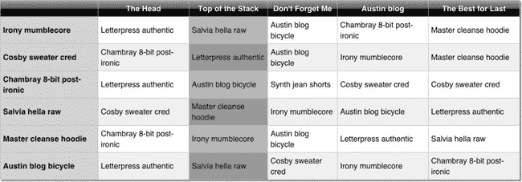
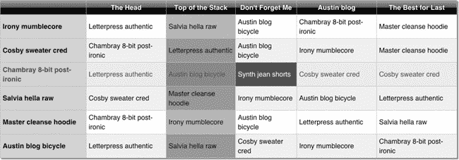
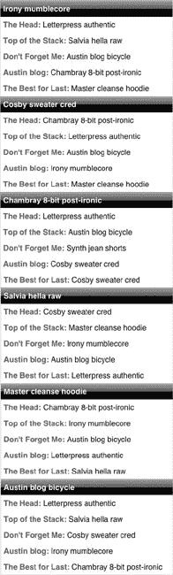
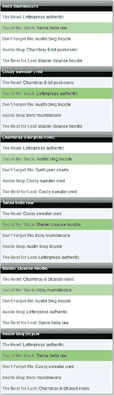

# 十六、表格控件

作为一名前端开发人员，Michael 对表格又爱又恨。一方面，表格提供了一种近乎完美的方式来显示表格数据。另一方面，一些开发人员滥用表格作为几乎任何事情的布局机制。Michael 经常看到开发人员(通常是被迫做前端工作的后端或中间件开发人员)使用嵌套表格来移动内容几个像素。对于知道它应该是什么的人来说，看到这种事情是非常令人沮丧的。我们相信许多读者都有同感。

我们假设你以前听过“表格是布局的恶魔”这种说法。为了火上浇油，我们有了响应式设计。除了不使用表格进行布局的所有其他原因(包括较低的性能、要呈现的 HTML 元素的增加以及难以阅读的代码)，还有一个额外的问题是表格不能响应响应式设计。桌子是内部固定的；他们不允许对 TD 元素重新排序(就像 CSS 一样)。例如，如果一个有两栏的表格(左边是导航栏，右边是内容栏)用于基本的页面布局，那么这个页面就不容易重新排列。如果不从服务器创建一个新页面，导航就不能移动到顶部或右侧(这会对性能产生巨大影响)。

那么表和性能呢？在前两段中已经提到了几个与性能相关的问题，现在让我们更深入地探讨一下这个问题。就客户端(即浏览器)性能而言，表的一个大问题是，当浏览器呈现它们时，它们通常会强制执行一个或多个重绘操作。即使您遵循了在页面顶部加载样式、在页面底部加载脚本的原则，即使您的表格具有相当规则的内容，它们也经常会触发重绘事件。这些重绘事件大大降低了渲染速度(从而降低了页面加载时间)，因为渲染引擎每次都必须从表的顶部开始。在服务器端，如果你为每个布局使用不同的页面(例如，垂直和水平)，一些糟糕的访问者将手机旋转 90 度会导致一个全新的页面加载。除了让访问者抓狂之外，您还添加了一整套 HTTP 请求并增加了带宽使用，这都是因为有人希望看到您的信息得到更广泛的显示。最后，如果您创建一个接受数据流并生成一个表的控件，开发人员的性能会得到提高。即使手工编写一个小表也需要时间，至少与将数据从数据库传递给函数相比是这样。

由于性能问题(特别是在这种情况下的开发人员性能)和所有其他问题，我们重申许多其他人的建议:不要使用表格进行布局。但是如何在移动设备中正确使用表格——表格数据？这方面的问题是水平空间有限；大多数表格都需要向右滚动——这在网络上是不允许的，除非你用的是 Windows phone。因为我们遵循移动优先的模式，所以我们设计所有的页面，让它们在手机上看起来尽可能的好。因此，我们将分享 Michael 想出的解决这个问题的技术:用 CSS 样式的嵌套列表来呈现表格。听起来熟悉吗？这就是我们在第七章中构建导航的方式，当然，在这里我们使用不同的风格。

在本章中，我们将展示如何构建一个示例表格控件。您可以在我们示例站点上找到该控件:`[`clikz.us/BookExamples/tableControl.php`](http://clikz.us/BookExamples/tableControl.php)`

在开始描述控件如何工作之前，我们认为应该向您展示它在两种状态下的样子:宽和窄。(同样，我们称每种状态为一种治疗，就像我们控制的所有变化一样。)我们还将在表格中显示一个突出显示的单元格。

图 16-1 显示了我们的表格控件的宽处理。虽然这看起来像一个标准表，但它实际上是一个包含一堆列表(`ul`元素及其`li`子元素)的`div`元素。它的行为和外观都像一个标准表。在控件内部，我们展示了一种将表格转换为标准表格元素的方法。我们提供了使用表格元素的能力，因为 IE8 之前的 Internet Explorer 不支持显示表格数据的嵌套列表方法。我们使用浏览器检测来显示 IE6 和 IE7 的正确内容。

***图 16-1。**我们样品台的宽布局*

图 16-2 显示了我们的悬停功能。当访问者的鼠标悬停在一个单元格上时，整行高亮显示，鼠标悬停的单元格进一步高亮显示(变暗)。在突出显示行和单元格时，与访问者正在考虑的选择相关的细节也被突出显示。正如我们在本章后面所展示的，所有这些突出显示都是通过 CSS 来控制的。

***图 16-2。**带有高亮(深色)单元格的宽布局*

图 16-3 显示了我们的表格控件的窄(因此更高)处理。这种处理可能对游客在手机或其他有限显示设备上查看桌子有用。当页面设计者希望将表格信息放在页面的一侧，而将其他信息放在页面的另一侧时，窄视图也很有用。例如，一个音乐网站可能有一个歌曲和演唱这些歌曲的艺术家的列表，并附有这些歌曲的共同点的描述。

 **注意**正如我们之前提到的，随着设备的快速增长，我们不能只计划手机和桌面浏览器。据我们所知，有人可能会在冰箱门上或柜门内侧或我们想象不到的地方看到我们的餐桌控制。因此，我们根据布局特征(窄与宽)而不是目标设备(桌面与电话)来思考(并命名我们的控制和处理)。

***图 16-3。**我们表控的狭隘待遇*

除了改变类名以反映预期的处理之外，窄处理使用与宽处理完全相同的 HTML。我们刚刚使用 CSS 为窄显示屏设备旋转了表格。说到 HTML，让我们看看我们的例子背后的 HTML。

### HTML

我们示例表格的 HTML 是由表格控件生成的。如前所述，它由一个`div`元素组成，其内容是一组无序列表(宽布局中每行一个列表，窄布局中每个块一个列表)。

当您阅读 HTML 时，请注意`div`元素上的类名。它们表明这个`div`包含一个表的内容以及使用哪种处理方式(`tableTreatment1`是宽处理方式，`tableTreatment2`是窄处理方式)。类似地，`ul`元素中的样式名表明一行是标题行还是正文行。另外，`li`元素中的样式名称表明该元素是一个单元格，以及任何给定的单元格是否是第一个单元格。在`li`元素中，`data-colhead`属性(一个自定义属性)标识单元格所属的列。我们使用 data-colhead 属性的值来提供窄处理中的标题信息，这支持表的旋转。

 **注意** 如果包含我们的样本站点上使用的所有数据，清单 16-1 会很长。制作一个像样的样本需要相当多的数据，但是这导致了清单中的大量重复。因此，我们只包括定义标题行的列表和定义第一行内容的列表。第一个列表定义了标题行。第二个列表定义了第一个正文行。因为正文行在结构上是相同的，只是内容不同，所以您可以通过检查其中一行来了解它们是如何工作的。要查看整个列表并查看实际表格，请转到`[`clikz.us/BookExamples/tableControl.php`](http://clikz.us/BookExamples/tableControl.php)`

清单 16-1 展示了本章前面展示的样本背后的 HTML。

***清单 16-1。**我们的样本表的 HTML】*

`

  <ul class="tr tableHead">
    <li class="td " data-colhead=""></li>
    <li class="td " data-colhead="The Head">
      The Head
    </li>
    <li class="td " data-colhead="Top of the Stack">
      Top of the Stack
    </li>
    <li class="td " data-colhead="Don't Forget Me">
      Don't Forget Me
    </li>
    <li class="td " data-colhead="Austin blog">
      Austin blog
    </li>
    <li class="td " data-colhead="The Best for Last">
      The Best for Last
    </li>` `  </ul>
  <ul class="tr tableBody">
    <li class="td first" data-colhead="">
      Irony mumblecore
    </li>
    <li class="td " data-colhead="The Head">
      Letterpress authentic
    </li>
    <li class="td " data-colhead="Top of the Stack">
      Salvia hella raw
    </li>
    <li class="td " data-colhead="Don't Forget Me">
      Austin blog bicycle
    </li>
    <li class="td " data-colhead="Austin blog">
      Chambray 8-bit post-ironic
    </li>
    <li class="td " data-colhead="The Best for Last">
      Master cleanse hoodie
    </li>
  </ul>

`

### 数据对象

既然您已经看到了示例表后面的 HTML，那么让我们继续看 HTML 中的数据。表格控件将数据转换成 HTML，类似于我们在清单 16-1 中看到的 HTML。table 控件需要一个数组的数组，其中第一个内部数组保存标题行的数据(注意第一个值是空字符串)，其余的内部数组保存正文行的数据。当然，在更现实的场景中，您可以通过查询数据库并为您构建列表的函数或对象从数据库中获取这些数据。因为我们的示例站点没有使用数据库(重点只放在本书的前端)，所以我们使用静态数据。

清单 16-2 显示了我们的样本表背后的数据。

***清单 16-2。**进入我们样本表的数据*

`<?php
  $tableObj = '[
    ["","The Head","Top of the Stack","Don\'t Forget Me","Austin blog", "The Best for Last"],
    ["Irony mumblecore","Letterpress authentic","Salvia hella raw","Austin blog
bicycle","Chambray 8-bit post-ironic","Master cleanse hoodie"],
    ["Cosby sweater cred","Chambray 8-bit post-ironic","Letterpress authentic","Austin blog
bicycle","Irony mumblecore","Master cleanse hoodie"],
    ["Chambray 8-bit post-ironic","Letterpress authentic","Austin blog
bicycle","Synth jean shorts","Cosby sweater cred","Cosby sweater cred"],
    ["Salvia hella raw","Cosby sweater cred","Master cleanse hoodie","Irony mumblecore","Austin
blog bicycle","Letterpress authentic"],
    ["Master cleanse hoodie","Chambray 8-bit post-ironic","Irony mumblecore","Austin blog
bicycle","Letterpress authentic","Salvia hella raw"],` `    ["Austin blog bicycle","Letterpress authentic","Salvia hella raw","Cosby sweater
cred","Irony mumblecore","Chambray 8-bit post-ironic"]
  ]';
?>`

### 表格控件

如前所述，我们在示例站点中使用了 PHP。然而，任何支持 web 开发的语言都同样适用。在我们自己的工作中，多年来我们一直使用 Java 和 C#以及其他语言。

在控件的顶部，我们检查参数`legacyBrowser`的值，并将我们编写的元素设置为`div`、`ul`和`li`(对于大多数浏览器)或`table`、`tr`和`td (for versions of Internet Explorer prior to IE8)`。

控件的大部分其余部分由一对嵌套的`for`循环组成，这些循环遍历数据并写入适当的元素及其属性和内容。控件的最后一部分将 HTML 回显到浏览器。

清单 16-3 显示了构成表格控件的 PHP。

***清单 16-3。**定义表格控件的 PHP 代码*

`<?php
function tableControl($model, $treatment, $legacyBrowser) {
  // We use ternary operator to set whether our
  // table will use conventional table tags
  // or our divs, uls, and lis since the CSS
  // for the nontraditional elements aren't supported
  // in IE7\. We can use browser detection to turn
  // on traditional table elements for those browsers
  // that can't support this new method.
  $tableElement = ($legacyBrowser == TRUE ? "table" : "div");
  $trElement = ($legacyBrowser == TRUE ? "tr" : "ul");
  $tdElement = ($legacyBrowser == TRUE ? "td" : "li");

  $output = '<' . $tableElement . ' class="table ' . $treatment . '">';
  for ($i = 0; $i < sizeof($model); $i++) {
    if ($i == 0) {
      $rowClass = "tableHead";
    } else {
      $rowClass = "tableBody";
    }
    $output .= '<' . $trElement . ' class="tr ' . $rowClass . '">';
    for ($j = 0; $j < sizeof($model[$i]); $j++) {
      // Add a class of 'first' if it's the first column but not the header row.
      $first = (($j == 0 && $i > 0) ? "first" : "");
      // We're iterating through the 'td's here but also adding in the column head text as a
      //data attribute in case we
      // want it later. You can put a conditional around this and turn it on only if you require
      //it to save bytes.
      $output .= '<' . $tdElement . ' class="td ' . $first . '" data-colhead="' . $model[0][$j] .
'">' . $model[$i][$j] . '</' . $tdElement . '>';` `    }
    $output .= '</' . $trElement . '>';
  }
  $output .= '</' . $tableElement . '>';
  echo $output;
}
?>`

实际的控制非常简单。真正的工作由风格来完成。让我们看看他们。

### 款式

我们用 CSS 样式做所有的布局工作。如前所述，这样做有很多好处。首先，尽可能多地使用 CSS 可以提高访问者的性能，因为 CSS 的呈现是浏览器固有的(而不是解释脚本，后者要慢得多)。

第二，我们可能能够更好地利用缓存。如果访问者已经查看了带有使用我们的表格样式表的表格的页面，那么这些样式就在缓存中，从而节省了大量的字节(提高了访问者的页面加载时间，降低了我们虚构公司的带宽成本)。因此，我们希望通过 CSS 做尽可能多的工作。这就是为什么 CSS 样式是我们表格控件中最大的部分。如果样式是动态组装的(从一个动态构建每个页面的系统中)，我们就失去了缓存 isi 的好处，所以考虑如何构建我们的文件(HTML 和 CSS)是值得的，这样我们就可以从缓存中获得最大的好处。

 **注意**在我们的示例站点上，CSS 样式在一个文件中。我们将它们分成几个清单，这样我们就可以对每个部分做一些解释。

#### 所有治疗的风格

清单 16-4 到 16-6 显示了适用于表格控件所有处理的规则。如果我们添加了第三个处理，这些规则将适用于第三个处理以及到目前为止创建的两个处理。

清单 16-4 将列表元素的填充和边距设置为 0(零),并将`list-style`属性设置为 none(以避免在我们的表中得到任何不合适的项目符号)。

***清单 16-4。**控制表格控件外观的 CSS*

`.table ul, .table li {
  padding: 0;
  margin: 0;
  list-style: none;
}`

清单 16-5 展示了我们如何为组成一个表格的各种元素设置显示模式，从而得到一个表格、行和单元格。

***清单 16-5。**为定义表格的类设置显示模式*

`/*
 * This is how we achieve our tablelike structure with these elements.
 * Basically we're just assigning the same attributes that the corresponding
 * table elements have in the 'display' property.
 */
.table {
  display: table;
}
.tr {
  display: table-row;
}
.td {
  display: table-cell;
}`

清单 16-6 显示了我们如何为表格控件生成的表格设置边框。

***清单 16-6。**控制表格的边框*

`.table, .tr, .td {
  border: 1px solid #CCC;
  border-collapse: collapse;
}`

#### 款式为宽大处理

清单 16-7 到 16-24 包含了定义表格控件宽处理外观的规则。

清单 16-7 展示了我们如何设置表格的宽度和表格外侧的阴影。在这种情况下，我们为表格(名为`tableTreatment1`)的宽处理设置这些值。

***清单 16-7。**设置宽处理的桌子宽度和阴影*

`/*
 * Table Treatment 1
 */
.tableTreatment1 {
  width: 800px;
  -webkit-box-shadow: 2px 2px 2px #999999;
  -moz-box-shadow: 2px 2px 2px #999999;
  box-shadow: 2px 2px 2px #999999;
}`

清单 16-8 为宽处理设置最左边单元格的外观。特别是，它将背景设置为浅蓝色，将字体粗细设置为粗体。

***清单 16-8。**为宽处理样式化最左边单元格的内容*

`.tableTreatment1 .first {
  background: #c8dfff;` `  font-weight: bold;
}`

清单 16-9 展示了我们如何设计身体细胞的样式。为此，我们使用了一个很少使用的 CSS 选择器(`nth-child`选择器)。这样做可以让我们对每隔一行设置不同的样式，从而使表格更具吸引力，更易于阅读。我们在评论中添加了额外的解释。

***清单 16-9。**塑造身体细胞*

`/*
 * By using the nth-child selector (which works in all
 * modern browsers), we can give our table a striped look.
 * Normally, you'd do this on the server side or with
 * JavaScript. Alternating the colors of the rows improves
 * readability and is (we think) more attractive.
 */`

清单 16-10 显示了我们如何设置高亮单元格的颜色。

***清单 16-10。**改变高亮单元格的颜色*

`.tableTreatment1 .tableBody.tr:nth-child(odd) {
  background: #eef3fe;
}`

清单 16-11 展示了我们如何设置访问者鼠标悬停的行的颜色。同样，我们使用了`nth-child`选择器来决定突出显示哪一行。请注意，我们设计奇数行的样式，但从不设计偶数行的样式。这是因为另一个规则(在清单 16-14 中)设置了所有行的悬停状态。那么这个规则会覆盖那个规则(因为这个规则更具体)来设置奇数行的悬停状态。我们将在这组规则中反复看到这种安排，我们将在本节的最后讨论这种技术的一个常见陷阱(以及如何避免它)。

***清单 16-11。**设置一行的悬停状态*

`.tableTreatment1 .tableBody.tr:nth-child(odd):hover {
  /*
   * We add a hover state to the odd .tr's that are also of
   * class .tableBody. This effect highlights the row the
   * visitor is hovering over with a slightly different
   * background color. However, since we want to maintain
   * the alternating row effect, this effect will be slightly
   * different from that on the even rows.
   */
  background: #cad0f8;
}`

清单 16-12 展示了当高亮显示时，我们如何让第三列的单元格变成深绿色。注意，我们使用`nth-child`选择器来指定奇数行和特定的列(第三列)。

***清单 16-12。**设置第三列的悬停颜色*

`.tableTreatment1 .tableBody.tr:nth-child(odd):hover .td:nth-child(3) {
  /*
   * We also use the nth-child selector to target columns.` `   * In this case, we target the third column of each odd row.
   * This rule complements the next rule, which makes the
   * entire 3rd column a green color but makes the alternating
   * rows a slightly darker green color to maintain readability.
   */
  background: #54d543;
}`

清单 16-13 展示了我们如何使第三列的奇数行比第三列的偶数行稍微暗一点。我们再次使用`nth-child`选择器来指定奇数行和特定的列(第三列)。

***清单 16-13。**把第三列的奇数行变成稍微暗一点的绿色*

`.tableTreatment1 .tableBody.tr:nth-child(odd) .td:nth-child(3) {
  /*
   * To maintain the integrity of our different-color column,
   * we make the highlighted cell go to a stronger green color
   * when the visitor hovers on that row. This rule selects only
   * the odd rows in the green column.
   */
  background: #8ce981;
}`

清单 16-14 为正文行设置基本悬停高亮效果。同样，它实际上是为没有另外指定的行设置高亮效果，但效果是为偶数行定义悬停效果。

***清单 16-14。**为车身行设置基本悬停高亮*

`.tableTreatment1 .tableBody.tr:hover {
  background: #eeeff0;
  color: #1d80fd;
}`

清单 16-15 为第三列中的单元格设置悬停颜色，使得该列中高亮显示的单元格的背景颜色为深绿色。

***清单 16-15。**设置第三列单元格的悬停颜色*

 `.tableTreatment1 .tableBody.tr:hover .td:nth-child(3) {
  background: #76f564;
}`

清单 16-16 使第三列变成绿色。因为将第三列的奇数行设置为较暗的绿色的规则具有更高的特异性，所以该规则将偶数行设置为较浅的绿色，这是我们用作第三列的基本颜色。

***清单 16-16。**使第三列变绿*

`.tableTreatment1 .tableBody.tr .td:nth-child(3) {
  /*
   * Now we make the entire third column a slightly green` `   * background color. Because the previous nth-child
   * selector has greater specificity, it will override this
   * rule in odd rows.
   */
  background: #b2ebac;
}`

清单 16-17 显示了我们如何设置单元格的外观(不包括背景颜色),包括标题单元格和主体单元格。

***清单 16-17。**单元格样式(不包括背景色)*

`.tableTreatment1 .td {
  padding: 4px;
  font-size: 12px;
  vertical-align: middle;
}`

清单 16-18 显示了我们如何设置高亮单元格的前景色和背景色。前景色变成白色，背景色变成强烈的蓝色。因为第三列的悬停规则(下一个规则，在清单 16-19 中)具有更大的特异性，所以这个规则不适用于第三列。

***清单 16-18。**为除第三列之外的所有列设置悬停状态*

`.tableTreatment1 .tableBody .td:hover {
  color: white;
  background: #1d80fd;
}`

清单 16-19 展示了当访问者的鼠标悬停在第三列的单元格上时，我们如何设置该单元格的前景色和背景色。指令确保当访问者的鼠标停留在第三列的单元格上时，它们总是变成深绿色。

***清单 16-19。**第三列单元格的悬停规则*

`.tableTreatment1 .tableBody:hover .td:nth-child(3):hover {
  color: white;
  background: #12ba00 !important;
}`

清单 16-20 控制标题行的外观。它将文本设置为白色和粗体，设置深灰色文本阴影，并设置浅灰色背景色。此外，对于大多数浏览器，它使用 SVG 图像来设置页眉的背景图像。最后，它为大多数浏览器设置了渐变效果。最终效果是深色渐变背景上的白色文本。

***清单 16-20。**宽处理的表头造型*

`.tableTreatment1 .tableHead {
  color: white;
  font-weight: bold;
  text-shadow: 0 0 3px #333;
  background: #aebcbf;
  background: url(data:image/svg+xml;base64,PD94bWwgdmVyc2lvbj0iMS4wIiA/Pgo8c3ZnIHhtbG5zPSJodHRw` `Oi8vd3d3LnczLm9yZy8yMDAwL3N2ZyIgd2lkdGg9IjEwMCUiIGhlaWdodD0iMTAwJSIgdmlld0JveD0iMCAwIDEgMSIgcHJl
c2VydmVBc3BlY3RSYXRpbz0ibm9uZSI+CiAgPGxpbmVhckdyYWRpZW50IGlkPSJncmFkLXVjZ2ctZ2VuZXJhdGVkIiBncmFk
aWVudFVuaXRzPSJ1c2VyU3BhY2VPblVzZSIgeDE9IjAlIiB5MT0iMCUiIHgyPSIwJSIgeTI9IjEwMCUiPgogICAgPHN0b3Ag
b2Zmc2V0PSIwJSIgc3RvcC1jb2xvcj0iI2FlYmNiZiIgc3RvcC1vcGFjaXR5PSIxIi8+CiAgICA8c3RvcCBvZmZzZXQ9IjUw
JSIgc3RvcC1jb2xvcj0iIzZlNzc3NCIgc3RvcC1vcGFjaXR5PSIxIi8+CiAgICA8c3RvcCBvZmZzZXQ9IjUxJSIgc3RvcC1j
b2xvcj0iIzBhMGUwYSIgc3RvcC1vcGFjaXR5PSIxIi8+CiAgICA8c3RvcCBvZmZzZXQ9IjEwMCUiIHN0b3AtY29sb3I9IiMw
YTA4MDkiIHN0b3Atb3BhY2l0eT0iMSIvPgogIDwvbGluZWFyR3JhZGllbnQ+CiAgPHJlY3QgeD0iMCIgeT0iMCIgd2lkdGg9
IjEiIGhlaWdodD0iMSIgZmlsbD0idXJsKCNncmFkLXVjZ2ctZ2VuZXJhdGVkKSIgLz4KPC9zdmc+);
  background: -moz-linear-gradient(top, #aebcbf 0%, #6e7774 50%, #0a0e0a 51%, #0a0809 100%);
  background: -webkit-gradient(linear, left top, left bottom, color-stop(0%, #aebcbf),
color-stop(50%, #6e7774), color-stop(51%, #0a0e0a), color-stop(100%, #0a0809));
  background: -webkit-linear-gradient(top, #aebcbf 0%, #6e7774 50%, #0a0e0a 51%, #0a0809 100%);
  background: -o-linear-gradient(top, #aebcbf 0%, #6e7774 50%, #0a0e0a 51%, #0a0809 100%);
  background: -ms-linear-gradient(top, #aebcbf 0%, #6e7774 50%, #0a0e0a 51%, #0a0809 100%);
  background: linear-gradient(to bottom, #aebcbf 0%, #6e7774 50%, #0a0e0a 51%, #0a0809 100%);
  filter: progid:dximagetransform.microsoft.gradient(startColorstr='#aebcbf',
endColorstr='#0a0809', GradientType=0);
}`

清单 16-21 只是将标题行中每个单元格的内容居中——这很简单，但对标题中的内容对齐很有必要。

***清单 16-21。**将标题行的单元格居中*

`.tableTreatment1 .tableHead .td {
  text-align: center;
}`

清单 16-22 显示了当访问者使用 IE9 时，我们在哪里关闭我们在清单 16-21 中创建的过滤器。IE9 不需要那个滤镜，所以我们在这条规则里把它关了。

***清单 16-22。**为 IE9* 关闭标题中的过滤器

`.ie9 .tableTreatment1 .tableHead {
  filter: none;
}`

清单 16-23 显示了当访问者使用 IE8 时，我们如何关闭我们在清单 16-21 中创建的过滤器和背景。Internet Explorer 需要为每个单元格设置背景，而不是为整行设置背景，所以我们将在清单 16-24 中这样做。

***清单 16-23。**关闭 IE8 的滤镜和背景*

`.ie8 .tableTreatment1 .tableHead {
  filter: none;
  background: none;
}`

清单 16-24 显示了当访问者使用 IE8 时，我们如何为标题单元格设置背景和过滤。IE8 不会对行使用背景和过滤器定义，所以我们必须在单元格上设置这些值。

***清单 16-24。**为 IE8* 中的标题单元格设置背景

`.ie8 .tableTreatment1 .tableHead .td {
  background: #aebcbf;
  filter: progid:dximagetransform.microsoft.gradient(startColorstr='#aebcbf', endColorstr='#0a0809', GradientType=0);
}`

#### 款式为窄幅处理

窄处理获得的样式与定义宽处理外观的样式有很大不同。首先，窄处理为控件数据中的每个数组创建了一组行，而不是单个行。此外，第二种处理没有突出悬停效果。由于触摸屏(无论是手机还是冰箱)没有鼠标指针浮动，设置悬停效果没有意义。因此，狭义处理的规则要简单得多。清单 16-25 到 16-32 显示了定义我们的表格控件的窄处理的规则。

清单 16-25 显示了我们如何将窄表格的宽度设置为 320 像素。

***清单 16-25。**设定窄治疗的宽度*

`/*
 * Table Treatment 2
 */
.tableTreatment2 {
  width: 320px;
}`

清单 16-26 显示了当我们使用窄处理时，我们如何关闭 HTML 中所有元素的边框。

***清单 16-26。**关闭窄边框处理*

`.tableTreatment2 .table, .tableTreatment2 .tr, .tableTreatment2 .td {
  border: none;
}`

清单 16-27 显示了我们如何关闭标题内容的显示，因为我们在窄处理中没有使用标题单元格。

***清单 16-27。**关闭割台单元进行窄处理*

`.tableTreatment2 .tableHead {
  display: none;
}`

清单 16-28 显示了我们如何在表格控件的窄处理中将一行的宽度设置为 200 像素。

***清单 16-28。**将行宽设置为 200 像素*

`.tableTreatment2 .tr {
  width: 200px;
}`

清单 16-29 展示了我们如何在表格控件的窄处理中设计单元格的样式。

***清单 16-29。**对狭窄治疗区内的细胞进行造型*

`.tableTreatment2 .td {
  display: block;
  float: none;
  padding: 5px;
}`

清单 16-30 展示了我们如何对表格控件的窄处理的每个块中的第一个单元格进行样式化。我们在宽处理中使用与标题行相同的样式。`first-child`选择器让我们只指定窄处理中每个块的第一个单元格。

***清单 16-30。**对每个区块内的第一个单元格进行窄处理*

`.tableTreatment2 .td:first-child {
  /*
   * By using the first-child selector, we can target
   * the first TD, which is a relevant pivot point for our data.
   */
  color: white;
  font-weight: bold;
  text-shadow: 0 0 3px #333;
  background: #aebcbf;
  background: url(data:image/svg+xml;base64,PD94bWwgdmVyc2lvbj0iMS4wIiA/Pgo8c3ZnIHhtbG5zPSJodHRw
Oi8vd3d3LnczLm9yZy8yMDAwL3N2ZyIgd2lkdGg9IjEwMCUiIGhlaWdodD0iMTAwJSIgdmlld0JveD0iMCAwIDEgMSIgcHJl
c2VydmVBc3BlY3RSYXRpbz0ibm9uZSI+CiAgPGxpbmVhckdyYWRpZW50IGlkPSJncmFkLXVjZ2ctZ2VuZXJhdGVkIiBncmFk
aWVudFVuaXRzPSJ1c2VyU3BhY2VPblVzZSIgeDE9IjAlIiB5MT0iMCUiIHgyPSIwJSIgeTI9IjEwMCUiPgogICAgPHN0b3Ag
b2Zmc2V0PSIwJSIgc3RvcC1jb2xvcj0iI2FlYmNiZiIgc3RvcC1vcGFjaXR5PSIxIi8+CiAgICA8c3RvcCBvZmZzZXQ9IjUw
JSIgc3RvcC1jb2xvcj0iIzZlNzc3NCIgc3RvcC1vcGFjaXR5PSIxIi8+CiAgICA8c3RvcCBvZmZzZXQ9IjUxJSIgc3RvcC1j
b2xvcj0iIzBhMGUwYSIgc3RvcC1vcGFjaXR5PSIxIi8+CiAgICA8c3RvcCBvZmZzZXQ9IjEwMCUiIHN0b3AtY29sb3I9IiMw
YTA4MDkiIHN0b3Atb3BhY2l0eT0iMSIvPgogIDwvbGluZWFyR3JhZGllbnQ+CiAgPHJlY3QgeD0iMCIgeT0iMCIgd2lkdGg9
IjEiIGhlaWdodD0iMSIgZmlsbD0idXJsKCNncmFkLXVjZ2ctZ2VuZXJhdGVkKSIgLz4KPC9zdmc+);
  background: -moz-linear-gradient(top, #aebcbf 0%, #6e7774 50%, #0a0e0a 51%, #0a0809 100%);
  background: -webkit-gradient(linear, left top, left bottom, color-stop(0%, #aebcbf),
color-stop(50%, #6e7774), color-stop(51%, #0a0e0a), color-stop(100%, #0a0809));
  background: -webkit-linear-gradient(top, #aebcbf 0%, #6e7774 50%, #0a0e0a 51%, #0a0809 100%);
  background: -o-linear-gradient(top, #aebcbf 0%, #6e7774 50%, #0a0e0a 51%, #0a0809 100%);
  background: -ms-linear-gradient(top, #aebcbf 0%, #6e7774 50%, #0a0e0a 51%, #0a0809 100%);
  background: linear-gradient(to bottom, #aebcbf 0%, #6e7774 50%, #0a0e0a 51%, #0a0809 100%);
  filter: progid:dximagetransform.microsoft.gradient(startColorstr='#aebcbf', endColorstr='#0a080
9', GradientType=0);
}`

清单 16-31 展示了我们如何在单元格的常规内容前插入`data-colhead`属性的值、一个冒号和一个空格。我们还将所有插入的内容设置为粗体和中深灰色。这种技术为每个单元格提供了相当于标题的内容。

***清单 16-31。**在窄处理中插入相当于单元格标题的内容*

`.tableTreatment2 .td:before {
  /*
   * We're able to leverage the content: attr() again as we did
   * in our link control. Since our control has stored the
   * value of the column in the 'td' we can just get it from there.
   */
  content: attr(data-colhead) ": ";
  font-weight: bold;
  color: #777;
}`

清单 16-32 显示了我们如何覆盖每个块中第一行的文本插入。因为我们不想在标题前以冒号和空格结束，所以我们需要将第一个设置为空字符串(" ")。

***清单 16-32。**确保第一行没有无意义字符*

`.tableTreatment2 .td:first-child:before {
  /*
   * Since we don't need the header data for the
   * first TD, we override it so we don't get the ': '.
   */
  content: "";
}`

#### 添加媒体查询

我们认为这种控制很适合媒体询问。对于使用窄设备的访问者，很自然地会想到将布局从宽改为窄。如果你想给你的表格控件添加媒体查询，清单 16-33 中的规则显示了如何做。我们不单独描述它们，因为它们都与我们已经描述过的规则非常相似。当您使用这组规则时，您可以将它们添加到支持表格控件的 CSS 文件中的任何位置。

`/* Mobile Layout */
@media only screen and (max-width: 767px) {
  .tableTreatment1 {
    width: 320px;
  }
  .tableTreatment1 .table, .tableTreatment1 .tr, .tableTreatment1 .td {
    border: none;
  }
  .tableTreatment1 .tableHead {
    display: none;
  }
  .tableTreatment1 .tr {
    width: 200px;
  }
  .tableTreatment1 .td {
    display: block;
    float: none;` `    padding: 5px;
  }
  .tableTreatment1 .td:first-child {
    color: white;
    font-weight: bold;
    text-shadow: 0 0 3px #333;
    background: #aebcbf;
    background: url(data:image/svg+xml;base64,PD94bWwgdmVyc2lvbj0iMS4wIiA/Pgo8c3ZnIHhtbG5zPSJodH
RwOi8vd3d3LnczLm9yZy8yMDAwL3N2ZyIgd2lkdGg9IjEwMCUiIGhlaWdodD0iMTAwJSIgdmlld0JveD0iMCAwIDEgMSIgcH
Jlc2VydmVBc3BlY3RSYXRpbz0ibm9uZSI+CiAgPGxpbmVhckdyYWRpZW50IGlkPSJncmFkLXVjZ2ctZ2VuZXJhdGVkIiBncm
FkaWVudFVuaXRzPSJ1c2VyU3BhY2VPblVzZSIgeDE9IjAlIiB5MT0iMCUiIHgyPSIwJSIgeTI9IjEwMCUiPgogICAgPHN0b3
Agb2Zmc2V0PSIwJSIgc3RvcC1jb2xvcj0iI2FlYmNiZiIgc3RvcC1vcGFjaXR5PSIxIi8+CiAgICA8c3RvcCBvZmZzZXQ9Ij
UwJSIgc3RvcC1jb2xvcj0iIzZlNzc3NCIgc3RvcC1vcGFjaXR5PSIxIi8+CiAgICA8c3RvcCBvZmZzZXQ9IjUxJSIgc3RvcC
1jb2xvcj0iIzBhMGUwYSIgc3RvcC1vcGFjaXR5PSIxIi8+CiAgICA8c3RvcCBvZmZzZXQ9IjEwMCUiIHN0b3AtY29sb3I9Ii
MwYTA4MDkiIHN0b3Atb3BhY2l0eT0iMSIvPgogIDwvbGluZWFyR3JhZGllbnQ+CiAgPHJlY3QgeD0iMCIgeT0iMCIgd2lkdG
g9IjEiIGhlaWdodD0iMSIgZmlsbD0idXJsKCNncmFkLXVjZ2ctZ2VuZXJhdGVkKSIgLz4KPC9zdmc+);
    background: -moz-linear-gradient(top, #aebcbf 0%, #6e7774 50%, #0a0e0a 51%, #0a0809 100%);
    background: -webkit-gradient(linear, left top, left bottom, color-stop(0%, #aebcbf),
color-stop(50%, #6e7774), color-stop(51%, #0a0e0a), color-stop(100%, #0a0809));
    background: -webkit-linear-gradient(top, #aebcbf 0%, #6e7774 50%, #0a0e0a 51%, #0a0809 100%)
;
    background: -o-linear-gradient(top, #aebcbf 0%, #6e7774 50%, #0a0e0a 51%, #0a0809 100%);
    background: -ms-linear-gradient(top, #aebcbf 0%, #6e7774 50%, #0a0e0a 51%, #0a0809 100%);
    background: linear-gradient(to bottom, #aebcbf 0%, #6e7774 50%, #0a0e0a 51%, #0a0809 100%);
    filter: progid:dximagetransform.microsoft.gradient(startColorstr='#aebcbf', endColorstr='#0a
0809', GradientType=0);
  }
  .tableTreatment1 .td:before {
    content: attr(data-colhead) ": ";
    font-weight: bold;
    color: #777;
  }
  .tableTreatment1 .td:first-child:before {
    content: "";
  }
}`

这些规则产生了一个类似于狭义处理的表。然而，媒体查询中的规则实际上修改了宽处理(`tableTreatment1`)。结果是一个具有窄处理结构和宽处理配色方案的表格。图 16-4 显示了结果。

***图 16-4。**使用表格控件进行媒体查询的结果*

对我们来说，为表格控件编写 CSS 规则很有趣。我们不常使用那些不常见的选择器，所以找个地方展示它们是如何工作的是很好的。许多表可能不需要这种复杂程度；根据我们的经验，将中间的一列变成不同的颜色是不常见的。然而，当你需要这样做的时候，选择符可以让你指定一个特定的孩子，甚至是孩子中的孩子。正如我们所说，这很有趣，但我们也很奇怪。

 **小心时连不是真的连。**我们顺便提到偶数行没有被指定为偶数。相反，我们为所有行设置背景，然后覆盖奇数行的背景。我们可以使用`even`说明符来补充`odd`说明符，但是它会添加我们不需要添加的字节。此外，最好避免不必要的说明符。除了节省字节，您可能会遇到这样的情况:使用看似互补的说明符，然后发现有些奇怪的情况与它们都不匹配。所以最好设定一个基础待遇，指定例外情况。在这种情况下，奇数和偶数就可以了。当存在两种以上的情况时，就会出现问题，例如序列中第一项的附加值以及偶数和奇数的值。

### 总结

在这一章中，我们已经展示了如何开发和使用一个表格控件。我们展示了，如果你使用响应式设计，你不能使用通常的表格元素(`table`、`tr`和`td`)。然后我们展示了如何通过在一个`div`元素中创建一组列表来制作一个没有这些元素的表格。之后，我们展示了如何使用代码(本例中是 PHP，但也可以是 Java 或 C#或任何支持 web 的语言)将数据转换成 HTML，我们可以对其进行样式化，使其成为表格。最后，我们描述了将这些列表转换成表格中的行和单元格的每种样式。

在这个过程中，我们演示了如何选择表中的单个行和单元格。我们用这种效果来改变前景和背景的颜色。但是，您也可以使用这些选择器来创建一个包含帮助内容或更多产品细节或任何您能想到的内容的`iframe`元素，然后将`iframe`元素放在高亮显示的单元格附近。我们确信选择器还有其他的用途，可以让你指定一个特定的孩子(或者一组孩子，在`even`和`odd`说明符的情况下)，但是我们会把它们留给你自己去想象。