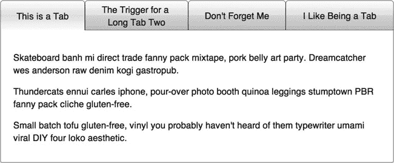
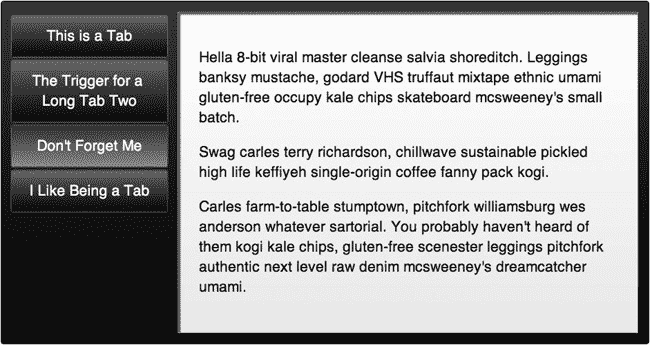

# 十七、选项卡控件

我们都在网上见过很多标签。有些还可以。有些发臭。很自然，我们希望制作一个不会发臭的选项卡控件(希望这比“好”要好)，这样我们就可以在各种内容中重用它，同时确保它看起来不错，运行良好。

网站上的标签经常令人讨厌的一个原因是它们不能追踪访问者的位置。你有没有去过一个页面，导航到第三个标签找到你想要的，去了另一个网站，然后回到有标签的网站，却发现你又在第一个标签上？我们有，我们不喜欢它。更糟糕的是，如果访问者刷新页面，一些标签方案会跳回到第一个标签。真烦人。在一个相关的问题上，我们也希望标签，我们(和我们的访问者)可以链接。

为了在设计上有一点灵活性，我们希望标签沿着内容的顶部运行(即水平标签)，标签沿着内容的左侧运行(即垂直标签)。在我们看来，一些内容似乎用水平或垂直标签更有意义。此外，我们希望我们的页面设计者(将所有这些控件放在一起制作网页的人)可以选择水平或垂直标签。因此，我们在一个对照中有两个处理(变异)。自然，我们希望我们的标签看起来不错。标签并不是有史以来最吸引人的网页设计元素，但这并不意味着它们必须是包含纯文本的方形盒子。因此，我们希望标签有圆角，渐变背景，文本水平和垂直居中。当一个或多个标签包含多行文本时，文本必须保持居中。最重要的是，我们希望标签在收缩和展开以适应它们的内容时是动态的。

 **注**我们无法在一本书里展示一个动画效果。要以动画方式查看选项卡的大小变化，请在我们的示例站点上使用选项卡控件:`[`www.clikz.us/BookExamples/tabControl.php`](http://www.clikz.us/BookExamples/tabControl.php)`

最后但同样重要的是，我们希望标签表现良好。不幸的是，许多选项卡控件使用表格。正如我们在前一章所讨论的，表有许多性能问题。此外，我们严格要求表格只能用于表格内容。然而，标签*是*表格内容。那么，我们如何在不使用那些糟糕的表格元素的情况下获得类似表格的功能呢？幸运的是，CSS 提供了一种方法——通过`display`属性。正如你将在本章后面的 CSS 清单部分看到的，我们使用`display:table`将列表转换成表格，然后使用`display:table-cell`将列表项转换成表格单元格。这种技术提供了更好的性能，因为浏览器的呈现引擎在开始呈现每个单元格之前不会等待一整行(或者更糟，整个表格)到达。这并没有很大的区别，除非您有很多表，或者更糟，表中有表。然而，这些小问题累积起来会导致糟糕的性能，因此我们尽可能地防止所有这些小的性能问题。正如我们在别处提到的，web 开发人员获得了更显著的性能提升。从数据库中检索数据并将其传递给一个函数(控件)要比每次需要时自己制作标签容易得多。此外，控件确保一致性，这在大多数网站上都是一个重要的问题。

现在我们有了一个列表，列出了我们希望标签做的事情(也就是说，我们对控件有了要求)，我们可以继续描述如何让所有这些工作起来。在我们阅读这一章的时候，我们还会探索一些技术细节，我们必须实现这些细节才能使一切正常工作。不过，现在让我们先来看看输出。图 17-1 显示了我们的选项卡控件的水平处理。

***图 17-1。**选项卡控件的水平处理*

为了多样化，水平处理使用白色背景，而垂直处理使用黑色背景。你可以很容易地使用其他颜色。图 17-2 显示了选项卡控件的垂直处理。

***图 17-2。**选项卡控件的垂直处理*

### HTML

像往常一样，控件不直接包含 HTML。相反，PHP 函数在页面加载时创建 HTML。不过，查看控件创建的 HTML 来为脚本 (JavaScript)和样式(CSS)信息提供上下文还是很有帮助的。HTML 在水平和垂直处理之间不会改变；我们完全通过 CSS 来控制外观上的差异。

HTML 由一个 section 元素组成，该元素有两个`ul`子元素。第一个列表的`li`孩子，其 class 属性包括`tabTriggerLI`，持有标签。class 属性包含`activeTab`的第一个列表的`li`子列表持有当前打开的选项卡的标签。第二个`ul`元素包含选项卡的内容(无论当前打开还是关闭)。class 属性包含`tabContentLI`的`li`元素包含选项卡的内容。class 属性包含`showTab`的`li`元素保存当前打开的选项卡的内容。清单 17-1 显示了在图 17-1 和 17-2 中显示的选项卡控件的 HTML，打开到第一个选项卡。

***清单 17-1。**标签页的 HTML】*

`<section data-item="tab" class="tabWrap tabTreatment1" id="tabID">
  <ul class="tabTriggerUL">
    <li class="tabTriggerLI activeTab">
      <a href="#tab1" class="tabTriggerA">This is a Tab</a>
    </li>
    <li class="tabTriggerLI">
      <a href="#tab2" class="tabTriggerA">The Trigger for a
       
      Long Tab Two</a>
    </li>
    <li class="tabTriggerLI">
      <a href="#tab3" class="tabTriggerA">Don't Forget Me</a>
    </li>
    <li class="tabTriggerLI">
      <a href="#tab4" class="tabTriggerA">I Like Being a Tab</a>
    </li>
  </ul>
  <ul class="tabContentUL" style="height: 215px; ">
    <li class="tabContentLI showTab" data-tabid="#tab1">
      

        Skateboard banh mi direct trade fanny pack mixtape, pork belly art party. Dreamcatcher
wes anderson raw denim kogi gastropub.
      

      

        Thundercats ennui carles iphone, pour-over photo booth quinoa leggings stumptown PBR
fanny pack cliche gluten-free.
      

      

        Small batch tofu gluten-free, vinyl you probably haven't heard of them typewriter umami
viral DIY four loko aesthetic.
      

    </li>
    <li class="tabContentLI" data-tabid="#tab2">
      

        Carles viral yr, williamsburg letterpress ethnic gluten-free aesthetic american apparel
ennui chambray polaroid you probably haven't heard of them.
      

      
` `        Scenester hoodie tattooed food truck tofu, selvage blog sriracha polaroid hella keytar
before they sold out +1.
      

    </li>
    <li class="tabContentLI" data-tabid="#tab3">
      

        Hella 8-bit viral master cleanse salvia shoreditch. Leggings banksy mustache, godard VHS
truffaut mixtape ethnic umami gluten-free occupy kale chips skateboard mcsweeney's small batch.
      

      

        Swag carles terry richardson, chillwave sustainable pickled high life keffiyeh single-
origin coffee fanny pack kogi.
      

      

        Carles farm-to-table stumptown, pitchfork williamsburg wes anderson whatever sartorial.
You probably haven't heard of them kogi kale chips, gluten-free scenester leggings pitchfork
authentic next level raw denim mcsweeney's dreamcatcher umami.
      

    </li>
    <li class="tabContentLI" data-tabid="#tab4">
      

        Swag carles terry richardson, chillwave sustainable pickled high life keffiyeh single-
origin coffee fanny pack kogi.
      

      

        Carles farm-to-table stumptown, pitchfork williamsburg wes anderson whatever sartorial.
You probably haven't heard of them kogi kale chips, gluten-free scenester leggings pitchfork
authentic next level raw denim mcsweeney's dreamcatcher umami.
      

    </li>
  </ul>
</section>`

### 数据

在描述控件核心的函数时，我们提到了`tabControl`函数的第一个参数是一个模型对象。因为我们使用 PHP，所以它必须是一个 PHP 对象。在这种情况下，它包含一个 JSON 对象。JSON 对象包含一组逗号分隔的值，每个选项卡对应一个值。每个值都包含一个逗号分隔的列表，其中包含每个选项卡的详细信息。换句话说，数据对象由外部逗号分隔列表中的逗号分隔列表组成。

 **提示**`tabcontent`值包含 HTML。您可以使用这种机制将链接、图像或其他 HTML 元素插入到选项卡的内容中。

清单 17-2 显示了我们用来创建标签控件的数据对象。

***清单 17-2。**为我们的样本选项卡控件提供数据的对象*

`<?php
$tabObj = '[
  {
    "triggertext" : "This is a Tab",
    "triggerid" : "#tab1",
    "tabcontent" : "
Skateboard banh mi direct trade fanny pack mixtape, pork belly art party.
Dreamcatcher wes anderson raw denim kogi gastropub. 

Thundercats ennui carles iphone,
pour-over photo booth quinoa leggings stumptown PBR fanny pack cliche gluten-free. 

Small
batch tofu gluten-free, vinyl you probably haven\'t heard of them typewriter umami viral DIY
four loko aesthetic.
"
  },
  {
    "triggertext" : "The Trigger for a  Long Tab Two",
    "triggerid" : "#tab2",
    "tabcontent" : "
Carles viral yr, williamsburg letterpress ethnic gluten-free aesthetic
american apparel ennui chambray polaroid you probably haven\'t heard of them. 

Scenester
hoodie tattooed food truck tofu, selvage blog sriracha polaroid hella keytar before they sold
out +1\. 
"
  },
  {
    "triggertext" : "Don\'t Forget Me",
    "triggerid" : "#tab3",
    "tabcontent" : "
Hella 8-bit viral master cleanse salvia shoreditch. Leggings banksy
mustache, godard VHS truffaut mixtape ethnic umami gluten-free occupy kale chips skateboard
mcsweeney\'s small batch.

Swag carles terry richardson, chillwave sustainable pickled high
life keffiyeh single-origin coffee fanny pack kogi.

Carles farm-to-table stumptown,
pitchfork williamsburg wes anderson whatever sartorial. You probably haven\'t heard of them kogi
kale chips, gluten-free scenester leggings pitchfork authentic next level raw denim mcsweeney\'s
dreamcatcher umami. 
"
  },
  {
    "triggertext" : "I Like Being a Tab",
    "triggerid" : "#tab4",
    "tabcontent" : "
Swag carles terry richardson, chillwave sustainable pickled high life
keffiyeh single-origin coffee fanny pack kogi.

Carles farm-to-table stumptown, pitchfork
williamsburg wes anderson whatever sartorial. You probably haven\'t heard of them kogi kale
chips, gluten-free scenester leggings pitchfork authentic next level raw denim mcsweeney\'s
dreamcatcher umami. 
"
  }
]';
?>`

### 控制

毫无疑问，你现在已经习惯了(除非你因为某种原因跳到了这一章——如果你直接跳到了这里，请阅读第十章；它解释了我们为什么要做控件)，实际的控件是一个 PHP 函数(本例中称为`tabControl`)。该函数有三个参数，如表 17-1 所述。

`tabControl`函数创建一个输出变量，它可以将控件生成的 HTML 写入其中。然后，它将 section 元素的开始标记及其所有属性(包括该选项卡控件的标识符)添加到输出变量中。接下来，该函数将保存选项卡控件标签的`ul`元素的开始标签写入输出变量。然后一个`for`循环将列表的内容写入输出变量(也就是说，它将包含标签的`li`元素写入输出变量)。在写`li`元素时，控件插入数据，包括属性和它们的值。然后，该函数关闭第一个列表，并启动第二个列表，其中包含选项卡的内容。另一个`for`循环将包含选项卡内容的`li`元素(及其属性)写入输出变量。然后，该函数将第二个列表的结束标记和 section 元素写入输出变量。最后，该函数将输出变量的内容(现在包含我们的 HTML，所有数据都在正确的位置)回显到浏览器。在浏览器中，我们的 CSS 和 JavaScript 可以与 HTML 交互，生成最终的选项卡控件供访问者使用。

 **注意**`id`属性的插入支持链接到特定的标签页，并使各个标签页出现在浏览器的历史记录中，这样访问者就可以返回到特定的标签页(或者在刷新页面时返回到同一个标签页)。基本上，`id`让浏览器记住每个标签作为一个单独的位置。

清单 17-3 显示了`tabControl`函数。

***清单 17-3。**tab control 功能*

`<?php
function tabControl($model, $id, $treatment) {
  $output = '<section data-item="tab" class="tabWrap ' . $treatment . '" id="' . $id . '">';
  $output .= '  <ul class="tabTriggerUL">';
  for ($i = 0; $i < sizeof($model); $i++) {
    $output .= '    <li class="tabTriggerLI">';
    $output .= '      <a href="' . $model[$i] -> triggerid . '" class="tabTriggerA">' .
$model[$i] -> triggertext . '</a>';
    $output .= '    </li>';
  }
  $output .= '  </ul>';
  $output .= '  <ul class="tabContentUL">';
  for ($j = 0; $j < sizeof($model); $j++) {
    $output .= '    <li class="tabContentLI" data-tabid="' . $model[$j] -> triggerid . '">' .
$model[$j] -> tabcontent . '</li>';
  }` `  $output .= '  </ul>';
  $output .= '</section>';

  echo $output;
}
?>`

### 创建选项卡控件

要创建选项卡控件，必须调用`tabControl`函数。如前所述，制作选项卡控件的 PHP 函数有三个参数:数据、每个选项卡控件的唯一标识符和处理方式(水平或垂直)。标识符`"tabTreatment1"`表示水平标签控件；`"tabTreatment2"`表示垂直选项卡控件。然后，脚本会将选项卡放置在页面中。清单 17-4 展示了我们是如何创建标签控件的，这些控件在我们的示例站点和本章中被用作示例。

***清单 17-4。**创建我们的样本标签控件*

`<?php tabControl(json_decode($tabObj), "tabID", "tabTreatment1"); ?>
<?php tabControl(json_decode($tabObj), "tabID2", "tabTreatment2"); ?>
`

### JavaScript

我们的很多控件都不使用 JavaScript。在选项卡控件中，它用于一点交互性:当访问者点击它的触发器时，让右边的选项卡出现。我们还使用 JavaScript 让选项卡控件在 IE7 中正确呈现。在本例中，我们创建了一个名为`tab`的 jQuery 插件。该插件使访问者能够通过浏览器的后退按钮、浏览器的历史功能或特定选项卡的链接来打开特定选项卡。它还向每个选项卡添加了一个 click 事件，从而可以打开访问者单击的选项卡。它还控制当不同选项卡的内容大小不同时触发的动画效果。

我们没有在这里详细描述这个插件，而是在整个插件中进行了广泛的注释。这些注释构成了一个很长的列表，但是它们也将描述放到了一个更有意义的上下文中。清单 17-5 显示了标签控件的 jQuery。

***清单 17-5。**我们选项卡控件的 jQuery 插件*

`;(function($) {

  $.fn.extend({

    //name of our plug-in
    tab : function() {

      return this.each(function() {
        // Declare some pointers relative to the element passed
        // into the plug-in.
        var tab = $(this), hash = window.location.hash,` `// Find the the .tabContentUL. We'll use this as a starting
        // selector to find
our targeted tab content
        tabContentUL = tab.find(".tabContentUL"),
        // Grabs all the .tabContentLI's into a collection.
        tabContentLIs = tabContentUL.find(".tabContentLI"),
        // Grab a collection of tab trigger anchor tags.
        tabTriggers = tab.find(".tabTriggerA"), tabTriggerLIs = tab.find(".tabTriggerLI");
        // If a user has bookmarked this page, we want to open the
        // tab he had open when bookmarking. First we'll check to see
        // whether there's a hash left by using one of the tab
        // triggers.
        if (hash) {
          var count = 0;
          tabTriggers.each(function checkHash() {
            // Because this variable is scoped within a function
            // we can use 't' again to represent each tab trigger
            // as we enumerate through the collection.
            var t = $(this);
            if (t.attr("href") == hash) {
              // if the href matches the hash, add the activeTab
              // class to the that triggers parent LI
              t.parents(".tabTriggerLI").addClass("activeTab"),
              // Then find the matching content tab and add
              // the showTab class to that, displaying that tab.
              currentTab = findTabContentLI(hash);
              currentTab.addClass("showTab");
              //Set the height of the tabContentUL for the bookmarked
              // contentTab.
              tabContentUL.height(currentTab.outerHeight(true));
            } else {
              // Add 1 to the count if there isn't a match
              // to the hash. We'll use this later to trigger
              // the first tab if we don't find a match for any
              // of the elements.
              count++;
            }
          });
          // In case our page has changed since the user bookmarked it
          // or if there are two tab controls on a page with varying
          // tab trigger names, we'll handle the case where there's no
          // matches and display the first tab. So if the count shows as
          // many unmatched tabTriggers as there are tabTriggers in
          // total, we'll show the first tab.
          if (count == tabTriggers.length) {
            showFirstTab();
          }

        } else {
          // If there's no hash, show the first tab
          showFirstTab();` `}
        // Add a click event to the tab targets.
        $(this).find(".tabTriggerA").click(function tabTrigger() {
          // Captures the element clicked and makes it a jQuery element.
          // The $(this) here is scoped to only the .tabTriggerA that
          // was clicked.
          var t = $(this),
          // We'll resuse the href as the identifier
          // for our tab selection
          tabId = t.attr("href"),
          // Find the matching .tablContentLI with the same id attribute
          // as the href from the target selected.
          targetContentTab = findTabContentLI(tabId);
          // Set all the tab content areas back to the default of
          // display: none and opacity:0 by removing the showTab class
          // from all of them.
          tabContentLIs.removeClass("showTab");
          // The same as above: Remove all the 'activeTab' classes from
          // the tabTriggers to reset them.
          tabTriggerLIs.removeClass("activeTab");
          // Add a class to the LI containing the clicked tab trigger.
          // We'll use this to style the active trigger.
          t.parents(".tabTriggerLI").addClass("activeTab");

          // For our progressive enhancement, we're going to use CSS3
          // transitions to handle animating the height of our tab
          // content wrap to match its contents, as well as animating
          // the opacity to let the content fade in after the height
          // animation is complete. However if the CSS3 animation isn't
          // available we'll get the same effect by using Javascript.
          if (Modernizr.cssanimations) {

            tabContentUL.height(targetContentTab.outerHeight(true));
            targetContentTab.addClass("showTab");
          } else {
            tabContentUL.animate(
            // Declare what property to animate. In this case we're
            // animating the height of the .tabContentUL to the same
            // height as the targetContentTab plus padding (that's the
            // outerHeight()).
            {
              "height" : targetContentTab.outerHeight() + "px"
            },
            // how long to complete the animation
            300,
            // callback after animation is complete.
            function showTab() {
              targetContentTab.addClass("showTab");
            });
          }` 
`});
        // Because IE still has some trouble being in compliance, we'll
        // trigger a JS solution to allow for our tabs to be any height
        // and still retain  the tab style metaphor by being the same
        // height.
        if($("html").hasClass("ie")){
          equalizeTriggerHeights();
        }
        // We'll find the tallest triggerLI and set the remaining LIs to
        // that height.
        function equalizeTriggerHeights(){
          var maxHeight = 0;
          tabTriggerLIs.each(function(){
            var t = $(this);
            var tHeight = t.height();
            if(tHeight > maxHeight){
              maxHeight = tHeight;
            }
            // As long as we're in here, we'll vertically center
            // the text inside the trigger LIs. We'll accomplish
            // this centering by positioning the text 50% from the
            // top, which puts the top of the text box in the middle
            // of the vertical height of our LI. But since that would
            // look too low, we'll give the text a negative margin equal
            // to 1/2 its height; that should do that trick. However,
            // IE7 doesn't allow this trick, so we'll disable it for
            //  that browser. The reason we don't use CSS to set the
            // margin is that we don't know how high the tab will be,
            // because the tab may have more than one line of content.
            if(!$("html").hasClass("ie7")){
              var tabTrigger = t.find(".tabTriggerA");
              tabTrigger.css("margin-top", -(tabTrigger.outerHeight() / 2));
            }else {
              t.find(".tabTriggerA").css("position", "static");
              // There's a display bug when IE7 first loads, we'll
              // counteract that here.
              setTimeout(function(){ie7Fix();}, 100);
            }
          })
          tabTriggerLIs.height(maxHeight);

        }
        function ie7Fix(){
          var showTab = tab.find(".showTab");
          showTab.css("display" , "block");
          tab.find(".tabContentUL").height(showTab.outerHeight(true));
        }
        // Finds the matching content based on the selector and returns
        // the element.
        function findTabContentLI(selector) {` `          selectedTabContent = tabContentUL.find(".tabContentLI[data-tabid='" + selector + "']");
          return selectedTabContent;
        }

        // Shows the first tab in the series.
        function showFirstTab() {
          var currentTab = tabContentLIs.eq(0);
          currentTab.addClass("showTab");
          tabContentUL.height(currentTab.outerHeight(true));
       tabTriggers.eq(0).parents(".tabTriggerLI").addClass("activeTab");
        }

      });
    }
  });

})(jQuery);`

### 设计选项卡控件的样式

我们制作控件的标准范例是为所有处理制作一组通用的 HTML 元素；我们再次接受了选项卡控件的范例。因此，不同治疗之间的差异完全取决于 CSS。

在选项卡控件的情况下，我们有两种处理方式:水平(由名称包含`tabTreatment1`标识符的类表示)和垂直(由名称包含`tabTreatment2`标识符的类表示)。除了适用于一种或另一种处理的规则之外，选项卡控件还包括一些适用于所有处理的规则。让我们从那些常见的规则开始。

#### 所有治疗的风格

一些规则适用于选项卡控件的所有处理。目前我们有两种处理方式(横向和纵向)。如果我们要开发额外的治疗方法，这些规则也将适用于这些治疗方法。正如我们对其他复杂控件所做的那样，我们将分别描述每个规则。我们还在整个规则中加入了注释。

一般原则是将选项卡控件中的列表转换成表格。表格会自动在可用区域展开标签，并很好地将标签居中。所以那些表格元素*确实*有用处。

 **注意**在我们的示例站点上，CSS 样式在一个文件中。我们将它们分成单独的列表，以便解释每条规则。

清单 17-6 显示了`tabWrap`类，它为选项卡控件元素提供了一个包装器。该规则除了注释之外没有其他内容。它的存在是为了让其他规则(比如`tabWrap ul`，我们将在清单 17-7 中看到)使用它作为后代说明符的一部分，并为 JavaScript 提供一个钩子，以便在制作选项卡控件动画时使用。因此，它没有工作内容，只有评论。

***清单 17-6。**设计标签控件的外包装*

`/*
 * These rules define the generic attributes that all instances of our tab controls have.
 */
.tabWrap {
  /*
   * In order to get the tabs to fit across the whole
   * control and have the text inside the tab triggers
   * be vertically centered, we use display:table and
   * display:table-cell to set up a faux table, with the
   * UL element being the table and the LI elements
   * being the cells in the table.
   */

  /*
   * This class handles making the content tab
   * visible and thus enables our animations.
   */
}`

清单 17-7 展示了我们如何在选项卡控件中设计两个列表的样式。我们将填充和边距值设置为零(0)，并将`position`属性设置为`relative`。我们将把列表中其他元素的`position`属性设置为`absolute`，以控制选项卡及其内容在选项卡控件中的位置。

***清单 17-7。**标签控件内的列表样式*

`.tabWrap ul {
  padding: 0;
  margin: 0;
  position: relative;
}`

清单 17-8 展示了我们如何在每个列表中设置列表项的样式。我们将填充和边距设置为 0。我们还将`list-style`属性设置为`none`，这样我们就不会在输出中得到项目符号。

***清单 17-8。**标签控件内列表项的样式*

`.tabWrap li {
  padding: 0;
  margin: 0;
  list-style: none;
}`

清单 17-9 显示了我们如何将包含标签的列表转换成表格。因为我们将宽度设置为 100 %,所以选项卡控件现在填充了它的可用空间。

***清单 17-9。**把列表变成表格*

`.tabWrap .tabTriggerUL {
  display: table;
  width: 100%;` `}`

清单 17-10 显示了我们如何将每个标签转换成一个表格单元格。我们还设置填充值以及水平和垂直居中。

***清单 17-10。**将列表项变成表格单元格*

`.tabWrap .tabTriggerLI {
  display: table-cell;
  padding: 5px 20px 2px 20px;
  text-align: center;
  vertical-align: middle;
}`

清单 17-11 显示了我们如何将一个锚元素设计成一个标签。我们确保锚元素没有下划线(通过移除任何文本修饰)，并将锚元素变成块元素而不是行内元素。

***清单 17-11。**标签标签的文本样式*

`.tabWrap .tabTriggerA {
  text-decoration: none;
  display: block;
}`

清单 17-12 显示了我们如何设计包含标签内容的列表项的样式。我们确保内容是一个块，设置一个细边框，并将`position`属性的值设置为`relative`(我们将`li`元素的`position`属性的值设置为`absolute`)。我们还将`overflow`属性的值设置为`hidden`，以清除浮动。

***清单 17-12。**样式内容列表*

`.tabWrap .tabContentUL {
  display: block;
  border: 1px solid;
  position: relative;
  overflow: hidden;
}`

清单 17-13 显示了我们如何设计标签的内容。它包括一些值得注意的因素。首先，我们将`opacity`属性的值设置为 0，这使得内容不可见。当访问者选择一个选项卡时，我们使用一个过渡效果将`opacity`属性的值设置为 1，这使得内容可见。过渡效果提供了我们的动画。对于不支持不透明的浏览器，我们将`visibility`属性的值设置为`hidden`。当访问者点击标签时，我们将`visibility`属性的值设置为`visible`。为了定位内容，我们将`position`属性的值设置为`absolute`，并将`top`和`left`属性的值设置为 0。我们还指定了各种浏览器的过渡效果。最后，我们将`z-index`属性的值设置为 1。在下一个规则中，我们将把 visible 选项卡的`z-index`属性的值设置为 2，确保 visible 选项卡位于顶部。

***清单 17-13。**内容区样式*

`.tabWrap .tabContentLI {
  /*
   * We're starting with an opacity of 0 as the` `   * default state, and when the tab content is triggered
   * by the tab trigger, it will animate into 100% opacity.
   * We're also setting the visibility to hidden and changing
   * that to a visibility of visible on trigger selection
   * to accommodate browsers that don't handle opacity.
   */
  -webkit-opacity: 0;
  -moz-opacity: 0;
  opacity: 0;
  padding: 20px;
  position: absolute;
  visibility: hidden;
  top: 0;
  left: 0;
  -webkit-transition: all 0.3s ease-out;
  -moz-transition: all 0.3s ease-out;
  -ms-transition: all 0.3s ease-out;
  -o-transition: all 0.3s ease-out;
  transition: all 0.3s ease-out;
  z-index: 1;
}`

清单 17-14 展示了我们如何设计活动(或当前)标签的样式。正如我们在前面的规则中所讨论的，非活动选项卡的`opacity`属性的值是 0，非活动选项卡的`visibility`属性的值是`hidden`，非活动选项卡的`z-index`属性的值是 1。要使选项卡可见，此规则会更改所有这些设置。它将`opacity`属性的值设置为 1，将`visibility`属性的值设置为`visible`，并将`z-index`的值设置为 2。我们设置了可见性和不透明性，以适应不处理不透明性的浏览器。这些浏览器失去了与`opacity`属性相关的动画效果，但是由于可见性的设置，标签可以正常工作。结果是一个可见的选项卡。

***清单 17-14。**对活动标签进行样式化*

`.tabWrap .showTab {
  -webkit-opacity: 1;
  -moz-opacity: 1;
  opacity: 1;
  z-index: 2;
  visibility: visible;
}`

#### 横向处理的样式

现在我们来看看应用于选项卡控件水平处理的样式。值`tabTreatment1`表示水平处理。我们从设置选项卡控件的宽度开始。

清单 17-15 显示了我们如何为水平处理设置标签控件的宽度。

***清单 17-15。**设置横向处理的宽度*

`/*
 * Here we're making style choices for the tabTreatment1.` ` */
.tabTreatment1 {
  width: 625px;
}`

清单 17-16 展示了我们如何在水平处理的选项卡控件中设计实际的选项卡(每个选项卡标签周围的结构)。在这条规则中，我们规定了非活动选项卡的外观。当一个选项卡被激活时，我们会覆盖其中的一些值。这里，我们指定圆角，并为每个选项卡创建渐变。我们还设置了边框和背景色。因为我们必须考虑许多不同的浏览器，这就变成了一个相对较长的列表。

***清单 17-16。**为水平处理设计标签*

`.tabTreatment1 .tabTriggerLI {
  -webkit-border-top-right-radius: 5px;
  -webkit-border-bottom-right-radius: 0;
  -webkit-border-bottom-left-radius: 0;
  -webkit-border-top-left-radius: 5px;
  -moz-border-radius-topright: 5px;
  -moz-border-radius-bottomright: 0;
  -moz-border-radius-bottomleft: 0;
  -moz-border-radius-topleft: 5px;
  border-top-right-radius: 5px;
  border-bottom-right-radius: 0;
  border-bottom-left-radius: 0;
  border-top-left-radius: 5px;
  -moz-background-clip: padding;
  -webkit-background-clip: padding-box;
  background-clip: padding-box;
  background: blue;
  border: 1px solid #444;
  background: #fffbfb;
  background: blue;
  background: url(data:image/svg+xml;base64,PD94bWwgdmVyc2lvbj0iMS4wIiA/Pgo8c3ZnIHhtbG5zPSJodHRw
Oi8vd3d3LnczLm9yZy8yMDAwL3N2ZyIgd2lkdGg9IjEwMCUiIGhlaWdodD0iMTAwJSIgdmlld0JveD0iMCAwIDEgMSIgcHJl
c2VydmVBc3BlY3RSYXRpbz0ibm9uZSI+CiAgPGxpbmVhckdyYWRpZW50IGlkPSJncmFkLXVjZ2ctZ2VuZXJhdGVkIiBncmFk
aWVudFVuaXRzPSJ1c2VyU3BhY2VPblVzZSIgeDE9IjAlIiB5MT0iMCUiIHgyPSIwJSIgeTI9IjEwMCUiPgogICAgPHN0b3Ag
b2Zmc2V0PSIwJSIgc3RvcC1jb2xvcj0iI2ZmZmJmYiIgc3RvcC1vcGFjaXR5PSIxIi8+CiAgICA8c3RvcCBvZmZzZXQ9IjYl
IiBzdG9wLWNvbG9yPSIjZmZmOWY5IiBzdG9wLW9wYWNpdHk9IjEiLz4KICAgIDxzdG9wIG9mZnNldD0iMjUlIiBzdG9wLWNv
bG9yPSIjZmZlYmViIiBzdG9wLW9wYWNpdHk9IjEiLz4KICAgIDxzdG9wIG9mZnNldD0iMjUlIiBzdG9wLWNvbG9yPSIjZmVl
OGU4IiBzdG9wLW9wYWNpdHk9IjEiLz4KICAgIDxzdG9wIG9mZnNldD0iMzIlIiBzdG9wLWNvbG9yPSIjZmVlNGU0IiBzdG9w
LW9wYWNpdHk9IjEiLz4KICAgIDxzdG9wIG9mZnNldD0iMzMlIiBzdG9wLWNvbG9yPSIjZmVlMWUxIiBzdG9wLW9wYWNpdHk9
IjEiLz4KICAgIDxzdG9wIG9mZnNldD0iNTAlIiBzdG9wLWNvbG9yPSIjZmVkNWQ1IiBzdG9wLW9wYWNpdHk9IjEiLz4KICAg
IDxzdG9wIG9mZnNldD0iNTElIiBzdG9wLWNvbG9yPSIjZmRjNmM3IiBzdG9wLW9wYWNpdHk9IjEiLz4KICAgIDxzdG9wIG9m
ZnNldD0iNjYlIiBzdG9wLWNvbG9yPSIjZmNiZWJmIiBzdG9wLW9wYWNpdHk9IjEiLz4KICAgIDxzdG9wIG9mZnNldD0iOTIl
IiBzdG9wLWNvbG9yPSIjZmRhYWFiIiBzdG9wLW9wYWNpdHk9IjEiLz4KICAgIDxzdG9wIG9mZnNldD0iMTAwJSIgc3RvcC1j
b2xvcj0iI2ZkYTdhOCIgc3RvcC1vcGFjaXR5PSIxIi8+CiAgPC9saW5lYXJHcmFkaWVudD4KICA8cmVjdCB4PSIwIiB5PSIw
IiB3aWR0aD0iMSIgaGVpZ2h0PSIxIiBmaWxsPSJ1cmwoI2dyYWQtdWNnZy1nZW5lcmF0ZWQpIiAvPgo8L3N2Zz4=);
  background: -moz-linear-gradient(top, #fffbfb 0%, #fff9f9 6%, #ffebeb 25%, #fee8e8 25%, #fee4e
4 32%, #fee1e1 33%, #fed5d5 50%, #fdc6c7 51%, #fcbebf 66%, #fdaaab 92%, #fda7a8 100%);
  background: -webkit-gradient(linear, left top, left bottom, color-stop(0%, #fffbfb), color-` `stop(6%, #fff9f9), color-stop(25%, #ffebeb), color-stop(25%, #fee8e8), color-stop(32%, #fee4e4),
 color-stop(33%, #fee1e1), color-stop(50%, #fed5d5), color-stop(51%, #fdc6c7), color-stop(66%,
#fcbebf), color-stop(92%, #fdaaab), color-stop(100%, #fda7a8));
  background: -webkit-linear-gradient(top, #fffbfb 0%, #fff9f9 6%, #ffebeb 25%, #fee8e8 25%,
#fee4e4 32%, #fee1e1 33%, #fed5d5 50%, #fdc6c7 51%, #fcbebf 66%, #fdaaab 92%, #fda7a8 100%);
  background: -o-linear-gradient(top, #fffbfb 0%, #fff9f9 6%, #ffebeb 25%, #fee8e8 25%, #fee4e4
32%, #fee1e1 33%, #fed5d5 50%, #fdc6c7 51%, #fcbebf 66%, #fdaaab 92%, #fda7a8 100%);
  background: -ms-linear-gradient(top, #fffbfb 0%, #fff9f9 6%, #ffebeb 25%, #fee8e8 25%, #fee4e4
32%, #fee1e1 33%, #fed5d5 50%, #fdc6c7 51%, #fcbebf 66%, #fdaaab 92%, #fda7a8 100%);
  background: linear-gradient(to bottom, #fffbfb 0%, #fff9f9 6%, #ffebeb 25%, #fee8e8 25%,
#fee4e4 32%, #fee1e1 33%, #fed5d5 50%, #fdc6c7 51%, #fcbebf 66%, #fdaaab 92%, #fda7a8 100%);
  filter: progid:dximagetransform.microsoft.gradient(startColorstr='#fffbfb',
endColorstr='#fda7a8', GradientType=0);
}`

清单 17-17 展示了我们如何为水平处理设置活动标签的外观。正如在清单 17-16 的描述中所讨论的，我们覆盖了我们在`.tabTreatment .tabTriggerLI`规则中设置的属性(在清单 17-16 中描述的规则)。首先，我们关闭底部边框，这样包含标签的区域看起来像是加入了包含内容的区域。然后我们把背景色改成稍微亮一点的颜色。最后，我们覆盖渐变设置来提供一个稍微亮一点的渐变。

***清单 17-17。**为水平处理设置活动标签样式*

`.tabTreatment1 .activeTab {
  /*
   * We're setting the style for the selected tab
   */
  border-bottom: none;
  background: #fffbfb;
   background: url(data:image/svg+xml;base64,PD94bWwgdmVyc2lvbj0iMS4wIiA/Pgo8c3ZnIHhtbG5zPSJodHRw
Oi8vd3d3LnczLm9yZy8yMDAwL3N2ZyIgd2lkdGg9IjEwMCUiIGhlaWdodD0iMTAwJSIgdmlld0JveD0iMCAwIDEgMSIgcHJl
c2VydmVBc3BlY3RSYXRpbz0ibm9uZSI+CiAgPGxpbmVhckdyYWRpZW50IGlkPSJncmFkLXVjZ2ctZ2VuZXJhdGVkIiBncmFk
aWVudFVuaXRzPSJ1c2VyU3BhY2VPblVzZSIgeDE9IjAlIiB5MT0iMCUiIHgyPSIwJSIgeTI9IjEwMCUiPgogICAgPHN0b3Ag
b2Zmc2V0PSIwJSIgc3RvcC1jb2xvcj0iI2ZmZmJmYiIgc3RvcC1vcGFjaXR5PSIxIi8+CiAgICA8c3RvcCBvZmZzZXQ9IjYl
IiBzdG9wLWNvbG9yPSIjZmZmOWY5IiBzdG9wLW9wYWNpdHk9IjEiLz4KICAgIDxzdG9wIG9mZnNldD0iMjUlIiBzdG9wLWNv
bG9yPSIjZmZlYmViIiBzdG9wLW9wYWNpdHk9IjEiLz4KICAgIDxzdG9wIG9mZnNldD0iMjUlIiBzdG9wLWNvbG9yPSIjZmVl
OGU4IiBzdG9wLW9wYWNpdHk9IjEiLz4KICAgIDxzdG9wIG9mZnNldD0iMzIlIiBzdG9wLWNvbG9yPSIjZmVlNGU0IiBzdG9w
LW9wYWNpdHk9IjEiLz4KICAgIDxzdG9wIG9mZnNldD0iMzMlIiBzdG9wLWNvbG9yPSIjZmVlMWUxIiBzdG9wLW9wYWNpdHk9
IjEiLz4KICAgIDxzdG9wIG9mZnNldD0iNTAlIiBzdG9wLWNvbG9yPSIjZmVkNWQ1IiBzdG9wLW9wYWNpdHk9IjEiLz4KICAg
IDxzdG9wIG9mZnNldD0iNTElIiBzdG9wLWNvbG9yPSIjZmNkNGQ0IiBzdG9wLW9wYWNpdHk9IjEiLz4KICAgIDxzdG9wIG9m
ZnNldD0iMTAwJSIgc3RvcC1jb2xvcj0iI2ZjZmNmYyIgc3RvcC1vcGFjaXR5PSIxIi8+CiAgPC9saW5lYXJHcmFkaWVudD4K
ICA8cmVjdCB4PSIwIiB5PSIwIiB3aWR0aD0iMSIgaGVpZ2h0PSIxIiBmaWxsPSJ1cmwoI2dyYWQtdWNnZy1nZW5lcmF0ZWQp
IiAvPgo8L3N2Zz4=);
  background: -moz-linear-gradient(top, #fffbfb 0%, #fff9f9 6%, #ffebeb 25%, #fee8e8 25%, #fee4e
4 32%, #fee1e1 33%, #fed5d5 50%, #fcd4d4 51%, #fcfcfc 100%);
  background: -webkit-gradient(linear, left top, left bottom, color-stop(0%, #fffbfb), color-
stop(6%, #fff9f9), color-stop(25%, #ffebeb), color-stop(25%, #fee8e8), color-stop(32%, #fee4e4),
  color-stop(33%, #fee1e1), color-stop(50%, #fed5d5), color-stop(51%, #fcd4d4), color-stop(100%,
#fcfcfc));
  background: -webkit-linear-gradient(top, #fffbfb 0%, #fff9f9 6%, #ffebeb 25%, #fee8e8 25%, #fe` `e4e4 32%, #fee1e1 33%, #fed5d5 50%, #fcd4d4 51%, #fcfcfc 100%);
  background: -o-linear-gradient(top, #fffbfb 0%, #fff9f9 6%, #ffebeb 25%, #fee8e8 25%, #fee4e4
32%, #fee1e1 33%, #fed5d5 50%, #fcd4d4 51%, #fcfcfc 100%);
  background: -ms-linear-gradient(top, #fffbfb 0%, #fff9f9 6%, #ffebeb 25%, #fee8e8 25%, #fee4e4
32%, #fee1e1 33%, #fed5d5 50%, #fcd4d4 51%, #fcfcfc 100%);
  background: linear-gradient(to bottom, #fffbfb 0%, #fff9f9 6%, #ffebeb 25%, #fee8e8 25%,
#fee4e4 32%, #fee1e1 33%, #fed5d5 50%, #fcd4d4 51%, #fcfcfc 100%);
  filter: progid:dximagetransform.microsoft.gradient(startColorstr='#fffbfb',
endColorstr='#fcfcfc', GradientType=0);
}`

清单 17-18 显示了我们如何设计组成标签的锚标签的样式。我们所做的就是将颜色设置为深灰色(我们发现灰色比纯黑色更有吸引力)。

***清单 17-18。**设置水平处理的标签颜色*

`.tabTreatment1 .tabTriggerA {
  color: #222;
}`

清单 17-19 显示了我们如何设计一个标签的内容区域。首先，我们将边框设置为灰色。然而，因为我们不想在顶部设置边框，所以我们关闭了顶部边框。之后，我们创建圆角，设置内容区域周围的阴影，并设置当访问者改变标签时产生动画的过渡。因为我们必须让这些设置在许多不同的浏览器上工作，所以这些任务的代码有一个很大的清单。

***清单 17-19。**对内容区进行横向处理*

`.tabTreatment1 .tabContentUL {
  border: 1px solid #444;
  border-top: none;
  -webkit-border-top-right-radius: 0;
  -webkit-border-bottom-right-radius: 3px;
  -webkit-border-bottom-left-radius: 3px;
  -webkit-border-top-left-radius: 0;
  -moz-border-radius-topright: 0;
  -moz-border-radius-bottomright: 3px;
  -moz-border-radius-bottomleft: 3px;
  -moz-border-radius-topleft: 0;
  border-top-right-radius: 0;
  border-bottom-right-radius: 3px;
  border-bottom-left-radius: 3px;
  border-top-left-radius: 0;
  -moz-background-clip: padding;
  -webkit-background-clip: padding-box;
  background-clip: padding-box;
  -webkit-box-shadow: 0 3px 3px 0 rgba(0, 0, 0, 0.4);
  -moz-box-shadow: 0 3px 3px 0 rgba(0, 0, 0, 0.4);
  box-shadow: 0 3px 3px 0 rgba(0, 0, 0, 0.4);
  /*
   * To achieve our animation for the height
   * of the content tab as it's changing content,` `   * we set the transition property below. This
   * tells it to transition on all available
   * transition properties when there's a change.
   */
  -webkit-transition: all 0.3s ease-out;
  -moz-transition: all 0.3s ease-out;
  -ms-transition: all 0.3s ease-out;
  -o-transition: all 0.3s ease-out;
  transition: all 0.3s ease-out;
}`

我们将从清单 17-20 的开始，对接下来的几条规则进行分组，因为它们都适用于 Internet Explorer。IE6 和 IE7 不让我们用`display: table-cell`和`display: table properties`。即使是理解`display:table types`的 IE9，也有一个复杂渐变和所有事物边界的问题。因此，我们必须使用另一种方法:浮动列表项。我们还将最后一个列表项上的`overflow`属性的值设置为`hidden.`，这种技术使得选项卡占据了选项卡控件的整个宽度。

***清单 17-20。**用于横向处理的 Internet Explorer 样式*

`/*
 * Because even IE9 still doesn't always play well, we need
 * to take a different approach by not using the display:table and
 * display:table-cell properties. Instead, we go with a more
 * traditional approach: floating the LIs. We're also doing a bit
 * of trickery by setting the last LI to overflow:hidden and taking
 * away the float. This trick makes the tab take up the remaining
 * space so that our tabs will take up the full width of the tab
 * control.
 */
.ie .tabTreatment1 .tabTriggerLI {
  display: block;
  float: left;
  margin: 0;
  position: relative;
}
.ie .tabTreatment1 .tabTriggerUL {
  display: block;
  overflow: hidden;
}
.ie .tabTreatment1 .tabLast {
  float: none;
  overflow: hidden;
}
.ie .tabTreatment1 .tabTriggerA {
  position: relative;
  top: 50%;
  display: block;
}`

清单 17-21 也捆绑了一些规则(在本例中是两个)。如果我们让 IE9 的`filter`属性保持活动状态，我们将得到一个简单的两级渐变。SVG 让我们有了多级渐变。因此，我们必须删除过滤器在 IE9 中获得更好的梯度。我们需要两个规则，这样我们可以为所有选项卡和活动选项卡覆盖`filter`属性。

***清单 17-21。**将 IE9 水平处理的滤镜设置为无*

`/*
 * We need to disable the filter property
 * for IE9 so we can use our SVG alternative.
 */
.ie9 .tabTreatment1 .tabTriggerLI {
  filter: none;
}
.ie9 .tabTreatment1 .activeTab {
  filter: none;
}`

#### 垂直处理的样式

现在我们来看看应用于选项卡控件的垂直处理的样式。数值`tabTreatment2`表示垂直处理。我们首先设置一大组适用于整个处理的属性。

清单 17-22 展示了我们如何设置一些适用于整个处理的属性。我们从设置宽度开始。然后我们设置`overflow`属性的值来清除浮动。然后我们设置填充和背景颜色。接下来，我们设置渐变和创建圆角。和往常一样，对于这些属性，我们必须为每个属性设置许多行，以便在尽可能多的浏览器上获得我们想要的外观。

***清单 17-22。**设置整个垂直处理的属性*

`.tabTreatment2 {
  width: 605px;
  overflow: hidden;
  padding: 10px;
  background: #45484d;
  background: url(data:image/svg+xml;base64,PD94bWwgdmVyc2lvbj0iMS4wIiA/Pgo8c3ZnIHhtbG5zPSJodHRw
Oi8vd3d3LnczLm9yZy8yMDAwL3N2ZyIgd2lkdGg9IjEwMCUiIGhlaWdodD0iMTAwJSIgdmlld0JveD0iMCAwIDEgMSIgcHJl
c2VydmVBc3BlY3RSYXRpbz0ibm9uZSI+CiAgPGxpbmVhckdyYWRpZW50IGlkPSJncmFkLXVjZ2ctZ2VuZXJhdGVkIiBncmFk
aWVudFVuaXRzPSJ1c2VyU3BhY2VPblVzZSIgeDE9IjAlIiB5MT0iMCUiIHgyPSIwJSIgeTI9IjEwMCUiPgogICAgPHN0b3Ag
b2Zmc2V0PSIwJSIgc3RvcC1jb2xvcj0iIzQ1NDg0ZCIgc3RvcC1vcGFjaXR5PSIxIi8+CiAgICA8c3RvcCBvZmZzZXQ9IjEw
MCUiIHN0b3AtY29sb3I9IiMwMDAwMDAiIHN0b3Atb3BhY2l0eT0iMSIvPgogIDwvbGluZWFyR3JhZGllbnQ+CiAgPHJlY3Qg
eD0iMCIgeT0iMCIgd2lkdGg9IjEiIGhlaWdodD0iMSIgZmlsbD0idXJsKCNncmFkLXVjZ2ctZ2VuZXJhdGVkKSIgLz4KPC9z
dmc+);
  background: -moz-linear-gradient(top, #45484d 0%, #000000 100%);
  background: -webkit-gradient(linear, left top, left bottom, color-stop(0%, #45484d), color-
stop(100%, #000000));
  background: -webkit-linear-gradient(top, #45484d 0%, #000000 100%);
  background: -o-linear-gradient(top, #45484d 0%, #000000 100%);
  background: -ms-linear-gradient(top, #45484d 0%, #000000 100%);
  background: linear-gradient(to bottom, #45484d 0%, #000000 100%);
  filter: progid:dximagetransform.microsoft.gradient(startColorstr='#45484d', endColorstr='#00000
0', GradientType=0);` `  border: 1px solid;
  -webkit-border-radius: 3px;
  -moz-border-radius: 3px;
  border-radius: 3px;
  -moz-background-clip: padding;
  -webkit-background-clip: padding-box;
  background-clip: padding-box;
}`

清单 17-23 展示了我们如何将包含标签的列表转换成一个表格进行垂直处理。因为我们将宽度设置为 100 %,所以选项卡控件现在填充了它的可用空间。与适用于所有处理的规则不同(参见清单 17-9 ，该规则将`float`属性的值设置为`left`，宽度设置为 150 像素，右边距设置为 10 像素。

***清单 17-23。**将列表变成表格进行垂直处理*

`.tabTreatment2 .tabTriggerUL {
  display: block;
  width: 150px;
  float: left;
  height: 100%;
  margin-right: 10px;
}`

清单 17-24 展示了我们如何在水平处理的选项卡控件中设计实际的选项卡(每个选项卡标签周围的结构)。我们使用这个规则来规定非活动选项卡的外观。当一个选项卡被激活时，我们会覆盖其中的一些值。在这里，我们指定填充、对齐、边距和阴影。我们还确保选项卡显示为一个块，并且相对定位。然后我们设置渐变和背景色。

***清单 17-24。**为垂直处理设计标签*

`.tabTreatment2 .tabTriggerLI {
  padding: 10px;
  text-align: center;
  position: relative;
  display: block;
  margin: 4px 0;
  -webkit-box-shadow: 0 0 3px rgba(255, 255, 255, 0.7);
  -moz-box-shadow: 0 0 3px rgba(255, 255, 255, 0.7);
  box-shadow: 0 0 3px rgba(255, 255, 255, 0.7);
  background: #7d7e7d;
  background: url(data:image/svg+xml;base64,PD94bWwgdmVyc2lvbj0iMS4wIiA/Pgo8c3ZnIHhtbG5zPSJodHRw
Oi8vd3d3LnczLm9yZy8yMDAwL3N2ZyIgd2lkdGg9IjEwMCUiIGhlaWdodD0iMTAwJSIgdmlld0JveD0iMCAwIDEgMSIgcHJl
c2VydmVBc3BlY3RSYXRpbz0ibm9uZSI+CiAgPGxpbmVhckdyYWRpZW50IGlkPSJncmFkLXVjZ2ctZ2VuZXJhdGVkIiBncmFk
aWVudFVuaXRzPSJ1c2VyU3BhY2VPblVzZSIgeDE9IjAlIiB5MT0iMCUiIHgyPSIwJSIgeTI9IjEwMCUiPgogICAgPHN0b3Ag
b2Zmc2V0PSIwJSIgc3RvcC1jb2xvcj0iIzdkN2U3ZCIgc3RvcC1vcGFjaXR5PSIxIi8+CiAgICA8c3RvcCBvZmZzZXQ9IjEw
MCUiIHN0b3AtY29sb3I9IiMwZTBlMGUiIHN0b3Atb3BhY2l0eT0iMSIvPgogIDwvbGluZWFyR3JhZGllbnQ+CiAgPHJlY3Qg
eD0iMCIgeT0iMCIgd2lkdGg9IjEiIGhlaWdodD0iMSIgZmlsbD0idXJsKCNncmFkLXVjZ2ctZ2VuZXJhdGVkKSIgLz4KPC9z
dmc+);
  background: -moz-linear-gradient(top, #7d7e7d 0%, #0e0e0e 100%);
  background: -webkit-gradient(linear, left top, left bottom, color-stop(0%, #7d7e7d), color-` `stop(100%, #0e0e0e));
  background: -webkit-linear-gradient(top, #7d7e7d 0%, #0e0e0e 100%);
  background: -o-linear-gradient(top, #7d7e7d 0%, #0e0e0e 100%);
  background: -ms-linear-gradient(top, #7d7e7d 0%, #0e0e0e 100%);
  background: linear-gradient(to bottom, #7d7e7d 0%, #0e0e0e 100%);
  filter: progid:dximagetransform.microsoft.gradient(startColorstr='#7d7e7d',
endColorstr='#0e0e0e', GradientType=0);
}`

清单 17-25 显示了我们如何为标签控件的垂直处理设计标签样式。首先，我们移除文本装饰，因为我们不希望文本加下划线。然后，我们确保文本是一个块，并设置颜色为白色。然后，我们确保文本相对定位，并将顶部距离设置为 50%。

***清单 17-25。**为垂直处理设计标签样式*

`.tabTreatment2 .tabTriggerA {
  text-decoration: none;
  display: block;
  color: white;
  position: relative;
  top: 50%;
}`

清单 17-26 展示了我们如何为垂直处理设计内容区域的样式。首先，我们确保内容显示为一个块。然后，我们将边框设置为中灰色。接下来，我们将定位设置为相对的。然后我们防止内容溢出内容区，因为那样看起来很糟糕。最后，我们设置当访问者改变标签时提供动画的过渡效果。

***清单 17-26。**为垂直处理的内容区域设置样式*

`.tabTreatment2 .tabContentUL {
  display: block;
  border: 1px solid #999;
  position: relative;
  overflow: hidden;
  /*
   * To achieve our animation for the height
   * of the content tab as it's changing content,
   * we set the transition property below. This
   * tells it to transition on all available
   * transition properties when there's a change.
   */
  -webkit-transition: all 0.3s ease-out;
  -moz-transition: all 0.3s ease-out;
  -ms-transition: all 0.3s ease-out;
  -o-transition: all 0.3s ease-out;
  transition: all 0.3s ease-out;
}`

清单 17-27 展示了我们如何为垂直处理设计标签的内容区域。我们将各种`opacity`属性的值设置为 0，将`visibility`属性的值设置为 0，并将`z-index`设置为 1。这些设置使内容区域不可见。我们将为活动选项卡覆盖这些值。我们还设置了阴影、背景渐变和背景颜色来控制内容区域的外观。在这个过程中，我们设置了当访问者改变标签时提供动画的转换值。因为我们必须让这些设置在许多不同的浏览器上工作，所以这些任务的代码有一个很大的清单。

***清单 17-27。**为垂直处理的内容区域设置样式*

`.tabTreatment2 .tabContentLI {
  /*
   * We're starting with an opacity of 0 as the
   * default state, and when the tab content is triggered
   * by the tab trigger, it will animate into 100% opacity.
   * We're also setting the visibility to hidden and changing
   * that to a visibility of visible on trigger selection
   * to accommodate browsers that don't handle opacity.
   */
  -webkit-opacity: 0;
  -moz-opacity: 0;
  opacity: 0;
  padding: 20px;
  -webkit-box-shadow: inset 2px 2px 2px rgba(0, 0, 0, 0.6);
  -moz-box-shadow: inset 2px 2px 2px rgba(0, 0, 0, 0.6);
  box-shadow: inset 2px 2px 2px rgba(0, 0, 0, 0.6);
  position: absolute;
  visibility: hidden;
  top: 0;
  left: 0;
  -webkit-transition: all 0.3s ease-out;
  -moz-transition: all 0.3s ease-out;
  -ms-transition: all 0.3s ease-out;
  -o-transition: all 0.3s ease-out;
  transition: all 0.3s ease-out;
  z-index: 1;
  background: #ffffff;
  background: url(data:image/svg+xml;base64,PD94bWwgdmVyc2lvbj0iMS4wIiA/Pgo8c3ZnIHhtbG5zPSJodHRw
Oi8vd3d3LnczLm9yZy8yMDAwL3N2ZyIgd2lkdGg9IjEwMCUiIGhlaWdodD0iMTAwJSIgdmlld0JveD0iMCAwIDEgMSIgcHJl
c2VydmVBc3BlY3RSYXRpbz0ibm9uZSI+CiAgPGxpbmVhckdyYWRpZW50IGlkPSJncmFkLXVjZ2ctZ2VuZXJhdGVkIiBncmFk
aWVudFVuaXRzPSJ1c2VyU3BhY2VPblVzZSIgeDE9IjAlIiB5MT0iMCUiIHgyPSIwJSIgeTI9IjEwMCUiPgogICAgPHN0b3Ag
b2Zmc2V0PSIwJSIgc3RvcC1jb2xvcj0iI2ZmZmZmZiIgc3RvcC1vcGFjaXR5PSIxIi8+CiAgICA8c3RvcCBvZmZzZXQ9IjQ3
JSIgc3RvcC1jb2xvcj0iI2Y2ZjZmNiIgc3RvcC1vcGFjaXR5PSIxIi8+CiAgICA8c3RvcCBvZmZzZXQ9IjEwMCUiIHN0b3At
Y29sb3I9IiNlZGVkZWQiIHN0b3Atb3BhY2l0eT0iMSIvPgogIDwvbGluZWFyR3JhZGllbnQ+CiAgPHJlY3QgeD0iMCIgeT0i
MCIgd2lkdGg9IjEiIGhlaWdodD0iMSIgZmlsbD0idXJsKCNncmFkLXVjZ2ctZ2VuZXJhdGVkKSIgLz4KPC9zdmc+);
  background: -moz-linear-gradient(top, #ffffff 0%, #f6f6f6 47%, #ededed 100%);
  background: -webkit-gradient(linear, left top, left bottom, color-stop(0%, #ffffff), color-stop(47%, #f6f6f6), color-
stop(100%, #ededed));
  background: -webkit-linear-gradient(top, #ffffff 0%, #f6f6f6 47%, #ededed 100%);
  background: -o-linear-gradient(top, #ffffff 0%, #f6f6f6 47%, #ededed 100%);
  background: -ms-linear-gradient(top, #ffffff 0%, #f6f6f6 47%, #ededed 100%);
  background: linear-gradient(to bottom, #ffffff 0%, #f6f6f6 47%, #ededed 100%);
  filter: progid:dximagetransform.microsoft.gradient(startColorstr='#ffffff',
endColorstr='#ededed', GradientType=0);` `}`

清单 17-28 展示了我们如何为垂直处理制作一个可见的标签。为此，我们将属性`opacity`的值重写为 1，属性`visibility`的值重写为`visible`，属性`z-index`的值重写为 2。该设置集合使选项卡可见。

***清单 17-28。**使垂直治疗的标签可见*

`.tabTreatment2 .showTab {
  -webkit-opacity: 1;
  -moz-opacity: 1;
  opacity: 1;
  z-index: 2;
  visibility: visible;
}`

清单 17-29 展示了我们如何为垂直处理设置活动标签的样式。在这种情况下，我们只需要设置背景颜色和背景渐变。和以往一样，当我们需要渐变时，需要相当多的代码，不仅因为我们使用 SVG，还因为我们必须为所有可能的浏览器设置它。

***清单 17-29。**设计垂直处理的活动标签*

`.tabTreatment2 .activeTab {
  background: #444444;
  background: url(data:image/svg+xml;base64,PD94bWwgdmVyc2lvbj0iMS4wIiA/Pgo8c3ZnIHhtbG5zPSJodHRw
Oi8vd3d3LnczLm9yZy8yMDAwL3N2ZyIgd2lkdGg9IjEwMCUiIGhlaWdodD0iMTAwJSIgdmlld0JveD0iMCAwIDEgMSIgcHJl
c2VydmVBc3BlY3RSYXRpbz0ibm9uZSI+CiAgPGxpbmVhckdyYWRpZW50IGlkPSJncmFkLXVjZ2ctZ2VuZXJhdGVkIiBncmFk
aWVudFVuaXRzPSJ1c2VyU3BhY2VPblVzZSIgeDE9IjAlIiB5MT0iMCUiIHgyPSIwJSIgeTI9IjEwMCUiPgogICAgPHN0b3Ag
b2Zmc2V0PSIwJSIgc3RvcC1jb2xvcj0iIzQ0NDQ0NCIgc3RvcC1vcGFjaXR5PSIxIi8+CiAgICA8c3RvcCBvZmZzZXQ9IjEw
MCUiIHN0b3AtY29sb3I9IiM5ZTllOWUiIHN0b3Atb3BhY2l0eT0iMSIvPgogIDwvbGluZWFyR3JhZGllbnQ+CiAgPHJlY3Qg
eD0iMCIgeT0iMCIgd2lkdGg9IjEiIGhlaWdodD0iMSIgZmlsbD0idXJsKCNncmFkLXVjZ2ctZ2VuZXJhdGVkKSIgLz4KPC9z
dmc+);
  background: -moz-linear-gradient(top, #444444 0%, #9e9e9e 100%);
  background: -webkit-gradient(linear, left top, left bottom, color-stop(0%, #444444),
color-stop(100%, #9e9e9e));
  background: -webkit-linear-gradient(top, #444444 0%, #9e9e9e 100%);
  background: -o-linear-gradient(top, #444444 0%, #9e9e9e 100%);
  background: -ms-linear-gradient(top, #444444 0%, #9e9e9e 100%);
  background: linear-gradient(to bottom, #444444 0%, #9e9e9e 100%);
  filter: progid:dximagetransform.microsoft.gradient(startColorstr='#444444',
endColorstr='#9e9e9e', GradientType=0);
}`

清单 17-30 显示了我们如何为垂直处理关闭 IE9 的滤波器。因为 IE 9 会呈现一个简单得多的两级渐变，而我们想要更好的多级 SVG 渐变，所以我们覆盖了垂直处理的属性`filter`的值，这样 IE9 的值就是`none`。

***清单 17-30。**关闭 IE9 的滤镜。*

`.ie9 .tabTreatment2 .activeTab {
  filter: none;
}`

### 总结

本章展示了如何开发和使用选项卡控件。和我们所有的控件一样，我们使用一个单独的 HTML 块，由作为控件核心的函数从数据中生成。从那块积木上，我们制作了两种不同的处理方式，一种是水平的浅色处理，一种是垂直的深色处理。我们还采用了我们的标准范例，尽可能使用 CSS3，但是在 JavaScript 中为不能使用 CSS3 的浏览器提供了一个后备。因此，我们接受渐进式设计的原则，给每个访问者提供访问者浏览器所能提供的最佳体验。如前所述，我们不试图为每个访问者提供相同的体验。我们认为这是一个错误的目标，因为不同的浏览器不可能有真正相同的体验。相反，我们的目标是在任何浏览器上都有良好的体验。

对于这个控件，我们还创建了一个 jQuery 插件，让我们为特定的选项卡创建一个地址。这样，返回或刷新页面的访问者会得到他们刚才所在的标签页。在一组选项卡上设置唯一标识符的能力还允许一个页面拥有多组选项卡。该地址(由`id`属性启用)还允许我们创建到特定选项卡的链接。为了增加一点视觉趣味，我们还制作了从一个选项卡到另一个选项卡的动画。所有这些工作的最终结果是一个可重用的选项卡控件，它看起来很好，并且比我们在各种网站上找到的大多数选项卡排列具有更好的功能。