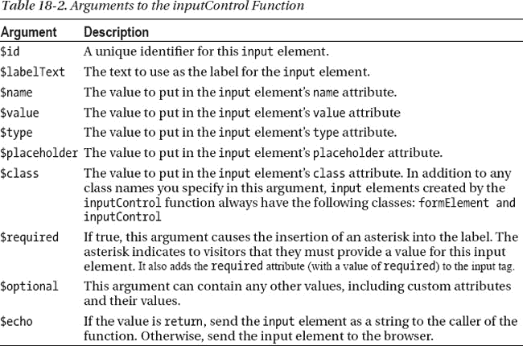

# 十八、表单控件

对于许多网站来说，表单是必不可少的，对于电子商务网站来说更是如此。如果我们不能收集访问者的信息，我们就不能做生意，而表单就是收集信息的机制。因此，如果没有关于表单的章节，我们真的无法完成这本书。

为了构建表单控件，我们必须构建两个控件。表单有内容，所以我们为表单的内容构建了一个控件:fieldset 控件。一个字段集包含`input`元素，所以我们还需要一个控件来构建`input`元素。

 **注**我们没有做实际的表单控件。为了用我们的控件创建一个表单，我们创建了一个`form`元素并使用字段集控件作为子控件。我们在本章后面的“创建表单”一节中提供了一个例子。

像往常一样，我们为一个控件创建了多种处理方式——在表单控件的情况下是暗处理和亮处理。深色处理有一个对角线图案，看起来几乎像灯芯绒(这是周杰伦看到它时说出的第一个词)。我们将在本章后面讨论 CSS 规则时展示如何创建这种效果。

在该表单中，有两组字段。正如我们在本章开始时提到的，我们用 fieldset 控件来构建表单的内容。接下来，我们将展示如何用 fieldset 控件为表单构建字段。因为我们需要字段集中所有常见的`input`元素，我们还将展示如何用输入控件构建它们。

表单控件使用标准的`form`元素，只有一个例外。提交按钮是我们按钮控件的一个实例，在第十三章中有描述。稍后，当我们看到表单控件背后的代码时，我们将展示如何将按钮控件插入表单控件。

我们的表单控件以多种不同的方式提供了良好的性能。第一，我们尽可能的依赖 CSS。正如我们在前面的章节中提到的，浏览器使用 CSS 规则比使用 JavaScript 或任何其他机制更快地呈现内容(事实上，我们在表单控件中根本不使用 JavaScript)。第二，我们在 CSS 规则中使用类名，并避免后代选择器，后者的性能远不如前者。同样，这是我们一贯使用的模式；我们认为随着开发者意识到它的好处，它将变得更加普遍。第三也是最后一点，构建控件来呈现我们的表单在很大程度上加快了开发人员(包括我们自己)的速度。开发人员可以更容易地调用一些函数来创建表单，而不是自己创建表单的所有元素。

最后一项还有另一个好处:封装。如果表单有问题，我们知道应该查看表单控件的代码，而不是查看许多单个的表单。这项技术大大加快了调试速度。当已知问题在一个小空间中时，调试也不那么令人沮丧。减少挫折感实际上并不能提高开发人员的绩效，但无论如何这很好。我们欣赏任何让我们的工作不那么令人沮丧，从而更有趣的事情。

展示往往比讲述更容易、更有效，所以让我们看看这两种处理在渲染时是什么样子的。这样，你就会明白我们所说的“暗”和“亮”是什么意思，也会明白字段集控件、输入控件和按钮控件是如何适应表单的。

如果你想在网上看到表单控件——截图和真实的东西是不一样的——你可以在我们的示例网站上找到它:`[`clikz.us/BookExamples/forms.php`](http://clikz.us/BookExamples/forms.php)`(我们之前提到过，这本书是关于网站的前端——HTML 和 CSS——所以我们网站上的表单不与任何东西挂钩)。

图 18-1 显示了表单控件的暗处理。

***图 18-1。**表单控件的暗处理*

图 18-2 显示了表单控件的光处理。

***图 18-2。**表单控件的光处理*

现在您已经看到了它们是如何在浏览器中呈现的，让我们继续关注呈现的表单处理背后的 HTML。

### HTML

和我们的其他控件一样，这个控件不直接包含 HTML。相反，当页面加载时，PHP 函数会生成 HTML。尽管如此，我们认为看到控件创建的 HTML 提供了样式(CSS)信息的上下文。除了指定使用哪种处理作为类名之外，HTML 不会从深色处理变为浅色处理。CSS 规则(我们很快会谈到)决定了处理之间的所有差异。

HTML 由两个`fieldset`元素组成，每个元素包含一个图例和一些`input`元素。字段集是我们的字段集控件的实例，而`input`元素是我们的输入控件的实例。在第二个字段集的底部，我们放入一个提交按钮，这也是按钮控件的一个实例。

清单 18-1 展示了图 18-1 和图 18-2 中显示的表单控件的 HTML。在这里，它通过`fieldsetTreatment1`类名指定了暗处理。

***清单 18-1。**表单控件两种处理方式背后的 HTML】*

`<fieldset class="fieldset fieldsetTreatment1">
  <legend>
    Contact Info
  </legend>
  

    <label for="id1" class="structure">First Name*</label>
    <input type="text" required="" placeholder="" id="id1" value="" name="first_name">
  

  

    <label for="id2" class="structure">Last Name*</label>
    <input type="text" required="" placeholder="" id="id2" value="" name="last_name">
  

  

    <label for="id3" class="structure">Email*</label>
    <input type="email" required="" placeholder="name@domain.com" id="id3" value="" name="email">
  

  

    <label for="id4" class="structure">Phone</label>
    <input type="tel" placeholder="555-555-1212" id="id4" value="" name="phone">
  

  

    <label class="structure">Gender</label>
    <input type="radio" name="gender" value="men" id="men_5008c8a70057f">
    <label for="men_5008c8a70057f" class="textLabel">Male</label>
    <input type="checkbox" name="gender" value="women" id="women_5008c8a700acd">
    <label for="women_5008c8a700acd" class="textLabel">Female</label>
  

  

    

      We will never share your information.
    

  

</fieldset>
<fieldset class="fieldset fieldsetTreatment1">
  <legend>
    Mailing Address
  </legend>
  

    <label for="aid1" class="structure">Address</label>
    <input type="text" placeholder="" id="aid1" value="" name="address">
  

  

    <label for="aid2" class="structure">City</label>
    <input type="text" placeholder="" id="aid2" value="" name="city">
  

  

    <label class="structure">State</label>
    <select id="aid3">` `      <option value="AL">Alabama</option><option value="AK">Alaska</option><option
value="AZ">Arizona</option><option value="AR">Arkansas</option>
    </select>
  

  

    <label for="aid4" class="structure">Zip Code</label>
    <input type="number" placeholder="" id="aid4" value="" name="zipcode">
  

  

    <a title="Submit" class="button primary glass" href="#">Submit</a>
  

</fieldset>`

由于字段集包含所有其他内容，我们将从字段集控件开始。

### 字段集控件

在我们的工作和本书中，我们大量使用了`fieldset`元素。因为`fieldset`元素可以包含`legend`元素，所以我们用它们来命名表单中的部分。除了`fieldset`和`legend`元素，我们还使用了整个网络社区长期使用的`div`和`input`元素。

与本书中的其他示例控件一样，实际的控件是一个 PHP 函数。该函数有三个参数。表 18-1 描述了它们。

为了将模型中的数据转换成具有正确属性和内容值的 HTML 元素，fieldset 控件首先从模型中获取数据。数据以字符串的形式被解码成 JSON 对象。然后，该函数从数据对象获取字段，并将它们放入一个单独的变量中。接下来，函数创建一个输出变量，它保存函数处理的结果；本质上，输出变量保存一个稳定增长的字符串，该字符串包含 HTML 元素，数据插入到正确的位置。输出变量以`fieldset`元素的开始标签及其`class`属性开始。然后，该函数确定图例值是否存在，如果存在，则向输出变量的字符串添加一个`legend`元素。然后，该函数使用一个`for`循环来读取每个字段。`for`循环有几个 if 语句来识别出现了哪种字段并相应地处理它。对于每个字段，该函数通过调用输入控件(有几个变体)并将调用结果放入输出，将更多的 HTML 元素附加到输出变量的字符串中。接下来，该函数关闭`fieldset`元素。最后，它确定调用是希望将输出字符串发送(回显)到浏览器还是返回到某个其他函数，并执行相应的操作。

我们将在本章后面介绍输入控制和数据的细节。现在，请接受数据可能包含一个图例并且必须包含一些字段，并且对输入控件的每个调用都返回一个在正确位置包含数据的`input`元素。

 **注意**虽然清单 18-2 看起来很大，但是一个包含所有子元素和数据的表单会更大。控件的一个好处(也是使用它们的一个主要动机)是，一旦你有了控件，使用它比从头开始创建等效的功能需要更少的代码。

***清单 18-2。**字段集控件*

`function fieldSetControl($model, $treatment, $echo) {

  $obj = json_decode($model);
  $fields = $obj -> fields;
  $output = '<fieldset class="fieldset ' . $treatment . '">';
  if ($obj -> showLegend) {
    $output .= '<legend>' . $obj -> legend . '</legend>';
  }
  for ($i = 0; $i < sizeof($fields); $i++) {
    $field = $fields[$i];
    if ($field -> formElement == "inputControl") {
      $output .= inputControl($field -> id, $field -> labelName, $field -> name, $field -> value,
$field -> type, $field -> placeholder, $field -> _class, $field -> required, $field -> optional,
$field -> _echo);
    }
    if ($field -> formElement == "inputList") {
      $output .= inputList($field -> model, $field -> labelName, $field -> name, $field -> type,
$field -> _class, $field -> _echo);
    }
    if ($field -> formElement == "inputSelect") {
      $output .= inputSelect($field -> model, $field -> id, $field -> labelName, $field -> _class,
$field -> required, $field -> _echo);
    }
    if ($field -> formElement == "html") {
      $output .= inputHTML($field -> html, $field -> _class, $field -> _echo);
    }
    if ($field -> formElement == "buttons") {
      $output .= inputButtons($field -> buttons, $field -> _class, "return");
    }
  }
  $output .= '</fieldset>';

  if ($echo != "return") {
    echo $output;
  } else {
    return $output;
  }
};`

现在你已经看到了字段集控件，让我们继续看输入控件，字段集控件广泛使用它。

### 输入控件

正如我们在描述字段集控件时所观察到的，输入控件返回一个格式正确的`input`元素(或其他元素；请参阅本节后面的内容)添加到字段集控件(或其他任何名称)。它还可以将其输出直接发送到浏览器，这样就可以在没有 fieldset 控件的情况下使用它。毕竟，`fieldset`元素是可选的，并不总是有用的(比如当一个表单只有一个字段块时)。同样，输入控件是一个 PHP 函数。正如我们已经提到的所有其他控件一样，字段集控件和输入控件都可以很容易地用其他语言编写。我们必须选择一种语言，PHP 赢了，主要是因为我们认为它容易阅读。

输入控件实际上是几个相关的控件；也就是说，输入控件由许多函数组成，每个函数都返回一个填充的元素。让我们从名为`inputControl`的函数开始，它创建了一个`input`元素。

 **注意**并非所有输入控件中的函数都创建`input`元素。该控件的其他功能创建其他元素；它们的存在是为了让我们可以在表单中注入其他元素(特别是按钮和其他元素)。

`inputControl`函数接受许多参数，并将它们转换成适当填充的输入控件。表 18-2 描述了`inputControl`函数的参数。

输入控件通过创建一个输出变量来工作(就像我们的大多数控件一样)，并在该变量中构建一个字符串，该字符串成为一个正确填充的元素。在大多数情况下，它获取其参数的值，并将它们插入到结果`input`元素的相应属性中。`$required`参数需要一点逻辑来处理，因为它在`input`元素中产生两个可选字符串:一个包含星号的 span 和元素属性中的单词“required”。一旦输入控件将所有正确的部分放在正确的位置，它就可以将生成的`input`元素发送给浏览器，或者将包含`input`元素的字符串返回给调用者(在清单 18-2 中，这是我们的字段集控件)。

***清单 18-3。**输入控制功能*

`function inputControl($id, $labelText, $name, $value, $type, $placeholder, $class, $required,
$optional, $echo) {
  $output = '
';
  $output .= '<label class="structure" for="' . $id . '">' . $labelText;
  $output .= ($required == TRUE ? '*' : '');
  $output .= '</label>';
  $output .= '<input type="' . $type . '" name="' . $name . '" value="' . $value . '" id="' .
$id . '" placeholder="' . $placeholder . '"';
  $output .= ($required == TRUE ? ' required = "required"' : '');
  $output .= ' ' . $optional . '/>';
  $output .= '
';
  if ($echo != "return") {
    echo $output;
  } else {
    return $output;
  }
}`

`inputList`函数创建一个包含一组相关`input`元素的`div`，这些元素构成了一组复选框或单选按钮。表 18-3 描述了`inputList`功能的参数。

与控件中的其他函数一样，`inputList`函数构建一个由填充的 HTML 元素和属性组成的字符串。首先，该函数写入包含这个`input`元素列表的`div`元素的开始标签。然后该函数写入`label`元素。为了创建`input`元素，该函数使用一个`for`循环来写入与`$model`参数中的值一样多的`input`元素(以及相应的`label`元素)。该函数将`input`元素写入输出变量后，关闭`div`元素。最后，该函数要么将`div`元素及其所有子元素发送到浏览器，要么将包含所有这些元素的字符串发送回调用者。

***清单 18-4。**输入列表功能*

`function inputList($model, $labelText, $name, $type, $class, $echo) {
  $obj = $model;
  $output = '
';
  $output .= '<label class="structure">' . $labelText . '</label>';
  for ($i = 0; $i < sizeof($obj); $i++) {
    $unique = uniqid($obj[$i] -> value . '_');
    $output .= '<input id="' . $unique . '" value="' . $obj[$i] -> value . '" name="' . $name .
'" type="' . $type . '">';
    $output .= '<label class="textLabel" for="' . $unique . '">' . $obj[$i] -> labeltext . '</
label>';
  }
  $output .= '
';
  if ($echo != "return") {
    echo $output;
  } else {
    return $output;
  }
}`

函数将任意的 HTML 元素插入到一个表单中。表 18-4 描述了`inputHTML`函数的参数。

最简单的输入控制函数，`inputHTML`函数只是创建一个`div`，设置在`$class`参数中指定的任何类，并将`$html`参数的内容放入`div`。然后，如果`$echo`参数是`return`，它将包含插入的 HTML 的`div`发送给调用者，或者，如果`$echo`参数是其他任何参数，它将输出`div`及其内容作为字符串发送给浏览器。

***清单 18-5。**input html 函数*

`function inputHTML($html, $class, $echo) {
  $output = '
';
  $output .= $html;
  $output .= '
';
  if ($echo != "return") {
    echo $output;
  } else {` `    return $output;
  }
}`

函数的作用是:在一个表单中插入一个或多个按钮控件。这是另一个在控件中使用控件的例子，就像我们经常做的那样。表 18-5 描述了`inputButtons`函数的参数。

按照我们通常对`control`函数的范例，`inputButtons`函数首先创建一个输出变量，并将`div`元素的开始标记(包括类信息)写入该输出变量。然后，它使用一个`for`循环遍历数据，并为输入数据中指定的每个按钮创建一个按钮控件(参见第十三章)。然后关闭包含按钮控件的`div`元素。最后，如果`$echo`参数是`return`，它将输出发送给调用者，或者，如果`$echo`参数是其他任何参数，则将输出作为字符串发送给浏览器。

***清单 18-6。**输入按钮功能*

`function inputButtons($model, $class, $echo) {
  $output = '
';
  for ($j = 0; $j < sizeof($model); $j++) {
    $obj = $model[$j];
    $output .= button($obj -> text, $obj -> href, $obj -> id, $obj -> text, $obj -> type, NULL,
NULL, NULL, NULL, "return");
  }
  $output .= '
';
  if ($echo != "return") {
    echo $output;
  } else {
    return $output;
  }
}`

函数在一个表单中创建一个互斥选项列表。为此，它创建了一个包含一个`select`元素的`div`。`select`元素包含与数据中存在的`option`元素一样多的元素。表 18-6 描述了`inputSelect`功能的参数。

`inputSelect`函数插入一个`div`元素的开始标签，并在`div`元素上设置类。然后该函数添加标签和`select`元素的开始标记。接下来，该函数使用一个`for`循环遍历`$model`参数中的数据，并为数据中的每个值创建一个`option`元素。接下来，该函数关闭`select`和`div`元素。最后，如果`$echo`参数是`return`，它将结果 div 元素和它包含的列表发送给调用者，或者，如果`$echo`参数是其他任何东西，则将`div`元素和它包含的列表作为字符串发送给浏览器。

***清单 18-7。**输入选择功能*

`function inputSelect($model, $id, $labelText, $class, $echo) {
  $output = '
';
  $output .= '<label class="structure">' . $labelText . '</label>';
  $output .= '<select id="' . $id . '">';
  for ($i = 0; $i < sizeof($model); $i++) {
    $output .= '<option value="' . $model[$i] -> value . '">' . $model[$i] -> label .
'</option>';
  }
  $output .= '</select>';
  $output .= '
';
  if ($echo != "return") {
    echo $output;
  } else {
    return $output;
  }
}`

### 数据对象

因为表单中有两个字段集控件，所以我们需要两组数据，一组用于联系信息，一组用于地址信息。在实际应用中，我们从数据库中获取这些数据。然而，由于我们坚持前端，我们只使用静态数据。每个数据块由一个包含 JSON 对象的 PHP 变量组成。JSON 对象包含三个值。表 18-7 描述了提供给字段集控件的 JSON 对象中的值。

清单 18-8 显示了为`contact`块提供数据的 JSON 对象的内容。同样，我们通常会从一个从数据库获取值的对象中获取数据，并构建一个 JSON 对象，然后将该对象传递给我们的 fieldset 控件。

***清单 18-8。**端子块的数据*

`$contactInfo = '{
  "showLegend" : true,
  "legend" : "Contact Info",
  "fields" : [
     {
       "formElement" : "inputControl",
       "id": "id1",
        "labelName" : "First Name",
       "name" : "first_name",
       "value" : "",
       "type" : "text",
       "placeholder" : "",
       "_class" : "",
       "required" : true,
       "optional" : "",
       "_echo" : "return"
     },
     {
       "formElement" : "inputControl",` `       "id": "id2",
       "labelName" : "Last Name",
       "name" : "last_name",
       "value" : "",
       "type" : "text",
       "placeholder" : "",
       "_class" : "",
       "required" : true,
       "optional" : "",
       "_echo" : "return"
     },
     {
       "formElement" : "inputControl",
       "id": "id3",
       "labelName" : "Email",
       "name" : "email",
       "value" : "",
       "type" : "email",
       "placeholder" : "name@domain.com",
       "_class" : "",
       "required" : true,
       "optional" : "",
       "_echo" : "return"
     },
     {
       "formElement" : "inputControl",
       "id": "id4",
       "labelName" : "Phone",
       "name" : "phone",
       "value" : "",
       "type" : "tel",
       "placeholder" : "555-555-1212",
       "_class" : "",
       "required" : false,
       "optional" : "",
       "_echo" : "return"
     },
     {
       "formElement" : "inputList",
       "model": [{"value" : "men", "labeltext" : "Male"},{"value" : "women", "labeltext" :
"Female"}],
      "labelName" : "Gender",
      "name" : "gender",
      "type" : "checkbox",
      "_class" : "",
      "_echo" : "return"
    },
    {
      "formElement" : "html",
      "html" : "
We will never share your information.
",
      "_class" : "",
      "_echo": "return"
    }
  ]
}';`

清单 18-9 显示了为`address`块提供数据的 JSON 对象的内容。正如我们之前提到的，我们通常从一个对象获取数据，该对象从数据库获取值并构建一个 JSON 对象，然后将该对象传递给我们的 fieldset 控件。

***清单 18-9。**地址块的数据*

`$addressInfo = '{
  "showLegend" : true,` `"legend" : "Mailing Address",
  "fields" : [
     {
       "formElement" : "inputControl",
       "id": "aid1",
       "labelName" : "Address",
       "name" : "address",
       "value" : "",
       "type" : "text",
       "placeholder" : "",
       "_class" : "",
       "required" : false,
       "optional" : "",
       "_echo" : "return"
     },
     {
       "formElement" : "inputControl",
       "id": "aid2",
       "labelName" : "City",
       "name" : "city",
       "value" : "",
       "type" : "text",
       "placeholder" : "",
       "_class" : "",
       "required" : false,
       "optional" : "",
       "_echo" : "return"
     },
     {
       "formElement" : "inputSelect",
       "id": "aid3",
       "labelName" : "State",
       "model" : [{"label": "Alabama", "value" : "AL"},{"label": "Alaska", "value" :
 "AK"},{"label": "Arizona", "value" : "AZ"},{"label": "Arkansas", "value" : "AR"}],
       "_class" : "",
       "required" : false,
       "optional" : "",
       "_echo" : "return"` `     },
     {
       "formElement" : "inputControl",
       "id": "aid4",
       "labelName" : "Zip Code",
       "name" : "zipcode",
       "value" : "",
       "type" : "number",
       "placeholder" : "",
       "_class" : "",
       "required" : false,
       "optional" : "",
       "_echo" : "return"
     },
     {
       "formElement": "buttons",
       "buttons" : [
         {
           "text": "Submit",
           "href": "#",
           "id" : "bid1",
           "type" : "primaryGlass",
           "_echo" : "return"
        }
      ]
    }
  ]
}';`

### 创建表单

正如本章开始时提到的，我们并没有制作一个实际的表单控件。相反，我们制作了提供表单内容的控件。所以要制作一个表单，我们创建一个普通的`form`元素，然后使用我们的控件。我们在本章中使用的例子在`form`元素中有两个字段集控件。我们也可以在`form`元素中使用输入控件。但是，在示例中我们不需要这样做。相反，输入控件位于字段集控件内。我们的示例还使用了两种形式，一种用于暗处理，一种用于亮处理。清单 18-10 展示了我们如何创建用作样本的表单。

***清单 18-10。**创建我们的样本表单*

`

  <h1>Form Treatment 1</h1>
  <form class="form formTreatment1">
    <?php fieldSetControl($contactInfo, "fieldsetTreatment1"); ?>
    <?php fieldSetControl($addressInfo, "fieldsetTreatment1"); ?>
  </form>

  <h1>Form Treatment 2</h1>
  <form class="form formTreatment2">
    <?php fieldSetControl($contactInfo, "fieldsetTreatment2"); ?>
    <?php fieldSetControl($addressInfo, "fieldsetTreatment2"); ?>
  </form>

`

### CSS

正如我们所有的控件一样，处理之间的差异完全出现在驱动不同处理的 CSS 规则中。除了指定处理的名称(`fieldsetTreatment1`为暗处理，`fieldsetTreatment2`为亮处理)，处理之间的函数和数据没有任何变化。像往常一样，我们将单独评论大多数 CSS 规则，尽管我们可能会把一些更明显的规则放在一起。

清单 18-11 展示了我们如何将`fieldset`元素的边距和填充值设置为零(0 ),这样这些设置就可以应用到字段集控件中的所有元素。

***清单 18-11。**移除边距和填充*

`.fieldset {
  margin: 0;
  padding: 0;
}`

清单 18-12 展示了我们如何在标签后插入冒号。

***清单 18-12。**在标签后插入冒号*

`.fieldset label.structure:after {
  content: ":";
}`

清单 18-13 展示了我们如何设置星号，我们用它来表示一个项目需要红色，并设置一点填充来防止星号进入标签的文本。

***清单 18-13。**样式化所需的星号*

`.required {
  color: red;
  padding: 2px;
}`

清单 18-14 展示了我们如何为暗处理设计表单的样式。从本质上讲，这条规则设计了保存表单中所有内容的框的样式。因为`formTreatment1`有一个深色的背景图像，我们将文本设置为白色。然后我们设置文本阴影、填充、边框半径(创建圆角)、框阴影和边框。在这个过程中，我们将背景剪辑(CSS 3 的一个属性)设置为`padding-box`，这样可以将背景从边框中分离出来。我们还确保表单显示为一个块，并将宽度设置为 400 像素。我们还将`position`属性的值设置为`relative`，因为我们稍后将在表单中设置带有`absolute`定位的元素。最后，我们将背景图像设置为小的(边长 7 像素)图像，这给了我们“灯芯绒”的效果。

***清单 18-14。**为暗处理设计表单元素*

`.formTreatment1 {
  color: white;
  text-shadow: 0 0 2px black;
  padding: 20px;
  -webkit-border-radius: 10px;
  -moz-border-radius: 10px;
  border-radius: 10px;
  -moz-background-clip: padding;
  -webkit-background-clip: padding-box;
  background-clip: padding-box;
  -webkit-box-shadow: inset 1px 1px 1px #777777;
  -moz-box-shadow: inset 1px 1px 1px #777777;` `  box-shadow: inset 1px 1px 1px #777777;
  border: 1px solid rgba(0, 0, 0, 0.2);
  background: #CCC;
  display: block;
  position: relative;
  width: 400px;
  background: #ffffff url(/img/background_stripped.png);
}`

清单 18-15 显示了我们如何在表单周围添加一个额外的边框来提供更多的视觉吸引力。为此，我们使用`before`伪选择器，将`position`属性的值设置为`absolute`，然后将`top`属性和`left`属性的值都设置为-10 像素。然后将填充和边框设置为 10 像素，并创建一个 10 像素的阴影，这样我们就得到一个 10 像素宽的表单包装。为了使包装器可见，我们还将其`z-index`值设置为 1。

***清单 18-15。**在表单周围添加一个 10 像素的包装*

`.formTreatment1:before {
  content: "";
  width: 100%;
  height: 100%;
  display: block;
  z-index: -1;
  position: absolute;
  padding: 10px;
  background: #CCC;
  left: -10px;
  top: -10px;
  -webkit-border-radius: 10px;
  -moz-border-radius: 10px;
  border-radius: 10px;
  -moz-background-clip: padding;
  -webkit-background-clip: padding-box;
  background-clip: padding-box;
  -webkit-box-shadow: inset 0px 0px 4px rgba(0, 0, 0, 0.4), inset 0 10px 2px rgba(255, 255, 255,
0.4), 2px 2px 2px rgba(0, 0, 0, 0.4);
  -moz-box-shadow: inset 0px 0px 4px rgba(0, 0, 0, 0.4), inset 0 10px 2px rgba(255, 255, 255,
0.4), 2px 2px 2px rgba(0, 0, 0, 0.4);
  box-shadow: inset 0px 0px 4px rgba(0, 0, 0, 0.4), inset 0 10px 2px rgba(255, 255, 255, 0.4),
2px 2px 2px rgba(0, 0, 0, 0.4);
}`

清单 18-16 显示了我们如何禁用 IE9 之前的 IE 浏览器版本的包装器。旧版本的浏览器不能正确呈现包装器；宁可什么都没有，也不要一团糟，我们关闭了这些版本的包装器。

***清单 18-16。**关闭 IE9 之前版本的 IE 浏览器的包装器。*

`.lt-ie9 .formTreatment1:before {
  display: none;
}`

清单 18-17 展示了我们如何为暗处理(由`fieldsetTreatment1`标识)设计一个字段集控件的样式。由于我们将它用作其他元素(主要是用作按钮的`input`元素和`anchor`元素)周围的外部元素，所以我们希望`padding`值为 0，希望`position`值为`relative`。我们还将`border`值设置为`none`，并添加 10 像素的底部边距(以使字段集远离任何后续元素)。

***清单 18-17。**造型暗场处理*

`.fieldsetTreatment1 {
  padding: 0px;
  position: relative;
  border: none;
  margin-bottom: 10px;
}`

清单 18-18 展示了我们如何在一个字段集中设置`legend`元素的样式。我们将左边的`padding`值设置为 10 像素，让文本稍微缩进一些。我们还设置顶部和底部的`padding`值为 5 像素，以防止文本进入其他元素。我们可以忽略右边的`padding`值，所以我们将其设置为 0。我们还在文本上创建一条白色实线，在字段集控件和它前面的任何控件之间提供一个边界。(虽然线条是在应用于`legend`元素的样式中定义的，但它具有为字段集控件创建顶部边界的效果，因为`legend`元素是字段集控件中的第一个元素。)因为我们不希望`legend`元素是块以外的任何东西，所以我们将`display`属性的值设置为`block`并添加了`!important`说明符。我们还将字体粗细设置为粗体(人们看不到的图例有什么用？)并将底部边距设置为 20 像素，以避免字段拥挤。我们喜欢白色空间(或灯芯绒空间，在这种情况下)。我们还将`position`的值设置为`relative`；我们在下一个规则的描述中解释了为什么我们需要这个设置。

***清单 18-18。**造型图例元素*

`.fieldsetTreatment1 legend {
  padding: 5px 0 5px 10px;
  font-weight: bold;
  border-top: 2px solid white;
  display: block !important;
  width: 100%;
  margin-bottom: 20px;
  position: relative;
}`

清单 18-19 展示了我们如何在线的左端得到一个圆(Jay 称之为旋钮)。为了创建这个明显的空圆圈(它实际上并不空，但看起来是空的)，我们对`legend`元素应用了`before`和`after`伪选择器。`before`伪选择器通过创建圆形边框，将`position`值设置为`absolute`，将`top`和`left`值设置为-7 像素，并将宽度和高度设置为 14 像素，来创建一个直径为 14 像素的圆。因为我们将背景颜色设置为白色，所以我们得到一个白色的圆圈。如果我们什么都不做，我们会有一个白色的圆圈。还记得将`legend`元素上的`position`属性设置为`relative`吗？如果我们不将值设置为`relative`，这条线看起来会以一个偏移量连接到圆，而不是在圆的中心。我们在下一个规则中展示了我们是如何得到一个看似空的圆的。

***清单 18-19。**在图例元素上方的直线左端添加圆*

`.fieldsetTreatment1 legend:before {
  content: '';` `  width: 14px;
  height: 14px;
  position: absolute;
  top: -7px;
  left: -7px;
  background: white;
  -webkit-border-radius: 100%;
  -moz-border-radius: 100%;
  border-radius: 100%;
  -moz-background-clip: padding;
  -webkit-background-clip: padding-box;
  background-clip: padding-box;
}`

清单 18-20 展示了我们如何使`legend`元素上方的行尾的圆看起来是空心的。在`legend:before`伪选择器清单中，我们展示了如何在`legend`元素上方的行尾画一个圆。正如清单 18-20 的描述中提到的，如果我们不做进一步的工作，我们会有一个实心的白色圆圈。我们在`legend:after`伪选择器中处理这个问题。为了创建一个似乎被描边但没有被填充的圆(或者换句话说，看起来是空的)，我们添加了另一个以我们的灯芯绒图像为背景的圆。这次，我们做一个 10 像素宽的圆。因为另一个圆的宽度是 14 像素，所以我们得到的是一个 2 像素描边、无填充的圆的外观。让圆排成一行的技巧是对`left`和`top`属性使用绝对定位和负偏移。这样，两个圆的中心都在同一位置。此外，因为圆的描边为 2，所以构成圆的线条与图例文本上方的线条宽度相同。

在一条线的末端得到一个旋钮需要很多样式。不过，我们认为值得花费时间和带宽，为我们的表单增添一点活力。

***清单 18-20。**做一个看起来空空如也的圆圈*

`.fieldsetTreatment1 legend:after {
  content: '';
  width: 10px;
  height: 10px;
  position: absolute;
  top: -5px;
  left: -5px;
  background: url(/img/background_stripped.png);
  -webkit-border-radius: 100%;
  -moz-border-radius: 100%;
  border-radius: 100%;
  -moz-background-clip: padding;
  -webkit-background-clip: padding-box;
  background-clip: padding-box;
}`

清单 18-21 展示了我们如何为`form`元素设置填充。我们将所有`form`元素的顶部和底部填充设置为 4 个像素，将左侧和右侧填充设置为 0。

***清单 18-21。**设置表单元素的填充*

`.fieldsetTreatment1 .formElement {
  padding: 4px 0;
}`

清单 18-22 展示了我们如何为`form`元素设计标签样式。我们将宽度设置为 150 像素，以便为大多数标签提供足够的空间。较长的标签换行到两行，这种情况应该很少发生，发生时看起来也不差。我们还将对齐方式设置为右对齐，使标签紧挨着它所属的字段。然后，我们将右边的填充值设置为 4 个像素，因为我们不想让标签挤满它的字段。最后，我们将`display`属性的值设置为`inline-block`，因为否则我们无法设置`width`值。

 **提示**如果你必须支持多种语言的标签，考虑将标签放在字段上方。与大多数其他语言相比，英语相当简洁。法语或其他语言的相同标签可能更长。此外，英语比许多其他语言使用更短的单词。有时，德语中的同一个标签是一个单词，并且很长，以至于在单词分隔符之前溢出了标签空间。虽然这种情况很少见，但我们在为跨国客户工作时遇到过，因为这种问题，在最后一刻重新安排标签一点也不好玩。光处理将标签放在字段上方，因此我们可以将这种处理用于国际站点。

***清单 18-22。**为表单元素设计标签样式*

`.fieldsetTreatment1 label.structure {
  width: 150px;
  text-align: right;
  padding-right: 4px;
  display: inline-block;
}`

清单 18-23 展示了我们如何为暗处理设计`input`元素的样式。为了与圆角主题保持一致，我们通过设置不同的`border-radius`值来为`input`元素创建圆角(我们需要几个值来适应不同的浏览器)。然后，我们将`background-clip`的值设置为`padding-box`，以使字段不出现在拐角处。接下来，我们设置一个 1 像素的中灰色边框。之后，我们将填充设置为 4 或 5 个像素，这取决于边长(一些实验使我们认为这些值看起来最好，以防您想知道为什么我们有不同的值)。最后，我们设置`box-shadow`值来提供一种深度感。

***清单 18-23。**深色处理的造型输入元素*

`.fieldsetTreatment1 .inputControl input {
  -webkit-border-radius: 5px;
  -moz-border-radius: 5px;
  border-radius: 5px;
  -moz-background-clip: padding;
  -webkit-background-clip: padding-box;
  background-clip: padding-box;
  border: 1px solid #999;
  padding: 5px 5px 4px 4px;
  -webkit-box-shadow: inset 1px 1px 1px #999999;
  -moz-box-shadow: inset 1px 1px 1px #999999;` `  box-shadow: inset 1px 1px 1px #999999;
}`

清单 18-24 显示了我们如何设置复选框和单选按钮的边距。我们将右边距设置为 3 个像素，这样复选框或单选按钮与其标签之间就有了一点间隔。因为不同的浏览器处理复选框周围的间距不同，所以我们也将填充设置为 0(我们使用边距来获得我们想要的间距)。

***清单 18-24。**设置复选框和单选按钮的边距*

`.fieldsetTreatment1 .inputList input[type="checkbox"], .fieldsetTreatment1 .inputList input[type="radio"] {
  margin: 0 3px 0 0;
  padding: 0;
}`

清单 18-25 展示了我们如何将复选框或单选按钮标签的右填充设置为 10 像素，从而在标签和下一个复选框或单选按钮之间留出一些空间。

***清单 18-25。**设置复选框或单选按钮标签的右填充*

`.fieldsetTreatment1 .inputList .textLabel {
  padding-right: 10px;
}`

清单 18-26 展示了我们如何将输入列表中最后一个复选框或单选按钮的右填充设置为 0。当最后一个标签靠近列表内容区域的右边缘时，此设置可防止意外换行。虽然不是绝对必要的，但是包含它是一个很好的做法。

***清单 18-26。**将复选框或单选按钮的最后一个标签的右填充设置为 0*

`.fieldsetTreatment1 .inputList .textLabel:last-child {
  padding-right: 0;
}`

清单 18-27 显示了我们如何将`text`元素插入到字段集中，使其与字段集中的字段对齐。因为标签有 150 个像素的宽度(见清单 18-22 )和 4 个像素的填充，并且因为填充与字段的边缘重叠了 1 个像素(因为我们在字段上放置了边界)，我们得到字段集中`text`元素的左填充值为 153 个像素。

***清单 18-27。**用字段排列短信*

`.fieldsetTreatment1 .textMessage {
  padding-left: 153px;
}`

清单 18-28 展示了我们如何让按钮与`field`元素对齐。清单 18-26 中规定 153 像素的问题同样适用于此。基本上，在计算了标签的宽度和填充后，结合字段边缘的工作方式，我们最终得到 153 像素。

***清单 18-28。**将按钮与字段对齐*

`.fieldsetTreatment1 .buttonWrap {
  padding-left: 153px;
}`

清单 18-29 展示了我们如何为光处理(`fieldsetTreatment2`)设置字段集的样式。首先，我们设置一个 3 像素的中灰色上边框。然后，我们在顶部设置 15 个像素的填充，以在顶部边框和字段集的内容之间提供空间。接下来，我们设置一个 20 像素的下边框，在字段集的底部和字段集后面的内容之间提供空间。最后，我们将左填充设置为 20 像素，以缩进字段集中的元素。顶部边框出现在`legend`元素的后面，因为字段集的边缘穿过了`legend`元素的中间(这是其设计者的意图)。我们可以通过填充值来改变它，但是我们喜欢它现在的样子。

***清单 18-29。**为光疗设计场景*

`.fieldsetTreatment2 {
  border-top: 3px solid #777;
  padding-top: 15px;
  margin-bottom: 20px;
  padding-left: 20px;
}`

清单 18-30 展示了我们如何在字段集控件的光照处理中设计`legend`元素的样式。我们创建一个 1 点的中灰色实心边框。然后我们设置左边距为 0 像素。接下来，我们将上下填充设置为 4 像素，左右填充设置为 10 像素，以使文本远离边框。然后，我们指定圆角，并将`background-clip`属性设置为`padding-box`，这样可以防止背景超出边框。最后，我们将背景设置为渐变，这是用 IE9 的 SVG 图像定义的。指定渐变以使其在尽可能多的浏览器中工作需要大量的属性。

***清单 18-30。**用光处理为字段集设计图例*

`.fieldsetTreatment2 legend {
  border: 1px solid #777;
  margin-left: 0px;
  padding: 4px 10px;
  -webkit-border-radius: 4px;
  -moz-border-radius: 4px;
  border-radius: 4px;
  -moz-background-clip: padding;
  -webkit-background-clip: padding-box;
  background-clip: padding-box;
  background: #cfeaf7;
  background: url(data:image/svg+xml;base64,PD94bWwgdmVyc2lvbj0iMS4wIiA/Pgo8c3ZnIHhtbG5zPSJodHRw
Oi8vd3d3LnczLm9yZy8yMDAwL3N2ZyIgd2lkdGg9IjEwMCUiIGhlaWdodD0iMTAwJSIgdmlld0JveD0iMCAwIDEgMSIgcHJl
c2VydmVBc3BlY3RSYXRpbz0ibm9uZSI+CiAgPGxpbmVhckdyYWRpZW50IGlkPSJncmFkLXVjZ2ctZ2VuZXJhdGVkIiBncmFk
aWVudFVuaXRzPSJ1c2VyU3BhY2VPblVzZSIgeDE9IjAlIiB5MT0iMCUiIHgyPSIwJSIgeTI9IjEwMCUiPgogICAgPHN0b3Ag
b2Zmc2V0PSIwJSIgc3RvcC1jb2xvcj0iI2NmZWFmNyIgc3RvcC1vcGFjaXR5PSIxIi8+CiAgICA8c3RvcCBvZmZzZXQ9IjUw
JSIgc3RvcC1jb2xvcj0iI2JkZGRlZCIgc3RvcC1vcGFjaXR5PSIxIi8+CiAgICA8c3RvcCBvZmZzZXQ9IjUxJSIgc3RvcC1j
b2xvcj0iI2I3ZDFlMiIgc3RvcC1vcGFjaXR5PSIxIi8+CiAgICA8c3RvcCBvZmZzZXQ9IjEwMCUiIHN0b3AtY29sb3I9IiNj
YWUxZjciIHN0b3Atb3BhY2l0eT0iMSIvPgogIDwvbGluZWFyR3JhZGllbnQ+CiAgPHJlY3QgeD0iMCIgeT0iMCIgd2lkdGg9
IjEiIGhlaWdodD0iMSIgZmlsbD0idXJsKCNncmFkLXVjZ2ctZ2VuZXJhdGVkKSIgLz4KPC9zdmc+);
  background: -moz-linear-gradient(top, #cfeaf7 0%, #bddded 50%, #b7d1e2 51%, #cae1f7 100%);
  background: -webkit-gradient(linear, left top, left bottom, color-stop(0%, #cfeaf7),
color-stop(50%, #bddded), color-stop(51%, #b7d1e2), color-stop(100%, #cae1f7));
  background: -webkit-linear-gradient(top, #cfeaf7 0%, #bddded 50%, #b7d1e2 51%, #cae1f7 100%);
  background: -o-linear-gradient(top, #cfeaf7 0%, #bddded 50%, #b7d1e2 51%, #cae1f7 100%);` `  background: -ms-linear-gradient(top, #cfeaf7 0%, #bddded 50%, #b7d1e2 51%, #cae1f7 100%);
  background: linear-gradient(to bottom, #cfeaf7 0%, #bddded 50%, #b7d1e2 51%, #cae1f7 100%);
  filter: progid:dximagetransform.microsoft.gradient(startColorstr='#cfeaf7', endColorstr='#cae1f
7', GradientType=0);
}`

清单 18-31 展示了我们如何在字段集控件的光照处理中设计一个`form`元素(`input`元素、`text`元素或按钮)。我们将上下填充设置为 5 像素，左右填充设置为 0。顶部和底部的衬垫防止`form`元素相互碰撞。我们还将`overflow`属性的值设置为`hidden`，这样零散的文本就不会出现在`form`元素之外。

***清单 18-31。**光处理内的造型元素*

`.fieldsetTreatment2 .formElement {
  padding: 5px 0;
  overflow: hidden;
}`

清单 18-32 展示了我们如何在字段集控件的光线处理中为`form`元素设计标签样式。首先，我们确保`display`的值是`block`。然后，我们指定圆角，并将`background-clip`属性的值设置为`padding-box`，以使背景远离边界。然后我们用 SVG 指定一个背景图像，在标签后面创建一个渐变。和以往一样，创建跨浏览器渐变需要很多属性。然后，我们将文本颜色设置为深灰色。接下来，我们将`float`属性的值设置为`left`，以防止背景和边框跨越整个内容区域。因为我们将`float`的值设置为`left`，所以我们必须将`clear`属性的值设置为`both`，这样标签就可以保留在自己的行上。然后，我们将大多数填充值设置为 10 像素，以便在标签文本和边框之间提供足够的空间。但是，我们将底部填充设置为两个像素，以加强标签和字段之间的联系。同样为了加强这种联系，我们在标签内容区域的底部创建了一个阴影，这使得标签和字段看起来不仅仅是接触，而是彼此相连。

***清单 18-32。**为光处理*中的`form`元素设计标签

`.fieldsetTreatment2 .structure {
   display: block;
   -webkit-border-top-right-radius: 5px;
   -webkit-border-bottom-right-radius: 0;
   -webkit-border-bottom-left-radius: 0;
   -webkit-border-top-left-radius: 5px;
   -moz-border-radius-topright: 5px;
   -moz-border-radius-bottomright: 0;
   -moz-border-radius-bottomleft: 0;
   -moz-border-radius-topleft: 5px;
   border-top-right-radius: 5px;
   border-bottom-right-radius: 0;
   border-bottom-left-radius: 0;
   border-top-left-radius: 5px;
   -moz-background-clip: padding;
   -webkit-background-clip: padding-box;
   background-clip: padding-box;
   background: #f6f8f9;
   background: url(data:image/svg+xml;base64,PD94bWwgdmVyc2lvbj0iMS4wIiA/Pgo8c3ZnIHhtbG5zPSJodHRw` `Oi8vd3d3LnczLm9yZy8yMDAwL3N2ZyIgd2lkdGg9IjEwMCUiIGhlaWdodD0iMTAwJSIgdmlld0JveD0iMCAwIDEgMSIgcHJl
c2VydmVBc3BlY3RSYXRpbz0ibm9uZSI+CiAgPGxpbmVhckdyYWRpZW50IGlkPSJncmFkLXVjZ2ctZ2VuZXJhdGVkIiBncmFk
aWVudFVuaXRzPSJ1c2VyU3BhY2VPblVzZSIgeDE9IjAlIiB5MT0iMCUiIHgyPSIwJSIgeTI9IjEwMCUiPgogICAgPHN0b3Ag
b2Zmc2V0PSIwJSIgc3RvcC1jb2xvcj0iI2Y2ZjhmOSIgc3RvcC1vcGFjaXR5PSIxIi8+CiAgICA8c3RvcCBvZmZzZXQ9IjUw
JSIgc3RvcC1jb2xvcj0iI2U1ZWJlZSIgc3RvcC1vcGFjaXR5PSIxIi8+CiAgICA8c3RvcCBvZmZzZXQ9IjUxJSIgc3RvcC1j
b2xvcj0iI2Q3ZGVlMyIgc3RvcC1vcGFjaXR5PSIxIi8+CiAgICA8c3RvcCBvZmZzZXQ9IjEwMCUiIHN0b3AtY29sb3I9IiNm
NWY3ZjkiIHN0b3Atb3BhY2l0eT0iMSIvPgogIDwvbGluZWFyR3JhZGllbnQ+CiAgPHJlY3QgeD0iMCIgeT0iMCIgd2lkdGg9
IjEiIGhlaWdodD0iMSIgZmlsbD0idXJsKCNncmFkLXVjZ2ctZ2VuZXJhdGVkKSIgLz4KPC9zdmc+);
  background: -moz-linear-gradient(top, #f6f8f9 0%, #e5ebee 50%, #d7dee3 51%, #f5f7f9 100%);
  background: -webkit-gradient(linear, left top, left bottom, color-stop(0%, #f6f8f9), color-
stop(50%, #e5ebee), color-stop(51%, #d7dee3), color-stop(100%, #f5f7f9));
  background: -webkit-linear-gradient(top, #f6f8f9 0%, #e5ebee 50%, #d7dee3 51%, #f5f7f9 100%);
  background: -o-linear-gradient(top, #f6f8f9 0%, #e5ebee 50%, #d7dee3 51%, #f5f7f9 100%);
  background: -ms-linear-gradient(top, #f6f8f9 0%, #e5ebee 50%, #d7dee3 51%, #f5f7f9 100%);
  background: linear-gradient(to bottom, #f6f8f9 0%, #e5ebee 50%, #d7dee3 51%, #f5f7f9 100%);
  filter: progid:dximagetransform.microsoft.gradient(startColorstr='#f6f8f9', endColorstr='#f5f7f
9', GradientType=0);
  color: #333;
  float: left;
  clear: both;
  padding: 2px 10px 2px 10px;
  -webkit-box-shadow: inset 0 0 3px rgba(0, 0, 0, 0.4);
  -moz-box-shadow: inset 0 0 3px rgba(0, 0, 0, 0.4);
  box-shadow: inset 0 0 3px rgba(0, 0, 0, 0.4);
  font-size: 12px;
}`

清单 18-33 展示了我们如何防止无关的文本被插入标签中。因为`.fieldset label.structure:after`规则(见清单 18-12 )插入了一个冒号，我们需要在这里覆盖这个规则，以防止冒号被插入到光处理的标签中。

***清单 18-33。**在光线处理中为表单元素标签屏蔽无关文本*

`.fieldsetTreatment2 label.structure:after {
  content: "";
}`

清单 18-34 展示了我们如何在光处理中设计一个`input`元素。这种风格适用于由`inputControl`函数创建的`input`元素(参见前面的“输入控制”一节)。在许多方面，`input`元素的样式与其标签的样式相同(参见清单 18-31 )。我们将 float 值设置为`left`，将 clear 值设置为`both`，以防止元素占用过多的空间，但仍然保持它在自己的行上。我们还设置了渐变填充。但是，填充值是不同的。我们将上下填充值设置为 4 个像素，左右填充值设置为 20 个像素，以使访问者输入的值远离边框。我们也没有在场地内设置阴影；这将是没有吸引力的，只会分散游客的注意力。

***清单 18-34。**光处理*中的`input`元素造型

`.fieldsetTreatment2 .inputControl input {

  border: 1px solid #BBB;
  padding: 4px 20px;` `  clear: both;
  float: left;
  -webkit-box-shadow: inset 0 0 3px rgba(0, 0, 0, 0.4);
  -moz-box-shadow: inset 0 0 3px rgba(0, 0, 0, 0.4);
  box-shadow: inset 0 0 3px rgba(0, 0, 0, 0.4);
  background: #EEE;
  background: #e5e5e5;
  background: url(data:image/svg+xml;base64,PD94bWwgdmVyc2lvbj0iMS4wIiA/Pgo8c3ZnIHhtbG5zPSJodHRw
Oi8vd3d3LnczLm9yZy8yMDAwL3N2ZyIgd2lkdGg9IjEwMCUiIGhlaWdodD0iMTAwJSIgdmlld0JveD0iMCAwIDEgMSIgcHJl
c2VydmVBc3BlY3RSYXRpbz0ibm9uZSI+CiAgPGxpbmVhckdyYWRpZW50IGlkPSJncmFkLXVjZ2ctZ2VuZXJhdGVkIiBncmFk
aWVudFVuaXRzPSJ1c2VyU3BhY2VPblVzZSIgeDE9IjAlIiB5MT0iMCUiIHgyPSIwJSIgeTI9IjEwMCUiPgogICAgPHN0b3Ag
b2Zmc2V0PSIwJSIgc3RvcC1jb2xvcj0iI2U1ZTVlNSIgc3RvcC1vcGFjaXR5PSIxIi8+CiAgICA8c3RvcCBvZmZzZXQ9IjEw
MCUiIHN0b3AtY29sb3I9IiNmZmZmZmYiIHN0b3Atb3BhY2l0eT0iMSIvPgogIDwvbGluZWFyR3JhZGllbnQ+CiAgPHJlY3Qg
eD0iMCIgeT0iMCIgd2lkdGg9IjEiIGhlaWdodD0iMSIgZmlsbD0idXJsKCNncmFkLXVjZ2ctZ2VuZXJhdGVkKSIgLz4KPC9z
dmc+);
  background: -moz-linear-gradient(top, #e5e5e5 0%, #ffffff 100%);
  background: -webkit-gradient(linear, left top, left bottom, color-stop(0%, #e5e5e5),
color-stop(100%, #ffffff));
  background: -webkit-linear-gradient(top, #e5e5e5 0%, #ffffff 100%);
  background: -o-linear-gradient(top, #e5e5e5 0%, #ffffff 100%);
  background: -ms-linear-gradient(top, #e5e5e5 0%, #ffffff 100%);
  background: linear-gradient(to bottom, #e5e5e5 0%, #ffffff 100%);
  filter: progid:dximagetransform.microsoft.gradient(startColorstr='#e5e5e5', endColorstr='#fffff
f', GradientType=0);
}`

清单 18-35 展示了我们如何为复选框和单选按钮(匹配`inputList`类)和列表(匹配`selectWrap`样式)设计标签样式。

 **注意**这种样式适用于整个`input`元素的标签，而不是元素内单个选项(复选框或单选按钮)的标签。

因为这些标签不需要背景或阴影(也因为那些属性已经在各种祖先元素中设置好了)，所以我们将那些属性设置为`none`。我们还将`line-height`的值设置为 14 像素，为标签的文本提供足够的空间。

***清单 18-35。**为列表和选择输入元素设计标签*

`.fieldsetTreatment2 .inputList .structure, .fieldsetTreatment2 .selectWrap .structure {
  background: none;
  -webkit-box-shadow: none;
  -moz-box-shadow: none;
  box-shadow: none;
  line-height: 14px;
  filter: none;
}`

清单 18-36 展示了我们如何在复选框、单选按钮(匹配`inputList`类)和列表(匹配`selectWrap`样式)的标签文本后插入一个冒号。

 **注意**和`.fieldsetTreatment2 .inputControl input`样式一样(见清单 18-33 ，这种样式适用于整个`input`元素的标签，而不是元素内单个选项(复选框或单选按钮)的标签。

***清单 18-36。**在列表和选择输入元素的标签后插入冒号*

`.fieldsetTreatment2 .inputList .structure:after, .fieldsetTreatment2 .selectWrap .structure:after
{
   content: ":";
}`

清单 18-37 展示了我们如何确保复选框和单选按钮之间有足够的空间(`inputList`类),以及如何给列表中的选项添加左右填充(`selectWrap`类)。在所有这些情况下，我们将顶部和底部填充设置为 0，将左侧和右侧填充设置为 5 个像素。

***清单 18-37。**对列表内容、单选按钮和复选框的标签进行样式化*

`.fieldsetTreatment2 .inputList .textLabel, .fieldsetTreatment2 .selectWrap .textLabel {
   padding: 0 5px;
}`

清单 18-38 展示了我们如何确保`select`元素的选择箭头在 Internet Explorer 中有一个白色背景。如果没有此规则，选择箭头会出现在选择框的边框中。

***清单 18-38。**确保选择箭头在 ie 浏览器中有白色背景*

`.ie select {
  background: white;
}`

### 制作快捷控件

我们想用一个有用的提示来结束对控件的描述。如果您接受使用控件的想法，您可以创建一些函数来指定一些通常传递给控件的参数。这项技术让您可以制作“快捷控件”，这样您(以及使用您的控件的同事或客户)在使用控件时只需输入较少的内容。我们制作了几个应用于输入控件的例子，但是你可以为我们在本书中介绍的所有控件制作类似的快捷控件。这些快捷控件的另一个好处是，您可以确保相同的`text`(和其他)元素出现在您常用的控件中，为您的站点提供更大的一致性。因此，您从您的测试团队和您的客户那里得到的错误报告会更少。这总是一件好事。

让我们从制作电子邮件`input`元素的控件开始。因为我们可以提供一些值，所以我们得到了一个接受五个参数而不是十个参数的函数。清单 18-38 显示了一个调用`inputControl`函数来创建电子邮件输入框的函数。

***清单 18-39。**一个电子邮件输入控件*

`function emailInput($id, $name, $value, $class, $echo) {  $output = inputControl($id, "Email", $name, $value, "email", "name@domain.com", $class, TRUE, null, "return");  if ($echo != "return") {    echo $output;  } else {    return $output;  }
}`

清单 18-40 显示了一个创建密码`input`元素的快捷控件。在这种情况下，我们可以将参数减少到四个。

***清单 18-40。**一个密码输入控件*

`function passwordInput($id, $name, $class, $echo) {  $output = inputControl($id, "Password",
$name, null, "password", "Type a Unique Password", $class, TRUE, "return");  if ($echo !=
"return") {    echo $output;  } else {    return $output;  }
}`

清单 18-41 显示了一个快捷控件，用于创建一个让访问者重新输入密码的`input`元素。

***清单 18-41。**重新输入密码的控件*

`function reenterPasswordInput($id, $name, $class, $echo) {  $output = inputControl($id, "Reenter
Password", $name, null, "password", "Retype Password Exactly", $class, TRUE, "return");  if
($echo != "return") {    echo $output;  } else {    return $output;  }
}`

我们希望你能从例子中看到如何轻松地创建自己的快捷控件库。

### 总结

这一大章讲述了如何制作控件来制作表单中的元素。我们提供了两种治疗方法，光和暗。虽然我们根据它们最显著的视觉特征称它们为浅色和深色，但它们还有其他重要的区别。从可用性的角度来看，最重要的是深色处理在与`input`元素相同的行上有标签，而浅色处理在`input`元素上方有标签。正如我们在本章正文中提到的，这种区别可能会使轻度处理更适合国际访问者经常访问的网站。

我们还展示了如何使用`before`和`after`伪选择器来创建两种效果:一个围绕元素的包装器(我们在`form`元素的黑色处理周围添加了一个)和一个在线条左侧的空圆(实际上是圆中的圆)。我们发现`before`和`after`伪选择器用得不多，所以我们想用它们展示一些技巧。

在这个过程中，我们展示了一项技术，您可以将它用于我们所有的控件(以及您自己的控件，如果您开始编写控件的话):制作快捷控件。快捷控件实际上只是用指定的一些参数调用其他控件的控件。通过仔细规划，您可以从一个更小的更通用的控件集合中构建一个大型的快捷控件库。让这种范式发挥作用的诀窍是让你的基本控件尽可能具有可扩展性。如果这听起来像面向对象编程，那么你是对的。在面向对象编程中，从一小组基本对象中创建一大组对象是一项常见的任务。

最后，我们想再次强调一个关键点:结构合理的 HTML 和 CSS 提供了巨大的重用潜力和设计灵活性。我们可以通过创建另一个处理(它实际上只是一组 CSS 类和控件中的处理的名称)来快速地将我们的任何控件重新用于我们没有预料到的用途。即使您不接受控件的概念，也要记得编写 HTML，这样就可以用不同的样式表来设计不同的样式。这样，你就可以尽可能地让你的工作“经得起未来的考验”。