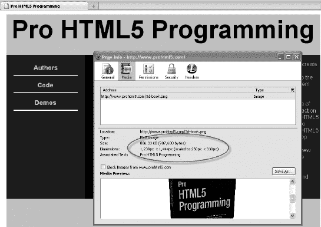
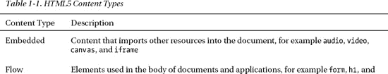
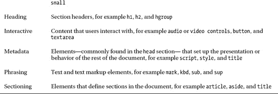
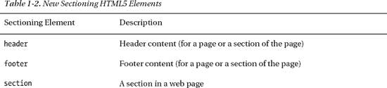
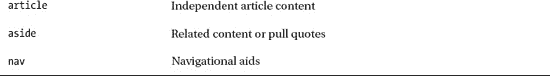
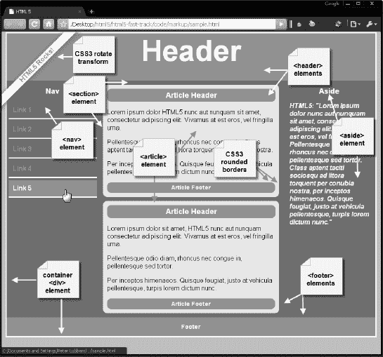
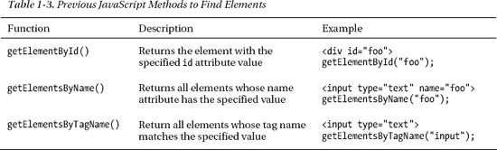
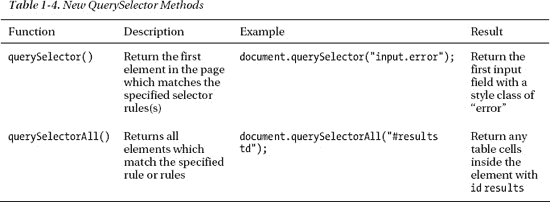
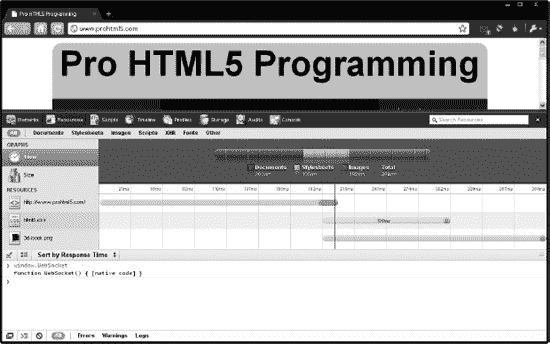
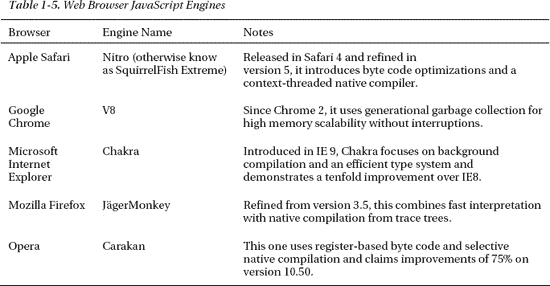

# 一、HTML5 概述

这本书是关于 HTML5 编程的。然而，在理解 HTML5 编程之前，您需要后退一步，理解 HTML5 是什么，它背后的一些历史，以及 HTML 4 和 HTML5 之间的差异。

在这一章中，我们直奔每个人都想得到答案的实际问题。为什么是 HTML5，为什么刚才那么激动？有哪些新的设计原则让 HTML5 真正具有革命性，同时又高度兼容？无插件范例的含义是什么；什么流行什么不流行？HTML 的新特性是什么，它如何为 web 开发人员开启一个全新的时代？我们开始吧。

### 迄今为止的故事 HTML5 的历史

HTML 可以追溯到很久以前。它于 1993 年首次作为互联网草稿发表。90 年代见证了围绕 HTML 的大量活动，出现了 2.0 版、3.2 版和 4.0 版(同一年！)，最后在 1999 年，4.01 版本。在其发展过程中，万维网联盟(W3C)控制了该规范。

在这四个版本快速发布后，HTML 被广泛认为是死胡同；web 标准的焦点转移到了 XML 和 XHTML 上，而 HTML 被放在了次要位置。与此同时，HTML 拒绝消亡，web 上的大多数内容继续作为 HTML 提供服务。为了启用新的 web 应用并解决 HTML 的缺点，HTML 需要新的特性和规范。

为了将网络平台提升到一个新的高度，一小群人在 2004 年成立了网络超文本应用工作组(WHATWG)。他们创建了 HTML5 规范。他们还开始开发专门针对网络应用的新功能——他们认为这是最缺乏的领域。大约在这个时候，Web 2.0 这个术语被创造出来。这真的像是第二个新网站，静态网站让位于需要更多功能的更动态的社交网站——更多的功能。

W3C 在 2006 年再次参与 HTML，并在 2008 年发布了 HTML5 的第一个工作草案，XHTML 2 工作组在 2009 年停止了工作。又过了两年，这就是我们今天的处境。因为 HTML5 解决了非常实际的问题(您将在后面看到)，浏览器供应商正在狂热地实现它的新特性，尽管规范还没有完全锁定。浏览器的实验反馈并改进了规范。HTML5 正在快速发展，以解决 web 平台的真正和实际的改进。

**HTML 中的时刻**

**Brian 说:**“嗨，我是 Brian，我是一个 HTML 守财奴。

早在 1995 年，我就创作了我的第一个主页。在那个时候,“主页”是你用来介绍自己的东西。它通常由糟糕的扫描图片、`<blink>`标签、关于你住在哪里和你在读什么的信息，以及你目前正在从事的与计算机相关的项目组成。我和我的大多数“万维网开发人员”都在大学上学或受雇于大学。

当时，HTML 还很原始，工具也不可用。除了一些原始的文本处理脚本，Web 应用几乎不存在。页面使用您最喜欢的文本编辑器手工编码。它们每隔几周或几个月就会更新一次。

十五年来，我们走过了漫长的道路。

如今，用户一天多次更新在线个人资料并不罕见。如果没有建立在每一代人基础上的在线工具的稳步发展，这种类型的互动是不可能的。

当你读这本书时，请记住这一点。我们在这里展示的例子有时可能看起来过于简单，但是潜力是无限的。我们这些在 20 世纪 90 年代中期第一次使用``标签的人可能不知道在十年之内，许多人会在网上存储和编辑他们的照片，但我们应该预测到这一点。

我们希望本书中的例子能启发你超越基础知识，为下一个十年创造新的网络基础。"

### 2022 年的神话和为什么没关系

我们今天看到的 HTML5 规范已经作为工作草案发布了——它还不是最终版本。那么什么时候它会被固定下来呢？以下是你需要知道的关键日期。第一个是 2012 年，这是推荐候选人的目标日期。第二个日期是 2022 年，也就是*提出的推荐*。等等！别这么快！在你考虑这两个日期实际上意味着什么之前，不要合上书把它放在一边十年。

第一个也是最近的日期可以说是最重要的一个，因为一旦我们到达那个阶段，HTML5 就完成了。那就在拐角处。所提出的建议(我们都同意这有点遥远)的意义在于将会有两个可互操作的实现。换句话说，两个浏览器配备了完整规范的完全可互操作的实现——一个崇高的目标，实际上使 2022 年的最后期限显得雄心勃勃。毕竟，我们甚至还没有在 HTML4 中实现这一点，只是最近才在 CSS2 中实现！

现在*重要的是*,浏览器供应商正在积极增加对许多非常酷的新功能的支持，其中一些已经处于最终征求意见阶段。根据您的受众，您现在就可以开始使用其中的许多功能。当然，在前进的道路上需要做出许多微小的改变，但这是享受生活在前沿的好处的小小代价。当然，如果你的观众使用的是 Internet Explorer 6.0，许多新功能将无法工作，需要模拟——但这仍然不是放弃 HTML5 的好理由。毕竟，这些用户最终也会跳到更高的版本。他们中的许多人可能会马上转向 IE 浏览器 9.0，而那个版本的 IE 浏览器支持更多的 HTML5 特性。实际上，新的浏览器和改进的仿真技术的结合意味着你可以在今天或不久的将来使用许多 HTML5 特性。

### 谁在开发 HTML5？

我们都知道需要一定程度的结构，显然需要有人负责 HTML5 的规范。这一挑战是三个重要组织的工作:

*   web 超文本应用技术工作组(WHATWG):WHATWG 成立于 2004 年，由为苹果、Mozilla、谷歌和 Opera 等浏览器厂商工作的个人创立，为 Web 应用开发开发 HTML 和 API，并为浏览器厂商和其他相关方提供开放协作。
*   万维网联盟(W3C):W3C 包含 HTML 工作组，目前负责交付他们的 HTML5 规范。
*   互联网工程任务组(IETF) :该任务组包含负责互联网协议(如 HTTP)的小组。HTML5 定义了一个新的 WebSocket API，它依赖于一个新的 WebSocket 协议，该协议正在 IETF 工作组中开发。

### 新的愿景

HTML5 基于各种设计原则，在 WHATWG 规范中有详细说明，真正体现了可能性和实用性的新愿景。

*   和睦相处
*   效用
*   互用性
*   普及高等教育

#### 兼容性和铺设牛道

不用担心；HTML5 不是一场令人不安的革命。事实上，它的核心原则之一是保持一切顺利进行。如果不支持 HTML5 特性，行为必须适度降级。此外，由于 HTML 内容已经存在了大约 20 年，所以支持所有现有的内容非常重要。

在研究普通行为方面已经投入了很多努力。例如，谷歌分析了数百万个页面，以发现`DIV`标签的通用 ID 和`Class`名称，并发现了大量重复。例如，许多人使用`DIV id="header"`来标记标题内容。HTML5 都是解决现实问题的，对吧？那么为什么不简单地创建一个`<header>`元素呢？

虽然 HTML5 标准的一些特性相当具有革命性，但游戏的名称是进化而不是革命。毕竟，为什么要重新发明轮子呢？(或者，如果一定要，那至少做一个更好的吧！)

#### 效用和选区的优先级

HTML5 规范是基于明确的*选区*优先级编写的。就优先级而言，“用户为王”这意味着，当有疑问时，规范更看重用户，而不是作者、实现者(浏览器)、说明符(W3C/WHATWG)和理论纯度。因此，HTML5 非常实用，尽管在某些情况下并不完美。

考虑这个例子。以下代码片段在 HTML5 中同样有效:

`id="prohtml5"
id=prohtml5
ID="prohtml5"`

当然，有些人会反对这种宽松的语法，但底线是最终用户并不真正关心。我们并不是建议您开始编写草率的代码，但最终，当前面的任何示例生成错误并且不能呈现页面的其余部分时，最终用户会受到影响。

HTML5 还催生了 XHTML5 的创建，使 XML 工具链能够生成有效的 HTML5 代码。HTML 或 XHTML 版本的序列化应该产生差别最小的相同 DOM 树。显然，XHTML 语法要严格得多，最后两个例子中的代码是无效的。

##### 通过设计确保安全

从一开始就非常强调 HTML5 的安全性。规范的每一部分都有关于安全性考虑的章节，安全性已经被预先考虑了。HTML5 引入了一个新的基于起源的安全模型，它不仅易于使用，而且可以被不同的 API 一致地使用。这种安全模式允许我们以过去不可能的方式做事。例如，它允许我们安全地跨域通信，而不必回到各种聪明的、创造性的、但最终不安全的黑客攻击。在这方面，我们肯定不会回顾过去的美好时光。

##### 演示和内容的分离

HTML5 向表示和内容的彻底分离迈出了一大步。HTML5 尽可能地创建这种分离，并且使用 CSS 来实现。事实上，由于前面提到的兼容性设计原则，早期版本的 HTML 的大多数表示特性不再受支持，但仍然可以工作。然而，这个想法并不完全是新的；它已经在 HTML4 Transitional 和 XHTML1.1 中出现了。Web 设计人员长期以来一直将此作为最佳实践，但是现在，更重要的是将两者清楚地分开。表示标记的问题是:

*   可达性差
*   不必要的复杂性(使用所有的内联样式更难阅读您的代码)
*   较大的文档大小(由于样式内容的重复)，这意味着页面加载速度较慢

#### 互通简化

HTML5 是关于简化和避免不必要的复杂性。HTML5 口头禅？“简单一点比较好。尽可能简化。”以下是这方面的一些例子:

*   原生浏览器功能，而不是复杂的 JavaScript 代码
*   一个新的，简化的`DOCTYPE`
*   新的简化字符集声明
*   强大而简单的 HTML5 APIs

我们稍后会详细讨论其中的一些。

为了实现所有这些简单性，规范变得更大，因为它需要更精确——事实上，比以前任何版本的 HTML 规范都更精确。它规定了大量定义明确的行为，以努力在 2022 年前实现真正的浏览器互操作性。含糊不清根本不会让这种情况发生。

HTML5 规范也比以前的规范更详细，以防止误解。它旨在彻底定义事物，尤其是 web 应用。难怪该规范长达 900 多页！

HTML5 的设计也是为了很好地处理错误，有各种改进的和雄心勃勃的错误处理计划。实际上，它更喜欢优雅的错误恢复，而不是硬故障，再次让 A-1 优先考虑最终用户的利益。例如，文档中的错误不会导致页面无法显示的灾难性故障。相反，错误恢复是精确定义的，因此浏览器可以以标准方式显示“损坏的”标记。

#### 普遍接入

这一原则分为三个概念:

*   可访问性(Accessibility):为了支持残疾用户，HTML5 与一个名为 Web Accessibility Initiative (WAI)的可访问富互联网应用(ARIA)的相关标准紧密合作。屏幕阅读器支持的 WAI-ARIA 角色已经可以添加到 HTML 元素中了。
*   媒体独立性:如果可能的话，HTML5 功能应该在所有不同的设备和平台上工作。
*   *支持所有世界语言*:例如，新的`<ruby>`元素支持在东亚排版中使用的 Ruby 注释。

### 无插件的范例

HTML5 提供了对许多功能的原生支持，这些功能过去只能通过插件或复杂的攻击来实现(原生绘图 API、原生视频、原生套接字等等)。

当然，插件会带来许多问题:

*   插件不能总是被安装。
*   可以禁用或阻止插件(例如，苹果 iPad 不附带 Flash 插件)。
*   插件是一种独立的攻击媒介。
*   插件很难与 HTML 文档的其余部分集成在一起(因为插件边界、剪裁和透明度问题)。

虽然有些插件的安装率很高(例如 Adobe Flash)，但它们在受控的企业环境中经常被屏蔽。此外，一些用户选择禁用这些插件，因为它们支持不受欢迎的广告显示。然而，如果用户禁用了你的插件，他们也禁用了你用来显示内容的程序。

插件通常也很难将它们的显示与浏览器的其他内容集成在一起，这导致了某些网站设计的剪辑或透明度问题。因为插件使用一个独立的呈现模型，这个模型不同于基础网页，如果弹出菜单或其他视觉元素需要跨越页面上的插件边界，开发者会面临困难。这就是 HTML5 登场的地方，微笑着，挥舞着它的魔法棒，展示着*原生*功能。你可以用 CSS 设计元素的样式，用 JavaScript 编写脚本。事实上，这是 HTML5 展示其最大力量的地方，向我们展示了 HTML 以前版本中不存在的力量。不仅仅是新元素提供了新的功能。它还增加了与脚本和样式的本地交互，使我们能够做比以前更多的事情。

以新的 canvas 元素为例。它使我们能够做一些非常基本的事情，这在以前是不可能的(试着用 HTML 4 在网页上画一条对角线)。然而，最有趣的是我们可以用 API 释放的力量，以及我们可以用几行 CSS 代码应用的样式。像表现良好的孩子一样，HTML5 元素也可以很好地配合使用。例如，您可以从视频元素中抓取一帧并显示在画布上，用户只需单击画布就可以从您刚才显示的帧回放视频。这只是一个本地代码相对于插件所能提供的一个例子。事实上，当你不使用黑盒时，几乎所有事情都会变得更容易。所有这些加起来就是一个真正强大的新媒体，这就是为什么我们决定写一本关于 HTML5 *编程*的书，而不仅仅是关于新元素！

#### 什么流行，什么不流行？

那么，到底是 HTML5 的什么部分呢？如果您仔细阅读规范，您可能不会发现我们在本书中描述的所有特性。例如，你不会在那里找到地理位置和网络工作者。所以这是我们瞎编的吗？都是炒作吗？不，一点也不！

HTML5 工作的许多部分最初是 HTML5 规范的一部分，然后被转移到单独的标准文档中，以保持规范的重点。人们认为，在将其中一些特性纳入官方规范之前，在单独的轨道上对它们进行讨论和编辑是更明智的做法。这样，一个小的有争议的标记问题不会阻碍整个规范的展示。

特定领域的专家可以在邮件列表上一起讨论给定的特性，而不会有太多的争论。业界仍然将包括地理定位等在内的原始功能称为 HTML5。那么，可以把 HTML5 想象成一个涵盖核心标记以及许多很酷的新 API 的总称。在撰写本文时，这些特性是 HTML5 的一部分:

*   画布(2D 和 3D)
*   跨文档消息传递
*   地理定位
*   音频和视频
*   形式
*   数学公式
*   微观数据
*   服务器发送的事件
*   可缩放矢量图形(SVG)
*   WebSocket API 和协议
*   网络起源概念
*   网络存储
*   索引数据库
*   应用缓存(离线 Web 应用)
*   网络工作者
*   拖放
*   XMLHttpRequest 级别 2

如你所见，我们在本书中涉及的许多 API 都在这个列表中。我们如何选择覆盖哪些 API？我们选择覆盖至少有些烘焙的特性。翻译？它们以某种形式存在于不止一个浏览器中。其他(不太成熟的)功能可能只在一个特殊的浏览器测试版中起作用，而其他功能目前还只是想法。

就浏览器支持而言，有一些优秀的在线资源可以用来检查当前(和未来)的浏览器支持。站点`[www.caniuse.com](http://www.caniuse.com)`提供了按浏览器版本细分的功能和浏览器支持的详尽列表，站点`[www.html5test.com](http://www.html5test.com)`检查您用来访问它的浏览器对 HTML5 功能的支持。

此外，这本书并不关注为您提供仿真解决方案，让您的 HTML5 应用在老式浏览器上无缝运行。相反，我们将主要关注 HTML5 的规范以及如何使用它。也就是说，对于每个 API，我们都提供了一些示例代码，您可以使用它们来检测其可用性。我们不使用通常不可靠的*用户代理*检测，而是使用*特性*检测。为此，你也可以使用*Modernizr*——一个 JavaScript 库，提供非常高级的 HTML5 和 CSS3 特性检测。我们强烈建议您在应用中使用 Modernizr，因为它无疑是最好的工具。

**HTML 中的更多时刻**

弗兰克说:“你好，我是弗兰克，我有时会画画。

我看到的第一个 HTML 画布演示是一个基本的绘画应用，它模仿了 Microsoft Paint 的用户界面。尽管它比数字绘画的艺术水平落后了几十年，而且当时只能在现有浏览器的一小部分上运行，但它让我开始思考它所代表的可能性。

当我进行数码绘画时，我通常使用本地安装的桌面软件。虽然其中一些程序非常优秀，但它们缺乏让 web 应用如此出色的特性。简而言之，它们是脱节的。迄今为止，共享数字绘画涉及从绘画应用中导出图像并将其上传到网络。在现场画布上合作或评论是不可能的。HTML5 应用可以缩短导出周期，并使创作过程与完成的图像一起融入在线世界。

不能用 HTML5 实现的应用数量正在减少。对于文本来说，网络已经是终极的双向交流媒介。基于文本的应用有完全基于网络的形式。他们的图形对应物，如绘画、视频编辑和 3D 建模软件，现在才刚刚出现。

我们现在可以构建优秀的软件来创建和欣赏图像、音乐、电影等等。更好的是，我们制作的软件可以在网上或网下使用:一个无处不在、授权和在线的平台。"

### HTML5 有什么新功能？

在开始编写 HTML5 之前，我们先来快速了解一下 HTML5 的新特性。

#### 新文档类型和字符集

首先，网页的`DOCTYPE`被大大简化了。例如，比较下面的 HTML4 `DOCTYPE`:

`<!DOCTYPE HTML PUBLIC "-//W3C//DTD HTML 4.01 Transitional//EN"
 "http://www.w3.org/TR/html4/loose.dtd">`

谁会记得这些呢？我们当然不能。我们总是将一些冗长的`DOCTYPE`复制并粘贴到页面上，内心深处总是担心，“你绝对确定你粘贴的是正确的吗？”HTML5 巧妙地解决了这个问题，如下所示:

`<!DOCTYPE html>`

现在*那是* a `DOCTYPE`你可能只记得。和新的`DOCTYPE`一样，字符集声明也被缩写了。曾经是

`<meta http-equiv="Content-Type" content="text/html; charset=utf-8">`

现在，它是:

`<meta charset="utf-8">`

如果您愿意，甚至可以去掉“utf-8”两边的引号。使用新的`DOCTYPE`触发浏览器以标准模式显示页面。例如，图 1-1 显示了如果你在 Firefox 中打开一个 HTML5 页面，点击工具页面信息，你会看到的信息。在此示例中，页面以标准模式呈现。

***图 1-1。**以符合标准的模式呈现的页面*

当您使用新的 HTML5 `DOCTYPE`时，它会触发浏览器以符合标准的模式呈现页面。如您所知，Web 页面可以有不同的呈现模式，比如古怪、近乎标准和标准(或无古怪)模式。`DOCTYPE`向浏览器指示使用哪种模式以及使用什么规则来验证您的页面。在 Quirks 模式下，浏览器试图避免破坏页面，即使它们不完全有效也要呈现它们。HTML5 引入了新元素，并将其他元素标记为过时元素(下一节将详细介绍)。如果您使用这些过时的元素，您的页面将无效。然而，浏览器会像以前一样继续呈现它们。

#### 新的和废弃的元素

HTML5 引入了许多新的标记元素，并将其分为七种不同的内容类型。这些在下面的表 1-1 中显示。

这些元素中的大多数都可以用 CSS 进行样式化。此外，它们中的一些，比如`canvas`、`audio`和`video`，可以单独使用，尽管它们伴随着允许细粒度本地编程控制的 API。这些 API 将在本书后面更详细地讨论。

讨论所有这些新元素超出了本书的范围，但是大多数剖切元素(在下一节中讨论)都是新的。在 HTML5 中，`canvas`、`audio`和`video`元素也是新的。

同样，我们也不打算提供一个所有不推荐使用的标签的详尽列表(网上有很多关于这方面的好的在线资源)，但是许多执行内联样式的元素已经被标记为过时，以利于使用 CSS，比如`big`、`center`、`font`和`basefont`。

#### 语义标记

包含许多新 HTML5 元素的一种内容类型是 *sectioning* 内容类型。HTML5 定义了一个新的*语义*标记来描述元素的内容。使用语义标记不会给最终用户带来任何直接的好处，但是它确实简化了 HTML 页面的设计。更重要的是，它将使你的网页更易于机器阅读和访问。例如，搜索和联合引擎在抓取和索引页面时肯定会利用这些元素。

正如我们之前说过的，HTML5 就是要铺好牛路。谷歌和 Opera 分析了数百万个页面，以发现`DIV`标签的通用 ID 名称，并发现了大量重复。例如，由于许多人使用`DIV id="footer"`来标记页脚内容，HTML5 提供了一组新的分节元素，您现在可以在现代浏览器中使用。表 1-2 显示了不同的语义标记元素。

所有这些元素都可以用 CSS 样式化。事实上，正如我们在前面的实用程序设计原则中所描述的，HTML5 推动了内容和表示的分离，所以您必须在 HTML5 中使用 CSS 样式来设计您的页面。清单 1-1 展示了一个 HTML5 页面可能的样子。它使用新的`DOCTYPE`、字符集和语义标记元素——简而言之，新的分段内容。代码文件(`sample.html`)在`code/intro`文件夹中。

***清单 1-1。**一个 HTML5 页面的例子*

`<!DOCTYPE html>
<html>

<head>
  <meta charset="utf-8" >
  <title>HTML5</title>
  <link rel="stylesheet" href="html5.css">
</head>

<body>
   <header>
     <h1>Header</h1>
     <h2>Subtitle</h2>
     <h4>HTML5 Rocks!</h4>
   </header>

    

        <nav>
          <h3>Nav</h3>
          <a href="http://www.example.com">Link 1</a>
          <a href="http://www.example.com">Link 2</a>
          <a href="http://www.example.com">Link 3</a>
        </nav>
            <section>
            <article>
              <header>
                <h1>Article Header</h1>
              </header>
              
Lorem ipsum dolor HTML5 nunc aut nunquam sit amet, consectetur adipiscing
elit. Vivamus at  
                      est eros, vel fringilla urna.

              
Per inceptos himenaeos. Quisque feugiat, justo at vehicula pellentesque,
turpis
                     lorem dictum nunc.

              <footer>
                <h2>Article Footer</h2>` `              </footer>
            </article>
            <article>
              <header>
                <h1>Article Header</h1>
              </header>
              
HTML5: "Lorem ipsum dolor nunc aut nunquam sit amet, consectetur
                     adipiscing elit. Vivamus at est eros, vel fringilla urna. Pellentesque
odio

     <footer>
                <h2>Article Footer</h2>
              </footer>
            </article>
        </section>
        <aside>
          <h3>Aside</h3>
           
HTML5: "Lorem ipsum dolor nunc aut nunquam sit amet, consectetur adipiscing
                   elit. Vivamus at est eros, vel fringilla urna. Pellentesque odio rhoncus

        </aside>
        <footer>
           <h2>Footer</h2>
        </footer>
  

</body>
</html>`

如果没有样式，页面看起来会很乏味。清单 1-2 显示了一些可用于样式化内容的 CSS 代码。代码文件(`html5.css`)位于`code/intro`文件夹中。这个样式表使用了一些新的 CSS3 特性，比如圆角(`border-radius`)和旋转变换(`transform: rotate();`)。CSS3——就像 HTML5 本身一样——仍在开发中，为了更容易被浏览器接受，它使用子规范进行了模块化(例如，转换、动画和过渡都在单独的子规范中)。

实验性的 CSS3 特性以供应商字符串为前缀，以避免规范改变时的命名空间冲突。为了显示圆角、渐变、阴影和变换，目前需要在声明中使用前缀，如`-moz-`(Mozilla)、`o-`(Opera)、`-webkit-`(Safari 和 Chrome 等基于 WebKit 的浏览器)和`-ms-`(Internet Explorer)。

***清单 1-2。**html 5 页面的 CSS 文件*

`body {
        background-color:#CCCCCC;
        font-family:Geneva,Arial,Helvetica,sans-serif;
        margin: 0px auto;
        max-width:900px;
        border:solid;
        border-color:#FFFFFF;
}

header {
        background-color: #F47D31;
        display:block;` `color:#FFFFFF;
        text-align:center;
}

header h2 {
        margin: 0px;
}

h1 {
        font-size: 72px;
        margin: 0px;
}

h2 {
        font-size: 24px;
        margin: 0px;
        text-align:center;
        color: #F47D31;
}

h3 {
        font-size: 18px;
        margin: 0px;
        text-align:center;
        color: #F47D31;
}

h4 {
        color: #F47D31;
        background-color: #fff;
        -webkit-box-shadow: 2px 2px 20px #888;
        -webkit-transform: rotate(-45deg);
        -moz-box-shadow: 2px 2px 20px #888;
        -moz-transform: rotate(-45deg);
        position: absolute;
        padding: 0px 150px;
        top: 50px;
        left: -120px;
        text-align:center;

}

nav {
        display:block;
        width:25%;
        float:left;
}

nav a:link, nav a:visited {
        display: block;
        border-bottom: 3px solid #fff;
        padding: 10px;` `text-decoration: none;
        font-weight: bold;
        margin: 5px;
}

nav a:hover {
        color: white;
        background-color: #F47D31;
}

nav h3 {
        margin: 15px;
        color: white;
}

#container {
        background-color: #888;
}

section {
        display:block;
        width:50%;
        float:left;
}

article {
        background-color: #eee;
        display:block;
        margin: 10px;
        padding: 10px;
        -webkit-border-radius: 10px;
        -moz-border-radius: 10px;
        border-radius: 10px;
        -webkit-box-shadow: 2px 2px 20px #888;
        -webkit-transform: rotate(-10deg);
        -moz-box-shadow: 2px 2px 20px #888;
        -moz-transform: rotate(-10deg);
}

article header {
        -webkit-border-radius: 10px;
        -moz-border-radius: 10px;
        border-radius: 10px;
        padding: 5px;

}

article footer {
        -webkit-border-radius: 10px;
        -moz-border-radius: 10px;
        border-radius: 10px;
        padding: 5px;` `}

article h1 {
        font-size: 18px;
}

aside {
        display:block;
        width:25%;
        float:left;
}

aside h3 {
        margin: 15px;
        color: white;
}

aside p {
        margin: 15px;
        color: white;
        font-weight: bold;
        font-style: italic;
}

footer {
        clear: both;
        display: block;
        background-color: #F47D31;
        color:#FFFFFF;
        text-align:center;
        padding: 15px;
}

footer h2 {
        font-size: 14px;
        color: white;
}

/* links */
a {
        color: #F47D31;
}

a:hover {
        text-decoration: underline;
}`

图 1-2 显示了清单 1-1 中页面的一个例子，使用 CSS(和一些 CSS3)样式。但是，请记住，不存在典型的 HTML5 页面。任何事情都有可能发生，这个例子使用了许多新的标签，主要是为了演示。

***图 1-2。**一个包含所有新语义标记元素的 HTML5 页面*

最后要记住的一点是，浏览器可能看起来好像它们实际上理解这些新元素。然而，事实是，这些元素本来可以被重命名为`foo`和`bar`，然后进行样式化，它们也会以同样的方式呈现(但是当然，它们在搜索引擎优化中不会有任何好处)。唯一的例外是 Internet Explorer，它要求元素是 DOM 的一部分。因此，如果您想在 IE 中看到这些元素，您必须以编程方式将它们插入到 DOM 中，并将它们显示为块元素。一个方便的脚本就是 html5shiv ( `[`code.google.com/p/html5shiv/`](http://code.google.com/p/html5shiv/)`)。

#### 使用选择器 API 简化选择

除了新的语义元素，HTML5 还引入了在页面 DOM 中查找元素的新的简单方法。表 1-3 显示了先前版本的文档对象，它允许开发人员进行一些调用来找到页面中的特定元素。

有了新的选择器 API，现在有了更精确的方法来指定想要检索哪些元素，而不需要使用标准 DOM 在文档中循环和迭代。选择器 API 公开了与 CSS 中相同的选择器规则，作为在页面中查找一个或多个元素的方法。例如，CSS 已经有了基于嵌套、兄弟和子模式选择元素的便利规则。CSS 的最新版本增加了对更多伪类的支持——例如，是否启用、禁用或检查一个对象——以及您可以想象的任何属性和层次结构的组合。要使用 CSS 规则选择 DOM 中的元素，只需利用表 1-4 中所示的函数之一。

还可以向选择器 API 函数发送多个选择器规则，例如:

`// select the first element in the document with the
// style class highClass or the style class lowClass
var x = document.querySelector(“.highClass”, “.lowClass”);`

在`querySelector()`的情况下，选择匹配任一规则的第一个元素。在`querySelectorAll()`的情况下，将返回与任何列出的规则匹配的任何元素。多个规则以逗号分隔。

新的选择器 API 使得选择以前很难跟踪的文档部分变得容易。例如，假设您希望能够找到当前鼠标悬停在其上的表格中的任意单元格。清单 1-3 展示了使用选择器是多么简单。这个示例文件(`querySelector.html`和`querySelectorAll.html`)位于`code/intro`目录中。

***清单 1-3。**使用选择器 API*

`<!DOCTYPE html>
<html>

<head>
  <meta charset="utf-8" />
  <title>Query Selector Demo</title>

  
</head>

<body>
  <section>
    <!-- create a table with a 3 by 3 cell display -->
   <table>
      <tr>
        <td>A1</td> <td>A2</td> <td>A3</td>
      </tr>
      <tr>
        <td>B1</td> <td>B2</td> <td>B3</td>
      </tr>
      <tr>
        <td>C1</td> <td>C2</td> <td>C3</td>
      </tr>
    </table>

    
Focus the button, hover over the table cells, and hit Enter to identify them` ` using querySelector('td:hover').

    <button type="button" id="findHover" autofocus>Find 'td:hover' target</button>
    

    
  </section>

</body>
</html>`

从这个例子中可以看出，查找用户悬停的元素是一个简单的练习，使用:

`var hovered = document.querySelector("td:hover");`

 **注意**选择器 API 不仅方便，而且通常比使用遗留子检索 API 遍历 DOM 更快。为了实现快速样式表，浏览器针对选择器匹配进行了高度优化。

在 W3C，选择器的正式规范与 CSS 的规范是分开的，这并不奇怪。正如您在这里看到的，选择器通常在样式之外很有用。新选择器的全部细节超出了本书的范围，但是如果您是一名正在寻找操作 DOM 的最佳方法的开发人员，我们鼓励您使用新的选择器 API 来快速导航您的应用结构。

#### JavaScript 日志记录和调试

尽管从技术上讲，JavaScript 日志和浏览器内调试工具并不是 HTML5 的特性，但在过去几年中，它们已经得到了很大的改进。第一个分析网页和其中运行的代码的伟大工具是 Firefox 插件 Firebug。

类似的功能现在可以在所有其他浏览器的内置开发工具中找到:Safari 的 Web Inspector、谷歌的 Chrome 开发者工具、Internet Explorer 的开发者工具和 Opera 的蜻蜓。图 1-3 展示了谷歌 Chrome 开发者工具(在 Windows 上使用快捷键 CTRL + Shift + J 或者在 Mac 上使用快捷键 Command + Option + J 来访问这个)，这些工具提供了关于你的网页的大量信息；这些视图包括调试控制台、元素视图、资源视图和脚本视图，仅举几个例子。

***图 1-3。**Chrome 中的开发者工具视图*

许多调试工具都提供了一种设置断点来暂停代码执行以及分析程序状态和变量当前状态的方法。API 已经成为 JavaScript 开发者事实上的日志标准。许多浏览器都提供了分窗格视图，允许您查看记录到控制台的消息。使用`console.log`比调用`alert()`好得多，因为它不会暂停程序执行。

#### 窗口。数据

JSON 是一种相对较新且越来越流行的表示数据的方式。它是将数据表示为对象文字的 JavaScript 语法的子集。由于其简单性和对 JavaScript 编程的天然适应性，JSON 已经成为 HTML5 应用中数据交换的事实上的标准。JSON 的规范 API 有两个函数，`parse()`和`stringify()`(意思是序列化或者转换成字符串)。

要在旧浏览器中使用 JSON，需要一个 JavaScript 库(可以在`[`json.org`](http://json.org)`找到几个)。JavaScript 中的解析和序列化并不总是像您希望的那样快，所以为了加快速度，新的浏览器现在有了 JSON 的本机实现，可以从 JavaScript 调用。本机 JSON 对象被指定为 ECMAScript 5 标准的一部分，涵盖了下一代 JavaScript 语言。它是 ECMAScript 5 第一批被广泛实现的部分之一。现在每个现代浏览器都有`window.JSON`，你可以期待在 HTML5 应用中看到相当多的 JSON。

#### DOM 三级

web 应用开发中最受诟病的部分之一是事件处理。虽然大多数浏览器支持事件和元素的标准 API，但 Internet Explorer 有所不同。早期，Internet Explorer 实现了一个不同于最终标准的事件模型。Internet Explorer 9 (IE9)现在支持 DOM Level 2 和 3 特性，因此您最终可以在所有 HTML5 浏览器中使用相同的代码进行 DOM 操作和事件处理。这包括非常重要的`addEventListener()`和`dispatchEvent()`方法。

#### 猴子、松鼠和其他速度奇快的动物

最新一轮的浏览器创新不仅仅是新标签和新 API。最近最重要的变化之一是主流浏览器中 JavaScript/ECMAScript 引擎的快速发展。正如新的 API 开放了在上一代浏览器中不可能实现的功能一样，整个脚本引擎的执行速度加快有利于现有的 web 应用和那些使用最新 HTML5 功能的应用。认为您的浏览器无法处理复杂的图像或数据处理，或者冗长文稿的编辑？再想想。

在过去的几年里，浏览器供应商一直在进行虚拟军备竞赛，看谁能开发出最快的 JavaScript 引擎。虽然 JavaScript 最早的迭代是纯解释的，但最新的引擎将脚本代码直接编译成本机代码，与 2000 年代中期的浏览器相比，速度提高了几个数量级。

2006 年，Adobe 向 Mozilla 项目捐赠了 ECMAScript 的实时(JIT)编译引擎和虚拟机——代号为 Tamarin——时，这一行动就开始了。尽管只有少量的 Tamarin 技术保留在最新版本的 Mozilla 中，但 Tamarin 的贡献帮助在每种浏览器中产生了新的脚本引擎，它们的名字就像它们声称的性能一样有趣。

总而言之，浏览器厂商之间的良性竞争使得 JavaScript 的性能越来越接近原生桌面应用代码。

**HTML 中的更多时刻**

**彼得说**:“说到竞争和速度奇快，我的名字叫彼得，跑步是我的爱好——经常跑步。

超跑是一项很棒的运动，在这里你会遇到很棒的人。在跑完 100 英里赛跑或 165 英里越野跑的最后几英里时，你真的会以一种全新的方式去了解别人。在那一点上，你真的被剥离到你的本质，伟大的友谊可以发生的地方。当然，仍然有竞争的因素，但最重要的是有一种深厚的同志情谊。但是我在这里跑题了。

为了跟踪我的朋友在我不能参加的比赛中的表现(例如，当我在写一本 HTML5 的书时)，我通常会在比赛网站上关注。不足为奇的是,“实时跟踪”选项通常很不可靠。

几年前，我偶然发现了一个欧洲竞赛的网站，里面有所有正确的想法。他们给跑在前面的人发放 GPS 追踪器，然后在地图上显示这些参赛者(我们将在本书中使用地理定位和 WebSocket 构建一些类似的演示)。尽管这是一个相当原始的实现(用户必须点击“刷新页面”才能看到更新！)，我可以立即看到不可思议的潜力。

现在，仅仅几年后，HTML5 为我们提供了工具来构建这种现场比赛跟踪网站，其中包括用于位置感知应用的地理定位和用于实时更新的 WebSockets 等 API。毫无疑问，HTML5 已经以胜利者的姿态冲过了终点线！"

### 总结

在这一章中，我们已经给了你一个 HTML5 的基本概要。

我们绘制了它的发展历史和一些即将到来的重要日期。我们还概述了 HTML5 时代背后的四个新的设计原则:兼容性、实用性、互操作性和通用访问。这些原则中的每一条都为一个充满可能性的世界打开了大门，并关闭了一系列现在已经过时的实践和惯例。然后我们介绍了 HTML5 令人吃惊的新的无插件范例，我们回顾了 HTML5 的新特性，比如新的`DOCTYPE`和字符集，大量新的标记元素，我们还讨论了 JavaScript 霸权的竞争。

在下一章，我们将从探索 HTML5 的编程方面开始，从 Canvas API 开始。