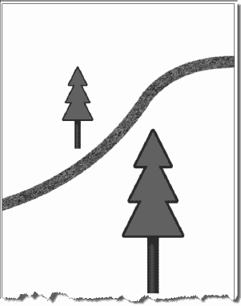
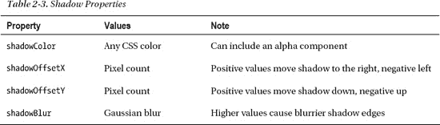

# 二、使用画布 API

在这一章中，我们将探索你可以用 Canvas API 做什么——一个很酷的 API，使你能够动态地生成和渲染图形、图表、图像和动画。我们将指导您使用渲染 API 的基础知识来创建一个可以根据浏览器环境进行缩放和调整的绘图。我们将向您展示如何在热图显示中基于用户输入创建动态图片。当然，我们也会提醒您使用 Canvas 的陷阱，并分享克服它们的技巧。

这一章只假设了少量的图形专业知识，所以不要害怕尝试 HTML5 最强大的特性之一。

### html 5 画布概述

关于 Canvas API 的使用可以写一整本书(而且不会是一本小书)。因为我们只有一章，所以我们将涵盖(我们认为是)这个非常广泛的 API 中最常用的功能。

#### 历史

canvas 的概念最初是由苹果公司引入的，用于 Mac OS X WebKit 来创建*仪表板小部件*。在 canvas 出现之前，你只能通过插件在浏览器中使用绘图 API，例如用于 Flash 和可缩放矢量图形(SVG)的 Adobe 插件，仅在 Internet Explorer 中使用的矢量标记语言(VML)，或者其他聪明的 JavaScript 黑客。

例如，尝试在没有`canvas`元素的情况下绘制一条简单的对角线——这听起来很容易，但如果您没有简单的二维绘图 API，这将是一项相当复杂的任务。Canvas 正好提供了这一点，因为它在浏览器中非常有用，所以被添加到 HTML5 规范中。

早些时候，苹果暗示可能会在 WHATWG 的 canvas 规范草案中保留知识产权，这在当时引起了一些 web 标准化追随者的担忧。然而，最终苹果还是根据 W3C 的免版税专利许可条款披露了这些专利。

**SVG 对 Canvas**

**Peter 说**:“画布本质上是一个*位图*画布，因此在画布上绘制的图像是最终的，不能像可缩放矢量图形(SVG)图像那样调整大小。此外，绘制在画布上的对象不是页面 DOM 的一部分，也不是任何名称空间的一部分——如果您需要点击检测或基于对象的更新，这被认为是一个弱点。另一方面，SVG 图像可以在不同的分辨率下无缝缩放，并允许点击检测(精确知道图像被点击的位置)。

那么，WHATWG HTML5 规范为什么不专门使用 SVG 呢？尽管 HTML5 Canvas API 有明显的缺点，但它有两个优点:它的性能很好，因为它不必为它绘制的每个图元存储对象；基于其他编程语言中常见的许多二维绘图 API 实现 Canvas API 相对容易。归根结底，一鸟在手总比双鸟在林好。"

#### 什么是画布？

当你在网页中使用一个`canvas`元素时，它会在页面上创建一个矩形区域。默认情况下，这个矩形区域是 300 像素宽和 150 像素高，但是您可以为您的`canvas`元素指定确切的大小和设置其他属性。清单 2-1 展示了可以添加到 HTML 页面的最基本的`canvas`元素。

***清单 2-1。**一个基本的画布元素*

`<canvas></canvas>`

一旦您将一个`canvas`元素添加到页面中，您就可以使用 JavaScript 以任何您想要的方式操作它。您可以向其中添加图形、线条和文本。你可以在上面画画；你甚至可以给它添加高级动画。

Canvas API 支持大多数现代操作系统和框架支持的相同的二维绘制操作。如果您在最近几年中曾经编写过二维图形，您可能会对 Canvas API 如鱼得水，因为它的设计与现有系统非常相似。如果您还没有，您将会发现一个渲染系统比以前的图像和 CSS 技巧强大得多，这些是开发人员多年来用来创建 web 图形的。

要以编程方式使用画布，您必须首先获得它的*上下文*。然后，您可以对上下文执行操作，并最终将这些操作应用于上下文。您可以将画布修改视为类似于数据库事务:您启动一个事务，执行某些操作，然后提交该事务。

#### 画布坐标

如图 2-1 中的所示，画布中的坐标从左上角的`x=0,y=0`开始——我们称之为*原点*——并在 x 轴的水平方向和 y 轴的垂直方向增加(以像素为单位)。

***图 2-1。**画布上的 x 和 y 坐标*

#### 何时不用帆布

虽然`canvas`元素很棒并且非常有用，但是当另一个元素足够时，你应该*而不是*使用`canvas`元素。例如，在画布上动态绘制 HTML 文档的所有不同标题，而不是简单地使用为此目的而设计的标题样式(H1、H2 等)，这并不是一个好主意。

#### 回退内容

如果您的网页是由不支持`canvas`元素或 Canvas API 特性子集的浏览器访问的，那么提供一个替代源是一个好主意。例如，您可以提供一个替代图像或一些文本来解释如果用户真的使用现代浏览器，他们会喜欢什么。清单 2-2 展示了如何在`canvas`元素中指定替换文本。不支持`canvas`元素的浏览器将简单地呈现这个后备内容。

***清单 2-2。**在画布元素中使用回退文本*

`<canvas>
  Update your browser to enjoy canvas!
</canvas>`

如果浏览器不支持`canvas`元素，您也可以指向一个可以显示的图像，而不是前面显示的文本。

**画布可访问性呢？**

**Peter 说**:“提供替代图像或替代文本引发了*可访问性*的问题——不幸的是，画布规范在这个领域仍然严重不足。例如，对于插入到画布中的图像，没有本地方法来插入文本替换，也没有本地方法来提供替换文本以匹配使用画布文本 API 生成的文本。在撰写本文时，还没有可用于画布中动态生成内容的可访问性挂钩，但是一个工作组正在设计它们。希望这种情况会随着时间的推移而改善。”

HTML5 设计者对于处理可替换的、可访问的画布内容的当前提议之一是使用这个回退内容部分。然而，为了让它对屏幕阅读器和其他辅助工具有用，即使支持和显示画布，回退内容也需要是键盘可导航的。虽然现在有些浏览器支持这种功能，但是您不应该依赖它来支持有特殊需求的用户。目前推荐使用页面的一个单独部分来显示画布替代。额外的好处是，许多用户可能喜欢使用替代控件或显示，作为快速理解和导航页面或应用的更好方式。

Canvas API 的未来版本可能还会包含 Canvas 显示的可聚焦子区域以及与之交互的控件。但是，如果您的图像显示需要大量的交互，可以考虑使用 SVG 作为 Canvas API 的替代。SVG 也允许绘图，但是它也集成了浏览器 DOM。

#### CSS 和画布

与大多数 HTML 元素一样，CSS 可以应用于`canvas`元素本身来添加边框、填充、边距等。另外，一些 CSS 值被`canvas`的内容继承；字体就是一个很好的例子，因为绘制到`canvas`中的字体默认为`canvas`元素本身的设置。

此外，在`canvas`操作中使用的`context`上设置的属性遵循您可能已经从 CSS 中熟悉的语法。例如，颜色和字体在`context`上使用的符号与它们在任何 HTML 或 CSS 文档中使用的符号相同。

#### 浏览器支持 HTML5 画布

随着 Internet Explorer 9 的到来，现在所有的浏览器供应商都提供了对 HTML5 Canvas 的支持，并且它已经掌握在大多数用户的手中。这是网络发展的一个重要里程碑，让 2D 绘画在现代网络上蓬勃发展。

尽管以前版本的 Internet Explorer 的市场份额不断减少，但在使用 API 之前，先测试 HTML5 Canvas 是否受支持仍然是一个好主意。本章后面的“检查浏览器支持”一节将向您展示如何以编程方式检查浏览器支持。

### 使用 HTML5 画布 API

在这一节中，我们将更详细地探索 Canvas APIs 的使用。为了便于说明——没有双关语的意思——我们将使用各种 Canvas APIs 构建一个类似于徽标的森林场景显示，其中有树木和一条适合长距离比赛的美丽的小径。虽然我们的例子不会赢得任何图形设计的奖项，但它应该有助于以合理的顺序说明 HTML5 Canvas 的各种功能。

#### 检查浏览器支持

在使用`canvas`元素之前，您会希望确保浏览器中有支持。这样，您可以提供一些替代文本，以防他们的老式浏览器不支持。清单 2-3 展示了一种测试浏览器支持的方法。

***清单 2-3。**检查浏览器支持*

`try {
  document.createElement("canvas").getContext("2d");
  document.getElementById("support").innerHTML =
    "HTML5 Canvas is supported in your browser.";
} catch (e) {
  document.getElementById("support").innerHTML = "HTML5 Canvas is not supported 
                                                  in your browser.";
}`

在本例中，您尝试创建一个画布对象并访问其上下文。如果有错误，您将捕捉到它，并知道 Canvas 不受支持。页面上先前定义的支持元素用合适的消息更新，以反映是否有浏览器支持。

该测试将表明浏览器是否支持`canvas`元素本身。它不会指出支持画布的哪些功能。在撰写本文时，该 API 是稳定的并且得到了很好的支持，所以这通常不是一个需要担心的问题。

此外，给你的`canvas`元素提供后备内容也是一个好主意，如清单 2-3 所示。

#### 向页面添加画布

在 HTML 页面中添加一个`canvas`元素非常简单。清单 2-4 显示了可以添加到 HTML 页面的`canvas`元素。

***清单 2-4。**画布元素*

`<canvas height="200" width="200"></canvas>`

生成的画布将在页面上显示为“不可见”的 200 × 200 像素矩形。如果你想在它周围添加一个边框，你可以使用清单 2-5 所示的 HTML 代码，用普通的 CSS 边框来设置画布的样式。

***清单 2-5。**带实线边框的画布元素*

`<canvas id="diagonal" style="border: 1px solid;" width="200" height="200">
</canvas>`

请注意添加了 ID `diagonal`以便于以编程方式定位这个`canvas`元素。ID 属性对于任何画布都是至关重要的，因为这个元素上所有有用的操作都必须通过脚本来完成。如果没有 ID，您将很难定位元素以与其进行互操作。

图 2-2 显示了清单 2-5 中的画布在浏览器中的样子。

***图 2-2。**一个简单的 HTML 页面上的 HTML5 画布元素*

不是很令人兴奋，但是任何艺术家都会告诉你，它充满了潜力。现在，让我们用这块原始的画布做点什么。如前所述，如果没有 HTML5 Canvas，在网页上画对角线并不容易。让我们看看现在*可以*使用 Canvas 有多简单。清单 2-6 展示了如何用几行代码，在我们之前添加到页面的画布上画一条对角线。

***清单 2-6。**在画布上画一条对角线*

``

让我们检查一下用于创建对角线的 JavaScript 代码。这是一个简单的例子，但是它抓住了使用 Canvas API 的基本流程:

首先，通过引用特定画布的 ID 值来访问画布对象。在这个例子中，ID 是`diagonal`。接下来，您创建一个上下文变量，并调用 canvas 对象的`getContext`方法，传入您正在寻找的画布类型。您传入字符串“`2d`”来获得一个二维上下文——此时唯一可用的上下文类型。

 **注意**很多工作已经在三维版本的画布上完成。WebGL 规范的 1.0 版本是浏览器供应商和 Khronos Group 的共同努力，于 2011 年初发布。WebGL 基于与流行的 OpenGL 库相同的概念和设计，为 JavaScript 和 HTML5 带来了类似的 API。要在支持的浏览器中创建三维绘图上下文，只需使用字符串`"webgl"`作为`getContext`的参数。最终的上下文拥有一套全新的绘图 API:对他们自己的书来说足够全面和复杂的能力。尽管现在一些浏览器已经发布了 WebGL 的实现，但是并不是所有的供应商都已经发布了。然而，网络上三维渲染的潜力是如此引人注目，以至于我们预计在未来几年内会得到快速的支持。欲了解更多信息，请访问 Khronos 集团的 WebGL 网站(`[`www.khronos.org/webgl`](http://www.khronos.org/webgl)`)。我们将在本书的最后一章更详细地讨论 WebGL。

然后，您可以使用该上下文来执行绘图操作。在这种情况下，您可以通过调用三个方法来创建对角线，这三个方法是:`beginPath`、`moveTo`和`lineTo`，传递直线的起点和终点坐标。

绘图方法`moveTo`和`lineTo`并不实际创建线条；您通过调用`context.stroke();`方法来完成画布操作并画线。图 2-3 显示了用示例代码创建的对角线。

***图 2-3。**画布上的对角线*

凯旋！尽管这条简单的线可能看起来并不是一场革命的开始，但请记住，使用经典的 HTML 技术在任意两点之间绘制对角线是一个非常困难的操作，涉及到拉伸的图像、奇怪的 CSS 和 DOM 对象，或者其他形式的魔法。让我们再也不要提起他们。

从这个例子的代码中可以看出，画布上的所有操作都是通过 context 对象执行的。这将适用于您与画布的其他交互，因为可视化输出的所有重要功能都只能从上下文中访问，而不能从画布对象本身访问。这种灵活性允许画布在将来基于从画布中检索的上下文类型支持不同类型的绘制模型。虽然在本章中我们会经常提到我们将在画布上采取的动作，但是请记住，这实际上意味着我们将使用画布提供的上下文对象。

如前面的示例所示，上下文中的许多操作不会立即更新绘图图面。诸如`beginPath`、`moveTo`和`lineTo`等功能不会立即修改画布外观。许多设置画布样式和偏好的函数也是如此。只有当路径被*敲击*或*填充*时，它才会出现在显示屏上。否则，只有在显示图像、显示文本或绘制、填充或清除矩形时，画布才会立即更新。

#### 对图纸应用变换

现在让我们看看使用*变换*在画布上绘图的另一种方法。在下面的示例中，结果与前面的示例相同，但是用于绘制对角线的代码不同。对于这个简单的例子，您可能会认为转换的使用增加了不必要的复杂性。然而，您可以将转换作为更复杂的画布操作的最佳实践。您将会看到，在余下的示例中，我们会大量使用它，它对于理解 Canvas API 的复杂功能至关重要。

也许最容易想到转换系统的方法——至少，不涉及大量数学公式和手势的最简单方法——是作为一个修改层，位于您发出的命令和画布显示上的输出之间。这个修改层总是存在的，即使你选择不与它交互。

修改，或者用绘图系统的术语来说是*转换*，可以按顺序应用、组合和随意修改。每个绘图操作在出现在画布上之前都要经过要修改的修改层。虽然这增加了一层额外的复杂性，但也给绘图系统增加了巨大的能力。它允许对现代图像编辑工具实时支持的强大修改进行访问，而 API 的复杂程度只是绝对需要的。

如果在代码中不使用转换调用，不要误以为你在优化性能。canvas 实现在其呈现引擎中隐式地使用和应用转换，无论您是否直接调用它们。更明智的做法是预先了解系统，因为知道是否超出最基本的绘图操作是至关重要的。

对可重用代码的一个关键建议是，你通常希望在原点(坐标 0，0)处*绘制，并应用变换——缩放、平移、旋转等等——将你的绘制代码修改成它的最终外观，如图图 2-4 所示。*

***图 2-4。**原点变换绘制概述*

清单 2-7 使用最简单的转换`translate`展示了这个最佳实践。

***清单 2-7。**使用平移在画布上创建一条对角线*

``

让我们检查一下用来创建第二条翻译后的对角线的 JavaScript 代码。

> 1.  First, access the canvas object by referring to its ID value (in this case, diagonal).
> 2.  Then retrieve a context variable by calling the getContext function of the canvas object.
> 3.  Next, you want to save the context that is still unmodified, so that you can return to its original state at the end of the drawing and conversion operation. If the state is not saved, the modifications (translation, scaling, etc.) made during the operation will continue to be applied to the context in future operations, which may not be desirable. Saving the context state before the conversion will allow us to restore it later. The next step is to apply the translate method to the context. With this operation, when drawing any figure, the translation coordinate you provided will be added to the final figure coordinate (diagonal), thus moving the line to its final position, but only after the drawing operation is completed.
> 4.  After applying translation, you can perform normal drawing operations to create diagonal lines. In this case, you can create diagonal lines by calling three methods (beginPath, moveTo and lineTo), this time drawing at the origin (0,0) instead of coordinates 70,140.
> 5.  After drawing a line, you can render it to the canvas (such as drawing a line) by calling the context.stroke method.
> 6.  Finally, you restore the context to its clean original state so that the translation applied in this operation will not be used when performing future canvas operations. Figure 2-5 shows the diagonal created with the sample code.

***图 2-5。**翻译画布上的对角线*

尽管您的新行看起来与旧行非常相似，但是您使用转换的力量创建了它，这一点随着我们在本章剩余部分的学习会变得更加明显。

#### 使用路径

虽然我们可以提供更多令人兴奋的画线的例子，但我们现在准备进行一些更复杂的东西:*路径*。HTML5 Canvas API 中的路径表示您想要呈现的任何形状。我们最初的 line 示例是一个路径，您可能已经从用来启动它的那个明显的`beginPath`调用中收集到了这一点。但是路径可以如你所愿的那样复杂，有多条直线和曲线段，甚至还有子路径。如果您希望在画布上绘制几乎任何形状，path API 将是您的关注点。

当开始任何绘制形状或路径的例行程序时，您首先调用的是`beginPath`。这个简单的函数没有参数，但是它向画布发出信号，表示您希望开始一个新的形状描述。此函数对画布非常有用，它可以计算您为以后的填充和描边创建的形状的内部和外部。

路径总是跟踪当前位置的概念，默认为原点。画布在内部跟踪当前位置，但是您将使用您的绘图例程修改它。

形状开始后，您可以使用上下文中的各种功能来绘制形状的布局。您已经看到了最简单的上下文路径函数:

*   `moveTo(x, y)`:将当前位置移动到新的目的地(x，y)而不绘制。
*   `lineTo(x, y)`:将当前位置移动到一个新的终点(x，y)，从当前位置到新的终点画一条直线。

本质上，这两个调用之间的区别在于，第一个调用类似于提起绘图笔并移动到新的位置，而第二个调用告诉画布将笔留在纸上，并以直线移动到新的目的地。然而，值得再次指出的是*在你描边或填充路径*之前，没有实际的绘图发生。目前，我们仅仅是在我们的道路上确定位置，以便以后可以绘制它。

下一个特殊的路径函数是对`closePath`的调用。该命令的行为与`lineTo`功能非常相似，不同之处在于目的地被自动假定为路径的起点。然而，`closePath`也通知画布当前形状已经闭合或者形成了一个完全包含的区域。这对将来的填充和描边很有用。

在这一点上，您可以继续在您的路径中创建更多的子路径。或者您可以随时`beginPath`重新开始并完全清除路径列表。

对于大多数复杂的系统来说，看到它们的运行通常会更好。让我们离开我们的 line 示例，使用 Canvas API 开始创建一个新的场景，展示一个有小径的森林。这个场景将作为我们比赛的标志。和任何图片一样，我们将从一个基本元素开始，在这个例子中是一棵简单松树的树冠。清单 2-8 显示了如何绘制松树的树冠。

***清单 2-8。**为树冠创建路径的功能*

`function createCanopyPath(context) {
  // Draw the tree canopy
  context.beginPath();

  context.moveTo(-25, -50);
  context.lineTo(-10, -80);
  context.lineTo(-20, -80);
  context.lineTo(-5, -110);
  context.lineTo(-15, -110);

  // Top of the tree
  context.lineTo(0, -140);

  context.lineTo(15, -110);
  context.lineTo(5, -110);
  context.lineTo(20, -80);
  context.lineTo(10, -80);
  context.lineTo(25, -50);

  // Close the path back to its start point
  context.closePath();
}`

从代码中可以看出，我们使用了与之前相同的 move 和 line 命令，但是使用了更多的命令。这些线条形成了一个简单树形结构的分支，我们在末端封闭了路径。我们的树将在底部留下一个明显的缺口，我们将在以后的章节中使用它来绘制树干。清单 2-9 展示了如何使用树冠绘制函数将我们简单的树的形状绘制到画布上。

***清单 2-9。**在画布上画一棵树的功能*

`function drawTrails() {
  var canvas = document.getElementById('trails');
  var context = canvas.getContext('2d');

  context.save();
  context.translate(130, 250);

  // Create the shape for our canopy path
  createCanopyPath(context);`  `// Stroke the current path
  context.stroke();
  context.restore();
}`

这个例程中的所有调用您应该已经很熟悉了。我们获取画布上下文，保存它以供将来参考，将我们的位置转换到一个新的位置，绘制天篷，将其绘制到画布上，然后恢复我们的状态。图 2-6 显示了我们手工制作的结果，一个简单的树冠线条图。随着我们的前进，我们将对此进行扩展，但这是一个良好的开端。

***图 2-6。**一个树冠的简单路径*

#### 使用笔画样式

如果开发人员坚持使用简单的简笔画和黑线，Canvas API 就不会强大或受欢迎。让我们使用笔画造型功能，使我们的树冠更像树。清单 2-10 显示了一些基本命令，这些命令可以修改上下文的属性，以使描边形状看起来更有吸引力。

***清单 2-10。**使用笔画样式*

`// Increase the line width
context.lineWidth = 4;

// Round the corners at path joints
context.lineJoin = 'round';

// Change the color to brown
context.strokeStyle = '#663300';

// Finally, stroke the canopy
context.stroke();`

通过在描边之前添加上述属性，我们可以更改任何未来描边形状的外观——至少在我们将上下文恢复到以前的状态之前。

首先，我们将描边线条的宽度增加到四个像素。

接下来，我们将`lineJoin`属性设置为`round`，这使得我们的形状的线段的接合处呈现出更加圆滑的拐角形状。我们也可以将`lineJoin`设置为`bevel`或`miter`(以及相应的`context.miterLimit`值来调整它)来选择其他角选项。

最后，我们通过使用`strokeStyle`属性来改变笔画的颜色。在我们的例子中，我们将颜色设置为一个 CSS 值，但是正如您将在后面的章节中看到的，也可以将`strokeStyle`设置为一个图像模式或一个渐变，用于更好的显示。

虽然我们在这里没有使用它，但是我们也可以将`lineCap`属性设置为`butt`、`square`或`round`来指定线条应该如何在端点显示。唉，我们的例子没有悬空的线端。图 2-7 显示了我们修整过的树冠，现在用一条更宽、更平滑的棕色线条代替了之前的黑色线条。

***图 2-7。**时髦的抚摸着树冠*

#### 使用填充样式

如您所料，描边并不是影响画布形状外观的唯一方式。修改形状的下一个常用方法是指定如何填充其路径和子路径。清单 2-11 展示了用令人愉快的绿色填充我们的树冠是多么简单。

***清单 2-11** 。使用填充样式*

`// Set the fill color to green and fill the canopy
context.fillStyle = '#339900';
context.fill();`

首先，我们将`fillStyle`设置为适当的颜色。正如我们将在后面看到的，也可以将填充设置为渐变或图像模式。然后，我们简单地调用上下文的`fill`函数，让画布填充我们当前形状的所有闭合路径内的所有像素，如图图 2-8 所示。

***图 2-8。**满树的树冠*

因为我们在填充树冠之前对其进行了描边，所以填充覆盖了描边路径的一部分。这是因为宽笔划(在我们的例子中，四个像素宽)位于路径形状的中心。填充应用于形状内部的所有像素，因此它将覆盖一半的描边线像素。如果您希望显示完整的笔画，您可以在笔画路径之前简单地填充*。*

#### 填充矩形内容

每棵树都应该有一个坚实的基础。谢天谢地，我们在原始形状的路径上为我们的树干留了空间。清单 2-12 展示了我们如何通过使用`fillRect`便利函数来添加一个树干的最简单的渲染。

***清单 2-12。**使用 fillRect 便捷功能*

`// Change fill color to brown
context.fillStyle = '#663300';

// Fill a rectangle for the tree trunk
context.fillRect(-5, -50, 10, 50);`

在这里，我们再次设置了棕色填充样式。但是，我们将使用`fillRect`一步完成整个躯干的绘制，而不是使用`lineTo`功能显式绘制躯干矩形的角。`fillRect`调用获取 x 和 y 位置，以及宽度和高度，然后立即用当前填充样式填充。

虽然我们在这里没有使用它们，但是`strokeRect`和`clearRect`有相应的函数。前者将根据给定的位置和尺寸绘制矩形的轮廓，而后者将从矩形区域中删除任何内容，并将其重置为原始的透明颜色。

**画布动画**

Brian 说:“在画布中清除矩形的能力是使用画布 API 创建动画和游戏的核心。通过重复绘制和清除画布的部分，有可能呈现动画的幻觉，并且许多这样的例子已经存在于网络上。然而，为了创建流畅的动画，你需要利用*剪辑*功能，甚至可能需要一个二级缓冲画布来最小化频繁的画布清除所导致的闪烁。虽然动画并不是本书的重点，但请查看本章的“实用附加”部分，了解一些使用 HTML5 制作页面动画的技巧。”

图 2-9 显示了我们简单的、扁平填充的树干，连接到我们之前的树冠路径上。

***图 2-9。**矩形树干的树*

#### 绘制曲线

世界，尤其是自然界，并不是充满了直线和矩形。幸运的是，画布提供了各种函数来在我们的路径中创建曲线。我们将展示最简单的选择——一条二次曲线——来形成一条穿过虚拟森林的路径。清单 2-13 展示了两条二次曲线的添加。

***清单 2-13。**画曲线*

`// Save the canvas state and draw the path
context.save();

context.translate(-10, 350);
context.beginPath();

// The first curve bends up and right` `context.moveTo(0, 0);
context.quadraticCurveTo(170, -50, 260, -190);

// The second curve continues down and right
context.quadraticCurveTo(310, -250, 410,-250);

// Draw the path in a wide brown stroke
context.strokeStyle = '#663300';
context.lineWidth = 20;
context.stroke();

// Restore the previous canvas state
context.restore();`

像以前一样，我们要做的第一件事是保存我们的画布上下文状态，因为我们将在这里修改翻译和笔画选项。对于我们的森林路径，我们将从回到原点开始，向右上方画第一条二次曲线。

如图 2-10 所示，`quadraticCurveTo`函数从当前绘图位置开始，以两个 x，y 点位置为参数。第二个是我们曲线的最后一站。第一个代表一个*控制点*。控制点位于曲线的一侧(不在曲线上),对曲线路径上的点几乎起着引力的作用。通过调整控制点的位置，可以调整正在绘制的路径的曲率。我们向右上方画第二条二次曲线来完成我们的路径；然后抚摸它，就像我们之前对树冠做的那样(只是更宽)。

***图 2-10。**二次曲线起点、终点和控制点*

HTML5 Canvas API 中的其他曲线选项包括`bezierCurveTo`、`arcTo`和`arc`函数。这些曲线采用额外的控制点、半径或角度来确定曲线的特征。图 2-11 显示了两条二次曲线在我们的画布上画出了一条穿过树林的路径。

***图 2-11。**路径的二次曲线*

#### 将图像插入画布

在画布中显示图像非常方便。它们可以被压印、拉伸、变换修改，并且通常是整个画布的焦点。幸运的是，Canvas API 包含一些简单的命令，用于向画布添加图像内容。

但是图像也增加了画布操作的复杂性:您必须等待它们被加载。浏览器通常会在页面脚本呈现时异步加载图像。但是，如果您试图在画布完全加载之前将图像渲染到画布上，画布将根本无法渲染任何图像。因此，在尝试渲染图像之前，您应该小心确保图像已完全加载。

为了在我们简单的森林小径示例中解决这个问题，我们将加载一个树皮纹理的图像，以便直接在画布中使用。为了确保在我们渲染之前图像已经完成加载，我们将把加载代码切换为只作为图像加载完成的回调来执行，如清单 2-14 所示。

***清单 2-14。**加载图像*

`// Load the bark image
var bark = new Image();
bark.src = "bark.jpg";

// Once the image is loaded, draw on the canvas` `bark.onload = function () {
  drawTrails();
}`

正如您所看到的，我们已经向`bark.jpg`图像添加了一个`onload`处理程序，以便仅在图像加载完成时调用主`drawTrails`函数。这保证了我们添加到画布渲染的下一个调用可以使用这个图像，如清单 2-15 中的所示。

***清单 2-15。**在画布上绘制图像*

`// Draw the bark pattern image where
//  the filled rectangle was before
context.drawImage(bark, -5, -50, 10, 50);`

这里，我们用一个简单的例程替换了前面对`fillRect`的调用，将我们的树皮图像显示为我们的树的新树干。虽然图像是一个微妙的替代，但它为我们的显示提供了更多的纹理。注意，在这个调用中，除了图像本身，我们还指定了 x、y、width 和 height 参数。该选项将缩放图像，以适合我们为主干分配的 10 × 50 像素空间。我们还可以传入源维度，以便更好地控制要显示的传入图像的剪辑区域。

正如你在图 2-12 中所看到的，我们躯干外观的变化与我们之前使用的填充矩形仅略有不同。

***图 2-12。**树干使用图像的树*

#### 使用渐变

对树干不满意？我们也不是。让我们用另一种更巧妙的方法来绘制我们的树干:渐变。渐变允许你应用一个渐进的算法采样颜色作为一个笔画或填充样式，就像在上一节中应用的模式一样。创建渐变需要三个步骤:

> 1.  Create the gradient object itself.
> 2.  Apply the color stop point to the gradient object to signal that the color changes along the transition.
> 3.  Set the gradient to fillStyle or strokeStyle in context.

也许最容易把渐变想象成沿着一条线移动的平滑的颜色变化。例如，如果您提供 A 点和 B 点作为创建渐变的参数，则任何从 A 点向 B 点移动的描边或填色都将转换颜色。

要确定显示什么颜色，只需对渐变对象本身使用`addColorStop`函数。此功能允许您指定偏移量和颜色。color 参数是要在偏移位置应用于描边或填充的颜色。偏移位置是一个介于 0.0 和 1.0 之间的值，表示颜色应该沿着渐变线到达多远。

如果创建从点(0，0)到点(0，100)的渐变，并在偏移量 0.0 处指定白色色标，在偏移量 1.0 处指定黑色色标，则当发生描边或填充时，随着渲染从点(0，0)到点(0，100)，您会看到颜色逐渐从白色(开始色标)变为黑色(结束色标)。

与其他颜色值一样，可以提供一个 alpha(例如，透明度)值作为颜色的一部分，并使该 alpha 值过渡。为此，您需要使用颜色值的另一种文本表示，比如包含 alpha 组件的 CSS `rgba`函数。

让我们通过一个代码示例来更详细地了解这一点，该示例将两个渐变应用于代表我们最终树干的`fillRect`，如清单 2-16 中的所示。

***清单 2-16。**使用渐变*

`// Create a 3 stop gradient horizontally across the trunk
var trunkGradient = context.createLinearGradient(-5, -50, 5, -50);

// The beginning of the trunk is medium brown
trunkGradient.addColorStop(0, '#663300');

// The middle-left of the trunk is lighter in color
trunkGradient.addColorStop(0.4, '#996600');

// The right edge of the trunk is darkest
trunkGradient.addColorStop(1, '#552200');

// Apply the gradient as the fill style, and draw the trunk
context.fillStyle = trunkGradient;
context.fillRect(-5, -50, 10, 50);

// A second, vertical gradient creates a shadow from the
//  canopy on the trunk
var canopyShadow = context.createLinearGradient(0, -50, 0, 0);`  `// The beginning of the shadow gradient is black, but with
//  a 50% alpha value
canopyShadow.addColorStop(0, 'rgba(0, 0, 0, 0.5)');

// Slightly further down, the gradient completely fades to
//  fully transparent. The rest of the trunk gets no shadow.
canopyShadow.addColorStop(0.2, 'rgba(0, 0, 0, 0.0)');

// Draw the shadow gradient on top of the trunk gradient
context.fillStyle = canopyShadow;
context.fillRect(-5, -50, 10, 50);`

如图 2-13 所示，应用这两个渐变在我们渲染的树上创建了一个漂亮、平滑的光源，使它看起来弯曲，并被上面树冠的轻微阴影覆盖。我们留着吧。

***图 2-13。**树干渐变的树*

除了我们示例中使用的线性渐变，Canvas API 还支持径向渐变选项，该选项允许您指定两个圆形表示，在这两个圆形表示中，色标应用于两个圆形之间的圆锥体。径向渐变使用与线性渐变相同的颜色停止点，但是以清单 2-17 所示的形式获取其参数。

***清单 2-17。**应用径向渐变的例子*

`createRadialGradient(x0, y0, r0, x1, y1, r1)`

在此示例中，前三个参数表示以(x0，y0)为中心、半径为 r0 的圆，后三个参数表示以(x1，y1)为中心、半径为 r1 的第二个圆。渐变在两个圆之间的区域上绘制。

#### 使用背景图案

图像的直接呈现有许多用途，但在某些情况下，使用图像作为背景图块是有益的，类似于 CSS 中可用的功能。我们已经看到了如何将笔触或填充样式设置为纯色。HTML5 Canvas API 还包括一个选项，用于将图像设置为路径描边或填充的可重复模式。

为了使我们的森林小径看起来更加崎岖，我们将通过用一个使用背景图像填充的曲线替换先前的描边小径曲线来展示这一能力。在这样做的时候，我们将把现在没有使用的树皮图像换成砾石图像，我们将在这里使用。清单 2-18 显示我们用对`createPattern`的调用替换了对`drawImage`的调用。

***清单 2-18。**使用背景图案*

`// Replace the bark image with
// a trail gravel image
var gravel = new Image();
gravel.src = "gravel.jpg";
gravel.onload = function () {
    drawTrails();
}

// Replace the solid stroke with a repeated
// background pattern
context.strokeStyle = context.createPattern(gravel, 'repeat');
con text.lineWidth = 20;
context.stroke();`

如你所见，我们仍在为我们的道路呼叫`stroke()`。然而，这一次我们首先在上下文上设置了一个`strokeStyle`属性，将调用`context.createPattern`的结果传入。哦，同样，为了让画布执行操作，需要预先加载图像。第二个参数是重复模式，它可以是表 2-1 中显示的选项之一。

图 2-14 显示了使用背景图像而不是明确绘制的图像来表示我们的踪迹的结果。

***图 2-14。**背景图案重复的痕迹*

#### 缩放画布对象

什么样的森林只有一棵树？让我们马上修理那个。为了使这变得简单一点，我们将调整我们的代码样本，将树的绘制操作隔离到一个叫做`drawTree`的例程中，如清单 2-19 中的所示。

***清单 2-19。**绘制树对象的功能*

`// Move tree drawing into its own function for reuse
function drawTree(context) {
  var trunkGradient = context.createLinearGradient(-5, -50, 5, -50);
  trunkGradient.addColorStop(0, '#663300');
  trunkGradient.addColorStop(0.4, '#996600');
  trunkGradient.addColorStop(1, '#552200');
  context.fillStyle = trunkGradient;
  context.fillRect(-5, -50, 10, 50);

  var canopyShadow = context.createLinearGradient(0, -50, 0, 0);
  canopyShadow.addColorStop(0, 'rgba(0, 0, 0, 0.5)');
  canopyShadow.addColorStop(0.2, 'rgba(0, 0, 0, 0.0)');
  context.fillStyle = canopyShadow;
  context.fillRect(-5, -50, 10, 50);

  createCanopyPath(context);

  context.lineWidth = 4;
  context.lineJoin = 'round';
  context.strokeStyle = '#663300';` `  context.stroke();

  context.fillStyle = '#339900';
  context.fill();
}`

正如你所看到的，`drawTree`函数包含了我们之前创建的绘制树冠、树干和树干渐变的所有代码。现在我们将使用一个转换例程——`context.scale`——在一个新的位置画第二棵树，并且尺寸更大，如清单 2-20 所示。

***清单 2-20。**绘制树对象*

`// Draw the first tree at X=130, Y=250
context.save();
context.translate(130, 250);
drawTree(context);
context.restore();

// Draw the second tree at X=260, Y=500
context.save();
context.translate(260, 500);

// Scale this tree twice normal in both dimensions
context.scale(2, 2);
drawTree(context);
context.restore();`

`scale`函数将 x 和 y 维度的两个因子作为其参数。每个因素都告诉 canvas 实现在那个维度上使尺寸变大(或变小)多少；X 因子为 2 将使所有后续绘制例程的宽度加倍，而 Y 因子为 0.5 将使所有后续操作的高度减半。使用这些例程，我们现在有一个简单的方法在我们的路径画布上创建第二棵树，如图 2-15 所示。

***图 2-15。**大树*

**总是在原点**执行形状和路径程序

**Brian 说(这次是认真的)**:“这个例子说明了为什么在原点执行形状和路径例程是个好主意的原因之一；然后在完成时翻译它们，就像我们在代码中所做的那样。原因是像`scale`和`rotate`这样的变换是从原点开始操作的。

如果对偏离原点绘制的形状执行`rotate`变换，则`rotate`变换将围绕原点旋转形状，而不是原地旋转。同样，如果在将形状转换到正确位置之前对其执行了缩放操作，则路径坐标的所有位置也会乘以缩放因子。根据应用的比例因子，这个新位置甚至可以完全离开画布，让您想知道为什么您的缩放操作只是“删除”了图像。"

#### 使用画布变换

变换操作不限于缩放和平移。也可以使用`context.rotate(angle)`功能旋转绘图上下文，甚至直接修改底层转换，进行更高级的操作，如剪切渲染路径。如果你想旋转图像的显示，你只需要调用清单 2-21 中的一系列操作。

***清单 2-21。**旋转后的图像*

`context.save();

// rotation angle is specified in radians
context.rotate(1.57);
context.drawImage(myImage, 0, 0, 100, 100);

context.restore();`

然而，在清单 2-22 中，我们将展示如何将任意变换应用到路径坐标上，以彻底改变现有树路径的显示，从而创建阴影效果。

***清单 2-22。**使用变换*

`// Create a 3 stop gradient horizontally across the trunk
// Save the current canvas state for later
context.save();

// Create a slanted tree as the shadow by applying
//  a shear transform, changing X values to increase
//  as Y values increase
// With this transform applied, all coordinates are
//  multiplied by the matrix.
context.transform(1, 0,-0.5, 1, 0, 0);

// Shrink the shadow down to 60% height in the Y dimension
context.scale(1, 0.6);

// Set the tree fill to be black, but at only 20% alpha
context.fillStyle = 'rgba(0, 0, 0, 0.2)';
context.fillRect(-5, -50, 10, 50);

// Redraw the tree with the shadow effects applied
createCanopyPath(context);
context.fill();

// Restore the canvas state
context.restore();`

像我们在这里所做的那样直接修改上下文转换是你应该尝试的事情，只有你熟悉支撑二维绘图系统的矩阵数学。如果你检查这个变换背后的数学，你会看到我们正在把我们的画的 X 值移动一个相应的 Y 值的系数，以便剪切被用作阴影的灰色树。然后，通过应用 60%的比例因子，被剪切的树的大小被减小。

请注意，剪切的“阴影”树首先被渲染，因此实际的树以 *Z 顺序*(画布对象重叠的顺序)出现在它上面。此外，阴影树是使用 RGBA 的 CSS 符号绘制的，这允许我们将 alpha 值设置为正常值的 20%。这为阴影树创建了光亮的半透明外观。一旦应用到我们的缩放树，输出呈现如图图 2-16 所示。

***图 2-16。**阴影变形的树*

#### 使用画布文本

当我们接近踪迹创建的结尾时，让我们通过在显示的顶部添加一个有趣的标题来展示 Canvas API 文本函数的强大功能。请务必注意，画布上的文本渲染与任何其他 path 对象的处理方式相同:文本可以描边或填充，所有渲染转换和样式都可以应用于文本，就像它们应用于任何其他形状一样。

如您所料，文本绘制例程由上下文对象上的两个函数组成:

*   `fillText (text, x, y, maxwidth)`
*   `strokeText (text, x, y, maxwidth)`

这两个函数都接受文本以及应该绘制的位置。可选地，可以提供一个`maxwidth`参数，通过自动缩小字体以适合给定的大小来约束文本的大小。此外，`measureText`函数可用于返回包含给定文本宽度的 metrics 对象，如果它是使用当前上下文设置呈现的话。

与所有浏览器文本显示的情况一样，文本的实际外观是高度可配置的，使用类似于它们的 CSS 对应物的上下文属性，如表 2-2 所示。

所有这些上下文属性都可以被设置来改变上下文，或者被访问来查询当前值。在清单 2-23 中，我们将创建一个字体为`Impact`的大文本消息，并用我们现有的树皮图像的背景图案填充它。为了使文本在画布顶部居中，我们将声明一个最大宽度和一个`center`对齐方式。

***清单 2-23。**使用画布文本*

`// Draw title text on our canvas
context.save();

// The font will be 60 pixel, Impact face
context.font = "60px impact";

// Use a brown fill for our text
context.fillStyle = '#996600';
// Text can be aligned when displayed
context.textAlign = 'center';

// Draw the text in the middle of the canvas with a max
//  width set to center properly
context.fillText('Happy Trails!', 200, 60, 400);
context.restore();`

正如你在图 2-17 中看到的结果，轨迹绘制变得更加快乐——你猜对了。

***图 2-17。**背景图案填充文本*

#### 应用阴影

最后，我们将使用内置的 canvas shadow API 为新的文本显示添加模糊的阴影效果。像许多图形效果一样，阴影最好适度应用，即使 Canvas API 允许您将阴影应用到我们已经介绍过的任何操作中。

同样，阴影由一些全局`context`属性控制，如表 2-3 所示。

如果`shadowColor`和至少一个其他属性被设置为非默认值，阴影效果将在任何路径、文本或图像渲染中触发。清单 2-24 展示了我们如何给新的轨迹标题文本添加阴影。

***清单 2-24。**应用阴影*

`// Set some shadow on our text, black with 20% alpha
context.shadowColor = 'rgba(0, 0, 0, 0.2)';

// Move the shadow to the right 15 pixels, up 10
context.shadowOffsetX = 15;
context.shadowOffsetY = -10;

// Blur the shadow slightly
context.shadowBlur = 2;`

通过这些简单的添加，画布渲染器将自动应用阴影，直到画布状态恢复或阴影属性重置。图 2-18 显示了新应用的阴影。

***图 2-18。**带阴影文字的标题*

如你所见，CSS 生成的阴影只是位置性的，与我们为树创建的变换阴影不同步。出于一致性的考虑，在给定的画布场景中，你应该只使用一种方法来绘制阴影。

#### 处理像素数据

Canvas API 最有用的方面之一——尽管不是很明显——是开发人员能够轻松访问画布中的底层像素。这种访问是双向的:以数字数组的形式访问像素值很容易，修改这些值并将其应用到画布上也同样容易。事实上，完全可以通过像素值调用来操纵画布，而不用我们在本章中讨论的渲染调用。这是因为`context` API 上存在三个函数。

首先出场的是`context.getImageData(sx, sy, sw, sh)`。这个函数以整数集合的形式返回画布显示的当前状态。具体来说，它返回一个包含三个属性的对象:

*   `width`:像素数据的每行的像素数
*   `height`:像素数据的每一列中的像素数
*   `data`:一维数组，包含从画布中检索的每个像素的实际 RGBA 值。该数组包含每个像素的四个值，即红色、绿色、蓝色和 alpha 分量，每个值从 0 到 255。因此，从画布中检索到的每个像素都变成了数据数组中的四个整数值。数据数组由像素从左到右、从上到下填充(例如，穿过第一行，然后穿过第二行，等等)，如图 2-19 中的所示。

***图 2-19。**像素数据和代表它的内部数据结构*

调用`getImageData`返回的数据限于四个参数定义的区域。只有包含在由源参数`x`、`y`、`width`和`height`包围的矩形区域中的画布像素将被检索。因此，要将所有像素值作为数据访问，应该传入`getImageData(0, 0, canvas.width, canvas.height)`。

因为每个像素有四个图像数据值，所以准确计算哪个索引代表给定像素的值可能有点棘手。公式如下。

对于具有给定宽度和高度的画布中坐标(x，y)处的任何像素，您可以定位组件值:

*   **红色成分**:((宽度* y) + x) * 4
*   **绿色成分**:((宽度* y) + x) * 4 + 1
*   **蓝色成分**:((宽度* y) + x) * 4 + 2
*   **Alpha 分量**:((宽度* y) + x) * 4 + 3

一旦访问了包含图像数据的对象，就很容易从数学上修改数据数组中的像素值，因为它们都是从 0 到 255 的简单整数。通过使用第二个函数:`context.putImageData(imagedata, dx, dy)`，改变一个或多个像素的红色、绿色、蓝色或 alpha 值可以很容易地更新画布显示。

`putImageData`允许您以与最初检索时相同的格式传入一组图像数据；这很方便，因为你可以修改画布最初给你的值，并把它们放回去。一旦调用了这个函数，画布将立即更新，以反映您作为图像数据传入的像素的新值。如果您选择使用数据数组，那么`dx`和`dy`参数允许您指定将数据数组应用到现有画布的偏移量。

最后，如果您想从一组空白的画布数据开始，您可以调用`context.createImageData(sw, sh)`来创建一组绑定到画布对象的新图像数据。这组数据可以像以前一样以编程方式更改，即使它在检索时不代表画布的当前状态。

还有另一种从画布中获取数据的方法:`canvas.toDataURL` API。该函数为您提供了一种以文本格式检索画布的当前渲染数据的编程方式，但在这种情况下，该格式是浏览器可以解释为图像的数据的标准表示。

数据 URL 是包含图像数据(如 PNG)的字符串，浏览器可以像显示普通图像文件一样显示这些数据。数据 URL 的格式最好用一个例子来说明:

`data:image/png;base64, WCAYAAABkY9jZxn…`

这个例子显示了格式是字符串`data:`后跟一个 MIME 类型(比如`image/png`)，后跟一个指示数据是否以 base64 格式编码的标志，然后是表示数据本身的文本。

不要担心格式，因为您不会自己生成它。重要的一点是，通过一个简单的调用，您可以在这些特殊的 URL 之一中获得交付给您的画布内容。当您调用`canvas.toDataURL(type)`时，您可以传入您希望在其中生成画布数据的图像类型，例如`image/png`(默认)或`image/jpeg`。返回给您的数据 URL 可以用作页面或 CSS 样式中图像元素的来源，如清单 2-25 中的所示。

***清单 2-25。**从画布上创作图像*

`var myCanvas = document.getElementById("myCanvas");

// draw operations into the canvas...`  `// get the canvas data as a data URL
var canvasData = myCanvas.toDataURL();

// set the data as the source of a new image
var img = new Image();
img.src = canvasData;`

您不必马上使用数据 URL。您甚至可以将 URL 存储在浏览器的本地存储器中，以便以后检索和操作。浏览器存储将在本书的后面讨论。

#### 实现画布安全性

如前一节所述，使用像素操作有一个重要的注意事项。尽管大多数开发人员将像素操作用于合法的目的，但是从画布中获取和更新数据的能力很可能被用于不正当的目的。出于这个原因，指定了一个*原点清洁*画布的概念，这样被*污染了*的画布就不能从包含页面的源之外的原点获取它们的数据。

如图 2-20 中的所示，如果从`[`www.example.com`](http://www.example.com)`提供的页面包含一个`canvas`元素，那么页面中的代码完全有可能试图在画布中呈现来自`[`www.remote.com`](http://www.remote.com)`的图像。毕竟，在任何给定的网页中呈现来自远程站点的图像是完全可以接受的。

***图 2-20。**本地和远程图像源*

然而，在 Canvas API 出现之前，不可能以编程方式检索下载图像的像素值。其他网站的私人图片可以显示在页面上，但不能被阅读或复制。允许脚本从其他来源读取图像数据将有效地与整个网络共享用户的照片和其他敏感的在线图像文件。

为了防止这种情况，如果调用`getImageData`或`toDataURL`函数，任何包含从远程源渲染的图像的画布都将抛出安全异常。只要您(或任何其他编剧)在画布被污染后不试图从该画布获取数据，将远程图像渲染到另一个来源的画布中是完全可以接受的。请注意这一限制，并练习安全渲染。

### 用 HTML5 Canvas 构建应用

使用 Canvas API 有许多不同的应用可能性:图形、图表、图像编辑等等。然而，画布最有趣的用途之一是修改或覆盖现有内容。一种流行的叠加类型被称为热图。虽然这个名字意味着温度测量，但在这种情况下，热量可以指任何水平的可测量活动。地图上活跃程度高的区域被标记为热色(例如，红色、黄色或白色)。活动较少的区域没有显示任何颜色变化，或者显示最少的黑色和灰色。

例如，热图可用于在城市地图上指示交通状况，或在全球地图上指示风暴活动。在 HTML5 中，通过将画布显示与底层地图源结合起来，这样的情况很容易实现。本质上，画布可用于覆盖地图，并根据适当的活动数据绘制热量水平。

让我们使用我们在 Canvas API 中学到的功能构建一个简单的热图。在这种情况下，我们的热度数据源将不是外部数据，而是鼠标在地图上的移动。在地图的一部分上移动鼠标会导致温度升高，将鼠标保持在给定位置会使温度迅速升高到最高水平。我们可以将这样的热图显示(如图 2-21 所示)叠加在一张普通的地形图上，这只是提供一个例子。

***图 2-21。**热图应用*

现在，您已经看到了我们的热图应用的最终结果，让我们来浏览一下代码示例。像往常一样，工作示例可以在线下载和阅读。

让我们从这个例子中声明的 HTML 元素开始。对于这个显示，HTML 只包含一个标题、一个画布和一个按钮，我们可以用它来重置热图。画布的背景显示由一个简单的通过 CSS 应用到画布的`mapbg.jpg`组成，如清单 2-26 中的所示。

***清单 2-26。**热图画布元素*

`

<h2>Heatmap </h2>
<canvas id="heatmap" class="clear" style="border: 1px solid ; " height="300"
 width="300"> </canvas>
<button id="resetButton">Reset</button>`

我们还声明了一些将在后面的例子中使用的初始变量。

`  var points = {};
  var SCALE = 3;
  var x = -1;
  var y = -1;`

接下来，我们将为画布的全局绘制操作设置一个高透明度值，并设置合成模式以使新绘制的像素变亮，而不是替换它们。

然后，如清单 2-27 中的所示，我们将设置一个处理程序来改变显示—`addToPoint`—每当鼠标移动或十分之一秒过去时。

***清单 2-27。**load demo 功能*

`function loadDemo() {
  document.getElementById("resetButton").onclick = reset;

  canvas = document.getElementById("heatmap");
  context = canvas.getContext('2d');
  context.globalAlpha = 0.2;
  context.globalCompositeOperation = "lighter"

function sample() {
  if (x != -1) {
    addToPoint(x,y)
  }
  setTimeout(sample, 100);
}

canvas.onmousemove = function(e) {
  x = e.clientX - e.target.offsetLeft;
  y = e.clientY - e.target.offsetTop;
  addToPoint(x,y)
}

  sample();
}`

如果用户点击**重置**，则整个画布区域被清空，并使用画布的`clearRect`函数重置为初始状态，如清单 2-28 所示。

***清单 2-28。**复位功能*

`function reset() {
  points = {};
  context.clearRect(0,0,300,300);` `  x = -1;
  y = -1;
}`

接下来，我们创建一个颜色查找表，在画布上绘制热量时使用。清单 2-29 显示了颜色在亮度上如何从最小到最大变化，它们将被用来代表显示器上不同的热量水平。`intensity`的值越大，返回的颜色越亮。

***清单 2-29。**getColor 函数*

`function getColor(intensity) {
  var colors = ["#072933", "#2E4045", "#8C593B", "#B2814E", "#FAC268", "#FAD237"];
  return colors[Math.floor(intensity/2)];
}`

每当鼠标移动或悬停在画布的某个区域上时，就会绘制一个点。鼠标在邻近区域停留的时间越长，点的大小(和亮度)就越大。如清单 2-30 所示，我们使用`context.arc`函数绘制一个给定半径的圆，对于更大的半径值，我们通过将半径传递给我们的`getColor`函数来绘制一个更亮、更热的颜色。

***清单 2-30。**拉点功能*

`function drawPoint(x, y, radius) {
  context.fillStyle = getColor(radius);
  radius = Math.sqrt(radius)*6;

  context.beginPath();
  context.arc(x, y, radius, 0, Math.PI*2, true)

  context.closePath();
  context.fill();
}`

在`addToPoint`函数中——您会记得每次鼠标移动或悬停在某个点上时都会访问该函数——会增加并存储画布上该特定点的热度值。清单 2-31 显示最大点数值为 10。一旦找到给定像素的当前热度值，适当的像素及其相应的热度/半径值被传递给`drawPoint`。

***清单 2-31。**addToPoint 函数*

`function addToPoint(x, y) {
  x = Math.floor(x/SCALE);
  y = Math.floor(y/SCALE);

  if (!points[[x,y]]) {
    points[[x,y]] = 1;
  } else if (points[[x,y]]==10) {
    return
  } else {
    points[[x,y]]++;
  }
  drawPoint(x*SCALE,y*SCALE, points[[x,y]]);
}`

最后，初始的`loadDemo`函数被注册，以便在窗口完成加载时调用。

`window.addEventListener("load", loadDemo, true);`

总之，这一百多行代码说明了在不使用任何插件或外部渲染技术的情况下，您可以在短时间内使用 Canvas API 做多少事情。有了无限多的可用数据源，很容易看出如何简单有效地可视化它们。

#### 实用额外功能:整页玻璃窗格

在示例应用中，您看到了如何在图形上应用画布。您也可以在整个浏览器窗口或部分窗口的顶部应用画布，这种技术通常被称为玻璃面板。一旦你在网页上放置了玻璃面板画布，你就可以用它做各种又酷又方便的事情。

例如，您可以使用一个例程来检索页面上所有 DOM 元素的绝对位置，并创建一个分步帮助函数，该函数可以指导 web 应用的用户完成启动和使用该应用所必须执行的步骤。

或者，您可以使用 glass pane canvas 在某人的 web 页面上使用鼠标事件来绘制输入。如果你试图在这种情况下使用画布，请记住以下几点:

*   您需要将画布定位设置为`absolute`，并给它一个特定的位置、宽度和高度。如果没有明确的宽度和高度设置，画布将保持零像素大小。
*   不要忘记在画布上设置一个高的 Z-index，这样它就可以浮动在所有可见内容之上。在所有现有内容下呈现的画布没有多少机会发光。
*   您的玻璃窗格画布可能会阻止访问以下内容中的事件，因此请节约使用它，并在不必要时将其移除。

#### 实用附加:为你的画布动画计时

在本章的前面，我们提到了在画布上制作元素动画是一种常见的做法。这可以用于游戏、过渡效果，或者简单地替换现有网页中的动画 gif。但是 JavaScript 缺少的一个方面是一种可靠的方式来安排动画更新。

今天，大多数开发人员使用经典的`setTimeout`或`setInterval`调用来安排对网页或应用的更改。这两个调用都允许您在一定数量的毫秒之后安排一个回调，然后允许您在回调期间对页面进行更改。然而，使用这种方法存在一些重大问题:

*   作为开发人员，您需要猜测未来合适的毫秒数来安排下一次更新。随着现代网络在比以往更多种类的设备上运行，很难知道高性能桌面设备和移动电话的建议帧速率。即使您猜测每秒调度多少帧，您也可能会与其他页面或机器负载竞争。
*   用户使用多个窗口或标签进行浏览比以往任何时候都更加普遍，甚至在移动设备上也是如此。如果您使用`setTimeout`和`setInterval`来安排您的页面更新，即使页面在后台，这些更新也会继续发生。在脚本不可见的情况下运行脚本是让用户相信你的 web 应用正在耗尽他们的手机电池的好方法！

作为替代，许多浏览器现在在`window`对象上提供了一个`requestAnimationFrame`功能。该函数将回调作为其参数，只要浏览器认为适合更新动画，就会调用回调。

让我们添加另一个例子(清单 2-32 )我们的赛道场景，这个用一个粗糙的动画暴雨来表示我们即将到来的比赛的取消。这段代码建立在前面的例子之上，多余的代码不在这里列出。

***清单 2-32。**基本动画帧要求*

`// create an image for our rain texture
var rain = new Image();
rain.src = "rain.png";
rain.onload = function () {
  // Start off the animation with a single frame request
  // once the rain is loaded
  window.requestAnimFrame(loopAnimation, canvas);
}

// Previous code omitted…

// this function allows us to cover all browsers
// by aliasing the different browser-specific
// versions of the function to a single function
window.requestAnimFrame = (function(){
  return  window.requestAnimationFrame       ||
          window.webkitRequestAnimationFrame ||
          window.mozRequestAnimationFrame    ||
          window.oRequestAnimationFrame      ||
          window.msRequestAnimationFrame     ||
          // fall back to the old setTimeout technique if nothing
          // else is available
          function(/* function */ callback, /* DOMElement */ element){
            window.setTimeout(callback, 1000 / 60);
          };
})();

// This function is where we update the content of our canvas
function drawAFrame() {
  var context = canvas.getContext('2d');

  // do some drawing on the canvas, using the elapsedTime
  // as a guide for changes.
  context.save();

  // draw the existing trails picture first
  drawTrails();`  `// Darken the canvas for an eerie sky.
  // By only darkening most of the time, we create lightning flashes
  if (Math.random() > .01) {
    context.globalAlpha = 0.65;
    context.fillStyle = '#000000';
    context.fillRect(0, 0, 400, 600);
    context.globalAlpha = 1.0;
  }

  // then draw a rain image, adjusted by the current time
  var now = Date.now();
  context.fillStyle = context.createPattern(rain, 'repeat');

  // We'll draw two translated rain images at different rates to
  // show thick rain and snow
  // Our rectangle will be bigger than the display size, and
  // repositioned based on the time
  context.save();
  context.translate(-256 + (0.1 * now) % 256, -256 + (0.5 * now) % 256);
  context.fillRect(0, 0, 400 + 256, 600 + 256);
  context.restore();

  // The second rectangle translates at a different rate for
  // thicker rain appearance
  context.save();
  context.translate(-256 + (0.08 * now) % 256, -256 + (0.2 * now) % 256);
  context.fillRect(0, 0, 400 + 256, 600 + 256);
  context.restore();

  // draw some explanatory text
  context.font = '32px san-serif';
  context.textAlign = 'center';
  context.fillStyle = '#990000';
  context.fillText('Event canceled due to weather!', 200, 550, 400);
  context.restore();
}

// This function will be called whenever the browser is ready
// for our application to render another frame.
function loopAnimation(currentTime) {
  // Draw a single frame of animation on our canvas
  drawAFrame();

  // After this frame is drawn, let the browser schedule
  // the next one
  window.requestAnimFrame(loopAnimation, canvas);
}`

一旦我们更新了我们的绘图，我们可以在我们的轨迹上看到动画雨(见图 2-22 )。

***图 2-22。**带雨动画的画布静止镜头*

由浏览器决定多久调用一次动画帧回调。后台页面的调用频率将会降低，浏览器可能会将呈现剪辑到提供给`requestAnimationFrame`调用(在我们的示例中为`“canvas”`)的元素，以优化绘图资源。你不能保证一个帧速率，但是你不用为不同的环境安排时间了！

这种技术并不局限于 Canvas API。您可以使用`requestAnimationFrame`在页面内容或 CSS 的任何地方进行修改。还有其他方法可以在网页上产生移动效果——我想到了 CSS 动画——但是如果你正在处理基于脚本的变化，那么`requestAnimationFrame`函数是最好的方法。

### 总结

正如您所看到的，Canvas API 提供了一种非常强大的方法来修改 web 应用的外观，而无需求助于奇怪的文档攻击。图像、渐变和复杂路径可以组合在一起，以创建您想要呈现的几乎任何类型的显示。请记住，您通常需要在原点绘制，在尝试绘制之前加载您想要显示的任何图像，并注意不要让外来图像源污染您的画布。然而，如果你学会利用画布的力量，你就可以创建以前在网页中不可能实现的应用。