# 三、可缩放矢量图形

在这一章中，我们将探索 HTML5 中的另一个图形特性可以做什么:*可缩放矢量图形*。可缩放矢量图形(SVG)是一种表达二维图形的语言。

### SVG 概述

在这一节中，我们将了解 HTML5 浏览器中的标准矢量图形支持，但首先，让我们回顾几个图形概念:光栅和矢量图形。

在光栅图形中，图像由二维像素网格表示。HTML5 Canvas 2d API 是光栅图形 API 的一个例子。使用画布 API 进行绘制会更新画布的像素。PNG 和 JPEG 是光栅图像格式的示例。PNG 和 JPEG 图像中的数据也表示像素。

矢量图形则完全不同。矢量图形用几何的数学描述来表示图像。矢量图像包含从高级几何对象(如线条和形状)绘制图像所需的所有信息。从名字就可以看出，SVG 是矢量图形的一个例子。像 HTML 一样，SVG 也是一种具有 API 的文件格式。SVG 与 DOM APIs 结合形成了矢量图形 API。可以在 SVG 中嵌入光栅图形，比如 PNG 图像，但是 SVG 主要是一种矢量格式。

#### 历史

SVG 已经存在几年了。SVG 1.0 于 2001 年作为 W3C 推荐标准发布。SVG 最初是通过插件在浏览器中使用的。不久之后，浏览器增加了对 SVG 图像的本地支持。

HTML 中的内联 SVG 历史较短。SVG 的一个定义性特征是它基于 XML。当然，HTML 有不同的语法，你不能简单地将 XML 语法嵌入到 HTML 文档中。相反，它对 SVG 有特殊的规则。在 HTML5 之前，可以将 SVG 作为元素嵌入 HTML 页面或链接到自包含页面。svg 文档。HTML5 引入了内联 SVG，其中 SVG 元素本身可以出现在 HTML 标记中。当然，在 HTML 中，语法规则比 XML 更宽松。可以有未加引号的属性、混合大写等等。在适当的时候，您仍然需要使用自结束标记。例如，您可以在 HTML 文档中嵌入一个圆圈，只需一点标记:

`<svg height=100 width=100><circle cx=50 cy=50 r=50 /></svg>`

#### 了解 SVG

图 3-1 显示了一个带有*快乐小径的 HTML5 文档！*我们在第二章中用画布 API 绘制的图像。如果你看了这一章的标题，你大概可以猜到这个版本是用 SVG 绘制的。SVG 允许您进行许多与 canvas API 相同的绘图操作。很多时候，结果在视觉上是一样的。然而，有一些重要的看不见的差异。首先，文本是可选的。你不能用画布得到它！当您在画布元素上绘制文本时，字符被冻结为像素。它们成为图像的一部分，并且不能改变，除非您重画画布的一个区域。因此，搜索引擎看不到绘制在画布上的文本。另一方面，SVG 是可搜索的。例如，Google 将网页上 SVG 内容中的文本编入索引。

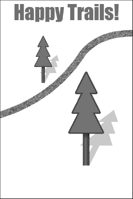

***图 3-1** 。SVG 版的快乐步道！*

SVG 与 HTML 密切相关。如果您愿意，可以用标记定义 SVG 文档的内容。HTML 是一种用于构建页面的声明性语言。SVG 是一种创建可视化结构的辅助语言。您可以使用 DOM APIs 与 SVG 和 HTML 进行交互。SVG 文档是动态的元素树，您可以像 HTML 一样编写脚本和设计样式。您可以将事件处理程序附加到 SVG 元素。例如，您可以使用 click 事件处理程序来制作 SVG 按钮或有形状的可点击区域。这对于构建使用鼠标输入的交互式应用至关重要。

此外，您可以在浏览器的开发工具中查看和编辑 SVG 的结构。正如你在图 3-2 中看到的，内嵌 SVG 直接嵌入到 HTML DOM 中。它有一个你可以在运行时观察和改变的结构。您可以深入研究 SVG 并查看其来源，不像图像只是一个像素网格。

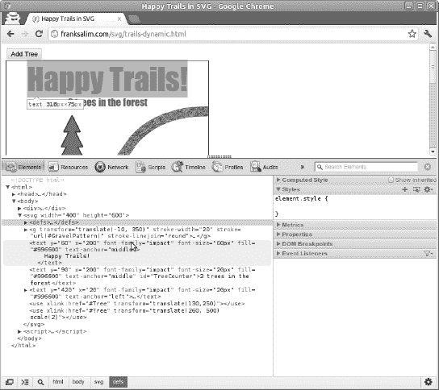

***图 3-2** 。查看 ChromeWeb Inspector 中的 SVG 元素*

在图 3-2 中，高亮显示的文本元素包含以下代码:

`< text y="60" x="200" font-family="impact" font-size="60px"
  fill="#996600" text-anchor="middle">
    Happy Trails
</text>`

在开发环境中，您可以添加、删除和编辑 SVG 元素。这些更改会在活动页面中立即生效。这对于调试和实验来说极其方便。

**保留模式图形**

Frank 说:“在图形 API 设计中有两个学派。canvas 等即时模式图形提供了一个绘图界面。API 调用导致一个绘制动作立即发生*，因此得名。与即时模式图形相对应的样式称为保留模式。在保留模式图形中，场景中有一个随时间保留的视觉对象模型。有一个 API 操纵场景图形，图形引擎在场景发生变化时重绘场景。SVG 是保留模式图形，其场景图是文档。操纵 SVG 的 API 是 W3C DOM API。*

 *有一些 JavaScript 库在 canvas 之上构建保留模式 API。有些还提供精灵、输入处理和层。您可以选择使用这样的库，但是请记住这些特性以及更多特性都是 SVG 固有的！"

#### 可扩展图形

当您放大、旋转或以其他方式变换 SVG 内容时，组成图像的所有线条都会清晰地重新绘制。SVG 在不损失质量的情况下扩展。构成 SVG 文档的矢量信息在呈现时会保留下来。与像素图形形成对比。如果您像放大画布或图像一样放大像素图形，它会变得模糊。这是因为图像是由只能以更高分辨率重新采样的像素组成的。潜在信息——制作图像的路径和形状——在绘制后会丢失(见图 3-3 )。

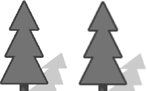

***图 3-3。**放大 500%的 SVG 和画布特写*

#### 用 SVG 创建 2D 图形

让我们再来看看*快乐小径！*图片来自图 3-1 。这个 SVG 图形的每个可见部分都有一些相应的标记。完整的 SVG 语言非常广泛，它的所有细节和细微差别都不适合在本章讲述。然而，为了对 SVG 词汇的广度有所了解，这里有一些用于绘制愉快轨迹的特性:

*   形状
*   小路
*   转换
*   图案和渐变
*   可重用内容
*   文本

在我们将它们组合成一个完整的场景之前，让我们依次看看每一个。但是，在我们这样做之前，我们需要了解如何将 SVG 添加到页面中。

#### 给页面添加 SVG

将内联 SVG 添加到 HTML 页面就像添加任何其他元素一样简单。

在 Web 上使用 SVG 有几种方式，包括作为元素。我们将在 HTML 中使用内联 SVG，因为它将集成到 HTML 文档中。这将让我们以后编写一个无缝结合 HTML、JavaScript 和 SVG 的交互式应用(参见清单 3-1 )。

***清单 3-1。**包含红色矩形的 SVG*

`<!doctype html>
<svg width="200" height="200">
</svg>`

就这样！不需要 XML 名称空间。现在，在开始和结束 svg 标记之间，我们可以添加形状和其他可视对象。如果您想将 SVG 内容拆分成一个单独的。svg 文件，您需要像这样更改它:

`<svg width="400" height="600"
    xmlns:xlink="http://www.w3.org/1999/xlink">
</svg>`

现在它是一个有效的 XML 文档，具有适当的名称空间属性。您将能够使用各种图像查看器和编辑器打开该文档。你也可以从 HTML 中引用一个 SVG 文件，作为带有代码的静态图像，比如``。这种方法的一个缺点是，SVG 文档没有像内联 SVG 内容那样集成到 DOM 中。您将无法编写与 SVG 元素交互的脚本。

#### 简单的形状

SVG 语言包括基本的形状元素，如矩形、圆形和椭圆形。形状元素的大小和位置由属性定义。对于矩形，这些是`width`和`height`。对于圆，半径有一个`r`属性。所有这些都使用距离的 CSS 语法，所以它们可以是像素、点、单位等等。清单 3-2 是一个非常短的包含内嵌 SVG 的 HTML 文档。它只是一个带有红色轮廓的灰色矩形，大小为 100 像素乘 80 像素，显示在图 3-4 中。

***清单 3-2。**包含红色矩形的 SVG*

`<!doctype html>
<svg width="200" height="200">
  <rect x="10" y="20" width="100" height="80" stroke="red" fill="#ccc" />
</svg>` 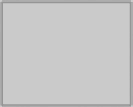

***图 3-4。**HTML 文档中的 SVG 矩形*

SVG 按照对象在文档中出现的顺序绘制对象。如果我们在矩形后添加一个圆，它会出现在第一个形状的顶部。我们将给这个圆一个 8 像素宽的蓝色笔触，没有填充样式(见清单 3-3 ，所以它很突出，如图图 3-5 所示。

***清单 3-3。**一个长方形和一个圆形*

`<!doctype html>
<svg width="200" height="200">
  <rect x="10" y="20" width="100" height="80" stroke="red" fill="#ccc" />
  <circle cx="120" cy="80" r="40" stroke="#00f" fill="none" stroke-width="8" />
</svg>` 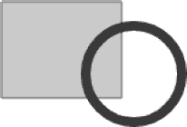

***图 3-5。**一个长方形和一个圆形*

注意，x 和 y 属性定义了矩形左上角的位置。另一方面，圆具有 cx 和 cy 属性，它们是圆心的 x 和 y 值。SVG 使用与 canvas API 相同的坐标系。svg 元素的左上角是位置 0，0。画布坐标系详见第二章。

#### 转换 SVG 元素

SVG 中的组织元素旨在组合多个元素，以便它们可以作为单元进行转换或链接。`<g>`元素代表“组”组可用于组合多个相关元素。作为一个组，它们可以通过一个公共 ID 来引用。一个组也可以作为一个单元进行转换。如果将变换属性添加到组中，该组的所有内容都会被变换。变换属性可以包括旋转(见清单 3-4 和图 3-6 )、平移、缩放和倾斜的命令。您还可以指定一个转换矩阵，就像您使用 canvas API 一样。

***清单 3-4。**旋转组中的矩形和圆形*

`<svg width="200" height="200">
    <g transform="translate(60,0) rotate(30) scale(0.75)" id="ShapeGroup">
      <rect x="10" y="20" width="100" height="80" stroke="red" fill="#ccc" />
      <circle cx="120" cy="80" r="40" stroke="#00f" fill="none" stroke-width="8" />
    </g>
</svg>` 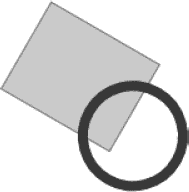

***图 3-6。**一个旋转组*

#### 重复使用内容

SVG 有一个`<defs>`元素，用于定义将来使用的内容。它还有一个名为`<use>`的元素，可以链接到您的定义。这使您可以多次重用相同的内容，并消除冗余。图 3-7 显示了在不同的变换位置和比例下使用了三次的组。这个组的 id 是`ShapeGroup`，它包含一个矩形和一个圆形。实际的矩形和圆形只在`<defs>`元素中定义了一次。定义的组本身是不可见的。相反，有三个`<use>`元素链接到形状组，所以三个矩形和三个圆形呈现在页面上(见清单 3-5 )。

***清单 3-5。**使用一组三次*

`<svg width="200" height="200">
  <defs>
    <g id="ShapeGroup">
      <rect x="10" y="20" width="100" height="80" stroke="red" fill="#ccc" />
      <circle cx="120" cy="80" r="40" stroke="#00f" fill="none" stroke-width="8" />
    </g>
  </defs>

  <use xlink:href="#ShapeGroup" transform="translate(60,0) scale(0.5)"/>
  <use xlink:href="#ShapeGroup" transform="translate(120,80) scale(0.4)"/>
  <use xlink:href="#ShapeGroup" transform="translate(20,60) scale(0.25)"/>
</svg>` 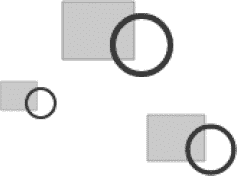

***图 3-7。**三个使用元素引用同一个组*

#### 图案和渐变

图 3-7 中的圆形和矩形具有简单的填充和描边样式。物体可以被绘制成更复杂的样式，包括渐变和图案(见清单 3-6 )。渐变可以是线性的，也可以是放射状的。模式可以由像素图形甚至其他 SVG 元素组成。图 3-8 显示了一个带有线性颜色渐变的矩形和一个带有砾石纹理的圆形。纹理来自链接到 SVG 图像元素的 JPEG 图像。

***清单 3-6。**给矩形和圆形添加纹理*

`<!doctype html>
<svg width="200" height="200">
  <defs>
    <pattern id="GravelPattern" patternUnits="userSpaceOnUse"
          x="0" y="0" width="100" height="67" viewBox="0 0 100 67">
      <image x="0" y="0" width="100" height="67" xlink:href="gravel.jpg"></image>
    </pattern>

    <linearGradient id="RedBlackGradient">
        <stop offset="0%" stop-color="#000"></stop>
        <stop offset="100%" stop-color="#f00"></stop>
    </linearGradient>
  </defs>

  <rect x="10" y="20" width="100" height="80"
      stroke="red"
      fill="url(#RedBlackGradient)" />
  <circle cx="120" cy="80" r="40" stroke="#00f"
      stroke-width="8"
      fill="url(#GravelPattern)" />
</svg>` 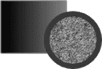

***图 3-8。**渐变填充的矩形和图案填充的圆形*

#### SVG 路径

SVG 有自由形式的路径和简单的形状。路径元素有`d`属性。“d”代表数据。在`d`属性的值中，您可以指定一系列路径绘制命令。每个命令都可能带有坐标参数。有些命令是 M 代表 moveto，L 代表 lineto，Q 代表二次曲线，Z 代表闭合路径。如果这些让你想起了画布绘制 API，那就不是巧合了。清单 3-7 使用一系列 lineto 命令，使用一个路径元素绘制一个封闭的树冠形状。

**清单 3-7。**定义树冠的 SVG 路径

`    <path d="M-25, -50
            L-10, -80
            L-20, -80
            L-5, -110
            L-15, -110
            L0, -140
            L15, -110
            L5, -110
            L20, -80
            L10, -80
            L25, -50
            Z" id="Canopy"></path>`

你可以用 Z 命令关闭一个路径并给它一个填充属性来填充它，就像我们之前画的矩形一样。图 3-9 展示了如何结合描边封闭路径和填充封闭路径来绘制一棵树。

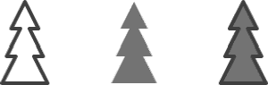

***图 3-9。**描边路径、填充路径和两种路径*

同样，我们可以用两条二次曲线创建一条开放路径，形成一条小径。我们甚至可以赋予它质感。注意清单 3-8 中的`stroke-linejoin`属性。这在两条二次曲线之间形成了圆形连接。图 3-10 显示了一条被绘制成开放路径的山路。

***清单 3-8。**定义扭曲轨迹的 SVG 路径*

`  <g transform="translate(-10, 350)" stroke-width="20" stroke="url(#GravelPattern)" stroke-linejoin="round">
        <path d="M0,0 Q170,-50 260, -190 Q310, -250 410,-250" fill="none"></path>
  </g>` 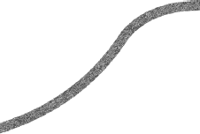

***图 3-10。**包含两条二次曲线的开放路径*

#### 使用 SVG 文本

SVG 也支持文本。SVG 格式的文本可在浏览器中选择(参见图 3-11 )。如果用户愿意，浏览器和搜索引擎也可以允许用户在 SVG 文本元素中搜索文本。这在可用性和可访问性方面有很大的好处。

SVG 文本的属性类似于 HTML 的 CSS 样式规则。清单 3-9 显示了一个具有`font-weight`和`font-family`属性的文本元素。和 CSS 一样，font-family 可以是一个单独的字体名称，如“sans-serif ”,也可以是一系列备用名称，如“Droid Sans，sans-serif ”,按照您喜欢的顺序排列。

***清单 3-9。** SVG 文本*

`<svg width="600" height="200">
  <text
    x="10" y="80"
    font-family="Droid Sans"
    stroke="#00f"
    fill="#0ff"
    font-size="40px"
    font-weight="bold">
    Select this text!
  </text>
</svg>` 

***图 3-11。**选择 SVG 文本*

#### 把场景组合在一起

我们可以把前面所有的元素结合起来，形成一幅快乐小径的图像。文本自然是一个文本元素。树干由两个长方形组成。树冠是两条路。树木投射阴影，使用相同的几何图形给定一个灰色填充颜色和一个向下向右倾斜的变换。穿过图像的弯曲路径是另一个具有纹理图像图案的路径。还有一点 CSS 给场景一个轮廓。

清单 3-10 提供了`trails-static.html`的完整代码。

***清单 3-10。**完整代码为`trails-static.html`*

`<title>Happy Trails in SVG</title>

<svg width="400" height="600">

  <defs>
        <pattern id="GravelPattern" patternUnits="userSpaceOnUse" x="0" y="0" width="100"
height="67" viewBox="0 0 100 67">
        <image x=0 y=0 width=100 height=67 xlink:href="gravel.jpg" />
        </pattern>
        <linearGradient id="TrunkGradient">
        <stop offset="0%" stop-color="#663300" />
        <stop offset="40%" stop-color="#996600" />
        <stop offset="100%" stop-color="#552200" />
        </linearGradient>

        <rect x="-5" y="-50" width=10 height=50 id="Trunk" />
        <path d="M-25, -50
                L-10, -80
                L-20, -80
                L-5, -110
                L-15, -110
                L0, -140
                L15, -110
                L5, -110
                L20, -80
                L10, -80
                L25, -50
                Z"
        id="Canopy"
        />
        <linearGradient id="CanopyShadow" x=0 y=0 x2=0 y2=100%>
        <stop offset="0%" stop-color="#000" stop-opacity=".5" />
        <stop offset="20%" stop-color="#000" stop-opacity="0" />
        </linearGradient>` `        <g id="Tree">
        <use xlink:href="#Trunk" fill="url(#TrunkGradient)" />
        <use xlink:href="#Trunk" fill="url(#CanopyShadow)" />
        <use xlink:href="#Canopy" fill="none" stroke="#663300"
        stroke-linejoin="round" stroke-width="4px" />
        <use xlink:href="#Canopy" fill="#339900" stroke="none" />
        </g>

        <g id="TreeShadow">
        <use xlink:href="#Trunk" fill="#000" />
        <use xlink:href="#Canopy" fill="000" stroke="none" />
        </g>
  </defs>

  <g transform="translate(-10, 350)"
        stroke-width="20"
        stroke="url(#GravelPattern)"
        stroke-linejoin="round">
        <path d="M0,0 Q170,-50 260, -190 Q310, -250 410,-250"
        fill="none" />
  </g>

  <text y=60 x=200
        font-family="impact"
        font-size="60px"
        fill="#996600"
        text-anchor="middle" >
        Happy Trails!
  </text>

  <use xlink:href="#TreeShadow"
        transform="translate(130, 250) scale(1, .6) skewX(-18)"
        opacity="0.4" />
  <use xlink:href="#Tree" transform="translate(130,250)" />

  <use xlink:href="#TreeShadow"
        transform="translate(260, 500) scale(2, 1.2) skewX(-18)"
        opacity="0.4" />

  <use xlink:href="#Tree" transform="translate(260, 500) scale(2)" />
</svg>`

### 使用 SVG 构建交互式应用

在这一节中，我们将扩展静态示例。我们将添加 HTML 和 JavaScript 来使文档具有交互性。我们将在一个应用中利用 SVG 的功能，这个应用需要更多的代码来实现 canvas API。

#### 添加树木

在这个交互式应用中，我们只需要一个按钮元素。按钮的 click 处理程序在 600x400 像素的 SVG 区域内的随机位置添加一个新树。新树也随机缩放 50%到 150%之间的量。每个新树实际上是一个引用包含多条路径的“树”组的`<use>`元素。代码使用命名空间`document.createElementNS()`调用来创建一个`<use>`元素。它用`xlink:href`属性将它链接到先前定义的树组。然后它把新元素添加到 SVG 元素树中(见清单 3-11 )。

***清单 3-11。**添加树功能*

`  document.getElementById("AddTreeButton").onclick = function() {
    var x = Math.floor(Math.random() * 400);
    var y = Math.floor(Math.random() * 600);
    var scale = Math.random() + .5;
    var translate = "translate(" +x+ "," +y+ ") ";

    var tree = document.createElementNS("http://www.w3.org/2000/svg", "use");
    tree.setAttributeNS("http://www.w3.org/1999/xlink", "xlink:href", "#Tree");
    tree.setAttribute("transform", translate + "scale(" + scale + ")");
    document.querySelector("svg").appendChild(tree);
    updateTrees();
  }`

元素按照它们在 DOM 中出现的顺序呈现。这个函数总是将树作为新的子节点添加到 SVG 元素的子节点列表的末尾。这意味着新的树会出现在老的树的上面。

这个函数以调用`updateTrees()`结束，我们接下来会看到。

#### 增加更新树功能

`updateTrees`函数在文档最初加载时以及添加或删除树时运行。它负责更新显示森林中树木数量的文本。它还为每棵树附加了一个点击处理函数(见清单 3-12 )。

***清单 3-12** 更新树函数*

`  function updateTrees() {
    var list = document.querySelectorAll("use");
    var treeCount = 0;
    for (var i=0; i<list.length; i++) {
      if(list[i].getAttribute("xlink:href")=="#Tree") {
        treeCount++;
        list[i].onclick = removeTree;
      }
    }
    var counter = document.getElementById("TreeCounter");
    counter.textContent = treeCount + " trees in the forest";
  }`

关于这段代码，需要注意的一件重要事情是，它在 JavaScript 中没有保留关于树计数的状态。每次发生更新时，这段代码都会选择并过滤 live 文档中的所有树，以获得最新的计数。

#### 增加 removeTree 功能

现在，让我们添加当树被点击时移除它们的函数(见清单 3-13 )。

***清单 3-13。**移除树功能*

`  function removeTree(e) {
    var elt = e.target;
    if (elt.correspondingUseElement) {
      elt = elt.correspondingUseElement;
    }
    elt.parentNode.removeChild(elt);
    updateTrees();
  }`

我们在这里做的第一件事是检查点击事件的目标。由于 DOM 实现的不同，事件目标可以是树组，也可以是链接到该组的 use 元素。不管怎样，这个函数只是从 DOM 中删除那个元素，并调用`updateTrees()`函数。

如果您删除了位于另一棵树顶部的树，您不必做任何事情来重新绘制较低的内容。这是使用保留模式 API 进行开发的好处之一。您只需操作元素树(没有双关的意思),浏览器就会负责绘制必要的像素。同样，当文本更新以显示最新的树数时，它会停留在树的下方。如果希望文本出现在树的上方，就必须在文本元素之前将树附加到文档中。

#### 添加 CSS 样式

为了使交互更容易被发现，我们将添加一些 CSS 来改变鼠标光标下的树的外观:

`g[id=Tree]:hover  {
        opacity: 0.9;
        cursor: crosshair;
  }`

每当您将鼠标悬停在 id 属性等于“Tree”的元素上时，该元素将变为部分透明，并且鼠标光标将变为十字准线。

CSS 中也定义了围绕整个 SVG 元素的一个像素的黑色边框。

`  svg {
    border: 1px solid black;
  }`

就这样！现在你有了一个在 HTML5 中使用内嵌 SVG 的交互式应用(见图 3-12 )。

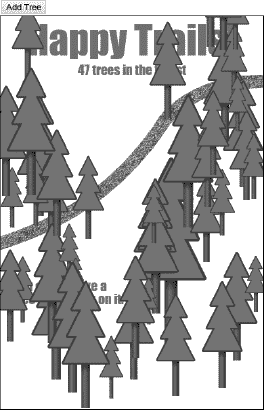

***图 3-12。**最后的文件加上了几棵树*

#### 最终代码

为了完整起见，清单 3-14 提供了完整的`trails-dynamic.html`文件。它包含了静态版本的所有 SVG 以及使其具有交互性的脚本。

***清单 3-14。**整个`trails-dynamic.html`代码*

`<!doctype html>
<title>Happy Trails in SVG</title>

  <button id="AddTreeButton">Add Tree</button>` `

<svg width="400" height="600">

  <defs>
    <pattern id="GravelPattern" patternUnits="userSpaceOnUse" x="0" y="0" width="100" height="67" viewBox="0 0 100 67">
      <image x=0 y=0 width=100 height=67 xlink:href="gravel.jpg" />
    </pattern>
    <linearGradient id="TrunkGradient">
        <stop offset="0%" stop-color="#663300" />
        <stop offset="40%" stop-color="#996600" />
        <stop offset="100%" stop-color="#552200" />
    </linearGradient>

    <rect x="-5" y="-50" width=10 height=50 id="Trunk" />
    <path d="M-25, -50
            L-10, -80
            L-20, -80
            L-5, -110
            L-15, -110
            L0, -140
            L15, -110
            L5, -110
            L20, -80
            L10, -80
            L25, -50
            Z"
        id="Canopy"
      />
    <linearGradient id="CanopyShadow" x=0 y=0 x2=0 y2=100%>
        <stop offset="0%" stop-color="#000" stop-opacity=".5" />
        <stop offset="20%" stop-color="#000" stop-opacity="0" />
    </linearGradient>
    <g id="Tree">
      <use xlink:href="#Trunk" fill="url(#TrunkGradient)" />
      <use xlink:href="#Trunk" fill="url(#CanopyShadow)" />
      <use xlink:href="#Canopy" fill="none" stroke="#663300"
         stroke-linejoin="round" stroke-width="4px" />
      <use xlink:href="#Canopy" fill="#339900" stroke="none" />
    </g>
  </defs>

  <g transform="translate(-10, 350)"
      stroke-width="20"
      stroke="url(#GravelPattern)"
      stroke-linejoin="round">
        <path d="M0,0 Q170,-50 260, -190 Q310, -250 410,-250"
          fill="none" />
  </g>`  `<text y=60 x=200
    font-family="impact"
    font-size="60px"
    fill="#996600"
    text-anchor="middle" >
    Happy Trails!
  </text>
  <text y=90 x=200
    font-family="impact"
    font-size="20px"
    fill="#996600"
    text-anchor="middle" id="TreeCounter">
  </text>

  <text y=420 x=20
    font-family="impact"
    font-size="20px"
    fill="#996600"
    text-anchor="left">
    <tspan>You can remove a</tspan>
    <tspan y=440 x=20>tree by clicking on it.</tspan>
  </text>

  <use xlink:href="#Tree" transform="translate(130,250)" />
  <use xlink:href="#Tree" transform="translate(260, 500) scale(2)" />
</svg>

`

**【SVG 工具】??㎡**

Frank 说:“由于 SVG 作为矢量图形的标准格式有着悠久的历史，因此有许多有用的工具可以用来处理 SVG 图像。甚至还有一个运行在浏览器中的开源编辑器 SVG-edit。你可以把它嵌入到你自己的应用中！在桌面上，Adobe Illustrator 和 Inkscape 是两个强大的矢量图形应用，可以导入和导出 SVG。我发现 Inkscape 对于创建新图形非常有用(见图 3-13 )。

SVG 工具倾向于独立工作。svg 文件，而不是嵌入在 HTML 中的 SVG，所以您可能需要在这两种格式之间进行转换。"

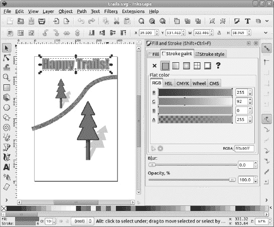

***图 3-13。**在 Inkscape 中修改文本元素的笔画*

### 总结

在这一章中，你已经看到了 HTML5 中的 SVG 是如何提供一种强大的方法来创建具有交互式二维图形的应用的。

首先，我们看一个使用嵌入在 HTML5 文档中的 SVG 绘制的场景。我们检查了构成绘图的元素和属性。我们看到了如何定义和重用内容定义、分组和转换元素，以及使用形状、路径和文本进行绘图。

最后，我们将 JavaScript 添加到一个 SVG 文档中，以制作一个交互式应用。我们使用 CSS、DOM 操作和事件来利用 SVG 作为动态文档的特性。

现在我们已经看到了 SVG 如何将矢量图形引入 HTML5，我们将把注意力转向为应用带来更复杂媒体的视听元素。*