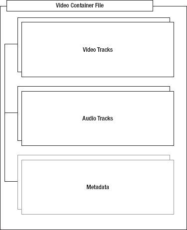
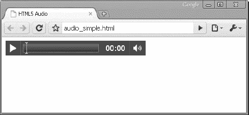
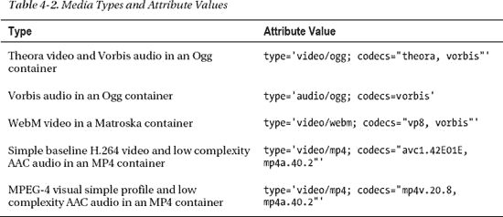
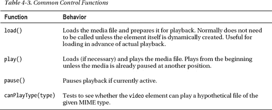
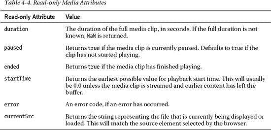
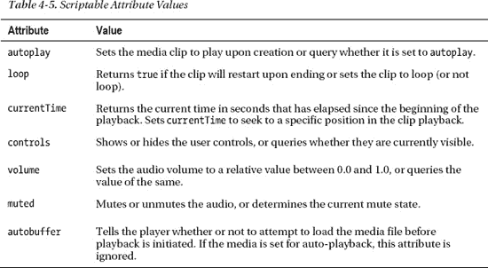
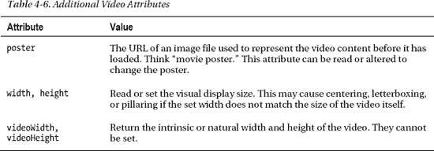
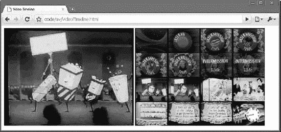
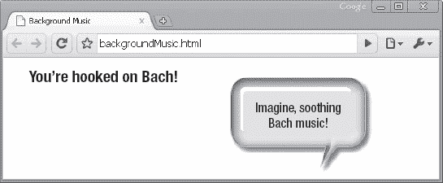
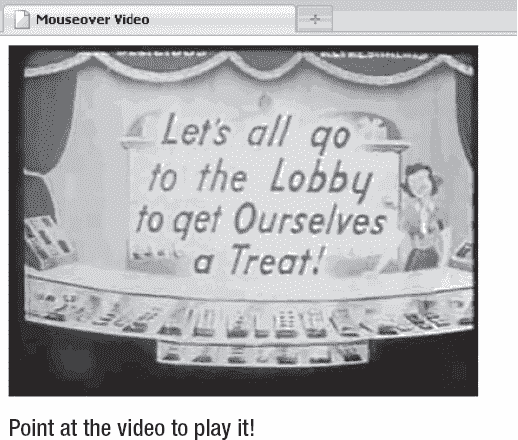

# 四、使用音频和视频

在这一章中，我们将探索你能用两个重要的 HTML5 元素做什么——音频*和视频*并且我们将向你展示它们如何被用来创建引人注目的应用。音频和视频元素为 HTML5 应用添加了新的媒体选项，允许您在没有插件的情况下使用音频和视频，同时提供一个通用的、集成的、可脚本化的 API。**

首先，我们将讨论音频和视频容器文件和编解码器，以及为什么我们最终得到了今天支持的编解码器。我们将继续描述缺乏通用编解码器支持——这是使用媒体元素的最大缺点——并且我们将讨论我们如何希望这在未来不会成为如此大的问题。我们还将向您展示一种切换到最适合浏览器显示的内容类型的机制。

接下来，我们将向您展示如何使用 API 以编程方式使用音频和视频控件，最后我们将探索音频和视频在您的应用中的使用。

### 音频和视频概述

在下面的章节中，我们将讨论一些与音频和视频相关的关键概念:容器和编解码器。

#### 视频容器

音频或视频文件实际上只是一个*容器*文件，类似于包含许多文件的 ZIP 存档文件。图 4-1 显示了一个视频文件(一个视频容器)是如何包含音频轨道、视频轨道和附加元数据的。音频和视频轨道在运行时被组合以播放视频。元数据包含有关视频的信息，如封面、标题和副标题、字幕信息等。

***图 4-1。**视频容器概述*

一些流行的视频容器格式包括:

*   音频视频交错(。avi)
*   Flash 视频(。flv)
*   MPEG 4 (.mp4)
*   型芯型腔(. mkv)
*   ogg(ogv)

#### 音频和视频编解码器

音频和视频*编码器/解码器* ( *编解码器*)是用于编码和解码特定音频或视频流的算法，以便可以播放它们。原始媒体文件非常庞大，因此如果不进行编码，视频或音频剪辑将包含大量数据，这些数据可能太大，无法在合理的时间内通过互联网传输。如果没有解码器，接收方将无法从编码形式中重建原始媒体源。编解码器能够理解特定的容器格式，并对其包含的音频和视频轨道进行解码。

以下是一些示例音频编解码器:

*   加气混凝土
*   MPEG-3
*   还有沃比斯

视频编解码器示例如下:

*   H.264
*   VP8
*   Ogg Theora

##### 编解码器大战和暂时休战

一些编解码器受专利保护，而另一些则免费提供。例如，Vorbis 音频编解码器和 Theora 视频编解码器是免费提供的，而 MPEG-4 和 H.264 编解码器的使用需要支付许可费。

最初，HTML5 规范要求支持某些编解码器。然而，一些供应商不希望包括 Ogg Theora，因为它不是他们现有的硬件和软件堆栈的一部分。例如，苹果的 iPhone 包括 h264 视频的硬件加速解码，但没有 Theora。另一方面，免费系统不能在不损害下游分发的情况下包含专有的付费编解码器。最重要的是，某些专有编解码器提供的性能是浏览器采用免费编解码器的一个因素。这种情况导致了僵局；似乎没有一个单一的编解码器，所有的浏览器供应商都愿意实现。

目前，编解码器要求已从规范中删除。然而，这一决定可能会在未来重新审议。现在，了解当前的浏览器支持，并了解您可能需要为不同的环境重新编码您的媒体。(您可能已经开始这样做了。)

我们确实希望对不同编解码器的支持会随着时间的推移而增加和融合，使常见媒体类型的选择变得容易和普遍。一种编解码器也有可能发展成为 Web 的事实上的标准编解码器。此外，媒体标签具有一种内置机制，可以切换到最适合浏览器显示的内容类型，从而简化对不同环境的支持。

**韦伯来了**

**Frank 说:**“谷歌在 2010 年 5 月推出了 WebM 视频格式。WebM 是一种新的音频和视频格式，旨在清除网络上模糊的媒体格式。WebM 文件的扩展名为`.webm`，在基于 Matroska 的容器中包含 VP8 视频和 Ogg Vorbis 音频。Google 在涵盖源代码和专利权的许可许可下发布了 WebM 规范和软件。作为一种对实施者和发布者都免费的高质量格式，WebM 代表了编解码器领域的重大发展。”

#### 音频和视频限制

音频和视频规范中有一些不支持的内容:

*   *流媒体*音频和视频。即 HTML5 视频目前没有码率切换的标准；当前的实现仅支持完整的媒体文件。然而，一旦支持流媒体格式，该规范的某些方面将在将来支持流媒体。
*   媒体受到 HTTP 跨源资源共享的限制。参见第六章了解更多关于跨产地资源共享的信息(CORS)。
*   全屏视频是不可脚本化的，因为让可脚本化的元素接管全屏会被认为是违反安全的。然而，浏览器可以让用户通过附加控件选择全屏观看视频。

#### 支持音频和视频的浏览器

由于支离破碎的编解码器支持，仅仅知道哪些浏览器支持新的`audio`和`video`元素是不够的；您还需要知道支持哪些编解码器。表 4-1 显示了在撰写本文时哪些浏览器支持哪些编解码器。

还要注意的是，谷歌宣布将放弃对 MP4 格式的支持，但这还没有发生。此外，还有一个插件可以用来在 Internet Explorer 9 中播放 WebM。首先测试是否支持音频和视频总是一个好主意。本章后面的“检查浏览器支持”一节将向您展示如何以编程方式检查浏览器支持。

### 使用音频和视频 API

在本节中，我们将探讨音频和视频在您的应用中的使用。与以前的视频嵌入技术(通常使用 Flash、QuickTime 或 Windows Media 插件嵌入视频)相比，使用新的媒体标签有两个主要优势，旨在使用户和开发人员的生活更加轻松:

*   作为原生浏览器环境的一部分，新的音频和视频标签消除了部署障碍。虽然有些插件的安装率很高，但在受控的企业环境中却经常被屏蔽。一些用户选择禁用这些插件，因为...招摇…广告显示那些插件也能够，这也删除了他们的能力，用于媒体播放。插件也是安全问题的独立攻击媒介。插件通常很难将它们的显示与浏览器的其他内容整合在一起，导致某些网站设计的剪辑或透明度问题。因为插件使用一个独立的呈现模型，这个模型不同于基本网页的呈现模型，如果弹出菜单或其他可视元素需要跨越页面中的插件边界，开发人员会遇到困难。
*   媒体元素向文档展示了一个通用的、集成的、可脚本化的 API。作为一名开发人员，您对新媒体元素的使用允许以非常简单的方式编写内容的控制和回放。在这一章的后面，我们将会看到许多这样的例子。

当然，使用媒体标签有一个主要的缺点:缺乏通用的编解码器支持，这一点在本章前面已经讨论过了。然而，我们预计对编解码器的支持将会增加，并随着时间的推移而融合，使常见媒体类型的选择变得容易和普遍。此外，媒体标签有一个内置机制，可以切换到最适合浏览器显示的内容类型，您很快就会看到这一点。

#### 检查浏览器支持

检查对`video`和`audio`标签支持的最简单方法是用脚本动态创建一个或两个标签，并检查函数的存在:

`var hasVideo = !!(document.createElement('video').canPlayType);`

这个简单的代码行将动态创建一个`video`元素，并检查`canPlayType()`函数是否存在。通过使用`!!`操作符，结果被转换成一个布尔值，该值表示是否可以创建一个视频对象。

但是，如果不支持视频或音频，您可以选择使用一个启用脚本，该脚本将媒体脚本标记引入旧浏览器，允许相同的脚本能力，但使用 Flash 等技术进行回放。

或者，您可以选择在您的`audio`或`video`标签之间包含替代内容，替代内容将代替不支持的标签显示。如果浏览器不支持 HTML5 标签，这种替代内容可以用于 Flash 插件来显示相同的视频。如果你仅仅希望在不支持的浏览器上显示文本消息，在`video`或`audio`元素中添加内容是很容易的，如清单 4-1 所示。

***清单 4-1。**简单视频元素*

`<video src="video.webm" controls>
  Your browser does not support HTML5 video.
</video>`

然而，如果您选择使用一种替代方法来为不支持 HTML5 媒体的浏览器呈现视频，您可以使用相同的元素内容部分来提供对显示相同媒体的外部插件的引用，如清单 4-2 所示。

***清单 4-2。**带闪光后退的视频元素*

`<video src="video.webm" controls>
  <object data="videoplayer.swf" type="application/x-shockwave-flash">
    <param name="movie" value="video.swf"/>
  </object>
  Your browser does not support HTML5 video.
</video>`

通过在`video`元素中嵌入一个显示 Flash 视频的`object`元素，如果 HTML5 视频可用，它将是首选，Flash 视频将用作后备。不幸的是，这需要提供多个版本的视频，直到 HTML5 支持无处不在。

#### 无障碍

让每个人都能访问你的 web 应用不仅仅是正确的事情；这是一笔好生意，在某些情况下，这是法律！应该为视力或听力有限的用户提供满足他们需求的替代内容。请记住，位于视频和音频元素之间的替代内容只有在浏览器*不*支持这些元素时才会显示，因此不适用于浏览器可能支持 HTML5 媒体但用户可能不支持的可访问显示。

视频可访问性的新兴标准是 Web 视频文本轨道(WebVTT)，以前称为 Web 子片段文本(WebSRT)格式。在撰写本文时，它才刚刚开始出现在一些早期版本的浏览器中。WebVTT 使用一个简单的文本文件(`*.vtt`)，在第一行以单词`WEBVTT`开始。`vtt`文件必须以 mime 类型`text/vtt`提供。清单 4-3 显示了一个示例`vtt`文件的内容。

***清单 4-3。** WebVTT 文件*

`WEBVTT

1
00:00:01,000 --> 00:00:03,000
What do you think about HTML5 Video and WebVTT?...

2
00:00:04,000 --> 00:00:08,000
I think it’s great. I can’t wait for all the browsers to support it!`

要在`video`元素中使用`vtt`文件，添加指向`vtt`文件的`track`元素，如下例所示:

`<video src="video.webm" controls>
  <track label="English" kind="subtitles" srclang="en" src="subtitles_en.vtt" default>
  Your browser does not support HTML5 video.
</video>`

您可以添加多个轨道元素。清单 4-4 展示了如何使用指向`vtt`文件的轨道元素来支持英语和荷兰语字幕。

***清单 4-4。**在视频元素中使用 WebVTT 轨道*

`<video src="video.ogg" controls>
  <track label="English" kind="subtitles" srclang="en" src="subtitles_en.vtt">
  <track label="Dutch" kind="subtitles" srclang="nl" src="subtitles_nl.vtt">
  Your browser does not support HTML5 video.
</video>`

WebVTT 标准支持的不仅仅是字幕。它还允许标题和提示设置(关于如何呈现文本的说明)。完整的 WebVTT 语法超出了本书的范围。更多细节见`[www.whatwg.org/specs/web-apps/current-work/webvtt.html](http://www.whatwg.org/specs/web-apps/current-work/webvtt.html)`的 WHATWG 规范。

#### 了解媒体元素

由于一个明智的设计决策，HTML5 中的`audio`和`video`元素之间有很多共性。音频和视频都支持许多相同的操作——播放、暂停、静音/取消静音、加载等——因此，通用行为被分离到规范的*媒体*元素部分。让我们通过观察它们的共同点来开始研究媒体元素。

##### 基础知识:声明你的媒体元素

为了举例，我们将使用一个`audio`标签来尝试 HTML5 媒体的常见行为。本节中的示例将会是非常媒体化的(惊喜！)，它们包含在本书附带的支持文件的`code/av`文件夹中。

举一个最简单的例子(示例文件`audio.html`)，让我们创建一个页面，显示一个舒缓、令人满意、非常公开的领域音频剪辑的音频播放器:约翰·塞巴斯蒂安·巴赫的“空气”(如清单 4-5 所示)。

***清单 4-5。**带有音频元素的 HTML 页面*

`<!DOCTYPE html>
<html>
  <title>HTML5 Audio </title>
  <audio controls src="johann_sebastian_bach_air.ogg">
             An audio clip from Johann Sebastian Bach.
  </audio>
</html>`

这个片段假设 HTML 文档和音频文件(在本例中为`johann_sebastian_bach_air.ogg`)来自同一个目录。如图图 4-2 所示，在支持`audio`标签的浏览器中查看，会显示一个简单的控制和播放栏，代表要播放的音频。当用户单击播放按钮时，音轨会按预期开始播放。

***图 4-2。**简单的音频控制*

`controls`属性告诉浏览器显示用于在媒体剪辑中开始、停止和查找的常见用户控件，以及音量控件。省略`controls`属性会隐藏它们，并且让用户无法开始播放剪辑。

标签之间的内容是浏览器在不支持媒体标签时将显示的文本表示。如果您和您的用户运行的是旧版本的浏览器，他们将会看到这种情况。它还提供了包含媒体的替代呈现器的机会，例如 Flash player 插件或媒体文件的直接链接。

##### 使用源

最后，我们来看最重要的属性:`src`。在最简单的设置中，单个`src`属性指向包含媒体剪辑的文件。但是，如果有问题的浏览器不支持该容器或编解码器(在这种情况下，Ogg 和 Vorbis)呢？然后，另一个声明显示在清单 4-6 中；它包括多个来源，浏览器可以从中选择(参见示例文件`audio_multisource.html`)。

***清单 4-6。**具有多个源元素的音频元素*

`<audio controls>
    <source src="johann_sebastian_bach_air.ogg">
    <source src="johann_sebastian_bach_air.mp3">
    An audio clip from Johann Sebastian Bach.
</audio>`

在这种情况下，我们在`audio`标签上包含了两个新的`source`元素，而不是`src`属性。这允许浏览器选择最适合其回放能力的源，并将最适合的源用作实际的媒体剪辑。源是按顺序处理的，因此可以播放多个列出的源类型的浏览器将使用它遇到的第一个。

 **注意**将用户体验最好或服务器负载最低的媒体源文件放在任何`source`列表的最前面。

在支持的浏览器中运行此剪辑可能不会改变您看到的内容。但是如果浏览器支持 MP3 格式而不支持 Ogg Vorbis 格式，那么现在将支持媒体播放。这种声明模型的优点在于，当您编写代码与媒体文件交互时，实际使用的是哪个容器或编解码器并不重要。浏览器为您提供了一个统一的界面来操作媒体，无论哪个源匹配回放。

但是，还有另一种方法可以提示浏览器使用哪种媒体源。回想一下，媒体容器可以支持许多不同的编解码器类型，您将会理解，浏览器可能会被误导，根据所声明的源文件的扩展名，它支持或不支持哪些类型。如果您指定的类型属性与您的源不匹配，浏览器可能会拒绝播放媒体。只有在您确实知道的情况下，包含类型才是明智的。否则，最好省略这个属性，让浏览器检测编码，如清单 4-7 (在示例文件`audio_type.html`中)所示。还要注意，WebM 格式只允许一个音频编解码器和一个视频编解码器。这意味着`.webm`扩展名或 video/webm 内容类型会告诉您有关该文件的所有信息。如果一个浏览器可以播放。webm，它应该可以播放任何有效的`.webm`文件。

***清单 4-7。**在音频元素中包含类型和编解码器信息*

`<audio controls>
    <source src="johann_sebastian_bach_air.ogg" type="audio/ogg; codecs=vorbis">
    <source src="johann_sebastian_bach_air.mp3" type="audio/mpeg">
    An audio clip from Johann Sebastian Bach.
</audio>`

如您所见，`type`属性可以声明容器和编解码器类型。这里的值分别代表 Ogg Vorbis 和 MP3。完整的列表由 RFC 4281 管理，RFC 4281 是由互联网工程任务组(IETF)维护的文档，但是一些常见的组合在表 4-2 中列出。

##### 取得控制权

您已经看到，默认的回放控件可以通过使用`video`或`audio`标签中的`controls`属性来显示。正如您所料，当显示媒体时，省略该属性将不会显示控件，但是对于*音频*文件，它也不会显示任何内容，因为音频元素的唯一可视表示是它的控件。(没有控件的视频仍会显示视频内容。)省略`controls`属性不应该显示任何影响页面正常呈现的内容。让媒体播放的一种方法是在标签中设置另一个属性:`autoplay`(参见清单 4-8 和示例文件`audio_no_control.html`)。

***清单 4-8。**使用自动播放属性*

`<audio **autoplay**>
    <source src="johann_sebastian_bach_air.ogg" type="audio/ogg; codecs=vorbis">
    <source src="johann_sebastian_bach_air.mp3" type="audio/mpeg">
    An audio clip from Johann Sebastian Bach.
</audio>`

通过包含`autoplay`属性，媒体文件将在加载后立即播放，无需任何用户交互。(注意，并非所有地方都支持自动播放。比如在 iOS 上是禁用的。)然而，大多数用户会觉得这非常令人讨厌，所以谨慎使用`autoplay`。播放音频而不进行提示可能是为了营造一种氛围效果，或者更糟的是，向用户强加一个广告。但它也会干扰用户机器上的其他音频播放，并且对依赖音频屏幕阅读器来浏览网页内容的用户非常不利。还要注意的是，有些设备，比如 iPad，会阻止自动播放，甚至是自动播放媒体文件(例如，由页面加载事件触发)。

如果内置控件不适合用户界面的布局，或者如果您需要使用默认控件中没有公开的计算或行为来控制媒体元素，那么还有许多内置 JavaScript 函数和属性来帮助您。表 4-3 列出了一些最常见的功能。

`canPlayType(type)`方法有一个不明显的用例:通过将任意视频剪辑的 MIME 类型传递给动态创建的`video`元素，您可以使用一个简单的脚本来确定当前浏览器是否支持该类型。例如，以下代码提供了一种快速的方法来确定当前浏览器是否支持播放 MIME 类型为`fooType`的视频，而不在浏览器窗口中显示任何可见内容:

`var supportsFooVideo = !!(document.createElement('video').canPlayType(‘fooType’));`

请注意，该函数返回非常非二进制的“null”、“maybe”或“possible”，其中“possible”是可能的最佳场景。

表 4-4 显示了媒体元素的一些只读属性。

表 4-5 显示了媒体元素上的一些属性，这些属性允许脚本修改它们并直接影响回放。因此，它们的行为类似于函数。

在各种功能和属性之间，开发人员可以创建任何媒体回放用户界面，并使用它来控制浏览器支持的任何音频或视频剪辑。

#### 使用音频

如果你理解了`audio`和`video`媒体元素的共享属性，你基本上已经看到了`audio`标签所能提供的一切。因此，让我们来看一个简单的例子，它展示了控件脚本的运行。

##### 音频激活

如果您的用户界面需要为用户播放音频剪辑，但您不希望播放时间线或控件影响显示，您可以创建一个不可见的`audio`元素，该元素的`controls`属性未设置或设置为`false`，并呈现您自己的音频播放控件。考虑一下清单 4-9 中的简单代码，它也可以在样本代码文件`audioCue.html`中找到。

***清单 4-9。**添加自己的播放按钮控制音频*

`<!DOCTYPE html>
<html>
  <link rel="stylesheet" href="styles.css">
  <title>Audio cue</title>

  <audio id="clickSound">
    <source src="johann_sebastian_bach_air.ogg">` `    <source src="johann_sebastian_bach_air.mp3">
  </audio>

  <button id="toggle" onclick="toggleSound()">Play</button>

  
</html>`

我们再次使用`audio`元素来演奏我们最喜欢的巴赫曲子。然而，在这个例子中，我们隐藏了用户控件，并且没有将剪辑设置为加载时自动播放。相反，我们创建了一个切换按钮来控制脚本的音频回放:

`<button id="toggle" onclick="toggleSound()">Play</button>`

我们的简单按钮被初始化来通知用户点击它将开始回放。并且每按一次按钮，就会触发`toggleSound()`功能。在`toggleSound()`函数中，我们首先访问 DOM 中的`audio`和`button`元素:

`if (music.paused) {
    music.play();
    toggle.innerHTML = "Pause";
}`

通过访问`audio`元素上的`paused`属性，我们可以查看用户是否已经暂停了回放。如果没有开始播放，该属性默认为`true`，所以在第一次点击时将满足该条件。在这种情况下，我们调用剪辑上的`play()`函数，并更改按钮的文本，以指示下一次单击将暂停剪辑:

`else {
    music.pause();
    toggle.innerHTML ="Play";
}`

相反，如果音乐剪辑没有暂停(如果正在播放)，我们将主动`pause()`它，并更改按钮文本以指示下次点击将重新开始播放。似乎很简单，不是吗？这就是 HTML5 中媒体元素的作用:在曾经存在无数插件的地方创建简单的跨媒体类型的显示和控制。简单是它自己的奖励。

#### 处理视频

简单就够了。让我们试试更复杂的。HTML5 `video`元素非常类似于`audio`元素，但是加入了一些额外的属性。表 4-6 显示了其中的一些属性。

`video`元素还有一个不适用于`audio`元素的关键特性:它可以提供给 HTML5 Canvas 的许多功能(参见第二章)。

##### 创建视频时间轴浏览器

在这个更复杂的例子中，我们将展示一个`video`元素如何在动态画布中抓取并显示它的帧。为了演示这一功能，我们将构建一个简单的视频时间轴查看器。当视频播放时，来自显示器的周期性图像帧将被绘制到附近的画布上。当用户点击画布中显示的任何一帧时，我们将视频回放跳转到那个精确的时刻。只需几行代码，我们就可以创建一个时间轴浏览器，用户可以使用它在一个冗长的视频中跳转。

我们的视频剪辑样本是 20 世纪中期电影院诱人的特许广告，所以让我们都去大厅犒劳一下自己(见图 4-3 )。

***图 4-3。**视频时间轴应用*

##### 添加视频和画布元素

我们从显示视频剪辑的简单声明开始:

`<video id="movies" autoplay oncanplay="startVideo()" onended="stopTimeline()" autobuffer="true" width="400px" height="300px">
    <source src="Intermission-Walk-in.ogv">
    <source src="Intermission-Walk-in_512kb.mp4">
</video>`

由于音频示例中的大多数标记对您来说都很熟悉，所以让我们来关注一下它们的区别。很明显，`<audio>`元素已经被`<video>`取代，`<source>`元素指向了浏览器将要选择的 Ogg 和 MPEG 电影。

在这种情况下，视频被声明为具有`autoplay`,这样页面一加载它就开始播放。注册了两个额外的事件处理函数。当视频被加载并准备开始播放时，`oncanplay`功能将触发并启动我们的例程。同样，当视频结束时，`onended`回调将允许我们停止创建视频帧。

接下来，我们将添加一个名为`timeline`的画布，我们将在其中定期绘制视频帧。

`<canvas id="timeline" width="400px" height="300px">`

##### 添加变量

在演示的下一部分中，我们通过声明一些值来开始我们的脚本，这些值将使我们能够轻松地调整演示并使代码更具可读性:

`// # of milliseconds between timeline frame updates
var updateInterval = 5000;`  `// size of the timeline frames
var frameWidth = 100;
var frameHeight = 75;

// number of timeline frames
var frameRows = 4;
var frameColumns = 4;
var frameGrid = frameRows * frameColumns;`

`updateInterval`控制我们捕获视频帧的频率——在本例中，每五秒钟。`frameWidth`和`frameHeight`设置小时间轴视频帧在画布中显示时的大小。类似地，`frameRows`、`frameColumns`和`frameGrid`决定了我们将在时间轴中显示多少帧:

`// current frame
var frameCount = 0;

// to cancel the timer at end of play
var intervalId;

var videoStarted = false;`

为了跟踪我们正在观看的视频帧，所有演示功能都可以访问一个`frameCount`。(为了我们的演示，一帧是我们每五秒钟拍摄的视频样本之一。)这个`intervalId`是用来停止我们将用来抓取帧的计时器。最后，我们添加了一个`videoStarted`标志来确保每个演示只创建一个计时器。

##### 添加 updateFrame 函数

我们演示的核心功能——视频与画布相遇的地方——是我们抓取一个视频帧并将其绘制到画布上的地方:

`// paint a representation of the video frame into our canvas
function updateFrame() {
    var video = document.getElementById("movies");
    var timeline = document.getElementById("timeline");

    var ctx = timeline.getContext("2d");

    // calculate out the current position based on frame
    // count, then draw the image there using the video
    // as a source
    var framePosition = frameCount % frameGrid;
    var frameX = (framePosition % frameColumns) * frameWidth;
    var frameY = (Math.floor(framePosition / frameRows)) * frameHeight;
    ctx.drawImage(video, 0, 0, 400, 300, frameX, frameY, frameWidth, frameHeight);

    frameCount++;
}`

正如你在第二章中看到的，对于任何画布，首先要做的是从中获取二维绘图上下文:

`var ctx = timeline.getContext("2d");`

因为我们想用从左到右、从上到下的帧填充我们的画布网格，所以我们需要根据我们捕获的帧的数量，准确地计算出哪个网格槽将用于我们的帧。根据每个框架的宽度和高度，我们可以确定开始绘图的精确 X 和 Y 坐标:

`var framePosition = frameCount % frameGrid;
var frameX = (framePosition % frameColumns) * frameWidth;
var frameY = (Math.floor(framePosition / frameRows)) * frameHeight;`

最后，我们到达在画布上绘制图像的按键调用。我们之前在 canvas 演示中已经看到了位置和缩放参数，但是这里我们没有将图像传递给`drawImage`例程，而是传递视频对象本身:

`ctx.drawImage(video, 0, 0, 400, 300, frameX, frameY, frameWidth, frameHeight);`

画布绘制例程可以将视频源作为图像或模式，这为您提供了一种修改视频并在另一个位置重新显示视频的便捷方式。

 **注意**当画布使用视频作为输入源时，它只绘制当前显示的视频帧。画布显示不会随着视频播放而动态更新。相反，如果您希望画布内容更新，您必须在视频播放时重新绘制图像。

##### 增加启动视频功能

最后，我们更新`frameCount`以反映我们已经为我们的时间线拍摄了新的快照。现在，我们只需要一个例程来定期更新我们的时间轴帧:

`function startVideo() {

    // only set up the timer the first time the
    // video is started
    if (videoStarted)
        return;

        videoStarted = true;

        // calculate an initial frame, then create
        // additional frames on a regular timer
        updateFrame();
        intervalId = setInterval(updateFrame, updateInterval);`

回想一下，一旦视频加载足够开始播放，就会触发`startVideo()`功能。首先，我们确保每次页面加载只处理一次视频开始，以防视频重新开始:

`// only set up the timer the first time the
    // video is started` `    if (videoStarted)
        return;

        videoStarted = true;`

当视频开始时，我们将捕捉我们的第一帧。然后，我们将启动一个间隔计时器——一个在指定的更新间隔持续重复的计时器——它将定期调用我们的`updateFrame()`函数。最终结果是每五秒钟捕获一个新帧:

`        // calculate an initial frame, then create
        // additional frames on a regular timer
        updateFrame();
        intervalId = setInterval(updateFrame, updateInterval);`

##### 处理用户输入

现在，我们需要做的就是处理单个时间轴帧的用户点击:

`// set up a handler to seek the video when a frame
// is clicked
var timeline = document.getElementById("timeline");
timeline.onclick = function(evt) {
    var offX = evt.layerX - timeline.offsetLeft;
    var offY = evt.layerY - timeline.offsetTop;

    // calculate which frame in the grid was clicked
    // from a zero-based index
    var clickedFrame = Math.floor(offY / frameHeight) * frameRows;
    clickedFrame += Math.floor(offX / frameWidth);

    // find the actual frame since the video started
    var seekedFrame = (((Math.floor(frameCount / frameGrid)) *
                                frameGrid) + clickedFrame);

    // if the user clicked ahead of the current frame
    // then assume it was the last round of frames
    if (clickedFrame > (frameCount % 16))
        seekedFrame -= frameGrid;

        // can't seek before the video
        if (seekedFrame < 0)
            return;`

事情变得有点复杂了。我们检索时间轴画布，并在其上设置一个点击处理函数。处理程序将使用事件来确定用户单击了哪个 X 和 Y 坐标:

`    var timeline = document.getElementById("timeline");
    timeline.onclick = function(evt) {
        var offX = evt.layerX - timeline.offsetLeft;
        var offY = evt.layerY - timeline.offsetTop;`

然后，我们使用框架尺寸来计算用户点击了 16 个框架中的哪一个:

`            // calculate which frame in the grid was clicked
            // from a zero-based index
            var clickedFrame = Math.floor(offY / frameHeight) * frameRows;
            clickedFrame += Math.floor(offX / frameWidth);`

单击的帧应该只是最近的视频帧之一，因此确定对应于该网格索引的最近的帧:

`   // find the actual frame since the video started
    var seekedFrame = (((Math.floor(frameCount / frameGrid)) *
                                               frameGrid) + clickedFrame);`

如果用户在当前帧之前单击，则跳回一个完整的网格帧周期以找到实际时间:

`    // if the user clicked ahead of the current frame
    // then assume it was the last round of frames
    if (clickedFrame > (frameCount % 16))
        seekedFrame -= frameGrid;`

最后，我们必须防止用户点击视频剪辑开始前的帧:

`    // can't seek before the video
    if (seekedFrame < 0)
        return;`

现在我们知道了用户想要寻找的时间点，我们可以使用该知识来更改当前的回放时间。尽管这是关键的演示函数，但例程本身非常简单:

`    // seek the video to that frame (in seconds)
    var video = document.getElementById("movies");
    video.currentTime = seekedFrame * updateInterval / 1000;

    // then set the frame count to our destination
    frameCount = seekedFrame;`

通过在我们的视频元素上设置`currentTime`属性，我们使视频搜索到指定的时间，并将我们当前的帧计数重置为新选择的帧。

 **注意**与许多处理毫秒的 JavaScript 计时器不同，视频的`currentTime`是以秒为单位指定的。

##### 添加 stopTimeline 功能

对于我们的视频时间轴演示来说，剩下的就是当视频结束播放时停止捕捉帧。虽然不是必需的，但如果我们不执行这一步，演示将继续捕获已完成的演示的帧，过一会儿整个时间轴将会消失:

`// stop gathering the timeline frames
function stopTimeline() {
    clearInterval(intervalId);
}`

当我们的另一个视频处理程序——`onended`——被视频播放完成触发时，将调用`stopTimeline`处理程序。

我们的视频时间轴的功能可能还不足以让高级用户满意，但它只用了很少的代码就完成了。现在，继续表演。

##### 最终代码

清单 4-10 显示了视频时间线页面的完整代码。

***清单 4-10。**完整的视频时间轴代码*

`<!DOCTYPE html>
<html>
  <link rel="stylesheet" href="styles.css">
  <title>Video Timeline</title>

  <video id="movies" autoplay oncanplay="startVideo()" onended="stopTimeline()"
autobuffer="true"
    width="400px" height="300px">
    <source src="Intermission-Walk-in.ogv">
    <source src="Intermission-Walk-in_512kb.mp4">
  </video>

  <canvas id="timeline" width="400px" height="300px">

  

</html>`

#### 实用的临时演员

有时有些技术不适合我们的常规例子，但仍然适用于许多类型的 HTML5 应用。我们在这里向你展示一些简短但常见的实用附加功能。

##### 页面中的背景噪音

许多网站试图通过默认为任何访问者播放音频来娱乐观众。虽然我们不容忍这种做法，但是音频支持使得实现这一点非常容易，如清单 4-11 所示。

***清单 4-11。**使用循环和自动播放属性*

`<!DOCTYPE html>
<html>
  <link rel="stylesheet" href="styles.css">
  <title>Background Music</title>

  <audio autoplay loop>
      <source src="johann_sebastian_bach_air.ogg">
      <source src="johann_sebastian_bach_air.mp3">
  </audio`  `<h1>You're hooked on Bach!</h1>

</html>`

正如你所看到的，播放一个循环的背景声音就像声明一个带有`autoplay`和`loop`属性集的`audio`标签一样简单(参见图 4-4 )。

***图 4-4。**使用自动播放功能在页面加载时播放音乐*

**在<眨眼>中失去观众**

**布莱恩对**说:“权力越大，责任越大，仅仅因为你*能*，并不意味着你*就应该*。如果你想要一个例子，只要记住`<blink>`标签！”

不要让简单的音频和视频播放诱惑你在不合适的地方使用它。如果您有令人信服的理由来启用带有`autoplay`的媒体—可能是用户期望内容在加载时启动的媒体浏览器—请确保提供禁用该功能的明确方法。没有什么比讨厌的内容更能让用户迅速离开你的网站，因为这些内容是他们不容易关掉的。"

##### 鼠标悬停视频播放

对视频剪辑有效使用简单脚本的另一种方法是根据鼠标在视频上的移动触发`play`和`pause`例程。这在需要显示许多视频剪辑并让用户选择播放的站点中可能很有用。当用户将鼠标移动到视频剪辑上时，视频剪辑库可以显示简短的预览剪辑，当用户单击时，可以显示完整的视频。使用类似于清单 4-12 的代码样本很容易达到这种效果(参见示例文件`mouseoverVideo.html`)。

***清单 4-12。**鼠标检测到一个视频元素上*

`<!DOCTYPE html>
<html>` `  <link rel="stylesheet" href="styles.css">
  <title>Mouseover Video</title>

  <video id="movies" onmouseover="this.play()" onmouseout="this.pause()"
        autobuffer="true"
    width="400px" height="300px">
    <source src="Intermission-Walk-in.ogv" type='video/ogg; codecs="theora, vorbis"'>
    <source src="Intermission-Walk-in_512kb.mp4" type='video/mp4; codecs="avc1.42E01E,                  mp4a.40.2"'>
  </video>
</html>`

通过简单地设置一些额外的属性，当用户指向视频时可以触发预览回放，如图 4-5 所示。

***图 4-5。**鼠标悬停视频播放*

### 总结

在这一章中，我们探索了你可以用两个重要的 HTML5 元素`audio`和`video`做什么。我们已经向您展示了如何使用它们来创建引人注目的 web 应用。`audio`和`video`元素为 HTML5 应用添加了新的媒体选项，允许您在没有插件的情况下使用音频和视频，同时提供一个通用的、集成的、可脚本化的 API。

首先，我们讨论了音频和视频容器文件和编解码器，以及为什么我们最终选择了目前支持的编解码器。然后，我们向您展示了一种切换到最适合浏览器显示的内容类型的机制，并向您展示了如何使用 WebVTT 访问视频。

接下来，我们向您展示了如何使用 API 以编程方式使用控件音频和视频，最后我们看了如何在您的应用中使用 HTML5 音频和视频。

在下一章，我们将展示如何用最少的代码使用地理定位来定制应用的输出以适应用户的位置。