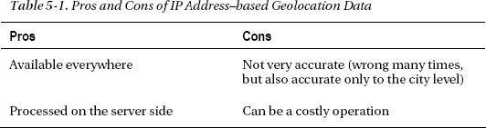
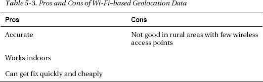
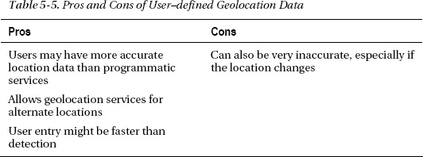
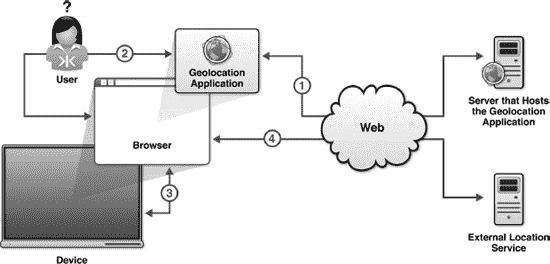
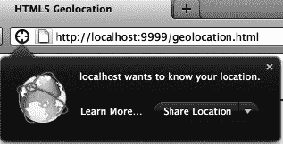
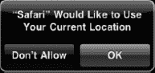
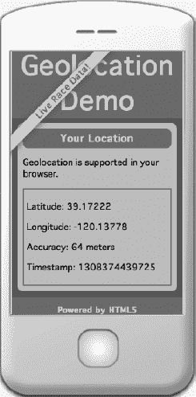
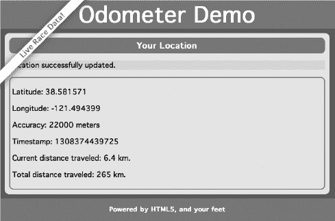
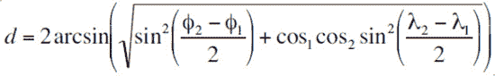
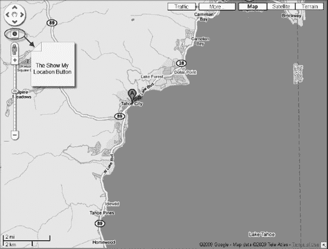

# 五、使用地理定位 API

假设您想要创建一个 web 应用，在应用用户步行(或跑步)即可到达的商店中提供跑鞋折扣和特价。使用地理定位 API，您可以请求用户共享他们的位置，如果他们同意，您可以向他们提供如何去附近的商店以折扣价购买一双新鞋的说明。

使用地理定位的另一个例子是一个追踪你跑了(或走了)多远的应用。你可以想象在开始跑步时打开手机浏览器中的应用。当你在移动时，应用会跟踪你跑了多远。跑步的坐标甚至可以覆盖在地图上，甚至可能带有高程剖面图。如果你在和其他对手赛跑，这个应用甚至可以显示对手的位置。

其他地理定位应用的想法可能是逐圈 GPS 风格的导航，社交网络应用，让你可以看到你的朋友在哪里，这样你就可以选择你想去的咖啡店，以及许多不寻常的应用。

在这一章中，我们将探索使用地理定位可以做些什么，这是一个令人兴奋的 API，它允许用户与 web 应用共享他们的位置，以便他们可以享受位置感知服务。首先，我们来看看地理位置信息的来源——纬度、经度和其他属性——以及它们来自哪里(GPS、Wi-Fi、蜂窝三角测量等等)。然后，我们将讨论使用地理位置数据的隐私问题，以及浏览器如何处理这些数据。

之后，我们将深入讨论地理定位 API 中两种不同的位置请求函数(方法):一次性位置请求和重复位置更新，我们将向您展示如何以及何时使用它们。接下来，我们将向您展示如何使用相同的 API 构建一个实用的地理定位应用，最后我们将讨论一些额外的用例及技巧。

### 关于位置信息

使用地理定位 API 相当简单。您请求一个位置，如果用户同意，浏览器将返回位置信息。位置由运行支持地理定位的浏览器的底层设备(例如，膝上型电脑或移动电话)提供给浏览器。位置信息作为一组纬度和经度坐标以及附加元数据提供。有了这些位置信息，您就可以构建一个引人注目的位置感知应用。

#### 经纬度坐标

位置信息主要由一对纬度和经度坐标组成，如下例所示，显示了美丽的太浩城的坐标，该城位于太浩湖(美国最美丽的山湖)的岸边:

`Latitude: 39.17222, Longitude: -120.13778`

在前面的示例中，纬度(表示赤道以北或以南距离的数值为 39.17222)和经度(表示英格兰格林威治以东或以西距离的数值)为-120.13778。

纬度和经度坐标可以用不同的方式表示:

*   十进制格式(例如，39.17222)
*   度分秒(DMS)格式(例如，39° 10′20′)

 **注意**当你使用地理定位 API 时，坐标总是以十进制格式返回。

除了纬度和经度坐标，地理定位总是提供位置坐标的*精度*。根据运行浏览器的设备，可能还会提供其他元数据。这些包括*高度*、*高度精度*、*航向*和*速度*。如果此附加元数据不可用，它将作为空值返回。

#### 位置信息从哪里来？

地理定位 API 没有指定设备必须使用哪种底层技术来定位应用的用户。相反，它只是公开了一个用于检索位置信息的 API。然而，暴露出来的是精确定位的程度。不能保证设备的实际位置会返回准确的位置。

**位置，位置**

彼得说:“这是一个有趣的例子。在家里，我使用无线网络。我在 Firefox 中打开了本章中显示的地理定位示例应用，它计算出我在萨克拉门托(距离我的实际物理位置大约 75 英里)。错了，但不要太惊讶，因为我的互联网服务提供商位于萨克拉门托市中心。

然后，我让我的儿子 Sean 和 Rocky 在他们的 iPhones 上浏览相同的页面(使用相同的 Wi-Fi 网络)。在 Safari 中，它们看起来像是位于加利福尼亚州的马里斯维尔——一个距离萨克拉门托 30 英里的小镇。真不敢相信"

设备可以使用以下任何来源:

*   国际电脑互联网地址
*   坐标三角测量
    *   全球定位系统
    *   带有来自 RFID、Wi-Fi 和蓝牙的 MAC 地址的 Wi-Fi
    *   GSM 或 CDMA 手机 id
*   用户定义的

许多设备使用一个或多个信号源的组合来确保更高的精度。每种方法都有自己的优点和缺点，这将在下一节中解释。

#### IP 地址地理位置数据

在过去，基于 IP 地址的地理定位是获得可能位置的唯一方法，但返回的位置往往被证明是不可靠的。基于 IP 地址的地理定位的工作原理是自动查找用户的 IP 地址，然后检索注册人的物理地址。因此，如果您的 ISP 为您提供 IP 地址，您的位置通常会被解析为服务提供商的物理地址，而该地址可能在数英里之外。表 5-1 显示了基于 IP 地址的地理定位数据的优缺点。

许多网站基于 IP 地址位置做广告。当你到另一个国家旅行，突然看到当地服务的广告(基于你所访问的国家或地区的 IP 地址)时，你可以看到这一点。

#### GPS 地理定位数据

只要能看到天空，GPS 就能提供非常精确的定位结果。通过从围绕地球飞行的多个 GPS 卫星获取信号来获取 GPS 定位。然而，修复需要一段时间，这对于必须快速启动的应用来说不是特别好。

因为获取 GPS 定位可能需要很长时间，所以您可能希望异步查询用户的位置。要向应用的用户显示正在获取修复，您可以添加一个状态栏。表 5-2 显示了基于 GPS 的地理定位数据的优缺点。

#### 无线地理定位数据

基于 Wi-Fi 的地理定位信息是通过根据用户与许多已知 Wi-Fi 接入点的距离对位置进行三角测量来获取的，这些接入点大多位于城市地区。与 GPS 不同，Wi-Fi 在室内和市区都非常准确。表 5-3 显示了基于 Wi-Fi 的地理定位数据的利与弊。

#### 手机地理定位数据

基于手机的地理定位信息是通过基于用户与多个手机信号塔的距离对位置进行三角测量而获得的。这种方法提供了相当精确的一般定位结果。这种方法通常与基于 Wi-Fi 和 GPS 的地理定位信息结合使用。表 5-4 显示了基于手机的地理定位数据的利与弊。

#### 用户定义的地理位置数据

您也可以允许用户自己定义他们的位置，而不是通过编程来确定用户的位置。一个应用可能允许用户输入他们的地址、邮政编码或其他一些细节；然后，您的应用可以使用这些信息来提供位置感知服务。表 5-5 显示了用户定义的地理位置数据的优缺点。

### 支持地理定位的浏览器

地理定位是第一批被完全接受和实现的 HTML5 特性之一，现在它在所有主流浏览器中都可用。有关当前浏览器支持的完整概述，包括移动支持，请参阅`[`caniuse.com`](http://caniuse.com)`并搜索地理位置。

如果您必须支持较旧的浏览器，那么在使用 API 之前，最好先看看是否支持地理定位。本章后面的“检查浏览器支持”一节将向您展示如何以编程方式检查浏览器支持。

### 隐私

地理位置规范要求提供一种机制来保护用户的隐私。此外，除非应用的用户明确许可，否则位置信息不应公开。

这很有意义，并且解决了用户经常提出的关于地理定位应用的“老大哥”问题。然而，正如您从 HTML 5 地理定位应用的一些可能的用例中所看到的，用户通常会有分享这些信息的动机。例如，用户可能会同意分享他们的位置，如果这可以让他们知道一双跑鞋有罕见的 50%折扣，而这双跑鞋就在离他们碰巧喝咖啡的地方几个街区远的商店里。让我们仔细看看图 5-1 所示的浏览器和设备隐私架构。

***图 5-1。**地理定位浏览器和设备隐私架构*

图表中显示了以下步骤:

1.  用户在浏览器中导航到位置感知应用。
2.  应用网页通过进行地理定位功能调用从浏览器加载并请求坐标。浏览器拦截这一请求并请求用户许可。让我们假设，在这种情况下，许可被授予。
3.  浏览器从运行它的设备上检索坐标信息。例如，IP 地址、Wi-Fi 和可能的 GPS 坐标的组合。这是浏览器的内部功能。
4.  浏览器将这些坐标发送给可信的外部位置服务，后者返回位置坐标，现在可以将这些坐标发送回地理定位应用的主机。

 **重要**应用是否*而非*直接访问设备；它只能查询浏览器来代表它访问设备。

#### 触发隐私保护机制

当你访问一个使用地理定位 API 的网页时，隐私保护机制就会发挥作用。图 5-2 显示了这在 Firefox 中的样子。

***图 5-2。**当使用地理定位 API 时，Firefox 中的通知栏被触发。*

当地理定位代码被执行时，该机制被触发。简单地添加不在任何地方调用的地理位置代码(例如，在一个`onload`方法中)不会做任何事情。然而，如果地理位置代码被执行，例如，在对`navigator.geolocation.getCurrentPosition`的调用中(稍后更详细地解释)，用户被提示与应用共享他们的位置。图 5-3 显示了在 iPhone 上运行 Safari 时会发生什么。

***图 5-3。**使用地理定位 API 时，Safari 中会触发通知对话框。*

除了提供必要的机制来请求共享你的位置，一些实现(例如 Firefox)还允许你在下次登录时记住授予该站点的权限。这类似于你在浏览器中记住某些网站的密码。

 **注意**如果你已经允许在 Firefox 中始终向某个网站提供你的位置，但后来又改变了主意，你可以很容易地撤销这个许可，方法是返回该网站，从**工具**菜单中选择**页面信息**。然后在**权限**选项卡上更改**共享位置**的设置。

#### 处理位置信息

位置数据是敏感信息，因此当您收到它时，必须小心处理、存储和重新传输数据。除非用户授予存储数据的权限，否则您应该始终在需要数据的任务完成后处置数据。

因此，如果您重新传输位置数据，建议您首先加密数据。关于地理位置数据的收集，您的应用应该突出显示以下内容:

*   你正在收集位置数据
*   您收集位置数据的原因
*   位置数据保留多长时间
*   您如何保护数据
*   位置数据如何共享以及与谁共享(如果共享)
*   用户如何检查和更新他们的位置数据

### 使用地理定位 API

在这一节中，我们将更详细地探索地理定位 API 的使用。为了便于说明，我们创建了一个简单的浏览器页面— `geolocation.html`。记住，你可以从本书的页面`apress.com`或配套网站`[`prohtml5.com`](http://prohtml5.com)`上下载所有代码。

#### 检查浏览器支持

在调用地理定位 API 函数之前，您需要确保浏览器支持您将要做的事情。这样，您可以提供一些替代文本，提示您的应用的用户放弃他们的恐龙般的浏览器或安装一个插件，如 Gears，它增强了现有的浏览器功能。清单 5-1 显示了一种测试浏览器支持的方法。

***清单 5-1。**检查浏览器支持*

`function loadDemo() {
  if(navigator.geolocation) {
    document.getElementById("support").innerHTML = "Geolocation supported.";

} else {
     document.getElementById("support").innerHTML = "Geolocation is not supported in
                                        your browser.";
    }
}`

在这个例子中，您在`loadDemo`函数中测试浏览器支持，这个函数可能在应用的页面加载时被调用。对`navigator.geolocation`(也可以使用 Modernizr)的调用将返回地理位置对象(如果它存在的话),或者如果它不存在就触发失败案例。在这种情况下，通过用合适的消息更新页面上先前定义的`support`元素，页面被更新以反映是否有浏览器支持。

#### 位置请求

有两种类型的职位请求:

*   一次性位置请求
*   重复位置更新

##### 一次性位置请求

在许多应用中，只检索一次用户的位置，或者只根据请求检索，这是可以接受的。例如，如果有人正在寻找最近的电影院，放映今天的热门电影，可以使用清单 5-2 中最简单的地理定位 API。

***清单 5-2。**一次性位置请求*

`void getCurrentPosition(in PositionCallback successCallback,
                 in optional PositionErrorCallback errorCallback,
                 in optional PositionOptions options);`

让我们更详细地看看这个核心函数调用。

首先，这是一个在`navigator.geolocation`对象上可用的函数，所以您需要已经在脚本中检索了这个对象。如前所述，如果您的浏览器不支持地理定位，请确保您有一个好的后备处理程序。

该函数有一个必需的参数和两个可选的参数。

*   `successCallback`函数参数告诉浏览器，当位置数据可用时，您希望调用哪个函数。这一点很重要，因为提取位置数据等操作可能需要很长时间才能完成。没有用户希望在检索位置时浏览器被锁定，也没有开发人员希望他的程序无限期暂停——特别是因为获取位置数据通常要等待用户的许可。successCallback 是您接收实际位置信息并对其进行操作的地方。
*   然而，与大多数编程场景一样，最好为失败情况做好计划。对于位置信息的请求很有可能因为超出您控制的原因而无法完成，对于这些情况，您将希望提供一个`errorCallback`函数，该函数可以向用户提供一个解释，或者尝试再试一次。虽然是可选的，但建议您提供一个。
*   最后，可以向地理定位服务提供一个`options`对象来微调它收集数据的方式。这是一个可选参数，我们将在后面进行研究。

假设您在我们的页面上创建了一个名为`updateLocation()`的 JavaScript 函数，在这个函数中，您用新的位置数据更新页面的内容。类似地，您已经创建了一个`handleLocationError()`函数来处理错误情况。接下来我们将研究这些函数的细节，但这意味着您访问用户位置的核心请求将如下所示:

`navigator.geolocation.getCurrentPosition(updateLocation, handleLocationError);`

###### update location()函数

那么，在我们的`updateLocation()`通话中会发生什么呢？其实挺简单的。一旦浏览器访问到位置信息，它将调用带有单个参数的`updateLocation()`:一个位置对象。位置将包含坐标(作为属性`coords`)和收集位置数据时的时间戳。虽然您可能需要也可能不需要时间戳，但是`coords`属性包含位置的关键值。

坐标上总是有多个属性，但是它们是否有有意义的值取决于浏览器和用户设备的硬件。以下是前三个属性:

*   `latitude`
*   `longitude`
*   `accuracy`

这些属性保证有值，并且是不言自明的。`latitude`和`longitude`将包含以十进制度数指定的用户位置的地理定位服务的最佳确定值。`accuracy`将包含一个以米为单位的值，该值指定纬度和经度值与实际位置的接近程度，置信度为 95%。因此，它可用于显示位置周围的邻近半径，为人们提供关于精确度的视觉线索。由于地理定位实现的性质，近似将是常见和粗略的。在您有把握地呈现返回值之前，请确保检查它们的准确性。推荐用户去一家“附近”的鞋店，而这家鞋店实际上有几个小时的路程，这可能会产生意想不到的后果。

坐标的其他属性不能保证得到支持，但是如果它们不可用，它们将返回一个`null`值(例如，如果您在台式计算机上，您不太可能访问这些信息):

*   `altitude`—用户所在位置的高度，单位为米
*   `altitudeAccuracy`—再次以米为单位，如果没有提供高度，则为`null`
*   `heading`—相对于正北的行进方向，单位为度
*   `speed`——地面速度，单位为米/秒

除非您确定您的用户拥有能够访问此类信息的设备，否则建议您不要依赖它们作为您的应用的关键。虽然全球定位设备可能提供这种级别的细节，但简单的网络三角测量无法提供。

现在让我们来看看我们的`updateLocation()`函数的代码实现，它用坐标执行一些琐碎的更新(见清单 5-3 )。

***清单 5-3。**使用 updateLocation()函数的例子*

`function updateLocation(position) {
  var latitude = position.coords.latitude;
  var longitude = position.coords.longitude;
  var accuracy = position.coords.accuracy;
  var timestamp = position.timestamp;

  document.getElementById("latitude").innerHTML = latitude;
  document.getElementById("longitude").innerHTML = longitude;` `  document.getElementById(“accuracy”).innerHTML = accuracy
  document.getElementById("timestamp").innerHTML = timestamp;
}`

在这个例子中，`updateLocation()`回调用于更新页面不同元素中的文本；我们将`longitude`属性的值放在经度元素中，将`latitude`属性放在纬度元素中，并将精确度和时间戳放在它们对应的字段中。

###### handleLocationError()函数

处理错误对于地理定位应用非常重要，因为有许多移动部件，因此位置计算服务有许多出错的可能性。幸运的是，API 为您需要处理的所有情况定义了错误代码，并将它们设置在作为`code`属性传递给错误处理程序的错误对象上。让我们依次看看它们:

*   `PERMISSION_DENIED`(错误代码 1)—用户选择不让浏览器访问位置信息。
*   `POSITION_UNAVAILABLE`(错误代码 2)—尝试了用于确定用户位置的技术，但失败了。
*   `TIMEOUT`(错误代码 3)—超时值被设置为一个选项，确定位置的尝试超过了该限制。

在这些情况下，您可能希望让用户知道有什么地方出错了。在请求不可用或超时的情况下，您可能希望重试获取值。

清单 5-4 展示了一个错误处理程序的例子。

***清单 5-4。**使用错误处理器*

`    function handleLocationError(error) {
        switch(error.code){
        case 0:
          updateStatus("There was an error while retrieving your location: " +
                                       error.message);
        break;
        case 1:
        updateStatus("The user prevented this page from retrieving a location.");
        break;
        case 2:
        updateStatus("The browser was unable to determine your location: " +
                                     error.message);
        break;
        case 3:
        updateStatus("The browser timed out before retrieving the location.");
        break;
        }
    }`

错误代码是从提供的`error`对象的`code`属性中访问的，而`message`属性将提供对错误的更详细描述。在所有情况下，我们调用自己的例程用必要的信息更新页面的状态。

###### 可选地理定位请求属性

处理了正常情况和错误情况后，您应该将注意力转向可以传递给地理定位服务的三个可选属性，以便微调它收集数据的方式。请注意，这三个属性可以使用速记对象符号来传递，这使得将它们添加到地理位置请求调用变得很简单。

*   `enableHighAccuracy`—This is a hint to the browser that, if available, you would like the Geolocation service to use a higher accuracy-detection mode. This defaults to false, but when turned on, it may not cause any difference, or it may cause the machine to take more time or power to determine location. Use with caution.

     **注**奇怪的是，高精度设定只有一个拨动开关:`true`或`false`。创建 API 不是为了允许将精度设置为各种值或数值范围。也许这将在规范的未来版本中得到解决。

*   `timeout`—此可选值以毫秒为单位，告知浏览器允许计算当前位置的最大时间。如果计算没有在这段时间内完成，则调用错误处理程序。该值默认为无穷大，即无限制。
*   `maximumAge`—This value indicates how old a location value can be before the browser must attempt to recalculate. Again, it is a value in milliseconds. This value defaults to zero, meaning that the browser must attempt to recalculate a value immediately.

     **注意**你可能想知道`timeout`和`maximumAge`选项之间的区别。虽然名字相似，但它们确实有不同的用途。`timeout`值是指计算位置值所需的*持续时间*，而`maximumAge`是指位置计算的*频率*。如果任何一次计算花费的时间超过`timeout`值，就会触发错误。但是，如果浏览器没有比`maximumAge`更早的最新位置值，它必须重新获取另一个值。特殊值在这里适用:将`maximumAge`设置为“0”要求值总是被重新提取，而将其设置为`Infinity`意味着它永远不会被重新提取。

地理位置 API 不允许您告诉浏览器重新计算位置的频率。这完全取决于浏览器的实现。我们所能做的就是告诉浏览器`maximumAge`是它返回的值的什么。实际频率是我们无法控制的细节。

让我们使用简写符号更新我们的位置请求，以包含一个可选参数，如以下示例所示:

`navigator.geolocation.getCurrentPosition(updateLocation,handleLocationError,
                                         {timeout:10000});`

这个新的调用确保任何耗时超过 10 秒(10，000 毫秒)的定位请求都会触发一个错误，在这种情况下，将使用`TIMEOUT`错误代码调用`handleLocationError`函数。我们可以将我们到目前为止讨论过的地理定位调用组合起来，并在一个页面上显示相关数据，如图 5-4 所示。

***图 5-4。**移动设备上显示的地理位置数据*

##### 重复位置更新

有时你不得不反复提出职位要求。幸运的是，地理定位 API 的设计者使得从一次性请求用户位置的应用切换到定期请求位置的应用变得很容易。事实上，这很大程度上就像切换请求调用一样简单，如以下示例所示:

*   一次性更新:`navigator.geolocation.**getCurrentPosition**(updateLocation,
    handleLocationError);`
*   重复更新:`navigator.geolocation.**watchPosition**(updateLocation, handleLocationError);`

这个简单的改变将导致地理定位服务随着用户位置的改变而重复调用您的`updateLocation`处理程序，而不是一次。它的作用就好像你的程序正在*监视*位置，并且会让你知道位置的变化。

你为什么想这么做？

考虑这样一个网页，当浏览者在城市中四处走动时，它会给出一个一个转弯的方向。或者是一个不断更新的页面，在您驾车行驶在高速公路上时向您显示最近的加油站。或者甚至是一个记录并发送你的位置的网页，这样你就可以追溯你的脚步。一旦位置更新在发生变化时流入您的应用，所有这些服务都变得易于构建。

关闭更新也很简单。如果您的应用不再需要接收关于用户位置的定期更新，您只需要调用`clearWatch()`函数，如下例所示:

`navigator.geolocation.clearWatch(watchId);`

此功能将通知地理定位服务您不再希望接收用户位置的更新。但是`watchID`是什么，它是从哪里来的？它实际上是来自`watchPosition()`调用的返回值。它标识了唯一的监视器请求，以便我们稍后取消它。因此，如果你的应用需要停止接收位置更新，你可以写一些代码，如清单 5-5 所示。

***清单 5-5。**使用观察位置*

`var watchId = navigator.geolocation.**watch**Position(updateLocation,
                                                  handleLocationError);
// do something fun with the location updates!

// OK, now we are ready to stop receiving location updates
navigator.geolocation.clearWatch(watchId);`

### 构建地理定位应用

到目前为止，我们主要关注单次定位请求。让我们通过使用它的 multirequest 特性来构建一个小而有用的应用:一个带有距离跟踪器的网页，来看看地理定位 API 到底有多强大。

如果你曾经想要一个快速的方法来确定你在一定时间内走了多远，你通常会使用一个专用的设备，如 GPS 导航系统或计步器。使用地理定位服务的强大功能，您可以创建一个网页来跟踪您从最初加载页面的位置移动了多远。尽管在台式电脑上用处不大，但这个页面对于今天数百万带有地理定位支持的网络电话来说是理想的。只需将您的智能手机浏览器指向该示例页面，授予该页面访问您的位置的权限，每隔几秒钟它就会更新您刚刚行驶的距离，并将其添加到累计里程中(参见图 5-5 )。

***图 5-5。**我们的地理定位应用实例*

这个示例通过使用我们在上一节中讨论的`watchPosition()`功能来工作。每次有新的位置发送给我们，我们都会将其与最后一个已知位置进行比较，并计算行进的距离。这是通过一个众所周知的计算方法来实现的，即哈弗辛公式，它允许我们计算球体上两个经度和纬度位置之间的距离。清单 5-6 展示了哈弗辛公式告诉我们的东西。

***清单 5-6。**哈弗辛公式*

如果你希望了解哈弗辛公式是如何工作的，你会非常失望。相反，我们将向您展示该公式的 JavaScript 实现，它允许任何人使用它来计算两个位置之间的距离(参见清单 5-7 )。

***清单 5-7。**一个 JavaScript 哈弗辛实现*

`    Number.prototype.toRadians = function() {
      return this * Math.PI / 180;
    }

    function distance(latitude1, longitude1, latitude2, longitude2) {
      // R is the radius of the earth in kilometers
      var R = 6371;

      var deltaLatitude = (latitude2-latitude1).toRadians();
      var deltaLongitude = (longitude2-longitude1).toRadians();
      latitude1 = latitude1.toRadians(), latitude2 = latitude2.toRadians();

      var a = Math.sin(deltaLatitude/2) *
              Math.sin(deltaLatitude/2) +
              Math.cos(latitude1) *
              Math.cos(latitude2) *
              Math.sin(deltaLongitude/2) *
              Math.sin(deltaLongitude/2);
      var c = 2 * Math.atan2(Math.sqrt(a),
                             Math.sqrt(1-a));
      var d = R * c;
      return d;
    }`

如果你想知道这个公式为什么或如何工作，请查阅青少年的数学教科书。出于我们的目的，我们编写了一个从角度到弧度的转换，并提供了一个`distance()`函数来计算两个纬度和经度位置值之间的距离。

如果我们检查用户的位置，并以频繁和有规律的时间间隔计算行进的距离，它会给出一个随着时间推移行进的距离的合理近似值。这假设用户在每个时间间隔都在直线运动，但是为了我们的例子，我们将做这样的假设。

#### 编写 HTML 显示

让我们从 HTML 显示开始。在这个练习中，我们保持它非常简单，因为真正感兴趣的是驱动数据的脚本。我们会显示一个包含相关地理位置数据的页面。此外，我们将在适当的位置放置一些状态文本指示器，以便用户可以看到行进距离的摘要(参见清单 5-8 )。

***清单 5-8。**距离跟踪器 HTML 页面的代码*

`<!DOCTYPE html>
<html>

<head>
  <meta charset="utf-8" >
  <title>Geolocation</title>
  <link rel="stylesheet" href="geo-html5.css" >
</head>

<body onload="loadDemo()">

  <header>
    <h1>Odometer Demo</h1>
    <h4>Live Race Data!</h4>
  </header>

  

  <section>
    <article>
      <header>
        <h1>Your Location</h1>
      </header>

        
Geolocation is not supported in your browser.

      

        
Latitude: 

        
Longitude: 

        
Accuracy: 

        
Timestamp: 

        
Current distance traveled: 

        
Total distance traveled: 

      

    </article>
  </section>

  <footer>
    <h2>Powered by HTML5, and your feet!</h2>
  </footer>

  
` `.
.
.
 </body>
</html>`

这些值目前都是默认的，一旦数据开始流入应用，就会填充这些值。

#### 处理地理位置数据

我们的第一个 JavaScript 代码部分应该看起来很熟悉。我们已经设置了一个处理程序——`loadDemo()`——它将在页面完成加载后立即执行。该脚本将检测浏览器中是否支持地理定位，并使用状态更新功能来更改页面顶部的状态消息，以指示找到的内容。然后它会请求监视用户的位置，如清单 5-9 中的所示。

***清单 5-9。**增加 loadDemo()和状态更新功能*

`    var totalDistance = 0.0;
    var lastLat;
   var lastLong;

    function updateErrorStatus(message) {
      document.getElementById("status").style.background = "papayaWhip";
      document.getElementById("status").innerHTML = "<strong>Error</strong>: " + message;
    }

    function updateStatus(message) {
      document.getElementById("status").style.background = "paleGreen";
      document.getElementById("status").innerHTML = message;
    }

    function loadDemo() {  
      if(navigator.geolocation) {
        document.getElementById("status").innerHTML = "HTML5 Geolocation is supported in your browser.";
        navigator.geolocation.watchPosition(updateLocation, handleLocationError,
                                                {timeout:20000});
      }
    }`

请注意，我们在我们的位置监视上设置了一个`maximumAge`选项:`{maximumAge:20000}`。这将告诉位置服务，我们不想要任何超过 20 秒(或 20，000 毫秒)的缓存位置值。设置这个选项将使我们的页面定期更新，但是您可以随意调整这个数字，尝试更大或更小的缓存大小。

对于错误处理，我们将使用我们之前确定的相同例程，因为它对于我们的距离跟踪器来说足够通用。在其中，我们将检查收到的任何错误的错误代码，并相应地更新页面上的状态消息，如清单 5-10 所示。

***清单 5-10。**添加错误处理代码*

`    function handleLocationError(error) {
      switch(error.code)
      {
      case 0:
        updateErrorStatus("There was an error while retrieving your location. Additional
details: " +
                                               error.message);
        break;
      case 1:
        updateErrorStatus("The user opted not to share his or her location.");
        break;
      case 2:
        updateErrorStatus("The browser was unable to determine your location. Additional
details: " +
                                                error.message);
        break;
      case 3:
        updateErrorStatus("The browser timed out before retrieving the location.");
        break;
      }
    }`

我们的大部分工作将在我们的`updateLocation()`函数中完成。这里我们将使用最近的值更新页面，并计算行进的距离，如清单 5-11 所示。

***清单 5-11。**添加 updateLocation()函数*

`    function updateLocation(position) {
      var latitude = position.coords.latitude;
      var longitude = position.coords.longitude;
      var accuracy = position.coords.accuracy;
      var timestamp = position.timestamp;

      document.getElementById("latitude").innerHTML = "Latitude: " + latitude;
      document.getElementById("longitude").innerHTML = "Longitude: " +  longitude;
      document.getElementById("accuracy").innerHTML = "Accuracy: " + accuracy + " meters";
      document.getElementById("timestamp").innerHTML = "Timestamp: " + timestamp;`

如您所料，当我们收到一组更新的位置坐标时，我们要做的第一件事就是记录所有信息。我们收集纬度、经度、精确度和时间戳，然后用新数据更新表值。

您可能不会选择在自己的应用中显示时间戳。这里使用的时间戳主要是对计算机有用的形式，对最终用户没有意义。你可以随意用一个更方便用户的时间指示器来代替它，或者干脆把它去掉。

精度值是以米为单位给我们的，乍一看似乎没有必要。但是，任何数据都取决于它的准确性。即使您没有向用户提供精度值，您也应该在自己的代码中考虑它们。显示不准确的值可能会让用户对他或她的位置产生误解。因此，我们将丢弃任何不合理的低精度位置更新，如清单 5-12 所示。

***清单 5-12。**忽略不准确的精度更新*

`      // sanity test... don't calculate distance if accuracy
      // value too large
      if (accuracy >= 30000) {
        updateStatus("Need more accurate values to calculate distance.");
        return;
      }`

**最简单的旅行方式**

**Brian 说**:“保持位置准确性至关重要。作为一名开发人员，您将无法访问浏览器用来计算位置的方法，但是您可以访问精确度属性。用它！

一个慵懒的下午，我坐在后院的吊床上，通过一个支持地理定位的手机浏览器监控自己的位置。我惊讶地发现，仅仅过了几分钟，据报道我倾斜的身体以不同的速度行进了半公里的距离。尽管这听起来令人兴奋，但它提醒我们，数据只有在来源允许的情况下才是准确的。"

最后，我们将计算行进的距离，假设我们之前已经接收了至少一个准确的位置值。我们将更新旅行距离的总和并显示给用户，我们将存储当前值以备将来比较。为了让我们的界面不那么混乱，对计算值进行舍入或截断是个好主意，如清单 5-13 所示。

***清单 5-13。**添加距离计算代码*

`      // calculate distance
      if ((lastLat != null) && (lastLong != null)) {
        var currentDistance = distance(latitude, longitude, lastLat, lastLong);
        document.getElementById("currDist").innerHTML =
                 "Current distance traveled: " + currentDistance.toFixed(2) + " km";
        totalDistance += currentDistance;
        document.getElementById("totalDist").innerHTML =
                 "Total distance traveled: " + currentDistance.toFixed(2) + " km";
        updateStatus("Location successfully updated.");

      }
      lastLat = latitude;
      lastLong = longitude;

    }`

就这样。在不到 200 行的 HTML 和脚本中，我们创建了一个示例应用，该应用可以随时监控查看者的位置，并演示了几乎整个地理定位 API，包括错误处理。虽然这个例子在台式电脑上看起来没那么有趣，但在你最喜欢的支持地理定位的手机或设备上试试，看看你在一天中的移动性。

#### 最终代码

完整的代码示例如清单 5-14 所示。

***清单 5-14。**完成距离追踪器代码*

`<!DOCTYPE html>
<html>

<head>
  <meta charset="utf-8" >
  <title>Geolocation</title>
  <link rel="stylesheet" href="geo-html5.css" >
</head>

<body onload="loadDemo()">

  <header>
    <h1>Odometer Demo</h1>
    <h4>Live Race Data!</h4>
  </header>

  

  <section>
    <article>
      <header>
        <h1>Your Location</h1>
      </header>

        
Geolocation is not supported in your browser.

      

        
Latitude: 

        
Longitude: 

        
Accuracy: 

        
Timestamp: 

        
Current distance traveled: 

        
Total distance traveled: 

      

    </article>
  </section>

  <footer>
    <h2>Powered by HTML5, and your feet!</h2>
  </footer>

  

  

</body>

</html>`

### 实用的临时演员

有时有些技术不适合我们的常规例子，但仍然适用于许多类型的 HTML5 应用。我们在这里向你展示一些简短的、普通的、实用的额外内容。

#### 我的状态如何？

您可能已经注意到，地理定位 API 的很大一部分与时间值有关。这不应该太令人惊讶。众所周知，确定位置的技术——手机三角定位、GPS、IP 查找等——即使能完成，也要花很长时间。幸运的是，API 为开发人员提供了足够的信息来为用户创建合理的状态栏。

如果开发人员在位置查找上设置了可选的`timeout`值，那么如果查找时间超过了`timeout`值，她就请求地理定位服务通知她一个错误。这样做的副作用是，当请求正在进行时，在用户界面中向用户显示状态消息是完全合理的。状态的开始从请求发出时开始，状态的结束应该对应于超时值，不管它是以成功还是失败结束。

在清单 5-15 中，我们将启动一个 JavaScript 间隔计时器，用一个新的进度指示器值定期更新状态显示。

***清单 5-15。**添加状态栏*

`function updateStatus(message) {
        document.getElementById("status").innerHTML = message;
    }

    function endRequest() {
      updateStatus("Done.");
    }

    function updateLocation(position) {
      endRequest();
      // handle the position data
    }

    function handleLocationError(error) {
      endRequest();

      // handle any errors
    }

    navigator.geolocation.getCurrentPosition(updateLocation,
                                             handleLocationError,` `                                             {timeout:10000});
                                             // 10 second timeout value

updateStatus(“Requesting Geolocation data…”);`

让我们稍微分析一下这个例子。和以前一样，我们有一个函数来更新页面上的状态值，如下面的例子所示。

`function updateStatus(message) {
  document.getElementById("status").innerHTML = message;
}`

我们这里的状态将是一个简单的文本显示，尽管这种方法同样适用于更引人注目的图形状态显示(见清单 5-16 )。

***清单 5-16。**显示状态*

`navigator.geolocation.getCurrentPosition(updateLocation,
                                         handleLocationError,
                                         {timeout:10000});
                                         // 10 second timeout value

updateStatus(“Requesting location data…”);`

我们再次使用地理定位 API 来获取用户的当前位置，但是设置了 10 秒的超时。一旦过了十秒钟，由于超时选项，我们应该要么成功，要么失败。

我们立即更新状态文本显示，以表明位置请求正在进行中。然后，一旦请求完成或者过了十秒钟——无论哪一个先发生——就使用回调方法来重置状态文本，如清单 5-17 所示。

***清单 5-17。**重置状态文本*

`    function endRequest() {
      updateStatus("Done.");
    }

    function updateLocation(position) {
      endRequest();
      // handle the position data
    }`

一个简单的额外，但易于扩展。

这种技术适用于一次性位置查找，因为开发人员很容易确定位置查找请求何时开始。当然，开发人员一调用`getCurrentPosition()`，请求就开始了。然而，在通过`watchPosition()`重复查找位置的情况下，开发者不能控制每个单独的位置请求何时开始。

此外，直到用户准许地理定位服务访问位置数据，超时才开始。由于这个原因，实现精确的状态显示是不切实际的，因为在用户授予权限的瞬间页面不会得到通知。

#### 在谷歌地图上显示给我看

对地理位置数据的一个非常常见的请求是在地图上显示用户的位置，例如流行的 Google Maps 服务。事实上，这是如此受欢迎，以至于谷歌自己在其用户界面中内置了对地理定位的支持。只需按下显示我的位置按钮(参见图 5-6)；Google Maps 将使用地理定位 API(如果可用)来确定并在地图上显示您的位置。

***图 5-6。**谷歌地图的显示我的位置按钮*

但是，你自己也有可能做到这一点。尽管 Google Map API 超出了本书的范围，但它(并非巧合)被设计成可以获取十进制的纬度和经度位置。因此，您可以轻松地将位置查找的结果传递给 Google Map API，如清单 5-18 所示。你可以在*开始谷歌地图应用*，第二版(2010 年出版)中读到更多关于这个主题的内容。

***清单 5-18。**向谷歌地图 API 传递位置*

`//Include the Google maps library

// Create a Google Map… see Google API for more detail
var map = new google.maps.Map(document.getElementById("map"));

function updateLocation(position) {
  //pass the position to the Google Map and center it
  map.setCenter(new google.maps.LatLng(
                               parseFloat(position.coords.latitude),
                               parseFloat(position.coords.longitude));
navigator.geolocation.getCurrentPosition(updateLocation,
                                         handleLocationError);`

### 总结

本章讨论了地理定位。您了解了地理位置信息(纬度、经度和其他属性)以及它们的来源。您还了解了伴随地理定位而来的隐私问题，并且看到了如何使用地理定位 API 来创建引人注目的位置感知 web 应用。

在下一章，我们将演示 HTML5 如何让你在标签页和窗口之间以及页面和不同域的服务器之间进行通信。