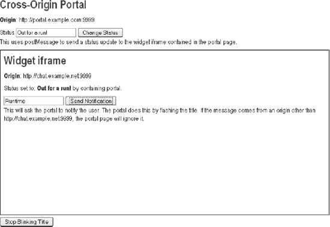

# 六、使用通信 API

在这一章中，我们将探索如何使用两个重要的实时跨源通信构件:*跨文档消息传递*和 *XMLHttpRequest Level 2* ，我们将向您展示如何使用它们来创建引人注目的应用。这两个构建块都为 HTML5 应用添加了新的通信选项，并允许来自不同域的应用安全地相互通信。

首先，我们将讨论`postMessage` API 和 origin 安全概念 HTML5 通信的两个关键元素——然后我们将向您展示如何使用`postMessage` API 在 iframes、选项卡和窗口之间进行通信。

接下来，我们将讨论 XMLHttpRequest 级别 2——XMLHttpRequest 的改进版本。我们将向您展示 XMLHttpRequest 在哪些方面得到了改进。具体来说，我们将向您展示如何使用 XMLHttpRequest 进行跨源请求，以及如何使用新的进度事件。

### 跨文档消息传递

直到最近，由于安全考虑，在运行的浏览器中，框架、标签和窗口之间的通信完全受到限制。例如，虽然某些网站从浏览器内部共享信息可能很方便，但这也为恶意攻击打开了方便之门。如果浏览器被授予以编程方式访问加载到其他框架和标签中的内容的能力，网站将能够使用脚本从另一个网站的内容中窃取任何信息。明智的是，浏览器供应商限制了这种访问；试图检索或修改从另一个源加载的内容会引发安全异常并阻止该操作。

然而，在一些合理的情况下，不同网站的内容可以在浏览器内部进行交流。典型的例子是“mashup”，一个不同应用的组合，比如来自不同站点的地图、聊天和新闻，所有这些组合在一起形成一个新的元应用。在这些情况下，一组协调良好的应用将由浏览器内部的直接通信通道提供服务。

为了满足这种需求，浏览器供应商和标准机构同意引入一个新特性:跨文档消息传递。跨文档消息传递支持跨 iframes、选项卡和窗口的安全跨源通信。它将`postMessage` API 定义为发送消息的标准方式。如下例所示，用`postMessage` API 发送消息非常简单。

`chatFrame.contentWindow.postMessage('Hello, world', 'http://www.example.com/');`

要接收消息，只需在页面中添加一个事件处理程序。当消息到达时，您可以检查其来源，并决定是否对该消息进行处理。清单 6-1 显示了一个事件监听器，它将消息传递给一个 messageHandler 函数。

***清单 6-1。**消息事件的事件监听器*

`window.addEventListener(“message”, messageHandler, true);
function messageHandler(e) {
    switch(e.origin) {
      case “friend.example.com”:
      // process message
      processMessage(e.data);
      break;
    default:
      // message origin not recognized
      // ignoring message
  }
}`

消息事件是具有`data`和`origin`属性的 DOM 事件。`data`属性是发送者传递的实际消息，而`origin`属性是发送者的来源。使用`origin`属性，接收方很容易忽略来自不可信来源的消息；可以简单地对照允许的来源列表来检查来源。

如图 6-1 中的所示，`postMessage` API 提供了一种在`[`chat.example.net`](http://chat.example.net)`托管的聊天窗口小部件 iframe 和包含`[`portal.example.com`](http://portal.example.com)`托管的聊天窗口小部件 iframe 的 HTML 页面(两个不同的来源)之间进行通信的方法。

***图 6-1。**iframe 和主 HTML 页面之间的邮件通信*

在本例中，聊天小部件包含在另一个源的 iframe 中，因此它不能直接访问父窗口。当聊天小部件接收到聊天消息时，它可以使用`postMessage`向主页面发送消息，这样页面就可以提醒聊天小部件的用户收到了新消息。类似地，页面可以向聊天小部件发送关于用户状态的消息。页面和小部件都可以通过将各自的来源添加到允许来源的白名单中来侦听来自彼此的消息。

图 6-2 显示了使用 postMessage API 的实际例子。这是一个名为 DZSlides 的 HTML5 幻灯片查看器应用，由 Firefox 工程师兼 HTML5 传道者 Paul Rouget ( `[`paulrouget.com/dzslides`](http://paulrouget.com/dzslides)`)构建。在这个应用中，表示及其容器使用 postMessage API 进行通信。

***图 6-2。**dz slides 应用中 postMessage API 的实际使用*

在引入`postMessage`之前，iframes 之间的通信有时可以通过直接编写脚本来完成。在一个页面中运行的脚本会试图操作另一个文档。由于安全限制，这可能是不允许的。与直接编程访问不同，`postMessage`提供了 JavaScript 上下文之间的异步消息传递。如图图 6-3 所示，如果没有`postMessage`，跨源通信会导致安全错误，由浏览器强制执行以防止跨站脚本攻击。

***图 6-3。**火狐和 Firebug 早期版本的跨站点脚本错误*

`postMessage` API 可用于同源文档之间的通信，但是当通信可能被浏览器强制执行的同域策略禁止时，它特别有用。然而，也有理由使用`postMessage`在同源文档之间传递消息，因为它提供了一致的、易于使用的 API。每当 JavaScript 上下文之间有通信时，就会使用`postMessage` API，比如 HTML5 Web 工作器。

#### 了解原产地安全

HTML5 通过引入*来源*的概念来澄清和细化域安全性。源是用于在网络上建模信任关系的地址的子集。Origins 由一个方案、一个主机和一个端口组成。例如，`[`www.example.com`](https://www.example.com)`处的页面与`[`www.example.com`](http://www.example.com)`处的页面具有不同的来源，因为方案不同(`https`与`http`)。原点值中不考虑路径，所以在`[`www.example.com/index.html`](http://www.example.com/index.html)`的页面与在`[`www.example.com/page2.html`](http://www.example.com/page2.html)`的页面具有相同的原点，因为只有路径不同。

HTML5 定义了起源的序列化。在字符串形式中，源可以在 API 和协议中引用。这对于使用 XMLHttpRequest 的跨源 HTTP 请求以及 WebSockets 来说是非常重要的。

跨来源通信通过来源识别发送者。这允许接收方忽略来自它不信任或不期望从其接收消息的来源的消息。此外，应用必须通过为消息事件添加事件侦听器来选择接收消息。因此，不存在消息干扰未受怀疑的应用的风险。

`postMessage`的安全规则确保消息不会被发送到来源不期望的页面。发送消息时，发送方指定接收方的来源。如果发送者调用 postMessage 的窗口没有那个特定的来源(例如，如果用户已经导航到另一个站点)，浏览器将不会传输那个消息。

同样，在接收消息时，发送者的来源也包含在消息中。消息的来源是由浏览器提供的，不能被欺骗。这允许接收方决定处理哪些消息，忽略哪些消息。您可以保留一个白名单，只处理来自来源可信的文档的邮件。

**小心外部输入**

**Frank 说:**“处理跨来源消息的应用应该总是验证每条消息的来源。此外，应该谨慎对待消息数据。即使一条消息来自一个可信的来源，它也应该像其他任何外部输入一样被小心对待。下面两个例子展示了一种注入内容的方法，这种方法可能会带来麻烦，同时也是一种更安全的替代方法。

`// Dangerous: e.data is evaluated as markup!
element.innerHTML = e.data;

// Better
element.textContent = e.data;`

作为最佳实践，*从不*评估来自第三方的字符串。此外，避免对来自您自己的应用的字符串使用`eval`。相反，您可以在 window 中使用 JSON。JSON 或 json.org 解析器。JSON 是一种数据语言，旨在供 JavaScript 安全使用，而 json.org 解析器被设计成偏执型的。"

#### 浏览器支持跨文档信息传递

所有主流浏览器，包括 Internet Explorer 8 和更高版本，都支持 postMessage API。在使用 HTML5 跨文档消息传递之前，最好先测试一下它是否受支持。本章后面的“检查浏览器支持”一节将向您展示如何以编程方式检查浏览器支持

#### 使用 postMessage API

在这一节中，我们将更详细地探索 HTML5 `postMessage` API 的使用。

##### 检查浏览器支持

在调用`postMessage`之前，最好检查一下浏览器是否支持它。以下示例显示了检查`postMessage`支持的一种方法:

`if (typeof window.postMessage === “undefined”) {
    // postMessage not supported in this browser
}`

##### 发送消息

要发送消息，调用目标窗口对象上的`postMessage`，如下例所示:

`window.postMessage(“Hello, world”, “portal.example.com”);`

第一个参数包含要发送的数据，第二个参数包含预期的目标。要向 iframe 发送消息，可以在 iframe 的 contentWindow 上调用`postMessage`，如下例所示:

`document.getElementsByTagName(“iframe”)[0].contentWindow.postMessage(“Hello, world”,
“chat.example.net”);`

##### 监听消息事件

脚本通过监听窗口对象上的事件来接收消息，如清单 6-2 中的所示。在事件监听器函数中，接收应用可以决定接受或忽略消息。

***清单 6-2。**监听消息事件并将来源与白名单进行比较*

`var originWhiteList = [“portal.example.com”, “games.example.com”, “www.example.com”];

function checkWhiteList(origin) {
    for (var i=0; i<originWhiteList.length; i++) {
        if (origin === originWhiteList[i]) {
          return true;
        }
    }
    return false;
}

function messageHandler(e) {
    if(checkWhiteList(e.origin)) {
        processMessage(e.data);
    } else {
        // ignore messages from unrecognized origins
    }
}
window.addEventListener(“message”, messageHandler, true);`

 **注意**html 5 定义的 MessageEvent 接口也是 HTML5 WebSockets 和 HTML5 Web 工作器 的一部分。HTML5 的通信特性有一致的接收消息的 API。其他通信 API，如 EventSource API 和 Web 工作器，也使用 MessageEvent 来传递消息。

#### 使用 postMessage API 构建应用

假设您想要构建前面提到的带有跨来源聊天小部件的门户应用。您可以使用跨文档消息在门户页面和聊天小部件之间进行通信，如图图 6-4 所示。

***图 6-4。**带有跨来源聊天工具 iframe 的门户页面*

在这个例子中，我们展示了门户如何在 iframes 中嵌入来自第三方的小部件。我们的例子展示了来自 chat.example.net 的一个小部件。然后，门户页面和小部件使用`postMessage`进行通信。在这种情况下，iframe 表示一个聊天小部件，它希望通过闪烁标题文本来通知用户。这是在后台接收事件的应用中常见的 UI 技术。但是，因为小部件被隔离在 iframe 中，而 iframe 的来源不同于父页面，所以更改标题会违反安全性。相反，小部件使用`postMessage`请求父页面代表它执行通知。

示例门户还向 iframe 发送消息，通知小部件用户已经更改了他或她的状态。以这种方式使用`postMessage`允许这样的门户与组合应用中的小部件协调。当然，因为在发送消息时检查目标来源，在接收消息时检查事件来源，所以不存在数据意外泄露或被欺骗的可能性。

 **注意**在这个示例应用中，聊天小部件没有连接到实时聊天系统，通知是由应用的用户点击**发送通知**来驱动的。一个有效的聊天应用可以使用 Web 套接字，如第七章中所述。

为了便于说明，我们创建了几个简单的 HTML 页面:`postMessagePortal.html`和`postMessageWidget.html.`下面的步骤强调了构建门户页面和聊天小部件页面的重要部分。以下示例的示例代码位于`code/communication`文件夹中。

##### 构建门户页面

首先，添加位于不同原点的聊天小部件 iframe:

`<iframe id="widget" src="http://chat.example.net:9999/postMessageWidget.html"></iframe>`

接下来，添加一个事件监听器 messageHandler 来监听来自聊天小部件的消息事件。如下面的示例代码所示，小部件将要求门户通知用户，这可以通过闪烁标题来完成。为了确保消息来自聊天小部件，消息的来源被验证；如果它不是来自于`[`chat.example.net:9999`](http://chat.example.net:9999)`，门户页面就会忽略它。

`var trustedOrigin = "http://chat.example.net:9999";

function messageHandler(e) {
    if (e.origin == trustedOrigin) {
        notify(e.data);
    } else {
        // ignore messages from other origins
    }
}`

接下来，添加一个与聊天小部件通信的函数。它使用`postMessage`向门户页面中包含的小部件 iframe 发送状态更新。在实时聊天应用中，它可以用来传达用户的状态(在线、离开等)。

`function sendString(s) {
    document.getElementById("widget").contentWindow.postMessage(s, targetOrigin);
}`

##### 构建聊天小部件页面

首先，添加一个事件监听器 messageHandler 来监听来自门户页面的消息事件。如下面的示例代码所示，聊天小部件监听传入的状态更改消息。为了确保消息来自门户页面，验证消息的来源；如果它不是来自`[`portal.example.com:9999`](http://portal.example.com:9999)`，小工具就简单地忽略它。：

`var trustedOrigin = "http://portal.example.com:9999";
function messageHandler(e) {
    if (e.origin === trustedOrigin {
        document.getElementById("status").textContent = e.data;
    } else {
        // ignore messages from other origins
    }`
`}`

接下来，添加一个与门户页面通信的函数。小部件将要求门户代表它通知用户，并在收到新的聊天消息时使用`postMessage`向门户页面发送消息，如下例所示:

`function sendString(s) {
    window.top.postMessage(s, trustedOrigin);
}`

##### 最终代码

清单 6-3 显示了门户页面 postMessagePortal.html 的完整代码。

***清单 6-3。【postMessagePortal.html 内容***

`<!DOCTYPE html>
<title>Portal [http://portal.example.com:9999]</title>
<link rel="stylesheet" href="styles.css">

<link rel="icon" href="http://apress.com/favicon.ico">

<h1>Cross-Origin Portal</h1>

<b>Origin</b>: http://portal.example.com:9999

Status <input type="text" id="statusText" value="Online">
<button id="sendButton">Change Status</button>

This uses postMessage to send a status update to the widget iframe contained in the portal
page.

<iframe id="widget" src="http://chat.example.net:9999/postMessageWidget.html"></iframe>

    <button id="stopButton">Stop Blinking Title</button>

`

清单 6-4 显示了门户页面 postMessageWidget.html 的代码。

***清单 6-4。【postMessageWidget.html 内容***

`<!DOCTYPE html>
<title>widget</title>
<link rel="stylesheet" href="styles.css">

<h1>Widget iframe</h1>

<b>Origin</b>: http://chat.example.net:9999

Status set to: <strong id="status"></strong> by containing portal.

    <input type="text" id="messageText" value="Widget notification.">
    <button id="actionButton">Send Notification</button>

This will ask the portal to notify the user. The portal does this by flashing the title. If
the message comes from an origin other than http://chat.example.net:9999, the portal page will
ignore it.

`

##### 实际应用

要查看这个例子，有两个先决条件:页面必须由 web 服务器提供，页面必须由两个不同的域提供。如果您可以访问不同域上的多个 web 服务器(例如，两个 Apache HTTP 服务器)，那么您可以在这些服务器上托管示例文件并运行演示。在本地机器上完成这项工作的另一种方法是使用 Python `SimpleHTTPServer`，如下面的步骤所示。

1.  Update the path to the Windows hosts file (`C:\Windows\system32\drivers\etc\hosts`) and the Linux version (`/etc/hosts`) by adding two entries pointing to your localhost (IP address 127.0.0.1), as shown in the following example: `127.0.0.1 chat.example.net
    127.0.0.1 portal.example.com`

     **注意**修改主机文件后，您必须重启浏览器，以确保 DNS 条目生效。

2.  安装 Python 2，它包括轻量级的 SimpleHTTPServer web 服务器。
3.  导航到包含两个示例文件`(postMessageParent.html and postMessageWidget.html)`的目录。
4.  启动 Python 如下:`python -m SimpleHTTPServer 9999`
5.  打开浏览器并导航至`[`portal.example.com:9999/postMessagePortal.html`](http://portal.example.com:9999/postMessagePortal.html)`。你现在应该看到图 6-4 中的页面。

### XMLHttpRequest 级别 2

XMLHttpRequest 是使 Ajax 成为可能的 API。有很多关于 XMLHttpRequest 和 Ajax 的书。你可以在 John Resig 的*Pro JavaScript Techniques*(a press，2006)中阅读更多关于 XMLHttpRequest 编程的内容。

XMLHttpRequest Level 2—XMLHttpRequest 的新版本—得到了显著增强。在本章中，我们将介绍 XMLHttpRequest Level 2 中引入的改进。这些改进集中在以下几个方面:

*   跨源 XMLHttpRequests
*   进度事件
*   二进制数据

#### 跨源 XMLHttpRequest

在过去，XMLHttpRequest 仅限于同源通信。XMLHttpRequest Level 2 允许使用跨来源资源共享(CORS)的跨来源 XMLHttpRequest，它使用了前面的*跨文档消息传递*部分中讨论的*来源*概念。

跨源 HTTP 请求有一个源头。这个头向服务器提供请求的来源。该标头受浏览器保护，不能从应用代码中更改。本质上，它是跨文档消息传递中使用的消息事件上的 origin 属性的网络等价物。origin 标头不同于旧的 referer [ *原文为* ]标头，因为 referer 是包含路径的完整 URL。因为路径可能包含敏感信息，所以试图保护用户隐私的浏览器有时不会发送 referer。但是，在必要的时候，浏览器总是会发送所需的`Origin`头。

使用跨源 XMLHttpRequest，您可以构建使用不同源上托管的服务的 web 应用。例如，如果您想要托管一个 web 应用，该应用使用来自一个来源的静态内容和来自另一个来源的 Ajax 服务，那么您可以使用跨来源 XMLHttpRequest 在两者之间进行通信。如果没有跨源 XMLHttpRequest，您将被限制在同源通信中。这将限制您的部署选项。例如，您可能必须在单个域上部署 web 应用，或者设置一个子域。

如图 6-5 所示，跨起源 XMLHttpRequest 允许你在客户端聚合来自不同起源的内容。此外，如果目标服务器允许，您可以使用用户的凭据访问受保护的内容，从而为用户提供对个性化数据的直接访问。另一方面，服务器端聚合迫使所有内容通过单一的服务器端基础设施，这可能会造成瓶颈。

***图 6-5。**客户端和服务器端聚合的区别*

CORS 规范规定，对于敏感操作(例如，具有凭证的请求，或者除 GET 或 POST 之外的请求)，浏览器必须向服务器发送选项预检请求，以查看是否支持和允许该操作。这意味着成功的通信可能需要支持 CORS 的服务器。清单 6-5 和 6-6 显示了在`[www.example.com](http://www.example.com)`上托管的页面和`[www.example.net](http://www.example.net)`上托管的服务之间的跨源交换中涉及的 HTTP 头。

***清单 6-5。**请求报头示例*

`POST /main HTTP/1.1
Host: www.example.net`
`User-Agent: Mozilla/5.0 (X11; U; Linux x86_64; en-US; rv:1.9.1.3) Gecko/20090910 Ubuntu/9.04 (jaunty) Shiretoko/3.5.3
Accept: text/html,application/xhtml+xml,application/xml;q=0.9,*/*;q=0.8
Accept-Language: en-us,en;q=0.5
Accept-Encoding: gzip,deflate
Accept-Charset: ISO-8859-1,utf-8;q=0.7,*;q=0.7
Keep-Alive: 300
Connection: keep-alive
Referer: http://www.example.com/
Origin: http://www.example.com
Pragma: no-cache
Cache-Control: no-cache
Content-Length: 0`

***清单 6-6。**示例响应标题*

`HTTP/1.1 201 Created
Transfer-Encoding: chunked
Server: Kaazing Gateway
Date: Mon, 02 Nov 2009 06:55:08 GMT
Content-Type: text/plain
Access-Control-Allow-Origin: http://www.example.com
Access-Control-Allow-Credentials: true`

#### 进展事件

XMLHttpRequest 中最重要的 API 改进之一是与渐进式响应相关的变化。在以前版本的 XMLHttpRequest 中，只有一个 readystatechange 事件。最重要的是，它在不同浏览器上的实现不一致。例如，`readyState` 3(进度)在 Internet Explorer 中从不触发。此外，`readyState`变更事件缺少一种交流上传进度的方式。实现一个上传进度条不是一个简单的任务，需要服务器端的参与。

XMLHttpRequest 级别 2 引入了具有有意义名称的进度事件。表 6-2 显示了新的进度事件名称。您可以通过为事件处理程序属性设置回调函数来侦听这些事件。例如，当 loadstart 事件激发时，将调用 onloadstart 属性的回调。

为了向后兼容，将保留旧的`readyState`属性和`readystatechange`事件。

**“看似任意”的时代**

在 XMLHttpRequest Level 2 规范对`readystatechange`事件的描述中(为了向后兼容而维护)，由于历史原因，`readyState`属性被描述为在看似任意的时间发生变化。

#### 浏览器支持 HTML5 XMLHttpRequest Level 2

在撰写本文时，许多浏览器已经支持 HTML5 XMLHttpRequest。由于支持的级别不同，在使用这些元素之前，最好先测试一下是否支持 HTML5 XMLHttpRequest。本章后面的“检查浏览器支持”一节将向您展示如何以编程方式检查浏览器支持。

#### 使用 XMLHttpRequest API

在这一节中，我们将更详细地探索 XMLHttpRequest 的使用。为了便于说明，我们创建了一个简单的 HTML page—crossOriginUpload.html。以下示例的示例代码位于`code/communication`文件夹中。

##### 检查浏览器支持

在尝试使用 XMLHttpRequest 第 2 级功能(比如跨源支持)之前，最好检查一下它是否受支持。你可以通过检查新的`withCredentials`属性在 XMLHttpRequest 对象上是否可用来做到这一点，如清单 6-7 中的所示。

***清单 6-7。**检查 XMLHttpRequest 中的跨源支持是否可用*

`var xhr = new XMLHttpRequest()
if (typeof xhr.withCredentials === undefined) {
    document.getElementById("support").innerHTML =
        "Your browser <strong>does not</strong> support cross-origin XMLHttpRequest";
} else {
    document.getElementById("support").innerHTML =
        "Your browser <strong>does</strong>support cross-origin XMLHttpRequest";
}`

##### 跨产地请求

要创建跨源 XMLHttpRequest，必须首先创建一个新的 XMLHttpRequest 对象，如下例所示。：

`var crossOriginRequest = new XMLHttpRequest()`

接下来，通过在不同的起点上指定地址来进行跨起点 XMLHttpRequest，如下例所示。

`crossOriginRequest.open("GET", "http://www.example.net/stockfeed", true);`

确保你听到了错误。这个请求可能不成功的原因有很多。例如，网络故障、拒绝访问以及目标服务器上缺乏 CORS 支持。

**为什么不是 JSONP？**

Frank 说:“从另一个数据源获取数据的一种常用方法是 JSONP(带填充的 JSON)。JSONP 包括用 JSON 资源的 URL 创建一个脚本标记。URL 有一个查询参数，包含脚本加载时要调用的函数的名称。远程服务器通过调用命名函数来包装 JSON 数据。这有严重的安全隐患！当您使用 JSONP 时，您必须完全信任提供数据的服务。恶意脚本可能会接管您的应用。

使用 XMLHttpRequest (XHR)和 CORS，您接收的是数据而不是代码，您可以安全地解析这些数据。这比评估外部输入要安全得多。"

##### 使用进度事件

XMLHttpRequest Level 2 提供了命名的进度事件，而不是用数字状态来表示请求和响应的不同阶段。您可以通过为事件处理程序属性设置回调函数来侦听这些事件。

清单 6-8 展示了回调函数是如何处理进度事件的。进度事件包含要传输的总数据量、已经传输的数据量以及一个布尔值，该值指示总数据量是否已知(在流式 HTTP 中可能不是这样)。XMLHttpRequest.upload 调度具有相同字段的事件。

***清单 6-8。**使用 onprogress 事件*

`crossOriginRequest.onprogress = function(e) {
    var total = e.total;
    var loaded = e.loaded;

    if (e.lengthComputable) {
        // do something with the progress information
    }
}
crossOriginRequest.upload.onprogress = function(e) {
    var total = e.total;`
`    var loaded = e.loaded;

    if (e.lengthComputable) {
        // do something with the progress information
    }
}`

##### 二进制数据

支持新的二进制 API 如 Typed Array(这是 WebGL 和可编程音频所必需的)的浏览器可能能够用 XMLHttpRequest 发送二进制数据。XMLHttpRequest Level 2 规范支持使用 Blob 和 ArrayBuffer(也称为类型化数组)对象调用`send()`方法(参见清单 6-9 )。

***清单 6-9。**发送类型化的字节数组*

`var a = new Uint8Array([8,6,7,5,3,0,9]);
var xhr = new XMLHttpRequest();
xhr.open("POST", "/data/", true)
console.log(a)
xhr.send(a.buffer);`

这会产生一个带有二进制内容体的 HTTP POST 请求。内容长度为 7，正文包含字节 8，6，7，5，3，0，9。

XMLHttpRequest 级别 2 还公开二进制响应数据。将`responseType`属性设置为" text "、" document "、" arraybuffer "或" blob "控制由`response`属性返回的对象的类型。要查看 HTTP 响应主体包含的原始字节，请将`responseType`设置为“arraybuffer”或“blob”

在下一章，我们将看到如何使用 WebSocket 来发送和接收使用相同类型的二进制数据。

#### 使用 XMLHttpRequest 构建应用

在这个例子中，我们将看看如何将比赛地理位置坐标上传到一个位于不同原点的 web 服务器上。我们使用新的进度事件来监控 HTTP 请求的状态，包括上传百分比。图 6-6 显示了实际应用。

***图 6-6。**上传地理定位数据的网络应用*

为了便于说明，我们已经创建了 HTML 文件`crossOrignUpload.html.`，以下步骤强调了构建跨原点上传页面的重要部分，如图图 6-5 所示。以下示例的示例代码位于`code/communication`文件夹中。

首先，创建一个新的`XMLHttpRequest`对象，如下例所示。

`var xhr = new XMLHttpRequest();`

接下来，检查浏览器是否支持跨源 XMLHttpRequest，如下例所示。

`if (typeof xhr.withCredentials === undefined) {
  document.getElementById("support").innerHTML =
           "Your browser <strong>doesnot</strong> support cross-origin XMLHttpRequest";
} else {
    document.getElementById("support").innerHTML =
             "Your browser <strong>does</strong> support cross-origin XMLHttpRequest";
}`

接下来，设置回调函数来处理进度事件，并计算上传和下载的比率。

`xhr.upload.onprogress = function(e) {
  var ratio = e.loaded / e.total;
  setProgress(ratio + "% uploaded");
}

xhr.onprogress = function(e) {
  var ratio = e.loaded / e.total;
  setProgress(ratio + "% downloaded");
}

xhr.onload = function(e) {
  setProgress("finished");
}`

`xhr.onerror = function(e) {
  setProgress("error");
}`

最后，打开请求并发送包含编码的地理位置数据的字符串。这将是一个跨源请求，因为目标位置是一个与页面具有不同源的 URL。

`var targetLocation = "http://geodata.example.net:9999/upload";
xhr.open("POST", targetLocation, true);

geoDataString = dataElement.textContent;
xhr.send(geoDataString);`

##### 最终代码

清单 6-10 显示了完整的应用代码——crossOriginUpload.html 文件的内容。

***清单 6-10。【crossOriginUpload.html 内容***

`<!DOCTYPE html>
<title>Upload Geolocation Data</title>
<link rel="stylesheet" href="styles.css">
<link rel="icon" href="http://apress.com/favicon.ico">

<h1>XMLHttpRequest Level 2</h1>

<h4>Geolocation Data to upload:</h4>
<textarea id="geodata">
</textarea>

<button id="sendButton">Upload</button>

    <b>Status: </b> ready

`

##### 实际应用

要查看这个示例的运行情况，有两个先决条件:页面必须由不同的域提供，目标页面必须由理解 CORS 标头的 web 服务器提供。本章的示例代码中包含了一个符合 CORS 标准的 Python 脚本，它可以处理传入的跨源 XMLHttpRequests。您可以通过执行以下步骤在本地计算机上运行演示:

1.  Update your hosts file (`C:\Windows\system32\drivers\etc\hosts` on Windows or `/etc/hosts on Unix/Linux)` by adding two entries pointing to your localhost (IP address `127.0.0.1`) as shown in the following example: `127.0.0.1 geodata.example.net
    127.0.0.1 portal.example.com`

     **注意**修改主机文件后，您必须重启浏览器，以确保 DNS 条目生效。

2.  安装 Python 2，它包括轻量级的`SimpleHTTPServer` web 服务器，如果您在前面的例子中没有这样做的话。
3.  导航到包含示例文件(`crossOrignUpload.html`)和 Python CORS 服务器脚本(`CORSServer.py`)的目录。
4.  在这个目录下启动 Python，如下:`python CORSServer.py 9999`
5.  打开浏览器并导航至`[`portal.example.com:9999/crossOriginUpload.html`](http://portal.example.com:9999/crossOriginUpload.html)`。你现在应该看到如图 6-6 所示的页面。

### 实用的临时演员

有时有些技术不适合我们的常规例子，但仍然适用于许多类型的 HTML5 应用。我们在这里向你展示一些简短但常见的实用附加功能。

#### 结构化数据

早期版本的`postMessage`只支持字符串。后来的版本允许其他类型的数据，包括 JavaScript 对象、画布图像数据和文件。随着规范的发展，对不同对象类型的支持将因浏览器而异。

在某些浏览器中，可以用`postMessage`发送的 JavaScript 对象的限制与 JSON 数据的限制相同。特别是，可能不允许有循环的数据结构。包含自身的列表就是一个例子。

#### 框架破坏

框架破坏是一种确保你的内容不被加载到 iframe 中的技术。一个应用可以检测到它的窗口不是最外面的窗口(`window.top`)，然后跳出它的包含框架，如下例所示。：

`if (window !== window.top) {
    window.top.location = location;
}`

支持 X-Frame-Options HTTP 头的浏览器还将防止对将该头设置为 DENY 或 SAMEORIGIN 的资源的恶意成帧。但是，您可能希望选择性地允许某些合作伙伴页面来框定您的内容。一个解决方案是使用`postMessage`在协作的 iframes 和包含页面之间握手，如清单 6-11 中的所示。

***清单 6-11。**在 iframe 中使用 postMessage 与可信伙伴握手页面*

`var framebustTimer;
var timeout = 3000; // 3 second framebust timeout

if (window !== window.top) {
    framebustTimer = setTimeout(
        function() {
             window.top.location = location;
        }, timeout);
}

window.addEventListener(“message”, function(e) {
    switch(e.origin) {
        case trustedFramer:
            clearTimeout(framebustTimer);
            break;
    }
), true);`

### 总结

在本章中，您已经看到了如何使用 HTML5 跨文档消息传递和 XMLHttpRequest Level 2 来创建能够跨来源安全通信的引人注目的应用。

首先，我们讨论了`postMessage`和 origin 安全概念 HTML5 通信的两个关键元素——然后我们向您展示了如何使用`postMessage` API 在 iframes、选项卡和窗口之间进行通信。

接下来，我们讨论了 XMLHttpRequest 级别 2——XMLHttpRequest 的改进版本。我们向您展示了 XMLHttpRequest 在哪些方面得到了改进；最重要的是在 readystatechange 事件区域。然后，我们向您展示了如何使用 XMLHttpRequest 进行跨源请求，以及如何使用新的进度事件。

最后，我们用几个实际例子结束了这一章。在下一章中，我们将演示 HTML5 WebSockets 如何让您以难以置信的简单性和最小的开销将实时数据传输到应用。