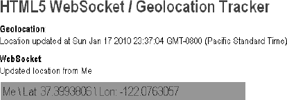

# 七、使用 WebSocket API

在这一章中，我们将探索 HTML5 规范中最强大的通信功能可以做什么: *WebSocket* ，它定义了一个全双工通信通道，通过 web 上的单个套接字进行操作。WebSocket 不仅仅是传统 HTTP 通信的另一个增量增强；它代表了一个巨大的进步，特别是对于实时的、事件驱动的 web 应用。

WebSocket 对用于模拟浏览器中全双工连接的古老、复杂的“黑客”进行了改进，这促使谷歌的伊恩·希克森(HTML5 规范负责人)说:

> *“将数千字节的数据减少到 2 字节……并将延迟从 150 毫秒减少到 50 毫秒远不止是微不足道。事实上，仅这两个因素就足以让 WebSocket 引起谷歌的严重兴趣。”*
> 
> — `[www.ietf.org/mail-archive/web/hybi/current/msg00784.html](http://www.ietf.org/mail-archive/web/hybi/current/msg00784.html)`

我们将向您详细展示为什么 WebSocket 提供了如此巨大的改进，并且您将看到 WebSocket 如何—一举—使所有旧的 Comet 和 Ajax 轮询、长轮询和流解决方案变得过时。

### web socket 概述

让我们通过将 HTTP 解决方案与使用 WebSocket 的全双工“实时”浏览器通信进行比较，来看看 WebSocket 如何减少不必要的网络流量和延迟。

#### 实时和 HTTP

通常，当浏览器访问一个网页时，一个 HTTP 请求被发送到承载该网页的 web 服务器。web 服务器确认该请求并发回响应。在许多情况下，例如，对于股票价格、新闻报道、门票销售、交通模式、医疗设备读数等等，浏览器呈现页面时，响应可能已经过时。如果您想获得最新的实时信息，您可以不断地手动刷新该页面，但这显然不是一个很好的解决方案。

当前提供实时 web 应用的尝试主要围绕轮询和其他服务器端推送技术，其中最著名的是“Comet ”,它延迟 HTTP 响应的完成以向客户端传递消息。

通过轮询，浏览器定期发送 HTTP 请求，并立即收到响应。这项技术是浏览器传递实时信息的首次尝试。显然，如果知道消息传递的确切时间间隔，这是一个好的解决方案，因为您可以将客户端请求同步为仅在服务器上有信息时发生。然而，实时数据通常不可预测，这使得不必要的请求不可避免，因此，在低消息速率的情况下，许多连接被不必要地打开和关闭。

对于长轮询，浏览器向服务器发送一个请求，服务器在一段设定的时间内保持请求打开。如果在此期间收到通知，则包含该消息的响应将被发送到客户端。如果在设定的时间段内没有收到通知，服务器将发送响应以终止打开请求。但是，理解这一点很重要，当您的消息量很大时，长轮询与传统轮询相比不会提供任何实质性的性能改进。

使用流式传输，浏览器发送一个完整的请求，但是服务器发送并维护一个打开的响应，该响应不断更新并无限期地(或在一段设定的时间内)保持打开。然后，每当消息准备好发送时，响应就会更新，但是服务器永远不会发出完成响应的信号，从而保持连接打开以传递未来的消息。但是，由于流仍然封装在 HTTP 中，中间的防火墙和代理服务器可能会选择缓冲响应，从而增加了消息传递的延迟。因此，在检测到缓冲代理服务器的情况下，许多流解决方案会退回到长轮询。或者，可以使用 TLS (SSL)连接来保护响应不被缓冲，但是在这种情况下，每个连接的建立和断开会加重可用服务器资源的负担。

最终，所有这些提供实时数据的方法都涉及 HTTP 请求和响应头，它们包含大量额外的、不必要的头数据，并引入了延迟。最重要的是，全双工连接不仅仅需要从服务器到客户端的下行连接。为了在半双工 HTTP 上模拟全双工通信，今天的许多解决方案使用两个连接:一个用于下游，一个用于上游。这两个连接的维护和协调在资源消耗方面引入了大量开销，并增加了许多复杂性。简单地说，HTTP 不是为实时、全双工通信而设计的，正如您在图 7-1 中看到的，该图显示了构建一个 web 应用的复杂性，该应用使用半双工 HTTP 上的发布/订阅模型显示来自后端数据源的实时数据。

***图 7-1** 。实时 HTTP 应用的复杂性*

当您尝试横向扩展这些解决方案时，情况会变得更糟。模拟 HTTP 上的双向浏览器通信容易出错且复杂，并且所有这些复杂性都无法扩展。即使您的最终用户可能喜欢看起来像实时 web 应用的东西，这种“实时”体验也有很高的价格。这是额外的延迟、不必要的网络流量和 CPU 性能下降的代价。

#### 了解 WebSocket

伊恩·希克森(HTML5 规范的主要作者)首先在 HTML5 规范的通信部分将 WebSocket 定义为“TCP 连接”。该规范发展并更改为 WebSocket，它现在是一个独立的规范(就像地理定位、Web 工作器 等等)，以保持讨论的重点。

TCPConnection 和 WebSocket 都是指较低级别的网络接口的名称。TCP 是互联网的基本传输协议。WebSocket 是 web 应用的传输协议。它提供按顺序到达的双向数据流，很像 TCP。与 TCP 一样，更高级别的协议可以在 WebSocket 上运行。作为 Web 的一部分，WebSocket 连接到 URL，而不是连接到互联网主机和端口。

WEBSOCKET 和模型火车有什么共同点？

**彼得说**:“伊恩·希克森是模型火车的狂热爱好者；自 1984 年马克林首次推出数字控制器以来，他就一直在计划用电脑控制火车的方法，这远远早于网络的存在。

当时，Ian 将 TCPConnection 添加到 HTML5 规范中，他正在编写一个程序，以便从浏览器控制模型火车组，并且他正在使用 WebSocket 出现之前流行的“hanging GET”和 XHR 技术来实现浏览器到火车的通信。如果有一种方法可以在浏览器中进行套接字通信，那么列车控制器程序的构建就会容易得多——很像在“胖”客户端中发现的传统的异步客户端/服务器通信模型。因此，受*可能*的启发,(火车)轮子已经启动，网络插座火车已经离开车站。下一站:实时网络。"

##### web socket 握手

为了建立 WebSocket 连接，客户端和服务器在初始握手期间从 HTTP 协议升级到 WebSocket 协议，如图图 7-2 所示。请注意，此连接描述代表协议草案 17。

***图 7-2。**web socket 升级握手*

***清单 7-1。**web socket 升级握手*

`From client to server:
GET /chat HTTP/1.1
Host: example.com
Connection: Upgrade
Sec-WebSocket-Protocol: sample
Upgrade: websocket
Sec-WebSocket-Key: 7cxQRnWs91xJW9T0QLSuVQ==
Origin: http://example.com

[8-byte security key]

**From server to client:**

HTTP/1.1 101 WebSocket Protocol Handshake`
`Upgrade: websocket
Connection: Upgrade
Sec-WebSocket-Accept: 7cxQRnWs91xJW9T0QLSuVQ==
WebSocket-Protocol: sample`

一旦建立，WebSocket 消息就可以以全双工模式在客户机和服务器之间来回发送。这意味着基于文本的消息可以同时双向全双工发送。在网络上，每条消息以一个`0x00`字节开始，以一个`0xFF`字节结束，中间包含 UTF-8 数据。

##### web socket 接口

除了 WebSocket 协议的定义，该规范还定义了在 JavaScript 应用中使用的 WebSocket 接口。清单 7-2 显示了`WebSocket`界面。

***清单 7-2。**web socket 接口*

`[Constructor(DOMString url, optional DOMString protocols),
 Constructor(DOMString url, optional DOMString[] protocols)]
interface WebSocket : EventTarget {
  readonly attribute DOMString url;

  // ready state
  const unsigned short CONNECTING = 0;
  const unsigned short OPEN = 1;
  const unsigned short CLOSING = 2;
  const unsigned short CLOSED = 3;
  readonly attribute unsigned short readyState;
  readonly attribute unsigned long bufferedAmount;

  // networking
  [TreatNonCallableAsNull] attribute Function? onopen;
  [TreatNonCallableAsNull] attribute Function? onerror;
  [TreatNonCallableAsNull] attribute Function? onclose;
  readonly attribute DOMString extensions;
  readonly attribute DOMString protocol;
  void close([Clamp] optional unsigned short code, optional DOMString reason);

  // messaging
  [TreatNonCallableAsNull] attribute Function? onmessage;
           attribute DOMString binaryType;
  void send(DOMString data);
  void send(ArrayBuffer data);
  void send(Blob data);
};`

使用`WebSocket`接口很简单。要连接一个远程主机，只需创建一个新的`WebSocket`实例，为新对象提供一个 URL，表示您希望连接的端点。注意，`ws://`和`wss://`前缀分别表示 WebSocket 和安全 WebSocket 连接。

在客户端和服务器之间的初始握手期间，通过相同的底层 TCP/IP 连接，通过从 HTTP 协议升级到 WebSocket 协议来建立 WebSocket 连接。一旦建立，WebSocket 数据帧就可以以全双工模式在客户机和服务器之间来回发送。连接本身通过由`WebSocket`接口定义的`message`事件和`send`方法公开。在您的代码中，使用异步事件侦听器来处理连接生命周期的每个阶段。

`myWebSocket.onopen = function(evt) { alert("Connection open ..."); };
myWebSocket.onmessage = function(evt) { alert( "Received Message:  "  +  evt.data); };
myWebSocket.onclose = function(evt) { alert("Connection closed."); };`

##### 大幅减少不必要的网络流量和延迟

那么 WebSocket 能有多高效呢？让我们并排比较一下轮询应用和 WebSocket 应用。为了说明轮询，我们将研究一个 web 应用，其中一个网页使用传统的轮询模型从 web 服务器请求实时股票数据。它通过轮询 web 服务器上托管的 Java Servlet 来实现这一点。消息代理从一个虚构的股票价格提要接收数据，并不断更新价格。web 页面连接并订阅特定的股票频道(消息代理上的一个主题),并使用 XMLHttpRequest 每秒轮询一次更新。当接收到更新时，执行一些计算并显示股票数据，如图图 7-3 所示。

***图 7-3。【JavaScript 股票行情应用示例***

这听起来很棒，但是深入了解一下就会发现这个应用存在一些严重的问题。例如，在带有 Firebug 的 Mozilla Firefox 中，您可以看到 GET 请求以一秒的间隔敲打服务器。查看 HTTP 头可以发现与每个请求相关的惊人的开销。清单 7-3 和 7-4 显示了单个请求和响应的 HTTP 头数据。

***清单 7-3。** HTTP 请求头*

`GET /PollingStock//PollingStock HTTP/1.1
Host: localhost:8080
User-Agent: Mozilla/5.0 (Windows; U; Windows NT 5.1; en-US; rv:1.9.1.5) Gecko/20091102
 Firefox/3.5.5
Accept: text/html,application/xhtml+xml,application/xml;q=0.9,*/*;q=0.8
Accept-Language: en-us
Accept-Encoding: gzip,deflate
Accept-Charset: ISO-8859-1,utf-8;q=0.7,*;q=0.7
Keep-Alive: 300
Connection: keep-alive
Referer: http://www.example.com/PollingStock/
Cookie: showInheritedConstant=false; showInheritedProtectedConstant=false;
 showInheritedProperty=false; showInheritedProtectedProperty=false;
 showInheritedMethod=false; showInheritedProtectedMethod=false;
 showInheritedEvent=false; showInheritedStyle=false; showInheritedEffect=false`

***清单 7-4。** HTTP 响应头*

`HTTP/1.x 200 OK
X-Powered-By: Servlet/2.5
Server: Sun Java System Application Server 9.1_02
Content-Type: text/html;charset=UTF-8
Content-Length: 21
Date: Sat, 07 Nov 2009 00:32:46 GMT`

只是为了好玩(哈！)，我们可以把所有的人物都算进去。总的 HTTP 请求和响应头信息开销包含 871 个字节，这还不包括任何数据。当然，这只是一个例子，您可以拥有少于 871 字节的头数据，但也有头数据超过 2，000 字节的常见情况。在这个示例应用中，典型的股票主题消息的数据只有大约 20 个字符长。正如您所看到的，它实际上被过多的头信息淹没了，而这些头信息本来就不是必需的。

那么，当您将这个应用部署给大量用户时会发生什么呢？让我们来看看在三个不同的用例中与这个轮询应用相关的 HTTP 请求和响应头数据的网络开销。

*   **用例 A** :每秒 1000 个客户端轮询:网络流量为(871×1000)= 871000 字节=每秒 6968000 比特(6.6 Mbps)
*   **用例 B** :每秒 10000 个客户端轮询:网络流量为(871×10000)= 8710000 字节= 69680000 比特每秒(66 Mbps)
*   **用例 C** :每秒 10 万个客户端轮询:网络流量为(871 × 10 万)= 8710 万字节= 69680 万比特每秒(665 Mbps)

这是大量不必要的网络开销。考虑一下，如果我们重新构建应用以使用 WebSocket，向 web 页面添加一个事件处理程序来异步侦听来自消息代理的股票更新消息(稍后会详细介绍)。这些消息中的每一条都是一个 WebSocket 帧，只有两个字节的开销(而不是 871)。看看这在我们的三个用例中是如何影响网络开销的。

*   **用例 A**:1000 个客户端每秒接收 1 条消息:网络流量为(2×1000)= 2000 字节=每秒 16000 比特(0.015 Mbps)
*   **用例 B**:10000 个客户端每秒接收 1 条消息:网络流量为(2×10000)= 20000 字节= 160000 比特每秒(0.153 Mbps)
*   **用例 C:** 10 万个客户端每秒接收 1 条消息:网络流量为(2 × 10 万)= 20 万字节=每秒 160 万比特(1.526 Mbps)

正如你在图 7-4 中看到的，与轮询解决方案相比，WebSocket 大大减少了不必要的网络流量。

***图 7-4。**轮询 WebSocket 流量之间不必要的网络开销比较*

那么延迟的减少呢？看一下图 7-5 。在上半部分，您可以看到半双工轮询解决方案的延迟。对于这个例子，如果我们假设一条消息从服务器到浏览器需要 50 毫秒，那么轮询应用就会引入很多额外的延迟，因为当响应完成时，必须向服务器发送一个新的请求。这个新请求又需要 50 毫秒，在此期间，服务器无法向浏览器发送任何消息，从而导致额外的服务器内存消耗。

在图的下半部分，您可以看到 WebSocket 解决方案减少了延迟。一旦连接升级到 WebSocket，消息就可以在到达时从服务器流向浏览器。消息从服务器传输到浏览器仍然需要 50 毫秒，但是 WebSocket 连接仍然保持打开，因此不需要向服务器发送另一个请求。

***图 7-5。**轮询和 WebSocket 应用之间的延迟比较*

WebSocket 在实时 web 的可伸缩性方面向前迈进了一大步。正如您在本章中所看到的，WebSocket 可以提供 500:1 甚至 1000:1 的不必要 HTTP 报头流量减少率和 3:1 的延迟减少率，具体取决于 HTTP 报头的大小。

### 编写一个简单的 Echo WebSocket 服务器

在使用 WebSocket API 之前，您需要一个支持 WebSocket 的服务器。在这一节中，我们将看看如何编写一个简单的 web socket“echo”服务器。为了运行本章的例子，我们包含了一个用 Python 编写的简单的 WebSocket 服务器。以下示例的示例代码位于图书网站的 WebSocket 部分。

**WEBSOCKET 服务器**

已经有很多 WebSocket 服务器实现，甚至还有更多正在开发中。以下只是现有 WebSocket 服务器的一部分:

*   **Kaazing WebSocket 网关**—基于 Java 的 WebSocket 网关
*   mod _ pyweb socket—Apache HTTP 服务器的基于 Python 的扩展
*   Netty—一个包含 WebSocket 支持的 Java 网络框架
*   **node . js**—一个服务器端的 JavaScript 框架，上面写了多个 WebSocket 服务器

Kaazing 的 WebSocket 网关包括对没有 WebSocket 本机实现的浏览器的完整客户端 WebSocket 仿真支持，这允许您根据当前的 WebSocket API 进行编码，并让您的代码在所有浏览器中工作。

要在`ws://localhost:8000/echo`运行接受连接的 Python WebSocket echo 服务器，请打开命令提示符，导航到包含该文件的文件夹，并发出以下命令:

`python websocket.py`

我们还包含了一个*广播*服务器，它在`ws://localhost:8080/broadcast`接受连接。与 echo 服务器相反，发送到这个特定服务器实现的任何 WebSocket 消息都将被反弹回当前连接的*每个人*。这是向多个听众广播消息的一种非常简单的方式。要运行广播服务器，请打开命令提示符，导航到包含该文件的文件夹，并发出以下命令:

`python broadcast.py`

这两个脚本都利用了`websocket.py`中的示例 WebSocket 协议库。您可以为实现其他服务器端行为的其他路径添加处理程序。

 **注意**这只是一个 WebSocket 协议的服务器，它不能响应 HTTP 请求。握手解析器不完全符合 HTTP。但是，因为 WebSocket 连接以 HTTP 请求开始，并且依赖于 Upgrade 头，所以其他服务器可以在同一个端口上同时服务于 WebSocket 和 HTTP。

让我们看看当一个浏览器试图与这个服务器通信时会发生什么。当浏览器向 WebSocket URL 发出请求时，服务器发回完成 WebSocket 握手的头。WebSocket 握手响应必须包含一个`HTTP/1.1 101`状态代码和升级连接头。这通知浏览器，对于 TCP 会话的剩余部分，服务器正在从 HTTP 握手切换到 WebSocket 协议。

 **注意**如果你正在实现一个 WebSocket 服务器，你应该参考 IETF 在`[`tools.ietf.org/html/draft-ietf-hybi-thewebsocketprotocol`](http://tools.ietf.org/html/draft-ietf-hybi-thewebsocketprotocol)`的协议草案或者最新的规范。

`# write out response headers
self.send_bytes("HTTP/1.1 101 Switching Protocols\r\n")
self.send_bytes("Upgrade: WebSocket\r\n")
self.send_bytes("Connection: Upgrade\r\n")
self.send_bytes("Sec-WebSocket-Accept: %s\r\n" % self.hash_key(key))

if "Sec-WebSocket-Protocol" in headers:
    protocol = headers["Sec-WebSocket-Protocol"]
    self.send_bytes("Sec-WebSocket-Protocol: %s\r\n" % protocol)`

##### WebSocket 框架

握手之后，客户端和服务器可以随时发送消息。在这个服务器中，每个连接都由一个`WebSocketConnection`实例来表示。`WebSocketConnection`的`send`函数，如图图 7-6 所示，根据 WebSocket 协议写出一条消息。数据有效载荷之前的字节标记了帧的长度和类型。文本框架是 UTF-8 编码的。在这个服务器中，每个 WebSocket 连接都是一个`asyncore.dispatcher_with_send`，它是一个异步套接字包装器，支持缓冲发送。

从浏览器发送到服务器的数据被屏蔽。屏蔽是 WebSocket 协议的一个不寻常的特性。有效负载数据的每个字节都与随机掩码进行异或运算，以确保 WebSocket 流量看起来不像其他协议。像 Sec-WebSocket-Key 散列一样，这是为了减轻对不兼容的网络基础设施的跨协议攻击的神秘形式。

***图 7-6。**web socket 框架的组件*

 **注意**Python 和其他语言还有很多其他的异步 I/O 框架。选择 Asyncore 是因为它包含在 Python 标准库中。还要注意的是，这个实现使用了协议草案 10。这是一个为测试和说明而设计的简单示例。

`WebSocketConnection`继承了`asyncore.dispatcher_with_send`并覆盖了`send`方法，以便构造文本和二进制消息。

`def send(self, s):
  if self.readystate == "open":
    self.send_bytes("\x00")`
`    self.send_bytes(s.encode("UTF8"))
    self.send_bytes("\xFF")`

`websocket.py`中`WebSocketConnections`的处理程序遵循一个简化的调度程序接口。处理程序的`dispatch()`方法是用连接接收到的每个帧的有效负载来调用的。`EchoHandler`将每条消息发送回发送者。

`class EchoHandler(object):
    """
    The EchoHandler repeats each incoming string to the same WebSocket.
    """

    def __init__(self, conn):
        self.conn = conn

    def dispatch(self, data):
        self.conn.send("echo: " + data)`

基本广播服务器`broadcast.py`的工作方式大致相同，但在这种情况下，当广播处理器接收到一个帧时，它会在所有连接的 WebSockets 上发回该帧，如下例所示:

`class BroadcastHandler(object):
    """
    The BroadcastHandler repeats incoming strings to every connected
    WebSocket.
    """

    def __init__(self, conn):
        self.conn = conn

    def dispatch(self, data):
        for session in self.conn.server.sessions:
            session.send(data)`

`broadcast.py`中的处理程序提供了一个轻量级的消息广播器，它简单地发送和接收任何数据。这对于我们的例子来说已经足够了。请注意，这个广播服务不执行任何输入验证，而这在生产消息服务器中是需要的。生产 WebSocket 服务器至少应该验证传入数据的格式。

为了完整起见，清单 7-5 和清单 7-6 提供了`websocket.py`和`broadcast.py`的完整代码。请注意，这只是一个示例服务器实现；它不适合生产部署。

***清单 7-5。【websocket.py 的完整代码***

`#!/usr/bin/env python

import asyncore
import socket
import struct
import time
from hashlib import sha1
from base64 import encodestring`

`class WebSocketConnection(asyncore.dispatcher_with_send):

  TEXT = 0x01
  BINARY = 0x02

  def __init__(self, conn, server):
    asyncore.dispatcher_with_send.__init__(self, conn)

    self.server = server
    self.server.sessions.append(self)
    self.readystate = "connecting"
    self.buffer = ""

  def handle_read(self):
    data = self.recv(1024)
    self.buffer += data
    if self.readystate == "connecting":
      self.parse_connecting()
    elif self.readystate == "open":
      self.parse_frame()

  def handle_close(self):
    self.server.sessions.remove(self)
    self.close()

  def parse_connecting(self):
    """
    Parse a WebSocket handshake. This is not a full HTTP request parser!
    """
    header_end = self.buffer.find("\r\n\r\n")
    if header_end == -1:
      return
    else:
      header = self.buffer[:header_end]
      # remove header and four bytes of line endings from buffer
      self.buffer = self.buffer[header_end + 4:]
      header_lines = header.split("\r\n")
      headers = {}

      # validate HTTP request and construct location
      method, path, protocol = header_lines[0].split(" ")
      if method != "GET" or protocol != "HTTP/1.1" or path[0] != "/":
        self.terminate()
        return

      # parse headers
      for line in header_lines[1:]:
        key, value = line.split(": ")
        headers[key] = value`

`      headers["Location"] = "ws://" + headers["Host"] + path

      self.readystate = "open"
      self.handler = self.server.handlers.get(path, None)(self)

      self.send_server_handshake_10(headers)

  def terminate(self):
    self.ready_state = "closed"
    self.close()

  def send_server_handshake_10(self, headers):
    """
    Send the WebSocket Protocol draft HyBi-10 handshake response
    """
    key = headers["Sec-WebSocket-Key"]

    # write out response headers
    self.send_bytes("HTTP/1.1 101 Switching Protocols\r\n")
    self.send_bytes("Upgrade: WebSocket\r\n")
    self.send_bytes("Connection: Upgrade\r\n")
    self.send_bytes("Sec-WebSocket-Accept: %s\r\n" % self.hash_key(key))

    if "Sec-WebSocket-Protocol" in headers:
      protocol = headers["Sec-WebSocket-Protocol"]
      self.send_bytes("Sec-WebSocket-Protocol: %s\r\n" % protocol)

  def hash_key(self, key):
    guid = "258EAFA5-E914-47DA-95CA-C5AB0DC85B11"
    combined = key + guid
    hashed = sha1(combined).digest()
    return encodestring(hashed)

  def parse_frame(self):
    """
    Parse a WebSocket frame. If there is not a complete frame in the
    buffer, return without modifying the buffer.
    """
    buf = self.buffer
    payload_start = 2

    # try to pull first two bytes
    if len(buf) < 3:
      return
    b = ord(buf[0])
    fin = b & 0x80    # 1st bit
    # next 3 bits reserved
    opcode = b & 0x0f   # low 4 bits
    b2 = ord(buf[1])
    mask = b2 & 0x80  # high bit of the second byte
    length = b2 & 0x7f  # low 7 bits of the second byte`

`    # check that enough bytes remain
    if len(buf) < payload_start + 4:
      return
    elif length == 126:
      length, = struct.unpack(">H", buf[2:4])
      payload_start += 2
    elif length == 127:
      length, = struct.unpack(">I", buf[2:6])
      payload_start += 4

    if mask:
      mask_bytes = [ord(b) for b in buf[payload_start:payload_start + 4]]
      payload_start += 4

    # is there a complete frame in the buffer?
    if len(buf) < payload_start + length:
      return

    # remove leading bytes, decode if necessary, dispatch
    payload = buf[payload_start:payload_start + length]
    self.buffer = buf[payload_start + length:]

    # use xor and mask bytes to unmask data
    if mask:
      unmasked = [mask_bytes[i % 4] ^ ord(b)
              for b, i in zip(payload, range(len(payload)))]
      payload = "".join([chr(c) for c in unmasked])

    if opcode == WebSocketConnection.TEXT:
      s = payload.decode("UTF8")
      self.handler.dispatch(s)
    if opcode == WebSocketConnection.BINARY:
      self.handler.dispatch(payload)
    return True

  def send(self, s):
    """
    Encode and send a WebSocket message
    """

    message = ""
    # always send an entire message as one frame (fin)
    b1 = 0x80

    # in Python 2, strs are bytes and unicodes are strings
    if type(s) == unicode:
      b1 |= WebSocketConnection.TEXT
      payload = s.encode("UTF8")
    elif type(s) == str:
      b1 |= WebSocketConnection.BINARY
      payload = s`

`    message += chr(b1)

    # never mask frames from the server to the client
    b2 = 0
    length = len(payload)
    if length < 126:
      b2 |= length
      message += chr(b2)              
    elif length < (2 ** 16) - 1:
      b2 |= 126
      message += chr(b2)
      l = struct.pack(">H", length)
      message += l
    else:
      l = struct.pack(">Q", length)
      b2 |= 127
      message += chr(b2)
      message += l

    message += payload

    if self.readystate == "open":
      self.send_bytes(message)

  def send_bytes(self, bytes):
    try:
      asyncore.dispatcher_with_send.send(self, bytes)
    except:
      pass

class EchoHandler(object):
  """
  The EchoHandler repeats each incoming string to the same WebSocket.
  """

  def __init__(self, conn):
    self.conn = conn

  def dispatch(self, data):
    try:
      self.conn.send(data)
    except:
      pass

class WebSocketServer(asyncore.dispatcher):

  def __init__(self, port=80, handlers=None):
    asyncore.dispatcher.__init__(self)
    self.handlers = handlers
    self.sessions = []`
`    self.port = port
    self.create_socket(socket.AF_INET, socket.SOCK_STREAM)
    self.set_reuse_addr()
    self.bind(("", port))
    self.listen(5)

  def handle_accept(self):
    conn, addr = self.accept()
    session = WebSocketConnection(conn, self)

if __name__ == "__main__":
  print "Starting WebSocket Server"
  WebSocketServer(port=8080, handlers={"/echo": EchoHandler})
  asyncore.loop()`

您可能已经注意到了 WebSocket 握手中一个不寻常的密钥计算。这是为了防止跨协议攻击。简而言之，这将阻止恶意 WebSocket 客户端代码欺骗到非 WebSocket 服务器的连接。散列一个 GUID 和一个随机值就足以确定响应服务器理解 WebSocket 协议。

***清单 7-6。【broadcast.py 的完整代码***

`#!/usr/bin/env python

import asyncore
from websocket import WebSocketServer

class BroadcastHandler(object):
    """
    The BroadcastHandler repeats incoming strings to every connected
    WebSocket.
    """

    def __init__(self, conn):
        self.conn = conn

    def dispatch(self, data):
        for session in self.conn.server.sessions:
            session.send(data)

if __name__ == "__main__":
    print "Starting WebSocket broadcast server"
    WebSocketServer(port=8080, handlers={"/broadcast": BroadcastHandler})
    asyncore.loop()`

现在我们已经有了一个工作的 echo 服务器，我们需要编写客户端。web 浏览器实现 WebSocket 协议的连接部分。我们可以使用 JavaScript 中的 API 与我们的简单服务器进行通信。

### 使用 WebSocket API

在这一节中，我们将更详细地探索 WebSocket 的使用。

#### 检查浏览器支持

在使用 WebSocket API 之前，您需要确保浏览器支持您将要做的事情。这样，您可以提供一些替代文本，提示应用的用户升级到更新的浏览器。清单 7-7 显示了一种测试浏览器支持的方法。

***清单 7-7。**检查浏览器支持*

`function loadDemo() {
  **if (window.WebSocket) {**
    document.getElementById("support").innerHTML = "HTML5 WebSocket is supported in your
                                       browser.";
  } else {
     document.getElementById("support").innerHTML = "HTML5 WebSocket is not supported in
                                        your browser.";
  }
}`

在这个例子中，您在`loadDemo`函数中测试浏览器支持，这个函数可能在应用的页面加载时被调用。对`window.WebSocket`的调用将返回`WebSocket`对象(如果它存在的话),或者如果它不存在就触发失败案例。在这种情况下，通过用合适的消息更新页面上先前定义的`support`元素，页面被更新以反映是否有浏览器支持。

查看 WebSocket 在您的浏览器中是否受支持的另一种方法是使用浏览器的控制台(例如 Firebug 或 Chrome 开发工具)。图 7-7 展示了如何测试 WebSocket 在 Google Chrome 中是否被原生支持(如果不支持，`window.WebSocket`命令返回“未定义”))

***图 7-7。**在谷歌 Chrome 开发者工具中测试 WebSocket 支持*

#### 基本 API 用法

以下示例的示例代码位于图书网站的 WebSocket 部分。该文件夹包含一个 websocket.html 文件和一个 broadcast.html 文件(以及一个 tracker.html 文件，在下一节中使用)以及前面显示的可以在 Python 中运行的 WebSocket 服务器代码。

##### 创建 WebSocket 对象并连接到 WebSocket 服务器

使用 WebSocket 接口非常简单。要连接到一个端点，只需创建一个新的 WebSocket 实例，为新对象提供一个表示您希望连接的端点的 URL。您可以使用`ws://`和`wss://`前缀分别表示 WebSocket 和 WebSocket 安全连接。

`url = "ws://localhost:8080/echo";
w = new WebSocket(url);`

当连接 WebSocket 时，您可以选择列出您的应用可以使用的协议。WebSocket 构造函数的第二个参数可以是一个字符串或字符串数组，其中包含应用理解并希望用来通信的“子协议”的名称。

`w = new WebSocket(url, protocol);`

您甚至可以列出几个协议:

`w = new WebSocket(url, [“proto1”, “proto2”]);`

假设，proto1 和 proto2 是定义良好的，甚至可能是注册和标准化的，客户机和服务器都能理解的协议名称。服务器将从列表中选择一个首选协议。当套接字打开时，它的协议属性将包含服务器选择的协议。

`onopen = function(e) {
  // determine which protocol the server selected
  log(e.target.protocol)
}`

您可能使用的协议包括可扩展消息和存在协议(XMPP，或 Jabber)、高级消息队列协议(AMQP)、远程帧缓冲区(RFB，或 VNC)和面向流文本的消息协议(STOMP)。这些是许多客户端和服务器使用的真实协议。使用标准协议可以确保不同组织的 web 应用和服务器之间的互操作性。它也为公共 WebSocket 服务打开了大门。您可以使用已知的协议与服务器对话。理解相同协议的客户端应用可以连接并参与。

这个例子没有使用标准协议。我们不会引入外部依赖，也不会占用空间来实现完整的标准协议。例如，它直接使用 WebSocket API，就像您开始为新协议编写代码一样。

##### 添加事件监听器

WebSocket 编程遵循异步编程模型；一旦你有一个打开的套接字，你只需要等待事件。您不必再主动轮询服务器。为此，您向`WebSocket`对象添加回调函数来监听事件。

一个`WebSocket`对象调度三个事件:打开、关闭和消息。open 事件在建立连接时触发，message 事件在收到消息时触发，close 事件在 WebSocket 连接关闭时触发。error 事件触发以响应意外失败。与大多数 JavaScript APIs 一样，在调度事件时会调用相应的回调函数(`onopen`、`onmessage`、`onclose`和`onerror`)。

`w.onopen = function() {
  log("open");
  w.send("thank you for accepting this websocket request");
}
w.onmessage = function(e) {
  log(e.data);
}
w.onclose = function(e) {
  log("closed");
}
w.onerror = function(e) {
  log(“error”);
}`

让我们再来看看这个消息处理程序。如果 WebSocket 协议消息被编码为文本，则消息事件的数据属性是一个字符串。对于二进制消息，数据可以是 Blob 或 ArrayBuffer，这取决于 WebSocket 的`binaryType`属性的值。

`w.binaryType = "arraybuffer";
w.onmessage = function(e) {
  // data can now be either a string or an ArrayBuffer
  log(e.data);
}`

##### 发送消息

当套接字打开时(即在调用`onopen`监听器之后和调用`onclose`监听器之前)，您可以使用`send`函数发送消息。在发送一条或多条消息后，您也可以调用`close`来终止连接，或者您也可以保持连接打开。

`document.getElementById("sendButton").onclick = function() {
    w.send(document.getElementById("inputMessage").value);
}`

就这样。双向浏览器通信变得简单。为了完整起见，清单 7-8 显示了带有 WebSocket 代码的整个 HTML 页面。

在 WebSocket 的更高级的应用中，您可能希望在调用`send()`之前测量在传出缓冲区中备份了多少数据。`bufferedAmount`属性表示已经在 WebSocket 上发送但尚未写入网络的字节数。这对于限制应用发送数据的速率非常有用。

`document.getElementById("sendButton").onclick = function() {
  if (w.bufferedAmount < bufferThreshold) {
    w.send(document.getElementById("inputMessage").value);
  }
}`

除了字符串，WebSocket 还可以发送二进制数据。这对于实现二进制协议特别有用，例如通常位于 TCP 之上的标准互联网协议。WebSocket API 支持将 Blob 和 ArrayBuffer 实例作为二进制数据发送。

`var a = new Uint8Array([8,6,7,5,3,0,9]);
w.send(a.buffer);`

***清单 7-8。【websocket.html 代码】??***

`<!DOCTYPE html>
<title>WebSocket Test Page</title>

<input type="text" id="inputMessage" value="Hello, WebSocket!"><button id="sendButton">Send</button>
<pre id="output"></pre>

Running the WebSocket Page`

要测试包含 WebSocket 代码的`websocket.html`页面，请打开命令提示符，导航到包含 WebSocket 代码的文件夹，并发出以下命令来托管 HTML 文件:

`python -m SimpleHTTPServer 9999`

接下来，打开另一个命令提示符，导航到包含 WebSocket 代码的文件夹，发出以下命令来运行 Python WebSocket 服务器:

`python websocket.py`

最后打开一个原生支持 WebSocket 的浏览器，导航到`[`localhost:9999/websocket.html`](http://localhost:9999/websocket.html)`。

图 7-8 显示了运行中的网页。

***图 7-8。websocket.html 在行动***

示例代码文件夹还包含一个网页，该网页连接到在上一节中创建的广播服务。要查看该操作，请关闭运行 WebSocket 服务器的命令提示符，导航到包含 WebSocket 代码的文件夹，并发出以下命令来运行 python WebSocket 服务器。

`python broadcast.py`

打开两个本地支持 WebSocket 的独立浏览器，并(在每个浏览器中)导航到`[`localhost:9999/broadcast.html`](http://localhost:9999/broadcast.html)`。

图 7-9 显示了在两个独立的网页上运行的广播 WebSocket 服务器。

***图 7-9。【broadcast.html 在两个浏览器中的表现】??***

### 构建 WebSocket 应用

现在我们已经看到了 WebSocket 的基础知识，是时候解决一些更实质性的问题了。之前，我们使用 HTML5 地理定位 API 构建了一个应用，允许我们直接在网页中计算行进的距离。我们可以利用这些相同的地理定位技术，结合我们对 WebSocket 的新支持，创建一个简单的应用来保持多个参与者的连接:位置跟踪器。

 **注意**我们将使用上面描述的广播 WebSocket 服务器，所以如果你不熟悉它，你应该考虑花些时间学习它的基础知识。

在这个应用中，我们将通过确定我们的位置并将其广播给所有可用的侦听器来组合 WebSocket 和地理定位。加载这个应用并连接到同一个广播服务器的每个人都会定期使用 WebSocket 发送他们的地理位置。与此同时，应用将监听来自服务器的任何消息，并为它听到的每个人实时更新显示条目。在比赛场景中，这种应用可以让跑步者知道所有竞争对手的位置，并提示他们跑得更快(或更慢)。

这个微小的应用不包括除经纬度位置之外的任何个人信息。姓名、出生日期和最喜欢的冰淇淋口味都是严格保密的。

你被警告了！

Brian 说:“这个应用是关于分享你的个人信息的。当然，只有一个位置是共享的。然而，如果您(或您的用户)不理解首次访问地理位置 API 时出现的浏览器警告，那么这个应用应该是一个严峻的教训，告诉您将敏感数据传输到远程位置是多么容易。确保您的用户了解同意提交位置数据的后果。

当有疑问时，在你的应用中让用户知道如何使用他们的敏感数据。让选择退出成为最简单的行动方式。"

但是警告已经够多了…让我们深入研究代码。和往常一样，整个代码示例都在网上供您阅读。我们将在这里集中讨论最重要的部分。完成的应用将看起来像图 7-10 。尽管在理想情况下，将它叠加在地图上会得到增强。

***图 7-10。**位置跟踪器应用*

#### 编码 HTML 文件

该应用的 HTML 标记将刻意保持简单，以便我们可以专注于手头的数据。有多简单？

`<body onload="loadDemo()">

<h1>HTML5 WebSocket / Geolocation Tracker</h1>

<strong>Geolocation</strong>: 
HTML5 Geolocation is
 <strong>not</strong> supported in your browser.

<strong>WebSocket</strong>: 
WebSocket is <strong>not</strong>
 supported in your browser.

`

`</body>`

简单到我们只包括一个标题和几个状态区域:一个状态区域用于地理位置更新，另一个用于记录任何 WebSocket 活动。当消息被实时接收时，位置数据的实际图像将被插入到页面中。

默认情况下，我们的状态消息表明查看者的浏览器不支持地理定位或 WebSocket。一旦我们检测到对这两种 HTML5 技术的支持，我们会用一些更友好的东西来更新状态。

`
</body>
</html>`

### 总结

在本章中，您已经看到了 WebSocket 如何提供一个简单而强大的机制来创建引人注目的实时应用。

首先，我们看了协议本身的性质，以及它如何与现有的 HTTP 流量进行互操作。我们比较了当前基于轮询的通信策略的网络开销需求和 WebSocket 的有限开销。

为了说明 WebSocket 的作用，我们探索了一个 WebSocket 服务器的简单实现，以展示在实践中实现这个协议是多么简单。类似地，我们研究了客户端 WebSocket API，注意到它提供的与 JavaScript 集成的便利性。

最后，我们浏览了一个更复杂的示例应用，它结合了地理定位和 WebSocket 的强大功能，展示了这两种技术如何很好地协同工作。现在我们已经看到了 HTML5 如何将 TCP 风格的网络编程引入浏览器，我们将把注意力转向收集更有趣的数据，而不仅仅是用户的当前位置。在下一章，我们来看看 HTML5 中对表单控件的增强。