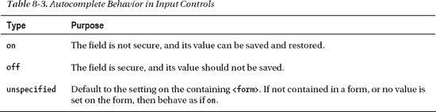

# 八、使用表单 API

在这一章中，我们将探索一项由来已久的技术:HTML 表单所带来的所有新功能。自从表单第一次出现以来，它一直是网络爆炸的支柱。如果没有表单控件，web 商务交易、社交讨论和高效搜索根本就不可能实现。

可悲的是，HTML5 表单是规范和实现中变化最大的领域之一，尽管已经设计了很多年。有好消息也有坏消息。好消息是，这一领域的进步虽然是渐进的，但增长速度相当快。坏消息是，您需要仔细寻找可以在所有目标浏览器中工作的新表单控件的子集。表单规范详细说明了一大组 API，并且不难发现，符合 HTML5 的 web 浏览器的每个主要新版本都增加了对一个或多个表单控件和一些有用的验证功能的支持。

不管怎样，我们将利用这一章来帮助你在虚拟的控件海洋中导航，并找到哪些控件今天就可以使用，哪些控件即将发布。

### html 5 表单概述

如果您已经熟悉 HTML 中的表单——如果您对专业 HTML 编程感兴趣，我们假设您已经熟悉——那么您会发现 HTML5 中的新功能非常适合坚实的基础。如果您还不熟悉表单的基本用法，我们推荐您阅读大量关于创建和处理表单值的书籍和教程。这个主题在这一点上得到了很好的阐述，您会很高兴地知道:

*   表单仍然应该封装在一个设置了基本提交属性的`<form>`元素中。
*   当用户或应用程序员提交页面时，表单仍然会将控件的值发送到服务器。
*   所有熟悉的表单控件——文本字段、单选按钮、复选框等等——仍然存在，并像以前一样工作(尽管增加了一些新功能)。
*   对于那些希望编写自己的修饰符和处理程序的人来说，表单控件仍然是完全脚本化的。

#### HTML 表单与 XForms

在过去几年里，早在 HTML5 取得很大进展之前，您可能就听说过 XForms。XForms 是一个以 XML 为中心的、强大的、有点复杂的标准，用于指定客户端表单行为，已经在它自己的 W3C 工作组中发展了近十年。XForms 利用 XML Schema 的全部功能来定义精确的验证和格式化规则。不幸的是，如果没有额外的插件，目前主流浏览器都不支持 XForms。

HTML5 表单不是 XForms。

#### 功能形式

相反，HTML5 Forms 专注于发展现有的简单 HTML 表单，以包含更多类型的控件，并解决 web 开发人员今天面临的实际限制。有一点需要记住，特别是在比较不同浏览器的表单实现时。

 **注意**关于 HTML5 表单，要掌握的最重要的概念是，规范处理的是功能行为和语义，而不是外观或显示。

例如，虽然规范详细说明了诸如颜色和日期选择器、数字选择器和电子邮件地址输入等元素的功能 API，但是规范并没有说明浏览器应该如何将这些元素呈现给最终用户。从多个层面来看，这是一个很好的选择。它允许浏览器在提供用户交互的创新方式上竞争；它将样式和语义分开；并且它允许未来或专门的用户输入设备以对其操作自然的方式进行交互。但是，在目标浏览器平台支持应用中的所有表单控件之前，请确保为用户提供足够的上下文信息，以便他们知道如何与回退呈现进行交互。有了正确的提示和描述，用户使用您的应用将不会有任何问题，即使它在出现未知输入类型时退回到替代内容。

HTML5 表单包含了大量新的 API 和元素类型，现在对它们的支持无处不在。为了理解所有的新功能，我们将把它分成两类

*   新输入类型
*   新功能和属性

然而，在我们开始之前，让我们快速评估一下当今的浏览器是如何支持 HTML5 表单规范的。

#### 浏览器支持 HTML5 表单

浏览器对 HTML5 表单的支持正在增长，但仍然有限。主要的浏览器供应商都支持许多表单控件，Opera 在早期实现中处于领先地位。但是，规格是稳定的。

检查浏览器支持在新表单的上下文中用处不大，因为它们被设计为在旧浏览器中优雅地降级。很大程度上，这意味着现在使用新的元素是安全的，因为旧的浏览器对于它们不理解的任何输入类型都会退回到简单的文本字段显示。然而，正如我们将在本章后面看到的，这提高了多层表单验证的重要性，因为仅仅依靠浏览器验证器来强制表单控件的数据类型是不够的，即使您假设完全支持现代浏览器。

现在我们已经了解了浏览器的前景，让我们来看看 HTML5 规范中添加的新表单控件。

#### 一个输入目录

获得 HTML5 中所有新增和变更元素的目录的最佳地方之一是 W3C 站点本身维护的标记列表。W3C 在`[`dev.w3.org/html5/markup/`](http://dev.w3.org/html5/markup/)`保存一个目录页文件

这个页面表示 HTML 页面中所有当前和未来的元素。目录列表中注明了新的和更改的元素。然而，这个列表中的“新”仅仅意味着该元素是在 HTML4 规范之后添加的——并不意味着该元素已经在浏览器或最终规范中实现。有了这个警告，让我们看看 HTML5 带来的新表单元素，从今天实现的表单元素开始。表 8-1 列出了新的`type`属性。例如，许多 HTML 开发者会非常熟悉`<input type="text">`和`<input type="checkbox">`。新的输入类型遵循与现有输入类型相似的模型。

这些新的输入类型提供了什么？就编程 API 而言…不是很多。事实上，就`tel`、`email`、`url`和`search`的类型而言，没有属性将它们与最简单的输入类型`text`区分开来。

那么，通过指定一个输入是专用类型，您到底得到了什么呢？你有专门的输入控制。(可能会有限制。在许多桌面浏览器中提供 void。)

让我们用一个例子来说明。通过指定输入是类型`email`

`<input type="email">`

而不是使用传统的标准，即字段仅仅是文本类型

`<input type="text">`

你向浏览器提供一个提示，在适当的时候呈现不同的用户界面或输入。您还为浏览器提供了在提交之前进一步验证字段的能力，但是我们将在本章的后面讨论这个主题。

移动设备浏览器是支持这些新的表单输入类型最快的浏览器之一。在手机上，对于没有完整键盘的用户来说，每一次按键都是更大的负担。因此，移动设备浏览器通过基于声明的类型显示不同的输入界面来支持这些新的输入类型。在苹果 iPhone 中，输入类型为`text`的标准屏幕键盘显示如图 8-1 中的所示。

***图 8-1。**输入文本的屏幕键盘显示*

然而，当一个输入字段被标记为`e-mail`类型时，iPhone 会呈现一个为电子邮件输入定制的不同键盘布局，如图图 8-2 所示。

***图 8-2。**电子邮件输入的屏幕键盘显示*

请注意对键盘空格键区域的细微调整，以允许@符号和方便地访问句点。对类型`URL`和类型`search`的键盘布局进行了类似的调整。然而，在桌面版本的 Safari 浏览器中，以及在任何没有明确支持`e-mail`、`URL`、`search`和`tel`类型的浏览器中，只会显示普通的文本输入栏。未来的浏览器，甚至是桌面版本，可能会向用户提供视觉提示或线索，以指示该字段是某个子类型。例如，Opera 会在一个字段旁边显示一个小信封图标，表示它需要一个电子邮件地址。然而，在今天的 web 应用中使用这些类型是安全的，因为任何浏览器要么针对该类型进行优化，要么干脆什么都不做。

另一种在浏览器中日益流行的特殊类型是`<input type="range">`。这种专门的输入控件旨在让用户从一系列数字中进行选择。例如，可以在表单中使用范围控件，从限制 18 岁以下未成年人访问的范围中选择年龄。通过创建一个范围输入并设置其特殊的`min`和`max`值，开发人员可以请求页面显示一个受约束的数字选择器，该选择器只能在指定的范围内操作。例如，在 Opera 浏览器中，控件:

`<input type="range" min="18" max="120">`

为受年龄限制的材料选择合适的值提供了一种便捷的方法。在 Opera 浏览器中，它显示如下:

不幸的是，范围输入本身并不显示浏览器的数字表示。此外，如果没有，用户实际上不可能知道当前选择的值是什么。要解决这个问题，我们可以很容易地添加一个`onchange`处理程序，根据当前范围值的变化来更新显示字段，如清单 8-1 中的所示。

 **注意**为什么`range`元素默认不包含可视化显示？也许是这样，用户界面设计者可以定制显示器的确切位置和外观。使显示可选会增加一些工作量，但更具灵活性。

新的表单控件现在包括一个简单的输出元素，它就是为这种类型的操作而设计的。输出是一个表单元素，它只保存一个值。因此，我们可以用它来显示范围控件的值。

***清单 8-1。** `onchange`处理程序更新一个输出*

`<label for="age">Age</label>
<input id="age" type="range" min="18" max="120" value="18" onchange="ageDisplay.value=value">
<output id="ageDisplay">18</output>`

这很好地显示了我们的范围输入，如下所示:

Opera 和基于 WebKit 的浏览器——Safari 和 Chrome——现在增加了对 type `range`元素的支持。Firefox 支持是计划中的，但在撰写本文时还没有计划。当呈现一个`range`输入类型时，Firefox 将退回到一个简单的文本元素。

另一个获得广泛支持的新表单元素是 progress 元素。progress 元素完全按照您的预期工作；它以方便的可视化格式显示任务完成的百分比。

进步可以是确定的，也可以是不确定的。可以把不确定的进度想象成一个花费未知时间的任务，但是你要向用户保证已经取得了一些进展。要显示不确定的进度元素，只需包含一个没有属性的元素:

`<progress></progress>`

不确定的进度条通常显示一个移动的进度条，但没有总完成百分比的指示器。

另一方面，一个确定的进度条以百分比的形式显示已完成的工作。要触发一个确定的进度条显示，在元素上设置`value`和`max`属性。通过将您设置的`value`除以您设置的`max`来计算显示为已完成的条形的百分比。为了便于计算，它们可以是您选择的任何值。例如，要显示 30%的完成情况，我们可以创建一个进度元素，如:

`<progress value=”30” max=”100”></progress>`

通过设置这些值，用户可以快速看到长时间运行的操作或多步骤流程完成了多少。使用脚本来更改 value 属性，可以很容易地更新显示来指示朝着最终目标的进展。

这里有龙

布莱恩说:“据说历史上‘这里有龙’这个短语被用来在地图上标示潜伏着未知危险的危险区域。下面的表单元素也是如此。尽管它们被详细说明，并且已经存在了很长时间，但是大多数都缺乏实际的执行。

因此，从现在到浏览器开发人员有机会参与设计、磨平粗糙的边缘，并以反馈和变化作出回应的这段时间，预计会有很大的变化。不要认为下面的组件是不可避免的，把它们看作 HTML5 表单发展方向的标志。如果你今天试图使用它们，风险由你自己承担……”

计划中但尚未得到广泛支持的其他表单元素包括表 8-2 中列出的元素。

尽管这些元素的一些早期实现开始出现在前沿浏览器中(例如，Opera 中的日期时间显示，如图 8-3 中所示)，但我们在本章中不会关注它们，因为它们可能会经历重大的变化。敬请关注未来的改版！

***图 8-3。**显示日期时间类型的输入*

### 使用 HTML5 表单 API

现在我们已经花了一些时间来熟悉新的表单元素类型，让我们来看看新旧表单控件上都存在的属性和 API。其中许多都是为了减少创建强大的 web 应用用户界面所需的脚本数量。您可能会发现，新的属性为您提供了从未考虑过的增强用户界面的能力。或者，至少，您可以删除现有页面中的脚本块。

#### 新的表单属性和功能

首先，我们将考虑新的属性、功能和一些以前在 HTML 早期版本中不存在的元素。像新的输入类型一样，现在使用这些属性通常是安全的，不管您的目标浏览器是否支持它们。这是因为如果浏览器不理解这些属性，那么今天市场上的任何浏览器都会安全地忽略这些属性。

##### 占位符属性

属性为输入控件提供了一种简单的方式来提供描述性的替代提示文本，只有当用户还没有输入任何值时才会显示。这在许多现代用户界面框架中很常见，流行的 JavaScript 框架也提供了对这一特性的模拟。然而，现代浏览器内置了这一功能。

要使用这个属性，只需将它添加到一个带有文本表示的输入中。这包括基本的文本类型，以及诸如`email`、`number`、`url`等语义类型。

`<label>Runner: <input name="name" placeholder="First and last name"></label>`

在现代浏览器中，这会导致该字段显示一个模糊的占位符文本，当用户或应用将焦点放在该字段上时，或者当存在一个值时，该文本就会消失。

当在不支持的浏览器中运行时，相同的属性将被忽略，导致显示默认的字段行为。

同样，只要在字段中输入值，占位符文本就不会出现。

##### 自动完成属性

Internet Explorer 5.5 中引入的`autocomplete`属性终于被标准化了。万岁！(浏览器几乎从一开始就支持该属性，但是拥有一个指定的行为对每个人都有帮助。)

`autocomplete`属性告诉浏览器是否应该保存这个输入的值以备将来使用。例如:

`<input type="text" name="creditcard" autocomplete="off">`

应该使用`autocomplete`属性来保护敏感的用户数据不被不安全地存储在本地浏览器文件中。表 8-3 显示了不同的行为类型。

##### 自动对焦属性

属性让开发人员指定给定的表单元素应该在页面加载时立即获得输入焦点。每页只有一个属性应该指定`autofocus`属性。如果多个控件设置为自动聚焦，则行为未定义。

 **注意**如果您的内容被呈现到门户或共享内容页面中，每页仅一个自动对焦控件是难以实现的。如果你不能完全控制页面，不要依赖自动对焦。

要将焦点自动设置到一个控件上，比如一个搜索文本字段，只需在该元素上设置`autofocus`属性:

`<input type="search" name="criteria" autofocus>`

像其他布尔属性一样，真实情况下不需要指定值。

 **注意**如果用户不希望改变焦距，自动对焦会让他们很恼火。许多用户利用击键来导航，而将焦点切换到表单控件会破坏这种能力。只有当一个表单控件应该接受所有默认键时，才使用它。

##### 拼写检查属性

可以在具有文本内容的输入控件以及 textarea 上设置拼写检查属性。当设置时，它向浏览器建议是否应该给出拼写反馈。这个元素的一个正常表示是在文本下画一条红色虚线，它不映射当前设置的字典中的任何条目。这提示用户仔细检查拼写或从浏览器本身获得建议。

注意，`spellcheck`属性需要一个值。不能只在元素上单独设置属性。

`<textarea id=”myTextArea” spellcheck=”true”>`

还要注意，大多数浏览器默认打开拼写检查，所以除非元素(或其父元素之一)关闭拼写检查，否则它将默认显示。

##### 列表属性和数据列表元素

属性和元素结合起来让开发者为输入指定一个可能值的列表。要使用这种组合:

1.  在文档中创建一个`datalist`元素，将它的`id`设置为一个惟一的值。数据列表可以位于文档中的任何位置。
2.  根据需要用尽可能多的`option`元素填充`datalist`，以表示控件值的完整建议集。例如，代表电子邮件联系人的`datalist`应该包含所有联系人的电子邮件地址，作为单独的`option`子节点。`<datalist id="contactList">
        <option value="x@example.com" label="Racer X">
        <option value="peter@example.com" label="Peter">
    </datalist>`
3.  通过将`list`属性设置为相关`datalist`的`id`值，将输入元素链接到`datalist`。`<input type="email" id="contacts" list="contactList">`

在支持的浏览器上，这将生成如下所示的自定义列表控件:

##### 最小值和最大值属性

正如我们之前在`<input type="range">`的例子中看到的，`min`和`max`属性允许将数字输入限制为最小和最大值。可以根据需要提供这些属性中的一个、两个或两个都不提供，并且输入控件应该相应地调整以增加或减少可接受值的范围。例如，要创建一个表示从 0%到 100%的能力置信度的范围控件，可以使用以下代码:

`<input id="confidence" name="level" type="range" min="0" max="100" value="0">`

这将创建一个范围控件，其最小值为 0，最大值为 100，巧合的是，这两个值都是该控件的默认值。

##### 步骤属性

此外，对于需要数值的输入类型，`step`属性指定了调整范围时值的增量或减量的粒度。例如，我们上面列出的置信水平范围控制可以用五的`step`属性来设置，如下所示:

`<input id="confidence" name="level" type="range" min="0" max="100" step="5" value="0">`

这将把可接受的值限制为从起始值开始的 5 个增量。换句话说，根据输入的浏览器表示，通过键入的输入或通过滑块控件，只允许 0、5、10、15、… 100。

默认的`step`值取决于它所应用的控制类型。对于`range`输入，默认步长为一步。为了配合`step`属性，HTML5 在 input 元素上引入了两个允许控制值的函数:`stepUp`和`stepDown`。

如您所料，这些函数分别递增或递减当前值。如您所料，该值增加或减少的量就是该步骤的值。因此，数字输入控件的值可以在没有用户直接输入的情况下进行调整。

##### valueas number 函数

新的`valueAsNumber`函数是一种将控件的值从文本转换成数字的简便方法……反之亦然！这是因为`valueAsNumber`既是 getter 函数也是 setter 函数。当作为 getter 调用时，`valueAsNumber`函数将输入字段的文本值转换成允许计算的数字类型。如果文本值没有完全转换成`number`类型，那么将返回`NaN`值(不是数字)。

`valueAsNumber`也可用于将输入值设置为数字类型。例如，我们的置信范围可以使用以下呼叫来设置:

`document.getElementById("confidence").valueAsNumber(65);`

确保数字满足`min`、`max`和`step`的要求，否则将抛出错误。

##### 所需属性

如果任何输入控件设置了`required`属性，那么在提交表单之前必须设置一个值。例如，要根据需要设置文本输入字段，只需添加如下所示的属性:

`<input type="text" id="firstname" name="first" required>`

如果这个字段没有设置值，无论是通过编程还是由用户设置，提交这个表单的能力将被阻止。属性是最简单的表单验证类型，但是验证的能力非常强大。现在让我们更详细地讨论表单验证。

#### 通过验证检查表单

在我们深入细节之前，让我们回顾一下表单验证到底需要什么。表单验证的核心是一个检测无效控制数据并为最终用户标记这些错误的系统。换句话说，表单验证是一系列的检查和通知，让用户在将表单提交给服务器之前更正表单的控件。

但是什么是表单验证呢？

这是一种优化。

表单验证是一种优化，因为它本身不足以保证提交给服务器的表单是正确和有效的。这是一种优化，因为它旨在帮助 web 应用快速失败。换句话说，最好是使用浏览器的内置处理来通知用户页面中包含无效的表单控件。为什么要花费网络往返的费用，只是为了让服务器通知用户数据输入中有一个打字错误呢？如果浏览器拥有在错误离开客户端之前捕捉错误的所有知识和能力，我们应该利用这一点。

但是，浏览器表单检查不足以处理所有错误。

**恶意还是误解？**

Brian 说:“尽管 HTML5 规范在提高浏览器中检查表单的能力方面取得了很大进步，但它仍然不能取代服务器验证。可能永远不会。

显然，有许多错误情况需要服务器交互来验证，比如信用卡是否被授权进行购买，甚至是基本的身份验证。然而，即使是普通的验证也不能仅仅依赖于客户端。一些用户可能正在使用不支持表单验证功能的浏览器。一些人可能会完全关闭脚本，这最终会禁用除了最简单的基于属性的验证器之外的所有验证器。然而，其他用户可以利用各种工具，如 Greasemonkey 浏览器插件来修改页面内容，以适应他们的需要。呃，内容。这可能包括删除所有表单验证检查。最终，依赖客户端验证作为检查任何重要数据的唯一方法是不够的。如果它存在于客户端，就可以被操纵。

HTML5 表单验证让用户快速获得重要的反馈，但不要依赖它来获得绝对的正确性！"

也就是说，HTML5 引入了八种简便的方法来加强表单控件输入的正确性。让我们依次检查它们，从让我们访问它们状态的对象开始:`ValidityState`。

可以从支持 HTML5 表单验证的浏览器中的任何表单控件访问`ValidityState`:

`var valCheck = document.myForm.myInput.validity;`

这个简单的命令获取一个名为`myInput`的表单元素的`ValidityState`对象的引用。该对象包含对八种可能的有效性状态的方便引用，以及一个全面的有效性汇总检查。您可以通过调用以下命令来获取该表单的整体状态:

`valCheck.valid`

这个调用将提供一个布尔值，通知我们这个特定的表单控件当前是否满足所有的有效性约束。把`valid`标志看作一个总结:如果所有八个约束都通过了，那么`valid`标志将为真。否则，如果任何有效性约束失败，`valid`属性将为假。

 **注**`ValidityState`物体是一个活的物体。一旦您获取了对它的引用，您就可以保持对它的控制，当发生变化时，它返回的有效性检查将根据需要进行更新。

如前所述，任何给定的表单元素都有八种可能的有效性约束。通过访问具有适当名称的字段，可以从`ValidityState`访问每一个。让我们看看它们是什么意思，如何在表单控件上执行它们，以及如何使用`ValidityState`来检查它们:

**值缺失**

**目的**:确保在这个表单控件上设置了一些值

**用法**:将表单控件上的`required`属性设置为 true

**用法**举例 : `<input type="text" name="myText" **required>**`

**细节**:如果在表单控件上设置了`required`属性，那么控件将处于无效状态，除非用户或编程调用为该字段设置一些值。例如，空白文本字段将无法通过要求的检查，但只要输入任何文本，就会通过检查。为空时，`valueMissing`将返回 true。

**类型不匹配**

**目的**:保证值的类型符合预期(数字、电子邮件、URL 等等)

**用法**:在表单控件上指定一个合适的`type`属性

**用法举例** : `<input type="email" name="myEmail">`

**细节**:特殊的表单控件类型不只是针对定制的手机键盘！如果浏览器可以确定输入到表单控件中的值不符合该类型的规则(例如，没有@符号的电子邮件地址)，浏览器可以将该控件标记为类型不匹配。另一个例子是不能解析为有效数字的数字字段。无论哪种情况，`typeMismatch`都将返回`true`。

**模式匹配**

**目的**:在表单控件上强制执行任何模式规则集，该规则集详细说明了特定的有效格式

**用法**:用合适的模式设置表单控件上的`pattern`属性

**用法**举例 : `<input type="number" name="creditcardnumber" pattern="[0-9]{16}" title="A credit card number is 16 digits with no spaces or dashes">`

**细节**:`pattern`属性为开发人员提供了一种强大而灵活的方式，在表单控件的值上实施正则表达式模式。当在控件上设置模式时，只要值不符合模式的规则，`patternMismatch`就会返回 true。为了帮助用户和辅助技术，你应该在任何模式控制的字段上设置`title`来描述格式的规则。

**工具长**

**目的**:确保一个值不包含太多字符

**用法**:在表单控件上放置一个`maxLength`属性

**用法**举例 : `<input type="text" name="limitedText" **maxLength="140"**>`

**细节**:如果值长度超过了`maxLength`，这个幽默命名的约束将返回 true。虽然表单控件通常会尝试在用户输入时强制最大长度，但某些情况(包括编程设置)可能会导致该值超过最大值。

**支流**

**目的**:强制数值控制的最小值

**用法**:设置一个`min`属性的最小允许值

**用法**举例 : `<input type="range" name="ageCheck" **min="18"**>`

**细节**:在任何进行数值范围检查的表单控件中，数值都有可能被临时设置在允许的范围之下。在这些情况下，`ValidityState`将为`rangeUnderflow`字段返回 true。

**范围溢出**

**目的**:强制数值控制的最大值

**用法**:设置一个`max`属性的最大允许值

**用法**举例 : `<input type="range" name="kidAgeCheck" **max="12"**>`

**细节**:类似于它的对应物`rangeUnderflow`，如果一个表单控件的值大于`max`属性，这个有效性约束将返回`true`。

**stepMismatch**

**目的**:保证一个值符合`min`、`max`、`step`的组合

**用途**:设置步长属性，指定数值的粒度步长

**用法**举例 : `<input type="range" name="confidenceLevel" min="0" max="100" **step="5"**>`

**细节**:该约束增强了`min`、`max`和`step`组合的健全性。具体来说，当前值必须是最小值加上步长的倍数。例如，从 0 到 100 的范围，步长为每 5 步，如果`stepMismatch`不返回 true，则不允许值为 17。

**客户错误**

**目的**:处理应用代码明确计算和设置的错误

**用法**:调用`setCustomValidity(message)`将表单控件置于`customError`状态

**用法**举例 : `passwordConfirmationField.setCustomValidity("Password values do not match.");`

**细节**:对于内置有效性检查不适用的情况，自定义有效性错误就足够了。每当一个字段不符合语义规则时，应用代码应该设置一个自定义的有效性消息。

自定义有效性的一个常见用例是当控件之间没有实现一致性时，例如，如果密码确认字段不匹配。(我们将在“实用的额外功能”部分深入研究这个具体的例子。)无论何时设置自定义有效性消息，控件都将无效，并将`customError`约束作为`true`返回。要清除错误，只需用空字符串值调用控件上的`setCustomValidity("")`。

##### 验证字段和功能

总之，这八个约束允许开发人员找出给定表单控件未通过验证检查的确切原因。或者，如果您不关心是哪个具体原因导致了失败，只需访问`ValidityState`上的布尔值`valid`；它是其他八个约束的集合。如果所有八个约束都返回`false`，那么`valid`字段将返回`true`。表单控件上还有一些其他有用的字段和函数，可以帮助您进行验证检查编程。

###### will validate 属性

属性仅仅表明是否在这个表单控件上检查验证。如果存在上述任何约束条件，例如`required`属性、`pattern`属性等。-----------------------------------------------------------------------------,那么,-----------------------------------------------------------------------《??》将会让您知道将会强制执行验证检查。

###### 检查有效性功能

`checkValidity`函数允许您在没有任何显式用户输入的情况下检查表单的有效性。通常，每当用户或脚本代码提交表单时，都会检查表单的有效性。这个函数允许在任何时候进行验证。

 **注意**在表单控件上调用`checkValidity`并不仅仅是检查有效性，它会导致所有的结果事件和 UI 触发器发生，就好像表单已经被提交了一样。

###### 验证消息属性

目前的浏览器版本还不支持这个属性，但是当你读到这篇文章的时候，可能已经支持了。`validationMessage`属性允许您以编程方式查询浏览器基于当前验证状态显示的本地化错误消息。例如，如果一个`required`字段没有值，浏览器可能会向用户显示一条错误消息“这个字段需要一个值。”一旦得到支持，这就是由`validationMessage`字段返回的文本字符串，它将根据控件的当前验证状态进行调整。

#### 验证反馈

关于验证反馈……到目前为止，我们避免的一个话题是浏览器应该如何以及何时向用户提供关于验证错误的反馈。该规范没有规定如何更新用户界面来显示错误信息，现有的实现也有很大的不同。以歌剧为例。在 Opera 10.5 中，浏览器通过用弹出消息和闪烁的红色字段标记错误字段来指示发生了验证错误:

相比之下，在撰写本文时，谷歌 Chrome 13 浏览器只导航到违规字段，并在发现错误时将焦点放在那里。什么是正确的行为？

两者都没有指定。但是，如果您想在验证错误发生时控制显示给用户的反馈，有一个合适的处理程序可以帮您做到这一点:`invalid`事件。

每当检查表单的有效性时——无论是由于表单被提交，还是由于直接调用了`checkValidity`函数——任何处于无效状态的表单都将被传递一个`invalid`事件。可以忽略、观察甚至取消该事件。要将一个事件处理程序添加到接收该通知的字段中，添加一些类似于清单 8-2 的代码。

***清单 8-2。**为无效事件添加事件处理程序*

`// event handler for "invalid" events
function invalidHandler(evt) {
  var validity = evt.srcElement.validity;

  // check the validity to see if a particular constraint failed
  if (validity.valueMissing) {
    // present a UI to the user indicating that the field is missing a value
  }

  // perhaps check additional constraints here…

  // If you do not want the browser to provide default validation feedback,
  // cancel the event as shown here
  evt.preventDefault();
}

// register an event listener for "invalid" events
myField.addEventListener("invalid", invalidHandler, false);`

让我们把这段代码分解一下。

首先，我们声明一个处理程序来接收`invalid`事件。我们在处理程序中做的第一件事是检查事件的来源。回想一下，`invalid`事件是在表单控件上触发的，带有一个验证错误。因此，事件的`srcElement`将是行为不端的表单控件。

从源开始，我们获取`validity`对象。使用这个`ValidityState`实例，我们可以检查它的单个约束字段，以确定到底哪里出错了。在这种情况下，因为我们知道我们的字段有一个`required`属性，我们首先检查是否违反了`valueMissing`约束。

如果检查成功，我们可以修改页面上的用户界面，通知用户需要为出错的字段输入一个值。也许可以显示一个警告或信息错误区域？这由你来决定。

一旦我们告诉用户错误是什么以及如何纠正它，我们需要决定是否希望浏览器本身显示其内置的反馈。默认情况下，浏览器会这样做。为了防止浏览器显示自己的错误信息，我们可以调用`evt.preventDefault()`来停止默认处理，完全由我们自己来处理。

再一次，这里的选择是你的。HTML5 表单 API 为您提供了实现自定义 API 或恢复默认浏览器行为的灵活性。

##### 关闭验证

尽管验证 API 背后有强大的功能，但还是有……(咳咳)正当的理由让你想关闭对一个控件或整个表单的验证。最常见的原因是，您可能会选择提交表单的临时内容，以便以后保存或检索，即使这些内容还不是非常有效。

想象一下这样一种情况，一个用户正在输入一个复杂的订单输入表单，但是在这个过程的中途需要跑一趟腿。理想情况下，您可以为用户提供一个“保存”按钮，通过将表单的值提交给服务器来保存这些值。但是，如果表单只完成了一部分，验证规则可能会阻止提交内容。如果用户由于意外中断而不得不完成或放弃表单，她会非常不高兴。

为了处理这个问题，可以用属性`noValidate`编程设置表单本身，这将导致它放弃任何验证逻辑，只提交表单。当然，这个属性可以通过脚本或原始标记来设置。

关闭验证的一个更有用的方法是在控件上设置一个`formNoValidate`属性，比如表单提交按钮。以下面的提交按钮，设置为"保存"按钮为例:

`<input type="submit" formnovalidate name="save" value="Save current progress">
<input type="submit" name="process" value="Process order">`

这个代码片段将创建两个普通外观的提交按钮。第二个将像往常一样提交表单。然而，第一个按钮被标记了`noValidate`属性，导致在使用它时所有的验证都被绕过。这允许将数据提交给服务器，而无需检查正确性。当然，您的服务器需要设置为处理未经验证的数据，但是最佳实践表明这应该是始终如此。

### 使用 HTML5 表单构建应用

现在，让我们使用本章描述的工具创建一个简单的注册页面，展示 HTML5 表单的新特性。回到我们熟悉的 Happy Trails Running Club，我们将创建一个包含新表单元素和验证的比赛注册页面。

和往常一样，我们在这里展示的演示文件的源代码可以在 code/forms 文件夹中找到。因此，我们将减少对 CSS 和外围标记的关注，更多地关注页面本身的核心。话虽如此，让我们先来看看图 8-4 所示的完成页面，然后把它分成几个部分，逐一解决。

***图 8-4。**带有比赛注册表单的示例页面*

这个注册页面展示了我们在本章中探索过的许多元素和 API，包括验证。尽管实际显示在您的浏览器上可能会有所不同，但即使浏览器不支持某个特定功能，它也会正常降级。

继续编码！

页眉、导航和页脚在我们之前的例子中已经出现过了。该页面现在包含一个`<form>`元素。

`        <form name="register">
          
<label for="runnername">Runner:</label>
             <input id="runnername" name="runnername" type="text"
                    placeholder="First and last name" required>

          
<label for="phone">Tel #:</label>
             <input id="phone" name="phone" type="tel"
                    placeholder="(xxx) xxx-xxx">

          
<label for="emailaddress">E-mail:</label>
             <input id="emailaddress" name="emailaddress" type="email"
                    placeholder="For confirmation only">

          
<label for="dob">DOB:</label>
             <input id="dob" name="dob" type="date"
                    placeholder="MM/DD/YYYY">
`

在第一部分，我们看到了四个主要输入的标记:姓名、电话、电子邮件和生日。对于每个控件，我们都设置了一个带有描述性文本的`<label>`，并使用`for`属性将它绑定到实际控件。我们还设置了占位符文本，向用户显示内容类型的描述。

对于跑步者姓名文本字段，我们通过设置`required`属性使其成为必需值。如果没有输入任何内容，这将导致表单验证使用一个`valueMissing`约束。在电话输入上，我们已经声明它的类型是`tel`。您的浏览器可能会以不同的方式显示该字段，也可能不会提供优化的键盘。

类似地，电子邮件字段被标记为类型`e-mail`。任何特定的处理都取决于浏览器。如果一些浏览器检测到输入的值不是有效的电子邮件，它们会抛出一个`typeMismatch`约束。

最后，出生日期字段被声明为类型`date`。还没有多少浏览器支持这一点，但是当它们支持时，它们会在这个输入上自动呈现一个日期选择控件。

`          <fieldset>
            <legend>T-shirt Size: </legend>
            
<input id="small" type="radio" name="tshirt" value="small">
               <label for="small">Small</label>

            
<input id="medium" type="radio" name="tshirt" value="medium">
               <label for="medium">Medium</label>

            
<input id="large" type="radio" name="tshirt" value="large">
               <label for="large">Large</label>

            
<label for="style">Shirt style:</label>
               <input id="style" name="style" type="text" list="stylelist" title="Years of
                          participation">

            <datalist id="stylelist">
             <option value="White" label="1st Year">
             <option value="Gray" label="2nd - 4th Year">
             <option value="Navy" label="Veteran (5+ Years)">
            </datalist>
          </fieldset>`

在下一节中，我们将设置用于 t 恤选择的控件。前几个控件是用于选择衬衫尺码的一组标准单选按钮。

下一节更有趣。这里，我们使用了`list`属性和它对应的`<datalist>`元素。在`<datalist>,`中，我们声明了一组应该显示在这个列表中的类型，它们具有不同的值和标签，代表基于退伍军人身份的可用 t 恤类型。虽然这个列表非常简单，但是同样的技术也可以用于很长的动态元素列表。

`         <fieldset>
            <legend>Expectations:</legend>
            

            <label for="confidence">Confidence:</label>
            <input id="confidence" name="level" type="range"
                   onchange="confidenceDisplay.value=(value +'%')"
                   min="0" max="100" step="5" value="0">
            <output id="confidenceDisplay">0%</output>

            
<label for="notes">Notes:</label>
               <textarea id="notes" name="notes" maxLength="140"></textarea>

         </fieldset>`

在控件的最后一部分，我们为用户创建了一个滑块来表达他或她完成比赛的信心。为此，我们使用类型为`range`的输入。因为我们的置信度是用百分比来衡量的，所以我们在输入上设置了一个`minimum`、`maximum`和`step`值。这些强制约束在正常的百分比范围内。此外，我们将值的移动限制为 5%的步长增量，如果您的浏览器支持范围滑块界面控件，您将能够观察到这一点。尽管不可能通过简单的控件交互来触发它们，但对于`rangeUnderflow`、`rangeOverflow`和`stepMismatch`，该控件上可能存在验证约束。

因为默认情况下，范围控件不显示其值的文本表示，所以我们将为我们的应用添加一个

<output>。将通过范围控件的`onchange`处理程序来操纵`confidenceDisplay`，但是我们将在一分钟后看到它的运行。</output>

最后，我们添加一个`<textarea>`来包含注册人的任何额外注释。通过在 notes 控件上设置一个`maxLength`约束，我们允许它实现一个`tooLong`约束，如果一个很长的值被粘贴到字段中的话。

`         
<input type="submit" name="register" value="Register">

        </form>`

我们用一个提交按钮来结束我们的控件部分，这个按钮将发送我们的表单注册。在这个默认示例中，注册实际上没有被发送到任何服务器。

我们仍然需要描述一些脚本:我们将如何覆盖浏览器内置的表单验证反馈，以及我们将如何监听事件。尽管您可能会发现浏览器对表单错误的默认处理是可以接受的，但了解您的选择总是有好处的。

``

这个脚本展示了我们如何覆盖验证错误的处理。我们从注册特殊事件类型`invalid`的事件监听器开始。为了捕获所有表单控件上的`invalid`事件，我们在表单上注册了处理程序，确保注册了事件捕获，以便事件到达我们的处理程序。

`// register an event handler on the form to`
`// handle all invalid control notifications
document.register.addEventListener("invalid", invalidHandler, true);`

现在，只要我们的任何表单元素触发了验证约束，我们的`invalidHandler`就会被调用。为了提供比一些主流浏览器默认情况下更微妙的反馈，我们将违规表单字段的标签涂成红色。为此，首先我们通过遍历父节点来定位`<label>`。

`// find the label for this form control
var label = evt.srcElement.parentElement.getElementsByTagName("label")[0];

// set the label's text color to red
label.style.color = 'red';`

将标签设置为可爱的红色后，我们希望阻止浏览器或任何其他处理程序重复处理我们的无效事件。利用 DOM 的强大功能，我们调用`preventDefault()`来停止任何浏览器对事件的默认处理，调用`stopPropagation()`来阻止其他处理程序访问。

`// stop the event from propagating higher
evt.stopPropagation();

// stop the browser's default handling of the validation error
evt.preventDefault();`

通过几个简单的步骤，我们提供了一个经过验证的表单，带有我们自己的特殊界面验证代码！

#### 实用的临时演员

有时有些技术不适合我们的常规例子，但仍然适用于许多类型的 HTML5 应用。我们在这里向你展示一些简短但常见的实用附加功能。

##### 密码是:验证！

为自定义验证器使用 HTML5 表单验证支持的一种简便方法是实现在密码更改期间验证密码的常用技术。标准技术是提供两个密码字段，这两个字段必须匹配才能成功提交表单。这里，我们提供了一种方法来利用`setCustomValidation`调用来确保在表单提交之前两个密码字段匹配。

回想一下，`customError`验证约束让您有机会在标准约束规则不适用时在表单控件上设置错误。具体来说，触发`customError`约束的一个很好的理由是当验证依赖于多个控件的并发状态时，比如这里的两个密码字段。

因为一旦获得对对象的引用，就假定对象是活动的，所以每当密码字段不匹配时，在对象上设置自定义错误，每当字段再次匹配时，立即清除错误是一个好主意。实现这一点的一个好方法是对密码字段使用 onchange 事件处理程序。

`<form name="passwordChange">
    
<label for="password1">New Password:</label>
    <input type="password" id="password1" onchange="checkPasswords()">
`
`    
<label for="password2">Confirm Password:</label>
    <input type="password" id="password2" onchange="checkPasswords()">

</form>`

正如您在这里看到的，在一个有两个密码字段的简单表单上，我们可以注册一个函数，在每次其中一个密码的值发生变化时执行。

`function checkPasswords() {
  var pass1 = document.getElementById("password1");
  var pass2 = document.getElementById("password2");

  if (pass1.value != pass2.value)
    pass1.setCustomValidity("Your passwords do not match. Please recheck that your
          new password is entered identically in the two fields.");
  else
    pass1.setCustomValidity("");
}`

这里有一种处理密码匹配的方法。只需获取两个密码字段的值，如果它们不匹配，就设置一个自定义错误。出于验证例程的考虑，只在两个密码字段中的一个上设置错误可能是可以接受的。如果它们匹配，将空字符串设置为自定义错误以清除它；这是删除自定义错误的指定方式。

一旦您在字段上设置了错误，您就可以使用本章前面描述的方法向用户显示反馈，并让她按照预期更改密码。

##### 表单是有样式的

为了帮助开发人员区分具有特定验证特征的表单控件，CSS 的开发人员添加了一组伪类，用于根据表单控件的有效性状态来设置表单控件的样式。换句话说，如果您希望页面上的表单元素根据它们当前是否符合验证来自动更改样式，您可以在规则中设置这些样式伪类。这些函数与链接上的`:visited`和`:hover`等长期存在的伪类非常相似。表 8-4 显示了为 CSS 选择器 4 级规范提出的新的伪类可以用来选择表单元素。

有了这些伪类，很容易在页面中用可视样式标记表单控件，这些样式会随着表单元素本身的调整而改变。例如，要用红色背景显示所有无效的表单元素，只需使用 CSS 规则:

`:invalid {
    background-color:red;
}`

这些伪类将在用户输入时自动调整。不需要代码！

### 总结

在这一章中，你已经看到了如何利用 HTML5 中的新元素、属性和 API 将旧的 HTML 表单变成新的东西。我们已经看到了高级输入类型的新控件，甚至更多。我们已经看到了如何将客户端验证直接集成到表单控件中，以防止不必要的服务器往返处理坏数据。总的来说，我们已经看到了减少创建全功能应用用户界面所需的脚本数量的方法。

在下一章中，我们将研究浏览器如何给你能力产生独立的执行环境来处理长时间运行的任务:HTML5 Web 工作器。