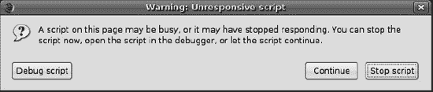
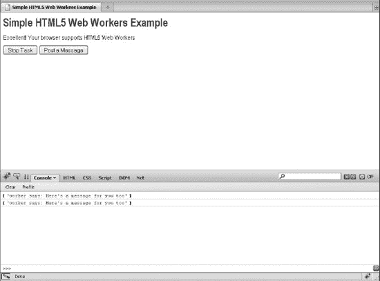
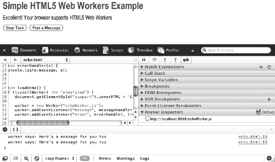
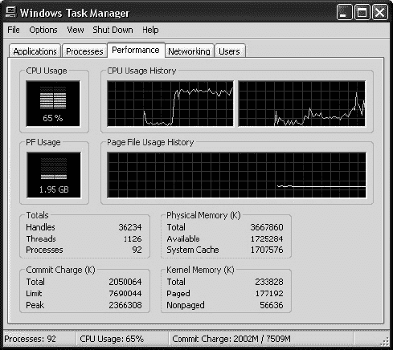
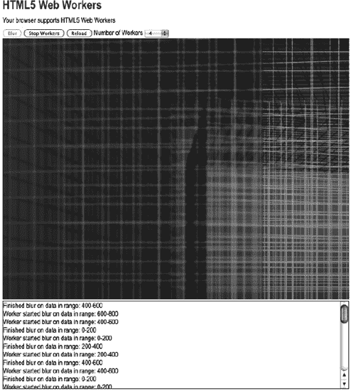
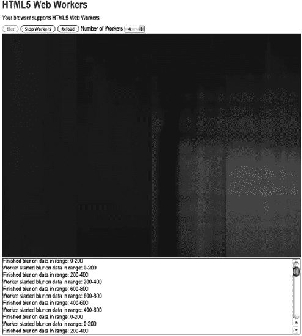
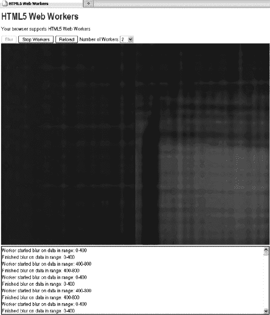

# 十、使用 Web 工作器 API

JavaScript 是单线程的。因此，长时间的计算(不一定是因为糟糕的代码)将阻塞 UI 线程，使其无法向文本框添加文本、单击按钮、使用 CSS 效果，并且在大多数浏览器中，在控制返回之前无法打开新的选项卡。为了解决这个问题，HTML5 Web 工作器 为 Web 应用提供了后台处理能力，并且通常在单独的线程上运行，以便使用 Web 工作器 的 JavaScript 应用可以利用多核 CPU。将长时间运行的任务分离到 Web 工作器 中也避免了可怕的慢脚本警告，如图 10-1 所示，当 JavaScript 循环持续几秒钟时就会出现这种警告。

***图 10-1。**火狐浏览器中的慢速脚本警告*

尽管网络工作者很强大，但也有他们做不了的事情。例如，当一个脚本在 web Worker 内部执行时，它不能访问 Web 页面的`window`对象(window.document)，这意味着 Web Worker 不能直接访问 Web 页面和 DOM API。尽管 Web 工作者不能阻止浏览器 UI，但他们仍然会消耗 CPU 周期，降低系统的响应速度。

假设您想要创建一个 web 应用，它必须执行一些后台数字处理，但是您不希望这些任务干扰 web 页面本身的交互性。使用 Web Worker，您可以生成一个 Web Worker 来执行任务，并添加一个事件侦听器来侦听来自 Web Worker 的消息。

web 工作者的另一个用例可能是一个应用，它侦听来自后端服务器的广播新闻消息，当从后端服务器接收到消息时，将消息发布到主 Web 页面。这个 Web Worker 可能使用 Web 套接字或服务器发送的事件与后端服务器通信。

在这一章中，我们将探索你能对网络工作者做些什么。首先，我们将讨论 Web 工作者是如何工作的，以及在撰写本文时可用的浏览器支持级别。然后，我们将讨论如何使用 API 来创建新的 worker，以及如何在 worker 和产生它的上下文之间进行通信。最后，我们将向您展示如何使用 Web 工作器 构建应用。

### 浏览器对网络工作者的支持

大多数现代 web 浏览器都支持 Web 工作器。查看网站`[`caniuse.com`](http://caniuse.com)`(搜索 Web 工作器)获取最新的支持列表。虽然大多数其他 API 都有 polyfill(仿真)库，例如，对于 HTML5 Canvas，有像`excanvas.js`和`flashcanvas.js`这样的库提供 Canvas APIs 的仿真(在幕后使用 Flash)，但是对于 Web 工作者来说，仿真没有太大意义。您可以调用您的辅助代码作为辅助，或者在您的页面中内嵌运行相同的代码，阻塞 UI 线程。基于工作人员的页面响应能力的提高可能足以让人们升级到更现代的浏览器(至少我们希望如此)。

### 使用 Web 工作器 API

在这一节中，我们将更详细地探索 Web 工作器 API 的使用。为了便于说明，我们创建了一个简单的浏览器页面:echo.html。使用 Web Worker 相当简单——创建一个 Web Worker 对象，并传入一个要执行的 JavaScript 文件。在页面中，您设置了一个事件监听器来监听传入的消息和 Web Worker 发布的错误，如果您想从页面与 Web Worker 通信，您可以调用`postMessage`来传入所需的数据。Web Worker JavaScript 文件中的代码也是如此——必须设置事件处理程序来处理传入的消息和错误，并且通过调用`postMessage`来处理与页面的通信。

#### 检查浏览器支持

在调用 Web 工作器 API 函数之前，您需要确保浏览器支持您将要做的事情。这样，您可以提供一些替代文本，提示应用的用户使用更新的浏览器。清单 10-1 显示了你可以用来测试浏览器支持的代码。

***清单 10-1。**检查浏览器支持*

`function loadDemo() {
  if (typeof(Worker) !== "undefined") {
    document.getElementById("support").innerHTML =
            "Excellent! Your browser supports Web 工作器";
  }
}`

在本例中，您在`loadDemo`函数中测试浏览器支持，该函数可能在页面加载时被调用。对`typeof(Worker)`的调用将返回窗口的全局`Worker`属性，如果浏览器不支持 Web 工作器 API，该属性将是未定义的。在本例中，通过用合适的消息更新页面上先前定义的支持元素，页面被更新以反映是否有浏览器支持，如图 10-2 顶部所示。

***图 10-2。**显示是否支持 Web 工作器 的示例*

#### 创建网络工作者

Web 工作器 用 JavaScript 文件的 URL 初始化，该文件包含 worker 将要执行的代码。这段代码设置事件侦听器，并与产生它的脚本进行通信。JavaScript 文件的 URL 可以是与主页具有相同来源(相同的方案、主机和端口)的相对或绝对 URL:

`worker = new Worker("echoWorker.js");`

##### 内联工人

要启动一个 worker，你需要指向一个文件。您可能已经见过一些类型为`javascript/worker`的脚本元素示例，如下例所示:

` `

***清单 10-3。**简单的 Web Worker JavaScript 文件*

`function messageHandler(e) {
    postMessage("worker says: " + e.data + " too");
}
addEventListener("message", messageHandler, true);`

### 用 Web 工作器 构建应用

到目前为止，我们一直关注于使用不同的 Web Worker APIs。让我们通过构建一个应用来看看 Web 工作器 API 到底有多强大:一个带有图像模糊过滤器的网页，并行运行在多个 Web 工作器 上。图 10-5 显示了这个应用在你启动时的样子。

***图 10-5。**基于网络工作者的网页，带有图像模糊过滤器*

这个应用将图像数据从画布发送到几个 Web 工作器(您可以指定数量)。然后，网络工作人员用简单的模糊滤镜处理图像。这可能需要几秒钟的时间，取决于图像的大小和可用的计算资源(即使是具有快速 CPU 的机器也可能有来自其他进程的负载，导致 JavaScript 执行需要更多的挂钟时间来完成)。图 10-6 显示了运行模糊过滤程序一段时间后的同一页面。

***图 10-6。**运行一段时间后图像模糊的网页*

然而，因为繁重的工作发生在 Web 工作器 中，所以不存在缓慢脚本警告的危险，因此，不需要手动将任务划分为调度的片——如果您不能使用 Web 工作器，您将不得不考虑这一点。

#### 编写 blur.js 辅助脚本

在`blur.js`应用页面中，我们可以使用一个模糊过滤器的简单实现，它会一直循环直到完全处理完它的输入，如清单 10-4 所示。

***清单 10-4。**文件 blur.js 中的一个 JavaScript 框模糊实现*

`function inRange(i, width, height) {
    return ((i>=0) && (i < width*height*4));
}

function averageNeighbors(imageData, width, height, i) {
    var v = imageData[i];

    // cardinal directions
    var north = inRange(i-width*4, width, height) ? imageData[i-width*4] : v;
    var south = inRange(i+width*4, width, height) ? imageData[i+width*4] : v;
    var west = inRange(i-4, width, height) ? imageData[i-4] : v;
    var east = inRange(i+4, width, height) ? imageData[i+4] : v;

    // diagonal neighbors
    var ne = inRange(i-width*4+4, width, height) ? imageData[i-width*4+4] : v;
    var nw = inRange(i-width*4-4, width, height) ? imageData[i-width*4-4] : v;
    var se = inRange(i+width*4+4, width, height) ? imageData[i+width*4+4] : v;
    var sw = inRange(i+width*4-4, width, height) ? imageData[i+width*4-4] : v;

    // average
    var newVal = Math.floor((north + south + east + west + se + sw + ne + nw + v)/9);

    if (isNaN(newVal)) {
        sendStatus("bad value " + i + " for height " + height);
        throw new Error("NaN");
    }
    return newVal;
}

function boxBlur(imageData, width, height) {
    var data = [];
    var val = 0;
    for (var i=0; i<width*height*4; i++) {
        val = averageNeighbors(imageData, width, height, i);
        data[i] = val;
    }

    return data;
}`

简而言之，这种算法通过平均附近的像素值来模糊图像。对于具有数百万像素的大型图像，这需要大量的时间。在 UI 线程中运行这样的循环是非常不可取的。即使没有出现慢速脚本警告，页面 UI 也不会响应，直到循环终止。由于这个原因，它为 Web 工作器 中的后台计算提供了一个很好的例子。

#### 编码 blur.html 申请页面

清单 10-5 显示了调用 Web Worker 的 HTML 页面的代码。为了清楚起见，这个例子的 HTML 保持简单。这里的目的不是构建一个漂亮的界面，而是提供一个简单的框架，可以控制 Web 工作人员并演示他们的行为。在这个应用中，显示输入图像的 canvas 元素被注入到页面中。我们有按钮来开始模糊图像，停止模糊，重置图像，并指定要繁殖的工人数量。

***清单 10-5。【blur.html 页面代码***

`<!DOCTYPE html>
<title>Web 工作器</title>
<link rel="stylesheet" href = "styles.css">

<h1>Web 工作器</h1>

Your browser does not support Web 工作器.

<button id="startBlurButton" disabled>Blur</button>
<button id="stopButton" disabled>Stop Workers</button>
<button onclick="document.location = document.location;">Reload</button>

<label for="workerCount">Number of Workers</label>
<select id="workerCount">
    <option>1</option>
    <option selected>2</option>
    <option>4</option>
    <option>8</option>
    <option>16</option>
</select>

`

接下来，让我们将创建 workers 的代码添加到文件`blur.html.`中，我们实例化了一个`worker`对象，传入一个 JavaScript 文件的 URL。每个实例化的工作者将运行相同的代码，但是负责处理输入图像的不同部分:

`function initWorker(src) {
    var worker = new Worker(src);
    worker.addEventListener("message", messageHandler, true);
    worker.addEventListener("error", errorHandler, true);
    return worker;
}`

让我们将错误处理代码添加到文件`blur.html`，如下所示。如果 worker 出现错误，页面将能够显示一条错误消息，而不是继续不知道。我们的例子应该不会遇到任何问题，但是监听错误事件通常是一种很好的实践，对于调试非常有价值。

`function errorHandler(e) {` `    log("error: " + e.message);
}`

#### 编写 blurWorker.js Web Worker 脚本

接下来，我们将工人用来与页面通信的代码添加到文件`blurWorker.js`(参见清单 10-6 )。当 Web 工作者完成计算块时，他们可以使用`postMessage`通知页面他们已经取得了进展。我们将使用这些信息来更新主页上显示的图像。创建后，我们的网络工作人员等待包含图像数据和指令的消息开始模糊。这个消息是一个 JavaScript 对象，包含消息类型和用数字数组表示的图像数据。

***清单 10-6。**发送和处理 blurWorker.js 文件中的图像数据*

`function sendStatus(statusText) {
    postMessage({"type" : "status",
                 "statusText" : statusText}
                );
}

function messageHandler(e) {
    var messageType = e.data.type;
    switch (messageType) {
        case ("blur"):
            sendStatus("Worker started blur on data in range: " +
                            e.data.startX + "-" + (e.data.startX+e.data.width));
            var imageData = e.data.imageData;
            imageData = boxBlur(imageData, e.data.width, e.data.height, e.data.startX);

            postMessage({"type" : "progress",
                         "imageData" : imageData,
                         "width" : e.data.width,
                         "height" : e.data.height,
                         "startX" : e.data.startX
                        });
            sendStatus("Finished blur on data in range: " +
                            e.data.startX + "-" + (e.data.width+e.data.startX));
            break;
        default:
            sendStatus("Worker got message: " + e.data);
    }
}
addEventListener("message", messageHandler, true);`

#### 与网络工作者交流

在文件`blur.html`中，我们可以通过向工人发送一些代表模糊任务的数据和参数来使用他们。这是通过使用`postMessage`发送一个 JavaScript 对象来完成的，该对象包含 RGBA 图像数据的数组、源图像的尺寸以及工人负责的像素范围。每个工作者基于其接收的消息处理图像的不同部分:

`function sendBlurTask(worker, i, chunkWidth) {
        var chunkHeight = image.height;
        var chunkStartX = i * chunkWidth;
        var chunkStartY = 0;
        var data = ctx.getImageData(chunkStartX, chunkStartY,
                                    chunkWidth, chunkHeight).data;

        worker.postMessage({'type' : 'blur',
                            'imageData' : data,
                            'width' : chunkWidth,
                            'height' : chunkHeight,
                            'startX' : chunkStartX});
}`

**画布图像数据**

**Frank 说**::`postMessage`被指定为允许`imageData`对象的高效序列化，以便与 canvas API 一起使用。一些包含 Worker 和`postMessage`API 的浏览器可能还不支持`postMessage`的扩展序列化能力。

正因为如此，我们在本章中给出的图像处理例子发送`imageData.data`(它像 JavaScript 数组一样序列化)而不是发送`imageData`对象本身。当 Web 工作者计算他们的任务时，他们将状态和结果反馈给页面。清单 10-6 展示了模糊过滤器处理数据后，数据是如何从工作者发送到页面的。同样，该消息包含一个 JavaScript 对象，该对象具有图像数据和坐标字段，用于标记已处理部分的边界。"

在 HTML 页面端，消息处理程序使用这些数据，并用新的像素值更新画布。经过处理的图像数据输入后，结果立即可见。我们现在有了一个示例应用，它可以处理图像，同时有可能利用多个 CPU 内核。此外，我们没有锁定用户界面，使其在 Web 工作人员活动时没有响应。图 10-7 显示了实际应用。

***图 10-7。**模糊应用在行动中*

#### 实际应用

要查看这个示例的运行情况，页面`blur.html`必须由 web 服务器提供(例如，Apache 或 Python 的 SimpleHTTPServer)。下面的步骤展示了如何使用 Python SimpleHTTPServer 运行应用:

1.  安装 Python。
2.  导航到包含示例文件(blur.html)的目录。
3.  启动 Python 如下:`python -m SimpleHTTPServer 9999`
4.  打开浏览器并导航至`[`localhost:9999/blur.html`](http://localhost:9999/blur.html)`。你现在应该看到如图 10-7 所示的页面。
5.  如果你让它运行一段时间，你会看到图像的不同象限慢慢模糊。同时模糊的象限数量取决于您启动的工作线程数量。

#### 示例代码

为了完整起见，清单 10-7 、 10-8 和 10-9 包含了示例应用的完整代码。

***清单 10-7。【blur.html 文件内容***

`<!DOCTYPE html>
<title>Web 工作器</title>
<link rel="stylesheet" href = "styles.css">

<h1>Web 工作器</h1>

Your browser does not support Web 工作器.

<button id="startBlurButton" disabled>Blur</button>
<button id="stopButton" disabled>Stop Workers</button>
<button onclick="document.location = document.location;">Reload</button>

<label for="workerCount">Number of Workers</label>
<select id="workerCount">
    <option>1</option>
    <option selected>2</option>
    <option>4</option>
    <option>8</option>
    <option>16</option>
</select>

`

***清单 10-8。**文件内容 blurWorker.js*

`importScripts("blur.js");

function sendStatus(statusText) {
    postMessage({"type" : "status",
                 "statusText" : statusText}
                );
}

function messageHandler(e) {
    var messageType = e.data.type;
    switch (messageType) {
        case ("blur"):
            sendStatus("Worker started blur on data in range: " +
                            e.data.startX + "-" + (e.data.startX+e.data.width));
            var imageData = e.data.imageData;
            imageData = boxBlur(imageData, e.data.width, e.data.height, e.data.startX);

            postMessage({"type" : "progress",
                         "imageData" : imageData,
                         "width" : e.data.width,
                         "height" : e.data.height,
                         "startX" : e.data.startX
                        });
            sendStatus("Finished blur on data in range: " +
                            e.data.startX + "-" + (e.data.width+e.data.startX));
            break;
        default:
            sendStatus("Worker got message: " + e.data);
    }
}` 
`addEventListener("message", messageHandler, true);`

***清单 10-9。**blur . js 文件内容*

`function inRange(i, width, height) {
    return ((i>=0) && (i < width*height*4));
}

function averageNeighbors(imageData, width, height, i) {
    var v = imageData[i];

    // cardinal directions
    var north = inRange(i-width*4, width, height) ? imageData[i-width*4] : v;
    var south = inRange(i+width*4, width, height) ? imageData[i+width*4] : v;
    var west = inRange(i-4, width, height) ? imageData[i-4] : v;
    var east = inRange(i+4, width, height) ? imageData[i+4] : v;

    // diagonal neighbors
    var ne = inRange(i-width*4+4, width, height) ? imageData[i-width*4+4] : v;
    var nw = inRange(i-width*4-4, width, height) ? imageData[i-width*4-4] : v;
    var se = inRange(i+width*4+4, width, height) ? imageData[i+width*4+4] : v;
    var sw = inRange(i+width*4-4, width, height) ? imageData[i+width*4-4] : v;

    // average
    var newVal = Math.floor((north + south + east + west + se + sw + ne + nw + v)/9);

    if (isNaN(newVal)) {
        sendStatus("bad value " + i + " for height " + height);
        throw new Error("NaN");
    }
    return newVal;
}

function boxBlur(imageData, width, height) {
    var data = [];
    var val = 0;

    for (var i=0; i<width*height*4; i++) {
        val = averageNeighbors(imageData, width, height, i);
        data[i] = val;
    }

    return data;
}`

### 总结

在本章中，您已经看到了如何使用 Web 工作器 来创建具有后台处理的 Web 应用。本章向您展示了 Web 工作器(以及内联和共享 Web 工作器)是如何工作的。我们讨论了如何使用 API 创建新的 worker，以及如何在 worker 和产生它的上下文之间进行通信。最后，我们向您展示了如何使用 Web 工作器 构建应用。在下一章，我们将演示 HTML5 让你保存数据的本地副本和减少应用中网络开销的更多方法。