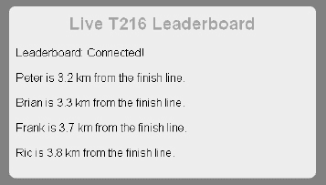

# 十一、使用 Web 存储 API

在这一章中，我们将探索你可以用 HTML5 Web 存储做什么——有时被称为 DOM Storage——这是一个 API，它使得跨 Web 请求保留数据变得容易。在 web 存储 API 出现之前，远程 Web 服务器需要通过在客户机和服务器之间来回发送来存储任何持久的数据。随着 Web 存储 API 的出现，开发人员现在可以将数据直接存储在浏览器的客户端，以便跨请求重复访问，或者在您完全关闭浏览器后很长时间内检索，从而减少网络流量。

我们将首先看看 Web 存储与 cookies 有何不同，然后探讨如何存储和检索数据。接下来，我们将看看`localStorage`和`sessionStorage`之间的区别，存储接口提供的属性和功能，以及如何处理 Web 存储事件。我们最后看一下 Web SQL 数据库 API 和一些实用的附加内容。

### 网络存储概述

为了解释 Web 存储 API，最好回顾一下它的前身，名字有趣的 cookie。浏览器 cookie——以在程序之间传递小数据值的古老编程技术命名——是一种在服务器和浏览器之间来回发送文本值的内置方式。服务器可以使用它们放入这些 cookies 中的值来跨网页跟踪用户信息。每当用户访问一个域时，Cookie 值就会来回传输。例如，cookie 可以存储一个会话标识符，通过在浏览器 cookie 中存储一个与服务器自己的购物车数据库相匹配的唯一 ID，允许 web 服务器知道哪个购物车属于某个用户。然后，当用户从一个页面移动到另一个页面时，购物车可以一致地更新。cookies 的另一个用途是将本地值存储到应用中，以便这些值可以在后续的页面加载中使用。

Cookie 值还可以用于用户不太喜欢的操作，比如跟踪用户为了定向广告访问了哪些页面。因此，一些用户要求浏览器包含允许他们随时或针对特定网站阻止或删除 cookies 的功能。

不管你喜不喜欢，早在 20 世纪 90 年代中期网景浏览器的早期，浏览器就已经支持 cookies 了。Cookies 也是少数几个自网络早期以来就一直得到浏览器厂商支持的特性之一。Cookies 允许跨多个请求跟踪数据，只要数据在服务器和浏览器代码之间仔细协调。尽管 cookies 无处不在，但它也有一些众所周知的缺点:

*   Cookies 的大小极其有限。一般来说，在一个 cookie 中只能设置大约 4KB 的数据，这意味着对于像文档或邮件这样的大数据量来说，这是不可接受的。
*   对于该 cookie 范围内的每个请求，cookie 在服务器和浏览器之间来回传输。这不仅意味着 cookie 数据在网络上是可见的，使它们在未加密时存在安全风险，而且每次加载 URL 时，作为 cookie 保存的任何数据都将消耗网络带宽。因此，相对较小的 cookies 更有意义。

在许多情况下，不需要网络或远程服务器也能达到同样的效果。这就是 HTML5 Web 存储 API 的用武之地。通过使用这个简单的 API，开发人员可以将值存储在容易检索的 JavaScript 对象中，这些对象可以跨页面加载保持不变。通过使用`sessionStorage`或`localStorage`，开发人员可以选择让这些值分别在单个窗口或选项卡中的页面加载中或浏览器重启中存在。存储的数据不通过网络传输，并且在返回访问页面时很容易访问。此外，使用高达几兆字节的 Web 存储 API 值可以持久保存更大的值。这使得 Web 存储适用于文档和文件数据，这些数据会很快突破 cookie 的大小限制。

### 浏览器对网络存储的支持

Web 存储是 HTML5 最广泛采用的特性之一。事实上，自 2009 年 Internet Explorer 8 发布以来，所有当前发布的浏览器版本都在一定程度上支持网络存储。在本文发表时，不支持存储的浏览器的市场份额正在缩减至个位数百分比。

Web 存储是目前在 web 应用中使用的最安全的新 API 之一，因为它得到了广泛的支持。不过，和往常一样，在使用 Web 存储之前先测试它是否受支持是个好主意。下一节“检查浏览器支持”将向您展示如何以编程方式检查 Web 存储是否受支持。

### 使用网络存储 API

Web 存储 API 使用起来非常简单。我们将首先介绍值的基本存储和检索，然后继续讨论`sessionStorage`和`localStorage`之间的差异。最后，我们将看看 API 更高级的方面，比如值改变时的事件通知。

#### 检查浏览器支持

给定域的存储数据库直接从`window`对象访问。因此，确定用户的浏览器是否支持 Web 存储 API 就像检查是否存在`window.sessionStorage`或`window.localStorage`一样简单。清单 11-1 显示了一个例程，它检查存储支持并显示一条关于浏览器对 Web 存储 API 支持的消息。除了使用这些代码，您还可以使用 JavaScript 实用程序库 Modernizr，它可以处理一些可能导致误报的情况。

***清单 11-1。**检查网络存储支持*

`function checkStorageSupport() {

  //sessionStorage
  if (window.sessionStorage) {
    alert('This browser supports sessionStorage');
  } else {
    alert('This browser does NOT support sessionStorage');
  }

  //localStorage
  if (window.localStorage) {
    alert('This browser supports localStorage');
  } else {
    alert('This browser does NOT support localStorage');
  }
}`

图 11-1 显示了对存储支持的检查。

***图 11-1。**检查 Opera 中的浏览器支持*

有些浏览器不支持从文件系统直接访问文件的`sessionStorage`。当你运行本章中的例子时，确保你从一个 web 服务器提供页面！例如，您可以在`code/storage`目录中启动 Python 的简单 HTTP 服务器，如下所示:

`python -m SimpleHTTPServer 9999`

之后，您可以在`[`localhost:9999/`](http://localhost:9999)`访问文件。比如`[`localhost:9999/browser-test.html`](http://localhost:9999/browser-test.html)`。

但是，您可以自由地使用任何服务器或 URL 位置来运行这些示例。

 **注意**如果用户在浏览器设置为“私人”模式的情况下浏览，那么一旦浏览器关闭，localStorage 值实际上就不会存在。这是故意的，因为这种模式的用户明确选择不留下任何痕迹。尽管如此，如果存储值在以后的浏览会话中不可用，您的应用应该能够正常响应。

#### 设置和检索值

首先，在您学习设置和检索页面中的简单值时，我们将重点关注会话存储功能。设置一个值可以很容易地在一条语句中完成，我们最初将使用手写符号来编写这条语句:

`sessionStorage.setItem(‘myFirstKey', ‘myFirstValue');`

此存储访问语句中有几个要点需要注意:

*   我们可以省略对`window`的引用，因为存储对象在默认页面上下文中是可用的。
*   我们正在调用的函数是`setItem`，它带有一个键字符串和一个值字符串。尽管有些浏览器可能支持传入非字符串值，但规范只允许字符串作为值。
*   这个特定的调用将把字符串`myFirstValue`设置到会话存储器中，稍后可以通过键`myFirstKey`检索该字符串。

为了检索该值，手写符号包括调用`getItem`函数。例如，如果我们用下面的语句来扩充前面的例子

`alert(sessionStorage.getItem(‘myFirstKey'));`

浏览器发出显示文本`myFirstValue`的 JavaScript 警告。如您所见，从 Web 存储 API 设置和检索值非常简单。

然而，有一种更简单的方法来访问代码中的存储对象。您还可以使用 expando-properties 来设置存储中的值。使用这种方法，只需直接在`sessionStorage`对象上设置和检索对应于键值对的值，就可以完全避免`setItem`和`getItem`调用。使用这种方法，我们的值集调用可以重写如下:

`sessionStorage.myFirstKey = ‘myFirstValue';`

以至

`sessionStorage[‘myFirstKey'] = ‘myFirstValue';`

类似地，值检索调用可以重写为:

`alert(sessionStorage.myFirstKey);`

为了可读性，我们将在本章中交替使用这些格式。

这是最基本的。现在，您已经掌握了在应用中使用会话存储所需的所有知识。然而，您可能想知道这个`sessionStorage`对象有什么特别之处。毕竟，JavaScript 允许您设置和获取几乎任何对象的属性。区别在于范围。您可能没有意识到的是，我们的示例 set 和 get 调用不需要出现在同一个 web 页面中。只要页面是从同一个来源提供的——方案、主机和端口的组合——那么就可以使用相同的键从其他页面检索设置在`sessionStorage`上的值。这也适用于同一页面的后续加载。作为一名开发人员，您可能已经习惯了这样的想法:每当页面被重新加载时，脚本中所做的更改就会消失。对于在 Web 存储 API 中设置的值来说，这不再适用；它们将跨页面加载继续存在。

#### 堵塞数据漏洞

这些价值观会持续多久？对于设置在`sessionStorage`中的对象，只要浏览器窗口(或标签)没有关闭，它们就会持续存在。一旦用户关闭窗口——或者浏览器，就此而言——`sessionStorage`值就会被清除。将一个`sessionStorage`值看作是一个便签提醒是很有用的。放入`sessionStorage`的价值不会持续很久，你也不应该放任何真正有价值的东西进去，因为这些价值不能保证在你寻找的时候就在你身边。

那么，为什么您会选择在 web 应用中使用会话存储区呢？会话存储非常适合通常用向导或对话框表示的短期流程。如果您需要存储几个页面中的数据，并且您不希望在用户下次访问您的应用时重新出现这些数据，那么可以随意将它们存储在会话存储区中。在过去，这些类型的值可能通过表单和 cookies 提交，并在每次页面加载时来回传输。使用存储消除了这种开销。

API 还有另一个非常特殊的用途，它解决了困扰许多 web 应用的一个问题:取值范围。举个例子，一个让你购买机票的购物应用。在这样的应用中，可以使用 cookies 在浏览器和服务器之间来回发送理想出发日期和返回日期等偏好数据。这使得服务器能够在用户浏览应用、选择座位和用餐时记住之前的选择。

然而，用户在购买旅游优惠时打开多个窗口，比较不同供应商相同出发时间的航班是很常见的。这在 cookie 系统中引起问题，因为如果用户在比较价格和可用性的同时在浏览器窗口之间来回切换，他们很可能在一个窗口中设置 cookie 值，该值将在下一次操作中意外地应用于从同一 URL 提供的另一个窗口。这有时被称为泄漏数据，是由于 cookies 是基于其存储位置共享的。图 11-2 显示了这是如何发生的。

***图 11-2。**使用旅游网站比价时数据泄露*

另一方面，使用`sessionStorage`允许像出发日期这样的临时值跨访问应用的页面保存，但不会泄漏到用户也在浏览航班的其他窗口。因此，这些偏好将被隔离到预订相应航班的每个窗口。

#### 本地存储与会话存储

有时，应用需要在单个选项卡或窗口的生命周期之外持续存在的值，或者需要在多个视图之间共享的值。在这些情况下，使用不同的 Web 存储实现更合适:`localStorage`。好消息是你已经知道如何使用`localStorage`。`sessionStorage`和`localStorage`之间唯一的编程区别是访问它们的名字——分别通过`sessionStorage`和`localStorage`对象。主要的行为差异在于价值观持续的时间和分享的方式。表 11-1 显示了两种储存方式的区别。

请记住，浏览器有时会重新定义标签页或窗口的生命周期。例如，当浏览器崩溃时，或者当用户关闭带有许多打开标签的显示时，一些浏览器将保存并恢复当前会话。在这些情况下，当浏览器重启或恢复时，浏览器可以选择保留`sessionStorage`。所以，实际上，`sessionStorage`可能比你想象的要长寿！

#### 其他 Web 存储 API 属性和功能

Web 存储 API 是 HTML5 集合中最简单的 API 之一。我们已经研究了从会话和本地存储区域设置和检索数据的显式和隐式方法。让我们通过查看完整的可用属性和函数调用来完成对 API 的调查。

可以从使用它们的文档的`window`对象中检索出`sessionStorage`和`localStorage`对象。除了它们的名称和值的持续时间，它们在功能上是相同的。两者都实现了`Storage`接口，如清单 11-2 所示。

***清单 11-2。**存储接口*

`interface Storage {
  readonly attribute unsigned long length;
  getter DOMString key(in unsigned long index);
  getter any getItem(in DOMString key);
  setter creator void setItem(in DOMString key, in any data);
  deleter void removeItem(in DOMString key);
  void clear();
};`

让我们更详细地看看这里的属性和功能。

*   `length`属性指定存储对象中当前存储了多少个键值对。请记住，存储对象特定于它们的原点，因此这意味着存储对象的项目(和长度)只反映为当前原点存储的项目。
*   `key(index)`函数允许检索给定的密钥。通常，当您希望遍历特定存储对象中的所有键时，这是最有用的。键是从零开始的，这意味着第一个键位于索引(0)处，最后一个键位于索引(长度–1)处。一旦检索到一个键，就可以用它来获取相应的值。在给定存储对象的生命周期中，键将保留它们的索引，除非移除一个键或它的前一个键。
*   正如您已经看到的，`getItem(key)`函数是一种基于给定键检索值的方法。另一种是将键作为数组索引引用到存储对象。在这两种情况下，如果存储中不存在该键，将返回值`null`。
*   Similarly, `setItem(key, value)` function will put a value into storage under the specified key name, or replace an existing value if one already exists under that key name. Note that it is possible to receive an error when setting an item value; if the user has storage turned off for that site, or if the storage is already filled to its maximum amount, a `QUOTA_EXCEEDED_ERR` error will be thrown during the attempt. Make sure to handle such an error should your application depend on proper storage behavior. 

    ***图 11-3。**Chrome 出现配额超标错误*

*   The `removeItem(key)` function does exactly as you might expect. If a value is currently in storage under the specified key, this call will remove it. If no item was stored under that key, no action is taken.

     **注意**与一些集合和数据框架不同，删除一个项目不会因为调用删除它而返回旧值。确保您已经存储了与删除无关的任何所需副本。

*   最后，`clear()`函数从存储列表中删除所有值。在空存储对象上调用此方法是安全的；因此，调用将什么也不做。

**磁盘空间配额**

Peter 说:“规范建议浏览器允许每个源有 5 兆字节。为了获得更多的空间，浏览器应该在达到配额时提示用户，并且可以为用户提供查看每个源使用了多少空间的方法。

现实中，行为还是有点不一致。一些浏览器默默地允许更大的配额或提示增加空间，而另一些则简单地抛出如图 11-3 中所示的`QUOTA_EXCEEDED_ERR`错误，而另一些，如图 11-4 中所示的 Opera，实现了一种动态分配更多配额的好方法。本例中使用的测试文件`testQuota.html`位于`code/storage`目录中。"

***图 11-4。**歌剧增加临时配额*

#### 交流网络存储更新

有时，事情变得有点复杂，存储需要被多个页面、浏览器选项卡或工作人员访问。每当存储值改变时，您的应用可能需要连续触发许多操作。对于这些情况，Web 存储 API 包括一个事件机制，允许将数据更新通知传递给感兴趣的侦听器。对于与存储操作起源相同的每个窗口，Web 存储事件都在 window 对象上触发，而不管侦听窗口本身是否正在执行任何存储操作。

 **注意** Web 存储事件可以用来在同源的窗口之间进行通信。这将在“实用附加功能”一节中进行更深入的探讨。

要注册接收窗口源的存储事件，只需注册一个事件侦听器，例如:

`window.addEventListener("storage", displayStorageEvent, true);`

如您所见，名称`storage`用于表示对存储事件的兴趣。每当针对该来源的`Storage`事件——无论是`sessionStorage`还是`localStorage`——被引发时，任何注册的事件监听器都将接收存储事件作为指定的事件处理程序。存储事件本身的形式如清单 11-3 所示。

***清单 11-3。**存储事件接口*

`interface StorageEvent : Event {
  readonly attribute DOMString key;
  readonly attribute any oldValue;
  readonly attribute any newValue;
  readonly attribute DOMString url;
  readonly attribute Storage storageArea;
};`

`StorageEvent`对象将是传递给事件处理程序的第一个对象，它包含了理解存储变化本质所需的所有信息。

*   `key`属性包含存储中更新或删除的键值。
*   `oldValue`包含与更新前的密钥相对应的先前值，而`newValue`包含更改后的值。如果该值是新添加的，`oldValue`将为空，如果该值已被删除，`newValue`将为空。
*   `url`将指向`storage`事件发生的原点。
*   最后，`storageArea`提供了对值被改变的`sessionStorage`或`localStorage`的方便引用。这为处理程序提供了一种简单的方法来查询当前值的存储或根据其他存储更改进行更改。

清单 11-4 显示了一个简单的事件处理程序，它会弹出一个警告对话框，显示在页面原点触发的任何存储事件的内容。

***清单 11-4。**显示存储事件内容的事件处理程序*

`// display the contents of a storage event
function displayStorageEvent(e) {
  var logged = "key:" + e.key + ", newValue:" + e.newValue + ", oldValue:" +
               e.oldValue +", url:" + e.url + ", storageArea:" + e.storageArea;

  alert(logged);
}

// add a storage event listener for this origin
window.addEventListener("storage", displayStorageEvent, true);`

#### 探索网络存储

由于 Web 存储在功能上与 cookies 非常相似，所以最先进的浏览器以非常相似的方式对待它们也就不足为奇了。存储在`localStorage`或`sessionStorage`中的值可以在最新的浏览器中像浏览 cookies 一样浏览，如图图 11-5 所示。

***图 11-5。**谷歌浏览器资源面板中的存储值*

该接口还允许用户根据需要删除存储值，并在访问页面时轻松查看给定网站记录的值。毫不奇怪，Safari 浏览器对 cookies 和存储有类似的统一显示，因为它与 Chrome 基于相同的底层 WebKit 渲染引擎。图 11-6 显示了 Safari 资源面板。

***图 11-6。**Safari 的资源面板中的存储值*

像其他浏览器一样，Opera 蜻蜓存储显示器不仅允许用户浏览和删除存储值，还允许用户创建存储值，如图图 11-7 所示。

***图 11-7。**Opera 存储面板中的存储值*

随着各种浏览器厂商越来越广泛地实现 Web 存储，用户和开发人员可用的容量和工具都将迅速增加。

### 使用网络存储构建应用

现在，让我们将您在将存储集成到 web 应用中所学到的东西放在一起。随着应用变得越来越复杂，在没有服务器交互的情况下管理尽可能多的数据变得越来越重要。将数据保存在客户端本地，通过从本地机器而不是远程位置获取数据，减少了网络流量并提高了响应速度。

开发人员面临的一个常见问题是，当用户在应用中从一个页面移动到另一个页面时，如何管理数据。传统上，web 应用通过在服务器上存储数据并在用户导航页面时来回移动数据来实现这一点。或者，应用可能试图将用户保持在单个页面中，并动态更新所有内容。然而，用户容易走神，当用户返回到应用页面时，将数据快速返回到显示中是增强用户体验的一个好方法。

在我们的示例应用中，我们将展示当用户在网站上从一个页面移动到另一个页面时，如何在本地存储临时应用数据，并在每个页面上从存储中快速加载它。为了做到这一点，我们将建立在前几章的例子上。在第五章中，我们展示了收集用户当前位置是多么容易。然后，在第七章中，我们演示了如何获取位置数据并将其发送到远程服务器，以便任何数量的感兴趣的用户都可以查看。在这里，我们将更进一步:我们将侦听通过 WebSocket 传递的广播位置数据，并将其存储在本地存储中，以便当用户从一个页面移动到另一个页面时，可以立即获得这些数据。

想象一下，我们的跑步俱乐部拥有来自其比赛参与者的实时位置信息，这些信息通过他们的移动设备广播并通过 WebSocket 服务器共享。当参赛者在比赛中上传新的位置信息时，web 应用可以很容易地实时显示每个参赛者的当前位置。智能网站会缓存这些比赛位置，以便在用户浏览网站页面时快速显示。这正是我们要建造的。

为了实现这一点，我们需要引入一个演示网站，可以保存和恢复我们的赛车数据。我们已经创建了一个三页的跑步网站示例，并将其放在我们的在线资源文件夹`code/storage`中，但是您可以使用您选择的任何网站进行演示。这里的关键仅仅是你有多个用户可以轻松访问的网页。我们将在这些页面中插入一些动态内容来表示一个实时的排行榜，或者一个比赛参与者的列表以及他们离终点的当前距离。图 11-8 显示了组成比赛网站的三个页面。

***图 11-8。**榜样竞赛网站*

我们的每个网页都将包含一个公共部分来显示排行榜数据。排行榜中的每个条目将显示我们的一名选手的姓名以及他或她目前离终点线的距离。当我们的任何页面被加载时，它将与一个比赛广播服务器建立 WebSocket 连接，并监听指示一个参赛者位置的消息。反过来，参赛者会将他们的当前位置发送到同一个广播服务器，从而使位置数据实时传输到页面。

所有这些都已经在前面与地理定位和 WebSocket 相关的章节中介绍过了。事实上，这里的许多演示代码都与本书前面的例子共享。然而，在这个例子中有一个关键的区别:当数据到达页面时，我们将把它存储在会话存储区中，以便以后检索。然后，每当用户导航到新页面时，在建立新的 WebSocket 连接之前，将检索并显示存储的数据。这样，临时数据就可以在页面之间传输，而无需使用任何 cookies 或 web 服务器通信。

为了保持我们的数据量较小，我们将通过网络以简单的格式发送我们的赛车位置信息，以便于阅读和解析。这种格式是一个`String`，它使用分号(`;`)作为分隔符来分隔数据块:名称、纬度和经度。例如，在纬度 37.20 和经度–121.53 的名为 Racer X 的赛车手将使用以下字符串进行标识:

`;Racer X;37.20;-121.53`

 **注意**一种常见的技术是使用 JSON 格式在客户机和服务器之间发送对象表示。我们将在本章后面的“实用附加功能”一节中告诉你如何去做。

现在，让我们深入研究代码本身。我们的每个页面都将包含相同的 JavaScript 代码，以连接到 WebSocket 服务器，处理和显示排行榜消息，并使用`sessionStorage`保存和恢复排行榜。因此，这段代码是包含在真实应用的 JavaScript 库中的主要候选代码。

首先，我们将建立一些您以前见过的实用方法。为了计算任何一个特定的参赛者离终点线的距离，我们需要例程来计算两个地理位置之间的距离，如清单 11-5 中的所示。

***清单 11-5。**距离计算例程*

`// functions for determining the distance between two
    // latitude and longitude positions
    function toRadians(num) {
      return num * Math.PI / 180;
    }

    function distance(latitude1, longitude1, latitude2, longitude2) {
      // R is the radius of the earth in kilometers
      var R = 6371;

      var deltaLatitude = toRadians((latitude2-latitude1));
      var deltaLongitude = toRadians((longitude2-longitude1));
      latitude1 = toRadians(latitude1), latitude2 = toRadians(latitude2);

      var a = Math.sin(deltaLatitude/2) *
              Math.sin(deltaLatitude/2) +
              Math.cos(latitude1) *` `              Math.cos(latitude2) *
              Math.sin(deltaLongitude/2) *
              Math.sin(deltaLongitude/2);

      var c = 2 * Math.atan2(Math.sqrt(a),
                             Math.sqrt(1-a));
      var d = R * c;
      return d;
    }

    // latitude and longitude for the finish line in the Lake Tahoe race
    var finishLat = 39.17222;
    var finishLong = -120.13778;`

在这组熟悉的函数中——之前在第五章中使用过——我们用一个`distance`函数计算两点之间的距离。这些细节并不特别重要，也不是赛道上距离的最准确表示，但它们对我们的例子来说已经足够了。

在终点线，我们为比赛的终点线位置确定了纬度和经度。正如你将看到的，我们将这些坐标与即将到来的参赛者位置进行比较，以确定参赛者离终点线的距离，从而确定他们在比赛中的排名。

现在，让我们来看一小段用于显示页面的 HTML 标记。

`        <h2>Live T216 Leaderboard</h2>
        
Leaderboard: Connecting...

        

`

尽管大部分页面 HTML 与我们的演示无关，但在这几行代码中，我们用 id`leaderboardStatus`和`leaderboard`声明了一些命名元素。`leaderboardStatus`是我们显示 WebSocket 连接信息的地方。我们将在排行榜上插入`div`元素，以指示我们从 WebSocket 消息中接收的位置信息，使用清单 11-6 中所示的实用函数。

***清单 11-6。**位置信息效用函数*

`    // display the name and distance in the page
    function displayRacerLocation(name, distance) {
        // locate the HTML element for this ID
        // if one doesn't exist, create it
        var incomingRow = document.getElementById(name);
        if (!incomingRow) {
            incomingRow = document.createElement('div');
            incomingRow.setAttribute('id', name);
            incomingRow.userText = name;

            document.getElementById("leaderboard").appendChild(incomingRow);
        }

        incomingRow.innerHTML = incomingRow.userText + " is " +
                              Math.round(distance*10000)/10000 + " km from the finish line";
    }`

这个实用程序是一个简单的显示例程，它获取参赛者的名字和离终点线的距离。图 11-9 显示了`index.html`页面上的引导板部分。

***图 11-9。**竞赛领导委员会*

该名称有两个用途:它不仅被放入该赛车手的状态消息中，还被用来引用存储该赛车手状态的唯一的`div`元素。如果我们的参赛者已经有了一个`div`，当我们使用标准的`document.getElementById()`程序查找时，我们会找到它。如果该参赛者的页面中不存在`div`，我们将创建一个并将其插入到`leaderboard`区域。无论哪种方式，我们都用离终点线的最新距离更新对应于该赛车手的`div`元素，这将立即在页面的显示中更新它。如果你已经阅读了第七章，你会从我们在那里创建的示例应用中熟悉这一点。

我们的下一个函数是消息处理器，每当数据从 broadcasting race WebSocket 服务器返回时都会调用它，如清单 11-7 所示。

***清单 11-7。** WebSocket 消息处理功能*

`    // callback when new position data is retrieved from the websocket
    function dataReturned(locationData) {
        // break the data into ID, latitude, and longitude
        var allData = locationData.split(";");
        var incomingId   = allData[1];
        var incomingLat  = allData[2];
        var incomingLong = allData[3];

        // update the row text with the new values
        var currentDistance = distance(incomingLat, incomingLong, finishLat, finishLong);

        // store the incoming user name and distance in storage
        window.sessionStorage[incomingId] = currentDistance;

        // display the new user data in the page
        displayRacerLocation(incomingId, currentDistance);
    }`

这个函数接受前面描述的格式的字符串，一个分号分隔的消息，包含一个参赛者的姓名、纬度和经度。我们的第一步是使用 JavaScript `split()`例程将它分割成组件，分别产生`incomingId`、`incomingLat`和`incomingLong`。

接下来，它将赛车的纬度和经度，以及终点线的纬度和经度传递给我们之前定义的`distance`实用程序方法，将结果距离存储在`currentDistance`变量中。

现在我们实际上已经有了一些值得存储的数据，我们可以看一下使用 Web 存储的调用。

`        // store the incoming user name and distance in storage
        window.sessionStorage[incomingId] = currentDistance;`

在这一行中，我们使用窗口上的`sessionStorage`对象将比赛者离终点线的当前距离存储为比赛者姓名和 ID 下的值。换句话说，我们将在会话存储中设置一个值，键是赛车手的名字，值是赛车手离终点的距离。您马上会看到，当用户在 web 站点上从一个页面导航到另一个页面时，将从存储器中检索这些数据。在函数的最后，我们调用我们先前定义的`displayLocation()`例程，以确保最近的位置更新在当前页面中可视地显示。

现在，让我们看看存储示例中的最后一个函数——清单 11-8 中的加载例程，每当访问者访问网页时就会触发。

***清单 11-8。**初始页面加载例程*

`    // when the page loads, make a socket connection to the race broadcast server
    function loadDemo() {
        // make sure the browser supports sessionStorage
        if (typeof(window.sessionStorage) === "undefined") {
            document.getElementById("leaderboardStatus").innerHTML = "Your browser does
                     not support HTML5 Web Storage";
            return;
        }
        var storage = window.sessionStorage;
        // for each key in the storage database, display a new racer
        // location in the page
        for (var i=0; i < storage.length; i++) {
            var currRacer = storage.key(i);
            displayRacerLocation(currRacer, storage[currRacer]);
        }

        // test to make sure that Web Sockets are supported
        if (window.WebSocket) {

            // the location where our broadcast WebSocket server is located
            url = "ws://websockets.org:7999/broadcast";
            socket = new WebSocket(url);
            socket.onopen = function() {
                document.getElementById("leaderboardStatus").innerHTML = "Leaderboard:

                         Connected!";
            }
            socket.onmessage = function(e) {
                dataReturned(e.data);
            }
        }
    }`

这是一个比其他函数更长的函数，并且有很多正在进行的函数。让我们一步一步来。首先，如清单 11-9 所示，我们做了一个基本的错误检查，通过检查查看页面的浏览器在窗口对象上是否支持`sessionStorage`。如果`sessionStorage`不可访问，我们简单地更新`leaderboardStatus`区域来指示，然后退出加载程序。在这个例子中，我们不会试图解决浏览器存储不足的问题。

***清单 11-9。**检查浏览器支持*

`        // make sure the browser supports sessionStorage
        if (typeof(window.sessionStorage) === "undefined") {
            document.getElementById("leaderboardStatus").innerHTML = "Your browser does
                     not support HTML5 Web Storage";
            return;
        }`

但是，我们的目标是展示存储如何优化用户和网络的体验。

我们在页面加载上做的下一件事是使用存储来检索已经提供给我们网站的这个或其他页面的任何参赛者距离结果。回想一下，我们在每个站点页面上运行相同的脚本代码块，这样，当用户浏览不同的位置时，leader board 会跟随他们。因此，leader board 可能已经将其他页面的值存储到存储器中，这些值将在加载时直接在这里检索和显示，如清单 11-10 所示。只要用户不关闭窗口、选项卡或浏览器，先前保存的值将在导航期间跟随用户，从而清除会话存储。

***清单 11-10。**显示存储的参赛者数据*

`        var storage = window.sessionStorage;

        // for each key in the storage database, display a new racer
        // location in the page
        for (var i=0; i < storage.length; i++) {
            var currRacer = storage.key(i);
            displayRacerLocation(currRacer, storage[currRacer]);
        }`

这是代码的一个重要部分。这里，我们查询会话的长度——换句话说，存储包含的键的数量。然后，我们使用`storage.key()`获取每个键，并将其存储到`currRacer`变量中，稍后使用该变量引用带有`storage[currRacer]`的键的相应值。键和它的值一起表示一个参赛者和该参赛者的距离，它们存储在对上一页的访问中。

一旦我们有了先前存储的参赛者姓名和距离，我们就使用`displayRacerLocation()`函数显示它们。这一切在页面加载时发生得非常快，导致页面立即用先前传输的值填充其引导板。

 **注意**我们的示例应用依赖于作为唯一一个将值存储到会话存储区的应用。如果您的应用需要与其他数据共享存储对象，那么您将需要使用一种更细致的键策略，而不是简单地在根级别存储键。我们将在“实用附加功能”一节中探讨另一种储物策略。

我们的最后一个加载行为是使用一个简单的 WebSocket 将页面连接到 racer 广播服务器，如清单 11-11 所示。

***清单 11-11。**连接 WebSocket 广播服务*

`        // test to make sure that WebSocket is supported
        if (window.WebSocket) {

            // the location where our broadcast WebSocket server is located
            // for the sake of example, we'll just show websockets.org
            url = "ws://websockets.org:7999/broadcast";
            socket = new WebSocket(url);
            socket.onopen = function() {
                document.getElementById("leaderboardStatus").innerHTML = "Leaderboard:
                         Connected!";
            }
            socket.onmessage = function(e) {
                dataReturned(e.data);
            }
        }`

正如我们之前在 WebSocket 章节中所做的，我们首先通过检查`window.WebSocket`对象的存在来确保浏览器支持 WebSocket。一旦我们确认它存在，我们就连接到运行 WebSocket 服务器的 URL。该服务器广播前面列出的分号分隔格式的赛车位置消息，每当我们通过`socket.onmessage`回调接收到这些消息之一时，我们调用前面讨论过的`dataReturned()`函数来处理和显示它。我们还使用`socket.onopen`回调用一条简单的诊断消息来更新我们的`leaderboardStatus`区域，以表明套接字成功打开。

我们的`load`套路到此结束。我们在脚本块中声明的最后一个代码块是注册函数，它请求在页面加载完成时调用`loadDemo()`函数:

`    // add listeners on page load and unload
    window.addEventListener("load", loadDemo, true);`

正如您以前多次看到的，这个事件监听器请求在窗口完成加载时调用我们的`loadDemo()`函数。

但是，我们如何将赛车数据从赛道传输到广播 WebSocket 服务器并进入我们的页面呢？实际上，我们可以使用之前在 WebSocket 章节中声明的 tracker 示例，只需将其连接 URL 指向之前列出的广播服务器。然而，我们也创建了一个非常简单的 racer 广播源页面，如清单 11-12 所示，它有类似的用途。理论上，这个页面可以在参赛者的移动设备上运行。尽管它本身并不包含任何 Web 存储代码，但当在支持 WebSocket 和地理定位的浏览器中运行时，这是一种传输正确格式化的数据的便捷方式。文件`racerBroadcast.html`可以从本书提供的网站示例区域获得。

***清单 11-12。【racerBroadcast.html 文件内容***

`<!DOCTYPE html>

<html>

<head>
<title>Racer Broadcast</title>
<link rel="stylesheet" href="styles.css">
</head>

<body onload="loadDemo()">

<h1>Racer Broadcast</h1>

Racer name: <input type="text" id="racerName" value="Racer X"/>
<button onclick="startSendingLocation()">Start</button>

<strong>Geolocation</strong>: 
HTML5 Geolocation not
 started.

<strong>WebSocket</strong>: 
HTML5 Web Sockets are
<strong>not</strong> supported in your browser.

</body>
</html>`

我们不会花太多的篇幅详细讨论这个文件，因为它与第七章中的跟踪器示例几乎相同。主要区别在于该文件包含一个用于输入参赛者姓名的文本字段:

`Racer name: <input type="text" id="racerName" value="Racer X"/>`

现在，参赛者的姓名作为数据字符串的一部分发送到广播服务器:

`var toSend =    ";" + document.getElementById("racerName").value
                    + ";" + latitude + ";" + longitude;`

要自己尝试一下，在支持 Web 存储、地理定位和 WebSocket 的浏览器中打开两个窗口，比如 Google Chrome。首先，加载跑步俱乐部的`index.html`页面。您将看到它使用 WebSocket 连接到比赛广播站点，然后等待任何参赛者数据通知。在第二个窗口中，打开`racerBroadcast.html`文件。在这个页面连接到 WebSocket 广播站点后，输入您的参赛者的名字，然后单击 Start 按钮。你会看到赛车手广播已经传送了你最喜欢的赛车手的位置，它应该会出现在你的另一个浏览器窗口的排行榜上。图 11-10 显示了这个样子。

***图 11-10。**比试佩奇和 racerBroadcast.html 并排*

现在，使用页面左侧的注册和关于比赛链接导航到其他赛车俱乐部页面。因为所有这些页面都已被配置为加载我们的脚本，所以它们将立即加载并使用以前的参赛者数据填充排行榜，这些数据是在浏览其他页面时提交的。发送更多的参赛者状态通知(从广播页面)，当你导航时，你也会看到它们通过俱乐部网站页面传播。

现在我们已经完成了代码，让我们回顾一下我们构建了什么。我们已经创建了一个简单的功能块，适合包含在一个共享的 JavaScript 库中，它连接到一个 WebSocket 广播服务器并监听 racer 更新。当收到一个更新时，脚本显示页面中的位置*并且*使用`sessionStorage`存储它。当加载页面时，它检查任何先前存储的 racer 位置值，从而在用户导航站点时保持状态。我们从这种方法中获得了哪些好处？

*   *减少网络流量:*比赛信息存储在浏览器本地。一旦它到达，它就停留在每次页面加载，而不是使用 cookies 或服务器请求再次获取它。
*   *立即显示值:*浏览器页面本身可以缓存，而不是从网络加载，因为页面的动态部分——当前排行榜状态——是本地数据。这些数据可以快速显示，无需任何网络加载时间。
*   *临时存储*:比赛结束后，比赛数据就没什么用了。因此，我们将它存储在会话存储区，这意味着当窗口或选项卡关闭时，它将被丢弃，不再占用任何空间。

**关于防弹的一句话**

**Brian 说:**“在这个例子中，我们只用了几行脚本代码就完成了很多工作。但是不要以为在一个真实的、可公开访问的网站上，一切都这么简单。我们采用了一些生产应用无法接受的捷径。

例如，我们的消息格式不支持名称相似的参赛者，最好用代表每个参赛者的唯一标识符来代替。我们的距离计算是“直线的”,并不能真正反映越野比赛的进展。标准免责声明适用-更多的本地化，更多的错误检查，更多的关注细节将使您的网站为所有参与者服务。"

我们在本例中演示的相同技术可以应用于任何数量的数据类型:聊天、电子邮件和体育比分是可以使用本地或会话存储进行缓存和逐页显示的其他示例，正如我们在这里展示的那样。如果您的应用定期在浏览器和服务器之间来回发送特定于用户的数据，请考虑使用 Web 存储来简化您的流程。

### 浏览器数据库存储的未来

键值存储 API 非常适合持久化数据，但是可以查询的索引存储呢？HTML5 应用最终也会访问索引数据库。数据库 API 的具体细节仍在酝酿中，有两个主要的提议。

#### Web SQL 数据库

其中一个提议，Web SQL 数据库，已经在 Safari、Chrome 和 Opera 中实现。表 11-2 显示了浏览器对 Web SQL 数据库的支持。

Web SQL 数据库允许应用通过异步 JavaScript 接口访问 SQLite。虽然它不是通用 Web 平台的一部分，也不是 HTML5 应用最终推荐的数据库 API，但 SQL API 在针对特定平台(如 mobile Safari)时会很有用。无论如何，这个 API 在浏览器中展示了数据库的威力。就像其他存储 API 一样，浏览器可以限制每个源的可用存储量，并在用户数据被清除时清除数据。

**Web SQL 数据库的命运**

**Frank 说:**“尽管 Web SQL DB 已经存在于 Safari、Chrome 和 Opera 中，但它不会在 Firefox 中实现，并且在 WHATWG wiki 上被列为‘已停止’。该规范定义了一个 API 来执行以字符串形式给出的 SQL 语句，并遵从 SQL 方言的 SQLite。由于不希望标准要求特定的 SQL 实现，所以 Web SQL 数据库已经被更新的规范所超越，即索引数据库(以前称为 WebSimpleDB ),它更简单并且不依赖于特定的 SQL 数据库版本。索引数据库的浏览器实现目前正在进行中，我们将在下一节讨论它们。”

因为 Web SQL 数据库已经在野外实现了，所以我们包括了一个基本的例子，但是省略了 API 的完整细节。这个例子演示了 Web SQL 数据库 API 的基本用法。它打开一个名为`mydb`的数据库，创建一个`racers`表(如果这个名称的表还不存在),并用一个预定义名称的列表填充这个表。图 11-11 显示了 Safari 的 Web Inspector 中带有 racers 表的数据库。

***图 11-11。**Safari 浏览器中带有参赛者表格的数据库*

首先，我们按名称打开一个数据库。`window.openDatabase()`函数返回一个`Database`对象，通过它进行数据库交互。`openDatabase()`函数接受一个名称以及可选的版本和描述。对于开放的数据库，应用代码现在可以启动事务。使用`transaction.executeSql()`函数在事务上下文中执行 SQL 语句。这个简单的例子使用`executeSql()`创建一个表，将个赛车手的名字插入表中，然后查询数据库创建一个 HTML 表。图 11-12 显示了从表格中检索到的姓名列表的输出 HTML 文件。

***图 11-12。【sql.html 展示参赛者评选结果***

数据库操作可能需要一些时间才能完成。查询在后台运行，而不是在结果集可用之前阻止脚本执行。当结果可用时，作为第三个参数给定给`executeSQL()`的函数被回调，事务和结果集作为参数。

清单 11-13 显示了文件`sql.html`的完整代码；所示的示例代码也位于`code/storage`文件夹中。

***清单 11-13。**使用 Web SQL 数据库 API*

`<!DOCTYPE html>
<title>Web SQL Database</title>

<h1>Web SQL Database</h1>

<table id="racers" border="1" cellspacing="0" style="width:100%">
    <th>Id</th>
    <th>Name</th>
</table>`

#### 索引数据库 API

第二个关于浏览器数据库存储的提议在 2010 年获得了关注。索引数据库 API 受到微软和 Mozilla 的支持，被视为 Web SQL 数据库的一个计数器。Web SQL 数据库希望将已建立的 SQL 语言引入浏览器，而索引数据库旨在引入低级索引存储功能，希望在索引核心之上构建更多开发人员友好的库。

Web SQL API 支持使用查询语言对数据表发出 SQL 语句，而索引 DB API 直接对树状对象存储引擎发出同步或异步函数调用。与 Web SQL 不同，索引数据库不处理表和列。

对索引数据库 API 的支持正在增加(见表 11-3 )。

微软和 Mozilla 已经宣布他们将不支持 Web SQL 数据库，而是支持索引数据库。谷歌的 Chrome 也加入了支持，因此，索引数据库很可能是浏览器中标准化结构化存储的未来。他们的理由包括 SQL 不是真正的标准，以及 Web SQL 的唯一实现是 SQLite 项目。只有一个实现和一个松散的标准，他们不能在 HTML5 规范中支持 WebSQL。

索引数据库 API 避开了查询字符串，支持将值直接存储在 JavaScript 对象中的低级 API。存储在数据库中的值可以通过键或使用索引来检索，并且可以以同步或异步方式访问 API。与 WebSQL 提案一样，索引数据库的范围是由源确定的，因此您只能访问在您自己的 web 页面中创建的存储。

索引数据库存储的创建或修改是在事务的上下文中完成的，事务可以分为只读、读写或版本更改。虽然前两个可能是不言自明的，但是只要操作将修改数据库的结构，就会使用 VERSION_CHANGE 事务类型。

从索引数据库中检索记录是通过游标对象完成的。游标对象以递增或递减的顺序遍历一系列记录。在任何时候，游标要么有值，要么没有值，因为它要么正在加载，要么已经到达迭代的末尾。

索引数据库 API 的详细描述超出了本书的范围。如果您打算在内置 API 之上实现一个查询引擎，您应该参考官方规范，否则，您应该等待一个基于标准之上的建议引擎，以使用一个对开发人员更友好的数据库 API。在这一点上，没有第三方库获得突出地位或重要支持。

**为什么要用锤子…**

Brian 说:“…当你可以使用这些金属锭、熔炉和你选择的模具时？在 Mozilla 博客上，阿伦·阮冈纳赞认为他会欢迎像 Web SQL API 这样建立在索引数据库标准之上的 API。这种态度困扰了许多开发人员，因为人们普遍认为，为了使索引数据库可用，需要在标准之上构建第三方 JavaScript 库。对于大多数 web 开发人员来说，索引数据库本身太复杂了，无法以当前的形式使用它。

这就引出了一个问题:如果开发人员最终需要第三方库来利用内置的存储 API，那么简单地用本机代码构建存储，而不是作为必须在运行时下载和解释的 JavaScript 库，难道不是明智的吗？时间会证明索引数据库是否适合大多数人的需求。"

### 实用的临时演员

有时，有些技术并不适合我们的常规例子，但仍然适用于许多类型的 HTML5 应用。我们在这里向你展示一些简短但常见的实用附加功能。

#### JSON 对象存储

尽管 Web 存储规范允许将任何类型的对象存储为键值对，但在当前的实现中，一些浏览器将值限制为文本字符串数据类型。但是，有一个实用的解决方法，因为现代版本的浏览器包含对 JavaScript 对象符号(JSON)的内置支持。

JSON 是数据交换的标准，可以将对象表示为字符串，反之亦然。十多年来，JSON 一直被用来通过 HTTP 将对象从浏览器客户端传输到服务器。现在，我们可以用它来序列化 Web 存储中的复杂对象，以便持久化复杂的数据类型。考虑清单 11-14 中的脚本块。

***清单 11-14。** JSON 对象存储*

``

如您所见，该脚本包含事件侦听器，用于在浏览器窗口中注册加载和卸载事件的处理程序。在这种情况下，处理程序分别调用`loadData()`和`saveData()`函数。

在`loadData()`函数中，向会话存储区查询存储键的值，并将该键传递给`JSON.parse()`函数。`JSON.parse()`例程将获取一个先前保存的对象的字符串表示，并将其重组为原始对象的副本。每次页面加载时都会调用这个例程。

类似地，`saveData()`函数接受一个数据值，并对其调用`JSON.stringify()`,将其转换为对象的字符串表示。该字符串又被存储回存储器中。通过在`unload`浏览器事件上注册 `saveData()`函数，我们确保它在用户每次导航离开或关闭浏览器或窗口时被调用。

这两个函数的实际结果是，我们希望在存储中跟踪的任何对象，无论它是否是复杂的对象类型，都可以在用户进出应用时存储和重新加载。这允许开发人员将我们已经展示的技术扩展到非文本数据。

#### 分享的窗口

正如前面提到的，Web 存储事件能够在浏览相同来源的任何窗口中触发，这具有一些强大的含义。这意味着存储可以用来在窗口之间发送消息，即使它们并不都使用存储对象本身。这反过来意味着我们现在可以跨具有相同来源的窗口共享数据。

让我们使用一些代码示例来看看这是如何工作的。为了监听跨窗口消息，一个简单的脚本只需要注册一个存储事件的处理程序。让我们假设在`[`www.example.com/storageLog.html`](http://www.example.com/storageLog.html)`运行的页面包含清单 11-15 中的所示的代码(本例中的示例文件`storageLog.html`也位于`code/storage`文件夹中)。

***清单 11-15。**使用存储的跨窗口通信*

`// display records of new storage events
function displayStorageEvent(e) {
  var incomingRow = document.createElement('div');
  document.getElementById("container").appendChild(incomingRow);

  var logged = "key:" + e.key + ", newValue:" + e.newValue + ", oldValue:" +
                e.oldValue + ", url:" + e.url + ", storageArea:" + e.storageArea;
                incomingRow.innerHTML = logged;
}

// add listeners on storage events
window.addEventListener("storage", displayStorageEvent, true);`

在为`storage`事件类型注册一个事件监听器之后，该窗口将接收任何页面中存储变化的通知。例如，如果正在浏览同一原点的浏览器窗口设置或更改了新的存储值，`storageLog.html`页面将收到通知。因此，要向接收窗口发送消息，发送窗口只需修改一个存储对象，其新旧值将作为通知的一部分发送。例如，如果使用`localStorage.setItem()`更新一个存储值，那么位于同一原点的`storageLog.html`页面中的`displayStorageEvent()`处理程序将接收一个事件。通过仔细协调事件名称和值，这两个页面现在可以进行通信，这在以前是很难实现的。图 11-13 显示了运行中的`storageLog.html`页面，简单地记录它接收到的存储事件。

***图 11-13。**storageLog.html 页面日志存储事件概述*

### 总结

在本章中，我们展示了如何使用 Web 存储作为浏览器 cookies 的替代方案，在窗口、标签和(用`localStorage`)甚至浏览器重启之间保存数据的本地副本。您已经看到，可以通过使用`sessionStorage`在窗口之间适当地隔离数据，并通过使用存储事件共享数据——甚至跨窗口共享。在我们的完整示例中，我们展示了一种实用的方法，可以在用户浏览网站时使用存储来逐页跟踪数据，这也可以很容易地应用于其他数据类型。我们甚至演示了在页面加载或卸载时如何存储非文本数据类型，以便在不同的访问中保存和恢复页面的状态。

在下一章，我们将向您展示 HTML5 如何让您创建离线应用。