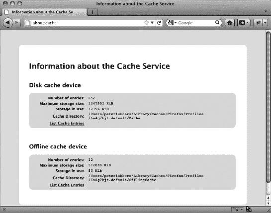
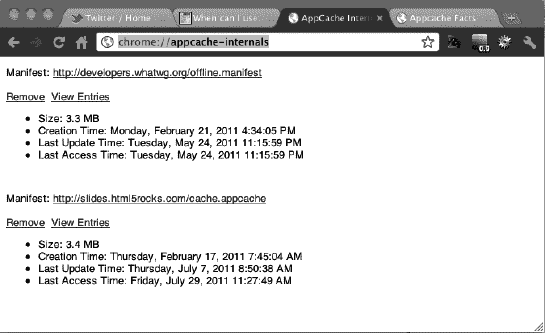
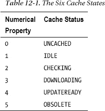
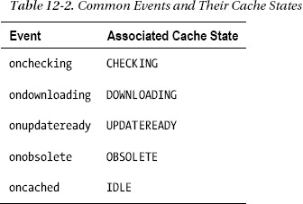
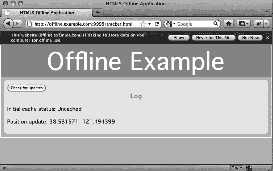
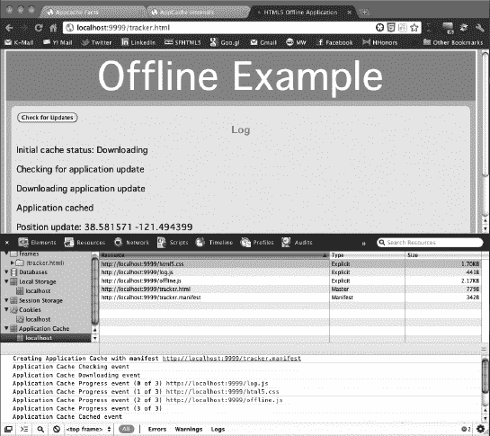
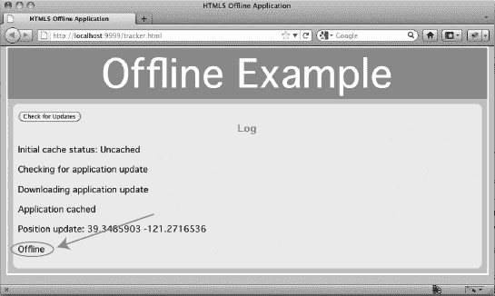

# 十二、创建 HTML5 脱机 Web 应用

在这一章中，我们将探索你可以用离线 HTML5 应用做什么。HTML5 应用不一定需要持续访问网络，加载缓存资源现在可以由开发人员更灵活地控制。

### html 5 离线 Web 应用概述

使用应用缓存的第一个也是最明显的原因是离线支持。在普遍连接的时代，离线应用仍然是可取的。没有网络连接时，您会做什么？在您说间歇性连接的时代已经结束之前，请考虑以下几点:

*   你乘坐的所有航班都有机上无线网络吗？
*   你的移动互联网设备有完美的信号覆盖吗(你最后一次看到零信号是什么时候)？
*   你做报告时能指望有互联网连接吗？

随着越来越多的应用转移到 Web 上，假设所有用户 24/7 不间断连接是很诱人的，但互联网的现实是中断时有发生，而且在像航空旅行这样的情况下，可以预见一次会发生几个小时。

间歇性连接一直是网络计算系统的致命弱点。如果您的应用依赖于与远程主机的通信，而这些主机是不可达的，那么您就不走运了。但是，当您连接到互联网时，web 应用总是最新的，因为每次使用时代码都是从远程位置加载的。

如果您的应用只需要偶尔的通信，只要应用资源存储在本地，它们仍然是有用的。随着纯浏览器设备的出现，在没有持续连接的情况下继续运行的 web 应用只会变得更加重要。历史上，不需要持续连接的桌面应用比 web 应用更有优势。

HTML5 公开了对应用缓存的控制，以便两全其美:用 web 技术构建的应用可以在浏览器中运行，在线时可以更新，但也可以离线使用。但是，必须显式地使用这个新的脱机应用特性，因为当前的 web 服务器没有为脱机应用提供任何默认的缓存行为。

HTML5 离线应用缓存使得在没有网络连接的情况下运行应用成为可能。你不需要连接到互联网只是为了起草一封电子邮件。HTML5 引入了离线应用缓存，允许 Web 应用在没有网络连接的情况下运行。

应用开发人员可以指定包含 HTML5 应用的特定附加资源(HTML、CSS、JavaScript 和图像),以使应用可供离线使用。这有许多使用案例，例如:

*   阅读和撰写电子邮件
*   编辑文档
*   编辑和显示演示文稿
*   创建待办事项列表

使用离线存储可以避免加载应用所需的正常网络请求。如果缓存清单是最新的，浏览器知道它不需要检查其他资源是否也是最新的，并且大部分应用可以从本地应用缓存中快速加载。此外，从缓存中加载资源(而不是发出多个 HTTP 请求来查看资源是否已经更新)可以节省带宽，这对移动 web 应用尤其重要。目前，与桌面应用相比，web 应用的加载速度较慢。缓存可以弥补这一点。

应用缓存为开发人员提供了对缓存的明确控制。*缓存清单*文件允许您将相关资源分组到一个逻辑应用中。这是一个强大的概念，可以赋予 web 应用一些桌面应用的特征。你可以用新的、创造性的方式使用这种额外的力量。

缓存清单文件中标识的资源创建了所谓的*应用缓存*，这是浏览器持久存储资源的地方，通常在磁盘上。一些浏览器为用户提供了查看应用缓存中数据的方法。例如，Firefox 内部`about:cache`页面中的离线缓存设备部分向您展示了关于应用缓存的细节，以及查看缓存中单个文件的方法，如图图 12-1 所示。

***图 12-1。**在 Firefox 中查看应用缓存条目*

类似地，内部页面`chrome://appcache-internals/`提供了关于存储在系统上的不同应用缓存内容的详细信息。它还提供了查看内容和完全移除这些缓存的方法，如图 12-2 所示。

***图 12-2。**在 Chrome 中查看应用缓存条目*

#### 浏览器支持 HTML5 离线网络应用

有关当前浏览器支持(包括移动支持)的完整概述，请参考`[`caniuse.com`](http://caniuse.com)`并搜索离线 Web 应用或应用缓存。如果您必须支持旧的浏览器，那么在使用 API 之前，最好先看看是否支持应用缓存。本章后面的“检查浏览器支持”一节将向您展示如何以编程方式检查浏览器支持。

### 使用 HTML5 应用缓存 API

在这一节中，我们将探索如何使用离线 Web 应用 API 的细节。

#### 检查浏览器支持

在尝试使用脱机 Web 应用 API 之前，最好检查一下浏览器支持。清单 12-1 展示了如何做到这一点。

***清单 12-1。**检查浏览器对离线 Web 应用 API 的支持*

`if(window.applicationCache) {
  // this browser supports offline applications
}`

#### 创建简单的离线应用

假设您想要创建一个包含 HTML 文档、样式表和 JavaScript 文件的单页应用。为了给你的 HTML5 应用添加离线支持，你需要在`html`元素中包含一个`manifest`属性，如清单 12-2 所示。

***清单 12-2。**HTML 元素上的清单属性*

`<!DOCTYPE html>
<html manifest="application.appcache">
  .
  .
  .
</html>`

在 HTML 文档旁边，提供一个带有扩展名`*.appcache`的清单文件，指定要缓存哪些资源。清单 12-3 显示了一个示例缓存清单文件的内容。

***清单 12-3。**示例缓存清单文件的内容*

`CACHE MANIFEST
example.html
example.js
example.css
example.gif`

#### 离线

为了让应用知道间歇性连接，HTML5 浏览器还公开了其他事件。您的应用可能有不同的在线和离线行为模式。对`window.navigator`对象的一些添加使得这变得更容易。首先，`navigator.onLine`是一个布尔属性，表示浏览器是否认为自己在线。当然，`onLine`的`true`值并不能确定 web 应用必须与之通信的服务器可以从用户的机器上到达。另一方面，`false`值意味着浏览器甚至不会尝试通过网络连接。清单 12-4 显示了如何检查你的页面是在线还是离线。

***清单 12-4。**检查在线状态*

`// When the page loads, set the status to online or offline
function loadDemo() {
  if (navigator.onLine) {
    log("Online");
  } else {
    log("Offline");
  }
}

// Now add event listeners to notify a change in online status
window.addEventListener("online", function(e) {
  log("Online");` `}, true);

window.addEventListener("offline", function(e) {
  log("Offline");
}, true);`

#### 清单文件

脱机应用由一个清单组成，该清单列出了浏览器将缓存以供脱机使用的一个或多个资源。清单文件具有 MIME 类型`text/cache-manifest`。Python 标准库中的`SimpleHTTPServer`模块将提供带有`.manifest`扩展名和头文件`Content-type: text/cache-manifest`的文件。要配置设置，打开文件`PYTHON_HOME/Lib/mimetypes.py`，并添加以下行:

`'.appcache'    : 'text/cache-manifest manifest',`

其他 web 服务器可能需要额外的配置。例如，对于 Apache HTTP Server，您可以通过添加以下行来更新 conf 文件夹中的`mime.types`文件:

`text/cache-manifest appcache`

如果您使用的是 Microsoft IIS，在您网站的主页中，双击 MIME 类型图标，然后在添加 MIME 类型对话框中添加 MIME 类型为`text/cache-manifest`的`.appcache`扩展名。

清单语法是以`CACHE MANIFEST`(作为第一行)开始的简单的行分隔文本。行可以以`CR`、`LF`或`CRLF`结尾——格式很灵活——但是文本必须是 UTF-8 编码的，这是大多数文本编辑器的典型输出。注释以哈希符号开始，并且必须在自己的行上；您不能将注释附加到文件中的其他非注释行。

***清单 12-5。**包含所有可能部分的示例清单文件*

`CACHE MANIFEST
# files to cache
about.html
html5.css
index.html
happy-trails-rc.gif
lake-tahoe.JPG

#do not cache signup page
NETWORK
signup.html

FALLBACK
signup.html     offline.html
/app/ajax/      default.html`

让我们看看不同的部分。

如果没有指定`CACHE:`标题，列出的文件将被视为要缓存的文件(缓存是默认行为)。下面的简单清单指定必须缓存三个文件(`index.html`、`application.js`和`style.css`):

`CACHE MANIFEST` `index.html
application.js
style.css`

类似地，下面的部分将做同样的事情(如果您愿意，可以在一个清单文件中多次使用相同的`CACHE`、`NETWORK`和`FALLBACK`头):

`CACHE MANIFEST

# Cache section
CACHE:
Index.html
application.js
style.css`

通过在`CACHE`部分列出一个文件，您指示浏览器从应用缓存中提供文件，即使应用在线。没有必要指定应用的主 HTML 资源。最初指向清单文件的 HTML 文档被隐式包含在内(这称为主条目)。但是，如果您希望缓存多个 HTML 文档，或者希望多个 HTML 文档作为可缓存应用的可能入口点，那么它们都应该在缓存清单文件中明确列出。

`FALLBACK`条目允许您给出替代路径来替换无法获取的资源。清单 12-5 中的清单会导致对`/app/ajax/`或以`/app/ajax/`开头的子路径的请求在`/app/ajax/*`不可达时退回到`default.html`。

`NETWORK`指定总是使用网络获取的资源。简单地从清单中省略这些文件的区别在于，主条目被缓存，而没有在清单文件中显式列出。为了确保应用从服务器请求文件，即使缓存的资源缓存在应用缓存中，您可以将该文件放在`NETWORK:`部分。

#### 应用缓存 API

ApplicationCache API 是使用应用缓存的接口。一个新的`window.applicationCache`对象触发了几个与缓存状态相关的事件。该对象有一个数字属性`window.applicationCache.status`，表示缓存的状态。缓存可以有六种状态，如表 12-1 所示。

今天，网络上的大多数页面都没有指定缓存清单，并且是未缓存的。Idle 是具有缓存清单的应用的典型状态。处于空闲状态的应用的所有资源都由浏览器存储，没有更新正在进行。如果曾经有一个有效的缓存，但是清单现在丢失了，则缓存进入过时状态。API 中有对应于这些状态的事件(和回调属性)。例如，当缓存在更新后进入空闲状态时，就会触发缓存事件。此时，应用可能会通知用户，他们可以断开网络连接，但仍然希望应用在脱机模式下可用。表 12-2 显示了一些常见事件及其相关的缓存状态。

此外，当没有可用的更新或发生错误时，还有指示更新进度的事件:

*   `onerror`
*   `onnoupdate`
*   `onprogress`

`window.applicationCache`有一个`update()`方法。调用`update()`请求浏览器更新缓存。这包括检查清单文件的新版本，并在必要时下载新资源。如果没有缓存或者缓存过时，将会引发错误。

#### 应用缓存正在运行

尽管创建清单文件并在应用中使用它相对简单，但是在服务器上更新页面时发生的事情并不像您想象的那样直观。要记住的主要事情是，一旦浏览器成功地将应用的资源缓存在应用缓存中，它将总是首先从缓存中提供这些页面。之后，浏览器将只做一件事:检查服务器上的清单文件是否已被更改。

为了更好地理解这个过程是如何工作的，让我们使用清单 12-5 中显示的清单文件来一步步完成一个示例场景。

1.  当您第一次访问`index.html`页面时(在线时)，比如说在`[`www.example.com`](http://www.example.com)`，浏览器会加载页面及其子资源(CSS、JavaScript 和图像文件)。
2.  在解析页面时，浏览器遇到 html 元素中的 manifest 属性，并继续加载在`example.com`站点的应用缓存的缓存(默认)和回退部分中列出的所有文件(浏览器允许大约 5 MB 的存储空间)。
3.  从现在开始，当你导航到[`www.example.com`](http://www.example.com)时，浏览器将总是从应用缓存中加载站点，然后它将尝试检查清单文件是否已经更新(它只能在你在线时进行后者)。这意味着，如果你现在离线(自愿或不自愿)，并将浏览器指向 http://www.example.com 的，浏览器将从应用缓存中加载该网站——是的，你仍然可以在离线模式下完整地使用该网站。
4.  如果您尝试在脱机时访问缓存的资源，它将从应用缓存中加载。当您尝试访问网络资源(signup.html)时，将提供回退内容(offline.html)。只有当您重新联机时，网络文件才再次可用。
5.  目前为止一切顺利。一切按预期运行。我们现在将试着带你穿过当你改变服务器上的内容时必须跨越的数字雷区。例如，当您更改服务器上的 about.html 页面，并通过在浏览器中重新加载该页面以在线模式访问该页面时，有理由期待更新后的页面出现。毕竟，你是在线的，可以直接访问服务器。然而，你只会看到和以前一样的旧页面，脸上可能带着困惑的表情。这是因为浏览器总是从应用缓存中加载页面，之后它只检查一件事:清单文件是否已经更新。因此，如果您希望下载更新的资源，您还必须对清单文件进行更改(不要只是“触摸”该文件，因为这不会被视为更改—它必须是逐字节的更改)。进行这种更改的一种常见方式是在文件顶部添加版本注释，如清单 12.5 所示。浏览器实际上并不理解版本注释，但这是一个很好的最佳实践。由于这个原因，也由于很容易忽略新的或删除的文件，建议您使用某种构建脚本来维护清单文件。html 5 Boilerplate 2.0([`html5boilerplate.com`](http://html5boilerplate.com))附带了一个构建文件，可以用来自动构建和版本化 appcache 文件，这是对已经很棒的资源的一个很好的补充。
6.  当您对 about.html 页面和清单文件都进行了更改，并随后在线刷新浏览器中的页面时，您将再次失望地看到相同的旧页面。发生了什么事？尽管浏览器现在已经发现清单已经更新，并且将所有文件再次下载到新版本的缓存中，但是在执行服务器检查之前，页面已经从应用缓存中加载，并且浏览器不会自动在浏览器中为您重新加载页面。您可以将此过程与如何在后台下载新版本的软件程序(例如 Firefox 浏览器)进行比较，但需要重启程序才能生效。如果不能等待下一次页面刷新，可以通过编程方式为 onupdateready 事件添加一个事件侦听器，并提示用户刷新页面。一开始有点困惑，但仔细想想就明白了。

**使用应用缓存提升性能**

**Peter 说**:“应用缓存机制的一个很好的副作用是你可以用它来预取资源。常规浏览器缓存存储您访问过的页面，但存储的内容取决于客户端和服务器配置(浏览器设置和过期标题)。因此，至少可以说，依靠常规浏览器缓存返回特定页面是不稳定的——任何曾经试图依靠常规浏览器缓存在飞机上浏览网站页面的人可能都会同意这一点。

然而，使用应用缓存，你不仅可以在访问页面时缓存它们，还可以缓存你还没有访问过的页面*；它可以作为一种有效的预取机制。当需要使用这些预取的资源时，它将从本地磁盘上的应用缓存中加载，而不是从服务器上加载，从而大大加快加载速度。明智地使用(不要预取维基百科)，您可以使用应用缓存来显著提高性能。需要记住的一件重要事情是，常规的浏览器缓存仍然有效，所以要注意误报，尤其是当您试图调试应用缓存行为时。"*

### 使用 HTML5 离线 Web 应用构建应用

在这个示例应用中，我们将在跑步时跟踪跑步者的位置(断断续续或没有连接)。例如，Peter 去跑步，他将带着新的支持地理定位的手机和 HTML5 网络浏览器，但在他家周围的树林中并不总是有很好的信号。他想使用这个应用来跟踪和记录他的位置，即使他不能使用互联网。

离线时，地理定位 API 应该可以在有硬件地理定位的设备上继续工作(比如 GPS ),但显然不能在使用 IP 地理定位的设备上工作。IP 地理定位需要网络连接来将客户端的 IP 地址映射到坐标。此外，脱机应用始终可以通过 API(如本地存储或索引数据库)访问本地机器上的持久存储。

该应用的示例文件位于图书页面上的`[www.apress.com](http://www.apress.com)`和图书网站上的`offline`代码文件夹中，您可以通过导航到 code/offline 文件夹并发出以下命令来开始演示:

`Python –m SimpleHTTPServer 9999.`

在启动 web 服务器之前，确保您已经将 Python 配置为提供清单文件(带有*的文件)。appcache 扩展)与前面描述的正确 mime 类型。这是脱机 web 应用失败的最常见原因。如果它不像预期的那样工作，请在 Chrome 开发者工具中检查控制台，查看可能的描述性错误信息。

这将在端口 9999 上启动 Python 的 HTTP 服务器模块(您可以在任何端口上启动它，但是您可能需要管理员权限来绑定到低于 1024 的端口。启动 HTTP 服务器后，您可以导航到`[`localhost:9999/tracker.html`](http://localhost:9999/tracker.html)`来查看运行中的应用。

图 12-3 显示了当你第一次访问火狐网站时会发生什么:你被提示选择在你的电脑上存储数据(然而，注意，不是所有的浏览器都会在存储数据前提示你)。

***图 12-3。** Firefox 提示为网络应用存储数据*

在允许应用存储数据之后，应用缓存进程启动，浏览器开始下载应用缓存清单文件中引用的文件(这发生在页面加载之后，因此对页面的响应性影响最小。图 12-4 显示了 Chrome 开发者工具如何在资源窗格中提供关于`localhost`原点缓存内容的详细概述。它还在控制台中提供有关在处理页面和清单时触发的应用缓存事件的信息。

***图 12-4。**Chrome 中的离线页面，详细介绍了 Chrome 开发者工具中的应用缓存*

要运行这个应用，您需要一个 web 服务器来服务这些静态资源。请记住，清单文件必须提供内容类型`text/cache-manifest`。如果您的浏览器支持应用缓存，但该文件提供了不正确的内容类型，您将收到缓存错误。一个简单的测试方法是查看 Chrome 开发者工具控制台中触发的事件，如图 12-4 所示；它会告诉您 appcache 文件是否使用了错误的 mime 类型。

要使用完整的功能运行此应用，您需要一个可以接收地理位置数据的服务器。这个例子的服务器端补充可能会存储、分析和提供这些数据。它可能来自静态应用，也可能不来自静态应用。图 12-5 显示了在 Firefox 中以离线模式运行的示例应用。你可以在 Firefox 和 Opera 中使用文件离线工作来打开这个模式。其他浏览器没有这个便利功能，但是你可以断网。但是，请注意，断开网络连接不会中断与运行在 localhost 上的 Python 服务器的连接。

***图 12-5。**离线模式下的应用*

#### 为应用资源创建清单文件

首先，在文本编辑器中，创建如下的`tracker.appcache`文件。该清单文件将列出属于该应用的文件:

`CACHE MANIFEST
# JavaScript
./offline.js
#./tracker.js
./log.js

# stylesheets
./html5.css

# images`

#### 为用户界面创建 HTML 结构和 CSS

这是该示例的基本 UI 结构。`tracker.html`和`html5.css`都将被缓存，因此应用将由应用缓存提供服务。

`<!DOCTYPE html>
<html lang="en" manifest="tracker.appcache">
<head>
    <title>HTML5 Offline Application</title>
    ` `    
    
    <link rel="stylesheet" href="html5.css">
</head>

<body>
    <header>
      <h1>Offline Example</h1>
    </header>

    <section>
      <article>
        <button id="installButton">Check for Updates</button>
        <h3>Log</h3>
        

        

      </article>
    </section>
</body>
</html>`

关于这个应用的离线能力，在这个 HTML 中有一些事情需要注意。第一个是 HTML 元素上的`manifest`属性。本书中的大多数 HTML 例子都省略了`<html>`元素，因为它在 HTML5 中是可选的。但是，脱机缓存的能力取决于在那里指定清单文件。

第二个要注意的是按钮。这将使用户能够控制该应用的离线配置。

#### 创建离线 JavaScript

对于这个例子，JavaScript 包含在多个带有`<script>`标签的`.js`文件中。这些脚本与 HTML 和 CSS 一起被缓存。

`<offline.js>
/*
 * log each of the events fired by window.applicationCache
 */
window.applicationCache.onchecking = function(e) {` `log("Checking for application update");
}

window.applicationCache.onnoupdate = function(e) {
    log("No application update found");
}

window.applicationCache.onupdateready = function(e) {
    log("Application update ready");
}

window.applicationCache.onobsolete = function(e) {
    log("Application obsolete");
}

window.applicationCache.ondownloading = function(e) {
    log("Downloading application update");
}

window.applicationCache.oncached = function(e) {
    log("Application cached");
}

window.applicationCache.onerror = function(e) {
    log("Application cache error");
}

window.addEventListener("online", function(e) {
    log("Online");
}, true);

window.addEventListener("offline", function(e) {
    log("Offline");
}, true);

/*
 * Convert applicationCache status codes into messages
 */
showCacheStatus = function(n) {
    statusMessages = ["Uncached","Idle","Checking","Downloading","Update Ready","Obsolete"];
    return statusMessages[n];
}

install = function() {
    log("Checking for updates");
    try {
        window.applicationCache.update();
    } catch (e) {
        applicationCache.onerror();
    }
}

onload = function(e) {
    // Check for required browser features
    if (!window.applicationCache) {
        log("HTML5 Offline Applications are not supported in your browser.");
        return;
    }

    if (!navigator.geolocation) {
        log("HTML5 Geolocation is not supported in your browser.");
        return;
    }` 
`    if (!window.localStorage) {
        log("HTML5 Local Storage not supported in your browser.");
        return;
    }

    log("Initial cache status: " + showCacheStatus(window.applicationCache.status));
    document.getElementById("installButton").onclick = checkFor;
}

<log.js>
log = function() {
    var p = document.createElement("p");
    var message = Array.prototype.join.call(arguments, " ");
    p.innerHTML = message;
    document.getElementById("info").appendChild(p);
}`

#### 检查应用缓存支持

除了离线应用缓存之外，这个示例还使用了地理位置和本地存储。我们确保浏览器在页面加载时支持所有这些功能。

`onload = function(e) {
    // Check for required browser features
    if (!window.applicationCache) {
        log("HTML5 Offline Applications are not supported in your browser.");
        return;
    }

    if (!navigator.geolocation) {
        log("HTML5 Geolocation is not supported in your browser.");
        return;
    }

    if (!window.localStorage) {
        log("HTML5 Local Storage is not supported in your browser.");
        return;
    }

    if (!window.WebSocket) {
        log("HTML5 WebSocket is not supported in your browser.");
        return;
    }
    log("Initial cache status: " + showCacheStatus(window.applicationCache.status));
    document.getElementById("installButton").onclick = install;
}`

#### 添加更新按钮处理程序

接下来，添加更新应用缓存的更新处理程序，如下所示:

`install = function() {
    log("Checking for updates");
    try {
        window.applicationCache.update();
    } catch (e) {
        applicationCache.onerror();
    }
}`

单击此按钮将明确启动缓存检查，这将导致在必要时下载所有缓存资源。当可用更新完全下载后，会在 UI 中记录一条消息。此时，用户知道应用已经成功安装，可以在脱机模式下运行。

#### 添加地理位置跟踪代码

该代码基于第四章中的地理定位代码。它包含在`tracker.js` JavaScript 文件中。

`/*
 * Track and report the current location
 */
var handlePositionUpdate = function(e) {
    var latitude = e.coords.latitude;
    var longitude = e.coords.longitude;
    log("Position update:", latitude, longitude);
    if(navigator.onLine) {
        uploadLocations(latitude, longitude);
    }
    storeLocation(latitude, longitude);
}

var handlePositionError = function(e) {
    log("Position error");
}

var uploadLocations = function(latitude, longitude) {
    var request = new XMLHttpRequest();
    request.open("POST", "http://geodata.example.net:8000/geoupload", true);
    request.send(localStorage.locations);
}

var geolocationConfig = {"maximumAge":20000};

navigator.geolocation.watchPosition(handlePositionUpdate,
                                    handlePositionError,
                                    geolocationConfig);`

#### 添加存储代码

接下来，添加当应用处于离线模式时向`localStorage`写入更新的代码。

`var storeLocation = function(latitude, longitude) {
    // load stored location list
    var locations = JSON.parse(localStorage.locations || "[]");
    // add location
    locations.push({"latitude" : latitude, "longitude" : longitude});
    // save new location list
    localStorage.locations = JSON.stringify(locations);
}`

该应用使用 HTML5 本地存储器存储坐标，如第九章所述。本地存储非常适合支持脱机的应用，因为它提供了一种在浏览器中本地保存数据的方法。这些数据将在今后的会议中提供。当网络连接恢复时，应用可以与远程服务器同步。

在这里使用存储还有一个好处，就是允许从失败的上传请求中恢复。如果应用由于任何原因遇到网络错误，或者如果应用被关闭(由于用户操作、浏览器或操作系统崩溃或页面导航),数据将被存储以备将来传输。

#### 添加离线事件处理

每次位置更新处理程序运行时，它都会检查连接状态。如果应用在线，它将存储并上传坐标。如果应用离线，它将只存储坐标。当应用重新联机时，它可以更新 UI 以显示联机状态，并上传联机时存储的任何数据。

`window.addEventListener("online", function(e) {
    log("Online");
}, true);

window.addEventListener("offline", function(e) {
    log("Offline");
}, true);`

当应用不在运行时，连接状态可能会改变。例如，用户可能已经关闭了浏览器、刷新或导航到不同的站点。为了处理这些情况，我们的离线应用会在每次页面加载时检查它是否已经恢复在线。如果有，它将尝试与远程服务器同步。

`// Synchronize with the server if the browser is now online
if(navigator.onLine) {
    uploadLocations();
}`

### 总结

在本章中，您已经看到了如何使用 HTML5 离线 Web 应用来创建引人注目的应用，这些应用甚至可以在没有互联网连接的情况下使用。通过在缓存清单文件中指定属于 web 应用的文件，然后从应用的主 HTML 页面引用这些文件，可以确保所有文件都被缓存。然后，通过为联机和脱机状态更改添加事件侦听器，您可以使您的站点根据 Internet 连接是否可用而有不同的行为。

在最后一章，我们将讨论 HTML5 编程的未来。