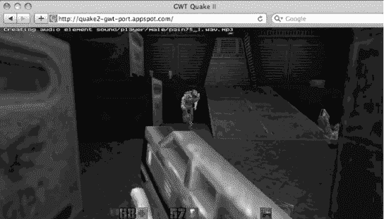
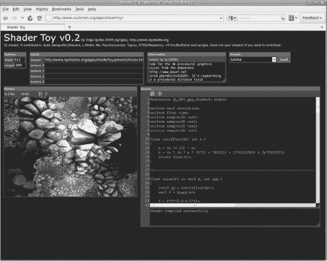
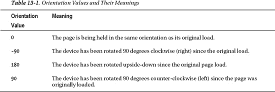
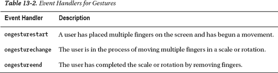
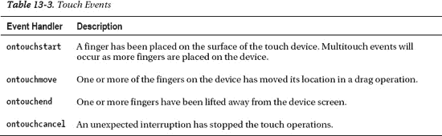

# 十三、HTML5 的未来

正如您在本书中已经看到的，HTML5 提供了强大的编程特性。我们还讨论了 HTML5 开发背后的历史和 HTML5 新的无插件范例。在这一章中，我们将看看事情的发展方向。我们将讨论一些还没有完全成熟，但有着巨大潜力的特性。

### 浏览器对 HTML5 的支持

随着每个新的浏览器更新，HTML5 功能的采用正在加速。在我们写这本书的时候，我们提到的几个特性已经在浏览器中发布了。不可否认，浏览器中的 HTML5 开发正在获得巨大的发展势头。

今天，许多开发人员仍然在努力开发与旧浏览器兼容的一致的 web 应用。Internet Explorer 6 代表了当今互联网上普遍使用的最苛刻的传统浏览器，但即使是 IE6 的寿命也是有限的，因为越来越难获得任何支持它的操作系统。假以时日，将会有接近零的用户使用 IE6 浏览网页。越来越多的 Internet Explorer 用户正在升级到最新版本。总会有一个最老的浏览器与之抗衡，但那就是久而久之；在撰写本文时，Internet Explorer 6 的市场份额不到 10%，并且还在下降。大多数升级的用户会直接选择现代的替代品。随着时间的推移，最小公分母将包括 HTML5 视频、画布、WebSocket 和任何其他您今天可能必须模仿的功能，以达到更广泛的受众。

在本书中，我们介绍了在多种浏览器中基本稳定的特性。对 HTML 和 API 的其他扩展目前正处于开发的早期阶段。在这一章中，我们将看看一些即将推出的功能。一些还处于早期试验阶段，而另一些可能会看到最终的标准化和广泛的可用性，只需对其当前状态进行微小的改变。

### HTML 在发展

在这一节中，我们将探索几个可能在不久的将来出现在浏览器中的令人兴奋的特性。你可能也不需要等到 2022 年才能看到这些。可能不会有一个形式化的 HTML6WHATWG 暗示未来的开发将简称为“HTML”开发将是渐进的，特定的特性和它们的规范将单独发展，而不是作为一个整合的努力。随着人们对浏览器的共识越来越多，浏览器将会采用新的特性，而即将到来的新特性甚至可能在 HTML5 定型之前就已经在浏览器中广泛使用了。负责推动 Web 向前发展的社区致力于发展平台，以满足用户和开发人员的需求。

#### WebGL

WebGL 是一个用于网络 3D 图形的 API。历史上，包括 Mozilla、Opera 和 Google 在内的几个浏览器供应商已经为 JavaScript 开发了独立的实验性 3D APIs。今天，WebGL 正沿着标准化和跨 HTML5 浏览器广泛可用的道路前进。浏览器供应商和 Khronos 集团正在进行标准化过程，Khronos 集团是 OpenGL 的负责机构，OpenGL 是 1992 年创建的跨平台 3D 绘图标准。OpenGL 目前处于规范版本 4.0，作为微软 Direct3D 的对手和竞争者，广泛用于游戏和计算机辅助设计应用。

正如你在第二章中看到的，你通过调用元素上的`getContext("2d")`从一个`canvas`元素中得到一个 2D 绘图上下文。不出所料，这为其他类型的绘图环境打开了大门。WebGL 也使用了`canvas`元素，但是通过 3D 上下文。当前的实现使用实验性的厂商前缀(`moz-webgl`、`webkit-3d`等)。)作为`getContext()`调用的参数。例如，在支持 WebGL 的 Firefox 版本中，您可以通过调用`canvas`元素上的`getContext("moz-webgl")`来获得 3D 上下文。对`getContext()`的这种调用所返回的对象的 API 不同于 2D 的 canvas 等价类，因为它提供的是 OpenGL 绑定，而不是绘图操作。WebGL 版本的 canvas 上下文管理纹理和顶点缓冲区，而不是调用画线和填充形状。

##### 三维 HTML

像 HTML5 的其他部分一样，WebGL 将成为 web 平台不可或缺的一部分。因为 WebGL 呈现给一个`canvas`元素，所以它是文档的一部分。您可以定位和变换 3D `canvas`元素，就像您可以在页面上放置图像或 2D 画布一样。事实上，你可以用任何其他的`canvas`元素做任何你能做的事情，包括叠加文本和视频以及表演动画。与纯 3D 显示技术相比，结合其他文档元素和 3D 画布将使平视显示器(hud)以及混合 2D 和 3D 界面的开发更加简单。想象一下，拍摄一个 3D 场景，并使用 HTML 标记在其上覆盖一个简单的 web 用户界面。与许多 OpenGL 应用中的非本地菜单和控件非常不同，WebGL 软件将轻松地结合漂亮的 HTML5 表单元素。

Web 的现有网络架构也将补充 WebGL。WebGL 应用将能够从 URL 获取纹理和模型等资源。多人游戏可以用 WebSocket 通信。例如，图 13-1 显示了一个这样的例子。谷歌最近使用 HTML5 WebSocket、Audio 和 WebGL 将经典的 3D 游戏 Quake II 移植到了网络上，并完成了多人游戏。游戏逻辑和图形用 JavaScript 实现，调用 WebGL 画布进行渲染。使用持久的 WebSocket 连接来实现与服务器的通信，以协调玩家的移动。

***图 13-1。**雷神之锤 II*

##### 3D 着色器

WebGL 是 OpenGL ES 2 在 JavaScript 中的绑定，所以它使用了 OpenGL 中标准化的可编程图形管道，包括着色器。着色器允许将高度灵活的渲染效果应用于 3D 场景，从而增加显示的真实感。WebGL 着色器是用 GL 着色语言(GLSL)编写的。这又给 web 堆栈增加了一种单一用途的语言。带有 WebGL 的 HTML5 应用由用于结构的 HTML、用于样式的 CSS、用于逻辑的 JavaScript 和用于着色器的 GLSL 组成。开发人员可以将他们的 OpenGL 着色器知识转移到 web 环境中的类似 API。

WebGL 很可能成为网络上 3D 图形的基础层。正如 JavaScript 库抽象了 DOM 并提供了强大的高级结构一样，在 WebGL 之上也有提供额外功能的库。目前正在为场景图、COLLADA 等 3D 文件格式以及游戏开发的完整引擎开发库。图 13-2 显示了 Shader Toy——一个由 Inigo Quilez 构建的 WebGL 着色器工作台，附带了其他九个 demoscene 艺术家的着色器。这张截图展示了 Rgba 的 Leizex。我们可以预计，在不久的将来，高级渲染库将会大规模涌现，为网络编程新手带来 3D 场景创作能力。

***图 13-2。**着色器玩具是一个 WebGL 着色器工作台*

#### 设备

Web 应用需要访问多媒体硬件，如网络摄像头、麦克风或附加的存储设备。为此，已经有一个提议的`device`元素，让 web 应用能够从连接的硬件访问数据流。当然，这涉及到严重的隐私问题，所以不是每个脚本都能随意使用你的摄像头。当应用请求提升权限时，我们可能会看到一个提示用户权限的 UI 模式，就像在地理位置和存储 API 中看到的那样。网络摄像头的明显应用是视频会议，但计算机视觉在网络应用中还有许多其他惊人的可能性，包括增强现实和头部跟踪。

#### 音频数据 API

可编程音频 API 将为`<audio>`做`<canvas>`为``做的事情。在`canvas`标签出现之前，网页上的图像对于脚本来说是不透明的。图像创建和操作必须在场外进行，即在服务器上进行。现在，有了基于`canvas`元素的来创建和操作视觉媒体的工具。类似地，音频数据 API 将支持 HTML5 应用中的音乐创作。这将有助于完善 web 应用可用的内容创建功能，并使我们更接近一个在 Web 上为 Web 创建媒体的自托管工具世界。想象一下，不用离开浏览器就可以在网上编辑音频。

简单的声音回放可以用`<audio>`元素来完成。然而，任何即时操纵、分析或生成声音的应用都需要一个较低级别的 API。不访问音频数据，文本到语音、语音到语音的翻译、合成器和音乐可视化都是不可能的。

我们可以期待标准音频 API 能够很好地处理来自数据元素的麦克风输入以及音频标签中包含的文件。有了`<device>`和一个音频数据 API，你也许可以开发一个 HTML5 应用，允许用户在一个页面中记录和编辑声音。音频剪辑将能够存储在本地浏览器存储器中，并与基于`canvas`的编辑工具结合使用。

目前，Mozilla 在夜间版本中有一个实验性的实现。Mozilla 音频数据 API 可以作为标准跨浏览器音频编程能力的起点。

#### 触摸屏设备事件

随着网络访问越来越多地从台式机和笔记本电脑转移到手机和平板电脑，HTML5 也在继续适应交互处理的变化。当苹果推出 iPhone 时，它也在浏览器中引入了一组特殊事件，可用于处理多点触摸输入和设备旋转。虽然这些事件还没有被标准化，但是它们正在被其他移动设备供应商所采用。今天学习它们将允许你为现在最流行的设备优化你的网络应用。

##### 方向

在移动设备上处理的最简单的事件是方向事件。定向事件可以添加到文档正文中:

`<body onorientationchange="rotateDisplay();">`

在方向更改的事件处理程序中，您的代码可以引用`window.orientation`属性。该属性将给出表 13-1 中显示的旋转值之一，该值相对于页面初始加载时设备所处的方向。

一旦知道了方向，您就可以选择相应地调整内容。

##### 手势

移动设备支持的下一种事件是一种高级事件，称为*手势*。将手势事件视为代表大小或旋转的多点触摸变化。这通常在用户将两个或更多手指同时放在屏幕上并挤压或扭转时执行。扭曲表示旋转，而收缩或缩小分别表示缩小或放大。为了接收手势事件，您的代码需要注册表 13-2 中显示的一个处理程序。

在手势期间，事件处理程序可以自由检查相应事件的旋转和缩放属性，并相应地更新显示。清单 13-1 展示了一个手势处理程序的使用示例。

***清单 13-1。**手势处理器示例*

`function gestureChange(event) {
  // Retrieve the amount of change in scale caused by the user gesture
  // Consider a value of 1.0 to represent the original size, while smaller
  //  numbers represent a zoom in and larger numbers represent a zoom
  //  out, based on the ratio of the scale value
var scale = event.scale;

  // Retrieve the amount of change in rotation caused by the user gesture
  // The rotation value is in degrees from 0 to 360, where positive values
  //   indicate a rotation clockwise and negative values indicate a counter-
  //   clockwise rotation
var rotation = event.rotation;

  // Update the display based on the rotation.
}

// register our gesture change listener on a document node
node.addEventListener("gesturechange", gestureChange, false);`

手势事件特别适用于需要操作对象或显示的应用，如图表工具或导航工具。

##### 触动

对于那些需要对设备事件进行低级控制的情况，触摸事件提供了您可能需要的尽可能多的信息。表 13-3 显示了不同的触摸事件。

与其他移动设备事件不同，触摸事件需要表示同时存在多个数据点(许多潜在的手指)。因此，触摸处理的 API 稍微复杂一点，如清单 13-2 所示。

***清单 13-2。**触摸 API*

`function touchMove(event) {
// the touches list contains an entry for every finger currently touching the screen
var touches = event.touches;

  // the changedTouches list contains only those finger touches modified at this
  // moment in time, either by being added, removed, or repositioned
varchangedTouches = event.changedTouches;

  // targetTouches contains only those touches which are placed in the node
  // where this listener is registered
vartargetTouches = event.targetTouches;

  // once you have the touches you'd like to track, you can reference
  // most attributes you would normally get from other event objects
varfirstTouch = touches[0];
varfirstTouchX = firstTouch.pageX;
varfirstTouchY = firstTouch.pageY;
}

// register one of the touch listeners for our example
node.addEventListener("touchmove", touchMove, false);`

您可能会发现设备的本机事件处理会干扰您对触摸和手势事件的处理。在这些情况下，您应该进行以下呼叫:

`event.preventDefault();`

这将覆盖默认浏览器界面的行为，并自己处理事件。在移动事件标准化之前，建议您查阅应用所针对的设备的文档。

#### 对等网络

我们也没有看到高级网络在 web 应用中的终结。对于 HTTP 和 WebSocket，都有一个客户端(浏览器或其他用户代理)和一个服务器(URL 的主机)。对等(P2P)网络允许客户端直接通信。这通常比通过服务器发送所有数据更有效。效率，当然，降低托管成本，提高应用性能。P2P 应该有助于更快的多人游戏和协作软件。

P2P 与`device`元素结合的另一个直接应用是 HTML5 中的高效视频聊天。在点对点视频聊天中，对话双方可以直接互相发送数据，而不需要通过中央服务器。在 HTML5 之外，P2P 视频聊天在 Skype 等应用中非常流行。由于流式视频需要高带宽，如果没有点对点通信，这两种应用都不可能实现。

浏览器供应商已经在试验 P2P 网络，例如 Opera 的 Unite 技术，它直接在浏览器中托管一个简化的 web 服务器。Opera Unite 允许用户创建并向他们的同伴公开服务，用于聊天、文件共享和文档协作。

当然，网络的 P2P 网络需要一个考虑到安全性和网络中介的协议，以及一个供开发者编程的 API。

#### 终极方向

到目前为止，我们一直致力于让开发人员能够构建强大的 HTML5 应用。一个不同的角度是考虑 HTML5 如何增强 web 应用的用户。许多 HTML5 特性允许你删除或减少脚本的复杂性，并执行以前需要插件的专长。例如，HTML5 video 允许您指定控件、自动播放、缓冲行为和占位符图像，而无需任何 JavaScript。使用 CSS3，您可以将动画和效果从脚本移动到样式。这种声明性代码使应用更符合用户风格，并最终将权力还给每天使用您的作品的人。

您已经看到了所有现代浏览器中的开发工具如何公开有关 HTML5 特性的信息，如存储，以及至关重要的 JavaScript 调试、分析和命令行评估。HTML5 开发将趋向于简单性、声明性代码和浏览器或 web 应用本身的轻量级工具。

谷歌对 HTML 的持续发展充满信心，它已经发布了谷歌 Chrome 操作系统，这是一个围绕浏览器和媒体播放器构建的精简操作系统。谷歌的操作系统旨在使用 HTML APIs 包含足够的功能，以提供引人注目的用户体验，其中应用使用标准化的 web 基础设施交付。同样，微软已经宣布 Windows 8 将不支持新 Metro 模式中的任何插件，包括该公司自己的 Silverlight 插件。

### 总结

在这本书里，你已经学会了如何使用强大的 HTML5 APIs。明智地使用它们！

在这最后一章中，我们已经让你看到了一些即将到来的事情，如 3D 图形，新的设备元素，触摸事件和 P2P 网络。HTML5 的发展没有显示出放缓的迹象，将会非常令人兴奋。

回想一分钟。对于那些已经在网上冲浪，或者甚至已经为之开发了十年或更长时间的人来说，想想 HTML 技术在过去几年里已经走了多远。十年前，“专业 HTML 编程”意味着学习使用 HTML 4 的新功能。当时最前沿的开发人员刚刚发现动态页面更新和,“Ajax”这个术语距离引入还有数年时间，即使 Ajax 描述的技术已经开始获得关注。浏览器中的许多专业编程都是为了处理框架和操作图像地图而编写的。

今天，需要几页脚本的功能只需标记就能完成。现在，对于那些愿意下载众多免费 HTML5 浏览器之一、打开他们最喜欢的文本编辑器并尝试专业 HTML5 编程的人来说，多种新的通信和交互方法都是可用的。

我们希望你喜欢这个 web 开发的探索，并且我们希望它激发了你的创造力。我们期待着十年后写下你使用 HTML5 创造的创新。