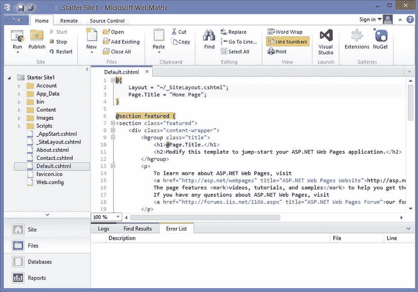

# 一、开始之前

在本书中，我将展示如何利用超文本标记语言(HTML5)中包含的非常酷的新特性。这将是非常实际的大量代码样本和工作网页。然而，在我们开始之前，我将搭建舞台，并为我们将要去的地方提供一些背景。一般所说的 HTML5 包含了很多技术，HTML 只是冰山一角。

在这一章中，我将简要回顾当前和历史上托管网站的操作环境。我还将描述可用的开发工具。虽然这本书特别关注 Visual Studio 2015，但也有一些免费的替代方法可以帮助您完成大多数练习。最后，我将快速盘点一下当前和未来浏览器对 HTML5 的支持。

## 审查网络环境

为了从 web 开发人员的角度更好地理解 HTML5，我将首先回顾一下我们所处的 web 环境。这将是一个基本的概述，对大多数读者来说相当熟悉。然而，我经常发现偶尔后退一步是有用的，可以获得更好的视角。

### 基本的 HTTP 页面

在网络的早期，这个模型非常简单。它包括一个负责提供网页的网络服务器和一个在客户端呈现网页的浏览器。在微软的堆栈中，Internet 信息服务(IIS)提供了服务器组件，而 Internet Explorer 是事实上的浏览器。当然，还有其他浏览器，比如网景。浏览器将通过传递超文本传输协议(HTTP) GET 请求中的地址(URL)向 web 服务器请求页面。服务器将通过提供一个 HTML 文档来响应，然后由浏览器呈现，如图 1-1 所示。

图 1-1。

A simple page-centric web model

如果网页包含一个带有输入字段的表单，浏览器将提供这些数据的输入。当提交页面时，这些数据通过 HTTP POST 请求发送到 web 服务器。web 应用将对这些数据做一些事情，然后返回一个更新的网页。然后，浏览器会在客户机上呈现整个页面。

在这里，我想重点介绍两个即使在当今的网络环境下仍然具有重大影响的关键方面:

*   该模型非常以页面为中心。
*   web 开发包括服务器和客户端两个方面。

#### 以页面为中心的网站

正如我提到的，网站主要集中在网页上。请求、返回并呈现页面。页面上的数据被发送到服务器并进行处理，然后返回并呈现更新后的页面。因为 web 服务器是无状态的，所以它不知道先前返回的页面。这就是为什么整个页面必须提交和返回。当前和未来的技术正在帮助摆脱这种范式，我将在本书中演示其中的许多技术。然而，以页面为中心的设计仍然很流行，而且可能会持续一段时间。

#### 客户机-服务器模型

构建 web 应用时，需要考虑服务器和客户端组件。在服务器上，IIS 响应我提到的 HTTP 请求。对于静态内容，HTML 文件可以简单地存储在 IIS 中的一个虚拟文件夹中，不需要编程。对于动态内容，需要一个 web 应用来生成 HTML。进入 ASP.NET。

ASP.NET 允许你编写代码来动态创建 HTML。例如，页面可以查询数据库，并使用从数据库返回的数据填充网格。同样，HTTP POST 请求中呈现的数据可以写入数据库。此外，虽然 web 应用通常被认为是无状态的，但 ASP.NET 提供了几种在请求之间保存信息的技术。

在客户端，浏览器负责呈现内容。这些内容以 HTML 的形式提供，实质上是嵌入了格式化标签的文本。此外，级联样式表(CSS)可用于指示浏览器如何格式化内容。然而，对这些 HTML 标签和 CSS 结构的支持会因浏览器的不同而不同，这也是 web 开发的一些最大挑战。

### 改善网络体验

以页面为中心的方法是提高整体用户体验的主要障碍。刷新整个页面效率不是很高。为了解决这一问题，引入了两项关键改进:

*   客户端脚本
*   异步 JavaScript 和 XML (AJAX)

#### 使用客户端脚本

现在所有的浏览器都提供了运行客户端脚本的能力，这些脚本主要是用 JavaScript 编写的，尽管其他的如 VBScript 也可以在一些浏览器中运行。在浏览器中运行脚本的能力是一个巨大的改进。例如，脚本可以根据用户输入隐藏或显示某个部分，或者修改内容的格式。因为这发生在客户端，所以没有必要往返服务器。这使得网站看起来响应速度更快。

Caution

JavaScript 可以在客户端禁用，您应该考虑并测试禁用脚本后您的页面将如何运行。

#### 使用 AJAX

AJAX 是异步 JavaScript 和 XML 的缩写。虽然有点用词不当，因为它不一定是异步的、使用 JavaScript 或使用 XML，但该术语指的是支持客户端脚本在典型的页面刷新场景之外与 web 服务器通信的技术集合。简而言之，AJAX 使用 JavaScript 从 web 服务器请求数据。然后，它使用文档对象模型(DOM)更新页面内容。这允许根据需要更新网页的一部分，而不需要完全刷新。

AJAX 还可以用来独立于托管网页的 web 服务器调用 web 服务。您可以使用 AJAX 访问第三方提供的数据，比如股票报价或货币兑换。您还可以调用自己的 web 服务来执行实时更新或根据用户输入加载数据。例如，您可以提供产品搜索功能，并使用 AJAX 调用返回匹配产品的 web 服务。同样，这完全独立于标准的页面刷新范例。

图 1-2 展示了当今大多数网站使用的更健壮的模型。

图 1-2。

A more robust web environment

由于包含了客户端脚本和 AJAX 请求，您现在可以创建更具交互性和响应性的基于 web 的解决方案。当然，这需要更复杂的 web 应用和广泛的技术在服务器和客户机上使用。

### 回顾网络技术

让我们快速回顾一下在构建漂亮的交互式 web 应用时可能需要使用的各种技术。

*   HTML:超文本标记语言是向浏览器传递内容的主要方式。除了显示的实际文本之外，HTML 还包含控制内容格式的嵌入标记。标签用于对齐节和表中的内容，修改文本属性，以及包含非文本内容，包括链接和图形。
*   CSS:级联样式表被用作控制网页视觉方面的中心位置，比如字体、颜色、背景图像和边距。它们被称为级联，因为样式选项是在 DOM 的不同层次上定义的。您可以在一个样式表中定义站点级样式，然后根据需要提供其他样式表，以便为特定页面、部分或类进一步定义或覆盖这些样式。
*   DOM:浏览器呈现的 HTML 类似于 XML 文档，文档对象模型定义了这个文档的结构。这用于以编程方式访问和修改文档内容。
*   ECMAScript:客户端脚本由浏览器解释和执行。为了提高跨浏览器兼容性，ECMAScript 标准定义了脚本语言的语法和功能。JavaScript 是 ECMAScript 标准的一种方言。

Note

从历史上看，JavaScript 和 JScript 是同一种脚本语言的两种实现。微软将其实现命名为 JScript，以避免与 Sun 的商标问题，但它们本质上是相同的，并遵循不断发展的 ECMAScript 标准。随着 Internet Explorer 10 的推出，微软正在摆脱这种区分，将其脚本语言称为 JavaScript。为了保持趣味性，微软仍然提供了一种 JScript 语言，它提供了对。NET，与 JavaScript 有很大不同。在本书中，我将 JavaScript 称为符合 ECMAScript 的标准脚本语言。

## 探索 HTML5

那么，HTML5 在这个等式中处于什么位置呢？几乎无处不在！通常被归类为 HTML5 的实际上是一组与 web 浏览器标准化相关的广泛规范，其中许多与 HTML 无关。我将在这里简要总结一下，然后在本书的其余部分详细演示这些特性。以下是一些你应该记住的事情:

*   许多规范尚未最终确定。大部分核心规范已经完成，但一些高级功能仍有待更改。
*   浏览器对这些功能的支持会有所不同。浏览器厂商正在积极地在每个后续版本中加入新功能。
*   这些规范为每个浏览器供应商留下了决定如何实现每个特性的空间。例如，所有兼容的浏览器都将提供日期选择器控件来输入日期，但每个浏览器可能以不同的方式实现这一点。

HTML5 的总体趋势是在浏览器中提供更多的原生支持。正如你将在本书中看到的，浏览器提供了越来越多令人印象深刻的功能。这将使您能够用更少的工作构建更好的 web 应用。

### 审阅标记更改

正如您所料，HTML5 在标记元素中包含了一些重要的改进。有一个相当大的新标记元素列表，我将在第二章、 3 和 4 中演示其中的许多。

通用的`
`元素仍然受支持，但是也提供了新的、更加特定于上下文的元素。我将在第四章中解释和演示这一点。新的内容标签如下:

*   `<article>`
*   `<aside>`
*   `<footer>`
*   `<header>`
*   `<hgroup>`
*   `<nav>`
*   `<section>`

提供了几个新的输入类型元素，允许本地格式化和验证功能。这些将在第二章和第三章中描述。新类型如下:

*   `color`
*   `datetime`(以及`datetime-local`、`date`、`time`、`month`、`week`)
*   `email`
*   `number`
*   `range`
*   `search`
*   `tel`
*   `url`

还有一些新元素使您能够使用浏览器实现的控件，如下所示:

*   `<audio>`
*   `<figcaption>`
*   `<figure>`
*   `<meter>`
*   `<output>`
*   `<progress>`
*   `<video>`

HTML5 还引入了一些其他元素，我将在后面详细描述。我将在第八章的中演示`<audio>`和`<video>`标签。新的`<canvas>`元素提供了一些重要的图形功能，我将在第十章中演示这一点。

### 理解级联样式表

像 HTML 一样，CSS 功能是由一组不断发展的规范定义的。当前发布的推荐标准是 CSS 2.1，下一个正在起草的版本称为 CSS3。然而，它被分解成 50 多个“模块”,每个模块都有单独的规范。在撰写本文时，这些模块中只有几个已经成为官方的 W3C 推荐标准(REC ),还有几个处于 W3C 候选推荐标准(CR)状态。

Tip

由于每个 CSS 模块的状态都在不断变化，有关每个模块当前状态的完整信息，请参见 [`www.w3.org/Style/CSS/current-work`](http://www.w3.org/Style/CSS/current-work) 中的文章。

因此，目前实际的 CSS3“规范”是一个移动的目标，浏览器对这些规范的支持也将有所不同。然而，已经有许多很酷的功能普遍可用，我将在第四章中演示其中的一些。

### 查看其他 HTML 功能

实际的脚本语法由我前面提到的 ECMAScript 规范定义。目前的版本是 5.1，发布于 2011 年 6 月。虽然它实际上不是 HTML5 规范的一部分，但符合 HTML5 的浏览器应该支持 ECMAScript 5.1 标准。然而，正如我所说的，这个规范描述了语言语法和一些内置函数，比如元素选择器。

除了语言规范之外，还有相当多的其他规范松散地包含在 HTML5 的保护伞下，它们定义了特定的客户端功能。我将在第五章中演示其中的许多，其余的将在后面的章节中介绍。新功能包括以下内容:

*   拖放:这提供了选择一个项目并将其放到网页上的另一个项目上的能力。我将在第十四章中演示这一点。
*   Web 工作器:这允许您在单独的线程上执行脚本。这包括与工作人员通信的机制和在多个网页之间共享工作人员的能力。我会在第五章中解释这一点。
*   Web 存储:这包括用于隔离连接到同一个站点的多个选项卡之间的会话数据的`sessionStorage`，以及用于在会话关闭后在客户端上存储数据的`localStorage`。IndexedDB 是另一种客户端数据存储技术，我将在第十一章中演示。
*   地理定位:这不是官方规范的一部分，但在讨论 HTML5 特性时通常会包括在内。地理定位定义了一个 API，可以从 JavaScript 调用该 API 来确定当前的地理位置。浏览器如何实现这一点取决于可用的硬件。在支持 GPS 的设备上，它将使用 GPS 卫星。如果 GPS 支持不可用，它将在可能的情况下使用 Wi-Fi 来确定位置。移动设备可以使用蜂窝塔三角测量。如果所有这些都失败了，IP 地址至少可以提供一些位置的估计。显然，准确性会有很大的差异，API 会处理这一点。我将在第十二章中演示地理定位。
*   Web sockets:这提供了网页(浏览器)和服务器之间的异步通信。一旦建立了连接，服务器就可以向客户端发送实时更新。这将在第十三章中演示。

## 选择开发工具

有几种开发环境可以用来创建利用 HTML5 特性的 ASP.NET 应用。我将在这里简要介绍它们，并在后续章节中更详细地介绍它们。需要知道的关键一点是，Visual Studio 有一些免费的替代品。

### 使用 Visual Studio 2015

Visual Studio 2015 是构建 ASP.NET 应用的首要开发环境。我不会在这里说太多，因为我将在本书中主要使用它来演示 HTML5 的实现。但是，如果购买 Visual Studio 的成本过高，有一些免费的替代方案仍然可以让您完成本书中的大部分练习。

Tip

对于大多数练习，您可以使用 Visual Studio 的早期版本。配置项目的一些细节会因旧版本而异，尤其是在第二章和第三章中。然而，本书中的大多数 HTML、CSS 和 JavaScript 示例也适用于任何版本的 Visual Studio。

### 使用微软的网络矩阵

微软的 WebMatrix 是一个轻量级集成开发环境(IDE ),专门用于构建网站。虽然不仅限于 ASP.NET 页面，但您可以构建成熟的 ASP.NET 应用。它包括 SQL Server Compact，这是基于文件的 SQL Server 版本。它还使用 IIS Express 来承载用于调试的本地网站。这与 Visual Studio 2012 中提供的托管环境相同，它取代了以前版本的 Visual Studio 中使用的 ASP.NET 开发服务器。

ASP 页面基于 ASP.NET MVC 并使用 Razor 视图引擎。因此，文件扩展名是`.cshtml`(如果使用 Visual Basic，则是`.vbhtml`)。然而，不支持带有`.aspx`标记文件和单独的`.cs`代码隐藏文件的经典 ASP 模型。您可以创建`.aspx`文件，但是添加代码隐藏文件并不实用。

您可以从以下网址下载并安装 WebMatrix 第 3 版: [`www.microsoft.com/web/webmatrix`](http://www.microsoft.com/web/webmatrix) 。创建新站点时，如果使用 Starter Site 模板，它将创建一个熟悉的默认 ASP web 应用，如图 1-3 所示。

图 1-3。

The default ASP application Note

当选择 Starter 站点模板时，我在尝试下载模板时收到了一个 404 错误。我发现其他人也经历了这个错误。然而，它似乎是间歇性的，因为当我稍后再次尝试时，它工作得很好。

图 1-4 显示了 IDE。请注意。用于页面实现的扩展和 Razor 语法。

图 1-4。

The WebMatrix IDE

WebMatrix IDE 包括管理 SQL Server 数据库的能力。您可以创建新的数据库或连接到现有的 SQL Server 数据库。您可以创建和修改表格，以及查看和编辑数据。也可以运行 SQL 查询，如图 1-5 所示。

图 1-5。

WebMatrix database IDE

关于使用 WebMatrix 的更多信息，我建议从 [`www.microsoft.com/web/post/how-to-use-the-starter-site-template-for-aspnet-web-pages`](http://www.microsoft.com/web/post/how-to-use-the-starter-site-template-for-aspnet-web-pages) 的教程开始。

### 使用 Visual Studio 社区版

微软在 2014 年 11 月公布了 Visual Studio 的免费版本，名为 Community Edition。已经有了其他的免费版本，比如 Visual Studio Express for Web 但是，Community Edition 的重要之处在于它的外观和功能就像 Visual Studio Professional 的完整零售版一样。Visual Studio 速成版面向特定的技术(例如，用于 Web 或桌面)。此外，速成版没有与 Team Foundation Server 集成，并且不支持 Visual Studio 扩展。

社区版在功能上等同于专业版。它的限制主要基于谁可以使用它。一般来说，任何学术或非盈利的使用都是允许的。企业组织也可以使用它，但有一些限制。更多详情，请参见 [`www.visualstudio.com/en-us/products/visual-studio-community-vs`](http://www.visualstudio.com/en-us/products/visual-studio-community-vs) 的文章。如果这些限制是一个问题，您应该考虑 Visual Studio 的一个 Express 版本，它也是免费的，但是功能有限。

可以在 [`https://www.visualstudio.com/en-us/downloads/visual-studio-2015-downloads-vs`](https://www.visualstudio.com/en-us/downloads/visual-studio-2015-downloads-vs) 下载 Visual Studio 社区版。

## ASP.NET 5

ASP.NET 5 的最新版本与以前的版本有很大的不同。这篇文章， [`http://docs.asp.net/en/latest/conceptual-overview/aspnet.html`](http://docs.asp.net/en/latest/conceptual-overview/aspnet.html) ，很好的概述了 ASP.NET 5 中引入的变化。创建新项目时，Visual Studio 2015 为版本 5 和 4.6 提供了单独的模板，因为结构非常不同。图 1-6 显示了可用的模板。

图 1-6。

The ASP.NET project templates

本书中的大多数主题在两个版本中都同样适用。对于您将要构建的示例项目，区别仅在于项目是如何创建的，以及您需要添加和编辑哪些文件。

### 章节练习

本书中的练习将使用 4.6 和 5 以及 WebMatrix 应用。第二章和第三章将使用 ASP.NET 4.6，你将修改标准的 Web 表单和 MVC 应用。第四章将像第六章一样使用 WebMatrix，因为它使用已完成的第四章项目作为其起点。剩下的章节练习使用新的 ASP.NET 5 结构。第九章使用 SQL Server 和实体框架，但大部分章节只是基本的 HTML、CSS、JavaScript。如果您喜欢使用单一的项目类型，您可以调整初始步骤以满足您的需要。

### 项目结构

当你第一次创建一个 ASP.NET 5 项目时，你会发现文件夹结构发生了显著的变化。典型结构如图 1-7 所示。

图 1-7。

A sample project structure

`wwwroot`文件夹是放置静态网页文件的地方，比如 HTML、CSS、JavaScript 文件以及其他内容，包括图像、音频和视频文件。编译后的文件(如控制器、视图和 web 表单)放在其他文件夹中。您将主要处理`wwwroot`文件夹中的文件。

请注意，这里没有`web.config`文件。使用 ASP.NET 5，配置信息可以放在多个文件中，并且可以是各种格式，包括 JSON。ini 文件和环境变量。项目模板生成如图 1-7 所示的`global.json`和`project.json`等 JSON 文件。我将在第五章中进一步解释这一点。

## 解密浏览器对 HTML5 的支持

将应用迁移到 HTML5 的所有工作都是基于这样一个假设，即大多数浏览器都兼容 HTML5。这就要求浏览器供应商挺身而出，提供兼容 HTML5 的浏览器，并让公众普遍接受它们。这也包括移动设备，这是推动 HTML5 合规性的关键部分。普遍的共识是，每个人都在朝着这个方向快速前进。

正如我前面提到的，实际的 HTML5 规范仍在定义中。根据 HTML5 编辑伊恩·希克森的说法，在最终建议完成之前，最初的估计是 2022 年。然而，随着规范的大部分被最终确定，供应商们正在实现它们，所以在当前使用的浏览器中已经有了很多。作为 web 开发人员，我们应该把重点放在现在普遍可用的或预计很快可用的功能上，这些就是我将在本书中涉及的功能。

在 [`http://html5test.com`](http://html5test.com/) 有一个非常好的网站，它提供了当前可用的和仍在开发中的浏览器的概要。每个浏览器都根据其支持的 HTML5 特性获得积分。除了允许您比较浏览器的总体分数之外，分数还按功能区域细分，因此您可以看到大多数浏览器对哪些区域的支持较好。

## 摘要

HTML5 涵盖了一系列广泛的技术，包括对 HTML 标记、级联样式表和客户端脚本的改进。此外，浏览器有一些重要的增强，使得提供一些优秀的 web 应用变得更加容易。虽然官方规范仍在发展中，浏览器供应商也在追赶，但已经有相当多的功能可用。此外，正如您将在接下来的几章中看到的，Visual Studio 和 ASP.NET 平台已经扩展到利用 HTML 特性集。