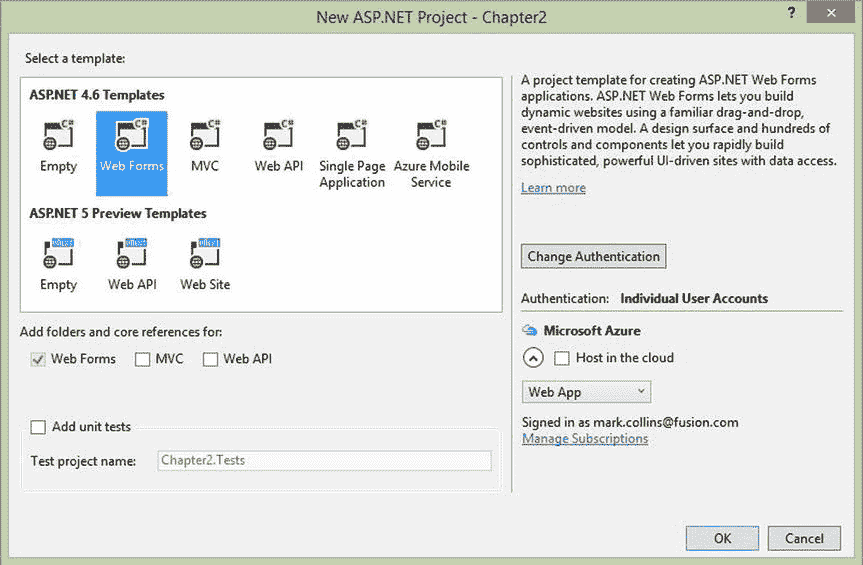

# 二、ASP.NET Web 窗体

在这一章中，我将演示 HTML5 定义的一些新的输入类型，并向你展示如何在 ASP.NET web 表单中使用它们。通常，当需要在表单上输入数据时，会使用`TextBox`控件。用户可以在`TextBox`中输入各种数据，包括字符串、数字、日期等等。为了确保数据有效，表单需要提供服务器端或客户端验证逻辑。HTML5 规范提供了几个新的输入类型，可以为您完成大部分工作，并实现更好的客户体验。

定义了以下输入类型(然而，并非所有的浏览器都支持它们):

*   `select`
*   `color`
*   `datetime`(包括`datetime-local`、`date`、`time`、`month`、`week`)
*   `email`
*   `number`
*   `range`
*   `tel`
*   `url`

当您使用 ASP.NET 构建 web 表单时，发送到浏览器的实际 HTML 是由. NET 生成的。我将向您展示 ASP.NET 插入新输入类型的方式。此外，使用一些新的 HTML 元素需要一些额外的操作，所以我也将演示如何处理。

## 引入新的输入类型

我将从一个相当简单的例子开始，演示如何使用新的电子邮件控件结合占位符属性来快速提供客户端指令和验证。首先，您将使用 Visual Studio 模板创建一个标准的 ASP 项目，然后修改注册页面。然后，您将检查正在呈现的 HTML。

### 创建 ASP.NET 项目

在本章中，您将使用 Visual Studio 2015 中的标准 Web 窗体模板创建一个 ASP.NET 项目。启动 Visual Studio 2015。从起始页中，单击新建项目链接。在新建项目对话框中，选择 Web 类别，选择 ASP.NET Web 应用模板，输入章节 2 作为项目名称，选择合适的位置，如图 2-1 所示。如果选择了应用洞察，请将其关闭。

图 2-1。

Creating an ASP.NET Web Application project

Visual Studio 的早期版本提供了三种不同的创建 web 应用的方法。

*   Web 表单最适合相当轻量级的网页。
*   MVC 为构建更复杂的 web 应用提供了一个框架。
*   Web API 主要用于创建 Web 服务。

虽然这三种技术中的一些概念是相似的，但是它们是在完全不同的堆栈上实现的。从开发人员的角度来看，一旦选择了一种方法，就不容易转换到另一种方法。此外，技能组合不容易转移到其他技术。在 MVC 6 中，微软将这三者合并成一个单一的实现。

如果您使用过 Visual Studio 的早期版本，您会注意到由此产生的一个细微差别。当选择项目类型时，您只需选择 ASP.NET 网络应用。选择使用哪种风格的应用被推迟到下一步，在那里选择模板。模板定义了在您构建新项目时为您创建的文件。与 Web 窗体应用相比，MVC 应用需要不同的文件和文件夹。

在下一个对话框中，如图 2-2 所示，选择 Web Forms 模板。请注意，其中一个可用的样式(Web Forms、MVC 或 Web API)会根据所选的模板自动选中。

图 2-2。

Choosing the Web Forms template

### 使用电子邮件控件

在第一个练习中，您将使用`placeholder`属性让用户知道该字段需要一个电子邮件地址。

EXERCISE 2-1\. MODIFYING THE REGISTRATION PAGEIn the Chapter2 project, open the `Register.aspx` page, which you’ll find in the `Account` folder.   There are several `div` elements in the `fieldset` node that include the input fields. The first one is for the Email field. Change this as follows by entering the attributes shown in bold:  

`<asp:TextBox runat="server" ID="Email" CssClass="form-control" TextMode="Email"`

`placeholder="use your email address" Width="200"` `/>`

`<asp:RequiredFieldValidator runat="server" ControlToValidate="Email"`

`CssClass="text-danger" ErrorMessage="The email field is required." />`

Try viewing this page with several different browsers. Notice that the email validation message looks different in each. In Firefox this will look like Figure 2-6, and in Opera it looks like Figure 2-7.

图 2-7。

The invalid e-mail message in Opera

图 2-6。

The invalid e-mail message in Firefox   Close the browser and stop debugging.   For this example, we used Google Chrome as the browser. If you want to use a different browser, you can select it from the drop-down list in the menu, as shown in Figure 2-5.

图 2-5。

Selecting the browser to use for debugging   If you enter an invalid email address, you should see the error message shown in Figure 2-4 when you attempt to submit the page.

图 2-4。

The invalid email error message   Start the application by pressing F5\. Using the Chrome browser, the Register page will look like Figure 2-3. Notice the text in the Email field.

图 2-3。

The initial Register page   Tip

该下拉列表自动包括当前安装的所有浏览器。您不必做任何事情来添加它们。如果安装新的浏览器，您需要重新启动 Visual Studio，它才会被包括在列表中。如果使用 Internet Explorer，浏览器将与调试器集成得更好。例如，当您关闭浏览器时，Visual Studio 将自动停止调试。然而，当测试 HTML5 支持时，除了 Internet Explorer 之外，您还需要使用其他浏览器。

### 使用页面检查器

使用 Internet Explorer 显示注册页面。选择工具下拉菜单，然后单击 F12 开发人员工具链接。这将允许您查看实际生成的 HTML。按 Ctrl+B 启用元素选择，然后单击电子邮件字段。这将高亮显示相关标记，如图 2-8 所示。

图 2-8。

The HTML generated for the email control Tip

大多数其他浏览器都有类似的特性，允许您检查表单内容，这通常通过它们的工具菜单来访问。

除了相当神秘的控件`name`和`id`，这是标准的 HTML5 语法。特别是，请注意以下属性；email `type`值和`placeholder`属性是 HTML5 中的新特性:

`type="email"`

`placeholder="use your email address"`

您在`Register.aspx`页面中输入的`placeholder`属性不是 ASP.NET 属性。它不是由处理的。NET，而是直接传递给生成的 HTML。

还要注意右边的窗格，它提供了几个用于查看 CSS 样式的选项卡。我们选择了 Attributes 选项卡，它显示了元素的所有属性值。其他选项卡显示应用的样式。停止调试器以关闭页面检查器。

## 探索其他输入类型

HTML5 引入了其他几种输入类型。为了看到他们的实际行动，您将添加一个反馈表单，其中包含一些相当做作的问题。这些将实现您可以使用的其他类型。

Tip

要获得每个输入元素的详细解释，请查看实际的 HTML5 规范。这个地址将把你带到输入元素部分: [`www.whatwg.org/specs/web-apps/current-work/multipage/the-input-element.html#the-input-element`](http://www.whatwg.org/specs/web-apps/current-work/multipage/the-input-element.html#the-input-element) 。

### 实现反馈表

在下一个练习中，您将创建一个新表单并添加几个输入控件，每种类型一个。创建完表单后，我将讨论每个控件。

EXERCISE 2-2\. ADDING A FEEDBACK FORMOpen the Chapter2 project in Visual Studio if not already open.   In the Solution Explorer, right-click the Chapter2 project and click the Add and Webform links. Enter Feedback when prompted for the form name.   This will create a new form with a single `div`, as shown in Listing 2-1.  

清单 2-1。空白表单实现

`<%@ Page Language="C#" AutoEventWireup="true" CodeBehind="Feedback.aspx.cs"`

`Inherits="Chapter2.Feedback" %>`

`<!DOCTYPE html>`

`<html xmlns="`[`http://www.w3.org/1999/xhtml`](http://www.w3.org/1999/xhtml)

`<head runat="server">`

`<title></title>`

`</head>`

`<body>`

`<form id="form1" runat="server">`

`
`

`
`

`</form>`

`</body>`

`</html>`

Within the empty `div`, enter the code shown in Listing 2-2. This will add several fields that each demonstrate one of the new input types.  

清单 2-2。添加反馈字段

`<fieldset>`

`<legend>Feedback Form</legend>`

`<ol>`

`<li>`

`<asp:Label ID="lblURL" runat="server"`

`AssociatedControlID="URL">Default home page</asp:Label>`

`<asp:textbox runat="server" ID="URL" TextMode="Url"></asp:textbox>`

`</li>`

`<li>`

`<asp:Label ID="lblOptions" runat="server"`

`AssociatedControlID="Options">Default browser</asp:Label>`

`<asp:DropDownList ID="Options" runat="server">`

`<asp:ListItem Text="Internet Explorer" Value="1"></asp:ListItem>`

`<asp:ListItem Text="Google Chrome" Value="2" Selected></asp:ListItem>`

`<asp:ListItem Text="Firefox" Value="3"></asp:ListItem>`

`<asp:ListItem Text="Opera" Value="4"></asp:ListItem>`

`</asp:DropDownList>`

`</li>`

`<li>`

`<asp:Label ID="lblBirthday" runat="server"`

`AssociatedControlID="Birthday">Birthday</asp:Label>`

`<asp:TextBox runat="server" ID="Birthday" TextMode="Date"></asp:TextBox>`

`</li>`

`<li>`

`<asp:Label ID="lblMonth" runat="server"`

`AssociatedControlID="Month">Favorite Month</asp:Label>`

`<asp:TextBox runat="server" ID="Month" TextMode="Month"></asp:TextBox>`

`</li>`

`<li>`

`<asp:Label ID="lblWeek" runat="server"`

`AssociatedControlID="Week">Busiest Week</asp:Label>`

`<asp:TextBox runat="server" ID="Week" TextMode="Week"></asp:TextBox>`

`</li>`

`<li>`

`<asp:Label ID="lblStart" runat="server"`

`AssociatedControlID="DateTime">Start Date/Time</asp:Label>`

`<asp:TextBox runat="server" ID="DateTime"`

`TextMode="DateTimeLocal"></asp:TextBox>`

`</li>`

`<li>`

`<asp:Label ID="lblTime" runat="server"`

`AssociatedControlID="Time">Current Time</asp:Label>`

`<asp:TextBox runat="server" ID="Time" TextMode="Time" ></asp:TextBox>`

`</li>`

`<li>`

`<asp:Label ID="lblPhone" runat="server"`

`AssociatedControlID="Phone">Phone</asp:Label>`

`<asp:TextBox runat="server" ID="Phone" TextMode="Phone"></asp:TextBox>`

`</li>`

`<li>`

`<asp:Label ID="lblRange" runat="server"`

`AssociatedControlID="Range">Overall satisfaction</asp:Label>`

`<asp:TextBox runat="server" ID="Range" TextMode="Range"`

`Width="200" Height="30"></asp:TextBox>`

`</li>`

`<li>`

`<asp:Label ID="lblColor" runat="server"`

`AssociatedControlID="Color">Preferred color</asp:Label>`

`<asp:TextBox runat="server" ID="Color" TextMode="Color"></asp:TextBox>`

`</li>`

`<li>`

`<asp:Label ID="lblScore" runat="server"`

`AssociatedControlID="Score">Overall Rating</asp:Label>`

`<asp:TextBox ID="Score" runat="server" TextMode="Number"`

`MaxLength="1"></asp:TextBox>`

`</li>`

`<li>`

`<asp:Label ID="lblComments" runat="server"`

`AssociatedControlID="Multi">Comments</asp:Label>`

`<asp:TextBox runat="server" ID="Multi" TextMode="Multiline"`

`Rows="5" Columns="30"></asp:TextBox>`

`</li>`

`</ol>`

`<asp:Button ID="Submit" runat="server" CommandName="Submit" Text="Submit" />`

`</fieldset>`

注意，我使用 Opera 浏览器来呈现反馈表单，因为在撰写本文时，它对新的输入类型提供了最好的支持。我将在这一章的后面详细解释。可以从 [`www.opera.com`](http://www.opera.com/) 下载歌剧。Chrome 对这些功能也有很好的支持。

Save the changes and press F5 to display the new page in the browser. Figure 2-9 shows the feedback form as rendered by the Opera browser.

图 2-9。

The initial feedback form  

### 查看新的输入类型

现在让我们看看每一种新的输入类型，看看它们是如何在 Opera 中实现的。请记住，不同的浏览器可能会以不同的方式呈现控件。

#### 统一资源定位器

第一个字段使用`url`输入类型，它需要一个有效的 web 地址。如果您输入了无效的地址，当页面被提交时，您将会看到如图 2-10 所示的验证错误

图 2-10。

The URL field Note

URL 中需要协议，如`http://`。例如，如果您输入 [`www.apress.com`](http://www.apress.com/) 并尝试提交表单，该地址将被视为无效。输入 [`http://www.apress.com`改为](http://www.apress.com/)。

#### 选择列表

下一个字段提供了可用浏览器的下拉列表。在 ASP.NET，这被编码为一个包含许多元素的`DropDownList`。生成的 HTML 使用了一个包含`option`元素的`select`元素，如下所示:

`<select name="Options" id="Options">`

`<option value="1">Internet Explorer</option>`

`<option selected="selected" value="2">Google Chrome</option>`

`<option value="3">Firefox</option>`

`<option value="4">Opera</option>`

`</select`

注意，选中的项目用`selected`属性表示。这是一个布尔值，不需要值。Visual Studio 将显示一个警告，生成的标记将值设置为`selected`。浏览器将忽略该值，只寻找是否存在`selected`属性。

#### 日期/时间字段

反馈表单包含以下日期/时间字段，展示了浏览器对各种日期类型字段的支持:

*   生日:(日期)单一日期(无时间部分)
*   最喜欢的月份:(Month)整月，包括一年
*   最忙的一周:(Week)整整一周，包括一年
*   开始日期/时间:(DateTime)包含时间部分的单个日期
*   当前时间:(Time)没有日期的时间

日期字段是文本框，您可以在其中键入所需的值，但具有内置的智能。例如，转到生日字段并键入 7，光标将自动转到日期的日部分。如果您键入 1，您将需要输入 0、1 或 2 来完成月份输入，或者只需按 Tab 移动到日期。

还有一个显示日期选择器控件的图标。该控件的不同格式(日期、月份和星期)分别如图 2-11 、 2-12 和 2-13 所示。这些控件本质上是相同的，只是月和周版本只允许您选择整个月或周。请注意，周格式还显示周数(从 1 到 52)。

图 2-13。

The date picker selecting an entire week

图 2-12。

The date picker selecting an entire month

图 2-11。

The date picker control

开始日期/时间和当前时间字段都包括一个时间控件，允许分别输入小时和分钟，如图 2-14 所示。您也可以使用向上/向下箭头来增加小时或分钟部分，这取决于当前的焦点。但是没有可以选择小时或分钟的下拉菜单。

图 2-14。

The time control Caution

在撰写本文时，ASP.NET 同时支持`DateTime`和`DateTimeLocal`文本模式。这些被翻译成 HTML 类型`datetime`和`datetime-local`。然而，`datetime`已经被弃用，取而代之的是`datetime-local`。所以，一定要在表单中使用`DateTimeLocal`文本模式。

#### 电话

反馈表单包括一个使用新的`tel`输入类型的电话字段。在撰写本文时，没有一种桌面浏览器支持这种类型。我把它包括在练习中，希望当你读到这篇文章时，你已经有一个支持它的浏览器了。与所有不支持的类型一样，浏览器将其视为标准的`TextBox`控件。

#### 范围

下一个控件使用类似于汽车中的燃油表，其中特定值不如相对值重要，例如新范围输入类型。这允许您在控件范围内滑动指示器，提供相对值，如四分之三满。我把这个定义为宽度 300，高度 30。

您可以在 HTML 中操作 range 控件的其他一些属性，但 ASP.NET 不支持这些属性。您仍然可以在。页面，它们会像`placeholder`属性一样被传递给生成的 HTML。然而，在本章的后面我将向你展示另一种配置范围控制的方法。

#### 颜色

颜色控制包括一个显示选定颜色的小矩形。如果你点击这个，你可以从颜色选择器中选择一种颜色，如图 2-15 所示。

图 2-15。

The color-picker control

#### 数字

“总体评分”字段使用数字输入类型。一些浏览器现在包括上下箭头，允许你增加和减少当前值。提交表单时，如果输入了非数字值，则会显示错误，如图 2-16 所示。

图 2-16。

A non-numeric value error

#### 文本区域

最后一个字段使用文本区域输入类型。我指定使用 5 行 30 列。这只会影响字段在页面上的显示方式。文本存储为单个字符串。文本将被换行以适应页面上分配的大小，但它可以包含任意数量的行。

### 查看表单

图 2-17 显示了一个完整的表格。

图 2-17。

The completed feedback form

浏览器试图聪明地对适当字段的内容进行拼写检查。请注意，在注释字段中，拼写错误的单词带有下划线。您可以使用`spellcheck`属性明确地打开或关闭它。要禁用拼写检查，请在此处添加以粗体显示的代码:

`<asp:TextBox runat="server" ID="Multi" TextMode="Multiline"`

`Rows="5" Columns="30"``spellcheck="false"`

在每个字段中输入值后，单击 Submit 按钮，然后查看页面的源代码。每个字段现在都有一个`value`属性，其中包含提交页面时包含的值。这是服务器端代码用来存储和/或处理提交数据的内容。我提取了其中的一部分，如清单 2-3 所示。看看各种日期/时间字段值是如何格式化的。这些以粗体显示。另外，请注意，颜色是以所选 RGB 值的十六进制表示形式存储的。

Listing 2-3\. The Source with Submitted Values

`<li>`

`<label for="URL" id="lblURL">Default home page</label>`

`<input name="URL" type="url"``value="`[`http://www.apress.com`](http://www.apress.com/)`"`

`</li>`

`<li>`

`<label for="Options" id="lblOptions">Default browser</label>`

`<select name="Options" id="Options">`

`<option value="1">Internet Explorer</option>`

`<option value="2">Google Chrome</option>`

`<option value="3">Firefox</option>`

`<option selected="selected"``value="4"`

`</select>`

`</li>`

`<li>`

`<label for="Birthday" id="lblBirthday">Birthday</label>`

`<input name="Birthday" type="date"``value="1995-03-17"`

`</li>`

`<li>`

`<label for="Month" id="lblMonth">Favorite Month</label>`

`<input name="Month" type="month"``value="1999-07"`

`</li>`

`<li>`

`<label for="Week" id="lblWeek">Busiest Week</label>`

`<input name="Week" type="week"``value="2015-W14"`

`</li>`

`<li>`

`<label for="DateTime" id="lblStart">Start Date/Time</label>`

`<input name="DateTime" type="datetime-local"`

`value="2014-06-14T14:30"` `id="DateTime" />`

`</li>`

`<li>`

`<label for="Time" id="lblTime">Current Time</label>`

`<input name="Time" type="time"``value="09:52"`

`</li>`

`<li>`

`<label for="Phone" id="lblPhone">Phone</label>`

`<input name="Phone" type="tel"``value="800 555-1212"`

`</li>`

`<li>`

`<label for="Range" id="lblRange">Overall satisfaction</label>`

`<input name="Range" type="range"``value="76"`

`style="height:30px;width:200px;" />`

`</li>`

`<li>`

`<label for="Color" id="lblColor">Preferred color</label>`

`<input name="Color" type="color"``value="#ffbe7d"`

`</li>`

`<li>`

`<label for="Score" id="lblScore">Overall Rating</label>`

`<input name="Score" type="number"``value="8"`

`</li>`

`<li>`

`<label for="Multi" id="lblComments">Comments</label>`

`<textarea name="Multi" rows="5" cols="30" id="Multi">`

`This is a multi-line input box with 5 rows and 30 columns.`

`Notice my spellling mistake is underlined.`

`</textarea>`

`</li>.`

## 使用 html 5 测试网站

我提到过我们在这个练习中使用 Opera。每个浏览器可以实现 HTML5 特征的不同子集。上一章提到的网站是一个非常有用的工具，可以帮助你找出哪种浏览器最适合某个特定的功能。

如果您转到“比较”选项卡，您可以选择多达五种不同的浏览器来查看每个功能的并排比较。例如，我选择了 Opera、Google Chrome、Firefox、IE 和 Safari 来查看它们的表单特性。结果显示在图 2-18 中。Opera 和 Chrome 在支持表单方面要先进得多。

图 2-18。

A side-by-side comparison of Opera, Chrome, Firefox, IE, and Safari

使用该网站的另一种方法是查看所有浏览器如何支持特定功能。在“功能”子选项卡(在“比较”选项卡中)中，您可以选择最多三个特定的功能来查看哪些浏览器支持它。我们选择了与`range`输入类型相关的三个特征，如图 2-19 所示。目前，Chrome 和 Opera 是唯一完全支持这些功能的桌面浏览器。

图 2-19。

Viewing each browser’s support of the range control Caution

这些比较和分析仅供演示之用。浏览器支持正以相当快的速度变化，当你读到这篇文章时，你可能会有不同的结果。但是，比较浏览器支持的方法仍然有效。

## 使用范围控制

范围控件支持允许您配置其行为的属性。例如，当滑块位于控件的两端时，您可以指定定义字段的`value`的`min`和`max`属性。您还可以指示`step`属性，该属性控制滑块在标尺上可以停止的位置。例如，如果`min`为 0，`max`为 100，`step`为 20，控制将只允许您以 20 的增量停止(例如，0、20、40、60、80 和 100)。

您可以用 HTML 编写这样的代码:

`<!DOCTYPE html>`

`<input name="Range" type="range" id="Range"`

`min="0" max="200" step="20"`

`style="height:30px;width:200px;" />`

即使 IntelliSense 不支持这些属性，您也可以在。页面，它们将被包含在最终的 HTML 中。另一种方法是在使用 JavaScript 加载页面时修改控件。

### 修改步骤属性

现在，您将编写一个简单的脚本来配置范围属性。

EXERCISE 2-3\. MODIFYING THE RANGE CONTROLLoad the Chapter 2 project in Visual Studio and open the `Feedback.aspx` page.   Inside the `head` tag, add the following `script` element shown in bold:  

`<head runat="server">`

`<title></title>`

``

`</head>`

This simple JavaScript function modifies the attributes of the range control. The `document` property represents the HTML document of the current page. The `getElementById()` function is a selector that returns the specified element, the range control in this case. (I will cover selectors in JavaScript in more detail in Chapter 5.)   Now that the function has been implemented, you need to tell the page to execute it. To do that, add the following code in bold to the `<body>` tag:  

`<body``onload="configureRange()"`

`<form id="form1" runat="server">`

This instructs the page to call the `configureRange()` function when the `OnLoad` event occurs.   Save your changes and press F5 to load the page.   The range control will look just like it did before, but when you move the slider, it will stop only at the preset values.  

### 添加自定义刻度线

Opera 以前的版本会显示刻度线来帮助分级范围控制，但是现在的版本没有，Chrome 也没有。但是，您可以使用`datalist`标签自己添加这些内容。截至本文撰写之时，Firefox 还不支持这一特性。

EXERCISE 2-4\. ADDING CUSTOM TICK MARKSAdd the following anywhere inside the `fieldset` tag. This defines the list of values where the tick marks should be placed.  

`<datalist id="ticks">`

`<option>0</option>`

`<option>20</option>`

`<option>40</option>`

`<option>60</option>`

`<option>80</option>`

`<option>100</option>`

`<option>120</option>`

`<option>140</option>`

`<option>160</option>`

`<option>180</option>`

`<option>200</option>`

`</datalist>`

In the `Range` control, add the `list` attribute shown in bold. This specifies the `datalist` tag that defines where the tick marks should be.  

`<asp:Label ID="lblRange" runat="server"`

`AssociatedControlID="Range">Overall satisfaction</asp:Label>`

`<asp:TextBox runat="server" ID="Range" TextMode="Range"`

`Width="200" Height="30"``list="ticks"`

Save your changes and press F5 to display the modified form.   You should see tick marks at each step, as shown in Figure 2-20.

图 2-20。

The Range control with tick marks  

### 显示范围值

当你在使用`Range`控件时，我将向你展示一个简单的技巧来显示它的值。您将在范围控件旁边添加一个`TextBox`控件，然后使用 JavaScript 在范围控件被修改时更新它的值。

Note

当用户移动范围控件时，Internet Explorer 11 会自动显示该控件的当前值。这是每个浏览器如何以不同方式实现功能的一个例子。

EXERCISE 2-5\. DISPLAYING THE RANGE VALUEIn the `Feedback.aspx` page, add the following code in bold to the range item:  

`<li>`

`<asp:Label ID="lblRange" runat="server"`

`AssociatedControlID="Range">Overall satisfaction</asp:Label>`

`<asp:TextBox runat="server" ID="Range" TextMode="Range"`

`Width="200" Height="30" list="ticks"></asp:TextBox>`

`<asp:TextBox runat="server" ID="RangeValue" Width="50"></asp:TextBox>`

`</li>`

Next, add the code in bold to the script section:  

``

The `updateRangeValue()` function takes the current value of the `Range` control and stores it in the text box. Also, the `configureRange()` function that is called when the page is loaded calls `updateRangeValue()` to set its initial value.   Now you’ll need to call the `updateRangeValue()` function whenever the range control is updated. To do that, add the code in bold to the `Page_Load()` event handler in the `Feedback.aspx.cs` code-behind file.  

`public partial class Feedback : System.Web.UI.Page`

`{`

`protected void Page_Load(object sender, EventArgs e)`

`{`

`Range.Attributes.Add("onChange", "updateRangeValue()");`

`}`

`}`

Save your changes and execute the page. As you move the slider, the selected value is displayed. Notice that it is updated in increments of 20 (if the step attribute is still set at 20).  

## 摘要

在本章中，您使用 Visual Studio 提供的模板创建了一个基本的 ASP.NET web 窗体应用。在简单尝试了 email 控件之后，您创建了一个反馈页面，演示了许多其他输入类型。使用一些简单的 JavaScript，您配置了范围控件并提供了其值的实时显示。

同时，我还提供了一些关于开发环境的有用信息，包括以下内容:

*   配置浏览器进行测试
*   在 Internet Explorer 中检查页面元素
*   使用`HTML5Test.com`网站研究浏览器支持