# 三、MVC Web 应用

在这一章中，你将使用 ASP.NET MVC 来创建一个反馈表单，展示几个新的输入类型。我将首先简要介绍。NET 平台，然后向您展示如何使用 MVC 构建一个基于 HTML5 的 web 页面。最终结果将类似于你在第二章中所做的事情，但是实现将会非常不同。正如您将看到的，该解决方案将非常依赖于扩展 MVC 框架以包含新的 HTML5 特性的能力。

模型-视图-控制器是一种架构模式，早在 20 世纪 70 年代就已经存在了。这种模式的主要好处是分离关注点，允许独立开发、测试和维护每一个关注点。模型提供了数据和业务逻辑。例如，如果应用显示产品目录，模型将提供产品细节。如果进行了更改，当控制器调用时，模型负责持久化数据。视图提供了用户体验，既格式化了数据的表示，又使用户能够与输入控件、按钮和链接进行交互。控制器处理用户请求，将其传递给模型并调用适当的视图。图 3-1 说明了这一过程。

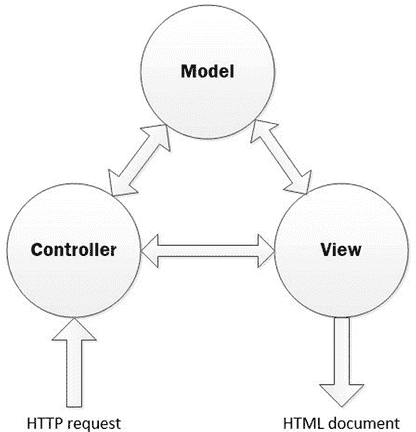

图 3-1。

The MVC architectural pattern

## 介绍 ASP.NET MVC 6

ASP.NET MVC 是一个基于。NET 于 2009 年首次发布，实现了 MVC 模式。最初的版本使用相同的。传统 ASP.NETframework 中使用的 Web Forms 语法。2010 年，发布了一个名为 Razor 的新视图引擎，它以更自然、类似 HTML 的语法生成网页。此外，Razor 引擎允许代码包含在标记文件中，而不是代码隐藏文件。Visual Studio 2015 版本中包含的 MVC 版本 6 将许多实现堆栈与 Web 表单和 Web API 合并在一起。

和我在前一章讨论的传统 ASP.NET Web 表单一样，MVC6 不支持许多现成的新 HTML5 标签。然而，MVC 框架更具可扩展性，这使得添加 HTML5 支持相对容易。在这一章中，我将解释不同的技术来扩展 MVC 框架以包含新的 HTML5 特性。还有几个开源扩展可以安装，我也将简要演示其中的一个。

### 创建 ASP.NET MVC 项目

在本章中，你将使用 Visual Studio 2015 中的标准模板创建一个 ASP.NET MVC 项目。启动 Visual Studio 2015。在 Web 类别中，选择 ASP.NET Web 应用模板，输入第三章作为项目名称，选择合适的位置，如图 3-2 所示。单击“确定”按钮继续。

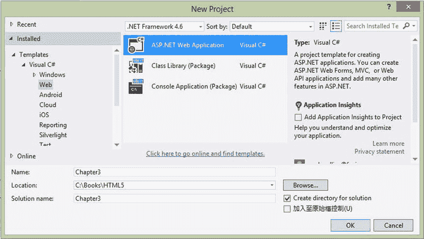

图 3-2。

Selecting the ASP.NET Web project

这与您在上一章中创建项目的方式相同。但是，在下一个对话框中，选择 MVC 模板，如图 3-3 所示。这将创建一个 web 应用，看起来就像《??》第二章中的项目，但是它是使用 MVC 风格实现的。

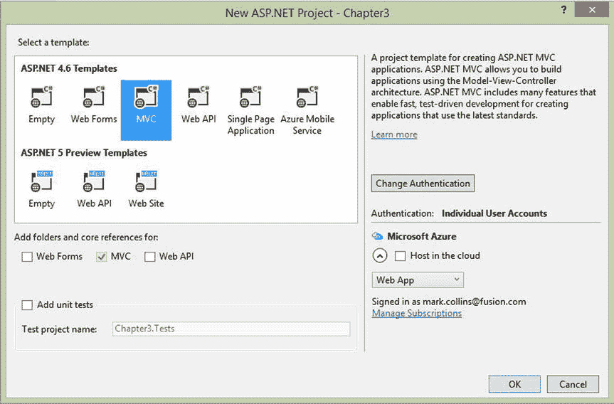

图 3-3。

Selecting the MVC template

创建项目后，您将在解决方案资源管理器中看到许多文件夹。注意，控制器、模型和视图都有单独的文件夹，如图 3-4 所示。该示例项目包括这些项目中每一项的几个示例。

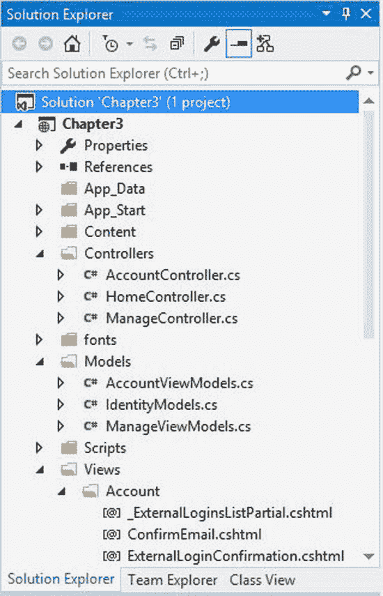

图 3-4。

The initial Solution Explorer window

### 探索剃刀视角

为了快速演示 Razor 视图语法，您可以查看项目模板提供的现有视图。打开`Register.cshtml`文件，您可以在`Views\Account`文件夹中找到它。这实现了注册页面的视图。清单 3-1 显示了页面的主要部分。

Listing 3-1\. The Initial Register.cshtml Implementation

`<h4>Create a new account.</h4>`

`
`

`@Html.ValidationSummary("", new { @class = "text-danger" })`

`
`

`@Html.LabelFor(m => m.Email, new { @class = "col-md-2 control-label" })`

`
`

`@Html.TextBoxFor(m => m.Email, new { @class = "form-control" })`

`
`

`
`

`
`

`@Html.LabelFor(m => m.Password, new { @class = "col-md-2 control-label" })`

`
`

`@Html.PasswordFor(m => m.Password, new { @class = "form-control" })`

`
`

`
`

`
`

`@Html.LabelFor(m => m.ConfirmPassword, new { @class = "col-md-2 control-label" })`

`
`

`@Html.PasswordFor(m => m.ConfirmPassword, new { @class = "form-control" })`

`
`

`
`

`
`

`
`

`<input type="submit" class="btn btn-default" value="Register" />`

`
`

`
`

在 Razor 语法中，`@`表示后面的文本是代码而不是文字标记。代码将在运行时生成 HTML 内容。您会注意到大部分代码都使用了`Html`类。这是一个帮助器类，具有生成 HTML 标记的方法。例如，`LabelFor()`方法生成标记来插入一个`Label`控件。

对于表单中的每个字段，代码使用了`Html`助手类的`LabelFor()`和`TextBoxFor()`方法。(密码字段使用`PasswordFor()`方法。)这些方法中的每一个都采用一个 lambda 表达式(例如，`m => m.Email`)来指定相关模型中的数据元素。用于视图的模型由文件顶部的以下指令定义:

`@model Chapter``3`

如果你看一下`AccountViewModels.cs`文件，你会发现`RegisterViewModel`类的定义。这个类有三个公共属性。

*   `Email`
*   `Password`
*   `ConfirmPassword`

这些属性中的每一个都有一些元数据属性，比如用于生成正确的 HTML 的`Required`和`DataType`。我将在本章后面进一步解释这一点。

### 使用编辑器模板

`TextBoxFor()`方法将输出一个标准的`TextBox`控件。要使用新的 HTML5 输入类型，您需要修改这个实现。MVC 框架允许你使用`EditorFor()`方法来代替`TextBoxFor()`。这本身不会改变生成的标记，因为默认的`EditorFor()`实现仍然使用`type="text"`属性。我将向您展示如何创建一个编辑器模板来覆盖这个默认行为。

EXERCISE 3-1\. ADDING AN EDITOR TEMPLATEOpen the `Register.cshtml` file, which you’ll find in the `Views\Account` folder.   For the `Email` field, replace `TextBoxFor` with `EditorFor`. The code will look like this: `
`     `@Html.LabelFor(m => m.Email, new { @class = "col-md-2 control-label" })`     `
`         `@Html.` `EditorFor` `(m => m.Email, new { @class = "form-control" })`     `
` `
`   In the Solution Explorer, right-click the `Views\Shared` folder and choose Add and New Folder. Enter EditorTemplates for the folder name.  

注意在本章的后面，我将解释如何为每个属性选择合适的编辑器模板。编辑器模板必须在`EditorTemplates`文件夹中，MVC 框架才能使用它们。因为这个文件夹被添加到了`Views\Shared`文件夹中，所以模板对项目中的所有视图都是可用的。你可以在`Views\Account`文件夹中创建`EditorTemplates`文件夹。这将使它们对`Account`文件夹中的所有视图可用，但对其他文件夹(如`Home`文件夹)不可用。如果您希望`Home`模板不同于`Account`模板，这也允许您为每个文件夹创建一组单独的编辑器模板。如果在两个文件夹中有相同的名称，`Home`或`Account`文件夹中的名称将覆盖`Shared`版本。

Right-click the `Views\Shared\EditorTemplates` folder and choose Add and View links.   In the Add View dialog box, enter EmailAddress as the view name and make sure all the check boxes are unselected, as shown in Figure 3-5. Click the Add button to create the template.

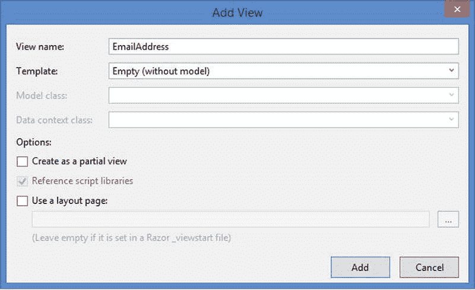

图 3-5。

Adding the EmailAddress template   This will generate a view page named `EmailAddress.cshtml`. Delete the entire content and replace it with the following code. This uses the `TextBox()` method but specifies some additional attributes including `type` and `placeholder`. `@Html.TextBox("", null, new` `{`     `@class = "text-box single-line",`     `type = "email",`     `placeholder = "Enter an e-mail address"` `})`   Save your changes and debug the application. By default, the debugger will try to display the page you have open. Open the `Register.cshtml` file before pressing F5, and that page will be opened in the browser. Go to the Registration page, and you should see the placeholder text displayed in the empty Email field, as shown in Figure 3-6.

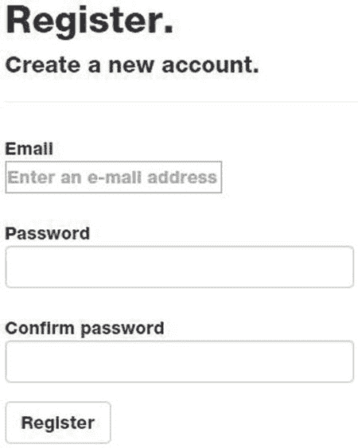

图 3-6。

The blank register form   If you look at the page’s source or the Page Inspector, the actual HTML will look similar to this: `<input name="Email"`        `class="text-box single-line"`        `id="Email"`        `type="email"`        `placeholder="Enter an e-mail address"`        `value=""`        `data-val-required="The Email field is required."`        `data-val-email="The Email field is not a valid e-mail address."`        `data-val="true" >`   Close the browser and stop the debugger.   Tip

和前一章一样，我将使用 Opera 浏览器进行大部分练习，因为它对新的输入类型有最好的支持。

注意生成的标记中的`data-val`标签。它们用于控制客户端验证逻辑。

ATTRIBUTE DRIVEN VALIDATION

ASP.NET MVC 中的数据验证从模型开始。如果您查看`AccountViewModel.cs`文件，您会看到附加到每个属性的元数据属性，比如`Required`。例如，`Email`属性如下所示:

`[Required]`

`[EmailAddress]`

`[Display(Name = "Email")]`

`public string Email { get; set; }`

`TextBoxFor()`助手函数使用元数据属性生成 HTML，就像您看到的电子邮件字段一样。具体来说，生成了`data-val`和`data-val-required` HTML 属性。该视图还包括以下 jQuery 库:

``

``

这些 JavaScript 库使用 HTML 属性如`data-val`来执行客户端验证。更多信息，请参见 [`www.datahaunting.com/mvc/client-and-server-side-validation-using-dataannotation-in-mvc`](http://www.datahaunting.com/mvc/client-and-server-side-validation-using-dataannotation-in-mvc) 一文。

## 添加反馈页面

现在，您将创建一个反馈表单，并使用它来演示如何实现新的 HTML5 功能。您将首先创建一个模型，然后基于该模型实现一个强类型视图。然后，您将添加一个控制器动作以及一个到新页面的链接。

Tip

向 web 应用添加页面通常涉及添加模型、添加视图以及创建或修改控制器。MVC 模式允许分别开发这些视图和模型，在大型项目中，通常会有不同的人负责视图和模型。您可以使用现有的模型。然而，在像这样的小项目中，你是唯一的开发者，你通常需要接触所有三个区域来添加一个页面。

### 创建反馈模型

模型定义了可以包含在页面中的数据元素。通过首先设计模型，您可以简化视图实现。

在解决方案资源管理器中，右键单击`Models`文件夹，选择 Add and Class，并输入 FeedbackModel.cs 作为类名。单击“确定”按钮创建该类。对于类的实现，输入清单 3-2 中所示的代码。

Listing 3-2\. The FeedbackModel Class

`using System;`

`using System.Collections.Generic;`

`using System.Linq;`

`using System.Web;`

`using System.ComponentModel.DataAnnotations;`

`namespace Chapter``3`

`{`

`public class FeedbackModel`

`{`

`[Display(Name = "Name", Prompt = "Enter your full name"),`

`Required]`

`public string Name { get; set; }`

`[Display(Name = "Average Score", Prompt = "Your average score"),`

`Range(1.0, 100.0),`

`Required]`

`public decimal Score { get; set; }`

`[Display(Name = "Birthday"),`

`DataType(DataType.Date)]`

`public DateTime? Birthday { get; set; }`

`[Display(Name = "Home page", Prompt = "Personal home page"),`

`DataType(DataType.Url),`

`Required]`

`public string Homepage { get; set; }`

`[Display(Name = "Email", Prompt = "Preferred e-mail address"),`

`DataType(DataType.EmailAddress),`

`Required]`

`public string Email { get; set; }`

`[Display(Name = "Phone number", Prompt = "Contact phone number"),`

`DataType(DataType.PhoneNumber),`

`Required]`

`public string Phone { get; set; }`

`[Display(Name = "Overall Satisfaction")]`

`public string Satisfaction { get; set; }`

`}`

`}`

Note

视图文件使用 Razor 语法并有`.cshtml`(或。`vbhtml`)分机。然而，模型和控制器文件是标准的 C#(或 VB)类。

重新构建应用。这将使模型在定义视图时可用。

### 定义反馈视图

现在您将基于这个模型定义一个新的视图。最初，这将是一个具有单个字段的简单表单。然后，您将在主页上添加一个链接和一个控制器操作来处理这个问题。在本章的后面，您将向表单添加更多的字段。

EXERCISE 3-2\. DESIGNING THE INITIAL FEEDBACK FORMIn the Solution Explorer, expand the `Views` folder. Right-click the `Home` folder and choose Add and View. Enter the name Feedback, select the `Empty` template, and select the `FeedbackModel`, as shown in Figure 3-7. Click the Add button to create the view.

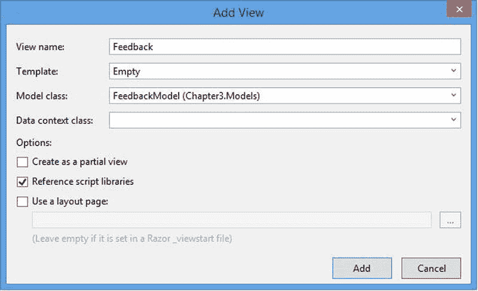

图 3-7。

Creating the Feedback view   The new view is generated with a single empty `div` inside the `body` tag. Enter the code shown in bold in Listing 3-3. This code includes an input control for the `Email` property using the `EditorFor()` method.  

清单 3-3。定义初始形式

`@model Chapter``3`

`@{`

`Layout = null;`

`}`

`<!DOCTYPE html>`

`<html>`

`<head>`

`<meta name="viewport" content="width=device-width" />`

`<title>Feedback</title>`

`</head>`

`<body>`

`
`

`@using (Html.BeginForm((string)ViewBag.FormAction, "Home"))`

`{`

`<fieldset>`

`<legend>Feedback Form</legend>`

`
`

`@Html.EditorFor(m => m.Email)`

`
`

`
`

`<input type="submit" value="Submit" />`

`
`

`</fieldset>`

`}`

`
`

`</body>`

`</html>`

Views are invoked by a controller, so you’ll need to add a controller action that will load this page. Open the `HomeController.cs` class, which you’ll find in the `Controllers` folder.   Add the following method: `public ActionResult Feedback()` `{`     `return View();` `}`   Finally, you’ll need a link that triggers this controller action. Open `_Layout.cshtml` in the `View\Shared` folder.   Add the line shown in bold: `<ul id="menu">`     `<li>@Html.ActionLink("Home", "Index", "Home")</li>`     `<li>@Html.ActionLink("About", "About", "Home")</li>`     `<li>@Html.ActionLink("Contact", "Contact", "Home")</li>`     `<li>@Html.ActionLink("Feedback", "Feedback", "Home")</li>` `</ul>`   Save your changes and press F5 to debug. You should now have a Feedback link on the home page, as shown in Figure 3-8.

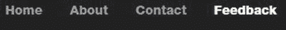

图 3-8。

The Feedback link on the home page   Click this link to display the feedback form, which is shown in Figure 3-9.

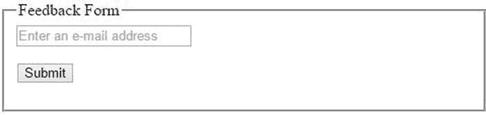

图 3-9。

The initial feedback form   Enter an invalid email address and click the Submit button. You should see the standard HTML5 validation error, as shown in Figure 3-10.

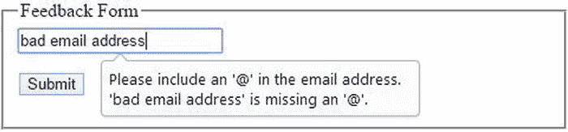

图 3-10。

The standard HTML5 validation error   View the source of the feedback form, which should be similar to this: `<form action="/Home/Feedback" method="post">`     `<fieldset>`         `<legend>Feedback Form</legend>`         `
`             `<input class="text-box single-line" data-val="true"`                    `data-val-required="The Email field is required." id="Email"`                    `name="Email" placeholder="Enter an e-mail address"`                    `type="email" value="" />`         `
`         `
`             `<input type="submit" value="Submit" />`         `
`     `</fieldset>` `</form>`  

## 填写反馈表

现在，您将把剩余的字段添加到反馈表单中。您还需要为其他数据类型提供编辑器模板。我将向您展示框架如何决定使用哪个模板。

### 添加其他字段

您将从添加在`FeedbackModel.cs`类中定义的其他字段开始。对于每一个，您将包含一个标签，并使用`EditorFor()`方法来生成输入字段。

EXERCISE 3-3\. COMPLETING THE FEEDBACK FORMOpen the `Feedback.cshtml` file and add the code shown in bold in Listing 3-4.  

清单 3-4。反馈视图实现

`
`

`@Html.EditorFor(m => m.Email)`

`
`

`
`

`@Html.LabelFor(m => m.Name)`

`
`

`
`

`@Html.EditorFor(m => m.Name)`

`
`

`
`

`@Html.LabelFor(m => m.Birthday)`

`
`

`
`

`@Html.EditorFor(m => m.Birthday)`

`
`

`
`

`@Html.LabelFor(m => m.Homepage)`

`
`

`
`

`@Html.EditorFor(m => m.Homepage)`

`
`

`
`

`@Html.LabelFor(m => m.Phone)`

`
`

`
`

`@Html.EditorFor(m => m.Phone)`

`
`

`
`

`@Html.LabelFor(m => m.Score)`

`
`

`
`

`@Html.EditorFor(m => m.Score)`

`
`

`
`

`@Html.LabelFor(m => m.Satisfaction)`

`
`

`
`

`@Html.EditorFor(m => m.Satisfaction)`

`
`

`
`

`<input type="submit" value="Submit" />`

`
`

Save your changes and press F5 to view the modified form. Click the Feedback link to display the page, which will look similar to Figure 3-11.

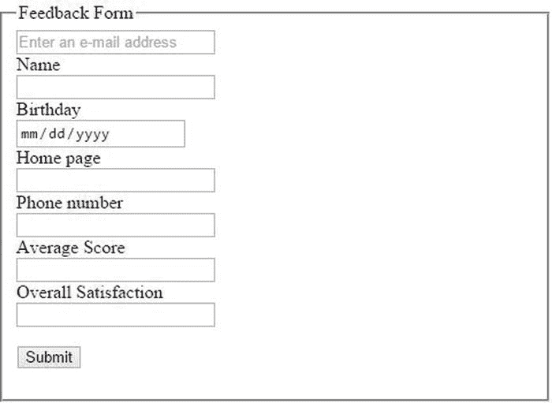

图 3-11。

The feedback form   Notice that all the new fields, except `Birthday`, use the standard `TextBox` control and do not include a `placeholder` text. This is because there is no editor template defined for these data types. The `Birthday` property was defined in the model as a `DateTime` value, and the implementation of the `Textbox` control uses this placeholder for dates.  

### 添加编辑器模板

你可能一直在问自己，框架如何知道使用哪个编辑器模板？框架会根据属性的数据类型尝试使用正确的模板。这不太可靠，因为电子邮件、URL 和电话号码都存储在一个`string`变量中。首选方法是使用元数据来定义它。

如果在模型类中包含了`System.ComponentModel.DataAnnotations`名称空间，那么就可以在模型中包含元数据。有两个元数据属性用于确定适当的模板。

*   `DataType`
*   `UIHint`

使用`DataType`枚举来指定`DataType`属性。这包括一组相当大但固定的值，比如上下文类型`EmailAddress`、`CreditCard`、`Currency`、`PostalCode`和`Url`。如果您添加了一个`DataType`属性，将使用具有匹配名称的编辑器模板。当您实现`FeedbackModel`时，您包含了`DataType`属性。

`UIHint`属性是用一个字符串指定的，因此您可以使用任何想要的值。如果您希望一个属性以绿色字体显示，您可以在模型中指定`UIHint("GreenFont")`属性，然后提供一个`GreenFont.cshtml`模板。在确定要使用的合适模板时，`UIHint`优先于`DataType`属性。

Tip

我的`GreenFont`示例用来说明`UIHint`属性是如何工作的。您不应该使用它来设置样式属性，因为这是样式表的作用。当你实现一个`range`控件时，一个更合适的`UIHint`属性的应用将在本章后面演示。

Right-click the `Views\Shared\EditorTemplates` folder and choose Add and View. In the `Add View` dialog box, enter the name Date and unselect all of the check boxes. Replace the view implementation with the following code: `@Html.TextBox("", null, new` `{`    `@class = "text-box single-line",`    `type = "date"` `})`   In the same way, add another editor template named Url and use the following implementation: `@Html.TextBox("", null, new` `{`    `@class = "text-box single-line",`    `type = "url",`    `placeholder = "Enter a web address"` `})`   Create a PhoneNumber template using the following code: `@Html.TextBox("", null, new` `{`     `@class = "text-box single-line",`     `type = "tel",`     `placeholder = "Enter a phone number"` `})`   Create a Number template using the following code (you will be using this in a later exercise): `@Html.TextBox("", null, new` `{`     `@class = "text-box single-line",`     `type = "number",`     `placeholder = "Enter a number"` `})`   Save your changes and press F5 to debug your application. The feedback form should now use the HTML5 controls, as shown in Figure 3-12.

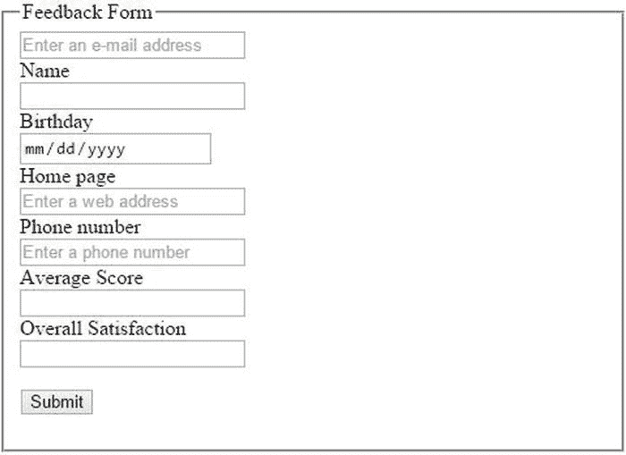

图 3-12。

The form using HTML5 controls  

## 生成自定义 HTML

您实现的编辑器模板都基于`Html`助手类的`TextBox()`方法。模板只是添加了一些额外的属性，比如`type`和`placeholder`。但是，您可以实现输出任何您想要的 HTML 内容的模板。为了演示这一点，我将向您展示如何构建自己的助手扩展，从头开始生成标记。你将用它来替换`EmailAddress`模板。

### 添加自定义助手类

您可以创建自己的助手类，并将其添加为现有`Html`助手类的属性。然后，您可以按如下方式访问您的自定义方法:

`@Html.<CustomClass>.<CustomMethod>()`

EXERCISE 3-4\. CREATING A HELPER EXTENSIONIn the Solution Explorer, right-click the Chapter3 project and choose Add and Class links. Enter the name Html5.cs when prompted for the class name.   Enter the source shown in Listing 3-5.  

清单 3-5。初始 HTML5 助手类

`using System;`

`using System.Collections.Generic;`

`using System.Linq;`

`using System.Web;`

`using System.Globalization;`

`namespace System.Web.Mvc`

`{`

`public class Html5Helper`

`{`

`private readonly HtmlHelper htmlHelper;`

`public Html5Helper(HtmlHelper htmlHelper)`

`{`

`this.htmlHelper = htmlHelper;`

`}`

`private static CultureInfo Culture`

`{`

`get`

`{`

`return CultureInfo.CurrentCulture;`

`}`

`}`

`// Add custom methods here...`

`}`

`public static class HtmlHelperExtension`

`{`

`public static Html5Helper Html5(this HtmlHelper instance)`

`{`

`return new Html5Helper(instance);`

`}`

`}`

`}`

这里有几件事需要指出。首先，注意名称空间被设置为`System.Web.Mvc`，而不是你的应用的名称空间`Chapter` `3` 。您的自定义助手类被命名为`Html5Helper`，它的构造函数带有一个`HtmlHelper`参数。这是对标准助手类的引用，该类存储为私有类成员。您的定制方法将需要它来从框架中访问数据，如视图和模型信息。最后，这段代码还声明了一个静态的`HtmlHelperExtension`类，它提供了一个静态方法来返回您的自定义类。注意，方法名是`Html5`，所以您将从视图中访问您的定制类，如下所示:

`@Html.Html5().<CustomMethod>()`

拥有自己的自定义助手类的目的是为了能够实现自定义助手方法。所以，现在再加一个。第一种方法将生成一个电子邮件输入控件。然后您将在您的`EmailAddress.cshtml`模板中使用它。

Add the code shown in Listing 3-6 to your custom class where the `// Add custom methods here` placeholder is.  

清单 3-6。EmailControl 实现

`public IHtmlString EmailControl()`

`{`

`string id;`

`string name;`

`string placeHolder;`

`string value;`

`string valueAttribute;`

`ViewDataDictionary viewData = htmlHelper.ViewData;`

`ModelMetadata metaData = viewData.ModelMetadata;`

`// Build the HTML attributes`

`id = viewData.TemplateInfo.GetFullHtmlFieldId(string.Empty);`

`name = viewData.TemplateInfo.GetFullHtmlFieldName(string.Empty);`

`if (string.IsNullOrWhiteSpace(metaData.Watermark))`

`placeHolder = string.Empty;`

`else`

`placeHolder = "placeholder=\"" + metaData.Watermark + "\"";`

`value = viewData.TemplateInfo.FormattedModelValue.ToString();`

`if (string.IsNullOrWhiteSpace(value))`

`valueAttribute = string.Empty;`

`else`

`valueAttribute = "value=\"" + value + "\"";`

`// Determine the css class`

`string css = "text-box single-line";`

`ModelState state;`

`if (viewData.ModelState.TryGetValue(name, out state)`

`&& (state.Errors.Count > 0))`

`css += " " + HtmlHelper.ValidationInputCssClassName;`

`// Format the final HTML`

`string markup = string.Format(Culture,`

`"<input type=\"email\" id=\"{0}\" name=\"{1}\" {2} {3} " +`

`"class=\"{4}\"/>", id, name, placeHolder, valueAttribute, css);`

`return MvcHtmlString.Create(markup);`

`}`

这个方法收集各种 HTML 属性，比如`id`、`name`、`class`和`placeholder`。该信息是从模型或模型元数据中提取的。在这个方法的最后，使用标准的`string.Format()`方法构建了`markup`字符串，该方法集合了各种属性。然后将它传递给静态的`MvcHtmlString.Create()`方法，以提供 MVC 框架所需的`IHtmlString`接口。

这个`EmailAddress`模板实现的主要区别是占位符属性是使用模型元数据设置的。前面的实现使用了硬编码的占位符“输入电子邮件地址”不幸的是，财产名称完全不一致。在模型中，这是使用`Prompt`属性(`Prompt = "Preferred e-mail address"`)指定的。在`ModelMetadata`类中，这个值作为`Watermark`属性提供。当然，这作为一个`placeholder`属性包含在 HTML 文档中。

### 重新实现自定义电子邮件模板

现在您将使用一个更简单的模板替换`EmailAddress`模板，该模板使用您刚刚实现的新助手扩展。

EXERCISE 3-5\. RE-IMPLEMENTING THE E-MAIL TEMPLATESave the changes and open the `EmailAddress.cshtml` template.   Replace the entire implementation with the following: `@Html.Html5().EmailControl()`   Save the changes and press F5 to debug. The placeholder text should now reflect the prompt specified in the model metadata, as demonstrated in Figure 3-13.

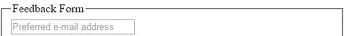

图 3-13。

The modified Email field   View the source of this page, and the HTML markup for the Email field should look like this: `<input type="email"`        `id="Email"`        `name="Email"`        `placeholder="Preferred e-mail address"`        `class="text-box single-line">`  

## 实现范围控制

正如你在前一章看到的，`range`控件支持一些标准`TextBoxFor`(甚至是`EditorFor`)实现中没有的附加属性。为了使用 MVC 框架实现这一点，您将实现一个定制的 helper 方法。然后，您将提供一个调用这个自定义方法的编辑器模板。最后，您将在模型元数据中添加一个`UIHint`属性，告诉框架使用新的模板。

### 实现自定义帮助器方法

第一步是创建一个定制的助手方法，它将为一个`range`控件生成适当的标记。这将类似于您刚刚实现的`EmailControl()`方法，除了它不包括`placeholder`属性。此外，`min`、`max`和`step`属性被传递给该方法。

将清单 3-7 中的代码添加到`Html5.cs`文件中(在`Html5Helper`类中)。

Listing 3-7\. The RangeControl Implementation

`public IHtmlString RangeControl(int min, int max, int step)`

`{`

`string id;`

`string name;`

`string value;`

`string valueAttribute;`

`ViewDataDictionary viewData = htmlHelper.ViewData;`

`// Build the HTML attributes`

`id = viewData.TemplateInfo.GetFullHtmlFieldId(string.Empty);`

`name = viewData.TemplateInfo.GetFullHtmlFieldName(string.Empty);`

`value = viewData.TemplateInfo.FormattedModelValue.ToString();`

`if (string.IsNullOrWhiteSpace(value))`

`valueAttribute = string.Empty;`

`else`

`valueAttribute = "value=\"" + value + "\"";`

`// Determine the css class`

`string css = "range";`

`ModelState state;`

`if (viewData.ModelState.TryGetValue(name, out state)`

`&& (state.Errors.Count > 0))`

`css += " " + HtmlHelper.ValidationInputCssClassName;`

`// Format the final HTML`

`string markup = string.Format(Culture,`

`"<input type=\"range\" id=\"{0}\" name=\"{1}\" " +`

`"min=\"{2}\" max=\"{3}\" step=\"{4}\" {5} class=\"{6}\"/>",`

`id, name, min.ToString(), max.ToString(), step.ToString(),`

`valueAttribute, css);`

`return MvcHtmlString.Create(markup);`

`}`

### 添加范围模板

现在您需要为`range`控件创建一个编辑器模板，它将使用这个新的定制方法。

EXERCISE 3-6\. ADDING A RANGE TEMPLATERight-click the `Views\Shared\EditorTemplates` folder and choose Add and View.   In the `Add View` dialog box, enter the name Range and unselect all of the text boxes.   Replace the default implementation with the following: `@Html.Html5().RangeControl(0, 200, 20)`   Open the `FeedbackModel.cs` file and add the `UIHint` attribute to the `Satisfaction` property like this: `[Display(Name = "Overall Satisfaction")` `, UIHint("Range")` `]` `public string Satisfaction { get; set; }`   While you have the `FeedbackModel.cs` file open, add a `UIHint` attribute for the `Score` property as follows: `[Display(Name = "Average Score", Prompt = "Your average score"),` `Range(1.0, 100.0),` `UIHint("Number"),` `Required]` `public decimal Score { get; set; }`   Save your changes and press F5 to debug. Go to the Feedback page; the page should look like Figure 3-14.

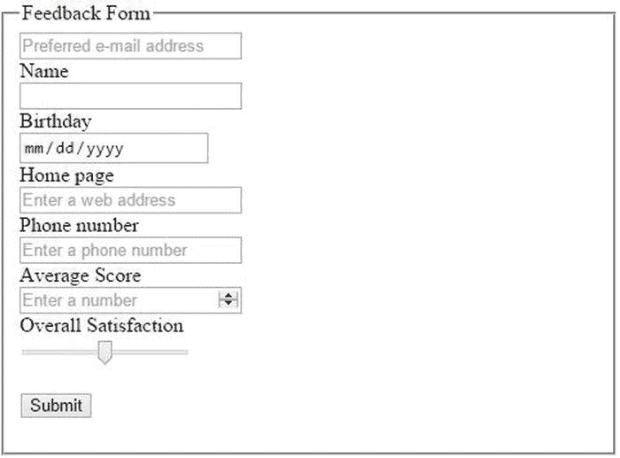

图 3-14。

The updated score and range control  

## 使用开源扩展

到目前为止，您已经创建了两个基于定制助手方法的编辑器模板和四个基于`TextBox()`方法的简单模板。然而，除了这些，你可能还需要一些其他的模板。在你花时间去实现它们之前，你可能想知道是否有人已经为你做了这些。嗯，答案是肯定的。

有许多第三方库和工具可供您使用。Visual Studio 提供了一个名为 NuGet 的包管理器，可以很容易地找到、下载、安装和管理这些第三方包。我将向您展示如何使用 NuGet 来安装一个编辑器模板包，这样您就不必自己编写它们了。当然，现在你已经知道如何写你自己的了，如果其中的任何一个不像你希望的那样工作，你可以自由地这样做。

EXERCISE 3-7\. INSTALLING EDITOR TEMPLATESWhen the third-party package is installed, it will prompt you before overwriting any existing templates. So before you begin, you should delete the existing editor templates. Delete all of the files in the `EditorTemplates` folder except for `Range.cshtml` (the third-party package does not include this template).   In Visual Studio, with the Chapter3 project still open, choose Tools and NuGet Package Manager and Manage NuGet Packages for Solution.   This will display the Manage NuGet Packages dialog box. If you select Installed in the Filter drop-down, it will list the packages currently installed. You might be surprised to find that quite a few have already been installed by the project template. The blue icon to the right of each package indicates whether there is an update available for it, as demonstrated in Figure 3-15.

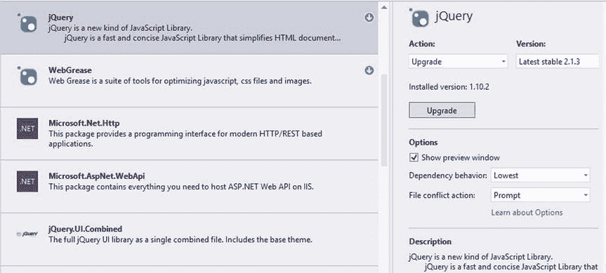

图 3-15。

Listing the installed packages   Change the Filter drop-down to All, and enter html5 editor templates in the search field.   Select the package named Html5EditorTemplates, as shown in Figure 3-16. The pane on the right displays details of this package including author, description, and links for more information.

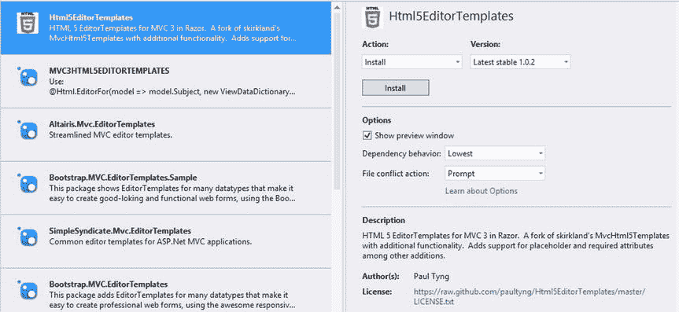

图 3-16。

Selecting the Html5EditorTemplates package   Click the Install button.   Once the install has completed, you should now see quite a few templates in the `EditorTemplates` folder. Open the `EmailAddress.cshtml` file. Listing 3-8 shows the third-party implementation for this template. While this is implemented differently from yours, it accomplishes basically the same thing, including getting the placeholder from the metadata.  

清单 3-8。开源电子邮件模板

`@{`

`var attributes = new Dictionary<string, object>();`

`attributes.Add("type", "email");`

`attributes.Add("class", "text-box single-line");`

`attributes.Add("placeholder", ViewData.ModelMetadata.Watermark);`

`//since this is a constraint, IsRequired and other constraints`

`//won't necessarily apply in the browser, but in case script`

`//turns off readonly we want the constraints passed`

`if (ViewData.ModelMetadata.IsReadOnly)`

`{`

`attributes.Add("readonly", "readonly");`

`}`

`if (ViewData.ModelMetadata.IsRequired)`

`{`

`attributes.Add("required", "required");`

`}`

`}`

`@Html.TextBox("", ViewData.TemplateInfo.FormattedModelValue, attributes)`

Press F5 to debug the Feedback page, which should look like Figure 3-17.

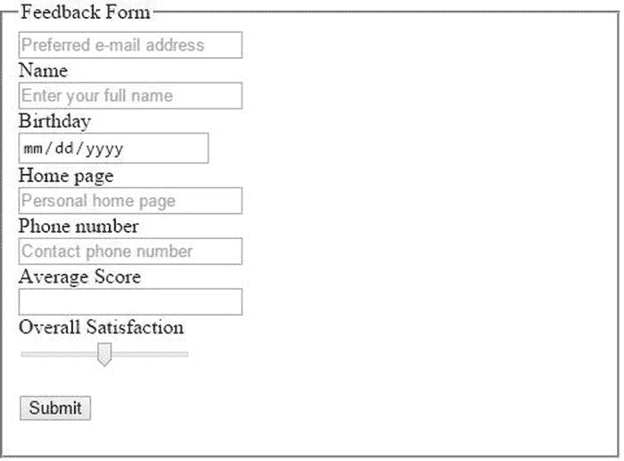

图 3-17。

The feedback page using third-party templates  

## 添加文本 HTML

使用`Html`助手类，包括`EditorFor()`方法，是用 ASP.NET MVC 实现表单的推荐方法。这提供了与模型的紧密集成，包括模型元数据和关注点的分离(业务规则和用户体验)。但是，您总是可以在视图中嵌入实际的 HTML 标记。一个合适的用法是包含静态内容或没有连接到模型的控件，比如进度条。

我现在将演示三个例子，每个例子都使用直接 HTML 标记将一个新的 HTML5 控件插入到反馈表单中。

*   范围
*   进步
*   米

### 添加范围控件

您已经使用自定义编辑器模板包含了一个`range`控件。现在，您将通过简单地添加适当的 HTML 标记来插入另一个。出于好玩，您将通过将变换设置为旋转 90 度，使其成为垂直滑块。为此，将清单 3-9 中粗体显示的代码添加到`Feedback.cshtml`视图中。

Caution

如果高度大于宽度，Opera 以前的版本会垂直呈现一个`range`控件。当前版本(在撰写本文时)没有做到这一点。在如何实现这一点上，浏览器实现之间似乎没有什么共识。我发现使用`transform`属性是实现这一点的最一致的方式。我将在第四章的中更详细地解释转换。

Listing 3-9\. Adding a range Control in HTML

`<fieldset>`

`. . .`

`
`

`@Html.LabelFor(m => m.Satisfaction)`

`
`

`
`

`@Html.EditorFor(m => m.Satisfaction)`

`
`

`
`

`Custom range`

`<input type="range" id="CustomRange" name="CustomRange"`

`class="range"`

`style="width: 100px; height: 30px; transform: rotate(90deg)"`

`min="0" max="200" step="20" />`

`
`

`
`

`<input type="submit" value="Submit" />`

`
`

`</fieldset>`

保存您的更改，然后按 F5 进行调试。该表格应如图 3-18 所示。

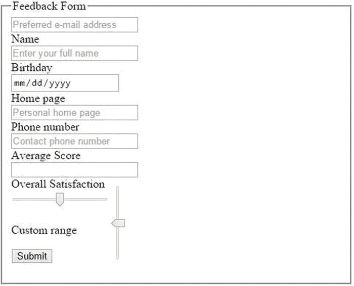

图 3-18。

Adding a vertical range control Note

该控件的值不是模型的一部分，不会与表单一起保存。如果控件仅用于帮助用户体验，并且不需要保持，这是合适的。例如，它可以控制视频或音频剪辑的音量。

### 添加进度条

接下来，您将通过在表单中插入一个`progress`标签来添加一个进度条。在提交按钮后添加以下粗体代码:

`
`

`<input type="submit" value="Submit" />`

`
`

`
`

`<progress id="FormProgress" value="60" max="100">`

`<strong>Progress: 60%</strong>`

`</progress>`

`
:`

`</fieldset>`

进度标签不支持`min`属性，只支持`max`属性。最小值被假定为零。`value`属性指定了当前的进度。按 F5 调试应用并导航到反馈表单。进度应如图 3-19 所示。

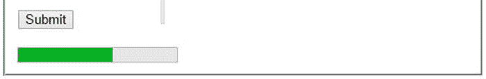

图 3-19。

The progress control in Opera

标签内的内容用于不支持标签的浏览器。例如，在 IE9 中，表单看起来如图 3-20 所示。

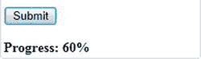

图 3-20。

The progress control in IE9

### 更新进度条

但是，一个静态的进度条不是很有趣；人们甚至会发现一个进度条，它永远不会变得令人沮丧。现在，您将添加一些 JavaScript 代码，以便在表单上的字段被输入时更新进度条。

首先，您将创建一个名为`calculateProgress()`的函数，它遍历所有输入字段，查看哪些字段有值。有六个字段，因此您将为每个字段赋值 17 (6 × 17 = 102)。将该值设置为任何大于 100 的值都会显示为 100%完成。这段代码使用了`document.getElementsByClassName()`选择器，它返回具有指定 class 属性的所有元素。在这种情况下，您需要具有`text=box single-line`类的元素。然后，该函数使用计算出的值更新进度条的值。

然后，每当输入字段发生变化时，您都需要调用这个函数。为此，您将创建一个名为`bindEvents()`的函数，并使用同一个`getElementsByClassName()`选择器。这一次，您将使用`addEventListener()`函数将`calculateProgress()`函数绑定到`onChange`事件。最后，您将调用`onLoad`事件处理程序中的`bindEvents()`函数。

将列表 3-10 中的粗体代码输入反馈表。

Listing 3-10\. Adding JavaScript to Update the Progress Bar

`<head>`

`<meta name="viewport" content="width=device-width" />`

`<title>Feedback</title>`

``

`</head>`

`<body``onload="bindEvents();"`

Note

在计算进度时，这段代码忽略了用于`Satisfaction`字段的`range`控件以及总分数。这样做是因为这些控件总是有一个值，所以你不能告诉一个值是什么时候“输入”的

此外，将`progress`标签的初始值属性从 60 更改为 0，如下所示:

`<progress id="FormProgress" value=``"0"`

按 F5 调试应用。当您在输入字段中输入值时，请注意进度条会自动更新，如图 3-21 所示。

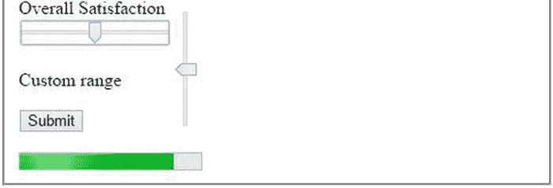

图 3-21。

The progress and range controls in Chrome Tip

正如我提到的，当浏览器不支持`progress`控件时，会显示`progress`标签中的文本。您可以用 JavaScript 动态更新它；但是，如果不支持，您也可以将其留空，不显示进度。

### 使用仪表控制

对于最后一个示例，您将添加一个仪表控件，它类似于进度条。血糖仪允许您在启用状态指示器颜色编码的范围内定义间隔。例如，考虑汽车上的油压表。“正常”范围显示在仪表上，低值或高值突出显示。我不需要知道油压是多少，甚至不需要知道油压应该是多少；我只想知道是否在正常范围内。

与`range`控件一样，`meter`控件支持`min`和`max`属性以及当前的`value`。它还提供了定义正常范围的`low`、`high`和`optimum`属性。以粗体输入以下代码:

`
`

`<progress id="FormProgress" value="0" max="100">`

`<strong>Progress: 60%</strong>`

`</progress>`

`
`

`
`

`<meter id="Meter" value="50" min="20" max="120"`

`low="50" high="100" optimum="75">`

`<strong>Meter:</strong>`

`</meter>`

`
`

`</fieldset>`

为了演示不同的值是如何显示的，您将添加一些 JavaScript 代码，每秒钟用一个随机值更新控件。为此，将以下粗体代码添加到`bindEvents()`函数中:

`function bindEvents() {`

`var fieldList = document.getElementsByClassName("text-box single-line");`

`for (var i = 0; i < fieldList.length; i++) {`

`fieldList[i].addEventListener("change", calculateProgress, false);`

`}`

`setInterval(function () {`

`var meter = document.getElementById("Meter");`

`meter.value = meter.min + Math.random() * (meter.max - meter.min);`

`}, 1000);`

`}`

这段代码使用了`setInterval()`函数，所以每隔 1000 毫秒就调用一次匿名函数。按 F5 启动应用。根据数值的不同，颜色会由绿色变为黄色，如图 3-22 所示。

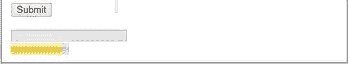

图 3-22。

The meter control

## 摘要

如果你已经迷失在各种更新中，清单 3-11 展示了`Feedback.cshtml`视图的完整实现。

Listing 3-11\. The Final Feedback.cshtml Implementation

`@model Chapter``3`

`@{`

`Layout = null;`

`}`

`<!DOCTYPE html>`

`<html>`

`<head>`

`<meta name="viewport" content="width=device-width" />`

`<title>Feedback</title>`

``

`</head>`

`<body onload="bindEvents();">`

`
`

`@using (Html.BeginForm((string)ViewBag.FormAction, "Home"))`

`{`

`<fieldset>`

`<legend>Feedback Form</legend>`

`
`

`@Html.EditorFor(m => m.Email)`

`
`

`
`

`@Html.LabelFor(m => m.Name)`

`
`

`
`

`@Html.EditorFor(m => m.Name)`

`
`

`
`

`@Html.LabelFor(m => m.Birthday)`

`
`

`
`

`@Html.EditorFor(m => m.Birthday)`

`
`

`
`

`@Html.LabelFor(m => m.Homepage)`

`
`

`
`

`@Html.EditorFor(m => m.Homepage)`

`
`

`
`

`@Html.LabelFor(m => m.Phone)`

`
`

`
`

`@Html.EditorFor(m => m.Phone)`

`
`

`
`

`@Html.LabelFor(m => m.Score)`

`
`

`
`

`@Html.EditorFor(m => m.Score)`

`
`

`
`

`@Html.LabelFor(m => m.Satisfaction)`

`
`

`
`

`@Html.EditorFor(m => m.Satisfaction)`

`
`

`
`

`Custom range`

`<input type="range" id="CustomRange" name="CustomRange"`

`class="range vertical"`

`style="width: 100px; height: 30px; transform: rotate(90deg)"`

`min="0" max="200" step="20" />`

`
`

`
`

`<input type="submit" value="Submit" />`

`
`

`
`

`<progress id="FormProgress" value="0" max="100">`

`<strong>Progress: 0%</strong>`

`</progress>`

`
`

`
`

`<meter id="Meter" value="50" min="20" max="120"`

`low="50" high="100" optimum="75">`

`<strong>Meter:</strong>`

`</meter>`

`
`

`</fieldset>`

`}`

`
`

`</body>`

`</html>`

在这一章中，你在 ASP.NET MVC 项目中使用了一些新的 HTML5 输入类型。与传统的 Web 表单项目一样，您必须做一些额外的工作来使用它们，但是合并新的 HTML5 特性是相当容易的。特别是，MVC 框架被设计成可扩展的，这为构建 HTML5 应用提供了一个干净的平台。

MVC 模式提供了定义表单上使用的数据元素的模型。通过在模型中包含一些元数据属性，然后提供定制模板，您可以利用 HTML5 语义特定的控件。您可以下载并安装开源扩展，从而轻松构建符合 HTML5 的应用。然而，在这一章中，我向你展示了如何构建你自己的自定义助手扩展和编辑器模板。如果您发现自己处于一种独特的情况，需要一个特定的实现，那么您总是可以构建自己的实现。

使用 MVC Razor 视图引擎，您还可以包含文字 HTML 标记，这样您就可以最终控制用户体验。我还介绍了两个新的 HTML 控件，`progress`和`meter`，并演示了如何通过一些简单的 JavaScript 操作它们。