# 四、级联样式表

在第二章第一章和第三章第三章中，我向你展示了一些新的 HTML 元素以及如何在 ASP.NET 应用中使用它们。HTML5 的第二个主要方面包括样式表的改进。正如我在第一章中解释的，CSS3 推荐标准被分解成 50 多个模块，其中大部分仍在草案中(在撰写本文时)。然而，大多数浏览器已经提供了相当多的新功能。

在这一章中，我将演示许多更有用的特性。我将从解释创建样式表的基础开始。如果你有一些 CSS 的经验，这可能看起来像是复习，但其中一些是 CSS3 的新内容，尤其是选择器，它在 CSS3 中得到了显著的改进。然后，您将使用一些新的结构元素创建一个单独的 web 页面，比如`nav`、`aside`和`footer`。页面内容完成后，我将解释一些你可以用 CSS 做的有趣的事情。

## 查看样式语法

样式表由一组规则组成。每个规则由一个选择器和一个或多个声明组成，选择器指示规则适用于哪些元素。每个声明都包含一个属性值对。使用以下语法指定规则:

`<selector> {<property:value>; <property:value>; ... }`

例如，如果您希望所有段落标签使用绿色 12px 字体，则规则如下所示:

`p {color:green; font-size:12px;}`

与 HTML 一样，样式表中的空白会被忽略，因此这条规则也可以写成如下形式:

`p`

`{`

`color:green;`

`font-size:12px;`

`}`

我将在本章的其余部分使用这种格式，因为我认为它更容易阅读。

### 使用选择器

从文档中选择元素有很多不同的方法，CSS3 规范几乎是这个列表的两倍。我将概述可用的选择器。其中许多将在本章的后面演示。

#### 元素选择器

我刚刚展示的第一个是元素选择器。要使用它，只需指定元素类型，如`p`、`h1`、`input`、`ol`、`div`等等。HTML5 引入了大量新标签，您可以在应用样式时加以利用。这些特定于上下文的元素，如`article`、`footer`和`nav`，更清楚地传达了它们的目的，因此更有可能将一致的格式应用于所有页面。这些新元素类型如下:

*   `article`:内容的独立部分，例如博客条目
*   `aside`:内容通常放在页面的一边；通常用于相关信息
*   `details`:用于根据用户输入隐藏或显示的可扩展内容
*   `figcaption`:与`figure`一起使用，将标题与图像相关联
*   `figure`:用于包装嵌入内容，如图像或图形
*   `footer`:页面或章节页脚
*   `header`:页面或章节标题
*   `hgroup`:用于对`h1`、`h2`等表头元素进行分组
*   `nav`:用于包含导航链接
*   `output`:包含输出，例如用户操作的结果
*   `section`:用于将内容组织成逻辑部分
*   `summary`:通常与一个或多个`details`元素结合使用

#### 使用组合子

如果要将相同的声明应用于多个元素类型，可以按如下方式对它们进行分组:

`p, h1, h2`

`{`

`color:green;`

`font-size:12px;`

`}`

逗号(，)字符用作逻辑或运算，例如，“类型为`p`或`h1`或`h2`的所有元素”。这只是选择器组合子的一个特例。您还可以组合选择器来指定某些元素层次结构。通过将元素与下列运算符之一组合，可以创建更复杂的选择器:

*   `,`(例如`p, h1`):选择所有`p`元素和所有`h1`元素。
*   space(例如，`header p`):当第二个元素位于第一个元素内部时，选择第二个元素。例如，如果您想要一个`header`元素中的所有`p`元素，使用`header p`。`header`元素不一定是直接的父元素，只是在节点的父元素中的某个地方。
*   `*`(例如`header*p`):当第二个元素是第一个元素的孙元素或后续元素时，选择第二个元素。
*   `>`(例如`header>p`):当第一个元素是直接父元素时，选择第二个元素。`header>p`选择器返回其父元素(直接)是`header`元素的所有`p`元素。
*   `+`(例如`header+p`):当第一个元素是前面的兄弟元素时，选择第二个元素。
*   `∼`(例如`p∼header`):在第一个元素之后选择第二个元素(不一定是立即)。

为了说明最后两个，如果您的文档如下所示，`h1+p`选择器不会返回任何元素，但是`h2+p`和`h1∼p`都将返回`p`元素:

`<h1>Some header</h1>`

`<h2>Some sub-header</h2>`

`
Some text
`

#### 类别和 ID 选择器

类选择器允许您选择具有特定`class`属性的元素。因此，class 属性通常被称为 CSS 类。类选择器是通过在类名前面加一个点(.)像这样:

`.featured`

`{`

`background-color:yellow;`

`}`

这将为所有具有`class="featured"`属性的元素应用背景色。类选择器查找与选择器值匹配的整个单词。像`class="the featured article"`一样，一个元素在`class`属性中可以有多个单词，并且`.featured`选择器将返回它。

Caution

在 HTML 文档中，`class`属性是一个字符串，它可以有你想要给它的任何值。但是，为了能够在类选择器中使用它，它不能有任何空白或其他与 CSS 语法不兼容的字符。例如，您不能在类选择器中选择整个`class="featured content"`。如果你真的想要一个特色内容的类，使用`featured_content`或`featuredContent`。然而，你不能用一个类选择器只选择`featured`。相反，您需要使用一个属性选择器，我将在后面演示。

ID 选择器的工作方式类似于类选择器，只是它使用了`id`属性而不是`class`，并且在它前面加上了一个哈希符号(`#`，如下所示:

`#Submit`

`{`

`color:blue;`

`}`

ID 选择器根据元素的唯一 ID 来指定单个元素，因此，根据定义，该样式不会被重用。最好是基于元素或类来定义样式，这样相似的元素可以用相同的方式进行样式化。ID 选择器应该尽量少用，只在不需要重用样式的特殊情况下使用。

#### 使用属性选择器

属性选择器为您提供了很大的灵活性，允许您根据元素的任何属性来选择元素。这些被指定为`[attribute=value]`，如下所示:

`[class="book"]`

`{`

`background-color:yellow;`

`}`

这在功能上等同于使用`.book`类选择器；但是，属性选择器允许您仅使用属性值的一部分进行选择。为此，请在等号(`=`)前添加以下内容之一:

*   `∼`(例如`[class∼="book"]`):属性值必须包含选择器值指示的单词(例如`class="some` `book` `titles"`)。这正是类选择器的工作方式。
*   |(例如，`[class|="book"]`):属性值必须以匹配选择器值的单词开头(例如，`class="` `book` `titles"`)
*   `^=`(例如`[class^="book"]`):属性值必须以选择器值开头(例如`class="` `book` `s"`)
*   `$`(例如`[class$="book"]`):属性值必须以选择器值结尾(例如`class="check` `book` `"`)
*   `*`(例如`[class*="book"]`):属性值必须包含选择器值(例如`class="over` `book` `ed"`)

您可以指定不带值的属性，这将返回具有该属性的所有元素。一个很好的例子是`[href]`选择器，它将选择所有具有`href`属性的元素，不管其值如何。您还可以在属性选择器之前包含一个元素选择器，以进一步限制选定的元素。例如，`img[src^="https"]`将返回所有`src`属性以`https`开头的`img`元素。

#### 伪类选择器

相当多的选择器基于元素的动态属性。例如，考虑一个超链接。如果链接引用的页面已经显示，链接通常以不同的颜色显示。这是通过使用 CSS 规则实现的，CSS 规则使用如下的`visited`属性:

`a:visited`

`{`

`color: purple;`

`}`

这将改变设置了`visited`标志的所有`a`元素的颜色。这些选择器中有几个已经存在一段时间了，但是 CSS3 定义了相当多的新选择器。以下是完整的列表:

*   `:active`:选择活动链接
*   `:checked`:选择选中的元素(适用于复选框)
*   `:disabled`:选择当前禁用的元素(通常用于输入元素)
*   `:empty`:选择没有子元素的元素(不选择包含文本的元素)
*   `:enabled`:选择启用的元素(通常用于输入元素)
*   `:first-child`:选择其直接父元素的第一个子元素
*   `<tag>:first-of-type`:选择其父元素中第一个指定类型的元素
*   `:focus`:选择当前有焦点的元素
*   `:hover`:选择鼠标当前悬停的元素
*   `:in-range`:选择值在指定范围内的输入元素
*   `:invalid`:选择没有有效值的输入元素
*   `:lang(value)`:选择具有以指定值开始的`lang`属性的元素
*   `:last-child`:选择作为其父元素中最后一个子元素的元素
*   `:link`:选择所有未访问的链接
*   `<tag>:last-of-type`:选择其父元素中指定类型的最后一个元素
*   `:nth-child(n)`:选择其父元素中的第 n 个子元素
*   `:nth-last-child(n)`:选择其父元素中的第 n 个子元素，反向计数
*   `<tag>:nth-last-of-type(n)`:在父级中选择指定类型的第 n 个子级，反向计数
*   `<tag>:nth-of-type(n)`:选择其父级中指定类型的第 n 个子级
*   `:only-child`:选择其父元素的唯一子元素
*   `<tag>:only-of-type`:选择其父元素中指定类型的唯一兄弟元素
*   `:optional`:选择不需要的输入元素(即没有`required`属性)
*   `:read-only`:选择具有`readonly`属性的输入元素
*   `:read-write`:选择没有`readonly`属性的输入元素
*   `:required`:选择具有`required`属性的输入元素
*   `:root`:选择文档的根元素
*   `:target`:选择具有目标属性的元素，其中目标是活动元素
*   `:valid`:选择具有有效值的输入元素
*   `:visited`:选择所有访问过的链接

`nth-child(n)`选择器计算父元素的所有子元素，而`nth-of-type(n)`只计算指定类型的子元素。这里的区别是微妙但重要的。对于`only-child`和`only-of-type`选择器也是如此。

Caution

有四个伪类可以与锚(`a`)元素一起使用(`:link`、`:visited`、`:hover`和`:active`)。如果使用多个，它们应该在样式规则中按此顺序出现。例如，如果使用了`:link`和`:visited`，则`:hover`必须在它们之后。同样，`:active`必须跟在`:hover`后面。

这些伪元素可用于返回选定元素的一部分:

*   `:first-letter`:选择每个选中元素的第一个字符
*   `:first-line`:选择每个选中元素的第一行
*   `:selection`:返回用户选择的元素部分

您可以将`:before`或`:after`限定符添加到选择器中，以便在文档中所选元素之前或之后插入内容。使用`content:`关键字来指定内容并包含任何所需的样式命令(样式仅适用于插入的内容)。比如要加上“重要！”在紧跟在`header`标签之后的每个`p`标签之前，使用以下规则:

`header+p:before`

`{`

`content:"Important! ";`

`font-weight:bold;`

`color:red;`

`}`

您还可以在选择器前面加上`:not`来返回所有未选中的元素。例如，`:not(header+p)`选择除了紧跟在`header`标签后面的`p`标签之外的所有元素。

#### 理解工会

您还可以通过用逗号分隔复杂的选择器，将它们组合成逻辑 OR 关系。例如，我在本章前面展示的`p, h1, h2`选择器就是一个联合的例子。它将返回满足任何包含的选择器的所有元素。每个选择器可以是任何更复杂的类型。这也是一个有效的选择器:

`header+p, .book, a:visited`

它将返回所有元素，要么是紧跟在`header`元素之后的`p`元素，要么是带有图书`class`的元素，要么是已访问的`a`元素。

Tip

有关可用选择器的确切列表，请参见位于 [`www.w3schools.com/cssref/css_selectors.asp`](http://www.w3schools.com/cssref/css_selectors.asp) 的文章。

### 使用 CSS 属性

提供了所有这些选择器，以便您可以指定想要应用所需样式属性的适当元素。这才是 CSS 真正的肉。可用的 CSS 属性有数百个，我无法在此一一描述。在本章的剩余部分，我将演示许多更新的、更有用的特性。你会在 [`www.w3schools.com/cssref/default.asp`](http://www.w3schools.com/cssref/default.asp) 找到所有 CSS 属性的很好的参考。

### 使用供应商前缀

哦，生活在边缘的乐趣！与 HTML5 的其他领域一样，浏览器供应商将对 CSS 规范提供不同的支持。然而，在许多情况下，这些供应商在新属性成为官方推荐的一部分之前就实现了它们。事实上，CSS3 规范中包含的大部分内容已经可以从一个或多个浏览器中获得。

当浏览器供应商添加不属于 CSS3 建议的新功能时，该属性会被赋予一个特定于供应商的前缀，以指示这是一个非标准功能。如果这成为建议的一部分，前缀最终会被删除。为了利用一些较新的属性，您可能需要使用特定于供应商的属性，并且因为您希望您的页面在所有供应商上工作，所以您需要添加所有这些属性。例如，要指定边框半径，除了标准的`border-radius`属性，您可能还需要设置所有供应商特定的属性，如下所示:

`header`

`{`

`-moz-border-radius: 25px;`

`-webkit-border-radius: 25px;`

`-ms-border-radius: 25px;`

`border-radius: 25px;`

`}`

表 4-1 列出了最常见的前缀。还有其他的，但是这个表涵盖了绝大多数的浏览器。

表 4-1。

Vendor Prefixes

<colgroup><col> <col></colgroup> 
| 前缀 | 浏览器供应商 |
| --- | --- |
| `-moz-` | 火狐浏览器 |
| `-webkit-` | Chrome、Safari、Opera |
| `-ms-` | 微软公司出品的 web 浏览器 |

您不能盲目地假设所有带有供应商前缀的属性都与标准属性同名，只是添加了前缀，尽管大多数情况下确实如此。这里有一篇很好的文章，列出了许多特定于供应商的属性: [`http://peter.sh/experiments/vendor-prefixed-css-property-overview`](http://peter.sh/experiments/vendor-prefixed-css-property-overview) 。遗憾的是，此页面已有一段时间没有更新，可能已经过时。如果您发现某个标准属性在特定的浏览器中不起作用，您可能需要做一些研究，看看他们的开发人员的网站上是否有前缀属性。例如，使用 Webkit 扩展的链接: [`https://developer.mozilla.org/en-US/docs/Web/CSS/Reference/Webkit_Extensions`](https://developer.mozilla.org/en-US/docs/Web/CSS/Reference/Webkit_Extensions) 。

Caution

您应该始终将标准属性列在最后，这样它将覆盖特定于供应商的版本。有些浏览器会支持这两者，虽然大多数时候实现是相同的，但有时特定于供应商的版本表现不同。

### 了解盒子模型

文档中的每个元素都占用一定的空间，这取决于该元素的内容。此外，填充和边距等因素也会对此产生影响。填充是内容和元素边框之间的空间。边距是边框和相邻元素之间的空间。如图 4-1 所示。

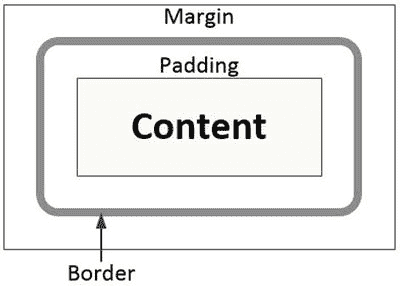

图 4-1。

The box model

您可以使用`margin`声明来指定边距，并以像素或页面大小的百分比来指定值。您可以使用`margin-top`、`margin-right`、`margin-bottom`和`margin-left`声明单独指定上边距、右边距、下边距和左边距，或者使用`margin`声明指定所有四个值(按此顺序—上边距、右边距、下边距和左边距)。您也可以使用带有单个值的`margin`声明，这会将所有四个边距都设置为该值。如果您传递两个值，第一个将设置上边距和下边距，第二个将指定左边距和右边距。使用`padding`声明以同样的方式设置填充。

确定使用的空间时，记得包括边框宽度。例如，如果填充设置为 10px，边距设置为 5px，边框宽度设置为 3px，则使用的空间(除实际元素内容之外)将为(2 * 10) + (2 * 5) + (2 * 3) = 36px。

### 应用样式规则

样式是从各种来源以几种不同的方式指定的，顾名思义，它们是级联的，或者说是继承的。理解这是如何工作的很重要，特别是当有冲突的声明时。

#### 包括样式规格

样式表有三个来源:

*   作者:这些是 web 开发人员创建的样式表，也是您在提到样式表时通常会想到的。
*   用户:用户也可以创建一个样式来控制网页的显示方式。
*   用户代理:用户代理(web 浏览器)将有一个默认的样式表。例如，如果您创建一个没有样式规则的文档，浏览器将使用默认字体系列和大小显示内容。这些实际上是在特定于浏览器的样式表中定义的。

对于作者样式，这是您可以控制的唯一来源，有三种方法可以在 HTML 文档中包含样式规则。

*   内联:样式是使用`style`属性直接在元素中设置的，比如:`
This is red text
`。当然，使用这种方法，不需要使用选择器，因为样式只适用于当前元素(以及所有子元素)。
*   内部:可以使用`style`元素将样式规则包含在实际的 HTML 文档中。这通常放在`head`标签中，并应用于整个文档。以这种方式定义的样式将需要一个选择器来指示应该在哪些元素上使用该样式。这种方法有时被称为嵌入式样式。
*   外部:应用样式最常见的方式是将所有的样式规则放在一个扩展名为`.css`的单独文件中。样式规则的格式就像内部样式一样。使用外部样式表的明显好处是同一组规则可以应用于多个页面。每个页面都引用了这个带有`link`元素的样式表，比如:`<link rel="stylesheet" type="text/css" href="MyStyleSheet.css"`

#### 级联规则

当呈现页面时，浏览器必须处理来自所有这些来源的样式，以确定每个元素的适当样式。当存在冲突规则时，作者样式表优先于用户样式表，用户样式表优先于用户代理样式(浏览器默认)。可以使用我前面解释的三种方法(内联、内部和外部)来指定作者样式。在作者样式中，内联声明优先于内部声明和外部样式表。如果一个页面使用了一个内部的`style`元素，同时也使用了`link`元素来包含一个外部样式表，那么只要内部声明在`link`元素之后，它就会覆盖外部样式表中的冲突规则。

Caution

如果外部样式表在`style`标签后被引用，它将优先于内部样式。如果您既有外部样式表又有内部的`style`元素，那么您应该首先引用外部的样式表，这样优先级规则才能按预期工作。

此外，考虑到即使在单个样式表中也可能存在冲突声明。例如，样式表可能包括以下内容:

`p`

`{`

`color: black;`

`}`

`header p`

`{`

`color: red;`

`}`

一个`header`元素内的一个`p`元素被两个规则选中，那么使用哪个呢？在这种情况下，特殊性规则适用，它规定使用更具体的选择器，即`header p`选择器。在所有可用的选择器中，确定哪一个更具体并不像您想象的那样简单。ID 选择器被认为比类或属性选择器更具体，而类或属性选择器又比元素选择器更具体。如果只有元素选择器，那么元素最多的规则优先，所以包含两个元素的`header p`比只有`p`更具体。

最后，如果同一个选择器用不同的声明在同一个样式表中使用了两次会怎么样？假设`p { color:black; }`出现在样式表中，稍后`p { color:green }`出现。在这种情况下，最后出现的规则优先，因此您会看到绿色文本。

#### 使用重要关键字

一种“王牌”是`important`关键字。如果在样式规则中使用，这将超越所有其他规则。您可以像这样添加`important`关键字:

`p`

`{`

`color: red;`

`!important;`

`}`

如果两个冲突的规则都有`important`关键字，那么优先级是基于我已经提到的规则确定的。然而，有一个显著的区别。通常，作者样式表中的规则会覆盖用户样式表中的规则。如果他们有`important`关键字，这是相反的；用户样式表将覆盖作者规则。乍一看，这似乎很奇怪，但它有一个重要的应用。这允许用户覆盖某些属性的作者样式。例如，有视觉障碍的人可能需要增加字体大小。标签`important`将确保这个样式不会被覆盖。

Caution

您可能会尝试使用`important`关键字来快速修复并覆盖级联样式规则。有了我刚刚描述的所有优先规则，您不应该需要这样做。我建议将此作为最后的手段。过度使用`important`关键字会使你的样式表难以维护。

## 创建网页

在这一章的剩余部分，我将向你展示如何构建一个单独的网页来展示 CSS 的许多新特性。为了多样化，我将使用 WebMatrix 应用而不是 Visual Studio 来创建单个网页。样式规则将使用内部的`style`元素，所以一切都可以放在一个文件中。少量的 JavaScript 也将包含在单个文件中。

我将在这个项目中使用 Chrome 浏览器，因为它支持我将演示的大多数 CSS 功能。在撰写本文时，其他浏览器还不支持这些特性中的一个或多个。当你读到这篇文章时，其他浏览器可能也支持这些。

Note

我在第一章中解释了如何安装 WebMatrix 应用。这是微软提供的免费下载。如果您愿意，也可以使用 Visual Studio 和 MVC 项目模板来实现网站。使用`Index.cshtml`文件遵循本章剩余部分的说明，你可以在`Views\Home`文件夹中找到这个文件，而不是`Default.cshtml`。也可以从 [`www.apress.com`](http://www.apress.com/) 下载源代码中包含的完整的 Visual Studio 项目。

### 规划页面布局

在创建一个新的网页之前，最好先勾画出基本的网页结构。这将帮助您可视化整体布局，并了解元素是如何嵌套在一起的。

你将在本章中开发的页面将在顶部使用`header`和`nav`元素，在底部使用`footer`元素。中间的主要区域将使用一个`div`元素，并有两个并排的区域，每个区域都有一系列的`article`标签。较大的区域将被另一个`div`元素包围，并提供组织成文章的主要内容。右边较小的区域将使用一个`aside`元素并包含一个`section`元素。这将包含一系列呈现相关信息的`article`元素。图 4-2 展示了页面布局。

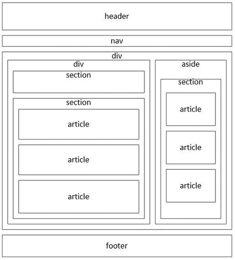

图 4-2。

Planning the page layout Note

此图显示了每个元素之间的空间，以便于理解。在实际的 web 页面中，在大多数情况下，这个空间是通过将`padding`属性设置为 0 来移除的。

### 创建 Web 项目

规划好内容后，您就可以开始构建网页了。首先，您将使用 WebMatrix 创建一个项目。然后，您将进入基本的页面结构，并向每个元素添加内容。稍后，我将展示如何实现样式规则。

启动 WebMatrix 应用，点击新建图标，然后点击模板图库按钮，如图 4-3 所示。

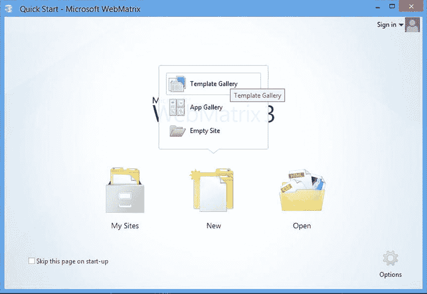

图 4-3。

Launching the WebMatrix application Tip

为了便于将来参考，App Gallery 按钮将显示一个相当大的预构建 web 应用列表，您可以下载并使用它来构建您的 web 项目。这包括 WordPress、Joomla 和 Drupal 等软件包。

有几个模板可供选择。例如，起始站点模板将创建一个 ASP.NET MVC 项目。对于本章，您将使用空站点模板。选择此项，进入章节 4 作为站点名称，如图 4-4 所示。单击“确定”按钮创建项目。

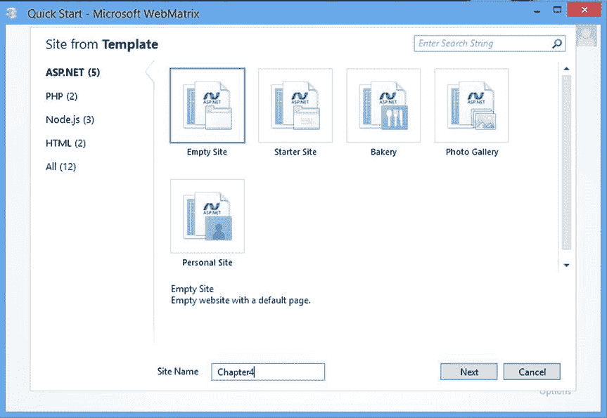

图 4-4。

Selecting the Empty Project template

创建项目后，单击导航窗格中的“文件”按钮。为您创建的文件和文件夹应该如图 4-5 所示

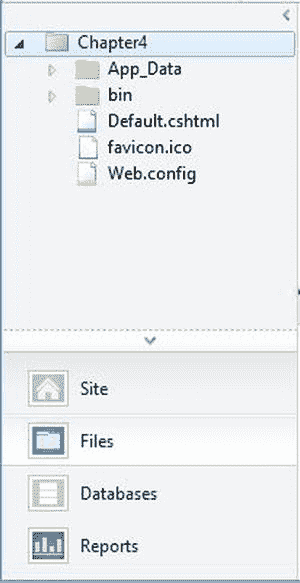

图 4-5。

The initial files and folders

应该有一个名为`Default.cshtml`的网页。双击导航页面中的文件名将其打开。最初的内容如下所示:

`@{`

`}`

`<!DOCTYPE html>`

`<html lang="en">`

`<head>`

`<meta charset="utf-8" />`

`<title>My Site's Title</title>`

`<link href="∼/favicon.ico" rel="shortcut icon" type="image/x-icon" />`

`</head>`

`<body>`

`</body>`

`</html>`

### 定义页面结构

我发现在添加内容之前先输入结构元素会有所帮助。这将让你有机会清楚地看到结构，不被实际内容所干扰。打开`Default.cshtml`文件，输入清单 4-1 中所示的元素。

Listing 4-1\. Entering the Page Structure

`<!DOCTYPE html>`

`<html lang="en">`

`<head>`

`<meta charset="utf-8" />`

`<title>``Chapter 4`

`</head>`

`<body>`

`<header class="intro">`

`</header>`

`<nav>`

`</nav>`

`
`

`
`

`<section class="rounded">`

`<header>`

`</header>`

`</section>`

`<section>`

`<article class="featuredContent">`

``

`<header>`

`</header>`

`
`

`
`

`</article>`

`<article class="otherContent">`

``

`<header>`

`</header>`

`
`

`
`

`</article>`

`<article class="otherContent">`

``

`<header>`

`</header>`

`
`

`
`

`</article>`

`</section>`

`
`

`<aside id="sidebar">`

`<section id="titles">`

`<article class="book">`

`<header>`

`</header>`

`</article>`

`<article class="book">`

`<header>`

`</header>`

`</article>`

`<article class="book">`

`<header>`

`</header>`

`</article>`

`<article class="book">`

`<header>`

`</header>`

`</article>`

`<article class="book">`

`<header>`

`</header>`

`</article>`

`</section>`

`</aside>`

`
`

`<footer>`

`</footer>`

`</body>`

`</html>`

这只是一个基本的 HTML 结构，你可以从图 4-2 中的图表推断出来。`article`元素被赋予了`class`属性，因为您将使用它进行样式化。我将`id`属性赋给了一些顶级元素。我还为每个主要内容文章添加了一个锚元素`()`。您将在`nav`元素中设置这些内容的导航链接。

### 添加内容

内容没什么特别的。它包含大量文本(主要是 Lorem ipsum)、一些图片和一些链接。

在导航窗格中，右键单击 `Chapter 4` 项目，然后单击新建文件夹链接。输入文件夹名称的图像。可下载的源代码中包含一个`Images.zip`文件。将图片从这个文件复制到项目中新的`Images`文件夹。

我建议下载内容，而不是手动输入。源代码中有一个`Default_content.cshtml`文件。用该文件中的代码替换您当前的实现。它只包含该页面的内容，没有定义任何样式。如果要手动输入内容，可以在附录 a 中找到。

Note

我想指出内容中的一个小细节。`footer`元素使用 HTML5 中添加的新的`time`元素。开始和结束标签之间的文本(2015 年 3 月 7 日)被显示，但是`datetime`属性包含一个机器可读的格式，可以被浏览器、搜索引擎或 JavaScript 使用。更多详情请看这篇文章: [`www.sitepoint.com/html5-time-element-guide`](http://www.sitepoint.com/html5-time-element-guide) 。

添加内容后，单击功能区中的 Run 按钮，查看页面目前的外观。应该类似于图 4-6 。

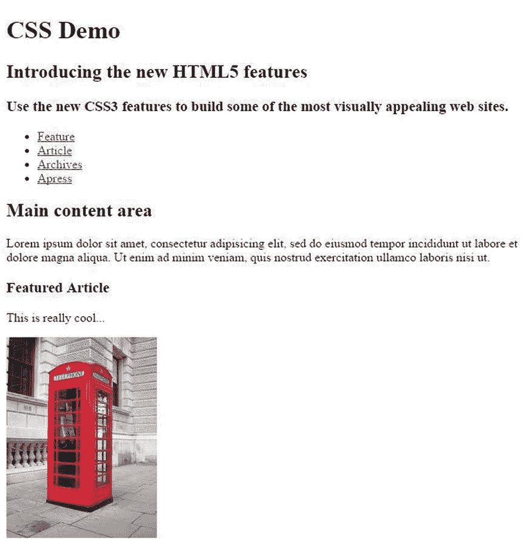

图 4-6。

The initial page with only default styles

## 实现样式规则

现在你到了有趣的部分，增加了风格。您可以使用大量的样式属性，我将展示一些对 CSS3 来说新的更有用的技术。其中许多样式已经使用了一段时间，但是在 CSS3 之前，它们的实现更加复杂，通常需要 JavaScript。在指定一些基本的样式规则后，我将向您展示如何使用更多的高级功能，包括以下内容:

*   圆角
*   渐变背景
*   桌子
*   多列
*   方框阴影
*   斑马条纹文本装饰
*   3D 转换
*   CSS 动画

### 添加基本样式

在开始添加新的样式特性之前，您需要定义基本的样式格式。在`Default.cshtml`文件顶部的`head`元素中添加一个`style`元素。然后添加清单 4-2 中所示的规则。同样，如果您愿意，您可以下载`Default_styled.cshtml`文件并从那里复制代码。

Listing 4-2\. Adding the Basic Styles

``

我不会说太多，因为这都是很标准的 CSS 东西。它主要使用元素选择器，偶尔使用类选择器。如果你现在预览你的网页，它看起来应该如图 4-7 所示。

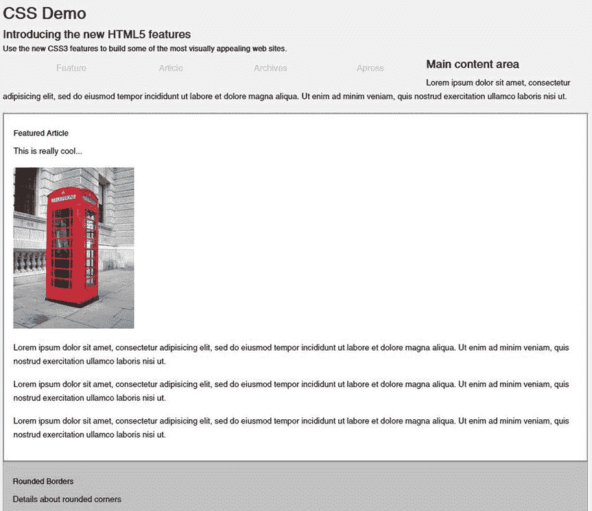

图 4-7。

The web page with only basic styling Note

为了简化示例代码，我将仅使用 Chrome 供应商前缀`-webkit-`，并且仅在当前版本(43)不支持标准属性时使用。我可以这样做，因为我希望这个页面只能在 Chrome 浏览器中运行。通常，您不能做出这种假设，需要包括所有的供应商前缀。

### 使用圆角

添加圆角用 CSS3 很容易做到；只需定义`border-radius`属性。你的网页将为`aside`、`nav`和`footer`元素以及`rounded`类的元素使用圆角。

Note

在第七章中，我将向你展示如何在不支持圆角功能的旧浏览器中实现圆角。读完那一章后，你可能会对浏览器中支持这样的特性有更好的理解。

将清单 4-3 中所示的规则添加到`style`元素的末尾。

Listing 4-3\. Using Rounded Borders

`/* Rounded borders */`

`.rounded`

`{`

`border: 1px solid;`

`border-color:#999999;`

`border-radius:25px;`

`padding: 24px;`

`}`

`aside`

`{`

`border: 1px solid #999999;`

`border-radius:12px;`

`}`

`/* Make the radius half of the height */`

`nav`

`{`

`height: 30px;`

`border-radius:15px;`

`}`

`footer`

`{`

`height: 50px;`

`border-radius:25px;`

`}`

对于`nav`和`footer`元素，由于它们是相当短的部分，您将设置半径为高度的一半。这会在两端形成一个半圆。顶部导航部分应该如图 4-8 所示。

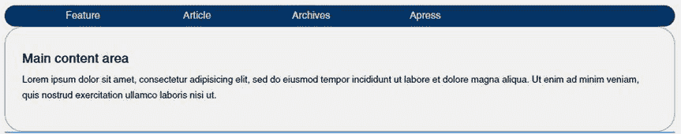

图 4-8。

Using rounded borders

### 使用渐变

使用 CSS3，您可以通过使用`linear-gradient`函数设置`background-image`属性来轻松创建渐变。使用此功能，您可以指定开始和结束颜色以及应用渐变的角度。你将在主标题中使用渐变，它有`intro`类。

在`style`元素的末尾添加以下规则:

`/* Gradients */`

`.intro`

`{`

`border: 1px solid #999999;`

`text-align: left;`

`padding-left: 15px;`

`margin-top: 6px;`

`border-radius: 25px;`

`background-image: linear-gradient(45deg, #ffffff, #6699cc);`

`}`

这将应用 45 度角的渐变。这也创建了一个圆形的边界。页面顶部现在应该如图 4-9 所示。

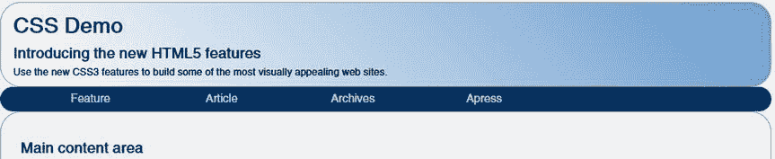

图 4-9。

Using a gradient background

### 创建表格

在标记中使用表格进行格式化通常被认为是不好的做法。这种格式最好在样式表中完成。如果需要不同的格式，可以更新样式。您可能已经注意到，当前 web 页面的主要内容后面有一个`aside`元素，而不是两个并排的元素。现在您将使用 CSS 设置一个表来纠正这种情况。

将清单 4-4 中所示的规则添加到`style`元素的末尾。

Listing 4-4\. Creating a Table

`/* Setup a table for the content and sidebar */`

`#contentArea`

`{`

`display: table;`

`}`

`#mainContent`

`{`

`display: table-cell;`

`padding-right: 2px;`

`}`

`aside`

`{`

`display: table-cell;`

`width: 280px;`

`}`

这些规则在顶级元素上设置了`display`属性。`contentArea`元素被设置为`table`，`mainContent`和`aside`元素被设置为`table-cell`。然后，这些元素被呈现为整个内容元素中的单元格。为了完成对齐，`mainContent`上的填充设置为 2px，`aside`元素的宽度设置为 280px。使用剩余空间自动计算`mainContent`的宽度。

页面布局现在应该如图 4-10 所示。

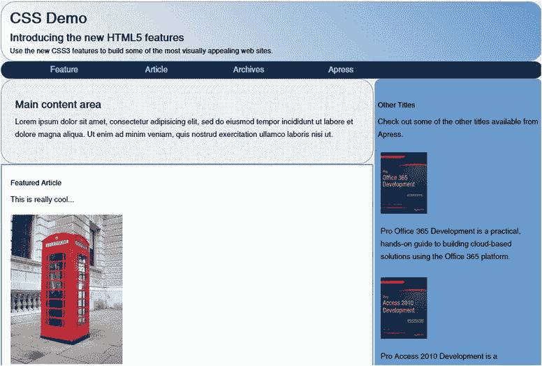

图 4-10。

The page layout with the sidebar on the right

### 添加列布局

CSS3 的另一个新特性是能够像在报纸或杂志上看到的那样将内容格式化成列。这是使用`column-count`属性完成的。您还应该指定定义列之间垂直间距的属性`column-gap`。

在`style`元素的末尾添加以下规则:

`/* Setup multiple columns for the articles */`

`.otherContent`

`{`

`text-align:justify;`

`padding:6px;`

`-webkit-column-count: 2;`

`column-count: 2;`

`-webkit-column-gap: 20px;`

`column-gap: 20px;`

`}`

文章现在应该被格式化为两列，如图 4-11 所示。

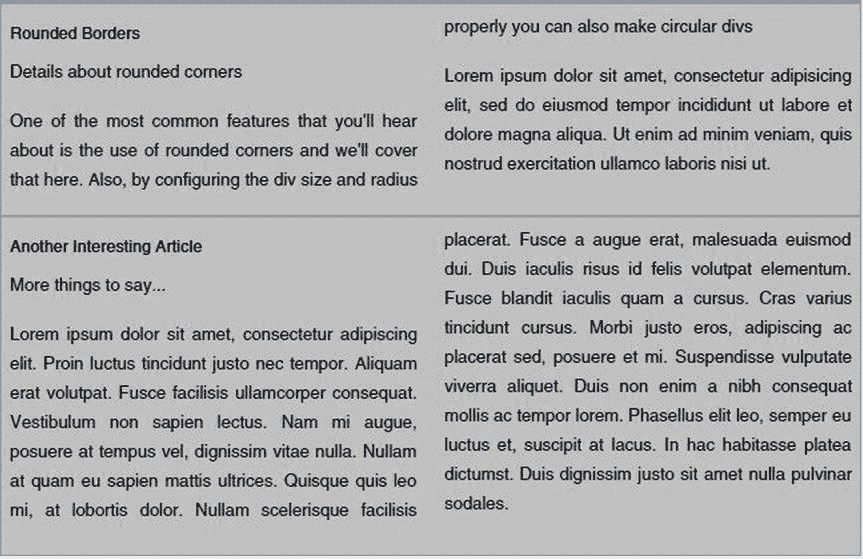

图 4-11。

Using two columns

### 添加方框阴影

图像可能看起来有点粗糙，添加阴影可以柔化外观，使页面在视觉上更具吸引力。使用`box-shadow`属性很容易添加阴影，该属性采用以下值:

*   水平位置:水平阴影的位置。如果是负数，阴影在左边。
*   垂直位置:垂直阴影的位置。如果为负，阴影在顶部。
*   模糊:阴影后模糊区域的大小。
*   扩散:阴影的宽度。
*   颜色:阴影的颜色。
*   插入:使图像看起来比周围区域低，使阴影位于图像上而不是图像外。

这些值在逗号分隔的列表中指定。它需要两到四个位置/大小值、一个可选的颜色属性和可选的`inset`关键字。只需要前两个，分别是水平和垂直位置。如果未指定，模糊和扩散值将默认为零。将以下规则添加到`style`元素的末尾:

`/* Add the box shadow */`

`article img`

`{`

`margin: 10px 0;`

`box-shadow: 3px 3px 12px #222;`

`}`

`.book img`

`{`

`margin: 10px 0;`

`display: block;`

`box-shadow: 2px 2px 5px #444;`

`margin-left: auto;`

`margin-right: auto;`

`}`

`aside`

`{`

`box-shadow: 3px 3px 3px #aaaaaa;`

`}`

`.book img`规则还包括`margin-left`和`margin-right`属性，它们都被设置为`auto`。这导致图像水平居中。图 4-12 和 4-13 显示了特色内容和侧边栏项目中图像的特写。请注意，第一个图像比侧边栏图像有更大的模糊区域。

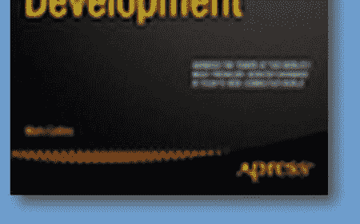

图 4-13。

The shadow on the sidebar images

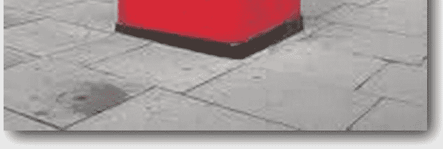

图 4-12。

The shadow of the phone in booth image the featured content section

### 使用斑马条纹

一种已经使用了很长时间的样式方法是在有项目列表时替换背景，这有时被称为斑马条纹。这可以追溯到旧的蓝条纸用于进入会计期刊。交替的背景使得区分每个项目变得更加容易。在 CSS3 之前，这是通过 JavaScript 来实现的，它会以编程的方式改变每个其他元素的背景。

CSS3 引入了`nth-child`选择器，它非常适合这个应用，因为它每隔 n 个元素返回一次。在将`n`设置为 2 的情况下使用它将返回所有其他元素。将以下代码添加到`style`元素的末尾:

`/* Stripe the title list */`

`#titles article:nth-child(2n+1)`

`{`

`background: #c0c0c0;`

`border: 1px solid #6699cc;`

`border-radius: 10px;`

`}`

`#titles article:nth-child(2n+0)`

`{`

`background: #6699cc;`

`border: 1px solid #c0c0c0;`

`border-radius: 10px;`

`}`

这个规则使用一个复杂的选择器`#titles article:nth-child(2n+1)`，它首先选择# `titles`元素。这是一个包含书名的`section`元素。每个书名都在一个单独的`article`元素中。然后`article:nth-child`选择器返回`#titles`元素中的每第 n 个`article`元素。然而，2n+1 参数可能看起来有点奇怪。要获取所有其他元素，需要指定 2n 作为参数，这将返回奇数项(第一项、第三项、第五项等等)。通过使用 2n+1，列表被偏移 1，所以你将得到偶数项(第二、第四、第六等等)。因此，第一个规则格式化偶数项，第二个规则使用 2n+0 格式化奇数项。你可以简单地用`2n`代替`2n+0`，因为它们是等价的，但是我喜欢用`2n+0`来保持一致性。这两种样式规则的唯一区别是背景和边框颜色。图 4-14 为效果图。

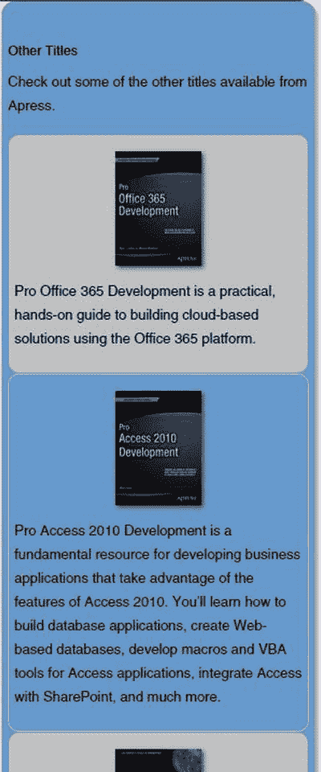

图 4-14。

Applying the zebra striping to the sidebar

### 添加文本装饰

文本装饰允许您用各种效果来修饰文本。已经定义了三种类型的修饰:线条(如下划线和删除线)、强调标记和阴影。官方推荐定义了这个功能，尽管浏览器的实现有点粗略和不一致。我将首先解释该标准是如何定义的，然后向您展示使其工作所需的变通方法。

Note

文字装饰细节在 WC3 推荐中有很好的解释，可以在 [`www.w3.org/TR/css-text-decor-3`](http://www.w3.org/TR/css-text-decor-3) 访问。

#### 线条装饰

线条装饰由三个属性的组合定义:

*   `text-decoration-line`:指定该行应该在文本上方(`overline`)、文本下方(`underline`)还是穿过文本中间(`line-through`)
*   `text-decoration-style`:定义线条的样式，如`solid`、`dashed`、`dotted`、`double`或`wavy`
*   `text-decoration-color`:表示线条的颜色

该建议还允许使用`text-decoration`快捷方式，您可以在一个属性中指定所有三个属性。例如，您可以用它来定义红色波浪下划线:

`text-decoration: underline wavy red;`

如果样式和颜色从快捷方式中省略，这是向后兼容 CSS 级别 1 和 2。并且，在撰写本文时，这是大多数浏览器所支持的全部内容。因此，您可以添加下划线、上划线或删除线，但不能调整其样式或颜色。要进行尝试，请在`style`元素的末尾添加以下内容:

`h2`

`{`

`text-decoration: underline overline line-through;`

`}`

这将显示文本中的所有三行。保存这些更改并刷新浏览器窗口，标题文本应该如图 4-15 所示。

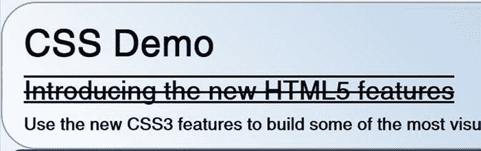

图 4-15。

Adding line decorations

Firefox 支持一些线条修饰风格，但是你需要使用他们的供应商前缀。为了演示如何做到这一点，用以下内容替换您刚刚添加的`h2`选择器:

`h2`

`{`

`text-decoration: underline;`

`-moz-text-decoration-line: underline;`

`-moz-text-decoration-style: wavy;`

`-moz-text-decoration-color: red;`

`text-decoration-line: underline;`

`text-decoration-style: wavy;`

`text-decoration-color: red;`

`}`

第一行使用大多数浏览器都支持的向后兼容属性。这将使用与文本相同的颜色定义实心下划线。接下来的三行使用 Firefox 供应商前缀定义了相同的红色波浪线，所有其他浏览器都将忽略这一点。最后三行使用 CSS3 标准定义红色波浪线。如果您使用大多数浏览器显示这个页面，您将会看到一条像前面一样的黑色实线。如果你使用 Firefox，页面会如图 4-16 所示。

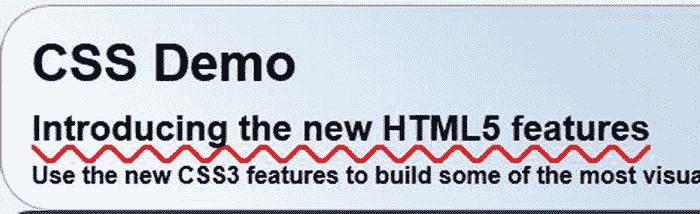

图 4-16。

Displaying line decorations in Firefox

然而，随着时间的推移，随着浏览器采用 CSS3 标准，波浪下划线将取代实线。这是一个很好的例子，说明了如何设计您的页面来使用当前可用的功能，并利用新兴的功能。

#### 强调标记

强调标记的使用类似于添加线条；他们添加符号或标记来强调指定的文本。在撰写本文时，没有一个桌面浏览器支持这个特性。使用三种属性的组合来定义强调标记。

*   `text-emphasis-style`:指定要使用的符号类型，如`dot`、`triangle`、`double-circle`或`sesame`。
*   `text-emphasis-color`:表示用于强调标记的颜色。
*   `text-emphasis-position`:定义标记相对于文本的位置；可能的值有`over`、`under`、`left`和`right`。可以包含`over right`等组合。

也允许使用快捷方式定义，因此您可以使用如下所示的单个属性来指定它:

`text-emphasis: dot red;`

#### 文本阴影

文字阴影的定义类似于方框阴影，我之前解释过。与其他一些文本修饰功能不同，所有主流浏览器都支持文本阴影。

文本阴影由包含以下参数的单个属性定义:

*   水平偏移
*   垂直偏移
*   模糊半径
*   颜色

偏移值可以是负值。负垂直偏移会将阴影置于文本上方，负水平阴影会将阴影置于左侧。如果省略 color 参数，阴影将与文本颜色相同。

Caution

文本阴影的模糊半径应该很小。除非你有一个非常大的字体，否则使用大于 1px 或 2px 的值会使文本不可读。可以指定 0px，这样会导致阴影一点都不模糊。

要演示文本阴影，请在`style`元素的末尾添加以下内容:

`h3:first-letter`

`{`

`text-shadow: 2px -5px 1px blue;`

`}`

保存更改并刷新浏览器。标题文本应如图 4-17 所示。

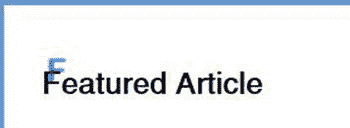

图 4-17。

Adding a text shadow Tip

这个例子还演示了`first-letter`伪类。这将从每个`h3`元素中选择第一个字母。

### 使用 3D 变换

添加 3D 变换可以为您的网页增添一些活力。我将演示一个相当简单的应用，您可以在其中翻转三维电话亭图像。您还将添加一些 JavaScript 来制作旋转动画。

要格式化 3D 变换，您需要指定几个属性。首先，您将在包含图像的`div`上设置`perspective`属性。这将建立用于确定 3D 效果渲染方式的消失点。然后，您将在图像本身上设置`preserve-3d`属性，它告诉浏览器在旋转图像时保持 3D 透视图。为此，将以下内容添加到`style`部分的末尾:

`/* Transforms */`

`.rotateContainer`

`{`

`-webkit-perspective: 360;`

`perspective: 360px;`

`}`

`.rotate`

`{`

`-webkit-transform-style: preserve-3d;`

`transform-style: preserve-3d;`

`}`

Note

标准的`perspective`属性需要单位(例如，`360px`)，但是 WebMatrix 中的 IntelliSense 不识别这一点，并将这显示为 CSS 验证错误。这个可以忽略。还要注意，以供应商为前缀的属性`-webkit-perspective`不需要单位。

现在，您将添加一个 JavaScript 函数，该函数将对图像旋转进行动画处理。在`head`元素中输入粗体代码:

`<head>`

`<meta charset="utf-8" />`

`<title>``Chapter 4`

``

`<style>`

`angle`变量存储图像的当前旋转角度，`t`变量是对间隔定时器的引用。`rotateImage()`函数只是为图像元素设置`rotateY`样式。这相当于将它添加到 CSS 中:

`transform: rotate(20deg);`

这是在 JavaScript 中完成的，因为每次调用它都会指定一个不同的角度。`toggleAnimation()`功能将启动或停止动画。为了开始动画，它调用了`setInterval()`函数，提供了一个每隔 100 毫秒调用一次的匿名函数。匿名函数在当前角度调用`rotateImage()`，然后递增`angle`。要取消动画，调用`clearInterval()`方法，然后图像被设置回初始旋转。

最后，添加以粗体显示的代码，当单击图像时，该代码调用`toggleAnimation()`函数:

`
`

`
This is really cool...
`

``

` `

保存这些更改并刷新浏览器窗口。要开始播放动画，请单击图像。您应该看到图像缓慢旋转，如图 4-18 所示。

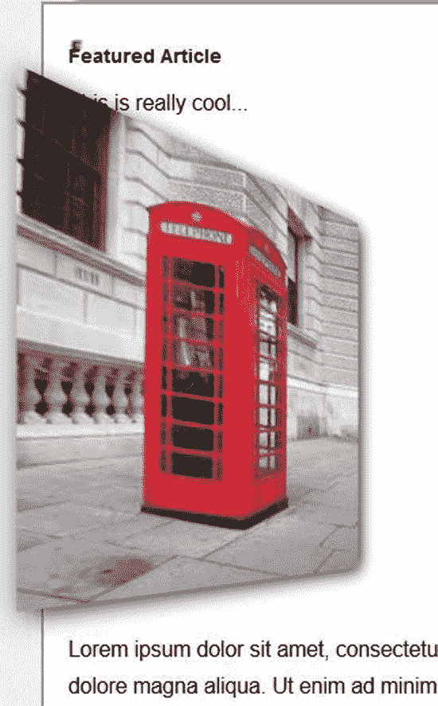

图 4-18。

The rotated phonebooth—in 3D! Tip

在撰写本文时，Chrome、Opera 和 Safari 有一个有趣的 bug。在检查元素之前，该变换是一个简单的 2D 变换。右键单击`image`元素并选择检查元素。一旦变换变为 3D，您就可以关闭检查窗口。

### 添加动画

对于最后一个效果，我将向您展示如何在不使用任何 JavaScript 的情况下创建动画效果。你不能用 CSS 修改图像，因为那被认为是内容，而不是格式。但是，您可以更改背景图像，并利用它来实现动画效果。

`aside`元素的`div`定义如下:

`

`

因为没有定义内容或大小，所以目前这对页面布局没有影响。现在，您将使用 CSS3 中的动画特性来迭代显示月相的各种图像。

在 CSS 中，动画是通过定义一组`keyframes`实现的。每个框架定义一个或多个 CSS 属性。在这个应用中，您将指定适当的背景图像，但是您也可以轻松地更改颜色、大小或任何其他 CSS 属性。对于每一帧，您还可以指定该帧应该出现的动画持续时间的百分比。您应该始终有一个 0%和 100%的帧，它们指定开始和结束属性。您可以在中间包含任意数量的步骤。在此示例中，有八个图像，因此，为了保持帧间距均匀，帧将以 0%、12%、25%、37%、50%、62%、75%、87%和 100%的比例过渡。

一旦您定义了`keyframes`，您就可以在您想要制作动画的元素上设置动画属性。您将通过设置`animation-name`属性来指定`keyframes`的名称。您还可以使用`animation-duration`属性设置动画的持续时间(以秒为单位)。将清单 4-5 中所示的代码添加到样式部分的末尾。

Listing 4-5\. Defining the Animation Effect

`/* Animate the moon phases */`

`@@-webkit-keyframes moonPhases`

`{`

`0%   {background-image:url("img/moon1.png");}`

`12%   {background-image:url("img/moon2.png");}`

`25%   {background-image:url("img/moon3.png");}`

`37%   {background-image:url("img/moon4.png");}`

`50%   {background-image:url("img/moon5.png");}`

`62%   {background-image:url("img/moon6.png");}`

`75%   {background-image:url("img/moon7.png");}`

`87%   {background-image:url("img/moon8.png");}`

`100%   {background-image:url("img/moon1.png");}`

`}`

`@@keyframes moonPhases`

`{`

`0%   {background-image:url("img/moon1.png");}`

`12%   {background-image:url("img/moon2.png");}`

`25%   {background-image:url("img/moon3.png");}`

`37%   {background-image:url("img/moon4.png");}`

`50%   {background-image:url("img/moon5.png");}`

`62%   {background-image:url("img/moon6.png");}`

`75%   {background-image:url("img/moon7.png");}`

`87%   {background-image:url("img/moon8.png");}`

`100%   {background-image:url("img/moon1.png");}`

`}`

`#moon`

`{`

`width:115px;`

`height:115px;`

`background-image: url("img/moon1.png");`

`background-repeat: no-repeat;`

`-webkit-animation-name:moonPhases;`

`-webkit-animation-duration:4s;`

`-webkit-animation-delay:3s;`

`-webkit-animation-iteration-count:10;`

`animation-name:moonPhases;`

`animation-duration:4s;`

`animation-delay:3s;`

`animation-iteration-count:10;`

`}`

这段代码将总持续时间设置为 4 秒，因此图像应该每半秒转换一次。它还指定在开始前等待三秒钟，并重复播放动画十次。当你刷新网页时，大约三秒钟后，它会循环显示月相，如图 4-19 所示。

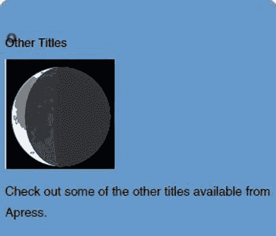

图 4-19。

Animating the moon’s phases Tip

如果您希望动画无限期地继续，请将`animation-iteration-count`属性设置为`infinite`。

这里还有另外两个不适用的动画属性，`timing-function`和`direction`。如果你正在使用一个简单的动画并且只定义开始和结束值，那么`timing-function`定义了过渡的速度。例如，如果您正在将一个元素移动到不同的位置，将此设置为`linear`将会以恒定的速率移动对象。然而，使用默认值`ease`，过渡将开始缓慢，然后加速，然后在接近结束时减速。还有其他选择，比如`ease-in`，开始时会很慢，然后在剩余的过渡阶段会加速。`direction`属性，如果设置为`alternate`，将在交替迭代中反转过渡。默认值`normal`，每次都会重放相同的过渡。

## 摘要

在这一章中，我介绍了很多关于 CSS 的信息，尤其是 CSS3 中的新特性。选择器非常强大，在应用样式时提供了很大的灵活性。在 CSS3 之前，大部分工作都必须通过大量的 JavaScript 函数来完成。我还向您展示了如何使用大量新的结构化 HTML5 元素来规划和构建一个示例 web 页面。附录 B 显示了完整的`style`元素。

使用 WebMatrix 应用，您创建了一个简单的 web 页面，定义了基本结构，然后填充了内容。使用一些新的 CSS3 特性，您添加了一些重要的样式特性，包括:

*   圆形边框
*   梯度
*   桌子
*   多列
*   阴影
*   斑马条纹
*   文本装饰
*   3D 转换
*   动画

在下一章，我将介绍 HTML5 中一些与脚本相关的新特性。