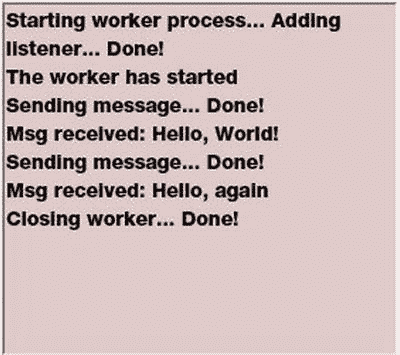

# 五、脚本增强

在这一章中，我将展示一些影响 web 开发脚本方面的各种改进。到目前为止，我已经介绍了标记更改和 CSS 增强。脚本是整个 HTML5 的第三个支柱，这个领域受到了极大的关注。本章将解释一些应用广泛的改进。

*   查询选择器
*   网络工作者
*   管理包和版本

包管理实际上不是 HTML5 的一部分，而是通过 Bower 和 Gulp 等开源工具完成的，这些工具已经集成到 Visual Studio 中。

## 使用查询选择器

在第四章中，我解释了可以用来创建强大样式规则的 CSS 选择器。CSS3 在这方面引入了显著的改进。有了健壮的属性选择器和一些新的伪类，比如你在第四章的中使用的`nth-child`，选择 DOM 元素就有了相当多的功能。但是更好的是:所有这些功能都可以从 JavaScript 中获得。

HTML5 规范包括两个新函数，`querySelector()`和`querySelectorAll()`。`querySelector()`函数返回单个元素，第一个匹配指定选择器的元素。`querySelectorAll()`函数返回匹配元素的数组。对于这两个函数，都要传入 CSS 选择器，就像在样式表中一样格式化。所以，一旦你学会了如何使用 CSS 选择器，你就可以把同样的经验应用到 JavaScript 上。

为了尝试这些功能，您将使用在第四章中创建的同一个网页。如果你想使用,第四章项目的最终版本，可以从源代码下载中获得。

### 使用查询选择器

`querySelector()`功能可以用来代替`getElementById()`功能。当然，它比这有用得多，因为您可以传入任何类型的 CSS 选择器。

打开`Default.cshtml`文件，修改`rotateImage()`函数，替换`getElementById()`函数如下:

`function rotateImage(value){`

`document.``querySelector("#phone")`

`="rotateY(" + value + "deg)";`

`}`

Caution

不要忘记在 ID 前面加上前缀`#`。因为`querySelector()`函数可以与任何类型的选择器一起使用，所以您需要散列符号来表示这是一个 ID 选择器。

使用 Firefox 运行网页，并验证 3D 旋转仍然有效。

### 使用 querySelectorAll

这是一个相当简单的例子，所以现在我将演示一个更复杂的选择器。您将添加一个 JavaScript 函数来改变`nav`元素中所有内部链接的颜色。可以说，您可以在样式表中这样做，但有时您也需要在代码中这样做。例如，您可能需要根据用户输入以编程方式更改样式。

向`Default.cshtml`页面中的`script`元素添加以下函数:

`function adjustInternalLinks(){`

`var links = document.querySelectorAll("nav ul li a[href ^='#']");`

`for (var i=0; i < links.length; i++){`

`links[i].style.color = "green";`

`}`

`}`

CSS 选择器是`nav ul li a[href ^='#']`，它返回所有具有以`#`字符开始的`href`属性的`a`元素。这被进一步过滤为仅具有`nav`、`ul`和`li`父子关系的元素。这将排除可能出现在其他部分的链接。

`querySelectorAll()`函数返回一个数组，所以这段代码遍历数组，使每个元素都变成绿色。现在你需要调用这个函数。将以下粗体显示的代码添加到`body`元素中:

`<body``onload="adjustInternalLinks()"`

这将在页面加载时调用该函数，但是您也可以根据一些适当的用户输入来调用它，以使样式动态化。保存更改并重新加载页面。你现在应该有绿色链接。注意到 [`www.apress.com`](http://www.apress.com/) 的链接不是绿色的，因为是外部链接，不是以`#`开头。

## 创建 Visual Studio 项目

对于本章的其余练习，您将使用 Visual Studio 项目。启动 Visual Studio 2015，点击新建项目。选择 ASP.NET Web 应用项目模板，输入章节 5 作为名称，如图 5-1 所示。

图 5-1。

Creating the Chapter5project

在第二个对话框中，选择 ASP.NET 5 网站模板。

## 雇佣网络工作者

随着越来越多的工作在客户端完成，让客户端应用多线程化变得更加重要。幸运的是，使用 Web 工作器 是实现这一目标的一种便捷方式。CPU 密集型或可能需要一些时间才能完成的功能可以在后台线程上执行，让主 UI 线程可以响应用户操作。

网络工作者使用一个相当简单的概念。您创建一个 worker 并传递给它一个定义其执行的 JavaScript 文件。然后，网页可以通过消息与工作人员通信。worker 实现`onmessage`事件处理程序来响应来自页面的传入消息，并使用`postMessage()`函数将数据发送回调用者。调用者还必须处理`onmessage`事件来接收来自工作者的消息。如图 5-2 所示。

图 5-2。

Communicating with a dedicated web worker Tip

对于您将在本章中创建的演示应用，呼叫者和工作人员之间的消息将是简单的文本消息。然而，它们可以是您想要的任何格式，包括 JSON 编码的数据。

Web 工作器 最大的限制之一是他们不能访问 DOM，所以你不能用他们来更新页面内容或样式。此外，他们不能访问窗口对象，这意味着，除其他事项外，你不能使用计时器。考虑到这些限制，您可能想知道何时使用 web worker。

网络工作者非常适合执行检索数据等任务。例如，如果您需要从外部源(如数据库、本地文件系统或 web)查找信息，您可以将查找参数传递给 worker，当查找完成时，数据可以作为 JSON 消息传递回来。这允许网页在检索数据时响应用户操作。

网络工作者有两种类型:专用型和共享型。专用工作器只能由单个页面使用，而共享工作器可以由多个 web 页面使用。专用工作人员和共享工作人员的工作方式基本相同，但沟通方式略有不同。您将从实现一个专用的 web worker 开始。

### 使用专门的工人

一个专门的网络工作者，顾名思义，就是专门为创建它的网页服务的。网页创建它，需要时使用它，不再需要时关闭它。一个网页可以根据需要创建任意多的工作人员。

为了演示一个专用的 web worker，您将构建一个简单的 web 页面，允许您创建一个 worker 并向它发送消息。它还将显示响应，以便您可以看到双向通信。worker 实现很简单，只是简单地回显发送给它的消息。

EXERCISE 5-1\. USING A DEDICATED WEB WORKERIn the `Chapter` `5` project you created earlier, open the `Index.cshtml` file, which you’ll find in the `Views\Home` folder. Replace the default implementation of this view using the code shown in Listing 5-1. This will create a simple form with a text area for displaying messages and three buttons for communicating with the worker.  

清单 5-1。索引视图实现

`<!DOCTYPE html>`

`<html lang="en">`

`<head>`

`<meta charset="utf-8" />`

`<title>Chapter``5`

`<link rel="stylesheet" type="text/css" href="∼/css/Sample.css" />`

``

`</head>`

`<body>`

`<header>`

`<h1>Web 工作器 Demo</h1>`

`</header>`

`
`

`<textarea id="output"></textarea>`

`
`

`<form id="control" method="post" action="">`

`<input id="create" type="button" class="button" value="Create Worker"`

`onclick="createWorker()">  `

`<input id="send" type="button" class="button" value="Send Message"`

`onclick="sendWorkerMessage()">`

`<input id="message" type="text" class="text" value="Hello, World!"> `

`<input id="kill" type="button" class="button" value="Close Worker"`

`onclick="closeWorker()">`

`</form>`

`</body>`

`</html>`

Replace the default implementation with the code shown in Listing 5-2.   From the Solution Explorer, right-click the `wwwroot\css` folder and choose Add and New Item. Select the Style Sheet item and enter Sample.css for the file name, as shown in Figure 5-3. Click the Add button to create the file.

图 5-3。

Adding the Sample.css style sheet  

清单 5-2。Sample.css 样式表

`h1`

`{`

`font-size:22px;`

`color:purple;`

`}`

`#output`

`{`

`width: 500px;`

`height: 250px;`

`background-color:#dfcaca;`

`}`

`.button`

`{`

`width:125px;`

`height:25px;`

`color:green;`

`}`

`.text`

`{`

`width:260px;`

`}`

For the contents of this file, enter the following code. This is the implementation of the worker. It handles both the `onconnect` event (when the worker is first created) and the `onmessage` event (when a message is sent to the worker). The implementation simply echoes the message back to the caller.   Close the browser and stop the debugger.   In the Solution Explorer, right-click the `wwwroot` folder and choose Add and New Item. In the Add New Item dialog box, select the JavaScript File item. Enter worker.js for the file name, as shown in Figure 5-5.

图 5-5。

Adding the worker.js file   Press F5 to debug the application; the form should look similar to Figure 5-4.

图 5-4。

The initial form design  

`/* This file implements the web worker */`

`// This event is fired when the web worker is started`

`onconnect = sendResponse("The worker has started");`

`// This event is fired when a message is received`

`onmessage = function (event) {`

`sendResponse("Msg received: " + event.data);`

`}`

`// Sends a message to the main thread`

`function sendResponse(message) {`

`postMessage(message);`

`}`

Using the same instructions, add a `controlWorker.js` file in the `wwwroot` folder.   Enter the code shown in Listing 5-3 for its implementation. I will explain this in more detail later in the chapter.  

清单 5-3。controlWorker.js 实现

`/* This file contains functions used to`

`communicate with the web worker */`

`var myWorker;`

`function createWorker() {`

`if (typeof(Worker) !== "undefined") {`

`var log = document.querySelector("#output");`

`log.value += "Starting worker process… ";`

`myWorker = new Worker("worker.js");`

`log.value += "Adding listener… ";`

`myWorker.onmessage = function(event){`

`log.value += event.data + "\n";`

`}`

`log.value += "Done!\n";`

`}`

`else {`

`alert("Your browser does not support Web 工作器");`

`}`

`}`

`function sendWorkerMessage(){`

`if (myWorker !== null) {`

`var log = document.querySelector("#output");`

`log.value += "Sending message… ";`

`var message = document.querySelector("#message");`

`myWorker.postMessage(message.value);`

`log.value += "Done!\n";`

`}`

`}`

`function closeWorker(){`

`if (myWorker !== null) {`

`var log = document.querySelector("#output");`

`log.value += "Closing worker… ";`

`myWorker.terminate;`

`myWorker = null;`

`log.value += "Done!\n";`

`}`

`}`

Press F5 to debug the application. Click the Create Worker button and then click the Send button. Modify the message and try clicking the Send Message button again. Finally, click the Close Worker button. The text area should look like Figure 5-6.

图 5-6。

The message log  

`controlWorker.js`文件包含三个函数，为表单上的三个按钮提供实现。它首先声明一个`myWorker`变量，该变量包含对专用 web worker 的引用，然后实现以下函数:

*   `createWorker()`:该函数首先通过查看是否定义了`Worker`类来检查浏览器是否支持 Web 工作器。否则，将发出警报。然后它创建一个`Worker`类的实例，将它的引用保存在`myWorker`变量中。工人实现通过引用`worker.js`脚本文件传递给它的构造函数。然后它实现`onmessage`事件处理程序，将传入的消息添加到`output`字段。
*   `sendWorkerMessage()`:这只是调用工人的`postMessage()`方法，传入在`message`字段中指定的文本。注意它使用了我在本章前面解释过的`querySelector()`方法。
*   `closeWorker()`:调用 worker 的`terminate()`方法，将`myWorker`变量设置为`null`。该工作线程会立即关闭，无法执行任何清理操作。

提示与添加一个`onmessage`事件处理程序的方式相同，您也可以创建一个`onerror`事件处理程序来响应来自 worker 的错误。网络工作者可以通过使用`throw`功能来报告错误。

通过这个简单的实现，您可以看到创建一个 worker 并使用消息与之通信是多么容易。

### 创建共享工作者

共享 web worker 允许您创建一个 worker，然后从其他页面重用它。使用共享工作人员有几个好处。最明显的一点是，多个页面可以共享同一个线程，而不必为每个页面创建一个新的工作线程。另一个，我将在后面解释，是跨页面共享状态信息。

Caution

IE 11 支持专用 Web 工作器，但不支持共享 worker。

现在您将创建一个共享的 worker，它是在一个 JavaScript 文件中实现的。概念本质上是一样的，只是交流的方式有点不同。您将向 web 页面添加几个按钮，并实现一组新的 JavaScript 函数来与共享的工作人员进行通信。

EXERCISE 5-2\. CREATING A SHARED WORKEROpen the `Index.cshtml` file and add the following script reference in the `head` element after the previous reference:  

``

Add the code shown in bold in Listing 5-4 to the `form` element. This will add another set of buttons to control the shared worker.  

清单 5-4。Index.cshtml 中的附加按钮

`<form id="control" method="post" action="">`

`<input id="create" type="button" class="button" value="Create Worker"`

`onclick="createWorker()">  `

`<input id="send" type="button" class="button" value="Send Message"`

`onclick="sendWorkerMessage()">`

`<input id="message" type="text" class="text" value="Hello, World!"> `

`<input id="kill" type="button" class="button" value="Close Worker"`

`onclick="closeWorker()">`

`  `

`<input id="createS" type="button" class="button" value="Create Shared"`

`onclick="createSharedWorker()">  `

`<input id="sendS" type="button" class="button" value="Send Shared Msg"`

`onclick="sendSharedWorkerMessage()">`

`<input id="messageS" type="text" class="text" value="Hello, World!"> `

`<input id="killS" type="button" class="button" value="Close Shared"`

`onclick="closeSharedWorker()">`

`</form>`

From the Solution Explorer, add another file to the `wwwroot` folder named `sharedWorker.js` and enter the code shown in Listing 5-5. This is the implementation of the shared worker.  

清单 5-5。sharedWorker.js 实现

`/* This file implements the shared web worker */`

`var clients = 0;`

`onconnect = function(event) {`

`var port = event.ports[0];`

`clients++;`

`/* Attach the event listener */`

`port.addEventListener("message", function(event){`

`sendResponse(event.target, "Msg received: " + event.data);`

`}, false);`

`port.start();`

`sendResponse(port, "You are client # " + clients + "\n");`

`}`

`function sendResponse(senderPort, message) {`

`senderPort.postMessage( message);`

`}`

Add another file in the `wwwroot` folder named `controlSharedWorker.js` and enter the implementation shown in Listing 5-6. I will explain this code later.  

清单 5-6。controlSharedWorker.js 实现

`/* This file contains functions used to`

`communicate with the web worker */`

`var mySharedWorker;`

`function createSharedWorker() {`

`if (typeof(SharedWorker) !== "undefined") {`

`var log = document.querySelector("#output");`

`log.value += "Starting shared worker process… ";`

`mySharedWorker = new SharedWorker("sharedWorker.js");`

`log.value += "Adding listener… ";`

`mySharedWorker.port.addEventListener("message", function(event){`

`log.value += event.data + "\n";`

`}, false);`

`mySharedWorker.port.start();`

`log.value += "Done!\n";`

`}`

`else {`

`alert("Your browser does not support shared Web 工作器");`

`}`

`}`

`function sendSharedWorkerMessage(){`

`if (mySharedWorker !== null) {`

`var log = document.querySelector("#output");`

`log.value += "Sending message… ";`

`var message = document.querySelector("#messageS");`

`mySharedWorker.port.postMessage(message.value);`

`log.value += "Done!\n";`

`}`

`}`

`function closeSharedWorker(){`

`if (mySharedWorker !== null) {`

`var log = document.querySelector("#output");`

`log.value += "Closing worker… ";`

`mySharedWorker.port.terminate;`

`mySharedWorker = null;`

`log.value += "Done!\n";`

`}`

`}`

Press F5 to debug the application. Create a shared worker and send a message to it. It should work just like the previous exercise.   Leaving the browser tab running, create a new tab and enter the same URL as the first tab. This will open the same page in a second tab. Create a shared worker from the second tab. Then click the Send Shared Message button to test the connection. Notice the message says that you are the second client, as demonstrated in Figure 5-7.

图 5-7。

Opening a second copy of the page  

消息在工作者和调用工作者的页面之间传递。多个页面可以调用一个共享的工作器，但是消息是不共享的；每条消息仍然在单个页面和工作人员之间。但是，员工内部的数据是共享的，可以从多个页面访问。

现在让我们看看共享工作器是如何实现的。就像专门的工作者一样，它必须处理`onconnect`和`onmessage`事件。但是，您不能将`ommessage`处理程序直接附加到 worker 上；相反，您必须访问一个端口并连接到该端口。`onconnect`事件接收一个`event`参数，你通过`event.ports[0]`访问端口。一旦有了`port`，就可以将事件处理程序附加到它上面。您使用端口的`addEventHandler()`方法。这需要两个参数。第一个是事件的名称，在本例中是`message`。第二个参数是引发事件时将调用的函数。

发送消息时，还必须使用`port`对象。这个`port`对象在传入消息的`event.target`属性中提供。这个事件处理程序和`onconnect`事件处理程序都使用传入`port`对象的`sendResponse()`函数。

`controlSharedWorker.js`文件中的功能几乎与它们的专用对应物完全相同。然而，它们也必须使用`port`对象。端口包含在事件中。

注意在`sharedWorker.js`文件中，`clients`变量被声明，然后在`onconnect`事件处理程序中递增。这用于跟踪有多少客户端已经连接到共享工作器。我添加这个只是为了演示这个变量对于连接到 worker 的所有客户机是如何全局的。事实上，没有每个端口的实例数据；所有数据都是全球性的。

另外，当消息进来时，`event`参数包括响应应该发送到的端口。工作人员不会“记住”每个客户端的端口。它只是做它被指示做的事情，并在指定的端口上返回一个响应。

## 客户端包管理

Visual Studio 2015 和 ASP.NET 5 在如何完成客户端打包方面引入了一个非常重要的转变。NuGet 仍然存在，但已经被归入服务器端包。在客户端，您现在可以使用 Bower、Grunt、Gulp 和节点包管理器(NPM)等工具。项目模板为您预先配置了大多数基本功能。你不需要处理这些来实现本书中的例子。然而，我想给你一个这些工具做什么和它们如何工作的概述。让我们从查看为您创建的项目文件开始。

### 配置:图标配置

如果您看一看解决方案资源管理器，您可能会问自己，“`web.config`文件在哪里？”如果您查看文件列表的末尾，您会看到一个`config.json`文件，在这里您可以找到配置设置，比如连接字符串。配置数据可以存储在 JSON、XML 或 INI 文件中，并且可以有许多配置文件。

看一下`Startup.cs`文件。它定义了一个`IConfiguration`成员和一个定义要加载的文件的构造函数。

`public Startup(IHostingEnvironment env)`

`{`

`// Setup configuration sources.`

`var configuration = new Configuration()`

`.AddJsonFile("config.json")`

`.AddJsonFile($"config.{env.EnvironmentName}.json", optional: true);`

`if (env.IsEnvironment("Development"))`

`{`

`// This reads the configuration keys from the secret store.`

`// For more details on using the user secret store see`

`//` `http://go.microsoft.com/fwlink/?LinkID=532709`

`configuration.AddUserSecrets();`

`}`

`configuration.AddEnvironmentVariables();`

`Configuration = configuration;`

`}`

`public IConfiguration Configuration { get; set; }`

因此，您可以决定如何组织配置数据以及使用何种文件格式。项目模板生成的初始代码使用`AddJsonFile()`方法从`config.json`文件加载数据。它还加载任何可能使用`AddEnvironmentVariables()`方法定义的环境变量。

这里有一篇解释新配置模型的好文章: [`http://blog.jsinh.in/asp-net-5-configuration-microsoft-framework-configurationmodel/#.VQ3TUvnF9Cg`](http://blog.jsinh.in/asp-net-5-configuration-microsoft-framework-configurationmodel/#.VQ3TUvnF9Cg) 。

### 静态文件:wwwroot

`wwwroot`文件夹是 ASP.NET 5 的新增功能，它提供了一个存放所有静态内容的地方，比如 CSS、JavaScript、图片和静态 HTML。这里的想法是明确区分通过服务器端代码生成的内容和简单地按原样提供给浏览器的内容。

该文件夹被称为 web 根目录。这大致相当于以前版本的 MVC 使用的`Content`和`Scripts`文件夹。这些文件夹在解决方案浏览器中与`Models`、`Views`和`Controllers`处于同一级别。将它们向上移动一个级别，合并成一个级别，并将其命名为 web root，这样就可以更清楚地知道应该包含什么。

### 包管理:Bower

虽然 NuGet 是一个受欢迎的朋友。作为. NET 开发人员，Bower 在管理客户端依赖性方面一直很受欢迎。因此，在 ASP.NET 5 中，您将使用 Bower 来配置您的应用所需的客户端软件包。(您将继续对服务器端包使用 NuGet。)客户端依赖关系在`bower.json`文件中列出；清单 5-7 显示了初始的、模板生成的文件。

Listing 5-7\. The bower.json Configuration File

`{`

`"name": "WebApplication",`

`"private": true,`

`"dependencies": {`

`"bootstrap": "3.0.0",`

`"jquery": "1.10.2",`

`"jquery-validation": "1.11.1",`

`"jquery-validation-unobtrusive": "3.2.2",`

`"hammer.js": "2.0.4",`

`"bootstrap-touch-carousel": "0.8.0"`

`},`

`"exportsOverride": {`

`"bootstrap": {`

`"js": "dist/js/*.*",`

`"css": "dist/css/*.*",`

`"fonts": "dist/fonts/*.*"`

`},`

`"bootstrap-touch-carousel": {`

`"js": "dist/js/*.*",`

`"css": "dist/css/*.*"`

`},`

`"jquery": {`

`"": "jquery.{js,min.js,min.map}"`

`},`

`"jquery-validation": {`

`"": "jquery.validate.js"`

`},`

`"jquery-validation-unobtrusive": {`

`"": "jquery.validate.unobtrusive.{js,min.js}"`

`},`

`"hammer": {`

`"": "hammer.{js,min.js}"`

`}`

`}`

`}`

使用这个文件的好处是智能感知支持。例如，打开这个文件并转到依赖项部分。在定义了`bootstrap-touch-carousel`的最后一行，转到行尾，输入一个逗号，然后按回车键。然后输入一个报价并开始输入一个包名。请注意，在您键入时，可用包的列表会自动显示。输入“modernizr”:”，注意显示的是可用的版本号，如图 5-8 所示。

图 5-8。

Bower IntelliSense support r

还要注意版本语义。撰写本文时，当前的稳定版本是 2.8.3。这些数字分别指定主要版本、次要版本和修补程序编号。在版本前面加上一个克拉符号(^)表示主要版本必须匹配。例如，如果指定了².8.3，则只要主版本是 2，就会使用等于或高于 2.8.3 的任何版本。因此，将使用 2.8.5 或 2.9，而不是 3.1。波浪号(∾)表示主要版本和次要版本必须匹配。所以，∞2 . 8 . 3 将使用大于或等于 3 的 2.8 的任何路径级别；因此，将使用 2.8.5，但不使用 2.9。省略这两者表明应该使用最新版本，只要它至少是 2.8.3。

### 构建任务:吞咽

对于大多数 web 应用需要的所有客户端文件，获取、组织和准备它们可能是一项单调乏味的任务。您已经将 Bower 视为管理依赖性的一个很好的工具。Gulp 是另一个有用的工具，它允许您自动化构建任务。Gulp 是一个基于 JavaScript 的框架，使用 Node.js 和 NPM。

Gulp 的一个典型场景是告诉 Bower 检查并下载依赖项。事实上，清单 5-8 中显示的初始`gulpfile.js`就是这么做的。

Listing 5-8\. The Initial gulpfile.js File

`/// <binding Clean='clean' />`

`var gulp = require("gulp"),`

`rimraf = require("rimraf"),`

`fs = require("fs");`

`eval("var project = " + fs.readFileSync("./project.json"));`

`var paths = {`

`bower: "./bower_components/",`

`lib: "./" + project.webroot + "/lib/"`

`};`

`gulp.task("clean", function (cb) {`

`rimraf(paths.lib, cb);`

`});`

`gulp.task("copy", ["clean"], function () {`

`var bower = {`

`"bootstrap": "bootstrap/dist/**/*.{js,map,css,ttf,svg,woff,eot}",`

`"bootstrap-touch-carousel": "bootstrap-touch-carousel/dist/**/*.{js,css}",`

`"hammer.js": "hammer.js/hammer*.{js,map}",`

`"jquery": "jquery/jquery*.{js,map}",`

`"jquery-validation": "jquery-validation/jquery.validate.js",`

`"jquery-validation-unobtrusive": "jquery-validation-unobtrusive/jquery.validate.unobtrusive.js"`

`}`

`for (var destinationDir in bower) {`

`gulp.src(paths.bower + bower[destinationDir])`

`.pipe(gulp.dest(paths.lib + destinationDir));`

`}`

`});`

当然，您还可以完成许多其他任务，比如捆绑和缩小您的 JavaScript 或 CSS 文件。另一个例子是将较少的样式表预编译成 CSS 文件。

Note

除了 Gulp，Grunt 还用于客户端构建自动化。Grunt 可以执行与 Gulp 相同类型的任务，但以不同的方式完成。咕噜声和吞咽声可能会持续一段时间。如果你正在考虑使用这些工具中的一个，但不确定是哪一个，这里有一篇很好的文章，它描述了 Grunt 和 Gulp 之间的区别，并提供了一些关于你应该考虑使用哪一个的建议: [`https://medium.com/@preslavrachev/gulp-vs-grunt-why-one-why-the-other-f5d3b398edc4`](https://medium.com/@preslavrachev/gulp-vs-grunt-why-one-why-the-other-f5d3b398edc4) 。

## 摘要

在这一章中，您尝试了一些有用的技术，这些技术可能会在您的许多 web 项目中使用。

*   查询选择器在 JavaScript 代码中利用了同样强大的 CSS 选择器。
*   Web 工作器 在单独的线程上执行 CPU 密集型或缓慢的操作，以提高整体响应能力。

我还介绍了一些可用于管理 web 应用的新的客户端工具。在第六章中，我将向您展示 HTML5 的改进如何用于创建移动友好的 web 应用。