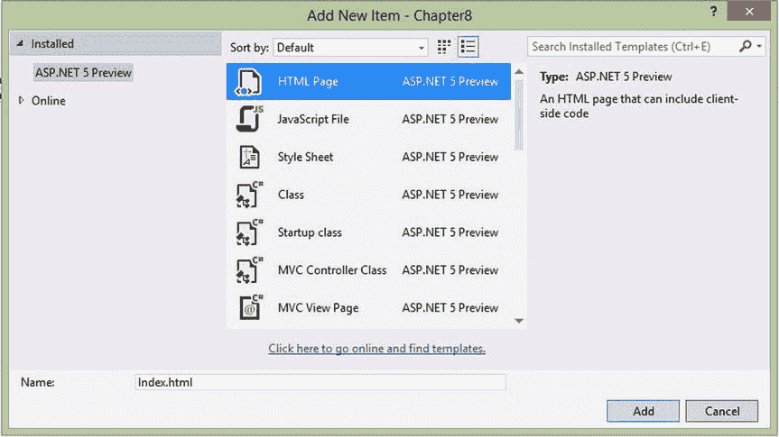
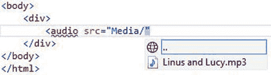
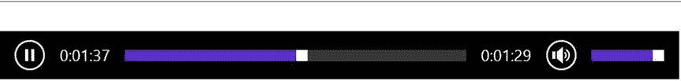
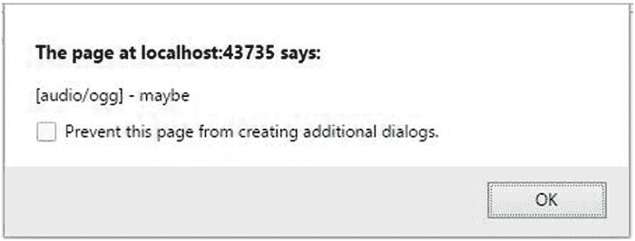
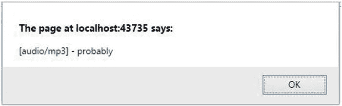
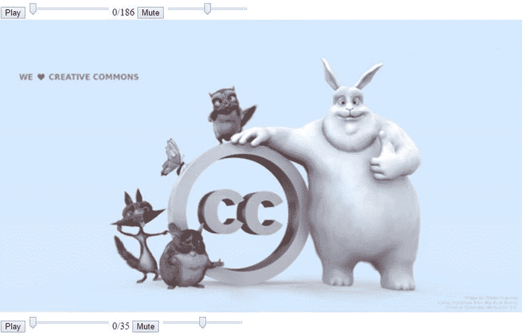

# 八、音频和视频

在这一章中，我将演示 HTML5 中引入的新的`audio`和`video`元素。这两个元素在它们的属性以及它们支持的方法和事件方面是相同的。我将用这一章的大部分时间来讨论和演示`audio`元素，但请记住，我向你展示的一切也适用于视频。本章末尾的一些练习将把这些相同的技术应用到`video`元素上，这样你就可以自己看到了。

我将演示如何使用浏览器提供的本地控件添加`audio`和`video`元素。这种方法使得在网站中嵌入音频和视频成为添加一些简单标记的小事。然而，如果你想写你自己的控件，本章也将演示如何去做，以及如何用 JavaScript 连接所有的事件。

因为每个浏览器支持不同的媒体格式，所以您可能需要对媒体文件的多个版本进行编码。然而，现在大多数主流浏览器都支持 MP3 和 MP4 格式，所以这不再是个问题。`audio`和`video`元素可以支持多个来源，因此每个浏览器都可以选择合适的版本来使用。

Note

`video`元素支持`audio`元素不支持的三个附加属性(`width`、`height`和`poster`)。我将在本章后面解释这些。

## 使用音频元素

我将从一个非常简单的练习开始，向网页添加一个`audio`元素。然后，您将支持多种格式，并在各种 bowsers 上尝试您的站点。

### 创建示例项目

在本章中，您将创建一个网站项目，您将使用它来尝试 HTML5 的`audio`和`video`元素。现在，您将创建一个空网站，然后在本章中逐步向其添加功能。

EXERCISE 8-1\. ADDING AUDIO TO A PAGEStart Visual Studio 2015 and click New Project. Select the ASP.NET Web Application project template and enter Chapter 8 for the name.   In the second dialog, select the ASP.NET 5 Empty project.   In Solution Explorer, right-click the `wwwroot` folder and click the Add and New Folder links. Enter the name Media.   You’ll need an MP3 file to use as a sample audio clip. The file I’m using is copyrighted, so I can’t include it with the source code. You should be able to find one on your computer or download one from the internet. You can also rip a CD through Windows Media Player and select MP3 as the format.   Drag the MP3 file from Windows Explorer to the `wwwroot\Media` folder in Visual Studio.   Now you’ll add the web page that you’ll be working on throughout this chapter. From Solution Explorer, right-click the `wwwroot` folder and click the Add and New Item links. In the Add New Item dialog, select HTML Page and enter the name Index.html, as shown in Figure 8-1.

图 8-1。

Adding the Index.html page   Open the `Index.html` file. In the empty `body` that was created by the file template, create a `div` element. Inside that `div`, enter <audio src=, and you should see a link that you can use to select the source from a file in your project. Select the `Media` folder and then your MP3 file, as shown in Figure 8-2.

图 8-2。

Using a link to select the source   Add the `autoplay` attribute and close the `audio` element. Add text inside the `audio` element like this: `<body>`     `
`         `<audio src="Media/Linus and Lucy.mp3" autoplay>`             `
HTML5 audio is not supported on your browser
`         `</audio>`     `
` `</body>`   Save your changes, make sure Internet Explorer is chosen as your default browser for debugging, and browse the `Index.html` page.   Open the `Startup.cs` file and comment out the implementation of the `Configure()` method.   Once the page has loaded, your audio clip should start playing. The page, however, will be blank.   Press F12 to open the Developer Tools pane, if not already opened. Change the browser mode to IE 8\. The music will stop, and you’ll see the “HTML5 audio is not supported on your browser” text displayed.  

第一个练习演示了`audio`元素的基本用法。您只需输入`src`属性，它指定音频文件的 URL。当浏览器不支持`audio`元素时，使用`audio`元素内的内容。由于 IE 8 不支持`audio`元素，因此显示包含在`p`标签中的文本。您可以利用这一点简单地显示一条消息，就像您在这里所做的那样。但是，您可以使用它来提供一个下载文件的链接，或者使用一个插件来实现一个后备解决方案。

### 使用本机控件

就 UI 而言，基本上有三个选项:

*   无控件:音频会播放，但用户没有可用的控件。当使用`autoplay`属性加载页面时，剪辑可以自动开始。您还可以使用 JavaScript 开始、暂停和停止音频剪辑。
*   本机控件:浏览器为用户提供播放、暂停和停止音频剪辑以及控制音量的控件。
*   定制控件:页面提供了通过 JavaScript 与`audio`元素交互的定制控件。

要启用本地控件，只需像这样添加`controls`属性:

`<audio src="∼/Media/Linus and Lucy.mp3" autoplay``controls`

保存您的更改并浏览到您的页面，本地控件应该类似于图 8-3 所示。

图 8-3。

Displaying the native audio controls in Internet Explorer

在 Opera 和 Chrome 中，控件看起来像图 8-4 。

图 8-4。

The audio controls in Opera

在 Firefox 中，控件看起来如图 8-5 所示。

图 8-5。

The audio controls in Firefox

在 Safari 中，音频控制看起来像图 8-6 。

图 8-6。

The audio control in Safari Tip

Windows 上的 Safari 要求安装 QuickTime 以支持`audio`元素。你可以从这个网站下载: [`https://support.apple.com/kb/DL837?locale=en_US`](https://support.apple.com/kb/DL837?locale=en_US) 。安装 QuickTime 后，您可能需要重新启动电脑，Safari 才能工作。

如您所见，每个浏览器中的控件都有不同的样式。使用原生控件，您几乎无法控制音频控件的显示方式。您可以通过设置`style`属性来改变宽度，这将拉伸进度条。超出正常高度只会在控件顶部增加空白，如图 8-7 所示。然而，在 IE 中，降低高度会缩小控件；在 Chrome 中，它会对其进行剪辑。

图 8-7。

Extending the size of the native controls

### 查看浏览器支持

虽然所有主流浏览器都支持`audio`元素，但它们并不都支持相同的音频格式。直到最近，浏览器通常要么支持 MP3，要么支持 Vorbis，你需要两者都提供。然而，现在大多数浏览器都支持 MP3 和 MP4 格式的视频。如果需要，HTML5 提供了一种提供多种格式的方法来支持旧的浏览器。

Tip

这里有一个方便的页面测试浏览器对`audio`和`video`元素的支持: [`http://hpr.dogphilosophy.net/test/`](http://hpr.dogphilosophy.net/test/) 。它还概述了对各种浏览器的支持。

`audio`元素允许您指定多个源，浏览器将遍历这些源，直到找到它支持的一个。不使用`src`属性，而是在`audio`元素中提供一个或多个`source`元素，如下所示:

`<audio autoplay controls>`

`<source src="Media/Linus and Lucy.ogg" />`

`<source src="Media/Linus and Lucy.mp3" />`

`
HTML5 audio is not supported on your browser
`

`</audio>`

浏览器将使用它支持的第一个源，因此如果这对您很重要，您应该首先列出首选文件。例如，Chrome 同时支持 MP3 和 Vorbis 格式。如果您希望使用 MP3 文件，您应该在。`ogg`文件。

虽然像这样只列出源代码是可行的，但是浏览器必须下载文件并打开它，看看它是否能够播放。下载了一个相当大的文件却发现它无法使用，这不是很有效率。您还应该包括`type`属性，它指定了资源的类型。然后，浏览器可以通过查看标记来确定该文件是否受支持。`type`属性像这样指定 MIME 格式:

`<source src="Media/Linus and Lucy.ogg"``type="audio/ogg"`

`<source src="Media/Linus and Lucy.mp3"``type="audio/mp3"`

您也可以在`type`属性中指定编解码器，如下所示:

`<source src="Media/Linus and Lucy.ogg" type='audio/ogg; codecs="vorbis"' />`

这将帮助浏览器更有效地选择一个兼容的媒体文件，我将在本章后面解释。请注意，编解码器值包含在双引号中，因此您需要在`type`属性值两边使用单引号。现在，您将修改您的网页，以便它也可以在其他浏览器上工作。

EXERCISE 8-2\. ADDING MULTIPLE SOURCESCreate a Vorbis-encoded audio file of your sample audio clip that has the `.ogg` extension and copy this to the `wwwroot\Media` folder.  

提示我使用了一个叫做 XMedia Recode 的工具，你可以在 [`http://www.xmedia-recode.de/download.html`](http://www.xmedia-recode.de/download.html) 下载。您可以使用此实用程序来格式化音频和视频文件。安装此应用后，运行它，单击功能区中的打开文件按钮，然后选择 MP3 文件。在“格式”选项卡上，选择 OGG 格式。请注意，文件扩展名选项自动设置为。`ogg`并且音频选项卡上的编解码器选项设置为 Vorbis。单击功能区中的“添加到队列”按钮。选择“队列”选项卡，查看已定义的转换该文件的作业。在窗口底部，您可以指定新文件的保存位置。点击浏览按钮，导航到`Chapter` `8` `\Media`文件夹。最后，单击 Encode 按钮启动作业。将显示一个对话框，显示作业的进度。

In Solution Explorer, right-click the `Media` folder and click the Add and Existing Item links. Navigate to the `Chapter` `8` `\wwwroot\Media` folder and select the `.ogg` file that you just encoded.   In the `Index.html` file, replace the `audio` element with the following code (you’ll need to adjust the actual file name to match yours): `<audio autoplay controls >`     `<source src="Media/Linus and Lucy.ogg" type="audio/ogg" />`     `<source src="Media/Linus and Lucy.mp3" type="audio/mp3" />`     `
HTML5 audio is not supported on your browser
` `</audio>`   Save your changes and browse to your page. Open the page using several browsers and verify that the controls are displayed and the audio starts playing when the page is loaded.  

## 构建您自己的控件

所有的 DOM 元素和事件都在 JavaScript 中可用，所以创建自己的控件来处理`audio`元素是一个相当简单的过程。然而，有几个方面你需要控制，所以这不是一个微不足道的练习。您需要解决三个方面的问题:

*   播放/暂停
*   显示进度和快进/快退
*   调节音量/静音

您需要响应来自自定义控件和`audio`元素的事件。在本练习中，您将从向页面添加所有必要的控件开始。然后，我将向您展示如何实现每个领域所需的事件处理程序。您将用来控制音频元素的输入元素如下:

*   播放/暂停按钮:标签将根据音频元素的状态在“播放”和“暂停”之间切换。
*   寻找:这是一个`range`控件(在第二章和第三章中介绍),既可以显示进度，也可以让用户寻找特定的位置。
*   Duration:这是一个`span`元素，显示音频文件的当前位置和总时长。
*   静音按钮:标签将在“静音”和“取消静音”之间切换
*   音量:这是另一个用于指定音量级别的`range`控件。

您将为其提供处理程序的`audio`事件包括:

*   `onplay`:音频开始时触发
*   `onpause`:音频暂停时引发
*   `onended`:音频完成时触发
*   `ontimeupdate`:随着音频剪辑的播放周期性地触发
*   `ondurationchanged`:当持续时间改变时引发，这发生在加载文件时
*   `onvolumnechanged`:当音量改变或静音属性改变时触发

### 添加自定义控件

您将从添加自定义控件和定义所需的事件处理程序开始。然后我将解释您将用来实现它们的 JavaScript。

EXERCISE 8-3\. ADDING CUSTOM CONTROLSOpen the `Index.html` file and remove the `controls` attribute. This will cause the `audio` element to be hidden.   Add the following `div` after the `audio` element. This will include all the input elements that you’ll need to control the audio. `
`     `<input type="button" value="Play" id="play" onclick="togglePlay()" />`     `<input type="range" id="audioSeek" onchange="seekAudio()" />`     ``     `<input type="button" id="mute" value="Mute" onclick="toggleMute()" />`     `<input type="range" id="volume" min="0" max="1" step="any"`         `onchange="setVolume()" />` `
`   Modify the `audio` element to add the necessary event handlers by adding the code shown in bold. This also defines the `id` attribute that you’ll use to access the `audio` and `source` elements. `<audio` `id="audio"` `autoplay`     `onplay="updatePlayPause()"`     `onpause="updatePlayPause()"`     `onended="endAudio()"`     `ontimeupdate="updateSeek()"`     `ondurationchange="setupSeek()"`     `onvolumechange="updateMute()" >`     `<source src="Media/Linus and Lucy.ogg" type="audio/ogg"` `id="oggSource"` `/>`     `<source src="Media/Linus and Lucy.mp3" type="audio/mp3"` `id="mp3Source"` `/>`     `
HTML5 audio is not supported on your browser
` `</audio>`   In Visual Studio, change the debug browser to use Opera. (You can also use Chrome if you prefer.) Save your changes and browse to your page. The page should look like Figure 8-8.

图 8-8。

The custom audio controls   Close the browser and stop the debugger.  

### 实现事件处理程序

现在，您已经准备好实现事件处理程序了。我将围绕三个主要方面(播放、搜索和音量)对它们进行分组，并一次解释一个部分。

#### 支持播放和暂停

将清单 8-1 中所示的代码添加到外层`div`之后，就在`body`元素结束之前。

Listing 8-1\. The Initial script Element

``

这段代码首先声明引用`audio`元素的`audio`变量。因为大多数函数都使用它，所以获取一次并将其存储在所有函数都可以访问的变量中会更有效。

第一个方法`setupSeek()`被调用以响应`ondurationchange`事件。当页面第一次加载时，它不知道音频剪辑有多长，直到打开文件并加载元数据。一旦加载了元数据，就可以确定持续时间，并引发事件。`duration`属性以秒表示。`setupSeek()`函数使用`duration`属性来设置`audioSeek`范围控件的`max`属性。它也用于设置`span`元素的初始值。请注意，调用了`Math.round()`函数来将该值四舍五入为最接近的整数。

当用户点击播放按钮时，调用`togglePlay()`方法。如果`audio`元素的当前状态是暂停或结束，它调用`play()`函数。否则，它调用`pause()`方法。`updatePlayPause()`方法设置播放按钮的标签。如果音频当前正在播放，文本将更改为“暂停”，因为这将是单击按钮的结果。否则，文本被设置为“播放”

Tip

`togglePlay()`函数响应播放按钮被点击，`updatePlayPause()`函数响应`audio`元素被启动或暂停。当点击按钮时，`togglePlay()`方法将改变`audio`元素的状态。这种状态变化将引发一个`onplay`或`onpause`事件，这两个事件都由`updatePlayPause()`函数处理。这样做是因为可以通过点击播放按钮以外的方式来播放或暂停音频。例如，如果您保留了`controls`属性，那么您将同时拥有本地控件和自定义控件。响应`onplay`和`onpause`事件确保按钮标签总是正确的，不管`audio`元素是如何操作的。

最后，当音频播放完毕时，调用`endAudio()`函数。这执行一些同步，包括设置按钮标签和初始化`range`和`span`控件。

#### 支持进步和寻求

接下来，将清单 8-2 中所示的函数添加到同一个`script`元素中。

Listing 8-2\. Functions to Support the range Control

`function seekAudio() {`

`var seek = document.getElementById("audioSeek");`

`audio.currentTime = seek.value;`

`}`

`function updateSeek() {`

`var seek = document.getElementById("audioSeek");`

`seek.value = Math.round(audio.currentTime);`

`var duration = document.getElementById("duration");`

`duration.innerHTML = Math.round(audio.currentTime) + "/" + Math.round(audio.duration);`

`}`

就像播放按钮一样，有一个事件处理程序`seekAudio()`响应输入元素，还有一个单独的事件处理程序`updateSeek()`响应`audio`元素。当用户移动`range`控件上的滑块时，调用`seekAudio()`函数。它只是使用由`range`控件选择的值来设置`currentTime`属性。

当`audio`元素引发`ontimeupdate`事件时，调用`updateSeek()`函数。这将更新`range`控件，以反映文件中的当前位置。它还更新了`span`控件来显示实际位置(以秒为单位)。同样，`currentTime`属性被四舍五入为最接近的整数。

#### 控制音量

最后一组功能用于支持音量控制和静音按钮。将清单 8-3 中所示的代码添加到您一直在使用的同一个`script`元素中。

Listing 8-3\. Controlling the Volume

`function toggleMute() {`

`audio.muted = !audio.muted;`

`}`

`function updateMute() {`

`var mute = document.getElementById("mute");`

`if (audio.muted) {`

`mute.value = "Unmute";`

`}`

`else {`

`mute.value = "Mute";`

`}`

`}`

`function setVolume() {`

`var volume = document.getElementById("volume");`

`audio.volume = volume.value;`

`}`

顾名思义，`toggleMute()`函数切换`audio`元素的`muted`属性。当这被改变时，`onvolumechange`事件由`audio`元素引发。`updateMute()`函数响应该事件，并根据`muted`属性的当前值设置按钮标签。同样，这样做可以确保按钮标签是正确的。

最后，当用户移动第二个`range`控件上的滑块时，调用`setVolume()`函数。它将`audio`元素的`volume`属性设置为在`range`控件上选择的内容。

Note

`volume`属性的值介于 0 和 1 之间。你可以认为这是 0%和 100%。当您定义`range`控件时，`min`属性被设置为 0，`max`被设置为 1，因此比例是正确的。您可以简单地使用范围值设置`volume`属性。如果要显示`volume`属性的实际值，只需将其转换成百分比即可。

现在，您已经准备好尝试自定义控件了。保存您的更改并浏览到您的页面。该页面应类似于图 8-9 。

图 8-9。

The completed custom controls

您没有提供任何样式规则，因此控件使用默认样式显示。但是现在你可以访问单独的控件了，所以你可以按照你想要的方式来排列和样式化它们(关于 CSS 样式的使用，请参考第四章)。

### 更改音频源

在这个例子中，音频源是在标记中定义的。但是，您可以使用 JavaScript 轻松控制这一点。如果您像最初一样使用单个的`src`属性，那么您只需要修改这个属性来引用一个不同的文件。然而，如果你使用多个`source`元素，你需要更新所有这些元素，然后调用`load()`方法。

为了演示这一点，当剪辑完成时，您将把源更改为第二个音频剪辑，并播放该音频剪辑。

EXERCISE 8-4\. CHANGING THE AUDIO SOURCEClose the browser and stop the debugger.   Create another audio file in both `.mp3` and `.ogg` formats and copy these to the `wwwroot\Media` folder.   In Solution Explorer, right-click the `wwwroot\Media` folder and click the Add and Existing Item links. Navigate to the `Chapter` `8` `\wwwroot\Media` folder and select both the `.mp3` and `.ogg` files that you just encoded.   Open the `Index.html` file. At the top of the existing `script` element, declare the following variable. This will be used to keep track of how many songs were played.     `var songCount = 0;`   Add the following code shown in bold to the `endAudio()` function. If the audio clip that just finished is the first one, the code will change the `src` attribute to reference the second file. The file is then loaded and played. (Note you’ll need to change these file names to use the actual files that you included in your project.) `function endAudio() {`     `document.getElementById("play").value = "Play";`     `document.getElementById("audioSeek").value = 0;`     `document.getElementById("duration").innerHTML = "0/" + Math.round(audio.duration);`     `if (++songCount < 2) {`         `document.getElementById("oggSource").src = "Media/Sample.ogg";`         `document.getElementById("mp3Source").src = "Media/Sample.mp3";`         `audio.load();`         `audio.play();`     `}` `}`   Save your changes and browse to your page. The initial song should start playing.   To save some time, fast-forward the clip to almost the end of the file and then wait for it to finish. The second file should automatically start playing. You should notice the `span` control was updated to show the duration of the second file.  

## 检测音频支持

您可以通过调用`audio`元素上的`canPlayType()`方法，传入`type`属性，以编程方式确定浏览器是否支持某个源。为了演示这一点，将以下代码添加到`script`块的开头，在`audio`变量声明之后:

`var sources = audio.getElementsByTagName("source");`

`for (var i = 0; i < sources.length; i++) {`

`alert("[" + sources[i].type + "] - " + audio.canPlayType(sources[i].type));`

`}`

这段代码遍历所有的`source`元素，并显示一个弹出窗口，指示该类型是否受支持。保存您的更改，并尝试在 Opera 中运行。您应该会看到如图 8-10 和 8-11 所示的结果。

图 8-11。

The canPlayType( ) results for audio/ogg

图 8-10。

The canPlayType( ) results for audio/mp3

你觉得怎么样？你问一个是或否的问题，然后得到一个“可能”或“也许”的回答。事实证明，`canPlayType()`函数既不返回“否”也不返回“是”。相反，它返回“可能”、“可能”或空字符串。空白字符串可以解释为“不”。我们来谈谈“可能”和“可能”

源文件是一个容器，除了实际数据之外，它还提供有关媒体的元数据。指定像 audio/ogg 这样的 MIME 类型仅仅表示容器的类型，而没有明确说明数据是如何编码的(使用什么编解码器)。如果浏览器支持该容器类型，`canPlayType()`返回“可能”没有证据表明它不受支持，但也不能确定它是否受支持。如果容器类型不受支持，如 audio/mp3，则返回一个空字符串(意味着它不受支持)。

Note

空字符串用于表示“不支持”，因为在 JavaScript 中，空字符串是假值，而“否”是真值。所以，你可以编码`if (canPlayType(type))`，只有“可能”和“大概”的结果会被选中。

无论如何，用`canPlayType()`方法，“可能”是你能得到的最好的结果；你从来没有得到一个“是”表 8-1 列出了可能的响应。

表 8-1。

canPlayType( ) Method Responses

<colgroup><col> <col> <col></colgroup> 
| 多媒体数字信号编解码器 | 支持容器 | 不支持容器 |
| --- | --- | --- |
| 不明确的 | “也许” | 空白的 |
| 支持 | “大概” | 空白的 |
| 不支持 | 空白的 | 空白的 |

## 了解视频格式

正如我在本章开始时所说的,`video`元素的工作方式和`audio`元素一样，所以到目前为止你所学到的一切也适用于视频。

### 查看浏览器支持

视频文件通常包含音频和视频，所以我前面提到的所有音频类型和编解码器仍然适用。此外，视频部分可以各种方式编码。幸运的是，该行业似乎正在缩小到三种主要形式:

*   MP4 (*.mp4):使用 H.264 视频编码和 MP3 音频编码
*   WebM (*。webm):使用 VP8 视频编码和 Vorbis 音频编码
*   Ogg (*。ogv):使用 Theora 视频编码和 Vorbis 音频编码

表 8-2 列出了目前主流浏览器支持的格式。

表 8-2。

Video/Audio Codec Support

<colgroup><col> <col> <col> <col></colgroup> 
| 浏览器 | MP4 | WebM | Ogg |
| --- | --- | --- | --- |
| IE 11 | 是 | 不 | 不 |
| 火狐浏览器 | 是 | 是 | 是 |
| 铬 | 是 | 是 | 是 |
| 旅行队 | 是 | 不 | 不 |
| 歌剧 | 是 | 是 | 是 |

如您所见，MP4 格式已经成为所有主流浏览器的标准。但是，与音频一样，您可以用多种格式对视频文件进行编码，并提供多个来源，以便浏览器可以选择它支持的来源。

### 下载示例视频

在本章的剩余部分，我将使用一个演示视频，你可以通过这个网站从微软下载: [`http://ie.microsoft.com/testdrive/graphics/videoformatsupport/default.html`](http://ie.microsoft.com/testdrive/graphics/videoformatsupport/default.html) 。这是大巴克兔子电影的预告片。这个网站提供了这个视频剪辑的几个版本，所以你可以看到不同的浏览器是如何显示它们的。

使用 Internet Explorer 打开此网站。右键单击 H.264 基线配置文件视频，然后单击“视频另存为”链接。浏览到`Chapter` `8` `\wwwroot\Media`文件夹，将文件另存为`BigBuckBunny.mp4`。使用 Chrome 或 Opera 打开同一个站点，右键单击 WebM 版本。点击“视频另存为”链接，浏览到`Chapter` `8` `\wwwroot\Media`文件夹。将此另存为`BigBuckBunny.webm`。

## 使用视频元素

现在您已经有了一些视频文件，您将向您的应用添加一个`video`元素。您将像处理`audio`元素一样添加两个源。在第一个练习中，您将使用本地控件并在几个浏览器中测试应用。然后，您将添加像音频控件一样实现的自定义控件。

### 向演示页面添加视频

添加视频很简单，只需将媒体文件添加到项目中，然后在页面中添加一些简单的标记来播放视频。

EXERCISE 8-5\. ADDING A VIDEO ELEMENTIn Solution Explorer, right-click the `wwwroot\Media` folder and click the Add and Existing Item links. Select both versions of the Big Buck Bunny video files.   In the `Index.html` file, remove the `autoplay` attribute from the `audio` element. You will autoplay the video, and removing this will keep them from both playing at the same time.   Add the following markup, just after the `div` that contains the audio controls: `<video id="video" autoplay controls loop>`     `<source src="Media/BigBuckBunny.webm" type="video/webm" />`     `<source src="Media/BigBuckBunny.mp4" type="video/mp4" />`     `
HTML5 video is not supported on your browser
` `</video>`   Save your changes and browse to your page.   Try it in several browsers to make sure the video can be played in each.  

对于`video`元素，您包括了`autoplay`、`controls`和`loop`属性。在处理`audio`元素时，您已经使用了`autoplay`和`controls`属性。`loop`属性将导致视频结束时从头开始。这也受到`audio`元素的支持。

Tip

您之前在音频源上使用的`canPlayType()`方法也可以用于视频文件。它的工作方式是一样的，要么返回一个空字符串表示该文件不受支持，要么返回一个“可能”或“很可能”的结果。

### 添加自定视频控制

现在您将为`video`元素添加自定义控件，就像您为`audio`元素所做的那样。

EXERCISE 8-6\. ADDING CUSTOM VIDEO CONTROLSModify the markup in the `Index.html` file by replacing the `video` element with this: `<video id="video"`     `onplay="updatePlayPauseVideo()"`     `onpause="updatePlayPauseVideo()"`     `onended="endVideo()"`     `ontimeupdate="updateSeekVideo()"`     `ondurationchange="setupSeekVideo()"`     `onvolumechange="updateMuteVideo()">`     `<source src="Media/BigBuckBunny.webm" type="video/webm" />`     `<source src="Media/BigBuckBunny.mp4" type="video/mp4" />`     `
HTML5 video is not supported on your browser
` `</video>`   Add a new `div` after the `video` element and enter the following markup for it: `
`     `<input type="button" value="Play" id="playVideo" onclick="togglePlayVideo()" />`     `<input type="range" id="videoSeek" onchange="seekVideo()" />`     ``     `<input type="button" id="muteVideo" value="Mute" onclick="toggleMuteVideo()" />`     `<input type="range" id="volumeVideo" min="0" max="1" step="any"`         `onchange="setVolumeVideo()" />` `
`   Add a new `script` element using the code shown in Listing 8-4. This code is identical to the script used for the `audio` element except it uses the `video` element and the video controls.  

清单 8-4。视频控件的 JavaScript 函数

``

This code is almost identical to the code you added earlier to support the custom audio controls. Save your changes.   Select Opera as the debug browser and browse to your page. Try the video controls, which should look like Figure 8-12.

图 8-12。

The video element and controls  

### 添加海报

属性由`video`元素支持(但不支持`audio`元素)。在视频开始之前，您可以使用`poster`属性来指定显示的图像。如果没有指定，浏览器通常会打开视频并显示第一帧。要添加海报，只需将图像包含在项目中，并在`poster`属性中引用它。

然而，有一件事需要小心。如果你定义了一个海报，`video`元素的初始大小将是海报图像的大小。如果这与视频不同，视频开始播放时，大小会发生变化。您应该确保图像大小相同，或者明确调整`video`元素的大小，这将拉伸(或收缩)海报图像以适合它。

EXERCISE 8-7\. ADDING A POSTER IMAGEDownload an image file to use as the poster image. You can find images from this site: [`http://wiki.creativecommons.org/Case_Studies/Blender_Foundation`](http://wiki.creativecommons.org/Case_Studies/Blender_Foundation) . Save the picture in the `Chapter 8` `\wwwroot\Media` folder and name it BBB_Poster.png.   In Solution Explorer, right-click the `wwwroot\Media` folder and click the Add and Existing Item links. Browse to the `Chapter` `8` `\wwwroot\Media` folder and select the `BBB_Poster.png` image.   Modify the markup of the `video` element by adding the `poster`, `width`, and `height` attributes shown in bold. `<video id="video"` `poster="Media/BBB_Poster.png" width="852" height="480"`   Save your changes and browse to your page. You should now see the poster image until the video is started, as shown in Figure 8-13.

图 8-13。

The video element showing the poster image  

## 摘要

在本章中，您创建了一个简单的 web 页面，展示了`audio`和`video`元素的特性。浏览器已经标准化了音频的 MP3 格式和视频的 MP4 格式。然而，通过提供多种格式的媒体文件，可以实现额外的支持，这样浏览器就可以使用它所支持的格式。这很容易做到，而且相当有效，因为浏览器通常可以从标记中确定下载哪个文件。

我向您展示了如何创建自己的控件来播放、暂停和查找音频和视频文件。通过连接一些简单的 JavaScript 事件处理程序，制作一个定制的媒体播放器变得非常简单。

在下一章，我将演示如何利用 HTML5 中的可缩放矢量图形(SVG)。