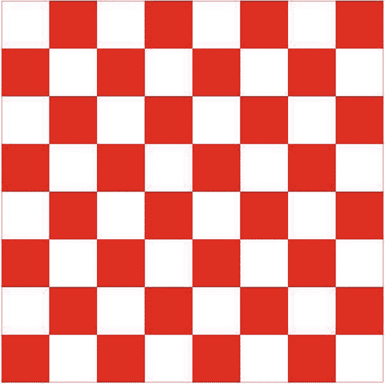

# 十、画布

在这一章中，我将展示如何使用 HTML5 中的`canvas`元素来创建一些有趣的图形。正如您将看到的，它与您在前一章探索的 SVG 非常不同。稍后我将更详细地讨论它们的区别，但是您将注意到的主要事情是 canvas 完全是用 JavaScript 实现的。标记中唯一的部分是一个简单的元素定义，如下所示:

`<canvas id="myCanvas" width="400" height="400">`

`Canvas is not supported on this browser`

`</canvas>`

相反，您将通过使用 JavaScript 调用各种绘制方法来定义内容。就像`audio`和`video`元素一样，当浏览器不支持 canvas 时，使用`canvas`元素中的标记。您可以使用它来提供适当的回退内容。

通过本章的练习，你将创建三个不同的 canvas 实现，它们共同展示了 canvas 的功能。您将创建以下内容:

*   有移动棋子的棋盘
*   一个简单的太阳系模型
*   演示各种形状组合方式的页面

当然，您可以发挥您的想象力，将这些原则应用到许多有趣且引人注目的图形应用中。

## 创造一个棋盘

在第一个应用中，您将绘制一个棋盘，它只是一系列颜色交替的方块。我将向你展示如何使用渐变来使棋盘更有趣一点。您将使用图像文件在适当的方格中绘制棋子。最后，您将应用一点动画来移动棋盘上的棋子。这将让你在进入更高级的话题之前，对基本的绘画技巧有一个很好的了解。

### 创建 Visual Studio 项目

首先，您将创建一个 Visual Studio 项目，使用您在前面章节中使用的相同的空模板。

EXERCISE 10-1\. CREATING THE VISUAL STUDIO PROJECTStart Visual Studio 2015\. In the Start Page, click the New Project link.   In the New project dialog box, select the ASP.NET Web Application template. Enter the project name Chapter 10 and select a location for this project.   In the next dialog box, select the ASP.NET 5 Empty template. Click the OK button and the project will be created.   Open the `Startup.cs` file and comment out the implementation for the `Configure()` method like this: `public void Configure(IApplicationBuilder app)` `{`     `//app.Run(async (context) =>`     `//{`     `//    await context.Response.WriteAsync("Hello World!");`     `//});` `}`   In Solution Explorer, right-click the `wwwroot` folder and click the Add and New Item links. In the Add New Item dialog box, select the HTML Page template, enter the name Index.html, and click the Add button.  

`canvas`元素被恰当地命名，因为它提供了一个可以用来绘图的区域。当您创建一个`canvas`元素时，您使用`height`和`width`属性来定义它的大小。您可以通过标记或 CSS 指定其他属性来指定`margin`、`padding`和`border`。这些属性影响元素在页面中的位置。但是，您不能修改元素中的任何内容。元素本身简单地定义了一个空白区域，你可以在上面创建你的杰作。

当在 HTML 中创建一个`canvas`元素时，通常会分配一个`id`属性，这样就可以在 JavaScript 中使用`getElementById()`方法访问它。你不必这样做；你可以使用`getElementsByTagName()`方法或者使用我在第五章中描述的新的查询选择器来访问它。

一旦有了`canvas`元素，就可以通过调用`getContext()`来获得它的绘图上下文。您必须指定要使用的上下文。上下文指定了一组 API 函数和绘图功能。唯一普遍可用的是`2d`，我们将在本章中专门使用它。

Note

另一个可能的上下文并不像您所期望的那样是`3d`；它是`WebGL`，或者在某些浏览器中是`experimental-webgl`。这还没有准备好迎接黄金时间，而且它与`2d`的背景非常不同。

### 绘制矩形

与 SVG 不同，您可以直接绘制的唯一形状是矩形。你可以使用路径绘制更复杂的形状，我稍后会解释。有三种方法可以用来绘制矩形。

*   `clearRect()`:清除指定的矩形
*   `strokeRect()`:在指定的矩形周围绘制一个无填充的边框
*   `fillRect()`:绘制一个填充矩形

这些方法中的每一个都有四个参数。前两个定义矩形左上角的 x 和 y 坐标。最后两个参数分别指定宽度和高度。绘图上下文具有`strokeStyle`和`fillStyle`属性，控制如何绘制边框或填充。在绘制矩形之前设置这些。设置后，所有后续形状都将使用这些属性绘制，直到您更改这些属性。

Tip

就像 SVG 一样，在 canvas 中，`canvas`元素的左上角有 0，0 的 x 和 y 坐标。

为了演示如何绘制矩形，您将从绘制棋盘开始，棋盘包含八行，每行八个正方形。

EXERCISE 10-2\. DRAWING A SIMPLE CHESSBOARDAdd a canvas to the `index.html` page by inserting the following markup in the blank `body` that was created by the template: `<canvas id="board" width ="600" height ="600">`     `Not` `supported` `</canvas>`   Then add a `script` element after the `canvas` element but still inside the `body` element using the code shown in Listing 10-1.  

清单 10-1。画一个简单的棋盘

``

Save your changes and press F5 to start the application. The page should look like Figure 10-1.

图 10-1。

The initial chessboard  

`drawBoard()`函数首先清除将要绘制的区域。然后，它使用嵌套的`for`循环来绘制方块。`fillStyle`和`strokeStyle`属性都设置为红色；默认情况下，它们都是黑色的。请注意，它只画红色方块。由于整个区域首先被清除，任何未被绘制的区域将是白色的。这段代码使用嵌套的`for`循环来遍历八行八列。红色方块是行和列之和为奇数的方块。对于偶数行(0、2、4 和 6)，奇数列(1、3、5 和 7)将为红色。对于奇数行，偶数列将为红色。为了清理边缘方块，在整个棋盘周围画一个红色边框。

### 使用渐变

您也可以使用渐变来填充形状，而不是纯色。为此，您必须首先使用绘图上下文的`createLinear` `Gradient()`方法创建一个渐变对象。这个方法有四个参数，分别是渐变起点和终点的 x 和 y 坐标。这允许您指定渐变应该从上到下、从左到右还是从一个角到另一个角。渐变是在整个画布上计算的。不能为单个元素定义渐变。

然后，您必须定义色标。每个色标定义了沿渐变的一个位置和一种颜色。至少，您需要在 0 和 1 处设置色标，用于定义开始和结束颜色。如果您想要控制过渡，也可以在它们之间添加色标。例如，如果要在中间点定义颜色，请使用 0.5。

最后，您将使用这个渐变来指定`fillStyle`属性。要进行尝试，请添加以粗体显示的以下代码:

`function drawBoard() {`

`chessContext.clearRect(0, 0, 600, 600);`

`var gradient = chessContext.createLinearGradient(0, 600, 600, 0);`

`gradient.addColorStop(0.0, "#D50005");`

`gradient.addColorStop(0.5, "#E27883");`

`gradient.addColorStop(1.0, "#FFDDDD");`

`chessContext.fillStyle = gradient;`

`chessContext.strokeStyle = "red";`

保存您的更改，然后按 F5 启动应用。该页面现在应该如图 10-2 所示。请注意，颜色会在整个画布上过渡，而不是在每个方块上过渡。

图 10-2。

The board using a gradient fill

### 使用图像

现在，您已经准备好添加棋子，这些棋子将使用图像文件绘制。将图像添加到画布上真的很容易。您创建一个`Image`对象，将其`src`属性设置为图像文件的位置，然后调用绘图上下文的`drawImage()`方法，如下所示:

`var myImage = new Image();`

`myImage.src = "img/sample.jpg";`

`context.drawImage(myImage, 0,0, 50, 100);`

`drawImage()`方法的第一个参数指定将要绘制的图像。这可以是一个`Image`对象，正如我在这里展示的。或者，您也可以指定一个已经在页面上的`img`、`video`或`canvas`元素。接下来的两个参数指定图像左上角的 x 和 y 位置。第四个和第五个参数是可选的，它们分别指定图像的宽度和高度。如果不指定这些参数，将使用图像的固有大小来绘制图像。

`drawImage()`方法还允许您提供四个额外的参数。这些仅用于指定应该在画布上显示的图像部分。这些附加参数包括指定左上角的 x 坐标和 y 坐标，以及定义指定部分的宽度和高度。如果您只想绘制图像的一部分，请使用最后四个参数。如果省略这些，将显示整个图像。

在这个应用中，您将使用 12 幅不同的图像绘制 32 幅作品。此外，在本章的后面，您将添加代码来移动这些部分。为了方便起见，您将在应用中添加一些结构。您将定义一个存储棋子属性的类，例如要使用的图像及其在棋盘上的位置。然后，您将实现一个使用这些属性的细节的通用绘图函数。

EXERCISE 10-3\. DRAWING CHESS PIECESIn Solution Explorer, right-click the `wwwroot` folder and click the Add and New Folder links. Enter images for the folder name.   The images for the chess pieces are included in the source code download file. You’ll find these in the `Chapter 10` `\Images` folder. Drag all 12 files to the `wwwroot\images` folder in Solution Explorer.   Add the variable declarations shown in bold in Listing 10-2 to your `script` element. This will define a variable to reference an `Image` object for each of the 12 image files. It will also define an array that you will be using to store the 32 chess pieces.  

清单 10-2。定义图像变量

``

清单 10-5。实现 createPieces()函数

`function createPieces() {`

`var piece;`

`// Black pawns`

`for (var i = 0; i < 8; i++) {`

`piece = new ChessPiece();`

`piece.image = imgPawn,`

`piece.x = i;`

`piece.y = 1;`

`piece.height = 50;`

`piece.width = 28;`

`pieces[i] = piece;`

`}`

`// Black rooks`

`piece = new ChessPiece();`

`piece.image = imgRook;`

`piece.x = 0;`

`piece.y = 0;`

`piece.height = 60;`

`piece.width = 36;`

`pieces[8] = piece;`

`piece = new ChessPiece();`

`piece.image = imgRook;`

`piece.x = 7;`

`piece.y = 0;`

`piece.height = 60;`

`piece.width = 36;`

`pieces[9] = piece;`

`// Black knights`

`piece = new ChessPiece();`

`piece.image = imgKnight;`

`piece.x = 1;`

`piece.y = 0;`

`piece.height = 60;`

`piece.width = 36;`

`pieces[10] = piece;`

`piece = new ChessPiece();`

`piece.image = imgKnight;`

`piece.x = 6;`

`piece.y = 0;`

`piece.height = 60;`

`piece.width = 36;`

`pieces[11] = piece;`

`// Black bishops`

`piece = new ChessPiece();`

`piece.image = imgBishop;`

`piece.x = 2;`

`piece.y = 0;`

`piece.height = 65;`

`piece.width = 30;`

`pieces[12] = piece;`

`piece = new ChessPiece();`

`piece.image = imgBishop;`

`piece.x = 5;`

`piece.y = 0;`

`piece.height = 65;`

`piece.width = 30;`

`pieces[13] = piece;`

`// Black queen`

`piece = new ChessPiece();`

`piece.image = imgQueen;`

`piece.x = 3;`

`piece.y = 0;`

`piece.height = 70;`

`piece.width = 32;`

`pieces[14] = piece;`

`// Black king`

`piece = new ChessPiece();`

`piece.image = imgKing;`

`piece.x = 4;`

`piece.y = 0;`

`piece.height = 70;`

`piece.width = 28;`

`pieces[15] = piece;`

`// White pawns`

`for (var i = 0; i < 8; i++) {`

`piece = new ChessPiece();`

`piece.image = imgPawnW,`

`piece.x = i;`

`piece.y = 6;`

`piece.height = 50;`

`piece.width = 28;`

`pieces[16 + i] = piece;`

`}`

`// White rooks`

`piece = new ChessPiece();`

`piece.image = imgRookW;`

`piece.x = 0;`

`piece.y = 7;`

`piece.height = 60;`

`piece.width = 36;`

`pieces[24] = piece;`

`piece = new ChessPiece();`

`piece.image = imgRookW;`

`piece.x = 7;`

`piece.y = 7;`

`piece.height = 60;`

`piece.width = 36;`

`pieces[25] = piece;`

`// White knights`

`piece = new ChessPiece();`

`piece.image = imgKnightW;`

`piece.x = 1;`

`piece.y = 7;`

`piece.height = 60;`

`piece.width = 36;`

`pieces[26] = piece;`

`piece = new ChessPiece();`

`piece.image = imgKnightW;`

`piece.x = 6;`

`piece.y = 7;`

`piece.height = 60;`

`piece.width = 36;`

`pieces[27] = piece;`

`// White bishops`

`piece = new ChessPiece();`

`piece.image = imgBishopW;`

`piece.x = 2;`

`piece.y = 7;`

`piece.height = 65;`

`piece.width = 30;`

`pieces[28] = piece;`

`piece = new ChessPiece();`

`piece.image = imgBishopW;`

`piece.x = 5;`

`piece.y = 7;`

`piece.height = 65;`

`piece.width = 30;`

`pieces[29] = piece;`

`// White queen`

`piece = new ChessPiece();`

`piece.image = imgQueenW;`

`piece.x = 3;`

`piece.y = 7;`

`piece.height = 70;`

`piece.width = 32;`

`pieces[30] = piece;`

`// White king`

`piece = new ChessPiece();`

`piece.image = imgKingW;`

`piece.x = 4;`

`piece.y = 7;`

`piece.height = 70;`

`piece.width = 28;`

`pieces[31] = piece;`

`}`

Modify the `drawBoard()` function to also call `drawAllPieces()` after the board has been drawn.     `// Add a border around the entire board`     `chessContext.strokeRect(0, 0, 600, 600);`     `drawAllPieces();` `}`   Finally, replace the call to `drawBoard()` function in the main script with the code shown in bold. This will call the `loadImages()` and `createPieces()` functions and wait 300ms before calling `drawBoard()`. `// Define an array to store 32 pieces` `var pieces = new Array(32);` `loadImages();` `createPieces();` `setTimeout(drawBoard, 300);` `// Draw the chess board` `function drawBoard() {`   Save your changes and press F5 to start the application. You should now see the chess pieces, as shown in Figure 10-3.

图 10-3。

The chess board with the pieces displayed   Note

当您创建一个`Image`对象并设置它的`src`属性时，指定的图像文件被异步下载。有可能在调用`drawImage()`函数之前文件还没有被加载。如果发生这种情况，图像不会显示。300 毫秒的延迟是解决这个问题的简单方法。您可以为每个`Image`对象实现`onload`事件处理程序，当图像被加载时会调用这个处理程序。这有点复杂，因为您需要等待所有 12 个图像被加载。

### 添加简单动画

为了演示使用 canvas 的简单动画，您将四处移动各个部分。绘制每个棋子的函数根据该棋子所在的正方形计算位置。要移动一个棋子，只需要更新`x`或`y`属性，然后重画即可。

当您在新位置重绘一个片段时，它在旧位置仍然可见。此外，如果你要通过在同一个方块中移动一个棋子来捕捉另一个棋子，你将会在同一个方块中得到两个棋子。您可以实现一些复杂的逻辑来清除方块，并在移动棋子之前重新绘制一个红色或白色的方块。然而，在这个演示中，您将简单地清除整个画布并重新绘制棋盘和所有的棋子。

为了实现自动化，您将创建一个`makeNextMove()`函数。这将调整一个棋子的`x`和`y`位置，然后重新绘制棋盘和所有的棋子。您将使用`setInterval()`函数反复调用它，这样棋子将会连续移动。

EXERCISE 10-4\. ANIMATING THE CHESS PIECESAdd the following variables shown in bold near the beginning of the `script` element: `// Define an array to store 32 pieces` `var pieces = new Array(32);` `var moveNumber = -1;` `var timer;` `loadImages();`   Implement the `makeNextMove()` function shown in Listing 10-6. This code “moves” a piece by adjusting its `x` and `y` properties. It keeps track of the move number and uses this to adjust the appropriate piece. The seventh move captures a piece and sets its `killed` property. Since this ends the animation, the seventh move also uses the `clearTimer()` function so no more timer events will occur. After each move, the board and all the pieces are redrawn. After the seventh move, this function also uses the `fillText()` method, which is used to write text to the canvas.  

清单 10-6。makeNextMove 实现

`function makeNextMove() {`

`function inner() {`

`if (moveNumber === 1) {`

`pieces[20].y--;()`

`}`

`if (moveNumber === 2) {`

`pieces[4].y += 2;`

`}`

`if (moveNumber === 3) {`

`pieces[29].y = 4;`

`pieces[29].x = 2;`

`}`

`if (moveNumber === 4) {`

`pieces[6].y++;`

`}`

`if (moveNumber === 5) {`

`pieces[30].x = 5;`

`pieces[30].y = 5;`

`}`

`if (moveNumber === 6) {`

`pieces[7].y++;`

`}`

`if (moveNumber === 7) {`

`pieces[30].x = 5;`

`pieces[30].y = 1;`

`pieces[5].killed = true;`

`clearInterval(timer);`

`}`

`moveNumber++;`

`drawBoard();`

`drawAllPieces();`

`if (moveNumber > 7) {`

`chessContext.font = "30pt Arial";`

`chessContext.fillStyle = "black";`

`chessContext.fillText("Checkmate!", 200, 220);`

`}`

`}`

`return inner;`

`}`

Add the following code to the end of the main script, just before the `drawBoard()` function definition. This will call the `makeNextMove()` function every two seconds. `timer = setInterval(makeNextMove(), 2000);`   Save your changes and press F5 to start the application. After a series of moves, the page should look like Figure 10-4.

图 10-4。

The completed chess board`()`   Caution

`makeNextMove()`函数使用了一个经常被误解的 JavaScript 特性，叫做 closure。这个函数定义了另一个名为`inner()`的函数，它执行实际的工作。然后返回`inner()`函数。当定时器到期时，`window`对象将调用`makeNextMove()`函数。然而，它使用的所有变量，比如棋子的数组，都不在范围之内。`inner()`函数将能够访问这些变量，因此这解决了范围问题。关于闭包的更多信息，请参见本文: [`http://stackoverflow.com/questions/111102/how-do-javascript-closures-work`](http://stackoverflow.com/questions/111102/how-do-javascript-closures-work) 。

## 模拟太阳系

在下一张画布上，你将绘制一个移动的太阳系模型。出于时间的考虑，您将只显示地球、太阳和月亮。这个实现将利用 canvas 的这两个重要特性:

*   小路
*   转换

### 使用路径

正如我前面提到的，canvas 支持的唯一简单形状是矩形，您在前面的示例中使用了它。对于所有其他形状，您必须定义一个路径。在 canvas 中定义路径的基本方法类似于 SVG。使用移动命令设置起点，然后使用直线和曲线命令的组合来绘制形状。

在 canvas 中，你总是从一个`beginPath()`命令开始。调用所需的绘图命令后，通过调用`stroke()`绘制形状轮廓或`fill()`填充形状来完成路径。在调用`stroke()`或`fill()`之前，形状不会真正绘制到画布上。如果在完成当前形状之前再次调用`beginPath()`(调用`stroke()`或`fill()`)，画布将忽略之前未完成的命令。与矩形相同的`strokeStyle`和`fillStyle`属性也定义了路径的颜色。

实际的绘图命令如下:

*   `moveTo()`
*   `lineTo()`
*   `arcTo()`
*   `bezierCurveTo()`
*   `quadraticCurveTo()`

此外，这些函数可用于绘图:

*   `closePath()`:从当前位置到起始位置执行一个`lineTo()`命令，以闭合形状。如果您使用`fill()`命令，如果您当前不在起始位置，则会自动调用`closePath()`功能。
*   `arc()`:在指定位置画一条弧；你不必先搬到那里。然而，这仍然被视为路径；你需要首先调用`beginPath()`，直到你调用`stroke()`或者`fill()`时，弧线才真正画出来。

### 画弧线

`arc()`命令是一个您可能会经常使用的命令，并且在本例中很重要。`arc()`命令采用以下参数:

`arc(x, y, radius, start, end, counterclockwise)`

前两个参数指定中心点的 x 和 y 坐标。第三个参数指定半径。第四个和第五个参数确定圆弧的起点和终点。它们被指定为与 x 轴的角度。0°角是圆的右边；90 度角是圆的底边。然而，角度是以弧度而不是度数来指定的。

除非你在画一个完整的圆，否则弧线的方向很重要。例如，如果你画一个从 0 度到 90 度的圆弧，那么这个圆弧将是圆的 1/4，从右侧到底部。然而，使用相同的端点，但以逆时针方向绘制，该弧将是圆的 3/4。最后一个参数，如果为 true，则表示应该以逆时针方向画弧线。该参数是可选的。如果不指定，它会顺时针方向画圆弧。

### 使用转换

起初，canvas 中的变换看起来有点混乱，但是一旦你理解了它们是如何工作的，它们会很有帮助。首先，变换对已经在画布上绘制的内容没有影响。相反，变换会修改将用于绘制后续形状的网格系统。在本章中，我将演示三种类型的转换。

*   翻译
*   轮流
*   缩放比例

正如我前面提到的，一个`canvas`元素使用一个网格系统，原点在画布的左上角。因此，100，50 处的一个点将是从该角向右 100 像素，向下 50 像素。转换只是调整网格系统。例如，以下命令将原点向右移动 100 像素，向下移动 50 像素:

`context.translate (100, 50);`

如图 10-5 所示。

图 10-5。

Translating the context origin

现在，当你移动到 10，20，因为这是相对于新的原点，实际位置(相对于画布)，将是 110，70。你可能想知道为什么你会想这样做。嗯，假设你在画一面美国国旗，上面有 50 颗星星。五角星是一个相当复杂的图形，需要大量的绘图命令。一旦你画了第一颗星，你需要重复这个过程 49 次，每次使用不同的值。

通过简单地将上下文向右平移一点，您可以使用相同的值重复相同的命令。但是现在这颗星将会在不同的位置。当然，您可以通过创建一个接受`x`、`y`参数的`drawStar()`函数来完成同样的事情。然后调用这个 50 次，传入不同的值。然而，一旦你习惯了使用变换，你会发现这更容易，特别是与其他类型，如旋转。

旋转变换不会移动原点；相反，它将 x 轴和 y 轴旋转指定的量。正值用于顺时针旋转，负值用于逆时针旋转。图 10-6 展示了旋转变换是如何工作的。

图 10-6。

Rotating the drawing context’s grid Note

我将旋转角度指定为 30 °,因为这是大多数人所熟悉的。然而，`rotate()`命令需要弧度值。如果你的几何有点生疏，一整圈就是 360 或者 2π弧度。在 JavaScript 中，可以使用`Math.PI`属性来获取π (Pi)的值。例如，30 是一整圆的 1/12，所以你可以把它写成(`Math.PI*2/12)`)。一般情况下，弧度计算为`degrees * (Math.PI/180)`。

您可以使用多重转换。例如，可以平移原点，然后旋转 x 轴或 y 轴。你也可以再旋转网格一些，然后再平移一次。每个变换总是相对于当前位置和方向。

### 保存上下文状态

绘图上下文的状态包括各种属性，如您已经使用过的`fillStyle`和`strokeStyle`。它还包括已应用的所有转换的累积。如果你开始使用多重转换，回到原始状态可能会很困难。幸运的是，绘图上下文提供了保存和恢复上下文状态的能力。

通过调用`save()`函数保存当前状态。保存状态会将当前状态推送到堆栈上。调用`restore()`函数将最近保存的状态弹出堆栈，并使其成为当前状态。如图 10-7 所示。

图 10-7。

Saving and restoring the drawing context state

在进行任何转换之前，尤其是复杂的转换之前，通常应该保存状态。当您绘制完需要转换的任何元素后，您可以将状态恢复到原来的样子。记住，通过设置`fillStyle`或执行转换来改变状态不会影响已经绘制的内容。

### 绘制太阳系

有了这些特征，让我们画一个简单的太阳系模型。

EXERCISE 10-5\. MODELING THE SOLAR SYSTEMOpen the `index.html` file and add the `canvas` element shown in bold just after the existing `canvas` element. `
`     `<canvas id="board" width ="600" height ="600">`         `Not supported`     `</canvas>`     `<canvas id="solarSystem" width="450" height="400">`         `Not supported`     `</canvas>` `
`   Add a new `script` element in the `body` element just after the existing `script` element using the code shown in Listing 10-7.  

清单 10-7。初始太阳系实现

``

提示在 Visual Studio 中，可以在编辑器中折叠 HTML 元素。因为您已经完成了前面的`script`元素，所以您可以折叠它，这样可以更容易地看到您将要处理的新元素。虽然您不需要设置`script`元素的`id`属性，但是如果您设置了，它会在元素折叠时显示出来，如图 10-8 所示。这将使管理包含多个`script`元素的页面变得更加容易。

This code gets the `canvas` element and then obtains the `2d` drawing context, just like the previous example. It then uses the `setInterval()` function to call the `animateSS()` function every 100 milliseconds. The `animateSS()` function is what does the real work. It clears the entire area and then fills it with dark blue. The rest of the code relies on transformations, so it first saves the drawing context and then restores it when finished.   This `animateSS()` function uses the `translate()` function to move the origin to the approximate midpoint of the canvas. The sun and the earth orbits are drawn using the `arc()` function. Notice the center point for both is 0, 0 since the context’s origin is now in the middle of the canvas. Also, notice the start angle is 0 and the end angle is specified as `Math.PI 2`. In radians, this is a full circle or 360°. The arc for the sun is filled in, and the orbit is not.   Press F5 to start the application. So far, the drawing is not very interesting; it’s a sun with an orbit drawn around it, as shown in Figure 10-9.

图 10-9。

The initial solar system drawing   Now you’ll draw the earth and animate it around the orbit. Normally the earth will revolve around the sun once every 365.24 days, but we’ll speed this up a bit and complete the trip in 60 seconds. To determine where to put the earth each time the canvas is redrawn, you must calculate the number of seconds. The amount of rotation per second is calculated as `Math.PI * 2 / 60`. Multiply this value by the number of seconds to determine the angle where the earth should be.   Add the code from Listing 10-8 that is shown in bold. This code uses the `rotate` function to rotate the drawing context the appropriate angle. Since the arc for the earth orbit is 150px, this code then uses the `translate` function to move the context 150 pixels to the right so the earth can be drawn at the adjusted 0,0 coordinate. Notice that this is combining two separate transforms, one to rotate based the earth position in its orbit and one to translate the appropriate distance from the sun. The earth is then drawn using a filled arc with a center point of 0,0, the new origin of the context.  

图 10-8。

Collapsing the script element

清单 10-8。绘制地球

`// Draw the earth orbit`

`ssContext.strokeStyle = "black";`

`ssContext.beginPath();`

`ssContext.arc(0, 0, 150, 0, Math.PI * 2);`

`ssContext.stroke();`

`// Compute the current time in seconds (use the milliseconds`

`// to allow for fractional parts).`

`var now = new Date();`

`var seconds = ((now.getSeconds() * 1000) + now.getMilliseconds()) / 1000;`

`//---------------------------------------------`

`// Earth`

`//---------------------------------------------`

`// Rotate the context once every 60 seconds`

`var anglePerSecond = ((Math.PI * 2) / 60);`

`ssContext.rotate(anglePerSecond * seconds);`

`ssContext.translate(150, 0);`

`// Draw the earth`

`ssContext.fillStyle = "green";`

`ssContext.beginPath();`

`ssContext.arc(0, 0, 10, 0, Math.PI * 2, true);`

`ssContext.fill();`

`ssContext.restore()`

Save your changes and press F5 to start the application. Now you should see the earth make its way around the sun, as shown in Figure 10-10.

图 10-10。

Adding the earth to the drawing   Now you’ll show the moon revolving around the earth, which will demonstrate the real power of using transformations. The specific position of the moon is based on two moving objects. While it’s certainly possible to compute this using some complex formulas (scientists have been doing this for centuries) with transformations, you don’t have to. The drawing context was rotated the appropriate angle based on current time (number of seconds). It was then translated by the radius of the orbit, so the earth is now at the origin of the context. It doesn’t really matter where the earth is; you can simply draw the moon relative to the current origin.   You will now draw the moon just like you drew the earth. Instead of the origin being at the sun and rotating the earth around the sun, the origin is on the earth, and you’ll rotate the moon around the earth. The moon will rotate around the earth approximately once each month; in other words, it will complete about 12 revolutions for each earth orbit. So, you’ll need to rotate 12 times faster. The `anglePerSecond` is now computed as `12 * ((` `Math.PI * 2` `) / 60)`. Add the code shown in bold in Listing 10-9.  

清单 10-9。画月亮

`// Draw the earth`

`ssContext.fillStyle = "green";`

`ssContext.beginPath();`

`ssContext.arc(0, -0, 10, 0, Math.PI * 2, true);`

`ssContext.fill();`

`//---------------------------------------------`

`// Moon`

`//---------------------------------------------`

`// Rotate the context 12 times for every earth revolution`

`anglePerSecond = 12 * ((Math.PI * 2) / 60);`

`ssContext.rotate(anglePerSecond * seconds);`

`ssContext.translate(0, 35);`

`// draw the moon`

`ssContext.fillStyle = "white";`

`ssContext.beginPath();`

`ssContext.arc(0, 0, 5, 0, Math.PI * 2, true);`

`ssContext.fill();`

`ssContext.restore()`

注意，每个太阳年大约有 12.368 个太阴月。通过使用这个数字而不是前面代码中的 12，可以使模型更加精确。

Save your changes and press F5 to start the application. You should now see the moon rotating around the earth, as shown in Figure 10-11.

图 10-11。

Including the moon  

### 应用缩放

在你完成这个模型之前，你要做一个小小的修改。地球的轨道实际上不是一个正圆。这种属性被称为偏心率。(如果你对轨道偏心率感到好奇，请查看 [`http://en.wikipedia.org/wiki/Orbital_eccentricity`](http://en.wikipedia.org/wiki/Orbital_eccentricity) 的文章。)要在您的绘图中对此进行建模，您将拉伸轨道，使其宽度略大于高度。为此，您将使用缩放。

`scale()`函数执行第三种类型的转换。该函数采用两个参数来指定沿 x 轴和 y 轴的缩放比例。比例因子 1 是正常比例。小于 1 的系数将压缩图形，大于 1 的系数将拉伸图形。虽然地球轨道的不完美是非常轻微的，但您会在这里将其夸大，并对 x 轴使用 1.1 的比例因子。

在绘制地球轨道之前，添加以下以粗体显示的代码:

`// Draw the earth orbit`

`ssContext.scale(1.1, 1);`

`ssContext.strokeStyle = "black";`

按 F5 键启动应用，它看起来应该如图 10-12 所示。

图 10-12。

Adding scaling

你现在有一个稍微变形的轨道。通过简单地改变比例因子，所有不同的绘图元素被成比例地调整。此外，在恢复上下文后，缩放将恢复正常，以便正确绘制后续元素。

Note

图 10-12 中的直线展示了一次日食，月亮从地球和太阳之间穿过，在地球上投下了阴影。

## 裁剪画布

我想再介绍一个与路径相关的特性。之前我说过在你调用了`beginPath()`和想要的绘图函数之后，你可以调用`stroke()`或者`fill()`。您还可以调用一个函数:`clip()`。`clip()`函数将使用您刚刚定义的路径，并且不允许在该路径之外绘制任何东西。这不会影响已经绘制的内容，但是任何将来的形状都将被限制在由该路径定义的剪辑区域内。

为了演示这一点，您将返回到国际象棋棋盘示例，并使用圆弧定义一个裁剪路径。转到 board `script`元素，将粗体显示的代码添加到`drawBoard()`函数中。

`var gradient = chessContext.createLinearGradient(0, 600, 600, 0);`

`gradient.addColorStop(0, "#D50005");`

`gradient.addColorStop(0.5, "#E27883");`

`gradient.addColorStop(1, "#FFDDDD");`

`// Clip the path`

`chessContext.beginPath();`

`chessContext.arc(300, 300, 300, 0, (Math.PI * 2), true);`

`chessContext.clip();`

`chessContext.fillStyle = gradient;`

`chessContext.strokeStyle = "red";`

`// Draw the alternating squares`

这在棋盘上定义了一个圆圈，圆圈之外的任何东西都是不可见的。按 F5 键启动应用，它看起来应该如图 10-13 所示。

图 10-13。

The chess board with a clipping path Note

如果在画板后定义裁剪路径，将会画出整个画板，但会裁剪部分，因此裁剪区域外的任何部分都将被隐藏。

## 了解合成

到目前为止你画的所有形状中，最后画的那个覆盖或隐藏了之前的任何形状。这种行为被称为合成。默认行为称为源覆盖，是在画布上已经存在的任何形状上绘制当前形状，如您所见。合成术语使用 source 来指代正在绘制的形状，使用 destination 来指代之前绘制的结果。除了`source-over`之外，您还可以使用`globalCompositeOperation`属性配置 11 种其他行为。这些可以通过查看每一种的样本得到最好的解释。

在本练习中，您将重叠一个红色正方形和一个蓝色圆形。您将这样做 12 次，每次为`globalCompositeOperation`属性使用不同的值。为了正确地工作，您将创建 12 个`canvas`元素，在每个元素上绘制相同的元素。

EXERCISE 10-6\. EXPLORING COMPOSITINGIn the main `div` element, comment out the board and `solarSystem canvas` elements and create 12 new `canvas` elements using the code shown in Listing 10-10.  

清单 10-10。创建 12 个画布元素

`
`

`
`

`<canvas id="composting1" width="120" height="120"></canvas>`

` source-over`

`
`

`
`

`<canvas id="composting2" width="120" height="120"></canvas>`

` destination-over`

`
`

`
`

`<canvas id="composting3" width="120" height="120"></canvas>`

` source-in`

`
`

`
`

`<canvas id="composting4" width="120" height="120"></canvas>`

` destination-in`

`
`

`
`

`<canvas id="composting5" width="120" height="120"></canvas>`

` source-out`

`
`

`
`

`<canvas id="composting6" width="120" height="120"></canvas>`

` destination-out`

`
`

`
`

`<canvas id="composting7" width="120" height="120"></canvas>`

` source-atop`

`
`

`
`

`<canvas id="composting8" width="120" height="120"></canvas>`

` destination-atop`

`
`

`
`

`<canvas id="composting9" width="120" height="120"></canvas>`

` xor`

`
`

`
`

`<canvas id="composting10" width="120" height="120"></canvas>`

` copy`

`
`

`
`

`<canvas id="composting11" width="120" height="120"></canvas>`

` lighter`

`
`

`
`

`<canvas id="composting12" width="120" height="120"></canvas>`

` darker`

`
`

`<!--<canvas id="board" width ="600" height ="600">`

`Not supported`

`</canvas>`

`<canvas id="solarSystem" width="450" height="400">`

`Not supported`

`</canvas> -->`

`
`

Add the following `style` element in the `head` section. This will format the `canvas` elements into three columns so you can see all 12 examples on one screen. `<style>`     `body div`     `{`         `-webkit-column-count: 3;`         `column-count: 3;`     `}` `</style`   Comment out the chessboard and solar system `script` elements. (Since the `canvas` elements are no longer on the page, the scripts will fail.)   Add the `script` element shown in Listing 10-11 to the `body` element, just after the existing `script` elements.  

清单 10-11。绘制合成画布

``

This code uses a `for` loop to process all 12 `canvas` elements. It gets the corresponding element and then obtains its drawing context. It adds a red square and then sets the `globalCompositeOperation` property. Finally, it adds a blue circle, which is offset slightly from the position of the square.   Change the debugging browser to use Chrome because this supports all of the compositing options.  

注意所有的浏览器都支持所有这些选项，除了`darker`。在撰写本文时，Chrome 是唯一正确支持`darker`的浏览器。

Save your changes and press F5 to start the application. The web page should look like Figure 10-14.

图 10-14。

Demonstrating the compositing options  

合成选项如下:

*   `source-over`:这是默认操作。源元素(正在添加的元素)被绘制在目标元素(该位置已经存在的任何元素)的顶部。
*   `destination-over`:这与`source-over`相反，源元素被添加到现有元素的下面。
*   `source-in`:仅显示源对象中也在目标元素中的部分。请注意，没有显示任何目标元素；它被用作剪贴形状。
*   `destination-in`:仅显示源元素中的目标对象部分。
*   `source-out`:只显示源元素中不与目标元素重叠的部分。
*   `destination-out`:仅显示目标元素中不与源元素重叠的部分。
*   `source-atop`:源显示在目标元素的顶部，但整个形状被目标元素剪裁。
*   `destination-atop`:源显示在目标元素的下方，但整个形状被源元素裁剪掉。
*   `xor`:仅显示源元素和目的元素不重叠的部分。
*   `copy`:名字容易让人误解。这将绘制源元素并清除所有其他元素。
*   `lighter`:这将绘制源元素和目标元素，重叠区域以较浅的颜色显示。实际的颜色是通过将源元素和目标元素的颜色值相加来确定的。
*   `darker`:这将绘制源元素和目标元素，重叠区域以较暗的颜色显示。实际颜色是通过减去源元素和目标元素的颜色值来确定的。

Tip

这些合成选项的一些名称可能不是很直观。我建议你把这个图放在手边，以便日后参考，例如，万一你不记得`copy`是做什么的。

## 摘要

在本章中，您使用了 canvas 元素来创建一些图形化的 web 页面。您使用矩形和路径在画布上绘制形状。你还在画布上加入了图像。canvas 真正强大的特性之一是应用转换的能力。适当地使用转换确实可以简化一些复杂的绘图应用。

Canvas 与 SVG 有着本质的不同。在 SVG 中，每个形状都是一个单独的 DOM 节点。这提供了两个 canvas 无法实现的重要特性:

*   将事件处理程序附加到各个形状。
*   可以操纵单个形状。一个很好的例子是定义了`:hover`伪规则，当鼠标悬停在形状上时，它允许形状的属性被改变。

与 SVG 相反，canvas 是基于像素的，这意味着它依赖于分辨率。请注意，所有绘图命令都使用像素位置或大小。当你在一个`canvas`元素上绘制一个形状时，该画布的像素会被适当地调整，所记住的只是最终的像素内容。

Canvas 由于其原始像素操作而更有效率。另一方面，SVG 必须执行大量的渲染(和重新渲染)。但是，内容密度较低的较大图像(如地图)在 SVG 中的性能通常会更好。