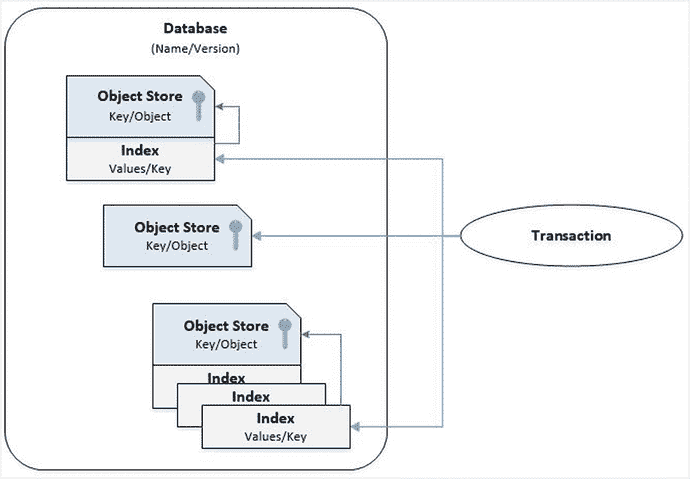
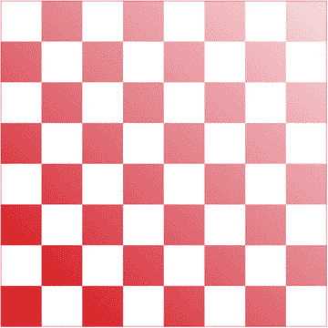
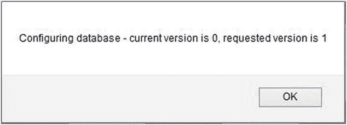
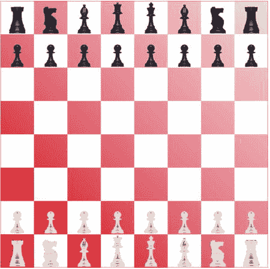
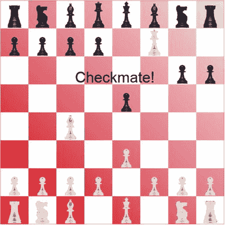
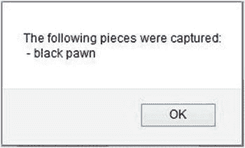

# 十一、索引数据库

随着浏览器技术的发展，在客户端设备上提供越来越多的功能，在本地存储和操作数据的需求也增加了。为了满足这一需求，出现了两种相互竞争的技术。

*   Web SQL:托管在浏览器中的 SQL 引擎
*   Indexed DB:使用键和索引存储和检索对象的 API

Note

2010 年 11 月，W3C 工作组决定停止 Web SQL 的工作，它不再是 HTML5 规范的一部分。然而，一些浏览器仍然支持它，但是它不太可能作为跨平台的标准。

本章将演示如何使用索引数据库在客户端存储和使用数据。如果你习惯使用 SQL 数据库，我要警告你，这不是 SQL 数据库。一旦你掌握了它，它就非常强大和有用，但是当你学习本章时，你需要调整你的视角，把你的 SQL 经验放在一边。

为了探索索引数据库的功能，您将重写在第十章中使用 canvas 创建的棋盘应用。当我解释每一个练习的时候，我不会深入到画布的细节；然而，如果你需要更多信息，请参考第十章。新版本的应用将创建对象存储来定义每个棋子的位置，然后在棋子移动时操作这些数据。

## 引入索引数据库

在开始详细演示之前，我认为有几个要点可以帮助您更好地理解索引数据库是如何工作的。像其他数据库一样，数据放在持久数据存储中。在这种情况下，它在本地硬盘上。数据是永久的。

我将更详细地解释这些实体中的每一个，但是我将首先介绍它们和它们的关系。数据库由对象存储组成。每个对象存储都是对象的集合，每个对象都由唯一的键标识。一个对象存储可以有一个或多个索引。每个索引都提供了另一种标识对象存储键的方法。如图 11-1 所示。

图 11-1。

The database entities

对象存储是通过事务对象访问的。创建事务时，必须定义其范围。这表明它将引用哪个对象存储，以及它将向数据库读取还是写入数据。

### 使用对象存储

主存储单元称为对象存储。这个名字很恰当，因为它们只是由一个键引用的对象的集合。您可以将它看作一组名称-值对，值是一个具有一组属性的对象。可以使用内嵌键，其中一个对象特性用作键。例如，如果对象有一个带有唯一值的`id`属性，您可以将它用作内联键。如果您使用行外键，那么您将在向存储区添加对象时指定一个键。或者，您可以使用密钥生成器，其中对象存储将为您分配递增的密钥值。以下代码演示了这些替代方案:

`// Using an inline key`

`var typeStore = db.createObjectStore("pieceType", { keyPath: "id" });`

`typeStore.add(pieceType);`

`// Using an out-of-line key`

`var sampleStore = db.createObjectStore("sample", { });`

`sampleStore.add(sample, 5);`

`// Using a key generator`

`var pieceStore = db.createObjectStore("piece", { autoIncrement: true });`

`pieceStore.add(piece);`

顾名思义，您还可以在对象存储上创建索引；事实上，您可以创建任意多的索引。索引使您能够快速找到特定的对象或对象集合。索引是名称-值对的集合，其中值是对象存储的键。例如，如果您有一个客户对象存储，并且想要按姓氏进行搜索，那么您可以在对象的`lastName`属性上创建一个索引。数据库将自动为存储中的每个对象在索引中创建一个条目。该条目将包含该对象的姓氏和相应的键。下面的代码演示了如何使用索引:

`// Create an index on the lastName property`

`customerStore.createIndex("lastName", "id", { unique: true });`

`// Get the index`

`var index = customerStore.index("lastName");`

`index.get(lastName).onsuccess = function();     // get the object`

`index.getKey(lastName).onsuccess = function();  // get the key`

`createIndex()`函数的第二个参数，在本例中是`id`，指定了关键路径。这告诉数据库引擎如何从对象中提取密钥。对于内联键，这是用于定义唯一键的属性的名称。

索引数据库不支持对象存储之间的关系。例如，您不能强制外键关系。您当然可以使用外键，其中一个对象存储中的属性是另一个对象存储的键，我将在后面演示。但是，数据库不强制此约束。此外，您不能在对象存储之间执行连接。

### 定义数据库

当您打开一个数据库时，您需要实现三个事件处理程序。

*   `onsuccess`:数据库打开；用它做点什么。
*   出现错误，可能是访问问题。
*   `onupgradeneeded`:需要创建或升级数据库。

打开数据库时，如果不存在，会自动创建；但是，会引发`onupgradeneeded`事件。您必须为此事件实现一个事件处理程序，它将创建对象存储并用任何默认数据填充它们。这是唯一允许你改变数据库结构的地方。需要记住的重要一点是，`onupgradeneeded`事件是在`onsuccess`事件之前触发的。

`open()`调用还指定了一个版本号。如果这不是当前版本，在这种情况下也会引发`onupgradeneeded`事件。您的事件处理程序需要改变结构以匹配调用者请求的版本。您可以像这样查询数据库的当前版本:

`var request = dbEng.open("Sample", 2); // get version 2`

`request.onupgradeneeded = function (event) {`

`alert("Configuring database - current version is " + e.oldVersion +`

`", requested version is " + e.newVersion);`

`}`

基于当前版本，代码可能需要执行不同的操作。

### 异步处理

索引数据库的一个关键方面是它的异步处理，可能需要一些时间来适应；几乎所有的数据库操作都是异步完成的。一般模式是调用一个方法来执行数据库操作，比如打开一个数据库或检索一组记录(对象)。这将返回一个请求对象。然后，您必须为该请求对象实现`onsuccess`和`onerror`事件处理程序。如果请求成功，则调用`onsuccess`处理程序，方法调用的结果通过`event`对象传递。

对于需要多次数据库调用的复杂处理，您需要小心嵌套事件处理程序，并考虑何时执行它们。例如，如果您需要发出三个数据库请求，您的代码可能如下所示:

`var request = dbCall1()`

`request.onsuccess = function (e1) {`

`f1(e1.target.result);`

`dbCall2().onsuccess = function (e2) {`

`f3(e2.target.result, e1.target.result);`

`dbCall3().onsuccess = function (e3) {`

`f5(e3.target.result, e2.target.result, e1.target.result);`

`}`

`f4(e2.target.result);`

`}`

`f2(e1.target.result);`

`}`

`request.onerror = function(e) {`

`alert("The call failed")`

`}`

这段代码依次调用`dbCall1()`、`dbCall2()`和`dbCall3()`，它们将被依次处理。换句话说，在`dbCall1()`完成之前，`dbCall2()`不会启动，并且只有在它成功的情况下。每个调用都提供了一个`onsuccess`事件处理程序，它会进行下一个调用。如果第一次调用失败，就会发出警报。可能出乎意料的是非数据库调用的执行顺序。数据库调用立即返回，稍后当操作完成时，调用事件处理程序。一旦对`dbCall2()`的调用完成，函数返回，并且`f2()`将被执行。稍后，`dbCall2()`完成，它的事件处理程序被调用，并且`f3()`被执行。

Tip

`onerror`事件是从层次结构中冒了出来的。例如，在请求对象上发生的错误，如果不处理，将在事务对象上引发。如果不在那里处理，它将在数据库对象上被引发。在许多情况下，您可以在数据库级别使用一个事件处理程序来处理所有的错误。

由于采用了嵌套方法，事件处理程序可以从以前的调用中访问事件对象。因此，您应该为事件参数使用唯一的名称。这将避免歧义。另外，注意使用闭包来访问这些事件对象。正如我提到的，`f2()`在`f3()`之前被调用，所以定义了`e1`参数的`dbCall1()`的事件处理程序已经完成，并且在执行`dbCall2()`的事件处理程序时不再在范围内。JavaScript 的闭包特性允许后续的事件处理程序访问这个对象。这很重要，因为如果您需要访问所有三个对象存储来完成一个操作，您将需要等到所有三个都完成，然后访问所有三个结果。

Tip

为了避免关闭，您可以从前两个数据库调用中提取您需要的属性，并将它们存储在局部变量中(在`dbCall1()`调用之前声明)。然后在`f5()`调用中，可以用这些变量代替`e1`和`e2`事件对象。这只是个人喜好的问题，因为两种方法都可以。

### 使用交易

所有的数据访问，无论是读还是写，都是在一个事务中完成的，所以您必须首先创建一个事务对象。创建事务时，指定其范围，该范围由它将访问的对象存储定义。您还可以指定模式(只读或读写)。然后，您可以从事务中获取一个对象存储，并像这样从存储中获取数据或将数据放入存储中:

`var xact = db.transaction(["piece", "pieceType"], "readwrite");`

`var pieceStore = xact.objectStore("piece");`

对于读写事务，在事务完成之前不会提交数据更改。有趣的问题是“交易何时完成？”当一个事务不再有未完成的请求时，它就完成了。记住，一切都是基于请求的。您发出一个请求，然后实现一个事件处理程序，在请求完成时做一些事情。如果该事件处理程序对该事务发出另一个请求，那么该事务将保持活动状态。这是嵌套事件处理程序的另一个重要原因。如果在没有发出另一个请求的情况下结束一个事件处理程序，事务将会完成，并且所有的更改都会被提交。如果在此之后尝试使用该事务，将会得到一个`TRANSACTION_INACTIVE_ERR`错误。

另一件要记住的事情是读写事务不能有重叠的作用域。如果您创建了一个读写事务，您可以创建第二个事务，只要它们不包含一些相同的对象存储。如果它们有重叠的范围，您必须等待第一个事务完成，然后才能创建第二个事务。但是，只读事务可以有重叠的范围。

## 创建应用

首先，您将使用 canvas 创建一个棋盘，并像上一章一样为棋子配置图像。

### 创建 Visual Studio 项目

首先，您将创建一个 Visual Studio 项目，使用与前几章中使用的相同的空模板。

EXERCISE 11-1\. CREATING THE VISUAL STUDIO PROJECTStart Visual Studio 2015\. From the Start Page, click the New Project link.   In the New project dialog box, select the ASP.NET Web Application template. Enter the project name Chapter 11 and select a location for this project.   In the next dialog box, select the ASP.NET 5 Empty template and click the OK button to create the project.   Open the `Startup.cs` file and comment out the implementation for the `Configure()` method like this:  

`public void Configure(IApplicationBuilder app)`

`{`

`//app.Run(async (context) =>`

`//{`

`//    await context.Response.WriteAsync("Hello World!");`

`//});`

`}`

In Solution Explorer, right-click the `wwwroot` folder and click the Add and New Item links. In the Add New Item dialog box, select the HTML Page template, enter the name Index.html, and click the Add button.   In the `Index.html` file, in the empty `body` element that was created, add the following markup:  

`
`

`<canvas id="board" width ="600" height ="600">`

`Not supported`

`</canvas>`

`
`

In Solution Explorer, right-click the `wwwroot` folder and click the Add and New Folder links. Enter images for the folder name.   The images for the chess pieces are included in the source code download file. These are the same images used in Chapter 10. You’ll find these in the `Chapter 10` `\Images` folder. Drag all 12 files to the `images` folder in Solution Explorer.  

### 创建画布

现在您将使用 JavaScript 设计`canvas`元素。最初的设计只是画一个空棋盘，稍后您将添加棋子。参考第十章的获取更多关于使用`canvas`元素的解释。使用清单 11-1 中的代码，在`div`元素之后和`body`元素内部添加一个`script`元素。

Listing 11-1\. Designing the Initial Canvas

``

按 F5 键启动应用，看起来应该如图 11-2 所示。

图 11-2。

The initial (blank) chessboard

### 配置图像

您将使用图像文件来表示棋子。在将它们添加到画布之前，您需要为每一个创建一个`Image`对象，并指定其`src`属性。您还将把它们放入一个数组中，以便更容易地以编程方式选择所需的图像。将清单 11-2 中所示的代码添加到您刚刚创建的`script`元素的开头，在现有代码之前。

Listing 11-2\. Adding the Image Objects

`// Define the chess piece images`

`var imgPawn = new Image();`

`var imgRook = new Image();`

`var imgKnight = new Image();`

`var imgBishop = new Image();`

`var imgQueen = new Image();`

`var imgKing = new Image();`

`var imgPawnW = new Image();`

`var imgRookW = new Image();`

`var imgKnightW = new Image();`

`var imgBishopW = new Image();`

`var imgQueenW = new Image();`

`var imgKingW = new Image();`

`// Specify the source for each image`

`imgPawn.src = "img/pawn.png";`

`imgRook.src = "img/rook.png";`

`imgKnight.src = "img/knight.png";`

`imgBishop.src = "img/bishop.png";`

`imgQueen.src = "img/queen.png";`

`imgKing.src = "img/king.png";`

`imgPawnW.src = "img/wpawn.png";`

`imgRookW.src = "img/wrook.png";`

`imgKnightW.src = "img/wknight.png";`

`imgBishopW.src = "img/wbishop.png";`

`imgQueenW.src = "img/wqueen.png";`

`imgKingW.src = "img/wking.png";`

`// Define an array of Image objects`

`var images = [`

`imgPawn ,`

`imgRook ,`

`imgKnight ,`

`imgBishop ,`

`imgQueen ,`

`imgKing ,`

`imgPawnW ,`

`imgRookW ,`

`imgKnightW ,`

`imgBishopW ,`

`imgQueenW ,`

`imgKingW`

`];`

## 创建数据库

现在，您已经准备好创建和使用本地索引 DB 数据库来配置和显示棋子。最初，数据将从静态数据加载，您只需显示起始位置。稍后，您将通过更新它们在对象存储中的位置来制作动画。

### 声明静态数据

您需要用一些数据填充数据库。对于这个应用，您只需将数据声明为静态数组，并将其复制到对象存储中。对于其他应用，这可以从服务器下载或从用户输入中输入。将清单 11-3 中所示的声明添加到`script`元素中，就在图像变量之后。

Listing 11-3\. Declaring the Static Data

`var pieceTypes = [`

`{ name: "pawn", height: "50", width: "28", blackImage: 0, whiteImage: 6 },`

`{ name: "rook", height: "60", width: "36", blackImage: 1, whiteImage: 7 },`

`{ name: "knight", height: "60", width: "36", blackImage: 2, whiteImage: 8 },`

`{ name: "bishop", height: "65", width: "30", blackImage: 3, whiteImage: 9 },`

`{ name: "queen", height: "70", width: "32", blackImage: 4, whiteImage: 10 },`

`{ name: "king", height: "70", width: "28", blackImage: 5, whiteImage: 11 }`

`];`

`var pieces = [`

`{ type: "pawn", color: "white", row: 6, column: 0, pos: "a2", killed: false },`

`{ type: "pawn", color: "white", row: 6, column: 1, pos: "b2", killed: false },`

`{ type: "pawn", color: "white", row: 6, column: 2, pos: "c2", killed: false },`

`{ type: "pawn", color: "white", row: 6, column: 3, pos: "d2", killed: false },`

`{ type: "pawn", color: "white", row: 6, column: 4, pos: "e2", killed: false },`

`{ type: "pawn", color: "white", row: 6, column: 5, pos: "f2", killed: false },`

`{ type: "pawn", color: "white", row: 6, column: 6, pos: "g2", killed: false },`

`{ type: "pawn", color: "white", row: 6, column: 7, pos: "h2", killed: false },`

`{ type: "rook", color: "white", row: 7, column: 0, pos: "a1", killed: false },`

`{ type: "rook", color: "white", row: 7, column: 7, pos: "h1", killed: false },`

`{ type: "knight", color: "white", row: 7, column: 1, pos: "b12", killed: false },`

`{ type: "knight", color: "white", row: 7, column: 6, pos: "g1", killed: false },`

`{ type: "bishop", color: "white", row: 7, column: 2, pos: "c1", killed: false },`

`{ type: "bishop", color: "white", row: 7, column: 5, pos: "f1", killed: false },`

`{ type: "queen", color: "white", row: 7, column: 3, pos: "d1", killed: false },`

`{ type: "king", color: "white", row: 7, column: 4, pos: "e1", killed: false },`

`{ type: "pawn", color: "black", row: 1, column: 0, pos: "a7", killed: false },`

`{ type: "pawn", color: "black", row: 1, column: 1, pos: "b7", killed: false },`

`{ type: "pawn", color: "black", row: 1, column: 2, pos: "c7", killed: false },`

`{ type: "pawn", color: "black", row: 1, column: 3, pos: "d7", killed: false },`

`{ type: "pawn", color: "black", row: 1, column: 4, pos: "e7", killed: false },`

`{ type: "pawn", color: "black", row: 1, column: 5, pos: "f7", killed: false },`

`{ type: "pawn", color: "black", row: 1, column: 6, pos: "g7", killed: false },`

`{ type: "pawn", color: "black", row: 1, column: 7, pos: "h7", killed: false },`

`{ type: "rook", color: "black", row: 0, column: 0, pos: "a8", killed: false },`

`{ type: "rook", color: "black", row: 0, column: 7, pos: "h8", killed: false },`

`{ type: "knight", color: "black", row: 0, column: 1, pos: "b8", killed: false },`

`{ type: "knight", color: "black", row: 0, column: 6, pos: "g8", killed: false },`

`{ type: "bishop", color: "black", row: 0, column: 2, pos: "c8", killed: false },`

`{ type: "bishop", color: "black", row: 0, column: 5, pos: "f8", killed: false },`

`{ type: "queen", color: "black", row: 0, column: 3, pos: "d8", killed: false },`

`{ type: "king", color: "black", row: 0, column: 4, pos: "e8", killed: false }`

`];`

`pieceTypes[]`数组定义了显示每个部分所需的属性，比如高度和宽度。它还为黑白图像指定了`images[]`数组中的相应索引。`pieces[]`数组包含与前一章相同的细节，如行和列，并定义了 32 个棋子的起始位置。

### 打开数据库

将清单 11-4 中所示的代码添加到`script`对象中，就在调用`drawBoard()`之后(在实现`drawBoard()`函数之前)。

Listing 11-4\. Opening the Database

`var dbEng = window.indexedDB ||`

`window.webkitIndexedDB || // Chrome`

`window.mozIndexedDB ||    // Firefox`

`window.msIndexedDB;       // IE`

`var db;  // This is a handle to the database`

`if (!dbEng)`

`alert("IndexedDB is not supported on this browser");`

`else {`

`var request = dbEng.open("Chess", 1);`

`request.onsuccess = function (event) {`

`db = event.target.result;`

`}`

`request.onerror = function (event) {`

`alert("Please allow the browser to open the database");`

`}`

`request.onupgradeneeded = function (event) {`

`configureDatabase(event);`

`}`

`}`

如果您不能访问`indexedDB`对象，那么浏览器不支持它。对于这个演示，您可以简单地使用`alert()`来通知用户并停止进一步的处理。

这段代码然后使用`indexedDB`对象打开 Chess 数据库，指定应该使用版本 1。如前所述，`open()`方法返回一个`IDBOpenDBRequest`对象。您将为此请求附加三个事件处理程序。

*   `onsuccess`:这个事件处理程序只是保存对数据库的引用。稍后您将在这里添加更多的逻辑。注意，数据库是从`event.target.result`属性中获得的，这就是所有结果的返回方式。
*   `onerror`:浏览器无法打开数据库的主要原因是浏览器屏蔽了 IndexedDB 功能。出于安全原因，可以禁用此功能。在这种情况下，系统会提示用户允许访问。或者，您可以选择显示错误消息。
*   `onupgradeneeded`:如果数据库不存在或者指定的版本不是当前版本，则会引发此问题。这调用了`configureDatabase()`函数，现在您将实现它。

### 定义数据库结构

添加清单 11-5 中所示的代码来实现`configureDatabase()`函数。

Listing 11-5\. Defining the Database Structure

`function configureDatabase(e) {`

`alert("Configuring database - current version is " + e.oldVersion +`

`", requested version is " + e.newVersion);`

`db = e.currentTarget.result;`

`// Remove all existing data stores`

`var storeList = db.objectStoreNames;`

`for (var i = 0; i < storeList.length; i++) {`

`db.deleteObjectStore(storeList[i]);`

`}`

`// Store the piece types`

`var typeStore = db.createObjectStore`

`("pieceType", { keyPath: "name" });`

`for (var i in pieceTypes){`

`typeStore.add(pieceTypes[i]);`

`}`

`// Create the piece data store (you'll add`

`// the data later)`

`var pieceStore = db.createObjectStore`

`("piece", { autoIncrement: true });`

`pieceStore.createIndex`

`("piecePosition", "pos", { unique: true });`

`}`

Caution

如果数据库不存在或者不是当前版本，将调用`configureDatabase()`函数。对于版本变更，可以使用`db.version`属性获取当前版本，然后进行必要的调整。同样，传递给`onupgradeneeded`事件处理程序的`event`对象将具有`e.oldVersion`和`e.newVersion`属性。为了简化这个项目，您只需删除所有对象存储并从头开始重建数据库。这将清除所有现有数据。这对于本例来说没问题，但是在大多数情况下，您需要尽可能地保存数据。

数据库对象的`objectStoreNames`属性包含所有已创建的对象存储的名称列表。为了删除所有现有的对象存储，这个列表中的每个名称都被传递给`deleteObjectStore()`方法。

最初，您将使用`createObjectStore()`方法创建两个数据存储。

*   包含每种类型棋子的一个对象，如兵、车或王
*   `piece`:每块包含一个对象，16 黑 16 白

#### 指定对象键

创建对象存储时，必须在调用`createObjectStore()`方法时指定存储的名称。您还可以指定一个或多个可选参数。仅支持两种。

*   `keypath`:这被指定为属性名的集合。如果使用单个属性，可以将其指定为字符串，而不是字符串的集合。这定义了将用作关键字的对象属性。如果未指定`keypath`，则必须使用密钥生成器或提供密钥来离线定义密钥，如本节稍后所述。
*   `autoIncrement`:如果为真，这表示关键字是由对象存储顺序分配的。

存储中的每个对象都必须有一个唯一的键。有三种方法可以指定密钥。

*   使用`keypath`参数指定一个或多个定义唯一键的属性。随着对象的添加，`keypath`用于根据对象的属性生成一个键。
*   使用密钥生成器。如果指定了`autoIncrement`，对象存储将根据内部计数器分配一个键。
*   添加对象时提供键值。如果不指定密钥路径或使用密钥生成器，则在向存储区添加对象时必须提供密钥。

对于`pieceType`商店，您将使用一个`keypath`。`name`属性将指定类型，如`pawn`或`knight`。这将是每个对象的唯一值。这也是将用于检索对象的值，因此这是关键路径的完美候选。创建对象存储后，来自`pieceTypes[]`数组的数据被复制到`pieceType`存储。

Note

而在`onupgradeneeded`事件处理程序中，数据可以添加到对象存储中，而无需显式创建事务。为响应`onupgradeneeded`事件，创建了一个隐式事务。

#### 创建索引

对于`piece`商店，片段数据中没有可用的自然键，所以您将使用一个键生成器。它将生成唯一的密钥，但这些密钥没有实际意义；它们只是用来满足唯一约束的合成键。最初当你在画板的时候，你会检索所有的对象，所以你不需要知道键是什么。

稍后，您需要取回一个棋子，以便移动它。您将根据棋子在棋盘上的位置找到所需的棋子。为了方便起见，您将基于`pos`属性向存储添加一个索引。因为没有两个片段可以占据相同的空间，所以可以使用`pos`属性作为唯一索引。通过将此指定为唯一索引，如果试图插入与现有对象位置相同的对象，将会出现错误。

Caution

因为`pos`属性是惟一的，所以您可能想用它作为键。然而，由于您将移动棋子，它们的位置将会改变，使用经常改变的键被认为是一种糟糕的设计模式。对于索引数据库，这尤其成问题，因为您实际上不能更改一个键；您必须删除当前对象，然后用新密钥添加它。

创建索引时，必须像这样指定一个`keypath`:

`pieceStore.createIndex`

`("piecePosition", "pos", { unique: true });`

在这种情况下，`pos`属性就是这个索引的`keypath`。`keypath`可能包含多个属性，在这种情况下，索引将基于所选属性的组合。当对象存储有索引时，当对象添加到存储时，索引会自动填充。

#### 重置电路板

您已经创建了`piece`对象存储，但是还没有填充它。您将在一个单独的函数中完成这项工作。为了理解为什么，让我解释一下数据库的生命周期。第一次显示网页时，会打开数据库，因为它不存在，所以会创建一个新的数据库。这是因为引发了`onupgradeneeded`事件，并且您实现了这个事件处理程序来创建对象存储。当页面再次显示时(或者只是刷新)，这一步将被跳过，因为数据库已经存在。

稍后，当您开始移动和删除这些片段时，您会希望在页面重新加载时将它们移回初始位置。你可以用这种方法来做那件事。现在，您将使用以下代码向`script`添加一个`resetBoard()`函数。这不会在创建数据库时调用，而是在加载页面时调用。

`function resetBoard() {`

`var xact = db.transaction(["piece"], "readwrite");`

`var pieceStore = xact.objectStore("piece");`

`var request = pieceStore.clear();`

`request.onsuccess = function(event) {`

`for (var i in pieces) {`

`pieceStore.put(pieces[i]);`

`}`

`}}`

这段代码使用读写模式创建了一个事务，并且只指定了`piece`对象存储，因为这是您唯一需要访问的对象存储。然后从事务中获得`piece`存储。`clear()`方法用于删除存储中的所有对象。最后，`pieces[]`数组中的所有对象都被复制到对象存储中。

现在将下面以粗体显示的代码添加到`onsuccess`事件处理程序中。这将在数据库打开后调用`resetBoard()`函数。`()`

Note

引发了`onupgradeneeded`事件，并且其事件处理程序必须在引发`onsuccess`事件之前完成。这确保了数据库在使用之前已经被正确配置。

`var request = dbEng.open("Chess", 1);`

`request.onsuccess = function (event) {`

`db = event.target.result;`

`// Add the pieces to the board`

`resetBoard();`

`}`

Tip

在`resetBoard()`函数中，您调用了`put()`方法(重复 32 次)。但是，您没有获得任何响应对象或实现任何事件处理程序。这段代码看起来是同步运行的。实际上，这些调用是异步处理的，在两种情况下都会返回一个响应对象，但是返回值被忽略了。您可以为这些请求实现`onsuccess`和`onerror`事件处理程序。在这种情况下，你作弊了一点。因为不需要像检索数据时那样需要结果值，所以不必处理`onsuccess`事件。因为这些调用是在一个事务中进行的，所以在更新完成之前，不同的事务对这些对象存储的后续使用将被阻止。

## 画碎片

到目前为止，您已经打开了数据库，并在必要时配置了对象存储。您还用初始位置填充了件商店。现在，您已经准备好绘制碎片了。为此，您将实现一个`drawAllPieces()`函数来遍历所有的片段，并实现一个`drawPiece()`函数来显示单个图像。这些功能将类似于你在第十章中创建的同名功能。但是，这些函数的数据将从新数据库中检索。

`drawAllPieces()`函数将使用游标来处理`piece`对象存储中的所有对象。对于每一块，这将提取必要的属性，并将它们传递给`drawPiece()`函数。然后，`drawPiece()`函数必须访问`pieceType`存储以获取类型属性，如`height`和`width`，并在适当的位置显示图像。

### 使用光标

当从对象存储中检索数据时，如果您想使用它的键检索单个记录，使用`get()`方法，我将在下面描述它。你也可以使用一个索引来选择一个或多个对象，我将在本章后面解释这一点。要获得所有的片段，您需要访问整个对象存储，这将使用游标来完成。

在创建事务并获得对象存储之后，您将调用它的`openCursor()`方法。这将返回一个`IDBRequest`对象，您需要为它提供一个`onsuccess`事件处理程序。当事件触发时，它只提供第一个对象。您可以通过调用`continue()`方法获得下一个对象。为了演示这一点，将清单 11-6 中所示的函数添加到`script`元素中。

Listing 11-6\. Drawing the Pieces

`function drawAllPieces() {`

`var xact = db.transaction(["piece", "pieceType"]);`

`var pieceStore = xact.objectStore("piece");`

`var cursor = pieceStore.openCursor();`

`cursor.onsuccess = function (event) {`

`var item = event.target.result;`

`if (item) {`

`if (!item.value.killed) {`

`drawPiece(item.value.type,`

`item.value.color,`

`item.value.row,`

`item.value.column,`

`xact);`

`}`

`item.continue();`

`}`

`}`

`}`

这段代码创建了一个使用`piece`和`pieceType`对象存储的事务。未指定模式，默认值为`readonly`。然后它获取`piece`对象存储并调用它的`openCursor()`方法。`onsuccess`事件处理程序从`event`对象中获取第一个对象(使用`event.target.result`)。如果这个片段还没有被捕获，那么就调用`drawPiece()`函数来显示它，接下来您将实现这个函数。稍后我会解释`killed`属性。您传入它将需要的所有属性，比如`type`、`color`、`row`和`column`。您还将传入事务对象，以便`drawPiece()`函数可以使用相同的事务来访问`pieceType`存储。

调用`continue()`方法将导致再次引发相同的事件，这一次在`event.target.result`属性中提供下一个对象。如果没有更多的对象，`result`属性将是`null`。这就是你如何知道所有的对象都被处理了。

`openCursor()`方法提供了一些过滤返回对象的基本功能。如果没有提供参数，它将返回存储中的所有对象。您可以使用下列选项之一来指定关键点范围:

*   `IDBKeyRange.only()`:指定单个值，只返回匹配的记录。
*   `IDBKeyRange.lowerBound()`:仅返回大于指定值的键值。默认情况下，这是包含性的，因此它也将返回具有完全匹配的键的对象，但是您可以将其更改为仅返回更大的值。
*   `IDBKeyRange.upperBound()`:与`lowerBound()`一样工作，只是它返回小于或等于指定值的值。我将在本章后面演示这一点。
*   `IDBKeyRange.bound()`:允许您指定下限和上限。您还可以指示这些值是否包含。这些值的默认值为 false，表示不包含。

您还可以向`openCursor()`函数传递第二个参数来指定记录返回的方向。这个支持的值在`IDBCursorDirection`枚举中定义。可能的值如下:

*   `next`:返回下一条按关键字升序排列的记录(默认值)
*   `prev`:返回上一条记录
*   `nextunique`:返回下一个具有不同键的记录；这将忽略重复的键
*   `prevunique`:返回上一条记录，忽略重复的键

以下示例将返回键大于 3 且小于或等于 7 的对象，并按降序返回这些对象。创建键范围时的最后两个参数表示下限不包含，但上限包含。当打开光标时，第二个参数指定应该使用相反的方向。

`var keyRange = IDBKeyRange.bound(3, 7, false, true);`

`store.openCursor(keyRange, IDBCursorDirection.prev);`

### 检索单个对象

现在，您将实现`drawPiece()`函数，该函数将在棋盘上绘制一个棋子。它必须首先访问`pieceType`对象存储来获取图像细节。在这种情况下，您将使用键检索单个对象。`pieceType`对象存储的关键是`type`属性。将清单 11-7 中所示的函数添加到`script`元素中。

Listing 11-7\. Drawing a Single Piece

`function drawPiece(type, color, row, column, xact) {`

`var typeStore = xact.objectStore("pieceType");`

`var request = typeStore.get(type);`

`request.onsuccess = function (event) {`

`var img;`

`if (color === "black") {`

`img = images[event.target.result.blackImage];`

`}`

`else {`

`img = images[event.target.result.whiteImage];`

`}`

`chessContext.drawImage(img,`

`(75 - event.target.result.width) / 2 + (75 * column),`

`73 - event.target.result.height + (75 * row),`

`event.target.result.width,`

`event.target.result.height);`

`}`

`}`

这段代码使用传入的同一个事务对象。它获取`pieceType`对象存储，然后调用它的`get()`方法。`onsuccess`事件处理程序获取必要的属性并调用 canvas `drawImage()`方法。关于在画布上绘制图像的更多信息，请参见第十章。

现在，通过添加粗体显示的代码，在`open()`调用的`onsuccess`事件处理程序中添加对`drawAllPieces()`的调用。

`request.onsuccess = function (event) {`

`db = event.target.result;`

`// Add the pieces to the board`

`resetBoard();`

`// Draw the pieces in their initial positions`

`drawAllPieces();`

`}`

### 测试应用

现在您已经准备好测试应用，它将显示初始的起始位置。按 F5 启动应用。您应该会看到一个警告，让您知道数据库正在配置中，如图 11-3 所示。

图 11-3。

The alert showing the database is being configured

当您再次运行此应用时，将不再需要此配置。棋盘应该如图 11-4 所示。

图 11-4。

The completed chessboard with static positions Tip

如果要从计算机中删除数据库，可以找到存储数据库的文件夹，并删除相应的子文件夹。在我的机器上，路径是`C:\Users\Mark\AppData\Roaming\Mozilla\Firefox\Profiles\p1i1rsab.default\storage\default`。在该文件夹中，每个数据库都有一个子文件夹。子文件夹名称包括协议(`http`)、域名和端口(如果适用)。对于我的申请，这是`http+++localhost+25519`。删除此文件夹并重新启动浏览器。该页面应该重新配置数据库，因为它必须创建一个新的数据库。

## 移动棋子

现在，您已经准备好通过移动棋子来激活棋盘。你将使用在第十章中使用的相同的固定招式。只需更新棋子的位置，然后重新绘制棋盘，就可以移动棋子。然而，有一个复杂的问题；如果一步棋抓住了一个棋子，你需要将它从棋盘上移走。现在，您只需从存储中删除对象，但是在本章的最后我会向您展示一个更好的方法。

### 定义移动

既然你现在对数据库如此熟悉，你也可以将这些动作存储在数据库中。移动是由开始和结束位置定义的。例如，“将 e2 处的棋子移动到 e3。”您将从 1 到 7 对这些移动进行编号，这样它们将按正确的顺序应用。您需要一个新的对象存储来保存移动细节。为此，您需要指定一个新版本，这将引发`onupgradeneeded`事件。然后您将添加逻辑函数`configureDatabase()`来创建新的商店。

EXERCISE 11-2\. ADDING THE MOVES STOREAdd the following code to the `script` element just after the existing static data definitions for the `pieceTypes` and `pieces` arrays:  

`var moves = [`

`{ id: 1, start: "e2", end: "e3" },`

`{ id: 2, start: "e7", end: "e5" },`

`{ id: 3, start: "f1", end: "c4" },`

`{ id: 4, start: "h7", end: "h6" },`

`{ id: 5, start: "d1", end: "f3" },`

`{ id: 6, start: "g7", end: "g6" },`

`{ id: 7, start: "f3", end: "f7" }`

`];`

Add the following code shown in bold to the end of the `configureDatabase()` function. This will create and populate the `move` store when the database is configured.  

`pieceStore.createIndex`

`("piecePosition", "pos", { unique: true });`

`// Store the moves`

`var moveStore = db.createObjectStore`

`("move", { keyPath: "id" });`

`for (var i in moves) {`

`moveStore.add(moves[i]);`

`}`

On the `open()` call, change the version to 2 as shown in bold. This will cause the `onupgradeneeded` event to be raised the next time the page is loaded.  

`if (!dbEng)`

`alert("IndexedDB is not supported on this browser");`

`else {`

`var request = dbEng.open("Chess",` 2 `);`

Caution

在这个例子中，`configureDatabase()`函数只是删除所有现有的数据存储，然后重新创建它们。您可以这样做，因为您不需要关心维护任何现有的数据；它是用固定值重新加载的。在许多情况下，您将无法做到这一点。相反，您需要在当前版本的基础上进行特定的更改。例如，如果请求版本 5，而当前版本是 2，您需要添加版本 3 的更改，然后是版本 4 的更改，最后是版本 5 的更改。在计划结构变化时，请记住这一点。

### 转换位置

`piece`商店中的对象具有`row`、`column`和`pos`属性。`row`和`column`属性遵循第十章中使用的相同约定，其中左上角的方块位于 0，0 处。这与 canvas 的工作方式一致，并简化了`drawPiece()`的实现。相比之下，`pos`属性使用在国际象棋中广泛使用的符号，当你从左向右移动时，列(文件)从 a 移动到 h。当你从棋盘底部移动到顶部时，行(等级)从 1 到 8。因此，a1 是左下角的正方形。

在开始移动棋子的繁重工作之前，您将创建一个函数，将`pos`属性转换成`row`和`column`属性。例如，当一个棋子移动到 e3 时，您需要将 e3 转换成相应的`row`和`column`坐标，这将是 5(行)和 4(列)。将清单 11-8 中所示的函数添加到现有`script`元素的末尾。

Listing 11-8\. Implementing the computeRowColumn() Function

`function computeRowColumn(oStart, end) {`

`oStart.pos = end;`

`switch (end.substring(0, 1)) {`

`case "a": oStart.column = 0; break;`

`case "b": oStart.column = 1; break;`

`case "c": oStart.column = 2; break;`

`case "d": oStart.column = 3; break;`

`case "e": oStart.column = 4; break;`

`case "f": oStart.column = 5; break;`

`case "g": oStart.column = 6; break;`

`case "h": oStart.column = 7; break;`

`}`

`oStart.row = 8 - parseInt(end.substr(1, 1));`

`}`

`oStart`参数是在起始位置找到的来自`piece`存储的对象(在我们的例子中是 e2)。`end`参数是结束位置 e3，它被复制到`pos`属性，因为这将是片段的新位置。

然后，这段代码使用一个`switch`语句将 a–h 文件符号转换成 0–7 坐标。然后将其存储在`column`属性中。`row`属性的计算方法是从位置中取出最后一位数字，然后从 8 中减去它。

### 采取行动

就像你在第十章中所做的那样，你将使用一个计时器，每两秒钟进行一次下一步行动。你需要一个`timer`变量，这样你就可以在动画结束时清空计时器。你还需要跟踪当前的行动。在调用`drawBoard()`方法之前，将粗体显示的两个变量添加到 script 元素中。

`// Get the canvas context`

`var chessCanvas = document.getElementById("board");`

`var chessContext = chessCanvas.getContext("2d");()`

其中 move number = 1；

每隔几个小时：

`drawBoard();`

移动一个棋子将需要进行多达五次数据库调用:

Get the next object from the `move` store (this defines the start and end positions).   Get the object at the start position.   Get the object at the end position (there will be one only if the move is capturing a piece).   Remove the object at the end position (this step will be needed only on some moves).   Update the object at the start position (to move it to the end position).  

这些调用都将使用同一个事务进行。正如我在本章开始时所演示的，您需要为每个调用嵌套`onsuccess`事件处理程序。将清单 11-9 中所示的`makeNextMove()`函数添加到`script`元素的末尾。

Listing 11-9\. Implementing the makeNextMove() Function

`function makeNextMove() {`

`var xact = db.transaction(["move", "piece"], "readwrite");`

`var moveStore = xact.objectStore("move");`

`moveStore.get(moveNumber).onsuccess = function (e1) {`

`var startPos = e1.target.result.start;`

`var endPos = e1.target.result.end;`

`var startKey = null;`

`var oStart = null;`

`var pieceStore = xact.objectStore("piece");`

`var index = pieceStore.index("piecePosition");`

`index.getKey(startPos).onsuccess = function (e2) {`

`startKey = e2.target.result;`

`index.get(startPos).onsuccess = function (e3) {`

`oStart = e3.target.result;`

`// If there is a piece at the ending location, we'll`

`// need to update it to prevent a duplicate pos index`

`removePiece(endPos, oStart, startKey, pieceStore);`

`}`

`}`

`}`

`}`

该函数创建一个事务，该事务将访问`move`和`piece`存储。模式被设置为`readwrite`，因为`piece`存储中的对象将被修改。然后它获取`move`存储并调用它的`get()`方法来指定当前的移动，这是表的关键。这将返回一个对象，并且从`onsuccess`事件处理程序的结果中提取出`start`和`end`位置。

Tip

请注意，这段代码没有显式定义请求变量。相反，`onsuccess`事件处理程序直接附加到数据库调用上。在前面的示例中，我声明了一个请求变量，然后将事件处理程序附加到该变量上，以帮助您了解发生了什么。然而，将事件处理程序直接附加到方法上可以完成同样的事情，但是稍微简化了代码。

### 获取对象密钥

对于`piece`商店，您使用了一个密钥生成器，所以密钥不是对象的一部分。`makeNextMove()`函数中的代码将使用基于`pos`属性的索引来检索起始位置的对象(如果有一个片段，还会检索结束位置的对象)。要更新或删除一个对象，您将需要它的密钥。

在起始位置检索`piece`对象时，这段代码首先从事务中获取`piece`存储。然后，它从存储中获取`piecePosition`索引。要获得键值，您需要调用`index.getKey()`方法，该方法返回请求的起始位置的键。这存储在`startKey`变量中。

为了获得想要的对象，您将调用`index.get()`方法，传递要搜索的位置。这将在请求的起始位置返回对象，并将其存储在`oStart`变量中。

在这两种情况下，数据都在`result`属性中返回。同样，处理结果的事件处理程序是嵌套的。

获得必要的数据后，调用`removePiece()`方法，传入以下参数:

*   `end`:正在移动的棋子的结束位置
*   `oStart`:表示正在移动的棋子的对象
*   `startID`:对象`oStart`的键
*   `pieceStore`:将用于执行更新的块存储

### 执行更新

现在您将实现`removePiece()`函数。这可能是名不副实，因为它只会在必要时移除一块。将以下代码添加到`script`元素的末尾，以实现`removePiece()`功能:

`function removePiece(endPos, oStart, startKey, pieceStore) {`

`var index = pieceStore.index("piecePosition");`

`index.getKey(endPos).onsuccess = function (e4) {`

`var endKey = e4.target.result;`

`if (endKey) {`

`pieceStore.delete(endKey).onsuccess = function (e5) {`

`movePiece(oStart, startKey, endPos, pieceStore)`

`}`

`}`

`else`

`movePiece(oStart, startKey, endPos, pieceStore);`

`}`

`}`

这段代码获取结束位置的密钥。如果那里有一块，它调用`delete()`方法移除它，然后调用`delete()`方法的`onsuccess`处理程序中的`movePiece()`函数。请注意，它不检索对象；执行删除只需要键。如果那里没有棋子，它就调用`movePiece()`函数。当调用`movePiece()`函数时，它需要的所有数据都被传递给它，包括对象、它的键、结束位置和它将使用的对象存储。

现在您将实现`movePiece()`函数，该函数将最终执行实际的更新。要更新一个对象，可以调用`put()`方法。与您之前使用的添加片段的`add()`方法不同，`put()`方法需要对象和键。如果没有具有指定键的对象，将添加该对象。将清单 11-10 中所示的`movePiece()`方法添加到`script`元素的末尾。

Listing 11-10\. Implementing the movePiece() Function

`function movePiece(oStart, startID, end, pieceStore) {`

`computeRowColumn(oStart, end);`

`var startUpdateReq = pieceStore.put(oStart, startID);`

`startUpdateReq.onsuccess = function (event) {`

`moveNumber++;`

`drawBoard();`

`drawAllPieces();`

`if (moveNumber > 7) {`

`clearInterval(timer);`

`chessContext.font = "30pt Arial";`

`chessContext.fillStyle = "black";`

`chessContext.fillText("Checkmate!", 200, 220);`

`}`

`}`

`}`

这段代码首先使用您之前创建的`computeRowColumn()`函数计算`row`和`column`属性。然后它更新对象。在`onsuccess`事件处理程序中，它增加了`moveNumber`变量，并使用现有函数绘制棋盘和所有棋子。最后，如果这是最后一步棋，计时器被清零，“将死！”文本被绘制在画布上。

### 开始播放动画

最后一步是启动定时器，这将导致调用`makeNextMove()`函数。您将在`open()`调用的`onsuccess`事件处理程序中完成这项工作。添加以粗体显示的代码:

`var request = dbEng.open("Chess", 2);`

`request.onsuccess = function (event) {`

`db = event.target.result;`

`// Add the pieces to the board`

`resetBoard();`

`// Draw the pieces in their initial positions`

`drawAllPieces();`

//开始播放动画

计时器=设定间隔(makenextmove，2000 年)；

`}`

保存您的更改，然后按 F5 启动应用。您应该看到一个警告，让您知道自从您更改数据库版本以来，数据库正在被配置。经过一系列移动后，您应该会看到如图 11-5 所示的完整棋盘。

图 11-5。

The completed chessboard

## 跟踪捕捉到的片段

当捕获一个片段时，您只需删除该对象，这是可行的，因为该片段不需要显示。但是，如果您的应用希望跟踪捕获的片段，您可能希望将对象保存在存储中。现在我将向您展示如何更改它来更新对象而不是删除它。我还向您展示了如何查询这个商店来列出已经捕获的片段。

第一步，改变`removePiece()`功能。不是删除结束位置的对象，而是更新它并设置`killed`属性。您还需要更改`pos`属性，因为这里有一个唯一的索引。因为没有显示该块，所以位置可以是任何位置。为了确保它是惟一的，您将为它的惟一 ID 加上前缀`x`。同样，通过在它们前面加上一个`x`，你将能够查询它们，我将在后面解释。

注释掉`delete()`调用，并添加以粗体显示的代码:

`function removePiece(end, oStart, startID, pieceStore) {`

`var index = pieceStore.index("piecePosition");`

`index.getKey(end).onsuccess = function (e4) {`

`var endID = e4.target.result;`

`if (endID) {`

// `pieceStore.delete (endID).onsuccess = function (e5) {`

// `movePiece(oStart, startID, pieceStore)`

//}

index.get(endPos)。onsuccess =函数(e5) {

oEnd = E5 . target . result；

位置代号=‘x '+端盖；

oEnd.killed = true

pieceStore.put(oEnd，endKey)。onsuccess =函数(e6) {

movePiece(oStart、startkey、endPos、Pieter)

}

`}`

`}`

`else`

`movePiece(oStart, startID, end, pieceStore);`

`}`

`}`

现在将以下代码添加到`script`元素的末尾，以实现`displayCapturedPieces()`函数:

`function displayCapturedPieces() {`

`var xact = db.transaction(["piece"]);`

`var textOut = "";`

`var pieceStore = xact.objectStore("piece");`

`var index = pieceStore.index("piecePosition");`

`var keyRange = IDBKeyRange.lowerBound("x");`

`var cursor = index.openCursor(keyRange);`

`cursor.onsuccess = function (event) {`

`var item = event.target.result;`

`if (item) {`

`textOut += " - " + item.value.color + " " +`

`item.value.type + "\r\n";`

`item.continue();`

`}`

`else if (textOut.length > 0)`

`alert("The following pieces were captured:\r\n" + textOut);`

`}`

`}`

这段代码仅使用`piece`存储创建了一个只读事务。然后，它获取商店及其`piecePosition`索引。它使用`x`的下限定义了一个键范围。这将只返回以 x 或更大开头的对象。由于棋盘上的棋子将有一个从 a 到 h 开始的位置，这些将被排除。然后，代码遍历光标，将片段细节连接成一个文本字符串。使用`alert()`功能显示结果。

Caution

请注意，键范围中的字符串比较区分大小写。如果您使用大写的 X，这将不会起作用，因为小写的 a 跟在大写的 X 后面。详见 [`www.w3.org/TR/IndexedDB/#key-construct`](http://www.w3.org/TR/IndexedDB/#key-construct) 一文。

现在你需要在动画完成后调用这个函数。将下面一行代码添加到`makeNextMove()`函数的“Checkmate！”显示文本:

`displayCapturedPieces();`

保存您的更改，然后按 F5 启动应用。动画结束后，您应该会看到如图 11-6 所示的警告。

图 11-6。

Listing the captured pieces

## 摘要

在本章中，您学习了索引数据库的速成课程。通过一个相当简单的应用，您利用了这项新技术的大部分功能。最大的挑战可能是习惯异步处理。示例应用提供了许多通过`onsuccess`事件处理程序嵌套连续调用的例子。以下是一些需要记住的关键概念:

*   创建数据库，并在数据库打开时通过响应`onupgradeneeded`事件处理程序来创建其结构。如有必要，使用版本强制升级。
*   存储中的对象必须有一个唯一的键，该键可以由内联键的键路径定义，也可以由外联键的键生成器定义。您也可以在添加对象时手动提供密钥，但这通常不是一个实用的解决方案。
*   所有数据访问(读和写)都必须通过事务对象来完成。创建事务时，必须指定范围，即它将使用的对象存储列表以及所需的访问类型。
*   您可以向对象存储添加一个或多个索引。每个索引将对象中的键路径映射到对象的键。
*   使用游标处理对象存储中的多个对象。可以通过指定关键点范围来过滤选定的对象。
*   将对象添加到对象存储中，并在以后更新它。
*   从对象存储中检索对象。
*   通过指定对象的键从对象存储中删除对象。
*   使用索引的`getKey()`方法获取对象的键。
*   使用对象存储的`put()`方法来添加或更新对象。`put()`方法需要对象和键。如果找不到指定的键，这将添加对象。

使用索引数据库可以做很多事情。因为数据在客户机上，所以可以避免往返于服务器。