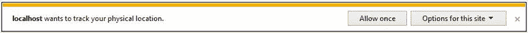
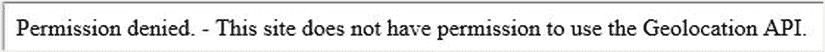
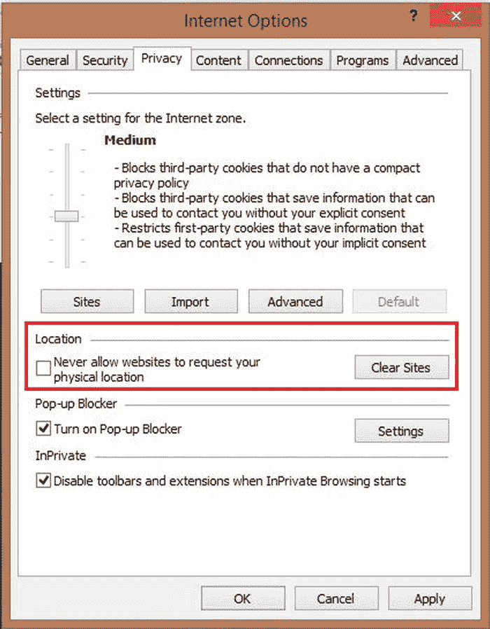
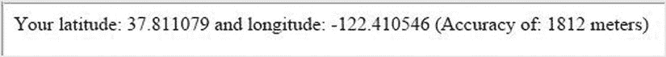
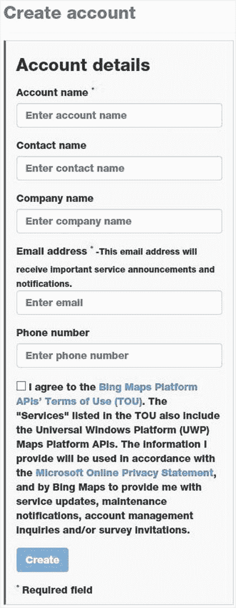
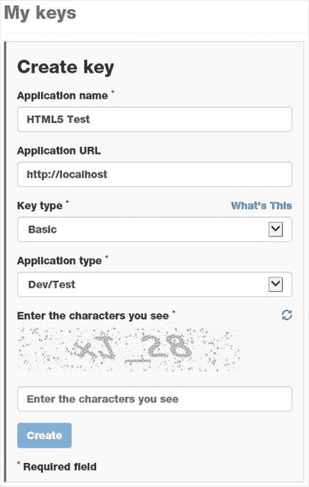
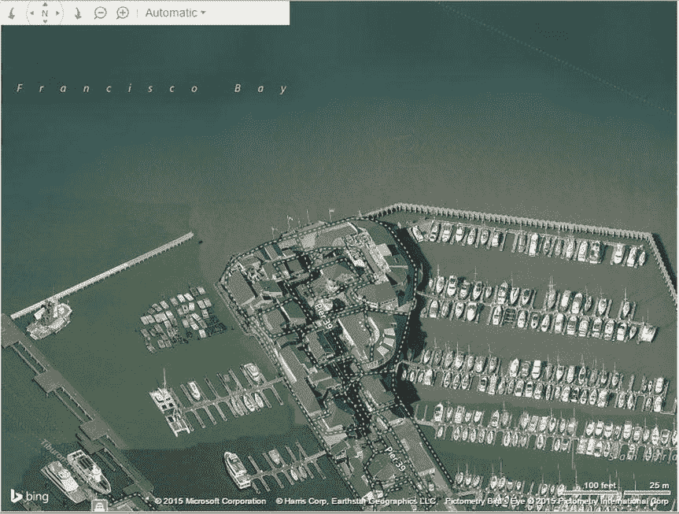
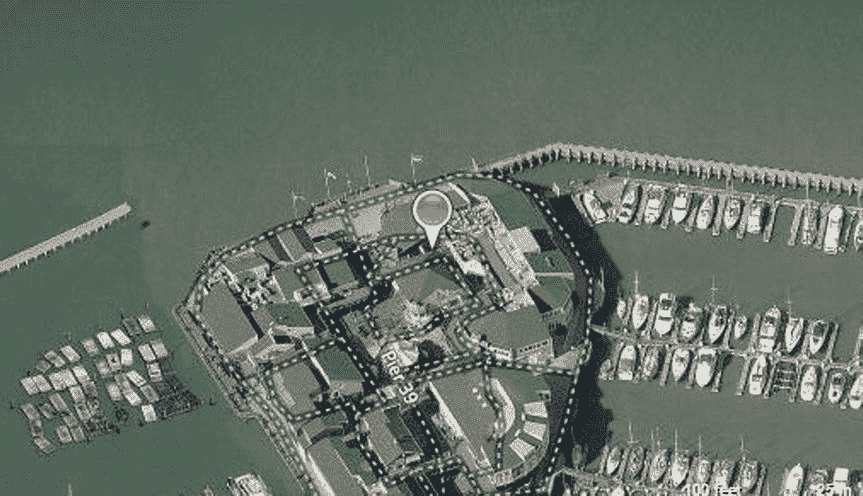
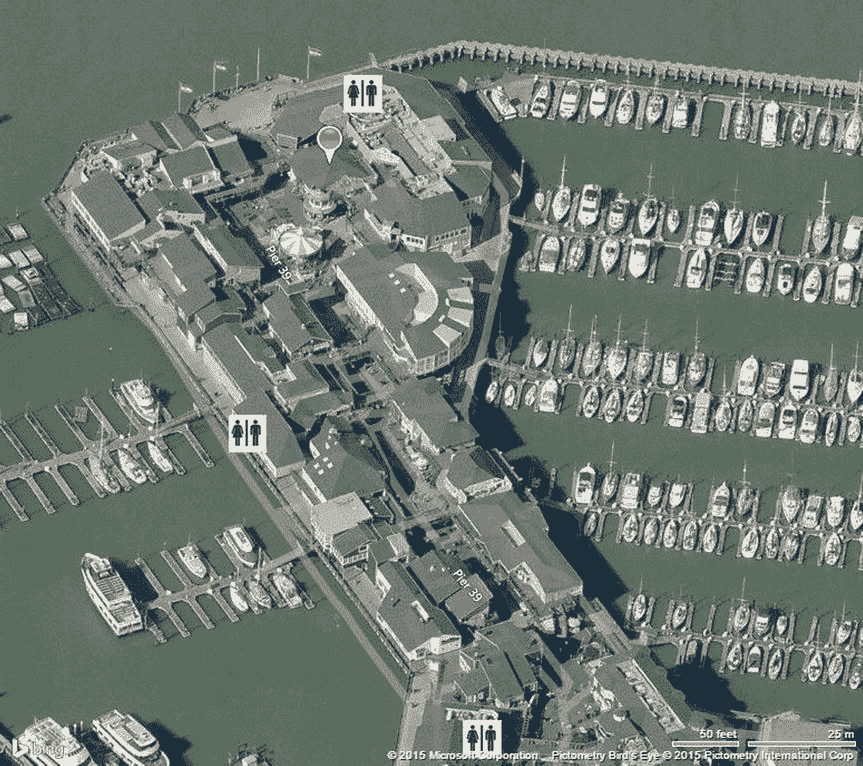

# 十二、地理定位和制图

本章将展示两种技术，它们提供了强大的功能，使您能够轻松地创建一些有用的网站。地理定位提供了用于确定客户端位置的标准化 API。制图技术增加了在地图上显示该位置以及其他兴趣点的能力。总之，这些形成了一个有许多有用应用的平台。

在本章中，您将使用地理定位 API 来查找您的当前位置。根据可用硬件和环境的不同，定位的准确性会有很大的不同。然而，HTML5 定义了一个在所有设备上使用的标准 API，因此您可以提供与设备无关的解决方案。

仅仅知道你所在位置的经度和纬度并没有太大的帮助。为了使用这些数据，您将使用 Bing Maps API 在地图上显示该位置。然后，您可以绘制其他感兴趣的点，并查看它们与您当前位置的关系。

## 了解地理定位

虽然在技术上不是 HTML5 规范的一部分，但 WC3 已经定义了一个用于访问地理位置信息的标准 API，当前所有主流浏览器版本都支持该 API。但是，确定位置的技术会因设备功能和客户端环境的不同而有很大差异。

### 勘测地理定位技术

可以使用几种技术来确定当前位置，包括以下技术:

*   全球定位系统:全球定位系统与卫星通信，以极高的精度确定当前位置，特别是在农村地区。城市中的高层建筑会影响精度，但在大多数情况下，GPS 提供了良好的结果。最大的限制是这在室内效果不好。要使用 GPS，设备必须有特定的 GPS 硬件，但这在移动设备上越来越常见。
*   Wi-Fi 定位:Wi-Fi 网络的覆盖范围相对较短，Skyhook Wireless 等系统维护着一个关于 Wi-Fi 网络及其位置的大型数据库。简单地连接到 Wi-Fi 网络就能很好地知道你在哪里。然而，通常情况下，您可能在多个网络的范围内，系统可以使用三角测量来更准确地确定位置。当然，这需要你有一个支持 Wi-Fi 的设备，在没有 Wi-Fi 网络的农村地区是不行的。
*   手机信号发射塔三角测量:这与 Wi-Fi 定位使用相同的原理，只是它使用手机信号发射塔。然而，这并不准确，因为手机信号发射塔的覆盖范围要大得多。由于所有的手机都将有能力与手机信号塔通信，这项技术有着广泛的应用。
*   IP 地址块:每台连接到互联网的设备都有一个 IP 地址，通常由 ISP 提供。每个 ISP 都有一组可以使用的 IP 地址，这些地址通常是按地理位置分配的。因此，您连接到互联网的 IP 地址可以提供一个大致的位置，通常是一个大都市地区。但是，有几个因素会产生不正确的结果，例如 NAT 地址。

这些技术中的每一种都有不同的硬件要求，并提供不同级别的准确性。通过地理定位规范，您可以轻松地从浏览器请求当前位置，并让浏览器根据当前硬件和对外部资源(包括卫星、手机信号发射塔和 Wi-Fi 网络)的访问来确定提供当前位置的最佳方式。

### 使用地理定位数据

大多数人认为地理定位是一种提供路线指引的设备，但这只是这项技术的一个应用。当然，这需要精确的位置，只有通过 GPS 才能获得。然而，即使当前位置远不准确，您的网站仍然可以利用这些信息。例如，即使位置仅由 IP 地址决定，这通常也足以设置默认语言。您可能需要允许最终用户覆盖这一点，但是您的大多数观众将会看到以他们的母语显示的初始页面。

当检索当前位置时，地理定位服务也返回估计的精度。您的应用应该使用它来确定将要提供的特性。例如，假设您正在为美国邮政服务创建一个网页，显示最近的邮局在哪里。如果当前位置是高精度已知的，则网页可以显示地图并指示当前位置以及附近的邮局。此外，它可以为每个人提供估计的驾驶时间。

但是，如果知道的位置不太准确，该页面可以显示一张地图，显示该地区邮局的位置。据推测，用户将知道他们在哪里，并且可以使用该信息来确定最佳使用位置。但是，如果准确性很差，页面应该提示输入邮政编码，然后根据用户输入显示最近的邮局。因此，根据准确性，应用可以适当地降低功能。

## 使用地理定位 API

为了演示如何使用地理定位 API，您将创建一个简单的 web 页面，该页面调用 API 来确定您的当前位置。最初，这些数据将作为文本显示在网页上。稍后，您将在地图上显示该位置。

### 创建 Visual Studio 项目

首先，您将创建一个 Visual Studio 项目，使用与前几章中使用的相同的空模板。

EXERCISE 12-1\. CREATING THE VISUAL STUDIO PROJECTStart Visual Studio 2015 and click the New Project link from the Start page.   In the New project dialog box, select the ASP.NET Web Application template. Select a location for this project and enter the project name Chapter 12.   In the next dialog box, select the ASP.NET 5 Empty template. Click the OK button and the project will be created.   Open the `Startup.cs` file and comment out the implementation of the `Configure()` method as you did in previous projects.   Right-click the new `wwwroot` folder and click the Add and New Item links. In the Add New Item dialog box, select the HTML page, enter the name Index.html, and click the Add button.   In the `Index.html` file, add the following `div` element inside the empty `body` that was created:  

`
`

` `

`
`

### 使用地理位置对象

地理定位 API 由`geolocation`对象提供，您可以通过`navigator`对象访问它，如下所示:

`navigator` `.geolocation`

如果返回虚假值，如`null`或`undefined`，则当前浏览器不支持地理定位。您可以使用如下代码来检查支持:

`if (!navigator.geolocation) {`

`alert(“Geolocation is not supported”);`

`}`

`else`

`// do something with geolocation`

要获得当前位置，使用`getCurrentPosition()`函数，它有三个参数:

*   当调用成功时执行的回调函数
*   发生错误时调用的错误回调函数
*   包含零个或多个选项的`PositionOptions`集合

最后两个参数可以省略。支持以下选项:

*   `maximumAge`:浏览器可以缓存之前的位置并返回，而无需实际尝试确定位置。然而，`maximumAge`属性指定了在不重新查询当前位置的情况下，前一个位置可以被重用多长时间(以毫秒为单位)。
*   `timeout`:`timeout`属性指定浏览器应该等待来自`geolocation`对象的响应多长时间。这也用毫秒表示。
*   `enableHighAccuracy`:这只是给浏览器的一个提示。如果您不需要更高的精度来实现某个特定目的，将此设置为 false 可能会产生更快的响应或使用更少的功率，这是移动设备的一个考虑因素。

如果调用成功，位置将被传递给指定的回调函数。`Position`对象包括一个`coords`对象，该对象包含以下必需属性:

*   `latitude`(以度为单位)
*   `longitude`(以度为单位)
*   `accuracy`(单位为米)

此外，根据环境和可用硬件，可能会提供以下可选属性。如果不支持这些，它们将被设置为 null。(可选属性通常仅在使用 GPS 时可用。)

*   `altitude`(单位为米)
*   `altitudeAccuracy`(单位为米)
*   `heading`(单位为度；`north` = 0，`west` = 90，以此类推)
*   `speed`(单位为米/秒，静止时为`NaN`)

这些属性可以通过回调函数获得，如下所示:

`function successCallback(pos) {`

`var lat = pos.coords.latitude;`

`var long = pos.coords.longitude;`

`var accuracy =  pos.coords.accuracy + " meters";`

`}`

如果调用不成功，`PositionError`对象被传递给错误回调函数。这个对象包括一个`code`属性和一个`message`属性。误差`code`将具有三个可能值中的一个。

*   1: `PERMISSION_DENIED`
*   2: `POSITION_UNAVAILABLE`
*   3: `TIMEOUT`

Caution

您的应用将获得位置并简单地显示它(并在以后绘制地图)。但是，您的脚本可以很容易地将这些信息传递回服务器，这是一个潜在的隐私问题。由于浏览器无法控制客户端如何处理这些信息，出于隐私原因，浏览器可能会阻止对`geolocation`对象的访问。在这种情况下，返回`PERMISSION_DENIED`错误代码。稍后我将演示这一点。

如果客户端正在移动，并且您想要持续监视当前位置，您可以使用`setInterval()`函数重复调用`getCurrentLocation()`函数。为了简化起见，`geolocation`对象包含了一个`watchPosition()`函数。它采用与`getCurrentLocation()`函数相同的三个参数(成功回调、错误回调和选项)。每当位置改变时，回调函数就被调用。`watchPosition()`函数返回一个定时器句柄。当您想要停止监控位置时，您可以将该句柄传递给`clearWatch()`函数，如下所示:

`var handle = geolocation.watchPosition(callback);`

`...`

`geolocation.clearWatch(handle);`

### 显示位置

现在，您将向您的应用添加代码，以获取当前位置并显示它。该网页有一个`span`元素，其`id`为`lbl`。你将得到`geolocation`对象并调用它的`getCurrentLocation()`函数。成功和错误回调函数都将在`span`元素中显示适当的结果。

EXERCISE 12-2\. DISPLAYING THE LOCATIONAdd the `script` element shown in Listing 12-1 to the end of the `body` element.  

清单 12-1。显示位置

``

Press F5 to start the application. The first time a site tries to access the `geolocation` object, you will get a prompt like the one shown in Figure 12-1.

图 12-1。

Prompting for geolocation access  

注意，我在这个演示中使用的是 IE 11。如果您使用的是不同的浏览器，该提示可能会有所不同。

To test the error handler, expand the “Options for this site” drop-down and select the “Always deny and don’t tell me” option. The page should display an error message like the one shown in Figure 12-2.

图 12-2。

Displaying the access denied error  Once you have set this option, IE will no longer prompt you anymore but will always deny the access. To clear this, select the Tools menu and then select Internet Options. In the middle of the Privacy tab there are options to control the `geolocation` access. Click the Clear Sites button shown in Figure 12-3.

图 12-3。

Clearing the site access choices  Click the OK button to close this dialog box. Refresh the web page. It should now prompt you again. This time select the “Always allow” option. Your current location should be displayed as shown in Figure 12-4.

图 12-4。

Displaying the current location  

我用的是普通的局域网连接的机器，没有手机或 GPS 支持，所以它使用 IP 地址来确定位置。因此，精度估计为 1.8 公里(刚刚超过 1 英里)。

Note

地理定位可以在当前所有的浏览器上运行。然而，如果你在 IE 8 等较旧的浏览器上尝试这个应用，你会看到不支持地理定位的警告。

## 使用制图平台

简单地显示纬度和经度并不有趣(或者没有帮助)。然而，显示你相对于其他兴趣点的位置更有用。将它们显示在带有道路和其他参考点的地图上，可以让这些信息真正发挥作用。幸运的是，测绘技术已经变得如此复杂和容易，这真的很容易做到。

Note

在本章的演示中，我将使用 Bing 地图。还有其他可用的地图平台。如果你感兴趣，请查看位于 [`http://en.wikipedia.org/wiki/Comparison_of_web_map_services`](http://en.wikipedia.org/wiki/Comparison_of_web_map_services) 的文章，了解不同地图服务的概述。

### 正在创建阿炳地图帐户

要使用必应地图，你需要先设置一个账户，这个账户对开发者是免费的。创建帐户后，您将收到一个密钥，您需要在访问映射 API 时包含该密钥。我将带你完成建立帐户的过程。

EXERCISE 12-3\. CREATING A BING MAPS ACCOUNTGo to the Bing Maps site at this address: [`www.microsoft.com/maps/create-a-bing-maps-key.aspx`](http://www.microsoft.com/maps/create-a-bing-maps-key.aspx) .   You need to get a key that will allow you to access the mapping API. Go to the Basic Key tab. A free, basic key is fine for working through these exercises. Click the Get the Basic Key link near the bottom of the page.   In the next page, you’ll need to log in with a Windows Live ID. If you don’t have one, click the Create button to create an account.   Once you have signed in, you should see the “Create account” page shown in Figure 12-5.

图 12-5。

The “Create account” page   Enter an account name. This is just for you to identify it if you have multiple accounts; Testing is fine. The e-mail address should default in from your Windows Live account. Make sure you select the check box agreeing to the terms of use. Click the Save button to create the account.   From the My account menu, select the “Create or view keys” link. You probably won’t have any existing keys shown. Click the link to create a new key.   In the “Create key” page, enter an application name such as HTML5 Test. For the URL, enter http://localhost and select Dev/Test for the application type, as shown in Figure 12-6. Enter the characters that are displayed at the bottom of the form and click the Submit button.

图 12-6。

Creating a key  

注意 Bing 地图会监控您的密钥的使用情况。然而，由于您实际上并没有将它部署到面向公众的网站上，所以这实际上并不适用。如果您正在开发一个商业应用，您可以出于开发目的使用一个免费的密钥，但是您将需要为实时网站购买一个密钥。

After the key has been generated, you should see it displayed on the page. Save this because you will need it later.  

### 添加地图

现在，您将向网页添加地图。您将首先向包含地图的页面添加一个`div`。您还需要添加对用于操作地图的 Ajax 脚本的引用。然后，您将显示地图，以您的当前位置为中心。

EXERCISE 12-4\. ADDING A MAPAdd the code shown in bold to the `body` element, which will add the `div` that the map will be displayed in.  

`<body>`

`
`

` `

`
`

`
`

`
`

Add the following reference inside the `head` element. This will enable your page to call the map API.  

`<script`

`type="text/javascript"`

`src="`[`http://ecn.dev.virtualearth.net/mapcontrol/mapcontrol.ashx?v=7.0`](http://ecn.dev.virtualearth.net/mapcontrol/mapcontrol.ashx?v=7.0)

`</script>`

Add the following declaration at the top of the existing `script` element (inside the `body` element). This will store a reference to the map object.  

`var map = null;`

Modify the `showLocation()` function, adding the code shown in bold in Listing 12-2. Enter your Bing Maps key where is says `<use your key here>`. The key should be enclosed in double quotes.  

清单 12-2。修改后的 showLocation()函数

`function showLocation(pos) {`

`lbl.innerHTML =`

`"Your latitude: " + pos.coords.latitude +`

`" and longitude: " + pos.coords.longitude +`

`" (Accuracy of: " +  pos.coords.accuracy + " meters)";`

`// Save the current location`

`var lat = pos.coords.latitude;`

`var long = pos.coords.longitude;`

`// Create the map`

`map = new Microsoft.Maps.Map(document.getElementById("map"),`

`{ credentials:`

`"<use your key here>" });`

`// Center it on the current location`

`map.setView({ zoom: 18, center: new Microsoft.Maps.Location(lat, long) });`

`}`

Press F5 to start the application. Depending on your location, your page should look like Figure 12-7. Notice the controls at the top-left corner of the page. You can use this to zoom in or out and pan in any direction. The Automatic mode will switch to the satellite view if the map is zoomed in sufficiently.

图 12-7。

Displaying the initial map  

当调用`setView()`函数来指定中心位置时，这段代码也将缩放设置为 18。根据您的应用，您可能不想一开始就放大那么多。用 15 或 16 试试这段代码，看看看起来怎么样。当然，一旦显示地图，用户也可以调整缩放。

### 添加图钉

现在，您将在地图上显示一些图钉。要添加图钉，首先创建一个`Pushpin`对象，指定其位置。然后将其添加到地图的实体集合中。首先，您将在当前位置添加一个默认图钉。稍后，您将添加自定义图钉来指示兴趣点。

将下面以粗体显示的代码添加到`showLocation(` `)`函数的末尾:

`// Center it on the current location`

`map.setView({ zoom: 18, center: new Microsoft.Maps.Location(lat, long) });`

`// Mark the current location`

`var pushpin = new Microsoft.Maps.Pushpin`

`(new Microsoft.Maps.Location(lat, long), null);`

`map.entities.push(pushpin);`

`lat`和`long`变量包含用于使地图居中的相同值。按 F5 启动应用。你应该会看到一个图钉指示当前位置，如图 12-8 所示。

图 12-8。

Adding a pushpin in the current location

地图在网页中最常见的用途之一是显示附近的位置。例如，您可能有多个商店位置，并且您希望显示每个位置。或者，您可能在警察局工作，想要找出某些犯罪发生的地点。你可以有一个公共交通系统，并想显示所有的公共汽车或火车站在哪里。

这些场景基本上都是一样的；您有一组想要在地图上显示的位置。您可以根据需要添加任意多个位置。对于每一个，只需创建一个图钉对象并将其添加到实体集合中。如果你有不止一个位置，你应该让图钉看起来不同，这样用户就可以很容易区分它们。

在本演示中，您将指出附近哪里有洗手间。您将使用一个带有熟悉的洗手间图标的图像，而不是标准的图钉。通常情况下，您会查询服务器以获得基于客户端位置的位置列表。然而，为了简化这个练习，这些将被硬编码。

Caution

我在硬编码洗手间的位置，可能离你现在的位置很远。您可以提供离您最近的不同洗手间位置，或者简单地覆盖您的当前位置以匹配我的位置。这将与洗手间的位置一致。

EXERCISE 12-5\. ADDING CUSTOM PUSHPINSIn Solution Explorer, right-click the `wwwroot` folder project and click the Add and New Folder links. Enter the name images.   The source code download contains a `restroom.gif` image file. Drag this onto the `wwwroot\images` folder in Solution Explorer.   Add the following declaration at the top of the existing `script` element. This defines the locations of the restrooms.  

`var restrooms = [`

`{ lat: 37.810079, long: -122.410806 },`

`{ lat: 37.809079, long: -122.410206 },`

`{ lat: 37.811279, long: -122.410446 }`

`];`

Add the following code to the `showLocation()` function just before creating the map object. This will override your current location to be near where the restrooms are.  

`// Override these for testing purposes`

`lat = 37.811079;`

`long = -122.410546;`

Add the following functions to the end of the `script` element. The `markRestrooms()` function iterates through this array, calling the `markRestroom()` function for each. The `markRestroom()` function adds a single pushpin. This first creates an options collection that defines the image file to use as well as the size of the image. This is passed in when creating the `Pushpin` object.  

`function markRestrooms() {`

`for (var i in restrooms) {`

`markRestroom(restrooms[i].lat, restrooms[i].long);`

`}`

`}`

`function markRestroom(lat, long) {`

`var pushpinOptions = { icon: '/img/restroom.gif', width: 35, height: 35 };`

`var pushpin = new Microsoft.Maps.Pushpin`

`(new Microsoft.Maps.Location(lat, long), pushpinOptions);`

`map.entities.push(pushpin); ()`

`}`

Add this function call at the end of the `showLocation()` function to display the additional pushpins:  

`// Display the restroom locations`

`markRestrooms();`

Press F5 to debug the application. You should now see pushpins where the restrooms are located, as shown in Figure 12-9.

图 12-9。

Adding the restroom pushpins()  

注意，这纯粹是虚构的数据。如果你在读这本书的时候碰巧在旧金山的 39 号码头，不要用这张地图去找厕所。

使用映射 API 可以做更多的事情。例如，您可以显示到达所选兴趣点的方向。你甚至可以显示当前交通拥挤的地方。在 [`www.bingmapsportal.com/isdk/ajaxv7`](http://www.bingmapsportal.com/isdk/ajaxv7) 查看互动 SDK。您可以尝试每个特性，相应的 JavaScript 代码会显示在地图下方。

## 摘要

在本章中，您将地理定位功能与 Bing 地图结合起来，创建了一个真正有用的网站。地理定位请求是异步处理的。获得`geolocation`对象后，调用它的`getCurrentPosition()`函数，并指定成功和错误回调函数。当位置被检索到时,`Position`对象被传递给回调函数。它包含纬度、经度和估计精度。如果客户端具有 GPS 功能，`Position`对象还将包括高度、速度和方向。

Bing Maps 等地图平台非常容易使用，并且可以集成到您的网页中。在这个应用中，您显示了地图并以当前位置为中心。您还添加了图钉来显示附近的洗手间在哪里。