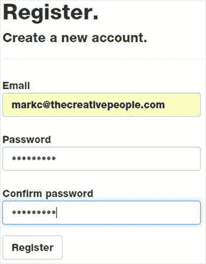

# 十三、双向通信

正如我在第一章中解释的，web 应用从 web 服务器中提取数据。客户端通过向服务器发送请求来启动传输。然后在浏览器中呈现响应。所有的 web 应用设计都基于这种请求-响应范式。然而，websocket 技术打开了一个全新的世界，允许服务器发起与客户端应用的通信。

套接字技术并不新鲜。几十年来，套接字一直被用作应用之间点对点通信的有效协议。然而，令人兴奋的消息是，W3C 已经将 WebSocket API 规范作为 HTML5 保护伞的一部分。随着标准协议的定义和兼容浏览器的出现，可以预见会有越来越多的 web 应用利用这项技术。

在本章中，您将构建一个使用 WebSockets 实现多会话聊天应用的解决方案，该应用使代理能够同时与几个客户聊天。该解决方案将包括一个托管在控制台应用中的 WebSocket 服务器，您将使用 C# .NET 创建该服务器。为此，您需要理解 WebSocket 协议，因此我将首先解释这项技术，然后向您展示如何创建您自己的定制服务器。然后，您将利用 HTML5 中的本地 WebSocket 支持来实现代理和客户客户端应用。

Caution

在撰写本文时，W3C 规范仍处于草案阶段，可能会有变化。现在全心全意地投入其中可能还为时过早。然而，由于这是 HTML5 规范中非常有前途的部分，我想向您介绍 WebSockets。只是要意识到事情会变。你可以在 [`http://dev.w3.org/html5/websockets`](http://dev.w3.org/html5/websockets) 查看 W3C 规范的当前状态。当前所有主流浏览器都支持 WebSockets。

## 了解 WebSockets

套接字为应用之间的双向传输提供了一种机制，包括对等通信。正如我将在本章中解释的，WebSockets 是套接字的一个具体实现，它使 web 应用能够与 web 服务器进行通信。图 13-1 展示了浏览器和服务器之间传递的消息。在建立连接的一系列握手消息之后，双方可以互相发送消息。

图 13-1。

The WebSockets messages Tip

虽然 WebSockets 不提供对等通信，但正如您将在本章后面看到的，可以实现服务器将消息从一个客户端路由到另一个客户端。客户端 A 可以向服务器发送消息，然后简单地转发给客户端 b。这模拟了对等消息传递，同时提供了对路由的控制。

### 完成握手

WebSockets 的工作需要大量的握手和协议操作。幸运的是，浏览器为您实现了客户端协议，这使得编写使用 WebSockets 的应用变得非常容易。握手消息使用 HTTP 协议。一旦建立了连接，就使用 WebSocket 协议发送后续消息。

Note

各种浏览器已经提出并实现了几种协议版本。目前的版本(在撰写本文时)是版本 13，所有主流浏览器都支持它。您可以在 [`https://tools.ietf.org/html/rfc6455`](https://tools.ietf.org/html/rfc6455) 查看 13 版协议的规范。

当浏览器向服务器发送握手请求时，该过程开始。握手请求将由多行文本组成，如下所示:

`GET /chat HTTP/1.1`

`Upgrade: websocket`

`Connection: Upgrade`

`Host: localhost:8100`

`Origin:` `http://localhost:29781`

`Sec-WebSocket-Key: <request key>`

`Sec-WebSocket-Version: 13`

该请求包括关于客户端地址及其支持的协议的信息。在这个例子中可以看到，`13`是为`Sec-WebSocket-Version`指定的。请求密钥由浏览器生成，每次发出连接请求时都会有所不同。

作为回报，服务器将返回如下响应:

`HTTP/1.1 101 Switching Protocols`

`Upgrade: websocket`

`Connection: Upgrade`

`Sec-WebSocket-Accept: <response key>`

响应密钥由服务器生成，并基于指定的请求密钥。我将在本章的后面解释这个算法。

### 构建 WebSocket 框架

一旦握手完成并且协议已经协商好，就可以在客户机和服务器之间交换消息。这些消息使用 WebSocket 协议发送。消息总是单向的；不需要响应。当然，您可以发送响应，但这只是另一个反方向的单向消息。两个端点总是在监听消息。

消息以帧的形式发送。该帧由一系列字节组成，这些字节表示应该如何处理消息。消息的其余部分包含正在发送的实际数据，通常称为有效负载。图 13-2 为车架布局图。

图 13-2。

The WebSocket frame

帧的初始部分最多由 14 个字节组成。前两个字节将用于所有帧。第一位表示这是否是最后一帧。一条消息可以在多个帧中传输，该位应在最后一帧置 1，以表示消息已完成。接下来的三位留作将来使用。第一个字节的后半部分包含一个操作码，指定这是什么类型的消息。值 0x 3–0x 7 和 0xB–0xF 是为将来的控制帧保留的，但目前定义了以下值:

*   0x0 表示这是一个连续帧。
*   0x1 指定有效负载包含文本。
*   0x2 表示二进制有效载荷。
*   0x8 表示连接正在关闭。
*   0x9 指定消息是 ping。
*   0xA 指定消息是 pong。

第二个字节的第一位表示使用了屏蔽。稍后我将描述掩蔽。该字节的剩余部分指定有效载荷长度。对于小于 126 字节的有效负载，长度在此指定。但是，如果长度在 126 到 32，183 之间，则长度被设置为 126，实际长度在接下来的两个字节中提供。对于超过这个长度的消息，长度设置为 127，实际长度在接下来的八个字节中指定。因此，根据消息的长度，帧将包含 0 到 8 个额外的字节。

接下来的四个字节包含屏蔽键。如果不使用屏蔽，则忽略这一点。之后才是真正的有效载荷。

对于包含文本 Hello 的简单无掩码消息，帧将包含以下字节:

`0x81, 0x05, 0x48, 0x65, 0x6c, 0x6c, 0x6f`

二进制的第一个字节 0x81 是`10000001`。第一位被设置为指示这是最后一帧，最后一位被设置为指示有效载荷包含文本。下一个字节指定了紧跟其后的五个字符的有效载荷长度。其余五个字节包含 H、e、l、l 和 o 字符。

### 揭开框架的面纱

出于安全原因，来自客户端的所有帧都应该被屏蔽。屏蔽是一种简单的编码方案，它使用不同于每一帧的屏蔽键。浏览器会为您处理这些问题；但是，服务器需要取消数据屏蔽。发送到客户端的帧不应被屏蔽。

屏蔽键在长度后面的四个字节中提供。屏蔽密钥由客户端随机生成。为了解除数据屏蔽，对于有效载荷中的每个字节，XOR 运算符应用于该字节和屏蔽密钥中的相应字节。第一个有效载荷字节与屏蔽键的第一个字节进行异或运算，第二个字节与屏蔽的第二个字节进行异或运算，依此类推。第五个字节与掩码的第一个字节进行异或运算。

这可以通过下面的 C#表达式来完成。这里假设`payload[]`包含一组屏蔽数据，而`mask[]`包含 4 字节屏蔽键。

`for (int i = 0; i < length; i++)`

`{`

`payload[i] = (byte)(payload[i] ^ masks[i % 4]);`

`}`

`i % 4`表达式获得适当的屏蔽字节，而`^`操作符执行 XOR 运算。处理完所有的字节后，`payload[]`数组将包含未屏蔽的数据。

### WebSocket 服务器

要使用 WebSockets，您需要提供一个实现服务器端协议的应用。我将向您展示如何使用。NET 并承载在控制台应用中。正如您可能期望的那样，有必要进行一些位和字节操作(没有双关语)。

Note

有许多开源 WebSocket 服务器实现。这篇文章提供了几个链接，你可能想考虑将来参考: [`http://stackoverflow.com/questions/1530023/do-i-need-a-server-to-use-html5s-websockets`](http://stackoverflow.com/questions/1530023/do-i-need-a-server-to-use-html5s-websockets) 。这些都是在各种平台上实现的，包括 JavaScript 和 PHP。其中许多支持多种协议。

要创建 WebSocket 服务器，您将首先实现以下功能:

*   连接握手
*   监听消息
*   解码 WebSocket 帧
*   构建和发送消息帧

一旦基础设施完成，您就可以为您的应用提供所需的定制服务器特性。毕竟，WebSockets 的全部意义在于允许服务器与客户端进行通信。

### 设计代理聊天应用

在本章中，您将构建一个服务器和两个客户端应用，它们将允许代理同时与多个客户端聊天。代理将使用代理 web 应用登录并连接到服务器，让服务器知道代理已准备好接受聊天会话。代理应用将被设计为处理多达四个同时进行的聊天会话。然后，客户端可以使用客户端 web 应用连接到服务器。每个客户端被路由到一个可用的代理，并且聊天会话开始。从这一点来说，服务器只是在客户端和代理之间转发消息。图 13-3 描述了这种通信。

图 13-3。

The WebSocket communication

要作为代理进行连接，系统需要提供一些身份验证，以确保只有经过授权的用户才能响应客户端。为了模拟这种情况，代理应用将使用提供登录功能的标准 ASP.NET web 表单。然后，您将添加一个自定义聊天页面，该页面将允许代理同时响应四个聊天会话。然而，任何人都应该能够作为客户端连接，所以您将使用您在前面章节中使用的空模板。

两个应用都将使用正常的握手协议连接到 WebSocket 服务器。一旦连接，代理将向服务器发送包含他们姓名的消息。这将通知服务器一个新的代理已经上线。代理的连接将保存在集合中以供将来使用。

建立连接后，客户端应用还会向服务器发送一条消息，指定客户端的名称。然后，服务器将找到第一个有开放聊天会话的可用代理，并向该代理发送消息，提供客户端的名称。然后，代理页面将在页面上保存客户端的名称。同时，服务器将向客户端发送一条消息，让他们知道已经为他们分配了一个代理。

此时，客户端和代理都可以向服务器发送消息，该消息将被转发给另一个应用。因为代理应用可以有四个活动会话，所以服务器会在消息前面加上客户端号，这样代理应用就知道要更新哪个会话。

如果客户端断开连接，服务器将向代理发送一条消息，让他们知道这一点。然后，代理应用将清除相应的聊天会话。如果代理断开连接，与该代理有活动会话的所有客户端也会收到通知，并被指示尝试重新连接。

## 创建简单的应用

在本节中，您将构建一个处理基本消息协议的 WebSocket 服务器，并使用一个简单的 web 客户端对其进行测试。最初，服务器只是将消息回显给客户机。稍后您将添加聊天应用所需的功能。在本练习中，服务器将托管在一个控制台应用中。

### 创建 WebSocket 服务器

为了实现 WebSocket 服务器，您将创建一个`WsServer`类。该类创建一个套接字，用于侦听新的连接。当接收到一个连接时，它为该连接创建另一个套接字，并执行我前面描述的握手。如果握手成功，它将创建一个管理客户端连接的`WsConnection`类的实例。

`WsConnection`类使用新的套接字监听该连接上的传入消息。这个类调用`ReadMessage()`方法来处理传入的消息。这将处理所有可能需要的帧解码和去屏蔽。`WsConnection`类还提供了一个`SendMessage()`方法，该方法将向连接另一端的客户端发送消息。

如果提供了处理程序，`WsConnection`类提供了两个被引发的事件。当收到传入消息时，引发第一个事件。当连接关闭时，将引发第二个事件。`WsServer`类将为这些事件提供事件处理程序。

EXERCISE 13-1\. CREATING A SIMPLE WEBSOCKET SERVERStart Visual Studio 2015 and create a new project named WsServer. Select the Console Application template from the Windows category. Change the solution name to Chapter 13 , as shown in Figure 13-4.

图 13-4。

Creating a console application project   In Solution Explorer, right-click the WsServer project and click the Add and Class links. Enter WsServer.cs for the class name.   Enter the code shown in Listing 13-1 for the initial implementation of this class.  

清单 13-1。实现 WsServer 类

`using System;`

`using System.Collections.Generic;`

`using System.Text;`

`using System.Net;`

`using System.Net.Sockets;`

`using System.IO;`

`using System.Security.Cryptography;`

`namespace WsServer`

`{`

`public class WsServer`

`{`

`#region Members`

`// This socket listens for new connections`

`Socket _listener;`

`// Configurable port # that is passed in the constructor`

`int _port;`

`// List of connections`

`List<WsConnection> _unknown;`

`#endregion Members`

`public WsServer(int port)`

`{`

`_port = port;`

`// This is a list of active connections`

`_unknown = new List<WsConnection>();`

`}`

`public void StartSocketServer()`

`{`

`try`

`{`

`// Create a socket that will listen for messages`

`_listener = new Socket(AddressFamily.InterNetwork,`

`SocketType.Stream,`

`ProtocolType.IP);`

`// Create and bind the endpoint`

`IPEndPoint ip = new IPEndPoint(IPAddress.Loopback, _port);`

`_listener.Bind(ip);`

`// Listen for new connections - the OnConnect() method`

`// will be invoked to handle them`

`_listener.Listen(100);`

`_listener.BeginAccept(new AsyncCallback(OnConnect), null);`

`}`

`catch (Exception ex)`

`{`

`}`

`}`

`void MessageReceived(WsConnection sender, MessageReceivedEventArgs e)`

`{`

`string msg = e.Message;`

`sender.SendMessage("echo: " + msg);`

`}`

`void Disconnected(WsConnection sender, EventArgs e)`

`{`

`_unknown.Remove(sender);`

`}`

`}`

`}`

调用`StartSocketServer()`方法让服务器开始工作。它创建一个`Socket`对象，并使用指定的端口对其进行配置。这个方法被硬编码为使用`localhost`地址。一旦配置了端点，就会调用`Socket`对象的`BeginAccept()`方法。当接收到新连接时，这将调用指定的回调方法(`OnConnect`)。`OnConnect()`函数被异步调用。稍后您将提供它的实现，该实现将调用`EndAccept()`函数来处理细节。`MessageReceived()`事件处理程序只是将输入消息写入控制台，然后将消息回显给客户机。管理这个连接的`WsConnection`对象被传递给事件处理程序。这段代码使用它的`SendMessage()`方法发送回一个回应。`Disconnected()`事件处理程序从其活动列表中删除该连接，并在控制台窗口中显示一条消息。

Add the `PerformHandshake()` method using the code shown in Listing 13-2.  

清单 13-2。实现握手协议

`private void PerformHandshake(Socket s)`

`{`

`using (NetworkStream stream = new NetworkStream(s))`

`using (StreamReader reader = new StreamReader(stream))`

`using (StreamWriter writer = new StreamWriter(stream))`

`{`

`string key = "";`

`// Read the input data using the stream reader, one line`

`// at a time until all lines have been processed. The only`

`// item that we need to get is the request key.`

`string input = "Empty";`

`while (!string.IsNullOrWhiteSpace(input))`

`{`

`input = reader.ReadLine();`

`if (input != null &&`

`input.Length > 18 &&`

`input.Substring(0, 18) == "Sec-WebSocket-Key:")`

`// Save the request key`

`key = input.Substring(19);`

`}`

`// This guid is used to generate the response key`

`const String keyGuid = "258EAFA5-E914-47DA-95CA-C5AB0DC85B11";`

`string webSocketAccept;`

`// The response key in generated by concatenating the request`

`// key and the special guid. The result is then encrypted.`

`string ret = key + keyGuid;`

`SHA1 sha = new SHA1CryptoServiceProvider();`

`byte[] sha1Hash = sha.ComputeHash(Encoding.UTF8.GetBytes(ret));`

`webSocketAccept = Convert.ToBase64String(sha1Hash);`

`// Send handshake response to the client using the`

`// stream writer`

`writer.WriteLine("HTTP/1.1 101 Switching Protocols");`

`writer.WriteLine("Upgrade: websocket");`

`writer.WriteLine("Connection: Upgrade");`

`writer.WriteLine("Sec-WebSocket-Accept: " + webSocketAccept);`

`writer.WriteLine("");`

`}`

`}`

`PerformHandshake()`方法创建一个`NetworkStream`对象，将`Socket`对象传递给它的构造函数。这是为此连接创建的新套接字。它使用一个`StreamReader`对象读取输入的数据，然后使用一个`StreamWriter`将数据发送回来。通过创建这些嵌套的`using`语句，您不必担心如何处理它们。请记住，握手是使用 HTTP 协议完成的，因此读取和发送数据的行为不使用 WebSocket 帧。

`StreamReader`对象用于读取输入，一次一行。您不需要这些数据，因为在这个练习中，您假设正在请求正确的协议。然而，在更一般的情况下，您可能需要支持多种协议，因此您需要读取和解释正在发送的内容。然而，您将需要请求键，所以这是从适当的输入行提取的。

然后，响应密钥与一个特殊的 guid 值连接在一起。这在版本 13 规范( [`https://tools.ietf.org/html/rfc6455`](https://tools.ietf.org/html/rfc6455) )中有记载。然后使用 SHA1 算法对得到的字符串进行哈希运算。最后，`StreamWriter`对象用于发送响应，包括生成的密钥。

Add the `OnConnect()` event handler using the code in Listing 13-3.  

清单 13-3。实现 OnConnect()事件处理程序

`private void OnConnect(IAsyncResult asyn)`

`{`

`// create a new socket for the connection`

`Socket socket = _listener.EndAccept(asyn);`

`// Perform the necessary handshaking`

`PerformHandshake(socket);`

`// Create a WsConnection object for this connection`

`WsConnection client = new WsConnection(socket);`

`_unknown.Add(client);`

`// Wire-up the event handlers`

`client.MessageReceived += new MessageReceivedEventHandler(MessageReceived);`

`client.Disconnected += new WsDisconnectedEventHandler(Disconnected);`

`// Listen for more connections`

`_listener.BeginAccept(new AsyncCallback(OnConnect), null);`

`}`

`OnConnect()`方法通过调用`EndAccept()`方法为这个连接获取一个新的`Socket`。它调用了`PerformHandshake()`方法并创建了一个`WsConnection`类，接下来您将实现这个类。然后它连接事件处理程序，这样当收到消息或连接关闭时，`WsServer`对象将得到通知。最后，再次调用`BeginAccept()`来监听更多的连接。

In Solution Explorer, right-click the WsServer project and click the Add and Class links. Enter WsConnection.cs for the class name.   Enter the code shown in Listing 13-4 as the initial implementation for this class.  

清单 13-4。实现 WsConnection 类

`using System;`

`using System.Text;`

`using System.Net.Sockets;`

`namespace WsServer`

`{`

`// This class defines the data that is passed to the MessageReceived`

`// event handler`

`public class MessageReceivedEventArgs`

`{`

`public string Message { get; private set; }`

`public int DataLength { get; private set; }`

`public MessageReceivedEventArgs(string msg, int len)`

`{`

`DataLength = len;`

`Message = msg;`

`}`

`}`

`// Define the event handler delegates`

`public delegate void MessageReceivedEventHandler`

`(WsConnection sender, MessageReceivedEventArgs e);`

`public delegate void WsDisconnectedEventHandler`

`(WsConnection sender, EventArgs e);`

`public class WsConnection : IDisposable`

`{`

`#region Members`

`public Socket _mySocket;`

`protected byte[] _inputBuffer;`

`protected StringBuilder _inputString;`

`// Define the events that are available`

`public event MessageReceivedEventHandler MessageReceived;`

`public event WsDisconnectedEventHandler Disconnected;`

`#endregion Members`

`public WsConnection(Socket s)`

`{`

`_mySocket = s;`

`_inputBuffer = new byte[255];`

`_inputString = new StringBuilder();`

`// Begin listening - the ReadMessage() method will be`

`// invoked when a message is received.`

`_mySocket.BeginReceive(_inputBuffer,`

`0,`

`_inputBuffer.Length,`

`0,`

`ReadMessage,`

`null);`

`}`

`protected void OnMessageReceived(string msg)`

`{`

`// When a message is received, call the event handler if`

`// one has been specified`

`if (MessageReceived != null)`

`MessageReceived(this, new MessageReceivedEventArgs(msg, msg.Length));`

`}`

`public void Dispose()`

`{`

`_mySocket.Close();`

`}`

`}`

`}`

`WsConnection`类有三个类成员。

*   `_mySocket`:为这个连接创建的`Socket`对象。这由`WsServer`类实例化并传递给构造函数。
*   `_inputBuffer`:这是一个保存原始帧数据的字节数组。这由`Socket`对象填充。
*   `_inputString`:这是一个`StringBuilder`对象，包含处理后的传入消息。

`WsConnection`类支持两个在重要事件发生时通知的事件。

*   `MessageReceived`:收到消息时引发
*   `WsDisconnected`:插座断开时引发

`MessageReceived`事件使用一个`MessageReceivedEventArgs`类将收到的消息提供给事件处理程序。`WsConnection`类还实现了`Dispose()`方法，该方法简单地关闭了与这个连接相关联的套接字。

`WsConnection`类有两个主要方法，现在您将实现它们。这些方法实现了 WebSocket 帧协议。

Add the `ReadMessage()` method using the code shown in Listing 13-5.  

*   `ReadMessage()`
*   `SendMessage()`

清单 13-5。实现 ReadMessage()方法

`protected void ReadMessage(IAsyncResult msg)`

`{`

`int sizeOfReceivedData = _mySocket.EndReceive(msg);`

`if (sizeOfReceivedData > 0)`

`{`

`// Get the data provided in the first 2 bytes`

`bool final = (_inputBuffer[0] & 0x80) > 0 ? true : false;`

`bool masked = (_inputBuffer[1] & 0x80) > 0 ? true : false;`

`int dataLength = _inputBuffer[1] & 0x7F;`

`int actualLength;`

`int dataIndex = 0;`

`byte[] length = new byte[8];`

`byte[] masks = new byte[4];`

`// Depending on the initial data length, get the actual length`

`// and the maskingkey from the appropriate bytes.`

`if (dataLength == 126)`

`{`

`dataIndex = 4;`

`Array.Copy(_inputBuffer, 2, length, 0, 2);`

`actualLength = BitConverter.ToInt16(length, 0);`

`if (masked)`

`Array.Copy(_inputBuffer, 4, masks, 0, 4);`

`}`

`else if (dataLength == 127)`

`{`

`dataIndex = 10;`

`Array.Copy(_inputBuffer, 2, length, 0, 8);`

`actualLength = (int)BitConverter.ToInt64(length, 0);`

`if (masked)`

`Array.Copy(_inputBuffer, 10, masks, 0, 4);`

`}`

`else`

`{`

`dataIndex = 2;`

`actualLength = dataLength;`

`if (masked)`

`Array.Copy(_inputBuffer, 2, masks, 0, 4);`

`}`

`// If a mask is supplied, skip another 4 bytes`

`if (masked)`

`dataIndex += 4;`

`// Get the actual data in the payload array`

`byte[] payload = new byte[actualLength];`

`Array.Copy(_inputBuffer, dataIndex, payload, 0, dataLength);`

`// Unmask the data, if necessary`

`if (masked)`

`{`

`for (int i = 0; i < actualLength; i++)`

`{`

`payload[i] = (byte)(payload[i] ^ masks[i % 4]);`

`}`

`}`

`// Copy the data into the input string and empty the buffer`

`_inputString.Append(Encoding.UTF8`

`.GetString(payload, 0, (int)actualLength));`

`Array.Clear(_inputBuffer, 0, _inputBuffer.Length);`

`// If this is the final frame, raise an event and clear the input`

`if (final)`

`{`

`// Do something with the data`

`OnMessageReceived(_inputString.ToString());`

`// Clear the input string`

`_inputString.Clear();`

`}`

`// Listen for more messages`

`try`

`{`

`_mySocket.BeginReceive(_inputBuffer,`

`0,`

`_inputBuffer.Length,`

`0,`

`ReadMessage,`

`null);`

`}`

`catch (Exception ex)`

`{`

`}`

`}`

`// If we were not able to read the message, assume that`

`// the socket is closed`

`else`

`{`

`}`

`}`

`ReadMessage()`处理单个输入帧。它查看前两个字节，以确定指定长度的位置以及是否使用掩码。然后获取实际长度并提取掩码。最后，数据被揭露。该帧的原始数据由`Socket`对象放置在`_inputBuffer`字节数组中。处理后的数据存储在`_inputString`成员中。这两个都是班级成员。来自每一帧的处理数据被附加到`_inputString`成员中。当处理完最后一帧时，整个字符串被传递给`OnMessageReceived()`方法。这允许单个消息在多个帧中传输。`OnMessageReceived()`方法简单地调用事件处理程序，如果定义了的话。

Add the `SendMessage()` method using the code in Listing 13-6.  

清单 13-6。实现 SendMessage()方法

`public void SendMessage(string msg)`

`{`

`if (_mySocket.Connected)`

`{`

`// Create the output buffer`

`Int64 dataLength = msg.Length;`

`int dataStart = 0;`

`byte[] dataOut = new byte[dataLength + 10];`

`// Build the frame data - depending on the length, it can`

`// be passed one of three ways`

`dataOut[0] = 0x81;`

`// Store the length in the 2nd byte`

`if (dataLength < 256)`

`{`

`dataOut[1] = (byte)dataLength;`

`dataStart = 2;`

`}`

`// Store the length in the 3rd and 4th bytes`

`else if (dataLength < UInt16.MaxValue)`

`{`

`dataOut[1] = 0xFE;`

`dataOut[2] = (byte)(dataLength & 0x00FF);`

`dataOut[3] = (byte)(dataLength & 0xFF00);`

`dataStart = 4;`

`}`

`// Store the length in bytes 3 - 9`

`else`

`{`

`dataOut[1] = 0xFF;`

`for (int i = 0; i < 8; i++)`

`dataOut[i + 2] = (byte)((dataLength >> (i * 8)) & 0x000000FF);`

`dataStart = 10;`

`}`

`// Encode the data and store it in the output buffer`

`byte[] data = Encoding.UTF8.GetBytes(msg);`

`Array.Copy(data, 0, dataOut, dataStart, dataLength);`

`// Send the message`

`try`

`{`

`_mySocket.Send(dataOut,`

`(int)(dataLength + dataStart),`

`SocketFlags.None);`

`}`

`catch (Exception ex)`

`{`

`// If we get an error, assume the socket has been disconnected`

`if (Disconnected != null)`

`Disconnected(this, EventArgs.Empty);`

`}`

`}`

`}`

`SendMessage()`方法构造帧头，然后附加正在发送的实际文本。然后它使用`Socket`对象的`Send()`方法将这个帧发送给客户端。

With these classes implemented, you can now implement the main `Program` class. Add the following code to the `Main()` method: `// Create the WsServer, specifying the server's address` `WsServer server = new WsServer(8300);` `// Start the server` `server.StartSocketServer();` `// Keep running until the Enter key is pressed` `string input = Console.ReadLine();`  

这段代码创建了`WsServer`类并调用了`StartSocketServer()`方法。它调用`Console.ReadLine()`方法，该方法将一直等到按下回车键。

### 创建 Web 应用

有了一个基本的服务器实现，现在就可以创建一个使用它的 web 应用了。您将使用在前面章节中使用的 ASP.NET 5 空模板创建一个项目。您稍后将修改此应用，将其用作客户端网页。

EXERCISE 13-2\. CREATING A SIMPLE CLIENTIn Solution Explorer, right-click the Chapter13 solution and then click the Add and New Project links.   In the Add New Project dialog box, select the ASP.NET Web Application template. Enter the project name Client.   In the next dialog box, select the ASP.NET 5 Empty template. Click the OK button, and the project will be created.   Open the `Startup.cs` file and comment out the implementation of the `Configure()` method as you have in previous projects.   Right-click the new `wwwroot` folder and click the Add and New Item links. In the Add New Item dialog box, select the HTML Page, enter the name Index.html, and click the Add button.   In the `Index.html` file, replace the `body` element with the following markup: `<body onload="connect();">`     `
`         `<pre id="output"></pre>`         `<input type="text" id="input" value="" />`         `<input type="submit" id="sendMsg" value="Send Message"`                `onclick="send();" />`     `
` `</body>`   This creates a `pre` element that will be used to display messages that are received as well as other debugging messages. This also defines a text box for entering the message text and a button to send it. The `onload` event will call the `connect()` function that you will implement next.   Now you’re ready to implement the JavaScript that will communicate with your WebSocket server. The browser takes care of the protocol and frame manipulation, so the client side is pretty easy. Add the `script` element shown in Listing 13-7 to the `head` element.  

清单 13-7。客户端 JavaScript

``

`body`元素中的`onload`事件调用`connect()`函数。`connect()`函数创建一个`WebSocket`对象并连接`onOpen`、`onMessage`和`onClose()`事件处理程序。点击发送消息按钮时，调用`send()`功能。这将从文本框中获取消息，并调用 WebSocket 的`send()`函数。`output()`函数只是将指定的文本添加到`pre`元素中。

### 测试初始项目

现在您有了一个基本的服务器应用和一个简单的客户机。在添加定制特性之前，您现在将对此进行测试，以确保 WebSocket 工作正常。

EXERCISE 13-3\. TESTING THE INITIAL APPLICATIONIn Solution Explorer, right-click the Chapter13 solution and click the Set StartUp Projects link.   In the dialog box, select the “Multiple startup projects” radio button. For both the WsServer and Client projects, change Action to Start. Also, use the arrows to the right of the project list so the WsServer project is started first, as shown in Figure 13-5. Click the OK button to save these options.

图 13-5。

Setting the startup projects   Press F5 to start both the console application that hosts the WebSocket server and the client web page. The web page will show the “Connecting to host...” text and then “connected....”   Enter some text in the input box and click the Send Message button. You should see this text display in the console window; it will also be echoed on the client page, as shown in Figure 13-6.

图 13-6。

The initial client web page  

## 增强 WebSocket 服务器

到目前为止，您开发的解决方案实现了 WebSocket 协议，并演示了数据如何在服务器和客户端之间传递。然而，使用仅仅回显消息的 WebSocket 服务器不是很有用。该服务器必须管理与客户端和代理的通信。当客户端向服务器发送消息时，它将被转发到适当的代理。当代理发送响应(返回到服务器)时，服务器必须将其路由回相应的客户端。

为此，您将在 WsServer 项目中再实现两个类。

*   `WsAgentConnection`管理与代理应用的通信。
*   `WsClientConnection`管理与客户端应用的通信。

这两个类都将使用`WsConnection`类的一个实例来发送和接收消息。`WsAgentConnection`类将引用最多四个`WsClientConnection`类的实例，代表代理当前与之聊天的四个客户端。`WsClientConnection`还必须有一个对`WsAgentConnection`对象的引用，该对象代表支持该客户端的代理，如图 13-7 所示。

图 13-7。

The internal server classes

当服务器第一次接收连接时，它还不知道它是客户机还是代理。它将创建一个`WsConnection`对象来监听消息。这两个应用都将被编码为立即向服务器发送消息，以识别应用的类型(客户端或代理)以及代理或客户端的名称。当收到这个消息时，服务器将创建一个`WsAgentConnection`对象或一个`WsClientConnection`对象，并将其添加到代理或客户端列表中。

如果这是一个客户端，服务器将找到一个可用的代理，并在`WsAgentConnection`和`WsClientConnection`对象之间执行必要的链接。服务器还将向客户机发送一个响应，让它们知道将与它们一起工作的代理的名称。如果这是一个代理，则会创建一个`WsAgentConnection`并将其添加到代理列表中，以便它可以响应新的客户端。

当第一次创建`WsConnection`对象时，它的`MessageReceived`和`Disconnected`事件由`WsServer`对象处理。服务器将需要处理标识客户端或代理的传入消息。然而，一旦创建了专门的类(`WsAgentConnection`或`WsClientConnection`，这个类将需要处理这些事件。为此，`WsServer`对象必须移除事件处理程序，然后从新类中关联事件处理程序。专用类都将重新引发`Disconnected`事件，该事件将由`WsServer`对象处理。

### 添加 WsAgentConnection 类

在解决方案资源管理器中，右键单击 WsServer 项目，然后单击“添加”和“类”链接。输入 WsAgentConnection.cs 作为类名。输入清单 13-8 中所示的代码作为该类的实现。

Listing 13-8\. Implementing the WsAgentConnection Class

`using System;`

`using System.Collections.Generic;`

`namespace WsServer`

`{`

`public delegate void WsDisconnectedAgentEventHandler`

`(WsAgentConnection sender, EventArgs e);`

`public class WsAgentConnection : IDisposable`

`{`

`public WsConnection _connection;`

`public string _name;`

`public Dictionary<int, WsClientConnection> _clients;`

`public event WsDisconnectedAgentEventHandler AgentDisconnected;`

`public WsAgentConnection(WsConnection conn, string name)`

`{`

`_connection = conn;`

`_name = name;`

`// Initialize our client list`

`_clients = new Dictionary<int, WsClientConnection>();`

`for (int i=1; i <= 4; i++)`

`{`

`_clients.Add(i, null);`

`}`

`}`

`public void MessageReceived(WsConnection sender,`

`MessageReceivedEventArgs e)`

`{`

`if (e.Message.Length >= 1)`

`{`

`if (e.Message[0] == '\u0003')`

`{`

`if (AgentDisconnected != null)`

`AgentDisconnected(this, EventArgs.Empty);`

`}`

`else if (e.Message.Length > 1)`

`{`

`string s = e.Message.Substring(0, 1);`

`int i = 0;`

`if (int.TryParse(s, out i))`

`{`

`WsClientConnection client = _clients[i];`

`if (client != null)`

`{`

`client.SendMessage(e.Message.Substring(2));`

`}`

`}`

`}`

`}`

`}`

`public void SendMessage(string msg)`

`{`

`if (_connection != null)`

`_connection.SendMessage(msg);`

`}`

`public void Disconnected(WsConnection sender, EventArgs e)`

`{`

`if (AgentDisconnected != null)`

`AgentDisconnected(this, EventArgs.Empty);`

`}`

`public void Dispose()`

`{`

`if (_connection != null)`

`_connection.Dispose();`

`}`

`}`

`}`

`WsAgentConnection`类使用一个`Dictionary`来存储客户端连接。密钥将是一个整数(1–4)，这对代理应用很重要，因此它知道要更新哪个聊天窗口。构造函数创建了所有四个条目，将`WsConnection`引用设置为`null.`。空引用表示在这个窗口中没有客户端主动通信。构造函数也接收相关的`WsConnection`对象。这保存在`_connection`成员中，用于向代理应用发送消息。

当网页关闭其套接字时，会向服务器发送一个关闭帧，指示连接正在关闭。第一个字符表示为`\u0003`。在此之后可能会有附加数据来说明原因。如果找到这个字符，就会调用`AgentDisconnected()`事件处理程序来执行必要的清理。`MessageReceived()`方法检查第一个字符中的消息，如下所示:

`if (e.Message[0] == '\u0003')`

当代理向服务器发送消息时，会以一个数字(1–4)作为前缀，表示该消息应该转发到哪个客户端。`MessageReceived()`事件处理程序将其剥离，然后在`Dictionary`中找到相应的`WsClientConnection`对象。然后使用`WsClientConnection`对象的`SendMessage()`方法将消息的剩余部分转发给客户端。

`SendMessage()`方法简单地调用与这个代理相关联的`WsConnection`对象的`SendMessage()`。`Disconnected()`事件处理程序引发`AgentDisconnected`事件，该事件将由`WsServer`类处理。

### 添加 WsClientConnection 类

在解决方案资源管理器中，右键单击 WsServer 项目，然后单击“添加”和“类”链接。输入 WsClientConnection.cs 作为类名。输入清单 13-9 中所示的代码作为该类的实现。

Listing 13-9\. Implementing the WsClientConnection Class

`using System;`

`namespace WsServer`

`{`

`public delegate void WsDisconnectedClientEventHandler`

`(WsClientConnection sender, EventArgs e);`

`public class WsClientConnection : IDisposable`

`{`

`public WsConnection _connection;`

`public string _name;`

`public WsAgentConnection _agent;`

`public int _clientID;`

`public event WsDisconnectedClientEventHandler ClientDisconnected;`

`public WsClientConnection(WsConnection conn,`

`WsAgentConnection agent,`

`int id,`

`string name)`

`{`

`_connection = conn;`

`_agent = agent;`

`_clientID = id;`

`_name = name;`

`}`

`public void MessageReceived(WsConnection sender,`

`MessageReceivedEventArgs e)`

`{`

`if (_agent != null && e.Message.Length > 0)`

`{`

`if (e.Message[0] == '\u0003')`

`{`

`if (ClientDisconnected != null)`

`ClientDisconnected(this, EventArgs.Empty);`

`}`

`else`

`_agent.SendMessage(_clientID.ToString() + ": " + e.Message);`

`}`

`}`

`public void SendMessage(string msg)`

`{`

`if (_connection != null)`

`_connection.SendMessage(msg);`

`}`

`public void Disconnected(WsConnection sender, EventArgs e)`

`{`

`if (ClientDisconnected != null)`

`ClientDisconnected(this, EventArgs.Empty);`

`}`

`public void Dispose()`

`{`

`if (_connection != null)`

`_connection.Dispose();`

`}`

`}`

`}`

`WsClientConnection`类类似于`WsAgentConnection`类。它有一个对`WsAgentConnection`对象的引用，而不是一个关联客户端的`Dictionary`。这表示客户端正在与之聊天的代理。构造函数提供底层的`WsConnection`对象，相关的`WsAgentConection`对象，以及客户端的 ID。这用于为转发给代理的消息添加前缀。`MessageReceived()`方法也使用`\u0003`字符来查看套接字是否正在关闭。

### 增强 WsServer 类

打开`WsServer.cs`文件，添加粗体显示的代码。这将创建存储代理和客户端对象的集合。

`#region Members`

`// This socket listens for new connections`

`Socket _listener;`

`// Configurable port # that is passed in the constructor`

`int _port;`

`// List of connections`

`List<WsConnection> _unknown;`

`List<WsAgentConnection> _agents;`

`List<WsClientConnection> _clients;`

`#endregion Members`

`public WsServer(int port)`

`{`

`_port = port;`

`// This is a list of active connections`

`_unknown = new List<WsConnection>();`

`_agents = new List<WsAgentConnection>();`

`_clients = new List<WsClientConnection>();`

`}`

在`WsServer`类中，用清单 13-10 中所示的代码替换`MessageReceived()`事件处理程序。

Listing 13-10\. The Revised MessageReceived() Event Handler

`void MessageReceived(WsConnection sender, MessageReceivedEventArgs e)`

`{`

`string msg = e.Message;`

`if (e.DataLength > 14 && (msg.Substring(0, 14) == "[Agent SignOn:"))`

`{`

`// This is an agent signing on`

`string name = msg.Substring(14, e.DataLength - 15);`

`WsAgentConnection agent = new WsAgentConnection(sender, name);`

`// Re-wire the event handlers`

`sender.Disconnected -= Disconnected;`

`sender.MessageReceived -= MessageReceived;`

`sender.Disconnected += agent.Disconnected;`

`sender.MessageReceived += agent.MessageReceived;`

`agent.AgentDisconnected +=`

`new WsDisconnectedAgentEventHandler(AgentDisconnected);`

`// Move this socket to the agent list`

`_unknown.Remove(sender);`

`_agents.Add(agent);`

`// Send a response`

`agent.SendMessage("Welcome, " + name);`

`}`

`else if (e.DataLength > 15 &&`

`(msg.Substring(0, 15) == "[Client SignOn:"))`

`{`

`// This is a client requesting assistance`

`string name = msg.Substring(15, e.DataLength - 16);`

`// Find an agent`

`WsAgentConnection agent = null;`

`int clientID = 0;`

`foreach (WsAgentConnection a in _agents)`

`{`

`foreach (KeyValuePair<int, WsClientConnection> d in a._clients)`

`{`

`if (d.Value == null)`

`{`

`agent = a;`

`clientID = d.Key;`

`break;`

`}`

`}`

`if (agent != null)`

`break;`

`}`

`if (agent != null)`

`{`

`WsClientConnection client =`

`new WsClientConnection(sender, agent, clientID, name);`

`// Re-wire the event handlers`

`sender.Disconnected -= Disconnected;`

`sender.MessageReceived -= MessageReceived;`

`sender.Disconnected += client.Disconnected;`

`sender.MessageReceived += client.MessageReceived;`

`client.ClientDisconnected +=`

`new WsDisconnectedClientEventHandler(ClientDisconnected);`

`// Add this to the agent list`

`_unknown.Remove(sender);`

`_clients.Add(client);`

`agent._clients[clientID] = client;`

`// Send a message to the agent`

`agent.SendMessage("[ClientName:" + clientID.ToString() +`

`name + "]");`

`// Send a response`

`client.SendMessage("Hello! My name is " + agent._name +`

`". How may I help you?");`

`}`

`else`

`{`

`// There are no agents available`

`sender.SendMessage("There are no agents currently available;" +`

`"please try again later");`

`sender.Dispose();`

`}`

`}`

`}`

正如我前面所解释的，客户机和代理应用发送的第一条消息是一条包含它们名字的登录消息。这将被格式化成这样。任何其他消息都将被忽略。

*   代理= "[代理登录: <agent name="">]"</agent>
*   客户= "客户签名:

`MessageReceived()`事件处理程序检查传入的消息是否是其中之一。对于代理登录，从消息中提取名称。然后它创建一个`WsAgentConnection`类并设置它的`_name`属性。来自`WsConnection`对象的`MessageReceived`和`Disconnected`事件当前被映射到`WsServer`事件处理程序。这个映射被删除，取而代之的是这些事件被映射到`WsAgentConnection`对象的事件句柄。此外，`WsAgentConnection`类定义了一个`AgentDisconnected`事件，该事件被映射到一个新的事件处理程序，您稍后将实现该处理程序。从`_unknown`列表中移除`WsConnection`对象，并将`WsAgentConnection`对象添加到`_agents`列表中。最后，向代理应用发送一条欢迎消息。

当接收到客户端登录时，进行类似的处理来创建`WsClientConnection`对象并重新连接事件处理程序。此外，代码还会寻找一个可用的代理。这将遍历`_agents`列表，并为每个代理寻找一个引用为空`WsClientConnection`的`Dictionary`条目。当找到第一个空条目时，搜索停止。

Tip

您可能希望改进这种搜索，以平衡可用代理之间的负载。由于这是当前实现的，第一个代理将处理前四个客户端，而其他代理是空闲的。该搜索可以遍历代理，寻找具有最少活动客户端的代理，并将新客户端发送给它们。

如果找到了可用的代理，`WsAgentConnection`对象和`Dictionary`键被传递给`WsClientConnection`对象构造器。另外，`WsClientConnection`对象存储在可用的`Dictionary`条目中。向代理应用发送一条消息，让他们知道已经为他们分配了一个新的客户端。最后，向客户机应用发送一条消息，让客户机知道哪个代理将协助它们。如果没有可用的代理，则向客户端应用发送一条指示该情况的消息。

将清单 [13-11 中所示的事件处理程序添加到`WsServer`类中。

Listing 13-11\. Adding the Additional Event Handlers

`void ClientDisconnected(WsClientConnection sender, EventArgs e)`

`{`

`if (sender._agent != null)`

`{`

`sender._agent._clients[sender._clientID] = null;`

`sender._agent.SendMessage("[ClientClose:" +`

`sender._clientID.ToString() + "]");`

`}`

`_clients.Remove(sender);`

`sender.Dispose();`

`}`

`void AgentDisconnected(WsAgentConnection sender, EventArgs e)`

`{`

`foreach (KeyValuePair<int, WsClientConnection> d in sender._clients)`

`{`

`if (d.Value != null)`

`{`

`_clients.Remove(d.Value);`

`d.Value.SendMessage`

`("The agent has been disconnected; please reconnect");`

`}`

`}`

`_agents.Remove(sender);`

`sender.Dispose();`

`}`

当客户端或代理应用关闭或断开连接时，将调用这些事件处理程序。除了从适当的列表中删除连接之外，还会向会话的另一端发送一条消息，以便执行适当的清理。如果代理断开连接，需要通知所有与之连接的客户端。

## 创建代理应用

现在，您将创建代理应用，代理将使用它来响应客户机请求。这将支持多达四个同时聊天会话。

### 创建代理项目

代理应用将从 Agent 网站模板开始。这提供了注册和登录站点的能力，模拟了代理通常使用的身份验证。

EXERCISE 13-4\. CREATING THE AGENT PROJECTFrom Solution Explorer, right-click the Chapter13 solution and click the Add and New Project links.   In the Add New Project dialog box, select the ASP.NET Web Application template and enter the name Agent. Click the OK button to continue.   In the next dialog box, select the ASP.NET 5 Web Site template and click the OK button. This template provides a login form that the agents will use to authenticate.   You will create a separate web page that supports the chat sessions. In Solution Explorer, right-click the Views\Home folder and click the Add and New Item links.   In the Add New Item dialog box, select the MVC View Page template, enter the name Chat.cshtml, and click the Add button to create the view.   In the Controllers folder, open the `HomeController.cs` file. Add the following method to the `HomeController` class: `public IActionResult Chat()` `{`     `ViewBag.Message = "Respond to chat";`     `return View();` `}`   In the `Views\Shared` folder, open the `_Layout.cshtml` file. Inside the `body` element you’ll see three `li` tags containing an `asp-action` property. These tags create the navigation links on the home page. Add the following line to this section to create a new navigation link to the new chat page: `<li><a asp-controller="Home" asp-action="Chat">Chat</a></li>`  

### 实现聊天网页

现在您将实现聊天页面。这将支持四个单独的聊天会话。您将首先为您需要的元素添加标记，然后应用一个`style`元素来使页面看起来更好。然后您将添加 JavaScript 来访问 WebSocket 并与您创建的 WebSocket 服务器通信。

EXERCISE 13-5\. IMPLEMENTING THE CHAT PAGEOpen the `Chat.cshtml` file and replace the entire contents with the markup shown in Listing 13-12.   Listing 13-12\. Adding the Page Markup

`<head>`

`</head>`

`<body onload="connect();">`

`
`

`
`

`
@User.Identity.Name
`

`<pre id="output"></pre>`

`
`

`
`

`
unassigned
`

`
`

`
`

`<input type="text" id="input1" class="input" value="" />`

`<input type="submit" value="Send" onclick="send('1');" />`

`
`

`
`

`
unassigned
`

`
`

`
`

`<input type="text" id="input2" class="input" value="" />`

`<input type="submit" value="Send" onclick="send('2');" />`

`
`

`
`

`
unassigned
`

`
`

`
`

`<input type="text" id="input3" class="input" value="" />`

`<input type="submit" value="Send" onclick="send('3');" />`

`
`

`
`

`
unassigned
`

`
`

`
`

`<input type="text" id="input4" class="input" value="" />`

`<input type="submit" value="Send" onclick="send('4');" />`

`
`

`
`

`</body>`

在`body`元素的顶部，有一个值为`@User.Indentity.Name`的`p`元素。这是 Razor 语法，将在此显示代理的名称。由于代理将登录，网页已经知道他们的名字。

该页面将为每个聊天窗口使用一个`div`元素。其中有一个空的`div`元素，包含来回发送的消息。在外部的`div`中有一个`p`元素，它将保存客户端的名称，该名称目前被设置为`unassigned`。还有一个用于输入消息的文本框和一个发送消息的按钮。

To improve the layout of the form, add the `style` element shown in Listing 13-13 inside the `head` element.   Listing 13-13\. Adding the style Element

``

Now you’ll add the JavaScript code that will make all of this work. Add the `script` element shown in Listing 13-14 to the `head` element.   Listing 13-14\. The JavaScript Implementation

``

就像您之前实现的 web 页面一样，`onload`事件调用了`connect()`函数，该函数连接了`onopen`、`onmessage`和`onclose`事件处理程序。在这种情况下，`onopen`事件处理程序向服务器发送代理登录消息。`onmessage`事件处理程序调用`displayMsg()`函数。这有特殊的逻辑来解释信息。当分配客户端时，服务器将发送客户端的名称，当客户端断开连接时，服务器将发送一条消息。这些特殊情况分别由`displayClientName()`和`resetClient()`函数处理。对于所有其他消息，第一个字符应为 1–4，表示这是哪个窗口。使用它，可以获得适当的`div`元素，并将消息添加到其中。该消息以 Client: text 为前缀。

单击 Send 按钮时调用的`send()`函数接受一个参数，该参数指示哪个窗口正在发送消息。它使用这个来获取适当的输入元素，并为消息添加前缀，这样服务器就知道这是给哪个客户端的。它还在`div`元素中显示以 Me: text 为前缀的文本。这样做是为了让聊天窗口包含传入和传出的消息。

`resetClient()`功能将客户端名称改回`unassigned`。它还遍历`div`，删除所有添加的`p`标签。

### 测试代理应用

在您完成开发之前，让我们测试一下表单，确保它看起来不错。在解决方案资源管理器中，右击代理项目，然后单击“调试”和“启动新实例”链接。这将启动浏览器并显示主页。点击页面顶部的注册链接，输入您的电子邮件地址和密码，如图 [13-8 所示。

图 13-8。

Registering the user Tip

下次打开该站点时，您将使用登录链接，而不是注册链接。当您登录时，如果您选择了“记住我”复选框，它会在应用启动时自动让您登录。

还要注意您在页面标题中添加的聊天链接。点击此链接打开聊天页面，该页面应如图 13-9 所示。

图 13-9。

The new chat page

因为服务器没有运行，所以无法建立连接，并显示“连接关闭”消息。关闭窗口并停止调试器。

## 实现客户端应用

您在本章前面创建了客户端项目来测试初始的服务器实现。现在您将修改`Index.html`文件作为聊天解决方案的客户端。

EXERCISE 13-6\. CREATING THE CLIENT APPLICATIONOpen the `Index.html` file in the Client project.   Replace the `body` element with the following markup. This adds a `div` element that contains a text box for the client’s name and a submit button. A second `div` implements the actual chat window. It includes a `div` that will display the chat messages, a text box for entering a new message, and a submit button that will send it. `<body>`     `
`         `
Enter your name to begin chat
`             `<input type="text" id="name" class="input" value="" />`             `<input type="submit" id="connect"`                `value="Chat now..." onclick="connect();" />`         `<pre id="output"></pre>`     `
`     `
`         `

`         `
`         `
`             `<input type="text" id="input" class="input" value="" />`             `<input type="submit" value="Send" class="send" onclick="send();" />`     `
` `</body>`   Add the `style` element shown in Listing 13-15 to the `head` element.  

清单 13-15。定义 CSS 样式

``

Replace the existing `script` element with the code shown in Listing 13-16.  

清单 13-16。添加 JavaScript

``

这段代码类似于代理应用上的 JavaScript。`connect()`函数获取一个 WebSocket 并发送初始登录消息，然后连接`onmessage`和`onclose`事件处理程序。`send()`函数将输入的文本发送到服务器，并在页面上回显。`displayMsg()`函数是处理来自服务器的消息的事件处理器，这些消息显示在页面上。

## 添加日志记录

现在，您将向套接字服务器添加日志记录。这将有助于您更好地理解幕后发生的事情，并有助于调试您的解决方案。我将向您展示如何使用 Log4Net 轻松地将日志集成到您的服务器端应用中。

### 安装 Log4Net

您将使用 NuGet 来安装 Log4Net 包，并将其添加到`WsServer`项目中。从 Visual Studio 的“工具”菜单中，单击“NuGet 包管理器”和“管理解决方案的 NuGet 包”链接。在 NuGet 包管理器中，在搜索框中输入 log4net。然后选择 log4net 包，只选择`WsServer`项目，如图 13-10；单击安装按钮。

图 13-10。

Selecting the log4net package

将显示如图 13-11 所示的确认窗口。单击“确定”按钮继续。

图 13-11。

Confirming the installation

### 配置 Log4Net

Log4Net 是通过`app.config`文件配置的。这使您能够在不更改应用的情况下更改记录的内容。例如，您可以将其设置为仅记录错误消息。如果您随后需要调试某个问题，您可以更改日志记录级别，以便在日志中获得更多信息。

打开`WsServer`项目中的`app.config`文件。用清单 13-17 中所示的代码替换全部内容。

Listing 13-17\. The app.config Settings

`<?xml version="1.0" encoding="utf-8" ?>`

`<configuration>`

`<configSections>`

`<section name="log4net"`

`type="log4net.Config.Log4NetConfigurationSectionHandler, log4net"/>`

`</configSections>`

`<startup>`

`<supportedRuntime version="v4.0" sku=".NETFramework,Version=v4.6" />`

`</startup>`

`<log4net >`

`<root>`

`<level value="DEBUG"/>`

`<appender-ref ref="RollingFileAppender"/>`

`</root>`

`<appender name="RollingFileAppender" type="log4net.Appender.RollingFileAppender">`

`<file value="WsServer.log" />`

`<appendToFile value="true" />`

`<rollingStyle value="Size" />`

`<maxSizeRollBackups value="5" />`

`<maximumFileSize value="10MB" />`

`<staticLogFileName value="true" />`

`<layout type="log4net.Layout.PatternLayout">`

`<conversionPattern value="%date [%thread] %level %logger - %message%newline" />`

`</layout>`

`</appender>`

`</log4net>`

`</configuration>`

您需要定义一个配置节，Log4Net 条目将放在这个配置节中。这里显示的设置是创建名为`WsServer.log`的滚动日志文件的一些基本设置。日志记录级别设置为`DEBUG`,因此您的所有日志语句都将保存在日志中。

Note

使用 Log4Net 可以做很多事情。如果你有兴趣了解这个工具的更多信息，我建议你从蒂姆·科里的这篇文章开始: [`www.codeproject.com/Articles/140911/log-net-Tutorial`](http://www.codeproject.com/Articles/140911/log-net-Tutorial) 。

### 添加日志语句

添加日志记录的真正工作是将代码放在正确的位置，以保存有用的信息。您应该知道代码的哪些部分更有可能失败，以及哪些事件对捕获最有意义。避免在循环内部进行日志记录，因为这可能会生成大量没有实际帮助的日志条目。对于套接字服务器，您需要知道何时创建或关闭套接字，以及何时发送或接收消息。您还想知道错误何时发生。

您需要在程序集中的某个地方引用 Log4Net。每个组件只执行一次。打开`Program.cs`文件，添加粗体显示的行:

`using System;`

`using System.Collections.Generic;`

`using System.Linq;`

`using System.Text;`

`using System.Threading.Tasks;`

`[assembly: log4net.Config.XmlConfigurator(Watch = true)]`

`namespace WsServer`

现在，您将在每个使用 Log4Net 的类中添加一个日志记录器。这将在类中创建一个静态成员，稍后您将使用它来生成一些日志条目。将以下粗体显示的代码添加到`WsServer`类中:

`public class WsServer`

`{`

`private static readonly log4net.ILog log = log4net.LogManager.GetLogger`

`(System.Reflection.MethodBase.GetCurrentMethod().DeclaringType);`

`#region Members`

在`WsConnection`类中添加相同的行。

您应该在几个地方添加日志记录语句。您使用的方法，如`Debug`、`Info`或`Error`，将决定记录级别。然后，您可以控制在`app.config`文件中记录哪个级别。我使用的是`...Format()`方法，比如`InfoFormat()`，它的工作原理类似于`string.Format()`方法。您也可以使用像`Info()`这样的基本方法，其中您必须传入一个已经格式化的字符串。

EXERCISE 13-7\. ADD LOGGING TO THE WSSERVER CLASSIn the `WsServer` class, add the `Error` statement inside the `catch` block of the `StartSocketServer()` method. `catch (Exception ex)` `{`     `log.ErrorFormat("Listener failed, handle = {0}: {1}",`         `_listener.Handle, ex.Message);` `}`   Add a `Debug` statement at the beginning of the `MessageReceived()` handler. `void MessageReceived(WsConnection sender, MessageReceivedEventArgs e)` `{`     `string msg = e.Message;`     `log.Debug("Message received: " + msg);`   Add an `Info` statement just before sending a message to the agent. `log.InfoFormat("Socket attached to agent {0}, handle = {1}",`     `name, sender._mySocket.Handle.ToString());` `// Send a response` `agent.SendMessage("Welcome, " + name);`   Add another just before attaching the client to the selected agent. `if (agent != null)` `{`     `WsClientConnection client =`         `new WsClientConnection(sender, agent, clientID, name);`     `log.InfoFormat("Client {0} assigned to agent {1}", name, agent._name);`     `// Re-wire the event handlers`   Add an `Info` statement inside the `Disconnected()` handler. `void Disconnected(WsConnection sender, EventArgs e)` `{`     `log.InfoFormat("Unattached socket disconnected, handle = {0}",`         `sender._mySocket.Handle.ToString());`     `_unknown.Remove(sender);` `}`   Add an `Info` statement inside the `OnConnect()` method. `// Perform the necessary handshaking` `PerformHandshake(socket);` `log.InfoFormat("New socket created, handle = {0}",`     `socket.Handle.ToString());` `// Create a WsConnection object for this connection`   Add an `Info` statement inside the `ClientDisconnected()` handler. `void ClientDisconnected(WsClientConnection sender, EventArgs e)` `{`     `log.InfoFormat("Client {0}, socket disconnected, handle = {1}",`         `sender._name, sender._connection._mySocket.Handle.ToString());`     `if (sender._agent != null)`   Add a similar statement inside the `AgentDisconnected()` handler. `void AgentDisconnected(WsAgentConnection sender, EventArgs e)` `{`     `log.InfoFormat("Agent {0} socket disconnected, handle = {1}",`         `sender._name, sender._connection._mySocket.Handle.ToString());`     `foreach (KeyValuePair<int, WsClientConnection> d in sender._clients)`   EXERCISE 13-8\. ADD LOGGING TO THE WSCONNECTION CLASSAdd a `Debug` statement inside the `Dispose()` method. `public void Dispose()` `{`     `log.DebugFormat("Socket closing, handle {0}", _mySocket.Handle);`     `_mySocket.Close();` `}`   At the end of the `ReadMessage()` function, add an `Error` statement inside the `catch` block. `catch (Exception ex)` `{`     `log.ErrorFormat("ReceiveMessage failed, handle {0}, {1}",`         `_mySocket.Handle, ex.Message);` `}`   Add an `Error` statement inside the `else` block. `// If we were not able to read the message, assume that` `// the socket is closed` `else` `{`     `log.ErrorFormat("ReceiveMessage failed, handle {0}", _mySocket.Handle);` `}`   Finally, add an `Error` statement inside the `catch` block in the `SendMessage()` method. `catch (Exception ex)` `{`     `log.ErrorFormat("SendMessage failed, handle = {0}: {1}", _mySocket.Handle,`         `ex.Message);`     `// If we get an error, assume the socket has been disconnected`     `if (Disconnected != null)`         `Disconnected(this, EventArgs.Empty);` `}`  

## 测试解决方案

在本章的前面，您设置了在调试时启动的 WsServer 和 Client 项目。现在您还需要添加代理应用。然后，您将同时调试所有三个应用。

### 测试消息传递

首先测试基本的套接字通信，确保每条消息都显示在正确的窗口中。您需要启动一个额外的客户端页面来测试并发客户端。

EXERCISE 13-9\. TESTING THE SOLUTIONRight-click the Chapter13 solution and click the Set StartUp Projects link. In the dialog box, change the action for the Agent application to Start. Also move this down to be the second project loaded. Click the OK button to save these changes.   Press F5 to debug the applications. You should see the console app as well as two browser windows. Go to the agent page. If not already logged in, log in now. You should have to register only once. After that, you just log in. If you selected the “Remember me” check box, you should be logged in automatically.   Click the Chat link, which should display the new chat page, and show that you are connected to the server.   Go to the Client page, enter a name, and click the “Chat now” button. You should get a response in the chat window, as illustrated in Figure 13-12.

图 13-12。

The client web application   Enter a message and send it. From the Agent page, enter a response and send it. You should see all of the messages displayed in the client’s chat window.   Create another copy of the client page and enter a different name. Enter a message and send it.   Go to the Agent window and you should see messages in two windows, as shown in Figure 13-13.

图 13-13。

The Agent page with multiple sessions  

### 测试断开

对于最后一个测试，您将关闭一些网页，并验证其他页面是否正确响应。您还将尝试重新连接到以前的客户端。

在代理和两个客户端窗口仍然打开的情况下，关闭第一个客户端窗口。转到代理页面，您应该看到第一个窗口已经被清除并设置为 unassigned。但是，第二个客户端仍处于连接状态。

现在关闭代理窗口。转到客户端窗口，您应该会看到一条消息，表明代理已经断开连接，如图 13-14 所示。

图 13-14。

A client window with a disconnected agent

现在打开一个新的选项卡，通过键入 URL 打开代理页面，这将类似于`http://localhost:7778/Home/Chat`。您可能会有一个不同的端口号。返回客户端页面，点击“立即聊天”按钮。然后，您应该会重新连接到代理。关闭客户端和代理窗口，并停止调试器。

打开 Log4Net 创建的`WsServer.log`文件，您可以在`WsServer\bin\Debug`文件夹中找到它。它应该类似于清单 13-18 中所示的条目。

Listing 13-18\. The WsServer.log File

`INFO WsServer.WsServer - New socket created, handle = 1284`

`DEBUG WsServer.WsServer - Message received: [Agent SignOn:markc@.com]`

`INFO WsServer.WsServer - Socket attached to agent markc@.com, handle = 1284`

`INFO WsServer.WsServer - New socket created, handle = 1316`

`DEBUG WsServer.WsServer - Message received: [Client SignOn:John]`

`INFO WsServer.WsServer - Client John assigned to agent markc@thecreativepeople.com`

`INFO WsServer.WsServer - New socket created, handle = 1356`

`DEBUG WsServer.WsServer - Message received: [Client SignOn:Jane]`

`INFO WsServer.WsServer - Client Jane assigned to agent markc@thecreativepeople.com`

`INFO WsServer.WsServer - Client John, socket disconnected, handle = 1316`

`DEBUG WsServer.WsConnection - Socket closing, handle 1316`

`ERROR WsServer.WsConnection - ReceiveMessage failed, handle 1316,`

`Cannot access a disposed object.`

`INFO WsServer.WsServer - Agent markc@.com socket disconnected, handle = 1284`

`DEBUG WsServer.WsConnection - Socket closing, handle 1284`

`ERROR WsServer.WsConnection - ReceiveMessage failed, handle 1284,`

`Cannot access a disposed object.`

`INFO WsServer.WsServer - New socket created, handle = 732`

`DEBUG WsServer.WsServer - Message received: [Agent SignOn:markc@.com]`

`INFO WsServer.WsServer - Socket attached to agent markc@.com, handle = 732`

`INFO WsServer.WsServer - New socket created, handle = 1344`

`DEBUG WsServer.WsServer - Message received: [Client SignOn:Jane]`

`INFO WsServer.WsServer - Client Jane assigned to agent markc@.com`

`INFO WsServer.WsServer - Client Jane, socket disconnected, handle = 1356`

`DEBUG WsServer.WsConnection - Socket closing, handle 1356`

`ERROR WsServer.WsConnection - ReceiveMessage failed, handle 1356,`

`Cannot access a disposed object.`

`INFO WsServer.WsServer - Client Jane, socket disconnected, handle = 1344`

`DEBUG WsServer.WsConnection - Socket closing, handle 1344`

`ERROR WsServer.WsConnection - ReceiveMessage failed, handle 1344,`

`Cannot access a disposed object.`

`INFO WsServer.WsServer - Agent markc@.com socket disconnected, handle = 732`

`DEBUG WsServer.WsConnection - Socket closing, handle 732`

`ERROR WsServer.WsConnection - ReceiveMessage failed, handle 732,`

`Cannot access a disposed object.`

这很好地总结了每个套接字是如何创建的，以及来回发送的消息。

## 摘要

在这篇关于 WebSockets 的相对简短的介绍中，您创建了一个简单的聊天系统，它允许一个代理同时与多个客户端聊天。虽然服务器实现相当复杂，但是客户端相当简单。在创建 WebSocket 对象并指定 WebSocket 服务器的位置之后，您只需连接事件处理程序，当连接建立、收到消息以及连接关闭时就会收到通知。

在这个演示中，您创建了一个独立的应用，但是在许多情况下，您只是将聊天功能添加到现有的 web 应用中。例如，您可能会询问用户是否需要他们正在查看的页面的帮助，如果他们需要，这个简单的代码将允许他们直接从该页面进行聊天。

服务器端需要一些协议处理。首先，服务器使用`http`接收握手消息。请求密钥被获取并用于生成响应密钥。然后，整个响应被发送回客户端。实际的消息是使用包含帧头的`ws`协议发送的。来自客户端的消息被屏蔽，这需要服务器中的逻辑来解除屏蔽。来自服务器的消息不会被屏蔽。

演示应用提供了聊天功能。这只是 WebSockets 的一种可能用途。它们也可以在服务器需要与客户端通信的任何时候使用。但是，请记住，客户端必须启动与服务器的连接。