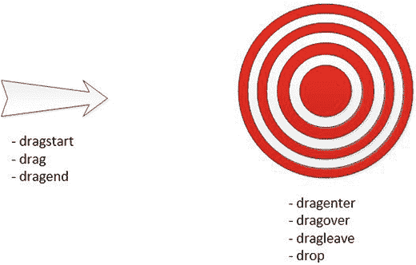
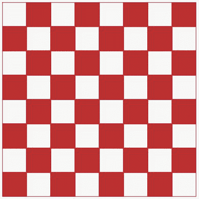
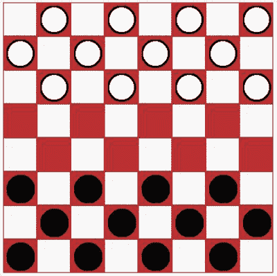
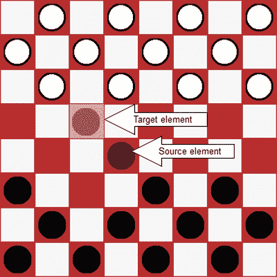
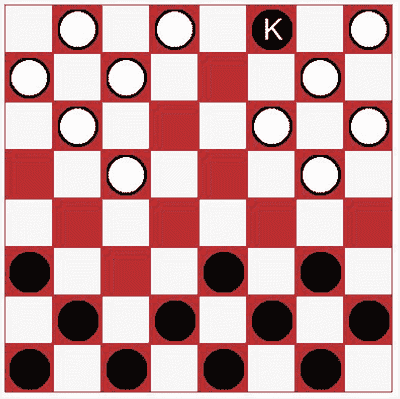
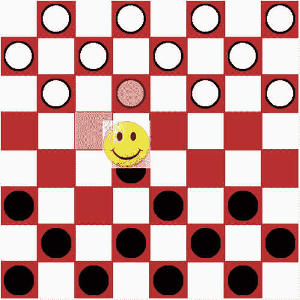

# 十四、拖放

选择一个元素并将其拖动到另一个位置的能力是自然用户体验的一个很好的例子。我还记得早期的苹果电脑，你可以通过把文件拖到垃圾桶图标上来删除它。这个动作，以及成百上千个类似的动作，是桌面应用用户体验的重要组成部分。然而，Web 应用在这个领域已经远远落后了。有了 HTML5 中的拖放(DnD) API，你会发现 web 应用正在迅速赶上来。

在本章中，你将构建一个实现跳棋游戏的 web 应用，使用 DnD API 在棋盘上移动棋子。我将首先解释 DnD 应用的概念和结构。然后我将深入代码，演示各个方面。最后，我将介绍一些高级功能，包括在浏览器窗口之间拖动。

## 理解拖放

在开始构建应用之前，我想解释一下 DnD API 的基本概念。这将有助于您在开始编写代码时将它放在上下文中。我将首先解释引发的事件；重要的是要知道什么时候每一个都被提出来了，在哪个对象上。然后您将看到`dataTransfer`对象，您将使用它将信息从被拖动的对象传递到每个事件，并最终传递到放下动作。您还可以使用它来配置拖动操作的各个方面。最后，我将向您展示如何使对象可拖动。

### 处理事件

和它的桌面版一样，DnD 是一个基于事件的 API。当用户选择、移动和放下某项时，会引发事件，允许应用控制和响应这些操作。为了有效地使用这个 API，您需要知道这些事件何时被引发，以及它们是在哪个元素上被引发的。起初，这可能看起来令人困惑，但是一旦你正确地看待它，它就变得非常简单了。

在 DnD 操作中，涉及两个要素:

*   被拖动的元素，有时称为源
*   被拖放的元素，通常称为目标

你可以把它想象成一个正在射向目标的箭头，如图 14-1 所示。

图 14-1。

The source and target elements

在 DnD 操作中，两个元素都触发了事件，我已经指出了每个元素引发了哪些事件。在源元素上，`dragstart`、`drag`和`dragend`事件与 Windows 应用中的`mousedown`、`mousemove`和`mouseup`事件相当。当您单击一个元素并开始移动鼠标时，就会引发`dragstart`事件。紧随其后的是`drag`事件，并且`drag`事件也随着鼠标的每一次移动而被重复引发。最后，释放鼠标按钮时会引发`dragend`事件。

目标元素上的事件更有趣一些。当鼠标在页面上移动时，当它进入由一个元素定义的区域时，`dragenter`事件在该元素上被引发。随着鼠标继续移动，在目标元素上引发了`dragover`事件。如果鼠标移动到该元素之外，目标元素上将触发`dragleave`事件。据推测，鼠标现在位于不同的元素上，并且在该元素上引发了一个`dragenter`事件。然而，如果在目标元素上释放鼠标按钮，将会引发`drop`事件，而不是`dragleave`事件。

现在让我们浏览一个典型的场景，看看这些事件的顺序。如表 14-1 所示。

表 14-1。

Sequence of Events

<colgroup><col> <col> <col></colgroup> 
| 元素 | 事件 | 笔记 |
| --- | --- | --- |
| 来源 | `dragstart` | 当鼠标被单击并开始移动时引发 |
| 来源 | `drag` | 每次鼠标移动时引发 |
| 目标 | `dragenter` | 当鼠标进入目标元素的空间时引发 |
| 目标 | `dragover` | 当指针位于目标上方时，随着每次鼠标移动而引发 |
| 来源 | `drag` | 当鼠标移动时继续上升 |
| 目标 | `dragleave` | 当鼠标移过当前目标时引发 |
| 目标 | `dragenter` | 当鼠标移动到新的目标元素时引发 |
| 目标 | `drop` | 释放鼠标按钮时引发 |
| 来源 | `dragend` | 结束拖放操作 |

现在您已经理解了所使用的事件，您可以通过为每个事件提供适当的处理程序来实现 DnD 操作。

### 使用数据传输对象

还有一个你应该理解的 DnD 概念。简单地在页面上拖动一个元素并不那么有用；您真正需要的是与元素相关联的数据。在我前面给出的将文件拖到垃圾桶的例子中，看到图标被垃圾桶吞噬可能看起来很有趣，但最终目的是删除文件。在这种情况下，您将文件规范传递给回收站，以便它可以在文件系统中执行请求的操作。

#### 存储数据

在 DnD API 中，`dataTransfer`对象用于存储与操作相关的数据。对象通常在`dragstart`事件处理程序中初始化。回想一下，这个事件是在 source 元素上引发的。事件处理程序可以从源元素中访问数据，并将其存储在`dataTransfer`对象中。然后将它提供给所有其他事件处理程序，以便它们可以在自己的特定处理中使用它。最终，`drop`事件处理程序使用它来对这些数据采取适当的行动。

`dataTransfer`对象是作为传递给每个事件处理程序的`event`对象的属性提供的。您使用`setData()`方法将数据存储在`dataTransfer`对象中。为了指示数据的类型，还需要提供适当的 MIME 类型。例如，要添加一些简单的文本，请像这样调用方法:

`e.dataTransfer.setData("text", "Hello, World!");`

要在后续事件(如`drop`事件)中访问该数据，请像这样使用`getData()`方法:

`var msg = e.dataTransfer.getData("text");`

检索数据时需要使用与存储数据时相同的 MIME 类型。

Caution

并非所有的浏览器都能识别所有的 MIME 类型。在这个例子中，您可能希望使用`text/plain`。这在 Firefox 和 Opera 中运行良好，但在 Chrome 或 IE 中不受支持。然而，如果你只使用`text`，这将在所有这些浏览器上工作。

#### 使用拖放效果

对象的另一个目的是向用户提供当项目被放下时将发生的动作的反馈。这就是所谓的下降效应，有四种可能的值。

*   `copy`:选中的元素将被复制到目标位置。
*   `move`:选中的元素将被移动到目标位置。
*   `link`:将在目标位置创建一个指向所选项目的链接。
*   `none`:不允许拖放操作。

当您开始拖动一个项目时，光标将会改变，以指示当项目被放到目标上时将会出现的拖放效果。这是标准的 Windows 用户界面，您可以在大多数应用上尝试。例如，使用 Visual Studio 中的文本编辑器，选择一些文本，然后开始拖动它。您应该会看到光标变为移动光标或“不允许”光标，这取决于您尝试将它移动到的位置。如果在移动之前按住 Ctrl 键，您应该会看到复制光标而不是移动光标。

在`dragstart`事件处理程序中，您可以根据选择的源元素指定允许的拖放效果。您可以通过简单地连接它们来指定多个允许的效果(例如，`copyMove`)或者像这样指定所有效果:

`e.dataTransfer.effectAllowed = "all"; // "copy", "link", "move", "copyLink", "linkMove", "copyMove"`

然后，在`dragover`事件中，您将指定如果源元素被放到那里将会发生的拖放效果。如果该拖放效果是允许的效果之一，光标将改变以指示该拖放效果。但是，如果不允许该效果，光标将使用“不允许”图标。如果这不是接受放置的有效位置，将放置效果设置为`none`，如下所示:

`if (validLocation) {`

`e.dataTransfer.dropEffect = "move";`

`}`

`else {`

`e.dataTransfer.dropEffect = "none";`

`}`

### 启用可拖动元素

所以，现在你知道可以通过在`dragover`事件中将拖放效果设置为`none`来禁用元素上的`drop`事件。但是如何控制哪些元素可以拖动开始呢？答案很简单:只需在元素的标记中设置`draggable`属性。例如，要创建一个可以拖动的`div`，输入如下标记:

`
`

`
This div is draggable
`

`
`

默认情况下，图像和链接是可拖动的。转到`google.com`并尝试拖动谷歌标志。当您移动光标时，您应该会看到该图像的一个稍微柔和的副本被拖动。

如果你把这个图片拖到 Firefox 浏览器窗口，Firefox 会导航到这个图片。您刚刚看到了拖放操作。因为使用拖放是一种非常自然的工作方式，浏览器试图尽可能地适应这种开箱即用的方式。例如，如果您从文本编辑器中将一些看起来像 URL 的文本拖到浏览器上，它会尝试导航到该地址。如果您将图像文件拖到浏览器上，它将导航到该文件或下载该文件。

有时，默认操作会导致自定义代码出现问题。我将在练习 14-3 中告诉你如何禁用它。

Note

有关 DnD API 的更多信息，请查看 W3C 规范，网址为 [`http://dev.w3.org/html5/spec/single-page.html#dnd`](http://dev.w3.org/html5/spec/single-page.html#dnd) 。

## 创建 Checkers 应用

为了演示 DnD API，您将创建一个 web 应用来显示一个典型的红白相间的棋盘。您将使用图像文件来表示跳棋，并在它们的初始起始位置显示它们。然后，您将创建允许您将棋子移动到不同方块的事件处理程序。最后，您将添加逻辑来禁用非法移动。

Tip

在本章中，当您向应用添加特性时，您将在这个项目中添加和修改代码。如果对应该在哪里进行更改有任何疑问，最终代码在附录 C 中列出，也可以从源代码下载中获得。

### 创建项目

您首先需要创建一个 Visual Studio 项目，该项目类似于您之前创建的项目。这将使用网站 ASP.NET 5 项目模板。

EXERCISE 14-1\. CREATING THE VISUAL STUDIO PROJECTStart Visual Studio 2015\. In the Start Page, click the New Project link.   In the New project dialog box, select the ASP.NET Web Application template. Enter the project name Chapter 14 and select a location for this project.   In the next dialog box, select the ASP.NET 5 Web Site template. Click the OK button to create the project.   In Solution Explorer, right-click the `Views\Home` folder and click the Add and New Item links. In the Add New Item dialog box, select MVC View Page, enter the name Checkers.cshtml, and click the Add button.   Open the `HomeController.cs` file in the `Controllers` folder. Add the following code at the end of the class. This will display the new Checkers view.  

`public IActionResult Checkers()`

`{`

`return View();`

`}`

The source code download for this chapter includes an `Images` folder with five images. Copy all five images to the `wwwroot\images` folder in Solution Explorer.  

### 画棋盘

为了绘制棋盘，您将为每个方块使用一个单独的`div`元素。您需要 8 行，每行 8 个`div`元素。幸运的是，使用几个嵌套的`for`循环和 Razor 语法很容易做到这一点。

Note

在第十章中，你用`canvas`元素画了一个棋盘。然而，这对于这个应用来说是行不通的，因为每个方块都需要单独的 DOM 元素。您可能会尝试使用 SVG 来创建棋盘，因为每个`rect`元素都是一个独立的 DOM 元素；然而，SVG 元素不支持 DnD API。

EXERCISE 14-2\. DRAWING THE BOARDReplace the default implementation of the `Checkers.cshtml` with the code shown in Listing 14-1.  

清单 14-1。最初的 Checkers.cshtml 实现

`<head>`

`</head>`

`<body>`

`
`

`@for (int y = 0; y < 8; y++)`

`{`

`for (int x = 0; x < 8; x++)`

`{`

`string id = x.ToString() + y.ToString();`

`string css;`

`if ((x + y) % 2 == 0)`

`{`

`css = "bwhite";`

`}`

`else`

`{`

`css = "bblack";`

`}`

`<text>`

`
`

`
`

`</text>`

`}`

`}`

`
`

`</body>`

This code uses two nested `for` loops to create the `div` elements. Inside the second for loop, the `id` variable is computed by concatenating the `x` and `y` variables. The `css` variable alternates between `bwhite` and `bblack`. For even-numbered rows, the even columns are black, and the odd columns are white. This reverses for odd-numbered rows. The `draggable` attribute is set to false because we don’t want squares being dragged, only pieces.   Now you’ll need to add some style rules to set the size and color of each square. Add the `style` element shown in Listing 14-2 inside the `head` element.  

清单 14-2。添加 CSS 样式

``

Press F5 to preview this page, which should look like Figure 14-2. You didn’t provide a link to get to the Checkers page. To navigate to your page, add /Home/Checkers to the URL in the browser.

图 14-2。

The initial board  Now you’ll add the checkers by including an `img` element inside the appropriate `div` elements. Add the code shown in bold in Listing 14-3.  

清单 14-3。添加图像

`<text>`

`
`

`@if ((x + y) % 2 != 0``&&``y != 3``&&`

`{`

`string imgSrc;`

`string pid;`

`if (y < 3)`

`{`

`imgSrc = "../img/WhitePiece.png";`

`pid = "w" + id;`

`}`

`else`

`{`

`imgSrc = "../img/BlackPiece.png";`

`pid = "b" + id;`

`}`

`<text>`

``

`</text>`

`}`

`
`

`</text>`

To determine the appropriate squares, the first rule is that checkers are only on the black (or red in this case) squares. So, the code uses the same `(x + y) % 2 != 0` logic that was used to compute the `css` variable. Then, checkers are placed only on the top three and bottom three rows, so the code excludes rows 3 and 4\. If the row is less than 3, this will add a white checker and use a black checker for the other rows. The code computes the `id` for the `img` element by prefixing the `id` of the square with either `w` or `b`. Notice that the `draggable` attribute is set to true.   The `class` attribute for the `img` elements was set to `piece`. Now add the following rule to the existing `style` element, which will add padding so the checker will be centered in the square.  

`.piece`

`{`

`margin-left: 4px;`

`margin-top: 4px;`

`}`

Press F5 to start the application, and you should now see the checkers, as demonstrated in Figure 14-3.

图 14-3。

The initial checker board with checkers  

## 添加拖放支持

`img`元素是用`draggable`属性添加的，所以您应该能够选择并拖动它。但是，您会注意到没有一个方块接受拖放，光标显示“不允许”图标。如果您想尝试一些默认的浏览器功能，请尝试将图像拖动到地址栏。浏览器将导航到图像的 URL。现在，您将添加启用拖放的代码，以便您可以开始移动棋子。然后，您将细化该代码，以确保只允许合法的移动。

### 允许下降

您有可拖动的元素，而完成拖放操作所需要的只是一个接受拖放的元素。为此，您需要一个用于设置拖放效果的`dragover`事件的事件处理程序。默认情况下，`effectAllowed`属性被设置为 all，因此将拖放效果设置为 move、copy 或 link 都是有效的设置。要尝试这样做，在`body`元素的末尾添加一个`script`元素，并添加清单 14-4 中所示的代码。

Listing 14-4\. The Initial Event Implementation

``

这段代码使用了我在第五章中描述的`querySelectorAll()`函数来获取所有的黑色方块。然后，它遍历返回的集合，并为`dragover`事件添加一个事件处理程序。`dragover()`函数调用`preventDefault()`函数取消浏览器的默认动作。然后它获取`dataTransfer`对象并将`dropEffect`属性设置为`move`。

按 F5 运行应用，并尝试拖动一个 checker。现在你应该在所有的黑色方块上看到一个移动光标，但是在白色方块上看到一个“不允许”的光标。试着把棋子放到一个空的黑色方块上。因为您还没有实现一个`drop`事件处理程序，浏览器将执行它的默认放下动作。根据浏览器的不同，这可能会导航到图像文件。

### 执行自定义拖放操作

默认动作不是您在这里要找的，所以您需要实现`drop`事件处理程序并提供您自己的逻辑。drop 事件处理程序是所有实际工作发生的地方。如果这是一个垃圾桶，文件就在这里被删除。对于这个应用，拖放操作将在目标位置创建一个新的`img`元素，并删除之前的图像。

要实现 drop，您还需要提供`dragstart`事件处理程序。在`dragstart`事件处理程序中，您将存储被拖动到`dataTransfer`对象中的`img`元素的`id`。这将由`drop`事件处理程序使用，因此它将知道删除哪个元素。

EXERCISE 14-3\. IMPLEMENTING THE DROPAdd the following function to the existing `script` element, which will be used as the `dragstart` event handler. This code gets the `id` of the source element (remember the `dragstart` event is raised on the source element), which is the selected checker image. This `id` is stored in the `dataTransfer` object. This function also specifies that the allowed effects should be `move` since you’ll be moving this image.  

`function dragStart(e) {`

`e.dataTransfer.effectAllowed = "move";`

`e.dataTransfer.setData("text", e.target.id);`

`}`

To provide the `drop` event handler, add the code shown in Listing 14-5.  

清单 14-5。实现 Drop 事件处理程序

`function drop(e) {`

`// Prevent the event from being raised on the parent element`

`if (e.stopPropagation) {`

`e.stopPropagation();`

`}`

`// Stop the browsers default action`

`if (e.preventDefault) {`

`e.preventDefault();`

`}`

`// Get the img element that is being dragged`

`var droppedID = e.dataTransfer.getData("text");`

`var droppedPiece = document.getElementById(droppedID);`

`// Create a new img on the target location`

`var newPiece = document.createElement("img");`

`newPiece.src = droppedPiece.src;`

`newPiece.id = droppedPiece.id.substr(0, 1) + e.target.id;`

`newPiece.draggable = true;`

`newPiece.classList.add("piece");`

`newPiece.addEventListener("dragstart", dragStart, false);`

`e.target.appendChild(newPiece);`

`// Remove the previous image`

`droppedPiece.parentNode.removeChild(droppedPiece);`

`}`

This code first calls the `stopPropagation()` function to keep this event from bubbling up to the parent element. It also calls `preventDefault()` to cancel the browser’s default action. It then gets the `id` from the `dataTransfer` object and uses this to access the `img` element. This function then creates a new `img` element and sets all the necessary properties and adds the necessary event handlers. As I explained, the `drop` event is raised on the target element, which is the element being dropped on. The `id` for the new `img` element is computed using the `id` of the new location, which is obtained from the `target` property of the `event` object. The ID prefix (`b` or `w`) is copied from the existing `img` element. Finally, this code removes the existing `img` element.   Now you’ll need to wire up the event handlers. To do that, add the following code shown in bold near the beginning of the `script` element:  

`var squares = document.querySelectorAll('.bblack');`

`var i = 0;`

`while (i < squares.length) {`

`var s = squares[i++];`

`// Add the event listeners`

`s.addEventListener('dragover', dragOver, false);`

`s.addEventListener('drop', drop, false);`

`}`

`i = 0;`

`var pieces = document.querySelectorAll('img');`

`while (i < pieces.length) {`

`var p = pieces[i++];`

`p.addEventListener('dragstart', dragStart, false);`

`}`

The `drop` event handler is added to the squares since these are the target elements. The `dragstart` event must be added to the `img` elements. This code gets all of the `img` elements using the `querySelectorAll()` function.   Now press F5 to start the application. You should be able to drag a checker to any red square.  

### 提供视觉反馈

当拖动一个元素时，提供一些指示被选择对象的视觉反馈是一个好主意。通过在`dragover`事件处理程序中设置`dropEffect`属性，光标指示是否允许拖放。然而，你应该做得更多。源元素和目标元素都应该在视觉上突出，这样用户可以很容易地看到，如果他们释放鼠标按钮，这个部分将从这里移动到那里。

为此，您将向源和目标元素动态添加一个`class`属性。然后，您可以使用普通的 CSS 样式规则来设置它们的样式。对于源元素，您将使用`dragstart`和`dragend`事件来添加和移除`class`属性。同样，对于目标元素，您将使用`dragenter`和`dragleave`事件。

EXERCISE 14-4\. ADDING VISUAL FEEDBACKYou already have a `dragstart` event handler; add the following code in bold to the `dragStart()` function. This will add the `selected` class to the element.  

`function dragStart(e) {`

`e.dataTransfer.effectAllowed = "all";`

`e.dataTransfer.setData("text/plain", e.target.id);`

`e.target.classList.add("selected");`

`}`

Add the `dragEnd()` function using the following code that will simply remove the `selected` class when the drag operation has completed.  

`function dragEnd(e) {`

`e.target.classList.remove("selected");`

`}`

Add the `dragEnter()` and `dragLeave()` functions using the following code. This adds the `drop` class to the element and then removes it.  

`function dragEnter(e) {`

`e.target.classList.add('drop');`

`}`

`function dragLeave(e) {`

`e.target.classList.remove("drop");`

`}`

Since you’ve added three new event handlers, you’ll need to add code to add the event listeners. Add the code shown in bold to the existing `script` element.  

`var squares = document.querySelectorAll('.bblack');`

`var i = 0;`

`while (i < squares.length){`

`var s = squares[i++];`

`// Add the event listeners`

`s.addEventListener('dragover', dragOver, false);`

`s.addEventListener('drop', drop, false);`

`s.addEventListener('dragenter', dragEnter, false);`

`s.addEventListener('dragleave', dragLeave, false);`

`}`

`i = 0;`

`var pieces = document.querySelectorAll('img');`

`while (i < pieces.length){`

`var p = pieces[i++];`

`p.addEventListener('dragstart', dragStart, false);`

`p.addEventListener('dragend', dragEnd, false);`

`}`

Now you’ll need to make a couple of changes to the `drop` event handler. You added the `drop` class to the target element in the `dragenter` event and then removed it in the `dragleave` event. However, if they drop the image, the `dragleave` event is not raised. You’ll also need to remove the `drop` class in the `drop` event as well. Also, when creating a new `img` element, you’ll need to wire up the `dragend` event handler.   Add the code shown in bold.  

`// Create a new img on the target location`

`var newPiece = document.createElement("img");`

`newPiece.src = droppedPiece.src;`

`newPiece.id = droppedPiece.id.substr(0, 1) + e.target.id;`

`newPiece.draggable = true;`

`newPiece.classList.add("piece");`

`newPiece.addEventListener("dragstart", dragStart, false);`

`newPiece.addEventListener("dragend", dragEnd, false);`

`e.target.appendChild(newPiece);`

`// Remove the previous image`

`droppedPiece.parentNode.removeChild(droppedPiece);`

`// Remove the drop effect from the target element`

`e.target.classList.remove('drop');`

Finally, you’ll need to define the CSS rules for the `drop` and `selected` values. I’ve chosen to set the `opacity` attribute, but you could just as easily add a border, change the background color, or implement any number of effects to achieve the desired purpose.   Add the following rules to the existing `style` element:  

`.bblack.drop`

`{`

`opacity: 0.5;`

`}`

`.piece.selected`

`{`

`opacity: 0.5;`

`}`

Press F5 to start the application. Try dragging an image to a red square, and you should see the expected visual feedback, as shown in Figure 14-4.

图 14-4。

Displaying the drag-and-drop visual feedback  

## 执行游戏规则

你可能已经注意到你可以移动一个棋子到任何红色方块。当前的实现没有实现任何规则来确保进行合法的移动。现在，您将添加该逻辑。以下事件将需要这一点:

*   `dragover`:将`dropEffect`设置为`none`，用于非法移动
*   `dragenter`:仅改变有效放置位置的样式
*   只有在合法的情况下才执行移动

您将实现一个`isValidMove()`函数，该函数将评估尝试的移动，如果这是非法移动，则返回`false i`。然后，您将在前面列出的三个事件中调用这个函数。

### 验证移动

幸运的是，跳棋的规则相当简单。因为`dragover`事件处理程序没有被添加到白色方块中，所以在那里放置一块已经被禁用，这进一步简化了所需的工作。以下是您将实现的规则:

*   你不能移动到已经被占领的方块。
*   棋子只能向前移动。
*   棋子只能对角移动一格或两格(对角),如果跳过一个被占领的方格。
*   你只能跳一个不同颜色的棋子。
*   跳下的棋子必须从棋盘上移走。

Note

稍后，您将添加逻辑来处理将棋子提升为国王的过程。

EXERCISE 14-5\. ENFORCING THE RULESImplement the `isValidMove()` function by adding the code shown in Listing 14-6 to the existing `script` element.  

清单 14-6。实现 isValidMove()函数

`function isValidMove(source, target, drop) {`

`// Get the piece prefix and location`

`var startPos = source.id.substr(1, 2);`

`var prefix = source.id.substr(0, 1);`

`// Get the drop location, strip off the prefix, if any`

`var endPos = target.id;`

`if (endPos.length > 2) {`

`endPos = endPos.substr(1, 2);`

`}`

`// You can't drop on the existing location`

`if (startPos === endPos) {`

`return false;`

`}`

`// You can't drop on occupied square`

`if (target.childElementCount != 0) {`

`return false;`

`}`

`// Compute the x and y coordinates`

`var xStart = parseInt(startPos.substr(0, 1));`

`var yStart = parseInt(startPos.substr(1, 1));`

`var xEnd = parseInt(endPos.substr(0, 1));`

`var yEnd = parseInt(endPos.substr(1, 1));`

`switch (prefix) {`

`// For white pieces...`

`case "w":`

`if (yEnd <= yStart)`

`return false; // Can't move backwards`

`break;`

`// For black pieces...`

`case "b":`

`if (yEnd >= yStart)`

`return false; // Can't move backwards`

`break;`

`}`

`// These rule apply to all pieces`

`if (yStart === yEnd || xStart === xEnd)`

`return false; // Move must be diagonal`

`if (Math.abs(yEnd - yStart) > 2 || Math.abs(xEnd - xStart) > 2)`

`return false; // Can't move more than two spaces`

`// If moving two spaces, find the square that is jumped`

`if (Math.abs(xEnd - xStart) === 2) {`

`var pos = ((xStart + xEnd) / 2).toString() +`

`((yStart + yEnd) / 2).toString();`

`var div = document.getElementById(pos);`

`if (div.childElementCount === 0)`

`return false;  // Can't jump an empty square`

`var img = div.children[0];`

`if (img.id.substr(0, 1).toLowerCase() === prefix.toLowerCase())`

`return false; // Can't jump a piece of the same color`

`// If this function is called from the drop event`

`// Remove the jumped piece`

`if (drop) {`

`div.removeChild(img);`

`}`

`}`

`return true;`

`}`

The parameters to the `isValidMove()` function include the source and target elements. Remember, the source is an `img` element, and its `id` attribute is a combination of the color (`w` or `b`) and the x and y coordinates. The target is a `div` element, and its `id` attribute is just the x and y coordinates. I’ve added lots of comments to this code, so it should be fairly self-explanatory, but I will point out a couple of the more interesting points.

*   要确定一个正方形是否被占用，您可以简单地检查`childElementCount`属性。对于空方块，这将是 0。
*   对于白色棋子，向前移动意味着 y 坐标增加，但是对于黑色棋子，情况正好相反。为了处理这个问题，函数使用了一个`switch`语句来为每一个应用不同的规则。
*   如果棋子移动了两格，那么这个函数需要检查被跳过的方格。它的位置通过平均起始和结束位置来确定。
*   如果方块被占据，那么代码会检查该块是否是相同的颜色。代码首先获取子元素，这将是方块上的`img`。颜色由`id`属性的前缀决定。代码在比较前将前缀转换为小写。稍后我会解释的。
*   如果一个不同颜色的块被跳转，那么你将移除它，因为代码已经有了`img`元素。然而，只有从`drop`事件中调用该方法时，才需要这样做，该事件由该函数的第三个参数指定。另外两个事件(`dragOver`和`dragEnter`)使用这个方法来验证移动，但并不实际进行移动，它们将为第三个参数传递 false。

  Now you’ll need to change `dragover` event to validate the move before setting the `dropEffect`. Replace the existing implementation of the `dragOver()` function with the code shown in Listing 14-7. The new code gets the `id` of the `img` that is being dragged from the `dataTransfer` object and then uses the `id` to get the element. This is passed in to the `isValidMove()` function along with the target element, which is obtained from the `event` object (`e.target`). The `dropEffect` is set to `move` only if this is a valid move.  

清单 14-7。修订后的 dragOver 事件处理程序

`function dragOver(e) {`

`if (e.preventDefault) {`

`e.preventDefault();`

`}`

`// Get the img element that is being dragged`

`var dragID = e.dataTransfer.getData("text");`

`var dragPiece = document.getElementById(dragID);`

`// Work around - if we can't get the dataTransfer, don't`

`// disable the move yet, the drop event will catch this`

`if (dragPiece) {`

`if (e.target.tagName === "DIV" &&`

`isValidMove(dragPiece, e.target, false)) {`

`e.dataTransfer.dropEffect = "move";`

`}`

`else {`

`e.dataTransfer.dropEffect = "none";`

`}`

`}`

`}`

注意在撰写本文时，Chrome、IE 和 Opera 都不允许你在`dragEnter`和`dragOver`事件中访问`dataTransfer`对象。然而，这在`drop`事件中确实有效。在`dragOver`事件中，如果源对象不可用，则允许移动。游戏还会运行，因为`drop`事件会忽略任何无效的招式，但是用户体验并不理想。`dragEnter`事件用于应用`drop`类进行样式设计，这也不能正常工作。在本章的剩余部分，我将使用 Firefox 来测试应用。

Replace the implementation of the `dragEnter()` function with the following code. This code is essentially the same as the `dragOver()` function, except it adds the `drop` class to the element instead of setting the `dropEffect`.  

`function dragEnter(e) {`

`// Get the img element that is being dragged`

`var dragID = e.dataTransfer.getData("text");`

`var dragPiece = document.getElementById(dragID);`

`if (dragPiece &&`

`e.target.tagName === "DIV" &&`

`isValidMove(dragPiece, e.target, false)) {`

`e.target.classList.add('drop');`

`}`

`}`

For the `drop()` function, wrap the code that performs the drop inside an `if` statement that validates the move by adding the code shown in bold. This time, the code is passing `true` for the third parameter to the `isValidMove()` function.  

`if (droppedPiece` `&&`

`e.target.tagName === "DIV"` `&&`

`isValidMove(droppedPiece, e.target, true)) {`

`// Create a new img on the target location`

`var newPiece = document.createElement("img");`

`newPiece.src = droppedPiece.src;`

`newPiece.id = droppedPiece.id.substr(0, 1) + e.target.id;`

`newPiece.draggable = true;`

`newPiece.classList.add("piece");`

`newPiece.addEventListener("dragstart", dragStart, false);`

`newPiece.addEventListener("dragend", dragEnd, false);`

`e.target.appendChild(newPiece);`

`// Remove the previous image`

`droppedPiece.parentNode.removeChild(droppedPiece);`

`// Remove the drop effect from the target element`

`e.target.classList.remove('drop');`

`}`

With these changes now in place, try running the application. You should be allowed to make only legal moves. If you jump a checker, it should be removed from the board.  

### 晋升为国王

在跳棋中，当一个棋子一直移动到最后一行时，它就被提升为国王。国王的工作方式和普通棋子一样，只是它可以向后移动。现在，您将添加代码来检查某个部分是否需要升级。要升级一个棋子，您需要更改显示的图像以表明它是一个国王。您还将更改前缀，使其成为大写的 B 或 w。然后您可以允许国王使用不同的规则。

您将把所有这些逻辑放在一个名为`kingMe()`的函数中，并且在每次发生拖放时调用这个函数。如果棋子已经是一个国王，或者不在最后一行，函数就返回。否则，它会执行提升。

EXERCISE 14-6\. ADDING PROMOTIONAdd the `kingMe()` function shown in Listing 14-8 to the existing `script` element.  

清单 14-8。实现 kingMe()函数

`function kingMe(piece) {`

`// If we're already a king, just return`

`if (piece.id.substr(0, 1) === "W" || piece.id.substr(0, 1) === "B")`

`return;`

`var newPiece;`

`// If this is a white piece on the 7th row`

`if (piece.id.substr(0, 1) === "w" && piece.id.substr(2, 1) === "7") {`

`newPiece = document.createElement("img");`

`newPiece.src = "../img/WhiteKing.png";`

`newPiece.id = "W" + piece.id.substr(1, 2);`

`}`

`// If this is a black piece on the 0th row`

`if (piece.id.substr(0, 1) === "b" && piece.id.substr(2, 1) === "0") {`

`var newPiece = document.createElement("img");`

`newPiece.src = "../img/BlackKing.png";`

`newPiece.id = "B" + piece.id.substr(1, 2);`

`}`

`// If a new piece was created, set its properties and events`

`if (newPiece) {`

`newPiece.draggable = true;`

`newPiece.classList.add("piece");`

`newPiece.addEventListener('dragstart', dragStart, false);`

`newPiece.addEventListener('dragend', dragEnd, false);`

`var parent = piece.parentNode;`

`parent.removeChild(piece);`

`parent.appendChild(newPiece);`

`}`

`}`

The `kingMe()` function simply returns if the `id` prefix is either B or W, which indicates this is already a king. It then checks to see whether this is a white piece on row 7 or a black piece on row 0\. If so, a new `img` element is created with the appropriate `src` and `id` properties. If a new `img` was created, the function then sets all of the properties and events, removes the existing `img` element from the `div` element, and adds the new one.   Modify the `drop()` function to call the `kingMe()` function after a drop has been performed by adding the line shown in bold.  

`// Remove the previous image`

`droppedPiece.parentNode.removeChild(droppedPiece);`

`// Remove the drop effect from the target element`

`e.target.classList.remove('drop');`

`// See if the piece needs to be promoted`

`kingMe(newPiece);`

提示当你实现了`isValidMove()`函数时，防止棋子向后移动的规则只适用于`b`和`w`前缀。由于国王有一个大写的`B`或`W`，这条规则不适用，因此国王可以向后移动。此外，当跳转一个棋子时，比较是在首先转换成小写字母之后进行的。这将允许白棋跳过黑棋或黑王。

Try moving the pieces around until you move one to the last row. You should see the image change to indicate this is now a king, as shown in Figure 14-5.

图 14-5。

The check board with a king  Once you have a king, try moving it backward and also try jumping pieces with it.  

### 依次移动

你可能已经注意到这个应用并没有强制每个玩家轮流玩。现在您将实现这个逻辑。每次移动后(`drop`事件被处理)，您将为刚刚移动的所有颜色块设置`draggable`属性为`false`。这将使你无法移动相同颜色的棋子。然而，这条规则有一个例外，需要做一些额外的工作。如果你跳了一个棋子，那么同一个棋子只要是另一跳就可以再移动一次。

您将首先从实现通用规则开始。这将通过创建一个名为`enableNextPlayer()`的新函数来完成。这个函数将使用`querySelectorAll()`函数来获取所有的`img`元素。根据前缀`id`，属性将被设置为`true`或`false`。然后您将添加特殊的逻辑来处理跳转条件。

EXERCISE 14-7\. TAKING TURNSAdd the `enableNextPlayer()` function to the existing `script` element using the code shown in Listing 14-9.  

清单 14-9。实现 enableNextPlayer()函数

`function enableNextPlayer(piece) {`

`// Get all of the pieces`

`var pieces = document.querySelectorAll('img');`

`i = 0;`

`while (i < pieces.length) {`

`var p = pieces[i++];`

`// If this is the same color that just moved, disable dragging`

`if (p.id.substr(0, 1).toUpperCase() ===`

`piece.id.substr(0, 1).toUpperCase()) {`

`p.draggable = false;`

`}`

`// Otherwise, enable dragging`

`else {`

`p.draggable = true;`

`}`

`}`

`}`

At the end of the `isValidMove()` function, add the code shown in bold. This will call the `enableNextPlay()` function when a drop is being performed.  

`// Set the draggable attribute so the next player can take a turn`

`if (drop) {`

`enableNextPlayer(source);`

`}`

`return true;`

`}`

注意通常将这个调用放在`drop()`函数中可能更有意义。然而，只有`isValidMove()`函数知道发生了跳转，您需要在这里添加覆盖逻辑。这需要在应用一般规则之后。

The `drop()` function creates a new `img` element and currently sets the `draggable` attribute to `true.` Now you’ll need to make this conditional based on the `draggable` attribute of the existing piece. Add the following code shown in bold to the `drop()` function:  

`// Create a new img on the target location`

`var newPiece = document.createElement("img");`

`newPiece.src = droppedPiece.src;`

`newPiece.id = droppedPiece.id.substr(0, 1) + e.target.id;`

`newPiece.draggable = droppedPiece.draggable;`

`newPiece.classList.add("piece");`

`newPiece.addEventListener("dragstart", dragStart, false);`

`newPiece.addEventListener("dragend", dragEnd, false);`

`e.target.appendChild(newPiece);`

Now you’ll need change the `dragStart` event handler to ignore this event if the element is not draggable. Add the following code shown in bold to the `dragStart()` function:  

`function dragStart(e) {`

`if (e.target.draggable) {`

`e.dataTransfer.effectAllowed = "move";`

`e.dataTransfer.setData("text/plain", e.target.id);`

`e.target.classList.add("selected");`

`}`

`}`

Now you’ll implement the special jump logic. If the piece just made a jump, you’ll set the `draggable` attribute back to true so it will be allowed to make another move. However, you’ll also add the `jumpOnly` class to the `classList` so you can enforce that the only move that it is allowed to make is another jump.   Add the code shown in bold to the `isValidMove()` function. This will look for `jumpOnly` in the `classList` and set the `jumpOnly` flag accordingly.  

`var jumpOnly = false;`

`if (source.classList.contains("jumpOnly")) {`

`jumpOnly = true;`

`}`

`// Compute the x and y coordinates`

`var xStart = parseInt(startPos.substr(0, 1));`

`var yStart = parseInt(startPos.substr(1, 1));`

Now add the code shown in bold to the `isValidMove()` function. The first part adds the rule to make sure a jump is being made if `jumpOnly` is true. The second part sets the `jumped` flag to indicate that this move is making a jump.  

`// These rule apply to all pieces`

`if (yStart === yEnd || xStart === xEnd)`

`return false; // Move must be diagonal`

`if (Math.abs(yEnd - yStart) > 2 || Math.abs(xEnd - xStart) > 2)`

`return false; // Can't move more than two spaces`

`if (Math.abs(xEnd - xStart) === 1``&&`

`return false; // Only jumps are allowed`

`var jumped = false;`

`// If moving two spaces, find the square that is jumped`

`if (Math.abs(xEnd - xStart) === 2) {`

`var pos = ((xStart + xEnd) / 2).toString() +`

`((yStart + yEnd) / 2).toString();`

`var div = document.getElementById(pos);`

`if (div.childElementCount === 0)`

`return false;  // Can't jump an empty square`

`var img = div.children[0];`

`if (img.id.substr(0, 1).toLowerCase() === prefix.toLowerCase())`

`return false; // Can't jump a piece of the same color`

`// If this function is called from the drop event`

`// Remove the jumped piece`

`if (drop) {`

`div.removeChild(img);`

`jumped = true;`

`}`

`}`

At the end of the `isValidMove()` function, add the code shown in bold. This will override the `draggable` attribute if a jump was made and add `jumpOnly` to the `classList`.  

`if (drop) {`

`enableNextPlayer(source);`

`// If we jumped a piece, we're allowed to go again`

`if (jumped) {`

`source.draggable = true;`

`source.classList.add("jumpOnly"); // But only for another jump`

`}`

`}`

注意`enableNextPlayer()`功能禁用当前玩家的所有棋子，并启用其他玩家的。然后这段代码启用了刚刚跳转的部分。所以，两者都被启用；这个棋子可以再次跳跃，或者下一个玩家可以移动。两者都是有效的，所以我们需要允许它们都存在。

Modify the `drop()` function to also add `jumpOnly` to the `classList` when creating the new `img` element by adding the code shown in bold.  

`// Create a new img on the target location`

`var newPiece = document.createElement("img");`

`newPiece.src = droppedPiece.src;`

`newPiece.id = droppedPiece.id.substr(0, 1) + e.target.id;`

`newPiece.draggable = droppedPiece.draggable;`

`if (droppedPiece.draggable){`

`newPiece.classList.add("jumpOnly");`

`}`

`newPiece.classList.add("piece");`

Now you’ll need to clear `jumpOnly` from the `classList` when the next move is completed. You’ll do that in the `enableNextPlayer()` function by adding the code shown in bold.  

`function enableNextPlayer(piece) {`

`// Get all of the pieces`

`var pieces = document.querySelectorAll('img');`

`i = 0;`

`while (i < pieces.length) {`

`var p = pieces[i++];`

`// If this is the same color that just moved, disable dragging`

`if (p.id.substr(0, 1).toUpperCase() ===`

`piece.id.substr(0, 1).toUpperCase()) {`

`p.draggable = false;`

`}`

`// Otherwise, enable dragging`

`else {`

`p.draggable = true;`

`}`

`p.classList.remove("jumpOnly");`

`}`

`}`

Now test the application and make sure that each player must alternate turns. Also, verify that you can make successive jumps.  

注意最初，白色和黑色棋子的`draggable`属性都被设置为`true`，因此任何一种颜色都可以先走一步。如果您想指定先使用哪种颜色，您可以更改创建初始`img`元素的 Razor 语法，将一种颜色的`draggable`属性设置为`false`。我做了一些研究，看看什么颜色应该先去，但发现混合的结果。有些地方指示黑色先走，有些地方说白色先走。然而，有些人说这只是一个游戏，有什么区别吗？我决定实现这个逻辑，所以两者都可以先走。

### 使用高级功能

在我结束这一章之前，有几件事我要简单地讨论一下。首先，我将向您展示如何使用自定义拖动图像。然后，我将演示在浏览器窗口中拖动元素。

### 更改拖动图像

当您拖动元素时，当您在页面上移动光标时，该元素的副本会跟随光标。这被称为拖动图像。但是，您可以指定使用不同的图像。这是通过`dataTransfer`对象的`setDragImage()`函数完成的。

`wwwroot\images`文件夹里有一张笑脸图片。将粗体显示的代码添加到`dragStart()`函数中，将其用作拖动图像。

`function dragStart(e) {`

`if (e.target.draggable) {`

`e.dataTransfer.effectAllowed = "move";`

`e.dataTransfer.setData("text", e.target.id);`

`e.target.classList.add("selected");`

`var dragIcon = document.createElement("img");`

`dragIcon.src = "../img/smiley.jpg";`

`e.dataTransfer.setDragImage(dragIcon, 0, 0);`

`}`

`}`

试试这个应用，当你移动棋子时，你应该会看到如图 14-6 所示的笑脸。

图 14-6。

Changing the drag image

### 在窗口间拖动

正如我在本章开始时提到的，在源元素和目标元素上引发了不同的事件。这些元素可能位于不同的浏览器窗口甚至不同的应用中。然而，这个过程的工作方式是一样的。

为了演示这一点，打开 Firefox 浏览器的第二个实例，并导航到 checkers 应用。您应该会看到两个浏览器窗口，每个窗口都显示了棋盘。在一个窗口中选择一个棋子，并将其拖到第二个窗口中的一个方块上。你会注意到，在第一个窗口中，你只能把它放到相对于它原来位置的方块上。当您放下它时，该片段会被移动到放下位置，但会从第二个窗口中移除，而不是从您最初选择的图像中移除。

跨窗口拖动的关键是`dataTransfer`对象。这在目标对象上的`dragenter`、`dragover`和`dragleave`事件中提供。阻力从哪里开始并不重要；这些信息放在`dataTransfer`对象中，并提供给任何支持这些事件的窗口。当 drop 事件接收到这个信息时，它在`dataTransfer`对象中指定的位置删除了`img`元素。因为 drop 事件是在第二个窗口中处理的，所以从第二个窗口中移除了`img`元素。

在源元素上引发了`drag`和`dragend`事件。无论在这些事件处理程序上写了什么逻辑，都会在第一个窗口中执行。请注意，所选的`img`元素在拖动过程中被静音，但在执行拖放时又恢复正常。这是因为在源元素上触发的`dragend`事件清除了选中的属性。

当您像这里一样控制操作的两端时，您可以决定需要传输什么数据，并实现两组事件处理程序。在许多情况下，您只能控制过程的一个方面。例如，用户可以将文件从 Windows 资源管理器拖到您的网页上。`dragstart`、`drag`和`dragend`事件(或其等效事件)在 Windows 资源管理器应用中引发，这是您无法控制的。然而，`dragenter`、`dragover`、`dragleave`和`drop`事件都是在您的网页上触发的。您可以根据拖放的元素和`dataTransfer`对象的内容来决定是否接受拖放。您还可以控制放置完成时发生的过程。

## 摘要

在这一章中，我解释了作为 DnD API 的一部分而引发的所有事件，以及它们是在哪些元素上引发的。源元素接收以下事件:

*   `dragstart`:选中元素并移动鼠标时
*   `drag`:鼠标移动时连续调用
*   `dragend`:释放鼠标按钮时

目标元素上会引发下列事件:

*   `dragenter`:鼠标第一次进入目标空间时
*   `dragover`:鼠标在目标上移动时持续
*   `dragleave`:当鼠标离开目标空间时
*   `drop`:释放鼠标按钮时

`dataTransfer`对象用于传递关于源元素的信息。这在所有事件处理程序中都提供了。它尤其被`drop`事件处理程序用来执行必要的处理。这也支持跨应用拖动。

`dragover`事件处理程序设置`dropEffect`，它控制所使用的光标。将此项设置为`None`将导致使用“不允许”光标，表示信号源不能放在那里。

为了提供一些视觉反馈，`dragstart`和`dragend`事件处理程序应该修改源元素，以表明它已被选中并被拖动。同样，`dragenter`和`dragleave`事件句柄应该突出显示目标元素。这将为用户提供一种简单的方式来查看所选元素将被放在哪里。

您创建的示例应用实现了一些复杂的规则，用于确定哪些元素可以被拖放到哪里。