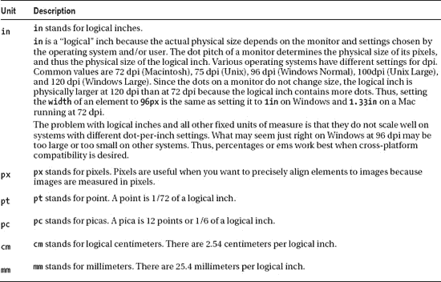

# 一、设计模式：让 CSS 变得简单！

从表面上看，CSS 似乎很容易。它有 45 个常用属性，可以用来设计文档的样式。在表面之下，属性和属性值的不同组合会触发完全不同的结果。我称之为 **CSS 多态性**是因为同一个属性有许多含义。CSS 多态性的结果是可能性的组合爆炸。

学习 CSS 不仅仅是学习单个属性。它是关于学习可以使用属性的上下文，以及不同类型的属性值在每个上下文中如何不同地工作。以`width`属性为例，它有许多不同的含义，这取决于它与其他规则的组合方式以及赋予它的值。例如，`width`对内联没有任何影响。`width:auto`包覆面浮动到其内容的宽度。`width:auto`当`left`和`right`设置为`auto`时，绝对收缩。`width:auto`将块拉伸到其父元素的宽度。`width:auto`当`left`和`right`设置为`0`时，绝对拉伸到其包含块的宽度。`width:100%`将块和浮动拉伸到其父元素的宽度，只要它们没有边框、填充和边距。`width:100%`将表格拉伸到其父表格的宽度，即使它们有边框和填充。`width:100%`将绝对值拉伸到其最近的定位祖先的宽度，而不是其父代的宽度。`width:100em`根据元素的`font-size`的高度来调整元素的大小，这使得元素的宽度足以容纳一定数量的字符。`width:100px`将元素的大小调整为固定的像素数，而不管其文本的`font-size`。

更复杂的是，并非所有的规则都由浏览器实现。例如，122 个属性中超过 40 个和 600 个 CSS 规则中超过 250 个没有被一个或多个主要浏览器实现。CSS 结合了几个定义各种级别和配置文件的规范。CSS 的每一级都建立在最后一级的基础上，通常添加新的功能，通常表示为 CSS 1、CSS 2 和 CSS 3。配置文件通常是为特定设备或用户界面构建的一个或多个 CSS 级别的子集。浏览器对 CSS3 的支持对开发人员来说是一个重要的问题，尤其是因为它作为一个规范仍在快速发展。

试图通过记忆每个规则的异常数量来学习 CSS 是非常令人沮丧的。

为了让学习 CSS 变得容易，这本书记录了所有可用的属性和属性值的组合。它将属性放在上下文中，并描绘了 CSS 如何工作的完整画面。

想象一下，您不必阅读不起作用的规则，也不必测试每个规则来查看它是否在每个浏览器中以及与其他规则结合使用，这样可以节省多少时间。我已经帮你做了。我已经进行了成千上万次测试。我已经在每一个主流浏览器中测试了每一个 CSS 属性和属性的每一种组合，包括 Internet Explorer 6/7/8/9、Firefox 7、Chrome 12、Opera 9 和 Safari 5。

我将这些结果归结为简单的设计模式——创建令人惊叹的、高性能的、可访问的网站所需的所有 CSS 和 HTML 设计模式。本书的这一版(第二版)已经更新，包括了关于 HTML5 和 CSS3 的最新信息和提示。

当你学会了这些设计模式后，你会想如果没有它们你是如何开发网站的！

在这一章中，我将讨论设计模式的目的以及它们是如何工作的。我给出了一些如何结合设计模式来创建新模式的例子。我还讨论了如何利用样式表、CSS 语法和层叠顺序。

接下来，我将展示一系列图表，列出所有可用的 CSS 属性和度量单位。然后，我介绍了快速排除 CSS 故障的 12 种技术。最后，我将讨论如何标准化各种浏览器元素的样式——这样您就可以放心地覆盖这些默认样式。

### 设计模式——结构化食谱

设计模式已经在软件编程中获得了巨大的成功。它们提高了 web 设计和开发的生产率、创造力和效率，并且减少了代码膨胀和复杂性。在 CSS 和 HTML 的上下文中，设计模式是跨各种浏览器和屏幕阅读器工作的通用功能集，不会牺牲设计价值或可访问性，也不依赖黑客和过滤器。但到目前为止，它们还没有被系统地应用到 HTML 和 CSS 网页设计和开发中。

设计模式是所有创造性活动的基础。当我们说话、写作和创作时，我们根据模式来思考。设计模式类似于我们可以用自己的内容填充的文档模板。在文学上，它们就像原型人物和情节。在音乐中，它们就像主题和变奏。在编程中，它们类似于可重复使用的算法，可以系统地变化和相互组合以产生期望的结果。

一旦一个设计模式被揭示出来，它会极大地增加创造力和生产力。它可以单独使用来创建快速的结果，并且可以很容易地与其他模式结合来创建更复杂的结果。设计模式简化并放大了创造过程。他们让创作像用积木或乐高积木一样简单。您只需选择预先设计好的图案，改变它们，然后将它们组合起来，就能创造出您想要的效果。模式不会限制创造力——它们会释放创造力。

Erich Gamma、Richard Helm、Ralph Johnson 和 John Vlissides (Addison-Wesley，1995)的开创性著作*Design Patterns:Elements of Reusable Object-Oriented Software*解释了设计模式由四个元素组成:模式名、问题、解决方案和权衡。本书遵循这种方法。

因为这是一本实用的书，所以它直接关注 CSS 和 HTML 中设计的具体模式，这些模式实际上是在主流浏览器中实现的。这本书还通过将内置模式组合成更高级的模式来创建新的设计模式。

在一个非常真实的意义上，这是一本你可以用来创造你的设计的模式书。

### 使用设计模式

第一章至 7 介绍了造型布局的基本属性和元素。第八章和 9 结合这些属性来创建所有可能的块、定位和浮动布局。第十章到 12 章介绍了文本样式的基本属性，以及可用于创建内联布局的属性组合。第十三章到第十六章将前几章的设计模式与专业属性和元素结合起来，以设计块、列表、图像、表格和表格列。

从第一章到第十六章到第十六章总共介绍了 300 多种设计模式，这些模式是通过将 45 种常见的 CSS 属性与四种类型的元素(内联、内联块、块和表)和五种类型的定位(静态、相对、绝对、固定和浮动)相结合而创建的。

这就是设计模式的强大之处:很容易将基本模式组合起来形成更复杂的模式。这使得学习 CSS 变得容易，并且使得使用 CSS 非常高效。第十七章到 20 章展示了如何结合这些设计模式来创建流畅的布局、首字下沉、标注、引用和提醒。

为了说明设计模式的简单性和强大功能，接下来的五个例子展示了如何将一系列基本设计模式组合成更复杂的模式。您不需要理解每个模式的细节，只需要理解组合模式的过程。

本系列的第一个例子展示了`background`属性的作用。`background`是一种内置于 CSS 中的设计模式，在元素后面显示图像。例 1-1 展示了`background` 属性结合一个 division 元素。该分区的大小为 250×76 像素，因此它将显示整个背景图像。 1

#### 例 1-1。背景图像

##### HTML

`<h1>Background Image</h1>

`

##### CSS

`div { **background:url("heading2.jpg") no-repeat;** width:250px; height:76px; }`

例 1-2 展示了绝对设计模式。绝对设计模式背后的思想是从流程中移除一个元素，并相对于另一个元素定位它。CSS 为此提供了`position:absolute`规则。当`position:absolute`与`top`和`left`属性组合在一起时，您可以将一个元素定位在其最近的祖先的左上方的偏移量处。我使用`position:relative`来定位分部，这样它将是距离跨度最近的祖先。然后，我将跨度绝对定位在距离该分区顶部和左侧 10 个像素的位置。 2

__________

这个例子很简单，但是它结合了七种设计模式:第二章中的结构块元素设计模式；第三章中的类型选择器模式；第四章中的块盒模式；第五章中的宽度、高度和尺寸模式；和第六章中的背景设计模式。

这个例子很简单，但是它结合了七种设计模式:第二章中的内联元素和结构块元素设计模式；第三章中的类选择器模式；第四章中的绝对盒模式；以及第七章中的绝对、相对和最近定位的祖先模式。

#### 例 1-2。绝对的

##### HTML

` <h1>Absolute</h1>

  Sized Absolute

`

##### CSS

`*.positioned { position:relative; }
*.absolute { position:absolute; top:10px; left:10px; }

/* Nonessential styles are not shown */`

例 1-3 结合前两个例子中的设计模式，创建文本替换设计模式。文本替换背后的想法是在某些文本的位置显示一个图像(这样您就可以对文本进行更多的风格控制，因为它是嵌入在图像中的)。此外，您希望文本出现在图像的后面，以便在图像下载失败时可以看到文本。

我结合了背景和绝对设计模式来创建文本替换模式。我在标题中放置了一个空跨度。我相对定位了标题，所以子元素可以相对于它绝对定位。我为 span 分配了一个背景图像，并将其绝对定位在 heading 元素中的文本前面。我将跨度和标题的大小调整为背景图片的大小。

最终结果是，span 的背景图像覆盖了标题中的文本，如果图像下载失败，标题中的样式文本就会显示出来。 3

__________

3 文本替换示例使用了前两个示例中显示的 14 种设计模式。第三章还介绍了 ID 选择器设计模式。你可以在第十章中了解更多关于文本替换设计模式的知识。

#### 例 1-3。文本替换

##### HTML

`<h1>Text Replacement</h1>
<h2 id="h2" >Heading 2****</h2>`

##### CSS

`#h2 { position:relative; width:250px; height:76px; overflow:hidden; }

#h2 **span** { position:absolute; width:250px; height:76px; left:0; top:0;
  background:url("heading2.jpg") no-repeat; }`

例 1-4 演示了左边界设计模式。这种模式背后的思想是将一个或多个元素从一个块中移到它的左边，这样你就可以有标题(或者注释、图片等等)。)在左边，内容在右边。 4

__________

4 左边界设计模式结合了第三章中的位置选择器设计模式；第六章的保证金模式；第四章中的绝对盒模式；以及第七章中的绝对、相对和最近定位的祖先模式。

#### 例 1-4。左边界

##### HTML

`<h1>Left Marginal</h1>

  **<h2 class="marginal-heading">Heading</h2>**
  You want to excerpt an element and move it into the left margin.
`

##### CSS

`***.left-marginal** { position:relative; margin-left:200px; }
***.marginal-heading** { position:absolute; left:-200px; top:0; margin:0; }`

例 1-5 演示了边缘图形首字下沉设计模式。这种模式结合了前面四个例子中展示的所有设计模式。这种模式背后的想法是在块的左边界创建一个图形首字下沉，具有文本替换和左边界设计模式的所有优点。 5

为了满足这些要求，我使用了`indent`类来相对定位段落，使其成为首字下沉的最近祖先，并为段落添加 120 像素的左边距，为首字下沉留出空间。我使用了`graphic-dropcap`类来绝对定位首字下沉，将其移动到段落的左边距，并将其设置为首字下沉图像的精确大小。然后，我将 span 完全放置在图形首字下沉内，并将其移动到首字下沉文本上，这样它就用背景图像覆盖了文本。

就其本身来看，边缘图形首字下沉模式是 16+种设计模式的复杂组合。另一方面，当被看作是文本替换和左边缘设计模式的组合时，它是非常简单的。这就是设计模式的力量。

__________

第十八章详细讨论了边缘图形首字下沉设计模式。

#### 例 1-5。边缘图形首字下沉

##### HTML

`<h1>Marginal Graphic Dropcap</h1>

**
M**arginal
  Graphic Dropcap. The letter M has been covered by the dropcap image.
  Screen readers read the text and visual users see the image.
  If the browser cannot display the dropcap image,
  the text becomes visible.
`

##### CSS

`*.indent { position:relative; margin-left:120px; }

*.graphic-dropcap { position:absolute;
  width:120px; height:90px; left:-120px; top:0; }

*.graphic-dropcap span { position:absolute;
  width:120px; height:90px; margin:0; left:0; top:0;
  background:url("m.jpg") no-repeat; }`

### 使用样式表

您可以在三个位置放置样式:样式表、`
</head>

**<body>**
  **
**CSS syntax is ****EASY!

</body>

</html>`

###### CSS

`**body** { font-family:**"Century Gothic"**,verdana,arial,sans-serif;
  font-size:20px; line-height:150%;
  margin:1em; border:4px double black; padding:0.25em;
  background-image:url("gradient.gif"); background-repeat:repeat-x; }
**p** { margin:0; }
**span** { font-weight:900; }`

### 使用级联顺序

CSS 允许你多次分配相同的规则给相同的元素。我称这些竞争规则为 ??。浏览器使用层叠顺序来确定应用一组竞争规则中的哪个规则。例如，浏览器为每个元素分配默认规则。当您将规则分配给元素时，您的规则会与默认规则竞争，但是由于它具有更高的级联优先级，所以它会覆盖默认规则。

级联顺序根据规则中使用的选择器类型将规则分为六组。高优先级组中的规则会覆盖低优先级组中的竞争规则。组是由它们的选择器的特性组织的。低优先级组中的选择器比高优先级组中的选择器具有更少的特异性。

级联顺序背后的指导原则是*通用*选择器设置文档的整体样式，而*更具体的*选择器覆盖通用选择器以应用特定的样式。

例如，您可能希望使用`*{margin-bottom:0;}`来设计文档中所有元素的样式，使其没有下边距。你可能还想使用`p{margin-bottom:10px;}`来设计文档中所有段落*的样式，底部边距为 10 像素。您可能还想使用`*.double-space{margin-bottom:2em;}`将属于`double-space`类的*几个段落*的底部边距设置为 2 ems。您可能还想使用`#paragraph3{margin-bottom:40px;}`为一个段落*设置 40 像素的超大底部边距。在每种情况下，级联顺序确保更具体的选择器覆盖更一般的选择器。

以下是按优先级从高到低排列的六个选择器组:

1.  最高优先级组包含添加了`!important`的规则。它们覆盖所有非`!important`规则。例如，`#i100{border:6px solid -black!important;}`优先于`#i100{border:6px solid black;}`。
2.  第二高优先级组包含嵌入在`style`属性中的规则。因为使用`style`属性会产生难以维护的代码，所以我不推荐使用它。
3.  第三高优先级组包含具有一个或多个 *ID* 选择器的规则。例如，`#i100{border:6px solid black;}`优先于`*.c10{border:4px solid black;}`。
4.  第四高优先级组包含具有一个或多个*类*、*属性*或*伪*选择器的规则。例如，`*.c10{border:4px solid black;}`优先于`div{border:2px solid black;}`。
5.  第五高优先级组包含具有一个或多个*元素*选择器的规则。例如，`div{border:2px solid black;}`优先于`*{border:0px solid black;}`。
6.  最低优先级组包含只有一个*通用*选择器的规则——例如，`*{border:0px solid black;}`。

当竞争规则属于同一个选择器组时(例如两个规则都包含 ID 选择器)，选择器的类型和数量会进一步区分它们的优先级。当一个选择器拥有比竞争的选择器多*个高优先级选择器*时，该选择器具有更高的优先级。例如，`#i100 *.c20 *.c10{}`的优先级高于`#i100 *.c10 div p span em{}`。因为两个选择器都包含一个 ID 选择器，所以它们都属于第三高优先级的组。因为第一个有两个类选择器，第二个只有一个类选择器，所以第一个有更高的优先级——即使第二个有更多的选择器。

当竞争规则在同一个选择器组中，并且具有相同数量和级别的选择器时，它们将按位置进一步区分优先级。优先级较高的位置中的任何规则都会覆盖优先级较低的位置中的竞争规则。(同样，这仅适用于竞争规则在相同的选择器组中，并且具有相同数量和级别的选择器的情况。选择器组始终优先于位置组。)

这六个位置按优先级从高到低排列如下:

1.  最高优先级的位置是 HTML 文档头中的`<style>`元素。例如，`<style>`中的一个规则覆盖了由嵌入在`<style>`中的`@import`语句导入的样式表中的一个竞争规则。
2.  第二高优先级的位置是由嵌入在`<style>`元素中的`@import`语句导入的样式表。例如，由嵌入在`<style>`中的`@import`语句导入的样式表中的规则会覆盖由`<link>`元素附加的样式表中的竞争规则。
3.  第三高优先级的位置是由一个`<link>`元素附加的样式表。例如，由一个`<link>`元素附加的样式表中的一个规则覆盖了由样式表中嵌入的一个`@import`语句导入的一个竞争规则。
4.  第四高优先级的位置是一个样式表，由嵌入在由一个`<link>`元素附加的样式表中的一个`@import`语句导入。例如，嵌入在链接样式表中的`@import`语句导入的规则会覆盖最终用户附加的样式表中的竞争规则。
5.  第五高优先级的位置是最终用户附加的样式表。
    *   最终用户样式表中的`!important`规则是一个例外。这些规则被赋予最高优先级。这允许最终用户创建规则来覆盖作者样式表中的竞争规则。
6.  最低优先级的位置是浏览器提供的默认样式表。

当在同一位置级别附加或导入多个样式表*时，它们被附加的顺序决定了优先级。稍后附加的样式表会覆盖先前附加的样式表。*

当竞争规则在同一个选择器组中，具有相同数量和级别的选择器，并且具有相同的位置级别时，代码中后面列出的规则将覆盖前面列出的规则。

在示例 1-7 、*中，样式表中的每个*规则都应用于 division 元素。每个规则对`
`应用不同的`border-width`。级联顺序决定了实际应用哪个规则。我按照从最不重要到最重要的层叠顺序对样式表中的样式进行了排序。从截图中可以看到，浏览器对`
`应用了最后一个规则，在`
`周围设置了 14 像素的边框。浏览器应用这个规则是因为它在层叠顺序中具有最高的优先级——它是一个附加了`!important`的 ID 选择器。

注意 ID 选择器如何覆盖类选择器，类选择器又覆盖元素选择器，元素选择器又覆盖通用选择器。注意`!important`是如何赋予选择器全新的重要性的。例如，`!important`通用选择器比非`!important` ID 选择器更重要！

注意`border-style:none!important;`是如何放置在`body`和`html`选择器中的，以防止通用选择器`*`在`<body>`和`<html>`周围放置边框。这也说明了元素选择器如何覆盖通用选择器。

#### 例 1-7。级联顺序

##### HTML

`<body>
  **
**!important has highest priority.**
**
</body>`

##### CSS

`html, body { **border-style:none!important;** }

***** { border:0px  solid black; }          /* Universal Selector */
**div** { border:2px  solid black; }        /* Element Selector */
***.c10** { border:4px  solid black; }      /* Secondary Selector */
**#i100** { border:6px  solid black; }      /* ID Selector */

***** { border:8px  solid black**!important**; }        /* !Universal Selector */
div { border:10px solid black**!important;** }      /* !Element Selector */
*.c10 { border:12px solid black**!important;** }    /* !Secondary Selector */
#i100 { border:14px solid black**!important;** }    /* !ID Selector */`

### 简化级联

为了保持层叠顺序尽可能简单，我尽量减少了附加的样式表数量，并且不使用`@import`语句。我也避免使用`!important`操作符。最重要的是，我对我的选择器进行了排序，使它们在每个样式表中以级联顺序列出。

我将样式表组织成六组。我将所有通用选择器放在第一位，然后是元素、类、属性、伪和 ID 选择器。如果我有任何`!important`选择器，我将它们放在另一组组中的 ID 选择器之后。

保持样式表以层叠顺序排序有助于我记住 ID 选择器覆盖所有的类、属性、伪、元素和通用选择器——不管它们出现在当前样式表和所有其他样式表中的什么地方。同样，它提醒我每个样式表中的类、属性和伪选择器覆盖所有元素和通用选择器——不管它们出现在哪里。

按照层叠顺序对规则进行排序，可以很容易地看到竞争规则的应用顺序。这使得跟踪哪些规则覆盖了其他规则变得容易。我按照层叠顺序对规则进行排序，如下所示:

`/* Universal Selectors */
/* Element Selectors */
/* Class, Attribute, and Pseudo Selectors */
/* ID Selectors */

/* !important Universal Selectors */
/* !important Element Selectors */
/* !important Class, Attribute, and Pseudo Selectors */
/* !important ID Selectors */`

### CSS 和 HTML 链接

### 常用 CSS 属性

`display margin  text-indent
visibility      margin-left      text-align
        margin-right
float   margin-top      color
clear   margin-bottom
                font
position        border  font-family
z-index border-left     font-size
overflow        border-left-color       font-style
cursor  border-left-width       font-variant
        border-left-style       font-weight

left    border-right    text-decoration
right   border-right-color      text-transform
width   border-right-width
min-width       border-right-style      vertical-align
max-width
        border-top      line-height
top     border-top-color        white-space
bottom  border-top-width        word-spacing
height  border-top-style        etter-spacing
min-height
max-height      border-bottom   direction
        border-bottom-color     unicode-bidi
        border-bottom-width
/* LESS USABLE-------*/ border-bottom-style
/* caption-side             */
/* clip                           */    padding list-style
/* content                    */        padding-left    list-style-type
/* empty-cells              */  padding-right   list-style-position
/* outline                     */       padding-top     list-style-image
/* outline-color            */  padding-bottom
/* outline-style            */  border-collapse
/* outline-width           */   background      table-layout
/* quotes                    */ background-color
/* orphans                  */  background-image        page-break-after
/* page-break-inside  */        background-repeat       page-break-before
/* widows                   */  background-attachment
/*--------------------------*/  background-position`

### CSS 属性和值:常用

这个列表只包括那些在所有主流浏览器中都有效的 CSS 属性和值。财产前的字母“I”表示它是继承的。*斜体*中的值是默认值。一些值是代表一个值的多种可能性的符号。例如，`LENGTH`代表`0`、`auto`、`none`以及所有测量值(`%`、`px`、`em`、`ex`、`pt`、`in`、`cm`、`mm`、`pc`)。

`**Common  applies to all elements and box models.**
        display:        *inline*, none, block, inline-block, list-item,
        table-cell, table, table-row

 I      visibility:     *visible*, hidden

        background-color:       *transparent*, COLOR
        background-image:       *none*, url("file.jpg")
        background-repeat:      *repeat*, repeat-x, repeat-y, no-repeat
        background-attachment:  *scroll*, fixed
        background-position:    *0% 0%*,   H% V%,  H V,
        left top, left center, left bottom,
        right top, right center, right bottom,
        center top, center center, center bottom

        border: WIDTH   STYLE   COLOR
        border-width:   *medium*, LENGTH, thin,   thick
        border-style:   *none*,   hidden, dotted, dashed, solid, double,
        groove, ridge,  inset,  outset
        border-color:   *black,*  COLOR

        border-left:    WIDTH   STYLE   COLOR
        border-left-width:      *same as border-width*
        border-left-style:      *same as border-style*
        border-left-color:      *same as border-color*
        border-right:   WIDTH   STYLE   COLOR
        border-right-width:     *same as border-width*
        border-right-style:     *same as border-style*
        border-right-color:     *same as border-color*
        border-top:     WIDTH   STYLE   COLOR
        border-top-width:       same as border-width
        border-top-style:       same as border-style
        border-top-color:       same as border-color
        border-bottom:  WIDTH   STYLE   COLOR
        border-bottom-width:    *same as border-width*
        border-bottom-style:    *same as border-style*
        border-bottom-color:    *same as border-color*

 I      cursor: *auto*, default, pointer,
        help, wait, progress, move, crosshair, text,
        n-resize, s-resize, e-resize, w-resize`

### CSS 属性和值:内容

`**Content  applies to all except for rows.**
         padding:        *0*, LENGTH
         padding-left:   *0*, LENGTH
         padding-right:  *0*, LENGTH
         padding-top:    *0*, LENGTH
         padding-bottom: *0*, LENGTH

  i   font:      *caption*, icon, menu, message-box, small-caption, status-bar
  i   font-family:       *serif*,  FONTLIST, sans-serif, monospace, fantasy, cursive
  i   font-size: *medium*, LENGTH, %ParentElementFontSize, xx-small, x-small,
         smaller, small, large, larger, x-large, xx-large
  i   font-style:        *normal*, italic, oblique
  i   font-variant:      *normal*, small-caps
  i   font-weight:       *normal*, lighter, bold, bolder,
         100, 200, 300, 400, 500, 600, 700, 800, 900

  i   text-decoration:   *none*, underline, line-through, overline
  i   text-transform:    *none*, lowercase, uppercase, capitalize
  i   direction:         *ltr*, rtl
      unicode-bidi:      *normal*, bidi-override, embed

  i   line-height:       *normal*, LENGTH, %FontSize, MULTIPLIER
  i   letter-spacing:    *normal*, LENGTH
  i   word-spacing:      *normal*, LENGTH
  i   white-space:       *normal*, pre, nowrap

  i   color:     #rrggbb, #rgb, rgb(RED,GREEN,BLUE), rgb(RED%,GREEN%,BLUE%)
        *black*,  gray,    silver,  white,
         red,    maroon,  purple,  fuchsia,
         lime,   green,   olive,   yellow,
         blue,   navy,    teal,    aqua,

         violet,      fuschia,    red,         maroon,  black
         wheat,       gold,       orange,      tomato,  firebrick
         lightyellow, yellow,     yellowgreen, olive,   darkolivegreen
         palegreen,   lime,       seagreen,    green,   darkgreen
         lightcyan,   cyan,       turquoise,   teal,    midnightblue
         lightskyblue,deepskyblue,royalblue,   blue,    darkblue
         whitesmoke,  lightgrey, silver, gray, dimgray, darkslategray

         ActiveBorder, ActiveCaption, AppWorkspace, Background,
         ButtonFace, ButtonHighlight, ButtonShadow, ButtonText,
         CaptionText, GrayText, Highlight, HighlightText,
         InactiveBorder, InactiveCaption, InactiveCaptionText,
         InfoBackground, InfoText, Menu, MenuText, Scrollbar,
         ThreeDDarkShadow, ThreeDFace, ThreeDHighlight,
         ThreeDLightShadow, ThreeDShadow, Window, WindowFrame, WindowText`

### CSS 属性和值:布局

`**Float  applies  to all except cells and rows.**
       float:   *none*,  left, right

**Clear  applies  to all except inlines, inline-blocks, cells, & rows.**
       clear:   *none*,  left, right, both

**Positioned      applies to all except cells and rows.**
        position:       *static*, relative; absolute, fixed
        left:   *auto*,  LENGTH, %WidthOfContainingBlock
        right:  *auto*,  LENGTH, %WidthOfContainingBlock
        top:    *auto*,  LENGTH, %HeightOfContainingBlock
        bottom: *auto*,  LENGTH, %HeightOfContainingBlock
        z-index:        *auto*,  INTEGER

**Horizontal Margin       applies to all except cells and rows.**
        margin: *0*,     LENGTH, %WidthOfContainingBlock, auto
        margin-left:    *0*,     LENGTH, %WidthOfContainingBlock, auto
        margin-right:   *0*,     LENGTH, %WidthOfContainingBlock, auto

**Vertical Margin applies to all except inlines, cells, and rows.**
        margin: *0*,     LENGTH, %WidthOfContainingBlock, auto
        margin-top:     *0*,     LENGTH, %WidthOfContainingBlock, auto
        margin-bottom:  *0*,     LENGTH, %WidthOfContainingBlock, auto

**Width   applies to all except inlines and rows.**
        width:  auto,  LENGTH, %WidthOfContainingBlock
        min-width:      *0*,     LENGTH, %WidthOfContainingBlock
        max-width:      *none*,  LENGTH, %WidthOfContainingBlock

**Height  applies to all except inlines and tables.**
        height: *auto*,  LENGTH, %HeightOfContainingBlock
        min-height:     *0*,     LENGTH, %HeightOfContainingBlock
        max-height:     *none*,  LENGTH, %HeightOfContainingBlock

**Content Layout  applies to all except inlines, tables, and rows.**
  i  text-indent:       *0*,     LENGTH, %WidthOfContainingBlock
  i  text-align:        *left*,  center, right, justify
     overflow:  *visible*, hidden, auto, scroll`

### CSS 属性和值:专用

`**List    applies only to lists.**
  i  list-style:        TYPE POSITION IMAGE
  i  list-style-type:   *disc*, circle, square, none, decimal,
        lower-alpha, upper-alpha, lower-roman, upper-roman
  i  list-style-position:       *outside*,inside
  i  list-style-image: *none*,   url("file.jpg")

**Table   applies only to tables.**
  i  border-collapse:   *separate*, collapse
        table-layout:   *auto*, fixed

**Cell    applies only to cells.**
        vertical-align: *baseline*, bottom, middle, top

**Inline  applies only to inlines and inline-blocks.**
        vertical-align: *baseline*, LENGTH, %LineHeight,
        text-bottom, text-top, middle, top, bottom

**Page    applies only to blocks and tables.**
        page-break-after: *auto*, always, avoid
        page-break-before: *auto*, always, avoid`

### 选择器

`* {}    selects all elements
p  {}   selects all 
 elements
*.c {}  selects all elements where class="c"
p.c  {} selects all 
 elements where class="c"
#main {}        selects one element where id ="main"
a:link  {}      selects all unvisited links
a:visited{}     selects all visited links
a:hover   {}    selects all links being hovered over
a:active   {}   selects the current link being activated
a:focus     {}  selects all links that have the focus
p:first-letter {}       selects first letter of all 
 elements
p:first-line    {}      selects first line   of all 
 elements
p:first-child    {}     selects first child  of all 
 elements
tr:nth-child(even)      selects every even row of a table
tr:nth-child(2n+0)      same as above
tr:nth-child(2n+0)      same as above
tr:nth-child(10n+9)     same as above
#n   *.c   :first-line {}       selects every 9th, 19th, 29th, etc., row
#n > *.c > :first-line {}       child selector example
#n + *.c + :first-line {}       sibling selector example
#n , *.c , :first-line {}       applies independent selectors to same block of properties
*[title]               {}       selects all elements with a title attribute
*[title~="WORD"]       {}       selects all where title attribute contains "WORD"
*[title="EXACT_MATCH_OF_ENTIRE_VALUE"]  {} selects all with exact attribute match`

### 媒体查询

CSS 长期以来一直支持为不同媒体类型定制的媒体相关样式表。例如，文档在屏幕上显示时可能使用无衬线字体，在打印时可能使用衬线字体。“屏幕”和“打印”是已经定义的两种媒体类型。

在 HTML4 的旧时代，可以这样写:

`<link rel="stylesheet" type="text/css" media="screen" href="sans-serif.css">
<link rel="stylesheet" type="text/css" media="print" href="serif.css">`

使用 CSS3，媒体查询通过允许更精确地标记样式表来扩展媒体类型的功能。媒体查询由媒体类型和零个或多个表达式组成，用于检查特定媒体特征的条件。通过使用媒体查询，可以根据特定范围的输出设备定制演示文稿，而无需更改内容本身。媒体查询是为真或为假的逻辑表达式。如果媒体查询的媒体类型与运行用户代理的设备的媒体类型匹配，并且媒体查询中的所有表达式都为真，则媒体查询为真。

这里有几个例子:

`<--! Applies to devices of a certain media type ('screen') with certain feature (it must be a
color screen)-->
<link rel="stylesheet" media="screen and (color)" href="example.css" />

<!-- The same media query written in an @import-rule in CSS -->
@import url(color.css) screen and (color);`

为适用于所有媒体类型的媒体查询提供了速记语法；关键字“all”可以省略(连同尾随的“and”)，即以下内容是相同的:

`@media (orientation: portrait) { … }
@media all and (orientation: portrait) { … }`

这样，设计人员和开发人员就可以创建更复杂的查询来满足他们的特定需求:

`@media all and (max-width: 698px) and (min-width: 520px), (min-width: 1150px) {
  body {
    background: #ccc;
  }
}`

有一个很大的媒体功能列表，包括以下内容:

*   宽度和设备宽度
*   高度和设备高度
*   方向
*   纵横比和设备纵横比
*   颜色和颜色指数
*   单色(如果不是单色设备，等于 0)
*   解决
*   扫描(描述“电视”输出设备的扫描过程)
*   网格(指定输出设备是网格还是位图)

### 灵活的计量单位

### 固定计量单位

### 96 dpi 时测量单位之间的比率

### 96 dpi 时的典型字体大小值

### 过渡、动画和 2D 变换

CSS 转换规范允许 CSS 值的属性变化在指定的持续时间内平稳地发生。通常，当 CSS 属性的值发生变化时，渲染结果会立即更新，但是通过 CSS 转换，作者能够随着时间的推移平滑地从旧状态转换到新状态。

这里有一个例子:

`#box {
transition-property: opacity, left;
transition-duration: 3s, 5s;
}`

上述代码将导致`opacity`属性在三秒的时间内转换，而`left`属性在五秒的时间内转换。

CSS 动画类似于过渡，因为它们会随着时间的推移改变 CSS 属性的表示值。主要区别在于，当属性值更改时，转换会隐式触发，而当应用动画属性时，动画会显式执行。因此，动画需要被动画化的属性的显式值。这些值是使用关键帧指定的。

作者可以指定动画迭代多少次，是否在`begin`和`end`值之间交替，动画是否应该运行或暂停，等等。

这里有一个例子:

` #warning {
    animation-name: 'horizontal-slide';
    animation-duration: 5s;
    animation-iteration-count: 10;
  }

  @keyframes 'horizontal-slide' {

    from {
      left: 0;
    }

    to {
      left: 100px;    
}

  }`

这将产生一个动画，在 5 秒钟内将`#warning`水平移动 100 像素，并重复 9 次，总共 10 次迭代。

CSS 2D 变换规范允许 CSS 渲染的元素在二维空间中进行变换。这里有一个例子:

`#box {
      height: 100px; width: 100px;
      transform: translate(50px, 50px) scale(1.5, 1.5) rotate(90deg);
  }`

前面的例子在 X 和 Y 方向上移动`#box`50 个像素，缩放元素 150%，然后围绕 z 轴顺时针旋转 90 度。

### CSS 故障排除

您可以使用下列步骤来解决样式表不工作的问题。我按顺序列出了最有可能帮助您快速找到问题的步骤。

1.  **验证 HTML 文档**。这确保您不会遇到语法问题，这些问题可能会导致浏览器对文档结构的解释与您预期的不同。开发人员可以使用 W3C 验证服务(`[`validator.w3.org/`](http://validator.w3.org/)`)、W3C Unicorn 验证器(`[`validator.w3.org/unicorn/`](http://validator.w3.org/unicorn/)`)或者提供标记和样式验证的各种浏览器插件。
2.  **验证每个 CSS 样式表**。这确保您没有语法问题，语法问题会导致一个或多个规则被忽略。
    *   **确保非零测量值后有一个正确的计量单位(UOM)** ，并且数字和它的计量单位之间没有空格，如`1em`或`100%`。(`line-height`是个例外；它允许没有计量单位的非零测量。)
    *   **确保属性名和它的值之间只有冒号(`:` )** 和可选的空格，比如`width:100%`或`width : 100%`。
    *   **确保分号(`;` )** 关闭每个规则，比如`width:100%;`。
3.  **使用 Mozilla 浏览器中的错误控制台查看 CSS 解析错误列表**。浏览器会忽略每个有解析错误的规则，但与许多其他编程语言不同，它们会继续解析并应用剩余的规则。
4.  **验证一个选择器**正在选择你认为它应该选择的所有元素，并且只选择那些元素。通过将`outline:2px solid invert;`放入选择器中，可以很容易地看到选择器的结果。(请注意，`outline`在 ie 7 中不工作，但`border`可以。)
5.  **仔细查看未应用的每个规则的级联优先级**。级联优先级优先于文档顺序。例如，`#myid{color:red;}`优先于`*.myclass{color:blue;}`，而`#myid *.myclass{color:green;}`优先于两者——不管它们出现在样式表中的什么位置，也不管它们出现在当前样式表之前还是之后加载的样式表中。我发现这是一个常见的问题，因为具有更高级联优先级的规则可以是任何样式表中的任何地方。假设您已经验证了您的样式表，当选择器中的一些属性有效，而其他属性无效时，您通常可以判断级联优先级何时出现问题——无论您使用什么值。当属性被具有更高级联优先级的另一个规则覆盖时，通常会发生这种情况。您通常可以通过在属性后添加`!important`来验证这种情况。`!important`赋予一个属性比所有非`!important`属性更高的优先级。如果`!important`使一个属性工作，你可能有一个级联优先级问题。
6.  **验证样式表中元素、类和 id**的大小写与它们在 HTML 文档中的大小写完全匹配。这很重要，因为 XHTML 是区分大小写的。您可能希望始终使用小写值，以避免意外的不匹配。
7.  **仔细检查速记属性**查看您在创建规则时是否遗漏了任何属性值。速记属性的问题在于，它们会给所有速记的属性赋值——即使你只设置了一个值！例如，`background:blue;`将`background-color`设置为`blue`，还将`background-image`设置为`none`、`background-repeat`设置为`repeat`、`background-attachment`设置为`scroll`、`background-position`设置为`0% 0%`。如果包含`background:blue;`的规则比将`background-image`分配给`url("image.jpg")`的重叠规则具有更高的层叠优先级，您将看不到背景图像，因为速记属性`background:blue;`覆盖了它并将`background-image`设置为`none`。
    *   速记属性包括`margin`、`border`、`padding`、`background`、`font`、`list-style`。
    *   `font`是一个特别麻烦的简写属性，因为它把这么多属性组合成一个，而且这些值都是继承的！这些属性包括`font-family`、`font-size`、`font-weight`、`font-variant`、`font-style`和`line-height`。请记住，即使给`font`分配一个值，比如`font:1em;`，也会导致浏览器为*的所有*属性设置默认值！
8.  **验证浏览器加载了你所有的样式表**。你可以确保每一个都通过 HTML 文档的`<head>`部分中的`<link>`语句或者样式表中的`@import`语句被引用。如果您不确定是否正在加载样式表，您可以在样式表中放置一个独特的规则，以查看它是否得到应用。这样的规则是显而易见的，比如`*{border:1px solid black;}`。
9.  **避免使用`@import`语句**。如果使用`@import`语句，验证它们是否作为样式表中的第一项出现，以确保它们的优先级低于样式表中的规则。
10.  **通过按优先级升序列出`<link>`语句和`@import`语句，验证样式表是否按您想要的顺序**加载。级联顺序中同一级别的规则*被后来链接或导入的样式表中的规则覆盖。但是请记住，具有较高*级联优先级的规则总是优先于具有较低优先级的规则，不管这些规则在样式表中出现的顺序如何，也不管它们是出现在后来链接或导入的样式表中。**
11.  **验证服务器发送`text/css`作为 CSS 样式表**的`Content-Type`头。Mozilla 浏览器拒绝使用样式表，除非它的内容类型是`text/css`。您可以使用 Web Developer 工具栏并选择菜单选项“查看响应头”,在 Mozilla 浏览器中查看 HTTP 头。
12.  **移除可能已经放在 CSS 样式表**中的 HTML 元素，比如`<style>`。还要确保没有子元素被意外地放置在 HTML 文档头部的`<style>`元素中。

### 规范化样式表

因为每个浏览器的默认设置略有不同，所以您可能希望在样式表中构建规则来定义每个元素的基线设置。例如，不同的浏览器给`<h1>`元素分配不同的大小和边距。通过给`<h1>`分配你自己的尺寸和边距，你可以在所有浏览器中标准化它的外观。

最简单的方法(也是最容易维护的方法)是为所有元素创建一组基线规则，并将这些规则加载到附加到文档的第一个样式表中。您可以加载一小组规则，将所有元素重置为最简单的样式，如清单 1-2 所示。或者你可以加载一组更广泛的规则，为你的网站创建一个标准的风格，比如清单 1-3 中的那些。你可以在互联网上找到标准的基线规则，比如雅虎的 YUI 重置 CSS 规则(见`[`developer.yahoo.com/yui/reset/`](http://developer.yahoo.com/yui/reset/)`)。

加载单独的基线样式表会影响页面呈现的速度(参见侧栏“页面加载速度有多快？”).因此，出于性能原因，您可能希望合并样式表或将样式移动到 HTML 文档的`<style>`部分。

***清单 1-2。**简单的基线样式表(类似于雅虎的 YUI 重置 CSS)*

`body,div,dl,dt,dd,ul,ol,li,h1,h2,h3,h4,h5,h6,pre,form,fieldset,input,p,
blockquote,th,td { margin:0; padding:0; }
table { border-collapse:collapse; border-spacing:0; }
fieldset,img { border:0; }
address,caption,cite,code,dfn,em,strong,th,var
{ font-style:normal; font-weight:normal; }
ol,ul { margin:1em 0; margin-left:40px; padding-left:0; }
ul { list-style-type:disc; }
ol { list-style-type:decimal; }
caption,th { text-align:left; }
h1,h2,h3,h4,h5,h6 { font-size:100%; }`

你的网页加载速度有多快？

文档呈现的速度很重要。在 0.5 秒内呈现的网页被认为是即时的；1 秒是快；2 秒是正常的；超过 2 秒变得明显；大约 6 秒是大多数宽带用户所能容忍的。根据经验，查找每个文件的延迟通常需要 0.1 到 0.5 秒，这是在宽带连接上，不包括实际下载文件所需的时间。由于延迟，快速页面通常可以加载三个额外的文件，比如一个样式表、一个 JavaScript 文件和一个图像，而普通页面可以加载大约七个额外的文件。

为了提高性能，浏览器会缓存文件。这可能对后续下载有帮助，但对页面第一次下载没有帮助。此外，只有当服务器将缓存文件的到期日期设置为将来到期时，缓存文件才会提高性能。当缓存文件的刷新日期到期时，浏览器会询问服务器该文件是否已更改。每个文件大约需要 0.1 到 0.5 秒，即使文件没有更改并且不需要再次下载。因此，尽可能将到期日期设定在未来是很重要的。未来多久取决于您预期文件在服务器上更改的频率。问题是，如果您在到期日期之前更改了服务器上的文件，用户将无法获得更新后的文件，因为除非您清除缓存，否则浏览器不会主动询问。

***清单 1-3。**完成基线样式表*

`/* BLOCK ELEMENTS */
html, div, map, dt, form { display:block; }
body       { display:block; margin:8px; font-family:serif; font-size:medium; }
p, dl      { display:block; margin-top:1em; margin-bottom:1em; }
dd         { display:block; margin-left:40px; }
address    { display:block; font-style:italic; }
blockquote { display:block; margin:1em 40px; }
h1 { display:block; font-size:2em;      font-weight:bold;   margin:0.67em 0; }
h2 { display:block; font-size:1.5em;    font-weight:bold;   margin:0.83em 0; }
h3 { display:block; font-size:1.125em;  font-weight:bold;   margin:1em    0; }
h4 { display:block; font-size:1em;      font-weight:bold;   margin:1.33em 0; }
h5 { display:block; font-size:0.75em;   font-weight:bold;   margin:1.67em 0; }
h6 { display:block; font-size:0.5625em; font-weight:bold;   margin:2.33em 0; }
pre{ display:block; font-family:monospace; white-space:pre; margin:1em    0; }
hr { display:block; height:2px; border:1px; margin:0.5em auto 0.5em auto; }

/* TABLE ELEMENTS */
table   { border-spacing:2px; border-collapse:separate;
          margin-top:0; margin-bottom:0; text-indent:0; }
caption { text-align:center; }
td      { padding:1px; }
th      { font-weight:bold; padding:1px; }
tbody, thead, tfoot { vertical-align:middle; }

/* INLINE ELEMENTS */
strong { font-weight:bold; }
cite, em, var, dfn { font-style:italic; }
code, kbd, samp { font-family:monospace; }
ins { text-decoration:underline; }
del { text-decoration:line-through; }
sub { vertical-align:-0.25em; font-size:smaller; line-height:normal; }
sup { vertical-align: 0.5em;  font-size:smaller; line-height:normal; }
abbr[title], { border-bottom:dotted 1px; }

/* LIST ELEMENTS */
ul { list-style-type:disc;    margin:1em 0; margin-left:40px; padding-left:0;}
ol { list-style-type:decimal; margin:1em 0; margin-left:40px; padding-left:0;}
/* remove top & bottom margins for nested lists */
ul ul, ul ol, ul dl, ol ul, ol ol, ol dl, dl ul, dl ol, dl dl
{ margin-top:0; margin-bottom:0; }
/* use circle when ul nested 2 deep */
ol ul, ul ul { list-style-type:circle; }
/* use square when ul nested 3 deep */
ol ol ul, ol ul ul, ul ol ul, ul ul ul { list-style-type:square; }`

 **提示**你可以使用`resource://gre-resources/html.css`查看 Mozilla Firefox 的内部默认样式表。